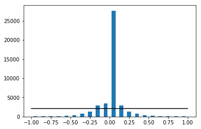
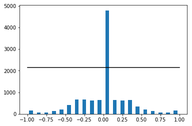
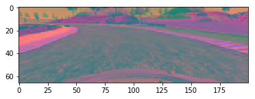
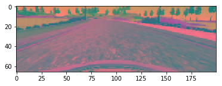
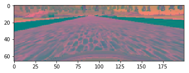

```python
# model change: added lambda layer AND CONvolution2d. added data augmentation and cropping of image
# changing architecture to NVIDIA arch.

#####################################################################################################################
# definition starts
#####################################################################################################################

#pre_process_image - to pre process image
#NVIDIA_ARCH

import csv
import os
import cv2
import matplotlib.pyplot as plt
from random import randint
import numpy as np
from PIL import Image
import numpy as np
%matplotlib inline


from keras.callbacks import ModelCheckpoint, Callback
from keras.models import Sequential, model_from_json
from keras.layers import Dense, Activation, Flatten, Dropout, Lambda
from keras.layers import Convolution2D
from keras.layers.pooling import MaxPooling2D
from keras.layers import Cropping2D
from keras.optimizers import Adam
from keras.callbacks import ModelCheckpoint, Callback
from keras.optimizers import Adam
from sklearn.model_selection import train_test_split
from sklearn.utils import shuffle


def normalize_by_steering_angle(images, steering_angle):
    
    print('chart before steeting angle normalization')
    no_of_bins = 20
    average_samples_per_bin = len(steering_angle)/no_of_bins
    hist,bins = np.histogram(steering_angle,no_of_bins)
    width = 0.5 * (bins[1]- bins[0])
    center = (bins[:-1] + bins[1:])  / 2
    plt.bar(center,hist,align='center',width= width)
    plt.plot((np.min(steering_angle), np.max(steering_angle)), (average_samples_per_bin,average_samples_per_bin), 'k-')
    plt.show()
    
    
    keep_prob = []
    
    delete_list = []
    keep_factor = 0.3   # tune this
    threshold = average_samples_per_bin * keep_factor
    for index in range(no_of_bins):
        if hist[index] < threshold:
            keep_prob.append(1.)   # keep entire data in the bin
        else:
             keep_prob.append(1. * threshold/hist[index])
    for index in range(len(steering_angle)):
        for index1 in range(no_of_bins):
            if (steering_angle[index] > bins[index1]) and (steering_angle[index] <= bins[index1+1]):
                # delete from X and y with probability 1 - keep_probs[j]
                if np.random.rand() > keep_prob[index1]:
                     delete_list.append(index)
    
    images = np.delete(images,delete_list,axis=0)
    steering_angle = np.delete(steering_angle,delete_list)
             
    print('chart after steeting angle normalization')
             
    hist,bins = np.histogram(steering_angle,no_of_bins)
    width = 0.5 * (bins[1]- bins[0])
    center = (bins[:-1] + bins[1:])  / 2
    plt.bar(center,hist,align='center',width= width)
    plt.plot((np.min(steering_angle), np.max(steering_angle)), (average_samples_per_bin,average_samples_per_bin), 'k-')
    plt.show()
             
    return images,steering_angle
    

           
def pre_process_image(image):
    # original shape: 160x320x3
    processed_image = image[40:160,:,:]
    # cropped to 40x320x3
    # apply subtle blur
    #processed_image = cv2.GaussianBlur(processed_image,(3,3),0)
    # reshape to fit the size for NVIDIA
    
    # debugging######################################
    #plt.imshow(image)
    #print("original image shape", image.shape)
    #plt.imshow(processed_image)
    #print("processed image shape", processed_image.shape)
    #destRGB = cv2.cvtColor(processed_image, cv2.COLOR_RGB2BGR)
    #plt.imshow(destRGB)
    #print("BGR image shape", destRGB.shape)
    # debugging######################################
    
    
    
    processed_image = cv2. resize(processed_image,(200,66),interpolation = cv2.INTER_AREA)
     # convert to YUV color space as per NVIDIA requirement
    processed_image = cv2.cvtColor(processed_image, cv2.COLOR_BGR2YUV)
    return processed_image

def generate_data(images,steering_angle,batch_size):
   
    print("generate_data:images",len(images))
    print("generate_data:steering_angle",len(steering_angle))
    print("generate_data:images shape",images.shape)
    print("generate_data:steering_angle shape",steering_angle.shape)
    print('printing from generate_data')
    iter = 1
    images, steering_angle = shuffle(images,steering_angle)
    X,Y = ([],[])
    while True:
        for index in range(len(steering_angle)):
            #debugging##############################
            #print(index)
            #debugging##############################
            X.append(images[index])
            Y.append(steering_angle[index])
            if len(X) == batch_size:
                Xarray = np.asarray(X)
                Yarray = np.asarray(Y)
                print("statement before yield")
                print("array x length - ", len(Xarray))
                print("array x length - ", len(Yarray))
                print("array x shape", Xarray.shape)
                print("array x shape", Yarray.shape)
                print("sending data from generator - iteration", iter)
                iter += 1
                yield (Xarray,Yarray)
                print("statement after yield")
                X, Y = ([],[])
                images, steering_angle = shuffle(images,steering_angle)
                       
                       
 

 #####################################################################################################################   
#Main program starts
#####################################################################################################################


# read files and check if file exists
from pathlib import Path
             

lines = []
with open('./data/driving_log.csv') as csvfile:
    next(csvfile) # if header is available
    reader = csv.reader(csvfile)
    for line in reader:
        lines.append(line)
    print("initial no of one camera images", len(lines))
        
        
images = []
steering_angle = []


for line in lines:
    
# load images and start preprocessing of image
      
    
    source_path = line[0]
    pth, filename = os.path.split(source_path)
    # debugging######################################
    #print("path is ", pth)
    #print("filename is ", filename)
    current_path = './data/img/' + filename
    #print(current_path)
             
# check if the image exists in disk
    myfile = Path(current_path)
    # debugging######################################
    #print("source path is ", pth)
    #print("filename is ", filename)
    # debugging######################################
    if myfile.is_file():         # file exists
        image = cv2.imread(current_path)
        # debugging######################################
        #plt.imshow(image)
        # debugging######################################
        image = pre_process_image(image)
        # flip the images and add flipped images to the original image list
    
        images.append(image)
        angle = float(line[3])
        steering_angle.append(angle)
        # debugging######################################
        #print("angle is ",angle)
        #print('size of images before flipping', len(images))
        #print('size of steering angle before flipping', len(steering_angle))
        # debugging######################################

        image_flipped = np.fliplr(image)
        images.append(image_flipped)
        steering_angle.append(-1. * angle)
        # debugging######################################
        #print('size of images before flipping', len(images))
        #print('size of steering angle before flipping', len(steering_angle))
        # debugging######################################

images, steering_angle = normalize_by_steering_angle(images, steering_angle)  # normalize by steering angle
print("image shape after processing is", images.shape)

       
# print some random images:
print('printing three random images')
for i in range(3):
    randno = randint(0,len(images))
    plt.imshow(images[randno])
    plt.show()
    

# split the data between training and testing
print("splitting the data")
X_train, X_test, Y_train, Y_test     = train_test_split(images, steering_angle, test_size=0.2, random_state=1)
X_train, X_valid, Y_train, Y_valid   = train_test_split(X_train, Y_train, test_size=0.2, random_state=1)
print("length of train data",len(X_train))
print("length of test data",len(X_test))
print("length of validation data",len(X_valid))
print("training dimensions", X_train.shape, Y_train.shape)
print("test dimensions", X_test.shape, Y_test.shape)
print("starting generator")                       
print(X_train[0])


                       
# define generators
train_gen = generate_data(X_train,Y_train, batch_size =50)
val_gen = generate_data(X_valid,Y_valid,   batch_size =50)
test_gen = generate_data(X_test,Y_test,    batch_size =50)
 

# Train the network
# train the model   
                    

model = Sequential()

# Normalize
# compatibility issue
#model.add(Lambda(lambda x: (x /255.0) - 0.5), input_shape = (66,200,3))

model.add(Lambda(lambda x: (x /255.0) - 0.5, input_shape= (66,200,3)))

# add three convolution layers (output depth - 24, 36, and 48; 2x2 stride)
model.add(Convolution2D(24,5,5,subsample =(2,2), activation='relu'))
model.add(Convolution2D(36,5,5,subsample =(2,2), activation='relu'))
model.add(Convolution2D(48,5,5,subsample =(2,2), activation='relu'))

# add dropout
model.add(Dropout(0.5))

 # add two convolution layers (output depth - 64, 64)
model.add(Convolution2D(64,3,3, activation='relu'))
model.add(Convolution2D(64,3,3, activation='relu'))

# add a flatten layer
model.add(Flatten())

# three fully connected layers (depth 120, 80, 10, tanh activation (and dropouts)
model.add(Dense(120, activation='relu'))
model.add(Dense(80, activation='relu'))
model.add(Dense(10, activation='relu'))

# fully connected output layer
model.add(Dense(1))

model.compile(loss='mse', optimizer = 'adam')
 
                      
checkpoint = ModelCheckpoint('model_{epoch:02d}_{val_loss:.2f}.h5')

history = model.fit_generator(train_gen, steps_per_epoch=(len(X_train)/50), validation_data = val_gen,nb_epoch=5, verbose=2, nb_val_samples=len(X_valid), callbacks=[checkpoint])
 
print(model.summary())
                       
# save the model

model.save_weights('./model_wt_5.h5')
model.save('model_5.h5')
json_string = model.to_json()
with open('./model.json', 'w') as f:
     f.write(json_string)
                       


```

    Using TensorFlow backend.
    

    initial no of one camera images 21581
    chart before steeting angle normalization
    





    chart after steeting angle normalization
    





    image shape after processing is (11343, 66, 200, 3)
    printing three random images
    











    splitting the data
    length of train data 7259
    length of test data 2269
    length of validation data 1815
    training dimensions (7259, 66, 200, 3) (7259,)
    test dimensions (2269, 66, 200, 3) (2269,)
    starting generator
    [[[165 112 133]
      [156 112 133]
      [155 111 133]
      ..., 
      [136 121 125]
      [120 122 125]
      [110 122 125]]
    
     [[158 111 132]
      [163 111 132]
      [164 111 133]
      ..., 
      [169 121 125]
      [168 121 125]
      [168 122 125]]
    
     [[166 110 132]
      [165 110 132]
      [161 110 132]
      ..., 
      [177 121 125]
      [178 121 125]
      [177 122 125]]
    
     ..., 
     [[124 123 129]
      [137 123 129]
      [126 123 129]
      ..., 
      [149 121 129]
      [155 121 129]
      [156 121 129]]
    
     [[144 121 129]
      [132 122 129]
      [122 122 129]
      ..., 
      [136 121 129]
      [145 121 129]
      [150 121 129]]
    
     [[136 121 129]
      [140 121 129]
      [133 121 129]
      ..., 
      [121 121 129]
      [130 121 129]
      [142 121 129]]]
    

    /home/carnd/anaconda3/envs/car-behavioral-cloning/lib/python3.6/site-packages/ipykernel_launcher.py:253: UserWarning: Update your `Conv2D` call to the Keras 2 API: `Conv2D(24, (5, 5), activation="relu", strides=(2, 2))`
    /home/carnd/anaconda3/envs/car-behavioral-cloning/lib/python3.6/site-packages/ipykernel_launcher.py:254: UserWarning: Update your `Conv2D` call to the Keras 2 API: `Conv2D(36, (5, 5), activation="relu", strides=(2, 2))`
    /home/carnd/anaconda3/envs/car-behavioral-cloning/lib/python3.6/site-packages/ipykernel_launcher.py:255: UserWarning: Update your `Conv2D` call to the Keras 2 API: `Conv2D(48, (5, 5), activation="relu", strides=(2, 2))`
    /home/carnd/anaconda3/envs/car-behavioral-cloning/lib/python3.6/site-packages/ipykernel_launcher.py:261: UserWarning: Update your `Conv2D` call to the Keras 2 API: `Conv2D(64, (3, 3), activation="relu")`
    /home/carnd/anaconda3/envs/car-behavioral-cloning/lib/python3.6/site-packages/ipykernel_launcher.py:262: UserWarning: Update your `Conv2D` call to the Keras 2 API: `Conv2D(64, (3, 3), activation="relu")`
    /home/carnd/anaconda3/envs/car-behavioral-cloning/lib/python3.6/site-packages/ipykernel_launcher.py:280: UserWarning: The semantics of the Keras 2 argument `steps_per_epoch` is not the same as the Keras 1 argument `samples_per_epoch`. `steps_per_epoch` is the number of batches to draw from the generator at each epoch. Basically steps_per_epoch = samples_per_epoch/batch_size. Similarly `nb_val_samples`->`validation_steps` and `val_samples`->`steps` arguments have changed. Update your method calls accordingly.
    /home/carnd/anaconda3/envs/car-behavioral-cloning/lib/python3.6/site-packages/ipykernel_launcher.py:280: UserWarning: Update your `fit_generator` call to the Keras 2 API: `fit_generator(<generator..., steps_per_epoch=145.18, validation_data=<generator..., verbose=2, callbacks=[<keras.ca..., epochs=5, validation_steps=1815)`
    

    generate_data:images 7259
    generate_data:steering_angle 7259
    generate_data:images shape (7259, 66, 200, 3)
    generate_data:steering_angle shape (7259,)
    printing from generate_data
    Epoch 1/5
    statement before yield
    array x length -  50
    array x length -  50
    array x shape (50, 66, 200, 3)
    array x shape (50,)
    sending data from generator - iteration 1
    statement after yield
    statement before yield
    array x length -  50
    array x length -  50
    array x shape (50, 66, 200, 3)
    array x shape (50,)
    sending data from generator - iteration 2
    statement after yield
    statement before yield
    array x length -  50
    array x length -  50
    array x shape (50, 66, 200, 3)
    array x shape (50,)
    sending data from generator - iteration 3
    statement after yield
    statement before yield
    array x length -  50
    array x length -  50
    array x shape (50, 66, 200, 3)
    array x shape (50,)
    sending data from generator - iteration 4
    statement after yield
    statement before yield
    array x length -  50
    array x length -  50
    array x shape (50, 66, 200, 3)
    array x shape (50,)
    sending data from generator - iteration 5
    statement after yield
    statement before yield
    array x length -  50
    array x length -  50
    array x shape (50, 66, 200, 3)
    array x shape (50,)
    sending data from generator - iteration 6
    statement after yield
    statement before yield
    array x length -  50
    array x length -  50
    array x shape (50, 66, 200, 3)
    array x shape (50,)
    sending data from generator - iteration 7
    statement after yield
    statement before yield
    array x length -  50
    array x length -  50
    array x shape (50, 66, 200, 3)
    array x shape (50,)
    sending data from generator - iteration 8
    statement after yield
    statement before yield
    array x length -  50
    array x length -  50
    array x shape (50, 66, 200, 3)
    array x shape (50,)
    sending data from generator - iteration 9
    statement after yield
    statement before yield
    array x length -  50
    array x length -  50
    array x shape (50, 66, 200, 3)
    array x shape (50,)
    sending data from generator - iteration 10
    statement after yield
    statement before yield
    array x length -  50
    array x length -  50
    array x shape (50, 66, 200, 3)
    array x shape (50,)
    sending data from generator - iteration 11
    statement after yield
    statement before yield
    array x length -  50
    array x length -  50
    array x shape (50, 66, 200, 3)
    array x shape (50,)
    sending data from generator - iteration 12
    statement after yield
    statement before yield
    array x length -  50
    array x length -  50
    array x shape (50, 66, 200, 3)
    array x shape (50,)
    sending data from generator - iteration 13
    statement after yield
    statement before yield
    array x length -  50
    array x length -  50
    array x shape (50, 66, 200, 3)
    array x shape (50,)
    sending data from generator - iteration 14
    statement after yield
    statement before yield
    array x length -  50
    array x length -  50
    array x shape (50, 66, 200, 3)
    array x shape (50,)
    sending data from generator - iteration 15
    statement after yield
    statement before yield
    array x length -  50
    array x length -  50
    array x shape (50, 66, 200, 3)
    array x shape (50,)
    sending data from generator - iteration 16
    statement after yield
    statement before yield
    array x length -  50
    array x length -  50
    array x shape (50, 66, 200, 3)
    array x shape (50,)
    sending data from generator - iteration 17
    statement after yield
    statement before yield
    array x length -  50
    array x length -  50
    array x shape (50, 66, 200, 3)
    array x shape (50,)
    sending data from generator - iteration 18
    statement after yield
    statement before yield
    array x length -  50
    array x length -  50
    array x shape (50, 66, 200, 3)
    array x shape (50,)
    sending data from generator - iteration 19
    statement after yield
    statement before yield
    array x length -  50
    array x length -  50
    array x shape (50, 66, 200, 3)
    array x shape (50,)
    sending data from generator - iteration 20
    statement after yield
    statement before yield
    array x length -  50
    array x length -  50
    array x shape (50, 66, 200, 3)
    array x shape (50,)
    sending data from generator - iteration 21
    statement after yield
    statement before yield
    array x length -  50
    array x length -  50
    array x shape (50, 66, 200, 3)
    array x shape (50,)
    sending data from generator - iteration 22
    statement after yield
    statement before yield
    array x length -  50
    array x length -  50
    array x shape (50, 66, 200, 3)
    array x shape (50,)
    sending data from generator - iteration 23
    statement after yield
    statement before yield
    array x length -  50
    array x length -  50
    array x shape (50, 66, 200, 3)
    array x shape (50,)
    sending data from generator - iteration 24
    statement after yield
    statement before yield
    array x length -  50
    array x length -  50
    array x shape (50, 66, 200, 3)
    array x shape (50,)
    sending data from generator - iteration 25
    statement after yield
    statement before yield
    array x length -  50
    array x length -  50
    array x shape (50, 66, 200, 3)
    array x shape (50,)
    sending data from generator - iteration 26
    statement after yield
    statement before yield
    array x length -  50
    array x length -  50
    array x shape (50, 66, 200, 3)
    array x shape (50,)
    sending data from generator - iteration 27
    statement after yield
    statement before yield
    array x length -  50
    array x length -  50
    array x shape (50, 66, 200, 3)
    array x shape (50,)
    sending data from generator - iteration 28
    statement after yield
    statement before yield
    array x length -  50
    array x length -  50
    array x shape (50, 66, 200, 3)
    array x shape (50,)
    sending data from generator - iteration 29
    statement after yield
    statement before yield
    array x length -  50
    array x length -  50
    array x shape (50, 66, 200, 3)
    array x shape (50,)
    sending data from generator - iteration 30
    statement after yield
    statement before yield
    array x length -  50
    array x length -  50
    array x shape (50, 66, 200, 3)
    array x shape (50,)
    sending data from generator - iteration 31
    statement after yield
    statement before yield
    array x length -  50
    array x length -  50
    array x shape (50, 66, 200, 3)
    array x shape (50,)
    sending data from generator - iteration 32
    statement after yield
    statement before yield
    array x length -  50
    array x length -  50
    array x shape (50, 66, 200, 3)
    array x shape (50,)
    sending data from generator - iteration 33
    statement after yield
    statement before yield
    array x length -  50
    array x length -  50
    array x shape (50, 66, 200, 3)
    array x shape (50,)
    sending data from generator - iteration 34
    statement after yield
    statement before yield
    array x length -  50
    array x length -  50
    array x shape (50, 66, 200, 3)
    array x shape (50,)
    sending data from generator - iteration 35
    statement after yield
    statement before yield
    array x length -  50
    array x length -  50
    array x shape (50, 66, 200, 3)
    array x shape (50,)
    sending data from generator - iteration 36
    statement after yield
    statement before yield
    array x length -  50
    array x length -  50
    array x shape (50, 66, 200, 3)
    array x shape (50,)
    sending data from generator - iteration 37
    statement after yield
    statement before yield
    array x length -  50
    array x length -  50
    array x shape (50, 66, 200, 3)
    array x shape (50,)
    sending data from generator - iteration 38
    statement after yield
    statement before yield
    array x length -  50
    array x length -  50
    array x shape (50, 66, 200, 3)
    array x shape (50,)
    sending data from generator - iteration 39
    statement after yield
    statement before yield
    array x length -  50
    array x length -  50
    array x shape (50, 66, 200, 3)
    array x shape (50,)
    sending data from generator - iteration 40
    statement after yield
    statement before yield
    array x length -  50
    array x length -  50
    array x shape (50, 66, 200, 3)
    array x shape (50,)
    sending data from generator - iteration 41
    statement after yield
    statement before yield
    array x length -  50
    array x length -  50
    array x shape (50, 66, 200, 3)
    array x shape (50,)
    sending data from generator - iteration 42
    statement after yield
    statement before yield
    array x length -  50
    array x length -  50
    array x shape (50, 66, 200, 3)
    array x shape (50,)
    sending data from generator - iteration 43
    statement after yield
    statement before yield
    array x length -  50
    array x length -  50
    array x shape (50, 66, 200, 3)
    array x shape (50,)
    sending data from generator - iteration 44
    statement after yield
    statement before yield
    array x length -  50
    array x length -  50
    array x shape (50, 66, 200, 3)
    array x shape (50,)
    sending data from generator - iteration 45
    statement after yield
    statement before yield
    array x length -  50
    array x length -  50
    array x shape (50, 66, 200, 3)
    array x shape (50,)
    sending data from generator - iteration 46
    statement after yield
    statement before yield
    array x length -  50
    array x length -  50
    array x shape (50, 66, 200, 3)
    array x shape (50,)
    sending data from generator - iteration 47
    statement after yield
    statement before yield
    array x length -  50
    array x length -  50
    array x shape (50, 66, 200, 3)
    array x shape (50,)
    sending data from generator - iteration 48
    statement after yield
    statement before yield
    array x length -  50
    array x length -  50
    array x shape (50, 66, 200, 3)
    array x shape (50,)
    sending data from generator - iteration 49
    statement after yield
    statement before yield
    array x length -  50
    array x length -  50
    array x shape (50, 66, 200, 3)
    array x shape (50,)
    sending data from generator - iteration 50
    statement after yield
    statement before yield
    array x length -  50
    array x length -  50
    array x shape (50, 66, 200, 3)
    array x shape (50,)
    sending data from generator - iteration 51
    statement after yield
    statement before yield
    array x length -  50
    array x length -  50
    array x shape (50, 66, 200, 3)
    array x shape (50,)
    sending data from generator - iteration 52
    statement after yield
    statement before yield
    array x length -  50
    array x length -  50
    array x shape (50, 66, 200, 3)
    array x shape (50,)
    sending data from generator - iteration 53
    statement after yield
    statement before yield
    array x length -  50
    array x length -  50
    array x shape (50, 66, 200, 3)
    array x shape (50,)
    sending data from generator - iteration 54
    statement after yield
    statement before yield
    array x length -  50
    array x length -  50
    array x shape (50, 66, 200, 3)
    array x shape (50,)
    sending data from generator - iteration 55
    statement after yield
    statement before yield
    array x length -  50
    array x length -  50
    array x shape (50, 66, 200, 3)
    array x shape (50,)
    sending data from generator - iteration 56
    statement after yield
    statement before yield
    array x length -  50
    array x length -  50
    array x shape (50, 66, 200, 3)
    array x shape (50,)
    sending data from generator - iteration 57
    statement after yield
    statement before yield
    array x length -  50
    array x length -  50
    array x shape (50, 66, 200, 3)
    array x shape (50,)
    sending data from generator - iteration 58
    statement after yield
    statement before yield
    array x length -  50
    array x length -  50
    array x shape (50, 66, 200, 3)
    array x shape (50,)
    sending data from generator - iteration 59
    statement after yield
    statement before yield
    array x length -  50
    array x length -  50
    array x shape (50, 66, 200, 3)
    array x shape (50,)
    sending data from generator - iteration 60
    statement after yield
    statement before yield
    array x length -  50
    array x length -  50
    array x shape (50, 66, 200, 3)
    array x shape (50,)
    sending data from generator - iteration 61
    statement after yield
    statement before yield
    array x length -  50
    array x length -  50
    array x shape (50, 66, 200, 3)
    array x shape (50,)
    sending data from generator - iteration 62
    statement after yield
    statement before yield
    array x length -  50
    array x length -  50
    array x shape (50, 66, 200, 3)
    array x shape (50,)
    sending data from generator - iteration 63
    statement after yield
    statement before yield
    array x length -  50
    array x length -  50
    array x shape (50, 66, 200, 3)
    array x shape (50,)
    sending data from generator - iteration 64
    statement after yield
    statement before yield
    array x length -  50
    array x length -  50
    array x shape (50, 66, 200, 3)
    array x shape (50,)
    sending data from generator - iteration 65
    statement after yield
    statement before yield
    array x length -  50
    array x length -  50
    array x shape (50, 66, 200, 3)
    array x shape (50,)
    sending data from generator - iteration 66
    statement after yield
    statement before yield
    array x length -  50
    array x length -  50
    array x shape (50, 66, 200, 3)
    array x shape (50,)
    sending data from generator - iteration 67
    statement after yield
    statement before yield
    array x length -  50
    array x length -  50
    array x shape (50, 66, 200, 3)
    array x shape (50,)
    sending data from generator - iteration 68
    statement after yield
    statement before yield
    array x length -  50
    array x length -  50
    array x shape (50, 66, 200, 3)
    array x shape (50,)
    sending data from generator - iteration 69
    statement after yield
    statement before yield
    array x length -  50
    array x length -  50
    array x shape (50, 66, 200, 3)
    array x shape (50,)
    sending data from generator - iteration 70
    statement after yield
    statement before yield
    array x length -  50
    array x length -  50
    array x shape (50, 66, 200, 3)
    array x shape (50,)
    sending data from generator - iteration 71
    statement after yield
    statement before yield
    array x length -  50
    array x length -  50
    array x shape (50, 66, 200, 3)
    array x shape (50,)
    sending data from generator - iteration 72
    statement after yield
    statement before yield
    array x length -  50
    array x length -  50
    array x shape (50, 66, 200, 3)
    array x shape (50,)
    sending data from generator - iteration 73
    statement after yield
    statement before yield
    array x length -  50
    array x length -  50
    array x shape (50, 66, 200, 3)
    array x shape (50,)
    sending data from generator - iteration 74
    statement after yield
    statement before yield
    array x length -  50
    array x length -  50
    array x shape (50, 66, 200, 3)
    array x shape (50,)
    sending data from generator - iteration 75
    statement after yield
    statement before yield
    array x length -  50
    array x length -  50
    array x shape (50, 66, 200, 3)
    array x shape (50,)
    sending data from generator - iteration 76
    statement after yield
    statement before yield
    array x length -  50
    array x length -  50
    array x shape (50, 66, 200, 3)
    array x shape (50,)
    sending data from generator - iteration 77
    statement after yield
    statement before yield
    array x length -  50
    array x length -  50
    array x shape (50, 66, 200, 3)
    array x shape (50,)
    sending data from generator - iteration 78
    statement after yield
    statement before yield
    array x length -  50
    array x length -  50
    array x shape (50, 66, 200, 3)
    array x shape (50,)
    sending data from generator - iteration 79
    statement after yield
    statement before yield
    array x length -  50
    array x length -  50
    array x shape (50, 66, 200, 3)
    array x shape (50,)
    sending data from generator - iteration 80
    statement after yield
    statement before yield
    array x length -  50
    array x length -  50
    array x shape (50, 66, 200, 3)
    array x shape (50,)
    sending data from generator - iteration 81
    statement after yield
    statement before yield
    array x length -  50
    array x length -  50
    array x shape (50, 66, 200, 3)
    array x shape (50,)
    sending data from generator - iteration 82
    statement after yield
    statement before yield
    array x length -  50
    array x length -  50
    array x shape (50, 66, 200, 3)
    array x shape (50,)
    sending data from generator - iteration 83
    statement after yield
    statement before yield
    array x length -  50
    array x length -  50
    array x shape (50, 66, 200, 3)
    array x shape (50,)
    sending data from generator - iteration 84
    statement after yield
    statement before yield
    array x length -  50
    array x length -  50
    array x shape (50, 66, 200, 3)
    array x shape (50,)
    sending data from generator - iteration 85
    statement after yield
    statement before yield
    array x length -  50
    array x length -  50
    array x shape (50, 66, 200, 3)
    array x shape (50,)
    sending data from generator - iteration 86
    statement after yield
    statement before yield
    array x length -  50
    array x length -  50
    array x shape (50, 66, 200, 3)
    array x shape (50,)
    sending data from generator - iteration 87
    statement after yield
    statement before yield
    array x length -  50
    array x length -  50
    array x shape (50, 66, 200, 3)
    array x shape (50,)
    sending data from generator - iteration 88
    statement after yield
    statement before yield
    array x length -  50
    array x length -  50
    array x shape (50, 66, 200, 3)
    array x shape (50,)
    sending data from generator - iteration 89
    statement after yield
    statement before yield
    array x length -  50
    array x length -  50
    array x shape (50, 66, 200, 3)
    array x shape (50,)
    sending data from generator - iteration 90
    statement after yield
    statement before yield
    array x length -  50
    array x length -  50
    array x shape (50, 66, 200, 3)
    array x shape (50,)
    sending data from generator - iteration 91
    statement after yield
    statement before yield
    array x length -  50
    array x length -  50
    array x shape (50, 66, 200, 3)
    array x shape (50,)
    sending data from generator - iteration 92
    statement after yield
    statement before yield
    array x length -  50
    array x length -  50
    array x shape (50, 66, 200, 3)
    array x shape (50,)
    sending data from generator - iteration 93
    statement after yield
    statement before yield
    array x length -  50
    array x length -  50
    array x shape (50, 66, 200, 3)
    array x shape (50,)
    sending data from generator - iteration 94
    statement after yield
    statement before yield
    array x length -  50
    array x length -  50
    array x shape (50, 66, 200, 3)
    array x shape (50,)
    sending data from generator - iteration 95
    statement after yield
    statement before yield
    array x length -  50
    array x length -  50
    array x shape (50, 66, 200, 3)
    array x shape (50,)
    sending data from generator - iteration 96
    statement after yield
    statement before yield
    array x length -  50
    array x length -  50
    array x shape (50, 66, 200, 3)
    array x shape (50,)
    sending data from generator - iteration 97
    statement after yield
    statement before yield
    array x length -  50
    array x length -  50
    array x shape (50, 66, 200, 3)
    array x shape (50,)
    sending data from generator - iteration 98
    statement after yield
    statement before yield
    array x length -  50
    array x length -  50
    array x shape (50, 66, 200, 3)
    array x shape (50,)
    sending data from generator - iteration 99
    statement after yield
    statement before yield
    array x length -  50
    array x length -  50
    array x shape (50, 66, 200, 3)
    array x shape (50,)
    sending data from generator - iteration 100
    statement after yield
    statement before yield
    array x length -  50
    array x length -  50
    array x shape (50, 66, 200, 3)
    array x shape (50,)
    sending data from generator - iteration 101
    statement after yield
    statement before yield
    array x length -  50
    array x length -  50
    array x shape (50, 66, 200, 3)
    array x shape (50,)
    sending data from generator - iteration 102
    statement after yield
    statement before yield
    array x length -  50
    array x length -  50
    array x shape (50, 66, 200, 3)
    array x shape (50,)
    sending data from generator - iteration 103
    statement after yield
    statement before yield
    array x length -  50
    array x length -  50
    array x shape (50, 66, 200, 3)
    array x shape (50,)
    sending data from generator - iteration 104
    statement after yield
    statement before yield
    array x length -  50
    array x length -  50
    array x shape (50, 66, 200, 3)
    array x shape (50,)
    sending data from generator - iteration 105
    statement after yield
    statement before yield
    array x length -  50
    array x length -  50
    array x shape (50, 66, 200, 3)
    array x shape (50,)
    sending data from generator - iteration 106
    statement after yield
    statement before yield
    array x length -  50
    array x length -  50
    array x shape (50, 66, 200, 3)
    array x shape (50,)
    sending data from generator - iteration 107
    statement after yield
    statement before yield
    array x length -  50
    array x length -  50
    array x shape (50, 66, 200, 3)
    array x shape (50,)
    sending data from generator - iteration 108
    statement after yield
    statement before yield
    array x length -  50
    array x length -  50
    array x shape (50, 66, 200, 3)
    array x shape (50,)
    sending data from generator - iteration 109
    statement after yield
    statement before yield
    array x length -  50
    array x length -  50
    array x shape (50, 66, 200, 3)
    array x shape (50,)
    sending data from generator - iteration 110
    statement after yield
    statement before yield
    array x length -  50
    array x length -  50
    array x shape (50, 66, 200, 3)
    array x shape (50,)
    sending data from generator - iteration 111
    statement after yield
    statement before yield
    array x length -  50
    array x length -  50
    array x shape (50, 66, 200, 3)
    array x shape (50,)
    sending data from generator - iteration 112
    statement after yield
    statement before yield
    array x length -  50
    array x length -  50
    array x shape (50, 66, 200, 3)
    array x shape (50,)
    sending data from generator - iteration 113
    statement after yield
    statement before yield
    array x length -  50
    array x length -  50
    array x shape (50, 66, 200, 3)
    array x shape (50,)
    sending data from generator - iteration 114
    statement after yield
    statement before yield
    array x length -  50
    array x length -  50
    array x shape (50, 66, 200, 3)
    array x shape (50,)
    sending data from generator - iteration 115
    statement after yield
    statement before yield
    array x length -  50
    array x length -  50
    array x shape (50, 66, 200, 3)
    array x shape (50,)
    sending data from generator - iteration 116
    statement after yield
    statement before yield
    array x length -  50
    array x length -  50
    array x shape (50, 66, 200, 3)
    array x shape (50,)
    sending data from generator - iteration 117
    statement after yield
    statement before yield
    array x length -  50
    array x length -  50
    array x shape (50, 66, 200, 3)
    array x shape (50,)
    sending data from generator - iteration 118
    statement after yield
    statement before yield
    array x length -  50
    array x length -  50
    array x shape (50, 66, 200, 3)
    array x shape (50,)
    sending data from generator - iteration 119
    statement after yield
    statement before yield
    array x length -  50
    array x length -  50
    array x shape (50, 66, 200, 3)
    array x shape (50,)
    sending data from generator - iteration 120
    statement after yield
    statement before yield
    array x length -  50
    array x length -  50
    array x shape (50, 66, 200, 3)
    array x shape (50,)
    sending data from generator - iteration 121
    statement after yield
    statement before yield
    array x length -  50
    array x length -  50
    array x shape (50, 66, 200, 3)
    array x shape (50,)
    sending data from generator - iteration 122
    statement after yield
    statement before yield
    array x length -  50
    array x length -  50
    array x shape (50, 66, 200, 3)
    array x shape (50,)
    sending data from generator - iteration 123
    statement after yield
    statement before yield
    array x length -  50
    array x length -  50
    array x shape (50, 66, 200, 3)
    array x shape (50,)
    sending data from generator - iteration 124
    statement after yield
    statement before yield
    array x length -  50
    array x length -  50
    array x shape (50, 66, 200, 3)
    array x shape (50,)
    sending data from generator - iteration 125
    statement after yield
    statement before yield
    array x length -  50
    array x length -  50
    array x shape (50, 66, 200, 3)
    array x shape (50,)
    sending data from generator - iteration 126
    statement after yield
    statement before yield
    array x length -  50
    array x length -  50
    array x shape (50, 66, 200, 3)
    array x shape (50,)
    sending data from generator - iteration 127
    statement after yield
    statement before yield
    array x length -  50
    array x length -  50
    array x shape (50, 66, 200, 3)
    array x shape (50,)
    sending data from generator - iteration 128
    statement after yield
    statement before yield
    array x length -  50
    array x length -  50
    array x shape (50, 66, 200, 3)
    array x shape (50,)
    sending data from generator - iteration 129
    statement after yield
    statement before yield
    array x length -  50
    array x length -  50
    array x shape (50, 66, 200, 3)
    array x shape (50,)
    sending data from generator - iteration 130
    statement after yield
    statement before yield
    array x length -  50
    array x length -  50
    array x shape (50, 66, 200, 3)
    array x shape (50,)
    sending data from generator - iteration 131
    statement after yield
    statement before yield
    array x length -  50
    array x length -  50
    array x shape (50, 66, 200, 3)
    array x shape (50,)
    sending data from generator - iteration 132
    statement after yield
    statement before yield
    array x length -  50
    array x length -  50
    array x shape (50, 66, 200, 3)
    array x shape (50,)
    sending data from generator - iteration 133
    statement after yield
    statement before yield
    array x length -  50
    array x length -  50
    array x shape (50, 66, 200, 3)
    array x shape (50,)
    sending data from generator - iteration 134
    statement after yield
    statement before yield
    array x length -  50
    array x length -  50
    array x shape (50, 66, 200, 3)
    array x shape (50,)
    sending data from generator - iteration 135
    statement after yield
    statement before yield
    array x length -  50
    array x length -  50
    array x shape (50, 66, 200, 3)
    array x shape (50,)
    sending data from generator - iteration 136
    statement after yield
    statement before yield
    array x length -  50
    array x length -  50
    array x shape (50, 66, 200, 3)
    array x shape (50,)
    sending data from generator - iteration 137
    statement after yield
    statement before yield
    array x length -  50
    array x length -  50
    array x shape (50, 66, 200, 3)
    array x shape (50,)
    sending data from generator - iteration 138
    statement after yield
    statement before yield
    array x length -  50
    array x length -  50
    array x shape (50, 66, 200, 3)
    array x shape (50,)
    sending data from generator - iteration 139
    statement after yield
    statement before yield
    array x length -  50
    array x length -  50
    array x shape (50, 66, 200, 3)
    array x shape (50,)
    sending data from generator - iteration 140
    statement after yield
    statement before yield
    array x length -  50
    array x length -  50
    array x shape (50, 66, 200, 3)
    array x shape (50,)
    sending data from generator - iteration 141
    statement after yield
    statement before yield
    array x length -  50
    array x length -  50
    array x shape (50, 66, 200, 3)
    array x shape (50,)
    sending data from generator - iteration 142
    statement after yield
    statement before yield
    array x length -  50
    array x length -  50
    array x shape (50, 66, 200, 3)
    array x shape (50,)
    sending data from generator - iteration 143
    statement after yield
    statement before yield
    array x length -  50
    array x length -  50
    array x shape (50, 66, 200, 3)
    array x shape (50,)
    sending data from generator - iteration 144
    statement after yield
    statement before yield
    array x length -  50
    array x length -  50
    array x shape (50, 66, 200, 3)
    array x shape (50,)
    sending data from generator - iteration 145
    statement after yield
    statement before yield
    array x length -  50
    array x length -  50
    array x shape (50, 66, 200, 3)
    array x shape (50,)
    sending data from generator - iteration 146
    statement after yield
    generate_data:images 1815
    generate_data:steering_angle 1815
    generate_data:images shape (1815, 66, 200, 3)
    generate_data:steering_angle shape (1815,)
    printing from generate_data
    statement before yield
    array x length -  50
    array x length -  50
    array x shape (50, 66, 200, 3)
    array x shape (50,)
    sending data from generator - iteration 1
    statement after yield
    statement before yield
    array x length -  50
    array x length -  50
    array x shape (50, 66, 200, 3)
    array x shape (50,)
    sending data from generator - iteration 147
    statement after yield
    statement before yield
    array x length -  50
    array x length -  50
    array x shape (50, 66, 200, 3)
    array x shape (50,)
    sending data from generator - iteration 2
    statement after yield
    statement before yield
    array x length -  50
    array x length -  50
    array x shape (50, 66, 200, 3)
    array x shape (50,)
    sending data from generator - iteration 3
    statement after yield
    statement before yield
    array x length -  50
    array x length -  50
    array x shape (50, 66, 200, 3)
    array x shape (50,)
    sending data from generator - iteration 4
    statement after yield
    statement before yield
    array x length -  50
    array x length -  50
    array x shape (50, 66, 200, 3)
    array x shape (50,)
    sending data from generator - iteration 5
    statement after yield
    statement before yield
    array x length -  50
    array x length -  50
    array x shape (50, 66, 200, 3)
    array x shape (50,)
    sending data from generator - iteration 148
    statement after yield
    statement before yield
    array x length -  50
    array x length -  50
    array x shape (50, 66, 200, 3)
    array x shape (50,)
    sending data from generator - iteration 6
    statement after yield
    statement before yield
    array x length -  50
    array x length -  50
    array x shape (50, 66, 200, 3)
    array x shape (50,)
    sending data from generator - iteration 7
    statement after yield
    statement before yield
    array x length -  50
    array x length -  50
    array x shape (50, 66, 200, 3)
    array x shape (50,)
    sending data from generator - iteration 8
    statement after yield
    statement before yield
    array x length -  50
    array x length -  50
    array x shape (50, 66, 200, 3)
    array x shape (50,)
    sending data from generator - iteration 9
    statement after yield
    statement before yield
    array x length -  50
    array x length -  50
    array x shape (50, 66, 200, 3)
    array x shape (50,)
    sending data from generator - iteration 149
    statement after yield
    statement before yield
    array x length -  50
    array x length -  50
    array x shape (50, 66, 200, 3)
    array x shape (50,)
    sending data from generator - iteration 10
    statement after yield
    statement before yield
    array x length -  50
    array x length -  50
    array x shape (50, 66, 200, 3)
    array x shape (50,)
    sending data from generator - iteration 11
    statement after yield
    statement before yield
    array x length -  50
    array x length -  50
    array x shape (50, 66, 200, 3)
    array x shape (50,)
    sending data from generator - iteration 12
    statement after yield
    statement before yield
    array x length -  50
    array x length -  50
    array x shape (50, 66, 200, 3)
    array x shape (50,)
    sending data from generator - iteration 13
    statement after yield
    statement before yield
    array x length -  50
    array x length -  50
    array x shape (50, 66, 200, 3)
    array x shape (50,)
    sending data from generator - iteration 150
    statement after yield
    statement before yield
    array x length -  50
    array x length -  50
    array x shape (50, 66, 200, 3)
    array x shape (50,)
    sending data from generator - iteration 14
    statement after yield
    statement before yield
    array x length -  50
    array x length -  50
    array x shape (50, 66, 200, 3)
    array x shape (50,)
    sending data from generator - iteration 15
    statement after yield
    statement before yield
    array x length -  50
    array x length -  50
    array x shape (50, 66, 200, 3)
    array x shape (50,)
    sending data from generator - iteration 16
    statement after yield
    statement before yield
    array x length -  50
    array x length -  50
    array x shape (50, 66, 200, 3)
    array x shape (50,)
    sending data from generator - iteration 17
    statement after yield
    statement before yield
    array x length -  50
    array x length -  50
    array x shape (50, 66, 200, 3)
    array x shape (50,)
    sending data from generator - iteration 151
    statement after yield
    statement before yield
    array x length -  50
    array x length -  50
    array x shape (50, 66, 200, 3)
    array x shape (50,)
    sending data from generator - iteration 18
    statement after yield
    statement before yield
    array x length -  50
    array x length -  50
    array x shape (50, 66, 200, 3)
    array x shape (50,)
    sending data from generator - iteration 19
    statement after yield
    statement before yield
    array x length -  50
    array x length -  50
    array x shape (50, 66, 200, 3)
    array x shape (50,)
    sending data from generator - iteration 20
    statement after yield
    statement before yield
    array x length -  50
    array x length -  50
    array x shape (50, 66, 200, 3)
    array x shape (50,)
    sending data from generator - iteration 152
    statement after yield
    statement before yield
    array x length -  50
    array x length -  50
    array x shape (50, 66, 200, 3)
    array x shape (50,)
    sending data from generator - iteration 21
    statement after yield
    statement before yield
    array x length -  50
    array x length -  50
    array x shape (50, 66, 200, 3)
    array x shape (50,)
    sending data from generator - iteration 22
    statement after yield
    statement before yield
    array x length -  50
    array x length -  50
    array x shape (50, 66, 200, 3)
    array x shape (50,)
    sending data from generator - iteration 23
    statement after yield
    statement before yield
    array x length -  50
    array x length -  50
    array x shape (50, 66, 200, 3)
    array x shape (50,)
    sending data from generator - iteration 24
    statement after yield
    statement before yield
    array x length -  50
    array x length -  50
    array x shape (50, 66, 200, 3)
    array x shape (50,)
    sending data from generator - iteration 153
    statement after yield
    statement before yield
    array x length -  50
    array x length -  50
    array x shape (50, 66, 200, 3)
    array x shape (50,)
    sending data from generator - iteration 25
    statement after yield
    statement before yield
    array x length -  50
    array x length -  50
    array x shape (50, 66, 200, 3)
    array x shape (50,)
    sending data from generator - iteration 26
    statement after yield
    statement before yield
    array x length -  50
    array x length -  50
    array x shape (50, 66, 200, 3)
    array x shape (50,)
    sending data from generator - iteration 27
    statement after yield
    statement before yield
    array x length -  50
    array x length -  50
    array x shape (50, 66, 200, 3)
    array x shape (50,)
    sending data from generator - iteration 28
    statement after yield
    statement before yield
    array x length -  50
    array x length -  50
    array x shape (50, 66, 200, 3)
    array x shape (50,)
    sending data from generator - iteration 154
    statement after yield
    statement before yield
    array x length -  50
    array x length -  50
    array x shape (50, 66, 200, 3)
    array x shape (50,)
    sending data from generator - iteration 29
    statement after yield
    statement before yield
    array x length -  50
    array x length -  50
    array x shape (50, 66, 200, 3)
    array x shape (50,)
    sending data from generator - iteration 30
    statement after yield
    statement before yield
    array x length -  50
    array x length -  50
    array x shape (50, 66, 200, 3)
    array x shape (50,)
    sending data from generator - iteration 31
    statement after yield
    statement before yield
    array x length -  50
    array x length -  50
    array x shape (50, 66, 200, 3)
    array x shape (50,)
    sending data from generator - iteration 32
    statement after yield
    statement before yield
    array x length -  50
    array x length -  50
    array x shape (50, 66, 200, 3)
    array x shape (50,)
    sending data from generator - iteration 155
    statement after yield
    statement before yield
    array x length -  50
    array x length -  50
    array x shape (50, 66, 200, 3)
    array x shape (50,)
    sending data from generator - iteration 33
    statement after yield
    statement before yield
    array x length -  50
    array x length -  50
    array x shape (50, 66, 200, 3)
    array x shape (50,)
    sending data from generator - iteration 34
    statement after yield
    statement before yield
    array x length -  50
    array x length -  50
    array x shape (50, 66, 200, 3)
    array x shape (50,)
    sending data from generator - iteration 35
    statement after yield
    statement before yield
    array x length -  50
    array x length -  50
    array x shape (50, 66, 200, 3)
    array x shape (50,)
    sending data from generator - iteration 156
    statement before yield
    array x length -  50
    array x length -  50
    array x shape (50, 66, 200, 3)
    array x shape (50,)
    sending data from generator - iteration 36
    statement after yield
    statement before yield
    array x length -  50
    array x length -  50
    array x shape (50, 66, 200, 3)
    array x shape (50,)
    sending data from generator - iteration 37
    statement after yield
    statement before yield
    array x length -  50
    array x length -  50
    array x shape (50, 66, 200, 3)
    array x shape (50,)
    sending data from generator - iteration 38
    statement after yield
    statement before yield
    array x length -  50
    array x length -  50
    array x shape (50, 66, 200, 3)
    array x shape (50,)
    sending data from generator - iteration 39
    statement after yield
    statement before yield
    array x length -  50
    array x length -  50
    array x shape (50, 66, 200, 3)
    array x shape (50,)
    sending data from generator - iteration 40
    statement after yield
    statement before yield
    array x length -  50
    array x length -  50
    array x shape (50, 66, 200, 3)
    array x shape (50,)
    sending data from generator - iteration 41
    statement after yield
    statement before yield
    array x length -  50
    array x length -  50
    array x shape (50, 66, 200, 3)
    array x shape (50,)
    sending data from generator - iteration 42
    statement after yield
    statement before yield
    array x length -  50
    array x length -  50
    array x shape (50, 66, 200, 3)
    array x shape (50,)
    sending data from generator - iteration 43
    statement after yield
    statement before yield
    array x length -  50
    array x length -  50
    array x shape (50, 66, 200, 3)
    array x shape (50,)
    sending data from generator - iteration 44
    statement after yield
    statement before yield
    array x length -  50
    array x length -  50
    array x shape (50, 66, 200, 3)
    array x shape (50,)
    sending data from generator - iteration 45
    statement after yield
    statement before yield
    array x length -  50
    array x length -  50
    array x shape (50, 66, 200, 3)
    array x shape (50,)
    sending data from generator - iteration 46
    statement after yield
    statement before yield
    array x length -  50
    array x length -  50
    array x shape (50, 66, 200, 3)
    array x shape (50,)
    sending data from generator - iteration 47
    statement after yield
    statement before yield
    array x length -  50
    array x length -  50
    array x shape (50, 66, 200, 3)
    array x shape (50,)
    sending data from generator - iteration 48
    statement after yield
    statement before yield
    array x length -  50
    array x length -  50
    array x shape (50, 66, 200, 3)
    array x shape (50,)
    sending data from generator - iteration 49
    statement after yield
    statement before yield
    array x length -  50
    array x length -  50
    array x shape (50, 66, 200, 3)
    array x shape (50,)
    sending data from generator - iteration 50
    statement after yield
    statement before yield
    array x length -  50
    array x length -  50
    array x shape (50, 66, 200, 3)
    array x shape (50,)
    sending data from generator - iteration 51
    statement after yield
    statement before yield
    array x length -  50
    array x length -  50
    array x shape (50, 66, 200, 3)
    array x shape (50,)
    sending data from generator - iteration 52
    statement after yield
    statement before yield
    array x length -  50
    array x length -  50
    array x shape (50, 66, 200, 3)
    array x shape (50,)
    sending data from generator - iteration 53
    statement after yield
    statement before yield
    array x length -  50
    array x length -  50
    array x shape (50, 66, 200, 3)
    array x shape (50,)
    sending data from generator - iteration 54
    statement after yield
    statement before yield
    array x length -  50
    array x length -  50
    array x shape (50, 66, 200, 3)
    array x shape (50,)
    sending data from generator - iteration 55
    statement after yield
    statement before yield
    array x length -  50
    array x length -  50
    array x shape (50, 66, 200, 3)
    array x shape (50,)
    sending data from generator - iteration 56
    statement after yield
    statement before yield
    array x length -  50
    array x length -  50
    array x shape (50, 66, 200, 3)
    array x shape (50,)
    sending data from generator - iteration 57
    statement after yield
    statement before yield
    array x length -  50
    array x length -  50
    array x shape (50, 66, 200, 3)
    array x shape (50,)
    sending data from generator - iteration 58
    statement after yield
    statement before yield
    array x length -  50
    array x length -  50
    array x shape (50, 66, 200, 3)
    array x shape (50,)
    sending data from generator - iteration 59
    statement after yield
    statement before yield
    array x length -  50
    array x length -  50
    array x shape (50, 66, 200, 3)
    array x shape (50,)
    sending data from generator - iteration 60
    statement after yield
    statement before yield
    array x length -  50
    array x length -  50
    array x shape (50, 66, 200, 3)
    array x shape (50,)
    sending data from generator - iteration 61
    statement after yield
    statement before yield
    array x length -  50
    array x length -  50
    array x shape (50, 66, 200, 3)
    array x shape (50,)
    sending data from generator - iteration 62
    statement after yield
    statement before yield
    array x length -  50
    array x length -  50
    array x shape (50, 66, 200, 3)
    array x shape (50,)
    sending data from generator - iteration 63
    statement after yield
    statement before yield
    array x length -  50
    array x length -  50
    array x shape (50, 66, 200, 3)
    array x shape (50,)
    sending data from generator - iteration 64
    statement after yield
    statement before yield
    array x length -  50
    array x length -  50
    array x shape (50, 66, 200, 3)
    array x shape (50,)
    sending data from generator - iteration 65
    statement after yield
    statement before yield
    array x length -  50
    array x length -  50
    array x shape (50, 66, 200, 3)
    array x shape (50,)
    sending data from generator - iteration 66
    statement after yield
    statement before yield
    array x length -  50
    array x length -  50
    array x shape (50, 66, 200, 3)
    array x shape (50,)
    sending data from generator - iteration 67
    statement after yield
    statement before yield
    array x length -  50
    array x length -  50
    array x shape (50, 66, 200, 3)
    array x shape (50,)
    sending data from generator - iteration 68
    statement after yield
    statement before yield
    array x length -  50
    array x length -  50
    array x shape (50, 66, 200, 3)
    array x shape (50,)
    sending data from generator - iteration 69
    statement after yield
    statement before yield
    array x length -  50
    array x length -  50
    array x shape (50, 66, 200, 3)
    array x shape (50,)
    sending data from generator - iteration 70
    statement after yield
    statement before yield
    array x length -  50
    array x length -  50
    array x shape (50, 66, 200, 3)
    array x shape (50,)
    sending data from generator - iteration 71
    statement after yield
    statement before yield
    array x length -  50
    array x length -  50
    array x shape (50, 66, 200, 3)
    array x shape (50,)
    sending data from generator - iteration 72
    statement after yield
    statement before yield
    array x length -  50
    array x length -  50
    array x shape (50, 66, 200, 3)
    array x shape (50,)
    sending data from generator - iteration 73
    statement after yield
    statement before yield
    array x length -  50
    array x length -  50
    array x shape (50, 66, 200, 3)
    array x shape (50,)
    sending data from generator - iteration 74
    statement after yield
    statement before yield
    array x length -  50
    array x length -  50
    array x shape (50, 66, 200, 3)
    array x shape (50,)
    sending data from generator - iteration 75
    statement after yield
    statement before yield
    array x length -  50
    array x length -  50
    array x shape (50, 66, 200, 3)
    array x shape (50,)
    sending data from generator - iteration 76
    statement after yield
    statement before yield
    array x length -  50
    array x length -  50
    array x shape (50, 66, 200, 3)
    array x shape (50,)
    sending data from generator - iteration 77
    statement after yield
    statement before yield
    array x length -  50
    array x length -  50
    array x shape (50, 66, 200, 3)
    array x shape (50,)
    sending data from generator - iteration 78
    statement after yield
    statement before yield
    array x length -  50
    array x length -  50
    array x shape (50, 66, 200, 3)
    array x shape (50,)
    sending data from generator - iteration 79
    statement after yield
    statement before yield
    array x length -  50
    array x length -  50
    array x shape (50, 66, 200, 3)
    array x shape (50,)
    sending data from generator - iteration 80
    statement after yield
    statement before yield
    array x length -  50
    array x length -  50
    array x shape (50, 66, 200, 3)
    array x shape (50,)
    sending data from generator - iteration 81
    statement after yield
    statement before yield
    array x length -  50
    array x length -  50
    array x shape (50, 66, 200, 3)
    array x shape (50,)
    sending data from generator - iteration 82
    statement after yield
    statement before yield
    array x length -  50
    array x length -  50
    array x shape (50, 66, 200, 3)
    array x shape (50,)
    sending data from generator - iteration 83
    statement after yield
    statement before yield
    array x length -  50
    array x length -  50
    array x shape (50, 66, 200, 3)
    array x shape (50,)
    sending data from generator - iteration 84
    statement after yield
    statement before yield
    array x length -  50
    array x length -  50
    array x shape (50, 66, 200, 3)
    array x shape (50,)
    sending data from generator - iteration 85
    statement after yield
    statement before yield
    array x length -  50
    array x length -  50
    array x shape (50, 66, 200, 3)
    array x shape (50,)
    sending data from generator - iteration 86
    statement after yield
    statement before yield
    array x length -  50
    array x length -  50
    array x shape (50, 66, 200, 3)
    array x shape (50,)
    sending data from generator - iteration 87
    statement after yield
    statement before yield
    array x length -  50
    array x length -  50
    array x shape (50, 66, 200, 3)
    array x shape (50,)
    sending data from generator - iteration 88
    statement after yield
    statement before yield
    array x length -  50
    array x length -  50
    array x shape (50, 66, 200, 3)
    array x shape (50,)
    sending data from generator - iteration 89
    statement after yield
    statement before yield
    array x length -  50
    array x length -  50
    array x shape (50, 66, 200, 3)
    array x shape (50,)
    sending data from generator - iteration 90
    statement after yield
    statement before yield
    array x length -  50
    array x length -  50
    array x shape (50, 66, 200, 3)
    array x shape (50,)
    sending data from generator - iteration 91
    statement after yield
    statement before yield
    array x length -  50
    array x length -  50
    array x shape (50, 66, 200, 3)
    array x shape (50,)
    sending data from generator - iteration 92
    statement after yield
    statement before yield
    array x length -  50
    array x length -  50
    array x shape (50, 66, 200, 3)
    array x shape (50,)
    sending data from generator - iteration 93
    statement after yield
    statement before yield
    array x length -  50
    array x length -  50
    array x shape (50, 66, 200, 3)
    array x shape (50,)
    sending data from generator - iteration 94
    statement after yield
    statement before yield
    array x length -  50
    array x length -  50
    array x shape (50, 66, 200, 3)
    array x shape (50,)
    sending data from generator - iteration 95
    statement after yield
    statement before yield
    array x length -  50
    array x length -  50
    array x shape (50, 66, 200, 3)
    array x shape (50,)
    sending data from generator - iteration 96
    statement after yield
    statement before yield
    array x length -  50
    array x length -  50
    array x shape (50, 66, 200, 3)
    array x shape (50,)
    sending data from generator - iteration 97
    statement after yield
    statement before yield
    array x length -  50
    array x length -  50
    array x shape (50, 66, 200, 3)
    array x shape (50,)
    sending data from generator - iteration 98
    statement after yield
    statement before yield
    array x length -  50
    array x length -  50
    array x shape (50, 66, 200, 3)
    array x shape (50,)
    sending data from generator - iteration 99
    statement after yield
    statement before yield
    array x length -  50
    array x length -  50
    array x shape (50, 66, 200, 3)
    array x shape (50,)
    sending data from generator - iteration 100
    statement after yield
    statement before yield
    array x length -  50
    array x length -  50
    array x shape (50, 66, 200, 3)
    array x shape (50,)
    sending data from generator - iteration 101
    statement after yield
    statement before yield
    array x length -  50
    array x length -  50
    array x shape (50, 66, 200, 3)
    array x shape (50,)
    sending data from generator - iteration 102
    statement after yield
    statement before yield
    array x length -  50
    array x length -  50
    array x shape (50, 66, 200, 3)
    array x shape (50,)
    sending data from generator - iteration 103
    statement after yield
    statement before yield
    array x length -  50
    array x length -  50
    array x shape (50, 66, 200, 3)
    array x shape (50,)
    sending data from generator - iteration 104
    statement after yield
    statement before yield
    array x length -  50
    array x length -  50
    array x shape (50, 66, 200, 3)
    array x shape (50,)
    sending data from generator - iteration 105
    statement after yield
    statement before yield
    array x length -  50
    array x length -  50
    array x shape (50, 66, 200, 3)
    array x shape (50,)
    sending data from generator - iteration 106
    statement after yield
    statement before yield
    array x length -  50
    array x length -  50
    array x shape (50, 66, 200, 3)
    array x shape (50,)
    sending data from generator - iteration 107
    statement after yield
    statement before yield
    array x length -  50
    array x length -  50
    array x shape (50, 66, 200, 3)
    array x shape (50,)
    sending data from generator - iteration 108
    statement after yield
    statement before yield
    array x length -  50
    array x length -  50
    array x shape (50, 66, 200, 3)
    array x shape (50,)
    sending data from generator - iteration 109
    statement after yield
    statement before yield
    array x length -  50
    array x length -  50
    array x shape (50, 66, 200, 3)
    array x shape (50,)
    sending data from generator - iteration 110
    statement after yield
    statement before yield
    array x length -  50
    array x length -  50
    array x shape (50, 66, 200, 3)
    array x shape (50,)
    sending data from generator - iteration 111
    statement after yield
    statement before yield
    array x length -  50
    array x length -  50
    array x shape (50, 66, 200, 3)
    array x shape (50,)
    sending data from generator - iteration 112
    statement after yield
    statement before yield
    array x length -  50
    array x length -  50
    array x shape (50, 66, 200, 3)
    array x shape (50,)
    sending data from generator - iteration 113
    statement after yield
    statement before yield
    array x length -  50
    array x length -  50
    array x shape (50, 66, 200, 3)
    array x shape (50,)
    sending data from generator - iteration 114
    statement after yield
    statement before yield
    array x length -  50
    array x length -  50
    array x shape (50, 66, 200, 3)
    array x shape (50,)
    sending data from generator - iteration 115
    statement after yield
    statement before yield
    array x length -  50
    array x length -  50
    array x shape (50, 66, 200, 3)
    array x shape (50,)
    sending data from generator - iteration 116
    statement after yield
    statement before yield
    array x length -  50
    array x length -  50
    array x shape (50, 66, 200, 3)
    array x shape (50,)
    sending data from generator - iteration 117
    statement after yield
    statement before yield
    array x length -  50
    array x length -  50
    array x shape (50, 66, 200, 3)
    array x shape (50,)
    sending data from generator - iteration 118
    statement after yield
    statement before yield
    array x length -  50
    array x length -  50
    array x shape (50, 66, 200, 3)
    array x shape (50,)
    sending data from generator - iteration 119
    statement after yield
    statement before yield
    array x length -  50
    array x length -  50
    array x shape (50, 66, 200, 3)
    array x shape (50,)
    sending data from generator - iteration 120
    statement after yield
    statement before yield
    array x length -  50
    array x length -  50
    array x shape (50, 66, 200, 3)
    array x shape (50,)
    sending data from generator - iteration 121
    statement after yield
    statement before yield
    array x length -  50
    array x length -  50
    array x shape (50, 66, 200, 3)
    array x shape (50,)
    sending data from generator - iteration 122
    statement after yield
    statement before yield
    array x length -  50
    array x length -  50
    array x shape (50, 66, 200, 3)
    array x shape (50,)
    sending data from generator - iteration 123
    statement after yield
    statement before yield
    array x length -  50
    array x length -  50
    array x shape (50, 66, 200, 3)
    array x shape (50,)
    sending data from generator - iteration 124
    statement after yield
    statement before yield
    array x length -  50
    array x length -  50
    array x shape (50, 66, 200, 3)
    array x shape (50,)
    sending data from generator - iteration 125
    statement after yield
    statement before yield
    array x length -  50
    array x length -  50
    array x shape (50, 66, 200, 3)
    array x shape (50,)
    sending data from generator - iteration 126
    statement after yield
    statement before yield
    array x length -  50
    array x length -  50
    array x shape (50, 66, 200, 3)
    array x shape (50,)
    sending data from generator - iteration 127
    statement after yield
    statement before yield
    array x length -  50
    array x length -  50
    array x shape (50, 66, 200, 3)
    array x shape (50,)
    sending data from generator - iteration 128
    statement after yield
    statement before yield
    array x length -  50
    array x length -  50
    array x shape (50, 66, 200, 3)
    array x shape (50,)
    sending data from generator - iteration 129
    statement after yield
    statement before yield
    array x length -  50
    array x length -  50
    array x shape (50, 66, 200, 3)
    array x shape (50,)
    sending data from generator - iteration 130
    statement after yield
    statement before yield
    array x length -  50
    array x length -  50
    array x shape (50, 66, 200, 3)
    array x shape (50,)
    sending data from generator - iteration 131
    statement after yield
    statement before yield
    array x length -  50
    array x length -  50
    array x shape (50, 66, 200, 3)
    array x shape (50,)
    sending data from generator - iteration 132
    statement after yield
    statement before yield
    array x length -  50
    array x length -  50
    array x shape (50, 66, 200, 3)
    array x shape (50,)
    sending data from generator - iteration 133
    statement after yield
    statement before yield
    array x length -  50
    array x length -  50
    array x shape (50, 66, 200, 3)
    array x shape (50,)
    sending data from generator - iteration 134
    statement after yield
    statement before yield
    array x length -  50
    array x length -  50
    array x shape (50, 66, 200, 3)
    array x shape (50,)
    sending data from generator - iteration 135
    statement after yield
    statement before yield
    array x length -  50
    array x length -  50
    array x shape (50, 66, 200, 3)
    array x shape (50,)
    sending data from generator - iteration 136
    statement after yield
    statement before yield
    array x length -  50
    array x length -  50
    array x shape (50, 66, 200, 3)
    array x shape (50,)
    sending data from generator - iteration 137
    statement after yield
    statement before yield
    array x length -  50
    array x length -  50
    array x shape (50, 66, 200, 3)
    array x shape (50,)
    sending data from generator - iteration 138
    statement after yield
    statement before yield
    array x length -  50
    array x length -  50
    array x shape (50, 66, 200, 3)
    array x shape (50,)
    sending data from generator - iteration 139
    statement after yield
    statement before yield
    array x length -  50
    array x length -  50
    array x shape (50, 66, 200, 3)
    array x shape (50,)
    sending data from generator - iteration 140
    statement after yield
    statement before yield
    array x length -  50
    array x length -  50
    array x shape (50, 66, 200, 3)
    array x shape (50,)
    sending data from generator - iteration 141
    statement after yield
    statement before yield
    array x length -  50
    array x length -  50
    array x shape (50, 66, 200, 3)
    array x shape (50,)
    sending data from generator - iteration 142
    statement after yield
    statement before yield
    array x length -  50
    array x length -  50
    array x shape (50, 66, 200, 3)
    array x shape (50,)
    sending data from generator - iteration 143
    statement after yield
    statement before yield
    array x length -  50
    array x length -  50
    array x shape (50, 66, 200, 3)
    array x shape (50,)
    sending data from generator - iteration 144
    statement after yield
    statement before yield
    array x length -  50
    array x length -  50
    array x shape (50, 66, 200, 3)
    array x shape (50,)
    sending data from generator - iteration 145
    statement after yield
    statement before yield
    array x length -  50
    array x length -  50
    array x shape (50, 66, 200, 3)
    array x shape (50,)
    sending data from generator - iteration 146
    statement after yield
    statement before yield
    array x length -  50
    array x length -  50
    array x shape (50, 66, 200, 3)
    array x shape (50,)
    sending data from generator - iteration 147
    statement after yield
    statement before yield
    array x length -  50
    array x length -  50
    array x shape (50, 66, 200, 3)
    array x shape (50,)
    sending data from generator - iteration 148
    statement after yield
    statement before yield
    array x length -  50
    array x length -  50
    array x shape (50, 66, 200, 3)
    array x shape (50,)
    sending data from generator - iteration 149
    statement after yield
    statement before yield
    array x length -  50
    array x length -  50
    array x shape (50, 66, 200, 3)
    array x shape (50,)
    sending data from generator - iteration 150
    statement after yield
    statement before yield
    array x length -  50
    array x length -  50
    array x shape (50, 66, 200, 3)
    array x shape (50,)
    sending data from generator - iteration 151
    statement after yield
    statement before yield
    array x length -  50
    array x length -  50
    array x shape (50, 66, 200, 3)
    array x shape (50,)
    sending data from generator - iteration 152
    statement after yield
    statement before yield
    array x length -  50
    array x length -  50
    array x shape (50, 66, 200, 3)
    array x shape (50,)
    sending data from generator - iteration 153
    statement after yield
    statement before yield
    array x length -  50
    array x length -  50
    array x shape (50, 66, 200, 3)
    array x shape (50,)
    sending data from generator - iteration 154
    statement after yield
    statement before yield
    array x length -  50
    array x length -  50
    array x shape (50, 66, 200, 3)
    array x shape (50,)
    sending data from generator - iteration 155
    statement after yield
    statement before yield
    array x length -  50
    array x length -  50
    array x shape (50, 66, 200, 3)
    array x shape (50,)
    sending data from generator - iteration 156
    statement after yield
    statement before yield
    array x length -  50
    array x length -  50
    array x shape (50, 66, 200, 3)
    array x shape (50,)
    sending data from generator - iteration 157
    statement after yield
    statement before yield
    array x length -  50
    array x length -  50
    array x shape (50, 66, 200, 3)
    array x shape (50,)
    sending data from generator - iteration 158
    statement after yield
    statement before yield
    array x length -  50
    array x length -  50
    array x shape (50, 66, 200, 3)
    array x shape (50,)
    sending data from generator - iteration 159
    statement after yield
    statement before yield
    array x length -  50
    array x length -  50
    array x shape (50, 66, 200, 3)
    array x shape (50,)
    sending data from generator - iteration 160
    statement after yield
    statement before yield
    array x length -  50
    array x length -  50
    array x shape (50, 66, 200, 3)
    array x shape (50,)
    sending data from generator - iteration 161
    statement after yield
    statement before yield
    array x length -  50
    array x length -  50
    array x shape (50, 66, 200, 3)
    array x shape (50,)
    sending data from generator - iteration 162
    statement after yield
    statement before yield
    array x length -  50
    array x length -  50
    array x shape (50, 66, 200, 3)
    array x shape (50,)
    sending data from generator - iteration 163
    statement after yield
    statement before yield
    array x length -  50
    array x length -  50
    array x shape (50, 66, 200, 3)
    array x shape (50,)
    sending data from generator - iteration 164
    statement after yield
    statement before yield
    array x length -  50
    array x length -  50
    array x shape (50, 66, 200, 3)
    array x shape (50,)
    sending data from generator - iteration 165
    statement after yield
    statement before yield
    array x length -  50
    array x length -  50
    array x shape (50, 66, 200, 3)
    array x shape (50,)
    sending data from generator - iteration 166
    statement after yield
    statement before yield
    array x length -  50
    array x length -  50
    array x shape (50, 66, 200, 3)
    array x shape (50,)
    sending data from generator - iteration 167
    statement after yield
    statement before yield
    array x length -  50
    array x length -  50
    array x shape (50, 66, 200, 3)
    array x shape (50,)
    sending data from generator - iteration 168
    statement after yield
    statement before yield
    array x length -  50
    array x length -  50
    array x shape (50, 66, 200, 3)
    array x shape (50,)
    sending data from generator - iteration 169
    statement after yield
    statement before yield
    array x length -  50
    array x length -  50
    array x shape (50, 66, 200, 3)
    array x shape (50,)
    sending data from generator - iteration 170
    statement after yield
    statement before yield
    array x length -  50
    array x length -  50
    array x shape (50, 66, 200, 3)
    array x shape (50,)
    sending data from generator - iteration 171
    statement after yield
    statement before yield
    array x length -  50
    array x length -  50
    array x shape (50, 66, 200, 3)
    array x shape (50,)
    sending data from generator - iteration 172
    statement after yield
    statement before yield
    array x length -  50
    array x length -  50
    array x shape (50, 66, 200, 3)
    array x shape (50,)
    sending data from generator - iteration 173
    statement after yield
    statement before yield
    array x length -  50
    array x length -  50
    array x shape (50, 66, 200, 3)
    array x shape (50,)
    sending data from generator - iteration 174
    statement after yield
    statement before yield
    array x length -  50
    array x length -  50
    array x shape (50, 66, 200, 3)
    array x shape (50,)
    sending data from generator - iteration 175
    statement after yield
    statement before yield
    array x length -  50
    array x length -  50
    array x shape (50, 66, 200, 3)
    array x shape (50,)
    sending data from generator - iteration 176
    statement after yield
    statement before yield
    array x length -  50
    array x length -  50
    array x shape (50, 66, 200, 3)
    array x shape (50,)
    sending data from generator - iteration 177
    statement after yield
    statement before yield
    array x length -  50
    array x length -  50
    array x shape (50, 66, 200, 3)
    array x shape (50,)
    sending data from generator - iteration 178
    statement after yield
    statement before yield
    array x length -  50
    array x length -  50
    array x shape (50, 66, 200, 3)
    array x shape (50,)
    sending data from generator - iteration 179
    statement after yield
    statement before yield
    array x length -  50
    array x length -  50
    array x shape (50, 66, 200, 3)
    array x shape (50,)
    sending data from generator - iteration 180
    statement after yield
    statement before yield
    array x length -  50
    array x length -  50
    array x shape (50, 66, 200, 3)
    array x shape (50,)
    sending data from generator - iteration 181
    statement after yield
    statement before yield
    array x length -  50
    array x length -  50
    array x shape (50, 66, 200, 3)
    array x shape (50,)
    sending data from generator - iteration 182
    statement after yield
    statement before yield
    array x length -  50
    array x length -  50
    array x shape (50, 66, 200, 3)
    array x shape (50,)
    sending data from generator - iteration 183
    statement after yield
    statement before yield
    array x length -  50
    array x length -  50
    array x shape (50, 66, 200, 3)
    array x shape (50,)
    sending data from generator - iteration 184
    statement after yield
    statement before yield
    array x length -  50
    array x length -  50
    array x shape (50, 66, 200, 3)
    array x shape (50,)
    sending data from generator - iteration 185
    statement after yield
    statement before yield
    array x length -  50
    array x length -  50
    array x shape (50, 66, 200, 3)
    array x shape (50,)
    sending data from generator - iteration 186
    statement after yield
    statement before yield
    array x length -  50
    array x length -  50
    array x shape (50, 66, 200, 3)
    array x shape (50,)
    sending data from generator - iteration 187
    statement after yield
    statement before yield
    array x length -  50
    array x length -  50
    array x shape (50, 66, 200, 3)
    array x shape (50,)
    sending data from generator - iteration 188
    statement after yield
    statement before yield
    array x length -  50
    array x length -  50
    array x shape (50, 66, 200, 3)
    array x shape (50,)
    sending data from generator - iteration 189
    statement after yield
    statement before yield
    array x length -  50
    array x length -  50
    array x shape (50, 66, 200, 3)
    array x shape (50,)
    sending data from generator - iteration 190
    statement after yield
    statement before yield
    array x length -  50
    array x length -  50
    array x shape (50, 66, 200, 3)
    array x shape (50,)
    sending data from generator - iteration 191
    statement after yield
    statement before yield
    array x length -  50
    array x length -  50
    array x shape (50, 66, 200, 3)
    array x shape (50,)
    sending data from generator - iteration 192
    statement after yield
    statement before yield
    array x length -  50
    array x length -  50
    array x shape (50, 66, 200, 3)
    array x shape (50,)
    sending data from generator - iteration 193
    statement after yield
    statement before yield
    array x length -  50
    array x length -  50
    array x shape (50, 66, 200, 3)
    array x shape (50,)
    sending data from generator - iteration 194
    statement after yield
    statement before yield
    array x length -  50
    array x length -  50
    array x shape (50, 66, 200, 3)
    array x shape (50,)
    sending data from generator - iteration 195
    statement after yield
    statement before yield
    array x length -  50
    array x length -  50
    array x shape (50, 66, 200, 3)
    array x shape (50,)
    sending data from generator - iteration 196
    statement after yield
    statement before yield
    array x length -  50
    array x length -  50
    array x shape (50, 66, 200, 3)
    array x shape (50,)
    sending data from generator - iteration 197
    statement after yield
    statement before yield
    array x length -  50
    array x length -  50
    array x shape (50, 66, 200, 3)
    array x shape (50,)
    sending data from generator - iteration 198
    statement after yield
    statement before yield
    array x length -  50
    array x length -  50
    array x shape (50, 66, 200, 3)
    array x shape (50,)
    sending data from generator - iteration 199
    statement after yield
    statement before yield
    array x length -  50
    array x length -  50
    array x shape (50, 66, 200, 3)
    array x shape (50,)
    sending data from generator - iteration 200
    statement after yield
    statement before yield
    array x length -  50
    array x length -  50
    array x shape (50, 66, 200, 3)
    array x shape (50,)
    sending data from generator - iteration 201
    statement after yield
    statement before yield
    array x length -  50
    array x length -  50
    array x shape (50, 66, 200, 3)
    array x shape (50,)
    sending data from generator - iteration 202
    statement after yield
    statement before yield
    array x length -  50
    array x length -  50
    array x shape (50, 66, 200, 3)
    array x shape (50,)
    sending data from generator - iteration 203
    statement after yield
    statement before yield
    array x length -  50
    array x length -  50
    array x shape (50, 66, 200, 3)
    array x shape (50,)
    sending data from generator - iteration 204
    statement after yield
    statement before yield
    array x length -  50
    array x length -  50
    array x shape (50, 66, 200, 3)
    array x shape (50,)
    sending data from generator - iteration 205
    statement after yield
    statement before yield
    array x length -  50
    array x length -  50
    array x shape (50, 66, 200, 3)
    array x shape (50,)
    sending data from generator - iteration 206
    statement after yield
    statement before yield
    array x length -  50
    array x length -  50
    array x shape (50, 66, 200, 3)
    array x shape (50,)
    sending data from generator - iteration 207
    statement after yield
    statement before yield
    array x length -  50
    array x length -  50
    array x shape (50, 66, 200, 3)
    array x shape (50,)
    sending data from generator - iteration 208
    statement after yield
    statement before yield
    array x length -  50
    array x length -  50
    array x shape (50, 66, 200, 3)
    array x shape (50,)
    sending data from generator - iteration 209
    statement after yield
    statement before yield
    array x length -  50
    array x length -  50
    array x shape (50, 66, 200, 3)
    array x shape (50,)
    sending data from generator - iteration 210
    statement after yield
    statement before yield
    array x length -  50
    array x length -  50
    array x shape (50, 66, 200, 3)
    array x shape (50,)
    sending data from generator - iteration 211
    statement after yield
    statement before yield
    array x length -  50
    array x length -  50
    array x shape (50, 66, 200, 3)
    array x shape (50,)
    sending data from generator - iteration 212
    statement after yield
    statement before yield
    array x length -  50
    array x length -  50
    array x shape (50, 66, 200, 3)
    array x shape (50,)
    sending data from generator - iteration 213
    statement after yield
    statement before yield
    array x length -  50
    array x length -  50
    array x shape (50, 66, 200, 3)
    array x shape (50,)
    sending data from generator - iteration 214
    statement after yield
    statement before yield
    array x length -  50
    array x length -  50
    array x shape (50, 66, 200, 3)
    array x shape (50,)
    sending data from generator - iteration 215
    statement after yield
    statement before yield
    array x length -  50
    array x length -  50
    array x shape (50, 66, 200, 3)
    array x shape (50,)
    sending data from generator - iteration 216
    statement after yield
    statement before yield
    array x length -  50
    array x length -  50
    array x shape (50, 66, 200, 3)
    array x shape (50,)
    sending data from generator - iteration 217
    statement after yield
    statement before yield
    array x length -  50
    array x length -  50
    array x shape (50, 66, 200, 3)
    array x shape (50,)
    sending data from generator - iteration 218
    statement after yield
    statement before yield
    array x length -  50
    array x length -  50
    array x shape (50, 66, 200, 3)
    array x shape (50,)
    sending data from generator - iteration 219
    statement after yield
    statement before yield
    array x length -  50
    array x length -  50
    array x shape (50, 66, 200, 3)
    array x shape (50,)
    sending data from generator - iteration 220
    statement after yield
    statement before yield
    array x length -  50
    array x length -  50
    array x shape (50, 66, 200, 3)
    array x shape (50,)
    sending data from generator - iteration 221
    statement after yield
    statement before yield
    array x length -  50
    array x length -  50
    array x shape (50, 66, 200, 3)
    array x shape (50,)
    sending data from generator - iteration 222
    statement after yield
    statement before yield
    array x length -  50
    array x length -  50
    array x shape (50, 66, 200, 3)
    array x shape (50,)
    sending data from generator - iteration 223
    statement after yield
    statement before yield
    array x length -  50
    array x length -  50
    array x shape (50, 66, 200, 3)
    array x shape (50,)
    sending data from generator - iteration 224
    statement after yield
    statement before yield
    array x length -  50
    array x length -  50
    array x shape (50, 66, 200, 3)
    array x shape (50,)
    sending data from generator - iteration 225
    statement after yield
    statement before yield
    array x length -  50
    array x length -  50
    array x shape (50, 66, 200, 3)
    array x shape (50,)
    sending data from generator - iteration 226
    statement after yield
    statement before yield
    array x length -  50
    array x length -  50
    array x shape (50, 66, 200, 3)
    array x shape (50,)
    sending data from generator - iteration 227
    statement after yield
    statement before yield
    array x length -  50
    array x length -  50
    array x shape (50, 66, 200, 3)
    array x shape (50,)
    sending data from generator - iteration 228
    statement after yield
    statement before yield
    array x length -  50
    array x length -  50
    array x shape (50, 66, 200, 3)
    array x shape (50,)
    sending data from generator - iteration 229
    statement after yield
    statement before yield
    array x length -  50
    array x length -  50
    array x shape (50, 66, 200, 3)
    array x shape (50,)
    sending data from generator - iteration 230
    statement after yield
    statement before yield
    array x length -  50
    array x length -  50
    array x shape (50, 66, 200, 3)
    array x shape (50,)
    sending data from generator - iteration 231
    statement after yield
    statement before yield
    array x length -  50
    array x length -  50
    array x shape (50, 66, 200, 3)
    array x shape (50,)
    sending data from generator - iteration 232
    statement after yield
    statement before yield
    array x length -  50
    array x length -  50
    array x shape (50, 66, 200, 3)
    array x shape (50,)
    sending data from generator - iteration 233
    statement after yield
    statement before yield
    array x length -  50
    array x length -  50
    array x shape (50, 66, 200, 3)
    array x shape (50,)
    sending data from generator - iteration 234
    statement after yield
    statement before yield
    array x length -  50
    array x length -  50
    array x shape (50, 66, 200, 3)
    array x shape (50,)
    sending data from generator - iteration 235
    statement after yield
    statement before yield
    array x length -  50
    array x length -  50
    array x shape (50, 66, 200, 3)
    array x shape (50,)
    sending data from generator - iteration 236
    statement after yield
    statement before yield
    array x length -  50
    array x length -  50
    array x shape (50, 66, 200, 3)
    array x shape (50,)
    sending data from generator - iteration 237
    statement after yield
    statement before yield
    array x length -  50
    array x length -  50
    array x shape (50, 66, 200, 3)
    array x shape (50,)
    sending data from generator - iteration 238
    statement after yield
    statement before yield
    array x length -  50
    array x length -  50
    array x shape (50, 66, 200, 3)
    array x shape (50,)
    sending data from generator - iteration 239
    statement after yield
    statement before yield
    array x length -  50
    array x length -  50
    array x shape (50, 66, 200, 3)
    array x shape (50,)
    sending data from generator - iteration 240
    statement after yield
    statement before yield
    array x length -  50
    array x length -  50
    array x shape (50, 66, 200, 3)
    array x shape (50,)
    sending data from generator - iteration 241
    statement after yield
    statement before yield
    array x length -  50
    array x length -  50
    array x shape (50, 66, 200, 3)
    array x shape (50,)
    sending data from generator - iteration 242
    statement after yield
    statement before yield
    array x length -  50
    array x length -  50
    array x shape (50, 66, 200, 3)
    array x shape (50,)
    sending data from generator - iteration 243
    statement after yield
    statement before yield
    array x length -  50
    array x length -  50
    array x shape (50, 66, 200, 3)
    array x shape (50,)
    sending data from generator - iteration 244
    statement after yield
    statement before yield
    array x length -  50
    array x length -  50
    array x shape (50, 66, 200, 3)
    array x shape (50,)
    sending data from generator - iteration 245
    statement after yield
    statement before yield
    array x length -  50
    array x length -  50
    array x shape (50, 66, 200, 3)
    array x shape (50,)
    sending data from generator - iteration 246
    statement after yield
    statement before yield
    array x length -  50
    array x length -  50
    array x shape (50, 66, 200, 3)
    array x shape (50,)
    sending data from generator - iteration 247
    statement after yield
    statement before yield
    array x length -  50
    array x length -  50
    array x shape (50, 66, 200, 3)
    array x shape (50,)
    sending data from generator - iteration 248
    statement after yield
    statement before yield
    array x length -  50
    array x length -  50
    array x shape (50, 66, 200, 3)
    array x shape (50,)
    sending data from generator - iteration 249
    statement after yield
    statement before yield
    array x length -  50
    array x length -  50
    array x shape (50, 66, 200, 3)
    array x shape (50,)
    sending data from generator - iteration 250
    statement after yield
    statement before yield
    array x length -  50
    array x length -  50
    array x shape (50, 66, 200, 3)
    array x shape (50,)
    sending data from generator - iteration 251
    statement after yield
    statement before yield
    array x length -  50
    array x length -  50
    array x shape (50, 66, 200, 3)
    array x shape (50,)
    sending data from generator - iteration 252
    statement after yield
    statement before yield
    array x length -  50
    array x length -  50
    array x shape (50, 66, 200, 3)
    array x shape (50,)
    sending data from generator - iteration 253
    statement after yield
    statement before yield
    array x length -  50
    array x length -  50
    array x shape (50, 66, 200, 3)
    array x shape (50,)
    sending data from generator - iteration 254
    statement after yield
    statement before yield
    array x length -  50
    array x length -  50
    array x shape (50, 66, 200, 3)
    array x shape (50,)
    sending data from generator - iteration 255
    statement after yield
    statement before yield
    array x length -  50
    array x length -  50
    array x shape (50, 66, 200, 3)
    array x shape (50,)
    sending data from generator - iteration 256
    statement after yield
    statement before yield
    array x length -  50
    array x length -  50
    array x shape (50, 66, 200, 3)
    array x shape (50,)
    sending data from generator - iteration 257
    statement after yield
    statement before yield
    array x length -  50
    array x length -  50
    array x shape (50, 66, 200, 3)
    array x shape (50,)
    sending data from generator - iteration 258
    statement after yield
    statement before yield
    array x length -  50
    array x length -  50
    array x shape (50, 66, 200, 3)
    array x shape (50,)
    sending data from generator - iteration 259
    statement after yield
    statement before yield
    array x length -  50
    array x length -  50
    array x shape (50, 66, 200, 3)
    array x shape (50,)
    sending data from generator - iteration 260
    statement after yield
    statement before yield
    array x length -  50
    array x length -  50
    array x shape (50, 66, 200, 3)
    array x shape (50,)
    sending data from generator - iteration 261
    statement after yield
    statement before yield
    array x length -  50
    array x length -  50
    array x shape (50, 66, 200, 3)
    array x shape (50,)
    sending data from generator - iteration 262
    statement after yield
    statement before yield
    array x length -  50
    array x length -  50
    array x shape (50, 66, 200, 3)
    array x shape (50,)
    sending data from generator - iteration 263
    statement after yield
    statement before yield
    array x length -  50
    array x length -  50
    array x shape (50, 66, 200, 3)
    array x shape (50,)
    sending data from generator - iteration 264
    statement after yield
    statement before yield
    array x length -  50
    array x length -  50
    array x shape (50, 66, 200, 3)
    array x shape (50,)
    sending data from generator - iteration 265
    statement after yield
    statement before yield
    array x length -  50
    array x length -  50
    array x shape (50, 66, 200, 3)
    array x shape (50,)
    sending data from generator - iteration 266
    statement after yield
    statement before yield
    array x length -  50
    array x length -  50
    array x shape (50, 66, 200, 3)
    array x shape (50,)
    sending data from generator - iteration 267
    statement after yield
    statement before yield
    array x length -  50
    array x length -  50
    array x shape (50, 66, 200, 3)
    array x shape (50,)
    sending data from generator - iteration 268
    statement after yield
    statement before yield
    array x length -  50
    array x length -  50
    array x shape (50, 66, 200, 3)
    array x shape (50,)
    sending data from generator - iteration 269
    statement after yield
    statement before yield
    array x length -  50
    array x length -  50
    array x shape (50, 66, 200, 3)
    array x shape (50,)
    sending data from generator - iteration 270
    statement after yield
    statement before yield
    array x length -  50
    array x length -  50
    array x shape (50, 66, 200, 3)
    array x shape (50,)
    sending data from generator - iteration 271
    statement after yield
    statement before yield
    array x length -  50
    array x length -  50
    array x shape (50, 66, 200, 3)
    array x shape (50,)
    sending data from generator - iteration 272
    statement after yield
    statement before yield
    array x length -  50
    array x length -  50
    array x shape (50, 66, 200, 3)
    array x shape (50,)
    sending data from generator - iteration 273
    statement after yield
    statement before yield
    array x length -  50
    array x length -  50
    array x shape (50, 66, 200, 3)
    array x shape (50,)
    sending data from generator - iteration 274
    statement after yield
    statement before yield
    array x length -  50
    array x length -  50
    array x shape (50, 66, 200, 3)
    array x shape (50,)
    sending data from generator - iteration 275
    statement after yield
    statement before yield
    array x length -  50
    array x length -  50
    array x shape (50, 66, 200, 3)
    array x shape (50,)
    sending data from generator - iteration 276
    statement after yield
    statement before yield
    array x length -  50
    array x length -  50
    array x shape (50, 66, 200, 3)
    array x shape (50,)
    sending data from generator - iteration 277
    statement after yield
    statement before yield
    array x length -  50
    array x length -  50
    array x shape (50, 66, 200, 3)
    array x shape (50,)
    sending data from generator - iteration 278
    statement after yield
    statement before yield
    array x length -  50
    array x length -  50
    array x shape (50, 66, 200, 3)
    array x shape (50,)
    sending data from generator - iteration 279
    statement after yield
    statement before yield
    array x length -  50
    array x length -  50
    array x shape (50, 66, 200, 3)
    array x shape (50,)
    sending data from generator - iteration 280
    statement after yield
    statement before yield
    array x length -  50
    array x length -  50
    array x shape (50, 66, 200, 3)
    array x shape (50,)
    sending data from generator - iteration 281
    statement after yield
    statement before yield
    array x length -  50
    array x length -  50
    array x shape (50, 66, 200, 3)
    array x shape (50,)
    sending data from generator - iteration 282
    statement after yield
    statement before yield
    array x length -  50
    array x length -  50
    array x shape (50, 66, 200, 3)
    array x shape (50,)
    sending data from generator - iteration 283
    statement after yield
    statement before yield
    array x length -  50
    array x length -  50
    array x shape (50, 66, 200, 3)
    array x shape (50,)
    sending data from generator - iteration 284
    statement after yield
    statement before yield
    array x length -  50
    array x length -  50
    array x shape (50, 66, 200, 3)
    array x shape (50,)
    sending data from generator - iteration 285
    statement after yield
    statement before yield
    array x length -  50
    array x length -  50
    array x shape (50, 66, 200, 3)
    array x shape (50,)
    sending data from generator - iteration 286
    statement after yield
    statement before yield
    array x length -  50
    array x length -  50
    array x shape (50, 66, 200, 3)
    array x shape (50,)
    sending data from generator - iteration 287
    statement after yield
    statement before yield
    array x length -  50
    array x length -  50
    array x shape (50, 66, 200, 3)
    array x shape (50,)
    sending data from generator - iteration 288
    statement after yield
    statement before yield
    array x length -  50
    array x length -  50
    array x shape (50, 66, 200, 3)
    array x shape (50,)
    sending data from generator - iteration 289
    statement after yield
    statement before yield
    array x length -  50
    array x length -  50
    array x shape (50, 66, 200, 3)
    array x shape (50,)
    sending data from generator - iteration 290
    statement after yield
    statement before yield
    array x length -  50
    array x length -  50
    array x shape (50, 66, 200, 3)
    array x shape (50,)
    sending data from generator - iteration 291
    statement after yield
    statement before yield
    array x length -  50
    array x length -  50
    array x shape (50, 66, 200, 3)
    array x shape (50,)
    sending data from generator - iteration 292
    statement after yield
    statement before yield
    array x length -  50
    array x length -  50
    array x shape (50, 66, 200, 3)
    array x shape (50,)
    sending data from generator - iteration 293
    statement after yield
    statement before yield
    array x length -  50
    array x length -  50
    array x shape (50, 66, 200, 3)
    array x shape (50,)
    sending data from generator - iteration 294
    statement after yield
    statement before yield
    array x length -  50
    array x length -  50
    array x shape (50, 66, 200, 3)
    array x shape (50,)
    sending data from generator - iteration 295
    statement after yield
    statement before yield
    array x length -  50
    array x length -  50
    array x shape (50, 66, 200, 3)
    array x shape (50,)
    sending data from generator - iteration 296
    statement after yield
    statement before yield
    array x length -  50
    array x length -  50
    array x shape (50, 66, 200, 3)
    array x shape (50,)
    sending data from generator - iteration 297
    statement after yield
    statement before yield
    array x length -  50
    array x length -  50
    array x shape (50, 66, 200, 3)
    array x shape (50,)
    sending data from generator - iteration 298
    statement after yield
    statement before yield
    array x length -  50
    array x length -  50
    array x shape (50, 66, 200, 3)
    array x shape (50,)
    sending data from generator - iteration 299
    statement after yield
    statement before yield
    array x length -  50
    array x length -  50
    array x shape (50, 66, 200, 3)
    array x shape (50,)
    sending data from generator - iteration 300
    statement after yield
    statement before yield
    array x length -  50
    array x length -  50
    array x shape (50, 66, 200, 3)
    array x shape (50,)
    sending data from generator - iteration 301
    statement after yield
    statement before yield
    array x length -  50
    array x length -  50
    array x shape (50, 66, 200, 3)
    array x shape (50,)
    sending data from generator - iteration 302
    statement after yield
    statement before yield
    array x length -  50
    array x length -  50
    array x shape (50, 66, 200, 3)
    array x shape (50,)
    sending data from generator - iteration 303
    statement after yield
    statement before yield
    array x length -  50
    array x length -  50
    array x shape (50, 66, 200, 3)
    array x shape (50,)
    sending data from generator - iteration 304
    statement after yield
    statement before yield
    array x length -  50
    array x length -  50
    array x shape (50, 66, 200, 3)
    array x shape (50,)
    sending data from generator - iteration 305
    statement after yield
    statement before yield
    array x length -  50
    array x length -  50
    array x shape (50, 66, 200, 3)
    array x shape (50,)
    sending data from generator - iteration 306
    statement after yield
    statement before yield
    array x length -  50
    array x length -  50
    array x shape (50, 66, 200, 3)
    array x shape (50,)
    sending data from generator - iteration 307
    statement after yield
    statement before yield
    array x length -  50
    array x length -  50
    array x shape (50, 66, 200, 3)
    array x shape (50,)
    sending data from generator - iteration 308
    statement after yield
    statement before yield
    array x length -  50
    array x length -  50
    array x shape (50, 66, 200, 3)
    array x shape (50,)
    sending data from generator - iteration 309
    statement after yield
    statement before yield
    array x length -  50
    array x length -  50
    array x shape (50, 66, 200, 3)
    array x shape (50,)
    sending data from generator - iteration 310
    statement after yield
    statement before yield
    array x length -  50
    array x length -  50
    array x shape (50, 66, 200, 3)
    array x shape (50,)
    sending data from generator - iteration 311
    statement after yield
    statement before yield
    array x length -  50
    array x length -  50
    array x shape (50, 66, 200, 3)
    array x shape (50,)
    sending data from generator - iteration 312
    statement after yield
    statement before yield
    array x length -  50
    array x length -  50
    array x shape (50, 66, 200, 3)
    array x shape (50,)
    sending data from generator - iteration 313
    statement after yield
    statement before yield
    array x length -  50
    array x length -  50
    array x shape (50, 66, 200, 3)
    array x shape (50,)
    sending data from generator - iteration 314
    statement after yield
    statement before yield
    array x length -  50
    array x length -  50
    array x shape (50, 66, 200, 3)
    array x shape (50,)
    sending data from generator - iteration 315
    statement after yield
    statement before yield
    array x length -  50
    array x length -  50
    array x shape (50, 66, 200, 3)
    array x shape (50,)
    sending data from generator - iteration 316
    statement after yield
    statement before yield
    array x length -  50
    array x length -  50
    array x shape (50, 66, 200, 3)
    array x shape (50,)
    sending data from generator - iteration 317
    statement after yield
    statement before yield
    array x length -  50
    array x length -  50
    array x shape (50, 66, 200, 3)
    array x shape (50,)
    sending data from generator - iteration 318
    statement after yield
    statement before yield
    array x length -  50
    array x length -  50
    array x shape (50, 66, 200, 3)
    array x shape (50,)
    sending data from generator - iteration 319
    statement after yield
    statement before yield
    array x length -  50
    array x length -  50
    array x shape (50, 66, 200, 3)
    array x shape (50,)
    sending data from generator - iteration 320
    statement after yield
    statement before yield
    array x length -  50
    array x length -  50
    array x shape (50, 66, 200, 3)
    array x shape (50,)
    sending data from generator - iteration 321
    statement after yield
    statement before yield
    array x length -  50
    array x length -  50
    array x shape (50, 66, 200, 3)
    array x shape (50,)
    sending data from generator - iteration 322
    statement after yield
    statement before yield
    array x length -  50
    array x length -  50
    array x shape (50, 66, 200, 3)
    array x shape (50,)
    sending data from generator - iteration 323
    statement after yield
    statement before yield
    array x length -  50
    array x length -  50
    array x shape (50, 66, 200, 3)
    array x shape (50,)
    sending data from generator - iteration 324
    statement after yield
    statement before yield
    array x length -  50
    array x length -  50
    array x shape (50, 66, 200, 3)
    array x shape (50,)
    sending data from generator - iteration 325
    statement after yield
    statement before yield
    array x length -  50
    array x length -  50
    array x shape (50, 66, 200, 3)
    array x shape (50,)
    sending data from generator - iteration 326
    statement after yield
    statement before yield
    array x length -  50
    array x length -  50
    array x shape (50, 66, 200, 3)
    array x shape (50,)
    sending data from generator - iteration 327
    statement after yield
    statement before yield
    array x length -  50
    array x length -  50
    array x shape (50, 66, 200, 3)
    array x shape (50,)
    sending data from generator - iteration 328
    statement after yield
    statement before yield
    array x length -  50
    array x length -  50
    array x shape (50, 66, 200, 3)
    array x shape (50,)
    sending data from generator - iteration 329
    statement after yield
    statement before yield
    array x length -  50
    array x length -  50
    array x shape (50, 66, 200, 3)
    array x shape (50,)
    sending data from generator - iteration 330
    statement after yield
    statement before yield
    array x length -  50
    array x length -  50
    array x shape (50, 66, 200, 3)
    array x shape (50,)
    sending data from generator - iteration 331
    statement after yield
    statement before yield
    array x length -  50
    array x length -  50
    array x shape (50, 66, 200, 3)
    array x shape (50,)
    sending data from generator - iteration 332
    statement after yield
    statement before yield
    array x length -  50
    array x length -  50
    array x shape (50, 66, 200, 3)
    array x shape (50,)
    sending data from generator - iteration 333
    statement after yield
    statement before yield
    array x length -  50
    array x length -  50
    array x shape (50, 66, 200, 3)
    array x shape (50,)
    sending data from generator - iteration 334
    statement after yield
    statement before yield
    array x length -  50
    array x length -  50
    array x shape (50, 66, 200, 3)
    array x shape (50,)
    sending data from generator - iteration 335
    statement after yield
    statement before yield
    array x length -  50
    array x length -  50
    array x shape (50, 66, 200, 3)
    array x shape (50,)
    sending data from generator - iteration 336
    statement after yield
    statement before yield
    array x length -  50
    array x length -  50
    array x shape (50, 66, 200, 3)
    array x shape (50,)
    sending data from generator - iteration 337
    statement after yield
    statement before yield
    array x length -  50
    array x length -  50
    array x shape (50, 66, 200, 3)
    array x shape (50,)
    sending data from generator - iteration 338
    statement after yield
    statement before yield
    array x length -  50
    array x length -  50
    array x shape (50, 66, 200, 3)
    array x shape (50,)
    sending data from generator - iteration 339
    statement after yield
    statement before yield
    array x length -  50
    array x length -  50
    array x shape (50, 66, 200, 3)
    array x shape (50,)
    sending data from generator - iteration 340
    statement after yield
    statement before yield
    array x length -  50
    array x length -  50
    array x shape (50, 66, 200, 3)
    array x shape (50,)
    sending data from generator - iteration 341
    statement after yield
    statement before yield
    array x length -  50
    array x length -  50
    array x shape (50, 66, 200, 3)
    array x shape (50,)
    sending data from generator - iteration 342
    statement after yield
    statement before yield
    array x length -  50
    array x length -  50
    array x shape (50, 66, 200, 3)
    array x shape (50,)
    sending data from generator - iteration 343
    statement after yield
    statement before yield
    array x length -  50
    array x length -  50
    array x shape (50, 66, 200, 3)
    array x shape (50,)
    sending data from generator - iteration 344
    statement after yield
    statement before yield
    array x length -  50
    array x length -  50
    array x shape (50, 66, 200, 3)
    array x shape (50,)
    sending data from generator - iteration 345
    statement after yield
    statement before yield
    array x length -  50
    array x length -  50
    array x shape (50, 66, 200, 3)
    array x shape (50,)
    sending data from generator - iteration 346
    statement after yield
    statement before yield
    array x length -  50
    array x length -  50
    array x shape (50, 66, 200, 3)
    array x shape (50,)
    sending data from generator - iteration 347
    statement after yield
    statement before yield
    array x length -  50
    array x length -  50
    array x shape (50, 66, 200, 3)
    array x shape (50,)
    sending data from generator - iteration 348
    statement after yield
    statement before yield
    array x length -  50
    array x length -  50
    array x shape (50, 66, 200, 3)
    array x shape (50,)
    sending data from generator - iteration 349
    statement after yield
    statement before yield
    array x length -  50
    array x length -  50
    array x shape (50, 66, 200, 3)
    array x shape (50,)
    sending data from generator - iteration 350
    statement after yield
    statement before yield
    array x length -  50
    array x length -  50
    array x shape (50, 66, 200, 3)
    array x shape (50,)
    sending data from generator - iteration 351
    statement after yield
    statement before yield
    array x length -  50
    array x length -  50
    array x shape (50, 66, 200, 3)
    array x shape (50,)
    sending data from generator - iteration 352
    statement after yield
    statement before yield
    array x length -  50
    array x length -  50
    array x shape (50, 66, 200, 3)
    array x shape (50,)
    sending data from generator - iteration 353
    statement after yield
    statement before yield
    array x length -  50
    array x length -  50
    array x shape (50, 66, 200, 3)
    array x shape (50,)
    sending data from generator - iteration 354
    statement after yield
    statement before yield
    array x length -  50
    array x length -  50
    array x shape (50, 66, 200, 3)
    array x shape (50,)
    sending data from generator - iteration 355
    statement after yield
    statement before yield
    array x length -  50
    array x length -  50
    array x shape (50, 66, 200, 3)
    array x shape (50,)
    sending data from generator - iteration 356
    statement after yield
    statement before yield
    array x length -  50
    array x length -  50
    array x shape (50, 66, 200, 3)
    array x shape (50,)
    sending data from generator - iteration 357
    statement after yield
    statement before yield
    array x length -  50
    array x length -  50
    array x shape (50, 66, 200, 3)
    array x shape (50,)
    sending data from generator - iteration 358
    statement after yield
    statement before yield
    array x length -  50
    array x length -  50
    array x shape (50, 66, 200, 3)
    array x shape (50,)
    sending data from generator - iteration 359
    statement after yield
    statement before yield
    array x length -  50
    array x length -  50
    array x shape (50, 66, 200, 3)
    array x shape (50,)
    sending data from generator - iteration 360
    statement after yield
    statement before yield
    array x length -  50
    array x length -  50
    array x shape (50, 66, 200, 3)
    array x shape (50,)
    sending data from generator - iteration 361
    statement after yield
    statement before yield
    array x length -  50
    array x length -  50
    array x shape (50, 66, 200, 3)
    array x shape (50,)
    sending data from generator - iteration 362
    statement after yield
    statement before yield
    array x length -  50
    array x length -  50
    array x shape (50, 66, 200, 3)
    array x shape (50,)
    sending data from generator - iteration 363
    statement after yield
    statement before yield
    array x length -  50
    array x length -  50
    array x shape (50, 66, 200, 3)
    array x shape (50,)
    sending data from generator - iteration 364
    statement after yield
    statement before yield
    array x length -  50
    array x length -  50
    array x shape (50, 66, 200, 3)
    array x shape (50,)
    sending data from generator - iteration 365
    statement after yield
    statement before yield
    array x length -  50
    array x length -  50
    array x shape (50, 66, 200, 3)
    array x shape (50,)
    sending data from generator - iteration 366
    statement after yield
    statement before yield
    array x length -  50
    array x length -  50
    array x shape (50, 66, 200, 3)
    array x shape (50,)
    sending data from generator - iteration 367
    statement after yield
    statement before yield
    array x length -  50
    array x length -  50
    array x shape (50, 66, 200, 3)
    array x shape (50,)
    sending data from generator - iteration 368
    statement after yield
    statement before yield
    array x length -  50
    array x length -  50
    array x shape (50, 66, 200, 3)
    array x shape (50,)
    sending data from generator - iteration 369
    statement after yield
    statement before yield
    array x length -  50
    array x length -  50
    array x shape (50, 66, 200, 3)
    array x shape (50,)
    sending data from generator - iteration 370
    statement after yield
    statement before yield
    array x length -  50
    array x length -  50
    array x shape (50, 66, 200, 3)
    array x shape (50,)
    sending data from generator - iteration 371
    statement after yield
    statement before yield
    array x length -  50
    array x length -  50
    array x shape (50, 66, 200, 3)
    array x shape (50,)
    sending data from generator - iteration 372
    statement after yield
    statement before yield
    array x length -  50
    array x length -  50
    array x shape (50, 66, 200, 3)
    array x shape (50,)
    sending data from generator - iteration 373
    statement after yield
    statement before yield
    array x length -  50
    array x length -  50
    array x shape (50, 66, 200, 3)
    array x shape (50,)
    sending data from generator - iteration 374
    statement after yield
    statement before yield
    array x length -  50
    array x length -  50
    array x shape (50, 66, 200, 3)
    array x shape (50,)
    sending data from generator - iteration 375
    statement after yield
    statement before yield
    array x length -  50
    array x length -  50
    array x shape (50, 66, 200, 3)
    array x shape (50,)
    sending data from generator - iteration 376
    statement after yield
    statement before yield
    array x length -  50
    array x length -  50
    array x shape (50, 66, 200, 3)
    array x shape (50,)
    sending data from generator - iteration 377
    statement after yield
    statement before yield
    array x length -  50
    array x length -  50
    array x shape (50, 66, 200, 3)
    array x shape (50,)
    sending data from generator - iteration 378
    statement after yield
    statement before yield
    array x length -  50
    array x length -  50
    array x shape (50, 66, 200, 3)
    array x shape (50,)
    sending data from generator - iteration 379
    statement after yield
    statement before yield
    array x length -  50
    array x length -  50
    array x shape (50, 66, 200, 3)
    array x shape (50,)
    sending data from generator - iteration 380
    statement after yield
    statement before yield
    array x length -  50
    array x length -  50
    array x shape (50, 66, 200, 3)
    array x shape (50,)
    sending data from generator - iteration 381
    statement after yield
    statement before yield
    array x length -  50
    array x length -  50
    array x shape (50, 66, 200, 3)
    array x shape (50,)
    sending data from generator - iteration 382
    statement after yield
    statement before yield
    array x length -  50
    array x length -  50
    array x shape (50, 66, 200, 3)
    array x shape (50,)
    sending data from generator - iteration 383
    statement after yield
    statement before yield
    array x length -  50
    array x length -  50
    array x shape (50, 66, 200, 3)
    array x shape (50,)
    sending data from generator - iteration 384
    statement after yield
    statement before yield
    array x length -  50
    array x length -  50
    array x shape (50, 66, 200, 3)
    array x shape (50,)
    sending data from generator - iteration 385
    statement after yield
    statement before yield
    array x length -  50
    array x length -  50
    array x shape (50, 66, 200, 3)
    array x shape (50,)
    sending data from generator - iteration 386
    statement after yield
    statement before yield
    array x length -  50
    array x length -  50
    array x shape (50, 66, 200, 3)
    array x shape (50,)
    sending data from generator - iteration 387
    statement after yield
    statement before yield
    array x length -  50
    array x length -  50
    array x shape (50, 66, 200, 3)
    array x shape (50,)
    sending data from generator - iteration 388
    statement after yield
    statement before yield
    array x length -  50
    array x length -  50
    array x shape (50, 66, 200, 3)
    array x shape (50,)
    sending data from generator - iteration 389
    statement after yield
    statement before yield
    array x length -  50
    array x length -  50
    array x shape (50, 66, 200, 3)
    array x shape (50,)
    sending data from generator - iteration 390
    statement after yield
    statement before yield
    array x length -  50
    array x length -  50
    array x shape (50, 66, 200, 3)
    array x shape (50,)
    sending data from generator - iteration 391
    statement after yield
    statement before yield
    array x length -  50
    array x length -  50
    array x shape (50, 66, 200, 3)
    array x shape (50,)
    sending data from generator - iteration 392
    statement after yield
    statement before yield
    array x length -  50
    array x length -  50
    array x shape (50, 66, 200, 3)
    array x shape (50,)
    sending data from generator - iteration 393
    statement after yield
    statement before yield
    array x length -  50
    array x length -  50
    array x shape (50, 66, 200, 3)
    array x shape (50,)
    sending data from generator - iteration 394
    statement after yield
    statement before yield
    array x length -  50
    array x length -  50
    array x shape (50, 66, 200, 3)
    array x shape (50,)
    sending data from generator - iteration 395
    statement after yield
    statement before yield
    array x length -  50
    array x length -  50
    array x shape (50, 66, 200, 3)
    array x shape (50,)
    sending data from generator - iteration 396
    statement after yield
    statement before yield
    array x length -  50
    array x length -  50
    array x shape (50, 66, 200, 3)
    array x shape (50,)
    sending data from generator - iteration 397
    statement after yield
    statement before yield
    array x length -  50
    array x length -  50
    array x shape (50, 66, 200, 3)
    array x shape (50,)
    sending data from generator - iteration 398
    statement after yield
    statement before yield
    array x length -  50
    array x length -  50
    array x shape (50, 66, 200, 3)
    array x shape (50,)
    sending data from generator - iteration 399
    statement after yield
    statement before yield
    array x length -  50
    array x length -  50
    array x shape (50, 66, 200, 3)
    array x shape (50,)
    sending data from generator - iteration 400
    statement after yield
    statement before yield
    array x length -  50
    array x length -  50
    array x shape (50, 66, 200, 3)
    array x shape (50,)
    sending data from generator - iteration 401
    statement after yield
    statement before yield
    array x length -  50
    array x length -  50
    array x shape (50, 66, 200, 3)
    array x shape (50,)
    sending data from generator - iteration 402
    statement after yield
    statement before yield
    array x length -  50
    array x length -  50
    array x shape (50, 66, 200, 3)
    array x shape (50,)
    sending data from generator - iteration 403
    statement after yield
    statement before yield
    array x length -  50
    array x length -  50
    array x shape (50, 66, 200, 3)
    array x shape (50,)
    sending data from generator - iteration 404
    statement after yield
    statement before yield
    array x length -  50
    array x length -  50
    array x shape (50, 66, 200, 3)
    array x shape (50,)
    sending data from generator - iteration 405
    statement after yield
    statement before yield
    array x length -  50
    array x length -  50
    array x shape (50, 66, 200, 3)
    array x shape (50,)
    sending data from generator - iteration 406
    statement after yield
    statement before yield
    array x length -  50
    array x length -  50
    array x shape (50, 66, 200, 3)
    array x shape (50,)
    sending data from generator - iteration 407
    statement after yield
    statement before yield
    array x length -  50
    array x length -  50
    array x shape (50, 66, 200, 3)
    array x shape (50,)
    sending data from generator - iteration 408
    statement after yield
    statement before yield
    array x length -  50
    array x length -  50
    array x shape (50, 66, 200, 3)
    array x shape (50,)
    sending data from generator - iteration 409
    statement after yield
    statement before yield
    array x length -  50
    array x length -  50
    array x shape (50, 66, 200, 3)
    array x shape (50,)
    sending data from generator - iteration 410
    statement after yield
    statement before yield
    array x length -  50
    array x length -  50
    array x shape (50, 66, 200, 3)
    array x shape (50,)
    sending data from generator - iteration 411
    statement after yield
    statement before yield
    array x length -  50
    array x length -  50
    array x shape (50, 66, 200, 3)
    array x shape (50,)
    sending data from generator - iteration 412
    statement after yield
    statement before yield
    array x length -  50
    array x length -  50
    array x shape (50, 66, 200, 3)
    array x shape (50,)
    sending data from generator - iteration 413
    statement after yield
    statement before yield
    array x length -  50
    array x length -  50
    array x shape (50, 66, 200, 3)
    array x shape (50,)
    sending data from generator - iteration 414
    statement after yield
    statement before yield
    array x length -  50
    array x length -  50
    array x shape (50, 66, 200, 3)
    array x shape (50,)
    sending data from generator - iteration 415
    statement after yield
    statement before yield
    array x length -  50
    array x length -  50
    array x shape (50, 66, 200, 3)
    array x shape (50,)
    sending data from generator - iteration 416
    statement after yield
    statement before yield
    array x length -  50
    array x length -  50
    array x shape (50, 66, 200, 3)
    array x shape (50,)
    sending data from generator - iteration 417
    statement after yield
    statement before yield
    array x length -  50
    array x length -  50
    array x shape (50, 66, 200, 3)
    array x shape (50,)
    sending data from generator - iteration 418
    statement after yield
    statement before yield
    array x length -  50
    array x length -  50
    array x shape (50, 66, 200, 3)
    array x shape (50,)
    sending data from generator - iteration 419
    statement after yield
    statement before yield
    array x length -  50
    array x length -  50
    array x shape (50, 66, 200, 3)
    array x shape (50,)
    sending data from generator - iteration 420
    statement after yield
    statement before yield
    array x length -  50
    array x length -  50
    array x shape (50, 66, 200, 3)
    array x shape (50,)
    sending data from generator - iteration 421
    statement after yield
    statement before yield
    array x length -  50
    array x length -  50
    array x shape (50, 66, 200, 3)
    array x shape (50,)
    sending data from generator - iteration 422
    statement after yield
    statement before yield
    array x length -  50
    array x length -  50
    array x shape (50, 66, 200, 3)
    array x shape (50,)
    sending data from generator - iteration 423
    statement after yield
    statement before yield
    array x length -  50
    array x length -  50
    array x shape (50, 66, 200, 3)
    array x shape (50,)
    sending data from generator - iteration 424
    statement after yield
    statement before yield
    array x length -  50
    array x length -  50
    array x shape (50, 66, 200, 3)
    array x shape (50,)
    sending data from generator - iteration 425
    statement after yield
    statement before yield
    array x length -  50
    array x length -  50
    array x shape (50, 66, 200, 3)
    array x shape (50,)
    sending data from generator - iteration 426
    statement after yield
    statement before yield
    array x length -  50
    array x length -  50
    array x shape (50, 66, 200, 3)
    array x shape (50,)
    sending data from generator - iteration 427
    statement after yield
    statement before yield
    array x length -  50
    array x length -  50
    array x shape (50, 66, 200, 3)
    array x shape (50,)
    sending data from generator - iteration 428
    statement after yield
    statement before yield
    array x length -  50
    array x length -  50
    array x shape (50, 66, 200, 3)
    array x shape (50,)
    sending data from generator - iteration 429
    statement after yield
    statement before yield
    array x length -  50
    array x length -  50
    array x shape (50, 66, 200, 3)
    array x shape (50,)
    sending data from generator - iteration 430
    statement after yield
    statement before yield
    array x length -  50
    array x length -  50
    array x shape (50, 66, 200, 3)
    array x shape (50,)
    sending data from generator - iteration 431
    statement after yield
    statement before yield
    array x length -  50
    array x length -  50
    array x shape (50, 66, 200, 3)
    array x shape (50,)
    sending data from generator - iteration 432
    statement after yield
    statement before yield
    array x length -  50
    array x length -  50
    array x shape (50, 66, 200, 3)
    array x shape (50,)
    sending data from generator - iteration 433
    statement after yield
    statement before yield
    array x length -  50
    array x length -  50
    array x shape (50, 66, 200, 3)
    array x shape (50,)
    sending data from generator - iteration 434
    statement after yield
    statement before yield
    array x length -  50
    array x length -  50
    array x shape (50, 66, 200, 3)
    array x shape (50,)
    sending data from generator - iteration 435
    statement after yield
    statement before yield
    array x length -  50
    array x length -  50
    array x shape (50, 66, 200, 3)
    array x shape (50,)
    sending data from generator - iteration 436
    statement after yield
    statement before yield
    array x length -  50
    array x length -  50
    array x shape (50, 66, 200, 3)
    array x shape (50,)
    sending data from generator - iteration 437
    statement after yield
    statement before yield
    array x length -  50
    array x length -  50
    array x shape (50, 66, 200, 3)
    array x shape (50,)
    sending data from generator - iteration 438
    statement after yield
    statement before yield
    array x length -  50
    array x length -  50
    array x shape (50, 66, 200, 3)
    array x shape (50,)
    sending data from generator - iteration 439
    statement after yield
    statement before yield
    array x length -  50
    array x length -  50
    array x shape (50, 66, 200, 3)
    array x shape (50,)
    sending data from generator - iteration 440
    statement after yield
    statement before yield
    array x length -  50
    array x length -  50
    array x shape (50, 66, 200, 3)
    array x shape (50,)
    sending data from generator - iteration 441
    statement after yield
    statement before yield
    array x length -  50
    array x length -  50
    array x shape (50, 66, 200, 3)
    array x shape (50,)
    sending data from generator - iteration 442
    statement after yield
    statement before yield
    array x length -  50
    array x length -  50
    array x shape (50, 66, 200, 3)
    array x shape (50,)
    sending data from generator - iteration 443
    statement after yield
    statement before yield
    array x length -  50
    array x length -  50
    array x shape (50, 66, 200, 3)
    array x shape (50,)
    sending data from generator - iteration 444
    statement after yield
    statement before yield
    array x length -  50
    array x length -  50
    array x shape (50, 66, 200, 3)
    array x shape (50,)
    sending data from generator - iteration 445
    statement after yield
    statement before yield
    array x length -  50
    array x length -  50
    array x shape (50, 66, 200, 3)
    array x shape (50,)
    sending data from generator - iteration 446
    statement after yield
    statement before yield
    array x length -  50
    array x length -  50
    array x shape (50, 66, 200, 3)
    array x shape (50,)
    sending data from generator - iteration 447
    statement after yield
    statement before yield
    array x length -  50
    array x length -  50
    array x shape (50, 66, 200, 3)
    array x shape (50,)
    sending data from generator - iteration 448
    statement after yield
    statement before yield
    array x length -  50
    array x length -  50
    array x shape (50, 66, 200, 3)
    array x shape (50,)
    sending data from generator - iteration 449
    statement after yield
    statement before yield
    array x length -  50
    array x length -  50
    array x shape (50, 66, 200, 3)
    array x shape (50,)
    sending data from generator - iteration 450
    statement after yield
    statement before yield
    array x length -  50
    array x length -  50
    array x shape (50, 66, 200, 3)
    array x shape (50,)
    sending data from generator - iteration 451
    statement after yield
    statement before yield
    array x length -  50
    array x length -  50
    array x shape (50, 66, 200, 3)
    array x shape (50,)
    sending data from generator - iteration 452
    statement after yield
    statement before yield
    array x length -  50
    array x length -  50
    array x shape (50, 66, 200, 3)
    array x shape (50,)
    sending data from generator - iteration 453
    statement after yield
    statement before yield
    array x length -  50
    array x length -  50
    array x shape (50, 66, 200, 3)
    array x shape (50,)
    sending data from generator - iteration 454
    statement after yield
    statement before yield
    array x length -  50
    array x length -  50
    array x shape (50, 66, 200, 3)
    array x shape (50,)
    sending data from generator - iteration 455
    statement after yield
    statement before yield
    array x length -  50
    array x length -  50
    array x shape (50, 66, 200, 3)
    array x shape (50,)
    sending data from generator - iteration 456
    statement after yield
    statement before yield
    array x length -  50
    array x length -  50
    array x shape (50, 66, 200, 3)
    array x shape (50,)
    sending data from generator - iteration 457
    statement after yield
    statement before yield
    array x length -  50
    array x length -  50
    array x shape (50, 66, 200, 3)
    array x shape (50,)
    sending data from generator - iteration 458
    statement after yield
    statement before yield
    array x length -  50
    array x length -  50
    array x shape (50, 66, 200, 3)
    array x shape (50,)
    sending data from generator - iteration 459
    statement after yield
    statement before yield
    array x length -  50
    array x length -  50
    array x shape (50, 66, 200, 3)
    array x shape (50,)
    sending data from generator - iteration 460
    statement after yield
    statement before yield
    array x length -  50
    array x length -  50
    array x shape (50, 66, 200, 3)
    array x shape (50,)
    sending data from generator - iteration 461
    statement after yield
    statement before yield
    array x length -  50
    array x length -  50
    array x shape (50, 66, 200, 3)
    array x shape (50,)
    sending data from generator - iteration 462
    statement after yield
    statement before yield
    array x length -  50
    array x length -  50
    array x shape (50, 66, 200, 3)
    array x shape (50,)
    sending data from generator - iteration 463
    statement after yield
    statement before yield
    array x length -  50
    array x length -  50
    array x shape (50, 66, 200, 3)
    array x shape (50,)
    sending data from generator - iteration 464
    statement after yield
    statement before yield
    array x length -  50
    array x length -  50
    array x shape (50, 66, 200, 3)
    array x shape (50,)
    sending data from generator - iteration 465
    statement after yield
    statement before yield
    array x length -  50
    array x length -  50
    array x shape (50, 66, 200, 3)
    array x shape (50,)
    sending data from generator - iteration 466
    statement after yield
    statement before yield
    array x length -  50
    array x length -  50
    array x shape (50, 66, 200, 3)
    array x shape (50,)
    sending data from generator - iteration 467
    statement after yield
    statement before yield
    array x length -  50
    array x length -  50
    array x shape (50, 66, 200, 3)
    array x shape (50,)
    sending data from generator - iteration 468
    statement after yield
    statement before yield
    array x length -  50
    array x length -  50
    array x shape (50, 66, 200, 3)
    array x shape (50,)
    sending data from generator - iteration 469
    statement after yield
    statement before yield
    array x length -  50
    array x length -  50
    array x shape (50, 66, 200, 3)
    array x shape (50,)
    sending data from generator - iteration 470
    statement after yield
    statement before yield
    array x length -  50
    array x length -  50
    array x shape (50, 66, 200, 3)
    array x shape (50,)
    sending data from generator - iteration 471
    statement after yield
    statement before yield
    array x length -  50
    array x length -  50
    array x shape (50, 66, 200, 3)
    array x shape (50,)
    sending data from generator - iteration 472
    statement after yield
    statement before yield
    array x length -  50
    array x length -  50
    array x shape (50, 66, 200, 3)
    array x shape (50,)
    sending data from generator - iteration 473
    statement after yield
    statement before yield
    array x length -  50
    array x length -  50
    array x shape (50, 66, 200, 3)
    array x shape (50,)
    sending data from generator - iteration 474
    statement after yield
    statement before yield
    array x length -  50
    array x length -  50
    array x shape (50, 66, 200, 3)
    array x shape (50,)
    sending data from generator - iteration 475
    statement after yield
    statement before yield
    array x length -  50
    array x length -  50
    array x shape (50, 66, 200, 3)
    array x shape (50,)
    sending data from generator - iteration 476
    statement after yield
    statement before yield
    array x length -  50
    array x length -  50
    array x shape (50, 66, 200, 3)
    array x shape (50,)
    sending data from generator - iteration 477
    statement after yield
    statement before yield
    array x length -  50
    array x length -  50
    array x shape (50, 66, 200, 3)
    array x shape (50,)
    sending data from generator - iteration 478
    statement after yield
    statement before yield
    array x length -  50
    array x length -  50
    array x shape (50, 66, 200, 3)
    array x shape (50,)
    sending data from generator - iteration 479
    statement after yield
    statement before yield
    array x length -  50
    array x length -  50
    array x shape (50, 66, 200, 3)
    array x shape (50,)
    sending data from generator - iteration 480
    statement after yield
    statement before yield
    array x length -  50
    array x length -  50
    array x shape (50, 66, 200, 3)
    array x shape (50,)
    sending data from generator - iteration 481
    statement after yield
    statement before yield
    array x length -  50
    array x length -  50
    array x shape (50, 66, 200, 3)
    array x shape (50,)
    sending data from generator - iteration 482
    statement after yield
    statement before yield
    array x length -  50
    array x length -  50
    array x shape (50, 66, 200, 3)
    array x shape (50,)
    sending data from generator - iteration 483
    statement after yield
    statement before yield
    array x length -  50
    array x length -  50
    array x shape (50, 66, 200, 3)
    array x shape (50,)
    sending data from generator - iteration 484
    statement after yield
    statement before yield
    array x length -  50
    array x length -  50
    array x shape (50, 66, 200, 3)
    array x shape (50,)
    sending data from generator - iteration 485
    statement after yield
    statement before yield
    array x length -  50
    array x length -  50
    array x shape (50, 66, 200, 3)
    array x shape (50,)
    sending data from generator - iteration 486
    statement after yield
    statement before yield
    array x length -  50
    array x length -  50
    array x shape (50, 66, 200, 3)
    array x shape (50,)
    sending data from generator - iteration 487
    statement after yield
    statement before yield
    array x length -  50
    array x length -  50
    array x shape (50, 66, 200, 3)
    array x shape (50,)
    sending data from generator - iteration 488
    statement after yield
    statement before yield
    array x length -  50
    array x length -  50
    array x shape (50, 66, 200, 3)
    array x shape (50,)
    sending data from generator - iteration 489
    statement after yield
    statement before yield
    array x length -  50
    array x length -  50
    array x shape (50, 66, 200, 3)
    array x shape (50,)
    sending data from generator - iteration 490
    statement after yield
    statement before yield
    array x length -  50
    array x length -  50
    array x shape (50, 66, 200, 3)
    array x shape (50,)
    sending data from generator - iteration 491
    statement after yield
    statement before yield
    array x length -  50
    array x length -  50
    array x shape (50, 66, 200, 3)
    array x shape (50,)
    sending data from generator - iteration 492
    statement after yield
    statement before yield
    array x length -  50
    array x length -  50
    array x shape (50, 66, 200, 3)
    array x shape (50,)
    sending data from generator - iteration 493
    statement after yield
    statement before yield
    array x length -  50
    array x length -  50
    array x shape (50, 66, 200, 3)
    array x shape (50,)
    sending data from generator - iteration 494
    statement after yield
    statement before yield
    array x length -  50
    array x length -  50
    array x shape (50, 66, 200, 3)
    array x shape (50,)
    sending data from generator - iteration 495
    statement after yield
    statement before yield
    array x length -  50
    array x length -  50
    array x shape (50, 66, 200, 3)
    array x shape (50,)
    sending data from generator - iteration 496
    statement after yield
    statement before yield
    array x length -  50
    array x length -  50
    array x shape (50, 66, 200, 3)
    array x shape (50,)
    sending data from generator - iteration 497
    statement after yield
    statement before yield
    array x length -  50
    array x length -  50
    array x shape (50, 66, 200, 3)
    array x shape (50,)
    sending data from generator - iteration 498
    statement after yield
    statement before yield
    array x length -  50
    array x length -  50
    array x shape (50, 66, 200, 3)
    array x shape (50,)
    sending data from generator - iteration 499
    statement after yield
    statement before yield
    array x length -  50
    array x length -  50
    array x shape (50, 66, 200, 3)
    array x shape (50,)
    sending data from generator - iteration 500
    statement after yield
    statement before yield
    array x length -  50
    array x length -  50
    array x shape (50, 66, 200, 3)
    array x shape (50,)
    sending data from generator - iteration 501
    statement after yield
    statement before yield
    array x length -  50
    array x length -  50
    array x shape (50, 66, 200, 3)
    array x shape (50,)
    sending data from generator - iteration 502
    statement after yield
    statement before yield
    array x length -  50
    array x length -  50
    array x shape (50, 66, 200, 3)
    array x shape (50,)
    sending data from generator - iteration 503
    statement after yield
    statement before yield
    array x length -  50
    array x length -  50
    array x shape (50, 66, 200, 3)
    array x shape (50,)
    sending data from generator - iteration 504
    statement after yield
    statement before yield
    array x length -  50
    array x length -  50
    array x shape (50, 66, 200, 3)
    array x shape (50,)
    sending data from generator - iteration 505
    statement after yield
    statement before yield
    array x length -  50
    array x length -  50
    array x shape (50, 66, 200, 3)
    array x shape (50,)
    sending data from generator - iteration 506
    statement after yield
    statement before yield
    array x length -  50
    array x length -  50
    array x shape (50, 66, 200, 3)
    array x shape (50,)
    sending data from generator - iteration 507
    statement after yield
    statement before yield
    array x length -  50
    array x length -  50
    array x shape (50, 66, 200, 3)
    array x shape (50,)
    sending data from generator - iteration 508
    statement after yield
    statement before yield
    array x length -  50
    array x length -  50
    array x shape (50, 66, 200, 3)
    array x shape (50,)
    sending data from generator - iteration 509
    statement after yield
    statement before yield
    array x length -  50
    array x length -  50
    array x shape (50, 66, 200, 3)
    array x shape (50,)
    sending data from generator - iteration 510
    statement after yield
    statement before yield
    array x length -  50
    array x length -  50
    array x shape (50, 66, 200, 3)
    array x shape (50,)
    sending data from generator - iteration 511
    statement after yield
    statement before yield
    array x length -  50
    array x length -  50
    array x shape (50, 66, 200, 3)
    array x shape (50,)
    sending data from generator - iteration 512
    statement after yield
    statement before yield
    array x length -  50
    array x length -  50
    array x shape (50, 66, 200, 3)
    array x shape (50,)
    sending data from generator - iteration 513
    statement after yield
    statement before yield
    array x length -  50
    array x length -  50
    array x shape (50, 66, 200, 3)
    array x shape (50,)
    sending data from generator - iteration 514
    statement after yield
    statement before yield
    array x length -  50
    array x length -  50
    array x shape (50, 66, 200, 3)
    array x shape (50,)
    sending data from generator - iteration 515
    statement after yield
    statement before yield
    array x length -  50
    array x length -  50
    array x shape (50, 66, 200, 3)
    array x shape (50,)
    sending data from generator - iteration 516
    statement after yield
    statement before yield
    array x length -  50
    array x length -  50
    array x shape (50, 66, 200, 3)
    array x shape (50,)
    sending data from generator - iteration 517
    statement after yield
    statement before yield
    array x length -  50
    array x length -  50
    array x shape (50, 66, 200, 3)
    array x shape (50,)
    sending data from generator - iteration 518
    statement after yield
    statement before yield
    array x length -  50
    array x length -  50
    array x shape (50, 66, 200, 3)
    array x shape (50,)
    sending data from generator - iteration 519
    statement after yield
    statement before yield
    array x length -  50
    array x length -  50
    array x shape (50, 66, 200, 3)
    array x shape (50,)
    sending data from generator - iteration 520
    statement after yield
    statement before yield
    array x length -  50
    array x length -  50
    array x shape (50, 66, 200, 3)
    array x shape (50,)
    sending data from generator - iteration 521
    statement after yield
    statement before yield
    array x length -  50
    array x length -  50
    array x shape (50, 66, 200, 3)
    array x shape (50,)
    sending data from generator - iteration 522
    statement after yield
    statement before yield
    array x length -  50
    array x length -  50
    array x shape (50, 66, 200, 3)
    array x shape (50,)
    sending data from generator - iteration 523
    statement after yield
    statement before yield
    array x length -  50
    array x length -  50
    array x shape (50, 66, 200, 3)
    array x shape (50,)
    sending data from generator - iteration 524
    statement after yield
    statement before yield
    array x length -  50
    array x length -  50
    array x shape (50, 66, 200, 3)
    array x shape (50,)
    sending data from generator - iteration 525
    statement after yield
    statement before yield
    array x length -  50
    array x length -  50
    array x shape (50, 66, 200, 3)
    array x shape (50,)
    sending data from generator - iteration 526
    statement after yield
    statement before yield
    array x length -  50
    array x length -  50
    array x shape (50, 66, 200, 3)
    array x shape (50,)
    sending data from generator - iteration 527
    statement after yield
    statement before yield
    array x length -  50
    array x length -  50
    array x shape (50, 66, 200, 3)
    array x shape (50,)
    sending data from generator - iteration 528
    statement after yield
    statement before yield
    array x length -  50
    array x length -  50
    array x shape (50, 66, 200, 3)
    array x shape (50,)
    sending data from generator - iteration 529
    statement after yield
    statement before yield
    array x length -  50
    array x length -  50
    array x shape (50, 66, 200, 3)
    array x shape (50,)
    sending data from generator - iteration 530
    statement after yield
    statement before yield
    array x length -  50
    array x length -  50
    array x shape (50, 66, 200, 3)
    array x shape (50,)
    sending data from generator - iteration 531
    statement after yield
    statement before yield
    array x length -  50
    array x length -  50
    array x shape (50, 66, 200, 3)
    array x shape (50,)
    sending data from generator - iteration 532
    statement after yield
    statement before yield
    array x length -  50
    array x length -  50
    array x shape (50, 66, 200, 3)
    array x shape (50,)
    sending data from generator - iteration 533
    statement after yield
    statement before yield
    array x length -  50
    array x length -  50
    array x shape (50, 66, 200, 3)
    array x shape (50,)
    sending data from generator - iteration 534
    statement after yield
    statement before yield
    array x length -  50
    array x length -  50
    array x shape (50, 66, 200, 3)
    array x shape (50,)
    sending data from generator - iteration 535
    statement after yield
    statement before yield
    array x length -  50
    array x length -  50
    array x shape (50, 66, 200, 3)
    array x shape (50,)
    sending data from generator - iteration 536
    statement after yield
    statement before yield
    array x length -  50
    array x length -  50
    array x shape (50, 66, 200, 3)
    array x shape (50,)
    sending data from generator - iteration 537
    statement after yield
    statement before yield
    array x length -  50
    array x length -  50
    array x shape (50, 66, 200, 3)
    array x shape (50,)
    sending data from generator - iteration 538
    statement after yield
    statement before yield
    array x length -  50
    array x length -  50
    array x shape (50, 66, 200, 3)
    array x shape (50,)
    sending data from generator - iteration 539
    statement after yield
    statement before yield
    array x length -  50
    array x length -  50
    array x shape (50, 66, 200, 3)
    array x shape (50,)
    sending data from generator - iteration 540
    statement after yield
    statement before yield
    array x length -  50
    array x length -  50
    array x shape (50, 66, 200, 3)
    array x shape (50,)
    sending data from generator - iteration 541
    statement after yield
    statement before yield
    array x length -  50
    array x length -  50
    array x shape (50, 66, 200, 3)
    array x shape (50,)
    sending data from generator - iteration 542
    statement after yield
    statement before yield
    array x length -  50
    array x length -  50
    array x shape (50, 66, 200, 3)
    array x shape (50,)
    sending data from generator - iteration 543
    statement after yield
    statement before yield
    array x length -  50
    array x length -  50
    array x shape (50, 66, 200, 3)
    array x shape (50,)
    sending data from generator - iteration 544
    statement after yield
    statement before yield
    array x length -  50
    array x length -  50
    array x shape (50, 66, 200, 3)
    array x shape (50,)
    sending data from generator - iteration 545
    statement after yield
    statement before yield
    array x length -  50
    array x length -  50
    array x shape (50, 66, 200, 3)
    array x shape (50,)
    sending data from generator - iteration 546
    statement after yield
    statement before yield
    array x length -  50
    array x length -  50
    array x shape (50, 66, 200, 3)
    array x shape (50,)
    sending data from generator - iteration 547
    statement after yield
    statement before yield
    array x length -  50
    array x length -  50
    array x shape (50, 66, 200, 3)
    array x shape (50,)
    sending data from generator - iteration 548
    statement after yield
    statement before yield
    array x length -  50
    array x length -  50
    array x shape (50, 66, 200, 3)
    array x shape (50,)
    sending data from generator - iteration 549
    statement after yield
    statement before yield
    array x length -  50
    array x length -  50
    array x shape (50, 66, 200, 3)
    array x shape (50,)
    sending data from generator - iteration 550
    statement after yield
    statement before yield
    array x length -  50
    array x length -  50
    array x shape (50, 66, 200, 3)
    array x shape (50,)
    sending data from generator - iteration 551
    statement after yield
    statement before yield
    array x length -  50
    array x length -  50
    array x shape (50, 66, 200, 3)
    array x shape (50,)
    sending data from generator - iteration 552
    statement after yield
    statement before yield
    array x length -  50
    array x length -  50
    array x shape (50, 66, 200, 3)
    array x shape (50,)
    sending data from generator - iteration 553
    statement after yield
    statement before yield
    array x length -  50
    array x length -  50
    array x shape (50, 66, 200, 3)
    array x shape (50,)
    sending data from generator - iteration 554
    statement after yield
    statement before yield
    array x length -  50
    array x length -  50
    array x shape (50, 66, 200, 3)
    array x shape (50,)
    sending data from generator - iteration 555
    statement after yield
    statement before yield
    array x length -  50
    array x length -  50
    array x shape (50, 66, 200, 3)
    array x shape (50,)
    sending data from generator - iteration 556
    statement after yield
    statement before yield
    array x length -  50
    array x length -  50
    array x shape (50, 66, 200, 3)
    array x shape (50,)
    sending data from generator - iteration 557
    statement after yield
    statement before yield
    array x length -  50
    array x length -  50
    array x shape (50, 66, 200, 3)
    array x shape (50,)
    sending data from generator - iteration 558
    statement after yield
    statement before yield
    array x length -  50
    array x length -  50
    array x shape (50, 66, 200, 3)
    array x shape (50,)
    sending data from generator - iteration 559
    statement after yield
    statement before yield
    array x length -  50
    array x length -  50
    array x shape (50, 66, 200, 3)
    array x shape (50,)
    sending data from generator - iteration 560
    statement after yield
    statement before yield
    array x length -  50
    array x length -  50
    array x shape (50, 66, 200, 3)
    array x shape (50,)
    sending data from generator - iteration 561
    statement after yield
    statement before yield
    array x length -  50
    array x length -  50
    array x shape (50, 66, 200, 3)
    array x shape (50,)
    sending data from generator - iteration 562
    statement after yield
    statement before yield
    array x length -  50
    array x length -  50
    array x shape (50, 66, 200, 3)
    array x shape (50,)
    sending data from generator - iteration 563
    statement after yield
    statement before yield
    array x length -  50
    array x length -  50
    array x shape (50, 66, 200, 3)
    array x shape (50,)
    sending data from generator - iteration 564
    statement after yield
    statement before yield
    array x length -  50
    array x length -  50
    array x shape (50, 66, 200, 3)
    array x shape (50,)
    sending data from generator - iteration 565
    statement after yield
    statement before yield
    array x length -  50
    array x length -  50
    array x shape (50, 66, 200, 3)
    array x shape (50,)
    sending data from generator - iteration 566
    statement after yield
    statement before yield
    array x length -  50
    array x length -  50
    array x shape (50, 66, 200, 3)
    array x shape (50,)
    sending data from generator - iteration 567
    statement after yield
    statement before yield
    array x length -  50
    array x length -  50
    array x shape (50, 66, 200, 3)
    array x shape (50,)
    sending data from generator - iteration 568
    statement after yield
    statement before yield
    array x length -  50
    array x length -  50
    array x shape (50, 66, 200, 3)
    array x shape (50,)
    sending data from generator - iteration 569
    statement after yield
    statement before yield
    array x length -  50
    array x length -  50
    array x shape (50, 66, 200, 3)
    array x shape (50,)
    sending data from generator - iteration 570
    statement after yield
    statement before yield
    array x length -  50
    array x length -  50
    array x shape (50, 66, 200, 3)
    array x shape (50,)
    sending data from generator - iteration 571
    statement after yield
    statement before yield
    array x length -  50
    array x length -  50
    array x shape (50, 66, 200, 3)
    array x shape (50,)
    sending data from generator - iteration 572
    statement after yield
    statement before yield
    array x length -  50
    array x length -  50
    array x shape (50, 66, 200, 3)
    array x shape (50,)
    sending data from generator - iteration 573
    statement after yield
    statement before yield
    array x length -  50
    array x length -  50
    array x shape (50, 66, 200, 3)
    array x shape (50,)
    sending data from generator - iteration 574
    statement after yield
    statement before yield
    array x length -  50
    array x length -  50
    array x shape (50, 66, 200, 3)
    array x shape (50,)
    sending data from generator - iteration 575
    statement after yield
    statement before yield
    array x length -  50
    array x length -  50
    array x shape (50, 66, 200, 3)
    array x shape (50,)
    sending data from generator - iteration 576
    statement after yield
    statement before yield
    array x length -  50
    array x length -  50
    array x shape (50, 66, 200, 3)
    array x shape (50,)
    sending data from generator - iteration 577
    statement after yield
    statement before yield
    array x length -  50
    array x length -  50
    array x shape (50, 66, 200, 3)
    array x shape (50,)
    sending data from generator - iteration 578
    statement after yield
    statement before yield
    array x length -  50
    array x length -  50
    array x shape (50, 66, 200, 3)
    array x shape (50,)
    sending data from generator - iteration 579
    statement after yield
    statement before yield
    array x length -  50
    array x length -  50
    array x shape (50, 66, 200, 3)
    array x shape (50,)
    sending data from generator - iteration 580
    statement after yield
    statement before yield
    array x length -  50
    array x length -  50
    array x shape (50, 66, 200, 3)
    array x shape (50,)
    sending data from generator - iteration 581
    statement after yield
    statement before yield
    array x length -  50
    array x length -  50
    array x shape (50, 66, 200, 3)
    array x shape (50,)
    sending data from generator - iteration 582
    statement after yield
    statement before yield
    array x length -  50
    array x length -  50
    array x shape (50, 66, 200, 3)
    array x shape (50,)
    sending data from generator - iteration 583
    statement after yield
    statement before yield
    array x length -  50
    array x length -  50
    array x shape (50, 66, 200, 3)
    array x shape (50,)
    sending data from generator - iteration 584
    statement after yield
    statement before yield
    array x length -  50
    array x length -  50
    array x shape (50, 66, 200, 3)
    array x shape (50,)
    sending data from generator - iteration 585
    statement after yield
    statement before yield
    array x length -  50
    array x length -  50
    array x shape (50, 66, 200, 3)
    array x shape (50,)
    sending data from generator - iteration 586
    statement after yield
    statement before yield
    array x length -  50
    array x length -  50
    array x shape (50, 66, 200, 3)
    array x shape (50,)
    sending data from generator - iteration 587
    statement after yield
    statement before yield
    array x length -  50
    array x length -  50
    array x shape (50, 66, 200, 3)
    array x shape (50,)
    sending data from generator - iteration 588
    statement after yield
    statement before yield
    array x length -  50
    array x length -  50
    array x shape (50, 66, 200, 3)
    array x shape (50,)
    sending data from generator - iteration 589
    statement after yield
    statement before yield
    array x length -  50
    array x length -  50
    array x shape (50, 66, 200, 3)
    array x shape (50,)
    sending data from generator - iteration 590
    statement after yield
    statement before yield
    array x length -  50
    array x length -  50
    array x shape (50, 66, 200, 3)
    array x shape (50,)
    sending data from generator - iteration 591
    statement after yield
    statement before yield
    array x length -  50
    array x length -  50
    array x shape (50, 66, 200, 3)
    array x shape (50,)
    sending data from generator - iteration 592
    statement after yield
    statement before yield
    array x length -  50
    array x length -  50
    array x shape (50, 66, 200, 3)
    array x shape (50,)
    sending data from generator - iteration 593
    statement after yield
    statement before yield
    array x length -  50
    array x length -  50
    array x shape (50, 66, 200, 3)
    array x shape (50,)
    sending data from generator - iteration 594
    statement after yield
    statement before yield
    array x length -  50
    array x length -  50
    array x shape (50, 66, 200, 3)
    array x shape (50,)
    sending data from generator - iteration 595
    statement after yield
    statement before yield
    array x length -  50
    array x length -  50
    array x shape (50, 66, 200, 3)
    array x shape (50,)
    sending data from generator - iteration 596
    statement after yield
    statement before yield
    array x length -  50
    array x length -  50
    array x shape (50, 66, 200, 3)
    array x shape (50,)
    sending data from generator - iteration 597
    statement after yield
    statement before yield
    array x length -  50
    array x length -  50
    array x shape (50, 66, 200, 3)
    array x shape (50,)
    sending data from generator - iteration 598
    statement after yield
    statement before yield
    array x length -  50
    array x length -  50
    array x shape (50, 66, 200, 3)
    array x shape (50,)
    sending data from generator - iteration 599
    statement after yield
    statement before yield
    array x length -  50
    array x length -  50
    array x shape (50, 66, 200, 3)
    array x shape (50,)
    sending data from generator - iteration 600
    statement after yield
    statement before yield
    array x length -  50
    array x length -  50
    array x shape (50, 66, 200, 3)
    array x shape (50,)
    sending data from generator - iteration 601
    statement after yield
    statement before yield
    array x length -  50
    array x length -  50
    array x shape (50, 66, 200, 3)
    array x shape (50,)
    sending data from generator - iteration 602
    statement after yield
    statement before yield
    array x length -  50
    array x length -  50
    array x shape (50, 66, 200, 3)
    array x shape (50,)
    sending data from generator - iteration 603
    statement after yield
    statement before yield
    array x length -  50
    array x length -  50
    array x shape (50, 66, 200, 3)
    array x shape (50,)
    sending data from generator - iteration 604
    statement after yield
    statement before yield
    array x length -  50
    array x length -  50
    array x shape (50, 66, 200, 3)
    array x shape (50,)
    sending data from generator - iteration 605
    statement after yield
    statement before yield
    array x length -  50
    array x length -  50
    array x shape (50, 66, 200, 3)
    array x shape (50,)
    sending data from generator - iteration 606
    statement after yield
    statement before yield
    array x length -  50
    array x length -  50
    array x shape (50, 66, 200, 3)
    array x shape (50,)
    sending data from generator - iteration 607
    statement after yield
    statement before yield
    array x length -  50
    array x length -  50
    array x shape (50, 66, 200, 3)
    array x shape (50,)
    sending data from generator - iteration 608
    statement after yield
    statement before yield
    array x length -  50
    array x length -  50
    array x shape (50, 66, 200, 3)
    array x shape (50,)
    sending data from generator - iteration 609
    statement after yield
    statement before yield
    array x length -  50
    array x length -  50
    array x shape (50, 66, 200, 3)
    array x shape (50,)
    sending data from generator - iteration 610
    statement after yield
    statement before yield
    array x length -  50
    array x length -  50
    array x shape (50, 66, 200, 3)
    array x shape (50,)
    sending data from generator - iteration 611
    statement after yield
    statement before yield
    array x length -  50
    array x length -  50
    array x shape (50, 66, 200, 3)
    array x shape (50,)
    sending data from generator - iteration 612
    statement after yield
    statement before yield
    array x length -  50
    array x length -  50
    array x shape (50, 66, 200, 3)
    array x shape (50,)
    sending data from generator - iteration 613
    statement after yield
    statement before yield
    array x length -  50
    array x length -  50
    array x shape (50, 66, 200, 3)
    array x shape (50,)
    sending data from generator - iteration 614
    statement after yield
    statement before yield
    array x length -  50
    array x length -  50
    array x shape (50, 66, 200, 3)
    array x shape (50,)
    sending data from generator - iteration 615
    statement after yield
    statement before yield
    array x length -  50
    array x length -  50
    array x shape (50, 66, 200, 3)
    array x shape (50,)
    sending data from generator - iteration 616
    statement after yield
    statement before yield
    array x length -  50
    array x length -  50
    array x shape (50, 66, 200, 3)
    array x shape (50,)
    sending data from generator - iteration 617
    statement after yield
    statement before yield
    array x length -  50
    array x length -  50
    array x shape (50, 66, 200, 3)
    array x shape (50,)
    sending data from generator - iteration 618
    statement after yield
    statement before yield
    array x length -  50
    array x length -  50
    array x shape (50, 66, 200, 3)
    array x shape (50,)
    sending data from generator - iteration 619
    statement after yield
    statement before yield
    array x length -  50
    array x length -  50
    array x shape (50, 66, 200, 3)
    array x shape (50,)
    sending data from generator - iteration 620
    statement after yield
    statement before yield
    array x length -  50
    array x length -  50
    array x shape (50, 66, 200, 3)
    array x shape (50,)
    sending data from generator - iteration 621
    statement after yield
    statement before yield
    array x length -  50
    array x length -  50
    array x shape (50, 66, 200, 3)
    array x shape (50,)
    sending data from generator - iteration 622
    statement after yield
    statement before yield
    array x length -  50
    array x length -  50
    array x shape (50, 66, 200, 3)
    array x shape (50,)
    sending data from generator - iteration 623
    statement after yield
    statement before yield
    array x length -  50
    array x length -  50
    array x shape (50, 66, 200, 3)
    array x shape (50,)
    sending data from generator - iteration 624
    statement after yield
    statement before yield
    array x length -  50
    array x length -  50
    array x shape (50, 66, 200, 3)
    array x shape (50,)
    sending data from generator - iteration 625
    statement after yield
    statement before yield
    array x length -  50
    array x length -  50
    array x shape (50, 66, 200, 3)
    array x shape (50,)
    sending data from generator - iteration 626
    statement after yield
    statement before yield
    array x length -  50
    array x length -  50
    array x shape (50, 66, 200, 3)
    array x shape (50,)
    sending data from generator - iteration 627
    statement after yield
    statement before yield
    array x length -  50
    array x length -  50
    array x shape (50, 66, 200, 3)
    array x shape (50,)
    sending data from generator - iteration 628
    statement after yield
    statement before yield
    array x length -  50
    array x length -  50
    array x shape (50, 66, 200, 3)
    array x shape (50,)
    sending data from generator - iteration 629
    statement after yield
    statement before yield
    array x length -  50
    array x length -  50
    array x shape (50, 66, 200, 3)
    array x shape (50,)
    sending data from generator - iteration 630
    statement after yield
    statement before yield
    array x length -  50
    array x length -  50
    array x shape (50, 66, 200, 3)
    array x shape (50,)
    sending data from generator - iteration 631
    statement after yield
    statement before yield
    array x length -  50
    array x length -  50
    array x shape (50, 66, 200, 3)
    array x shape (50,)
    sending data from generator - iteration 632
    statement after yield
    statement before yield
    array x length -  50
    array x length -  50
    array x shape (50, 66, 200, 3)
    array x shape (50,)
    sending data from generator - iteration 633
    statement after yield
    statement before yield
    array x length -  50
    array x length -  50
    array x shape (50, 66, 200, 3)
    array x shape (50,)
    sending data from generator - iteration 634
    statement after yield
    statement before yield
    array x length -  50
    array x length -  50
    array x shape (50, 66, 200, 3)
    array x shape (50,)
    sending data from generator - iteration 635
    statement after yield
    statement before yield
    array x length -  50
    array x length -  50
    array x shape (50, 66, 200, 3)
    array x shape (50,)
    sending data from generator - iteration 636
    statement after yield
    statement before yield
    array x length -  50
    array x length -  50
    array x shape (50, 66, 200, 3)
    array x shape (50,)
    sending data from generator - iteration 637
    statement after yield
    statement before yield
    array x length -  50
    array x length -  50
    array x shape (50, 66, 200, 3)
    array x shape (50,)
    sending data from generator - iteration 638
    statement after yield
    statement before yield
    array x length -  50
    array x length -  50
    array x shape (50, 66, 200, 3)
    array x shape (50,)
    sending data from generator - iteration 639
    statement after yield
    statement before yield
    array x length -  50
    array x length -  50
    array x shape (50, 66, 200, 3)
    array x shape (50,)
    sending data from generator - iteration 640
    statement after yield
    statement before yield
    array x length -  50
    array x length -  50
    array x shape (50, 66, 200, 3)
    array x shape (50,)
    sending data from generator - iteration 641
    statement after yield
    statement before yield
    array x length -  50
    array x length -  50
    array x shape (50, 66, 200, 3)
    array x shape (50,)
    sending data from generator - iteration 642
    statement after yield
    statement before yield
    array x length -  50
    array x length -  50
    array x shape (50, 66, 200, 3)
    array x shape (50,)
    sending data from generator - iteration 643
    statement after yield
    statement before yield
    array x length -  50
    array x length -  50
    array x shape (50, 66, 200, 3)
    array x shape (50,)
    sending data from generator - iteration 644
    statement after yield
    statement before yield
    array x length -  50
    array x length -  50
    array x shape (50, 66, 200, 3)
    array x shape (50,)
    sending data from generator - iteration 645
    statement after yield
    statement before yield
    array x length -  50
    array x length -  50
    array x shape (50, 66, 200, 3)
    array x shape (50,)
    sending data from generator - iteration 646
    statement after yield
    statement before yield
    array x length -  50
    array x length -  50
    array x shape (50, 66, 200, 3)
    array x shape (50,)
    sending data from generator - iteration 647
    statement after yield
    statement before yield
    array x length -  50
    array x length -  50
    array x shape (50, 66, 200, 3)
    array x shape (50,)
    sending data from generator - iteration 648
    statement after yield
    statement before yield
    array x length -  50
    array x length -  50
    array x shape (50, 66, 200, 3)
    array x shape (50,)
    sending data from generator - iteration 649
    statement after yield
    statement before yield
    array x length -  50
    array x length -  50
    array x shape (50, 66, 200, 3)
    array x shape (50,)
    sending data from generator - iteration 650
    statement after yield
    statement before yield
    array x length -  50
    array x length -  50
    array x shape (50, 66, 200, 3)
    array x shape (50,)
    sending data from generator - iteration 651
    statement after yield
    statement before yield
    array x length -  50
    array x length -  50
    array x shape (50, 66, 200, 3)
    array x shape (50,)
    sending data from generator - iteration 652
    statement after yield
    statement before yield
    array x length -  50
    array x length -  50
    array x shape (50, 66, 200, 3)
    array x shape (50,)
    sending data from generator - iteration 653
    statement after yield
    statement before yield
    array x length -  50
    array x length -  50
    array x shape (50, 66, 200, 3)
    array x shape (50,)
    sending data from generator - iteration 654
    statement after yield
    statement before yield
    array x length -  50
    array x length -  50
    array x shape (50, 66, 200, 3)
    array x shape (50,)
    sending data from generator - iteration 655
    statement after yield
    statement before yield
    array x length -  50
    array x length -  50
    array x shape (50, 66, 200, 3)
    array x shape (50,)
    sending data from generator - iteration 656
    statement after yield
    statement before yield
    array x length -  50
    array x length -  50
    array x shape (50, 66, 200, 3)
    array x shape (50,)
    sending data from generator - iteration 657
    statement after yield
    statement before yield
    array x length -  50
    array x length -  50
    array x shape (50, 66, 200, 3)
    array x shape (50,)
    sending data from generator - iteration 658
    statement after yield
    statement before yield
    array x length -  50
    array x length -  50
    array x shape (50, 66, 200, 3)
    array x shape (50,)
    sending data from generator - iteration 659
    statement after yield
    statement before yield
    array x length -  50
    array x length -  50
    array x shape (50, 66, 200, 3)
    array x shape (50,)
    sending data from generator - iteration 660
    statement after yield
    statement before yield
    array x length -  50
    array x length -  50
    array x shape (50, 66, 200, 3)
    array x shape (50,)
    sending data from generator - iteration 661
    statement after yield
    statement before yield
    array x length -  50
    array x length -  50
    array x shape (50, 66, 200, 3)
    array x shape (50,)
    sending data from generator - iteration 662
    statement after yield
    statement before yield
    array x length -  50
    array x length -  50
    array x shape (50, 66, 200, 3)
    array x shape (50,)
    sending data from generator - iteration 663
    statement after yield
    statement before yield
    array x length -  50
    array x length -  50
    array x shape (50, 66, 200, 3)
    array x shape (50,)
    sending data from generator - iteration 664
    statement after yield
    statement before yield
    array x length -  50
    array x length -  50
    array x shape (50, 66, 200, 3)
    array x shape (50,)
    sending data from generator - iteration 665
    statement after yield
    statement before yield
    array x length -  50
    array x length -  50
    array x shape (50, 66, 200, 3)
    array x shape (50,)
    sending data from generator - iteration 666
    statement after yield
    statement before yield
    array x length -  50
    array x length -  50
    array x shape (50, 66, 200, 3)
    array x shape (50,)
    sending data from generator - iteration 667
    statement after yield
    statement before yield
    array x length -  50
    array x length -  50
    array x shape (50, 66, 200, 3)
    array x shape (50,)
    sending data from generator - iteration 668
    statement after yield
    statement before yield
    array x length -  50
    array x length -  50
    array x shape (50, 66, 200, 3)
    array x shape (50,)
    sending data from generator - iteration 669
    statement after yield
    statement before yield
    array x length -  50
    array x length -  50
    array x shape (50, 66, 200, 3)
    array x shape (50,)
    sending data from generator - iteration 670
    statement after yield
    statement before yield
    array x length -  50
    array x length -  50
    array x shape (50, 66, 200, 3)
    array x shape (50,)
    sending data from generator - iteration 671
    statement after yield
    statement before yield
    array x length -  50
    array x length -  50
    array x shape (50, 66, 200, 3)
    array x shape (50,)
    sending data from generator - iteration 672
    statement after yield
    statement before yield
    array x length -  50
    array x length -  50
    array x shape (50, 66, 200, 3)
    array x shape (50,)
    sending data from generator - iteration 673
    statement after yield
    statement before yield
    array x length -  50
    array x length -  50
    array x shape (50, 66, 200, 3)
    array x shape (50,)
    sending data from generator - iteration 674
    statement after yield
    statement before yield
    array x length -  50
    array x length -  50
    array x shape (50, 66, 200, 3)
    array x shape (50,)
    sending data from generator - iteration 675
    statement after yield
    statement before yield
    array x length -  50
    array x length -  50
    array x shape (50, 66, 200, 3)
    array x shape (50,)
    sending data from generator - iteration 676
    statement after yield
    statement before yield
    array x length -  50
    array x length -  50
    array x shape (50, 66, 200, 3)
    array x shape (50,)
    sending data from generator - iteration 677
    statement after yield
    statement before yield
    array x length -  50
    array x length -  50
    array x shape (50, 66, 200, 3)
    array x shape (50,)
    sending data from generator - iteration 678
    statement after yield
    statement before yield
    array x length -  50
    array x length -  50
    array x shape (50, 66, 200, 3)
    array x shape (50,)
    sending data from generator - iteration 679
    statement after yield
    statement before yield
    array x length -  50
    array x length -  50
    array x shape (50, 66, 200, 3)
    array x shape (50,)
    sending data from generator - iteration 680
    statement after yield
    statement before yield
    array x length -  50
    array x length -  50
    array x shape (50, 66, 200, 3)
    array x shape (50,)
    sending data from generator - iteration 681
    statement after yield
    statement before yield
    array x length -  50
    array x length -  50
    array x shape (50, 66, 200, 3)
    array x shape (50,)
    sending data from generator - iteration 682
    statement after yield
    statement before yield
    array x length -  50
    array x length -  50
    array x shape (50, 66, 200, 3)
    array x shape (50,)
    sending data from generator - iteration 683
    statement after yield
    statement before yield
    array x length -  50
    array x length -  50
    array x shape (50, 66, 200, 3)
    array x shape (50,)
    sending data from generator - iteration 684
    statement after yield
    statement before yield
    array x length -  50
    array x length -  50
    array x shape (50, 66, 200, 3)
    array x shape (50,)
    sending data from generator - iteration 685
    statement after yield
    statement before yield
    array x length -  50
    array x length -  50
    array x shape (50, 66, 200, 3)
    array x shape (50,)
    sending data from generator - iteration 686
    statement after yield
    statement before yield
    array x length -  50
    array x length -  50
    array x shape (50, 66, 200, 3)
    array x shape (50,)
    sending data from generator - iteration 687
    statement after yield
    statement before yield
    array x length -  50
    array x length -  50
    array x shape (50, 66, 200, 3)
    array x shape (50,)
    sending data from generator - iteration 688
    statement after yield
    statement before yield
    array x length -  50
    array x length -  50
    array x shape (50, 66, 200, 3)
    array x shape (50,)
    sending data from generator - iteration 689
    statement after yield
    statement before yield
    array x length -  50
    array x length -  50
    array x shape (50, 66, 200, 3)
    array x shape (50,)
    sending data from generator - iteration 690
    statement after yield
    statement before yield
    array x length -  50
    array x length -  50
    array x shape (50, 66, 200, 3)
    array x shape (50,)
    sending data from generator - iteration 691
    statement after yield
    statement before yield
    array x length -  50
    array x length -  50
    array x shape (50, 66, 200, 3)
    array x shape (50,)
    sending data from generator - iteration 692
    statement after yield
    statement before yield
    array x length -  50
    array x length -  50
    array x shape (50, 66, 200, 3)
    array x shape (50,)
    sending data from generator - iteration 693
    statement after yield
    statement before yield
    array x length -  50
    array x length -  50
    array x shape (50, 66, 200, 3)
    array x shape (50,)
    sending data from generator - iteration 694
    statement after yield
    statement before yield
    array x length -  50
    array x length -  50
    array x shape (50, 66, 200, 3)
    array x shape (50,)
    sending data from generator - iteration 695
    statement after yield
    statement before yield
    array x length -  50
    array x length -  50
    array x shape (50, 66, 200, 3)
    array x shape (50,)
    sending data from generator - iteration 696
    statement after yield
    statement before yield
    array x length -  50
    array x length -  50
    array x shape (50, 66, 200, 3)
    array x shape (50,)
    sending data from generator - iteration 697
    statement after yield
    statement before yield
    array x length -  50
    array x length -  50
    array x shape (50, 66, 200, 3)
    array x shape (50,)
    sending data from generator - iteration 698
    statement after yield
    statement before yield
    array x length -  50
    array x length -  50
    array x shape (50, 66, 200, 3)
    array x shape (50,)
    sending data from generator - iteration 699
    statement after yield
    statement before yield
    array x length -  50
    array x length -  50
    array x shape (50, 66, 200, 3)
    array x shape (50,)
    sending data from generator - iteration 700
    statement after yield
    statement before yield
    array x length -  50
    array x length -  50
    array x shape (50, 66, 200, 3)
    array x shape (50,)
    sending data from generator - iteration 701
    statement after yield
    statement before yield
    array x length -  50
    array x length -  50
    array x shape (50, 66, 200, 3)
    array x shape (50,)
    sending data from generator - iteration 702
    statement after yield
    statement before yield
    array x length -  50
    array x length -  50
    array x shape (50, 66, 200, 3)
    array x shape (50,)
    sending data from generator - iteration 703
    statement after yield
    statement before yield
    array x length -  50
    array x length -  50
    array x shape (50, 66, 200, 3)
    array x shape (50,)
    sending data from generator - iteration 704
    statement after yield
    statement before yield
    array x length -  50
    array x length -  50
    array x shape (50, 66, 200, 3)
    array x shape (50,)
    sending data from generator - iteration 705
    statement after yield
    statement before yield
    array x length -  50
    array x length -  50
    array x shape (50, 66, 200, 3)
    array x shape (50,)
    sending data from generator - iteration 706
    statement after yield
    statement before yield
    array x length -  50
    array x length -  50
    array x shape (50, 66, 200, 3)
    array x shape (50,)
    sending data from generator - iteration 707
    statement after yield
    statement before yield
    array x length -  50
    array x length -  50
    array x shape (50, 66, 200, 3)
    array x shape (50,)
    sending data from generator - iteration 708
    statement after yield
    statement before yield
    array x length -  50
    array x length -  50
    array x shape (50, 66, 200, 3)
    array x shape (50,)
    sending data from generator - iteration 709
    statement after yield
    statement before yield
    array x length -  50
    array x length -  50
    array x shape (50, 66, 200, 3)
    array x shape (50,)
    sending data from generator - iteration 710
    statement after yield
    statement before yield
    array x length -  50
    array x length -  50
    array x shape (50, 66, 200, 3)
    array x shape (50,)
    sending data from generator - iteration 711
    statement after yield
    statement before yield
    array x length -  50
    array x length -  50
    array x shape (50, 66, 200, 3)
    array x shape (50,)
    sending data from generator - iteration 712
    statement after yield
    statement before yield
    array x length -  50
    array x length -  50
    array x shape (50, 66, 200, 3)
    array x shape (50,)
    sending data from generator - iteration 713
    statement after yield
    statement before yield
    array x length -  50
    array x length -  50
    array x shape (50, 66, 200, 3)
    array x shape (50,)
    sending data from generator - iteration 714
    statement after yield
    statement before yield
    array x length -  50
    array x length -  50
    array x shape (50, 66, 200, 3)
    array x shape (50,)
    sending data from generator - iteration 715
    statement after yield
    statement before yield
    array x length -  50
    array x length -  50
    array x shape (50, 66, 200, 3)
    array x shape (50,)
    sending data from generator - iteration 716
    statement after yield
    statement before yield
    array x length -  50
    array x length -  50
    array x shape (50, 66, 200, 3)
    array x shape (50,)
    sending data from generator - iteration 717
    statement after yield
    statement before yield
    array x length -  50
    array x length -  50
    array x shape (50, 66, 200, 3)
    array x shape (50,)
    sending data from generator - iteration 718
    statement after yield
    statement before yield
    array x length -  50
    array x length -  50
    array x shape (50, 66, 200, 3)
    array x shape (50,)
    sending data from generator - iteration 719
    statement after yield
    statement before yield
    array x length -  50
    array x length -  50
    array x shape (50, 66, 200, 3)
    array x shape (50,)
    sending data from generator - iteration 720
    statement after yield
    statement before yield
    array x length -  50
    array x length -  50
    array x shape (50, 66, 200, 3)
    array x shape (50,)
    sending data from generator - iteration 721
    statement after yield
    statement before yield
    array x length -  50
    array x length -  50
    array x shape (50, 66, 200, 3)
    array x shape (50,)
    sending data from generator - iteration 722
    statement after yield
    statement before yield
    array x length -  50
    array x length -  50
    array x shape (50, 66, 200, 3)
    array x shape (50,)
    sending data from generator - iteration 723
    statement after yield
    statement before yield
    array x length -  50
    array x length -  50
    array x shape (50, 66, 200, 3)
    array x shape (50,)
    sending data from generator - iteration 724
    statement after yield
    statement before yield
    array x length -  50
    array x length -  50
    array x shape (50, 66, 200, 3)
    array x shape (50,)
    sending data from generator - iteration 725
    statement after yield
    statement before yield
    array x length -  50
    array x length -  50
    array x shape (50, 66, 200, 3)
    array x shape (50,)
    sending data from generator - iteration 726
    statement after yield
    statement before yield
    array x length -  50
    array x length -  50
    array x shape (50, 66, 200, 3)
    array x shape (50,)
    sending data from generator - iteration 727
    statement after yield
    statement before yield
    array x length -  50
    array x length -  50
    array x shape (50, 66, 200, 3)
    array x shape (50,)
    sending data from generator - iteration 728
    statement after yield
    statement before yield
    array x length -  50
    array x length -  50
    array x shape (50, 66, 200, 3)
    array x shape (50,)
    sending data from generator - iteration 729
    statement after yield
    statement before yield
    array x length -  50
    array x length -  50
    array x shape (50, 66, 200, 3)
    array x shape (50,)
    sending data from generator - iteration 730
    statement after yield
    statement before yield
    array x length -  50
    array x length -  50
    array x shape (50, 66, 200, 3)
    array x shape (50,)
    sending data from generator - iteration 731
    statement after yield
    statement before yield
    array x length -  50
    array x length -  50
    array x shape (50, 66, 200, 3)
    array x shape (50,)
    sending data from generator - iteration 732
    statement after yield
    statement before yield
    array x length -  50
    array x length -  50
    array x shape (50, 66, 200, 3)
    array x shape (50,)
    sending data from generator - iteration 733
    statement after yield
    statement before yield
    array x length -  50
    array x length -  50
    array x shape (50, 66, 200, 3)
    array x shape (50,)
    sending data from generator - iteration 734
    statement after yield
    statement before yield
    array x length -  50
    array x length -  50
    array x shape (50, 66, 200, 3)
    array x shape (50,)
    sending data from generator - iteration 735
    statement after yield
    statement before yield
    array x length -  50
    array x length -  50
    array x shape (50, 66, 200, 3)
    array x shape (50,)
    sending data from generator - iteration 736
    statement after yield
    statement before yield
    array x length -  50
    array x length -  50
    array x shape (50, 66, 200, 3)
    array x shape (50,)
    sending data from generator - iteration 737
    statement after yield
    statement before yield
    array x length -  50
    array x length -  50
    array x shape (50, 66, 200, 3)
    array x shape (50,)
    sending data from generator - iteration 738
    statement after yield
    statement before yield
    array x length -  50
    array x length -  50
    array x shape (50, 66, 200, 3)
    array x shape (50,)
    sending data from generator - iteration 739
    statement after yield
    statement before yield
    array x length -  50
    array x length -  50
    array x shape (50, 66, 200, 3)
    array x shape (50,)
    sending data from generator - iteration 740
    statement after yield
    statement before yield
    array x length -  50
    array x length -  50
    array x shape (50, 66, 200, 3)
    array x shape (50,)
    sending data from generator - iteration 741
    statement after yield
    statement before yield
    array x length -  50
    array x length -  50
    array x shape (50, 66, 200, 3)
    array x shape (50,)
    sending data from generator - iteration 742
    statement after yield
    statement before yield
    array x length -  50
    array x length -  50
    array x shape (50, 66, 200, 3)
    array x shape (50,)
    sending data from generator - iteration 743
    statement after yield
    statement before yield
    array x length -  50
    array x length -  50
    array x shape (50, 66, 200, 3)
    array x shape (50,)
    sending data from generator - iteration 744
    statement after yield
    statement before yield
    array x length -  50
    array x length -  50
    array x shape (50, 66, 200, 3)
    array x shape (50,)
    sending data from generator - iteration 745
    statement after yield
    statement before yield
    array x length -  50
    array x length -  50
    array x shape (50, 66, 200, 3)
    array x shape (50,)
    sending data from generator - iteration 746
    statement after yield
    statement before yield
    array x length -  50
    array x length -  50
    array x shape (50, 66, 200, 3)
    array x shape (50,)
    sending data from generator - iteration 747
    statement after yield
    statement before yield
    array x length -  50
    array x length -  50
    array x shape (50, 66, 200, 3)
    array x shape (50,)
    sending data from generator - iteration 748
    statement after yield
    statement before yield
    array x length -  50
    array x length -  50
    array x shape (50, 66, 200, 3)
    array x shape (50,)
    sending data from generator - iteration 749
    statement after yield
    statement before yield
    array x length -  50
    array x length -  50
    array x shape (50, 66, 200, 3)
    array x shape (50,)
    sending data from generator - iteration 750
    statement after yield
    statement before yield
    array x length -  50
    array x length -  50
    array x shape (50, 66, 200, 3)
    array x shape (50,)
    sending data from generator - iteration 751
    statement after yield
    statement before yield
    array x length -  50
    array x length -  50
    array x shape (50, 66, 200, 3)
    array x shape (50,)
    sending data from generator - iteration 752
    statement after yield
    statement before yield
    array x length -  50
    array x length -  50
    array x shape (50, 66, 200, 3)
    array x shape (50,)
    sending data from generator - iteration 753
    statement after yield
    statement before yield
    array x length -  50
    array x length -  50
    array x shape (50, 66, 200, 3)
    array x shape (50,)
    sending data from generator - iteration 754
    statement after yield
    statement before yield
    array x length -  50
    array x length -  50
    array x shape (50, 66, 200, 3)
    array x shape (50,)
    sending data from generator - iteration 755
    statement after yield
    statement before yield
    array x length -  50
    array x length -  50
    array x shape (50, 66, 200, 3)
    array x shape (50,)
    sending data from generator - iteration 756
    statement after yield
    statement before yield
    array x length -  50
    array x length -  50
    array x shape (50, 66, 200, 3)
    array x shape (50,)
    sending data from generator - iteration 757
    statement after yield
    statement before yield
    array x length -  50
    array x length -  50
    array x shape (50, 66, 200, 3)
    array x shape (50,)
    sending data from generator - iteration 758
    statement after yield
    statement before yield
    array x length -  50
    array x length -  50
    array x shape (50, 66, 200, 3)
    array x shape (50,)
    sending data from generator - iteration 759
    statement after yield
    statement before yield
    array x length -  50
    array x length -  50
    array x shape (50, 66, 200, 3)
    array x shape (50,)
    sending data from generator - iteration 760
    statement after yield
    statement before yield
    array x length -  50
    array x length -  50
    array x shape (50, 66, 200, 3)
    array x shape (50,)
    sending data from generator - iteration 761
    statement after yield
    statement before yield
    array x length -  50
    array x length -  50
    array x shape (50, 66, 200, 3)
    array x shape (50,)
    sending data from generator - iteration 762
    statement after yield
    statement before yield
    array x length -  50
    array x length -  50
    array x shape (50, 66, 200, 3)
    array x shape (50,)
    sending data from generator - iteration 763
    statement after yield
    statement before yield
    array x length -  50
    array x length -  50
    array x shape (50, 66, 200, 3)
    array x shape (50,)
    sending data from generator - iteration 764
    statement after yield
    statement before yield
    array x length -  50
    array x length -  50
    array x shape (50, 66, 200, 3)
    array x shape (50,)
    sending data from generator - iteration 765
    statement after yield
    statement before yield
    array x length -  50
    array x length -  50
    array x shape (50, 66, 200, 3)
    array x shape (50,)
    sending data from generator - iteration 766
    statement after yield
    statement before yield
    array x length -  50
    array x length -  50
    array x shape (50, 66, 200, 3)
    array x shape (50,)
    sending data from generator - iteration 767
    statement after yield
    statement before yield
    array x length -  50
    array x length -  50
    array x shape (50, 66, 200, 3)
    array x shape (50,)
    sending data from generator - iteration 768
    statement after yield
    statement before yield
    array x length -  50
    array x length -  50
    array x shape (50, 66, 200, 3)
    array x shape (50,)
    sending data from generator - iteration 769
    statement after yield
    statement before yield
    array x length -  50
    array x length -  50
    array x shape (50, 66, 200, 3)
    array x shape (50,)
    sending data from generator - iteration 770
    statement after yield
    statement before yield
    array x length -  50
    array x length -  50
    array x shape (50, 66, 200, 3)
    array x shape (50,)
    sending data from generator - iteration 771
    statement after yield
    statement before yield
    array x length -  50
    array x length -  50
    array x shape (50, 66, 200, 3)
    array x shape (50,)
    sending data from generator - iteration 772
    statement after yield
    statement before yield
    array x length -  50
    array x length -  50
    array x shape (50, 66, 200, 3)
    array x shape (50,)
    sending data from generator - iteration 773
    statement after yield
    statement before yield
    array x length -  50
    array x length -  50
    array x shape (50, 66, 200, 3)
    array x shape (50,)
    sending data from generator - iteration 774
    statement after yield
    statement before yield
    array x length -  50
    array x length -  50
    array x shape (50, 66, 200, 3)
    array x shape (50,)
    sending data from generator - iteration 775
    statement after yield
    statement before yield
    array x length -  50
    array x length -  50
    array x shape (50, 66, 200, 3)
    array x shape (50,)
    sending data from generator - iteration 776
    statement after yield
    statement before yield
    array x length -  50
    array x length -  50
    array x shape (50, 66, 200, 3)
    array x shape (50,)
    sending data from generator - iteration 777
    statement after yield
    statement before yield
    array x length -  50
    array x length -  50
    array x shape (50, 66, 200, 3)
    array x shape (50,)
    sending data from generator - iteration 778
    statement after yield
    statement before yield
    array x length -  50
    array x length -  50
    array x shape (50, 66, 200, 3)
    array x shape (50,)
    sending data from generator - iteration 779
    statement after yield
    statement before yield
    array x length -  50
    array x length -  50
    array x shape (50, 66, 200, 3)
    array x shape (50,)
    sending data from generator - iteration 780
    statement after yield
    statement before yield
    array x length -  50
    array x length -  50
    array x shape (50, 66, 200, 3)
    array x shape (50,)
    sending data from generator - iteration 781
    statement after yield
    statement before yield
    array x length -  50
    array x length -  50
    array x shape (50, 66, 200, 3)
    array x shape (50,)
    sending data from generator - iteration 782
    statement after yield
    statement before yield
    array x length -  50
    array x length -  50
    array x shape (50, 66, 200, 3)
    array x shape (50,)
    sending data from generator - iteration 783
    statement after yield
    statement before yield
    array x length -  50
    array x length -  50
    array x shape (50, 66, 200, 3)
    array x shape (50,)
    sending data from generator - iteration 784
    statement after yield
    statement before yield
    array x length -  50
    array x length -  50
    array x shape (50, 66, 200, 3)
    array x shape (50,)
    sending data from generator - iteration 785
    statement after yield
    statement before yield
    array x length -  50
    array x length -  50
    array x shape (50, 66, 200, 3)
    array x shape (50,)
    sending data from generator - iteration 786
    statement after yield
    statement before yield
    array x length -  50
    array x length -  50
    array x shape (50, 66, 200, 3)
    array x shape (50,)
    sending data from generator - iteration 787
    statement after yield
    statement before yield
    array x length -  50
    array x length -  50
    array x shape (50, 66, 200, 3)
    array x shape (50,)
    sending data from generator - iteration 788
    statement after yield
    statement before yield
    array x length -  50
    array x length -  50
    array x shape (50, 66, 200, 3)
    array x shape (50,)
    sending data from generator - iteration 789
    statement after yield
    statement before yield
    array x length -  50
    array x length -  50
    array x shape (50, 66, 200, 3)
    array x shape (50,)
    sending data from generator - iteration 790
    statement after yield
    statement before yield
    array x length -  50
    array x length -  50
    array x shape (50, 66, 200, 3)
    array x shape (50,)
    sending data from generator - iteration 791
    statement after yield
    statement before yield
    array x length -  50
    array x length -  50
    array x shape (50, 66, 200, 3)
    array x shape (50,)
    sending data from generator - iteration 792
    statement after yield
    statement before yield
    array x length -  50
    array x length -  50
    array x shape (50, 66, 200, 3)
    array x shape (50,)
    sending data from generator - iteration 793
    statement after yield
    statement before yield
    array x length -  50
    array x length -  50
    array x shape (50, 66, 200, 3)
    array x shape (50,)
    sending data from generator - iteration 794
    statement after yield
    statement before yield
    array x length -  50
    array x length -  50
    array x shape (50, 66, 200, 3)
    array x shape (50,)
    sending data from generator - iteration 795
    statement after yield
    statement before yield
    array x length -  50
    array x length -  50
    array x shape (50, 66, 200, 3)
    array x shape (50,)
    sending data from generator - iteration 796
    statement after yield
    statement before yield
    array x length -  50
    array x length -  50
    array x shape (50, 66, 200, 3)
    array x shape (50,)
    sending data from generator - iteration 797
    statement after yield
    statement before yield
    array x length -  50
    array x length -  50
    array x shape (50, 66, 200, 3)
    array x shape (50,)
    sending data from generator - iteration 798
    statement after yield
    statement before yield
    array x length -  50
    array x length -  50
    array x shape (50, 66, 200, 3)
    array x shape (50,)
    sending data from generator - iteration 799
    statement after yield
    statement before yield
    array x length -  50
    array x length -  50
    array x shape (50, 66, 200, 3)
    array x shape (50,)
    sending data from generator - iteration 800
    statement after yield
    statement before yield
    array x length -  50
    array x length -  50
    array x shape (50, 66, 200, 3)
    array x shape (50,)
    sending data from generator - iteration 801
    statement after yield
    statement before yield
    array x length -  50
    array x length -  50
    array x shape (50, 66, 200, 3)
    array x shape (50,)
    sending data from generator - iteration 802
    statement after yield
    statement before yield
    array x length -  50
    array x length -  50
    array x shape (50, 66, 200, 3)
    array x shape (50,)
    sending data from generator - iteration 803
    statement after yield
    statement before yield
    array x length -  50
    array x length -  50
    array x shape (50, 66, 200, 3)
    array x shape (50,)
    sending data from generator - iteration 804
    statement after yield
    statement before yield
    array x length -  50
    array x length -  50
    array x shape (50, 66, 200, 3)
    array x shape (50,)
    sending data from generator - iteration 805
    statement after yield
    statement before yield
    array x length -  50
    array x length -  50
    array x shape (50, 66, 200, 3)
    array x shape (50,)
    sending data from generator - iteration 806
    statement after yield
    statement before yield
    array x length -  50
    array x length -  50
    array x shape (50, 66, 200, 3)
    array x shape (50,)
    sending data from generator - iteration 807
    statement after yield
    statement before yield
    array x length -  50
    array x length -  50
    array x shape (50, 66, 200, 3)
    array x shape (50,)
    sending data from generator - iteration 808
    statement after yield
    statement before yield
    array x length -  50
    array x length -  50
    array x shape (50, 66, 200, 3)
    array x shape (50,)
    sending data from generator - iteration 809
    statement after yield
    statement before yield
    array x length -  50
    array x length -  50
    array x shape (50, 66, 200, 3)
    array x shape (50,)
    sending data from generator - iteration 810
    statement after yield
    statement before yield
    array x length -  50
    array x length -  50
    array x shape (50, 66, 200, 3)
    array x shape (50,)
    sending data from generator - iteration 811
    statement after yield
    statement before yield
    array x length -  50
    array x length -  50
    array x shape (50, 66, 200, 3)
    array x shape (50,)
    sending data from generator - iteration 812
    statement after yield
    statement before yield
    array x length -  50
    array x length -  50
    array x shape (50, 66, 200, 3)
    array x shape (50,)
    sending data from generator - iteration 813
    statement after yield
    statement before yield
    array x length -  50
    array x length -  50
    array x shape (50, 66, 200, 3)
    array x shape (50,)
    sending data from generator - iteration 814
    statement after yield
    statement before yield
    array x length -  50
    array x length -  50
    array x shape (50, 66, 200, 3)
    array x shape (50,)
    sending data from generator - iteration 815
    statement after yield
    statement before yield
    array x length -  50
    array x length -  50
    array x shape (50, 66, 200, 3)
    array x shape (50,)
    sending data from generator - iteration 816
    statement after yield
    statement before yield
    array x length -  50
    array x length -  50
    array x shape (50, 66, 200, 3)
    array x shape (50,)
    sending data from generator - iteration 817
    statement after yield
    statement before yield
    array x length -  50
    array x length -  50
    array x shape (50, 66, 200, 3)
    array x shape (50,)
    sending data from generator - iteration 818
    statement after yield
    statement before yield
    array x length -  50
    array x length -  50
    array x shape (50, 66, 200, 3)
    array x shape (50,)
    sending data from generator - iteration 819
    statement after yield
    statement before yield
    array x length -  50
    array x length -  50
    array x shape (50, 66, 200, 3)
    array x shape (50,)
    sending data from generator - iteration 820
    statement after yield
    statement before yield
    array x length -  50
    array x length -  50
    array x shape (50, 66, 200, 3)
    array x shape (50,)
    sending data from generator - iteration 821
    statement after yield
    statement before yield
    array x length -  50
    array x length -  50
    array x shape (50, 66, 200, 3)
    array x shape (50,)
    sending data from generator - iteration 822
    statement after yield
    statement before yield
    array x length -  50
    array x length -  50
    array x shape (50, 66, 200, 3)
    array x shape (50,)
    sending data from generator - iteration 823
    statement after yield
    statement before yield
    array x length -  50
    array x length -  50
    array x shape (50, 66, 200, 3)
    array x shape (50,)
    sending data from generator - iteration 824
    statement after yield
    statement before yield
    array x length -  50
    array x length -  50
    array x shape (50, 66, 200, 3)
    array x shape (50,)
    sending data from generator - iteration 825
    statement after yield
    statement before yield
    array x length -  50
    array x length -  50
    array x shape (50, 66, 200, 3)
    array x shape (50,)
    sending data from generator - iteration 826
    statement after yield
    statement before yield
    array x length -  50
    array x length -  50
    array x shape (50, 66, 200, 3)
    array x shape (50,)
    sending data from generator - iteration 827
    statement after yield
    statement before yield
    array x length -  50
    array x length -  50
    array x shape (50, 66, 200, 3)
    array x shape (50,)
    sending data from generator - iteration 828
    statement after yield
    statement before yield
    array x length -  50
    array x length -  50
    array x shape (50, 66, 200, 3)
    array x shape (50,)
    sending data from generator - iteration 829
    statement after yield
    statement before yield
    array x length -  50
    array x length -  50
    array x shape (50, 66, 200, 3)
    array x shape (50,)
    sending data from generator - iteration 830
    statement after yield
    statement before yield
    array x length -  50
    array x length -  50
    array x shape (50, 66, 200, 3)
    array x shape (50,)
    sending data from generator - iteration 831
    statement after yield
    statement before yield
    array x length -  50
    array x length -  50
    array x shape (50, 66, 200, 3)
    array x shape (50,)
    sending data from generator - iteration 832
    statement after yield
    statement before yield
    array x length -  50
    array x length -  50
    array x shape (50, 66, 200, 3)
    array x shape (50,)
    sending data from generator - iteration 833
    statement after yield
    statement before yield
    array x length -  50
    array x length -  50
    array x shape (50, 66, 200, 3)
    array x shape (50,)
    sending data from generator - iteration 834
    statement after yield
    statement before yield
    array x length -  50
    array x length -  50
    array x shape (50, 66, 200, 3)
    array x shape (50,)
    sending data from generator - iteration 835
    statement after yield
    statement before yield
    array x length -  50
    array x length -  50
    array x shape (50, 66, 200, 3)
    array x shape (50,)
    sending data from generator - iteration 836
    statement after yield
    statement before yield
    array x length -  50
    array x length -  50
    array x shape (50, 66, 200, 3)
    array x shape (50,)
    sending data from generator - iteration 837
    statement after yield
    statement before yield
    array x length -  50
    array x length -  50
    array x shape (50, 66, 200, 3)
    array x shape (50,)
    sending data from generator - iteration 838
    statement after yield
    statement before yield
    array x length -  50
    array x length -  50
    array x shape (50, 66, 200, 3)
    array x shape (50,)
    sending data from generator - iteration 839
    statement after yield
    statement before yield
    array x length -  50
    array x length -  50
    array x shape (50, 66, 200, 3)
    array x shape (50,)
    sending data from generator - iteration 840
    statement after yield
    statement before yield
    array x length -  50
    array x length -  50
    array x shape (50, 66, 200, 3)
    array x shape (50,)
    sending data from generator - iteration 841
    statement after yield
    statement before yield
    array x length -  50
    array x length -  50
    array x shape (50, 66, 200, 3)
    array x shape (50,)
    sending data from generator - iteration 842
    statement after yield
    statement before yield
    array x length -  50
    array x length -  50
    array x shape (50, 66, 200, 3)
    array x shape (50,)
    sending data from generator - iteration 843
    statement after yield
    statement before yield
    array x length -  50
    array x length -  50
    array x shape (50, 66, 200, 3)
    array x shape (50,)
    sending data from generator - iteration 844
    statement after yield
    statement before yield
    array x length -  50
    array x length -  50
    array x shape (50, 66, 200, 3)
    array x shape (50,)
    sending data from generator - iteration 845
    statement after yield
    statement before yield
    array x length -  50
    array x length -  50
    array x shape (50, 66, 200, 3)
    array x shape (50,)
    sending data from generator - iteration 846
    statement after yield
    statement before yield
    array x length -  50
    array x length -  50
    array x shape (50, 66, 200, 3)
    array x shape (50,)
    sending data from generator - iteration 847
    statement after yield
    statement before yield
    array x length -  50
    array x length -  50
    array x shape (50, 66, 200, 3)
    array x shape (50,)
    sending data from generator - iteration 848
    statement after yield
    statement before yield
    array x length -  50
    array x length -  50
    array x shape (50, 66, 200, 3)
    array x shape (50,)
    sending data from generator - iteration 849
    statement after yield
    statement before yield
    array x length -  50
    array x length -  50
    array x shape (50, 66, 200, 3)
    array x shape (50,)
    sending data from generator - iteration 850
    statement after yield
    statement before yield
    array x length -  50
    array x length -  50
    array x shape (50, 66, 200, 3)
    array x shape (50,)
    sending data from generator - iteration 851
    statement after yield
    statement before yield
    array x length -  50
    array x length -  50
    array x shape (50, 66, 200, 3)
    array x shape (50,)
    sending data from generator - iteration 852
    statement after yield
    statement before yield
    array x length -  50
    array x length -  50
    array x shape (50, 66, 200, 3)
    array x shape (50,)
    sending data from generator - iteration 853
    statement after yield
    statement before yield
    array x length -  50
    array x length -  50
    array x shape (50, 66, 200, 3)
    array x shape (50,)
    sending data from generator - iteration 854
    statement after yield
    statement before yield
    array x length -  50
    array x length -  50
    array x shape (50, 66, 200, 3)
    array x shape (50,)
    sending data from generator - iteration 855
    statement after yield
    statement before yield
    array x length -  50
    array x length -  50
    array x shape (50, 66, 200, 3)
    array x shape (50,)
    sending data from generator - iteration 856
    statement after yield
    statement before yield
    array x length -  50
    array x length -  50
    array x shape (50, 66, 200, 3)
    array x shape (50,)
    sending data from generator - iteration 857
    statement after yield
    statement before yield
    array x length -  50
    array x length -  50
    array x shape (50, 66, 200, 3)
    array x shape (50,)
    sending data from generator - iteration 858
    statement after yield
    statement before yield
    array x length -  50
    array x length -  50
    array x shape (50, 66, 200, 3)
    array x shape (50,)
    sending data from generator - iteration 859
    statement after yield
    statement before yield
    array x length -  50
    array x length -  50
    array x shape (50, 66, 200, 3)
    array x shape (50,)
    sending data from generator - iteration 860
    statement after yield
    statement before yield
    array x length -  50
    array x length -  50
    array x shape (50, 66, 200, 3)
    array x shape (50,)
    sending data from generator - iteration 861
    statement after yield
    statement before yield
    array x length -  50
    array x length -  50
    array x shape (50, 66, 200, 3)
    array x shape (50,)
    sending data from generator - iteration 862
    statement after yield
    statement before yield
    array x length -  50
    array x length -  50
    array x shape (50, 66, 200, 3)
    array x shape (50,)
    sending data from generator - iteration 863
    statement after yield
    statement before yield
    array x length -  50
    array x length -  50
    array x shape (50, 66, 200, 3)
    array x shape (50,)
    sending data from generator - iteration 864
    statement after yield
    statement before yield
    array x length -  50
    array x length -  50
    array x shape (50, 66, 200, 3)
    array x shape (50,)
    sending data from generator - iteration 865
    statement after yield
    statement before yield
    array x length -  50
    array x length -  50
    array x shape (50, 66, 200, 3)
    array x shape (50,)
    sending data from generator - iteration 866
    statement after yield
    statement before yield
    array x length -  50
    array x length -  50
    array x shape (50, 66, 200, 3)
    array x shape (50,)
    sending data from generator - iteration 867
    statement after yield
    statement before yield
    array x length -  50
    array x length -  50
    array x shape (50, 66, 200, 3)
    array x shape (50,)
    sending data from generator - iteration 868
    statement after yield
    statement before yield
    array x length -  50
    array x length -  50
    array x shape (50, 66, 200, 3)
    array x shape (50,)
    sending data from generator - iteration 869
    statement after yield
    statement before yield
    array x length -  50
    array x length -  50
    array x shape (50, 66, 200, 3)
    array x shape (50,)
    sending data from generator - iteration 870
    statement after yield
    statement before yield
    array x length -  50
    array x length -  50
    array x shape (50, 66, 200, 3)
    array x shape (50,)
    sending data from generator - iteration 871
    statement after yield
    statement before yield
    array x length -  50
    array x length -  50
    array x shape (50, 66, 200, 3)
    array x shape (50,)
    sending data from generator - iteration 872
    statement after yield
    statement before yield
    array x length -  50
    array x length -  50
    array x shape (50, 66, 200, 3)
    array x shape (50,)
    sending data from generator - iteration 873
    statement after yield
    statement before yield
    array x length -  50
    array x length -  50
    array x shape (50, 66, 200, 3)
    array x shape (50,)
    sending data from generator - iteration 874
    statement after yield
    statement before yield
    array x length -  50
    array x length -  50
    array x shape (50, 66, 200, 3)
    array x shape (50,)
    sending data from generator - iteration 875
    statement after yield
    statement before yield
    array x length -  50
    array x length -  50
    array x shape (50, 66, 200, 3)
    array x shape (50,)
    sending data from generator - iteration 876
    statement after yield
    statement before yield
    array x length -  50
    array x length -  50
    array x shape (50, 66, 200, 3)
    array x shape (50,)
    sending data from generator - iteration 877
    statement after yield
    statement before yield
    array x length -  50
    array x length -  50
    array x shape (50, 66, 200, 3)
    array x shape (50,)
    sending data from generator - iteration 878
    statement after yield
    statement before yield
    array x length -  50
    array x length -  50
    array x shape (50, 66, 200, 3)
    array x shape (50,)
    sending data from generator - iteration 879
    statement after yield
    statement before yield
    array x length -  50
    array x length -  50
    array x shape (50, 66, 200, 3)
    array x shape (50,)
    sending data from generator - iteration 880
    statement after yield
    statement before yield
    array x length -  50
    array x length -  50
    array x shape (50, 66, 200, 3)
    array x shape (50,)
    sending data from generator - iteration 881
    statement after yield
    statement before yield
    array x length -  50
    array x length -  50
    array x shape (50, 66, 200, 3)
    array x shape (50,)
    sending data from generator - iteration 882
    statement after yield
    statement before yield
    array x length -  50
    array x length -  50
    array x shape (50, 66, 200, 3)
    array x shape (50,)
    sending data from generator - iteration 883
    statement after yield
    statement before yield
    array x length -  50
    array x length -  50
    array x shape (50, 66, 200, 3)
    array x shape (50,)
    sending data from generator - iteration 884
    statement after yield
    statement before yield
    array x length -  50
    array x length -  50
    array x shape (50, 66, 200, 3)
    array x shape (50,)
    sending data from generator - iteration 885
    statement after yield
    statement before yield
    array x length -  50
    array x length -  50
    array x shape (50, 66, 200, 3)
    array x shape (50,)
    sending data from generator - iteration 886
    statement after yield
    statement before yield
    array x length -  50
    array x length -  50
    array x shape (50, 66, 200, 3)
    array x shape (50,)
    sending data from generator - iteration 887
    statement after yield
    statement before yield
    array x length -  50
    array x length -  50
    array x shape (50, 66, 200, 3)
    array x shape (50,)
    sending data from generator - iteration 888
    statement after yield
    statement before yield
    array x length -  50
    array x length -  50
    array x shape (50, 66, 200, 3)
    array x shape (50,)
    sending data from generator - iteration 889
    statement after yield
    statement before yield
    array x length -  50
    array x length -  50
    array x shape (50, 66, 200, 3)
    array x shape (50,)
    sending data from generator - iteration 890
    statement after yield
    statement before yield
    array x length -  50
    array x length -  50
    array x shape (50, 66, 200, 3)
    array x shape (50,)
    sending data from generator - iteration 891
    statement after yield
    statement before yield
    array x length -  50
    array x length -  50
    array x shape (50, 66, 200, 3)
    array x shape (50,)
    sending data from generator - iteration 892
    statement after yield
    statement before yield
    array x length -  50
    array x length -  50
    array x shape (50, 66, 200, 3)
    array x shape (50,)
    sending data from generator - iteration 893
    statement after yield
    statement before yield
    array x length -  50
    array x length -  50
    array x shape (50, 66, 200, 3)
    array x shape (50,)
    sending data from generator - iteration 894
    statement after yield
    statement before yield
    array x length -  50
    array x length -  50
    array x shape (50, 66, 200, 3)
    array x shape (50,)
    sending data from generator - iteration 895
    statement after yield
    statement before yield
    array x length -  50
    array x length -  50
    array x shape (50, 66, 200, 3)
    array x shape (50,)
    sending data from generator - iteration 896
    statement after yield
    statement before yield
    array x length -  50
    array x length -  50
    array x shape (50, 66, 200, 3)
    array x shape (50,)
    sending data from generator - iteration 897
    statement after yield
    statement before yield
    array x length -  50
    array x length -  50
    array x shape (50, 66, 200, 3)
    array x shape (50,)
    sending data from generator - iteration 898
    statement after yield
    statement before yield
    array x length -  50
    array x length -  50
    array x shape (50, 66, 200, 3)
    array x shape (50,)
    sending data from generator - iteration 899
    statement after yield
    statement before yield
    array x length -  50
    array x length -  50
    array x shape (50, 66, 200, 3)
    array x shape (50,)
    sending data from generator - iteration 900
    statement after yield
    statement before yield
    array x length -  50
    array x length -  50
    array x shape (50, 66, 200, 3)
    array x shape (50,)
    sending data from generator - iteration 901
    statement after yield
    statement before yield
    array x length -  50
    array x length -  50
    array x shape (50, 66, 200, 3)
    array x shape (50,)
    sending data from generator - iteration 902
    statement after yield
    statement before yield
    array x length -  50
    array x length -  50
    array x shape (50, 66, 200, 3)
    array x shape (50,)
    sending data from generator - iteration 903
    statement after yield
    statement before yield
    array x length -  50
    array x length -  50
    array x shape (50, 66, 200, 3)
    array x shape (50,)
    sending data from generator - iteration 904
    statement after yield
    statement before yield
    array x length -  50
    array x length -  50
    array x shape (50, 66, 200, 3)
    array x shape (50,)
    sending data from generator - iteration 905
    statement after yield
    statement before yield
    array x length -  50
    array x length -  50
    array x shape (50, 66, 200, 3)
    array x shape (50,)
    sending data from generator - iteration 906
    statement after yield
    statement before yield
    array x length -  50
    array x length -  50
    array x shape (50, 66, 200, 3)
    array x shape (50,)
    sending data from generator - iteration 907
    statement after yield
    statement before yield
    array x length -  50
    array x length -  50
    array x shape (50, 66, 200, 3)
    array x shape (50,)
    sending data from generator - iteration 908
    statement after yield
    statement before yield
    array x length -  50
    array x length -  50
    array x shape (50, 66, 200, 3)
    array x shape (50,)
    sending data from generator - iteration 909
    statement after yield
    statement before yield
    array x length -  50
    array x length -  50
    array x shape (50, 66, 200, 3)
    array x shape (50,)
    sending data from generator - iteration 910
    statement after yield
    statement before yield
    array x length -  50
    array x length -  50
    array x shape (50, 66, 200, 3)
    array x shape (50,)
    sending data from generator - iteration 911
    statement after yield
    statement before yield
    array x length -  50
    array x length -  50
    array x shape (50, 66, 200, 3)
    array x shape (50,)
    sending data from generator - iteration 912
    statement after yield
    statement before yield
    array x length -  50
    array x length -  50
    array x shape (50, 66, 200, 3)
    array x shape (50,)
    sending data from generator - iteration 913
    statement after yield
    statement before yield
    array x length -  50
    array x length -  50
    array x shape (50, 66, 200, 3)
    array x shape (50,)
    sending data from generator - iteration 914
    statement after yield
    statement before yield
    array x length -  50
    array x length -  50
    array x shape (50, 66, 200, 3)
    array x shape (50,)
    sending data from generator - iteration 915
    statement after yield
    statement before yield
    array x length -  50
    array x length -  50
    array x shape (50, 66, 200, 3)
    array x shape (50,)
    sending data from generator - iteration 916
    statement after yield
    statement before yield
    array x length -  50
    array x length -  50
    array x shape (50, 66, 200, 3)
    array x shape (50,)
    sending data from generator - iteration 917
    statement after yield
    statement before yield
    array x length -  50
    array x length -  50
    array x shape (50, 66, 200, 3)
    array x shape (50,)
    sending data from generator - iteration 918
    statement after yield
    statement before yield
    array x length -  50
    array x length -  50
    array x shape (50, 66, 200, 3)
    array x shape (50,)
    sending data from generator - iteration 919
    statement after yield
    statement before yield
    array x length -  50
    array x length -  50
    array x shape (50, 66, 200, 3)
    array x shape (50,)
    sending data from generator - iteration 920
    statement after yield
    statement before yield
    array x length -  50
    array x length -  50
    array x shape (50, 66, 200, 3)
    array x shape (50,)
    sending data from generator - iteration 921
    statement after yield
    statement before yield
    array x length -  50
    array x length -  50
    array x shape (50, 66, 200, 3)
    array x shape (50,)
    sending data from generator - iteration 922
    statement after yield
    statement before yield
    array x length -  50
    array x length -  50
    array x shape (50, 66, 200, 3)
    array x shape (50,)
    sending data from generator - iteration 923
    statement after yield
    statement before yield
    array x length -  50
    array x length -  50
    array x shape (50, 66, 200, 3)
    array x shape (50,)
    sending data from generator - iteration 924
    statement after yield
    statement before yield
    array x length -  50
    array x length -  50
    array x shape (50, 66, 200, 3)
    array x shape (50,)
    sending data from generator - iteration 925
    statement after yield
    statement before yield
    array x length -  50
    array x length -  50
    array x shape (50, 66, 200, 3)
    array x shape (50,)
    sending data from generator - iteration 926
    statement after yield
    statement before yield
    array x length -  50
    array x length -  50
    array x shape (50, 66, 200, 3)
    array x shape (50,)
    sending data from generator - iteration 927
    statement after yield
    statement before yield
    array x length -  50
    array x length -  50
    array x shape (50, 66, 200, 3)
    array x shape (50,)
    sending data from generator - iteration 928
    statement after yield
    statement before yield
    array x length -  50
    array x length -  50
    array x shape (50, 66, 200, 3)
    array x shape (50,)
    sending data from generator - iteration 929
    statement after yield
    statement before yield
    array x length -  50
    array x length -  50
    array x shape (50, 66, 200, 3)
    array x shape (50,)
    sending data from generator - iteration 930
    statement after yield
    statement before yield
    array x length -  50
    array x length -  50
    array x shape (50, 66, 200, 3)
    array x shape (50,)
    sending data from generator - iteration 931
    statement after yield
    statement before yield
    array x length -  50
    array x length -  50
    array x shape (50, 66, 200, 3)
    array x shape (50,)
    sending data from generator - iteration 932
    statement after yield
    statement before yield
    array x length -  50
    array x length -  50
    array x shape (50, 66, 200, 3)
    array x shape (50,)
    sending data from generator - iteration 933
    statement after yield
    statement before yield
    array x length -  50
    array x length -  50
    array x shape (50, 66, 200, 3)
    array x shape (50,)
    sending data from generator - iteration 934
    statement after yield
    statement before yield
    array x length -  50
    array x length -  50
    array x shape (50, 66, 200, 3)
    array x shape (50,)
    sending data from generator - iteration 935
    statement after yield
    statement before yield
    array x length -  50
    array x length -  50
    array x shape (50, 66, 200, 3)
    array x shape (50,)
    sending data from generator - iteration 936
    statement after yield
    statement before yield
    array x length -  50
    array x length -  50
    array x shape (50, 66, 200, 3)
    array x shape (50,)
    sending data from generator - iteration 937
    statement after yield
    statement before yield
    array x length -  50
    array x length -  50
    array x shape (50, 66, 200, 3)
    array x shape (50,)
    sending data from generator - iteration 938
    statement after yield
    statement before yield
    array x length -  50
    array x length -  50
    array x shape (50, 66, 200, 3)
    array x shape (50,)
    sending data from generator - iteration 939
    statement after yield
    statement before yield
    array x length -  50
    array x length -  50
    array x shape (50, 66, 200, 3)
    array x shape (50,)
    sending data from generator - iteration 940
    statement after yield
    statement before yield
    array x length -  50
    array x length -  50
    array x shape (50, 66, 200, 3)
    array x shape (50,)
    sending data from generator - iteration 941
    statement after yield
    statement before yield
    array x length -  50
    array x length -  50
    array x shape (50, 66, 200, 3)
    array x shape (50,)
    sending data from generator - iteration 942
    statement after yield
    statement before yield
    array x length -  50
    array x length -  50
    array x shape (50, 66, 200, 3)
    array x shape (50,)
    sending data from generator - iteration 943
    statement after yield
    statement before yield
    array x length -  50
    array x length -  50
    array x shape (50, 66, 200, 3)
    array x shape (50,)
    sending data from generator - iteration 944
    statement after yield
    statement before yield
    array x length -  50
    array x length -  50
    array x shape (50, 66, 200, 3)
    array x shape (50,)
    sending data from generator - iteration 945
    statement after yield
    statement before yield
    array x length -  50
    array x length -  50
    array x shape (50, 66, 200, 3)
    array x shape (50,)
    sending data from generator - iteration 946
    statement after yield
    statement before yield
    array x length -  50
    array x length -  50
    array x shape (50, 66, 200, 3)
    array x shape (50,)
    sending data from generator - iteration 947
    statement after yield
    statement before yield
    array x length -  50
    array x length -  50
    array x shape (50, 66, 200, 3)
    array x shape (50,)
    sending data from generator - iteration 948
    statement after yield
    statement before yield
    array x length -  50
    array x length -  50
    array x shape (50, 66, 200, 3)
    array x shape (50,)
    sending data from generator - iteration 949
    statement after yield
    statement before yield
    array x length -  50
    array x length -  50
    array x shape (50, 66, 200, 3)
    array x shape (50,)
    sending data from generator - iteration 950
    statement after yield
    statement before yield
    array x length -  50
    array x length -  50
    array x shape (50, 66, 200, 3)
    array x shape (50,)
    sending data from generator - iteration 951
    statement after yield
    statement before yield
    array x length -  50
    array x length -  50
    array x shape (50, 66, 200, 3)
    array x shape (50,)
    sending data from generator - iteration 952
    statement after yield
    statement before yield
    array x length -  50
    array x length -  50
    array x shape (50, 66, 200, 3)
    array x shape (50,)
    sending data from generator - iteration 953
    statement after yield
    statement before yield
    array x length -  50
    array x length -  50
    array x shape (50, 66, 200, 3)
    array x shape (50,)
    sending data from generator - iteration 954
    statement after yield
    statement before yield
    array x length -  50
    array x length -  50
    array x shape (50, 66, 200, 3)
    array x shape (50,)
    sending data from generator - iteration 955
    statement after yield
    statement before yield
    array x length -  50
    array x length -  50
    array x shape (50, 66, 200, 3)
    array x shape (50,)
    sending data from generator - iteration 956
    statement after yield
    statement before yield
    array x length -  50
    array x length -  50
    array x shape (50, 66, 200, 3)
    array x shape (50,)
    sending data from generator - iteration 957
    statement after yield
    statement before yield
    array x length -  50
    array x length -  50
    array x shape (50, 66, 200, 3)
    array x shape (50,)
    sending data from generator - iteration 958
    statement after yield
    statement before yield
    array x length -  50
    array x length -  50
    array x shape (50, 66, 200, 3)
    array x shape (50,)
    sending data from generator - iteration 959
    statement after yield
    statement before yield
    array x length -  50
    array x length -  50
    array x shape (50, 66, 200, 3)
    array x shape (50,)
    sending data from generator - iteration 960
    statement after yield
    statement before yield
    array x length -  50
    array x length -  50
    array x shape (50, 66, 200, 3)
    array x shape (50,)
    sending data from generator - iteration 961
    statement after yield
    statement before yield
    array x length -  50
    array x length -  50
    array x shape (50, 66, 200, 3)
    array x shape (50,)
    sending data from generator - iteration 962
    statement after yield
    statement before yield
    array x length -  50
    array x length -  50
    array x shape (50, 66, 200, 3)
    array x shape (50,)
    sending data from generator - iteration 963
    statement after yield
    statement before yield
    array x length -  50
    array x length -  50
    array x shape (50, 66, 200, 3)
    array x shape (50,)
    sending data from generator - iteration 964
    statement after yield
    statement before yield
    array x length -  50
    array x length -  50
    array x shape (50, 66, 200, 3)
    array x shape (50,)
    sending data from generator - iteration 965
    statement after yield
    statement before yield
    array x length -  50
    array x length -  50
    array x shape (50, 66, 200, 3)
    array x shape (50,)
    sending data from generator - iteration 966
    statement after yield
    statement before yield
    array x length -  50
    array x length -  50
    array x shape (50, 66, 200, 3)
    array x shape (50,)
    sending data from generator - iteration 967
    statement after yield
    statement before yield
    array x length -  50
    array x length -  50
    array x shape (50, 66, 200, 3)
    array x shape (50,)
    sending data from generator - iteration 968
    statement after yield
    statement before yield
    array x length -  50
    array x length -  50
    array x shape (50, 66, 200, 3)
    array x shape (50,)
    sending data from generator - iteration 969
    statement after yield
    statement before yield
    array x length -  50
    array x length -  50
    array x shape (50, 66, 200, 3)
    array x shape (50,)
    sending data from generator - iteration 970
    statement after yield
    statement before yield
    array x length -  50
    array x length -  50
    array x shape (50, 66, 200, 3)
    array x shape (50,)
    sending data from generator - iteration 971
    statement after yield
    statement before yield
    array x length -  50
    array x length -  50
    array x shape (50, 66, 200, 3)
    array x shape (50,)
    sending data from generator - iteration 972
    statement after yield
    statement before yield
    array x length -  50
    array x length -  50
    array x shape (50, 66, 200, 3)
    array x shape (50,)
    sending data from generator - iteration 973
    statement after yield
    statement before yield
    array x length -  50
    array x length -  50
    array x shape (50, 66, 200, 3)
    array x shape (50,)
    sending data from generator - iteration 974
    statement after yield
    statement before yield
    array x length -  50
    array x length -  50
    array x shape (50, 66, 200, 3)
    array x shape (50,)
    sending data from generator - iteration 975
    statement after yield
    statement before yield
    array x length -  50
    array x length -  50
    array x shape (50, 66, 200, 3)
    array x shape (50,)
    sending data from generator - iteration 976
    statement after yield
    statement before yield
    array x length -  50
    array x length -  50
    array x shape (50, 66, 200, 3)
    array x shape (50,)
    sending data from generator - iteration 977
    statement after yield
    statement before yield
    array x length -  50
    array x length -  50
    array x shape (50, 66, 200, 3)
    array x shape (50,)
    sending data from generator - iteration 978
    statement after yield
    statement before yield
    array x length -  50
    array x length -  50
    array x shape (50, 66, 200, 3)
    array x shape (50,)
    sending data from generator - iteration 979
    statement after yield
    statement before yield
    array x length -  50
    array x length -  50
    array x shape (50, 66, 200, 3)
    array x shape (50,)
    sending data from generator - iteration 980
    statement after yield
    statement before yield
    array x length -  50
    array x length -  50
    array x shape (50, 66, 200, 3)
    array x shape (50,)
    sending data from generator - iteration 981
    statement after yield
    statement before yield
    array x length -  50
    array x length -  50
    array x shape (50, 66, 200, 3)
    array x shape (50,)
    sending data from generator - iteration 982
    statement after yield
    statement before yield
    array x length -  50
    array x length -  50
    array x shape (50, 66, 200, 3)
    array x shape (50,)
    sending data from generator - iteration 983
    statement after yield
    statement before yield
    array x length -  50
    array x length -  50
    array x shape (50, 66, 200, 3)
    array x shape (50,)
    sending data from generator - iteration 984
    statement after yield
    statement before yield
    array x length -  50
    array x length -  50
    array x shape (50, 66, 200, 3)
    array x shape (50,)
    sending data from generator - iteration 985
    statement after yield
    statement before yield
    array x length -  50
    array x length -  50
    array x shape (50, 66, 200, 3)
    array x shape (50,)
    sending data from generator - iteration 986
    statement after yield
    statement before yield
    array x length -  50
    array x length -  50
    array x shape (50, 66, 200, 3)
    array x shape (50,)
    sending data from generator - iteration 987
    statement after yield
    statement before yield
    array x length -  50
    array x length -  50
    array x shape (50, 66, 200, 3)
    array x shape (50,)
    sending data from generator - iteration 988
    statement after yield
    statement before yield
    array x length -  50
    array x length -  50
    array x shape (50, 66, 200, 3)
    array x shape (50,)
    sending data from generator - iteration 989
    statement after yield
    statement before yield
    array x length -  50
    array x length -  50
    array x shape (50, 66, 200, 3)
    array x shape (50,)
    sending data from generator - iteration 990
    statement after yield
    statement before yield
    array x length -  50
    array x length -  50
    array x shape (50, 66, 200, 3)
    array x shape (50,)
    sending data from generator - iteration 991
    statement after yield
    statement before yield
    array x length -  50
    array x length -  50
    array x shape (50, 66, 200, 3)
    array x shape (50,)
    sending data from generator - iteration 992
    statement after yield
    statement before yield
    array x length -  50
    array x length -  50
    array x shape (50, 66, 200, 3)
    array x shape (50,)
    sending data from generator - iteration 993
    statement after yield
    statement before yield
    array x length -  50
    array x length -  50
    array x shape (50, 66, 200, 3)
    array x shape (50,)
    sending data from generator - iteration 994
    statement after yield
    statement before yield
    array x length -  50
    array x length -  50
    array x shape (50, 66, 200, 3)
    array x shape (50,)
    sending data from generator - iteration 995
    statement after yield
    statement before yield
    array x length -  50
    array x length -  50
    array x shape (50, 66, 200, 3)
    array x shape (50,)
    sending data from generator - iteration 996
    statement after yield
    statement before yield
    array x length -  50
    array x length -  50
    array x shape (50, 66, 200, 3)
    array x shape (50,)
    sending data from generator - iteration 997
    statement after yield
    statement before yield
    array x length -  50
    array x length -  50
    array x shape (50, 66, 200, 3)
    array x shape (50,)
    sending data from generator - iteration 998
    statement after yield
    statement before yield
    array x length -  50
    array x length -  50
    array x shape (50, 66, 200, 3)
    array x shape (50,)
    sending data from generator - iteration 999
    statement after yield
    statement before yield
    array x length -  50
    array x length -  50
    array x shape (50, 66, 200, 3)
    array x shape (50,)
    sending data from generator - iteration 1000
    statement after yield
    statement before yield
    array x length -  50
    array x length -  50
    array x shape (50, 66, 200, 3)
    array x shape (50,)
    sending data from generator - iteration 1001
    statement after yield
    statement before yield
    array x length -  50
    array x length -  50
    array x shape (50, 66, 200, 3)
    array x shape (50,)
    sending data from generator - iteration 1002
    statement after yield
    statement before yield
    array x length -  50
    array x length -  50
    array x shape (50, 66, 200, 3)
    array x shape (50,)
    sending data from generator - iteration 1003
    statement after yield
    statement before yield
    array x length -  50
    array x length -  50
    array x shape (50, 66, 200, 3)
    array x shape (50,)
    sending data from generator - iteration 1004
    statement after yield
    statement before yield
    array x length -  50
    array x length -  50
    array x shape (50, 66, 200, 3)
    array x shape (50,)
    sending data from generator - iteration 1005
    statement after yield
    statement before yield
    array x length -  50
    array x length -  50
    array x shape (50, 66, 200, 3)
    array x shape (50,)
    sending data from generator - iteration 1006
    statement after yield
    statement before yield
    array x length -  50
    array x length -  50
    array x shape (50, 66, 200, 3)
    array x shape (50,)
    sending data from generator - iteration 1007
    statement after yield
    statement before yield
    array x length -  50
    array x length -  50
    array x shape (50, 66, 200, 3)
    array x shape (50,)
    sending data from generator - iteration 1008
    statement after yield
    statement before yield
    array x length -  50
    array x length -  50
    array x shape (50, 66, 200, 3)
    array x shape (50,)
    sending data from generator - iteration 1009
    statement after yield
    statement before yield
    array x length -  50
    array x length -  50
    array x shape (50, 66, 200, 3)
    array x shape (50,)
    sending data from generator - iteration 1010
    statement after yield
    statement before yield
    array x length -  50
    array x length -  50
    array x shape (50, 66, 200, 3)
    array x shape (50,)
    sending data from generator - iteration 1011
    statement after yield
    statement before yield
    array x length -  50
    array x length -  50
    array x shape (50, 66, 200, 3)
    array x shape (50,)
    sending data from generator - iteration 1012
    statement after yield
    statement before yield
    array x length -  50
    array x length -  50
    array x shape (50, 66, 200, 3)
    array x shape (50,)
    sending data from generator - iteration 1013
    statement after yield
    statement before yield
    array x length -  50
    array x length -  50
    array x shape (50, 66, 200, 3)
    array x shape (50,)
    sending data from generator - iteration 1014
    statement after yield
    statement before yield
    array x length -  50
    array x length -  50
    array x shape (50, 66, 200, 3)
    array x shape (50,)
    sending data from generator - iteration 1015
    statement after yield
    statement before yield
    array x length -  50
    array x length -  50
    array x shape (50, 66, 200, 3)
    array x shape (50,)
    sending data from generator - iteration 1016
    statement after yield
    statement before yield
    array x length -  50
    array x length -  50
    array x shape (50, 66, 200, 3)
    array x shape (50,)
    sending data from generator - iteration 1017
    statement after yield
    statement before yield
    array x length -  50
    array x length -  50
    array x shape (50, 66, 200, 3)
    array x shape (50,)
    sending data from generator - iteration 1018
    statement after yield
    statement before yield
    array x length -  50
    array x length -  50
    array x shape (50, 66, 200, 3)
    array x shape (50,)
    sending data from generator - iteration 1019
    statement after yield
    statement before yield
    array x length -  50
    array x length -  50
    array x shape (50, 66, 200, 3)
    array x shape (50,)
    sending data from generator - iteration 1020
    statement after yield
    statement before yield
    array x length -  50
    array x length -  50
    array x shape (50, 66, 200, 3)
    array x shape (50,)
    sending data from generator - iteration 1021
    statement after yield
    statement before yield
    array x length -  50
    array x length -  50
    array x shape (50, 66, 200, 3)
    array x shape (50,)
    sending data from generator - iteration 1022
    statement after yield
    statement before yield
    array x length -  50
    array x length -  50
    array x shape (50, 66, 200, 3)
    array x shape (50,)
    sending data from generator - iteration 1023
    statement after yield
    statement before yield
    array x length -  50
    array x length -  50
    array x shape (50, 66, 200, 3)
    array x shape (50,)
    sending data from generator - iteration 1024
    statement after yield
    statement before yield
    array x length -  50
    array x length -  50
    array x shape (50, 66, 200, 3)
    array x shape (50,)
    sending data from generator - iteration 1025
    statement after yield
    statement before yield
    array x length -  50
    array x length -  50
    array x shape (50, 66, 200, 3)
    array x shape (50,)
    sending data from generator - iteration 1026
    statement after yield
    statement before yield
    array x length -  50
    array x length -  50
    array x shape (50, 66, 200, 3)
    array x shape (50,)
    sending data from generator - iteration 1027
    statement after yield
    statement before yield
    array x length -  50
    array x length -  50
    array x shape (50, 66, 200, 3)
    array x shape (50,)
    sending data from generator - iteration 1028
    statement after yield
    statement before yield
    array x length -  50
    array x length -  50
    array x shape (50, 66, 200, 3)
    array x shape (50,)
    sending data from generator - iteration 1029
    statement after yield
    statement before yield
    array x length -  50
    array x length -  50
    array x shape (50, 66, 200, 3)
    array x shape (50,)
    sending data from generator - iteration 1030
    statement after yield
    statement before yield
    array x length -  50
    array x length -  50
    array x shape (50, 66, 200, 3)
    array x shape (50,)
    sending data from generator - iteration 1031
    statement after yield
    statement before yield
    array x length -  50
    array x length -  50
    array x shape (50, 66, 200, 3)
    array x shape (50,)
    sending data from generator - iteration 1032
    statement after yield
    statement before yield
    array x length -  50
    array x length -  50
    array x shape (50, 66, 200, 3)
    array x shape (50,)
    sending data from generator - iteration 1033
    statement after yield
    statement before yield
    array x length -  50
    array x length -  50
    array x shape (50, 66, 200, 3)
    array x shape (50,)
    sending data from generator - iteration 1034
    statement after yield
    statement before yield
    array x length -  50
    array x length -  50
    array x shape (50, 66, 200, 3)
    array x shape (50,)
    sending data from generator - iteration 1035
    statement after yield
    statement before yield
    array x length -  50
    array x length -  50
    array x shape (50, 66, 200, 3)
    array x shape (50,)
    sending data from generator - iteration 1036
    statement after yield
    statement before yield
    array x length -  50
    array x length -  50
    array x shape (50, 66, 200, 3)
    array x shape (50,)
    sending data from generator - iteration 1037
    statement after yield
    statement before yield
    array x length -  50
    array x length -  50
    array x shape (50, 66, 200, 3)
    array x shape (50,)
    sending data from generator - iteration 1038
    statement after yield
    statement before yield
    array x length -  50
    array x length -  50
    array x shape (50, 66, 200, 3)
    array x shape (50,)
    sending data from generator - iteration 1039
    statement after yield
    statement before yield
    array x length -  50
    array x length -  50
    array x shape (50, 66, 200, 3)
    array x shape (50,)
    sending data from generator - iteration 1040
    statement after yield
    statement before yield
    array x length -  50
    array x length -  50
    array x shape (50, 66, 200, 3)
    array x shape (50,)
    sending data from generator - iteration 1041
    statement after yield
    statement before yield
    array x length -  50
    array x length -  50
    array x shape (50, 66, 200, 3)
    array x shape (50,)
    sending data from generator - iteration 1042
    statement after yield
    statement before yield
    array x length -  50
    array x length -  50
    array x shape (50, 66, 200, 3)
    array x shape (50,)
    sending data from generator - iteration 1043
    statement after yield
    statement before yield
    array x length -  50
    array x length -  50
    array x shape (50, 66, 200, 3)
    array x shape (50,)
    sending data from generator - iteration 1044
    statement after yield
    statement before yield
    array x length -  50
    array x length -  50
    array x shape (50, 66, 200, 3)
    array x shape (50,)
    sending data from generator - iteration 1045
    statement after yield
    statement before yield
    array x length -  50
    array x length -  50
    array x shape (50, 66, 200, 3)
    array x shape (50,)
    sending data from generator - iteration 1046
    statement after yield
    statement before yield
    array x length -  50
    array x length -  50
    array x shape (50, 66, 200, 3)
    array x shape (50,)
    sending data from generator - iteration 1047
    statement after yield
    statement before yield
    array x length -  50
    array x length -  50
    array x shape (50, 66, 200, 3)
    array x shape (50,)
    sending data from generator - iteration 1048
    statement after yield
    statement before yield
    array x length -  50
    array x length -  50
    array x shape (50, 66, 200, 3)
    array x shape (50,)
    sending data from generator - iteration 1049
    statement after yield
    statement before yield
    array x length -  50
    array x length -  50
    array x shape (50, 66, 200, 3)
    array x shape (50,)
    sending data from generator - iteration 1050
    statement after yield
    statement before yield
    array x length -  50
    array x length -  50
    array x shape (50, 66, 200, 3)
    array x shape (50,)
    sending data from generator - iteration 1051
    statement after yield
    statement before yield
    array x length -  50
    array x length -  50
    array x shape (50, 66, 200, 3)
    array x shape (50,)
    sending data from generator - iteration 1052
    statement after yield
    statement before yield
    array x length -  50
    array x length -  50
    array x shape (50, 66, 200, 3)
    array x shape (50,)
    sending data from generator - iteration 1053
    statement after yield
    statement before yield
    array x length -  50
    array x length -  50
    array x shape (50, 66, 200, 3)
    array x shape (50,)
    sending data from generator - iteration 1054
    statement after yield
    statement before yield
    array x length -  50
    array x length -  50
    array x shape (50, 66, 200, 3)
    array x shape (50,)
    sending data from generator - iteration 1055
    statement after yield
    statement before yield
    array x length -  50
    array x length -  50
    array x shape (50, 66, 200, 3)
    array x shape (50,)
    sending data from generator - iteration 1056
    statement after yield
    statement before yield
    array x length -  50
    array x length -  50
    array x shape (50, 66, 200, 3)
    array x shape (50,)
    sending data from generator - iteration 1057
    statement after yield
    statement before yield
    array x length -  50
    array x length -  50
    array x shape (50, 66, 200, 3)
    array x shape (50,)
    sending data from generator - iteration 1058
    statement after yield
    statement before yield
    array x length -  50
    array x length -  50
    array x shape (50, 66, 200, 3)
    array x shape (50,)
    sending data from generator - iteration 1059
    statement after yield
    statement before yield
    array x length -  50
    array x length -  50
    array x shape (50, 66, 200, 3)
    array x shape (50,)
    sending data from generator - iteration 1060
    statement after yield
    statement before yield
    array x length -  50
    array x length -  50
    array x shape (50, 66, 200, 3)
    array x shape (50,)
    sending data from generator - iteration 1061
    statement after yield
    statement before yield
    array x length -  50
    array x length -  50
    array x shape (50, 66, 200, 3)
    array x shape (50,)
    sending data from generator - iteration 1062
    statement after yield
    statement before yield
    array x length -  50
    array x length -  50
    array x shape (50, 66, 200, 3)
    array x shape (50,)
    sending data from generator - iteration 1063
    statement after yield
    statement before yield
    array x length -  50
    array x length -  50
    array x shape (50, 66, 200, 3)
    array x shape (50,)
    sending data from generator - iteration 1064
    statement after yield
    statement before yield
    array x length -  50
    array x length -  50
    array x shape (50, 66, 200, 3)
    array x shape (50,)
    sending data from generator - iteration 1065
    statement after yield
    statement before yield
    array x length -  50
    array x length -  50
    array x shape (50, 66, 200, 3)
    array x shape (50,)
    sending data from generator - iteration 1066
    statement after yield
    statement before yield
    array x length -  50
    array x length -  50
    array x shape (50, 66, 200, 3)
    array x shape (50,)
    sending data from generator - iteration 1067
    statement after yield
    statement before yield
    array x length -  50
    array x length -  50
    array x shape (50, 66, 200, 3)
    array x shape (50,)
    sending data from generator - iteration 1068
    statement after yield
    statement before yield
    array x length -  50
    array x length -  50
    array x shape (50, 66, 200, 3)
    array x shape (50,)
    sending data from generator - iteration 1069
    statement after yield
    statement before yield
    array x length -  50
    array x length -  50
    array x shape (50, 66, 200, 3)
    array x shape (50,)
    sending data from generator - iteration 1070
    statement after yield
    statement before yield
    array x length -  50
    array x length -  50
    array x shape (50, 66, 200, 3)
    array x shape (50,)
    sending data from generator - iteration 1071
    statement after yield
    statement before yield
    array x length -  50
    array x length -  50
    array x shape (50, 66, 200, 3)
    array x shape (50,)
    sending data from generator - iteration 1072
    statement after yield
    statement before yield
    array x length -  50
    array x length -  50
    array x shape (50, 66, 200, 3)
    array x shape (50,)
    sending data from generator - iteration 1073
    statement after yield
    statement before yield
    array x length -  50
    array x length -  50
    array x shape (50, 66, 200, 3)
    array x shape (50,)
    sending data from generator - iteration 1074
    statement after yield
    statement before yield
    array x length -  50
    array x length -  50
    array x shape (50, 66, 200, 3)
    array x shape (50,)
    sending data from generator - iteration 1075
    statement after yield
    statement before yield
    array x length -  50
    array x length -  50
    array x shape (50, 66, 200, 3)
    array x shape (50,)
    sending data from generator - iteration 1076
    statement after yield
    statement before yield
    array x length -  50
    array x length -  50
    array x shape (50, 66, 200, 3)
    array x shape (50,)
    sending data from generator - iteration 1077
    statement after yield
    statement before yield
    array x length -  50
    array x length -  50
    array x shape (50, 66, 200, 3)
    array x shape (50,)
    sending data from generator - iteration 1078
    statement after yield
    statement before yield
    array x length -  50
    array x length -  50
    array x shape (50, 66, 200, 3)
    array x shape (50,)
    sending data from generator - iteration 1079
    statement after yield
    statement before yield
    array x length -  50
    array x length -  50
    array x shape (50, 66, 200, 3)
    array x shape (50,)
    sending data from generator - iteration 1080
    statement after yield
    statement before yield
    array x length -  50
    array x length -  50
    array x shape (50, 66, 200, 3)
    array x shape (50,)
    sending data from generator - iteration 1081
    statement after yield
    statement before yield
    array x length -  50
    array x length -  50
    array x shape (50, 66, 200, 3)
    array x shape (50,)
    sending data from generator - iteration 1082
    statement after yield
    statement before yield
    array x length -  50
    array x length -  50
    array x shape (50, 66, 200, 3)
    array x shape (50,)
    sending data from generator - iteration 1083
    statement after yield
    statement before yield
    array x length -  50
    array x length -  50
    array x shape (50, 66, 200, 3)
    array x shape (50,)
    sending data from generator - iteration 1084
    statement after yield
    statement before yield
    array x length -  50
    array x length -  50
    array x shape (50, 66, 200, 3)
    array x shape (50,)
    sending data from generator - iteration 1085
    statement after yield
    statement before yield
    array x length -  50
    array x length -  50
    array x shape (50, 66, 200, 3)
    array x shape (50,)
    sending data from generator - iteration 1086
    statement after yield
    statement before yield
    array x length -  50
    array x length -  50
    array x shape (50, 66, 200, 3)
    array x shape (50,)
    sending data from generator - iteration 1087
    statement after yield
    statement before yield
    array x length -  50
    array x length -  50
    array x shape (50, 66, 200, 3)
    array x shape (50,)
    sending data from generator - iteration 1088
    statement after yield
    statement before yield
    array x length -  50
    array x length -  50
    array x shape (50, 66, 200, 3)
    array x shape (50,)
    sending data from generator - iteration 1089
    statement after yield
    statement before yield
    array x length -  50
    array x length -  50
    array x shape (50, 66, 200, 3)
    array x shape (50,)
    sending data from generator - iteration 1090
    statement after yield
    statement before yield
    array x length -  50
    array x length -  50
    array x shape (50, 66, 200, 3)
    array x shape (50,)
    sending data from generator - iteration 1091
    statement after yield
    statement before yield
    array x length -  50
    array x length -  50
    array x shape (50, 66, 200, 3)
    array x shape (50,)
    sending data from generator - iteration 1092
    statement after yield
    statement before yield
    array x length -  50
    array x length -  50
    array x shape (50, 66, 200, 3)
    array x shape (50,)
    sending data from generator - iteration 1093
    statement after yield
    statement before yield
    array x length -  50
    array x length -  50
    array x shape (50, 66, 200, 3)
    array x shape (50,)
    sending data from generator - iteration 1094
    statement after yield
    statement before yield
    array x length -  50
    array x length -  50
    array x shape (50, 66, 200, 3)
    array x shape (50,)
    sending data from generator - iteration 1095
    statement after yield
    statement before yield
    array x length -  50
    array x length -  50
    array x shape (50, 66, 200, 3)
    array x shape (50,)
    sending data from generator - iteration 1096
    statement after yield
    statement before yield
    array x length -  50
    array x length -  50
    array x shape (50, 66, 200, 3)
    array x shape (50,)
    sending data from generator - iteration 1097
    statement after yield
    statement before yield
    array x length -  50
    array x length -  50
    array x shape (50, 66, 200, 3)
    array x shape (50,)
    sending data from generator - iteration 1098
    statement after yield
    statement before yield
    array x length -  50
    array x length -  50
    array x shape (50, 66, 200, 3)
    array x shape (50,)
    sending data from generator - iteration 1099
    statement after yield
    statement before yield
    array x length -  50
    array x length -  50
    array x shape (50, 66, 200, 3)
    array x shape (50,)
    sending data from generator - iteration 1100
    statement after yield
    statement before yield
    array x length -  50
    array x length -  50
    array x shape (50, 66, 200, 3)
    array x shape (50,)
    sending data from generator - iteration 1101
    statement after yield
    statement before yield
    array x length -  50
    array x length -  50
    array x shape (50, 66, 200, 3)
    array x shape (50,)
    sending data from generator - iteration 1102
    statement after yield
    statement before yield
    array x length -  50
    array x length -  50
    array x shape (50, 66, 200, 3)
    array x shape (50,)
    sending data from generator - iteration 1103
    statement after yield
    statement before yield
    array x length -  50
    array x length -  50
    array x shape (50, 66, 200, 3)
    array x shape (50,)
    sending data from generator - iteration 1104
    statement after yield
    statement before yield
    array x length -  50
    array x length -  50
    array x shape (50, 66, 200, 3)
    array x shape (50,)
    sending data from generator - iteration 1105
    statement after yield
    statement before yield
    array x length -  50
    array x length -  50
    array x shape (50, 66, 200, 3)
    array x shape (50,)
    sending data from generator - iteration 1106
    statement after yield
    statement before yield
    array x length -  50
    array x length -  50
    array x shape (50, 66, 200, 3)
    array x shape (50,)
    sending data from generator - iteration 1107
    statement after yield
    statement before yield
    array x length -  50
    array x length -  50
    array x shape (50, 66, 200, 3)
    array x shape (50,)
    sending data from generator - iteration 1108
    statement after yield
    statement before yield
    array x length -  50
    array x length -  50
    array x shape (50, 66, 200, 3)
    array x shape (50,)
    sending data from generator - iteration 1109
    statement after yield
    statement before yield
    array x length -  50
    array x length -  50
    array x shape (50, 66, 200, 3)
    array x shape (50,)
    sending data from generator - iteration 1110
    statement after yield
    statement before yield
    array x length -  50
    array x length -  50
    array x shape (50, 66, 200, 3)
    array x shape (50,)
    sending data from generator - iteration 1111
    statement after yield
    statement before yield
    array x length -  50
    array x length -  50
    array x shape (50, 66, 200, 3)
    array x shape (50,)
    sending data from generator - iteration 1112
    statement after yield
    statement before yield
    array x length -  50
    array x length -  50
    array x shape (50, 66, 200, 3)
    array x shape (50,)
    sending data from generator - iteration 1113
    statement after yield
    statement before yield
    array x length -  50
    array x length -  50
    array x shape (50, 66, 200, 3)
    array x shape (50,)
    sending data from generator - iteration 1114
    statement after yield
    statement before yield
    array x length -  50
    array x length -  50
    array x shape (50, 66, 200, 3)
    array x shape (50,)
    sending data from generator - iteration 1115
    statement after yield
    statement before yield
    array x length -  50
    array x length -  50
    array x shape (50, 66, 200, 3)
    array x shape (50,)
    sending data from generator - iteration 1116
    statement after yield
    statement before yield
    array x length -  50
    array x length -  50
    array x shape (50, 66, 200, 3)
    array x shape (50,)
    sending data from generator - iteration 1117
    statement after yield
    statement before yield
    array x length -  50
    array x length -  50
    array x shape (50, 66, 200, 3)
    array x shape (50,)
    sending data from generator - iteration 1118
    statement after yield
    statement before yield
    array x length -  50
    array x length -  50
    array x shape (50, 66, 200, 3)
    array x shape (50,)
    sending data from generator - iteration 1119
    statement after yield
    statement before yield
    array x length -  50
    array x length -  50
    array x shape (50, 66, 200, 3)
    array x shape (50,)
    sending data from generator - iteration 1120
    statement after yield
    statement before yield
    array x length -  50
    array x length -  50
    array x shape (50, 66, 200, 3)
    array x shape (50,)
    sending data from generator - iteration 1121
    statement after yield
    statement before yield
    array x length -  50
    array x length -  50
    array x shape (50, 66, 200, 3)
    array x shape (50,)
    sending data from generator - iteration 1122
    statement after yield
    statement before yield
    array x length -  50
    array x length -  50
    array x shape (50, 66, 200, 3)
    array x shape (50,)
    sending data from generator - iteration 1123
    statement after yield
    statement before yield
    array x length -  50
    array x length -  50
    array x shape (50, 66, 200, 3)
    array x shape (50,)
    sending data from generator - iteration 1124
    statement after yield
    statement before yield
    array x length -  50
    array x length -  50
    array x shape (50, 66, 200, 3)
    array x shape (50,)
    sending data from generator - iteration 1125
    statement after yield
    statement before yield
    array x length -  50
    array x length -  50
    array x shape (50, 66, 200, 3)
    array x shape (50,)
    sending data from generator - iteration 1126
    statement after yield
    statement before yield
    array x length -  50
    array x length -  50
    array x shape (50, 66, 200, 3)
    array x shape (50,)
    sending data from generator - iteration 1127
    statement after yield
    statement before yield
    array x length -  50
    array x length -  50
    array x shape (50, 66, 200, 3)
    array x shape (50,)
    sending data from generator - iteration 1128
    statement after yield
    statement before yield
    array x length -  50
    array x length -  50
    array x shape (50, 66, 200, 3)
    array x shape (50,)
    sending data from generator - iteration 1129
    statement after yield
    statement before yield
    array x length -  50
    array x length -  50
    array x shape (50, 66, 200, 3)
    array x shape (50,)
    sending data from generator - iteration 1130
    statement after yield
    statement before yield
    array x length -  50
    array x length -  50
    array x shape (50, 66, 200, 3)
    array x shape (50,)
    sending data from generator - iteration 1131
    statement after yield
    statement before yield
    array x length -  50
    array x length -  50
    array x shape (50, 66, 200, 3)
    array x shape (50,)
    sending data from generator - iteration 1132
    statement after yield
    statement before yield
    array x length -  50
    array x length -  50
    array x shape (50, 66, 200, 3)
    array x shape (50,)
    sending data from generator - iteration 1133
    statement after yield
    statement before yield
    array x length -  50
    array x length -  50
    array x shape (50, 66, 200, 3)
    array x shape (50,)
    sending data from generator - iteration 1134
    statement after yield
    statement before yield
    array x length -  50
    array x length -  50
    array x shape (50, 66, 200, 3)
    array x shape (50,)
    sending data from generator - iteration 1135
    statement after yield
    statement before yield
    array x length -  50
    array x length -  50
    array x shape (50, 66, 200, 3)
    array x shape (50,)
    sending data from generator - iteration 1136
    statement after yield
    statement before yield
    array x length -  50
    array x length -  50
    array x shape (50, 66, 200, 3)
    array x shape (50,)
    sending data from generator - iteration 1137
    statement after yield
    statement before yield
    array x length -  50
    array x length -  50
    array x shape (50, 66, 200, 3)
    array x shape (50,)
    sending data from generator - iteration 1138
    statement after yield
    statement before yield
    array x length -  50
    array x length -  50
    array x shape (50, 66, 200, 3)
    array x shape (50,)
    sending data from generator - iteration 1139
    statement after yield
    statement before yield
    array x length -  50
    array x length -  50
    array x shape (50, 66, 200, 3)
    array x shape (50,)
    sending data from generator - iteration 1140
    statement after yield
    statement before yield
    array x length -  50
    array x length -  50
    array x shape (50, 66, 200, 3)
    array x shape (50,)
    sending data from generator - iteration 1141
    statement after yield
    statement before yield
    array x length -  50
    array x length -  50
    array x shape (50, 66, 200, 3)
    array x shape (50,)
    sending data from generator - iteration 1142
    statement after yield
    statement before yield
    array x length -  50
    array x length -  50
    array x shape (50, 66, 200, 3)
    array x shape (50,)
    sending data from generator - iteration 1143
    statement after yield
    statement before yield
    array x length -  50
    array x length -  50
    array x shape (50, 66, 200, 3)
    array x shape (50,)
    sending data from generator - iteration 1144
    statement after yield
    statement before yield
    array x length -  50
    array x length -  50
    array x shape (50, 66, 200, 3)
    array x shape (50,)
    sending data from generator - iteration 1145
    statement after yield
    statement before yield
    array x length -  50
    array x length -  50
    array x shape (50, 66, 200, 3)
    array x shape (50,)
    sending data from generator - iteration 1146
    statement after yield
    statement before yield
    array x length -  50
    array x length -  50
    array x shape (50, 66, 200, 3)
    array x shape (50,)
    sending data from generator - iteration 1147
    statement after yield
    statement before yield
    array x length -  50
    array x length -  50
    array x shape (50, 66, 200, 3)
    array x shape (50,)
    sending data from generator - iteration 1148
    statement after yield
    statement before yield
    array x length -  50
    array x length -  50
    array x shape (50, 66, 200, 3)
    array x shape (50,)
    sending data from generator - iteration 1149
    statement after yield
    statement before yield
    array x length -  50
    array x length -  50
    array x shape (50, 66, 200, 3)
    array x shape (50,)
    sending data from generator - iteration 1150
    statement after yield
    statement before yield
    array x length -  50
    array x length -  50
    array x shape (50, 66, 200, 3)
    array x shape (50,)
    sending data from generator - iteration 1151
    statement after yield
    statement before yield
    array x length -  50
    array x length -  50
    array x shape (50, 66, 200, 3)
    array x shape (50,)
    sending data from generator - iteration 1152
    statement after yield
    statement before yield
    array x length -  50
    array x length -  50
    array x shape (50, 66, 200, 3)
    array x shape (50,)
    sending data from generator - iteration 1153
    statement after yield
    statement before yield
    array x length -  50
    array x length -  50
    array x shape (50, 66, 200, 3)
    array x shape (50,)
    sending data from generator - iteration 1154
    statement after yield
    statement before yield
    array x length -  50
    array x length -  50
    array x shape (50, 66, 200, 3)
    array x shape (50,)
    sending data from generator - iteration 1155
    statement after yield
    statement before yield
    array x length -  50
    array x length -  50
    array x shape (50, 66, 200, 3)
    array x shape (50,)
    sending data from generator - iteration 1156
    statement after yield
    statement before yield
    array x length -  50
    array x length -  50
    array x shape (50, 66, 200, 3)
    array x shape (50,)
    sending data from generator - iteration 1157
    statement after yield
    statement before yield
    array x length -  50
    array x length -  50
    array x shape (50, 66, 200, 3)
    array x shape (50,)
    sending data from generator - iteration 1158
    statement after yield
    statement before yield
    array x length -  50
    array x length -  50
    array x shape (50, 66, 200, 3)
    array x shape (50,)
    sending data from generator - iteration 1159
    statement after yield
    statement before yield
    array x length -  50
    array x length -  50
    array x shape (50, 66, 200, 3)
    array x shape (50,)
    sending data from generator - iteration 1160
    statement after yield
    statement before yield
    array x length -  50
    array x length -  50
    array x shape (50, 66, 200, 3)
    array x shape (50,)
    sending data from generator - iteration 1161
    statement after yield
    statement before yield
    array x length -  50
    array x length -  50
    array x shape (50, 66, 200, 3)
    array x shape (50,)
    sending data from generator - iteration 1162
    statement after yield
    statement before yield
    array x length -  50
    array x length -  50
    array x shape (50, 66, 200, 3)
    array x shape (50,)
    sending data from generator - iteration 1163
    statement after yield
    statement before yield
    array x length -  50
    array x length -  50
    array x shape (50, 66, 200, 3)
    array x shape (50,)
    sending data from generator - iteration 1164
    statement after yield
    statement before yield
    array x length -  50
    array x length -  50
    array x shape (50, 66, 200, 3)
    array x shape (50,)
    sending data from generator - iteration 1165
    statement after yield
    statement before yield
    array x length -  50
    array x length -  50
    array x shape (50, 66, 200, 3)
    array x shape (50,)
    sending data from generator - iteration 1166
    statement after yield
    statement before yield
    array x length -  50
    array x length -  50
    array x shape (50, 66, 200, 3)
    array x shape (50,)
    sending data from generator - iteration 1167
    statement after yield
    statement before yield
    array x length -  50
    array x length -  50
    array x shape (50, 66, 200, 3)
    array x shape (50,)
    sending data from generator - iteration 1168
    statement after yield
    statement before yield
    array x length -  50
    array x length -  50
    array x shape (50, 66, 200, 3)
    array x shape (50,)
    sending data from generator - iteration 1169
    statement after yield
    statement before yield
    array x length -  50
    array x length -  50
    array x shape (50, 66, 200, 3)
    array x shape (50,)
    sending data from generator - iteration 1170
    statement after yield
    statement before yield
    array x length -  50
    array x length -  50
    array x shape (50, 66, 200, 3)
    array x shape (50,)
    sending data from generator - iteration 1171
    statement after yield
    statement before yield
    array x length -  50
    array x length -  50
    array x shape (50, 66, 200, 3)
    array x shape (50,)
    sending data from generator - iteration 1172
    statement after yield
    statement before yield
    array x length -  50
    array x length -  50
    array x shape (50, 66, 200, 3)
    array x shape (50,)
    sending data from generator - iteration 1173
    statement after yield
    statement before yield
    array x length -  50
    array x length -  50
    array x shape (50, 66, 200, 3)
    array x shape (50,)
    sending data from generator - iteration 1174
    statement after yield
    statement before yield
    array x length -  50
    array x length -  50
    array x shape (50, 66, 200, 3)
    array x shape (50,)
    sending data from generator - iteration 1175
    statement after yield
    statement before yield
    array x length -  50
    array x length -  50
    array x shape (50, 66, 200, 3)
    array x shape (50,)
    sending data from generator - iteration 1176
    statement after yield
    statement before yield
    array x length -  50
    array x length -  50
    array x shape (50, 66, 200, 3)
    array x shape (50,)
    sending data from generator - iteration 1177
    statement after yield
    statement before yield
    array x length -  50
    array x length -  50
    array x shape (50, 66, 200, 3)
    array x shape (50,)
    sending data from generator - iteration 1178
    statement after yield
    statement before yield
    array x length -  50
    array x length -  50
    array x shape (50, 66, 200, 3)
    array x shape (50,)
    sending data from generator - iteration 1179
    statement after yield
    statement before yield
    array x length -  50
    array x length -  50
    array x shape (50, 66, 200, 3)
    array x shape (50,)
    sending data from generator - iteration 1180
    statement after yield
    statement before yield
    array x length -  50
    array x length -  50
    array x shape (50, 66, 200, 3)
    array x shape (50,)
    sending data from generator - iteration 1181
    statement after yield
    statement before yield
    array x length -  50
    array x length -  50
    array x shape (50, 66, 200, 3)
    array x shape (50,)
    sending data from generator - iteration 1182
    statement after yield
    statement before yield
    array x length -  50
    array x length -  50
    array x shape (50, 66, 200, 3)
    array x shape (50,)
    sending data from generator - iteration 1183
    statement after yield
    statement before yield
    array x length -  50
    array x length -  50
    array x shape (50, 66, 200, 3)
    array x shape (50,)
    sending data from generator - iteration 1184
    statement after yield
    statement before yield
    array x length -  50
    array x length -  50
    array x shape (50, 66, 200, 3)
    array x shape (50,)
    sending data from generator - iteration 1185
    statement after yield
    statement before yield
    array x length -  50
    array x length -  50
    array x shape (50, 66, 200, 3)
    array x shape (50,)
    sending data from generator - iteration 1186
    statement after yield
    statement before yield
    array x length -  50
    array x length -  50
    array x shape (50, 66, 200, 3)
    array x shape (50,)
    sending data from generator - iteration 1187
    statement after yield
    statement before yield
    array x length -  50
    array x length -  50
    array x shape (50, 66, 200, 3)
    array x shape (50,)
    sending data from generator - iteration 1188
    statement after yield
    statement before yield
    array x length -  50
    array x length -  50
    array x shape (50, 66, 200, 3)
    array x shape (50,)
    sending data from generator - iteration 1189
    statement after yield
    statement before yield
    array x length -  50
    array x length -  50
    array x shape (50, 66, 200, 3)
    array x shape (50,)
    sending data from generator - iteration 1190
    statement after yield
    statement before yield
    array x length -  50
    array x length -  50
    array x shape (50, 66, 200, 3)
    array x shape (50,)
    sending data from generator - iteration 1191
    statement after yield
    statement before yield
    array x length -  50
    array x length -  50
    array x shape (50, 66, 200, 3)
    array x shape (50,)
    sending data from generator - iteration 1192
    statement after yield
    statement before yield
    array x length -  50
    array x length -  50
    array x shape (50, 66, 200, 3)
    array x shape (50,)
    sending data from generator - iteration 1193
    statement after yield
    statement before yield
    array x length -  50
    array x length -  50
    array x shape (50, 66, 200, 3)
    array x shape (50,)
    sending data from generator - iteration 1194
    statement after yield
    statement before yield
    array x length -  50
    array x length -  50
    array x shape (50, 66, 200, 3)
    array x shape (50,)
    sending data from generator - iteration 1195
    statement after yield
    statement before yield
    array x length -  50
    array x length -  50
    array x shape (50, 66, 200, 3)
    array x shape (50,)
    sending data from generator - iteration 1196
    statement after yield
    statement before yield
    array x length -  50
    array x length -  50
    array x shape (50, 66, 200, 3)
    array x shape (50,)
    sending data from generator - iteration 1197
    statement after yield
    statement before yield
    array x length -  50
    array x length -  50
    array x shape (50, 66, 200, 3)
    array x shape (50,)
    sending data from generator - iteration 1198
    statement after yield
    statement before yield
    array x length -  50
    array x length -  50
    array x shape (50, 66, 200, 3)
    array x shape (50,)
    sending data from generator - iteration 1199
    statement after yield
    statement before yield
    array x length -  50
    array x length -  50
    array x shape (50, 66, 200, 3)
    array x shape (50,)
    sending data from generator - iteration 1200
    statement after yield
    statement before yield
    array x length -  50
    array x length -  50
    array x shape (50, 66, 200, 3)
    array x shape (50,)
    sending data from generator - iteration 1201
    statement after yield
    statement before yield
    array x length -  50
    array x length -  50
    array x shape (50, 66, 200, 3)
    array x shape (50,)
    sending data from generator - iteration 1202
    statement after yield
    statement before yield
    array x length -  50
    array x length -  50
    array x shape (50, 66, 200, 3)
    array x shape (50,)
    sending data from generator - iteration 1203
    statement after yield
    statement before yield
    array x length -  50
    array x length -  50
    array x shape (50, 66, 200, 3)
    array x shape (50,)
    sending data from generator - iteration 1204
    statement after yield
    statement before yield
    array x length -  50
    array x length -  50
    array x shape (50, 66, 200, 3)
    array x shape (50,)
    sending data from generator - iteration 1205
    statement after yield
    statement before yield
    array x length -  50
    array x length -  50
    array x shape (50, 66, 200, 3)
    array x shape (50,)
    sending data from generator - iteration 1206
    statement after yield
    statement before yield
    array x length -  50
    array x length -  50
    array x shape (50, 66, 200, 3)
    array x shape (50,)
    sending data from generator - iteration 1207
    statement after yield
    statement before yield
    array x length -  50
    array x length -  50
    array x shape (50, 66, 200, 3)
    array x shape (50,)
    sending data from generator - iteration 1208
    statement after yield
    statement before yield
    array x length -  50
    array x length -  50
    array x shape (50, 66, 200, 3)
    array x shape (50,)
    sending data from generator - iteration 1209
    statement after yield
    statement before yield
    array x length -  50
    array x length -  50
    array x shape (50, 66, 200, 3)
    array x shape (50,)
    sending data from generator - iteration 1210
    statement after yield
    statement before yield
    array x length -  50
    array x length -  50
    array x shape (50, 66, 200, 3)
    array x shape (50,)
    sending data from generator - iteration 1211
    statement after yield
    statement before yield
    array x length -  50
    array x length -  50
    array x shape (50, 66, 200, 3)
    array x shape (50,)
    sending data from generator - iteration 1212
    statement after yield
    statement before yield
    array x length -  50
    array x length -  50
    array x shape (50, 66, 200, 3)
    array x shape (50,)
    sending data from generator - iteration 1213
    statement after yield
    statement before yield
    array x length -  50
    array x length -  50
    array x shape (50, 66, 200, 3)
    array x shape (50,)
    sending data from generator - iteration 1214
    statement after yield
    statement before yield
    array x length -  50
    array x length -  50
    array x shape (50, 66, 200, 3)
    array x shape (50,)
    sending data from generator - iteration 1215
    statement after yield
    statement before yield
    array x length -  50
    array x length -  50
    array x shape (50, 66, 200, 3)
    array x shape (50,)
    sending data from generator - iteration 1216
    statement after yield
    statement before yield
    array x length -  50
    array x length -  50
    array x shape (50, 66, 200, 3)
    array x shape (50,)
    sending data from generator - iteration 1217
    statement after yield
    statement before yield
    array x length -  50
    array x length -  50
    array x shape (50, 66, 200, 3)
    array x shape (50,)
    sending data from generator - iteration 1218
    statement after yield
    statement before yield
    array x length -  50
    array x length -  50
    array x shape (50, 66, 200, 3)
    array x shape (50,)
    sending data from generator - iteration 1219
    statement after yield
    statement before yield
    array x length -  50
    array x length -  50
    array x shape (50, 66, 200, 3)
    array x shape (50,)
    sending data from generator - iteration 1220
    statement after yield
    statement before yield
    array x length -  50
    array x length -  50
    array x shape (50, 66, 200, 3)
    array x shape (50,)
    sending data from generator - iteration 1221
    statement after yield
    statement before yield
    array x length -  50
    array x length -  50
    array x shape (50, 66, 200, 3)
    array x shape (50,)
    sending data from generator - iteration 1222
    statement after yield
    statement before yield
    array x length -  50
    array x length -  50
    array x shape (50, 66, 200, 3)
    array x shape (50,)
    sending data from generator - iteration 1223
    statement after yield
    statement before yield
    array x length -  50
    array x length -  50
    array x shape (50, 66, 200, 3)
    array x shape (50,)
    sending data from generator - iteration 1224
    statement after yield
    statement before yield
    array x length -  50
    array x length -  50
    array x shape (50, 66, 200, 3)
    array x shape (50,)
    sending data from generator - iteration 1225
    statement after yield
    statement before yield
    array x length -  50
    array x length -  50
    array x shape (50, 66, 200, 3)
    array x shape (50,)
    sending data from generator - iteration 1226
    statement after yield
    statement before yield
    array x length -  50
    array x length -  50
    array x shape (50, 66, 200, 3)
    array x shape (50,)
    sending data from generator - iteration 1227
    statement after yield
    statement before yield
    array x length -  50
    array x length -  50
    array x shape (50, 66, 200, 3)
    array x shape (50,)
    sending data from generator - iteration 1228
    statement after yield
    statement before yield
    array x length -  50
    array x length -  50
    array x shape (50, 66, 200, 3)
    array x shape (50,)
    sending data from generator - iteration 1229
    statement after yield
    statement before yield
    array x length -  50
    array x length -  50
    array x shape (50, 66, 200, 3)
    array x shape (50,)
    sending data from generator - iteration 1230
    statement after yield
    statement before yield
    array x length -  50
    array x length -  50
    array x shape (50, 66, 200, 3)
    array x shape (50,)
    sending data from generator - iteration 1231
    statement after yield
    statement before yield
    array x length -  50
    array x length -  50
    array x shape (50, 66, 200, 3)
    array x shape (50,)
    sending data from generator - iteration 1232
    statement after yield
    statement before yield
    array x length -  50
    array x length -  50
    array x shape (50, 66, 200, 3)
    array x shape (50,)
    sending data from generator - iteration 1233
    statement after yield
    statement before yield
    array x length -  50
    array x length -  50
    array x shape (50, 66, 200, 3)
    array x shape (50,)
    sending data from generator - iteration 1234
    statement after yield
    statement before yield
    array x length -  50
    array x length -  50
    array x shape (50, 66, 200, 3)
    array x shape (50,)
    sending data from generator - iteration 1235
    statement after yield
    statement before yield
    array x length -  50
    array x length -  50
    array x shape (50, 66, 200, 3)
    array x shape (50,)
    sending data from generator - iteration 1236
    statement after yield
    statement before yield
    array x length -  50
    array x length -  50
    array x shape (50, 66, 200, 3)
    array x shape (50,)
    sending data from generator - iteration 1237
    statement after yield
    statement before yield
    array x length -  50
    array x length -  50
    array x shape (50, 66, 200, 3)
    array x shape (50,)
    sending data from generator - iteration 1238
    statement after yield
    statement before yield
    array x length -  50
    array x length -  50
    array x shape (50, 66, 200, 3)
    array x shape (50,)
    sending data from generator - iteration 1239
    statement after yield
    statement before yield
    array x length -  50
    array x length -  50
    array x shape (50, 66, 200, 3)
    array x shape (50,)
    sending data from generator - iteration 1240
    statement after yield
    statement before yield
    array x length -  50
    array x length -  50
    array x shape (50, 66, 200, 3)
    array x shape (50,)
    sending data from generator - iteration 1241
    statement after yield
    statement before yield
    array x length -  50
    array x length -  50
    array x shape (50, 66, 200, 3)
    array x shape (50,)
    sending data from generator - iteration 1242
    statement after yield
    statement before yield
    array x length -  50
    array x length -  50
    array x shape (50, 66, 200, 3)
    array x shape (50,)
    sending data from generator - iteration 1243
    statement after yield
    statement before yield
    array x length -  50
    array x length -  50
    array x shape (50, 66, 200, 3)
    array x shape (50,)
    sending data from generator - iteration 1244
    statement after yield
    statement before yield
    array x length -  50
    array x length -  50
    array x shape (50, 66, 200, 3)
    array x shape (50,)
    sending data from generator - iteration 1245
    statement after yield
    statement before yield
    array x length -  50
    array x length -  50
    array x shape (50, 66, 200, 3)
    array x shape (50,)
    sending data from generator - iteration 1246
    statement after yield
    statement before yield
    array x length -  50
    array x length -  50
    array x shape (50, 66, 200, 3)
    array x shape (50,)
    sending data from generator - iteration 1247
    statement after yield
    statement before yield
    array x length -  50
    array x length -  50
    array x shape (50, 66, 200, 3)
    array x shape (50,)
    sending data from generator - iteration 1248
    statement after yield
    statement before yield
    array x length -  50
    array x length -  50
    array x shape (50, 66, 200, 3)
    array x shape (50,)
    sending data from generator - iteration 1249
    statement after yield
    statement before yield
    array x length -  50
    array x length -  50
    array x shape (50, 66, 200, 3)
    array x shape (50,)
    sending data from generator - iteration 1250
    statement after yield
    statement before yield
    array x length -  50
    array x length -  50
    array x shape (50, 66, 200, 3)
    array x shape (50,)
    sending data from generator - iteration 1251
    statement after yield
    statement before yield
    array x length -  50
    array x length -  50
    array x shape (50, 66, 200, 3)
    array x shape (50,)
    sending data from generator - iteration 1252
    statement after yield
    statement before yield
    array x length -  50
    array x length -  50
    array x shape (50, 66, 200, 3)
    array x shape (50,)
    sending data from generator - iteration 1253
    statement after yield
    statement before yield
    array x length -  50
    array x length -  50
    array x shape (50, 66, 200, 3)
    array x shape (50,)
    sending data from generator - iteration 1254
    statement after yield
    statement before yield
    array x length -  50
    array x length -  50
    array x shape (50, 66, 200, 3)
    array x shape (50,)
    sending data from generator - iteration 1255
    statement after yield
    statement before yield
    array x length -  50
    array x length -  50
    array x shape (50, 66, 200, 3)
    array x shape (50,)
    sending data from generator - iteration 1256
    statement after yield
    statement before yield
    array x length -  50
    array x length -  50
    array x shape (50, 66, 200, 3)
    array x shape (50,)
    sending data from generator - iteration 1257
    statement after yield
    statement before yield
    array x length -  50
    array x length -  50
    array x shape (50, 66, 200, 3)
    array x shape (50,)
    sending data from generator - iteration 1258
    statement after yield
    statement before yield
    array x length -  50
    array x length -  50
    array x shape (50, 66, 200, 3)
    array x shape (50,)
    sending data from generator - iteration 1259
    statement after yield
    statement before yield
    array x length -  50
    array x length -  50
    array x shape (50, 66, 200, 3)
    array x shape (50,)
    sending data from generator - iteration 1260
    statement after yield
    statement before yield
    array x length -  50
    array x length -  50
    array x shape (50, 66, 200, 3)
    array x shape (50,)
    sending data from generator - iteration 1261
    statement after yield
    statement before yield
    array x length -  50
    array x length -  50
    array x shape (50, 66, 200, 3)
    array x shape (50,)
    sending data from generator - iteration 1262
    statement after yield
    statement before yield
    array x length -  50
    array x length -  50
    array x shape (50, 66, 200, 3)
    array x shape (50,)
    sending data from generator - iteration 1263
    statement after yield
    statement before yield
    array x length -  50
    array x length -  50
    array x shape (50, 66, 200, 3)
    array x shape (50,)
    sending data from generator - iteration 1264
    statement after yield
    statement before yield
    array x length -  50
    array x length -  50
    array x shape (50, 66, 200, 3)
    array x shape (50,)
    sending data from generator - iteration 1265
    statement after yield
    statement before yield
    array x length -  50
    array x length -  50
    array x shape (50, 66, 200, 3)
    array x shape (50,)
    sending data from generator - iteration 1266
    statement after yield
    statement before yield
    array x length -  50
    array x length -  50
    array x shape (50, 66, 200, 3)
    array x shape (50,)
    sending data from generator - iteration 1267
    statement after yield
    statement before yield
    array x length -  50
    array x length -  50
    array x shape (50, 66, 200, 3)
    array x shape (50,)
    sending data from generator - iteration 1268
    statement after yield
    statement before yield
    array x length -  50
    array x length -  50
    array x shape (50, 66, 200, 3)
    array x shape (50,)
    sending data from generator - iteration 1269
    statement after yield
    statement before yield
    array x length -  50
    array x length -  50
    array x shape (50, 66, 200, 3)
    array x shape (50,)
    sending data from generator - iteration 1270
    statement after yield
    statement before yield
    array x length -  50
    array x length -  50
    array x shape (50, 66, 200, 3)
    array x shape (50,)
    sending data from generator - iteration 1271
    statement after yield
    statement before yield
    array x length -  50
    array x length -  50
    array x shape (50, 66, 200, 3)
    array x shape (50,)
    sending data from generator - iteration 1272
    statement after yield
    statement before yield
    array x length -  50
    array x length -  50
    array x shape (50, 66, 200, 3)
    array x shape (50,)
    sending data from generator - iteration 1273
    statement after yield
    statement before yield
    array x length -  50
    array x length -  50
    array x shape (50, 66, 200, 3)
    array x shape (50,)
    sending data from generator - iteration 1274
    statement after yield
    statement before yield
    array x length -  50
    array x length -  50
    array x shape (50, 66, 200, 3)
    array x shape (50,)
    sending data from generator - iteration 1275
    statement after yield
    statement before yield
    array x length -  50
    array x length -  50
    array x shape (50, 66, 200, 3)
    array x shape (50,)
    sending data from generator - iteration 1276
    statement after yield
    statement before yield
    array x length -  50
    array x length -  50
    array x shape (50, 66, 200, 3)
    array x shape (50,)
    sending data from generator - iteration 1277
    statement after yield
    statement before yield
    array x length -  50
    array x length -  50
    array x shape (50, 66, 200, 3)
    array x shape (50,)
    sending data from generator - iteration 1278
    statement after yield
    statement before yield
    array x length -  50
    array x length -  50
    array x shape (50, 66, 200, 3)
    array x shape (50,)
    sending data from generator - iteration 1279
    statement after yield
    statement before yield
    array x length -  50
    array x length -  50
    array x shape (50, 66, 200, 3)
    array x shape (50,)
    sending data from generator - iteration 1280
    statement after yield
    statement before yield
    array x length -  50
    array x length -  50
    array x shape (50, 66, 200, 3)
    array x shape (50,)
    sending data from generator - iteration 1281
    statement after yield
    statement before yield
    array x length -  50
    array x length -  50
    array x shape (50, 66, 200, 3)
    array x shape (50,)
    sending data from generator - iteration 1282
    statement after yield
    statement before yield
    array x length -  50
    array x length -  50
    array x shape (50, 66, 200, 3)
    array x shape (50,)
    sending data from generator - iteration 1283
    statement after yield
    statement before yield
    array x length -  50
    array x length -  50
    array x shape (50, 66, 200, 3)
    array x shape (50,)
    sending data from generator - iteration 1284
    statement after yield
    statement before yield
    array x length -  50
    array x length -  50
    array x shape (50, 66, 200, 3)
    array x shape (50,)
    sending data from generator - iteration 1285
    statement after yield
    statement before yield
    array x length -  50
    array x length -  50
    array x shape (50, 66, 200, 3)
    array x shape (50,)
    sending data from generator - iteration 1286
    statement after yield
    statement before yield
    array x length -  50
    array x length -  50
    array x shape (50, 66, 200, 3)
    array x shape (50,)
    sending data from generator - iteration 1287
    statement after yield
    statement before yield
    array x length -  50
    array x length -  50
    array x shape (50, 66, 200, 3)
    array x shape (50,)
    sending data from generator - iteration 1288
    statement after yield
    statement before yield
    array x length -  50
    array x length -  50
    array x shape (50, 66, 200, 3)
    array x shape (50,)
    sending data from generator - iteration 1289
    statement after yield
    statement before yield
    array x length -  50
    array x length -  50
    array x shape (50, 66, 200, 3)
    array x shape (50,)
    sending data from generator - iteration 1290
    statement after yield
    statement before yield
    array x length -  50
    array x length -  50
    array x shape (50, 66, 200, 3)
    array x shape (50,)
    sending data from generator - iteration 1291
    statement after yield
    statement before yield
    array x length -  50
    array x length -  50
    array x shape (50, 66, 200, 3)
    array x shape (50,)
    sending data from generator - iteration 1292
    statement after yield
    statement before yield
    array x length -  50
    array x length -  50
    array x shape (50, 66, 200, 3)
    array x shape (50,)
    sending data from generator - iteration 1293
    statement after yield
    statement before yield
    array x length -  50
    array x length -  50
    array x shape (50, 66, 200, 3)
    array x shape (50,)
    sending data from generator - iteration 1294
    statement after yield
    statement before yield
    array x length -  50
    array x length -  50
    array x shape (50, 66, 200, 3)
    array x shape (50,)
    sending data from generator - iteration 1295
    statement after yield
    statement before yield
    array x length -  50
    array x length -  50
    array x shape (50, 66, 200, 3)
    array x shape (50,)
    sending data from generator - iteration 1296
    statement after yield
    statement before yield
    array x length -  50
    array x length -  50
    array x shape (50, 66, 200, 3)
    array x shape (50,)
    sending data from generator - iteration 1297
    statement after yield
    statement before yield
    array x length -  50
    array x length -  50
    array x shape (50, 66, 200, 3)
    array x shape (50,)
    sending data from generator - iteration 1298
    statement after yield
    statement before yield
    array x length -  50
    array x length -  50
    array x shape (50, 66, 200, 3)
    array x shape (50,)
    sending data from generator - iteration 1299
    statement after yield
    statement before yield
    array x length -  50
    array x length -  50
    array x shape (50, 66, 200, 3)
    array x shape (50,)
    sending data from generator - iteration 1300
    statement after yield
    statement before yield
    array x length -  50
    array x length -  50
    array x shape (50, 66, 200, 3)
    array x shape (50,)
    sending data from generator - iteration 1301
    statement after yield
    statement before yield
    array x length -  50
    array x length -  50
    array x shape (50, 66, 200, 3)
    array x shape (50,)
    sending data from generator - iteration 1302
    statement after yield
    statement before yield
    array x length -  50
    array x length -  50
    array x shape (50, 66, 200, 3)
    array x shape (50,)
    sending data from generator - iteration 1303
    statement after yield
    statement before yield
    array x length -  50
    array x length -  50
    array x shape (50, 66, 200, 3)
    array x shape (50,)
    sending data from generator - iteration 1304
    statement after yield
    statement before yield
    array x length -  50
    array x length -  50
    array x shape (50, 66, 200, 3)
    array x shape (50,)
    sending data from generator - iteration 1305
    statement after yield
    statement before yield
    array x length -  50
    array x length -  50
    array x shape (50, 66, 200, 3)
    array x shape (50,)
    sending data from generator - iteration 1306
    statement after yield
    statement before yield
    array x length -  50
    array x length -  50
    array x shape (50, 66, 200, 3)
    array x shape (50,)
    sending data from generator - iteration 1307
    statement after yield
    statement before yield
    array x length -  50
    array x length -  50
    array x shape (50, 66, 200, 3)
    array x shape (50,)
    sending data from generator - iteration 1308
    statement after yield
    statement before yield
    array x length -  50
    array x length -  50
    array x shape (50, 66, 200, 3)
    array x shape (50,)
    sending data from generator - iteration 1309
    statement after yield
    statement before yield
    array x length -  50
    array x length -  50
    array x shape (50, 66, 200, 3)
    array x shape (50,)
    sending data from generator - iteration 1310
    statement after yield
    statement before yield
    array x length -  50
    array x length -  50
    array x shape (50, 66, 200, 3)
    array x shape (50,)
    sending data from generator - iteration 1311
    statement after yield
    statement before yield
    array x length -  50
    array x length -  50
    array x shape (50, 66, 200, 3)
    array x shape (50,)
    sending data from generator - iteration 1312
    statement after yield
    statement before yield
    array x length -  50
    array x length -  50
    array x shape (50, 66, 200, 3)
    array x shape (50,)
    sending data from generator - iteration 1313
    statement after yield
    statement before yield
    array x length -  50
    array x length -  50
    array x shape (50, 66, 200, 3)
    array x shape (50,)
    sending data from generator - iteration 1314
    statement after yield
    statement before yield
    array x length -  50
    array x length -  50
    array x shape (50, 66, 200, 3)
    array x shape (50,)
    sending data from generator - iteration 1315
    statement after yield
    statement before yield
    array x length -  50
    array x length -  50
    array x shape (50, 66, 200, 3)
    array x shape (50,)
    sending data from generator - iteration 1316
    statement after yield
    statement before yield
    array x length -  50
    array x length -  50
    array x shape (50, 66, 200, 3)
    array x shape (50,)
    sending data from generator - iteration 1317
    statement after yield
    statement before yield
    array x length -  50
    array x length -  50
    array x shape (50, 66, 200, 3)
    array x shape (50,)
    sending data from generator - iteration 1318
    statement after yield
    statement before yield
    array x length -  50
    array x length -  50
    array x shape (50, 66, 200, 3)
    array x shape (50,)
    sending data from generator - iteration 1319
    statement after yield
    statement before yield
    array x length -  50
    array x length -  50
    array x shape (50, 66, 200, 3)
    array x shape (50,)
    sending data from generator - iteration 1320
    statement after yield
    statement before yield
    array x length -  50
    array x length -  50
    array x shape (50, 66, 200, 3)
    array x shape (50,)
    sending data from generator - iteration 1321
    statement after yield
    statement before yield
    array x length -  50
    array x length -  50
    array x shape (50, 66, 200, 3)
    array x shape (50,)
    sending data from generator - iteration 1322
    statement after yield
    statement before yield
    array x length -  50
    array x length -  50
    array x shape (50, 66, 200, 3)
    array x shape (50,)
    sending data from generator - iteration 1323
    statement after yield
    statement before yield
    array x length -  50
    array x length -  50
    array x shape (50, 66, 200, 3)
    array x shape (50,)
    sending data from generator - iteration 1324
    statement after yield
    statement before yield
    array x length -  50
    array x length -  50
    array x shape (50, 66, 200, 3)
    array x shape (50,)
    sending data from generator - iteration 1325
    statement after yield
    statement before yield
    array x length -  50
    array x length -  50
    array x shape (50, 66, 200, 3)
    array x shape (50,)
    sending data from generator - iteration 1326
    statement after yield
    statement before yield
    array x length -  50
    array x length -  50
    array x shape (50, 66, 200, 3)
    array x shape (50,)
    sending data from generator - iteration 1327
    statement after yield
    statement before yield
    array x length -  50
    array x length -  50
    array x shape (50, 66, 200, 3)
    array x shape (50,)
    sending data from generator - iteration 1328
    statement after yield
    statement before yield
    array x length -  50
    array x length -  50
    array x shape (50, 66, 200, 3)
    array x shape (50,)
    sending data from generator - iteration 1329
    statement after yield
    statement before yield
    array x length -  50
    array x length -  50
    array x shape (50, 66, 200, 3)
    array x shape (50,)
    sending data from generator - iteration 1330
    statement after yield
    statement before yield
    array x length -  50
    array x length -  50
    array x shape (50, 66, 200, 3)
    array x shape (50,)
    sending data from generator - iteration 1331
    statement after yield
    statement before yield
    array x length -  50
    array x length -  50
    array x shape (50, 66, 200, 3)
    array x shape (50,)
    sending data from generator - iteration 1332
    statement after yield
    statement before yield
    array x length -  50
    array x length -  50
    array x shape (50, 66, 200, 3)
    array x shape (50,)
    sending data from generator - iteration 1333
    statement after yield
    statement before yield
    array x length -  50
    array x length -  50
    array x shape (50, 66, 200, 3)
    array x shape (50,)
    sending data from generator - iteration 1334
    statement after yield
    statement before yield
    array x length -  50
    array x length -  50
    array x shape (50, 66, 200, 3)
    array x shape (50,)
    sending data from generator - iteration 1335
    statement after yield
    statement before yield
    array x length -  50
    array x length -  50
    array x shape (50, 66, 200, 3)
    array x shape (50,)
    sending data from generator - iteration 1336
    statement after yield
    statement before yield
    array x length -  50
    array x length -  50
    array x shape (50, 66, 200, 3)
    array x shape (50,)
    sending data from generator - iteration 1337
    statement after yield
    statement before yield
    array x length -  50
    array x length -  50
    array x shape (50, 66, 200, 3)
    array x shape (50,)
    sending data from generator - iteration 1338
    statement after yield
    statement before yield
    array x length -  50
    array x length -  50
    array x shape (50, 66, 200, 3)
    array x shape (50,)
    sending data from generator - iteration 1339
    statement after yield
    statement before yield
    array x length -  50
    array x length -  50
    array x shape (50, 66, 200, 3)
    array x shape (50,)
    sending data from generator - iteration 1340
    statement after yield
    statement before yield
    array x length -  50
    array x length -  50
    array x shape (50, 66, 200, 3)
    array x shape (50,)
    sending data from generator - iteration 1341
    statement after yield
    statement before yield
    array x length -  50
    array x length -  50
    array x shape (50, 66, 200, 3)
    array x shape (50,)
    sending data from generator - iteration 1342
    statement after yield
    statement before yield
    array x length -  50
    array x length -  50
    array x shape (50, 66, 200, 3)
    array x shape (50,)
    sending data from generator - iteration 1343
    statement after yield
    statement before yield
    array x length -  50
    array x length -  50
    array x shape (50, 66, 200, 3)
    array x shape (50,)
    sending data from generator - iteration 1344
    statement after yield
    statement before yield
    array x length -  50
    array x length -  50
    array x shape (50, 66, 200, 3)
    array x shape (50,)
    sending data from generator - iteration 1345
    statement after yield
    statement before yield
    array x length -  50
    array x length -  50
    array x shape (50, 66, 200, 3)
    array x shape (50,)
    sending data from generator - iteration 1346
    statement after yield
    statement before yield
    array x length -  50
    array x length -  50
    array x shape (50, 66, 200, 3)
    array x shape (50,)
    sending data from generator - iteration 1347
    statement after yield
    statement before yield
    array x length -  50
    array x length -  50
    array x shape (50, 66, 200, 3)
    array x shape (50,)
    sending data from generator - iteration 1348
    statement after yield
    statement before yield
    array x length -  50
    array x length -  50
    array x shape (50, 66, 200, 3)
    array x shape (50,)
    sending data from generator - iteration 1349
    statement after yield
    statement before yield
    array x length -  50
    array x length -  50
    array x shape (50, 66, 200, 3)
    array x shape (50,)
    sending data from generator - iteration 1350
    statement after yield
    statement before yield
    array x length -  50
    array x length -  50
    array x shape (50, 66, 200, 3)
    array x shape (50,)
    sending data from generator - iteration 1351
    statement after yield
    statement before yield
    array x length -  50
    array x length -  50
    array x shape (50, 66, 200, 3)
    array x shape (50,)
    sending data from generator - iteration 1352
    statement after yield
    statement before yield
    array x length -  50
    array x length -  50
    array x shape (50, 66, 200, 3)
    array x shape (50,)
    sending data from generator - iteration 1353
    statement after yield
    statement before yield
    array x length -  50
    array x length -  50
    array x shape (50, 66, 200, 3)
    array x shape (50,)
    sending data from generator - iteration 1354
    statement after yield
    statement before yield
    array x length -  50
    array x length -  50
    array x shape (50, 66, 200, 3)
    array x shape (50,)
    sending data from generator - iteration 1355
    statement after yield
    statement before yield
    array x length -  50
    array x length -  50
    array x shape (50, 66, 200, 3)
    array x shape (50,)
    sending data from generator - iteration 1356
    statement after yield
    statement before yield
    array x length -  50
    array x length -  50
    array x shape (50, 66, 200, 3)
    array x shape (50,)
    sending data from generator - iteration 1357
    statement after yield
    statement before yield
    array x length -  50
    array x length -  50
    array x shape (50, 66, 200, 3)
    array x shape (50,)
    sending data from generator - iteration 1358
    statement after yield
    statement before yield
    array x length -  50
    array x length -  50
    array x shape (50, 66, 200, 3)
    array x shape (50,)
    sending data from generator - iteration 1359
    statement after yield
    statement before yield
    array x length -  50
    array x length -  50
    array x shape (50, 66, 200, 3)
    array x shape (50,)
    sending data from generator - iteration 1360
    statement after yield
    statement before yield
    array x length -  50
    array x length -  50
    array x shape (50, 66, 200, 3)
    array x shape (50,)
    sending data from generator - iteration 1361
    statement after yield
    statement before yield
    array x length -  50
    array x length -  50
    array x shape (50, 66, 200, 3)
    array x shape (50,)
    sending data from generator - iteration 1362
    statement after yield
    statement before yield
    array x length -  50
    array x length -  50
    array x shape (50, 66, 200, 3)
    array x shape (50,)
    sending data from generator - iteration 1363
    statement after yield
    statement before yield
    array x length -  50
    array x length -  50
    array x shape (50, 66, 200, 3)
    array x shape (50,)
    sending data from generator - iteration 1364
    statement after yield
    statement before yield
    array x length -  50
    array x length -  50
    array x shape (50, 66, 200, 3)
    array x shape (50,)
    sending data from generator - iteration 1365
    statement after yield
    statement before yield
    array x length -  50
    array x length -  50
    array x shape (50, 66, 200, 3)
    array x shape (50,)
    sending data from generator - iteration 1366
    statement after yield
    statement before yield
    array x length -  50
    array x length -  50
    array x shape (50, 66, 200, 3)
    array x shape (50,)
    sending data from generator - iteration 1367
    statement after yield
    statement before yield
    array x length -  50
    array x length -  50
    array x shape (50, 66, 200, 3)
    array x shape (50,)
    sending data from generator - iteration 1368
    statement after yield
    statement before yield
    array x length -  50
    array x length -  50
    array x shape (50, 66, 200, 3)
    array x shape (50,)
    sending data from generator - iteration 1369
    statement after yield
    statement before yield
    array x length -  50
    array x length -  50
    array x shape (50, 66, 200, 3)
    array x shape (50,)
    sending data from generator - iteration 1370
    statement after yield
    statement before yield
    array x length -  50
    array x length -  50
    array x shape (50, 66, 200, 3)
    array x shape (50,)
    sending data from generator - iteration 1371
    statement after yield
    statement before yield
    array x length -  50
    array x length -  50
    array x shape (50, 66, 200, 3)
    array x shape (50,)
    sending data from generator - iteration 1372
    statement after yield
    statement before yield
    array x length -  50
    array x length -  50
    array x shape (50, 66, 200, 3)
    array x shape (50,)
    sending data from generator - iteration 1373
    statement after yield
    statement before yield
    array x length -  50
    array x length -  50
    array x shape (50, 66, 200, 3)
    array x shape (50,)
    sending data from generator - iteration 1374
    statement after yield
    statement before yield
    array x length -  50
    array x length -  50
    array x shape (50, 66, 200, 3)
    array x shape (50,)
    sending data from generator - iteration 1375
    statement after yield
    statement before yield
    array x length -  50
    array x length -  50
    array x shape (50, 66, 200, 3)
    array x shape (50,)
    sending data from generator - iteration 1376
    statement after yield
    statement before yield
    array x length -  50
    array x length -  50
    array x shape (50, 66, 200, 3)
    array x shape (50,)
    sending data from generator - iteration 1377
    statement after yield
    statement before yield
    array x length -  50
    array x length -  50
    array x shape (50, 66, 200, 3)
    array x shape (50,)
    sending data from generator - iteration 1378
    statement after yield
    statement before yield
    array x length -  50
    array x length -  50
    array x shape (50, 66, 200, 3)
    array x shape (50,)
    sending data from generator - iteration 1379
    statement after yield
    statement before yield
    array x length -  50
    array x length -  50
    array x shape (50, 66, 200, 3)
    array x shape (50,)
    sending data from generator - iteration 1380
    statement after yield
    statement before yield
    array x length -  50
    array x length -  50
    array x shape (50, 66, 200, 3)
    array x shape (50,)
    sending data from generator - iteration 1381
    statement after yield
    statement before yield
    array x length -  50
    array x length -  50
    array x shape (50, 66, 200, 3)
    array x shape (50,)
    sending data from generator - iteration 1382
    statement after yield
    statement before yield
    array x length -  50
    array x length -  50
    array x shape (50, 66, 200, 3)
    array x shape (50,)
    sending data from generator - iteration 1383
    statement after yield
    statement before yield
    array x length -  50
    array x length -  50
    array x shape (50, 66, 200, 3)
    array x shape (50,)
    sending data from generator - iteration 1384
    statement after yield
    statement before yield
    array x length -  50
    array x length -  50
    array x shape (50, 66, 200, 3)
    array x shape (50,)
    sending data from generator - iteration 1385
    statement after yield
    statement before yield
    array x length -  50
    array x length -  50
    array x shape (50, 66, 200, 3)
    array x shape (50,)
    sending data from generator - iteration 1386
    statement after yield
    statement before yield
    array x length -  50
    array x length -  50
    array x shape (50, 66, 200, 3)
    array x shape (50,)
    sending data from generator - iteration 1387
    statement after yield
    statement before yield
    array x length -  50
    array x length -  50
    array x shape (50, 66, 200, 3)
    array x shape (50,)
    sending data from generator - iteration 1388
    statement after yield
    statement before yield
    array x length -  50
    array x length -  50
    array x shape (50, 66, 200, 3)
    array x shape (50,)
    sending data from generator - iteration 1389
    statement after yield
    statement before yield
    array x length -  50
    array x length -  50
    array x shape (50, 66, 200, 3)
    array x shape (50,)
    sending data from generator - iteration 1390
    statement after yield
    statement before yield
    array x length -  50
    array x length -  50
    array x shape (50, 66, 200, 3)
    array x shape (50,)
    sending data from generator - iteration 1391
    statement after yield
    statement before yield
    array x length -  50
    array x length -  50
    array x shape (50, 66, 200, 3)
    array x shape (50,)
    sending data from generator - iteration 1392
    statement after yield
    statement before yield
    array x length -  50
    array x length -  50
    array x shape (50, 66, 200, 3)
    array x shape (50,)
    sending data from generator - iteration 1393
    statement after yield
    statement before yield
    array x length -  50
    array x length -  50
    array x shape (50, 66, 200, 3)
    array x shape (50,)
    sending data from generator - iteration 1394
    statement after yield
    statement before yield
    array x length -  50
    array x length -  50
    array x shape (50, 66, 200, 3)
    array x shape (50,)
    sending data from generator - iteration 1395
    statement after yield
    statement before yield
    array x length -  50
    array x length -  50
    array x shape (50, 66, 200, 3)
    array x shape (50,)
    sending data from generator - iteration 1396
    statement after yield
    statement before yield
    array x length -  50
    array x length -  50
    array x shape (50, 66, 200, 3)
    array x shape (50,)
    sending data from generator - iteration 1397
    statement after yield
    statement before yield
    array x length -  50
    array x length -  50
    array x shape (50, 66, 200, 3)
    array x shape (50,)
    sending data from generator - iteration 1398
    statement after yield
    statement before yield
    array x length -  50
    array x length -  50
    array x shape (50, 66, 200, 3)
    array x shape (50,)
    sending data from generator - iteration 1399
    statement after yield
    statement before yield
    array x length -  50
    array x length -  50
    array x shape (50, 66, 200, 3)
    array x shape (50,)
    sending data from generator - iteration 1400
    statement after yield
    statement before yield
    array x length -  50
    array x length -  50
    array x shape (50, 66, 200, 3)
    array x shape (50,)
    sending data from generator - iteration 1401
    statement after yield
    statement before yield
    array x length -  50
    array x length -  50
    array x shape (50, 66, 200, 3)
    array x shape (50,)
    sending data from generator - iteration 1402
    statement after yield
    statement before yield
    array x length -  50
    array x length -  50
    array x shape (50, 66, 200, 3)
    array x shape (50,)
    sending data from generator - iteration 1403
    statement after yield
    statement before yield
    array x length -  50
    array x length -  50
    array x shape (50, 66, 200, 3)
    array x shape (50,)
    sending data from generator - iteration 1404
    statement after yield
    statement before yield
    array x length -  50
    array x length -  50
    array x shape (50, 66, 200, 3)
    array x shape (50,)
    sending data from generator - iteration 1405
    statement after yield
    statement before yield
    array x length -  50
    array x length -  50
    array x shape (50, 66, 200, 3)
    array x shape (50,)
    sending data from generator - iteration 1406
    statement after yield
    statement before yield
    array x length -  50
    array x length -  50
    array x shape (50, 66, 200, 3)
    array x shape (50,)
    sending data from generator - iteration 1407
    statement after yield
    statement before yield
    array x length -  50
    array x length -  50
    array x shape (50, 66, 200, 3)
    array x shape (50,)
    sending data from generator - iteration 1408
    statement after yield
    statement before yield
    array x length -  50
    array x length -  50
    array x shape (50, 66, 200, 3)
    array x shape (50,)
    sending data from generator - iteration 1409
    statement after yield
    statement before yield
    array x length -  50
    array x length -  50
    array x shape (50, 66, 200, 3)
    array x shape (50,)
    sending data from generator - iteration 1410
    statement after yield
    statement before yield
    array x length -  50
    array x length -  50
    array x shape (50, 66, 200, 3)
    array x shape (50,)
    sending data from generator - iteration 1411
    statement after yield
    statement before yield
    array x length -  50
    array x length -  50
    array x shape (50, 66, 200, 3)
    array x shape (50,)
    sending data from generator - iteration 1412
    statement after yield
    statement before yield
    array x length -  50
    array x length -  50
    array x shape (50, 66, 200, 3)
    array x shape (50,)
    sending data from generator - iteration 1413
    statement after yield
    statement before yield
    array x length -  50
    array x length -  50
    array x shape (50, 66, 200, 3)
    array x shape (50,)
    sending data from generator - iteration 1414
    statement after yield
    statement before yield
    array x length -  50
    array x length -  50
    array x shape (50, 66, 200, 3)
    array x shape (50,)
    sending data from generator - iteration 1415
    statement after yield
    statement before yield
    array x length -  50
    array x length -  50
    array x shape (50, 66, 200, 3)
    array x shape (50,)
    sending data from generator - iteration 1416
    statement after yield
    statement before yield
    array x length -  50
    array x length -  50
    array x shape (50, 66, 200, 3)
    array x shape (50,)
    sending data from generator - iteration 1417
    statement after yield
    statement before yield
    array x length -  50
    array x length -  50
    array x shape (50, 66, 200, 3)
    array x shape (50,)
    sending data from generator - iteration 1418
    statement after yield
    statement before yield
    array x length -  50
    array x length -  50
    array x shape (50, 66, 200, 3)
    array x shape (50,)
    sending data from generator - iteration 1419
    statement after yield
    statement before yield
    array x length -  50
    array x length -  50
    array x shape (50, 66, 200, 3)
    array x shape (50,)
    sending data from generator - iteration 1420
    statement after yield
    statement before yield
    array x length -  50
    array x length -  50
    array x shape (50, 66, 200, 3)
    array x shape (50,)
    sending data from generator - iteration 1421
    statement after yield
    statement before yield
    array x length -  50
    array x length -  50
    array x shape (50, 66, 200, 3)
    array x shape (50,)
    sending data from generator - iteration 1422
    statement after yield
    statement before yield
    array x length -  50
    array x length -  50
    array x shape (50, 66, 200, 3)
    array x shape (50,)
    sending data from generator - iteration 1423
    statement after yield
    statement before yield
    array x length -  50
    array x length -  50
    array x shape (50, 66, 200, 3)
    array x shape (50,)
    sending data from generator - iteration 1424
    statement after yield
    statement before yield
    array x length -  50
    array x length -  50
    array x shape (50, 66, 200, 3)
    array x shape (50,)
    sending data from generator - iteration 1425
    statement after yield
    statement before yield
    array x length -  50
    array x length -  50
    array x shape (50, 66, 200, 3)
    array x shape (50,)
    sending data from generator - iteration 1426
    statement after yield
    statement before yield
    array x length -  50
    array x length -  50
    array x shape (50, 66, 200, 3)
    array x shape (50,)
    sending data from generator - iteration 1427
    statement after yield
    statement before yield
    array x length -  50
    array x length -  50
    array x shape (50, 66, 200, 3)
    array x shape (50,)
    sending data from generator - iteration 1428
    statement after yield
    statement before yield
    array x length -  50
    array x length -  50
    array x shape (50, 66, 200, 3)
    array x shape (50,)
    sending data from generator - iteration 1429
    statement after yield
    statement before yield
    array x length -  50
    array x length -  50
    array x shape (50, 66, 200, 3)
    array x shape (50,)
    sending data from generator - iteration 1430
    statement after yield
    statement before yield
    array x length -  50
    array x length -  50
    array x shape (50, 66, 200, 3)
    array x shape (50,)
    sending data from generator - iteration 1431
    statement after yield
    statement before yield
    array x length -  50
    array x length -  50
    array x shape (50, 66, 200, 3)
    array x shape (50,)
    sending data from generator - iteration 1432
    statement after yield
    statement before yield
    array x length -  50
    array x length -  50
    array x shape (50, 66, 200, 3)
    array x shape (50,)
    sending data from generator - iteration 1433
    statement after yield
    statement before yield
    array x length -  50
    array x length -  50
    array x shape (50, 66, 200, 3)
    array x shape (50,)
    sending data from generator - iteration 1434
    statement after yield
    statement before yield
    array x length -  50
    array x length -  50
    array x shape (50, 66, 200, 3)
    array x shape (50,)
    sending data from generator - iteration 1435
    statement after yield
    statement before yield
    array x length -  50
    array x length -  50
    array x shape (50, 66, 200, 3)
    array x shape (50,)
    sending data from generator - iteration 1436
    statement after yield
    statement before yield
    array x length -  50
    array x length -  50
    array x shape (50, 66, 200, 3)
    array x shape (50,)
    sending data from generator - iteration 1437
    statement after yield
    statement before yield
    array x length -  50
    array x length -  50
    array x shape (50, 66, 200, 3)
    array x shape (50,)
    sending data from generator - iteration 1438
    statement after yield
    statement before yield
    array x length -  50
    array x length -  50
    array x shape (50, 66, 200, 3)
    array x shape (50,)
    sending data from generator - iteration 1439
    statement after yield
    statement before yield
    array x length -  50
    array x length -  50
    array x shape (50, 66, 200, 3)
    array x shape (50,)
    sending data from generator - iteration 1440
    statement after yield
    statement before yield
    array x length -  50
    array x length -  50
    array x shape (50, 66, 200, 3)
    array x shape (50,)
    sending data from generator - iteration 1441
    statement after yield
    statement before yield
    array x length -  50
    array x length -  50
    array x shape (50, 66, 200, 3)
    array x shape (50,)
    sending data from generator - iteration 1442
    statement after yield
    statement before yield
    array x length -  50
    array x length -  50
    array x shape (50, 66, 200, 3)
    array x shape (50,)
    sending data from generator - iteration 1443
    statement after yield
    statement before yield
    array x length -  50
    array x length -  50
    array x shape (50, 66, 200, 3)
    array x shape (50,)
    sending data from generator - iteration 1444
    statement after yield
    statement before yield
    array x length -  50
    array x length -  50
    array x shape (50, 66, 200, 3)
    array x shape (50,)
    sending data from generator - iteration 1445
    statement after yield
    statement before yield
    array x length -  50
    array x length -  50
    array x shape (50, 66, 200, 3)
    array x shape (50,)
    sending data from generator - iteration 1446
    statement after yield
    statement before yield
    array x length -  50
    array x length -  50
    array x shape (50, 66, 200, 3)
    array x shape (50,)
    sending data from generator - iteration 1447
    statement after yield
    statement before yield
    array x length -  50
    array x length -  50
    array x shape (50, 66, 200, 3)
    array x shape (50,)
    sending data from generator - iteration 1448
    statement after yield
    statement before yield
    array x length -  50
    array x length -  50
    array x shape (50, 66, 200, 3)
    array x shape (50,)
    sending data from generator - iteration 1449
    statement after yield
    statement before yield
    array x length -  50
    array x length -  50
    array x shape (50, 66, 200, 3)
    array x shape (50,)
    sending data from generator - iteration 1450
    statement after yield
    statement before yield
    array x length -  50
    array x length -  50
    array x shape (50, 66, 200, 3)
    array x shape (50,)
    sending data from generator - iteration 1451
    statement after yield
    statement before yield
    array x length -  50
    array x length -  50
    array x shape (50, 66, 200, 3)
    array x shape (50,)
    sending data from generator - iteration 1452
    statement after yield
    statement before yield
    array x length -  50
    array x length -  50
    array x shape (50, 66, 200, 3)
    array x shape (50,)
    sending data from generator - iteration 1453
    statement after yield
    statement before yield
    array x length -  50
    array x length -  50
    array x shape (50, 66, 200, 3)
    array x shape (50,)
    sending data from generator - iteration 1454
    statement after yield
    statement before yield
    array x length -  50
    array x length -  50
    array x shape (50, 66, 200, 3)
    array x shape (50,)
    sending data from generator - iteration 1455
    statement after yield
    statement before yield
    array x length -  50
    array x length -  50
    array x shape (50, 66, 200, 3)
    array x shape (50,)
    sending data from generator - iteration 1456
    statement after yield
    statement before yield
    array x length -  50
    array x length -  50
    array x shape (50, 66, 200, 3)
    array x shape (50,)
    sending data from generator - iteration 1457
    statement after yield
    statement before yield
    array x length -  50
    array x length -  50
    array x shape (50, 66, 200, 3)
    array x shape (50,)
    sending data from generator - iteration 1458
    statement after yield
    statement before yield
    array x length -  50
    array x length -  50
    array x shape (50, 66, 200, 3)
    array x shape (50,)
    sending data from generator - iteration 1459
    statement after yield
    statement before yield
    array x length -  50
    array x length -  50
    array x shape (50, 66, 200, 3)
    array x shape (50,)
    sending data from generator - iteration 1460
    statement after yield
    statement before yield
    array x length -  50
    array x length -  50
    array x shape (50, 66, 200, 3)
    array x shape (50,)
    sending data from generator - iteration 1461
    statement after yield
    statement before yield
    array x length -  50
    array x length -  50
    array x shape (50, 66, 200, 3)
    array x shape (50,)
    sending data from generator - iteration 1462
    statement after yield
    statement before yield
    array x length -  50
    array x length -  50
    array x shape (50, 66, 200, 3)
    array x shape (50,)
    sending data from generator - iteration 1463
    statement after yield
    statement before yield
    array x length -  50
    array x length -  50
    array x shape (50, 66, 200, 3)
    array x shape (50,)
    sending data from generator - iteration 1464
    statement after yield
    statement before yield
    array x length -  50
    array x length -  50
    array x shape (50, 66, 200, 3)
    array x shape (50,)
    sending data from generator - iteration 1465
    statement after yield
    statement before yield
    array x length -  50
    array x length -  50
    array x shape (50, 66, 200, 3)
    array x shape (50,)
    sending data from generator - iteration 1466
    statement after yield
    statement before yield
    array x length -  50
    array x length -  50
    array x shape (50, 66, 200, 3)
    array x shape (50,)
    sending data from generator - iteration 1467
    statement after yield
    statement before yield
    array x length -  50
    array x length -  50
    array x shape (50, 66, 200, 3)
    array x shape (50,)
    sending data from generator - iteration 1468
    statement after yield
    statement before yield
    array x length -  50
    array x length -  50
    array x shape (50, 66, 200, 3)
    array x shape (50,)
    sending data from generator - iteration 1469
    statement after yield
    statement before yield
    array x length -  50
    array x length -  50
    array x shape (50, 66, 200, 3)
    array x shape (50,)
    sending data from generator - iteration 1470
    statement after yield
    statement before yield
    array x length -  50
    array x length -  50
    array x shape (50, 66, 200, 3)
    array x shape (50,)
    sending data from generator - iteration 1471
    statement after yield
    statement before yield
    array x length -  50
    array x length -  50
    array x shape (50, 66, 200, 3)
    array x shape (50,)
    sending data from generator - iteration 1472
    statement after yield
    statement before yield
    array x length -  50
    array x length -  50
    array x shape (50, 66, 200, 3)
    array x shape (50,)
    sending data from generator - iteration 1473
    statement after yield
    statement before yield
    array x length -  50
    array x length -  50
    array x shape (50, 66, 200, 3)
    array x shape (50,)
    sending data from generator - iteration 1474
    statement after yield
    statement before yield
    array x length -  50
    array x length -  50
    array x shape (50, 66, 200, 3)
    array x shape (50,)
    sending data from generator - iteration 1475
    statement after yield
    statement before yield
    array x length -  50
    array x length -  50
    array x shape (50, 66, 200, 3)
    array x shape (50,)
    sending data from generator - iteration 1476
    statement after yield
    statement before yield
    array x length -  50
    array x length -  50
    array x shape (50, 66, 200, 3)
    array x shape (50,)
    sending data from generator - iteration 1477
    statement after yield
    statement before yield
    array x length -  50
    array x length -  50
    array x shape (50, 66, 200, 3)
    array x shape (50,)
    sending data from generator - iteration 1478
    statement after yield
    statement before yield
    array x length -  50
    array x length -  50
    array x shape (50, 66, 200, 3)
    array x shape (50,)
    sending data from generator - iteration 1479
    statement after yield
    statement before yield
    array x length -  50
    array x length -  50
    array x shape (50, 66, 200, 3)
    array x shape (50,)
    sending data from generator - iteration 1480
    statement after yield
    statement before yield
    array x length -  50
    array x length -  50
    array x shape (50, 66, 200, 3)
    array x shape (50,)
    sending data from generator - iteration 1481
    statement after yield
    statement before yield
    array x length -  50
    array x length -  50
    array x shape (50, 66, 200, 3)
    array x shape (50,)
    sending data from generator - iteration 1482
    statement after yield
    statement before yield
    array x length -  50
    array x length -  50
    array x shape (50, 66, 200, 3)
    array x shape (50,)
    sending data from generator - iteration 1483
    statement after yield
    statement before yield
    array x length -  50
    array x length -  50
    array x shape (50, 66, 200, 3)
    array x shape (50,)
    sending data from generator - iteration 1484
    statement after yield
    statement before yield
    array x length -  50
    array x length -  50
    array x shape (50, 66, 200, 3)
    array x shape (50,)
    sending data from generator - iteration 1485
    statement after yield
    statement before yield
    array x length -  50
    array x length -  50
    array x shape (50, 66, 200, 3)
    array x shape (50,)
    sending data from generator - iteration 1486
    statement after yield
    statement before yield
    array x length -  50
    array x length -  50
    array x shape (50, 66, 200, 3)
    array x shape (50,)
    sending data from generator - iteration 1487
    statement after yield
    statement before yield
    array x length -  50
    array x length -  50
    array x shape (50, 66, 200, 3)
    array x shape (50,)
    sending data from generator - iteration 1488
    statement after yield
    statement before yield
    array x length -  50
    array x length -  50
    array x shape (50, 66, 200, 3)
    array x shape (50,)
    sending data from generator - iteration 1489
    statement after yield
    statement before yield
    array x length -  50
    array x length -  50
    array x shape (50, 66, 200, 3)
    array x shape (50,)
    sending data from generator - iteration 1490
    statement after yield
    statement before yield
    array x length -  50
    array x length -  50
    array x shape (50, 66, 200, 3)
    array x shape (50,)
    sending data from generator - iteration 1491
    statement after yield
    statement before yield
    array x length -  50
    array x length -  50
    array x shape (50, 66, 200, 3)
    array x shape (50,)
    sending data from generator - iteration 1492
    statement after yield
    statement before yield
    array x length -  50
    array x length -  50
    array x shape (50, 66, 200, 3)
    array x shape (50,)
    sending data from generator - iteration 1493
    statement after yield
    statement before yield
    array x length -  50
    array x length -  50
    array x shape (50, 66, 200, 3)
    array x shape (50,)
    sending data from generator - iteration 1494
    statement after yield
    statement before yield
    array x length -  50
    array x length -  50
    array x shape (50, 66, 200, 3)
    array x shape (50,)
    sending data from generator - iteration 1495
    statement after yield
    statement before yield
    array x length -  50
    array x length -  50
    array x shape (50, 66, 200, 3)
    array x shape (50,)
    sending data from generator - iteration 1496
    statement after yield
    statement before yield
    array x length -  50
    array x length -  50
    array x shape (50, 66, 200, 3)
    array x shape (50,)
    sending data from generator - iteration 1497
    statement after yield
    statement before yield
    array x length -  50
    array x length -  50
    array x shape (50, 66, 200, 3)
    array x shape (50,)
    sending data from generator - iteration 1498
    statement after yield
    statement before yield
    array x length -  50
    array x length -  50
    array x shape (50, 66, 200, 3)
    array x shape (50,)
    sending data from generator - iteration 1499
    statement after yield
    statement before yield
    array x length -  50
    array x length -  50
    array x shape (50, 66, 200, 3)
    array x shape (50,)
    sending data from generator - iteration 1500
    statement after yield
    statement before yield
    array x length -  50
    array x length -  50
    array x shape (50, 66, 200, 3)
    array x shape (50,)
    sending data from generator - iteration 1501
    statement after yield
    statement before yield
    array x length -  50
    array x length -  50
    array x shape (50, 66, 200, 3)
    array x shape (50,)
    sending data from generator - iteration 1502
    statement after yield
    statement before yield
    array x length -  50
    array x length -  50
    array x shape (50, 66, 200, 3)
    array x shape (50,)
    sending data from generator - iteration 1503
    statement after yield
    statement before yield
    array x length -  50
    array x length -  50
    array x shape (50, 66, 200, 3)
    array x shape (50,)
    sending data from generator - iteration 1504
    statement after yield
    statement before yield
    array x length -  50
    array x length -  50
    array x shape (50, 66, 200, 3)
    array x shape (50,)
    sending data from generator - iteration 1505
    statement after yield
    statement before yield
    array x length -  50
    array x length -  50
    array x shape (50, 66, 200, 3)
    array x shape (50,)
    sending data from generator - iteration 1506
    statement after yield
    statement before yield
    array x length -  50
    array x length -  50
    array x shape (50, 66, 200, 3)
    array x shape (50,)
    sending data from generator - iteration 1507
    statement after yield
    statement before yield
    array x length -  50
    array x length -  50
    array x shape (50, 66, 200, 3)
    array x shape (50,)
    sending data from generator - iteration 1508
    statement after yield
    statement before yield
    array x length -  50
    array x length -  50
    array x shape (50, 66, 200, 3)
    array x shape (50,)
    sending data from generator - iteration 1509
    statement after yield
    statement before yield
    array x length -  50
    array x length -  50
    array x shape (50, 66, 200, 3)
    array x shape (50,)
    sending data from generator - iteration 1510
    statement after yield
    statement before yield
    array x length -  50
    array x length -  50
    array x shape (50, 66, 200, 3)
    array x shape (50,)
    sending data from generator - iteration 1511
    statement after yield
    statement before yield
    array x length -  50
    array x length -  50
    array x shape (50, 66, 200, 3)
    array x shape (50,)
    sending data from generator - iteration 1512
    statement after yield
    statement before yield
    array x length -  50
    array x length -  50
    array x shape (50, 66, 200, 3)
    array x shape (50,)
    sending data from generator - iteration 1513
    statement after yield
    statement before yield
    array x length -  50
    array x length -  50
    array x shape (50, 66, 200, 3)
    array x shape (50,)
    sending data from generator - iteration 1514
    statement after yield
    statement before yield
    array x length -  50
    array x length -  50
    array x shape (50, 66, 200, 3)
    array x shape (50,)
    sending data from generator - iteration 1515
    statement after yield
    statement before yield
    array x length -  50
    array x length -  50
    array x shape (50, 66, 200, 3)
    array x shape (50,)
    sending data from generator - iteration 1516
    statement after yield
    statement before yield
    array x length -  50
    array x length -  50
    array x shape (50, 66, 200, 3)
    array x shape (50,)
    sending data from generator - iteration 1517
    statement after yield
    statement before yield
    array x length -  50
    array x length -  50
    array x shape (50, 66, 200, 3)
    array x shape (50,)
    sending data from generator - iteration 1518
    statement after yield
    statement before yield
    array x length -  50
    array x length -  50
    array x shape (50, 66, 200, 3)
    array x shape (50,)
    sending data from generator - iteration 1519
    statement after yield
    statement before yield
    array x length -  50
    array x length -  50
    array x shape (50, 66, 200, 3)
    array x shape (50,)
    sending data from generator - iteration 1520
    statement after yield
    statement before yield
    array x length -  50
    array x length -  50
    array x shape (50, 66, 200, 3)
    array x shape (50,)
    sending data from generator - iteration 1521
    statement after yield
    statement before yield
    array x length -  50
    array x length -  50
    array x shape (50, 66, 200, 3)
    array x shape (50,)
    sending data from generator - iteration 1522
    statement after yield
    statement before yield
    array x length -  50
    array x length -  50
    array x shape (50, 66, 200, 3)
    array x shape (50,)
    sending data from generator - iteration 1523
    statement after yield
    statement before yield
    array x length -  50
    array x length -  50
    array x shape (50, 66, 200, 3)
    array x shape (50,)
    sending data from generator - iteration 1524
    statement after yield
    statement before yield
    array x length -  50
    array x length -  50
    array x shape (50, 66, 200, 3)
    array x shape (50,)
    sending data from generator - iteration 1525
    statement after yield
    statement before yield
    array x length -  50
    array x length -  50
    array x shape (50, 66, 200, 3)
    array x shape (50,)
    sending data from generator - iteration 1526
    statement after yield
    statement before yield
    array x length -  50
    array x length -  50
    array x shape (50, 66, 200, 3)
    array x shape (50,)
    sending data from generator - iteration 1527
    statement after yield
    statement before yield
    array x length -  50
    array x length -  50
    array x shape (50, 66, 200, 3)
    array x shape (50,)
    sending data from generator - iteration 1528
    statement after yield
    statement before yield
    array x length -  50
    array x length -  50
    array x shape (50, 66, 200, 3)
    array x shape (50,)
    sending data from generator - iteration 1529
    statement after yield
    statement before yield
    array x length -  50
    array x length -  50
    array x shape (50, 66, 200, 3)
    array x shape (50,)
    sending data from generator - iteration 1530
    statement after yield
    statement before yield
    array x length -  50
    array x length -  50
    array x shape (50, 66, 200, 3)
    array x shape (50,)
    sending data from generator - iteration 1531
    statement after yield
    statement before yield
    array x length -  50
    array x length -  50
    array x shape (50, 66, 200, 3)
    array x shape (50,)
    sending data from generator - iteration 1532
    statement after yield
    statement before yield
    array x length -  50
    array x length -  50
    array x shape (50, 66, 200, 3)
    array x shape (50,)
    sending data from generator - iteration 1533
    statement after yield
    statement before yield
    array x length -  50
    array x length -  50
    array x shape (50, 66, 200, 3)
    array x shape (50,)
    sending data from generator - iteration 1534
    statement after yield
    statement before yield
    array x length -  50
    array x length -  50
    array x shape (50, 66, 200, 3)
    array x shape (50,)
    sending data from generator - iteration 1535
    statement after yield
    statement before yield
    array x length -  50
    array x length -  50
    array x shape (50, 66, 200, 3)
    array x shape (50,)
    sending data from generator - iteration 1536
    statement after yield
    statement before yield
    array x length -  50
    array x length -  50
    array x shape (50, 66, 200, 3)
    array x shape (50,)
    sending data from generator - iteration 1537
    statement after yield
    statement before yield
    array x length -  50
    array x length -  50
    array x shape (50, 66, 200, 3)
    array x shape (50,)
    sending data from generator - iteration 1538
    statement after yield
    statement before yield
    array x length -  50
    array x length -  50
    array x shape (50, 66, 200, 3)
    array x shape (50,)
    sending data from generator - iteration 1539
    statement after yield
    statement before yield
    array x length -  50
    array x length -  50
    array x shape (50, 66, 200, 3)
    array x shape (50,)
    sending data from generator - iteration 1540
    statement after yield
    statement before yield
    array x length -  50
    array x length -  50
    array x shape (50, 66, 200, 3)
    array x shape (50,)
    sending data from generator - iteration 1541
    statement after yield
    statement before yield
    array x length -  50
    array x length -  50
    array x shape (50, 66, 200, 3)
    array x shape (50,)
    sending data from generator - iteration 1542
    statement after yield
    statement before yield
    array x length -  50
    array x length -  50
    array x shape (50, 66, 200, 3)
    array x shape (50,)
    sending data from generator - iteration 1543
    statement after yield
    statement before yield
    array x length -  50
    array x length -  50
    array x shape (50, 66, 200, 3)
    array x shape (50,)
    sending data from generator - iteration 1544
    statement after yield
    statement before yield
    array x length -  50
    array x length -  50
    array x shape (50, 66, 200, 3)
    array x shape (50,)
    sending data from generator - iteration 1545
    statement after yield
    statement before yield
    array x length -  50
    array x length -  50
    array x shape (50, 66, 200, 3)
    array x shape (50,)
    sending data from generator - iteration 1546
    statement after yield
    statement before yield
    array x length -  50
    array x length -  50
    array x shape (50, 66, 200, 3)
    array x shape (50,)
    sending data from generator - iteration 1547
    statement after yield
    statement before yield
    array x length -  50
    array x length -  50
    array x shape (50, 66, 200, 3)
    array x shape (50,)
    sending data from generator - iteration 1548
    statement after yield
    statement before yield
    array x length -  50
    array x length -  50
    array x shape (50, 66, 200, 3)
    array x shape (50,)
    sending data from generator - iteration 1549
    statement after yield
    statement before yield
    array x length -  50
    array x length -  50
    array x shape (50, 66, 200, 3)
    array x shape (50,)
    sending data from generator - iteration 1550
    statement after yield
    statement before yield
    array x length -  50
    array x length -  50
    array x shape (50, 66, 200, 3)
    array x shape (50,)
    sending data from generator - iteration 1551
    statement after yield
    statement before yield
    array x length -  50
    array x length -  50
    array x shape (50, 66, 200, 3)
    array x shape (50,)
    sending data from generator - iteration 1552
    statement after yield
    statement before yield
    array x length -  50
    array x length -  50
    array x shape (50, 66, 200, 3)
    array x shape (50,)
    sending data from generator - iteration 1553
    statement after yield
    statement before yield
    array x length -  50
    array x length -  50
    array x shape (50, 66, 200, 3)
    array x shape (50,)
    sending data from generator - iteration 1554
    statement after yield
    statement before yield
    array x length -  50
    array x length -  50
    array x shape (50, 66, 200, 3)
    array x shape (50,)
    sending data from generator - iteration 1555
    statement after yield
    statement before yield
    array x length -  50
    array x length -  50
    array x shape (50, 66, 200, 3)
    array x shape (50,)
    sending data from generator - iteration 1556
    statement after yield
    statement before yield
    array x length -  50
    array x length -  50
    array x shape (50, 66, 200, 3)
    array x shape (50,)
    sending data from generator - iteration 1557
    statement after yield
    statement before yield
    array x length -  50
    array x length -  50
    array x shape (50, 66, 200, 3)
    array x shape (50,)
    sending data from generator - iteration 1558
    statement after yield
    statement before yield
    array x length -  50
    array x length -  50
    array x shape (50, 66, 200, 3)
    array x shape (50,)
    sending data from generator - iteration 1559
    statement after yield
    statement before yield
    array x length -  50
    array x length -  50
    array x shape (50, 66, 200, 3)
    array x shape (50,)
    sending data from generator - iteration 1560
    statement after yield
    statement before yield
    array x length -  50
    array x length -  50
    array x shape (50, 66, 200, 3)
    array x shape (50,)
    sending data from generator - iteration 1561
    statement after yield
    statement before yield
    array x length -  50
    array x length -  50
    array x shape (50, 66, 200, 3)
    array x shape (50,)
    sending data from generator - iteration 1562
    statement after yield
    statement before yield
    array x length -  50
    array x length -  50
    array x shape (50, 66, 200, 3)
    array x shape (50,)
    sending data from generator - iteration 1563
    statement after yield
    statement before yield
    array x length -  50
    array x length -  50
    array x shape (50, 66, 200, 3)
    array x shape (50,)
    sending data from generator - iteration 1564
    statement after yield
    statement before yield
    array x length -  50
    array x length -  50
    array x shape (50, 66, 200, 3)
    array x shape (50,)
    sending data from generator - iteration 1565
    statement after yield
    statement before yield
    array x length -  50
    array x length -  50
    array x shape (50, 66, 200, 3)
    array x shape (50,)
    sending data from generator - iteration 1566
    statement after yield
    statement before yield
    array x length -  50
    array x length -  50
    array x shape (50, 66, 200, 3)
    array x shape (50,)
    sending data from generator - iteration 1567
    statement after yield
    statement before yield
    array x length -  50
    array x length -  50
    array x shape (50, 66, 200, 3)
    array x shape (50,)
    sending data from generator - iteration 1568
    statement after yield
    statement before yield
    array x length -  50
    array x length -  50
    array x shape (50, 66, 200, 3)
    array x shape (50,)
    sending data from generator - iteration 1569
    statement after yield
    statement before yield
    array x length -  50
    array x length -  50
    array x shape (50, 66, 200, 3)
    array x shape (50,)
    sending data from generator - iteration 1570
    statement after yield
    statement before yield
    array x length -  50
    array x length -  50
    array x shape (50, 66, 200, 3)
    array x shape (50,)
    sending data from generator - iteration 1571
    statement after yield
    statement before yield
    array x length -  50
    array x length -  50
    array x shape (50, 66, 200, 3)
    array x shape (50,)
    sending data from generator - iteration 1572
    statement after yield
    statement before yield
    array x length -  50
    array x length -  50
    array x shape (50, 66, 200, 3)
    array x shape (50,)
    sending data from generator - iteration 1573
    statement after yield
    statement before yield
    array x length -  50
    array x length -  50
    array x shape (50, 66, 200, 3)
    array x shape (50,)
    sending data from generator - iteration 1574
    statement after yield
    statement before yield
    array x length -  50
    array x length -  50
    array x shape (50, 66, 200, 3)
    array x shape (50,)
    sending data from generator - iteration 1575
    statement after yield
    statement before yield
    array x length -  50
    array x length -  50
    array x shape (50, 66, 200, 3)
    array x shape (50,)
    sending data from generator - iteration 1576
    statement after yield
    statement before yield
    array x length -  50
    array x length -  50
    array x shape (50, 66, 200, 3)
    array x shape (50,)
    sending data from generator - iteration 1577
    statement after yield
    statement before yield
    array x length -  50
    array x length -  50
    array x shape (50, 66, 200, 3)
    array x shape (50,)
    sending data from generator - iteration 1578
    statement after yield
    statement before yield
    array x length -  50
    array x length -  50
    array x shape (50, 66, 200, 3)
    array x shape (50,)
    sending data from generator - iteration 1579
    statement after yield
    statement before yield
    array x length -  50
    array x length -  50
    array x shape (50, 66, 200, 3)
    array x shape (50,)
    sending data from generator - iteration 1580
    statement after yield
    statement before yield
    array x length -  50
    array x length -  50
    array x shape (50, 66, 200, 3)
    array x shape (50,)
    sending data from generator - iteration 1581
    statement after yield
    statement before yield
    array x length -  50
    array x length -  50
    array x shape (50, 66, 200, 3)
    array x shape (50,)
    sending data from generator - iteration 1582
    statement after yield
    statement before yield
    array x length -  50
    array x length -  50
    array x shape (50, 66, 200, 3)
    array x shape (50,)
    sending data from generator - iteration 1583
    statement after yield
    statement before yield
    array x length -  50
    array x length -  50
    array x shape (50, 66, 200, 3)
    array x shape (50,)
    sending data from generator - iteration 1584
    statement after yield
    statement before yield
    array x length -  50
    array x length -  50
    array x shape (50, 66, 200, 3)
    array x shape (50,)
    sending data from generator - iteration 1585
    statement after yield
    statement before yield
    array x length -  50
    array x length -  50
    array x shape (50, 66, 200, 3)
    array x shape (50,)
    sending data from generator - iteration 1586
    statement after yield
    statement before yield
    array x length -  50
    array x length -  50
    array x shape (50, 66, 200, 3)
    array x shape (50,)
    sending data from generator - iteration 1587
    statement after yield
    statement before yield
    array x length -  50
    array x length -  50
    array x shape (50, 66, 200, 3)
    array x shape (50,)
    sending data from generator - iteration 1588
    statement after yield
    statement before yield
    array x length -  50
    array x length -  50
    array x shape (50, 66, 200, 3)
    array x shape (50,)
    sending data from generator - iteration 1589
    statement after yield
    statement before yield
    array x length -  50
    array x length -  50
    array x shape (50, 66, 200, 3)
    array x shape (50,)
    sending data from generator - iteration 1590
    statement after yield
    statement before yield
    array x length -  50
    array x length -  50
    array x shape (50, 66, 200, 3)
    array x shape (50,)
    sending data from generator - iteration 1591
    statement after yield
    statement before yield
    array x length -  50
    array x length -  50
    array x shape (50, 66, 200, 3)
    array x shape (50,)
    sending data from generator - iteration 1592
    statement after yield
    statement before yield
    array x length -  50
    array x length -  50
    array x shape (50, 66, 200, 3)
    array x shape (50,)
    sending data from generator - iteration 1593
    statement after yield
    statement before yield
    array x length -  50
    array x length -  50
    array x shape (50, 66, 200, 3)
    array x shape (50,)
    sending data from generator - iteration 1594
    statement after yield
    statement before yield
    array x length -  50
    array x length -  50
    array x shape (50, 66, 200, 3)
    array x shape (50,)
    sending data from generator - iteration 1595
    statement after yield
    statement before yield
    array x length -  50
    array x length -  50
    array x shape (50, 66, 200, 3)
    array x shape (50,)
    sending data from generator - iteration 1596
    statement after yield
    statement before yield
    array x length -  50
    array x length -  50
    array x shape (50, 66, 200, 3)
    array x shape (50,)
    sending data from generator - iteration 1597
    statement after yield
    statement before yield
    array x length -  50
    array x length -  50
    array x shape (50, 66, 200, 3)
    array x shape (50,)
    sending data from generator - iteration 1598
    statement after yield
    statement before yield
    array x length -  50
    array x length -  50
    array x shape (50, 66, 200, 3)
    array x shape (50,)
    sending data from generator - iteration 1599
    statement after yield
    statement before yield
    array x length -  50
    array x length -  50
    array x shape (50, 66, 200, 3)
    array x shape (50,)
    sending data from generator - iteration 1600
    statement after yield
    statement before yield
    array x length -  50
    array x length -  50
    array x shape (50, 66, 200, 3)
    array x shape (50,)
    sending data from generator - iteration 1601
    statement after yield
    statement before yield
    array x length -  50
    array x length -  50
    array x shape (50, 66, 200, 3)
    array x shape (50,)
    sending data from generator - iteration 1602
    statement after yield
    statement before yield
    array x length -  50
    array x length -  50
    array x shape (50, 66, 200, 3)
    array x shape (50,)
    sending data from generator - iteration 1603
    statement after yield
    statement before yield
    array x length -  50
    array x length -  50
    array x shape (50, 66, 200, 3)
    array x shape (50,)
    sending data from generator - iteration 1604
    statement after yield
    statement before yield
    array x length -  50
    array x length -  50
    array x shape (50, 66, 200, 3)
    array x shape (50,)
    sending data from generator - iteration 1605
    statement after yield
    statement before yield
    array x length -  50
    array x length -  50
    array x shape (50, 66, 200, 3)
    array x shape (50,)
    sending data from generator - iteration 1606
    statement after yield
    statement before yield
    array x length -  50
    array x length -  50
    array x shape (50, 66, 200, 3)
    array x shape (50,)
    sending data from generator - iteration 1607
    statement after yield
    statement before yield
    array x length -  50
    array x length -  50
    array x shape (50, 66, 200, 3)
    array x shape (50,)
    sending data from generator - iteration 1608
    statement after yield
    statement before yield
    array x length -  50
    array x length -  50
    array x shape (50, 66, 200, 3)
    array x shape (50,)
    sending data from generator - iteration 1609
    statement after yield
    statement before yield
    array x length -  50
    array x length -  50
    array x shape (50, 66, 200, 3)
    array x shape (50,)
    sending data from generator - iteration 1610
    statement after yield
    statement before yield
    array x length -  50
    array x length -  50
    array x shape (50, 66, 200, 3)
    array x shape (50,)
    sending data from generator - iteration 1611
    statement after yield
    statement before yield
    array x length -  50
    array x length -  50
    array x shape (50, 66, 200, 3)
    array x shape (50,)
    sending data from generator - iteration 1612
    statement after yield
    statement before yield
    array x length -  50
    array x length -  50
    array x shape (50, 66, 200, 3)
    array x shape (50,)
    sending data from generator - iteration 1613
    statement after yield
    statement before yield
    array x length -  50
    array x length -  50
    array x shape (50, 66, 200, 3)
    array x shape (50,)
    sending data from generator - iteration 1614
    statement after yield
    statement before yield
    array x length -  50
    array x length -  50
    array x shape (50, 66, 200, 3)
    array x shape (50,)
    sending data from generator - iteration 1615
    statement after yield
    statement before yield
    array x length -  50
    array x length -  50
    array x shape (50, 66, 200, 3)
    array x shape (50,)
    sending data from generator - iteration 1616
    statement after yield
    statement before yield
    array x length -  50
    array x length -  50
    array x shape (50, 66, 200, 3)
    array x shape (50,)
    sending data from generator - iteration 1617
    statement after yield
    statement before yield
    array x length -  50
    array x length -  50
    array x shape (50, 66, 200, 3)
    array x shape (50,)
    sending data from generator - iteration 1618
    statement after yield
    statement before yield
    array x length -  50
    array x length -  50
    array x shape (50, 66, 200, 3)
    array x shape (50,)
    sending data from generator - iteration 1619
    statement after yield
    statement before yield
    array x length -  50
    array x length -  50
    array x shape (50, 66, 200, 3)
    array x shape (50,)
    sending data from generator - iteration 1620
    statement after yield
    statement before yield
    array x length -  50
    array x length -  50
    array x shape (50, 66, 200, 3)
    array x shape (50,)
    sending data from generator - iteration 1621
    statement after yield
    statement before yield
    array x length -  50
    array x length -  50
    array x shape (50, 66, 200, 3)
    array x shape (50,)
    sending data from generator - iteration 1622
    statement after yield
    statement before yield
    array x length -  50
    array x length -  50
    array x shape (50, 66, 200, 3)
    array x shape (50,)
    sending data from generator - iteration 1623
    statement after yield
    statement before yield
    array x length -  50
    array x length -  50
    array x shape (50, 66, 200, 3)
    array x shape (50,)
    sending data from generator - iteration 1624
    statement after yield
    statement before yield
    array x length -  50
    array x length -  50
    array x shape (50, 66, 200, 3)
    array x shape (50,)
    sending data from generator - iteration 1625
    statement after yield
    statement before yield
    array x length -  50
    array x length -  50
    array x shape (50, 66, 200, 3)
    array x shape (50,)
    sending data from generator - iteration 1626
    statement after yield
    statement before yield
    array x length -  50
    array x length -  50
    array x shape (50, 66, 200, 3)
    array x shape (50,)
    sending data from generator - iteration 1627
    statement after yield
    statement before yield
    array x length -  50
    array x length -  50
    array x shape (50, 66, 200, 3)
    array x shape (50,)
    sending data from generator - iteration 1628
    statement after yield
    statement before yield
    array x length -  50
    array x length -  50
    array x shape (50, 66, 200, 3)
    array x shape (50,)
    sending data from generator - iteration 1629
    statement after yield
    statement before yield
    array x length -  50
    array x length -  50
    array x shape (50, 66, 200, 3)
    array x shape (50,)
    sending data from generator - iteration 1630
    statement after yield
    statement before yield
    array x length -  50
    array x length -  50
    array x shape (50, 66, 200, 3)
    array x shape (50,)
    sending data from generator - iteration 1631
    statement after yield
    statement before yield
    array x length -  50
    array x length -  50
    array x shape (50, 66, 200, 3)
    array x shape (50,)
    sending data from generator - iteration 1632
    statement after yield
    statement before yield
    array x length -  50
    array x length -  50
    array x shape (50, 66, 200, 3)
    array x shape (50,)
    sending data from generator - iteration 1633
    statement after yield
    statement before yield
    array x length -  50
    array x length -  50
    array x shape (50, 66, 200, 3)
    array x shape (50,)
    sending data from generator - iteration 1634
    statement after yield
    statement before yield
    array x length -  50
    array x length -  50
    array x shape (50, 66, 200, 3)
    array x shape (50,)
    sending data from generator - iteration 1635
    statement after yield
    statement before yield
    array x length -  50
    array x length -  50
    array x shape (50, 66, 200, 3)
    array x shape (50,)
    sending data from generator - iteration 1636
    statement after yield
    statement before yield
    array x length -  50
    array x length -  50
    array x shape (50, 66, 200, 3)
    array x shape (50,)
    sending data from generator - iteration 1637
    statement after yield
    statement before yield
    array x length -  50
    array x length -  50
    array x shape (50, 66, 200, 3)
    array x shape (50,)
    sending data from generator - iteration 1638
    statement after yield
    statement before yield
    array x length -  50
    array x length -  50
    array x shape (50, 66, 200, 3)
    array x shape (50,)
    sending data from generator - iteration 1639
    statement after yield
    statement before yield
    array x length -  50
    array x length -  50
    array x shape (50, 66, 200, 3)
    array x shape (50,)
    sending data from generator - iteration 1640
    statement after yield
    statement before yield
    array x length -  50
    array x length -  50
    array x shape (50, 66, 200, 3)
    array x shape (50,)
    sending data from generator - iteration 1641
    statement after yield
    statement before yield
    array x length -  50
    array x length -  50
    array x shape (50, 66, 200, 3)
    array x shape (50,)
    sending data from generator - iteration 1642
    statement after yield
    statement before yield
    array x length -  50
    array x length -  50
    array x shape (50, 66, 200, 3)
    array x shape (50,)
    sending data from generator - iteration 1643
    statement after yield
    statement before yield
    array x length -  50
    array x length -  50
    array x shape (50, 66, 200, 3)
    array x shape (50,)
    sending data from generator - iteration 1644
    statement after yield
    statement before yield
    array x length -  50
    array x length -  50
    array x shape (50, 66, 200, 3)
    array x shape (50,)
    sending data from generator - iteration 1645
    statement after yield
    statement before yield
    array x length -  50
    array x length -  50
    array x shape (50, 66, 200, 3)
    array x shape (50,)
    sending data from generator - iteration 1646
    statement after yield
    statement before yield
    array x length -  50
    array x length -  50
    array x shape (50, 66, 200, 3)
    array x shape (50,)
    sending data from generator - iteration 1647
    statement after yield
    statement before yield
    array x length -  50
    array x length -  50
    array x shape (50, 66, 200, 3)
    array x shape (50,)
    sending data from generator - iteration 1648
    statement after yield
    statement before yield
    array x length -  50
    array x length -  50
    array x shape (50, 66, 200, 3)
    array x shape (50,)
    sending data from generator - iteration 1649
    statement after yield
    statement before yield
    array x length -  50
    array x length -  50
    array x shape (50, 66, 200, 3)
    array x shape (50,)
    sending data from generator - iteration 1650
    statement after yield
    statement before yield
    array x length -  50
    array x length -  50
    array x shape (50, 66, 200, 3)
    array x shape (50,)
    sending data from generator - iteration 1651
    statement after yield
    statement before yield
    array x length -  50
    array x length -  50
    array x shape (50, 66, 200, 3)
    array x shape (50,)
    sending data from generator - iteration 1652
    statement after yield
    statement before yield
    array x length -  50
    array x length -  50
    array x shape (50, 66, 200, 3)
    array x shape (50,)
    sending data from generator - iteration 1653
    statement after yield
    statement before yield
    array x length -  50
    array x length -  50
    array x shape (50, 66, 200, 3)
    array x shape (50,)
    sending data from generator - iteration 1654
    statement after yield
    statement before yield
    array x length -  50
    array x length -  50
    array x shape (50, 66, 200, 3)
    array x shape (50,)
    sending data from generator - iteration 1655
    statement after yield
    statement before yield
    array x length -  50
    array x length -  50
    array x shape (50, 66, 200, 3)
    array x shape (50,)
    sending data from generator - iteration 1656
    statement after yield
    statement before yield
    array x length -  50
    array x length -  50
    array x shape (50, 66, 200, 3)
    array x shape (50,)
    sending data from generator - iteration 1657
    statement after yield
    statement before yield
    array x length -  50
    array x length -  50
    array x shape (50, 66, 200, 3)
    array x shape (50,)
    sending data from generator - iteration 1658
    statement after yield
    statement before yield
    array x length -  50
    array x length -  50
    array x shape (50, 66, 200, 3)
    array x shape (50,)
    sending data from generator - iteration 1659
    statement after yield
    statement before yield
    array x length -  50
    array x length -  50
    array x shape (50, 66, 200, 3)
    array x shape (50,)
    sending data from generator - iteration 1660
    statement after yield
    statement before yield
    array x length -  50
    array x length -  50
    array x shape (50, 66, 200, 3)
    array x shape (50,)
    sending data from generator - iteration 1661
    statement after yield
    statement before yield
    array x length -  50
    array x length -  50
    array x shape (50, 66, 200, 3)
    array x shape (50,)
    sending data from generator - iteration 1662
    statement after yield
    statement before yield
    array x length -  50
    array x length -  50
    array x shape (50, 66, 200, 3)
    array x shape (50,)
    sending data from generator - iteration 1663
    statement after yield
    statement before yield
    array x length -  50
    array x length -  50
    array x shape (50, 66, 200, 3)
    array x shape (50,)
    sending data from generator - iteration 1664
    statement after yield
    statement before yield
    array x length -  50
    array x length -  50
    array x shape (50, 66, 200, 3)
    array x shape (50,)
    sending data from generator - iteration 1665
    statement after yield
    statement before yield
    array x length -  50
    array x length -  50
    array x shape (50, 66, 200, 3)
    array x shape (50,)
    sending data from generator - iteration 1666
    statement after yield
    statement before yield
    array x length -  50
    array x length -  50
    array x shape (50, 66, 200, 3)
    array x shape (50,)
    sending data from generator - iteration 1667
    statement after yield
    statement before yield
    array x length -  50
    array x length -  50
    array x shape (50, 66, 200, 3)
    array x shape (50,)
    sending data from generator - iteration 1668
    statement after yield
    statement before yield
    array x length -  50
    array x length -  50
    array x shape (50, 66, 200, 3)
    array x shape (50,)
    sending data from generator - iteration 1669
    statement after yield
    statement before yield
    array x length -  50
    array x length -  50
    array x shape (50, 66, 200, 3)
    array x shape (50,)
    sending data from generator - iteration 1670
    statement after yield
    statement before yield
    array x length -  50
    array x length -  50
    array x shape (50, 66, 200, 3)
    array x shape (50,)
    sending data from generator - iteration 1671
    statement after yield
    statement before yield
    array x length -  50
    array x length -  50
    array x shape (50, 66, 200, 3)
    array x shape (50,)
    sending data from generator - iteration 1672
    statement after yield
    statement before yield
    array x length -  50
    array x length -  50
    array x shape (50, 66, 200, 3)
    array x shape (50,)
    sending data from generator - iteration 1673
    statement after yield
    statement before yield
    array x length -  50
    array x length -  50
    array x shape (50, 66, 200, 3)
    array x shape (50,)
    sending data from generator - iteration 1674
    statement after yield
    statement before yield
    array x length -  50
    array x length -  50
    array x shape (50, 66, 200, 3)
    array x shape (50,)
    sending data from generator - iteration 1675
    statement after yield
    statement before yield
    array x length -  50
    array x length -  50
    array x shape (50, 66, 200, 3)
    array x shape (50,)
    sending data from generator - iteration 1676
    statement after yield
    statement before yield
    array x length -  50
    array x length -  50
    array x shape (50, 66, 200, 3)
    array x shape (50,)
    sending data from generator - iteration 1677
    statement after yield
    statement before yield
    array x length -  50
    array x length -  50
    array x shape (50, 66, 200, 3)
    array x shape (50,)
    sending data from generator - iteration 1678
    statement after yield
    statement before yield
    array x length -  50
    array x length -  50
    array x shape (50, 66, 200, 3)
    array x shape (50,)
    sending data from generator - iteration 1679
    statement after yield
    statement before yield
    array x length -  50
    array x length -  50
    array x shape (50, 66, 200, 3)
    array x shape (50,)
    sending data from generator - iteration 1680
    statement after yield
    statement before yield
    array x length -  50
    array x length -  50
    array x shape (50, 66, 200, 3)
    array x shape (50,)
    sending data from generator - iteration 1681
    statement after yield
    statement before yield
    array x length -  50
    array x length -  50
    array x shape (50, 66, 200, 3)
    array x shape (50,)
    sending data from generator - iteration 1682
    statement after yield
    statement before yield
    array x length -  50
    array x length -  50
    array x shape (50, 66, 200, 3)
    array x shape (50,)
    sending data from generator - iteration 1683
    statement after yield
    statement before yield
    array x length -  50
    array x length -  50
    array x shape (50, 66, 200, 3)
    array x shape (50,)
    sending data from generator - iteration 1684
    statement after yield
    statement before yield
    array x length -  50
    array x length -  50
    array x shape (50, 66, 200, 3)
    array x shape (50,)
    sending data from generator - iteration 1685
    statement after yield
    statement before yield
    array x length -  50
    array x length -  50
    array x shape (50, 66, 200, 3)
    array x shape (50,)
    sending data from generator - iteration 1686
    statement after yield
    statement before yield
    array x length -  50
    array x length -  50
    array x shape (50, 66, 200, 3)
    array x shape (50,)
    sending data from generator - iteration 1687
    statement after yield
    statement before yield
    array x length -  50
    array x length -  50
    array x shape (50, 66, 200, 3)
    array x shape (50,)
    sending data from generator - iteration 1688
    statement after yield
    statement before yield
    array x length -  50
    array x length -  50
    array x shape (50, 66, 200, 3)
    array x shape (50,)
    sending data from generator - iteration 1689
    statement after yield
    statement before yield
    array x length -  50
    array x length -  50
    array x shape (50, 66, 200, 3)
    array x shape (50,)
    sending data from generator - iteration 1690
    statement after yield
    statement before yield
    array x length -  50
    array x length -  50
    array x shape (50, 66, 200, 3)
    array x shape (50,)
    sending data from generator - iteration 1691
    statement after yield
    statement before yield
    array x length -  50
    array x length -  50
    array x shape (50, 66, 200, 3)
    array x shape (50,)
    sending data from generator - iteration 1692
    statement after yield
    statement before yield
    array x length -  50
    array x length -  50
    array x shape (50, 66, 200, 3)
    array x shape (50,)
    sending data from generator - iteration 1693
    statement after yield
    statement before yield
    array x length -  50
    array x length -  50
    array x shape (50, 66, 200, 3)
    array x shape (50,)
    sending data from generator - iteration 1694
    statement after yield
    statement before yield
    array x length -  50
    array x length -  50
    array x shape (50, 66, 200, 3)
    array x shape (50,)
    sending data from generator - iteration 1695
    statement after yield
    statement before yield
    array x length -  50
    array x length -  50
    array x shape (50, 66, 200, 3)
    array x shape (50,)
    sending data from generator - iteration 1696
    statement after yield
    statement before yield
    array x length -  50
    array x length -  50
    array x shape (50, 66, 200, 3)
    array x shape (50,)
    sending data from generator - iteration 1697
    statement after yield
    statement before yield
    array x length -  50
    array x length -  50
    array x shape (50, 66, 200, 3)
    array x shape (50,)
    sending data from generator - iteration 1698
    statement after yield
    statement before yield
    array x length -  50
    array x length -  50
    array x shape (50, 66, 200, 3)
    array x shape (50,)
    sending data from generator - iteration 1699
    statement after yield
    statement before yield
    array x length -  50
    array x length -  50
    array x shape (50, 66, 200, 3)
    array x shape (50,)
    sending data from generator - iteration 1700
    statement after yield
    statement before yield
    array x length -  50
    array x length -  50
    array x shape (50, 66, 200, 3)
    array x shape (50,)
    sending data from generator - iteration 1701
    statement after yield
    statement before yield
    array x length -  50
    array x length -  50
    array x shape (50, 66, 200, 3)
    array x shape (50,)
    sending data from generator - iteration 1702
    statement after yield
    statement before yield
    array x length -  50
    array x length -  50
    array x shape (50, 66, 200, 3)
    array x shape (50,)
    sending data from generator - iteration 1703
    statement after yield
    statement before yield
    array x length -  50
    array x length -  50
    array x shape (50, 66, 200, 3)
    array x shape (50,)
    sending data from generator - iteration 1704
    statement after yield
    statement before yield
    array x length -  50
    array x length -  50
    array x shape (50, 66, 200, 3)
    array x shape (50,)
    sending data from generator - iteration 1705
    statement after yield
    statement before yield
    array x length -  50
    array x length -  50
    array x shape (50, 66, 200, 3)
    array x shape (50,)
    sending data from generator - iteration 1706
    statement after yield
    statement before yield
    array x length -  50
    array x length -  50
    array x shape (50, 66, 200, 3)
    array x shape (50,)
    sending data from generator - iteration 1707
    statement after yield
    statement before yield
    array x length -  50
    array x length -  50
    array x shape (50, 66, 200, 3)
    array x shape (50,)
    sending data from generator - iteration 1708
    statement after yield
    statement before yield
    array x length -  50
    array x length -  50
    array x shape (50, 66, 200, 3)
    array x shape (50,)
    sending data from generator - iteration 1709
    statement after yield
    statement before yield
    array x length -  50
    array x length -  50
    array x shape (50, 66, 200, 3)
    array x shape (50,)
    sending data from generator - iteration 1710
    statement after yield
    statement before yield
    array x length -  50
    array x length -  50
    array x shape (50, 66, 200, 3)
    array x shape (50,)
    sending data from generator - iteration 1711
    statement after yield
    statement before yield
    array x length -  50
    array x length -  50
    array x shape (50, 66, 200, 3)
    array x shape (50,)
    sending data from generator - iteration 1712
    statement after yield
    statement before yield
    array x length -  50
    array x length -  50
    array x shape (50, 66, 200, 3)
    array x shape (50,)
    sending data from generator - iteration 1713
    statement after yield
    statement before yield
    array x length -  50
    array x length -  50
    array x shape (50, 66, 200, 3)
    array x shape (50,)
    sending data from generator - iteration 1714
    statement after yield
    statement before yield
    array x length -  50
    array x length -  50
    array x shape (50, 66, 200, 3)
    array x shape (50,)
    sending data from generator - iteration 1715
    statement after yield
    statement before yield
    array x length -  50
    array x length -  50
    array x shape (50, 66, 200, 3)
    array x shape (50,)
    sending data from generator - iteration 1716
    statement after yield
    statement before yield
    array x length -  50
    array x length -  50
    array x shape (50, 66, 200, 3)
    array x shape (50,)
    sending data from generator - iteration 1717
    statement after yield
    statement before yield
    array x length -  50
    array x length -  50
    array x shape (50, 66, 200, 3)
    array x shape (50,)
    sending data from generator - iteration 1718
    statement after yield
    statement before yield
    array x length -  50
    array x length -  50
    array x shape (50, 66, 200, 3)
    array x shape (50,)
    sending data from generator - iteration 1719
    statement after yield
    statement before yield
    array x length -  50
    array x length -  50
    array x shape (50, 66, 200, 3)
    array x shape (50,)
    sending data from generator - iteration 1720
    statement after yield
    statement before yield
    array x length -  50
    array x length -  50
    array x shape (50, 66, 200, 3)
    array x shape (50,)
    sending data from generator - iteration 1721
    statement after yield
    statement before yield
    array x length -  50
    array x length -  50
    array x shape (50, 66, 200, 3)
    array x shape (50,)
    sending data from generator - iteration 1722
    statement after yield
    statement before yield
    array x length -  50
    array x length -  50
    array x shape (50, 66, 200, 3)
    array x shape (50,)
    sending data from generator - iteration 1723
    statement after yield
    statement before yield
    array x length -  50
    array x length -  50
    array x shape (50, 66, 200, 3)
    array x shape (50,)
    sending data from generator - iteration 1724
    statement after yield
    statement before yield
    array x length -  50
    array x length -  50
    array x shape (50, 66, 200, 3)
    array x shape (50,)
    sending data from generator - iteration 1725
    statement after yield
    statement before yield
    array x length -  50
    array x length -  50
    array x shape (50, 66, 200, 3)
    array x shape (50,)
    sending data from generator - iteration 1726
    statement after yield
    statement before yield
    array x length -  50
    array x length -  50
    array x shape (50, 66, 200, 3)
    array x shape (50,)
    sending data from generator - iteration 1727
    statement after yield
    statement before yield
    array x length -  50
    array x length -  50
    array x shape (50, 66, 200, 3)
    array x shape (50,)
    sending data from generator - iteration 1728
    statement after yield
    statement before yield
    array x length -  50
    array x length -  50
    array x shape (50, 66, 200, 3)
    array x shape (50,)
    sending data from generator - iteration 1729
    statement after yield
    statement before yield
    array x length -  50
    array x length -  50
    array x shape (50, 66, 200, 3)
    array x shape (50,)
    sending data from generator - iteration 1730
    statement after yield
    statement before yield
    array x length -  50
    array x length -  50
    array x shape (50, 66, 200, 3)
    array x shape (50,)
    sending data from generator - iteration 1731
    statement after yield
    statement before yield
    array x length -  50
    array x length -  50
    array x shape (50, 66, 200, 3)
    array x shape (50,)
    sending data from generator - iteration 1732
    statement after yield
    statement before yield
    array x length -  50
    array x length -  50
    array x shape (50, 66, 200, 3)
    array x shape (50,)
    sending data from generator - iteration 1733
    statement after yield
    statement before yield
    array x length -  50
    array x length -  50
    array x shape (50, 66, 200, 3)
    array x shape (50,)
    sending data from generator - iteration 1734
    statement after yield
    statement before yield
    array x length -  50
    array x length -  50
    array x shape (50, 66, 200, 3)
    array x shape (50,)
    sending data from generator - iteration 1735
    statement after yield
    statement before yield
    array x length -  50
    array x length -  50
    array x shape (50, 66, 200, 3)
    array x shape (50,)
    sending data from generator - iteration 1736
    statement after yield
    statement before yield
    array x length -  50
    array x length -  50
    array x shape (50, 66, 200, 3)
    array x shape (50,)
    sending data from generator - iteration 1737
    statement after yield
    statement before yield
    array x length -  50
    array x length -  50
    array x shape (50, 66, 200, 3)
    array x shape (50,)
    sending data from generator - iteration 1738
    statement after yield
    statement before yield
    array x length -  50
    array x length -  50
    array x shape (50, 66, 200, 3)
    array x shape (50,)
    sending data from generator - iteration 1739
    statement after yield
    statement before yield
    array x length -  50
    array x length -  50
    array x shape (50, 66, 200, 3)
    array x shape (50,)
    sending data from generator - iteration 1740
    statement after yield
    statement before yield
    array x length -  50
    array x length -  50
    array x shape (50, 66, 200, 3)
    array x shape (50,)
    sending data from generator - iteration 1741
    statement after yield
    statement before yield
    array x length -  50
    array x length -  50
    array x shape (50, 66, 200, 3)
    array x shape (50,)
    sending data from generator - iteration 1742
    statement after yield
    statement before yield
    array x length -  50
    array x length -  50
    array x shape (50, 66, 200, 3)
    array x shape (50,)
    sending data from generator - iteration 1743
    statement after yield
    statement before yield
    array x length -  50
    array x length -  50
    array x shape (50, 66, 200, 3)
    array x shape (50,)
    sending data from generator - iteration 1744
    statement after yield
    statement before yield
    array x length -  50
    array x length -  50
    array x shape (50, 66, 200, 3)
    array x shape (50,)
    sending data from generator - iteration 1745
    statement after yield
    statement before yield
    array x length -  50
    array x length -  50
    array x shape (50, 66, 200, 3)
    array x shape (50,)
    sending data from generator - iteration 1746
    statement after yield
    statement before yield
    array x length -  50
    array x length -  50
    array x shape (50, 66, 200, 3)
    array x shape (50,)
    sending data from generator - iteration 1747
    statement after yield
    statement before yield
    array x length -  50
    array x length -  50
    array x shape (50, 66, 200, 3)
    array x shape (50,)
    sending data from generator - iteration 1748
    statement after yield
    statement before yield
    array x length -  50
    array x length -  50
    array x shape (50, 66, 200, 3)
    array x shape (50,)
    sending data from generator - iteration 1749
    statement after yield
    statement before yield
    array x length -  50
    array x length -  50
    array x shape (50, 66, 200, 3)
    array x shape (50,)
    sending data from generator - iteration 1750
    statement after yield
    statement before yield
    array x length -  50
    array x length -  50
    array x shape (50, 66, 200, 3)
    array x shape (50,)
    sending data from generator - iteration 1751
    statement after yield
    statement before yield
    array x length -  50
    array x length -  50
    array x shape (50, 66, 200, 3)
    array x shape (50,)
    sending data from generator - iteration 1752
    statement after yield
    statement before yield
    array x length -  50
    array x length -  50
    array x shape (50, 66, 200, 3)
    array x shape (50,)
    sending data from generator - iteration 1753
    statement after yield
    statement before yield
    array x length -  50
    array x length -  50
    array x shape (50, 66, 200, 3)
    array x shape (50,)
    sending data from generator - iteration 1754
    statement after yield
    statement before yield
    array x length -  50
    array x length -  50
    array x shape (50, 66, 200, 3)
    array x shape (50,)
    sending data from generator - iteration 1755
    statement after yield
    statement before yield
    array x length -  50
    array x length -  50
    array x shape (50, 66, 200, 3)
    array x shape (50,)
    sending data from generator - iteration 1756
    statement after yield
    statement before yield
    array x length -  50
    array x length -  50
    array x shape (50, 66, 200, 3)
    array x shape (50,)
    sending data from generator - iteration 1757
    statement after yield
    statement before yield
    array x length -  50
    array x length -  50
    array x shape (50, 66, 200, 3)
    array x shape (50,)
    sending data from generator - iteration 1758
    statement after yield
    statement before yield
    array x length -  50
    array x length -  50
    array x shape (50, 66, 200, 3)
    array x shape (50,)
    sending data from generator - iteration 1759
    statement after yield
    statement before yield
    array x length -  50
    array x length -  50
    array x shape (50, 66, 200, 3)
    array x shape (50,)
    sending data from generator - iteration 1760
    statement after yield
    statement before yield
    array x length -  50
    array x length -  50
    array x shape (50, 66, 200, 3)
    array x shape (50,)
    sending data from generator - iteration 1761
    statement after yield
    statement before yield
    array x length -  50
    array x length -  50
    array x shape (50, 66, 200, 3)
    array x shape (50,)
    sending data from generator - iteration 1762
    statement after yield
    statement before yield
    array x length -  50
    array x length -  50
    array x shape (50, 66, 200, 3)
    array x shape (50,)
    sending data from generator - iteration 1763
    statement after yield
    statement before yield
    array x length -  50
    array x length -  50
    array x shape (50, 66, 200, 3)
    array x shape (50,)
    sending data from generator - iteration 1764
    statement after yield
    statement before yield
    array x length -  50
    array x length -  50
    array x shape (50, 66, 200, 3)
    array x shape (50,)
    sending data from generator - iteration 1765
    statement after yield
    statement before yield
    array x length -  50
    array x length -  50
    array x shape (50, 66, 200, 3)
    array x shape (50,)
    sending data from generator - iteration 1766
    statement after yield
    statement before yield
    array x length -  50
    array x length -  50
    array x shape (50, 66, 200, 3)
    array x shape (50,)
    sending data from generator - iteration 1767
    statement after yield
    statement before yield
    array x length -  50
    array x length -  50
    array x shape (50, 66, 200, 3)
    array x shape (50,)
    sending data from generator - iteration 1768
    statement after yield
    statement before yield
    array x length -  50
    array x length -  50
    array x shape (50, 66, 200, 3)
    array x shape (50,)
    sending data from generator - iteration 1769
    statement after yield
    statement before yield
    array x length -  50
    array x length -  50
    array x shape (50, 66, 200, 3)
    array x shape (50,)
    sending data from generator - iteration 1770
    statement after yield
    statement before yield
    array x length -  50
    array x length -  50
    array x shape (50, 66, 200, 3)
    array x shape (50,)
    sending data from generator - iteration 1771
    statement after yield
    statement before yield
    array x length -  50
    array x length -  50
    array x shape (50, 66, 200, 3)
    array x shape (50,)
    sending data from generator - iteration 1772
    statement after yield
    statement before yield
    array x length -  50
    array x length -  50
    array x shape (50, 66, 200, 3)
    array x shape (50,)
    sending data from generator - iteration 1773
    statement after yield
    statement before yield
    array x length -  50
    array x length -  50
    array x shape (50, 66, 200, 3)
    array x shape (50,)
    sending data from generator - iteration 1774
    statement after yield
    statement before yield
    array x length -  50
    array x length -  50
    array x shape (50, 66, 200, 3)
    array x shape (50,)
    sending data from generator - iteration 1775
    statement after yield
    statement before yield
    array x length -  50
    array x length -  50
    array x shape (50, 66, 200, 3)
    array x shape (50,)
    sending data from generator - iteration 1776
    statement after yield
    statement before yield
    array x length -  50
    array x length -  50
    array x shape (50, 66, 200, 3)
    array x shape (50,)
    sending data from generator - iteration 1777
    statement after yield
    statement before yield
    array x length -  50
    array x length -  50
    array x shape (50, 66, 200, 3)
    array x shape (50,)
    sending data from generator - iteration 1778
    statement after yield
    statement before yield
    array x length -  50
    array x length -  50
    array x shape (50, 66, 200, 3)
    array x shape (50,)
    sending data from generator - iteration 1779
    statement after yield
    statement before yield
    array x length -  50
    array x length -  50
    array x shape (50, 66, 200, 3)
    array x shape (50,)
    sending data from generator - iteration 1780
    statement after yield
    statement before yield
    array x length -  50
    array x length -  50
    array x shape (50, 66, 200, 3)
    array x shape (50,)
    sending data from generator - iteration 1781
    statement after yield
    statement before yield
    array x length -  50
    array x length -  50
    array x shape (50, 66, 200, 3)
    array x shape (50,)
    sending data from generator - iteration 1782
    statement after yield
    statement before yield
    array x length -  50
    array x length -  50
    array x shape (50, 66, 200, 3)
    array x shape (50,)
    sending data from generator - iteration 1783
    statement after yield
    statement before yield
    array x length -  50
    array x length -  50
    array x shape (50, 66, 200, 3)
    array x shape (50,)
    sending data from generator - iteration 1784
    statement after yield
    statement before yield
    array x length -  50
    array x length -  50
    array x shape (50, 66, 200, 3)
    array x shape (50,)
    sending data from generator - iteration 1785
    statement after yield
    statement before yield
    array x length -  50
    array x length -  50
    array x shape (50, 66, 200, 3)
    array x shape (50,)
    sending data from generator - iteration 1786
    statement after yield
    statement before yield
    array x length -  50
    array x length -  50
    array x shape (50, 66, 200, 3)
    array x shape (50,)
    sending data from generator - iteration 1787
    statement after yield
    statement before yield
    array x length -  50
    array x length -  50
    array x shape (50, 66, 200, 3)
    array x shape (50,)
    sending data from generator - iteration 1788
    statement after yield
    statement before yield
    array x length -  50
    array x length -  50
    array x shape (50, 66, 200, 3)
    array x shape (50,)
    sending data from generator - iteration 1789
    statement after yield
    statement before yield
    array x length -  50
    array x length -  50
    array x shape (50, 66, 200, 3)
    array x shape (50,)
    sending data from generator - iteration 1790
    statement after yield
    statement before yield
    array x length -  50
    array x length -  50
    array x shape (50, 66, 200, 3)
    array x shape (50,)
    sending data from generator - iteration 1791
    statement after yield
    statement before yield
    array x length -  50
    array x length -  50
    array x shape (50, 66, 200, 3)
    array x shape (50,)
    sending data from generator - iteration 1792
    statement after yield
    statement before yield
    array x length -  50
    array x length -  50
    array x shape (50, 66, 200, 3)
    array x shape (50,)
    sending data from generator - iteration 1793
    statement after yield
    statement before yield
    array x length -  50
    array x length -  50
    array x shape (50, 66, 200, 3)
    array x shape (50,)
    sending data from generator - iteration 1794
    statement after yield
    statement before yield
    array x length -  50
    array x length -  50
    array x shape (50, 66, 200, 3)
    array x shape (50,)
    sending data from generator - iteration 1795
    statement after yield
    statement before yield
    array x length -  50
    array x length -  50
    array x shape (50, 66, 200, 3)
    array x shape (50,)
    sending data from generator - iteration 1796
    statement after yield
    statement before yield
    array x length -  50
    array x length -  50
    array x shape (50, 66, 200, 3)
    array x shape (50,)
    sending data from generator - iteration 1797
    statement after yield
    statement before yield
    array x length -  50
    array x length -  50
    array x shape (50, 66, 200, 3)
    array x shape (50,)
    sending data from generator - iteration 1798
    statement after yield
    statement before yield
    array x length -  50
    array x length -  50
    array x shape (50, 66, 200, 3)
    array x shape (50,)
    sending data from generator - iteration 1799
    statement after yield
    statement before yield
    array x length -  50
    array x length -  50
    array x shape (50, 66, 200, 3)
    array x shape (50,)
    sending data from generator - iteration 1800
    statement after yield
    statement before yield
    array x length -  50
    array x length -  50
    array x shape (50, 66, 200, 3)
    array x shape (50,)
    sending data from generator - iteration 1801
    statement after yield
    statement before yield
    array x length -  50
    array x length -  50
    array x shape (50, 66, 200, 3)
    array x shape (50,)
    sending data from generator - iteration 1802
    statement after yield
    statement before yield
    array x length -  50
    array x length -  50
    array x shape (50, 66, 200, 3)
    array x shape (50,)
    sending data from generator - iteration 1803
    statement after yield
    statement before yield
    array x length -  50
    array x length -  50
    array x shape (50, 66, 200, 3)
    array x shape (50,)
    sending data from generator - iteration 1804
    statement after yield
    statement before yield
    array x length -  50
    array x length -  50
    array x shape (50, 66, 200, 3)
    array x shape (50,)
    sending data from generator - iteration 1805
    statement after yield
    statement before yield
    array x length -  50
    array x length -  50
    array x shape (50, 66, 200, 3)
    array x shape (50,)
    sending data from generator - iteration 1806
    statement after yield
    statement before yield
    array x length -  50
    array x length -  50
    array x shape (50, 66, 200, 3)
    array x shape (50,)
    sending data from generator - iteration 1807
    statement after yield
    statement before yield
    array x length -  50
    array x length -  50
    array x shape (50, 66, 200, 3)
    array x shape (50,)
    sending data from generator - iteration 1808
    statement after yield
    statement before yield
    array x length -  50
    array x length -  50
    array x shape (50, 66, 200, 3)
    array x shape (50,)
    sending data from generator - iteration 1809
    statement after yield
    statement before yield
    array x length -  50
    array x length -  50
    array x shape (50, 66, 200, 3)
    array x shape (50,)
    sending data from generator - iteration 1810
    statement after yield
    statement before yield
    array x length -  50
    array x length -  50
    array x shape (50, 66, 200, 3)
    array x shape (50,)
    sending data from generator - iteration 1811
    statement after yield
    statement before yield
    array x length -  50
    array x length -  50
    array x shape (50, 66, 200, 3)
    array x shape (50,)
    sending data from generator - iteration 1812
    statement after yield
    statement before yield
    array x length -  50
    array x length -  50
    array x shape (50, 66, 200, 3)
    array x shape (50,)
    sending data from generator - iteration 1813
    statement after yield
    statement before yield
    array x length -  50
    array x length -  50
    array x shape (50, 66, 200, 3)
    array x shape (50,)
    sending data from generator - iteration 1814
    statement after yield
    statement before yield
    array x length -  50
    array x length -  50
    array x shape (50, 66, 200, 3)
    array x shape (50,)
    sending data from generator - iteration 1815
    statement after yield
    statement before yield
    array x length -  50
    array x length -  50
    array x shape (50, 66, 200, 3)
    array x shape (50,)
    sending data from generator - iteration 1816
     - 65s - loss: 0.0707 - val_loss: 0.0581
    Epoch 2/5
    statement after yield
    statement before yield
    array x length -  50
    array x length -  50
    array x shape (50, 66, 200, 3)
    array x shape (50,)
    sending data from generator - iteration 157
    statement after yield
    statement before yield
    array x length -  50
    array x length -  50
    array x shape (50, 66, 200, 3)
    array x shape (50,)
    sending data from generator - iteration 158
    statement after yield
    statement before yield
    array x length -  50
    array x length -  50
    array x shape (50, 66, 200, 3)
    array x shape (50,)
    sending data from generator - iteration 159
    statement after yield
    statement before yield
    array x length -  50
    array x length -  50
    array x shape (50, 66, 200, 3)
    array x shape (50,)
    sending data from generator - iteration 160
    statement after yield
    statement before yield
    array x length -  50
    array x length -  50
    array x shape (50, 66, 200, 3)
    array x shape (50,)
    sending data from generator - iteration 161
    statement after yield
    statement before yield
    array x length -  50
    array x length -  50
    array x shape (50, 66, 200, 3)
    array x shape (50,)
    sending data from generator - iteration 162
    statement after yield
    statement before yield
    array x length -  50
    array x length -  50
    array x shape (50, 66, 200, 3)
    array x shape (50,)
    sending data from generator - iteration 163
    statement after yield
    statement before yield
    array x length -  50
    array x length -  50
    array x shape (50, 66, 200, 3)
    array x shape (50,)
    sending data from generator - iteration 164
    statement after yield
    statement before yield
    array x length -  50
    array x length -  50
    array x shape (50, 66, 200, 3)
    array x shape (50,)
    sending data from generator - iteration 165
    statement after yield
    statement before yield
    array x length -  50
    array x length -  50
    array x shape (50, 66, 200, 3)
    array x shape (50,)
    sending data from generator - iteration 166
    statement after yield
    statement before yield
    array x length -  50
    array x length -  50
    array x shape (50, 66, 200, 3)
    array x shape (50,)
    sending data from generator - iteration 167
    statement after yield
    statement before yield
    array x length -  50
    array x length -  50
    array x shape (50, 66, 200, 3)
    array x shape (50,)
    sending data from generator - iteration 168
    statement after yield
    statement before yield
    array x length -  50
    array x length -  50
    array x shape (50, 66, 200, 3)
    array x shape (50,)
    sending data from generator - iteration 169
    statement after yield
    statement before yield
    array x length -  50
    array x length -  50
    array x shape (50, 66, 200, 3)
    array x shape (50,)
    sending data from generator - iteration 170
    statement after yield
    statement before yield
    array x length -  50
    array x length -  50
    array x shape (50, 66, 200, 3)
    array x shape (50,)
    sending data from generator - iteration 171
    statement after yield
    statement before yield
    array x length -  50
    array x length -  50
    array x shape (50, 66, 200, 3)
    array x shape (50,)
    sending data from generator - iteration 172
    statement after yield
    statement before yield
    array x length -  50
    array x length -  50
    array x shape (50, 66, 200, 3)
    array x shape (50,)
    sending data from generator - iteration 173
    statement after yield
    statement before yield
    array x length -  50
    array x length -  50
    array x shape (50, 66, 200, 3)
    array x shape (50,)
    sending data from generator - iteration 174
    statement after yield
    statement before yield
    array x length -  50
    array x length -  50
    array x shape (50, 66, 200, 3)
    array x shape (50,)
    sending data from generator - iteration 175
    statement after yield
    statement before yield
    array x length -  50
    array x length -  50
    array x shape (50, 66, 200, 3)
    array x shape (50,)
    sending data from generator - iteration 176
    statement after yield
    statement before yield
    array x length -  50
    array x length -  50
    array x shape (50, 66, 200, 3)
    array x shape (50,)
    sending data from generator - iteration 177
    statement after yield
    statement before yield
    array x length -  50
    array x length -  50
    array x shape (50, 66, 200, 3)
    array x shape (50,)
    sending data from generator - iteration 178
    statement after yield
    statement before yield
    array x length -  50
    array x length -  50
    array x shape (50, 66, 200, 3)
    array x shape (50,)
    sending data from generator - iteration 179
    statement after yield
    statement before yield
    array x length -  50
    array x length -  50
    array x shape (50, 66, 200, 3)
    array x shape (50,)
    sending data from generator - iteration 180
    statement after yield
    statement before yield
    array x length -  50
    array x length -  50
    array x shape (50, 66, 200, 3)
    array x shape (50,)
    sending data from generator - iteration 181
    statement after yield
    statement before yield
    array x length -  50
    array x length -  50
    array x shape (50, 66, 200, 3)
    array x shape (50,)
    sending data from generator - iteration 182
    statement after yield
    statement before yield
    array x length -  50
    array x length -  50
    array x shape (50, 66, 200, 3)
    array x shape (50,)
    sending data from generator - iteration 183
    statement after yield
    statement before yield
    array x length -  50
    array x length -  50
    array x shape (50, 66, 200, 3)
    array x shape (50,)
    sending data from generator - iteration 184
    statement after yield
    statement before yield
    array x length -  50
    array x length -  50
    array x shape (50, 66, 200, 3)
    array x shape (50,)
    sending data from generator - iteration 185
    statement after yield
    statement before yield
    array x length -  50
    array x length -  50
    array x shape (50, 66, 200, 3)
    array x shape (50,)
    sending data from generator - iteration 186
    statement after yield
    statement before yield
    array x length -  50
    array x length -  50
    array x shape (50, 66, 200, 3)
    array x shape (50,)
    sending data from generator - iteration 187
    statement after yield
    statement before yield
    array x length -  50
    array x length -  50
    array x shape (50, 66, 200, 3)
    array x shape (50,)
    sending data from generator - iteration 188
    statement after yield
    statement before yield
    array x length -  50
    array x length -  50
    array x shape (50, 66, 200, 3)
    array x shape (50,)
    sending data from generator - iteration 189
    statement after yield
    statement before yield
    array x length -  50
    array x length -  50
    array x shape (50, 66, 200, 3)
    array x shape (50,)
    sending data from generator - iteration 190
    statement after yield
    statement before yield
    array x length -  50
    array x length -  50
    array x shape (50, 66, 200, 3)
    array x shape (50,)
    sending data from generator - iteration 191
    statement after yield
    statement before yield
    array x length -  50
    array x length -  50
    array x shape (50, 66, 200, 3)
    array x shape (50,)
    sending data from generator - iteration 192
    statement after yield
    statement before yield
    array x length -  50
    array x length -  50
    array x shape (50, 66, 200, 3)
    array x shape (50,)
    sending data from generator - iteration 193
    statement after yield
    statement before yield
    array x length -  50
    array x length -  50
    array x shape (50, 66, 200, 3)
    array x shape (50,)
    sending data from generator - iteration 194
    statement after yield
    statement before yield
    array x length -  50
    array x length -  50
    array x shape (50, 66, 200, 3)
    array x shape (50,)
    sending data from generator - iteration 195
    statement after yield
    statement before yield
    array x length -  50
    array x length -  50
    array x shape (50, 66, 200, 3)
    array x shape (50,)
    sending data from generator - iteration 196
    statement after yield
    statement before yield
    array x length -  50
    array x length -  50
    array x shape (50, 66, 200, 3)
    array x shape (50,)
    sending data from generator - iteration 197
    statement after yield
    statement before yield
    array x length -  50
    array x length -  50
    array x shape (50, 66, 200, 3)
    array x shape (50,)
    sending data from generator - iteration 198
    statement after yield
    statement before yield
    array x length -  50
    array x length -  50
    array x shape (50, 66, 200, 3)
    array x shape (50,)
    sending data from generator - iteration 199
    statement after yield
    statement before yield
    array x length -  50
    array x length -  50
    array x shape (50, 66, 200, 3)
    array x shape (50,)
    sending data from generator - iteration 200
    statement after yield
    statement before yield
    array x length -  50
    array x length -  50
    array x shape (50, 66, 200, 3)
    array x shape (50,)
    sending data from generator - iteration 201
    statement after yield
    statement before yield
    array x length -  50
    array x length -  50
    array x shape (50, 66, 200, 3)
    array x shape (50,)
    sending data from generator - iteration 202
    statement after yield
    statement before yield
    array x length -  50
    array x length -  50
    array x shape (50, 66, 200, 3)
    array x shape (50,)
    sending data from generator - iteration 203
    statement after yield
    statement before yield
    array x length -  50
    array x length -  50
    array x shape (50, 66, 200, 3)
    array x shape (50,)
    sending data from generator - iteration 204
    statement after yield
    statement before yield
    array x length -  50
    array x length -  50
    array x shape (50, 66, 200, 3)
    array x shape (50,)
    sending data from generator - iteration 205
    statement after yield
    statement before yield
    array x length -  50
    array x length -  50
    array x shape (50, 66, 200, 3)
    array x shape (50,)
    sending data from generator - iteration 206
    statement after yield
    statement before yield
    array x length -  50
    array x length -  50
    array x shape (50, 66, 200, 3)
    array x shape (50,)
    sending data from generator - iteration 207
    statement after yield
    statement before yield
    array x length -  50
    array x length -  50
    array x shape (50, 66, 200, 3)
    array x shape (50,)
    sending data from generator - iteration 208
    statement after yield
    statement before yield
    array x length -  50
    array x length -  50
    array x shape (50, 66, 200, 3)
    array x shape (50,)
    sending data from generator - iteration 209
    statement after yield
    statement before yield
    array x length -  50
    array x length -  50
    array x shape (50, 66, 200, 3)
    array x shape (50,)
    sending data from generator - iteration 210
    statement after yield
    statement before yield
    array x length -  50
    array x length -  50
    array x shape (50, 66, 200, 3)
    array x shape (50,)
    sending data from generator - iteration 211
    statement after yield
    statement before yield
    array x length -  50
    array x length -  50
    array x shape (50, 66, 200, 3)
    array x shape (50,)
    sending data from generator - iteration 212
    statement after yield
    statement before yield
    array x length -  50
    array x length -  50
    array x shape (50, 66, 200, 3)
    array x shape (50,)
    sending data from generator - iteration 213
    statement after yield
    statement before yield
    array x length -  50
    array x length -  50
    array x shape (50, 66, 200, 3)
    array x shape (50,)
    sending data from generator - iteration 214
    statement after yield
    statement before yield
    array x length -  50
    array x length -  50
    array x shape (50, 66, 200, 3)
    array x shape (50,)
    sending data from generator - iteration 215
    statement after yield
    statement before yield
    array x length -  50
    array x length -  50
    array x shape (50, 66, 200, 3)
    array x shape (50,)
    sending data from generator - iteration 216
    statement after yield
    statement before yield
    array x length -  50
    array x length -  50
    array x shape (50, 66, 200, 3)
    array x shape (50,)
    sending data from generator - iteration 217
    statement after yield
    statement before yield
    array x length -  50
    array x length -  50
    array x shape (50, 66, 200, 3)
    array x shape (50,)
    sending data from generator - iteration 218
    statement after yield
    statement before yield
    array x length -  50
    array x length -  50
    array x shape (50, 66, 200, 3)
    array x shape (50,)
    sending data from generator - iteration 219
    statement after yield
    statement before yield
    array x length -  50
    array x length -  50
    array x shape (50, 66, 200, 3)
    array x shape (50,)
    sending data from generator - iteration 220
    statement after yield
    statement before yield
    array x length -  50
    array x length -  50
    array x shape (50, 66, 200, 3)
    array x shape (50,)
    sending data from generator - iteration 221
    statement after yield
    statement before yield
    array x length -  50
    array x length -  50
    array x shape (50, 66, 200, 3)
    array x shape (50,)
    sending data from generator - iteration 222
    statement after yield
    statement before yield
    array x length -  50
    array x length -  50
    array x shape (50, 66, 200, 3)
    array x shape (50,)
    sending data from generator - iteration 223
    statement after yield
    statement before yield
    array x length -  50
    array x length -  50
    array x shape (50, 66, 200, 3)
    array x shape (50,)
    sending data from generator - iteration 224
    statement after yield
    statement before yield
    array x length -  50
    array x length -  50
    array x shape (50, 66, 200, 3)
    array x shape (50,)
    sending data from generator - iteration 225
    statement after yield
    statement before yield
    array x length -  50
    array x length -  50
    array x shape (50, 66, 200, 3)
    array x shape (50,)
    sending data from generator - iteration 226
    statement after yield
    statement before yield
    array x length -  50
    array x length -  50
    array x shape (50, 66, 200, 3)
    array x shape (50,)
    sending data from generator - iteration 227
    statement after yield
    statement before yield
    array x length -  50
    array x length -  50
    array x shape (50, 66, 200, 3)
    array x shape (50,)
    sending data from generator - iteration 228
    statement after yield
    statement before yield
    array x length -  50
    array x length -  50
    array x shape (50, 66, 200, 3)
    array x shape (50,)
    sending data from generator - iteration 229
    statement after yield
    statement before yield
    array x length -  50
    array x length -  50
    array x shape (50, 66, 200, 3)
    array x shape (50,)
    sending data from generator - iteration 230
    statement after yield
    statement before yield
    array x length -  50
    array x length -  50
    array x shape (50, 66, 200, 3)
    array x shape (50,)
    sending data from generator - iteration 231
    statement after yield
    statement before yield
    array x length -  50
    array x length -  50
    array x shape (50, 66, 200, 3)
    array x shape (50,)
    sending data from generator - iteration 232
    statement after yield
    statement before yield
    array x length -  50
    array x length -  50
    array x shape (50, 66, 200, 3)
    array x shape (50,)
    sending data from generator - iteration 233
    statement after yield
    statement before yield
    array x length -  50
    array x length -  50
    array x shape (50, 66, 200, 3)
    array x shape (50,)
    sending data from generator - iteration 234
    statement after yield
    statement before yield
    array x length -  50
    array x length -  50
    array x shape (50, 66, 200, 3)
    array x shape (50,)
    sending data from generator - iteration 235
    statement after yield
    statement before yield
    array x length -  50
    array x length -  50
    array x shape (50, 66, 200, 3)
    array x shape (50,)
    sending data from generator - iteration 236
    statement after yield
    statement before yield
    array x length -  50
    array x length -  50
    array x shape (50, 66, 200, 3)
    array x shape (50,)
    sending data from generator - iteration 237
    statement after yield
    statement before yield
    array x length -  50
    array x length -  50
    array x shape (50, 66, 200, 3)
    array x shape (50,)
    sending data from generator - iteration 238
    statement after yield
    statement before yield
    array x length -  50
    array x length -  50
    array x shape (50, 66, 200, 3)
    array x shape (50,)
    sending data from generator - iteration 239
    statement after yield
    statement before yield
    array x length -  50
    array x length -  50
    array x shape (50, 66, 200, 3)
    array x shape (50,)
    sending data from generator - iteration 240
    statement after yield
    statement before yield
    array x length -  50
    array x length -  50
    array x shape (50, 66, 200, 3)
    array x shape (50,)
    sending data from generator - iteration 241
    statement after yield
    statement before yield
    array x length -  50
    array x length -  50
    array x shape (50, 66, 200, 3)
    array x shape (50,)
    sending data from generator - iteration 242
    statement after yield
    statement before yield
    array x length -  50
    array x length -  50
    array x shape (50, 66, 200, 3)
    array x shape (50,)
    sending data from generator - iteration 243
    statement after yield
    statement before yield
    array x length -  50
    array x length -  50
    array x shape (50, 66, 200, 3)
    array x shape (50,)
    sending data from generator - iteration 244
    statement after yield
    statement before yield
    array x length -  50
    array x length -  50
    array x shape (50, 66, 200, 3)
    array x shape (50,)
    sending data from generator - iteration 245
    statement after yield
    statement before yield
    array x length -  50
    array x length -  50
    array x shape (50, 66, 200, 3)
    array x shape (50,)
    sending data from generator - iteration 246
    statement after yield
    statement before yield
    array x length -  50
    array x length -  50
    array x shape (50, 66, 200, 3)
    array x shape (50,)
    sending data from generator - iteration 247
    statement after yield
    statement before yield
    array x length -  50
    array x length -  50
    array x shape (50, 66, 200, 3)
    array x shape (50,)
    sending data from generator - iteration 248
    statement after yield
    statement before yield
    array x length -  50
    array x length -  50
    array x shape (50, 66, 200, 3)
    array x shape (50,)
    sending data from generator - iteration 249
    statement after yield
    statement before yield
    array x length -  50
    array x length -  50
    array x shape (50, 66, 200, 3)
    array x shape (50,)
    sending data from generator - iteration 250
    statement after yield
    statement before yield
    array x length -  50
    array x length -  50
    array x shape (50, 66, 200, 3)
    array x shape (50,)
    sending data from generator - iteration 251
    statement after yield
    statement before yield
    array x length -  50
    array x length -  50
    array x shape (50, 66, 200, 3)
    array x shape (50,)
    sending data from generator - iteration 252
    statement after yield
    statement before yield
    array x length -  50
    array x length -  50
    array x shape (50, 66, 200, 3)
    array x shape (50,)
    sending data from generator - iteration 253
    statement after yield
    statement before yield
    array x length -  50
    array x length -  50
    array x shape (50, 66, 200, 3)
    array x shape (50,)
    sending data from generator - iteration 254
    statement after yield
    statement before yield
    array x length -  50
    array x length -  50
    array x shape (50, 66, 200, 3)
    array x shape (50,)
    sending data from generator - iteration 255
    statement after yield
    statement before yield
    array x length -  50
    array x length -  50
    array x shape (50, 66, 200, 3)
    array x shape (50,)
    sending data from generator - iteration 256
    statement after yield
    statement before yield
    array x length -  50
    array x length -  50
    array x shape (50, 66, 200, 3)
    array x shape (50,)
    sending data from generator - iteration 257
    statement after yield
    statement before yield
    array x length -  50
    array x length -  50
    array x shape (50, 66, 200, 3)
    array x shape (50,)
    sending data from generator - iteration 258
    statement after yield
    statement before yield
    array x length -  50
    array x length -  50
    array x shape (50, 66, 200, 3)
    array x shape (50,)
    sending data from generator - iteration 259
    statement after yield
    statement before yield
    array x length -  50
    array x length -  50
    array x shape (50, 66, 200, 3)
    array x shape (50,)
    sending data from generator - iteration 260
    statement after yield
    statement before yield
    array x length -  50
    array x length -  50
    array x shape (50, 66, 200, 3)
    array x shape (50,)
    sending data from generator - iteration 261
    statement after yield
    statement before yield
    array x length -  50
    array x length -  50
    array x shape (50, 66, 200, 3)
    array x shape (50,)
    sending data from generator - iteration 262
    statement after yield
    statement before yield
    array x length -  50
    array x length -  50
    array x shape (50, 66, 200, 3)
    array x shape (50,)
    sending data from generator - iteration 263
    statement after yield
    statement before yield
    array x length -  50
    array x length -  50
    array x shape (50, 66, 200, 3)
    array x shape (50,)
    sending data from generator - iteration 264
    statement after yield
    statement before yield
    array x length -  50
    array x length -  50
    array x shape (50, 66, 200, 3)
    array x shape (50,)
    sending data from generator - iteration 265
    statement after yield
    statement before yield
    array x length -  50
    array x length -  50
    array x shape (50, 66, 200, 3)
    array x shape (50,)
    sending data from generator - iteration 266
    statement after yield
    statement before yield
    array x length -  50
    array x length -  50
    array x shape (50, 66, 200, 3)
    array x shape (50,)
    sending data from generator - iteration 267
    statement after yield
    statement before yield
    array x length -  50
    array x length -  50
    array x shape (50, 66, 200, 3)
    array x shape (50,)
    sending data from generator - iteration 268
    statement after yield
    statement before yield
    array x length -  50
    array x length -  50
    array x shape (50, 66, 200, 3)
    array x shape (50,)
    sending data from generator - iteration 269
    statement after yield
    statement before yield
    array x length -  50
    array x length -  50
    array x shape (50, 66, 200, 3)
    array x shape (50,)
    sending data from generator - iteration 270
    statement after yield
    statement before yield
    array x length -  50
    array x length -  50
    array x shape (50, 66, 200, 3)
    array x shape (50,)
    sending data from generator - iteration 271
    statement after yield
    statement before yield
    array x length -  50
    array x length -  50
    array x shape (50, 66, 200, 3)
    array x shape (50,)
    sending data from generator - iteration 272
    statement after yield
    statement before yield
    array x length -  50
    array x length -  50
    array x shape (50, 66, 200, 3)
    array x shape (50,)
    sending data from generator - iteration 273
    statement after yield
    statement before yield
    array x length -  50
    array x length -  50
    array x shape (50, 66, 200, 3)
    array x shape (50,)
    sending data from generator - iteration 274
    statement after yield
    statement before yield
    array x length -  50
    array x length -  50
    array x shape (50, 66, 200, 3)
    array x shape (50,)
    sending data from generator - iteration 275
    statement after yield
    statement before yield
    array x length -  50
    array x length -  50
    array x shape (50, 66, 200, 3)
    array x shape (50,)
    sending data from generator - iteration 276
    statement after yield
    statement before yield
    array x length -  50
    array x length -  50
    array x shape (50, 66, 200, 3)
    array x shape (50,)
    sending data from generator - iteration 277
    statement after yield
    statement before yield
    array x length -  50
    array x length -  50
    array x shape (50, 66, 200, 3)
    array x shape (50,)
    sending data from generator - iteration 278
    statement after yield
    statement before yield
    array x length -  50
    array x length -  50
    array x shape (50, 66, 200, 3)
    array x shape (50,)
    sending data from generator - iteration 279
    statement after yield
    statement before yield
    array x length -  50
    array x length -  50
    array x shape (50, 66, 200, 3)
    array x shape (50,)
    sending data from generator - iteration 280
    statement after yield
    statement before yield
    array x length -  50
    array x length -  50
    array x shape (50, 66, 200, 3)
    array x shape (50,)
    sending data from generator - iteration 281
    statement after yield
    statement before yield
    array x length -  50
    array x length -  50
    array x shape (50, 66, 200, 3)
    array x shape (50,)
    sending data from generator - iteration 282
    statement after yield
    statement before yield
    array x length -  50
    array x length -  50
    array x shape (50, 66, 200, 3)
    array x shape (50,)
    sending data from generator - iteration 283
    statement after yield
    statement before yield
    array x length -  50
    array x length -  50
    array x shape (50, 66, 200, 3)
    array x shape (50,)
    sending data from generator - iteration 284
    statement after yield
    statement before yield
    array x length -  50
    array x length -  50
    array x shape (50, 66, 200, 3)
    array x shape (50,)
    sending data from generator - iteration 285
    statement after yield
    statement before yield
    array x length -  50
    array x length -  50
    array x shape (50, 66, 200, 3)
    array x shape (50,)
    sending data from generator - iteration 286
    statement after yield
    statement before yield
    array x length -  50
    array x length -  50
    array x shape (50, 66, 200, 3)
    array x shape (50,)
    sending data from generator - iteration 287
    statement after yield
    statement before yield
    array x length -  50
    array x length -  50
    array x shape (50, 66, 200, 3)
    array x shape (50,)
    sending data from generator - iteration 288
    statement after yield
    statement before yield
    array x length -  50
    array x length -  50
    array x shape (50, 66, 200, 3)
    array x shape (50,)
    sending data from generator - iteration 289
    statement after yield
    statement before yield
    array x length -  50
    array x length -  50
    array x shape (50, 66, 200, 3)
    array x shape (50,)
    sending data from generator - iteration 290
    statement after yield
    statement before yield
    array x length -  50
    array x length -  50
    array x shape (50, 66, 200, 3)
    array x shape (50,)
    sending data from generator - iteration 291
    statement after yield
    statement before yield
    array x length -  50
    array x length -  50
    array x shape (50, 66, 200, 3)
    array x shape (50,)
    sending data from generator - iteration 292
    statement after yield
    statement after yield
    statement before yield
    array x length -  50
    array x length -  50
    array x shape (50, 66, 200, 3)
    array x shape (50,)
    sending data from generator - iteration 1817
    statement after yield
    statement before yield
    array x length -  50
    array x length -  50
    array x shape (50, 66, 200, 3)
    array x shape (50,)
    sending data from generator - iteration 293
    statement after yield
    statement before yield
    array x length -  50
    array x length -  50
    array x shape (50, 66, 200, 3)
    array x shape (50,)
    sending data from generator - iteration 1818
    statement after yield
    statement before yield
    array x length -  50
    array x length -  50
    array x shape (50, 66, 200, 3)
    array x shape (50,)
    sending data from generator - iteration 1819
    statement after yield
    statement before yield
    array x length -  50
    array x length -  50
    array x shape (50, 66, 200, 3)
    array x shape (50,)
    sending data from generator - iteration 1820
    statement after yield
    statement before yield
    array x length -  50
    array x length -  50
    array x shape (50, 66, 200, 3)
    array x shape (50,)
    sending data from generator - iteration 1821
    statement after yield
    statement before yield
    array x length -  50
    array x length -  50
    array x shape (50, 66, 200, 3)
    array x shape (50,)
    sending data from generator - iteration 294
    statement after yield
    statement before yield
    array x length -  50
    array x length -  50
    array x shape (50, 66, 200, 3)
    array x shape (50,)
    sending data from generator - iteration 1822
    statement after yield
    statement before yield
    array x length -  50
    array x length -  50
    array x shape (50, 66, 200, 3)
    array x shape (50,)
    sending data from generator - iteration 1823
    statement after yield
    statement before yield
    array x length -  50
    array x length -  50
    array x shape (50, 66, 200, 3)
    array x shape (50,)
    sending data from generator - iteration 1824
    statement after yield
    statement before yield
    array x length -  50
    array x length -  50
    array x shape (50, 66, 200, 3)
    array x shape (50,)
    sending data from generator - iteration 1825
    statement after yield
    statement before yield
    array x length -  50
    array x length -  50
    array x shape (50, 66, 200, 3)
    array x shape (50,)
    sending data from generator - iteration 295
    statement after yield
    statement before yield
    array x length -  50
    array x length -  50
    array x shape (50, 66, 200, 3)
    array x shape (50,)
    sending data from generator - iteration 1826
    statement after yield
    statement before yield
    array x length -  50
    array x length -  50
    array x shape (50, 66, 200, 3)
    array x shape (50,)
    sending data from generator - iteration 1827
    statement after yield
    statement before yield
    array x length -  50
    array x length -  50
    array x shape (50, 66, 200, 3)
    array x shape (50,)
    sending data from generator - iteration 1828
    statement after yield
    statement before yield
    array x length -  50
    array x length -  50
    array x shape (50, 66, 200, 3)
    array x shape (50,)
    sending data from generator - iteration 296
    statement after yield
    statement before yield
    array x length -  50
    array x length -  50
    array x shape (50, 66, 200, 3)
    array x shape (50,)
    sending data from generator - iteration 1829
    statement after yield
    statement before yield
    array x length -  50
    array x length -  50
    array x shape (50, 66, 200, 3)
    array x shape (50,)
    sending data from generator - iteration 1830
    statement after yield
    statement before yield
    array x length -  50
    array x length -  50
    array x shape (50, 66, 200, 3)
    array x shape (50,)
    sending data from generator - iteration 1831
    statement after yield
    statement before yield
    array x length -  50
    array x length -  50
    array x shape (50, 66, 200, 3)
    array x shape (50,)
    sending data from generator - iteration 1832
    statement after yield
    statement before yield
    array x length -  50
    array x length -  50
    array x shape (50, 66, 200, 3)
    array x shape (50,)
    sending data from generator - iteration 297
    statement after yield
    statement before yield
    array x length -  50
    array x length -  50
    array x shape (50, 66, 200, 3)
    array x shape (50,)
    sending data from generator - iteration 1833
    statement after yield
    statement before yield
    array x length -  50
    array x length -  50
    array x shape (50, 66, 200, 3)
    array x shape (50,)
    sending data from generator - iteration 1834
    statement after yield
    statement before yield
    array x length -  50
    array x length -  50
    array x shape (50, 66, 200, 3)
    array x shape (50,)
    sending data from generator - iteration 1835
    statement after yield
    statement before yield
    array x length -  50
    array x length -  50
    array x shape (50, 66, 200, 3)
    array x shape (50,)
    sending data from generator - iteration 1836
    statement after yield
    statement before yield
    array x length -  50
    array x length -  50
    array x shape (50, 66, 200, 3)
    array x shape (50,)
    sending data from generator - iteration 298
    statement after yield
    statement before yield
    array x length -  50
    array x length -  50
    array x shape (50, 66, 200, 3)
    array x shape (50,)
    sending data from generator - iteration 1837
    statement after yield
    statement before yield
    array x length -  50
    array x length -  50
    array x shape (50, 66, 200, 3)
    array x shape (50,)
    sending data from generator - iteration 1838
    statement after yield
    statement before yield
    array x length -  50
    array x length -  50
    array x shape (50, 66, 200, 3)
    array x shape (50,)
    sending data from generator - iteration 1839
    statement after yield
    statement before yield
    array x length -  50
    array x length -  50
    array x shape (50, 66, 200, 3)
    array x shape (50,)
    sending data from generator - iteration 1840
    statement after yield
    statement before yield
    array x length -  50
    array x length -  50
    array x shape (50, 66, 200, 3)
    array x shape (50,)
    sending data from generator - iteration 299
    statement after yield
    statement before yield
    array x length -  50
    array x length -  50
    array x shape (50, 66, 200, 3)
    array x shape (50,)
    sending data from generator - iteration 1841
    statement after yield
    statement before yield
    array x length -  50
    array x length -  50
    array x shape (50, 66, 200, 3)
    array x shape (50,)
    sending data from generator - iteration 1842
    statement after yield
    statement before yield
    array x length -  50
    array x length -  50
    array x shape (50, 66, 200, 3)
    array x shape (50,)
    sending data from generator - iteration 1843
    statement after yield
    statement before yield
    array x length -  50
    array x length -  50
    array x shape (50, 66, 200, 3)
    array x shape (50,)
    sending data from generator - iteration 300
    statement after yield
    statement before yield
    array x length -  50
    array x length -  50
    array x shape (50, 66, 200, 3)
    array x shape (50,)
    sending data from generator - iteration 1844
    statement after yield
    statement before yield
    array x length -  50
    array x length -  50
    array x shape (50, 66, 200, 3)
    array x shape (50,)
    sending data from generator - iteration 1845
    statement after yield
    statement before yield
    array x length -  50
    array x length -  50
    array x shape (50, 66, 200, 3)
    array x shape (50,)
    sending data from generator - iteration 1846
    statement after yield
    statement before yield
    array x length -  50
    array x length -  50
    array x shape (50, 66, 200, 3)
    array x shape (50,)
    sending data from generator - iteration 1847
    statement after yield
    statement before yield
    array x length -  50
    array x length -  50
    array x shape (50, 66, 200, 3)
    array x shape (50,)
    sending data from generator - iteration 301
    statement after yield
    statement before yield
    array x length -  50
    array x length -  50
    array x shape (50, 66, 200, 3)
    array x shape (50,)
    sending data from generator - iteration 1848
    statement after yield
    statement before yield
    array x length -  50
    array x length -  50
    array x shape (50, 66, 200, 3)
    array x shape (50,)
    sending data from generator - iteration 1849
    statement after yield
    statement before yield
    array x length -  50
    array x length -  50
    array x shape (50, 66, 200, 3)
    array x shape (50,)
    sending data from generator - iteration 1850
    statement after yield
    statement before yield
    array x length -  50
    array x length -  50
    array x shape (50, 66, 200, 3)
    array x shape (50,)
    sending data from generator - iteration 1851
    statement after yield
    statement before yield
    array x length -  50
    array x length -  50
    array x shape (50, 66, 200, 3)
    array x shape (50,)
    sending data from generator - iteration 302
    statement before yield
    array x length -  50
    array x length -  50
    array x shape (50, 66, 200, 3)
    array x shape (50,)
    sending data from generator - iteration 1852
    statement after yield
    statement before yield
    array x length -  50
    array x length -  50
    array x shape (50, 66, 200, 3)
    array x shape (50,)
    sending data from generator - iteration 1853
    statement after yield
    statement before yield
    array x length -  50
    array x length -  50
    array x shape (50, 66, 200, 3)
    array x shape (50,)
    sending data from generator - iteration 1854
    statement after yield
    statement before yield
    array x length -  50
    array x length -  50
    array x shape (50, 66, 200, 3)
    array x shape (50,)
    sending data from generator - iteration 1855
    statement after yield
    statement before yield
    array x length -  50
    array x length -  50
    array x shape (50, 66, 200, 3)
    array x shape (50,)
    sending data from generator - iteration 1856
    statement after yield
    statement before yield
    array x length -  50
    array x length -  50
    array x shape (50, 66, 200, 3)
    array x shape (50,)
    sending data from generator - iteration 1857
    statement after yield
    statement before yield
    array x length -  50
    array x length -  50
    array x shape (50, 66, 200, 3)
    array x shape (50,)
    sending data from generator - iteration 1858
    statement after yield
    statement before yield
    array x length -  50
    array x length -  50
    array x shape (50, 66, 200, 3)
    array x shape (50,)
    sending data from generator - iteration 1859
    statement after yield
    statement before yield
    array x length -  50
    array x length -  50
    array x shape (50, 66, 200, 3)
    array x shape (50,)
    sending data from generator - iteration 1860
    statement after yield
    statement before yield
    array x length -  50
    array x length -  50
    array x shape (50, 66, 200, 3)
    array x shape (50,)
    sending data from generator - iteration 1861
    statement after yield
    statement before yield
    array x length -  50
    array x length -  50
    array x shape (50, 66, 200, 3)
    array x shape (50,)
    sending data from generator - iteration 1862
    statement after yield
    statement before yield
    array x length -  50
    array x length -  50
    array x shape (50, 66, 200, 3)
    array x shape (50,)
    sending data from generator - iteration 1863
    statement after yield
    statement before yield
    array x length -  50
    array x length -  50
    array x shape (50, 66, 200, 3)
    array x shape (50,)
    sending data from generator - iteration 1864
    statement after yield
    statement before yield
    array x length -  50
    array x length -  50
    array x shape (50, 66, 200, 3)
    array x shape (50,)
    sending data from generator - iteration 1865
    statement after yield
    statement before yield
    array x length -  50
    array x length -  50
    array x shape (50, 66, 200, 3)
    array x shape (50,)
    sending data from generator - iteration 1866
    statement after yield
    statement before yield
    array x length -  50
    array x length -  50
    array x shape (50, 66, 200, 3)
    array x shape (50,)
    sending data from generator - iteration 1867
    statement after yield
    statement before yield
    array x length -  50
    array x length -  50
    array x shape (50, 66, 200, 3)
    array x shape (50,)
    sending data from generator - iteration 1868
    statement after yield
    statement before yield
    array x length -  50
    array x length -  50
    array x shape (50, 66, 200, 3)
    array x shape (50,)
    sending data from generator - iteration 1869
    statement after yield
    statement before yield
    array x length -  50
    array x length -  50
    array x shape (50, 66, 200, 3)
    array x shape (50,)
    sending data from generator - iteration 1870
    statement after yield
    statement before yield
    array x length -  50
    array x length -  50
    array x shape (50, 66, 200, 3)
    array x shape (50,)
    sending data from generator - iteration 1871
    statement after yield
    statement before yield
    array x length -  50
    array x length -  50
    array x shape (50, 66, 200, 3)
    array x shape (50,)
    sending data from generator - iteration 1872
    statement after yield
    statement before yield
    array x length -  50
    array x length -  50
    array x shape (50, 66, 200, 3)
    array x shape (50,)
    sending data from generator - iteration 1873
    statement after yield
    statement before yield
    array x length -  50
    array x length -  50
    array x shape (50, 66, 200, 3)
    array x shape (50,)
    sending data from generator - iteration 1874
    statement after yield
    statement before yield
    array x length -  50
    array x length -  50
    array x shape (50, 66, 200, 3)
    array x shape (50,)
    sending data from generator - iteration 1875
    statement after yield
    statement before yield
    array x length -  50
    array x length -  50
    array x shape (50, 66, 200, 3)
    array x shape (50,)
    sending data from generator - iteration 1876
    statement after yield
    statement before yield
    array x length -  50
    array x length -  50
    array x shape (50, 66, 200, 3)
    array x shape (50,)
    sending data from generator - iteration 1877
    statement after yield
    statement before yield
    array x length -  50
    array x length -  50
    array x shape (50, 66, 200, 3)
    array x shape (50,)
    sending data from generator - iteration 1878
    statement after yield
    statement before yield
    array x length -  50
    array x length -  50
    array x shape (50, 66, 200, 3)
    array x shape (50,)
    sending data from generator - iteration 1879
    statement after yield
    statement before yield
    array x length -  50
    array x length -  50
    array x shape (50, 66, 200, 3)
    array x shape (50,)
    sending data from generator - iteration 1880
    statement after yield
    statement before yield
    array x length -  50
    array x length -  50
    array x shape (50, 66, 200, 3)
    array x shape (50,)
    sending data from generator - iteration 1881
    statement after yield
    statement before yield
    array x length -  50
    array x length -  50
    array x shape (50, 66, 200, 3)
    array x shape (50,)
    sending data from generator - iteration 1882
    statement after yield
    statement before yield
    array x length -  50
    array x length -  50
    array x shape (50, 66, 200, 3)
    array x shape (50,)
    sending data from generator - iteration 1883
    statement after yield
    statement before yield
    array x length -  50
    array x length -  50
    array x shape (50, 66, 200, 3)
    array x shape (50,)
    sending data from generator - iteration 1884
    statement after yield
    statement before yield
    array x length -  50
    array x length -  50
    array x shape (50, 66, 200, 3)
    array x shape (50,)
    sending data from generator - iteration 1885
    statement after yield
    statement before yield
    array x length -  50
    array x length -  50
    array x shape (50, 66, 200, 3)
    array x shape (50,)
    sending data from generator - iteration 1886
    statement after yield
    statement before yield
    array x length -  50
    array x length -  50
    array x shape (50, 66, 200, 3)
    array x shape (50,)
    sending data from generator - iteration 1887
    statement after yield
    statement before yield
    array x length -  50
    array x length -  50
    array x shape (50, 66, 200, 3)
    array x shape (50,)
    sending data from generator - iteration 1888
    statement after yield
    statement before yield
    array x length -  50
    array x length -  50
    array x shape (50, 66, 200, 3)
    array x shape (50,)
    sending data from generator - iteration 1889
    statement after yield
    statement before yield
    array x length -  50
    array x length -  50
    array x shape (50, 66, 200, 3)
    array x shape (50,)
    sending data from generator - iteration 1890
    statement after yield
    statement before yield
    array x length -  50
    array x length -  50
    array x shape (50, 66, 200, 3)
    array x shape (50,)
    sending data from generator - iteration 1891
    statement after yield
    statement before yield
    array x length -  50
    array x length -  50
    array x shape (50, 66, 200, 3)
    array x shape (50,)
    sending data from generator - iteration 1892
    statement after yield
    statement before yield
    array x length -  50
    array x length -  50
    array x shape (50, 66, 200, 3)
    array x shape (50,)
    sending data from generator - iteration 1893
    statement after yield
    statement before yield
    array x length -  50
    array x length -  50
    array x shape (50, 66, 200, 3)
    array x shape (50,)
    sending data from generator - iteration 1894
    statement after yield
    statement before yield
    array x length -  50
    array x length -  50
    array x shape (50, 66, 200, 3)
    array x shape (50,)
    sending data from generator - iteration 1895
    statement after yield
    statement before yield
    array x length -  50
    array x length -  50
    array x shape (50, 66, 200, 3)
    array x shape (50,)
    sending data from generator - iteration 1896
    statement after yield
    statement before yield
    array x length -  50
    array x length -  50
    array x shape (50, 66, 200, 3)
    array x shape (50,)
    sending data from generator - iteration 1897
    statement after yield
    statement before yield
    array x length -  50
    array x length -  50
    array x shape (50, 66, 200, 3)
    array x shape (50,)
    sending data from generator - iteration 1898
    statement after yield
    statement before yield
    array x length -  50
    array x length -  50
    array x shape (50, 66, 200, 3)
    array x shape (50,)
    sending data from generator - iteration 1899
    statement after yield
    statement before yield
    array x length -  50
    array x length -  50
    array x shape (50, 66, 200, 3)
    array x shape (50,)
    sending data from generator - iteration 1900
    statement after yield
    statement before yield
    array x length -  50
    array x length -  50
    array x shape (50, 66, 200, 3)
    array x shape (50,)
    sending data from generator - iteration 1901
    statement after yield
    statement before yield
    array x length -  50
    array x length -  50
    array x shape (50, 66, 200, 3)
    array x shape (50,)
    sending data from generator - iteration 1902
    statement after yield
    statement before yield
    array x length -  50
    array x length -  50
    array x shape (50, 66, 200, 3)
    array x shape (50,)
    sending data from generator - iteration 1903
    statement after yield
    statement before yield
    array x length -  50
    array x length -  50
    array x shape (50, 66, 200, 3)
    array x shape (50,)
    sending data from generator - iteration 1904
    statement after yield
    statement before yield
    array x length -  50
    array x length -  50
    array x shape (50, 66, 200, 3)
    array x shape (50,)
    sending data from generator - iteration 1905
    statement after yield
    statement before yield
    array x length -  50
    array x length -  50
    array x shape (50, 66, 200, 3)
    array x shape (50,)
    sending data from generator - iteration 1906
    statement after yield
    statement before yield
    array x length -  50
    array x length -  50
    array x shape (50, 66, 200, 3)
    array x shape (50,)
    sending data from generator - iteration 1907
    statement after yield
    statement before yield
    array x length -  50
    array x length -  50
    array x shape (50, 66, 200, 3)
    array x shape (50,)
    sending data from generator - iteration 1908
    statement after yield
    statement before yield
    array x length -  50
    array x length -  50
    array x shape (50, 66, 200, 3)
    array x shape (50,)
    sending data from generator - iteration 1909
    statement after yield
    statement before yield
    array x length -  50
    array x length -  50
    array x shape (50, 66, 200, 3)
    array x shape (50,)
    sending data from generator - iteration 1910
    statement after yield
    statement before yield
    array x length -  50
    array x length -  50
    array x shape (50, 66, 200, 3)
    array x shape (50,)
    sending data from generator - iteration 1911
    statement after yield
    statement before yield
    array x length -  50
    array x length -  50
    array x shape (50, 66, 200, 3)
    array x shape (50,)
    sending data from generator - iteration 1912
    statement after yield
    statement before yield
    array x length -  50
    array x length -  50
    array x shape (50, 66, 200, 3)
    array x shape (50,)
    sending data from generator - iteration 1913
    statement after yield
    statement before yield
    array x length -  50
    array x length -  50
    array x shape (50, 66, 200, 3)
    array x shape (50,)
    sending data from generator - iteration 1914
    statement after yield
    statement before yield
    array x length -  50
    array x length -  50
    array x shape (50, 66, 200, 3)
    array x shape (50,)
    sending data from generator - iteration 1915
    statement after yield
    statement before yield
    array x length -  50
    array x length -  50
    array x shape (50, 66, 200, 3)
    array x shape (50,)
    sending data from generator - iteration 1916
    statement after yield
    statement before yield
    array x length -  50
    array x length -  50
    array x shape (50, 66, 200, 3)
    array x shape (50,)
    sending data from generator - iteration 1917
    statement after yield
    statement before yield
    array x length -  50
    array x length -  50
    array x shape (50, 66, 200, 3)
    array x shape (50,)
    sending data from generator - iteration 1918
    statement after yield
    statement before yield
    array x length -  50
    array x length -  50
    array x shape (50, 66, 200, 3)
    array x shape (50,)
    sending data from generator - iteration 1919
    statement after yield
    statement before yield
    array x length -  50
    array x length -  50
    array x shape (50, 66, 200, 3)
    array x shape (50,)
    sending data from generator - iteration 1920
    statement after yield
    statement before yield
    array x length -  50
    array x length -  50
    array x shape (50, 66, 200, 3)
    array x shape (50,)
    sending data from generator - iteration 1921
    statement after yield
    statement before yield
    array x length -  50
    array x length -  50
    array x shape (50, 66, 200, 3)
    array x shape (50,)
    sending data from generator - iteration 1922
    statement after yield
    statement before yield
    array x length -  50
    array x length -  50
    array x shape (50, 66, 200, 3)
    array x shape (50,)
    sending data from generator - iteration 1923
    statement after yield
    statement before yield
    array x length -  50
    array x length -  50
    array x shape (50, 66, 200, 3)
    array x shape (50,)
    sending data from generator - iteration 1924
    statement after yield
    statement before yield
    array x length -  50
    array x length -  50
    array x shape (50, 66, 200, 3)
    array x shape (50,)
    sending data from generator - iteration 1925
    statement after yield
    statement before yield
    array x length -  50
    array x length -  50
    array x shape (50, 66, 200, 3)
    array x shape (50,)
    sending data from generator - iteration 1926
    statement after yield
    statement before yield
    array x length -  50
    array x length -  50
    array x shape (50, 66, 200, 3)
    array x shape (50,)
    sending data from generator - iteration 1927
    statement after yield
    statement before yield
    array x length -  50
    array x length -  50
    array x shape (50, 66, 200, 3)
    array x shape (50,)
    sending data from generator - iteration 1928
    statement after yield
    statement before yield
    array x length -  50
    array x length -  50
    array x shape (50, 66, 200, 3)
    array x shape (50,)
    sending data from generator - iteration 1929
    statement after yield
    statement before yield
    array x length -  50
    array x length -  50
    array x shape (50, 66, 200, 3)
    array x shape (50,)
    sending data from generator - iteration 1930
    statement after yield
    statement before yield
    array x length -  50
    array x length -  50
    array x shape (50, 66, 200, 3)
    array x shape (50,)
    sending data from generator - iteration 1931
    statement after yield
    statement before yield
    array x length -  50
    array x length -  50
    array x shape (50, 66, 200, 3)
    array x shape (50,)
    sending data from generator - iteration 1932
    statement after yield
    statement before yield
    array x length -  50
    array x length -  50
    array x shape (50, 66, 200, 3)
    array x shape (50,)
    sending data from generator - iteration 1933
    statement after yield
    statement before yield
    array x length -  50
    array x length -  50
    array x shape (50, 66, 200, 3)
    array x shape (50,)
    sending data from generator - iteration 1934
    statement after yield
    statement before yield
    array x length -  50
    array x length -  50
    array x shape (50, 66, 200, 3)
    array x shape (50,)
    sending data from generator - iteration 1935
    statement after yield
    statement before yield
    array x length -  50
    array x length -  50
    array x shape (50, 66, 200, 3)
    array x shape (50,)
    sending data from generator - iteration 1936
    statement after yield
    statement before yield
    array x length -  50
    array x length -  50
    array x shape (50, 66, 200, 3)
    array x shape (50,)
    sending data from generator - iteration 1937
    statement after yield
    statement before yield
    array x length -  50
    array x length -  50
    array x shape (50, 66, 200, 3)
    array x shape (50,)
    sending data from generator - iteration 1938
    statement after yield
    statement before yield
    array x length -  50
    array x length -  50
    array x shape (50, 66, 200, 3)
    array x shape (50,)
    sending data from generator - iteration 1939
    statement after yield
    statement before yield
    array x length -  50
    array x length -  50
    array x shape (50, 66, 200, 3)
    array x shape (50,)
    sending data from generator - iteration 1940
    statement after yield
    statement before yield
    array x length -  50
    array x length -  50
    array x shape (50, 66, 200, 3)
    array x shape (50,)
    sending data from generator - iteration 1941
    statement after yield
    statement before yield
    array x length -  50
    array x length -  50
    array x shape (50, 66, 200, 3)
    array x shape (50,)
    sending data from generator - iteration 1942
    statement after yield
    statement before yield
    array x length -  50
    array x length -  50
    array x shape (50, 66, 200, 3)
    array x shape (50,)
    sending data from generator - iteration 1943
    statement after yield
    statement before yield
    array x length -  50
    array x length -  50
    array x shape (50, 66, 200, 3)
    array x shape (50,)
    sending data from generator - iteration 1944
    statement after yield
    statement before yield
    array x length -  50
    array x length -  50
    array x shape (50, 66, 200, 3)
    array x shape (50,)
    sending data from generator - iteration 1945
    statement after yield
    statement before yield
    array x length -  50
    array x length -  50
    array x shape (50, 66, 200, 3)
    array x shape (50,)
    sending data from generator - iteration 1946
    statement after yield
    statement before yield
    array x length -  50
    array x length -  50
    array x shape (50, 66, 200, 3)
    array x shape (50,)
    sending data from generator - iteration 1947
    statement after yield
    statement before yield
    array x length -  50
    array x length -  50
    array x shape (50, 66, 200, 3)
    array x shape (50,)
    sending data from generator - iteration 1948
    statement after yield
    statement before yield
    array x length -  50
    array x length -  50
    array x shape (50, 66, 200, 3)
    array x shape (50,)
    sending data from generator - iteration 1949
    statement after yield
    statement before yield
    array x length -  50
    array x length -  50
    array x shape (50, 66, 200, 3)
    array x shape (50,)
    sending data from generator - iteration 1950
    statement after yield
    statement before yield
    array x length -  50
    array x length -  50
    array x shape (50, 66, 200, 3)
    array x shape (50,)
    sending data from generator - iteration 1951
    statement after yield
    statement before yield
    array x length -  50
    array x length -  50
    array x shape (50, 66, 200, 3)
    array x shape (50,)
    sending data from generator - iteration 1952
    statement after yield
    statement before yield
    array x length -  50
    array x length -  50
    array x shape (50, 66, 200, 3)
    array x shape (50,)
    sending data from generator - iteration 1953
    statement after yield
    statement before yield
    array x length -  50
    array x length -  50
    array x shape (50, 66, 200, 3)
    array x shape (50,)
    sending data from generator - iteration 1954
    statement after yield
    statement before yield
    array x length -  50
    array x length -  50
    array x shape (50, 66, 200, 3)
    array x shape (50,)
    sending data from generator - iteration 1955
    statement after yield
    statement before yield
    array x length -  50
    array x length -  50
    array x shape (50, 66, 200, 3)
    array x shape (50,)
    sending data from generator - iteration 1956
    statement after yield
    statement before yield
    array x length -  50
    array x length -  50
    array x shape (50, 66, 200, 3)
    array x shape (50,)
    sending data from generator - iteration 1957
    statement after yield
    statement before yield
    array x length -  50
    array x length -  50
    array x shape (50, 66, 200, 3)
    array x shape (50,)
    sending data from generator - iteration 1958
    statement after yield
    statement before yield
    array x length -  50
    array x length -  50
    array x shape (50, 66, 200, 3)
    array x shape (50,)
    sending data from generator - iteration 1959
    statement after yield
    statement before yield
    array x length -  50
    array x length -  50
    array x shape (50, 66, 200, 3)
    array x shape (50,)
    sending data from generator - iteration 1960
    statement after yield
    statement before yield
    array x length -  50
    array x length -  50
    array x shape (50, 66, 200, 3)
    array x shape (50,)
    sending data from generator - iteration 1961
    statement after yield
    statement before yield
    array x length -  50
    array x length -  50
    array x shape (50, 66, 200, 3)
    array x shape (50,)
    sending data from generator - iteration 1962
    statement after yield
    statement before yield
    array x length -  50
    array x length -  50
    array x shape (50, 66, 200, 3)
    array x shape (50,)
    sending data from generator - iteration 1963
    statement after yield
    statement before yield
    array x length -  50
    array x length -  50
    array x shape (50, 66, 200, 3)
    array x shape (50,)
    sending data from generator - iteration 1964
    statement after yield
    statement before yield
    array x length -  50
    array x length -  50
    array x shape (50, 66, 200, 3)
    array x shape (50,)
    sending data from generator - iteration 1965
    statement after yield
    statement before yield
    array x length -  50
    array x length -  50
    array x shape (50, 66, 200, 3)
    array x shape (50,)
    sending data from generator - iteration 1966
    statement after yield
    statement before yield
    array x length -  50
    array x length -  50
    array x shape (50, 66, 200, 3)
    array x shape (50,)
    sending data from generator - iteration 1967
    statement after yield
    statement before yield
    array x length -  50
    array x length -  50
    array x shape (50, 66, 200, 3)
    array x shape (50,)
    sending data from generator - iteration 1968
    statement after yield
    statement before yield
    array x length -  50
    array x length -  50
    array x shape (50, 66, 200, 3)
    array x shape (50,)
    sending data from generator - iteration 1969
    statement after yield
    statement before yield
    array x length -  50
    array x length -  50
    array x shape (50, 66, 200, 3)
    array x shape (50,)
    sending data from generator - iteration 1970
    statement after yield
    statement before yield
    array x length -  50
    array x length -  50
    array x shape (50, 66, 200, 3)
    array x shape (50,)
    sending data from generator - iteration 1971
    statement after yield
    statement before yield
    array x length -  50
    array x length -  50
    array x shape (50, 66, 200, 3)
    array x shape (50,)
    sending data from generator - iteration 1972
    statement after yield
    statement before yield
    array x length -  50
    array x length -  50
    array x shape (50, 66, 200, 3)
    array x shape (50,)
    sending data from generator - iteration 1973
    statement after yield
    statement before yield
    array x length -  50
    array x length -  50
    array x shape (50, 66, 200, 3)
    array x shape (50,)
    sending data from generator - iteration 1974
    statement after yield
    statement before yield
    array x length -  50
    array x length -  50
    array x shape (50, 66, 200, 3)
    array x shape (50,)
    sending data from generator - iteration 1975
    statement after yield
    statement before yield
    array x length -  50
    array x length -  50
    array x shape (50, 66, 200, 3)
    array x shape (50,)
    sending data from generator - iteration 1976
    statement after yield
    statement before yield
    array x length -  50
    array x length -  50
    array x shape (50, 66, 200, 3)
    array x shape (50,)
    sending data from generator - iteration 1977
    statement after yield
    statement before yield
    array x length -  50
    array x length -  50
    array x shape (50, 66, 200, 3)
    array x shape (50,)
    sending data from generator - iteration 1978
    statement after yield
    statement before yield
    array x length -  50
    array x length -  50
    array x shape (50, 66, 200, 3)
    array x shape (50,)
    sending data from generator - iteration 1979
    statement after yield
    statement before yield
    array x length -  50
    array x length -  50
    array x shape (50, 66, 200, 3)
    array x shape (50,)
    sending data from generator - iteration 1980
    statement after yield
    statement before yield
    array x length -  50
    array x length -  50
    array x shape (50, 66, 200, 3)
    array x shape (50,)
    sending data from generator - iteration 1981
    statement after yield
    statement before yield
    array x length -  50
    array x length -  50
    array x shape (50, 66, 200, 3)
    array x shape (50,)
    sending data from generator - iteration 1982
    statement after yield
    statement before yield
    array x length -  50
    array x length -  50
    array x shape (50, 66, 200, 3)
    array x shape (50,)
    sending data from generator - iteration 1983
    statement after yield
    statement before yield
    array x length -  50
    array x length -  50
    array x shape (50, 66, 200, 3)
    array x shape (50,)
    sending data from generator - iteration 1984
    statement after yield
    statement before yield
    array x length -  50
    array x length -  50
    array x shape (50, 66, 200, 3)
    array x shape (50,)
    sending data from generator - iteration 1985
    statement after yield
    statement before yield
    array x length -  50
    array x length -  50
    array x shape (50, 66, 200, 3)
    array x shape (50,)
    sending data from generator - iteration 1986
    statement after yield
    statement before yield
    array x length -  50
    array x length -  50
    array x shape (50, 66, 200, 3)
    array x shape (50,)
    sending data from generator - iteration 1987
    statement after yield
    statement before yield
    array x length -  50
    array x length -  50
    array x shape (50, 66, 200, 3)
    array x shape (50,)
    sending data from generator - iteration 1988
    statement after yield
    statement before yield
    array x length -  50
    array x length -  50
    array x shape (50, 66, 200, 3)
    array x shape (50,)
    sending data from generator - iteration 1989
    statement after yield
    statement before yield
    array x length -  50
    array x length -  50
    array x shape (50, 66, 200, 3)
    array x shape (50,)
    sending data from generator - iteration 1990
    statement after yield
    statement before yield
    array x length -  50
    array x length -  50
    array x shape (50, 66, 200, 3)
    array x shape (50,)
    sending data from generator - iteration 1991
    statement after yield
    statement before yield
    array x length -  50
    array x length -  50
    array x shape (50, 66, 200, 3)
    array x shape (50,)
    sending data from generator - iteration 1992
    statement after yield
    statement before yield
    array x length -  50
    array x length -  50
    array x shape (50, 66, 200, 3)
    array x shape (50,)
    sending data from generator - iteration 1993
    statement after yield
    statement before yield
    array x length -  50
    array x length -  50
    array x shape (50, 66, 200, 3)
    array x shape (50,)
    sending data from generator - iteration 1994
    statement after yield
    statement before yield
    array x length -  50
    array x length -  50
    array x shape (50, 66, 200, 3)
    array x shape (50,)
    sending data from generator - iteration 1995
    statement after yield
    statement before yield
    array x length -  50
    array x length -  50
    array x shape (50, 66, 200, 3)
    array x shape (50,)
    sending data from generator - iteration 1996
    statement after yield
    statement before yield
    array x length -  50
    array x length -  50
    array x shape (50, 66, 200, 3)
    array x shape (50,)
    sending data from generator - iteration 1997
    statement after yield
    statement before yield
    array x length -  50
    array x length -  50
    array x shape (50, 66, 200, 3)
    array x shape (50,)
    sending data from generator - iteration 1998
    statement after yield
    statement before yield
    array x length -  50
    array x length -  50
    array x shape (50, 66, 200, 3)
    array x shape (50,)
    sending data from generator - iteration 1999
    statement after yield
    statement before yield
    array x length -  50
    array x length -  50
    array x shape (50, 66, 200, 3)
    array x shape (50,)
    sending data from generator - iteration 2000
    statement after yield
    statement before yield
    array x length -  50
    array x length -  50
    array x shape (50, 66, 200, 3)
    array x shape (50,)
    sending data from generator - iteration 2001
    statement after yield
    statement before yield
    array x length -  50
    array x length -  50
    array x shape (50, 66, 200, 3)
    array x shape (50,)
    sending data from generator - iteration 2002
    statement after yield
    statement before yield
    array x length -  50
    array x length -  50
    array x shape (50, 66, 200, 3)
    array x shape (50,)
    sending data from generator - iteration 2003
    statement after yield
    statement before yield
    array x length -  50
    array x length -  50
    array x shape (50, 66, 200, 3)
    array x shape (50,)
    sending data from generator - iteration 2004
    statement after yield
    statement before yield
    array x length -  50
    array x length -  50
    array x shape (50, 66, 200, 3)
    array x shape (50,)
    sending data from generator - iteration 2005
    statement after yield
    statement before yield
    array x length -  50
    array x length -  50
    array x shape (50, 66, 200, 3)
    array x shape (50,)
    sending data from generator - iteration 2006
    statement after yield
    statement before yield
    array x length -  50
    array x length -  50
    array x shape (50, 66, 200, 3)
    array x shape (50,)
    sending data from generator - iteration 2007
    statement after yield
    statement before yield
    array x length -  50
    array x length -  50
    array x shape (50, 66, 200, 3)
    array x shape (50,)
    sending data from generator - iteration 2008
    statement after yield
    statement before yield
    array x length -  50
    array x length -  50
    array x shape (50, 66, 200, 3)
    array x shape (50,)
    sending data from generator - iteration 2009
    statement after yield
    statement before yield
    array x length -  50
    array x length -  50
    array x shape (50, 66, 200, 3)
    array x shape (50,)
    sending data from generator - iteration 2010
    statement after yield
    statement before yield
    array x length -  50
    array x length -  50
    array x shape (50, 66, 200, 3)
    array x shape (50,)
    sending data from generator - iteration 2011
    statement after yield
    statement before yield
    array x length -  50
    array x length -  50
    array x shape (50, 66, 200, 3)
    array x shape (50,)
    sending data from generator - iteration 2012
    statement after yield
    statement before yield
    array x length -  50
    array x length -  50
    array x shape (50, 66, 200, 3)
    array x shape (50,)
    sending data from generator - iteration 2013
    statement after yield
    statement before yield
    array x length -  50
    array x length -  50
    array x shape (50, 66, 200, 3)
    array x shape (50,)
    sending data from generator - iteration 2014
    statement after yield
    statement before yield
    array x length -  50
    array x length -  50
    array x shape (50, 66, 200, 3)
    array x shape (50,)
    sending data from generator - iteration 2015
    statement after yield
    statement before yield
    array x length -  50
    array x length -  50
    array x shape (50, 66, 200, 3)
    array x shape (50,)
    sending data from generator - iteration 2016
    statement after yield
    statement before yield
    array x length -  50
    array x length -  50
    array x shape (50, 66, 200, 3)
    array x shape (50,)
    sending data from generator - iteration 2017
    statement after yield
    statement before yield
    array x length -  50
    array x length -  50
    array x shape (50, 66, 200, 3)
    array x shape (50,)
    sending data from generator - iteration 2018
    statement after yield
    statement before yield
    array x length -  50
    array x length -  50
    array x shape (50, 66, 200, 3)
    array x shape (50,)
    sending data from generator - iteration 2019
    statement after yield
    statement before yield
    array x length -  50
    array x length -  50
    array x shape (50, 66, 200, 3)
    array x shape (50,)
    sending data from generator - iteration 2020
    statement after yield
    statement before yield
    array x length -  50
    array x length -  50
    array x shape (50, 66, 200, 3)
    array x shape (50,)
    sending data from generator - iteration 2021
    statement after yield
    statement before yield
    array x length -  50
    array x length -  50
    array x shape (50, 66, 200, 3)
    array x shape (50,)
    sending data from generator - iteration 2022
    statement after yield
    statement before yield
    array x length -  50
    array x length -  50
    array x shape (50, 66, 200, 3)
    array x shape (50,)
    sending data from generator - iteration 2023
    statement after yield
    statement before yield
    array x length -  50
    array x length -  50
    array x shape (50, 66, 200, 3)
    array x shape (50,)
    sending data from generator - iteration 2024
    statement after yield
    statement before yield
    array x length -  50
    array x length -  50
    array x shape (50, 66, 200, 3)
    array x shape (50,)
    sending data from generator - iteration 2025
    statement after yield
    statement before yield
    array x length -  50
    array x length -  50
    array x shape (50, 66, 200, 3)
    array x shape (50,)
    sending data from generator - iteration 2026
    statement after yield
    statement before yield
    array x length -  50
    array x length -  50
    array x shape (50, 66, 200, 3)
    array x shape (50,)
    sending data from generator - iteration 2027
    statement after yield
    statement before yield
    array x length -  50
    array x length -  50
    array x shape (50, 66, 200, 3)
    array x shape (50,)
    sending data from generator - iteration 2028
    statement after yield
    statement before yield
    array x length -  50
    array x length -  50
    array x shape (50, 66, 200, 3)
    array x shape (50,)
    sending data from generator - iteration 2029
    statement after yield
    statement before yield
    array x length -  50
    array x length -  50
    array x shape (50, 66, 200, 3)
    array x shape (50,)
    sending data from generator - iteration 2030
    statement after yield
    statement before yield
    array x length -  50
    array x length -  50
    array x shape (50, 66, 200, 3)
    array x shape (50,)
    sending data from generator - iteration 2031
    statement after yield
    statement before yield
    array x length -  50
    array x length -  50
    array x shape (50, 66, 200, 3)
    array x shape (50,)
    sending data from generator - iteration 2032
    statement after yield
    statement before yield
    array x length -  50
    array x length -  50
    array x shape (50, 66, 200, 3)
    array x shape (50,)
    sending data from generator - iteration 2033
    statement after yield
    statement before yield
    array x length -  50
    array x length -  50
    array x shape (50, 66, 200, 3)
    array x shape (50,)
    sending data from generator - iteration 2034
    statement after yield
    statement before yield
    array x length -  50
    array x length -  50
    array x shape (50, 66, 200, 3)
    array x shape (50,)
    sending data from generator - iteration 2035
    statement after yield
    statement before yield
    array x length -  50
    array x length -  50
    array x shape (50, 66, 200, 3)
    array x shape (50,)
    sending data from generator - iteration 2036
    statement after yield
    statement before yield
    array x length -  50
    array x length -  50
    array x shape (50, 66, 200, 3)
    array x shape (50,)
    sending data from generator - iteration 2037
    statement after yield
    statement before yield
    array x length -  50
    array x length -  50
    array x shape (50, 66, 200, 3)
    array x shape (50,)
    sending data from generator - iteration 2038
    statement after yield
    statement before yield
    array x length -  50
    array x length -  50
    array x shape (50, 66, 200, 3)
    array x shape (50,)
    sending data from generator - iteration 2039
    statement after yield
    statement before yield
    array x length -  50
    array x length -  50
    array x shape (50, 66, 200, 3)
    array x shape (50,)
    sending data from generator - iteration 2040
    statement after yield
    statement before yield
    array x length -  50
    array x length -  50
    array x shape (50, 66, 200, 3)
    array x shape (50,)
    sending data from generator - iteration 2041
    statement after yield
    statement before yield
    array x length -  50
    array x length -  50
    array x shape (50, 66, 200, 3)
    array x shape (50,)
    sending data from generator - iteration 2042
    statement after yield
    statement before yield
    array x length -  50
    array x length -  50
    array x shape (50, 66, 200, 3)
    array x shape (50,)
    sending data from generator - iteration 2043
    statement after yield
    statement before yield
    array x length -  50
    array x length -  50
    array x shape (50, 66, 200, 3)
    array x shape (50,)
    sending data from generator - iteration 2044
    statement after yield
    statement before yield
    array x length -  50
    array x length -  50
    array x shape (50, 66, 200, 3)
    array x shape (50,)
    sending data from generator - iteration 2045
    statement after yield
    statement before yield
    array x length -  50
    array x length -  50
    array x shape (50, 66, 200, 3)
    array x shape (50,)
    sending data from generator - iteration 2046
    statement after yield
    statement before yield
    array x length -  50
    array x length -  50
    array x shape (50, 66, 200, 3)
    array x shape (50,)
    sending data from generator - iteration 2047
    statement after yield
    statement before yield
    array x length -  50
    array x length -  50
    array x shape (50, 66, 200, 3)
    array x shape (50,)
    sending data from generator - iteration 2048
    statement after yield
    statement before yield
    array x length -  50
    array x length -  50
    array x shape (50, 66, 200, 3)
    array x shape (50,)
    sending data from generator - iteration 2049
    statement after yield
    statement before yield
    array x length -  50
    array x length -  50
    array x shape (50, 66, 200, 3)
    array x shape (50,)
    sending data from generator - iteration 2050
    statement after yield
    statement before yield
    array x length -  50
    array x length -  50
    array x shape (50, 66, 200, 3)
    array x shape (50,)
    sending data from generator - iteration 2051
    statement after yield
    statement before yield
    array x length -  50
    array x length -  50
    array x shape (50, 66, 200, 3)
    array x shape (50,)
    sending data from generator - iteration 2052
    statement after yield
    statement before yield
    array x length -  50
    array x length -  50
    array x shape (50, 66, 200, 3)
    array x shape (50,)
    sending data from generator - iteration 2053
    statement after yield
    statement before yield
    array x length -  50
    array x length -  50
    array x shape (50, 66, 200, 3)
    array x shape (50,)
    sending data from generator - iteration 2054
    statement after yield
    statement before yield
    array x length -  50
    array x length -  50
    array x shape (50, 66, 200, 3)
    array x shape (50,)
    sending data from generator - iteration 2055
    statement after yield
    statement before yield
    array x length -  50
    array x length -  50
    array x shape (50, 66, 200, 3)
    array x shape (50,)
    sending data from generator - iteration 2056
    statement after yield
    statement before yield
    array x length -  50
    array x length -  50
    array x shape (50, 66, 200, 3)
    array x shape (50,)
    sending data from generator - iteration 2057
    statement after yield
    statement before yield
    array x length -  50
    array x length -  50
    array x shape (50, 66, 200, 3)
    array x shape (50,)
    sending data from generator - iteration 2058
    statement after yield
    statement before yield
    array x length -  50
    array x length -  50
    array x shape (50, 66, 200, 3)
    array x shape (50,)
    sending data from generator - iteration 2059
    statement after yield
    statement before yield
    array x length -  50
    array x length -  50
    array x shape (50, 66, 200, 3)
    array x shape (50,)
    sending data from generator - iteration 2060
    statement after yield
    statement before yield
    array x length -  50
    array x length -  50
    array x shape (50, 66, 200, 3)
    array x shape (50,)
    sending data from generator - iteration 2061
    statement after yield
    statement before yield
    array x length -  50
    array x length -  50
    array x shape (50, 66, 200, 3)
    array x shape (50,)
    sending data from generator - iteration 2062
    statement after yield
    statement before yield
    array x length -  50
    array x length -  50
    array x shape (50, 66, 200, 3)
    array x shape (50,)
    sending data from generator - iteration 2063
    statement after yield
    statement before yield
    array x length -  50
    array x length -  50
    array x shape (50, 66, 200, 3)
    array x shape (50,)
    sending data from generator - iteration 2064
    statement after yield
    statement before yield
    array x length -  50
    array x length -  50
    array x shape (50, 66, 200, 3)
    array x shape (50,)
    sending data from generator - iteration 2065
    statement after yield
    statement before yield
    array x length -  50
    array x length -  50
    array x shape (50, 66, 200, 3)
    array x shape (50,)
    sending data from generator - iteration 2066
    statement after yield
    statement before yield
    array x length -  50
    array x length -  50
    array x shape (50, 66, 200, 3)
    array x shape (50,)
    sending data from generator - iteration 2067
    statement after yield
    statement before yield
    array x length -  50
    array x length -  50
    array x shape (50, 66, 200, 3)
    array x shape (50,)
    sending data from generator - iteration 2068
    statement after yield
    statement before yield
    array x length -  50
    array x length -  50
    array x shape (50, 66, 200, 3)
    array x shape (50,)
    sending data from generator - iteration 2069
    statement after yield
    statement before yield
    array x length -  50
    array x length -  50
    array x shape (50, 66, 200, 3)
    array x shape (50,)
    sending data from generator - iteration 2070
    statement after yield
    statement before yield
    array x length -  50
    array x length -  50
    array x shape (50, 66, 200, 3)
    array x shape (50,)
    sending data from generator - iteration 2071
    statement after yield
    statement before yield
    array x length -  50
    array x length -  50
    array x shape (50, 66, 200, 3)
    array x shape (50,)
    sending data from generator - iteration 2072
    statement after yield
    statement before yield
    array x length -  50
    array x length -  50
    array x shape (50, 66, 200, 3)
    array x shape (50,)
    sending data from generator - iteration 2073
    statement after yield
    statement before yield
    array x length -  50
    array x length -  50
    array x shape (50, 66, 200, 3)
    array x shape (50,)
    sending data from generator - iteration 2074
    statement after yield
    statement before yield
    array x length -  50
    array x length -  50
    array x shape (50, 66, 200, 3)
    array x shape (50,)
    sending data from generator - iteration 2075
    statement after yield
    statement before yield
    array x length -  50
    array x length -  50
    array x shape (50, 66, 200, 3)
    array x shape (50,)
    sending data from generator - iteration 2076
    statement after yield
    statement before yield
    array x length -  50
    array x length -  50
    array x shape (50, 66, 200, 3)
    array x shape (50,)
    sending data from generator - iteration 2077
    statement after yield
    statement before yield
    array x length -  50
    array x length -  50
    array x shape (50, 66, 200, 3)
    array x shape (50,)
    sending data from generator - iteration 2078
    statement after yield
    statement before yield
    array x length -  50
    array x length -  50
    array x shape (50, 66, 200, 3)
    array x shape (50,)
    sending data from generator - iteration 2079
    statement after yield
    statement before yield
    array x length -  50
    array x length -  50
    array x shape (50, 66, 200, 3)
    array x shape (50,)
    sending data from generator - iteration 2080
    statement after yield
    statement before yield
    array x length -  50
    array x length -  50
    array x shape (50, 66, 200, 3)
    array x shape (50,)
    sending data from generator - iteration 2081
    statement after yield
    statement before yield
    array x length -  50
    array x length -  50
    array x shape (50, 66, 200, 3)
    array x shape (50,)
    sending data from generator - iteration 2082
    statement after yield
    statement before yield
    array x length -  50
    array x length -  50
    array x shape (50, 66, 200, 3)
    array x shape (50,)
    sending data from generator - iteration 2083
    statement after yield
    statement before yield
    array x length -  50
    array x length -  50
    array x shape (50, 66, 200, 3)
    array x shape (50,)
    sending data from generator - iteration 2084
    statement after yield
    statement before yield
    array x length -  50
    array x length -  50
    array x shape (50, 66, 200, 3)
    array x shape (50,)
    sending data from generator - iteration 2085
    statement after yield
    statement before yield
    array x length -  50
    array x length -  50
    array x shape (50, 66, 200, 3)
    array x shape (50,)
    sending data from generator - iteration 2086
    statement after yield
    statement before yield
    array x length -  50
    array x length -  50
    array x shape (50, 66, 200, 3)
    array x shape (50,)
    sending data from generator - iteration 2087
    statement after yield
    statement before yield
    array x length -  50
    array x length -  50
    array x shape (50, 66, 200, 3)
    array x shape (50,)
    sending data from generator - iteration 2088
    statement after yield
    statement before yield
    array x length -  50
    array x length -  50
    array x shape (50, 66, 200, 3)
    array x shape (50,)
    sending data from generator - iteration 2089
    statement after yield
    statement before yield
    array x length -  50
    array x length -  50
    array x shape (50, 66, 200, 3)
    array x shape (50,)
    sending data from generator - iteration 2090
    statement after yield
    statement before yield
    array x length -  50
    array x length -  50
    array x shape (50, 66, 200, 3)
    array x shape (50,)
    sending data from generator - iteration 2091
    statement after yield
    statement before yield
    array x length -  50
    array x length -  50
    array x shape (50, 66, 200, 3)
    array x shape (50,)
    sending data from generator - iteration 2092
    statement after yield
    statement before yield
    array x length -  50
    array x length -  50
    array x shape (50, 66, 200, 3)
    array x shape (50,)
    sending data from generator - iteration 2093
    statement after yield
    statement before yield
    array x length -  50
    array x length -  50
    array x shape (50, 66, 200, 3)
    array x shape (50,)
    sending data from generator - iteration 2094
    statement after yield
    statement before yield
    array x length -  50
    array x length -  50
    array x shape (50, 66, 200, 3)
    array x shape (50,)
    sending data from generator - iteration 2095
    statement after yield
    statement before yield
    array x length -  50
    array x length -  50
    array x shape (50, 66, 200, 3)
    array x shape (50,)
    sending data from generator - iteration 2096
    statement after yield
    statement before yield
    array x length -  50
    array x length -  50
    array x shape (50, 66, 200, 3)
    array x shape (50,)
    sending data from generator - iteration 2097
    statement after yield
    statement before yield
    array x length -  50
    array x length -  50
    array x shape (50, 66, 200, 3)
    array x shape (50,)
    sending data from generator - iteration 2098
    statement after yield
    statement before yield
    array x length -  50
    array x length -  50
    array x shape (50, 66, 200, 3)
    array x shape (50,)
    sending data from generator - iteration 2099
    statement after yield
    statement before yield
    array x length -  50
    array x length -  50
    array x shape (50, 66, 200, 3)
    array x shape (50,)
    sending data from generator - iteration 2100
    statement after yield
    statement before yield
    array x length -  50
    array x length -  50
    array x shape (50, 66, 200, 3)
    array x shape (50,)
    sending data from generator - iteration 2101
    statement after yield
    statement before yield
    array x length -  50
    array x length -  50
    array x shape (50, 66, 200, 3)
    array x shape (50,)
    sending data from generator - iteration 2102
    statement after yield
    statement before yield
    array x length -  50
    array x length -  50
    array x shape (50, 66, 200, 3)
    array x shape (50,)
    sending data from generator - iteration 2103
    statement after yield
    statement before yield
    array x length -  50
    array x length -  50
    array x shape (50, 66, 200, 3)
    array x shape (50,)
    sending data from generator - iteration 2104
    statement after yield
    statement before yield
    array x length -  50
    array x length -  50
    array x shape (50, 66, 200, 3)
    array x shape (50,)
    sending data from generator - iteration 2105
    statement after yield
    statement before yield
    array x length -  50
    array x length -  50
    array x shape (50, 66, 200, 3)
    array x shape (50,)
    sending data from generator - iteration 2106
    statement after yield
    statement before yield
    array x length -  50
    array x length -  50
    array x shape (50, 66, 200, 3)
    array x shape (50,)
    sending data from generator - iteration 2107
    statement after yield
    statement before yield
    array x length -  50
    array x length -  50
    array x shape (50, 66, 200, 3)
    array x shape (50,)
    sending data from generator - iteration 2108
    statement after yield
    statement before yield
    array x length -  50
    array x length -  50
    array x shape (50, 66, 200, 3)
    array x shape (50,)
    sending data from generator - iteration 2109
    statement after yield
    statement before yield
    array x length -  50
    array x length -  50
    array x shape (50, 66, 200, 3)
    array x shape (50,)
    sending data from generator - iteration 2110
    statement after yield
    statement before yield
    array x length -  50
    array x length -  50
    array x shape (50, 66, 200, 3)
    array x shape (50,)
    sending data from generator - iteration 2111
    statement after yield
    statement before yield
    array x length -  50
    array x length -  50
    array x shape (50, 66, 200, 3)
    array x shape (50,)
    sending data from generator - iteration 2112
    statement after yield
    statement before yield
    array x length -  50
    array x length -  50
    array x shape (50, 66, 200, 3)
    array x shape (50,)
    sending data from generator - iteration 2113
    statement after yield
    statement before yield
    array x length -  50
    array x length -  50
    array x shape (50, 66, 200, 3)
    array x shape (50,)
    sending data from generator - iteration 2114
    statement after yield
    statement before yield
    array x length -  50
    array x length -  50
    array x shape (50, 66, 200, 3)
    array x shape (50,)
    sending data from generator - iteration 2115
    statement after yield
    statement before yield
    array x length -  50
    array x length -  50
    array x shape (50, 66, 200, 3)
    array x shape (50,)
    sending data from generator - iteration 2116
    statement after yield
    statement before yield
    array x length -  50
    array x length -  50
    array x shape (50, 66, 200, 3)
    array x shape (50,)
    sending data from generator - iteration 2117
    statement after yield
    statement before yield
    array x length -  50
    array x length -  50
    array x shape (50, 66, 200, 3)
    array x shape (50,)
    sending data from generator - iteration 2118
    statement after yield
    statement before yield
    array x length -  50
    array x length -  50
    array x shape (50, 66, 200, 3)
    array x shape (50,)
    sending data from generator - iteration 2119
    statement after yield
    statement before yield
    array x length -  50
    array x length -  50
    array x shape (50, 66, 200, 3)
    array x shape (50,)
    sending data from generator - iteration 2120
    statement after yield
    statement before yield
    array x length -  50
    array x length -  50
    array x shape (50, 66, 200, 3)
    array x shape (50,)
    sending data from generator - iteration 2121
    statement after yield
    statement before yield
    array x length -  50
    array x length -  50
    array x shape (50, 66, 200, 3)
    array x shape (50,)
    sending data from generator - iteration 2122
    statement after yield
    statement before yield
    array x length -  50
    array x length -  50
    array x shape (50, 66, 200, 3)
    array x shape (50,)
    sending data from generator - iteration 2123
    statement after yield
    statement before yield
    array x length -  50
    array x length -  50
    array x shape (50, 66, 200, 3)
    array x shape (50,)
    sending data from generator - iteration 2124
    statement after yield
    statement before yield
    array x length -  50
    array x length -  50
    array x shape (50, 66, 200, 3)
    array x shape (50,)
    sending data from generator - iteration 2125
    statement after yield
    statement before yield
    array x length -  50
    array x length -  50
    array x shape (50, 66, 200, 3)
    array x shape (50,)
    sending data from generator - iteration 2126
    statement after yield
    statement before yield
    array x length -  50
    array x length -  50
    array x shape (50, 66, 200, 3)
    array x shape (50,)
    sending data from generator - iteration 2127
    statement after yield
    statement before yield
    array x length -  50
    array x length -  50
    array x shape (50, 66, 200, 3)
    array x shape (50,)
    sending data from generator - iteration 2128
    statement after yield
    statement before yield
    array x length -  50
    array x length -  50
    array x shape (50, 66, 200, 3)
    array x shape (50,)
    sending data from generator - iteration 2129
    statement after yield
    statement before yield
    array x length -  50
    array x length -  50
    array x shape (50, 66, 200, 3)
    array x shape (50,)
    sending data from generator - iteration 2130
    statement after yield
    statement before yield
    array x length -  50
    array x length -  50
    array x shape (50, 66, 200, 3)
    array x shape (50,)
    sending data from generator - iteration 2131
    statement after yield
    statement before yield
    array x length -  50
    array x length -  50
    array x shape (50, 66, 200, 3)
    array x shape (50,)
    sending data from generator - iteration 2132
    statement after yield
    statement before yield
    array x length -  50
    array x length -  50
    array x shape (50, 66, 200, 3)
    array x shape (50,)
    sending data from generator - iteration 2133
    statement after yield
    statement before yield
    array x length -  50
    array x length -  50
    array x shape (50, 66, 200, 3)
    array x shape (50,)
    sending data from generator - iteration 2134
    statement after yield
    statement before yield
    array x length -  50
    array x length -  50
    array x shape (50, 66, 200, 3)
    array x shape (50,)
    sending data from generator - iteration 2135
    statement after yield
    statement before yield
    array x length -  50
    array x length -  50
    array x shape (50, 66, 200, 3)
    array x shape (50,)
    sending data from generator - iteration 2136
    statement after yield
    statement before yield
    array x length -  50
    array x length -  50
    array x shape (50, 66, 200, 3)
    array x shape (50,)
    sending data from generator - iteration 2137
    statement after yield
    statement before yield
    array x length -  50
    array x length -  50
    array x shape (50, 66, 200, 3)
    array x shape (50,)
    sending data from generator - iteration 2138
    statement after yield
    statement before yield
    array x length -  50
    array x length -  50
    array x shape (50, 66, 200, 3)
    array x shape (50,)
    sending data from generator - iteration 2139
    statement after yield
    statement before yield
    array x length -  50
    array x length -  50
    array x shape (50, 66, 200, 3)
    array x shape (50,)
    sending data from generator - iteration 2140
    statement after yield
    statement before yield
    array x length -  50
    array x length -  50
    array x shape (50, 66, 200, 3)
    array x shape (50,)
    sending data from generator - iteration 2141
    statement after yield
    statement before yield
    array x length -  50
    array x length -  50
    array x shape (50, 66, 200, 3)
    array x shape (50,)
    sending data from generator - iteration 2142
    statement after yield
    statement before yield
    array x length -  50
    array x length -  50
    array x shape (50, 66, 200, 3)
    array x shape (50,)
    sending data from generator - iteration 2143
    statement after yield
    statement before yield
    array x length -  50
    array x length -  50
    array x shape (50, 66, 200, 3)
    array x shape (50,)
    sending data from generator - iteration 2144
    statement after yield
    statement before yield
    array x length -  50
    array x length -  50
    array x shape (50, 66, 200, 3)
    array x shape (50,)
    sending data from generator - iteration 2145
    statement after yield
    statement before yield
    array x length -  50
    array x length -  50
    array x shape (50, 66, 200, 3)
    array x shape (50,)
    sending data from generator - iteration 2146
    statement after yield
    statement before yield
    array x length -  50
    array x length -  50
    array x shape (50, 66, 200, 3)
    array x shape (50,)
    sending data from generator - iteration 2147
    statement after yield
    statement before yield
    array x length -  50
    array x length -  50
    array x shape (50, 66, 200, 3)
    array x shape (50,)
    sending data from generator - iteration 2148
    statement after yield
    statement before yield
    array x length -  50
    array x length -  50
    array x shape (50, 66, 200, 3)
    array x shape (50,)
    sending data from generator - iteration 2149
    statement after yield
    statement before yield
    array x length -  50
    array x length -  50
    array x shape (50, 66, 200, 3)
    array x shape (50,)
    sending data from generator - iteration 2150
    statement after yield
    statement before yield
    array x length -  50
    array x length -  50
    array x shape (50, 66, 200, 3)
    array x shape (50,)
    sending data from generator - iteration 2151
    statement after yield
    statement before yield
    array x length -  50
    array x length -  50
    array x shape (50, 66, 200, 3)
    array x shape (50,)
    sending data from generator - iteration 2152
    statement after yield
    statement before yield
    array x length -  50
    array x length -  50
    array x shape (50, 66, 200, 3)
    array x shape (50,)
    sending data from generator - iteration 2153
    statement after yield
    statement before yield
    array x length -  50
    array x length -  50
    array x shape (50, 66, 200, 3)
    array x shape (50,)
    sending data from generator - iteration 2154
    statement after yield
    statement before yield
    array x length -  50
    array x length -  50
    array x shape (50, 66, 200, 3)
    array x shape (50,)
    sending data from generator - iteration 2155
    statement after yield
    statement before yield
    array x length -  50
    array x length -  50
    array x shape (50, 66, 200, 3)
    array x shape (50,)
    sending data from generator - iteration 2156
    statement after yield
    statement before yield
    array x length -  50
    array x length -  50
    array x shape (50, 66, 200, 3)
    array x shape (50,)
    sending data from generator - iteration 2157
    statement after yield
    statement before yield
    array x length -  50
    array x length -  50
    array x shape (50, 66, 200, 3)
    array x shape (50,)
    sending data from generator - iteration 2158
    statement after yield
    statement before yield
    array x length -  50
    array x length -  50
    array x shape (50, 66, 200, 3)
    array x shape (50,)
    sending data from generator - iteration 2159
    statement after yield
    statement before yield
    array x length -  50
    array x length -  50
    array x shape (50, 66, 200, 3)
    array x shape (50,)
    sending data from generator - iteration 2160
    statement after yield
    statement before yield
    array x length -  50
    array x length -  50
    array x shape (50, 66, 200, 3)
    array x shape (50,)
    sending data from generator - iteration 2161
    statement after yield
    statement before yield
    array x length -  50
    array x length -  50
    array x shape (50, 66, 200, 3)
    array x shape (50,)
    sending data from generator - iteration 2162
    statement after yield
    statement before yield
    array x length -  50
    array x length -  50
    array x shape (50, 66, 200, 3)
    array x shape (50,)
    sending data from generator - iteration 2163
    statement after yield
    statement before yield
    array x length -  50
    array x length -  50
    array x shape (50, 66, 200, 3)
    array x shape (50,)
    sending data from generator - iteration 2164
    statement after yield
    statement before yield
    array x length -  50
    array x length -  50
    array x shape (50, 66, 200, 3)
    array x shape (50,)
    sending data from generator - iteration 2165
    statement after yield
    statement before yield
    array x length -  50
    array x length -  50
    array x shape (50, 66, 200, 3)
    array x shape (50,)
    sending data from generator - iteration 2166
    statement after yield
    statement before yield
    array x length -  50
    array x length -  50
    array x shape (50, 66, 200, 3)
    array x shape (50,)
    sending data from generator - iteration 2167
    statement after yield
    statement before yield
    array x length -  50
    array x length -  50
    array x shape (50, 66, 200, 3)
    array x shape (50,)
    sending data from generator - iteration 2168
    statement after yield
    statement before yield
    array x length -  50
    array x length -  50
    array x shape (50, 66, 200, 3)
    array x shape (50,)
    sending data from generator - iteration 2169
    statement after yield
    statement before yield
    array x length -  50
    array x length -  50
    array x shape (50, 66, 200, 3)
    array x shape (50,)
    sending data from generator - iteration 2170
    statement after yield
    statement before yield
    array x length -  50
    array x length -  50
    array x shape (50, 66, 200, 3)
    array x shape (50,)
    sending data from generator - iteration 2171
    statement after yield
    statement before yield
    array x length -  50
    array x length -  50
    array x shape (50, 66, 200, 3)
    array x shape (50,)
    sending data from generator - iteration 2172
    statement after yield
    statement before yield
    array x length -  50
    array x length -  50
    array x shape (50, 66, 200, 3)
    array x shape (50,)
    sending data from generator - iteration 2173
    statement after yield
    statement before yield
    array x length -  50
    array x length -  50
    array x shape (50, 66, 200, 3)
    array x shape (50,)
    sending data from generator - iteration 2174
    statement after yield
    statement before yield
    array x length -  50
    array x length -  50
    array x shape (50, 66, 200, 3)
    array x shape (50,)
    sending data from generator - iteration 2175
    statement after yield
    statement before yield
    array x length -  50
    array x length -  50
    array x shape (50, 66, 200, 3)
    array x shape (50,)
    sending data from generator - iteration 2176
    statement after yield
    statement before yield
    array x length -  50
    array x length -  50
    array x shape (50, 66, 200, 3)
    array x shape (50,)
    sending data from generator - iteration 2177
    statement after yield
    statement before yield
    array x length -  50
    array x length -  50
    array x shape (50, 66, 200, 3)
    array x shape (50,)
    sending data from generator - iteration 2178
    statement after yield
    statement before yield
    array x length -  50
    array x length -  50
    array x shape (50, 66, 200, 3)
    array x shape (50,)
    sending data from generator - iteration 2179
    statement after yield
    statement before yield
    array x length -  50
    array x length -  50
    array x shape (50, 66, 200, 3)
    array x shape (50,)
    sending data from generator - iteration 2180
    statement after yield
    statement before yield
    array x length -  50
    array x length -  50
    array x shape (50, 66, 200, 3)
    array x shape (50,)
    sending data from generator - iteration 2181
    statement after yield
    statement before yield
    array x length -  50
    array x length -  50
    array x shape (50, 66, 200, 3)
    array x shape (50,)
    sending data from generator - iteration 2182
    statement after yield
    statement before yield
    array x length -  50
    array x length -  50
    array x shape (50, 66, 200, 3)
    array x shape (50,)
    sending data from generator - iteration 2183
    statement after yield
    statement before yield
    array x length -  50
    array x length -  50
    array x shape (50, 66, 200, 3)
    array x shape (50,)
    sending data from generator - iteration 2184
    statement after yield
    statement before yield
    array x length -  50
    array x length -  50
    array x shape (50, 66, 200, 3)
    array x shape (50,)
    sending data from generator - iteration 2185
    statement after yield
    statement before yield
    array x length -  50
    array x length -  50
    array x shape (50, 66, 200, 3)
    array x shape (50,)
    sending data from generator - iteration 2186
    statement after yield
    statement before yield
    array x length -  50
    array x length -  50
    array x shape (50, 66, 200, 3)
    array x shape (50,)
    sending data from generator - iteration 2187
    statement after yield
    statement before yield
    array x length -  50
    array x length -  50
    array x shape (50, 66, 200, 3)
    array x shape (50,)
    sending data from generator - iteration 2188
    statement after yield
    statement before yield
    array x length -  50
    array x length -  50
    array x shape (50, 66, 200, 3)
    array x shape (50,)
    sending data from generator - iteration 2189
    statement after yield
    statement before yield
    array x length -  50
    array x length -  50
    array x shape (50, 66, 200, 3)
    array x shape (50,)
    sending data from generator - iteration 2190
    statement after yield
    statement before yield
    array x length -  50
    array x length -  50
    array x shape (50, 66, 200, 3)
    array x shape (50,)
    sending data from generator - iteration 2191
    statement after yield
    statement before yield
    array x length -  50
    array x length -  50
    array x shape (50, 66, 200, 3)
    array x shape (50,)
    sending data from generator - iteration 2192
    statement after yield
    statement before yield
    array x length -  50
    array x length -  50
    array x shape (50, 66, 200, 3)
    array x shape (50,)
    sending data from generator - iteration 2193
    statement after yield
    statement before yield
    array x length -  50
    array x length -  50
    array x shape (50, 66, 200, 3)
    array x shape (50,)
    sending data from generator - iteration 2194
    statement after yield
    statement before yield
    array x length -  50
    array x length -  50
    array x shape (50, 66, 200, 3)
    array x shape (50,)
    sending data from generator - iteration 2195
    statement after yield
    statement before yield
    array x length -  50
    array x length -  50
    array x shape (50, 66, 200, 3)
    array x shape (50,)
    sending data from generator - iteration 2196
    statement after yield
    statement before yield
    array x length -  50
    array x length -  50
    array x shape (50, 66, 200, 3)
    array x shape (50,)
    sending data from generator - iteration 2197
    statement after yield
    statement before yield
    array x length -  50
    array x length -  50
    array x shape (50, 66, 200, 3)
    array x shape (50,)
    sending data from generator - iteration 2198
    statement after yield
    statement before yield
    array x length -  50
    array x length -  50
    array x shape (50, 66, 200, 3)
    array x shape (50,)
    sending data from generator - iteration 2199
    statement after yield
    statement before yield
    array x length -  50
    array x length -  50
    array x shape (50, 66, 200, 3)
    array x shape (50,)
    sending data from generator - iteration 2200
    statement after yield
    statement before yield
    array x length -  50
    array x length -  50
    array x shape (50, 66, 200, 3)
    array x shape (50,)
    sending data from generator - iteration 2201
    statement after yield
    statement before yield
    array x length -  50
    array x length -  50
    array x shape (50, 66, 200, 3)
    array x shape (50,)
    sending data from generator - iteration 2202
    statement after yield
    statement before yield
    array x length -  50
    array x length -  50
    array x shape (50, 66, 200, 3)
    array x shape (50,)
    sending data from generator - iteration 2203
    statement after yield
    statement before yield
    array x length -  50
    array x length -  50
    array x shape (50, 66, 200, 3)
    array x shape (50,)
    sending data from generator - iteration 2204
    statement after yield
    statement before yield
    array x length -  50
    array x length -  50
    array x shape (50, 66, 200, 3)
    array x shape (50,)
    sending data from generator - iteration 2205
    statement after yield
    statement before yield
    array x length -  50
    array x length -  50
    array x shape (50, 66, 200, 3)
    array x shape (50,)
    sending data from generator - iteration 2206
    statement after yield
    statement before yield
    array x length -  50
    array x length -  50
    array x shape (50, 66, 200, 3)
    array x shape (50,)
    sending data from generator - iteration 2207
    statement after yield
    statement before yield
    array x length -  50
    array x length -  50
    array x shape (50, 66, 200, 3)
    array x shape (50,)
    sending data from generator - iteration 2208
    statement after yield
    statement before yield
    array x length -  50
    array x length -  50
    array x shape (50, 66, 200, 3)
    array x shape (50,)
    sending data from generator - iteration 2209
    statement after yield
    statement before yield
    array x length -  50
    array x length -  50
    array x shape (50, 66, 200, 3)
    array x shape (50,)
    sending data from generator - iteration 2210
    statement after yield
    statement before yield
    array x length -  50
    array x length -  50
    array x shape (50, 66, 200, 3)
    array x shape (50,)
    sending data from generator - iteration 2211
    statement after yield
    statement before yield
    array x length -  50
    array x length -  50
    array x shape (50, 66, 200, 3)
    array x shape (50,)
    sending data from generator - iteration 2212
    statement after yield
    statement before yield
    array x length -  50
    array x length -  50
    array x shape (50, 66, 200, 3)
    array x shape (50,)
    sending data from generator - iteration 2213
    statement after yield
    statement before yield
    array x length -  50
    array x length -  50
    array x shape (50, 66, 200, 3)
    array x shape (50,)
    sending data from generator - iteration 2214
    statement after yield
    statement before yield
    array x length -  50
    array x length -  50
    array x shape (50, 66, 200, 3)
    array x shape (50,)
    sending data from generator - iteration 2215
    statement after yield
    statement before yield
    array x length -  50
    array x length -  50
    array x shape (50, 66, 200, 3)
    array x shape (50,)
    sending data from generator - iteration 2216
    statement after yield
    statement before yield
    array x length -  50
    array x length -  50
    array x shape (50, 66, 200, 3)
    array x shape (50,)
    sending data from generator - iteration 2217
    statement after yield
    statement before yield
    array x length -  50
    array x length -  50
    array x shape (50, 66, 200, 3)
    array x shape (50,)
    sending data from generator - iteration 2218
    statement after yield
    statement before yield
    array x length -  50
    array x length -  50
    array x shape (50, 66, 200, 3)
    array x shape (50,)
    sending data from generator - iteration 2219
    statement after yield
    statement before yield
    array x length -  50
    array x length -  50
    array x shape (50, 66, 200, 3)
    array x shape (50,)
    sending data from generator - iteration 2220
    statement after yield
    statement before yield
    array x length -  50
    array x length -  50
    array x shape (50, 66, 200, 3)
    array x shape (50,)
    sending data from generator - iteration 2221
    statement after yield
    statement before yield
    array x length -  50
    array x length -  50
    array x shape (50, 66, 200, 3)
    array x shape (50,)
    sending data from generator - iteration 2222
    statement after yield
    statement before yield
    array x length -  50
    array x length -  50
    array x shape (50, 66, 200, 3)
    array x shape (50,)
    sending data from generator - iteration 2223
    statement after yield
    statement before yield
    array x length -  50
    array x length -  50
    array x shape (50, 66, 200, 3)
    array x shape (50,)
    sending data from generator - iteration 2224
    statement after yield
    statement before yield
    array x length -  50
    array x length -  50
    array x shape (50, 66, 200, 3)
    array x shape (50,)
    sending data from generator - iteration 2225
    statement after yield
    statement before yield
    array x length -  50
    array x length -  50
    array x shape (50, 66, 200, 3)
    array x shape (50,)
    sending data from generator - iteration 2226
    statement after yield
    statement before yield
    array x length -  50
    array x length -  50
    array x shape (50, 66, 200, 3)
    array x shape (50,)
    sending data from generator - iteration 2227
    statement after yield
    statement before yield
    array x length -  50
    array x length -  50
    array x shape (50, 66, 200, 3)
    array x shape (50,)
    sending data from generator - iteration 2228
    statement after yield
    statement before yield
    array x length -  50
    array x length -  50
    array x shape (50, 66, 200, 3)
    array x shape (50,)
    sending data from generator - iteration 2229
    statement after yield
    statement before yield
    array x length -  50
    array x length -  50
    array x shape (50, 66, 200, 3)
    array x shape (50,)
    sending data from generator - iteration 2230
    statement after yield
    statement before yield
    array x length -  50
    array x length -  50
    array x shape (50, 66, 200, 3)
    array x shape (50,)
    sending data from generator - iteration 2231
    statement after yield
    statement before yield
    array x length -  50
    array x length -  50
    array x shape (50, 66, 200, 3)
    array x shape (50,)
    sending data from generator - iteration 2232
    statement after yield
    statement before yield
    array x length -  50
    array x length -  50
    array x shape (50, 66, 200, 3)
    array x shape (50,)
    sending data from generator - iteration 2233
    statement after yield
    statement before yield
    array x length -  50
    array x length -  50
    array x shape (50, 66, 200, 3)
    array x shape (50,)
    sending data from generator - iteration 2234
    statement after yield
    statement before yield
    array x length -  50
    array x length -  50
    array x shape (50, 66, 200, 3)
    array x shape (50,)
    sending data from generator - iteration 2235
    statement after yield
    statement before yield
    array x length -  50
    array x length -  50
    array x shape (50, 66, 200, 3)
    array x shape (50,)
    sending data from generator - iteration 2236
    statement after yield
    statement before yield
    array x length -  50
    array x length -  50
    array x shape (50, 66, 200, 3)
    array x shape (50,)
    sending data from generator - iteration 2237
    statement after yield
    statement before yield
    array x length -  50
    array x length -  50
    array x shape (50, 66, 200, 3)
    array x shape (50,)
    sending data from generator - iteration 2238
    statement after yield
    statement before yield
    array x length -  50
    array x length -  50
    array x shape (50, 66, 200, 3)
    array x shape (50,)
    sending data from generator - iteration 2239
    statement after yield
    statement before yield
    array x length -  50
    array x length -  50
    array x shape (50, 66, 200, 3)
    array x shape (50,)
    sending data from generator - iteration 2240
    statement after yield
    statement before yield
    array x length -  50
    array x length -  50
    array x shape (50, 66, 200, 3)
    array x shape (50,)
    sending data from generator - iteration 2241
    statement after yield
    statement before yield
    array x length -  50
    array x length -  50
    array x shape (50, 66, 200, 3)
    array x shape (50,)
    sending data from generator - iteration 2242
    statement after yield
    statement before yield
    array x length -  50
    array x length -  50
    array x shape (50, 66, 200, 3)
    array x shape (50,)
    sending data from generator - iteration 2243
    statement after yield
    statement before yield
    array x length -  50
    array x length -  50
    array x shape (50, 66, 200, 3)
    array x shape (50,)
    sending data from generator - iteration 2244
    statement after yield
    statement before yield
    array x length -  50
    array x length -  50
    array x shape (50, 66, 200, 3)
    array x shape (50,)
    sending data from generator - iteration 2245
    statement after yield
    statement before yield
    array x length -  50
    array x length -  50
    array x shape (50, 66, 200, 3)
    array x shape (50,)
    sending data from generator - iteration 2246
    statement after yield
    statement before yield
    array x length -  50
    array x length -  50
    array x shape (50, 66, 200, 3)
    array x shape (50,)
    sending data from generator - iteration 2247
    statement after yield
    statement before yield
    array x length -  50
    array x length -  50
    array x shape (50, 66, 200, 3)
    array x shape (50,)
    sending data from generator - iteration 2248
    statement after yield
    statement before yield
    array x length -  50
    array x length -  50
    array x shape (50, 66, 200, 3)
    array x shape (50,)
    sending data from generator - iteration 2249
    statement after yield
    statement before yield
    array x length -  50
    array x length -  50
    array x shape (50, 66, 200, 3)
    array x shape (50,)
    sending data from generator - iteration 2250
    statement after yield
    statement before yield
    array x length -  50
    array x length -  50
    array x shape (50, 66, 200, 3)
    array x shape (50,)
    sending data from generator - iteration 2251
    statement after yield
    statement before yield
    array x length -  50
    array x length -  50
    array x shape (50, 66, 200, 3)
    array x shape (50,)
    sending data from generator - iteration 2252
    statement after yield
    statement before yield
    array x length -  50
    array x length -  50
    array x shape (50, 66, 200, 3)
    array x shape (50,)
    sending data from generator - iteration 2253
    statement after yield
    statement before yield
    array x length -  50
    array x length -  50
    array x shape (50, 66, 200, 3)
    array x shape (50,)
    sending data from generator - iteration 2254
    statement after yield
    statement before yield
    array x length -  50
    array x length -  50
    array x shape (50, 66, 200, 3)
    array x shape (50,)
    sending data from generator - iteration 2255
    statement after yield
    statement before yield
    array x length -  50
    array x length -  50
    array x shape (50, 66, 200, 3)
    array x shape (50,)
    sending data from generator - iteration 2256
    statement after yield
    statement before yield
    array x length -  50
    array x length -  50
    array x shape (50, 66, 200, 3)
    array x shape (50,)
    sending data from generator - iteration 2257
    statement after yield
    statement before yield
    array x length -  50
    array x length -  50
    array x shape (50, 66, 200, 3)
    array x shape (50,)
    sending data from generator - iteration 2258
    statement after yield
    statement before yield
    array x length -  50
    array x length -  50
    array x shape (50, 66, 200, 3)
    array x shape (50,)
    sending data from generator - iteration 2259
    statement after yield
    statement before yield
    array x length -  50
    array x length -  50
    array x shape (50, 66, 200, 3)
    array x shape (50,)
    sending data from generator - iteration 2260
    statement after yield
    statement before yield
    array x length -  50
    array x length -  50
    array x shape (50, 66, 200, 3)
    array x shape (50,)
    sending data from generator - iteration 2261
    statement after yield
    statement before yield
    array x length -  50
    array x length -  50
    array x shape (50, 66, 200, 3)
    array x shape (50,)
    sending data from generator - iteration 2262
    statement after yield
    statement before yield
    array x length -  50
    array x length -  50
    array x shape (50, 66, 200, 3)
    array x shape (50,)
    sending data from generator - iteration 2263
    statement after yield
    statement before yield
    array x length -  50
    array x length -  50
    array x shape (50, 66, 200, 3)
    array x shape (50,)
    sending data from generator - iteration 2264
    statement after yield
    statement before yield
    array x length -  50
    array x length -  50
    array x shape (50, 66, 200, 3)
    array x shape (50,)
    sending data from generator - iteration 2265
    statement after yield
    statement before yield
    array x length -  50
    array x length -  50
    array x shape (50, 66, 200, 3)
    array x shape (50,)
    sending data from generator - iteration 2266
    statement after yield
    statement before yield
    array x length -  50
    array x length -  50
    array x shape (50, 66, 200, 3)
    array x shape (50,)
    sending data from generator - iteration 2267
    statement after yield
    statement before yield
    array x length -  50
    array x length -  50
    array x shape (50, 66, 200, 3)
    array x shape (50,)
    sending data from generator - iteration 2268
    statement after yield
    statement before yield
    array x length -  50
    array x length -  50
    array x shape (50, 66, 200, 3)
    array x shape (50,)
    sending data from generator - iteration 2269
    statement after yield
    statement before yield
    array x length -  50
    array x length -  50
    array x shape (50, 66, 200, 3)
    array x shape (50,)
    sending data from generator - iteration 2270
    statement after yield
    statement before yield
    array x length -  50
    array x length -  50
    array x shape (50, 66, 200, 3)
    array x shape (50,)
    sending data from generator - iteration 2271
    statement after yield
    statement before yield
    array x length -  50
    array x length -  50
    array x shape (50, 66, 200, 3)
    array x shape (50,)
    sending data from generator - iteration 2272
    statement after yield
    statement before yield
    array x length -  50
    array x length -  50
    array x shape (50, 66, 200, 3)
    array x shape (50,)
    sending data from generator - iteration 2273
    statement after yield
    statement before yield
    array x length -  50
    array x length -  50
    array x shape (50, 66, 200, 3)
    array x shape (50,)
    sending data from generator - iteration 2274
    statement after yield
    statement before yield
    array x length -  50
    array x length -  50
    array x shape (50, 66, 200, 3)
    array x shape (50,)
    sending data from generator - iteration 2275
    statement after yield
    statement before yield
    array x length -  50
    array x length -  50
    array x shape (50, 66, 200, 3)
    array x shape (50,)
    sending data from generator - iteration 2276
    statement after yield
    statement before yield
    array x length -  50
    array x length -  50
    array x shape (50, 66, 200, 3)
    array x shape (50,)
    sending data from generator - iteration 2277
    statement after yield
    statement before yield
    array x length -  50
    array x length -  50
    array x shape (50, 66, 200, 3)
    array x shape (50,)
    sending data from generator - iteration 2278
    statement after yield
    statement before yield
    array x length -  50
    array x length -  50
    array x shape (50, 66, 200, 3)
    array x shape (50,)
    sending data from generator - iteration 2279
    statement after yield
    statement before yield
    array x length -  50
    array x length -  50
    array x shape (50, 66, 200, 3)
    array x shape (50,)
    sending data from generator - iteration 2280
    statement after yield
    statement before yield
    array x length -  50
    array x length -  50
    array x shape (50, 66, 200, 3)
    array x shape (50,)
    sending data from generator - iteration 2281
    statement after yield
    statement before yield
    array x length -  50
    array x length -  50
    array x shape (50, 66, 200, 3)
    array x shape (50,)
    sending data from generator - iteration 2282
    statement after yield
    statement before yield
    array x length -  50
    array x length -  50
    array x shape (50, 66, 200, 3)
    array x shape (50,)
    sending data from generator - iteration 2283
    statement after yield
    statement before yield
    array x length -  50
    array x length -  50
    array x shape (50, 66, 200, 3)
    array x shape (50,)
    sending data from generator - iteration 2284
    statement after yield
    statement before yield
    array x length -  50
    array x length -  50
    array x shape (50, 66, 200, 3)
    array x shape (50,)
    sending data from generator - iteration 2285
    statement after yield
    statement before yield
    array x length -  50
    array x length -  50
    array x shape (50, 66, 200, 3)
    array x shape (50,)
    sending data from generator - iteration 2286
    statement after yield
    statement before yield
    array x length -  50
    array x length -  50
    array x shape (50, 66, 200, 3)
    array x shape (50,)
    sending data from generator - iteration 2287
    statement after yield
    statement before yield
    array x length -  50
    array x length -  50
    array x shape (50, 66, 200, 3)
    array x shape (50,)
    sending data from generator - iteration 2288
    statement after yield
    statement before yield
    array x length -  50
    array x length -  50
    array x shape (50, 66, 200, 3)
    array x shape (50,)
    sending data from generator - iteration 2289
    statement after yield
    statement before yield
    array x length -  50
    array x length -  50
    array x shape (50, 66, 200, 3)
    array x shape (50,)
    sending data from generator - iteration 2290
    statement after yield
    statement before yield
    array x length -  50
    array x length -  50
    array x shape (50, 66, 200, 3)
    array x shape (50,)
    sending data from generator - iteration 2291
    statement after yield
    statement before yield
    array x length -  50
    array x length -  50
    array x shape (50, 66, 200, 3)
    array x shape (50,)
    sending data from generator - iteration 2292
    statement after yield
    statement before yield
    array x length -  50
    array x length -  50
    array x shape (50, 66, 200, 3)
    array x shape (50,)
    sending data from generator - iteration 2293
    statement after yield
    statement before yield
    array x length -  50
    array x length -  50
    array x shape (50, 66, 200, 3)
    array x shape (50,)
    sending data from generator - iteration 2294
    statement after yield
    statement before yield
    array x length -  50
    array x length -  50
    array x shape (50, 66, 200, 3)
    array x shape (50,)
    sending data from generator - iteration 2295
    statement after yield
    statement before yield
    array x length -  50
    array x length -  50
    array x shape (50, 66, 200, 3)
    array x shape (50,)
    sending data from generator - iteration 2296
    statement after yield
    statement before yield
    array x length -  50
    array x length -  50
    array x shape (50, 66, 200, 3)
    array x shape (50,)
    sending data from generator - iteration 2297
    statement after yield
    statement before yield
    array x length -  50
    array x length -  50
    array x shape (50, 66, 200, 3)
    array x shape (50,)
    sending data from generator - iteration 2298
    statement after yield
    statement before yield
    array x length -  50
    array x length -  50
    array x shape (50, 66, 200, 3)
    array x shape (50,)
    sending data from generator - iteration 2299
    statement after yield
    statement before yield
    array x length -  50
    array x length -  50
    array x shape (50, 66, 200, 3)
    array x shape (50,)
    sending data from generator - iteration 2300
    statement after yield
    statement before yield
    array x length -  50
    array x length -  50
    array x shape (50, 66, 200, 3)
    array x shape (50,)
    sending data from generator - iteration 2301
    statement after yield
    statement before yield
    array x length -  50
    array x length -  50
    array x shape (50, 66, 200, 3)
    array x shape (50,)
    sending data from generator - iteration 2302
    statement after yield
    statement before yield
    array x length -  50
    array x length -  50
    array x shape (50, 66, 200, 3)
    array x shape (50,)
    sending data from generator - iteration 2303
    statement after yield
    statement before yield
    array x length -  50
    array x length -  50
    array x shape (50, 66, 200, 3)
    array x shape (50,)
    sending data from generator - iteration 2304
    statement after yield
    statement before yield
    array x length -  50
    array x length -  50
    array x shape (50, 66, 200, 3)
    array x shape (50,)
    sending data from generator - iteration 2305
    statement after yield
    statement before yield
    array x length -  50
    array x length -  50
    array x shape (50, 66, 200, 3)
    array x shape (50,)
    sending data from generator - iteration 2306
    statement after yield
    statement before yield
    array x length -  50
    array x length -  50
    array x shape (50, 66, 200, 3)
    array x shape (50,)
    sending data from generator - iteration 2307
    statement after yield
    statement before yield
    array x length -  50
    array x length -  50
    array x shape (50, 66, 200, 3)
    array x shape (50,)
    sending data from generator - iteration 2308
    statement after yield
    statement before yield
    array x length -  50
    array x length -  50
    array x shape (50, 66, 200, 3)
    array x shape (50,)
    sending data from generator - iteration 2309
    statement after yield
    statement before yield
    array x length -  50
    array x length -  50
    array x shape (50, 66, 200, 3)
    array x shape (50,)
    sending data from generator - iteration 2310
    statement after yield
    statement before yield
    array x length -  50
    array x length -  50
    array x shape (50, 66, 200, 3)
    array x shape (50,)
    sending data from generator - iteration 2311
    statement after yield
    statement before yield
    array x length -  50
    array x length -  50
    array x shape (50, 66, 200, 3)
    array x shape (50,)
    sending data from generator - iteration 2312
    statement after yield
    statement before yield
    array x length -  50
    array x length -  50
    array x shape (50, 66, 200, 3)
    array x shape (50,)
    sending data from generator - iteration 2313
    statement after yield
    statement before yield
    array x length -  50
    array x length -  50
    array x shape (50, 66, 200, 3)
    array x shape (50,)
    sending data from generator - iteration 2314
    statement after yield
    statement before yield
    array x length -  50
    array x length -  50
    array x shape (50, 66, 200, 3)
    array x shape (50,)
    sending data from generator - iteration 2315
    statement after yield
    statement before yield
    array x length -  50
    array x length -  50
    array x shape (50, 66, 200, 3)
    array x shape (50,)
    sending data from generator - iteration 2316
    statement after yield
    statement before yield
    array x length -  50
    array x length -  50
    array x shape (50, 66, 200, 3)
    array x shape (50,)
    sending data from generator - iteration 2317
    statement after yield
    statement before yield
    array x length -  50
    array x length -  50
    array x shape (50, 66, 200, 3)
    array x shape (50,)
    sending data from generator - iteration 2318
    statement after yield
    statement before yield
    array x length -  50
    array x length -  50
    array x shape (50, 66, 200, 3)
    array x shape (50,)
    sending data from generator - iteration 2319
    statement after yield
    statement before yield
    array x length -  50
    array x length -  50
    array x shape (50, 66, 200, 3)
    array x shape (50,)
    sending data from generator - iteration 2320
    statement after yield
    statement before yield
    array x length -  50
    array x length -  50
    array x shape (50, 66, 200, 3)
    array x shape (50,)
    sending data from generator - iteration 2321
    statement after yield
    statement before yield
    array x length -  50
    array x length -  50
    array x shape (50, 66, 200, 3)
    array x shape (50,)
    sending data from generator - iteration 2322
    statement after yield
    statement before yield
    array x length -  50
    array x length -  50
    array x shape (50, 66, 200, 3)
    array x shape (50,)
    sending data from generator - iteration 2323
    statement after yield
    statement before yield
    array x length -  50
    array x length -  50
    array x shape (50, 66, 200, 3)
    array x shape (50,)
    sending data from generator - iteration 2324
    statement after yield
    statement before yield
    array x length -  50
    array x length -  50
    array x shape (50, 66, 200, 3)
    array x shape (50,)
    sending data from generator - iteration 2325
    statement after yield
    statement before yield
    array x length -  50
    array x length -  50
    array x shape (50, 66, 200, 3)
    array x shape (50,)
    sending data from generator - iteration 2326
    statement after yield
    statement before yield
    array x length -  50
    array x length -  50
    array x shape (50, 66, 200, 3)
    array x shape (50,)
    sending data from generator - iteration 2327
    statement after yield
    statement before yield
    array x length -  50
    array x length -  50
    array x shape (50, 66, 200, 3)
    array x shape (50,)
    sending data from generator - iteration 2328
    statement after yield
    statement before yield
    array x length -  50
    array x length -  50
    array x shape (50, 66, 200, 3)
    array x shape (50,)
    sending data from generator - iteration 2329
    statement after yield
    statement before yield
    array x length -  50
    array x length -  50
    array x shape (50, 66, 200, 3)
    array x shape (50,)
    sending data from generator - iteration 2330
    statement after yield
    statement before yield
    array x length -  50
    array x length -  50
    array x shape (50, 66, 200, 3)
    array x shape (50,)
    sending data from generator - iteration 2331
    statement after yield
    statement before yield
    array x length -  50
    array x length -  50
    array x shape (50, 66, 200, 3)
    array x shape (50,)
    sending data from generator - iteration 2332
    statement after yield
    statement before yield
    array x length -  50
    array x length -  50
    array x shape (50, 66, 200, 3)
    array x shape (50,)
    sending data from generator - iteration 2333
    statement after yield
    statement before yield
    array x length -  50
    array x length -  50
    array x shape (50, 66, 200, 3)
    array x shape (50,)
    sending data from generator - iteration 2334
    statement after yield
    statement before yield
    array x length -  50
    array x length -  50
    array x shape (50, 66, 200, 3)
    array x shape (50,)
    sending data from generator - iteration 2335
    statement after yield
    statement before yield
    array x length -  50
    array x length -  50
    array x shape (50, 66, 200, 3)
    array x shape (50,)
    sending data from generator - iteration 2336
    statement after yield
    statement before yield
    array x length -  50
    array x length -  50
    array x shape (50, 66, 200, 3)
    array x shape (50,)
    sending data from generator - iteration 2337
    statement after yield
    statement before yield
    array x length -  50
    array x length -  50
    array x shape (50, 66, 200, 3)
    array x shape (50,)
    sending data from generator - iteration 2338
    statement after yield
    statement before yield
    array x length -  50
    array x length -  50
    array x shape (50, 66, 200, 3)
    array x shape (50,)
    sending data from generator - iteration 2339
    statement after yield
    statement before yield
    array x length -  50
    array x length -  50
    array x shape (50, 66, 200, 3)
    array x shape (50,)
    sending data from generator - iteration 2340
    statement after yield
    statement before yield
    array x length -  50
    array x length -  50
    array x shape (50, 66, 200, 3)
    array x shape (50,)
    sending data from generator - iteration 2341
    statement after yield
    statement before yield
    array x length -  50
    array x length -  50
    array x shape (50, 66, 200, 3)
    array x shape (50,)
    sending data from generator - iteration 2342
    statement after yield
    statement before yield
    array x length -  50
    array x length -  50
    array x shape (50, 66, 200, 3)
    array x shape (50,)
    sending data from generator - iteration 2343
    statement after yield
    statement before yield
    array x length -  50
    array x length -  50
    array x shape (50, 66, 200, 3)
    array x shape (50,)
    sending data from generator - iteration 2344
    statement after yield
    statement before yield
    array x length -  50
    array x length -  50
    array x shape (50, 66, 200, 3)
    array x shape (50,)
    sending data from generator - iteration 2345
    statement after yield
    statement before yield
    array x length -  50
    array x length -  50
    array x shape (50, 66, 200, 3)
    array x shape (50,)
    sending data from generator - iteration 2346
    statement after yield
    statement before yield
    array x length -  50
    array x length -  50
    array x shape (50, 66, 200, 3)
    array x shape (50,)
    sending data from generator - iteration 2347
    statement after yield
    statement before yield
    array x length -  50
    array x length -  50
    array x shape (50, 66, 200, 3)
    array x shape (50,)
    sending data from generator - iteration 2348
    statement after yield
    statement before yield
    array x length -  50
    array x length -  50
    array x shape (50, 66, 200, 3)
    array x shape (50,)
    sending data from generator - iteration 2349
    statement after yield
    statement before yield
    array x length -  50
    array x length -  50
    array x shape (50, 66, 200, 3)
    array x shape (50,)
    sending data from generator - iteration 2350
    statement after yield
    statement before yield
    array x length -  50
    array x length -  50
    array x shape (50, 66, 200, 3)
    array x shape (50,)
    sending data from generator - iteration 2351
    statement after yield
    statement before yield
    array x length -  50
    array x length -  50
    array x shape (50, 66, 200, 3)
    array x shape (50,)
    sending data from generator - iteration 2352
    statement after yield
    statement before yield
    array x length -  50
    array x length -  50
    array x shape (50, 66, 200, 3)
    array x shape (50,)
    sending data from generator - iteration 2353
    statement after yield
    statement before yield
    array x length -  50
    array x length -  50
    array x shape (50, 66, 200, 3)
    array x shape (50,)
    sending data from generator - iteration 2354
    statement after yield
    statement before yield
    array x length -  50
    array x length -  50
    array x shape (50, 66, 200, 3)
    array x shape (50,)
    sending data from generator - iteration 2355
    statement after yield
    statement before yield
    array x length -  50
    array x length -  50
    array x shape (50, 66, 200, 3)
    array x shape (50,)
    sending data from generator - iteration 2356
    statement after yield
    statement before yield
    array x length -  50
    array x length -  50
    array x shape (50, 66, 200, 3)
    array x shape (50,)
    sending data from generator - iteration 2357
    statement after yield
    statement before yield
    array x length -  50
    array x length -  50
    array x shape (50, 66, 200, 3)
    array x shape (50,)
    sending data from generator - iteration 2358
    statement after yield
    statement before yield
    array x length -  50
    array x length -  50
    array x shape (50, 66, 200, 3)
    array x shape (50,)
    sending data from generator - iteration 2359
    statement after yield
    statement before yield
    array x length -  50
    array x length -  50
    array x shape (50, 66, 200, 3)
    array x shape (50,)
    sending data from generator - iteration 2360
    statement after yield
    statement before yield
    array x length -  50
    array x length -  50
    array x shape (50, 66, 200, 3)
    array x shape (50,)
    sending data from generator - iteration 2361
    statement after yield
    statement before yield
    array x length -  50
    array x length -  50
    array x shape (50, 66, 200, 3)
    array x shape (50,)
    sending data from generator - iteration 2362
    statement after yield
    statement before yield
    array x length -  50
    array x length -  50
    array x shape (50, 66, 200, 3)
    array x shape (50,)
    sending data from generator - iteration 2363
    statement after yield
    statement before yield
    array x length -  50
    array x length -  50
    array x shape (50, 66, 200, 3)
    array x shape (50,)
    sending data from generator - iteration 2364
    statement after yield
    statement before yield
    array x length -  50
    array x length -  50
    array x shape (50, 66, 200, 3)
    array x shape (50,)
    sending data from generator - iteration 2365
    statement after yield
    statement before yield
    array x length -  50
    array x length -  50
    array x shape (50, 66, 200, 3)
    array x shape (50,)
    sending data from generator - iteration 2366
    statement after yield
    statement before yield
    array x length -  50
    array x length -  50
    array x shape (50, 66, 200, 3)
    array x shape (50,)
    sending data from generator - iteration 2367
    statement after yield
    statement before yield
    array x length -  50
    array x length -  50
    array x shape (50, 66, 200, 3)
    array x shape (50,)
    sending data from generator - iteration 2368
    statement after yield
    statement before yield
    array x length -  50
    array x length -  50
    array x shape (50, 66, 200, 3)
    array x shape (50,)
    sending data from generator - iteration 2369
    statement after yield
    statement before yield
    array x length -  50
    array x length -  50
    array x shape (50, 66, 200, 3)
    array x shape (50,)
    sending data from generator - iteration 2370
    statement after yield
    statement before yield
    array x length -  50
    array x length -  50
    array x shape (50, 66, 200, 3)
    array x shape (50,)
    sending data from generator - iteration 2371
    statement after yield
    statement before yield
    array x length -  50
    array x length -  50
    array x shape (50, 66, 200, 3)
    array x shape (50,)
    sending data from generator - iteration 2372
    statement after yield
    statement before yield
    array x length -  50
    array x length -  50
    array x shape (50, 66, 200, 3)
    array x shape (50,)
    sending data from generator - iteration 2373
    statement after yield
    statement before yield
    array x length -  50
    array x length -  50
    array x shape (50, 66, 200, 3)
    array x shape (50,)
    sending data from generator - iteration 2374
    statement after yield
    statement before yield
    array x length -  50
    array x length -  50
    array x shape (50, 66, 200, 3)
    array x shape (50,)
    sending data from generator - iteration 2375
    statement after yield
    statement before yield
    array x length -  50
    array x length -  50
    array x shape (50, 66, 200, 3)
    array x shape (50,)
    sending data from generator - iteration 2376
    statement after yield
    statement before yield
    array x length -  50
    array x length -  50
    array x shape (50, 66, 200, 3)
    array x shape (50,)
    sending data from generator - iteration 2377
    statement after yield
    statement before yield
    array x length -  50
    array x length -  50
    array x shape (50, 66, 200, 3)
    array x shape (50,)
    sending data from generator - iteration 2378
    statement after yield
    statement before yield
    array x length -  50
    array x length -  50
    array x shape (50, 66, 200, 3)
    array x shape (50,)
    sending data from generator - iteration 2379
    statement after yield
    statement before yield
    array x length -  50
    array x length -  50
    array x shape (50, 66, 200, 3)
    array x shape (50,)
    sending data from generator - iteration 2380
    statement after yield
    statement before yield
    array x length -  50
    array x length -  50
    array x shape (50, 66, 200, 3)
    array x shape (50,)
    sending data from generator - iteration 2381
    statement after yield
    statement before yield
    array x length -  50
    array x length -  50
    array x shape (50, 66, 200, 3)
    array x shape (50,)
    sending data from generator - iteration 2382
    statement after yield
    statement before yield
    array x length -  50
    array x length -  50
    array x shape (50, 66, 200, 3)
    array x shape (50,)
    sending data from generator - iteration 2383
    statement after yield
    statement before yield
    array x length -  50
    array x length -  50
    array x shape (50, 66, 200, 3)
    array x shape (50,)
    sending data from generator - iteration 2384
    statement after yield
    statement before yield
    array x length -  50
    array x length -  50
    array x shape (50, 66, 200, 3)
    array x shape (50,)
    sending data from generator - iteration 2385
    statement after yield
    statement before yield
    array x length -  50
    array x length -  50
    array x shape (50, 66, 200, 3)
    array x shape (50,)
    sending data from generator - iteration 2386
    statement after yield
    statement before yield
    array x length -  50
    array x length -  50
    array x shape (50, 66, 200, 3)
    array x shape (50,)
    sending data from generator - iteration 2387
    statement after yield
    statement before yield
    array x length -  50
    array x length -  50
    array x shape (50, 66, 200, 3)
    array x shape (50,)
    sending data from generator - iteration 2388
    statement after yield
    statement before yield
    array x length -  50
    array x length -  50
    array x shape (50, 66, 200, 3)
    array x shape (50,)
    sending data from generator - iteration 2389
    statement after yield
    statement before yield
    array x length -  50
    array x length -  50
    array x shape (50, 66, 200, 3)
    array x shape (50,)
    sending data from generator - iteration 2390
    statement after yield
    statement before yield
    array x length -  50
    array x length -  50
    array x shape (50, 66, 200, 3)
    array x shape (50,)
    sending data from generator - iteration 2391
    statement after yield
    statement before yield
    array x length -  50
    array x length -  50
    array x shape (50, 66, 200, 3)
    array x shape (50,)
    sending data from generator - iteration 2392
    statement after yield
    statement before yield
    array x length -  50
    array x length -  50
    array x shape (50, 66, 200, 3)
    array x shape (50,)
    sending data from generator - iteration 2393
    statement after yield
    statement before yield
    array x length -  50
    array x length -  50
    array x shape (50, 66, 200, 3)
    array x shape (50,)
    sending data from generator - iteration 2394
    statement after yield
    statement before yield
    array x length -  50
    array x length -  50
    array x shape (50, 66, 200, 3)
    array x shape (50,)
    sending data from generator - iteration 2395
    statement after yield
    statement before yield
    array x length -  50
    array x length -  50
    array x shape (50, 66, 200, 3)
    array x shape (50,)
    sending data from generator - iteration 2396
    statement after yield
    statement before yield
    array x length -  50
    array x length -  50
    array x shape (50, 66, 200, 3)
    array x shape (50,)
    sending data from generator - iteration 2397
    statement after yield
    statement before yield
    array x length -  50
    array x length -  50
    array x shape (50, 66, 200, 3)
    array x shape (50,)
    sending data from generator - iteration 2398
    statement after yield
    statement before yield
    array x length -  50
    array x length -  50
    array x shape (50, 66, 200, 3)
    array x shape (50,)
    sending data from generator - iteration 2399
    statement after yield
    statement before yield
    array x length -  50
    array x length -  50
    array x shape (50, 66, 200, 3)
    array x shape (50,)
    sending data from generator - iteration 2400
    statement after yield
    statement before yield
    array x length -  50
    array x length -  50
    array x shape (50, 66, 200, 3)
    array x shape (50,)
    sending data from generator - iteration 2401
    statement after yield
    statement before yield
    array x length -  50
    array x length -  50
    array x shape (50, 66, 200, 3)
    array x shape (50,)
    sending data from generator - iteration 2402
    statement after yield
    statement before yield
    array x length -  50
    array x length -  50
    array x shape (50, 66, 200, 3)
    array x shape (50,)
    sending data from generator - iteration 2403
    statement after yield
    statement before yield
    array x length -  50
    array x length -  50
    array x shape (50, 66, 200, 3)
    array x shape (50,)
    sending data from generator - iteration 2404
    statement after yield
    statement before yield
    array x length -  50
    array x length -  50
    array x shape (50, 66, 200, 3)
    array x shape (50,)
    sending data from generator - iteration 2405
    statement after yield
    statement before yield
    array x length -  50
    array x length -  50
    array x shape (50, 66, 200, 3)
    array x shape (50,)
    sending data from generator - iteration 2406
    statement after yield
    statement before yield
    array x length -  50
    array x length -  50
    array x shape (50, 66, 200, 3)
    array x shape (50,)
    sending data from generator - iteration 2407
    statement after yield
    statement before yield
    array x length -  50
    array x length -  50
    array x shape (50, 66, 200, 3)
    array x shape (50,)
    sending data from generator - iteration 2408
    statement after yield
    statement before yield
    array x length -  50
    array x length -  50
    array x shape (50, 66, 200, 3)
    array x shape (50,)
    sending data from generator - iteration 2409
    statement after yield
    statement before yield
    array x length -  50
    array x length -  50
    array x shape (50, 66, 200, 3)
    array x shape (50,)
    sending data from generator - iteration 2410
    statement after yield
    statement before yield
    array x length -  50
    array x length -  50
    array x shape (50, 66, 200, 3)
    array x shape (50,)
    sending data from generator - iteration 2411
    statement after yield
    statement before yield
    array x length -  50
    array x length -  50
    array x shape (50, 66, 200, 3)
    array x shape (50,)
    sending data from generator - iteration 2412
    statement after yield
    statement before yield
    array x length -  50
    array x length -  50
    array x shape (50, 66, 200, 3)
    array x shape (50,)
    sending data from generator - iteration 2413
    statement after yield
    statement before yield
    array x length -  50
    array x length -  50
    array x shape (50, 66, 200, 3)
    array x shape (50,)
    sending data from generator - iteration 2414
    statement after yield
    statement before yield
    array x length -  50
    array x length -  50
    array x shape (50, 66, 200, 3)
    array x shape (50,)
    sending data from generator - iteration 2415
    statement after yield
    statement before yield
    array x length -  50
    array x length -  50
    array x shape (50, 66, 200, 3)
    array x shape (50,)
    sending data from generator - iteration 2416
    statement after yield
    statement before yield
    array x length -  50
    array x length -  50
    array x shape (50, 66, 200, 3)
    array x shape (50,)
    sending data from generator - iteration 2417
    statement after yield
    statement before yield
    array x length -  50
    array x length -  50
    array x shape (50, 66, 200, 3)
    array x shape (50,)
    sending data from generator - iteration 2418
    statement after yield
    statement before yield
    array x length -  50
    array x length -  50
    array x shape (50, 66, 200, 3)
    array x shape (50,)
    sending data from generator - iteration 2419
    statement after yield
    statement before yield
    array x length -  50
    array x length -  50
    array x shape (50, 66, 200, 3)
    array x shape (50,)
    sending data from generator - iteration 2420
    statement after yield
    statement before yield
    array x length -  50
    array x length -  50
    array x shape (50, 66, 200, 3)
    array x shape (50,)
    sending data from generator - iteration 2421
    statement after yield
    statement before yield
    array x length -  50
    array x length -  50
    array x shape (50, 66, 200, 3)
    array x shape (50,)
    sending data from generator - iteration 2422
    statement after yield
    statement before yield
    array x length -  50
    array x length -  50
    array x shape (50, 66, 200, 3)
    array x shape (50,)
    sending data from generator - iteration 2423
    statement after yield
    statement before yield
    array x length -  50
    array x length -  50
    array x shape (50, 66, 200, 3)
    array x shape (50,)
    sending data from generator - iteration 2424
    statement after yield
    statement before yield
    array x length -  50
    array x length -  50
    array x shape (50, 66, 200, 3)
    array x shape (50,)
    sending data from generator - iteration 2425
    statement after yield
    statement before yield
    array x length -  50
    array x length -  50
    array x shape (50, 66, 200, 3)
    array x shape (50,)
    sending data from generator - iteration 2426
    statement after yield
    statement before yield
    array x length -  50
    array x length -  50
    array x shape (50, 66, 200, 3)
    array x shape (50,)
    sending data from generator - iteration 2427
    statement after yield
    statement before yield
    array x length -  50
    array x length -  50
    array x shape (50, 66, 200, 3)
    array x shape (50,)
    sending data from generator - iteration 2428
    statement after yield
    statement before yield
    array x length -  50
    array x length -  50
    array x shape (50, 66, 200, 3)
    array x shape (50,)
    sending data from generator - iteration 2429
    statement after yield
    statement before yield
    array x length -  50
    array x length -  50
    array x shape (50, 66, 200, 3)
    array x shape (50,)
    sending data from generator - iteration 2430
    statement after yield
    statement before yield
    array x length -  50
    array x length -  50
    array x shape (50, 66, 200, 3)
    array x shape (50,)
    sending data from generator - iteration 2431
    statement after yield
    statement before yield
    array x length -  50
    array x length -  50
    array x shape (50, 66, 200, 3)
    array x shape (50,)
    sending data from generator - iteration 2432
    statement after yield
    statement before yield
    array x length -  50
    array x length -  50
    array x shape (50, 66, 200, 3)
    array x shape (50,)
    sending data from generator - iteration 2433
    statement after yield
    statement before yield
    array x length -  50
    array x length -  50
    array x shape (50, 66, 200, 3)
    array x shape (50,)
    sending data from generator - iteration 2434
    statement after yield
    statement before yield
    array x length -  50
    array x length -  50
    array x shape (50, 66, 200, 3)
    array x shape (50,)
    sending data from generator - iteration 2435
    statement after yield
    statement before yield
    array x length -  50
    array x length -  50
    array x shape (50, 66, 200, 3)
    array x shape (50,)
    sending data from generator - iteration 2436
    statement after yield
    statement before yield
    array x length -  50
    array x length -  50
    array x shape (50, 66, 200, 3)
    array x shape (50,)
    sending data from generator - iteration 2437
    statement after yield
    statement before yield
    array x length -  50
    array x length -  50
    array x shape (50, 66, 200, 3)
    array x shape (50,)
    sending data from generator - iteration 2438
    statement after yield
    statement before yield
    array x length -  50
    array x length -  50
    array x shape (50, 66, 200, 3)
    array x shape (50,)
    sending data from generator - iteration 2439
    statement after yield
    statement before yield
    array x length -  50
    array x length -  50
    array x shape (50, 66, 200, 3)
    array x shape (50,)
    sending data from generator - iteration 2440
    statement after yield
    statement before yield
    array x length -  50
    array x length -  50
    array x shape (50, 66, 200, 3)
    array x shape (50,)
    sending data from generator - iteration 2441
    statement after yield
    statement before yield
    array x length -  50
    array x length -  50
    array x shape (50, 66, 200, 3)
    array x shape (50,)
    sending data from generator - iteration 2442
    statement after yield
    statement before yield
    array x length -  50
    array x length -  50
    array x shape (50, 66, 200, 3)
    array x shape (50,)
    sending data from generator - iteration 2443
    statement after yield
    statement before yield
    array x length -  50
    array x length -  50
    array x shape (50, 66, 200, 3)
    array x shape (50,)
    sending data from generator - iteration 2444
    statement after yield
    statement before yield
    array x length -  50
    array x length -  50
    array x shape (50, 66, 200, 3)
    array x shape (50,)
    sending data from generator - iteration 2445
    statement after yield
    statement before yield
    array x length -  50
    array x length -  50
    array x shape (50, 66, 200, 3)
    array x shape (50,)
    sending data from generator - iteration 2446
    statement after yield
    statement before yield
    array x length -  50
    array x length -  50
    array x shape (50, 66, 200, 3)
    array x shape (50,)
    sending data from generator - iteration 2447
    statement after yield
    statement before yield
    array x length -  50
    array x length -  50
    array x shape (50, 66, 200, 3)
    array x shape (50,)
    sending data from generator - iteration 2448
    statement after yield
    statement before yield
    array x length -  50
    array x length -  50
    array x shape (50, 66, 200, 3)
    array x shape (50,)
    sending data from generator - iteration 2449
    statement after yield
    statement before yield
    array x length -  50
    array x length -  50
    array x shape (50, 66, 200, 3)
    array x shape (50,)
    sending data from generator - iteration 2450
    statement after yield
    statement before yield
    array x length -  50
    array x length -  50
    array x shape (50, 66, 200, 3)
    array x shape (50,)
    sending data from generator - iteration 2451
    statement after yield
    statement before yield
    array x length -  50
    array x length -  50
    array x shape (50, 66, 200, 3)
    array x shape (50,)
    sending data from generator - iteration 2452
    statement after yield
    statement before yield
    array x length -  50
    array x length -  50
    array x shape (50, 66, 200, 3)
    array x shape (50,)
    sending data from generator - iteration 2453
    statement after yield
    statement before yield
    array x length -  50
    array x length -  50
    array x shape (50, 66, 200, 3)
    array x shape (50,)
    sending data from generator - iteration 2454
    statement after yield
    statement before yield
    array x length -  50
    array x length -  50
    array x shape (50, 66, 200, 3)
    array x shape (50,)
    sending data from generator - iteration 2455
    statement after yield
    statement before yield
    array x length -  50
    array x length -  50
    array x shape (50, 66, 200, 3)
    array x shape (50,)
    sending data from generator - iteration 2456
    statement after yield
    statement before yield
    array x length -  50
    array x length -  50
    array x shape (50, 66, 200, 3)
    array x shape (50,)
    sending data from generator - iteration 2457
    statement after yield
    statement before yield
    array x length -  50
    array x length -  50
    array x shape (50, 66, 200, 3)
    array x shape (50,)
    sending data from generator - iteration 2458
    statement after yield
    statement before yield
    array x length -  50
    array x length -  50
    array x shape (50, 66, 200, 3)
    array x shape (50,)
    sending data from generator - iteration 2459
    statement after yield
    statement before yield
    array x length -  50
    array x length -  50
    array x shape (50, 66, 200, 3)
    array x shape (50,)
    sending data from generator - iteration 2460
    statement after yield
    statement before yield
    array x length -  50
    array x length -  50
    array x shape (50, 66, 200, 3)
    array x shape (50,)
    sending data from generator - iteration 2461
    statement after yield
    statement before yield
    array x length -  50
    array x length -  50
    array x shape (50, 66, 200, 3)
    array x shape (50,)
    sending data from generator - iteration 2462
    statement after yield
    statement before yield
    array x length -  50
    array x length -  50
    array x shape (50, 66, 200, 3)
    array x shape (50,)
    sending data from generator - iteration 2463
    statement after yield
    statement before yield
    array x length -  50
    array x length -  50
    array x shape (50, 66, 200, 3)
    array x shape (50,)
    sending data from generator - iteration 2464
    statement after yield
    statement before yield
    array x length -  50
    array x length -  50
    array x shape (50, 66, 200, 3)
    array x shape (50,)
    sending data from generator - iteration 2465
    statement after yield
    statement before yield
    array x length -  50
    array x length -  50
    array x shape (50, 66, 200, 3)
    array x shape (50,)
    sending data from generator - iteration 2466
    statement after yield
    statement before yield
    array x length -  50
    array x length -  50
    array x shape (50, 66, 200, 3)
    array x shape (50,)
    sending data from generator - iteration 2467
    statement after yield
    statement before yield
    array x length -  50
    array x length -  50
    array x shape (50, 66, 200, 3)
    array x shape (50,)
    sending data from generator - iteration 2468
    statement after yield
    statement before yield
    array x length -  50
    array x length -  50
    array x shape (50, 66, 200, 3)
    array x shape (50,)
    sending data from generator - iteration 2469
    statement after yield
    statement before yield
    array x length -  50
    array x length -  50
    array x shape (50, 66, 200, 3)
    array x shape (50,)
    sending data from generator - iteration 2470
    statement after yield
    statement before yield
    array x length -  50
    array x length -  50
    array x shape (50, 66, 200, 3)
    array x shape (50,)
    sending data from generator - iteration 2471
    statement after yield
    statement before yield
    array x length -  50
    array x length -  50
    array x shape (50, 66, 200, 3)
    array x shape (50,)
    sending data from generator - iteration 2472
    statement after yield
    statement before yield
    array x length -  50
    array x length -  50
    array x shape (50, 66, 200, 3)
    array x shape (50,)
    sending data from generator - iteration 2473
    statement after yield
    statement before yield
    array x length -  50
    array x length -  50
    array x shape (50, 66, 200, 3)
    array x shape (50,)
    sending data from generator - iteration 2474
    statement after yield
    statement before yield
    array x length -  50
    array x length -  50
    array x shape (50, 66, 200, 3)
    array x shape (50,)
    sending data from generator - iteration 2475
    statement after yield
    statement before yield
    array x length -  50
    array x length -  50
    array x shape (50, 66, 200, 3)
    array x shape (50,)
    sending data from generator - iteration 2476
    statement after yield
    statement before yield
    array x length -  50
    array x length -  50
    array x shape (50, 66, 200, 3)
    array x shape (50,)
    sending data from generator - iteration 2477
    statement after yield
    statement before yield
    array x length -  50
    array x length -  50
    array x shape (50, 66, 200, 3)
    array x shape (50,)
    sending data from generator - iteration 2478
    statement after yield
    statement before yield
    array x length -  50
    array x length -  50
    array x shape (50, 66, 200, 3)
    array x shape (50,)
    sending data from generator - iteration 2479
    statement after yield
    statement before yield
    array x length -  50
    array x length -  50
    array x shape (50, 66, 200, 3)
    array x shape (50,)
    sending data from generator - iteration 2480
    statement after yield
    statement before yield
    array x length -  50
    array x length -  50
    array x shape (50, 66, 200, 3)
    array x shape (50,)
    sending data from generator - iteration 2481
    statement after yield
    statement before yield
    array x length -  50
    array x length -  50
    array x shape (50, 66, 200, 3)
    array x shape (50,)
    sending data from generator - iteration 2482
    statement after yield
    statement before yield
    array x length -  50
    array x length -  50
    array x shape (50, 66, 200, 3)
    array x shape (50,)
    sending data from generator - iteration 2483
    statement after yield
    statement before yield
    array x length -  50
    array x length -  50
    array x shape (50, 66, 200, 3)
    array x shape (50,)
    sending data from generator - iteration 2484
    statement after yield
    statement before yield
    array x length -  50
    array x length -  50
    array x shape (50, 66, 200, 3)
    array x shape (50,)
    sending data from generator - iteration 2485
    statement after yield
    statement before yield
    array x length -  50
    array x length -  50
    array x shape (50, 66, 200, 3)
    array x shape (50,)
    sending data from generator - iteration 2486
    statement after yield
    statement before yield
    array x length -  50
    array x length -  50
    array x shape (50, 66, 200, 3)
    array x shape (50,)
    sending data from generator - iteration 2487
    statement after yield
    statement before yield
    array x length -  50
    array x length -  50
    array x shape (50, 66, 200, 3)
    array x shape (50,)
    sending data from generator - iteration 2488
    statement after yield
    statement before yield
    array x length -  50
    array x length -  50
    array x shape (50, 66, 200, 3)
    array x shape (50,)
    sending data from generator - iteration 2489
    statement after yield
    statement before yield
    array x length -  50
    array x length -  50
    array x shape (50, 66, 200, 3)
    array x shape (50,)
    sending data from generator - iteration 2490
    statement after yield
    statement before yield
    array x length -  50
    array x length -  50
    array x shape (50, 66, 200, 3)
    array x shape (50,)
    sending data from generator - iteration 2491
    statement after yield
    statement before yield
    array x length -  50
    array x length -  50
    array x shape (50, 66, 200, 3)
    array x shape (50,)
    sending data from generator - iteration 2492
    statement after yield
    statement before yield
    array x length -  50
    array x length -  50
    array x shape (50, 66, 200, 3)
    array x shape (50,)
    sending data from generator - iteration 2493
    statement after yield
    statement before yield
    array x length -  50
    array x length -  50
    array x shape (50, 66, 200, 3)
    array x shape (50,)
    sending data from generator - iteration 2494
    statement after yield
    statement before yield
    array x length -  50
    array x length -  50
    array x shape (50, 66, 200, 3)
    array x shape (50,)
    sending data from generator - iteration 2495
    statement after yield
    statement before yield
    array x length -  50
    array x length -  50
    array x shape (50, 66, 200, 3)
    array x shape (50,)
    sending data from generator - iteration 2496
    statement after yield
    statement before yield
    array x length -  50
    array x length -  50
    array x shape (50, 66, 200, 3)
    array x shape (50,)
    sending data from generator - iteration 2497
    statement after yield
    statement before yield
    array x length -  50
    array x length -  50
    array x shape (50, 66, 200, 3)
    array x shape (50,)
    sending data from generator - iteration 2498
    statement after yield
    statement before yield
    array x length -  50
    array x length -  50
    array x shape (50, 66, 200, 3)
    array x shape (50,)
    sending data from generator - iteration 2499
    statement after yield
    statement before yield
    array x length -  50
    array x length -  50
    array x shape (50, 66, 200, 3)
    array x shape (50,)
    sending data from generator - iteration 2500
    statement after yield
    statement before yield
    array x length -  50
    array x length -  50
    array x shape (50, 66, 200, 3)
    array x shape (50,)
    sending data from generator - iteration 2501
    statement after yield
    statement before yield
    array x length -  50
    array x length -  50
    array x shape (50, 66, 200, 3)
    array x shape (50,)
    sending data from generator - iteration 2502
    statement after yield
    statement before yield
    array x length -  50
    array x length -  50
    array x shape (50, 66, 200, 3)
    array x shape (50,)
    sending data from generator - iteration 2503
    statement after yield
    statement before yield
    array x length -  50
    array x length -  50
    array x shape (50, 66, 200, 3)
    array x shape (50,)
    sending data from generator - iteration 2504
    statement after yield
    statement before yield
    array x length -  50
    array x length -  50
    array x shape (50, 66, 200, 3)
    array x shape (50,)
    sending data from generator - iteration 2505
    statement after yield
    statement before yield
    array x length -  50
    array x length -  50
    array x shape (50, 66, 200, 3)
    array x shape (50,)
    sending data from generator - iteration 2506
    statement after yield
    statement before yield
    array x length -  50
    array x length -  50
    array x shape (50, 66, 200, 3)
    array x shape (50,)
    sending data from generator - iteration 2507
    statement after yield
    statement before yield
    array x length -  50
    array x length -  50
    array x shape (50, 66, 200, 3)
    array x shape (50,)
    sending data from generator - iteration 2508
    statement after yield
    statement before yield
    array x length -  50
    array x length -  50
    array x shape (50, 66, 200, 3)
    array x shape (50,)
    sending data from generator - iteration 2509
    statement after yield
    statement before yield
    array x length -  50
    array x length -  50
    array x shape (50, 66, 200, 3)
    array x shape (50,)
    sending data from generator - iteration 2510
    statement after yield
    statement before yield
    array x length -  50
    array x length -  50
    array x shape (50, 66, 200, 3)
    array x shape (50,)
    sending data from generator - iteration 2511
    statement after yield
    statement before yield
    array x length -  50
    array x length -  50
    array x shape (50, 66, 200, 3)
    array x shape (50,)
    sending data from generator - iteration 2512
    statement after yield
    statement before yield
    array x length -  50
    array x length -  50
    array x shape (50, 66, 200, 3)
    array x shape (50,)
    sending data from generator - iteration 2513
    statement after yield
    statement before yield
    array x length -  50
    array x length -  50
    array x shape (50, 66, 200, 3)
    array x shape (50,)
    sending data from generator - iteration 2514
    statement after yield
    statement before yield
    array x length -  50
    array x length -  50
    array x shape (50, 66, 200, 3)
    array x shape (50,)
    sending data from generator - iteration 2515
    statement after yield
    statement before yield
    array x length -  50
    array x length -  50
    array x shape (50, 66, 200, 3)
    array x shape (50,)
    sending data from generator - iteration 2516
    statement after yield
    statement before yield
    array x length -  50
    array x length -  50
    array x shape (50, 66, 200, 3)
    array x shape (50,)
    sending data from generator - iteration 2517
    statement after yield
    statement before yield
    array x length -  50
    array x length -  50
    array x shape (50, 66, 200, 3)
    array x shape (50,)
    sending data from generator - iteration 2518
    statement after yield
    statement before yield
    array x length -  50
    array x length -  50
    array x shape (50, 66, 200, 3)
    array x shape (50,)
    sending data from generator - iteration 2519
    statement after yield
    statement before yield
    array x length -  50
    array x length -  50
    array x shape (50, 66, 200, 3)
    array x shape (50,)
    sending data from generator - iteration 2520
    statement after yield
    statement before yield
    array x length -  50
    array x length -  50
    array x shape (50, 66, 200, 3)
    array x shape (50,)
    sending data from generator - iteration 2521
    statement after yield
    statement before yield
    array x length -  50
    array x length -  50
    array x shape (50, 66, 200, 3)
    array x shape (50,)
    sending data from generator - iteration 2522
    statement after yield
    statement before yield
    array x length -  50
    array x length -  50
    array x shape (50, 66, 200, 3)
    array x shape (50,)
    sending data from generator - iteration 2523
    statement after yield
    statement before yield
    array x length -  50
    array x length -  50
    array x shape (50, 66, 200, 3)
    array x shape (50,)
    sending data from generator - iteration 2524
    statement after yield
    statement before yield
    array x length -  50
    array x length -  50
    array x shape (50, 66, 200, 3)
    array x shape (50,)
    sending data from generator - iteration 2525
    statement after yield
    statement before yield
    array x length -  50
    array x length -  50
    array x shape (50, 66, 200, 3)
    array x shape (50,)
    sending data from generator - iteration 2526
    statement after yield
    statement before yield
    array x length -  50
    array x length -  50
    array x shape (50, 66, 200, 3)
    array x shape (50,)
    sending data from generator - iteration 2527
    statement after yield
    statement before yield
    array x length -  50
    array x length -  50
    array x shape (50, 66, 200, 3)
    array x shape (50,)
    sending data from generator - iteration 2528
    statement after yield
    statement before yield
    array x length -  50
    array x length -  50
    array x shape (50, 66, 200, 3)
    array x shape (50,)
    sending data from generator - iteration 2529
    statement after yield
    statement before yield
    array x length -  50
    array x length -  50
    array x shape (50, 66, 200, 3)
    array x shape (50,)
    sending data from generator - iteration 2530
    statement after yield
    statement before yield
    array x length -  50
    array x length -  50
    array x shape (50, 66, 200, 3)
    array x shape (50,)
    sending data from generator - iteration 2531
    statement after yield
    statement before yield
    array x length -  50
    array x length -  50
    array x shape (50, 66, 200, 3)
    array x shape (50,)
    sending data from generator - iteration 2532
    statement after yield
    statement before yield
    array x length -  50
    array x length -  50
    array x shape (50, 66, 200, 3)
    array x shape (50,)
    sending data from generator - iteration 2533
    statement after yield
    statement before yield
    array x length -  50
    array x length -  50
    array x shape (50, 66, 200, 3)
    array x shape (50,)
    sending data from generator - iteration 2534
    statement after yield
    statement before yield
    array x length -  50
    array x length -  50
    array x shape (50, 66, 200, 3)
    array x shape (50,)
    sending data from generator - iteration 2535
    statement after yield
    statement before yield
    array x length -  50
    array x length -  50
    array x shape (50, 66, 200, 3)
    array x shape (50,)
    sending data from generator - iteration 2536
    statement after yield
    statement before yield
    array x length -  50
    array x length -  50
    array x shape (50, 66, 200, 3)
    array x shape (50,)
    sending data from generator - iteration 2537
    statement after yield
    statement before yield
    array x length -  50
    array x length -  50
    array x shape (50, 66, 200, 3)
    array x shape (50,)
    sending data from generator - iteration 2538
    statement after yield
    statement before yield
    array x length -  50
    array x length -  50
    array x shape (50, 66, 200, 3)
    array x shape (50,)
    sending data from generator - iteration 2539
    statement after yield
    statement before yield
    array x length -  50
    array x length -  50
    array x shape (50, 66, 200, 3)
    array x shape (50,)
    sending data from generator - iteration 2540
    statement after yield
    statement before yield
    array x length -  50
    array x length -  50
    array x shape (50, 66, 200, 3)
    array x shape (50,)
    sending data from generator - iteration 2541
    statement after yield
    statement before yield
    array x length -  50
    array x length -  50
    array x shape (50, 66, 200, 3)
    array x shape (50,)
    sending data from generator - iteration 2542
    statement after yield
    statement before yield
    array x length -  50
    array x length -  50
    array x shape (50, 66, 200, 3)
    array x shape (50,)
    sending data from generator - iteration 2543
    statement after yield
    statement before yield
    array x length -  50
    array x length -  50
    array x shape (50, 66, 200, 3)
    array x shape (50,)
    sending data from generator - iteration 2544
    statement after yield
    statement before yield
    array x length -  50
    array x length -  50
    array x shape (50, 66, 200, 3)
    array x shape (50,)
    sending data from generator - iteration 2545
    statement after yield
    statement before yield
    array x length -  50
    array x length -  50
    array x shape (50, 66, 200, 3)
    array x shape (50,)
    sending data from generator - iteration 2546
    statement after yield
    statement before yield
    array x length -  50
    array x length -  50
    array x shape (50, 66, 200, 3)
    array x shape (50,)
    sending data from generator - iteration 2547
    statement after yield
    statement before yield
    array x length -  50
    array x length -  50
    array x shape (50, 66, 200, 3)
    array x shape (50,)
    sending data from generator - iteration 2548
    statement after yield
    statement before yield
    array x length -  50
    array x length -  50
    array x shape (50, 66, 200, 3)
    array x shape (50,)
    sending data from generator - iteration 2549
    statement after yield
    statement before yield
    array x length -  50
    array x length -  50
    array x shape (50, 66, 200, 3)
    array x shape (50,)
    sending data from generator - iteration 2550
    statement after yield
    statement before yield
    array x length -  50
    array x length -  50
    array x shape (50, 66, 200, 3)
    array x shape (50,)
    sending data from generator - iteration 2551
    statement after yield
    statement before yield
    array x length -  50
    array x length -  50
    array x shape (50, 66, 200, 3)
    array x shape (50,)
    sending data from generator - iteration 2552
    statement after yield
    statement before yield
    array x length -  50
    array x length -  50
    array x shape (50, 66, 200, 3)
    array x shape (50,)
    sending data from generator - iteration 2553
    statement after yield
    statement before yield
    array x length -  50
    array x length -  50
    array x shape (50, 66, 200, 3)
    array x shape (50,)
    sending data from generator - iteration 2554
    statement after yield
    statement before yield
    array x length -  50
    array x length -  50
    array x shape (50, 66, 200, 3)
    array x shape (50,)
    sending data from generator - iteration 2555
    statement after yield
    statement before yield
    array x length -  50
    array x length -  50
    array x shape (50, 66, 200, 3)
    array x shape (50,)
    sending data from generator - iteration 2556
    statement after yield
    statement before yield
    array x length -  50
    array x length -  50
    array x shape (50, 66, 200, 3)
    array x shape (50,)
    sending data from generator - iteration 2557
    statement after yield
    statement before yield
    array x length -  50
    array x length -  50
    array x shape (50, 66, 200, 3)
    array x shape (50,)
    sending data from generator - iteration 2558
    statement after yield
    statement before yield
    array x length -  50
    array x length -  50
    array x shape (50, 66, 200, 3)
    array x shape (50,)
    sending data from generator - iteration 2559
    statement after yield
    statement before yield
    array x length -  50
    array x length -  50
    array x shape (50, 66, 200, 3)
    array x shape (50,)
    sending data from generator - iteration 2560
    statement after yield
    statement before yield
    array x length -  50
    array x length -  50
    array x shape (50, 66, 200, 3)
    array x shape (50,)
    sending data from generator - iteration 2561
    statement after yield
    statement before yield
    array x length -  50
    array x length -  50
    array x shape (50, 66, 200, 3)
    array x shape (50,)
    sending data from generator - iteration 2562
    statement after yield
    statement before yield
    array x length -  50
    array x length -  50
    array x shape (50, 66, 200, 3)
    array x shape (50,)
    sending data from generator - iteration 2563
    statement after yield
    statement before yield
    array x length -  50
    array x length -  50
    array x shape (50, 66, 200, 3)
    array x shape (50,)
    sending data from generator - iteration 2564
    statement after yield
    statement before yield
    array x length -  50
    array x length -  50
    array x shape (50, 66, 200, 3)
    array x shape (50,)
    sending data from generator - iteration 2565
    statement after yield
    statement before yield
    array x length -  50
    array x length -  50
    array x shape (50, 66, 200, 3)
    array x shape (50,)
    sending data from generator - iteration 2566
    statement after yield
    statement before yield
    array x length -  50
    array x length -  50
    array x shape (50, 66, 200, 3)
    array x shape (50,)
    sending data from generator - iteration 2567
    statement after yield
    statement before yield
    array x length -  50
    array x length -  50
    array x shape (50, 66, 200, 3)
    array x shape (50,)
    sending data from generator - iteration 2568
    statement after yield
    statement before yield
    array x length -  50
    array x length -  50
    array x shape (50, 66, 200, 3)
    array x shape (50,)
    sending data from generator - iteration 2569
    statement after yield
    statement before yield
    array x length -  50
    array x length -  50
    array x shape (50, 66, 200, 3)
    array x shape (50,)
    sending data from generator - iteration 2570
    statement after yield
    statement before yield
    array x length -  50
    array x length -  50
    array x shape (50, 66, 200, 3)
    array x shape (50,)
    sending data from generator - iteration 2571
    statement after yield
    statement before yield
    array x length -  50
    array x length -  50
    array x shape (50, 66, 200, 3)
    array x shape (50,)
    sending data from generator - iteration 2572
    statement after yield
    statement before yield
    array x length -  50
    array x length -  50
    array x shape (50, 66, 200, 3)
    array x shape (50,)
    sending data from generator - iteration 2573
    statement after yield
    statement before yield
    array x length -  50
    array x length -  50
    array x shape (50, 66, 200, 3)
    array x shape (50,)
    sending data from generator - iteration 2574
    statement after yield
    statement before yield
    array x length -  50
    array x length -  50
    array x shape (50, 66, 200, 3)
    array x shape (50,)
    sending data from generator - iteration 2575
    statement after yield
    statement before yield
    array x length -  50
    array x length -  50
    array x shape (50, 66, 200, 3)
    array x shape (50,)
    sending data from generator - iteration 2576
    statement after yield
    statement before yield
    array x length -  50
    array x length -  50
    array x shape (50, 66, 200, 3)
    array x shape (50,)
    sending data from generator - iteration 2577
    statement after yield
    statement before yield
    array x length -  50
    array x length -  50
    array x shape (50, 66, 200, 3)
    array x shape (50,)
    sending data from generator - iteration 2578
    statement after yield
    statement before yield
    array x length -  50
    array x length -  50
    array x shape (50, 66, 200, 3)
    array x shape (50,)
    sending data from generator - iteration 2579
    statement after yield
    statement before yield
    array x length -  50
    array x length -  50
    array x shape (50, 66, 200, 3)
    array x shape (50,)
    sending data from generator - iteration 2580
    statement after yield
    statement before yield
    array x length -  50
    array x length -  50
    array x shape (50, 66, 200, 3)
    array x shape (50,)
    sending data from generator - iteration 2581
    statement after yield
    statement before yield
    array x length -  50
    array x length -  50
    array x shape (50, 66, 200, 3)
    array x shape (50,)
    sending data from generator - iteration 2582
    statement after yield
    statement before yield
    array x length -  50
    array x length -  50
    array x shape (50, 66, 200, 3)
    array x shape (50,)
    sending data from generator - iteration 2583
    statement after yield
    statement before yield
    array x length -  50
    array x length -  50
    array x shape (50, 66, 200, 3)
    array x shape (50,)
    sending data from generator - iteration 2584
    statement after yield
    statement before yield
    array x length -  50
    array x length -  50
    array x shape (50, 66, 200, 3)
    array x shape (50,)
    sending data from generator - iteration 2585
    statement after yield
    statement before yield
    array x length -  50
    array x length -  50
    array x shape (50, 66, 200, 3)
    array x shape (50,)
    sending data from generator - iteration 2586
    statement after yield
    statement before yield
    array x length -  50
    array x length -  50
    array x shape (50, 66, 200, 3)
    array x shape (50,)
    sending data from generator - iteration 2587
    statement after yield
    statement before yield
    array x length -  50
    array x length -  50
    array x shape (50, 66, 200, 3)
    array x shape (50,)
    sending data from generator - iteration 2588
    statement after yield
    statement before yield
    array x length -  50
    array x length -  50
    array x shape (50, 66, 200, 3)
    array x shape (50,)
    sending data from generator - iteration 2589
    statement after yield
    statement before yield
    array x length -  50
    array x length -  50
    array x shape (50, 66, 200, 3)
    array x shape (50,)
    sending data from generator - iteration 2590
    statement after yield
    statement before yield
    array x length -  50
    array x length -  50
    array x shape (50, 66, 200, 3)
    array x shape (50,)
    sending data from generator - iteration 2591
    statement after yield
    statement before yield
    array x length -  50
    array x length -  50
    array x shape (50, 66, 200, 3)
    array x shape (50,)
    sending data from generator - iteration 2592
    statement after yield
    statement before yield
    array x length -  50
    array x length -  50
    array x shape (50, 66, 200, 3)
    array x shape (50,)
    sending data from generator - iteration 2593
    statement after yield
    statement before yield
    array x length -  50
    array x length -  50
    array x shape (50, 66, 200, 3)
    array x shape (50,)
    sending data from generator - iteration 2594
    statement after yield
    statement before yield
    array x length -  50
    array x length -  50
    array x shape (50, 66, 200, 3)
    array x shape (50,)
    sending data from generator - iteration 2595
    statement after yield
    statement before yield
    array x length -  50
    array x length -  50
    array x shape (50, 66, 200, 3)
    array x shape (50,)
    sending data from generator - iteration 2596
    statement after yield
    statement before yield
    array x length -  50
    array x length -  50
    array x shape (50, 66, 200, 3)
    array x shape (50,)
    sending data from generator - iteration 2597
    statement after yield
    statement before yield
    array x length -  50
    array x length -  50
    array x shape (50, 66, 200, 3)
    array x shape (50,)
    sending data from generator - iteration 2598
    statement after yield
    statement before yield
    array x length -  50
    array x length -  50
    array x shape (50, 66, 200, 3)
    array x shape (50,)
    sending data from generator - iteration 2599
    statement after yield
    statement before yield
    array x length -  50
    array x length -  50
    array x shape (50, 66, 200, 3)
    array x shape (50,)
    sending data from generator - iteration 2600
    statement after yield
    statement before yield
    array x length -  50
    array x length -  50
    array x shape (50, 66, 200, 3)
    array x shape (50,)
    sending data from generator - iteration 2601
    statement after yield
    statement before yield
    array x length -  50
    array x length -  50
    array x shape (50, 66, 200, 3)
    array x shape (50,)
    sending data from generator - iteration 2602
    statement after yield
    statement before yield
    array x length -  50
    array x length -  50
    array x shape (50, 66, 200, 3)
    array x shape (50,)
    sending data from generator - iteration 2603
    statement after yield
    statement before yield
    array x length -  50
    array x length -  50
    array x shape (50, 66, 200, 3)
    array x shape (50,)
    sending data from generator - iteration 2604
    statement after yield
    statement before yield
    array x length -  50
    array x length -  50
    array x shape (50, 66, 200, 3)
    array x shape (50,)
    sending data from generator - iteration 2605
    statement after yield
    statement before yield
    array x length -  50
    array x length -  50
    array x shape (50, 66, 200, 3)
    array x shape (50,)
    sending data from generator - iteration 2606
    statement after yield
    statement before yield
    array x length -  50
    array x length -  50
    array x shape (50, 66, 200, 3)
    array x shape (50,)
    sending data from generator - iteration 2607
    statement after yield
    statement before yield
    array x length -  50
    array x length -  50
    array x shape (50, 66, 200, 3)
    array x shape (50,)
    sending data from generator - iteration 2608
    statement after yield
    statement before yield
    array x length -  50
    array x length -  50
    array x shape (50, 66, 200, 3)
    array x shape (50,)
    sending data from generator - iteration 2609
    statement after yield
    statement before yield
    array x length -  50
    array x length -  50
    array x shape (50, 66, 200, 3)
    array x shape (50,)
    sending data from generator - iteration 2610
    statement after yield
    statement before yield
    array x length -  50
    array x length -  50
    array x shape (50, 66, 200, 3)
    array x shape (50,)
    sending data from generator - iteration 2611
    statement after yield
    statement before yield
    array x length -  50
    array x length -  50
    array x shape (50, 66, 200, 3)
    array x shape (50,)
    sending data from generator - iteration 2612
    statement after yield
    statement before yield
    array x length -  50
    array x length -  50
    array x shape (50, 66, 200, 3)
    array x shape (50,)
    sending data from generator - iteration 2613
    statement after yield
    statement before yield
    array x length -  50
    array x length -  50
    array x shape (50, 66, 200, 3)
    array x shape (50,)
    sending data from generator - iteration 2614
    statement after yield
    statement before yield
    array x length -  50
    array x length -  50
    array x shape (50, 66, 200, 3)
    array x shape (50,)
    sending data from generator - iteration 2615
    statement after yield
    statement before yield
    array x length -  50
    array x length -  50
    array x shape (50, 66, 200, 3)
    array x shape (50,)
    sending data from generator - iteration 2616
    statement after yield
    statement before yield
    array x length -  50
    array x length -  50
    array x shape (50, 66, 200, 3)
    array x shape (50,)
    sending data from generator - iteration 2617
    statement after yield
    statement before yield
    array x length -  50
    array x length -  50
    array x shape (50, 66, 200, 3)
    array x shape (50,)
    sending data from generator - iteration 2618
    statement after yield
    statement before yield
    array x length -  50
    array x length -  50
    array x shape (50, 66, 200, 3)
    array x shape (50,)
    sending data from generator - iteration 2619
    statement after yield
    statement before yield
    array x length -  50
    array x length -  50
    array x shape (50, 66, 200, 3)
    array x shape (50,)
    sending data from generator - iteration 2620
    statement after yield
    statement before yield
    array x length -  50
    array x length -  50
    array x shape (50, 66, 200, 3)
    array x shape (50,)
    sending data from generator - iteration 2621
    statement after yield
    statement before yield
    array x length -  50
    array x length -  50
    array x shape (50, 66, 200, 3)
    array x shape (50,)
    sending data from generator - iteration 2622
    statement after yield
    statement before yield
    array x length -  50
    array x length -  50
    array x shape (50, 66, 200, 3)
    array x shape (50,)
    sending data from generator - iteration 2623
    statement after yield
    statement before yield
    array x length -  50
    array x length -  50
    array x shape (50, 66, 200, 3)
    array x shape (50,)
    sending data from generator - iteration 2624
    statement after yield
    statement before yield
    array x length -  50
    array x length -  50
    array x shape (50, 66, 200, 3)
    array x shape (50,)
    sending data from generator - iteration 2625
    statement after yield
    statement before yield
    array x length -  50
    array x length -  50
    array x shape (50, 66, 200, 3)
    array x shape (50,)
    sending data from generator - iteration 2626
    statement after yield
    statement before yield
    array x length -  50
    array x length -  50
    array x shape (50, 66, 200, 3)
    array x shape (50,)
    sending data from generator - iteration 2627
    statement after yield
    statement before yield
    array x length -  50
    array x length -  50
    array x shape (50, 66, 200, 3)
    array x shape (50,)
    sending data from generator - iteration 2628
    statement after yield
    statement before yield
    array x length -  50
    array x length -  50
    array x shape (50, 66, 200, 3)
    array x shape (50,)
    sending data from generator - iteration 2629
    statement after yield
    statement before yield
    array x length -  50
    array x length -  50
    array x shape (50, 66, 200, 3)
    array x shape (50,)
    sending data from generator - iteration 2630
    statement after yield
    statement before yield
    array x length -  50
    array x length -  50
    array x shape (50, 66, 200, 3)
    array x shape (50,)
    sending data from generator - iteration 2631
    statement after yield
    statement before yield
    array x length -  50
    array x length -  50
    array x shape (50, 66, 200, 3)
    array x shape (50,)
    sending data from generator - iteration 2632
    statement after yield
    statement before yield
    array x length -  50
    array x length -  50
    array x shape (50, 66, 200, 3)
    array x shape (50,)
    sending data from generator - iteration 2633
    statement after yield
    statement before yield
    array x length -  50
    array x length -  50
    array x shape (50, 66, 200, 3)
    array x shape (50,)
    sending data from generator - iteration 2634
    statement after yield
    statement before yield
    array x length -  50
    array x length -  50
    array x shape (50, 66, 200, 3)
    array x shape (50,)
    sending data from generator - iteration 2635
    statement after yield
    statement before yield
    array x length -  50
    array x length -  50
    array x shape (50, 66, 200, 3)
    array x shape (50,)
    sending data from generator - iteration 2636
    statement after yield
    statement before yield
    array x length -  50
    array x length -  50
    array x shape (50, 66, 200, 3)
    array x shape (50,)
    sending data from generator - iteration 2637
    statement after yield
    statement before yield
    array x length -  50
    array x length -  50
    array x shape (50, 66, 200, 3)
    array x shape (50,)
    sending data from generator - iteration 2638
    statement after yield
    statement before yield
    array x length -  50
    array x length -  50
    array x shape (50, 66, 200, 3)
    array x shape (50,)
    sending data from generator - iteration 2639
    statement after yield
    statement before yield
    array x length -  50
    array x length -  50
    array x shape (50, 66, 200, 3)
    array x shape (50,)
    sending data from generator - iteration 2640
    statement after yield
    statement before yield
    array x length -  50
    array x length -  50
    array x shape (50, 66, 200, 3)
    array x shape (50,)
    sending data from generator - iteration 2641
    statement after yield
    statement before yield
    array x length -  50
    array x length -  50
    array x shape (50, 66, 200, 3)
    array x shape (50,)
    sending data from generator - iteration 2642
    statement after yield
    statement before yield
    array x length -  50
    array x length -  50
    array x shape (50, 66, 200, 3)
    array x shape (50,)
    sending data from generator - iteration 2643
    statement after yield
    statement before yield
    array x length -  50
    array x length -  50
    array x shape (50, 66, 200, 3)
    array x shape (50,)
    sending data from generator - iteration 2644
    statement after yield
    statement before yield
    array x length -  50
    array x length -  50
    array x shape (50, 66, 200, 3)
    array x shape (50,)
    sending data from generator - iteration 2645
    statement after yield
    statement before yield
    array x length -  50
    array x length -  50
    array x shape (50, 66, 200, 3)
    array x shape (50,)
    sending data from generator - iteration 2646
    statement after yield
    statement before yield
    array x length -  50
    array x length -  50
    array x shape (50, 66, 200, 3)
    array x shape (50,)
    sending data from generator - iteration 2647
    statement after yield
    statement before yield
    array x length -  50
    array x length -  50
    array x shape (50, 66, 200, 3)
    array x shape (50,)
    sending data from generator - iteration 2648
    statement after yield
    statement before yield
    array x length -  50
    array x length -  50
    array x shape (50, 66, 200, 3)
    array x shape (50,)
    sending data from generator - iteration 2649
    statement after yield
    statement before yield
    array x length -  50
    array x length -  50
    array x shape (50, 66, 200, 3)
    array x shape (50,)
    sending data from generator - iteration 2650
    statement after yield
    statement before yield
    array x length -  50
    array x length -  50
    array x shape (50, 66, 200, 3)
    array x shape (50,)
    sending data from generator - iteration 2651
    statement after yield
    statement before yield
    array x length -  50
    array x length -  50
    array x shape (50, 66, 200, 3)
    array x shape (50,)
    sending data from generator - iteration 2652
    statement after yield
    statement before yield
    array x length -  50
    array x length -  50
    array x shape (50, 66, 200, 3)
    array x shape (50,)
    sending data from generator - iteration 2653
    statement after yield
    statement before yield
    array x length -  50
    array x length -  50
    array x shape (50, 66, 200, 3)
    array x shape (50,)
    sending data from generator - iteration 2654
    statement after yield
    statement before yield
    array x length -  50
    array x length -  50
    array x shape (50, 66, 200, 3)
    array x shape (50,)
    sending data from generator - iteration 2655
    statement after yield
    statement before yield
    array x length -  50
    array x length -  50
    array x shape (50, 66, 200, 3)
    array x shape (50,)
    sending data from generator - iteration 2656
    statement after yield
    statement before yield
    array x length -  50
    array x length -  50
    array x shape (50, 66, 200, 3)
    array x shape (50,)
    sending data from generator - iteration 2657
    statement after yield
    statement before yield
    array x length -  50
    array x length -  50
    array x shape (50, 66, 200, 3)
    array x shape (50,)
    sending data from generator - iteration 2658
    statement after yield
    statement before yield
    array x length -  50
    array x length -  50
    array x shape (50, 66, 200, 3)
    array x shape (50,)
    sending data from generator - iteration 2659
    statement after yield
    statement before yield
    array x length -  50
    array x length -  50
    array x shape (50, 66, 200, 3)
    array x shape (50,)
    sending data from generator - iteration 2660
    statement after yield
    statement before yield
    array x length -  50
    array x length -  50
    array x shape (50, 66, 200, 3)
    array x shape (50,)
    sending data from generator - iteration 2661
    statement after yield
    statement before yield
    array x length -  50
    array x length -  50
    array x shape (50, 66, 200, 3)
    array x shape (50,)
    sending data from generator - iteration 2662
    statement after yield
    statement before yield
    array x length -  50
    array x length -  50
    array x shape (50, 66, 200, 3)
    array x shape (50,)
    sending data from generator - iteration 2663
    statement after yield
    statement before yield
    array x length -  50
    array x length -  50
    array x shape (50, 66, 200, 3)
    array x shape (50,)
    sending data from generator - iteration 2664
    statement after yield
    statement before yield
    array x length -  50
    array x length -  50
    array x shape (50, 66, 200, 3)
    array x shape (50,)
    sending data from generator - iteration 2665
    statement after yield
    statement before yield
    array x length -  50
    array x length -  50
    array x shape (50, 66, 200, 3)
    array x shape (50,)
    sending data from generator - iteration 2666
    statement after yield
    statement before yield
    array x length -  50
    array x length -  50
    array x shape (50, 66, 200, 3)
    array x shape (50,)
    sending data from generator - iteration 2667
    statement after yield
    statement before yield
    array x length -  50
    array x length -  50
    array x shape (50, 66, 200, 3)
    array x shape (50,)
    sending data from generator - iteration 2668
    statement after yield
    statement before yield
    array x length -  50
    array x length -  50
    array x shape (50, 66, 200, 3)
    array x shape (50,)
    sending data from generator - iteration 2669
    statement after yield
    statement before yield
    array x length -  50
    array x length -  50
    array x shape (50, 66, 200, 3)
    array x shape (50,)
    sending data from generator - iteration 2670
    statement after yield
    statement before yield
    array x length -  50
    array x length -  50
    array x shape (50, 66, 200, 3)
    array x shape (50,)
    sending data from generator - iteration 2671
    statement after yield
    statement before yield
    array x length -  50
    array x length -  50
    array x shape (50, 66, 200, 3)
    array x shape (50,)
    sending data from generator - iteration 2672
    statement after yield
    statement before yield
    array x length -  50
    array x length -  50
    array x shape (50, 66, 200, 3)
    array x shape (50,)
    sending data from generator - iteration 2673
    statement after yield
    statement before yield
    array x length -  50
    array x length -  50
    array x shape (50, 66, 200, 3)
    array x shape (50,)
    sending data from generator - iteration 2674
    statement after yield
    statement before yield
    array x length -  50
    array x length -  50
    array x shape (50, 66, 200, 3)
    array x shape (50,)
    sending data from generator - iteration 2675
    statement after yield
    statement before yield
    array x length -  50
    array x length -  50
    array x shape (50, 66, 200, 3)
    array x shape (50,)
    sending data from generator - iteration 2676
    statement after yield
    statement before yield
    array x length -  50
    array x length -  50
    array x shape (50, 66, 200, 3)
    array x shape (50,)
    sending data from generator - iteration 2677
    statement after yield
    statement before yield
    array x length -  50
    array x length -  50
    array x shape (50, 66, 200, 3)
    array x shape (50,)
    sending data from generator - iteration 2678
    statement after yield
    statement before yield
    array x length -  50
    array x length -  50
    array x shape (50, 66, 200, 3)
    array x shape (50,)
    sending data from generator - iteration 2679
    statement after yield
    statement before yield
    array x length -  50
    array x length -  50
    array x shape (50, 66, 200, 3)
    array x shape (50,)
    sending data from generator - iteration 2680
    statement after yield
    statement before yield
    array x length -  50
    array x length -  50
    array x shape (50, 66, 200, 3)
    array x shape (50,)
    sending data from generator - iteration 2681
    statement after yield
    statement before yield
    array x length -  50
    array x length -  50
    array x shape (50, 66, 200, 3)
    array x shape (50,)
    sending data from generator - iteration 2682
    statement after yield
    statement before yield
    array x length -  50
    array x length -  50
    array x shape (50, 66, 200, 3)
    array x shape (50,)
    sending data from generator - iteration 2683
    statement after yield
    statement before yield
    array x length -  50
    array x length -  50
    array x shape (50, 66, 200, 3)
    array x shape (50,)
    sending data from generator - iteration 2684
    statement after yield
    statement before yield
    array x length -  50
    array x length -  50
    array x shape (50, 66, 200, 3)
    array x shape (50,)
    sending data from generator - iteration 2685
    statement after yield
    statement before yield
    array x length -  50
    array x length -  50
    array x shape (50, 66, 200, 3)
    array x shape (50,)
    sending data from generator - iteration 2686
    statement after yield
    statement before yield
    array x length -  50
    array x length -  50
    array x shape (50, 66, 200, 3)
    array x shape (50,)
    sending data from generator - iteration 2687
    statement after yield
    statement before yield
    array x length -  50
    array x length -  50
    array x shape (50, 66, 200, 3)
    array x shape (50,)
    sending data from generator - iteration 2688
    statement after yield
    statement before yield
    array x length -  50
    array x length -  50
    array x shape (50, 66, 200, 3)
    array x shape (50,)
    sending data from generator - iteration 2689
    statement after yield
    statement before yield
    array x length -  50
    array x length -  50
    array x shape (50, 66, 200, 3)
    array x shape (50,)
    sending data from generator - iteration 2690
    statement after yield
    statement before yield
    array x length -  50
    array x length -  50
    array x shape (50, 66, 200, 3)
    array x shape (50,)
    sending data from generator - iteration 2691
    statement after yield
    statement before yield
    array x length -  50
    array x length -  50
    array x shape (50, 66, 200, 3)
    array x shape (50,)
    sending data from generator - iteration 2692
    statement after yield
    statement before yield
    array x length -  50
    array x length -  50
    array x shape (50, 66, 200, 3)
    array x shape (50,)
    sending data from generator - iteration 2693
    statement after yield
    statement before yield
    array x length -  50
    array x length -  50
    array x shape (50, 66, 200, 3)
    array x shape (50,)
    sending data from generator - iteration 2694
    statement after yield
    statement before yield
    array x length -  50
    array x length -  50
    array x shape (50, 66, 200, 3)
    array x shape (50,)
    sending data from generator - iteration 2695
    statement after yield
    statement before yield
    array x length -  50
    array x length -  50
    array x shape (50, 66, 200, 3)
    array x shape (50,)
    sending data from generator - iteration 2696
    statement after yield
    statement before yield
    array x length -  50
    array x length -  50
    array x shape (50, 66, 200, 3)
    array x shape (50,)
    sending data from generator - iteration 2697
    statement after yield
    statement before yield
    array x length -  50
    array x length -  50
    array x shape (50, 66, 200, 3)
    array x shape (50,)
    sending data from generator - iteration 2698
    statement after yield
    statement before yield
    array x length -  50
    array x length -  50
    array x shape (50, 66, 200, 3)
    array x shape (50,)
    sending data from generator - iteration 2699
    statement after yield
    statement before yield
    array x length -  50
    array x length -  50
    array x shape (50, 66, 200, 3)
    array x shape (50,)
    sending data from generator - iteration 2700
    statement after yield
    statement before yield
    array x length -  50
    array x length -  50
    array x shape (50, 66, 200, 3)
    array x shape (50,)
    sending data from generator - iteration 2701
    statement after yield
    statement before yield
    array x length -  50
    array x length -  50
    array x shape (50, 66, 200, 3)
    array x shape (50,)
    sending data from generator - iteration 2702
    statement after yield
    statement before yield
    array x length -  50
    array x length -  50
    array x shape (50, 66, 200, 3)
    array x shape (50,)
    sending data from generator - iteration 2703
    statement after yield
    statement before yield
    array x length -  50
    array x length -  50
    array x shape (50, 66, 200, 3)
    array x shape (50,)
    sending data from generator - iteration 2704
    statement after yield
    statement before yield
    array x length -  50
    array x length -  50
    array x shape (50, 66, 200, 3)
    array x shape (50,)
    sending data from generator - iteration 2705
    statement after yield
    statement before yield
    array x length -  50
    array x length -  50
    array x shape (50, 66, 200, 3)
    array x shape (50,)
    sending data from generator - iteration 2706
    statement after yield
    statement before yield
    array x length -  50
    array x length -  50
    array x shape (50, 66, 200, 3)
    array x shape (50,)
    sending data from generator - iteration 2707
    statement after yield
    statement before yield
    array x length -  50
    array x length -  50
    array x shape (50, 66, 200, 3)
    array x shape (50,)
    sending data from generator - iteration 2708
    statement after yield
    statement before yield
    array x length -  50
    array x length -  50
    array x shape (50, 66, 200, 3)
    array x shape (50,)
    sending data from generator - iteration 2709
    statement after yield
    statement before yield
    array x length -  50
    array x length -  50
    array x shape (50, 66, 200, 3)
    array x shape (50,)
    sending data from generator - iteration 2710
    statement after yield
    statement before yield
    array x length -  50
    array x length -  50
    array x shape (50, 66, 200, 3)
    array x shape (50,)
    sending data from generator - iteration 2711
    statement after yield
    statement before yield
    array x length -  50
    array x length -  50
    array x shape (50, 66, 200, 3)
    array x shape (50,)
    sending data from generator - iteration 2712
    statement after yield
    statement before yield
    array x length -  50
    array x length -  50
    array x shape (50, 66, 200, 3)
    array x shape (50,)
    sending data from generator - iteration 2713
    statement after yield
    statement before yield
    array x length -  50
    array x length -  50
    array x shape (50, 66, 200, 3)
    array x shape (50,)
    sending data from generator - iteration 2714
    statement after yield
    statement before yield
    array x length -  50
    array x length -  50
    array x shape (50, 66, 200, 3)
    array x shape (50,)
    sending data from generator - iteration 2715
    statement after yield
    statement before yield
    array x length -  50
    array x length -  50
    array x shape (50, 66, 200, 3)
    array x shape (50,)
    sending data from generator - iteration 2716
    statement after yield
    statement before yield
    array x length -  50
    array x length -  50
    array x shape (50, 66, 200, 3)
    array x shape (50,)
    sending data from generator - iteration 2717
    statement after yield
    statement before yield
    array x length -  50
    array x length -  50
    array x shape (50, 66, 200, 3)
    array x shape (50,)
    sending data from generator - iteration 2718
    statement after yield
    statement before yield
    array x length -  50
    array x length -  50
    array x shape (50, 66, 200, 3)
    array x shape (50,)
    sending data from generator - iteration 2719
    statement after yield
    statement before yield
    array x length -  50
    array x length -  50
    array x shape (50, 66, 200, 3)
    array x shape (50,)
    sending data from generator - iteration 2720
    statement after yield
    statement before yield
    array x length -  50
    array x length -  50
    array x shape (50, 66, 200, 3)
    array x shape (50,)
    sending data from generator - iteration 2721
    statement after yield
    statement before yield
    array x length -  50
    array x length -  50
    array x shape (50, 66, 200, 3)
    array x shape (50,)
    sending data from generator - iteration 2722
    statement after yield
    statement before yield
    array x length -  50
    array x length -  50
    array x shape (50, 66, 200, 3)
    array x shape (50,)
    sending data from generator - iteration 2723
    statement after yield
    statement before yield
    array x length -  50
    array x length -  50
    array x shape (50, 66, 200, 3)
    array x shape (50,)
    sending data from generator - iteration 2724
    statement after yield
    statement before yield
    array x length -  50
    array x length -  50
    array x shape (50, 66, 200, 3)
    array x shape (50,)
    sending data from generator - iteration 2725
    statement after yield
    statement before yield
    array x length -  50
    array x length -  50
    array x shape (50, 66, 200, 3)
    array x shape (50,)
    sending data from generator - iteration 2726
    statement after yield
    statement before yield
    array x length -  50
    array x length -  50
    array x shape (50, 66, 200, 3)
    array x shape (50,)
    sending data from generator - iteration 2727
    statement after yield
    statement before yield
    array x length -  50
    array x length -  50
    array x shape (50, 66, 200, 3)
    array x shape (50,)
    sending data from generator - iteration 2728
    statement after yield
    statement before yield
    array x length -  50
    array x length -  50
    array x shape (50, 66, 200, 3)
    array x shape (50,)
    sending data from generator - iteration 2729
    statement after yield
    statement before yield
    array x length -  50
    array x length -  50
    array x shape (50, 66, 200, 3)
    array x shape (50,)
    sending data from generator - iteration 2730
    statement after yield
    statement before yield
    array x length -  50
    array x length -  50
    array x shape (50, 66, 200, 3)
    array x shape (50,)
    sending data from generator - iteration 2731
    statement after yield
    statement before yield
    array x length -  50
    array x length -  50
    array x shape (50, 66, 200, 3)
    array x shape (50,)
    sending data from generator - iteration 2732
    statement after yield
    statement before yield
    array x length -  50
    array x length -  50
    array x shape (50, 66, 200, 3)
    array x shape (50,)
    sending data from generator - iteration 2733
    statement after yield
    statement before yield
    array x length -  50
    array x length -  50
    array x shape (50, 66, 200, 3)
    array x shape (50,)
    sending data from generator - iteration 2734
    statement after yield
    statement before yield
    array x length -  50
    array x length -  50
    array x shape (50, 66, 200, 3)
    array x shape (50,)
    sending data from generator - iteration 2735
    statement after yield
    statement before yield
    array x length -  50
    array x length -  50
    array x shape (50, 66, 200, 3)
    array x shape (50,)
    sending data from generator - iteration 2736
    statement after yield
    statement before yield
    array x length -  50
    array x length -  50
    array x shape (50, 66, 200, 3)
    array x shape (50,)
    sending data from generator - iteration 2737
    statement after yield
    statement before yield
    array x length -  50
    array x length -  50
    array x shape (50, 66, 200, 3)
    array x shape (50,)
    sending data from generator - iteration 2738
    statement after yield
    statement before yield
    array x length -  50
    array x length -  50
    array x shape (50, 66, 200, 3)
    array x shape (50,)
    sending data from generator - iteration 2739
    statement after yield
    statement before yield
    array x length -  50
    array x length -  50
    array x shape (50, 66, 200, 3)
    array x shape (50,)
    sending data from generator - iteration 2740
    statement after yield
    statement before yield
    array x length -  50
    array x length -  50
    array x shape (50, 66, 200, 3)
    array x shape (50,)
    sending data from generator - iteration 2741
    statement after yield
    statement before yield
    array x length -  50
    array x length -  50
    array x shape (50, 66, 200, 3)
    array x shape (50,)
    sending data from generator - iteration 2742
    statement after yield
    statement before yield
    array x length -  50
    array x length -  50
    array x shape (50, 66, 200, 3)
    array x shape (50,)
    sending data from generator - iteration 2743
    statement after yield
    statement before yield
    array x length -  50
    array x length -  50
    array x shape (50, 66, 200, 3)
    array x shape (50,)
    sending data from generator - iteration 2744
    statement after yield
    statement before yield
    array x length -  50
    array x length -  50
    array x shape (50, 66, 200, 3)
    array x shape (50,)
    sending data from generator - iteration 2745
    statement after yield
    statement before yield
    array x length -  50
    array x length -  50
    array x shape (50, 66, 200, 3)
    array x shape (50,)
    sending data from generator - iteration 2746
    statement after yield
    statement before yield
    array x length -  50
    array x length -  50
    array x shape (50, 66, 200, 3)
    array x shape (50,)
    sending data from generator - iteration 2747
    statement after yield
    statement before yield
    array x length -  50
    array x length -  50
    array x shape (50, 66, 200, 3)
    array x shape (50,)
    sending data from generator - iteration 2748
    statement after yield
    statement before yield
    array x length -  50
    array x length -  50
    array x shape (50, 66, 200, 3)
    array x shape (50,)
    sending data from generator - iteration 2749
    statement after yield
    statement before yield
    array x length -  50
    array x length -  50
    array x shape (50, 66, 200, 3)
    array x shape (50,)
    sending data from generator - iteration 2750
    statement after yield
    statement before yield
    array x length -  50
    array x length -  50
    array x shape (50, 66, 200, 3)
    array x shape (50,)
    sending data from generator - iteration 2751
    statement after yield
    statement before yield
    array x length -  50
    array x length -  50
    array x shape (50, 66, 200, 3)
    array x shape (50,)
    sending data from generator - iteration 2752
    statement after yield
    statement before yield
    array x length -  50
    array x length -  50
    array x shape (50, 66, 200, 3)
    array x shape (50,)
    sending data from generator - iteration 2753
    statement after yield
    statement before yield
    array x length -  50
    array x length -  50
    array x shape (50, 66, 200, 3)
    array x shape (50,)
    sending data from generator - iteration 2754
    statement after yield
    statement before yield
    array x length -  50
    array x length -  50
    array x shape (50, 66, 200, 3)
    array x shape (50,)
    sending data from generator - iteration 2755
    statement after yield
    statement before yield
    array x length -  50
    array x length -  50
    array x shape (50, 66, 200, 3)
    array x shape (50,)
    sending data from generator - iteration 2756
    statement after yield
    statement before yield
    array x length -  50
    array x length -  50
    array x shape (50, 66, 200, 3)
    array x shape (50,)
    sending data from generator - iteration 2757
    statement after yield
    statement before yield
    array x length -  50
    array x length -  50
    array x shape (50, 66, 200, 3)
    array x shape (50,)
    sending data from generator - iteration 2758
    statement after yield
    statement before yield
    array x length -  50
    array x length -  50
    array x shape (50, 66, 200, 3)
    array x shape (50,)
    sending data from generator - iteration 2759
    statement after yield
    statement before yield
    array x length -  50
    array x length -  50
    array x shape (50, 66, 200, 3)
    array x shape (50,)
    sending data from generator - iteration 2760
    statement after yield
    statement before yield
    array x length -  50
    array x length -  50
    array x shape (50, 66, 200, 3)
    array x shape (50,)
    sending data from generator - iteration 2761
    statement after yield
    statement before yield
    array x length -  50
    array x length -  50
    array x shape (50, 66, 200, 3)
    array x shape (50,)
    sending data from generator - iteration 2762
    statement after yield
    statement before yield
    array x length -  50
    array x length -  50
    array x shape (50, 66, 200, 3)
    array x shape (50,)
    sending data from generator - iteration 2763
    statement after yield
    statement before yield
    array x length -  50
    array x length -  50
    array x shape (50, 66, 200, 3)
    array x shape (50,)
    sending data from generator - iteration 2764
    statement after yield
    statement before yield
    array x length -  50
    array x length -  50
    array x shape (50, 66, 200, 3)
    array x shape (50,)
    sending data from generator - iteration 2765
    statement after yield
    statement before yield
    array x length -  50
    array x length -  50
    array x shape (50, 66, 200, 3)
    array x shape (50,)
    sending data from generator - iteration 2766
    statement after yield
    statement before yield
    array x length -  50
    array x length -  50
    array x shape (50, 66, 200, 3)
    array x shape (50,)
    sending data from generator - iteration 2767
    statement after yield
    statement before yield
    array x length -  50
    array x length -  50
    array x shape (50, 66, 200, 3)
    array x shape (50,)
    sending data from generator - iteration 2768
    statement after yield
    statement before yield
    array x length -  50
    array x length -  50
    array x shape (50, 66, 200, 3)
    array x shape (50,)
    sending data from generator - iteration 2769
    statement after yield
    statement before yield
    array x length -  50
    array x length -  50
    array x shape (50, 66, 200, 3)
    array x shape (50,)
    sending data from generator - iteration 2770
    statement after yield
    statement before yield
    array x length -  50
    array x length -  50
    array x shape (50, 66, 200, 3)
    array x shape (50,)
    sending data from generator - iteration 2771
    statement after yield
    statement before yield
    array x length -  50
    array x length -  50
    array x shape (50, 66, 200, 3)
    array x shape (50,)
    sending data from generator - iteration 2772
    statement after yield
    statement before yield
    array x length -  50
    array x length -  50
    array x shape (50, 66, 200, 3)
    array x shape (50,)
    sending data from generator - iteration 2773
    statement after yield
    statement before yield
    array x length -  50
    array x length -  50
    array x shape (50, 66, 200, 3)
    array x shape (50,)
    sending data from generator - iteration 2774
    statement after yield
    statement before yield
    array x length -  50
    array x length -  50
    array x shape (50, 66, 200, 3)
    array x shape (50,)
    sending data from generator - iteration 2775
    statement after yield
    statement before yield
    array x length -  50
    array x length -  50
    array x shape (50, 66, 200, 3)
    array x shape (50,)
    sending data from generator - iteration 2776
    statement after yield
    statement before yield
    array x length -  50
    array x length -  50
    array x shape (50, 66, 200, 3)
    array x shape (50,)
    sending data from generator - iteration 2777
    statement after yield
    statement before yield
    array x length -  50
    array x length -  50
    array x shape (50, 66, 200, 3)
    array x shape (50,)
    sending data from generator - iteration 2778
    statement after yield
    statement before yield
    array x length -  50
    array x length -  50
    array x shape (50, 66, 200, 3)
    array x shape (50,)
    sending data from generator - iteration 2779
    statement after yield
    statement before yield
    array x length -  50
    array x length -  50
    array x shape (50, 66, 200, 3)
    array x shape (50,)
    sending data from generator - iteration 2780
    statement after yield
    statement before yield
    array x length -  50
    array x length -  50
    array x shape (50, 66, 200, 3)
    array x shape (50,)
    sending data from generator - iteration 2781
    statement after yield
    statement before yield
    array x length -  50
    array x length -  50
    array x shape (50, 66, 200, 3)
    array x shape (50,)
    sending data from generator - iteration 2782
    statement after yield
    statement before yield
    array x length -  50
    array x length -  50
    array x shape (50, 66, 200, 3)
    array x shape (50,)
    sending data from generator - iteration 2783
    statement after yield
    statement before yield
    array x length -  50
    array x length -  50
    array x shape (50, 66, 200, 3)
    array x shape (50,)
    sending data from generator - iteration 2784
    statement after yield
    statement before yield
    array x length -  50
    array x length -  50
    array x shape (50, 66, 200, 3)
    array x shape (50,)
    sending data from generator - iteration 2785
    statement after yield
    statement before yield
    array x length -  50
    array x length -  50
    array x shape (50, 66, 200, 3)
    array x shape (50,)
    sending data from generator - iteration 2786
    statement after yield
    statement before yield
    array x length -  50
    array x length -  50
    array x shape (50, 66, 200, 3)
    array x shape (50,)
    sending data from generator - iteration 2787
    statement after yield
    statement before yield
    array x length -  50
    array x length -  50
    array x shape (50, 66, 200, 3)
    array x shape (50,)
    sending data from generator - iteration 2788
    statement after yield
    statement before yield
    array x length -  50
    array x length -  50
    array x shape (50, 66, 200, 3)
    array x shape (50,)
    sending data from generator - iteration 2789
    statement after yield
    statement before yield
    array x length -  50
    array x length -  50
    array x shape (50, 66, 200, 3)
    array x shape (50,)
    sending data from generator - iteration 2790
    statement after yield
    statement before yield
    array x length -  50
    array x length -  50
    array x shape (50, 66, 200, 3)
    array x shape (50,)
    sending data from generator - iteration 2791
    statement after yield
    statement before yield
    array x length -  50
    array x length -  50
    array x shape (50, 66, 200, 3)
    array x shape (50,)
    sending data from generator - iteration 2792
    statement after yield
    statement before yield
    array x length -  50
    array x length -  50
    array x shape (50, 66, 200, 3)
    array x shape (50,)
    sending data from generator - iteration 2793
    statement after yield
    statement before yield
    array x length -  50
    array x length -  50
    array x shape (50, 66, 200, 3)
    array x shape (50,)
    sending data from generator - iteration 2794
    statement after yield
    statement before yield
    array x length -  50
    array x length -  50
    array x shape (50, 66, 200, 3)
    array x shape (50,)
    sending data from generator - iteration 2795
    statement after yield
    statement before yield
    array x length -  50
    array x length -  50
    array x shape (50, 66, 200, 3)
    array x shape (50,)
    sending data from generator - iteration 2796
    statement after yield
    statement before yield
    array x length -  50
    array x length -  50
    array x shape (50, 66, 200, 3)
    array x shape (50,)
    sending data from generator - iteration 2797
    statement after yield
    statement before yield
    array x length -  50
    array x length -  50
    array x shape (50, 66, 200, 3)
    array x shape (50,)
    sending data from generator - iteration 2798
    statement after yield
    statement before yield
    array x length -  50
    array x length -  50
    array x shape (50, 66, 200, 3)
    array x shape (50,)
    sending data from generator - iteration 2799
    statement after yield
    statement before yield
    array x length -  50
    array x length -  50
    array x shape (50, 66, 200, 3)
    array x shape (50,)
    sending data from generator - iteration 2800
    statement after yield
    statement before yield
    array x length -  50
    array x length -  50
    array x shape (50, 66, 200, 3)
    array x shape (50,)
    sending data from generator - iteration 2801
    statement after yield
    statement before yield
    array x length -  50
    array x length -  50
    array x shape (50, 66, 200, 3)
    array x shape (50,)
    sending data from generator - iteration 2802
    statement after yield
    statement before yield
    array x length -  50
    array x length -  50
    array x shape (50, 66, 200, 3)
    array x shape (50,)
    sending data from generator - iteration 2803
    statement after yield
    statement before yield
    array x length -  50
    array x length -  50
    array x shape (50, 66, 200, 3)
    array x shape (50,)
    sending data from generator - iteration 2804
    statement after yield
    statement before yield
    array x length -  50
    array x length -  50
    array x shape (50, 66, 200, 3)
    array x shape (50,)
    sending data from generator - iteration 2805
    statement after yield
    statement before yield
    array x length -  50
    array x length -  50
    array x shape (50, 66, 200, 3)
    array x shape (50,)
    sending data from generator - iteration 2806
    statement after yield
    statement before yield
    array x length -  50
    array x length -  50
    array x shape (50, 66, 200, 3)
    array x shape (50,)
    sending data from generator - iteration 2807
    statement after yield
    statement before yield
    array x length -  50
    array x length -  50
    array x shape (50, 66, 200, 3)
    array x shape (50,)
    sending data from generator - iteration 2808
    statement after yield
    statement before yield
    array x length -  50
    array x length -  50
    array x shape (50, 66, 200, 3)
    array x shape (50,)
    sending data from generator - iteration 2809
    statement after yield
    statement before yield
    array x length -  50
    array x length -  50
    array x shape (50, 66, 200, 3)
    array x shape (50,)
    sending data from generator - iteration 2810
    statement after yield
    statement before yield
    array x length -  50
    array x length -  50
    array x shape (50, 66, 200, 3)
    array x shape (50,)
    sending data from generator - iteration 2811
    statement after yield
    statement before yield
    array x length -  50
    array x length -  50
    array x shape (50, 66, 200, 3)
    array x shape (50,)
    sending data from generator - iteration 2812
    statement after yield
    statement before yield
    array x length -  50
    array x length -  50
    array x shape (50, 66, 200, 3)
    array x shape (50,)
    sending data from generator - iteration 2813
    statement after yield
    statement before yield
    array x length -  50
    array x length -  50
    array x shape (50, 66, 200, 3)
    array x shape (50,)
    sending data from generator - iteration 2814
    statement after yield
    statement before yield
    array x length -  50
    array x length -  50
    array x shape (50, 66, 200, 3)
    array x shape (50,)
    sending data from generator - iteration 2815
    statement after yield
    statement before yield
    array x length -  50
    array x length -  50
    array x shape (50, 66, 200, 3)
    array x shape (50,)
    sending data from generator - iteration 2816
    statement after yield
    statement before yield
    array x length -  50
    array x length -  50
    array x shape (50, 66, 200, 3)
    array x shape (50,)
    sending data from generator - iteration 2817
    statement after yield
    statement before yield
    array x length -  50
    array x length -  50
    array x shape (50, 66, 200, 3)
    array x shape (50,)
    sending data from generator - iteration 2818
    statement after yield
    statement before yield
    array x length -  50
    array x length -  50
    array x shape (50, 66, 200, 3)
    array x shape (50,)
    sending data from generator - iteration 2819
    statement after yield
    statement before yield
    array x length -  50
    array x length -  50
    array x shape (50, 66, 200, 3)
    array x shape (50,)
    sending data from generator - iteration 2820
    statement after yield
    statement before yield
    array x length -  50
    array x length -  50
    array x shape (50, 66, 200, 3)
    array x shape (50,)
    sending data from generator - iteration 2821
    statement after yield
    statement before yield
    array x length -  50
    array x length -  50
    array x shape (50, 66, 200, 3)
    array x shape (50,)
    sending data from generator - iteration 2822
    statement after yield
    statement before yield
    array x length -  50
    array x length -  50
    array x shape (50, 66, 200, 3)
    array x shape (50,)
    sending data from generator - iteration 2823
    statement after yield
    statement before yield
    array x length -  50
    array x length -  50
    array x shape (50, 66, 200, 3)
    array x shape (50,)
    sending data from generator - iteration 2824
    statement after yield
    statement before yield
    array x length -  50
    array x length -  50
    array x shape (50, 66, 200, 3)
    array x shape (50,)
    sending data from generator - iteration 2825
    statement after yield
    statement before yield
    array x length -  50
    array x length -  50
    array x shape (50, 66, 200, 3)
    array x shape (50,)
    sending data from generator - iteration 2826
    statement after yield
    statement before yield
    array x length -  50
    array x length -  50
    array x shape (50, 66, 200, 3)
    array x shape (50,)
    sending data from generator - iteration 2827
    statement after yield
    statement before yield
    array x length -  50
    array x length -  50
    array x shape (50, 66, 200, 3)
    array x shape (50,)
    sending data from generator - iteration 2828
    statement after yield
    statement before yield
    array x length -  50
    array x length -  50
    array x shape (50, 66, 200, 3)
    array x shape (50,)
    sending data from generator - iteration 2829
    statement after yield
    statement before yield
    array x length -  50
    array x length -  50
    array x shape (50, 66, 200, 3)
    array x shape (50,)
    sending data from generator - iteration 2830
    statement after yield
    statement before yield
    array x length -  50
    array x length -  50
    array x shape (50, 66, 200, 3)
    array x shape (50,)
    sending data from generator - iteration 2831
    statement after yield
    statement before yield
    array x length -  50
    array x length -  50
    array x shape (50, 66, 200, 3)
    array x shape (50,)
    sending data from generator - iteration 2832
    statement after yield
    statement before yield
    array x length -  50
    array x length -  50
    array x shape (50, 66, 200, 3)
    array x shape (50,)
    sending data from generator - iteration 2833
    statement after yield
    statement before yield
    array x length -  50
    array x length -  50
    array x shape (50, 66, 200, 3)
    array x shape (50,)
    sending data from generator - iteration 2834
    statement after yield
    statement before yield
    array x length -  50
    array x length -  50
    array x shape (50, 66, 200, 3)
    array x shape (50,)
    sending data from generator - iteration 2835
    statement after yield
    statement before yield
    array x length -  50
    array x length -  50
    array x shape (50, 66, 200, 3)
    array x shape (50,)
    sending data from generator - iteration 2836
    statement after yield
    statement before yield
    array x length -  50
    array x length -  50
    array x shape (50, 66, 200, 3)
    array x shape (50,)
    sending data from generator - iteration 2837
    statement after yield
    statement before yield
    array x length -  50
    array x length -  50
    array x shape (50, 66, 200, 3)
    array x shape (50,)
    sending data from generator - iteration 2838
    statement after yield
    statement before yield
    array x length -  50
    array x length -  50
    array x shape (50, 66, 200, 3)
    array x shape (50,)
    sending data from generator - iteration 2839
    statement after yield
    statement before yield
    array x length -  50
    array x length -  50
    array x shape (50, 66, 200, 3)
    array x shape (50,)
    sending data from generator - iteration 2840
    statement after yield
    statement before yield
    array x length -  50
    array x length -  50
    array x shape (50, 66, 200, 3)
    array x shape (50,)
    sending data from generator - iteration 2841
    statement after yield
    statement before yield
    array x length -  50
    array x length -  50
    array x shape (50, 66, 200, 3)
    array x shape (50,)
    sending data from generator - iteration 2842
    statement after yield
    statement before yield
    array x length -  50
    array x length -  50
    array x shape (50, 66, 200, 3)
    array x shape (50,)
    sending data from generator - iteration 2843
    statement after yield
    statement before yield
    array x length -  50
    array x length -  50
    array x shape (50, 66, 200, 3)
    array x shape (50,)
    sending data from generator - iteration 2844
    statement after yield
    statement before yield
    array x length -  50
    array x length -  50
    array x shape (50, 66, 200, 3)
    array x shape (50,)
    sending data from generator - iteration 2845
    statement after yield
    statement before yield
    array x length -  50
    array x length -  50
    array x shape (50, 66, 200, 3)
    array x shape (50,)
    sending data from generator - iteration 2846
    statement after yield
    statement before yield
    array x length -  50
    array x length -  50
    array x shape (50, 66, 200, 3)
    array x shape (50,)
    sending data from generator - iteration 2847
    statement after yield
    statement before yield
    array x length -  50
    array x length -  50
    array x shape (50, 66, 200, 3)
    array x shape (50,)
    sending data from generator - iteration 2848
    statement after yield
    statement before yield
    array x length -  50
    array x length -  50
    array x shape (50, 66, 200, 3)
    array x shape (50,)
    sending data from generator - iteration 2849
    statement after yield
    statement before yield
    array x length -  50
    array x length -  50
    array x shape (50, 66, 200, 3)
    array x shape (50,)
    sending data from generator - iteration 2850
    statement after yield
    statement before yield
    array x length -  50
    array x length -  50
    array x shape (50, 66, 200, 3)
    array x shape (50,)
    sending data from generator - iteration 2851
    statement after yield
    statement before yield
    array x length -  50
    array x length -  50
    array x shape (50, 66, 200, 3)
    array x shape (50,)
    sending data from generator - iteration 2852
    statement after yield
    statement before yield
    array x length -  50
    array x length -  50
    array x shape (50, 66, 200, 3)
    array x shape (50,)
    sending data from generator - iteration 2853
    statement after yield
    statement before yield
    array x length -  50
    array x length -  50
    array x shape (50, 66, 200, 3)
    array x shape (50,)
    sending data from generator - iteration 2854
    statement after yield
    statement before yield
    array x length -  50
    array x length -  50
    array x shape (50, 66, 200, 3)
    array x shape (50,)
    sending data from generator - iteration 2855
    statement after yield
    statement before yield
    array x length -  50
    array x length -  50
    array x shape (50, 66, 200, 3)
    array x shape (50,)
    sending data from generator - iteration 2856
    statement after yield
    statement before yield
    array x length -  50
    array x length -  50
    array x shape (50, 66, 200, 3)
    array x shape (50,)
    sending data from generator - iteration 2857
    statement after yield
    statement before yield
    array x length -  50
    array x length -  50
    array x shape (50, 66, 200, 3)
    array x shape (50,)
    sending data from generator - iteration 2858
    statement after yield
    statement before yield
    array x length -  50
    array x length -  50
    array x shape (50, 66, 200, 3)
    array x shape (50,)
    sending data from generator - iteration 2859
    statement after yield
    statement before yield
    array x length -  50
    array x length -  50
    array x shape (50, 66, 200, 3)
    array x shape (50,)
    sending data from generator - iteration 2860
    statement after yield
    statement before yield
    array x length -  50
    array x length -  50
    array x shape (50, 66, 200, 3)
    array x shape (50,)
    sending data from generator - iteration 2861
    statement after yield
    statement before yield
    array x length -  50
    array x length -  50
    array x shape (50, 66, 200, 3)
    array x shape (50,)
    sending data from generator - iteration 2862
    statement after yield
    statement before yield
    array x length -  50
    array x length -  50
    array x shape (50, 66, 200, 3)
    array x shape (50,)
    sending data from generator - iteration 2863
    statement after yield
    statement before yield
    array x length -  50
    array x length -  50
    array x shape (50, 66, 200, 3)
    array x shape (50,)
    sending data from generator - iteration 2864
    statement after yield
    statement before yield
    array x length -  50
    array x length -  50
    array x shape (50, 66, 200, 3)
    array x shape (50,)
    sending data from generator - iteration 2865
    statement after yield
    statement before yield
    array x length -  50
    array x length -  50
    array x shape (50, 66, 200, 3)
    array x shape (50,)
    sending data from generator - iteration 2866
    statement after yield
    statement before yield
    array x length -  50
    array x length -  50
    array x shape (50, 66, 200, 3)
    array x shape (50,)
    sending data from generator - iteration 2867
    statement after yield
    statement before yield
    array x length -  50
    array x length -  50
    array x shape (50, 66, 200, 3)
    array x shape (50,)
    sending data from generator - iteration 2868
    statement after yield
    statement before yield
    array x length -  50
    array x length -  50
    array x shape (50, 66, 200, 3)
    array x shape (50,)
    sending data from generator - iteration 2869
    statement after yield
    statement before yield
    array x length -  50
    array x length -  50
    array x shape (50, 66, 200, 3)
    array x shape (50,)
    sending data from generator - iteration 2870
    statement after yield
    statement before yield
    array x length -  50
    array x length -  50
    array x shape (50, 66, 200, 3)
    array x shape (50,)
    sending data from generator - iteration 2871
    statement after yield
    statement before yield
    array x length -  50
    array x length -  50
    array x shape (50, 66, 200, 3)
    array x shape (50,)
    sending data from generator - iteration 2872
    statement after yield
    statement before yield
    array x length -  50
    array x length -  50
    array x shape (50, 66, 200, 3)
    array x shape (50,)
    sending data from generator - iteration 2873
    statement after yield
    statement before yield
    array x length -  50
    array x length -  50
    array x shape (50, 66, 200, 3)
    array x shape (50,)
    sending data from generator - iteration 2874
    statement after yield
    statement before yield
    array x length -  50
    array x length -  50
    array x shape (50, 66, 200, 3)
    array x shape (50,)
    sending data from generator - iteration 2875
    statement after yield
    statement before yield
    array x length -  50
    array x length -  50
    array x shape (50, 66, 200, 3)
    array x shape (50,)
    sending data from generator - iteration 2876
    statement after yield
    statement before yield
    array x length -  50
    array x length -  50
    array x shape (50, 66, 200, 3)
    array x shape (50,)
    sending data from generator - iteration 2877
    statement after yield
    statement before yield
    array x length -  50
    array x length -  50
    array x shape (50, 66, 200, 3)
    array x shape (50,)
    sending data from generator - iteration 2878
    statement after yield
    statement before yield
    array x length -  50
    array x length -  50
    array x shape (50, 66, 200, 3)
    array x shape (50,)
    sending data from generator - iteration 2879
    statement after yield
    statement before yield
    array x length -  50
    array x length -  50
    array x shape (50, 66, 200, 3)
    array x shape (50,)
    sending data from generator - iteration 2880
    statement after yield
    statement before yield
    array x length -  50
    array x length -  50
    array x shape (50, 66, 200, 3)
    array x shape (50,)
    sending data from generator - iteration 2881
    statement after yield
    statement before yield
    array x length -  50
    array x length -  50
    array x shape (50, 66, 200, 3)
    array x shape (50,)
    sending data from generator - iteration 2882
    statement after yield
    statement before yield
    array x length -  50
    array x length -  50
    array x shape (50, 66, 200, 3)
    array x shape (50,)
    sending data from generator - iteration 2883
    statement after yield
    statement before yield
    array x length -  50
    array x length -  50
    array x shape (50, 66, 200, 3)
    array x shape (50,)
    sending data from generator - iteration 2884
    statement after yield
    statement before yield
    array x length -  50
    array x length -  50
    array x shape (50, 66, 200, 3)
    array x shape (50,)
    sending data from generator - iteration 2885
    statement after yield
    statement before yield
    array x length -  50
    array x length -  50
    array x shape (50, 66, 200, 3)
    array x shape (50,)
    sending data from generator - iteration 2886
    statement after yield
    statement before yield
    array x length -  50
    array x length -  50
    array x shape (50, 66, 200, 3)
    array x shape (50,)
    sending data from generator - iteration 2887
    statement after yield
    statement before yield
    array x length -  50
    array x length -  50
    array x shape (50, 66, 200, 3)
    array x shape (50,)
    sending data from generator - iteration 2888
    statement after yield
    statement before yield
    array x length -  50
    array x length -  50
    array x shape (50, 66, 200, 3)
    array x shape (50,)
    sending data from generator - iteration 2889
    statement after yield
    statement before yield
    array x length -  50
    array x length -  50
    array x shape (50, 66, 200, 3)
    array x shape (50,)
    sending data from generator - iteration 2890
    statement after yield
    statement before yield
    array x length -  50
    array x length -  50
    array x shape (50, 66, 200, 3)
    array x shape (50,)
    sending data from generator - iteration 2891
    statement after yield
    statement before yield
    array x length -  50
    array x length -  50
    array x shape (50, 66, 200, 3)
    array x shape (50,)
    sending data from generator - iteration 2892
    statement after yield
    statement before yield
    array x length -  50
    array x length -  50
    array x shape (50, 66, 200, 3)
    array x shape (50,)
    sending data from generator - iteration 2893
    statement after yield
    statement before yield
    array x length -  50
    array x length -  50
    array x shape (50, 66, 200, 3)
    array x shape (50,)
    sending data from generator - iteration 2894
    statement after yield
    statement before yield
    array x length -  50
    array x length -  50
    array x shape (50, 66, 200, 3)
    array x shape (50,)
    sending data from generator - iteration 2895
    statement after yield
    statement before yield
    array x length -  50
    array x length -  50
    array x shape (50, 66, 200, 3)
    array x shape (50,)
    sending data from generator - iteration 2896
    statement after yield
    statement before yield
    array x length -  50
    array x length -  50
    array x shape (50, 66, 200, 3)
    array x shape (50,)
    sending data from generator - iteration 2897
    statement after yield
    statement before yield
    array x length -  50
    array x length -  50
    array x shape (50, 66, 200, 3)
    array x shape (50,)
    sending data from generator - iteration 2898
    statement after yield
    statement before yield
    array x length -  50
    array x length -  50
    array x shape (50, 66, 200, 3)
    array x shape (50,)
    sending data from generator - iteration 2899
    statement after yield
    statement before yield
    array x length -  50
    array x length -  50
    array x shape (50, 66, 200, 3)
    array x shape (50,)
    sending data from generator - iteration 2900
    statement after yield
    statement before yield
    array x length -  50
    array x length -  50
    array x shape (50, 66, 200, 3)
    array x shape (50,)
    sending data from generator - iteration 2901
    statement after yield
    statement before yield
    array x length -  50
    array x length -  50
    array x shape (50, 66, 200, 3)
    array x shape (50,)
    sending data from generator - iteration 2902
    statement after yield
    statement before yield
    array x length -  50
    array x length -  50
    array x shape (50, 66, 200, 3)
    array x shape (50,)
    sending data from generator - iteration 2903
    statement after yield
    statement before yield
    array x length -  50
    array x length -  50
    array x shape (50, 66, 200, 3)
    array x shape (50,)
    sending data from generator - iteration 2904
    statement after yield
    statement before yield
    array x length -  50
    array x length -  50
    array x shape (50, 66, 200, 3)
    array x shape (50,)
    sending data from generator - iteration 2905
    statement after yield
    statement before yield
    array x length -  50
    array x length -  50
    array x shape (50, 66, 200, 3)
    array x shape (50,)
    sending data from generator - iteration 2906
    statement after yield
    statement before yield
    array x length -  50
    array x length -  50
    array x shape (50, 66, 200, 3)
    array x shape (50,)
    sending data from generator - iteration 2907
    statement after yield
    statement before yield
    array x length -  50
    array x length -  50
    array x shape (50, 66, 200, 3)
    array x shape (50,)
    sending data from generator - iteration 2908
    statement after yield
    statement before yield
    array x length -  50
    array x length -  50
    array x shape (50, 66, 200, 3)
    array x shape (50,)
    sending data from generator - iteration 2909
    statement after yield
    statement before yield
    array x length -  50
    array x length -  50
    array x shape (50, 66, 200, 3)
    array x shape (50,)
    sending data from generator - iteration 2910
    statement after yield
    statement before yield
    array x length -  50
    array x length -  50
    array x shape (50, 66, 200, 3)
    array x shape (50,)
    sending data from generator - iteration 2911
    statement after yield
    statement before yield
    array x length -  50
    array x length -  50
    array x shape (50, 66, 200, 3)
    array x shape (50,)
    sending data from generator - iteration 2912
    statement after yield
    statement before yield
    array x length -  50
    array x length -  50
    array x shape (50, 66, 200, 3)
    array x shape (50,)
    sending data from generator - iteration 2913
    statement after yield
    statement before yield
    array x length -  50
    array x length -  50
    array x shape (50, 66, 200, 3)
    array x shape (50,)
    sending data from generator - iteration 2914
    statement after yield
    statement before yield
    array x length -  50
    array x length -  50
    array x shape (50, 66, 200, 3)
    array x shape (50,)
    sending data from generator - iteration 2915
    statement after yield
    statement before yield
    array x length -  50
    array x length -  50
    array x shape (50, 66, 200, 3)
    array x shape (50,)
    sending data from generator - iteration 2916
    statement after yield
    statement before yield
    array x length -  50
    array x length -  50
    array x shape (50, 66, 200, 3)
    array x shape (50,)
    sending data from generator - iteration 2917
    statement after yield
    statement before yield
    array x length -  50
    array x length -  50
    array x shape (50, 66, 200, 3)
    array x shape (50,)
    sending data from generator - iteration 2918
    statement after yield
    statement before yield
    array x length -  50
    array x length -  50
    array x shape (50, 66, 200, 3)
    array x shape (50,)
    sending data from generator - iteration 2919
    statement after yield
    statement before yield
    array x length -  50
    array x length -  50
    array x shape (50, 66, 200, 3)
    array x shape (50,)
    sending data from generator - iteration 2920
    statement after yield
    statement before yield
    array x length -  50
    array x length -  50
    array x shape (50, 66, 200, 3)
    array x shape (50,)
    sending data from generator - iteration 2921
    statement after yield
    statement before yield
    array x length -  50
    array x length -  50
    array x shape (50, 66, 200, 3)
    array x shape (50,)
    sending data from generator - iteration 2922
    statement after yield
    statement before yield
    array x length -  50
    array x length -  50
    array x shape (50, 66, 200, 3)
    array x shape (50,)
    sending data from generator - iteration 2923
    statement after yield
    statement before yield
    array x length -  50
    array x length -  50
    array x shape (50, 66, 200, 3)
    array x shape (50,)
    sending data from generator - iteration 2924
    statement after yield
    statement before yield
    array x length -  50
    array x length -  50
    array x shape (50, 66, 200, 3)
    array x shape (50,)
    sending data from generator - iteration 2925
    statement after yield
    statement before yield
    array x length -  50
    array x length -  50
    array x shape (50, 66, 200, 3)
    array x shape (50,)
    sending data from generator - iteration 2926
    statement after yield
    statement before yield
    array x length -  50
    array x length -  50
    array x shape (50, 66, 200, 3)
    array x shape (50,)
    sending data from generator - iteration 2927
    statement after yield
    statement before yield
    array x length -  50
    array x length -  50
    array x shape (50, 66, 200, 3)
    array x shape (50,)
    sending data from generator - iteration 2928
    statement after yield
    statement before yield
    array x length -  50
    array x length -  50
    array x shape (50, 66, 200, 3)
    array x shape (50,)
    sending data from generator - iteration 2929
    statement after yield
    statement before yield
    array x length -  50
    array x length -  50
    array x shape (50, 66, 200, 3)
    array x shape (50,)
    sending data from generator - iteration 2930
    statement after yield
    statement before yield
    array x length -  50
    array x length -  50
    array x shape (50, 66, 200, 3)
    array x shape (50,)
    sending data from generator - iteration 2931
    statement after yield
    statement before yield
    array x length -  50
    array x length -  50
    array x shape (50, 66, 200, 3)
    array x shape (50,)
    sending data from generator - iteration 2932
    statement after yield
    statement before yield
    array x length -  50
    array x length -  50
    array x shape (50, 66, 200, 3)
    array x shape (50,)
    sending data from generator - iteration 2933
    statement after yield
    statement before yield
    array x length -  50
    array x length -  50
    array x shape (50, 66, 200, 3)
    array x shape (50,)
    sending data from generator - iteration 2934
    statement after yield
    statement before yield
    array x length -  50
    array x length -  50
    array x shape (50, 66, 200, 3)
    array x shape (50,)
    sending data from generator - iteration 2935
    statement after yield
    statement before yield
    array x length -  50
    array x length -  50
    array x shape (50, 66, 200, 3)
    array x shape (50,)
    sending data from generator - iteration 2936
    statement after yield
    statement before yield
    array x length -  50
    array x length -  50
    array x shape (50, 66, 200, 3)
    array x shape (50,)
    sending data from generator - iteration 2937
    statement after yield
    statement before yield
    array x length -  50
    array x length -  50
    array x shape (50, 66, 200, 3)
    array x shape (50,)
    sending data from generator - iteration 2938
    statement after yield
    statement before yield
    array x length -  50
    array x length -  50
    array x shape (50, 66, 200, 3)
    array x shape (50,)
    sending data from generator - iteration 2939
    statement after yield
    statement before yield
    array x length -  50
    array x length -  50
    array x shape (50, 66, 200, 3)
    array x shape (50,)
    sending data from generator - iteration 2940
    statement after yield
    statement before yield
    array x length -  50
    array x length -  50
    array x shape (50, 66, 200, 3)
    array x shape (50,)
    sending data from generator - iteration 2941
    statement after yield
    statement before yield
    array x length -  50
    array x length -  50
    array x shape (50, 66, 200, 3)
    array x shape (50,)
    sending data from generator - iteration 2942
    statement after yield
    statement before yield
    array x length -  50
    array x length -  50
    array x shape (50, 66, 200, 3)
    array x shape (50,)
    sending data from generator - iteration 2943
    statement after yield
    statement before yield
    array x length -  50
    array x length -  50
    array x shape (50, 66, 200, 3)
    array x shape (50,)
    sending data from generator - iteration 2944
    statement after yield
    statement before yield
    array x length -  50
    array x length -  50
    array x shape (50, 66, 200, 3)
    array x shape (50,)
    sending data from generator - iteration 2945
    statement after yield
    statement before yield
    array x length -  50
    array x length -  50
    array x shape (50, 66, 200, 3)
    array x shape (50,)
    sending data from generator - iteration 2946
    statement after yield
    statement before yield
    array x length -  50
    array x length -  50
    array x shape (50, 66, 200, 3)
    array x shape (50,)
    sending data from generator - iteration 2947
    statement after yield
    statement before yield
    array x length -  50
    array x length -  50
    array x shape (50, 66, 200, 3)
    array x shape (50,)
    sending data from generator - iteration 2948
    statement after yield
    statement before yield
    array x length -  50
    array x length -  50
    array x shape (50, 66, 200, 3)
    array x shape (50,)
    sending data from generator - iteration 2949
    statement after yield
    statement before yield
    array x length -  50
    array x length -  50
    array x shape (50, 66, 200, 3)
    array x shape (50,)
    sending data from generator - iteration 2950
    statement after yield
    statement before yield
    array x length -  50
    array x length -  50
    array x shape (50, 66, 200, 3)
    array x shape (50,)
    sending data from generator - iteration 2951
    statement after yield
    statement before yield
    array x length -  50
    array x length -  50
    array x shape (50, 66, 200, 3)
    array x shape (50,)
    sending data from generator - iteration 2952
    statement after yield
    statement before yield
    array x length -  50
    array x length -  50
    array x shape (50, 66, 200, 3)
    array x shape (50,)
    sending data from generator - iteration 2953
    statement after yield
    statement before yield
    array x length -  50
    array x length -  50
    array x shape (50, 66, 200, 3)
    array x shape (50,)
    sending data from generator - iteration 2954
    statement after yield
    statement before yield
    array x length -  50
    array x length -  50
    array x shape (50, 66, 200, 3)
    array x shape (50,)
    sending data from generator - iteration 2955
    statement after yield
    statement before yield
    array x length -  50
    array x length -  50
    array x shape (50, 66, 200, 3)
    array x shape (50,)
    sending data from generator - iteration 2956
    statement after yield
    statement before yield
    array x length -  50
    array x length -  50
    array x shape (50, 66, 200, 3)
    array x shape (50,)
    sending data from generator - iteration 2957
    statement after yield
    statement before yield
    array x length -  50
    array x length -  50
    array x shape (50, 66, 200, 3)
    array x shape (50,)
    sending data from generator - iteration 2958
    statement after yield
    statement before yield
    array x length -  50
    array x length -  50
    array x shape (50, 66, 200, 3)
    array x shape (50,)
    sending data from generator - iteration 2959
    statement after yield
    statement before yield
    array x length -  50
    array x length -  50
    array x shape (50, 66, 200, 3)
    array x shape (50,)
    sending data from generator - iteration 2960
    statement after yield
    statement before yield
    array x length -  50
    array x length -  50
    array x shape (50, 66, 200, 3)
    array x shape (50,)
    sending data from generator - iteration 2961
    statement after yield
    statement before yield
    array x length -  50
    array x length -  50
    array x shape (50, 66, 200, 3)
    array x shape (50,)
    sending data from generator - iteration 2962
    statement after yield
    statement before yield
    array x length -  50
    array x length -  50
    array x shape (50, 66, 200, 3)
    array x shape (50,)
    sending data from generator - iteration 2963
    statement after yield
    statement before yield
    array x length -  50
    array x length -  50
    array x shape (50, 66, 200, 3)
    array x shape (50,)
    sending data from generator - iteration 2964
    statement after yield
    statement before yield
    array x length -  50
    array x length -  50
    array x shape (50, 66, 200, 3)
    array x shape (50,)
    sending data from generator - iteration 2965
    statement after yield
    statement before yield
    array x length -  50
    array x length -  50
    array x shape (50, 66, 200, 3)
    array x shape (50,)
    sending data from generator - iteration 2966
    statement after yield
    statement before yield
    array x length -  50
    array x length -  50
    array x shape (50, 66, 200, 3)
    array x shape (50,)
    sending data from generator - iteration 2967
    statement after yield
    statement before yield
    array x length -  50
    array x length -  50
    array x shape (50, 66, 200, 3)
    array x shape (50,)
    sending data from generator - iteration 2968
    statement after yield
    statement before yield
    array x length -  50
    array x length -  50
    array x shape (50, 66, 200, 3)
    array x shape (50,)
    sending data from generator - iteration 2969
    statement after yield
    statement before yield
    array x length -  50
    array x length -  50
    array x shape (50, 66, 200, 3)
    array x shape (50,)
    sending data from generator - iteration 2970
    statement after yield
    statement before yield
    array x length -  50
    array x length -  50
    array x shape (50, 66, 200, 3)
    array x shape (50,)
    sending data from generator - iteration 2971
    statement after yield
    statement before yield
    array x length -  50
    array x length -  50
    array x shape (50, 66, 200, 3)
    array x shape (50,)
    sending data from generator - iteration 2972
    statement after yield
    statement before yield
    array x length -  50
    array x length -  50
    array x shape (50, 66, 200, 3)
    array x shape (50,)
    sending data from generator - iteration 2973
    statement after yield
    statement before yield
    array x length -  50
    array x length -  50
    array x shape (50, 66, 200, 3)
    array x shape (50,)
    sending data from generator - iteration 2974
    statement after yield
    statement before yield
    array x length -  50
    array x length -  50
    array x shape (50, 66, 200, 3)
    array x shape (50,)
    sending data from generator - iteration 2975
    statement after yield
    statement before yield
    array x length -  50
    array x length -  50
    array x shape (50, 66, 200, 3)
    array x shape (50,)
    sending data from generator - iteration 2976
    statement after yield
    statement before yield
    array x length -  50
    array x length -  50
    array x shape (50, 66, 200, 3)
    array x shape (50,)
    sending data from generator - iteration 2977
    statement after yield
    statement before yield
    array x length -  50
    array x length -  50
    array x shape (50, 66, 200, 3)
    array x shape (50,)
    sending data from generator - iteration 2978
    statement after yield
    statement before yield
    array x length -  50
    array x length -  50
    array x shape (50, 66, 200, 3)
    array x shape (50,)
    sending data from generator - iteration 2979
    statement after yield
    statement before yield
    array x length -  50
    array x length -  50
    array x shape (50, 66, 200, 3)
    array x shape (50,)
    sending data from generator - iteration 2980
    statement after yield
    statement before yield
    array x length -  50
    array x length -  50
    array x shape (50, 66, 200, 3)
    array x shape (50,)
    sending data from generator - iteration 2981
    statement after yield
    statement before yield
    array x length -  50
    array x length -  50
    array x shape (50, 66, 200, 3)
    array x shape (50,)
    sending data from generator - iteration 2982
    statement after yield
    statement before yield
    array x length -  50
    array x length -  50
    array x shape (50, 66, 200, 3)
    array x shape (50,)
    sending data from generator - iteration 2983
    statement after yield
    statement before yield
    array x length -  50
    array x length -  50
    array x shape (50, 66, 200, 3)
    array x shape (50,)
    sending data from generator - iteration 2984
    statement after yield
    statement before yield
    array x length -  50
    array x length -  50
    array x shape (50, 66, 200, 3)
    array x shape (50,)
    sending data from generator - iteration 2985
    statement after yield
    statement before yield
    array x length -  50
    array x length -  50
    array x shape (50, 66, 200, 3)
    array x shape (50,)
    sending data from generator - iteration 2986
    statement after yield
    statement before yield
    array x length -  50
    array x length -  50
    array x shape (50, 66, 200, 3)
    array x shape (50,)
    sending data from generator - iteration 2987
    statement after yield
    statement before yield
    array x length -  50
    array x length -  50
    array x shape (50, 66, 200, 3)
    array x shape (50,)
    sending data from generator - iteration 2988
    statement after yield
    statement before yield
    array x length -  50
    array x length -  50
    array x shape (50, 66, 200, 3)
    array x shape (50,)
    sending data from generator - iteration 2989
    statement after yield
    statement before yield
    array x length -  50
    array x length -  50
    array x shape (50, 66, 200, 3)
    array x shape (50,)
    sending data from generator - iteration 2990
    statement after yield
    statement before yield
    array x length -  50
    array x length -  50
    array x shape (50, 66, 200, 3)
    array x shape (50,)
    sending data from generator - iteration 2991
    statement after yield
    statement before yield
    array x length -  50
    array x length -  50
    array x shape (50, 66, 200, 3)
    array x shape (50,)
    sending data from generator - iteration 2992
    statement after yield
    statement before yield
    array x length -  50
    array x length -  50
    array x shape (50, 66, 200, 3)
    array x shape (50,)
    sending data from generator - iteration 2993
    statement after yield
    statement before yield
    array x length -  50
    array x length -  50
    array x shape (50, 66, 200, 3)
    array x shape (50,)
    sending data from generator - iteration 2994
    statement after yield
    statement before yield
    array x length -  50
    array x length -  50
    array x shape (50, 66, 200, 3)
    array x shape (50,)
    sending data from generator - iteration 2995
    statement after yield
    statement before yield
    array x length -  50
    array x length -  50
    array x shape (50, 66, 200, 3)
    array x shape (50,)
    sending data from generator - iteration 2996
    statement after yield
    statement before yield
    array x length -  50
    array x length -  50
    array x shape (50, 66, 200, 3)
    array x shape (50,)
    sending data from generator - iteration 2997
    statement after yield
    statement before yield
    array x length -  50
    array x length -  50
    array x shape (50, 66, 200, 3)
    array x shape (50,)
    sending data from generator - iteration 2998
    statement after yield
    statement before yield
    array x length -  50
    array x length -  50
    array x shape (50, 66, 200, 3)
    array x shape (50,)
    sending data from generator - iteration 2999
    statement after yield
    statement before yield
    array x length -  50
    array x length -  50
    array x shape (50, 66, 200, 3)
    array x shape (50,)
    sending data from generator - iteration 3000
    statement after yield
    statement before yield
    array x length -  50
    array x length -  50
    array x shape (50, 66, 200, 3)
    array x shape (50,)
    sending data from generator - iteration 3001
    statement after yield
    statement before yield
    array x length -  50
    array x length -  50
    array x shape (50, 66, 200, 3)
    array x shape (50,)
    sending data from generator - iteration 3002
    statement after yield
    statement before yield
    array x length -  50
    array x length -  50
    array x shape (50, 66, 200, 3)
    array x shape (50,)
    sending data from generator - iteration 3003
    statement after yield
    statement before yield
    array x length -  50
    array x length -  50
    array x shape (50, 66, 200, 3)
    array x shape (50,)
    sending data from generator - iteration 3004
    statement after yield
    statement before yield
    array x length -  50
    array x length -  50
    array x shape (50, 66, 200, 3)
    array x shape (50,)
    sending data from generator - iteration 3005
    statement after yield
    statement before yield
    array x length -  50
    array x length -  50
    array x shape (50, 66, 200, 3)
    array x shape (50,)
    sending data from generator - iteration 3006
    statement after yield
    statement before yield
    array x length -  50
    array x length -  50
    array x shape (50, 66, 200, 3)
    array x shape (50,)
    sending data from generator - iteration 3007
    statement after yield
    statement before yield
    array x length -  50
    array x length -  50
    array x shape (50, 66, 200, 3)
    array x shape (50,)
    sending data from generator - iteration 3008
    statement after yield
    statement before yield
    array x length -  50
    array x length -  50
    array x shape (50, 66, 200, 3)
    array x shape (50,)
    sending data from generator - iteration 3009
    statement after yield
    statement before yield
    array x length -  50
    array x length -  50
    array x shape (50, 66, 200, 3)
    array x shape (50,)
    sending data from generator - iteration 3010
    statement after yield
    statement before yield
    array x length -  50
    array x length -  50
    array x shape (50, 66, 200, 3)
    array x shape (50,)
    sending data from generator - iteration 3011
    statement after yield
    statement before yield
    array x length -  50
    array x length -  50
    array x shape (50, 66, 200, 3)
    array x shape (50,)
    sending data from generator - iteration 3012
    statement after yield
    statement before yield
    array x length -  50
    array x length -  50
    array x shape (50, 66, 200, 3)
    array x shape (50,)
    sending data from generator - iteration 3013
    statement after yield
    statement before yield
    array x length -  50
    array x length -  50
    array x shape (50, 66, 200, 3)
    array x shape (50,)
    sending data from generator - iteration 3014
    statement after yield
    statement before yield
    array x length -  50
    array x length -  50
    array x shape (50, 66, 200, 3)
    array x shape (50,)
    sending data from generator - iteration 3015
    statement after yield
    statement before yield
    array x length -  50
    array x length -  50
    array x shape (50, 66, 200, 3)
    array x shape (50,)
    sending data from generator - iteration 3016
    statement after yield
    statement before yield
    array x length -  50
    array x length -  50
    array x shape (50, 66, 200, 3)
    array x shape (50,)
    sending data from generator - iteration 3017
    statement after yield
    statement before yield
    array x length -  50
    array x length -  50
    array x shape (50, 66, 200, 3)
    array x shape (50,)
    sending data from generator - iteration 3018
    statement after yield
    statement before yield
    array x length -  50
    array x length -  50
    array x shape (50, 66, 200, 3)
    array x shape (50,)
    sending data from generator - iteration 3019
    statement after yield
    statement before yield
    array x length -  50
    array x length -  50
    array x shape (50, 66, 200, 3)
    array x shape (50,)
    sending data from generator - iteration 3020
    statement after yield
    statement before yield
    array x length -  50
    array x length -  50
    array x shape (50, 66, 200, 3)
    array x shape (50,)
    sending data from generator - iteration 3021
    statement after yield
    statement before yield
    array x length -  50
    array x length -  50
    array x shape (50, 66, 200, 3)
    array x shape (50,)
    sending data from generator - iteration 3022
    statement after yield
    statement before yield
    array x length -  50
    array x length -  50
    array x shape (50, 66, 200, 3)
    array x shape (50,)
    sending data from generator - iteration 3023
    statement after yield
    statement before yield
    array x length -  50
    array x length -  50
    array x shape (50, 66, 200, 3)
    array x shape (50,)
    sending data from generator - iteration 3024
    statement after yield
    statement before yield
    array x length -  50
    array x length -  50
    array x shape (50, 66, 200, 3)
    array x shape (50,)
    sending data from generator - iteration 3025
    statement after yield
    statement before yield
    array x length -  50
    array x length -  50
    array x shape (50, 66, 200, 3)
    array x shape (50,)
    sending data from generator - iteration 3026
    statement after yield
    statement before yield
    array x length -  50
    array x length -  50
    array x shape (50, 66, 200, 3)
    array x shape (50,)
    sending data from generator - iteration 3027
    statement after yield
    statement before yield
    array x length -  50
    array x length -  50
    array x shape (50, 66, 200, 3)
    array x shape (50,)
    sending data from generator - iteration 3028
    statement after yield
    statement before yield
    array x length -  50
    array x length -  50
    array x shape (50, 66, 200, 3)
    array x shape (50,)
    sending data from generator - iteration 3029
    statement after yield
    statement before yield
    array x length -  50
    array x length -  50
    array x shape (50, 66, 200, 3)
    array x shape (50,)
    sending data from generator - iteration 3030
    statement after yield
    statement before yield
    array x length -  50
    array x length -  50
    array x shape (50, 66, 200, 3)
    array x shape (50,)
    sending data from generator - iteration 3031
    statement after yield
    statement before yield
    array x length -  50
    array x length -  50
    array x shape (50, 66, 200, 3)
    array x shape (50,)
    sending data from generator - iteration 3032
    statement after yield
    statement before yield
    array x length -  50
    array x length -  50
    array x shape (50, 66, 200, 3)
    array x shape (50,)
    sending data from generator - iteration 3033
    statement after yield
    statement before yield
    array x length -  50
    array x length -  50
    array x shape (50, 66, 200, 3)
    array x shape (50,)
    sending data from generator - iteration 3034
    statement after yield
    statement before yield
    array x length -  50
    array x length -  50
    array x shape (50, 66, 200, 3)
    array x shape (50,)
    sending data from generator - iteration 3035
    statement after yield
    statement before yield
    array x length -  50
    array x length -  50
    array x shape (50, 66, 200, 3)
    array x shape (50,)
    sending data from generator - iteration 3036
    statement after yield
    statement before yield
    array x length -  50
    array x length -  50
    array x shape (50, 66, 200, 3)
    array x shape (50,)
    sending data from generator - iteration 3037
    statement after yield
    statement before yield
    array x length -  50
    array x length -  50
    array x shape (50, 66, 200, 3)
    array x shape (50,)
    sending data from generator - iteration 3038
    statement after yield
    statement before yield
    array x length -  50
    array x length -  50
    array x shape (50, 66, 200, 3)
    array x shape (50,)
    sending data from generator - iteration 3039
    statement after yield
    statement before yield
    array x length -  50
    array x length -  50
    array x shape (50, 66, 200, 3)
    array x shape (50,)
    sending data from generator - iteration 3040
    statement after yield
    statement before yield
    array x length -  50
    array x length -  50
    array x shape (50, 66, 200, 3)
    array x shape (50,)
    sending data from generator - iteration 3041
    statement after yield
    statement before yield
    array x length -  50
    array x length -  50
    array x shape (50, 66, 200, 3)
    array x shape (50,)
    sending data from generator - iteration 3042
    statement after yield
    statement before yield
    array x length -  50
    array x length -  50
    array x shape (50, 66, 200, 3)
    array x shape (50,)
    sending data from generator - iteration 3043
    statement after yield
    statement before yield
    array x length -  50
    array x length -  50
    array x shape (50, 66, 200, 3)
    array x shape (50,)
    sending data from generator - iteration 3044
    statement after yield
    statement before yield
    array x length -  50
    array x length -  50
    array x shape (50, 66, 200, 3)
    array x shape (50,)
    sending data from generator - iteration 3045
    statement after yield
    statement before yield
    array x length -  50
    array x length -  50
    array x shape (50, 66, 200, 3)
    array x shape (50,)
    sending data from generator - iteration 3046
    statement after yield
    statement before yield
    array x length -  50
    array x length -  50
    array x shape (50, 66, 200, 3)
    array x shape (50,)
    sending data from generator - iteration 3047
    statement after yield
    statement before yield
    array x length -  50
    array x length -  50
    array x shape (50, 66, 200, 3)
    array x shape (50,)
    sending data from generator - iteration 3048
    statement after yield
    statement before yield
    array x length -  50
    array x length -  50
    array x shape (50, 66, 200, 3)
    array x shape (50,)
    sending data from generator - iteration 3049
    statement after yield
    statement before yield
    array x length -  50
    array x length -  50
    array x shape (50, 66, 200, 3)
    array x shape (50,)
    sending data from generator - iteration 3050
    statement after yield
    statement before yield
    array x length -  50
    array x length -  50
    array x shape (50, 66, 200, 3)
    array x shape (50,)
    sending data from generator - iteration 3051
    statement after yield
    statement before yield
    array x length -  50
    array x length -  50
    array x shape (50, 66, 200, 3)
    array x shape (50,)
    sending data from generator - iteration 3052
    statement after yield
    statement before yield
    array x length -  50
    array x length -  50
    array x shape (50, 66, 200, 3)
    array x shape (50,)
    sending data from generator - iteration 3053
    statement after yield
    statement before yield
    array x length -  50
    array x length -  50
    array x shape (50, 66, 200, 3)
    array x shape (50,)
    sending data from generator - iteration 3054
    statement after yield
    statement before yield
    array x length -  50
    array x length -  50
    array x shape (50, 66, 200, 3)
    array x shape (50,)
    sending data from generator - iteration 3055
    statement after yield
    statement before yield
    array x length -  50
    array x length -  50
    array x shape (50, 66, 200, 3)
    array x shape (50,)
    sending data from generator - iteration 3056
    statement after yield
    statement before yield
    array x length -  50
    array x length -  50
    array x shape (50, 66, 200, 3)
    array x shape (50,)
    sending data from generator - iteration 3057
    statement after yield
    statement before yield
    array x length -  50
    array x length -  50
    array x shape (50, 66, 200, 3)
    array x shape (50,)
    sending data from generator - iteration 3058
    statement after yield
    statement before yield
    array x length -  50
    array x length -  50
    array x shape (50, 66, 200, 3)
    array x shape (50,)
    sending data from generator - iteration 3059
    statement after yield
    statement before yield
    array x length -  50
    array x length -  50
    array x shape (50, 66, 200, 3)
    array x shape (50,)
    sending data from generator - iteration 3060
    statement after yield
    statement before yield
    array x length -  50
    array x length -  50
    array x shape (50, 66, 200, 3)
    array x shape (50,)
    sending data from generator - iteration 3061
    statement after yield
    statement before yield
    array x length -  50
    array x length -  50
    array x shape (50, 66, 200, 3)
    array x shape (50,)
    sending data from generator - iteration 3062
    statement after yield
    statement before yield
    array x length -  50
    array x length -  50
    array x shape (50, 66, 200, 3)
    array x shape (50,)
    sending data from generator - iteration 3063
    statement after yield
    statement before yield
    array x length -  50
    array x length -  50
    array x shape (50, 66, 200, 3)
    array x shape (50,)
    sending data from generator - iteration 3064
    statement after yield
    statement before yield
    array x length -  50
    array x length -  50
    array x shape (50, 66, 200, 3)
    array x shape (50,)
    sending data from generator - iteration 3065
    statement after yield
    statement before yield
    array x length -  50
    array x length -  50
    array x shape (50, 66, 200, 3)
    array x shape (50,)
    sending data from generator - iteration 3066
    statement after yield
    statement before yield
    array x length -  50
    array x length -  50
    array x shape (50, 66, 200, 3)
    array x shape (50,)
    sending data from generator - iteration 3067
    statement after yield
    statement before yield
    array x length -  50
    array x length -  50
    array x shape (50, 66, 200, 3)
    array x shape (50,)
    sending data from generator - iteration 3068
    statement after yield
    statement before yield
    array x length -  50
    array x length -  50
    array x shape (50, 66, 200, 3)
    array x shape (50,)
    sending data from generator - iteration 3069
    statement after yield
    statement before yield
    array x length -  50
    array x length -  50
    array x shape (50, 66, 200, 3)
    array x shape (50,)
    sending data from generator - iteration 3070
    statement after yield
    statement before yield
    array x length -  50
    array x length -  50
    array x shape (50, 66, 200, 3)
    array x shape (50,)
    sending data from generator - iteration 3071
    statement after yield
    statement before yield
    array x length -  50
    array x length -  50
    array x shape (50, 66, 200, 3)
    array x shape (50,)
    sending data from generator - iteration 3072
    statement after yield
    statement before yield
    array x length -  50
    array x length -  50
    array x shape (50, 66, 200, 3)
    array x shape (50,)
    sending data from generator - iteration 3073
    statement after yield
    statement before yield
    array x length -  50
    array x length -  50
    array x shape (50, 66, 200, 3)
    array x shape (50,)
    sending data from generator - iteration 3074
    statement after yield
    statement before yield
    array x length -  50
    array x length -  50
    array x shape (50, 66, 200, 3)
    array x shape (50,)
    sending data from generator - iteration 3075
    statement after yield
    statement before yield
    array x length -  50
    array x length -  50
    array x shape (50, 66, 200, 3)
    array x shape (50,)
    sending data from generator - iteration 3076
    statement after yield
    statement before yield
    array x length -  50
    array x length -  50
    array x shape (50, 66, 200, 3)
    array x shape (50,)
    sending data from generator - iteration 3077
    statement after yield
    statement before yield
    array x length -  50
    array x length -  50
    array x shape (50, 66, 200, 3)
    array x shape (50,)
    sending data from generator - iteration 3078
    statement after yield
    statement before yield
    array x length -  50
    array x length -  50
    array x shape (50, 66, 200, 3)
    array x shape (50,)
    sending data from generator - iteration 3079
    statement after yield
    statement before yield
    array x length -  50
    array x length -  50
    array x shape (50, 66, 200, 3)
    array x shape (50,)
    sending data from generator - iteration 3080
    statement after yield
    statement before yield
    array x length -  50
    array x length -  50
    array x shape (50, 66, 200, 3)
    array x shape (50,)
    sending data from generator - iteration 3081
    statement after yield
    statement before yield
    array x length -  50
    array x length -  50
    array x shape (50, 66, 200, 3)
    array x shape (50,)
    sending data from generator - iteration 3082
    statement after yield
    statement before yield
    array x length -  50
    array x length -  50
    array x shape (50, 66, 200, 3)
    array x shape (50,)
    sending data from generator - iteration 3083
    statement after yield
    statement before yield
    array x length -  50
    array x length -  50
    array x shape (50, 66, 200, 3)
    array x shape (50,)
    sending data from generator - iteration 3084
    statement after yield
    statement before yield
    array x length -  50
    array x length -  50
    array x shape (50, 66, 200, 3)
    array x shape (50,)
    sending data from generator - iteration 3085
    statement after yield
    statement before yield
    array x length -  50
    array x length -  50
    array x shape (50, 66, 200, 3)
    array x shape (50,)
    sending data from generator - iteration 3086
    statement after yield
    statement before yield
    array x length -  50
    array x length -  50
    array x shape (50, 66, 200, 3)
    array x shape (50,)
    sending data from generator - iteration 3087
    statement after yield
    statement before yield
    array x length -  50
    array x length -  50
    array x shape (50, 66, 200, 3)
    array x shape (50,)
    sending data from generator - iteration 3088
    statement after yield
    statement before yield
    array x length -  50
    array x length -  50
    array x shape (50, 66, 200, 3)
    array x shape (50,)
    sending data from generator - iteration 3089
    statement after yield
    statement before yield
    array x length -  50
    array x length -  50
    array x shape (50, 66, 200, 3)
    array x shape (50,)
    sending data from generator - iteration 3090
    statement after yield
    statement before yield
    array x length -  50
    array x length -  50
    array x shape (50, 66, 200, 3)
    array x shape (50,)
    sending data from generator - iteration 3091
    statement after yield
    statement before yield
    array x length -  50
    array x length -  50
    array x shape (50, 66, 200, 3)
    array x shape (50,)
    sending data from generator - iteration 3092
    statement after yield
    statement before yield
    array x length -  50
    array x length -  50
    array x shape (50, 66, 200, 3)
    array x shape (50,)
    sending data from generator - iteration 3093
    statement after yield
    statement before yield
    array x length -  50
    array x length -  50
    array x shape (50, 66, 200, 3)
    array x shape (50,)
    sending data from generator - iteration 3094
    statement after yield
    statement before yield
    array x length -  50
    array x length -  50
    array x shape (50, 66, 200, 3)
    array x shape (50,)
    sending data from generator - iteration 3095
    statement after yield
    statement before yield
    array x length -  50
    array x length -  50
    array x shape (50, 66, 200, 3)
    array x shape (50,)
    sending data from generator - iteration 3096
    statement after yield
    statement before yield
    array x length -  50
    array x length -  50
    array x shape (50, 66, 200, 3)
    array x shape (50,)
    sending data from generator - iteration 3097
    statement after yield
    statement before yield
    array x length -  50
    array x length -  50
    array x shape (50, 66, 200, 3)
    array x shape (50,)
    sending data from generator - iteration 3098
    statement after yield
    statement before yield
    array x length -  50
    array x length -  50
    array x shape (50, 66, 200, 3)
    array x shape (50,)
    sending data from generator - iteration 3099
    statement after yield
    statement before yield
    array x length -  50
    array x length -  50
    array x shape (50, 66, 200, 3)
    array x shape (50,)
    sending data from generator - iteration 3100
    statement after yield
    statement before yield
    array x length -  50
    array x length -  50
    array x shape (50, 66, 200, 3)
    array x shape (50,)
    sending data from generator - iteration 3101
    statement after yield
    statement before yield
    array x length -  50
    array x length -  50
    array x shape (50, 66, 200, 3)
    array x shape (50,)
    sending data from generator - iteration 3102
    statement after yield
    statement before yield
    array x length -  50
    array x length -  50
    array x shape (50, 66, 200, 3)
    array x shape (50,)
    sending data from generator - iteration 3103
    statement after yield
    statement before yield
    array x length -  50
    array x length -  50
    array x shape (50, 66, 200, 3)
    array x shape (50,)
    sending data from generator - iteration 3104
    statement after yield
    statement before yield
    array x length -  50
    array x length -  50
    array x shape (50, 66, 200, 3)
    array x shape (50,)
    sending data from generator - iteration 3105
    statement after yield
    statement before yield
    array x length -  50
    array x length -  50
    array x shape (50, 66, 200, 3)
    array x shape (50,)
    sending data from generator - iteration 3106
    statement after yield
    statement before yield
    array x length -  50
    array x length -  50
    array x shape (50, 66, 200, 3)
    array x shape (50,)
    sending data from generator - iteration 3107
    statement after yield
    statement before yield
    array x length -  50
    array x length -  50
    array x shape (50, 66, 200, 3)
    array x shape (50,)
    sending data from generator - iteration 3108
    statement after yield
    statement before yield
    array x length -  50
    array x length -  50
    array x shape (50, 66, 200, 3)
    array x shape (50,)
    sending data from generator - iteration 3109
    statement after yield
    statement before yield
    array x length -  50
    array x length -  50
    array x shape (50, 66, 200, 3)
    array x shape (50,)
    sending data from generator - iteration 3110
    statement after yield
    statement before yield
    array x length -  50
    array x length -  50
    array x shape (50, 66, 200, 3)
    array x shape (50,)
    sending data from generator - iteration 3111
    statement after yield
    statement before yield
    array x length -  50
    array x length -  50
    array x shape (50, 66, 200, 3)
    array x shape (50,)
    sending data from generator - iteration 3112
    statement after yield
    statement before yield
    array x length -  50
    array x length -  50
    array x shape (50, 66, 200, 3)
    array x shape (50,)
    sending data from generator - iteration 3113
    statement after yield
    statement before yield
    array x length -  50
    array x length -  50
    array x shape (50, 66, 200, 3)
    array x shape (50,)
    sending data from generator - iteration 3114
    statement after yield
    statement before yield
    array x length -  50
    array x length -  50
    array x shape (50, 66, 200, 3)
    array x shape (50,)
    sending data from generator - iteration 3115
    statement after yield
    statement before yield
    array x length -  50
    array x length -  50
    array x shape (50, 66, 200, 3)
    array x shape (50,)
    sending data from generator - iteration 3116
    statement after yield
    statement before yield
    array x length -  50
    array x length -  50
    array x shape (50, 66, 200, 3)
    array x shape (50,)
    sending data from generator - iteration 3117
    statement after yield
    statement before yield
    array x length -  50
    array x length -  50
    array x shape (50, 66, 200, 3)
    array x shape (50,)
    sending data from generator - iteration 3118
    statement after yield
    statement before yield
    array x length -  50
    array x length -  50
    array x shape (50, 66, 200, 3)
    array x shape (50,)
    sending data from generator - iteration 3119
    statement after yield
    statement before yield
    array x length -  50
    array x length -  50
    array x shape (50, 66, 200, 3)
    array x shape (50,)
    sending data from generator - iteration 3120
    statement after yield
    statement before yield
    array x length -  50
    array x length -  50
    array x shape (50, 66, 200, 3)
    array x shape (50,)
    sending data from generator - iteration 3121
    statement after yield
    statement before yield
    array x length -  50
    array x length -  50
    array x shape (50, 66, 200, 3)
    array x shape (50,)
    sending data from generator - iteration 3122
    statement after yield
    statement before yield
    array x length -  50
    array x length -  50
    array x shape (50, 66, 200, 3)
    array x shape (50,)
    sending data from generator - iteration 3123
    statement after yield
    statement before yield
    array x length -  50
    array x length -  50
    array x shape (50, 66, 200, 3)
    array x shape (50,)
    sending data from generator - iteration 3124
    statement after yield
    statement before yield
    array x length -  50
    array x length -  50
    array x shape (50, 66, 200, 3)
    array x shape (50,)
    sending data from generator - iteration 3125
    statement after yield
    statement before yield
    array x length -  50
    array x length -  50
    array x shape (50, 66, 200, 3)
    array x shape (50,)
    sending data from generator - iteration 3126
    statement after yield
    statement before yield
    array x length -  50
    array x length -  50
    array x shape (50, 66, 200, 3)
    array x shape (50,)
    sending data from generator - iteration 3127
    statement after yield
    statement before yield
    array x length -  50
    array x length -  50
    array x shape (50, 66, 200, 3)
    array x shape (50,)
    sending data from generator - iteration 3128
    statement after yield
    statement before yield
    array x length -  50
    array x length -  50
    array x shape (50, 66, 200, 3)
    array x shape (50,)
    sending data from generator - iteration 3129
    statement after yield
    statement before yield
    array x length -  50
    array x length -  50
    array x shape (50, 66, 200, 3)
    array x shape (50,)
    sending data from generator - iteration 3130
    statement after yield
    statement before yield
    array x length -  50
    array x length -  50
    array x shape (50, 66, 200, 3)
    array x shape (50,)
    sending data from generator - iteration 3131
    statement after yield
    statement before yield
    array x length -  50
    array x length -  50
    array x shape (50, 66, 200, 3)
    array x shape (50,)
    sending data from generator - iteration 3132
    statement after yield
    statement before yield
    array x length -  50
    array x length -  50
    array x shape (50, 66, 200, 3)
    array x shape (50,)
    sending data from generator - iteration 3133
    statement after yield
    statement before yield
    array x length -  50
    array x length -  50
    array x shape (50, 66, 200, 3)
    array x shape (50,)
    sending data from generator - iteration 3134
    statement after yield
    statement before yield
    array x length -  50
    array x length -  50
    array x shape (50, 66, 200, 3)
    array x shape (50,)
    sending data from generator - iteration 3135
    statement after yield
    statement before yield
    array x length -  50
    array x length -  50
    array x shape (50, 66, 200, 3)
    array x shape (50,)
    sending data from generator - iteration 3136
    statement after yield
    statement before yield
    array x length -  50
    array x length -  50
    array x shape (50, 66, 200, 3)
    array x shape (50,)
    sending data from generator - iteration 3137
    statement after yield
    statement before yield
    array x length -  50
    array x length -  50
    array x shape (50, 66, 200, 3)
    array x shape (50,)
    sending data from generator - iteration 3138
    statement after yield
    statement before yield
    array x length -  50
    array x length -  50
    array x shape (50, 66, 200, 3)
    array x shape (50,)
    sending data from generator - iteration 3139
    statement after yield
    statement before yield
    array x length -  50
    array x length -  50
    array x shape (50, 66, 200, 3)
    array x shape (50,)
    sending data from generator - iteration 3140
    statement after yield
    statement before yield
    array x length -  50
    array x length -  50
    array x shape (50, 66, 200, 3)
    array x shape (50,)
    sending data from generator - iteration 3141
    statement after yield
    statement before yield
    array x length -  50
    array x length -  50
    array x shape (50, 66, 200, 3)
    array x shape (50,)
    sending data from generator - iteration 3142
    statement after yield
    statement before yield
    array x length -  50
    array x length -  50
    array x shape (50, 66, 200, 3)
    array x shape (50,)
    sending data from generator - iteration 3143
    statement after yield
    statement before yield
    array x length -  50
    array x length -  50
    array x shape (50, 66, 200, 3)
    array x shape (50,)
    sending data from generator - iteration 3144
    statement after yield
    statement before yield
    array x length -  50
    array x length -  50
    array x shape (50, 66, 200, 3)
    array x shape (50,)
    sending data from generator - iteration 3145
    statement after yield
    statement before yield
    array x length -  50
    array x length -  50
    array x shape (50, 66, 200, 3)
    array x shape (50,)
    sending data from generator - iteration 3146
    statement after yield
    statement before yield
    array x length -  50
    array x length -  50
    array x shape (50, 66, 200, 3)
    array x shape (50,)
    sending data from generator - iteration 3147
    statement after yield
    statement before yield
    array x length -  50
    array x length -  50
    array x shape (50, 66, 200, 3)
    array x shape (50,)
    sending data from generator - iteration 3148
    statement after yield
    statement before yield
    array x length -  50
    array x length -  50
    array x shape (50, 66, 200, 3)
    array x shape (50,)
    sending data from generator - iteration 3149
    statement after yield
    statement before yield
    array x length -  50
    array x length -  50
    array x shape (50, 66, 200, 3)
    array x shape (50,)
    sending data from generator - iteration 3150
    statement after yield
    statement before yield
    array x length -  50
    array x length -  50
    array x shape (50, 66, 200, 3)
    array x shape (50,)
    sending data from generator - iteration 3151
    statement after yield
    statement before yield
    array x length -  50
    array x length -  50
    array x shape (50, 66, 200, 3)
    array x shape (50,)
    sending data from generator - iteration 3152
    statement after yield
    statement before yield
    array x length -  50
    array x length -  50
    array x shape (50, 66, 200, 3)
    array x shape (50,)
    sending data from generator - iteration 3153
    statement after yield
    statement before yield
    array x length -  50
    array x length -  50
    array x shape (50, 66, 200, 3)
    array x shape (50,)
    sending data from generator - iteration 3154
    statement after yield
    statement before yield
    array x length -  50
    array x length -  50
    array x shape (50, 66, 200, 3)
    array x shape (50,)
    sending data from generator - iteration 3155
    statement after yield
    statement before yield
    array x length -  50
    array x length -  50
    array x shape (50, 66, 200, 3)
    array x shape (50,)
    sending data from generator - iteration 3156
    statement after yield
    statement before yield
    array x length -  50
    array x length -  50
    array x shape (50, 66, 200, 3)
    array x shape (50,)
    sending data from generator - iteration 3157
    statement after yield
    statement before yield
    array x length -  50
    array x length -  50
    array x shape (50, 66, 200, 3)
    array x shape (50,)
    sending data from generator - iteration 3158
    statement after yield
    statement before yield
    array x length -  50
    array x length -  50
    array x shape (50, 66, 200, 3)
    array x shape (50,)
    sending data from generator - iteration 3159
    statement after yield
    statement before yield
    array x length -  50
    array x length -  50
    array x shape (50, 66, 200, 3)
    array x shape (50,)
    sending data from generator - iteration 3160
    statement after yield
    statement before yield
    array x length -  50
    array x length -  50
    array x shape (50, 66, 200, 3)
    array x shape (50,)
    sending data from generator - iteration 3161
    statement after yield
    statement before yield
    array x length -  50
    array x length -  50
    array x shape (50, 66, 200, 3)
    array x shape (50,)
    sending data from generator - iteration 3162
    statement after yield
    statement before yield
    array x length -  50
    array x length -  50
    array x shape (50, 66, 200, 3)
    array x shape (50,)
    sending data from generator - iteration 3163
    statement after yield
    statement before yield
    array x length -  50
    array x length -  50
    array x shape (50, 66, 200, 3)
    array x shape (50,)
    sending data from generator - iteration 3164
    statement after yield
    statement before yield
    array x length -  50
    array x length -  50
    array x shape (50, 66, 200, 3)
    array x shape (50,)
    sending data from generator - iteration 3165
    statement after yield
    statement before yield
    array x length -  50
    array x length -  50
    array x shape (50, 66, 200, 3)
    array x shape (50,)
    sending data from generator - iteration 3166
    statement after yield
    statement before yield
    array x length -  50
    array x length -  50
    array x shape (50, 66, 200, 3)
    array x shape (50,)
    sending data from generator - iteration 3167
    statement after yield
    statement before yield
    array x length -  50
    array x length -  50
    array x shape (50, 66, 200, 3)
    array x shape (50,)
    sending data from generator - iteration 3168
    statement after yield
    statement before yield
    array x length -  50
    array x length -  50
    array x shape (50, 66, 200, 3)
    array x shape (50,)
    sending data from generator - iteration 3169
    statement after yield
    statement before yield
    array x length -  50
    array x length -  50
    array x shape (50, 66, 200, 3)
    array x shape (50,)
    sending data from generator - iteration 3170
    statement after yield
    statement before yield
    array x length -  50
    array x length -  50
    array x shape (50, 66, 200, 3)
    array x shape (50,)
    sending data from generator - iteration 3171
    statement after yield
    statement before yield
    array x length -  50
    array x length -  50
    array x shape (50, 66, 200, 3)
    array x shape (50,)
    sending data from generator - iteration 3172
    statement after yield
    statement before yield
    array x length -  50
    array x length -  50
    array x shape (50, 66, 200, 3)
    array x shape (50,)
    sending data from generator - iteration 3173
    statement after yield
    statement before yield
    array x length -  50
    array x length -  50
    array x shape (50, 66, 200, 3)
    array x shape (50,)
    sending data from generator - iteration 3174
    statement after yield
    statement before yield
    array x length -  50
    array x length -  50
    array x shape (50, 66, 200, 3)
    array x shape (50,)
    sending data from generator - iteration 3175
    statement after yield
    statement before yield
    array x length -  50
    array x length -  50
    array x shape (50, 66, 200, 3)
    array x shape (50,)
    sending data from generator - iteration 3176
    statement after yield
    statement before yield
    array x length -  50
    array x length -  50
    array x shape (50, 66, 200, 3)
    array x shape (50,)
    sending data from generator - iteration 3177
    statement after yield
    statement before yield
    array x length -  50
    array x length -  50
    array x shape (50, 66, 200, 3)
    array x shape (50,)
    sending data from generator - iteration 3178
    statement after yield
    statement before yield
    array x length -  50
    array x length -  50
    array x shape (50, 66, 200, 3)
    array x shape (50,)
    sending data from generator - iteration 3179
    statement after yield
    statement before yield
    array x length -  50
    array x length -  50
    array x shape (50, 66, 200, 3)
    array x shape (50,)
    sending data from generator - iteration 3180
    statement after yield
    statement before yield
    array x length -  50
    array x length -  50
    array x shape (50, 66, 200, 3)
    array x shape (50,)
    sending data from generator - iteration 3181
    statement after yield
    statement before yield
    array x length -  50
    array x length -  50
    array x shape (50, 66, 200, 3)
    array x shape (50,)
    sending data from generator - iteration 3182
    statement after yield
    statement before yield
    array x length -  50
    array x length -  50
    array x shape (50, 66, 200, 3)
    array x shape (50,)
    sending data from generator - iteration 3183
    statement after yield
    statement before yield
    array x length -  50
    array x length -  50
    array x shape (50, 66, 200, 3)
    array x shape (50,)
    sending data from generator - iteration 3184
    statement after yield
    statement before yield
    array x length -  50
    array x length -  50
    array x shape (50, 66, 200, 3)
    array x shape (50,)
    sending data from generator - iteration 3185
    statement after yield
    statement before yield
    array x length -  50
    array x length -  50
    array x shape (50, 66, 200, 3)
    array x shape (50,)
    sending data from generator - iteration 3186
    statement after yield
    statement before yield
    array x length -  50
    array x length -  50
    array x shape (50, 66, 200, 3)
    array x shape (50,)
    sending data from generator - iteration 3187
    statement after yield
    statement before yield
    array x length -  50
    array x length -  50
    array x shape (50, 66, 200, 3)
    array x shape (50,)
    sending data from generator - iteration 3188
    statement after yield
    statement before yield
    array x length -  50
    array x length -  50
    array x shape (50, 66, 200, 3)
    array x shape (50,)
    sending data from generator - iteration 3189
    statement after yield
    statement before yield
    array x length -  50
    array x length -  50
    array x shape (50, 66, 200, 3)
    array x shape (50,)
    sending data from generator - iteration 3190
    statement after yield
    statement before yield
    array x length -  50
    array x length -  50
    array x shape (50, 66, 200, 3)
    array x shape (50,)
    sending data from generator - iteration 3191
    statement after yield
    statement before yield
    array x length -  50
    array x length -  50
    array x shape (50, 66, 200, 3)
    array x shape (50,)
    sending data from generator - iteration 3192
    statement after yield
    statement before yield
    array x length -  50
    array x length -  50
    array x shape (50, 66, 200, 3)
    array x shape (50,)
    sending data from generator - iteration 3193
    statement after yield
    statement before yield
    array x length -  50
    array x length -  50
    array x shape (50, 66, 200, 3)
    array x shape (50,)
    sending data from generator - iteration 3194
    statement after yield
    statement before yield
    array x length -  50
    array x length -  50
    array x shape (50, 66, 200, 3)
    array x shape (50,)
    sending data from generator - iteration 3195
    statement after yield
    statement before yield
    array x length -  50
    array x length -  50
    array x shape (50, 66, 200, 3)
    array x shape (50,)
    sending data from generator - iteration 3196
    statement after yield
    statement before yield
    array x length -  50
    array x length -  50
    array x shape (50, 66, 200, 3)
    array x shape (50,)
    sending data from generator - iteration 3197
    statement after yield
    statement before yield
    array x length -  50
    array x length -  50
    array x shape (50, 66, 200, 3)
    array x shape (50,)
    sending data from generator - iteration 3198
    statement after yield
    statement before yield
    array x length -  50
    array x length -  50
    array x shape (50, 66, 200, 3)
    array x shape (50,)
    sending data from generator - iteration 3199
    statement after yield
    statement before yield
    array x length -  50
    array x length -  50
    array x shape (50, 66, 200, 3)
    array x shape (50,)
    sending data from generator - iteration 3200
    statement after yield
    statement before yield
    array x length -  50
    array x length -  50
    array x shape (50, 66, 200, 3)
    array x shape (50,)
    sending data from generator - iteration 3201
    statement after yield
    statement before yield
    array x length -  50
    array x length -  50
    array x shape (50, 66, 200, 3)
    array x shape (50,)
    sending data from generator - iteration 3202
    statement after yield
    statement before yield
    array x length -  50
    array x length -  50
    array x shape (50, 66, 200, 3)
    array x shape (50,)
    sending data from generator - iteration 3203
    statement after yield
    statement before yield
    array x length -  50
    array x length -  50
    array x shape (50, 66, 200, 3)
    array x shape (50,)
    sending data from generator - iteration 3204
    statement after yield
    statement before yield
    array x length -  50
    array x length -  50
    array x shape (50, 66, 200, 3)
    array x shape (50,)
    sending data from generator - iteration 3205
    statement after yield
    statement before yield
    array x length -  50
    array x length -  50
    array x shape (50, 66, 200, 3)
    array x shape (50,)
    sending data from generator - iteration 3206
    statement after yield
    statement before yield
    array x length -  50
    array x length -  50
    array x shape (50, 66, 200, 3)
    array x shape (50,)
    sending data from generator - iteration 3207
    statement after yield
    statement before yield
    array x length -  50
    array x length -  50
    array x shape (50, 66, 200, 3)
    array x shape (50,)
    sending data from generator - iteration 3208
    statement after yield
    statement before yield
    array x length -  50
    array x length -  50
    array x shape (50, 66, 200, 3)
    array x shape (50,)
    sending data from generator - iteration 3209
    statement after yield
    statement before yield
    array x length -  50
    array x length -  50
    array x shape (50, 66, 200, 3)
    array x shape (50,)
    sending data from generator - iteration 3210
    statement after yield
    statement before yield
    array x length -  50
    array x length -  50
    array x shape (50, 66, 200, 3)
    array x shape (50,)
    sending data from generator - iteration 3211
    statement after yield
    statement before yield
    array x length -  50
    array x length -  50
    array x shape (50, 66, 200, 3)
    array x shape (50,)
    sending data from generator - iteration 3212
    statement after yield
    statement before yield
    array x length -  50
    array x length -  50
    array x shape (50, 66, 200, 3)
    array x shape (50,)
    sending data from generator - iteration 3213
    statement after yield
    statement before yield
    array x length -  50
    array x length -  50
    array x shape (50, 66, 200, 3)
    array x shape (50,)
    sending data from generator - iteration 3214
    statement after yield
    statement before yield
    array x length -  50
    array x length -  50
    array x shape (50, 66, 200, 3)
    array x shape (50,)
    sending data from generator - iteration 3215
    statement after yield
    statement before yield
    array x length -  50
    array x length -  50
    array x shape (50, 66, 200, 3)
    array x shape (50,)
    sending data from generator - iteration 3216
    statement after yield
    statement before yield
    array x length -  50
    array x length -  50
    array x shape (50, 66, 200, 3)
    array x shape (50,)
    sending data from generator - iteration 3217
    statement after yield
    statement before yield
    array x length -  50
    array x length -  50
    array x shape (50, 66, 200, 3)
    array x shape (50,)
    sending data from generator - iteration 3218
    statement after yield
    statement before yield
    array x length -  50
    array x length -  50
    array x shape (50, 66, 200, 3)
    array x shape (50,)
    sending data from generator - iteration 3219
    statement after yield
    statement before yield
    array x length -  50
    array x length -  50
    array x shape (50, 66, 200, 3)
    array x shape (50,)
    sending data from generator - iteration 3220
    statement after yield
    statement before yield
    array x length -  50
    array x length -  50
    array x shape (50, 66, 200, 3)
    array x shape (50,)
    sending data from generator - iteration 3221
    statement after yield
    statement before yield
    array x length -  50
    array x length -  50
    array x shape (50, 66, 200, 3)
    array x shape (50,)
    sending data from generator - iteration 3222
    statement after yield
    statement before yield
    array x length -  50
    array x length -  50
    array x shape (50, 66, 200, 3)
    array x shape (50,)
    sending data from generator - iteration 3223
    statement after yield
    statement before yield
    array x length -  50
    array x length -  50
    array x shape (50, 66, 200, 3)
    array x shape (50,)
    sending data from generator - iteration 3224
    statement after yield
    statement before yield
    array x length -  50
    array x length -  50
    array x shape (50, 66, 200, 3)
    array x shape (50,)
    sending data from generator - iteration 3225
    statement after yield
    statement before yield
    array x length -  50
    array x length -  50
    array x shape (50, 66, 200, 3)
    array x shape (50,)
    sending data from generator - iteration 3226
    statement after yield
    statement before yield
    array x length -  50
    array x length -  50
    array x shape (50, 66, 200, 3)
    array x shape (50,)
    sending data from generator - iteration 3227
    statement after yield
    statement before yield
    array x length -  50
    array x length -  50
    array x shape (50, 66, 200, 3)
    array x shape (50,)
    sending data from generator - iteration 3228
    statement after yield
    statement before yield
    array x length -  50
    array x length -  50
    array x shape (50, 66, 200, 3)
    array x shape (50,)
    sending data from generator - iteration 3229
    statement after yield
    statement before yield
    array x length -  50
    array x length -  50
    array x shape (50, 66, 200, 3)
    array x shape (50,)
    sending data from generator - iteration 3230
    statement after yield
    statement before yield
    array x length -  50
    array x length -  50
    array x shape (50, 66, 200, 3)
    array x shape (50,)
    sending data from generator - iteration 3231
    statement after yield
    statement before yield
    array x length -  50
    array x length -  50
    array x shape (50, 66, 200, 3)
    array x shape (50,)
    sending data from generator - iteration 3232
    statement after yield
    statement before yield
    array x length -  50
    array x length -  50
    array x shape (50, 66, 200, 3)
    array x shape (50,)
    sending data from generator - iteration 3233
    statement after yield
    statement before yield
    array x length -  50
    array x length -  50
    array x shape (50, 66, 200, 3)
    array x shape (50,)
    sending data from generator - iteration 3234
    statement after yield
    statement before yield
    array x length -  50
    array x length -  50
    array x shape (50, 66, 200, 3)
    array x shape (50,)
    sending data from generator - iteration 3235
    statement after yield
    statement before yield
    array x length -  50
    array x length -  50
    array x shape (50, 66, 200, 3)
    array x shape (50,)
    sending data from generator - iteration 3236
    statement after yield
    statement before yield
    array x length -  50
    array x length -  50
    array x shape (50, 66, 200, 3)
    array x shape (50,)
    sending data from generator - iteration 3237
    statement after yield
    statement before yield
    array x length -  50
    array x length -  50
    array x shape (50, 66, 200, 3)
    array x shape (50,)
    sending data from generator - iteration 3238
    statement after yield
    statement before yield
    array x length -  50
    array x length -  50
    array x shape (50, 66, 200, 3)
    array x shape (50,)
    sending data from generator - iteration 3239
    statement after yield
    statement before yield
    array x length -  50
    array x length -  50
    array x shape (50, 66, 200, 3)
    array x shape (50,)
    sending data from generator - iteration 3240
    statement after yield
    statement before yield
    array x length -  50
    array x length -  50
    array x shape (50, 66, 200, 3)
    array x shape (50,)
    sending data from generator - iteration 3241
    statement after yield
    statement before yield
    array x length -  50
    array x length -  50
    array x shape (50, 66, 200, 3)
    array x shape (50,)
    sending data from generator - iteration 3242
    statement after yield
    statement before yield
    array x length -  50
    array x length -  50
    array x shape (50, 66, 200, 3)
    array x shape (50,)
    sending data from generator - iteration 3243
    statement after yield
    statement before yield
    array x length -  50
    array x length -  50
    array x shape (50, 66, 200, 3)
    array x shape (50,)
    sending data from generator - iteration 3244
    statement after yield
    statement before yield
    array x length -  50
    array x length -  50
    array x shape (50, 66, 200, 3)
    array x shape (50,)
    sending data from generator - iteration 3245
    statement after yield
    statement before yield
    array x length -  50
    array x length -  50
    array x shape (50, 66, 200, 3)
    array x shape (50,)
    sending data from generator - iteration 3246
    statement after yield
    statement before yield
    array x length -  50
    array x length -  50
    array x shape (50, 66, 200, 3)
    array x shape (50,)
    sending data from generator - iteration 3247
    statement after yield
    statement before yield
    array x length -  50
    array x length -  50
    array x shape (50, 66, 200, 3)
    array x shape (50,)
    sending data from generator - iteration 3248
    statement after yield
    statement before yield
    array x length -  50
    array x length -  50
    array x shape (50, 66, 200, 3)
    array x shape (50,)
    sending data from generator - iteration 3249
    statement after yield
    statement before yield
    array x length -  50
    array x length -  50
    array x shape (50, 66, 200, 3)
    array x shape (50,)
    sending data from generator - iteration 3250
    statement after yield
    statement before yield
    array x length -  50
    array x length -  50
    array x shape (50, 66, 200, 3)
    array x shape (50,)
    sending data from generator - iteration 3251
    statement after yield
    statement before yield
    array x length -  50
    array x length -  50
    array x shape (50, 66, 200, 3)
    array x shape (50,)
    sending data from generator - iteration 3252
    statement after yield
    statement before yield
    array x length -  50
    array x length -  50
    array x shape (50, 66, 200, 3)
    array x shape (50,)
    sending data from generator - iteration 3253
    statement after yield
    statement before yield
    array x length -  50
    array x length -  50
    array x shape (50, 66, 200, 3)
    array x shape (50,)
    sending data from generator - iteration 3254
    statement after yield
    statement before yield
    array x length -  50
    array x length -  50
    array x shape (50, 66, 200, 3)
    array x shape (50,)
    sending data from generator - iteration 3255
    statement after yield
    statement before yield
    array x length -  50
    array x length -  50
    array x shape (50, 66, 200, 3)
    array x shape (50,)
    sending data from generator - iteration 3256
    statement after yield
    statement before yield
    array x length -  50
    array x length -  50
    array x shape (50, 66, 200, 3)
    array x shape (50,)
    sending data from generator - iteration 3257
    statement after yield
    statement before yield
    array x length -  50
    array x length -  50
    array x shape (50, 66, 200, 3)
    array x shape (50,)
    sending data from generator - iteration 3258
    statement after yield
    statement before yield
    array x length -  50
    array x length -  50
    array x shape (50, 66, 200, 3)
    array x shape (50,)
    sending data from generator - iteration 3259
    statement after yield
    statement before yield
    array x length -  50
    array x length -  50
    array x shape (50, 66, 200, 3)
    array x shape (50,)
    sending data from generator - iteration 3260
    statement after yield
    statement before yield
    array x length -  50
    array x length -  50
    array x shape (50, 66, 200, 3)
    array x shape (50,)
    sending data from generator - iteration 3261
    statement after yield
    statement before yield
    array x length -  50
    array x length -  50
    array x shape (50, 66, 200, 3)
    array x shape (50,)
    sending data from generator - iteration 3262
    statement after yield
    statement before yield
    array x length -  50
    array x length -  50
    array x shape (50, 66, 200, 3)
    array x shape (50,)
    sending data from generator - iteration 3263
    statement after yield
    statement before yield
    array x length -  50
    array x length -  50
    array x shape (50, 66, 200, 3)
    array x shape (50,)
    sending data from generator - iteration 3264
    statement after yield
    statement before yield
    array x length -  50
    array x length -  50
    array x shape (50, 66, 200, 3)
    array x shape (50,)
    sending data from generator - iteration 3265
    statement after yield
    statement before yield
    array x length -  50
    array x length -  50
    array x shape (50, 66, 200, 3)
    array x shape (50,)
    sending data from generator - iteration 3266
    statement after yield
    statement before yield
    array x length -  50
    array x length -  50
    array x shape (50, 66, 200, 3)
    array x shape (50,)
    sending data from generator - iteration 3267
    statement after yield
    statement before yield
    array x length -  50
    array x length -  50
    array x shape (50, 66, 200, 3)
    array x shape (50,)
    sending data from generator - iteration 3268
    statement after yield
    statement before yield
    array x length -  50
    array x length -  50
    array x shape (50, 66, 200, 3)
    array x shape (50,)
    sending data from generator - iteration 3269
    statement after yield
    statement before yield
    array x length -  50
    array x length -  50
    array x shape (50, 66, 200, 3)
    array x shape (50,)
    sending data from generator - iteration 3270
    statement after yield
    statement before yield
    array x length -  50
    array x length -  50
    array x shape (50, 66, 200, 3)
    array x shape (50,)
    sending data from generator - iteration 3271
    statement after yield
    statement before yield
    array x length -  50
    array x length -  50
    array x shape (50, 66, 200, 3)
    array x shape (50,)
    sending data from generator - iteration 3272
    statement after yield
    statement before yield
    array x length -  50
    array x length -  50
    array x shape (50, 66, 200, 3)
    array x shape (50,)
    sending data from generator - iteration 3273
    statement after yield
    statement before yield
    array x length -  50
    array x length -  50
    array x shape (50, 66, 200, 3)
    array x shape (50,)
    sending data from generator - iteration 3274
    statement after yield
    statement before yield
    array x length -  50
    array x length -  50
    array x shape (50, 66, 200, 3)
    array x shape (50,)
    sending data from generator - iteration 3275
    statement after yield
    statement before yield
    array x length -  50
    array x length -  50
    array x shape (50, 66, 200, 3)
    array x shape (50,)
    sending data from generator - iteration 3276
    statement after yield
    statement before yield
    array x length -  50
    array x length -  50
    array x shape (50, 66, 200, 3)
    array x shape (50,)
    sending data from generator - iteration 3277
    statement after yield
    statement before yield
    array x length -  50
    array x length -  50
    array x shape (50, 66, 200, 3)
    array x shape (50,)
    sending data from generator - iteration 3278
    statement after yield
    statement before yield
    array x length -  50
    array x length -  50
    array x shape (50, 66, 200, 3)
    array x shape (50,)
    sending data from generator - iteration 3279
    statement after yield
    statement before yield
    array x length -  50
    array x length -  50
    array x shape (50, 66, 200, 3)
    array x shape (50,)
    sending data from generator - iteration 3280
    statement after yield
    statement before yield
    array x length -  50
    array x length -  50
    array x shape (50, 66, 200, 3)
    array x shape (50,)
    sending data from generator - iteration 3281
    statement after yield
    statement before yield
    array x length -  50
    array x length -  50
    array x shape (50, 66, 200, 3)
    array x shape (50,)
    sending data from generator - iteration 3282
    statement after yield
    statement before yield
    array x length -  50
    array x length -  50
    array x shape (50, 66, 200, 3)
    array x shape (50,)
    sending data from generator - iteration 3283
    statement after yield
    statement before yield
    array x length -  50
    array x length -  50
    array x shape (50, 66, 200, 3)
    array x shape (50,)
    sending data from generator - iteration 3284
    statement after yield
    statement before yield
    array x length -  50
    array x length -  50
    array x shape (50, 66, 200, 3)
    array x shape (50,)
    sending data from generator - iteration 3285
    statement after yield
    statement before yield
    array x length -  50
    array x length -  50
    array x shape (50, 66, 200, 3)
    array x shape (50,)
    sending data from generator - iteration 3286
    statement after yield
    statement before yield
    array x length -  50
    array x length -  50
    array x shape (50, 66, 200, 3)
    array x shape (50,)
    sending data from generator - iteration 3287
    statement after yield
    statement before yield
    array x length -  50
    array x length -  50
    array x shape (50, 66, 200, 3)
    array x shape (50,)
    sending data from generator - iteration 3288
    statement after yield
    statement before yield
    array x length -  50
    array x length -  50
    array x shape (50, 66, 200, 3)
    array x shape (50,)
    sending data from generator - iteration 3289
    statement after yield
    statement before yield
    array x length -  50
    array x length -  50
    array x shape (50, 66, 200, 3)
    array x shape (50,)
    sending data from generator - iteration 3290
    statement after yield
    statement before yield
    array x length -  50
    array x length -  50
    array x shape (50, 66, 200, 3)
    array x shape (50,)
    sending data from generator - iteration 3291
    statement after yield
    statement before yield
    array x length -  50
    array x length -  50
    array x shape (50, 66, 200, 3)
    array x shape (50,)
    sending data from generator - iteration 3292
    statement after yield
    statement before yield
    array x length -  50
    array x length -  50
    array x shape (50, 66, 200, 3)
    array x shape (50,)
    sending data from generator - iteration 3293
    statement after yield
    statement before yield
    array x length -  50
    array x length -  50
    array x shape (50, 66, 200, 3)
    array x shape (50,)
    sending data from generator - iteration 3294
    statement after yield
    statement before yield
    array x length -  50
    array x length -  50
    array x shape (50, 66, 200, 3)
    array x shape (50,)
    sending data from generator - iteration 3295
    statement after yield
    statement before yield
    array x length -  50
    array x length -  50
    array x shape (50, 66, 200, 3)
    array x shape (50,)
    sending data from generator - iteration 3296
    statement after yield
    statement before yield
    array x length -  50
    array x length -  50
    array x shape (50, 66, 200, 3)
    array x shape (50,)
    sending data from generator - iteration 3297
    statement after yield
    statement before yield
    array x length -  50
    array x length -  50
    array x shape (50, 66, 200, 3)
    array x shape (50,)
    sending data from generator - iteration 3298
    statement after yield
    statement before yield
    array x length -  50
    array x length -  50
    array x shape (50, 66, 200, 3)
    array x shape (50,)
    sending data from generator - iteration 3299
    statement after yield
    statement before yield
    array x length -  50
    array x length -  50
    array x shape (50, 66, 200, 3)
    array x shape (50,)
    sending data from generator - iteration 3300
    statement after yield
    statement before yield
    array x length -  50
    array x length -  50
    array x shape (50, 66, 200, 3)
    array x shape (50,)
    sending data from generator - iteration 3301
    statement after yield
    statement before yield
    array x length -  50
    array x length -  50
    array x shape (50, 66, 200, 3)
    array x shape (50,)
    sending data from generator - iteration 3302
    statement after yield
    statement before yield
    array x length -  50
    array x length -  50
    array x shape (50, 66, 200, 3)
    array x shape (50,)
    sending data from generator - iteration 3303
    statement after yield
    statement before yield
    array x length -  50
    array x length -  50
    array x shape (50, 66, 200, 3)
    array x shape (50,)
    sending data from generator - iteration 3304
    statement after yield
    statement before yield
    array x length -  50
    array x length -  50
    array x shape (50, 66, 200, 3)
    array x shape (50,)
    sending data from generator - iteration 3305
    statement after yield
    statement before yield
    array x length -  50
    array x length -  50
    array x shape (50, 66, 200, 3)
    array x shape (50,)
    sending data from generator - iteration 3306
    statement after yield
    statement before yield
    array x length -  50
    array x length -  50
    array x shape (50, 66, 200, 3)
    array x shape (50,)
    sending data from generator - iteration 3307
    statement after yield
    statement before yield
    array x length -  50
    array x length -  50
    array x shape (50, 66, 200, 3)
    array x shape (50,)
    sending data from generator - iteration 3308
    statement after yield
    statement before yield
    array x length -  50
    array x length -  50
    array x shape (50, 66, 200, 3)
    array x shape (50,)
    sending data from generator - iteration 3309
    statement after yield
    statement before yield
    array x length -  50
    array x length -  50
    array x shape (50, 66, 200, 3)
    array x shape (50,)
    sending data from generator - iteration 3310
    statement after yield
    statement before yield
    array x length -  50
    array x length -  50
    array x shape (50, 66, 200, 3)
    array x shape (50,)
    sending data from generator - iteration 3311
    statement after yield
    statement before yield
    array x length -  50
    array x length -  50
    array x shape (50, 66, 200, 3)
    array x shape (50,)
    sending data from generator - iteration 3312
    statement after yield
    statement before yield
    array x length -  50
    array x length -  50
    array x shape (50, 66, 200, 3)
    array x shape (50,)
    sending data from generator - iteration 3313
    statement after yield
    statement before yield
    array x length -  50
    array x length -  50
    array x shape (50, 66, 200, 3)
    array x shape (50,)
    sending data from generator - iteration 3314
    statement after yield
    statement before yield
    array x length -  50
    array x length -  50
    array x shape (50, 66, 200, 3)
    array x shape (50,)
    sending data from generator - iteration 3315
    statement after yield
    statement before yield
    array x length -  50
    array x length -  50
    array x shape (50, 66, 200, 3)
    array x shape (50,)
    sending data from generator - iteration 3316
    statement after yield
    statement before yield
    array x length -  50
    array x length -  50
    array x shape (50, 66, 200, 3)
    array x shape (50,)
    sending data from generator - iteration 3317
    statement after yield
    statement before yield
    array x length -  50
    array x length -  50
    array x shape (50, 66, 200, 3)
    array x shape (50,)
    sending data from generator - iteration 3318
    statement after yield
    statement before yield
    array x length -  50
    array x length -  50
    array x shape (50, 66, 200, 3)
    array x shape (50,)
    sending data from generator - iteration 3319
    statement after yield
    statement before yield
    array x length -  50
    array x length -  50
    array x shape (50, 66, 200, 3)
    array x shape (50,)
    sending data from generator - iteration 3320
    statement after yield
    statement before yield
    array x length -  50
    array x length -  50
    array x shape (50, 66, 200, 3)
    array x shape (50,)
    sending data from generator - iteration 3321
    statement after yield
    statement before yield
    array x length -  50
    array x length -  50
    array x shape (50, 66, 200, 3)
    array x shape (50,)
    sending data from generator - iteration 3322
    statement after yield
    statement before yield
    array x length -  50
    array x length -  50
    array x shape (50, 66, 200, 3)
    array x shape (50,)
    sending data from generator - iteration 3323
    statement after yield
    statement before yield
    array x length -  50
    array x length -  50
    array x shape (50, 66, 200, 3)
    array x shape (50,)
    sending data from generator - iteration 3324
    statement after yield
    statement before yield
    array x length -  50
    array x length -  50
    array x shape (50, 66, 200, 3)
    array x shape (50,)
    sending data from generator - iteration 3325
    statement after yield
    statement before yield
    array x length -  50
    array x length -  50
    array x shape (50, 66, 200, 3)
    array x shape (50,)
    sending data from generator - iteration 3326
    statement after yield
    statement before yield
    array x length -  50
    array x length -  50
    array x shape (50, 66, 200, 3)
    array x shape (50,)
    sending data from generator - iteration 3327
    statement after yield
    statement before yield
    array x length -  50
    array x length -  50
    array x shape (50, 66, 200, 3)
    array x shape (50,)
    sending data from generator - iteration 3328
    statement after yield
    statement before yield
    array x length -  50
    array x length -  50
    array x shape (50, 66, 200, 3)
    array x shape (50,)
    sending data from generator - iteration 3329
    statement after yield
    statement before yield
    array x length -  50
    array x length -  50
    array x shape (50, 66, 200, 3)
    array x shape (50,)
    sending data from generator - iteration 3330
    statement after yield
    statement before yield
    array x length -  50
    array x length -  50
    array x shape (50, 66, 200, 3)
    array x shape (50,)
    sending data from generator - iteration 3331
    statement after yield
    statement before yield
    array x length -  50
    array x length -  50
    array x shape (50, 66, 200, 3)
    array x shape (50,)
    sending data from generator - iteration 3332
    statement after yield
    statement before yield
    array x length -  50
    array x length -  50
    array x shape (50, 66, 200, 3)
    array x shape (50,)
    sending data from generator - iteration 3333
    statement after yield
    statement before yield
    array x length -  50
    array x length -  50
    array x shape (50, 66, 200, 3)
    array x shape (50,)
    sending data from generator - iteration 3334
    statement after yield
    statement before yield
    array x length -  50
    array x length -  50
    array x shape (50, 66, 200, 3)
    array x shape (50,)
    sending data from generator - iteration 3335
    statement after yield
    statement before yield
    array x length -  50
    array x length -  50
    array x shape (50, 66, 200, 3)
    array x shape (50,)
    sending data from generator - iteration 3336
    statement after yield
    statement before yield
    array x length -  50
    array x length -  50
    array x shape (50, 66, 200, 3)
    array x shape (50,)
    sending data from generator - iteration 3337
    statement after yield
    statement before yield
    array x length -  50
    array x length -  50
    array x shape (50, 66, 200, 3)
    array x shape (50,)
    sending data from generator - iteration 3338
    statement after yield
    statement before yield
    array x length -  50
    array x length -  50
    array x shape (50, 66, 200, 3)
    array x shape (50,)
    sending data from generator - iteration 3339
    statement after yield
    statement before yield
    array x length -  50
    array x length -  50
    array x shape (50, 66, 200, 3)
    array x shape (50,)
    sending data from generator - iteration 3340
    statement after yield
    statement before yield
    array x length -  50
    array x length -  50
    array x shape (50, 66, 200, 3)
    array x shape (50,)
    sending data from generator - iteration 3341
    statement after yield
    statement before yield
    array x length -  50
    array x length -  50
    array x shape (50, 66, 200, 3)
    array x shape (50,)
    sending data from generator - iteration 3342
    statement after yield
    statement before yield
    array x length -  50
    array x length -  50
    array x shape (50, 66, 200, 3)
    array x shape (50,)
    sending data from generator - iteration 3343
    statement after yield
    statement before yield
    array x length -  50
    array x length -  50
    array x shape (50, 66, 200, 3)
    array x shape (50,)
    sending data from generator - iteration 3344
    statement after yield
    statement before yield
    array x length -  50
    array x length -  50
    array x shape (50, 66, 200, 3)
    array x shape (50,)
    sending data from generator - iteration 3345
    statement after yield
    statement before yield
    array x length -  50
    array x length -  50
    array x shape (50, 66, 200, 3)
    array x shape (50,)
    sending data from generator - iteration 3346
    statement after yield
    statement before yield
    array x length -  50
    array x length -  50
    array x shape (50, 66, 200, 3)
    array x shape (50,)
    sending data from generator - iteration 3347
    statement after yield
    statement before yield
    array x length -  50
    array x length -  50
    array x shape (50, 66, 200, 3)
    array x shape (50,)
    sending data from generator - iteration 3348
    statement after yield
    statement before yield
    array x length -  50
    array x length -  50
    array x shape (50, 66, 200, 3)
    array x shape (50,)
    sending data from generator - iteration 3349
    statement after yield
    statement before yield
    array x length -  50
    array x length -  50
    array x shape (50, 66, 200, 3)
    array x shape (50,)
    sending data from generator - iteration 3350
    statement after yield
    statement before yield
    array x length -  50
    array x length -  50
    array x shape (50, 66, 200, 3)
    array x shape (50,)
    sending data from generator - iteration 3351
    statement after yield
    statement before yield
    array x length -  50
    array x length -  50
    array x shape (50, 66, 200, 3)
    array x shape (50,)
    sending data from generator - iteration 3352
    statement after yield
    statement before yield
    array x length -  50
    array x length -  50
    array x shape (50, 66, 200, 3)
    array x shape (50,)
    sending data from generator - iteration 3353
    statement after yield
    statement before yield
    array x length -  50
    array x length -  50
    array x shape (50, 66, 200, 3)
    array x shape (50,)
    sending data from generator - iteration 3354
    statement after yield
    statement before yield
    array x length -  50
    array x length -  50
    array x shape (50, 66, 200, 3)
    array x shape (50,)
    sending data from generator - iteration 3355
    statement after yield
    statement before yield
    array x length -  50
    array x length -  50
    array x shape (50, 66, 200, 3)
    array x shape (50,)
    sending data from generator - iteration 3356
    statement after yield
    statement before yield
    array x length -  50
    array x length -  50
    array x shape (50, 66, 200, 3)
    array x shape (50,)
    sending data from generator - iteration 3357
    statement after yield
    statement before yield
    array x length -  50
    array x length -  50
    array x shape (50, 66, 200, 3)
    array x shape (50,)
    sending data from generator - iteration 3358
    statement after yield
    statement before yield
    array x length -  50
    array x length -  50
    array x shape (50, 66, 200, 3)
    array x shape (50,)
    sending data from generator - iteration 3359
    statement after yield
    statement before yield
    array x length -  50
    array x length -  50
    array x shape (50, 66, 200, 3)
    array x shape (50,)
    sending data from generator - iteration 3360
    statement after yield
    statement before yield
    array x length -  50
    array x length -  50
    array x shape (50, 66, 200, 3)
    array x shape (50,)
    sending data from generator - iteration 3361
    statement after yield
    statement before yield
    array x length -  50
    array x length -  50
    array x shape (50, 66, 200, 3)
    array x shape (50,)
    sending data from generator - iteration 3362
    statement after yield
    statement before yield
    array x length -  50
    array x length -  50
    array x shape (50, 66, 200, 3)
    array x shape (50,)
    sending data from generator - iteration 3363
    statement after yield
    statement before yield
    array x length -  50
    array x length -  50
    array x shape (50, 66, 200, 3)
    array x shape (50,)
    sending data from generator - iteration 3364
    statement after yield
    statement before yield
    array x length -  50
    array x length -  50
    array x shape (50, 66, 200, 3)
    array x shape (50,)
    sending data from generator - iteration 3365
    statement after yield
    statement before yield
    array x length -  50
    array x length -  50
    array x shape (50, 66, 200, 3)
    array x shape (50,)
    sending data from generator - iteration 3366
    statement after yield
    statement before yield
    array x length -  50
    array x length -  50
    array x shape (50, 66, 200, 3)
    array x shape (50,)
    sending data from generator - iteration 3367
    statement after yield
    statement before yield
    array x length -  50
    array x length -  50
    array x shape (50, 66, 200, 3)
    array x shape (50,)
    sending data from generator - iteration 3368
    statement after yield
    statement before yield
    array x length -  50
    array x length -  50
    array x shape (50, 66, 200, 3)
    array x shape (50,)
    sending data from generator - iteration 3369
    statement after yield
    statement before yield
    array x length -  50
    array x length -  50
    array x shape (50, 66, 200, 3)
    array x shape (50,)
    sending data from generator - iteration 3370
    statement after yield
    statement before yield
    array x length -  50
    array x length -  50
    array x shape (50, 66, 200, 3)
    array x shape (50,)
    sending data from generator - iteration 3371
    statement after yield
    statement before yield
    array x length -  50
    array x length -  50
    array x shape (50, 66, 200, 3)
    array x shape (50,)
    sending data from generator - iteration 3372
    statement after yield
    statement before yield
    array x length -  50
    array x length -  50
    array x shape (50, 66, 200, 3)
    array x shape (50,)
    sending data from generator - iteration 3373
    statement after yield
    statement before yield
    array x length -  50
    array x length -  50
    array x shape (50, 66, 200, 3)
    array x shape (50,)
    sending data from generator - iteration 3374
    statement after yield
    statement before yield
    array x length -  50
    array x length -  50
    array x shape (50, 66, 200, 3)
    array x shape (50,)
    sending data from generator - iteration 3375
    statement after yield
    statement before yield
    array x length -  50
    array x length -  50
    array x shape (50, 66, 200, 3)
    array x shape (50,)
    sending data from generator - iteration 3376
    statement after yield
    statement before yield
    array x length -  50
    array x length -  50
    array x shape (50, 66, 200, 3)
    array x shape (50,)
    sending data from generator - iteration 3377
    statement after yield
    statement before yield
    array x length -  50
    array x length -  50
    array x shape (50, 66, 200, 3)
    array x shape (50,)
    sending data from generator - iteration 3378
    statement after yield
    statement before yield
    array x length -  50
    array x length -  50
    array x shape (50, 66, 200, 3)
    array x shape (50,)
    sending data from generator - iteration 3379
    statement after yield
    statement before yield
    array x length -  50
    array x length -  50
    array x shape (50, 66, 200, 3)
    array x shape (50,)
    sending data from generator - iteration 3380
    statement after yield
    statement before yield
    array x length -  50
    array x length -  50
    array x shape (50, 66, 200, 3)
    array x shape (50,)
    sending data from generator - iteration 3381
    statement after yield
    statement before yield
    array x length -  50
    array x length -  50
    array x shape (50, 66, 200, 3)
    array x shape (50,)
    sending data from generator - iteration 3382
    statement after yield
    statement before yield
    array x length -  50
    array x length -  50
    array x shape (50, 66, 200, 3)
    array x shape (50,)
    sending data from generator - iteration 3383
    statement after yield
    statement before yield
    array x length -  50
    array x length -  50
    array x shape (50, 66, 200, 3)
    array x shape (50,)
    sending data from generator - iteration 3384
    statement after yield
    statement before yield
    array x length -  50
    array x length -  50
    array x shape (50, 66, 200, 3)
    array x shape (50,)
    sending data from generator - iteration 3385
    statement after yield
    statement before yield
    array x length -  50
    array x length -  50
    array x shape (50, 66, 200, 3)
    array x shape (50,)
    sending data from generator - iteration 3386
    statement after yield
    statement before yield
    array x length -  50
    array x length -  50
    array x shape (50, 66, 200, 3)
    array x shape (50,)
    sending data from generator - iteration 3387
    statement after yield
    statement before yield
    array x length -  50
    array x length -  50
    array x shape (50, 66, 200, 3)
    array x shape (50,)
    sending data from generator - iteration 3388
    statement after yield
    statement before yield
    array x length -  50
    array x length -  50
    array x shape (50, 66, 200, 3)
    array x shape (50,)
    sending data from generator - iteration 3389
    statement after yield
    statement before yield
    array x length -  50
    array x length -  50
    array x shape (50, 66, 200, 3)
    array x shape (50,)
    sending data from generator - iteration 3390
    statement after yield
    statement before yield
    array x length -  50
    array x length -  50
    array x shape (50, 66, 200, 3)
    array x shape (50,)
    sending data from generator - iteration 3391
    statement after yield
    statement before yield
    array x length -  50
    array x length -  50
    array x shape (50, 66, 200, 3)
    array x shape (50,)
    sending data from generator - iteration 3392
    statement after yield
    statement before yield
    array x length -  50
    array x length -  50
    array x shape (50, 66, 200, 3)
    array x shape (50,)
    sending data from generator - iteration 3393
    statement after yield
    statement before yield
    array x length -  50
    array x length -  50
    array x shape (50, 66, 200, 3)
    array x shape (50,)
    sending data from generator - iteration 3394
    statement after yield
    statement before yield
    array x length -  50
    array x length -  50
    array x shape (50, 66, 200, 3)
    array x shape (50,)
    sending data from generator - iteration 3395
    statement after yield
    statement before yield
    array x length -  50
    array x length -  50
    array x shape (50, 66, 200, 3)
    array x shape (50,)
    sending data from generator - iteration 3396
    statement after yield
    statement before yield
    array x length -  50
    array x length -  50
    array x shape (50, 66, 200, 3)
    array x shape (50,)
    sending data from generator - iteration 3397
    statement after yield
    statement before yield
    array x length -  50
    array x length -  50
    array x shape (50, 66, 200, 3)
    array x shape (50,)
    sending data from generator - iteration 3398
    statement after yield
    statement before yield
    array x length -  50
    array x length -  50
    array x shape (50, 66, 200, 3)
    array x shape (50,)
    sending data from generator - iteration 3399
    statement after yield
    statement before yield
    array x length -  50
    array x length -  50
    array x shape (50, 66, 200, 3)
    array x shape (50,)
    sending data from generator - iteration 3400
    statement after yield
    statement before yield
    array x length -  50
    array x length -  50
    array x shape (50, 66, 200, 3)
    array x shape (50,)
    sending data from generator - iteration 3401
    statement after yield
    statement before yield
    array x length -  50
    array x length -  50
    array x shape (50, 66, 200, 3)
    array x shape (50,)
    sending data from generator - iteration 3402
    statement after yield
    statement before yield
    array x length -  50
    array x length -  50
    array x shape (50, 66, 200, 3)
    array x shape (50,)
    sending data from generator - iteration 3403
    statement after yield
    statement before yield
    array x length -  50
    array x length -  50
    array x shape (50, 66, 200, 3)
    array x shape (50,)
    sending data from generator - iteration 3404
    statement after yield
    statement before yield
    array x length -  50
    array x length -  50
    array x shape (50, 66, 200, 3)
    array x shape (50,)
    sending data from generator - iteration 3405
    statement after yield
    statement before yield
    array x length -  50
    array x length -  50
    array x shape (50, 66, 200, 3)
    array x shape (50,)
    sending data from generator - iteration 3406
    statement after yield
    statement before yield
    array x length -  50
    array x length -  50
    array x shape (50, 66, 200, 3)
    array x shape (50,)
    sending data from generator - iteration 3407
    statement after yield
    statement before yield
    array x length -  50
    array x length -  50
    array x shape (50, 66, 200, 3)
    array x shape (50,)
    sending data from generator - iteration 3408
    statement after yield
    statement before yield
    array x length -  50
    array x length -  50
    array x shape (50, 66, 200, 3)
    array x shape (50,)
    sending data from generator - iteration 3409
    statement after yield
    statement before yield
    array x length -  50
    array x length -  50
    array x shape (50, 66, 200, 3)
    array x shape (50,)
    sending data from generator - iteration 3410
    statement after yield
    statement before yield
    array x length -  50
    array x length -  50
    array x shape (50, 66, 200, 3)
    array x shape (50,)
    sending data from generator - iteration 3411
    statement after yield
    statement before yield
    array x length -  50
    array x length -  50
    array x shape (50, 66, 200, 3)
    array x shape (50,)
    sending data from generator - iteration 3412
    statement after yield
    statement before yield
    array x length -  50
    array x length -  50
    array x shape (50, 66, 200, 3)
    array x shape (50,)
    sending data from generator - iteration 3413
    statement after yield
    statement before yield
    array x length -  50
    array x length -  50
    array x shape (50, 66, 200, 3)
    array x shape (50,)
    sending data from generator - iteration 3414
    statement after yield
    statement before yield
    array x length -  50
    array x length -  50
    array x shape (50, 66, 200, 3)
    array x shape (50,)
    sending data from generator - iteration 3415
    statement after yield
    statement before yield
    array x length -  50
    array x length -  50
    array x shape (50, 66, 200, 3)
    array x shape (50,)
    sending data from generator - iteration 3416
    statement after yield
    statement before yield
    array x length -  50
    array x length -  50
    array x shape (50, 66, 200, 3)
    array x shape (50,)
    sending data from generator - iteration 3417
    statement after yield
    statement before yield
    array x length -  50
    array x length -  50
    array x shape (50, 66, 200, 3)
    array x shape (50,)
    sending data from generator - iteration 3418
    statement after yield
    statement before yield
    array x length -  50
    array x length -  50
    array x shape (50, 66, 200, 3)
    array x shape (50,)
    sending data from generator - iteration 3419
    statement after yield
    statement before yield
    array x length -  50
    array x length -  50
    array x shape (50, 66, 200, 3)
    array x shape (50,)
    sending data from generator - iteration 3420
    statement after yield
    statement before yield
    array x length -  50
    array x length -  50
    array x shape (50, 66, 200, 3)
    array x shape (50,)
    sending data from generator - iteration 3421
    statement after yield
    statement before yield
    array x length -  50
    array x length -  50
    array x shape (50, 66, 200, 3)
    array x shape (50,)
    sending data from generator - iteration 3422
    statement after yield
    statement before yield
    array x length -  50
    array x length -  50
    array x shape (50, 66, 200, 3)
    array x shape (50,)
    sending data from generator - iteration 3423
    statement after yield
    statement before yield
    array x length -  50
    array x length -  50
    array x shape (50, 66, 200, 3)
    array x shape (50,)
    sending data from generator - iteration 3424
    statement after yield
    statement before yield
    array x length -  50
    array x length -  50
    array x shape (50, 66, 200, 3)
    array x shape (50,)
    sending data from generator - iteration 3425
    statement after yield
    statement before yield
    array x length -  50
    array x length -  50
    array x shape (50, 66, 200, 3)
    array x shape (50,)
    sending data from generator - iteration 3426
    statement after yield
    statement before yield
    array x length -  50
    array x length -  50
    array x shape (50, 66, 200, 3)
    array x shape (50,)
    sending data from generator - iteration 3427
    statement after yield
    statement before yield
    array x length -  50
    array x length -  50
    array x shape (50, 66, 200, 3)
    array x shape (50,)
    sending data from generator - iteration 3428
    statement after yield
    statement before yield
    array x length -  50
    array x length -  50
    array x shape (50, 66, 200, 3)
    array x shape (50,)
    sending data from generator - iteration 3429
    statement after yield
    statement before yield
    array x length -  50
    array x length -  50
    array x shape (50, 66, 200, 3)
    array x shape (50,)
    sending data from generator - iteration 3430
    statement after yield
    statement before yield
    array x length -  50
    array x length -  50
    array x shape (50, 66, 200, 3)
    array x shape (50,)
    sending data from generator - iteration 3431
    statement after yield
    statement before yield
    array x length -  50
    array x length -  50
    array x shape (50, 66, 200, 3)
    array x shape (50,)
    sending data from generator - iteration 3432
    statement after yield
    statement before yield
    array x length -  50
    array x length -  50
    array x shape (50, 66, 200, 3)
    array x shape (50,)
    sending data from generator - iteration 3433
    statement after yield
    statement before yield
    array x length -  50
    array x length -  50
    array x shape (50, 66, 200, 3)
    array x shape (50,)
    sending data from generator - iteration 3434
    statement after yield
    statement before yield
    array x length -  50
    array x length -  50
    array x shape (50, 66, 200, 3)
    array x shape (50,)
    sending data from generator - iteration 3435
    statement after yield
    statement before yield
    array x length -  50
    array x length -  50
    array x shape (50, 66, 200, 3)
    array x shape (50,)
    sending data from generator - iteration 3436
    statement after yield
    statement before yield
    array x length -  50
    array x length -  50
    array x shape (50, 66, 200, 3)
    array x shape (50,)
    sending data from generator - iteration 3437
    statement after yield
    statement before yield
    array x length -  50
    array x length -  50
    array x shape (50, 66, 200, 3)
    array x shape (50,)
    sending data from generator - iteration 3438
    statement after yield
    statement before yield
    array x length -  50
    array x length -  50
    array x shape (50, 66, 200, 3)
    array x shape (50,)
    sending data from generator - iteration 3439
    statement after yield
    statement before yield
    array x length -  50
    array x length -  50
    array x shape (50, 66, 200, 3)
    array x shape (50,)
    sending data from generator - iteration 3440
    statement after yield
    statement before yield
    array x length -  50
    array x length -  50
    array x shape (50, 66, 200, 3)
    array x shape (50,)
    sending data from generator - iteration 3441
    statement after yield
    statement before yield
    array x length -  50
    array x length -  50
    array x shape (50, 66, 200, 3)
    array x shape (50,)
    sending data from generator - iteration 3442
    statement after yield
    statement before yield
    array x length -  50
    array x length -  50
    array x shape (50, 66, 200, 3)
    array x shape (50,)
    sending data from generator - iteration 3443
    statement after yield
    statement before yield
    array x length -  50
    array x length -  50
    array x shape (50, 66, 200, 3)
    array x shape (50,)
    sending data from generator - iteration 3444
    statement after yield
    statement before yield
    array x length -  50
    array x length -  50
    array x shape (50, 66, 200, 3)
    array x shape (50,)
    sending data from generator - iteration 3445
    statement after yield
    statement before yield
    array x length -  50
    array x length -  50
    array x shape (50, 66, 200, 3)
    array x shape (50,)
    sending data from generator - iteration 3446
    statement after yield
    statement before yield
    array x length -  50
    array x length -  50
    array x shape (50, 66, 200, 3)
    array x shape (50,)
    sending data from generator - iteration 3447
    statement after yield
    statement before yield
    array x length -  50
    array x length -  50
    array x shape (50, 66, 200, 3)
    array x shape (50,)
    sending data from generator - iteration 3448
    statement after yield
    statement before yield
    array x length -  50
    array x length -  50
    array x shape (50, 66, 200, 3)
    array x shape (50,)
    sending data from generator - iteration 3449
    statement after yield
    statement before yield
    array x length -  50
    array x length -  50
    array x shape (50, 66, 200, 3)
    array x shape (50,)
    sending data from generator - iteration 3450
    statement after yield
    statement before yield
    array x length -  50
    array x length -  50
    array x shape (50, 66, 200, 3)
    array x shape (50,)
    sending data from generator - iteration 3451
    statement after yield
    statement before yield
    array x length -  50
    array x length -  50
    array x shape (50, 66, 200, 3)
    array x shape (50,)
    sending data from generator - iteration 3452
    statement after yield
    statement before yield
    array x length -  50
    array x length -  50
    array x shape (50, 66, 200, 3)
    array x shape (50,)
    sending data from generator - iteration 3453
    statement after yield
    statement before yield
    array x length -  50
    array x length -  50
    array x shape (50, 66, 200, 3)
    array x shape (50,)
    sending data from generator - iteration 3454
    statement after yield
    statement before yield
    array x length -  50
    array x length -  50
    array x shape (50, 66, 200, 3)
    array x shape (50,)
    sending data from generator - iteration 3455
    statement after yield
    statement before yield
    array x length -  50
    array x length -  50
    array x shape (50, 66, 200, 3)
    array x shape (50,)
    sending data from generator - iteration 3456
    statement after yield
    statement before yield
    array x length -  50
    array x length -  50
    array x shape (50, 66, 200, 3)
    array x shape (50,)
    sending data from generator - iteration 3457
    statement after yield
    statement before yield
    array x length -  50
    array x length -  50
    array x shape (50, 66, 200, 3)
    array x shape (50,)
    sending data from generator - iteration 3458
    statement after yield
    statement before yield
    array x length -  50
    array x length -  50
    array x shape (50, 66, 200, 3)
    array x shape (50,)
    sending data from generator - iteration 3459
    statement after yield
    statement before yield
    array x length -  50
    array x length -  50
    array x shape (50, 66, 200, 3)
    array x shape (50,)
    sending data from generator - iteration 3460
    statement after yield
    statement before yield
    array x length -  50
    array x length -  50
    array x shape (50, 66, 200, 3)
    array x shape (50,)
    sending data from generator - iteration 3461
    statement after yield
    statement before yield
    array x length -  50
    array x length -  50
    array x shape (50, 66, 200, 3)
    array x shape (50,)
    sending data from generator - iteration 3462
    statement after yield
    statement before yield
    array x length -  50
    array x length -  50
    array x shape (50, 66, 200, 3)
    array x shape (50,)
    sending data from generator - iteration 3463
    statement after yield
    statement before yield
    array x length -  50
    array x length -  50
    array x shape (50, 66, 200, 3)
    array x shape (50,)
    sending data from generator - iteration 3464
    statement after yield
    statement before yield
    array x length -  50
    array x length -  50
    array x shape (50, 66, 200, 3)
    array x shape (50,)
    sending data from generator - iteration 3465
    statement after yield
    statement before yield
    array x length -  50
    array x length -  50
    array x shape (50, 66, 200, 3)
    array x shape (50,)
    sending data from generator - iteration 3466
    statement after yield
    statement before yield
    array x length -  50
    array x length -  50
    array x shape (50, 66, 200, 3)
    array x shape (50,)
    sending data from generator - iteration 3467
    statement after yield
    statement before yield
    array x length -  50
    array x length -  50
    array x shape (50, 66, 200, 3)
    array x shape (50,)
    sending data from generator - iteration 3468
    statement after yield
    statement before yield
    array x length -  50
    array x length -  50
    array x shape (50, 66, 200, 3)
    array x shape (50,)
    sending data from generator - iteration 3469
    statement after yield
    statement before yield
    array x length -  50
    array x length -  50
    array x shape (50, 66, 200, 3)
    array x shape (50,)
    sending data from generator - iteration 3470
    statement after yield
    statement before yield
    array x length -  50
    array x length -  50
    array x shape (50, 66, 200, 3)
    array x shape (50,)
    sending data from generator - iteration 3471
    statement after yield
    statement before yield
    array x length -  50
    array x length -  50
    array x shape (50, 66, 200, 3)
    array x shape (50,)
    sending data from generator - iteration 3472
    statement after yield
    statement before yield
    array x length -  50
    array x length -  50
    array x shape (50, 66, 200, 3)
    array x shape (50,)
    sending data from generator - iteration 3473
    statement after yield
    statement before yield
    array x length -  50
    array x length -  50
    array x shape (50, 66, 200, 3)
    array x shape (50,)
    sending data from generator - iteration 3474
    statement after yield
    statement before yield
    array x length -  50
    array x length -  50
    array x shape (50, 66, 200, 3)
    array x shape (50,)
    sending data from generator - iteration 3475
    statement after yield
    statement before yield
    array x length -  50
    array x length -  50
    array x shape (50, 66, 200, 3)
    array x shape (50,)
    sending data from generator - iteration 3476
    statement after yield
    statement before yield
    array x length -  50
    array x length -  50
    array x shape (50, 66, 200, 3)
    array x shape (50,)
    sending data from generator - iteration 3477
    statement after yield
    statement before yield
    array x length -  50
    array x length -  50
    array x shape (50, 66, 200, 3)
    array x shape (50,)
    sending data from generator - iteration 3478
    statement after yield
    statement before yield
    array x length -  50
    array x length -  50
    array x shape (50, 66, 200, 3)
    array x shape (50,)
    sending data from generator - iteration 3479
    statement after yield
    statement before yield
    array x length -  50
    array x length -  50
    array x shape (50, 66, 200, 3)
    array x shape (50,)
    sending data from generator - iteration 3480
    statement after yield
    statement before yield
    array x length -  50
    array x length -  50
    array x shape (50, 66, 200, 3)
    array x shape (50,)
    sending data from generator - iteration 3481
    statement after yield
    statement before yield
    array x length -  50
    array x length -  50
    array x shape (50, 66, 200, 3)
    array x shape (50,)
    sending data from generator - iteration 3482
    statement after yield
    statement before yield
    array x length -  50
    array x length -  50
    array x shape (50, 66, 200, 3)
    array x shape (50,)
    sending data from generator - iteration 3483
    statement after yield
    statement before yield
    array x length -  50
    array x length -  50
    array x shape (50, 66, 200, 3)
    array x shape (50,)
    sending data from generator - iteration 3484
    statement after yield
    statement before yield
    array x length -  50
    array x length -  50
    array x shape (50, 66, 200, 3)
    array x shape (50,)
    sending data from generator - iteration 3485
    statement after yield
    statement before yield
    array x length -  50
    array x length -  50
    array x shape (50, 66, 200, 3)
    array x shape (50,)
    sending data from generator - iteration 3486
    statement after yield
    statement before yield
    array x length -  50
    array x length -  50
    array x shape (50, 66, 200, 3)
    array x shape (50,)
    sending data from generator - iteration 3487
    statement after yield
    statement before yield
    array x length -  50
    array x length -  50
    array x shape (50, 66, 200, 3)
    array x shape (50,)
    sending data from generator - iteration 3488
    statement after yield
    statement before yield
    array x length -  50
    array x length -  50
    array x shape (50, 66, 200, 3)
    array x shape (50,)
    sending data from generator - iteration 3489
    statement after yield
    statement before yield
    array x length -  50
    array x length -  50
    array x shape (50, 66, 200, 3)
    array x shape (50,)
    sending data from generator - iteration 3490
    statement after yield
    statement before yield
    array x length -  50
    array x length -  50
    array x shape (50, 66, 200, 3)
    array x shape (50,)
    sending data from generator - iteration 3491
    statement after yield
    statement before yield
    array x length -  50
    array x length -  50
    array x shape (50, 66, 200, 3)
    array x shape (50,)
    sending data from generator - iteration 3492
    statement after yield
    statement before yield
    array x length -  50
    array x length -  50
    array x shape (50, 66, 200, 3)
    array x shape (50,)
    sending data from generator - iteration 3493
    statement after yield
    statement before yield
    array x length -  50
    array x length -  50
    array x shape (50, 66, 200, 3)
    array x shape (50,)
    sending data from generator - iteration 3494
    statement after yield
    statement before yield
    array x length -  50
    array x length -  50
    array x shape (50, 66, 200, 3)
    array x shape (50,)
    sending data from generator - iteration 3495
    statement after yield
    statement before yield
    array x length -  50
    array x length -  50
    array x shape (50, 66, 200, 3)
    array x shape (50,)
    sending data from generator - iteration 3496
    statement after yield
    statement before yield
    array x length -  50
    array x length -  50
    array x shape (50, 66, 200, 3)
    array x shape (50,)
    sending data from generator - iteration 3497
    statement after yield
    statement before yield
    array x length -  50
    array x length -  50
    array x shape (50, 66, 200, 3)
    array x shape (50,)
    sending data from generator - iteration 3498
    statement after yield
    statement before yield
    array x length -  50
    array x length -  50
    array x shape (50, 66, 200, 3)
    array x shape (50,)
    sending data from generator - iteration 3499
    statement after yield
    statement before yield
    array x length -  50
    array x length -  50
    array x shape (50, 66, 200, 3)
    array x shape (50,)
    sending data from generator - iteration 3500
    statement after yield
    statement before yield
    array x length -  50
    array x length -  50
    array x shape (50, 66, 200, 3)
    array x shape (50,)
    sending data from generator - iteration 3501
    statement after yield
    statement before yield
    array x length -  50
    array x length -  50
    array x shape (50, 66, 200, 3)
    array x shape (50,)
    sending data from generator - iteration 3502
    statement after yield
    statement before yield
    array x length -  50
    array x length -  50
    array x shape (50, 66, 200, 3)
    array x shape (50,)
    sending data from generator - iteration 3503
    statement after yield
    statement before yield
    array x length -  50
    array x length -  50
    array x shape (50, 66, 200, 3)
    array x shape (50,)
    sending data from generator - iteration 3504
    statement after yield
    statement before yield
    array x length -  50
    array x length -  50
    array x shape (50, 66, 200, 3)
    array x shape (50,)
    sending data from generator - iteration 3505
    statement after yield
    statement before yield
    array x length -  50
    array x length -  50
    array x shape (50, 66, 200, 3)
    array x shape (50,)
    sending data from generator - iteration 3506
    statement after yield
    statement before yield
    array x length -  50
    array x length -  50
    array x shape (50, 66, 200, 3)
    array x shape (50,)
    sending data from generator - iteration 3507
    statement after yield
    statement before yield
    array x length -  50
    array x length -  50
    array x shape (50, 66, 200, 3)
    array x shape (50,)
    sending data from generator - iteration 3508
    statement after yield
    statement before yield
    array x length -  50
    array x length -  50
    array x shape (50, 66, 200, 3)
    array x shape (50,)
    sending data from generator - iteration 3509
    statement after yield
    statement before yield
    array x length -  50
    array x length -  50
    array x shape (50, 66, 200, 3)
    array x shape (50,)
    sending data from generator - iteration 3510
    statement after yield
    statement before yield
    array x length -  50
    array x length -  50
    array x shape (50, 66, 200, 3)
    array x shape (50,)
    sending data from generator - iteration 3511
    statement after yield
    statement before yield
    array x length -  50
    array x length -  50
    array x shape (50, 66, 200, 3)
    array x shape (50,)
    sending data from generator - iteration 3512
    statement after yield
    statement before yield
    array x length -  50
    array x length -  50
    array x shape (50, 66, 200, 3)
    array x shape (50,)
    sending data from generator - iteration 3513
    statement after yield
    statement before yield
    array x length -  50
    array x length -  50
    array x shape (50, 66, 200, 3)
    array x shape (50,)
    sending data from generator - iteration 3514
    statement after yield
    statement before yield
    array x length -  50
    array x length -  50
    array x shape (50, 66, 200, 3)
    array x shape (50,)
    sending data from generator - iteration 3515
    statement after yield
    statement before yield
    array x length -  50
    array x length -  50
    array x shape (50, 66, 200, 3)
    array x shape (50,)
    sending data from generator - iteration 3516
    statement after yield
    statement before yield
    array x length -  50
    array x length -  50
    array x shape (50, 66, 200, 3)
    array x shape (50,)
    sending data from generator - iteration 3517
    statement after yield
    statement before yield
    array x length -  50
    array x length -  50
    array x shape (50, 66, 200, 3)
    array x shape (50,)
    sending data from generator - iteration 3518
    statement after yield
    statement before yield
    array x length -  50
    array x length -  50
    array x shape (50, 66, 200, 3)
    array x shape (50,)
    sending data from generator - iteration 3519
    statement after yield
    statement before yield
    array x length -  50
    array x length -  50
    array x shape (50, 66, 200, 3)
    array x shape (50,)
    sending data from generator - iteration 3520
    statement after yield
    statement before yield
    array x length -  50
    array x length -  50
    array x shape (50, 66, 200, 3)
    array x shape (50,)
    sending data from generator - iteration 3521
    statement after yield
    statement before yield
    array x length -  50
    array x length -  50
    array x shape (50, 66, 200, 3)
    array x shape (50,)
    sending data from generator - iteration 3522
    statement after yield
    statement before yield
    array x length -  50
    array x length -  50
    array x shape (50, 66, 200, 3)
    array x shape (50,)
    sending data from generator - iteration 3523
    statement after yield
    statement before yield
    array x length -  50
    array x length -  50
    array x shape (50, 66, 200, 3)
    array x shape (50,)
    sending data from generator - iteration 3524
    statement after yield
    statement before yield
    array x length -  50
    array x length -  50
    array x shape (50, 66, 200, 3)
    array x shape (50,)
    sending data from generator - iteration 3525
    statement after yield
    statement before yield
    array x length -  50
    array x length -  50
    array x shape (50, 66, 200, 3)
    array x shape (50,)
    sending data from generator - iteration 3526
    statement after yield
    statement before yield
    array x length -  50
    array x length -  50
    array x shape (50, 66, 200, 3)
    array x shape (50,)
    sending data from generator - iteration 3527
    statement after yield
    statement before yield
    array x length -  50
    array x length -  50
    array x shape (50, 66, 200, 3)
    array x shape (50,)
    sending data from generator - iteration 3528
    statement after yield
    statement before yield
    array x length -  50
    array x length -  50
    array x shape (50, 66, 200, 3)
    array x shape (50,)
    sending data from generator - iteration 3529
    statement after yield
    statement before yield
    array x length -  50
    array x length -  50
    array x shape (50, 66, 200, 3)
    array x shape (50,)
    sending data from generator - iteration 3530
    statement after yield
    statement before yield
    array x length -  50
    array x length -  50
    array x shape (50, 66, 200, 3)
    array x shape (50,)
    sending data from generator - iteration 3531
    statement after yield
    statement before yield
    array x length -  50
    array x length -  50
    array x shape (50, 66, 200, 3)
    array x shape (50,)
    sending data from generator - iteration 3532
    statement after yield
    statement before yield
    array x length -  50
    array x length -  50
    array x shape (50, 66, 200, 3)
    array x shape (50,)
    sending data from generator - iteration 3533
    statement after yield
    statement before yield
    array x length -  50
    array x length -  50
    array x shape (50, 66, 200, 3)
    array x shape (50,)
    sending data from generator - iteration 3534
    statement after yield
    statement before yield
    array x length -  50
    array x length -  50
    array x shape (50, 66, 200, 3)
    array x shape (50,)
    sending data from generator - iteration 3535
    statement after yield
    statement before yield
    array x length -  50
    array x length -  50
    array x shape (50, 66, 200, 3)
    array x shape (50,)
    sending data from generator - iteration 3536
    statement after yield
    statement before yield
    array x length -  50
    array x length -  50
    array x shape (50, 66, 200, 3)
    array x shape (50,)
    sending data from generator - iteration 3537
    statement after yield
    statement before yield
    array x length -  50
    array x length -  50
    array x shape (50, 66, 200, 3)
    array x shape (50,)
    sending data from generator - iteration 3538
    statement after yield
    statement before yield
    array x length -  50
    array x length -  50
    array x shape (50, 66, 200, 3)
    array x shape (50,)
    sending data from generator - iteration 3539
    statement after yield
    statement before yield
    array x length -  50
    array x length -  50
    array x shape (50, 66, 200, 3)
    array x shape (50,)
    sending data from generator - iteration 3540
    statement after yield
    statement before yield
    array x length -  50
    array x length -  50
    array x shape (50, 66, 200, 3)
    array x shape (50,)
    sending data from generator - iteration 3541
    statement after yield
    statement before yield
    array x length -  50
    array x length -  50
    array x shape (50, 66, 200, 3)
    array x shape (50,)
    sending data from generator - iteration 3542
    statement after yield
    statement before yield
    array x length -  50
    array x length -  50
    array x shape (50, 66, 200, 3)
    array x shape (50,)
    sending data from generator - iteration 3543
    statement after yield
    statement before yield
    array x length -  50
    array x length -  50
    array x shape (50, 66, 200, 3)
    array x shape (50,)
    sending data from generator - iteration 3544
    statement after yield
    statement before yield
    array x length -  50
    array x length -  50
    array x shape (50, 66, 200, 3)
    array x shape (50,)
    sending data from generator - iteration 3545
    statement after yield
    statement before yield
    array x length -  50
    array x length -  50
    array x shape (50, 66, 200, 3)
    array x shape (50,)
    sending data from generator - iteration 3546
    statement after yield
    statement before yield
    array x length -  50
    array x length -  50
    array x shape (50, 66, 200, 3)
    array x shape (50,)
    sending data from generator - iteration 3547
    statement after yield
    statement before yield
    array x length -  50
    array x length -  50
    array x shape (50, 66, 200, 3)
    array x shape (50,)
    sending data from generator - iteration 3548
    statement after yield
    statement before yield
    array x length -  50
    array x length -  50
    array x shape (50, 66, 200, 3)
    array x shape (50,)
    sending data from generator - iteration 3549
    statement after yield
    statement before yield
    array x length -  50
    array x length -  50
    array x shape (50, 66, 200, 3)
    array x shape (50,)
    sending data from generator - iteration 3550
    statement after yield
    statement before yield
    array x length -  50
    array x length -  50
    array x shape (50, 66, 200, 3)
    array x shape (50,)
    sending data from generator - iteration 3551
    statement after yield
    statement before yield
    array x length -  50
    array x length -  50
    array x shape (50, 66, 200, 3)
    array x shape (50,)
    sending data from generator - iteration 3552
    statement after yield
    statement before yield
    array x length -  50
    array x length -  50
    array x shape (50, 66, 200, 3)
    array x shape (50,)
    sending data from generator - iteration 3553
    statement after yield
    statement before yield
    array x length -  50
    array x length -  50
    array x shape (50, 66, 200, 3)
    array x shape (50,)
    sending data from generator - iteration 3554
    statement after yield
    statement before yield
    array x length -  50
    array x length -  50
    array x shape (50, 66, 200, 3)
    array x shape (50,)
    sending data from generator - iteration 3555
    statement after yield
    statement before yield
    array x length -  50
    array x length -  50
    array x shape (50, 66, 200, 3)
    array x shape (50,)
    sending data from generator - iteration 3556
    statement after yield
    statement before yield
    array x length -  50
    array x length -  50
    array x shape (50, 66, 200, 3)
    array x shape (50,)
    sending data from generator - iteration 3557
    statement after yield
    statement before yield
    array x length -  50
    array x length -  50
    array x shape (50, 66, 200, 3)
    array x shape (50,)
    sending data from generator - iteration 3558
    statement after yield
    statement before yield
    array x length -  50
    array x length -  50
    array x shape (50, 66, 200, 3)
    array x shape (50,)
    sending data from generator - iteration 3559
    statement after yield
    statement before yield
    array x length -  50
    array x length -  50
    array x shape (50, 66, 200, 3)
    array x shape (50,)
    sending data from generator - iteration 3560
    statement after yield
    statement before yield
    array x length -  50
    array x length -  50
    array x shape (50, 66, 200, 3)
    array x shape (50,)
    sending data from generator - iteration 3561
    statement after yield
    statement before yield
    array x length -  50
    array x length -  50
    array x shape (50, 66, 200, 3)
    array x shape (50,)
    sending data from generator - iteration 3562
    statement after yield
    statement before yield
    array x length -  50
    array x length -  50
    array x shape (50, 66, 200, 3)
    array x shape (50,)
    sending data from generator - iteration 3563
    statement after yield
    statement before yield
    array x length -  50
    array x length -  50
    array x shape (50, 66, 200, 3)
    array x shape (50,)
    sending data from generator - iteration 3564
    statement after yield
    statement before yield
    array x length -  50
    array x length -  50
    array x shape (50, 66, 200, 3)
    array x shape (50,)
    sending data from generator - iteration 3565
    statement after yield
    statement before yield
    array x length -  50
    array x length -  50
    array x shape (50, 66, 200, 3)
    array x shape (50,)
    sending data from generator - iteration 3566
    statement after yield
    statement before yield
    array x length -  50
    array x length -  50
    array x shape (50, 66, 200, 3)
    array x shape (50,)
    sending data from generator - iteration 3567
    statement after yield
    statement before yield
    array x length -  50
    array x length -  50
    array x shape (50, 66, 200, 3)
    array x shape (50,)
    sending data from generator - iteration 3568
    statement after yield
    statement before yield
    array x length -  50
    array x length -  50
    array x shape (50, 66, 200, 3)
    array x shape (50,)
    sending data from generator - iteration 3569
    statement after yield
    statement before yield
    array x length -  50
    array x length -  50
    array x shape (50, 66, 200, 3)
    array x shape (50,)
    sending data from generator - iteration 3570
    statement after yield
    statement before yield
    array x length -  50
    array x length -  50
    array x shape (50, 66, 200, 3)
    array x shape (50,)
    sending data from generator - iteration 3571
    statement after yield
    statement before yield
    array x length -  50
    array x length -  50
    array x shape (50, 66, 200, 3)
    array x shape (50,)
    sending data from generator - iteration 3572
    statement after yield
    statement before yield
    array x length -  50
    array x length -  50
    array x shape (50, 66, 200, 3)
    array x shape (50,)
    sending data from generator - iteration 3573
    statement after yield
    statement before yield
    array x length -  50
    array x length -  50
    array x shape (50, 66, 200, 3)
    array x shape (50,)
    sending data from generator - iteration 3574
    statement after yield
    statement before yield
    array x length -  50
    array x length -  50
    array x shape (50, 66, 200, 3)
    array x shape (50,)
    sending data from generator - iteration 3575
    statement after yield
    statement before yield
    array x length -  50
    array x length -  50
    array x shape (50, 66, 200, 3)
    array x shape (50,)
    sending data from generator - iteration 3576
    statement after yield
    statement before yield
    array x length -  50
    array x length -  50
    array x shape (50, 66, 200, 3)
    array x shape (50,)
    sending data from generator - iteration 3577
    statement after yield
    statement before yield
    array x length -  50
    array x length -  50
    array x shape (50, 66, 200, 3)
    array x shape (50,)
    sending data from generator - iteration 3578
    statement after yield
    statement before yield
    array x length -  50
    array x length -  50
    array x shape (50, 66, 200, 3)
    array x shape (50,)
    sending data from generator - iteration 3579
    statement after yield
    statement before yield
    array x length -  50
    array x length -  50
    array x shape (50, 66, 200, 3)
    array x shape (50,)
    sending data from generator - iteration 3580
    statement after yield
    statement before yield
    array x length -  50
    array x length -  50
    array x shape (50, 66, 200, 3)
    array x shape (50,)
    sending data from generator - iteration 3581
    statement after yield
    statement before yield
    array x length -  50
    array x length -  50
    array x shape (50, 66, 200, 3)
    array x shape (50,)
    sending data from generator - iteration 3582
    statement after yield
    statement before yield
    array x length -  50
    array x length -  50
    array x shape (50, 66, 200, 3)
    array x shape (50,)
    sending data from generator - iteration 3583
    statement after yield
    statement before yield
    array x length -  50
    array x length -  50
    array x shape (50, 66, 200, 3)
    array x shape (50,)
    sending data from generator - iteration 3584
    statement after yield
    statement before yield
    array x length -  50
    array x length -  50
    array x shape (50, 66, 200, 3)
    array x shape (50,)
    sending data from generator - iteration 3585
    statement after yield
    statement before yield
    array x length -  50
    array x length -  50
    array x shape (50, 66, 200, 3)
    array x shape (50,)
    sending data from generator - iteration 3586
    statement after yield
    statement before yield
    array x length -  50
    array x length -  50
    array x shape (50, 66, 200, 3)
    array x shape (50,)
    sending data from generator - iteration 3587
    statement after yield
    statement before yield
    array x length -  50
    array x length -  50
    array x shape (50, 66, 200, 3)
    array x shape (50,)
    sending data from generator - iteration 3588
    statement after yield
    statement before yield
    array x length -  50
    array x length -  50
    array x shape (50, 66, 200, 3)
    array x shape (50,)
    sending data from generator - iteration 3589
    statement after yield
    statement before yield
    array x length -  50
    array x length -  50
    array x shape (50, 66, 200, 3)
    array x shape (50,)
    sending data from generator - iteration 3590
    statement after yield
    statement before yield
    array x length -  50
    array x length -  50
    array x shape (50, 66, 200, 3)
    array x shape (50,)
    sending data from generator - iteration 3591
    statement after yield
    statement before yield
    array x length -  50
    array x length -  50
    array x shape (50, 66, 200, 3)
    array x shape (50,)
    sending data from generator - iteration 3592
    statement after yield
    statement before yield
    array x length -  50
    array x length -  50
    array x shape (50, 66, 200, 3)
    array x shape (50,)
    sending data from generator - iteration 3593
    statement after yield
    statement before yield
    array x length -  50
    array x length -  50
    array x shape (50, 66, 200, 3)
    array x shape (50,)
    sending data from generator - iteration 3594
    statement after yield
    statement before yield
    array x length -  50
    array x length -  50
    array x shape (50, 66, 200, 3)
    array x shape (50,)
    sending data from generator - iteration 3595
    statement after yield
    statement before yield
    array x length -  50
    array x length -  50
    array x shape (50, 66, 200, 3)
    array x shape (50,)
    sending data from generator - iteration 3596
    statement after yield
    statement before yield
    array x length -  50
    array x length -  50
    array x shape (50, 66, 200, 3)
    array x shape (50,)
    sending data from generator - iteration 3597
    statement after yield
    statement before yield
    array x length -  50
    array x length -  50
    array x shape (50, 66, 200, 3)
    array x shape (50,)
    sending data from generator - iteration 3598
    statement after yield
    statement before yield
    array x length -  50
    array x length -  50
    array x shape (50, 66, 200, 3)
    array x shape (50,)
    sending data from generator - iteration 3599
    statement after yield
    statement before yield
    array x length -  50
    array x length -  50
    array x shape (50, 66, 200, 3)
    array x shape (50,)
    sending data from generator - iteration 3600
    statement after yield
    statement before yield
    array x length -  50
    array x length -  50
    array x shape (50, 66, 200, 3)
    array x shape (50,)
    sending data from generator - iteration 3601
    statement after yield
    statement before yield
    array x length -  50
    array x length -  50
    array x shape (50, 66, 200, 3)
    array x shape (50,)
    sending data from generator - iteration 3602
    statement after yield
    statement before yield
    array x length -  50
    array x length -  50
    array x shape (50, 66, 200, 3)
    array x shape (50,)
    sending data from generator - iteration 3603
    statement after yield
    statement before yield
    array x length -  50
    array x length -  50
    array x shape (50, 66, 200, 3)
    array x shape (50,)
    sending data from generator - iteration 3604
    statement after yield
    statement before yield
    array x length -  50
    array x length -  50
    array x shape (50, 66, 200, 3)
    array x shape (50,)
    sending data from generator - iteration 3605
    statement after yield
    statement before yield
    array x length -  50
    array x length -  50
    array x shape (50, 66, 200, 3)
    array x shape (50,)
    sending data from generator - iteration 3606
    statement after yield
    statement before yield
    array x length -  50
    array x length -  50
    array x shape (50, 66, 200, 3)
    array x shape (50,)
    sending data from generator - iteration 3607
    statement after yield
    statement before yield
    array x length -  50
    array x length -  50
    array x shape (50, 66, 200, 3)
    array x shape (50,)
    sending data from generator - iteration 3608
    statement after yield
    statement before yield
    array x length -  50
    array x length -  50
    array x shape (50, 66, 200, 3)
    array x shape (50,)
    sending data from generator - iteration 3609
    statement after yield
    statement before yield
    array x length -  50
    array x length -  50
    array x shape (50, 66, 200, 3)
    array x shape (50,)
    sending data from generator - iteration 3610
    statement after yield
    statement before yield
    array x length -  50
    array x length -  50
    array x shape (50, 66, 200, 3)
    array x shape (50,)
    sending data from generator - iteration 3611
    statement after yield
    statement before yield
    array x length -  50
    array x length -  50
    array x shape (50, 66, 200, 3)
    array x shape (50,)
    sending data from generator - iteration 3612
    statement after yield
    statement before yield
    array x length -  50
    array x length -  50
    array x shape (50, 66, 200, 3)
    array x shape (50,)
    sending data from generator - iteration 3613
    statement after yield
    statement before yield
    array x length -  50
    array x length -  50
    array x shape (50, 66, 200, 3)
    array x shape (50,)
    sending data from generator - iteration 3614
    statement after yield
    statement before yield
    array x length -  50
    array x length -  50
    array x shape (50, 66, 200, 3)
    array x shape (50,)
    sending data from generator - iteration 3615
    statement after yield
    statement before yield
    array x length -  50
    array x length -  50
    array x shape (50, 66, 200, 3)
    array x shape (50,)
    sending data from generator - iteration 3616
    statement after yield
    statement before yield
    array x length -  50
    array x length -  50
    array x shape (50, 66, 200, 3)
    array x shape (50,)
    sending data from generator - iteration 3617
    statement after yield
    statement before yield
    array x length -  50
    array x length -  50
    array x shape (50, 66, 200, 3)
    array x shape (50,)
    sending data from generator - iteration 3618
    statement after yield
    statement before yield
    array x length -  50
    array x length -  50
    array x shape (50, 66, 200, 3)
    array x shape (50,)
    sending data from generator - iteration 3619
    statement after yield
    statement before yield
    array x length -  50
    array x length -  50
    array x shape (50, 66, 200, 3)
    array x shape (50,)
    sending data from generator - iteration 3620
    statement after yield
    statement before yield
    array x length -  50
    array x length -  50
    array x shape (50, 66, 200, 3)
    array x shape (50,)
    sending data from generator - iteration 3621
    statement after yield
    statement before yield
    array x length -  50
    array x length -  50
    array x shape (50, 66, 200, 3)
    array x shape (50,)
    sending data from generator - iteration 3622
    statement after yield
    statement before yield
    array x length -  50
    array x length -  50
    array x shape (50, 66, 200, 3)
    array x shape (50,)
    sending data from generator - iteration 3623
    statement after yield
    statement before yield
    array x length -  50
    array x length -  50
    array x shape (50, 66, 200, 3)
    array x shape (50,)
    sending data from generator - iteration 3624
    statement after yield
    statement before yield
    array x length -  50
    array x length -  50
    array x shape (50, 66, 200, 3)
    array x shape (50,)
    sending data from generator - iteration 3625
    statement after yield
    statement before yield
    array x length -  50
    array x length -  50
    array x shape (50, 66, 200, 3)
    array x shape (50,)
    sending data from generator - iteration 3626
    statement after yield
    statement before yield
    array x length -  50
    array x length -  50
    array x shape (50, 66, 200, 3)
    array x shape (50,)
    sending data from generator - iteration 3627
    statement after yield
    statement before yield
    array x length -  50
    array x length -  50
    array x shape (50, 66, 200, 3)
    array x shape (50,)
    sending data from generator - iteration 3628
    statement after yield
    statement before yield
    array x length -  50
    array x length -  50
    array x shape (50, 66, 200, 3)
    array x shape (50,)
    sending data from generator - iteration 3629
    statement after yield
    statement before yield
    array x length -  50
    array x length -  50
    array x shape (50, 66, 200, 3)
    array x shape (50,)
    sending data from generator - iteration 3630
    statement after yield
    statement before yield
    array x length -  50
    array x length -  50
    array x shape (50, 66, 200, 3)
    array x shape (50,)
    sending data from generator - iteration 3631
    statement after yield
    statement before yield
    array x length -  50
    array x length -  50
    array x shape (50, 66, 200, 3)
    array x shape (50,)
    sending data from generator - iteration 3632
     - 63s - loss: 0.0648 - val_loss: 0.0576
    Epoch 3/5
    statement after yield
    statement before yield
    array x length -  50
    array x length -  50
    array x shape (50, 66, 200, 3)
    array x shape (50,)
    sending data from generator - iteration 303
    statement after yield
    statement before yield
    array x length -  50
    array x length -  50
    array x shape (50, 66, 200, 3)
    array x shape (50,)
    sending data from generator - iteration 304
    statement after yield
    statement before yield
    array x length -  50
    array x length -  50
    array x shape (50, 66, 200, 3)
    array x shape (50,)
    sending data from generator - iteration 305
    statement after yield
    statement before yield
    array x length -  50
    array x length -  50
    array x shape (50, 66, 200, 3)
    array x shape (50,)
    sending data from generator - iteration 306
    statement after yield
    statement before yield
    array x length -  50
    array x length -  50
    array x shape (50, 66, 200, 3)
    array x shape (50,)
    sending data from generator - iteration 307
    statement after yield
    statement before yield
    array x length -  50
    array x length -  50
    array x shape (50, 66, 200, 3)
    array x shape (50,)
    sending data from generator - iteration 308
    statement after yield
    statement before yield
    array x length -  50
    array x length -  50
    array x shape (50, 66, 200, 3)
    array x shape (50,)
    sending data from generator - iteration 309
    statement after yield
    statement before yield
    array x length -  50
    array x length -  50
    array x shape (50, 66, 200, 3)
    array x shape (50,)
    sending data from generator - iteration 310
    statement after yield
    statement before yield
    array x length -  50
    array x length -  50
    array x shape (50, 66, 200, 3)
    array x shape (50,)
    sending data from generator - iteration 311
    statement after yield
    statement before yield
    array x length -  50
    array x length -  50
    array x shape (50, 66, 200, 3)
    array x shape (50,)
    sending data from generator - iteration 312
    statement after yield
    statement before yield
    array x length -  50
    array x length -  50
    array x shape (50, 66, 200, 3)
    array x shape (50,)
    sending data from generator - iteration 313
    statement after yield
    statement before yield
    array x length -  50
    array x length -  50
    array x shape (50, 66, 200, 3)
    array x shape (50,)
    sending data from generator - iteration 314
    statement after yield
    statement before yield
    array x length -  50
    array x length -  50
    array x shape (50, 66, 200, 3)
    array x shape (50,)
    sending data from generator - iteration 315
    statement after yield
    statement before yield
    array x length -  50
    array x length -  50
    array x shape (50, 66, 200, 3)
    array x shape (50,)
    sending data from generator - iteration 316
    statement after yield
    statement before yield
    array x length -  50
    array x length -  50
    array x shape (50, 66, 200, 3)
    array x shape (50,)
    sending data from generator - iteration 317
    statement after yield
    statement before yield
    array x length -  50
    array x length -  50
    array x shape (50, 66, 200, 3)
    array x shape (50,)
    sending data from generator - iteration 318
    statement after yield
    statement before yield
    array x length -  50
    array x length -  50
    array x shape (50, 66, 200, 3)
    array x shape (50,)
    sending data from generator - iteration 319
    statement after yield
    statement before yield
    array x length -  50
    array x length -  50
    array x shape (50, 66, 200, 3)
    array x shape (50,)
    sending data from generator - iteration 320
    statement after yield
    statement before yield
    array x length -  50
    array x length -  50
    array x shape (50, 66, 200, 3)
    array x shape (50,)
    sending data from generator - iteration 321
    statement after yield
    statement before yield
    array x length -  50
    array x length -  50
    array x shape (50, 66, 200, 3)
    array x shape (50,)
    sending data from generator - iteration 322
    statement after yield
    statement before yield
    array x length -  50
    array x length -  50
    array x shape (50, 66, 200, 3)
    array x shape (50,)
    sending data from generator - iteration 323
    statement after yield
    statement before yield
    array x length -  50
    array x length -  50
    array x shape (50, 66, 200, 3)
    array x shape (50,)
    sending data from generator - iteration 324
    statement after yield
    statement before yield
    array x length -  50
    array x length -  50
    array x shape (50, 66, 200, 3)
    array x shape (50,)
    sending data from generator - iteration 325
    statement after yield
    statement before yield
    array x length -  50
    array x length -  50
    array x shape (50, 66, 200, 3)
    array x shape (50,)
    sending data from generator - iteration 326
    statement after yield
    statement before yield
    array x length -  50
    array x length -  50
    array x shape (50, 66, 200, 3)
    array x shape (50,)
    sending data from generator - iteration 327
    statement after yield
    statement before yield
    array x length -  50
    array x length -  50
    array x shape (50, 66, 200, 3)
    array x shape (50,)
    sending data from generator - iteration 328
    statement after yield
    statement before yield
    array x length -  50
    array x length -  50
    array x shape (50, 66, 200, 3)
    array x shape (50,)
    sending data from generator - iteration 329
    statement after yield
    statement before yield
    array x length -  50
    array x length -  50
    array x shape (50, 66, 200, 3)
    array x shape (50,)
    sending data from generator - iteration 330
    statement after yield
    statement before yield
    array x length -  50
    array x length -  50
    array x shape (50, 66, 200, 3)
    array x shape (50,)
    sending data from generator - iteration 331
    statement after yield
    statement before yield
    array x length -  50
    array x length -  50
    array x shape (50, 66, 200, 3)
    array x shape (50,)
    sending data from generator - iteration 332
    statement after yield
    statement before yield
    array x length -  50
    array x length -  50
    array x shape (50, 66, 200, 3)
    array x shape (50,)
    sending data from generator - iteration 333
    statement after yield
    statement before yield
    array x length -  50
    array x length -  50
    array x shape (50, 66, 200, 3)
    array x shape (50,)
    sending data from generator - iteration 334
    statement after yield
    statement before yield
    array x length -  50
    array x length -  50
    array x shape (50, 66, 200, 3)
    array x shape (50,)
    sending data from generator - iteration 335
    statement after yield
    statement before yield
    array x length -  50
    array x length -  50
    array x shape (50, 66, 200, 3)
    array x shape (50,)
    sending data from generator - iteration 336
    statement after yield
    statement before yield
    array x length -  50
    array x length -  50
    array x shape (50, 66, 200, 3)
    array x shape (50,)
    sending data from generator - iteration 337
    statement after yield
    statement before yield
    array x length -  50
    array x length -  50
    array x shape (50, 66, 200, 3)
    array x shape (50,)
    sending data from generator - iteration 338
    statement after yield
    statement before yield
    array x length -  50
    array x length -  50
    array x shape (50, 66, 200, 3)
    array x shape (50,)
    sending data from generator - iteration 339
    statement after yield
    statement before yield
    array x length -  50
    array x length -  50
    array x shape (50, 66, 200, 3)
    array x shape (50,)
    sending data from generator - iteration 340
    statement after yield
    statement before yield
    array x length -  50
    array x length -  50
    array x shape (50, 66, 200, 3)
    array x shape (50,)
    sending data from generator - iteration 341
    statement after yield
    statement before yield
    array x length -  50
    array x length -  50
    array x shape (50, 66, 200, 3)
    array x shape (50,)
    sending data from generator - iteration 342
    statement after yield
    statement before yield
    array x length -  50
    array x length -  50
    array x shape (50, 66, 200, 3)
    array x shape (50,)
    sending data from generator - iteration 343
    statement after yield
    statement before yield
    array x length -  50
    array x length -  50
    array x shape (50, 66, 200, 3)
    array x shape (50,)
    sending data from generator - iteration 344
    statement after yield
    statement before yield
    array x length -  50
    array x length -  50
    array x shape (50, 66, 200, 3)
    array x shape (50,)
    sending data from generator - iteration 345
    statement after yield
    statement before yield
    array x length -  50
    array x length -  50
    array x shape (50, 66, 200, 3)
    array x shape (50,)
    sending data from generator - iteration 346
    statement after yield
    statement before yield
    array x length -  50
    array x length -  50
    array x shape (50, 66, 200, 3)
    array x shape (50,)
    sending data from generator - iteration 347
    statement after yield
    statement before yield
    array x length -  50
    array x length -  50
    array x shape (50, 66, 200, 3)
    array x shape (50,)
    sending data from generator - iteration 348
    statement after yield
    statement before yield
    array x length -  50
    array x length -  50
    array x shape (50, 66, 200, 3)
    array x shape (50,)
    sending data from generator - iteration 349
    statement after yield
    statement before yield
    array x length -  50
    array x length -  50
    array x shape (50, 66, 200, 3)
    array x shape (50,)
    sending data from generator - iteration 350
    statement after yield
    statement before yield
    array x length -  50
    array x length -  50
    array x shape (50, 66, 200, 3)
    array x shape (50,)
    sending data from generator - iteration 351
    statement after yield
    statement before yield
    array x length -  50
    array x length -  50
    array x shape (50, 66, 200, 3)
    array x shape (50,)
    sending data from generator - iteration 352
    statement after yield
    statement before yield
    array x length -  50
    array x length -  50
    array x shape (50, 66, 200, 3)
    array x shape (50,)
    sending data from generator - iteration 353
    statement after yield
    statement before yield
    array x length -  50
    array x length -  50
    array x shape (50, 66, 200, 3)
    array x shape (50,)
    sending data from generator - iteration 354
    statement after yield
    statement before yield
    array x length -  50
    array x length -  50
    array x shape (50, 66, 200, 3)
    array x shape (50,)
    sending data from generator - iteration 355
    statement after yield
    statement before yield
    array x length -  50
    array x length -  50
    array x shape (50, 66, 200, 3)
    array x shape (50,)
    sending data from generator - iteration 356
    statement after yield
    statement before yield
    array x length -  50
    array x length -  50
    array x shape (50, 66, 200, 3)
    array x shape (50,)
    sending data from generator - iteration 357
    statement after yield
    statement before yield
    array x length -  50
    array x length -  50
    array x shape (50, 66, 200, 3)
    array x shape (50,)
    sending data from generator - iteration 358
    statement after yield
    statement before yield
    array x length -  50
    array x length -  50
    array x shape (50, 66, 200, 3)
    array x shape (50,)
    sending data from generator - iteration 359
    statement after yield
    statement before yield
    array x length -  50
    array x length -  50
    array x shape (50, 66, 200, 3)
    array x shape (50,)
    sending data from generator - iteration 360
    statement after yield
    statement before yield
    array x length -  50
    array x length -  50
    array x shape (50, 66, 200, 3)
    array x shape (50,)
    sending data from generator - iteration 361
    statement after yield
    statement before yield
    array x length -  50
    array x length -  50
    array x shape (50, 66, 200, 3)
    array x shape (50,)
    sending data from generator - iteration 362
    statement after yield
    statement before yield
    array x length -  50
    array x length -  50
    array x shape (50, 66, 200, 3)
    array x shape (50,)
    sending data from generator - iteration 363
    statement after yield
    statement before yield
    array x length -  50
    array x length -  50
    array x shape (50, 66, 200, 3)
    array x shape (50,)
    sending data from generator - iteration 364
    statement after yield
    statement before yield
    array x length -  50
    array x length -  50
    array x shape (50, 66, 200, 3)
    array x shape (50,)
    sending data from generator - iteration 365
    statement after yield
    statement before yield
    array x length -  50
    array x length -  50
    array x shape (50, 66, 200, 3)
    array x shape (50,)
    sending data from generator - iteration 366
    statement after yield
    statement before yield
    array x length -  50
    array x length -  50
    array x shape (50, 66, 200, 3)
    array x shape (50,)
    sending data from generator - iteration 367
    statement after yield
    statement before yield
    array x length -  50
    array x length -  50
    array x shape (50, 66, 200, 3)
    array x shape (50,)
    sending data from generator - iteration 368
    statement after yield
    statement before yield
    array x length -  50
    array x length -  50
    array x shape (50, 66, 200, 3)
    array x shape (50,)
    sending data from generator - iteration 369
    statement after yield
    statement before yield
    array x length -  50
    array x length -  50
    array x shape (50, 66, 200, 3)
    array x shape (50,)
    sending data from generator - iteration 370
    statement after yield
    statement before yield
    array x length -  50
    array x length -  50
    array x shape (50, 66, 200, 3)
    array x shape (50,)
    sending data from generator - iteration 371
    statement after yield
    statement before yield
    array x length -  50
    array x length -  50
    array x shape (50, 66, 200, 3)
    array x shape (50,)
    sending data from generator - iteration 372
    statement after yield
    statement before yield
    array x length -  50
    array x length -  50
    array x shape (50, 66, 200, 3)
    array x shape (50,)
    sending data from generator - iteration 373
    statement after yield
    statement before yield
    array x length -  50
    array x length -  50
    array x shape (50, 66, 200, 3)
    array x shape (50,)
    sending data from generator - iteration 374
    statement after yield
    statement before yield
    array x length -  50
    array x length -  50
    array x shape (50, 66, 200, 3)
    array x shape (50,)
    sending data from generator - iteration 375
    statement after yield
    statement before yield
    array x length -  50
    array x length -  50
    array x shape (50, 66, 200, 3)
    array x shape (50,)
    sending data from generator - iteration 376
    statement after yield
    statement before yield
    array x length -  50
    array x length -  50
    array x shape (50, 66, 200, 3)
    array x shape (50,)
    sending data from generator - iteration 377
    statement after yield
    statement before yield
    array x length -  50
    array x length -  50
    array x shape (50, 66, 200, 3)
    array x shape (50,)
    sending data from generator - iteration 378
    statement after yield
    statement before yield
    array x length -  50
    array x length -  50
    array x shape (50, 66, 200, 3)
    array x shape (50,)
    sending data from generator - iteration 379
    statement after yield
    statement before yield
    array x length -  50
    array x length -  50
    array x shape (50, 66, 200, 3)
    array x shape (50,)
    sending data from generator - iteration 380
    statement after yield
    statement before yield
    array x length -  50
    array x length -  50
    array x shape (50, 66, 200, 3)
    array x shape (50,)
    sending data from generator - iteration 381
    statement after yield
    statement before yield
    array x length -  50
    array x length -  50
    array x shape (50, 66, 200, 3)
    array x shape (50,)
    sending data from generator - iteration 382
    statement after yield
    statement before yield
    array x length -  50
    array x length -  50
    array x shape (50, 66, 200, 3)
    array x shape (50,)
    sending data from generator - iteration 383
    statement after yield
    statement before yield
    array x length -  50
    array x length -  50
    array x shape (50, 66, 200, 3)
    array x shape (50,)
    sending data from generator - iteration 384
    statement after yield
    statement before yield
    array x length -  50
    array x length -  50
    array x shape (50, 66, 200, 3)
    array x shape (50,)
    sending data from generator - iteration 385
    statement after yield
    statement before yield
    array x length -  50
    array x length -  50
    array x shape (50, 66, 200, 3)
    array x shape (50,)
    sending data from generator - iteration 386
    statement after yield
    statement before yield
    array x length -  50
    array x length -  50
    array x shape (50, 66, 200, 3)
    array x shape (50,)
    sending data from generator - iteration 387
    statement after yield
    statement before yield
    array x length -  50
    array x length -  50
    array x shape (50, 66, 200, 3)
    array x shape (50,)
    sending data from generator - iteration 388
    statement after yield
    statement before yield
    array x length -  50
    array x length -  50
    array x shape (50, 66, 200, 3)
    array x shape (50,)
    sending data from generator - iteration 389
    statement after yield
    statement before yield
    array x length -  50
    array x length -  50
    array x shape (50, 66, 200, 3)
    array x shape (50,)
    sending data from generator - iteration 390
    statement after yield
    statement before yield
    array x length -  50
    array x length -  50
    array x shape (50, 66, 200, 3)
    array x shape (50,)
    sending data from generator - iteration 391
    statement after yield
    statement before yield
    array x length -  50
    array x length -  50
    array x shape (50, 66, 200, 3)
    array x shape (50,)
    sending data from generator - iteration 392
    statement after yield
    statement before yield
    array x length -  50
    array x length -  50
    array x shape (50, 66, 200, 3)
    array x shape (50,)
    sending data from generator - iteration 393
    statement after yield
    statement before yield
    array x length -  50
    array x length -  50
    array x shape (50, 66, 200, 3)
    array x shape (50,)
    sending data from generator - iteration 394
    statement after yield
    statement before yield
    array x length -  50
    array x length -  50
    array x shape (50, 66, 200, 3)
    array x shape (50,)
    sending data from generator - iteration 395
    statement after yield
    statement before yield
    array x length -  50
    array x length -  50
    array x shape (50, 66, 200, 3)
    array x shape (50,)
    sending data from generator - iteration 396
    statement after yield
    statement before yield
    array x length -  50
    array x length -  50
    array x shape (50, 66, 200, 3)
    array x shape (50,)
    sending data from generator - iteration 397
    statement after yield
    statement before yield
    array x length -  50
    array x length -  50
    array x shape (50, 66, 200, 3)
    array x shape (50,)
    sending data from generator - iteration 398
    statement after yield
    statement before yield
    array x length -  50
    array x length -  50
    array x shape (50, 66, 200, 3)
    array x shape (50,)
    sending data from generator - iteration 399
    statement after yield
    statement before yield
    array x length -  50
    array x length -  50
    array x shape (50, 66, 200, 3)
    array x shape (50,)
    sending data from generator - iteration 400
    statement after yield
    statement before yield
    array x length -  50
    array x length -  50
    array x shape (50, 66, 200, 3)
    array x shape (50,)
    sending data from generator - iteration 401
    statement after yield
    statement before yield
    array x length -  50
    array x length -  50
    array x shape (50, 66, 200, 3)
    array x shape (50,)
    sending data from generator - iteration 402
    statement after yield
    statement before yield
    array x length -  50
    array x length -  50
    array x shape (50, 66, 200, 3)
    array x shape (50,)
    sending data from generator - iteration 403
    statement after yield
    statement before yield
    array x length -  50
    array x length -  50
    array x shape (50, 66, 200, 3)
    array x shape (50,)
    sending data from generator - iteration 404
    statement after yield
    statement before yield
    array x length -  50
    array x length -  50
    array x shape (50, 66, 200, 3)
    array x shape (50,)
    sending data from generator - iteration 405
    statement after yield
    statement before yield
    array x length -  50
    array x length -  50
    array x shape (50, 66, 200, 3)
    array x shape (50,)
    sending data from generator - iteration 406
    statement after yield
    statement before yield
    array x length -  50
    array x length -  50
    array x shape (50, 66, 200, 3)
    array x shape (50,)
    sending data from generator - iteration 407
    statement after yield
    statement before yield
    array x length -  50
    array x length -  50
    array x shape (50, 66, 200, 3)
    array x shape (50,)
    sending data from generator - iteration 408
    statement after yield
    statement before yield
    array x length -  50
    array x length -  50
    array x shape (50, 66, 200, 3)
    array x shape (50,)
    sending data from generator - iteration 409
    statement after yield
    statement before yield
    array x length -  50
    array x length -  50
    array x shape (50, 66, 200, 3)
    array x shape (50,)
    sending data from generator - iteration 410
    statement after yield
    statement before yield
    array x length -  50
    array x length -  50
    array x shape (50, 66, 200, 3)
    array x shape (50,)
    sending data from generator - iteration 411
    statement after yield
    statement before yield
    array x length -  50
    array x length -  50
    array x shape (50, 66, 200, 3)
    array x shape (50,)
    sending data from generator - iteration 412
    statement after yield
    statement before yield
    array x length -  50
    array x length -  50
    array x shape (50, 66, 200, 3)
    array x shape (50,)
    sending data from generator - iteration 413
    statement after yield
    statement before yield
    array x length -  50
    array x length -  50
    array x shape (50, 66, 200, 3)
    array x shape (50,)
    sending data from generator - iteration 414
    statement after yield
    statement before yield
    array x length -  50
    array x length -  50
    array x shape (50, 66, 200, 3)
    array x shape (50,)
    sending data from generator - iteration 415
    statement after yield
    statement before yield
    array x length -  50
    array x length -  50
    array x shape (50, 66, 200, 3)
    array x shape (50,)
    sending data from generator - iteration 416
    statement after yield
    statement before yield
    array x length -  50
    array x length -  50
    array x shape (50, 66, 200, 3)
    array x shape (50,)
    sending data from generator - iteration 417
    statement after yield
    statement before yield
    array x length -  50
    array x length -  50
    array x shape (50, 66, 200, 3)
    array x shape (50,)
    sending data from generator - iteration 418
    statement after yield
    statement before yield
    array x length -  50
    array x length -  50
    array x shape (50, 66, 200, 3)
    array x shape (50,)
    sending data from generator - iteration 419
    statement after yield
    statement before yield
    array x length -  50
    array x length -  50
    array x shape (50, 66, 200, 3)
    array x shape (50,)
    sending data from generator - iteration 420
    statement after yield
    statement before yield
    array x length -  50
    array x length -  50
    array x shape (50, 66, 200, 3)
    array x shape (50,)
    sending data from generator - iteration 421
    statement after yield
    statement before yield
    array x length -  50
    array x length -  50
    array x shape (50, 66, 200, 3)
    array x shape (50,)
    sending data from generator - iteration 422
    statement after yield
    statement before yield
    array x length -  50
    array x length -  50
    array x shape (50, 66, 200, 3)
    array x shape (50,)
    sending data from generator - iteration 423
    statement after yield
    statement before yield
    array x length -  50
    array x length -  50
    array x shape (50, 66, 200, 3)
    array x shape (50,)
    sending data from generator - iteration 424
    statement after yield
    statement before yield
    array x length -  50
    array x length -  50
    array x shape (50, 66, 200, 3)
    array x shape (50,)
    sending data from generator - iteration 425
    statement after yield
    statement before yield
    array x length -  50
    array x length -  50
    array x shape (50, 66, 200, 3)
    array x shape (50,)
    sending data from generator - iteration 426
    statement after yield
    statement before yield
    array x length -  50
    array x length -  50
    array x shape (50, 66, 200, 3)
    array x shape (50,)
    sending data from generator - iteration 427
    statement after yield
    statement before yield
    array x length -  50
    array x length -  50
    array x shape (50, 66, 200, 3)
    array x shape (50,)
    sending data from generator - iteration 428
    statement after yield
    statement before yield
    array x length -  50
    array x length -  50
    array x shape (50, 66, 200, 3)
    array x shape (50,)
    sending data from generator - iteration 429
    statement after yield
    statement before yield
    array x length -  50
    array x length -  50
    array x shape (50, 66, 200, 3)
    array x shape (50,)
    sending data from generator - iteration 430
    statement after yield
    statement before yield
    array x length -  50
    array x length -  50
    array x shape (50, 66, 200, 3)
    array x shape (50,)
    sending data from generator - iteration 431
    statement after yield
    statement before yield
    array x length -  50
    array x length -  50
    array x shape (50, 66, 200, 3)
    array x shape (50,)
    sending data from generator - iteration 432
    statement after yield
    statement before yield
    array x length -  50
    array x length -  50
    array x shape (50, 66, 200, 3)
    array x shape (50,)
    sending data from generator - iteration 433
    statement after yield
    statement before yield
    array x length -  50
    array x length -  50
    array x shape (50, 66, 200, 3)
    array x shape (50,)
    sending data from generator - iteration 434
    statement after yield
    statement before yield
    array x length -  50
    array x length -  50
    array x shape (50, 66, 200, 3)
    array x shape (50,)
    sending data from generator - iteration 435
    statement after yield
    statement before yield
    array x length -  50
    array x length -  50
    array x shape (50, 66, 200, 3)
    array x shape (50,)
    sending data from generator - iteration 436
    statement after yield
    statement before yield
    array x length -  50
    array x length -  50
    array x shape (50, 66, 200, 3)
    array x shape (50,)
    sending data from generator - iteration 437
    statement after yield
    statement before yield
    array x length -  50
    array x length -  50
    array x shape (50, 66, 200, 3)
    array x shape (50,)
    sending data from generator - iteration 438
    statement after yield
    statement after yield
    statement before yield
    array x length -  50
    array x length -  50
    array x shape (50, 66, 200, 3)
    array x shape (50,)
    sending data from generator - iteration 3633
    statement after yield
    statement before yield
    array x length -  50
    array x length -  50
    array x shape (50, 66, 200, 3)
    array x shape (50,)
    sending data from generator - iteration 439
    statement after yield
    statement before yield
    array x length -  50
    array x length -  50
    array x shape (50, 66, 200, 3)
    array x shape (50,)
    sending data from generator - iteration 3634
    statement after yield
    statement before yield
    array x length -  50
    array x length -  50
    array x shape (50, 66, 200, 3)
    array x shape (50,)
    sending data from generator - iteration 3635
    statement after yield
    statement before yield
    array x length -  50
    array x length -  50
    array x shape (50, 66, 200, 3)
    array x shape (50,)
    sending data from generator - iteration 3636
    statement after yield
    statement before yield
    array x length -  50
    array x length -  50
    array x shape (50, 66, 200, 3)
    array x shape (50,)
    sending data from generator - iteration 3637
    statement after yield
    statement before yield
    array x length -  50
    array x length -  50
    array x shape (50, 66, 200, 3)
    array x shape (50,)
    sending data from generator - iteration 440
    statement after yield
    statement before yield
    array x length -  50
    array x length -  50
    array x shape (50, 66, 200, 3)
    array x shape (50,)
    sending data from generator - iteration 3638
    statement after yield
    statement before yield
    array x length -  50
    array x length -  50
    array x shape (50, 66, 200, 3)
    array x shape (50,)
    sending data from generator - iteration 3639
    statement after yield
    statement before yield
    array x length -  50
    array x length -  50
    array x shape (50, 66, 200, 3)
    array x shape (50,)
    sending data from generator - iteration 3640
    statement after yield
    statement before yield
    array x length -  50
    array x length -  50
    array x shape (50, 66, 200, 3)
    array x shape (50,)
    sending data from generator - iteration 3641
    statement after yield
    statement before yield
    array x length -  50
    array x length -  50
    array x shape (50, 66, 200, 3)
    array x shape (50,)
    sending data from generator - iteration 441
    statement after yield
    statement before yield
    array x length -  50
    array x length -  50
    array x shape (50, 66, 200, 3)
    array x shape (50,)
    sending data from generator - iteration 3642
    statement after yield
    statement before yield
    array x length -  50
    array x length -  50
    array x shape (50, 66, 200, 3)
    array x shape (50,)
    sending data from generator - iteration 3643
    statement after yield
    statement before yield
    array x length -  50
    array x length -  50
    array x shape (50, 66, 200, 3)
    array x shape (50,)
    sending data from generator - iteration 3644
    statement after yield
    statement before yield
    array x length -  50
    array x length -  50
    array x shape (50, 66, 200, 3)
    array x shape (50,)
    sending data from generator - iteration 3645
    statement after yield
    statement before yield
    array x length -  50
    array x length -  50
    array x shape (50, 66, 200, 3)
    array x shape (50,)
    sending data from generator - iteration 442
    statement after yield
    statement before yield
    array x length -  50
    array x length -  50
    array x shape (50, 66, 200, 3)
    array x shape (50,)
    sending data from generator - iteration 3646
    statement after yield
    statement before yield
    array x length -  50
    array x length -  50
    array x shape (50, 66, 200, 3)
    array x shape (50,)
    sending data from generator - iteration 3647
    statement after yield
    statement before yield
    array x length -  50
    array x length -  50
    array x shape (50, 66, 200, 3)
    array x shape (50,)
    sending data from generator - iteration 3648
    statement after yield
    statement before yield
    array x length -  50
    array x length -  50
    array x shape (50, 66, 200, 3)
    array x shape (50,)
    sending data from generator - iteration 3649
    statement after yield
    statement before yield
    array x length -  50
    array x length -  50
    array x shape (50, 66, 200, 3)
    array x shape (50,)
    sending data from generator - iteration 443
    statement after yield
    statement before yield
    array x length -  50
    array x length -  50
    array x shape (50, 66, 200, 3)
    array x shape (50,)
    sending data from generator - iteration 3650
    statement after yield
    statement before yield
    array x length -  50
    array x length -  50
    array x shape (50, 66, 200, 3)
    array x shape (50,)
    sending data from generator - iteration 3651
    statement after yield
    statement before yield
    array x length -  50
    array x length -  50
    array x shape (50, 66, 200, 3)
    array x shape (50,)
    sending data from generator - iteration 3652
    statement after yield
    statement before yield
    array x length -  50
    array x length -  50
    array x shape (50, 66, 200, 3)
    array x shape (50,)
    sending data from generator - iteration 3653
    statement after yield
    statement before yield
    array x length -  50
    array x length -  50
    array x shape (50, 66, 200, 3)
    array x shape (50,)
    sending data from generator - iteration 444
    statement after yield
    statement before yield
    array x length -  50
    array x length -  50
    array x shape (50, 66, 200, 3)
    array x shape (50,)
    sending data from generator - iteration 3654
    statement after yield
    statement before yield
    array x length -  50
    array x length -  50
    array x shape (50, 66, 200, 3)
    array x shape (50,)
    sending data from generator - iteration 3655
    statement after yield
    statement before yield
    array x length -  50
    array x length -  50
    array x shape (50, 66, 200, 3)
    array x shape (50,)
    sending data from generator - iteration 3656
    statement after yield
    statement before yield
    array x length -  50
    array x length -  50
    array x shape (50, 66, 200, 3)
    array x shape (50,)
    sending data from generator - iteration 445
    statement after yield
    statement before yield
    array x length -  50
    array x length -  50
    array x shape (50, 66, 200, 3)
    array x shape (50,)
    sending data from generator - iteration 3657
    statement after yield
    statement before yield
    array x length -  50
    array x length -  50
    array x shape (50, 66, 200, 3)
    array x shape (50,)
    sending data from generator - iteration 3658
    statement after yield
    statement before yield
    array x length -  50
    array x length -  50
    array x shape (50, 66, 200, 3)
    array x shape (50,)
    sending data from generator - iteration 3659
    statement after yield
    statement before yield
    array x length -  50
    array x length -  50
    array x shape (50, 66, 200, 3)
    array x shape (50,)
    sending data from generator - iteration 3660
    statement after yield
    statement before yield
    array x length -  50
    array x length -  50
    array x shape (50, 66, 200, 3)
    array x shape (50,)
    sending data from generator - iteration 446
    statement after yield
    statement before yield
    array x length -  50
    array x length -  50
    array x shape (50, 66, 200, 3)
    array x shape (50,)
    sending data from generator - iteration 3661
    statement after yield
    statement before yield
    array x length -  50
    array x length -  50
    array x shape (50, 66, 200, 3)
    array x shape (50,)
    sending data from generator - iteration 3662
    statement after yield
    statement before yield
    array x length -  50
    array x length -  50
    array x shape (50, 66, 200, 3)
    array x shape (50,)
    sending data from generator - iteration 3663
    statement after yield
    statement before yield
    array x length -  50
    array x length -  50
    array x shape (50, 66, 200, 3)
    array x shape (50,)
    sending data from generator - iteration 3664
    statement after yield
    statement before yield
    array x length -  50
    array x length -  50
    array x shape (50, 66, 200, 3)
    array x shape (50,)
    sending data from generator - iteration 447
    statement after yield
    statement before yield
    array x length -  50
    array x length -  50
    array x shape (50, 66, 200, 3)
    array x shape (50,)
    sending data from generator - iteration 3665
    statement after yield
    statement before yield
    array x length -  50
    array x length -  50
    array x shape (50, 66, 200, 3)
    array x shape (50,)
    sending data from generator - iteration 3666
    statement after yield
    statement before yield
    array x length -  50
    array x length -  50
    array x shape (50, 66, 200, 3)
    array x shape (50,)
    sending data from generator - iteration 3667
    statement after yield
    statement before yield
    array x length -  50
    array x length -  50
    array x shape (50, 66, 200, 3)
    array x shape (50,)
    sending data from generator - iteration 3668
    statement after yield
    statement before yield
    array x length -  50
    array x length -  50
    array x shape (50, 66, 200, 3)
    array x shape (50,)
    sending data from generator - iteration 448
    statement before yield
    array x length -  50
    array x length -  50
    array x shape (50, 66, 200, 3)
    array x shape (50,)
    sending data from generator - iteration 3669
    statement after yield
    statement before yield
    array x length -  50
    array x length -  50
    array x shape (50, 66, 200, 3)
    array x shape (50,)
    sending data from generator - iteration 3670
    statement after yield
    statement before yield
    array x length -  50
    array x length -  50
    array x shape (50, 66, 200, 3)
    array x shape (50,)
    sending data from generator - iteration 3671
    statement after yield
    statement before yield
    array x length -  50
    array x length -  50
    array x shape (50, 66, 200, 3)
    array x shape (50,)
    sending data from generator - iteration 3672
    statement after yield
    statement before yield
    array x length -  50
    array x length -  50
    array x shape (50, 66, 200, 3)
    array x shape (50,)
    sending data from generator - iteration 3673
    statement after yield
    statement before yield
    array x length -  50
    array x length -  50
    array x shape (50, 66, 200, 3)
    array x shape (50,)
    sending data from generator - iteration 3674
    statement after yield
    statement before yield
    array x length -  50
    array x length -  50
    array x shape (50, 66, 200, 3)
    array x shape (50,)
    sending data from generator - iteration 3675
    statement after yield
    statement before yield
    array x length -  50
    array x length -  50
    array x shape (50, 66, 200, 3)
    array x shape (50,)
    sending data from generator - iteration 3676
    statement after yield
    statement before yield
    array x length -  50
    array x length -  50
    array x shape (50, 66, 200, 3)
    array x shape (50,)
    sending data from generator - iteration 3677
    statement after yield
    statement before yield
    array x length -  50
    array x length -  50
    array x shape (50, 66, 200, 3)
    array x shape (50,)
    sending data from generator - iteration 3678
    statement after yield
    statement before yield
    array x length -  50
    array x length -  50
    array x shape (50, 66, 200, 3)
    array x shape (50,)
    sending data from generator - iteration 3679
    statement after yield
    statement before yield
    array x length -  50
    array x length -  50
    array x shape (50, 66, 200, 3)
    array x shape (50,)
    sending data from generator - iteration 3680
    statement after yield
    statement before yield
    array x length -  50
    array x length -  50
    array x shape (50, 66, 200, 3)
    array x shape (50,)
    sending data from generator - iteration 3681
    statement after yield
    statement before yield
    array x length -  50
    array x length -  50
    array x shape (50, 66, 200, 3)
    array x shape (50,)
    sending data from generator - iteration 3682
    statement after yield
    statement before yield
    array x length -  50
    array x length -  50
    array x shape (50, 66, 200, 3)
    array x shape (50,)
    sending data from generator - iteration 3683
    statement after yield
    statement before yield
    array x length -  50
    array x length -  50
    array x shape (50, 66, 200, 3)
    array x shape (50,)
    sending data from generator - iteration 3684
    statement after yield
    statement before yield
    array x length -  50
    array x length -  50
    array x shape (50, 66, 200, 3)
    array x shape (50,)
    sending data from generator - iteration 3685
    statement after yield
    statement before yield
    array x length -  50
    array x length -  50
    array x shape (50, 66, 200, 3)
    array x shape (50,)
    sending data from generator - iteration 3686
    statement after yield
    statement before yield
    array x length -  50
    array x length -  50
    array x shape (50, 66, 200, 3)
    array x shape (50,)
    sending data from generator - iteration 3687
    statement after yield
    statement before yield
    array x length -  50
    array x length -  50
    array x shape (50, 66, 200, 3)
    array x shape (50,)
    sending data from generator - iteration 3688
    statement after yield
    statement before yield
    array x length -  50
    array x length -  50
    array x shape (50, 66, 200, 3)
    array x shape (50,)
    sending data from generator - iteration 3689
    statement after yield
    statement before yield
    array x length -  50
    array x length -  50
    array x shape (50, 66, 200, 3)
    array x shape (50,)
    sending data from generator - iteration 3690
    statement after yield
    statement before yield
    array x length -  50
    array x length -  50
    array x shape (50, 66, 200, 3)
    array x shape (50,)
    sending data from generator - iteration 3691
    statement after yield
    statement before yield
    array x length -  50
    array x length -  50
    array x shape (50, 66, 200, 3)
    array x shape (50,)
    sending data from generator - iteration 3692
    statement after yield
    statement before yield
    array x length -  50
    array x length -  50
    array x shape (50, 66, 200, 3)
    array x shape (50,)
    sending data from generator - iteration 3693
    statement after yield
    statement before yield
    array x length -  50
    array x length -  50
    array x shape (50, 66, 200, 3)
    array x shape (50,)
    sending data from generator - iteration 3694
    statement after yield
    statement before yield
    array x length -  50
    array x length -  50
    array x shape (50, 66, 200, 3)
    array x shape (50,)
    sending data from generator - iteration 3695
    statement after yield
    statement before yield
    array x length -  50
    array x length -  50
    array x shape (50, 66, 200, 3)
    array x shape (50,)
    sending data from generator - iteration 3696
    statement after yield
    statement before yield
    array x length -  50
    array x length -  50
    array x shape (50, 66, 200, 3)
    array x shape (50,)
    sending data from generator - iteration 3697
    statement after yield
    statement before yield
    array x length -  50
    array x length -  50
    array x shape (50, 66, 200, 3)
    array x shape (50,)
    sending data from generator - iteration 3698
    statement after yield
    statement before yield
    array x length -  50
    array x length -  50
    array x shape (50, 66, 200, 3)
    array x shape (50,)
    sending data from generator - iteration 3699
    statement after yield
    statement before yield
    array x length -  50
    array x length -  50
    array x shape (50, 66, 200, 3)
    array x shape (50,)
    sending data from generator - iteration 3700
    statement after yield
    statement before yield
    array x length -  50
    array x length -  50
    array x shape (50, 66, 200, 3)
    array x shape (50,)
    sending data from generator - iteration 3701
    statement after yield
    statement before yield
    array x length -  50
    array x length -  50
    array x shape (50, 66, 200, 3)
    array x shape (50,)
    sending data from generator - iteration 3702
    statement after yield
    statement before yield
    array x length -  50
    array x length -  50
    array x shape (50, 66, 200, 3)
    array x shape (50,)
    sending data from generator - iteration 3703
    statement after yield
    statement before yield
    array x length -  50
    array x length -  50
    array x shape (50, 66, 200, 3)
    array x shape (50,)
    sending data from generator - iteration 3704
    statement after yield
    statement before yield
    array x length -  50
    array x length -  50
    array x shape (50, 66, 200, 3)
    array x shape (50,)
    sending data from generator - iteration 3705
    statement after yield
    statement before yield
    array x length -  50
    array x length -  50
    array x shape (50, 66, 200, 3)
    array x shape (50,)
    sending data from generator - iteration 3706
    statement after yield
    statement before yield
    array x length -  50
    array x length -  50
    array x shape (50, 66, 200, 3)
    array x shape (50,)
    sending data from generator - iteration 3707
    statement after yield
    statement before yield
    array x length -  50
    array x length -  50
    array x shape (50, 66, 200, 3)
    array x shape (50,)
    sending data from generator - iteration 3708
    statement after yield
    statement before yield
    array x length -  50
    array x length -  50
    array x shape (50, 66, 200, 3)
    array x shape (50,)
    sending data from generator - iteration 3709
    statement after yield
    statement before yield
    array x length -  50
    array x length -  50
    array x shape (50, 66, 200, 3)
    array x shape (50,)
    sending data from generator - iteration 3710
    statement after yield
    statement before yield
    array x length -  50
    array x length -  50
    array x shape (50, 66, 200, 3)
    array x shape (50,)
    sending data from generator - iteration 3711
    statement after yield
    statement before yield
    array x length -  50
    array x length -  50
    array x shape (50, 66, 200, 3)
    array x shape (50,)
    sending data from generator - iteration 3712
    statement after yield
    statement before yield
    array x length -  50
    array x length -  50
    array x shape (50, 66, 200, 3)
    array x shape (50,)
    sending data from generator - iteration 3713
    statement after yield
    statement before yield
    array x length -  50
    array x length -  50
    array x shape (50, 66, 200, 3)
    array x shape (50,)
    sending data from generator - iteration 3714
    statement after yield
    statement before yield
    array x length -  50
    array x length -  50
    array x shape (50, 66, 200, 3)
    array x shape (50,)
    sending data from generator - iteration 3715
    statement after yield
    statement before yield
    array x length -  50
    array x length -  50
    array x shape (50, 66, 200, 3)
    array x shape (50,)
    sending data from generator - iteration 3716
    statement after yield
    statement before yield
    array x length -  50
    array x length -  50
    array x shape (50, 66, 200, 3)
    array x shape (50,)
    sending data from generator - iteration 3717
    statement after yield
    statement before yield
    array x length -  50
    array x length -  50
    array x shape (50, 66, 200, 3)
    array x shape (50,)
    sending data from generator - iteration 3718
    statement after yield
    statement before yield
    array x length -  50
    array x length -  50
    array x shape (50, 66, 200, 3)
    array x shape (50,)
    sending data from generator - iteration 3719
    statement after yield
    statement before yield
    array x length -  50
    array x length -  50
    array x shape (50, 66, 200, 3)
    array x shape (50,)
    sending data from generator - iteration 3720
    statement after yield
    statement before yield
    array x length -  50
    array x length -  50
    array x shape (50, 66, 200, 3)
    array x shape (50,)
    sending data from generator - iteration 3721
    statement after yield
    statement before yield
    array x length -  50
    array x length -  50
    array x shape (50, 66, 200, 3)
    array x shape (50,)
    sending data from generator - iteration 3722
    statement after yield
    statement before yield
    array x length -  50
    array x length -  50
    array x shape (50, 66, 200, 3)
    array x shape (50,)
    sending data from generator - iteration 3723
    statement after yield
    statement before yield
    array x length -  50
    array x length -  50
    array x shape (50, 66, 200, 3)
    array x shape (50,)
    sending data from generator - iteration 3724
    statement after yield
    statement before yield
    array x length -  50
    array x length -  50
    array x shape (50, 66, 200, 3)
    array x shape (50,)
    sending data from generator - iteration 3725
    statement after yield
    statement before yield
    array x length -  50
    array x length -  50
    array x shape (50, 66, 200, 3)
    array x shape (50,)
    sending data from generator - iteration 3726
    statement after yield
    statement before yield
    array x length -  50
    array x length -  50
    array x shape (50, 66, 200, 3)
    array x shape (50,)
    sending data from generator - iteration 3727
    statement after yield
    statement before yield
    array x length -  50
    array x length -  50
    array x shape (50, 66, 200, 3)
    array x shape (50,)
    sending data from generator - iteration 3728
    statement after yield
    statement before yield
    array x length -  50
    array x length -  50
    array x shape (50, 66, 200, 3)
    array x shape (50,)
    sending data from generator - iteration 3729
    statement after yield
    statement before yield
    array x length -  50
    array x length -  50
    array x shape (50, 66, 200, 3)
    array x shape (50,)
    sending data from generator - iteration 3730
    statement after yield
    statement before yield
    array x length -  50
    array x length -  50
    array x shape (50, 66, 200, 3)
    array x shape (50,)
    sending data from generator - iteration 3731
    statement after yield
    statement before yield
    array x length -  50
    array x length -  50
    array x shape (50, 66, 200, 3)
    array x shape (50,)
    sending data from generator - iteration 3732
    statement after yield
    statement before yield
    array x length -  50
    array x length -  50
    array x shape (50, 66, 200, 3)
    array x shape (50,)
    sending data from generator - iteration 3733
    statement after yield
    statement before yield
    array x length -  50
    array x length -  50
    array x shape (50, 66, 200, 3)
    array x shape (50,)
    sending data from generator - iteration 3734
    statement after yield
    statement before yield
    array x length -  50
    array x length -  50
    array x shape (50, 66, 200, 3)
    array x shape (50,)
    sending data from generator - iteration 3735
    statement after yield
    statement before yield
    array x length -  50
    array x length -  50
    array x shape (50, 66, 200, 3)
    array x shape (50,)
    sending data from generator - iteration 3736
    statement after yield
    statement before yield
    array x length -  50
    array x length -  50
    array x shape (50, 66, 200, 3)
    array x shape (50,)
    sending data from generator - iteration 3737
    statement after yield
    statement before yield
    array x length -  50
    array x length -  50
    array x shape (50, 66, 200, 3)
    array x shape (50,)
    sending data from generator - iteration 3738
    statement after yield
    statement before yield
    array x length -  50
    array x length -  50
    array x shape (50, 66, 200, 3)
    array x shape (50,)
    sending data from generator - iteration 3739
    statement after yield
    statement before yield
    array x length -  50
    array x length -  50
    array x shape (50, 66, 200, 3)
    array x shape (50,)
    sending data from generator - iteration 3740
    statement after yield
    statement before yield
    array x length -  50
    array x length -  50
    array x shape (50, 66, 200, 3)
    array x shape (50,)
    sending data from generator - iteration 3741
    statement after yield
    statement before yield
    array x length -  50
    array x length -  50
    array x shape (50, 66, 200, 3)
    array x shape (50,)
    sending data from generator - iteration 3742
    statement after yield
    statement before yield
    array x length -  50
    array x length -  50
    array x shape (50, 66, 200, 3)
    array x shape (50,)
    sending data from generator - iteration 3743
    statement after yield
    statement before yield
    array x length -  50
    array x length -  50
    array x shape (50, 66, 200, 3)
    array x shape (50,)
    sending data from generator - iteration 3744
    statement after yield
    statement before yield
    array x length -  50
    array x length -  50
    array x shape (50, 66, 200, 3)
    array x shape (50,)
    sending data from generator - iteration 3745
    statement after yield
    statement before yield
    array x length -  50
    array x length -  50
    array x shape (50, 66, 200, 3)
    array x shape (50,)
    sending data from generator - iteration 3746
    statement after yield
    statement before yield
    array x length -  50
    array x length -  50
    array x shape (50, 66, 200, 3)
    array x shape (50,)
    sending data from generator - iteration 3747
    statement after yield
    statement before yield
    array x length -  50
    array x length -  50
    array x shape (50, 66, 200, 3)
    array x shape (50,)
    sending data from generator - iteration 3748
    statement after yield
    statement before yield
    array x length -  50
    array x length -  50
    array x shape (50, 66, 200, 3)
    array x shape (50,)
    sending data from generator - iteration 3749
    statement after yield
    statement before yield
    array x length -  50
    array x length -  50
    array x shape (50, 66, 200, 3)
    array x shape (50,)
    sending data from generator - iteration 3750
    statement after yield
    statement before yield
    array x length -  50
    array x length -  50
    array x shape (50, 66, 200, 3)
    array x shape (50,)
    sending data from generator - iteration 3751
    statement after yield
    statement before yield
    array x length -  50
    array x length -  50
    array x shape (50, 66, 200, 3)
    array x shape (50,)
    sending data from generator - iteration 3752
    statement after yield
    statement before yield
    array x length -  50
    array x length -  50
    array x shape (50, 66, 200, 3)
    array x shape (50,)
    sending data from generator - iteration 3753
    statement after yield
    statement before yield
    array x length -  50
    array x length -  50
    array x shape (50, 66, 200, 3)
    array x shape (50,)
    sending data from generator - iteration 3754
    statement after yield
    statement before yield
    array x length -  50
    array x length -  50
    array x shape (50, 66, 200, 3)
    array x shape (50,)
    sending data from generator - iteration 3755
    statement after yield
    statement before yield
    array x length -  50
    array x length -  50
    array x shape (50, 66, 200, 3)
    array x shape (50,)
    sending data from generator - iteration 3756
    statement after yield
    statement before yield
    array x length -  50
    array x length -  50
    array x shape (50, 66, 200, 3)
    array x shape (50,)
    sending data from generator - iteration 3757
    statement after yield
    statement before yield
    array x length -  50
    array x length -  50
    array x shape (50, 66, 200, 3)
    array x shape (50,)
    sending data from generator - iteration 3758
    statement after yield
    statement before yield
    array x length -  50
    array x length -  50
    array x shape (50, 66, 200, 3)
    array x shape (50,)
    sending data from generator - iteration 3759
    statement after yield
    statement before yield
    array x length -  50
    array x length -  50
    array x shape (50, 66, 200, 3)
    array x shape (50,)
    sending data from generator - iteration 3760
    statement after yield
    statement before yield
    array x length -  50
    array x length -  50
    array x shape (50, 66, 200, 3)
    array x shape (50,)
    sending data from generator - iteration 3761
    statement after yield
    statement before yield
    array x length -  50
    array x length -  50
    array x shape (50, 66, 200, 3)
    array x shape (50,)
    sending data from generator - iteration 3762
    statement after yield
    statement before yield
    array x length -  50
    array x length -  50
    array x shape (50, 66, 200, 3)
    array x shape (50,)
    sending data from generator - iteration 3763
    statement after yield
    statement before yield
    array x length -  50
    array x length -  50
    array x shape (50, 66, 200, 3)
    array x shape (50,)
    sending data from generator - iteration 3764
    statement after yield
    statement before yield
    array x length -  50
    array x length -  50
    array x shape (50, 66, 200, 3)
    array x shape (50,)
    sending data from generator - iteration 3765
    statement after yield
    statement before yield
    array x length -  50
    array x length -  50
    array x shape (50, 66, 200, 3)
    array x shape (50,)
    sending data from generator - iteration 3766
    statement after yield
    statement before yield
    array x length -  50
    array x length -  50
    array x shape (50, 66, 200, 3)
    array x shape (50,)
    sending data from generator - iteration 3767
    statement after yield
    statement before yield
    array x length -  50
    array x length -  50
    array x shape (50, 66, 200, 3)
    array x shape (50,)
    sending data from generator - iteration 3768
    statement after yield
    statement before yield
    array x length -  50
    array x length -  50
    array x shape (50, 66, 200, 3)
    array x shape (50,)
    sending data from generator - iteration 3769
    statement after yield
    statement before yield
    array x length -  50
    array x length -  50
    array x shape (50, 66, 200, 3)
    array x shape (50,)
    sending data from generator - iteration 3770
    statement after yield
    statement before yield
    array x length -  50
    array x length -  50
    array x shape (50, 66, 200, 3)
    array x shape (50,)
    sending data from generator - iteration 3771
    statement after yield
    statement before yield
    array x length -  50
    array x length -  50
    array x shape (50, 66, 200, 3)
    array x shape (50,)
    sending data from generator - iteration 3772
    statement after yield
    statement before yield
    array x length -  50
    array x length -  50
    array x shape (50, 66, 200, 3)
    array x shape (50,)
    sending data from generator - iteration 3773
    statement after yield
    statement before yield
    array x length -  50
    array x length -  50
    array x shape (50, 66, 200, 3)
    array x shape (50,)
    sending data from generator - iteration 3774
    statement after yield
    statement before yield
    array x length -  50
    array x length -  50
    array x shape (50, 66, 200, 3)
    array x shape (50,)
    sending data from generator - iteration 3775
    statement after yield
    statement before yield
    array x length -  50
    array x length -  50
    array x shape (50, 66, 200, 3)
    array x shape (50,)
    sending data from generator - iteration 3776
    statement after yield
    statement before yield
    array x length -  50
    array x length -  50
    array x shape (50, 66, 200, 3)
    array x shape (50,)
    sending data from generator - iteration 3777
    statement after yield
    statement before yield
    array x length -  50
    array x length -  50
    array x shape (50, 66, 200, 3)
    array x shape (50,)
    sending data from generator - iteration 3778
    statement after yield
    statement before yield
    array x length -  50
    array x length -  50
    array x shape (50, 66, 200, 3)
    array x shape (50,)
    sending data from generator - iteration 3779
    statement after yield
    statement before yield
    array x length -  50
    array x length -  50
    array x shape (50, 66, 200, 3)
    array x shape (50,)
    sending data from generator - iteration 3780
    statement after yield
    statement before yield
    array x length -  50
    array x length -  50
    array x shape (50, 66, 200, 3)
    array x shape (50,)
    sending data from generator - iteration 3781
    statement after yield
    statement before yield
    array x length -  50
    array x length -  50
    array x shape (50, 66, 200, 3)
    array x shape (50,)
    sending data from generator - iteration 3782
    statement after yield
    statement before yield
    array x length -  50
    array x length -  50
    array x shape (50, 66, 200, 3)
    array x shape (50,)
    sending data from generator - iteration 3783
    statement after yield
    statement before yield
    array x length -  50
    array x length -  50
    array x shape (50, 66, 200, 3)
    array x shape (50,)
    sending data from generator - iteration 3784
    statement after yield
    statement before yield
    array x length -  50
    array x length -  50
    array x shape (50, 66, 200, 3)
    array x shape (50,)
    sending data from generator - iteration 3785
    statement after yield
    statement before yield
    array x length -  50
    array x length -  50
    array x shape (50, 66, 200, 3)
    array x shape (50,)
    sending data from generator - iteration 3786
    statement after yield
    statement before yield
    array x length -  50
    array x length -  50
    array x shape (50, 66, 200, 3)
    array x shape (50,)
    sending data from generator - iteration 3787
    statement after yield
    statement before yield
    array x length -  50
    array x length -  50
    array x shape (50, 66, 200, 3)
    array x shape (50,)
    sending data from generator - iteration 3788
    statement after yield
    statement before yield
    array x length -  50
    array x length -  50
    array x shape (50, 66, 200, 3)
    array x shape (50,)
    sending data from generator - iteration 3789
    statement after yield
    statement before yield
    array x length -  50
    array x length -  50
    array x shape (50, 66, 200, 3)
    array x shape (50,)
    sending data from generator - iteration 3790
    statement after yield
    statement before yield
    array x length -  50
    array x length -  50
    array x shape (50, 66, 200, 3)
    array x shape (50,)
    sending data from generator - iteration 3791
    statement after yield
    statement before yield
    array x length -  50
    array x length -  50
    array x shape (50, 66, 200, 3)
    array x shape (50,)
    sending data from generator - iteration 3792
    statement after yield
    statement before yield
    array x length -  50
    array x length -  50
    array x shape (50, 66, 200, 3)
    array x shape (50,)
    sending data from generator - iteration 3793
    statement after yield
    statement before yield
    array x length -  50
    array x length -  50
    array x shape (50, 66, 200, 3)
    array x shape (50,)
    sending data from generator - iteration 3794
    statement after yield
    statement before yield
    array x length -  50
    array x length -  50
    array x shape (50, 66, 200, 3)
    array x shape (50,)
    sending data from generator - iteration 3795
    statement after yield
    statement before yield
    array x length -  50
    array x length -  50
    array x shape (50, 66, 200, 3)
    array x shape (50,)
    sending data from generator - iteration 3796
    statement after yield
    statement before yield
    array x length -  50
    array x length -  50
    array x shape (50, 66, 200, 3)
    array x shape (50,)
    sending data from generator - iteration 3797
    statement after yield
    statement before yield
    array x length -  50
    array x length -  50
    array x shape (50, 66, 200, 3)
    array x shape (50,)
    sending data from generator - iteration 3798
    statement after yield
    statement before yield
    array x length -  50
    array x length -  50
    array x shape (50, 66, 200, 3)
    array x shape (50,)
    sending data from generator - iteration 3799
    statement after yield
    statement before yield
    array x length -  50
    array x length -  50
    array x shape (50, 66, 200, 3)
    array x shape (50,)
    sending data from generator - iteration 3800
    statement after yield
    statement before yield
    array x length -  50
    array x length -  50
    array x shape (50, 66, 200, 3)
    array x shape (50,)
    sending data from generator - iteration 3801
    statement after yield
    statement before yield
    array x length -  50
    array x length -  50
    array x shape (50, 66, 200, 3)
    array x shape (50,)
    sending data from generator - iteration 3802
    statement after yield
    statement before yield
    array x length -  50
    array x length -  50
    array x shape (50, 66, 200, 3)
    array x shape (50,)
    sending data from generator - iteration 3803
    statement after yield
    statement before yield
    array x length -  50
    array x length -  50
    array x shape (50, 66, 200, 3)
    array x shape (50,)
    sending data from generator - iteration 3804
    statement after yield
    statement before yield
    array x length -  50
    array x length -  50
    array x shape (50, 66, 200, 3)
    array x shape (50,)
    sending data from generator - iteration 3805
    statement after yield
    statement before yield
    array x length -  50
    array x length -  50
    array x shape (50, 66, 200, 3)
    array x shape (50,)
    sending data from generator - iteration 3806
    statement after yield
    statement before yield
    array x length -  50
    array x length -  50
    array x shape (50, 66, 200, 3)
    array x shape (50,)
    sending data from generator - iteration 3807
    statement after yield
    statement before yield
    array x length -  50
    array x length -  50
    array x shape (50, 66, 200, 3)
    array x shape (50,)
    sending data from generator - iteration 3808
    statement after yield
    statement before yield
    array x length -  50
    array x length -  50
    array x shape (50, 66, 200, 3)
    array x shape (50,)
    sending data from generator - iteration 3809
    statement after yield
    statement before yield
    array x length -  50
    array x length -  50
    array x shape (50, 66, 200, 3)
    array x shape (50,)
    sending data from generator - iteration 3810
    statement after yield
    statement before yield
    array x length -  50
    array x length -  50
    array x shape (50, 66, 200, 3)
    array x shape (50,)
    sending data from generator - iteration 3811
    statement after yield
    statement before yield
    array x length -  50
    array x length -  50
    array x shape (50, 66, 200, 3)
    array x shape (50,)
    sending data from generator - iteration 3812
    statement after yield
    statement before yield
    array x length -  50
    array x length -  50
    array x shape (50, 66, 200, 3)
    array x shape (50,)
    sending data from generator - iteration 3813
    statement after yield
    statement before yield
    array x length -  50
    array x length -  50
    array x shape (50, 66, 200, 3)
    array x shape (50,)
    sending data from generator - iteration 3814
    statement after yield
    statement before yield
    array x length -  50
    array x length -  50
    array x shape (50, 66, 200, 3)
    array x shape (50,)
    sending data from generator - iteration 3815
    statement after yield
    statement before yield
    array x length -  50
    array x length -  50
    array x shape (50, 66, 200, 3)
    array x shape (50,)
    sending data from generator - iteration 3816
    statement after yield
    statement before yield
    array x length -  50
    array x length -  50
    array x shape (50, 66, 200, 3)
    array x shape (50,)
    sending data from generator - iteration 3817
    statement after yield
    statement before yield
    array x length -  50
    array x length -  50
    array x shape (50, 66, 200, 3)
    array x shape (50,)
    sending data from generator - iteration 3818
    statement after yield
    statement before yield
    array x length -  50
    array x length -  50
    array x shape (50, 66, 200, 3)
    array x shape (50,)
    sending data from generator - iteration 3819
    statement after yield
    statement before yield
    array x length -  50
    array x length -  50
    array x shape (50, 66, 200, 3)
    array x shape (50,)
    sending data from generator - iteration 3820
    statement after yield
    statement before yield
    array x length -  50
    array x length -  50
    array x shape (50, 66, 200, 3)
    array x shape (50,)
    sending data from generator - iteration 3821
    statement after yield
    statement before yield
    array x length -  50
    array x length -  50
    array x shape (50, 66, 200, 3)
    array x shape (50,)
    sending data from generator - iteration 3822
    statement after yield
    statement before yield
    array x length -  50
    array x length -  50
    array x shape (50, 66, 200, 3)
    array x shape (50,)
    sending data from generator - iteration 3823
    statement after yield
    statement before yield
    array x length -  50
    array x length -  50
    array x shape (50, 66, 200, 3)
    array x shape (50,)
    sending data from generator - iteration 3824
    statement after yield
    statement before yield
    array x length -  50
    array x length -  50
    array x shape (50, 66, 200, 3)
    array x shape (50,)
    sending data from generator - iteration 3825
    statement after yield
    statement before yield
    array x length -  50
    array x length -  50
    array x shape (50, 66, 200, 3)
    array x shape (50,)
    sending data from generator - iteration 3826
    statement after yield
    statement before yield
    array x length -  50
    array x length -  50
    array x shape (50, 66, 200, 3)
    array x shape (50,)
    sending data from generator - iteration 3827
    statement after yield
    statement before yield
    array x length -  50
    array x length -  50
    array x shape (50, 66, 200, 3)
    array x shape (50,)
    sending data from generator - iteration 3828
    statement after yield
    statement before yield
    array x length -  50
    array x length -  50
    array x shape (50, 66, 200, 3)
    array x shape (50,)
    sending data from generator - iteration 3829
    statement after yield
    statement before yield
    array x length -  50
    array x length -  50
    array x shape (50, 66, 200, 3)
    array x shape (50,)
    sending data from generator - iteration 3830
    statement after yield
    statement before yield
    array x length -  50
    array x length -  50
    array x shape (50, 66, 200, 3)
    array x shape (50,)
    sending data from generator - iteration 3831
    statement after yield
    statement before yield
    array x length -  50
    array x length -  50
    array x shape (50, 66, 200, 3)
    array x shape (50,)
    sending data from generator - iteration 3832
    statement after yield
    statement before yield
    array x length -  50
    array x length -  50
    array x shape (50, 66, 200, 3)
    array x shape (50,)
    sending data from generator - iteration 3833
    statement after yield
    statement before yield
    array x length -  50
    array x length -  50
    array x shape (50, 66, 200, 3)
    array x shape (50,)
    sending data from generator - iteration 3834
    statement after yield
    statement before yield
    array x length -  50
    array x length -  50
    array x shape (50, 66, 200, 3)
    array x shape (50,)
    sending data from generator - iteration 3835
    statement after yield
    statement before yield
    array x length -  50
    array x length -  50
    array x shape (50, 66, 200, 3)
    array x shape (50,)
    sending data from generator - iteration 3836
    statement after yield
    statement before yield
    array x length -  50
    array x length -  50
    array x shape (50, 66, 200, 3)
    array x shape (50,)
    sending data from generator - iteration 3837
    statement after yield
    statement before yield
    array x length -  50
    array x length -  50
    array x shape (50, 66, 200, 3)
    array x shape (50,)
    sending data from generator - iteration 3838
    statement after yield
    statement before yield
    array x length -  50
    array x length -  50
    array x shape (50, 66, 200, 3)
    array x shape (50,)
    sending data from generator - iteration 3839
    statement after yield
    statement before yield
    array x length -  50
    array x length -  50
    array x shape (50, 66, 200, 3)
    array x shape (50,)
    sending data from generator - iteration 3840
    statement after yield
    statement before yield
    array x length -  50
    array x length -  50
    array x shape (50, 66, 200, 3)
    array x shape (50,)
    sending data from generator - iteration 3841
    statement after yield
    statement before yield
    array x length -  50
    array x length -  50
    array x shape (50, 66, 200, 3)
    array x shape (50,)
    sending data from generator - iteration 3842
    statement after yield
    statement before yield
    array x length -  50
    array x length -  50
    array x shape (50, 66, 200, 3)
    array x shape (50,)
    sending data from generator - iteration 3843
    statement after yield
    statement before yield
    array x length -  50
    array x length -  50
    array x shape (50, 66, 200, 3)
    array x shape (50,)
    sending data from generator - iteration 3844
    statement after yield
    statement before yield
    array x length -  50
    array x length -  50
    array x shape (50, 66, 200, 3)
    array x shape (50,)
    sending data from generator - iteration 3845
    statement after yield
    statement before yield
    array x length -  50
    array x length -  50
    array x shape (50, 66, 200, 3)
    array x shape (50,)
    sending data from generator - iteration 3846
    statement after yield
    statement before yield
    array x length -  50
    array x length -  50
    array x shape (50, 66, 200, 3)
    array x shape (50,)
    sending data from generator - iteration 3847
    statement after yield
    statement before yield
    array x length -  50
    array x length -  50
    array x shape (50, 66, 200, 3)
    array x shape (50,)
    sending data from generator - iteration 3848
    statement after yield
    statement before yield
    array x length -  50
    array x length -  50
    array x shape (50, 66, 200, 3)
    array x shape (50,)
    sending data from generator - iteration 3849
    statement after yield
    statement before yield
    array x length -  50
    array x length -  50
    array x shape (50, 66, 200, 3)
    array x shape (50,)
    sending data from generator - iteration 3850
    statement after yield
    statement before yield
    array x length -  50
    array x length -  50
    array x shape (50, 66, 200, 3)
    array x shape (50,)
    sending data from generator - iteration 3851
    statement after yield
    statement before yield
    array x length -  50
    array x length -  50
    array x shape (50, 66, 200, 3)
    array x shape (50,)
    sending data from generator - iteration 3852
    statement after yield
    statement before yield
    array x length -  50
    array x length -  50
    array x shape (50, 66, 200, 3)
    array x shape (50,)
    sending data from generator - iteration 3853
    statement after yield
    statement before yield
    array x length -  50
    array x length -  50
    array x shape (50, 66, 200, 3)
    array x shape (50,)
    sending data from generator - iteration 3854
    statement after yield
    statement before yield
    array x length -  50
    array x length -  50
    array x shape (50, 66, 200, 3)
    array x shape (50,)
    sending data from generator - iteration 3855
    statement after yield
    statement before yield
    array x length -  50
    array x length -  50
    array x shape (50, 66, 200, 3)
    array x shape (50,)
    sending data from generator - iteration 3856
    statement after yield
    statement before yield
    array x length -  50
    array x length -  50
    array x shape (50, 66, 200, 3)
    array x shape (50,)
    sending data from generator - iteration 3857
    statement after yield
    statement before yield
    array x length -  50
    array x length -  50
    array x shape (50, 66, 200, 3)
    array x shape (50,)
    sending data from generator - iteration 3858
    statement after yield
    statement before yield
    array x length -  50
    array x length -  50
    array x shape (50, 66, 200, 3)
    array x shape (50,)
    sending data from generator - iteration 3859
    statement after yield
    statement before yield
    array x length -  50
    array x length -  50
    array x shape (50, 66, 200, 3)
    array x shape (50,)
    sending data from generator - iteration 3860
    statement after yield
    statement before yield
    array x length -  50
    array x length -  50
    array x shape (50, 66, 200, 3)
    array x shape (50,)
    sending data from generator - iteration 3861
    statement after yield
    statement before yield
    array x length -  50
    array x length -  50
    array x shape (50, 66, 200, 3)
    array x shape (50,)
    sending data from generator - iteration 3862
    statement after yield
    statement before yield
    array x length -  50
    array x length -  50
    array x shape (50, 66, 200, 3)
    array x shape (50,)
    sending data from generator - iteration 3863
    statement after yield
    statement before yield
    array x length -  50
    array x length -  50
    array x shape (50, 66, 200, 3)
    array x shape (50,)
    sending data from generator - iteration 3864
    statement after yield
    statement before yield
    array x length -  50
    array x length -  50
    array x shape (50, 66, 200, 3)
    array x shape (50,)
    sending data from generator - iteration 3865
    statement after yield
    statement before yield
    array x length -  50
    array x length -  50
    array x shape (50, 66, 200, 3)
    array x shape (50,)
    sending data from generator - iteration 3866
    statement after yield
    statement before yield
    array x length -  50
    array x length -  50
    array x shape (50, 66, 200, 3)
    array x shape (50,)
    sending data from generator - iteration 3867
    statement after yield
    statement before yield
    array x length -  50
    array x length -  50
    array x shape (50, 66, 200, 3)
    array x shape (50,)
    sending data from generator - iteration 3868
    statement after yield
    statement before yield
    array x length -  50
    array x length -  50
    array x shape (50, 66, 200, 3)
    array x shape (50,)
    sending data from generator - iteration 3869
    statement after yield
    statement before yield
    array x length -  50
    array x length -  50
    array x shape (50, 66, 200, 3)
    array x shape (50,)
    sending data from generator - iteration 3870
    statement after yield
    statement before yield
    array x length -  50
    array x length -  50
    array x shape (50, 66, 200, 3)
    array x shape (50,)
    sending data from generator - iteration 3871
    statement after yield
    statement before yield
    array x length -  50
    array x length -  50
    array x shape (50, 66, 200, 3)
    array x shape (50,)
    sending data from generator - iteration 3872
    statement after yield
    statement before yield
    array x length -  50
    array x length -  50
    array x shape (50, 66, 200, 3)
    array x shape (50,)
    sending data from generator - iteration 3873
    statement after yield
    statement before yield
    array x length -  50
    array x length -  50
    array x shape (50, 66, 200, 3)
    array x shape (50,)
    sending data from generator - iteration 3874
    statement after yield
    statement before yield
    array x length -  50
    array x length -  50
    array x shape (50, 66, 200, 3)
    array x shape (50,)
    sending data from generator - iteration 3875
    statement after yield
    statement before yield
    array x length -  50
    array x length -  50
    array x shape (50, 66, 200, 3)
    array x shape (50,)
    sending data from generator - iteration 3876
    statement after yield
    statement before yield
    array x length -  50
    array x length -  50
    array x shape (50, 66, 200, 3)
    array x shape (50,)
    sending data from generator - iteration 3877
    statement after yield
    statement before yield
    array x length -  50
    array x length -  50
    array x shape (50, 66, 200, 3)
    array x shape (50,)
    sending data from generator - iteration 3878
    statement after yield
    statement before yield
    array x length -  50
    array x length -  50
    array x shape (50, 66, 200, 3)
    array x shape (50,)
    sending data from generator - iteration 3879
    statement after yield
    statement before yield
    array x length -  50
    array x length -  50
    array x shape (50, 66, 200, 3)
    array x shape (50,)
    sending data from generator - iteration 3880
    statement after yield
    statement before yield
    array x length -  50
    array x length -  50
    array x shape (50, 66, 200, 3)
    array x shape (50,)
    sending data from generator - iteration 3881
    statement after yield
    statement before yield
    array x length -  50
    array x length -  50
    array x shape (50, 66, 200, 3)
    array x shape (50,)
    sending data from generator - iteration 3882
    statement after yield
    statement before yield
    array x length -  50
    array x length -  50
    array x shape (50, 66, 200, 3)
    array x shape (50,)
    sending data from generator - iteration 3883
    statement after yield
    statement before yield
    array x length -  50
    array x length -  50
    array x shape (50, 66, 200, 3)
    array x shape (50,)
    sending data from generator - iteration 3884
    statement after yield
    statement before yield
    array x length -  50
    array x length -  50
    array x shape (50, 66, 200, 3)
    array x shape (50,)
    sending data from generator - iteration 3885
    statement after yield
    statement before yield
    array x length -  50
    array x length -  50
    array x shape (50, 66, 200, 3)
    array x shape (50,)
    sending data from generator - iteration 3886
    statement after yield
    statement before yield
    array x length -  50
    array x length -  50
    array x shape (50, 66, 200, 3)
    array x shape (50,)
    sending data from generator - iteration 3887
    statement after yield
    statement before yield
    array x length -  50
    array x length -  50
    array x shape (50, 66, 200, 3)
    array x shape (50,)
    sending data from generator - iteration 3888
    statement after yield
    statement before yield
    array x length -  50
    array x length -  50
    array x shape (50, 66, 200, 3)
    array x shape (50,)
    sending data from generator - iteration 3889
    statement after yield
    statement before yield
    array x length -  50
    array x length -  50
    array x shape (50, 66, 200, 3)
    array x shape (50,)
    sending data from generator - iteration 3890
    statement after yield
    statement before yield
    array x length -  50
    array x length -  50
    array x shape (50, 66, 200, 3)
    array x shape (50,)
    sending data from generator - iteration 3891
    statement after yield
    statement before yield
    array x length -  50
    array x length -  50
    array x shape (50, 66, 200, 3)
    array x shape (50,)
    sending data from generator - iteration 3892
    statement after yield
    statement before yield
    array x length -  50
    array x length -  50
    array x shape (50, 66, 200, 3)
    array x shape (50,)
    sending data from generator - iteration 3893
    statement after yield
    statement before yield
    array x length -  50
    array x length -  50
    array x shape (50, 66, 200, 3)
    array x shape (50,)
    sending data from generator - iteration 3894
    statement after yield
    statement before yield
    array x length -  50
    array x length -  50
    array x shape (50, 66, 200, 3)
    array x shape (50,)
    sending data from generator - iteration 3895
    statement after yield
    statement before yield
    array x length -  50
    array x length -  50
    array x shape (50, 66, 200, 3)
    array x shape (50,)
    sending data from generator - iteration 3896
    statement after yield
    statement before yield
    array x length -  50
    array x length -  50
    array x shape (50, 66, 200, 3)
    array x shape (50,)
    sending data from generator - iteration 3897
    statement after yield
    statement before yield
    array x length -  50
    array x length -  50
    array x shape (50, 66, 200, 3)
    array x shape (50,)
    sending data from generator - iteration 3898
    statement after yield
    statement before yield
    array x length -  50
    array x length -  50
    array x shape (50, 66, 200, 3)
    array x shape (50,)
    sending data from generator - iteration 3899
    statement after yield
    statement before yield
    array x length -  50
    array x length -  50
    array x shape (50, 66, 200, 3)
    array x shape (50,)
    sending data from generator - iteration 3900
    statement after yield
    statement before yield
    array x length -  50
    array x length -  50
    array x shape (50, 66, 200, 3)
    array x shape (50,)
    sending data from generator - iteration 3901
    statement after yield
    statement before yield
    array x length -  50
    array x length -  50
    array x shape (50, 66, 200, 3)
    array x shape (50,)
    sending data from generator - iteration 3902
    statement after yield
    statement before yield
    array x length -  50
    array x length -  50
    array x shape (50, 66, 200, 3)
    array x shape (50,)
    sending data from generator - iteration 3903
    statement after yield
    statement before yield
    array x length -  50
    array x length -  50
    array x shape (50, 66, 200, 3)
    array x shape (50,)
    sending data from generator - iteration 3904
    statement after yield
    statement before yield
    array x length -  50
    array x length -  50
    array x shape (50, 66, 200, 3)
    array x shape (50,)
    sending data from generator - iteration 3905
    statement after yield
    statement before yield
    array x length -  50
    array x length -  50
    array x shape (50, 66, 200, 3)
    array x shape (50,)
    sending data from generator - iteration 3906
    statement after yield
    statement before yield
    array x length -  50
    array x length -  50
    array x shape (50, 66, 200, 3)
    array x shape (50,)
    sending data from generator - iteration 3907
    statement after yield
    statement before yield
    array x length -  50
    array x length -  50
    array x shape (50, 66, 200, 3)
    array x shape (50,)
    sending data from generator - iteration 3908
    statement after yield
    statement before yield
    array x length -  50
    array x length -  50
    array x shape (50, 66, 200, 3)
    array x shape (50,)
    sending data from generator - iteration 3909
    statement after yield
    statement before yield
    array x length -  50
    array x length -  50
    array x shape (50, 66, 200, 3)
    array x shape (50,)
    sending data from generator - iteration 3910
    statement after yield
    statement before yield
    array x length -  50
    array x length -  50
    array x shape (50, 66, 200, 3)
    array x shape (50,)
    sending data from generator - iteration 3911
    statement after yield
    statement before yield
    array x length -  50
    array x length -  50
    array x shape (50, 66, 200, 3)
    array x shape (50,)
    sending data from generator - iteration 3912
    statement after yield
    statement before yield
    array x length -  50
    array x length -  50
    array x shape (50, 66, 200, 3)
    array x shape (50,)
    sending data from generator - iteration 3913
    statement after yield
    statement before yield
    array x length -  50
    array x length -  50
    array x shape (50, 66, 200, 3)
    array x shape (50,)
    sending data from generator - iteration 3914
    statement after yield
    statement before yield
    array x length -  50
    array x length -  50
    array x shape (50, 66, 200, 3)
    array x shape (50,)
    sending data from generator - iteration 3915
    statement after yield
    statement before yield
    array x length -  50
    array x length -  50
    array x shape (50, 66, 200, 3)
    array x shape (50,)
    sending data from generator - iteration 3916
    statement after yield
    statement before yield
    array x length -  50
    array x length -  50
    array x shape (50, 66, 200, 3)
    array x shape (50,)
    sending data from generator - iteration 3917
    statement after yield
    statement before yield
    array x length -  50
    array x length -  50
    array x shape (50, 66, 200, 3)
    array x shape (50,)
    sending data from generator - iteration 3918
    statement after yield
    statement before yield
    array x length -  50
    array x length -  50
    array x shape (50, 66, 200, 3)
    array x shape (50,)
    sending data from generator - iteration 3919
    statement after yield
    statement before yield
    array x length -  50
    array x length -  50
    array x shape (50, 66, 200, 3)
    array x shape (50,)
    sending data from generator - iteration 3920
    statement after yield
    statement before yield
    array x length -  50
    array x length -  50
    array x shape (50, 66, 200, 3)
    array x shape (50,)
    sending data from generator - iteration 3921
    statement after yield
    statement before yield
    array x length -  50
    array x length -  50
    array x shape (50, 66, 200, 3)
    array x shape (50,)
    sending data from generator - iteration 3922
    statement after yield
    statement before yield
    array x length -  50
    array x length -  50
    array x shape (50, 66, 200, 3)
    array x shape (50,)
    sending data from generator - iteration 3923
    statement after yield
    statement before yield
    array x length -  50
    array x length -  50
    array x shape (50, 66, 200, 3)
    array x shape (50,)
    sending data from generator - iteration 3924
    statement after yield
    statement before yield
    array x length -  50
    array x length -  50
    array x shape (50, 66, 200, 3)
    array x shape (50,)
    sending data from generator - iteration 3925
    statement after yield
    statement before yield
    array x length -  50
    array x length -  50
    array x shape (50, 66, 200, 3)
    array x shape (50,)
    sending data from generator - iteration 3926
    statement after yield
    statement before yield
    array x length -  50
    array x length -  50
    array x shape (50, 66, 200, 3)
    array x shape (50,)
    sending data from generator - iteration 3927
    statement after yield
    statement before yield
    array x length -  50
    array x length -  50
    array x shape (50, 66, 200, 3)
    array x shape (50,)
    sending data from generator - iteration 3928
    statement after yield
    statement before yield
    array x length -  50
    array x length -  50
    array x shape (50, 66, 200, 3)
    array x shape (50,)
    sending data from generator - iteration 3929
    statement after yield
    statement before yield
    array x length -  50
    array x length -  50
    array x shape (50, 66, 200, 3)
    array x shape (50,)
    sending data from generator - iteration 3930
    statement after yield
    statement before yield
    array x length -  50
    array x length -  50
    array x shape (50, 66, 200, 3)
    array x shape (50,)
    sending data from generator - iteration 3931
    statement after yield
    statement before yield
    array x length -  50
    array x length -  50
    array x shape (50, 66, 200, 3)
    array x shape (50,)
    sending data from generator - iteration 3932
    statement after yield
    statement before yield
    array x length -  50
    array x length -  50
    array x shape (50, 66, 200, 3)
    array x shape (50,)
    sending data from generator - iteration 3933
    statement after yield
    statement before yield
    array x length -  50
    array x length -  50
    array x shape (50, 66, 200, 3)
    array x shape (50,)
    sending data from generator - iteration 3934
    statement after yield
    statement before yield
    array x length -  50
    array x length -  50
    array x shape (50, 66, 200, 3)
    array x shape (50,)
    sending data from generator - iteration 3935
    statement after yield
    statement before yield
    array x length -  50
    array x length -  50
    array x shape (50, 66, 200, 3)
    array x shape (50,)
    sending data from generator - iteration 3936
    statement after yield
    statement before yield
    array x length -  50
    array x length -  50
    array x shape (50, 66, 200, 3)
    array x shape (50,)
    sending data from generator - iteration 3937
    statement after yield
    statement before yield
    array x length -  50
    array x length -  50
    array x shape (50, 66, 200, 3)
    array x shape (50,)
    sending data from generator - iteration 3938
    statement after yield
    statement before yield
    array x length -  50
    array x length -  50
    array x shape (50, 66, 200, 3)
    array x shape (50,)
    sending data from generator - iteration 3939
    statement after yield
    statement before yield
    array x length -  50
    array x length -  50
    array x shape (50, 66, 200, 3)
    array x shape (50,)
    sending data from generator - iteration 3940
    statement after yield
    statement before yield
    array x length -  50
    array x length -  50
    array x shape (50, 66, 200, 3)
    array x shape (50,)
    sending data from generator - iteration 3941
    statement after yield
    statement before yield
    array x length -  50
    array x length -  50
    array x shape (50, 66, 200, 3)
    array x shape (50,)
    sending data from generator - iteration 3942
    statement after yield
    statement before yield
    array x length -  50
    array x length -  50
    array x shape (50, 66, 200, 3)
    array x shape (50,)
    sending data from generator - iteration 3943
    statement after yield
    statement before yield
    array x length -  50
    array x length -  50
    array x shape (50, 66, 200, 3)
    array x shape (50,)
    sending data from generator - iteration 3944
    statement after yield
    statement before yield
    array x length -  50
    array x length -  50
    array x shape (50, 66, 200, 3)
    array x shape (50,)
    sending data from generator - iteration 3945
    statement after yield
    statement before yield
    array x length -  50
    array x length -  50
    array x shape (50, 66, 200, 3)
    array x shape (50,)
    sending data from generator - iteration 3946
    statement after yield
    statement before yield
    array x length -  50
    array x length -  50
    array x shape (50, 66, 200, 3)
    array x shape (50,)
    sending data from generator - iteration 3947
    statement after yield
    statement before yield
    array x length -  50
    array x length -  50
    array x shape (50, 66, 200, 3)
    array x shape (50,)
    sending data from generator - iteration 3948
    statement after yield
    statement before yield
    array x length -  50
    array x length -  50
    array x shape (50, 66, 200, 3)
    array x shape (50,)
    sending data from generator - iteration 3949
    statement after yield
    statement before yield
    array x length -  50
    array x length -  50
    array x shape (50, 66, 200, 3)
    array x shape (50,)
    sending data from generator - iteration 3950
    statement after yield
    statement before yield
    array x length -  50
    array x length -  50
    array x shape (50, 66, 200, 3)
    array x shape (50,)
    sending data from generator - iteration 3951
    statement after yield
    statement before yield
    array x length -  50
    array x length -  50
    array x shape (50, 66, 200, 3)
    array x shape (50,)
    sending data from generator - iteration 3952
    statement after yield
    statement before yield
    array x length -  50
    array x length -  50
    array x shape (50, 66, 200, 3)
    array x shape (50,)
    sending data from generator - iteration 3953
    statement after yield
    statement before yield
    array x length -  50
    array x length -  50
    array x shape (50, 66, 200, 3)
    array x shape (50,)
    sending data from generator - iteration 3954
    statement after yield
    statement before yield
    array x length -  50
    array x length -  50
    array x shape (50, 66, 200, 3)
    array x shape (50,)
    sending data from generator - iteration 3955
    statement after yield
    statement before yield
    array x length -  50
    array x length -  50
    array x shape (50, 66, 200, 3)
    array x shape (50,)
    sending data from generator - iteration 3956
    statement after yield
    statement before yield
    array x length -  50
    array x length -  50
    array x shape (50, 66, 200, 3)
    array x shape (50,)
    sending data from generator - iteration 3957
    statement after yield
    statement before yield
    array x length -  50
    array x length -  50
    array x shape (50, 66, 200, 3)
    array x shape (50,)
    sending data from generator - iteration 3958
    statement after yield
    statement before yield
    array x length -  50
    array x length -  50
    array x shape (50, 66, 200, 3)
    array x shape (50,)
    sending data from generator - iteration 3959
    statement after yield
    statement before yield
    array x length -  50
    array x length -  50
    array x shape (50, 66, 200, 3)
    array x shape (50,)
    sending data from generator - iteration 3960
    statement after yield
    statement before yield
    array x length -  50
    array x length -  50
    array x shape (50, 66, 200, 3)
    array x shape (50,)
    sending data from generator - iteration 3961
    statement after yield
    statement before yield
    array x length -  50
    array x length -  50
    array x shape (50, 66, 200, 3)
    array x shape (50,)
    sending data from generator - iteration 3962
    statement after yield
    statement before yield
    array x length -  50
    array x length -  50
    array x shape (50, 66, 200, 3)
    array x shape (50,)
    sending data from generator - iteration 3963
    statement after yield
    statement before yield
    array x length -  50
    array x length -  50
    array x shape (50, 66, 200, 3)
    array x shape (50,)
    sending data from generator - iteration 3964
    statement after yield
    statement before yield
    array x length -  50
    array x length -  50
    array x shape (50, 66, 200, 3)
    array x shape (50,)
    sending data from generator - iteration 3965
    statement after yield
    statement before yield
    array x length -  50
    array x length -  50
    array x shape (50, 66, 200, 3)
    array x shape (50,)
    sending data from generator - iteration 3966
    statement after yield
    statement before yield
    array x length -  50
    array x length -  50
    array x shape (50, 66, 200, 3)
    array x shape (50,)
    sending data from generator - iteration 3967
    statement after yield
    statement before yield
    array x length -  50
    array x length -  50
    array x shape (50, 66, 200, 3)
    array x shape (50,)
    sending data from generator - iteration 3968
    statement after yield
    statement before yield
    array x length -  50
    array x length -  50
    array x shape (50, 66, 200, 3)
    array x shape (50,)
    sending data from generator - iteration 3969
    statement after yield
    statement before yield
    array x length -  50
    array x length -  50
    array x shape (50, 66, 200, 3)
    array x shape (50,)
    sending data from generator - iteration 3970
    statement after yield
    statement before yield
    array x length -  50
    array x length -  50
    array x shape (50, 66, 200, 3)
    array x shape (50,)
    sending data from generator - iteration 3971
    statement after yield
    statement before yield
    array x length -  50
    array x length -  50
    array x shape (50, 66, 200, 3)
    array x shape (50,)
    sending data from generator - iteration 3972
    statement after yield
    statement before yield
    array x length -  50
    array x length -  50
    array x shape (50, 66, 200, 3)
    array x shape (50,)
    sending data from generator - iteration 3973
    statement after yield
    statement before yield
    array x length -  50
    array x length -  50
    array x shape (50, 66, 200, 3)
    array x shape (50,)
    sending data from generator - iteration 3974
    statement after yield
    statement before yield
    array x length -  50
    array x length -  50
    array x shape (50, 66, 200, 3)
    array x shape (50,)
    sending data from generator - iteration 3975
    statement after yield
    statement before yield
    array x length -  50
    array x length -  50
    array x shape (50, 66, 200, 3)
    array x shape (50,)
    sending data from generator - iteration 3976
    statement after yield
    statement before yield
    array x length -  50
    array x length -  50
    array x shape (50, 66, 200, 3)
    array x shape (50,)
    sending data from generator - iteration 3977
    statement after yield
    statement before yield
    array x length -  50
    array x length -  50
    array x shape (50, 66, 200, 3)
    array x shape (50,)
    sending data from generator - iteration 3978
    statement after yield
    statement before yield
    array x length -  50
    array x length -  50
    array x shape (50, 66, 200, 3)
    array x shape (50,)
    sending data from generator - iteration 3979
    statement after yield
    statement before yield
    array x length -  50
    array x length -  50
    array x shape (50, 66, 200, 3)
    array x shape (50,)
    sending data from generator - iteration 3980
    statement after yield
    statement before yield
    array x length -  50
    array x length -  50
    array x shape (50, 66, 200, 3)
    array x shape (50,)
    sending data from generator - iteration 3981
    statement after yield
    statement before yield
    array x length -  50
    array x length -  50
    array x shape (50, 66, 200, 3)
    array x shape (50,)
    sending data from generator - iteration 3982
    statement after yield
    statement before yield
    array x length -  50
    array x length -  50
    array x shape (50, 66, 200, 3)
    array x shape (50,)
    sending data from generator - iteration 3983
    statement after yield
    statement before yield
    array x length -  50
    array x length -  50
    array x shape (50, 66, 200, 3)
    array x shape (50,)
    sending data from generator - iteration 3984
    statement after yield
    statement before yield
    array x length -  50
    array x length -  50
    array x shape (50, 66, 200, 3)
    array x shape (50,)
    sending data from generator - iteration 3985
    statement after yield
    statement before yield
    array x length -  50
    array x length -  50
    array x shape (50, 66, 200, 3)
    array x shape (50,)
    sending data from generator - iteration 3986
    statement after yield
    statement before yield
    array x length -  50
    array x length -  50
    array x shape (50, 66, 200, 3)
    array x shape (50,)
    sending data from generator - iteration 3987
    statement after yield
    statement before yield
    array x length -  50
    array x length -  50
    array x shape (50, 66, 200, 3)
    array x shape (50,)
    sending data from generator - iteration 3988
    statement after yield
    statement before yield
    array x length -  50
    array x length -  50
    array x shape (50, 66, 200, 3)
    array x shape (50,)
    sending data from generator - iteration 3989
    statement after yield
    statement before yield
    array x length -  50
    array x length -  50
    array x shape (50, 66, 200, 3)
    array x shape (50,)
    sending data from generator - iteration 3990
    statement after yield
    statement before yield
    array x length -  50
    array x length -  50
    array x shape (50, 66, 200, 3)
    array x shape (50,)
    sending data from generator - iteration 3991
    statement after yield
    statement before yield
    array x length -  50
    array x length -  50
    array x shape (50, 66, 200, 3)
    array x shape (50,)
    sending data from generator - iteration 3992
    statement after yield
    statement before yield
    array x length -  50
    array x length -  50
    array x shape (50, 66, 200, 3)
    array x shape (50,)
    sending data from generator - iteration 3993
    statement after yield
    statement before yield
    array x length -  50
    array x length -  50
    array x shape (50, 66, 200, 3)
    array x shape (50,)
    sending data from generator - iteration 3994
    statement after yield
    statement before yield
    array x length -  50
    array x length -  50
    array x shape (50, 66, 200, 3)
    array x shape (50,)
    sending data from generator - iteration 3995
    statement after yield
    statement before yield
    array x length -  50
    array x length -  50
    array x shape (50, 66, 200, 3)
    array x shape (50,)
    sending data from generator - iteration 3996
    statement after yield
    statement before yield
    array x length -  50
    array x length -  50
    array x shape (50, 66, 200, 3)
    array x shape (50,)
    sending data from generator - iteration 3997
    statement after yield
    statement before yield
    array x length -  50
    array x length -  50
    array x shape (50, 66, 200, 3)
    array x shape (50,)
    sending data from generator - iteration 3998
    statement after yield
    statement before yield
    array x length -  50
    array x length -  50
    array x shape (50, 66, 200, 3)
    array x shape (50,)
    sending data from generator - iteration 3999
    statement after yield
    statement before yield
    array x length -  50
    array x length -  50
    array x shape (50, 66, 200, 3)
    array x shape (50,)
    sending data from generator - iteration 4000
    statement after yield
    statement before yield
    array x length -  50
    array x length -  50
    array x shape (50, 66, 200, 3)
    array x shape (50,)
    sending data from generator - iteration 4001
    statement after yield
    statement before yield
    array x length -  50
    array x length -  50
    array x shape (50, 66, 200, 3)
    array x shape (50,)
    sending data from generator - iteration 4002
    statement after yield
    statement before yield
    array x length -  50
    array x length -  50
    array x shape (50, 66, 200, 3)
    array x shape (50,)
    sending data from generator - iteration 4003
    statement after yield
    statement before yield
    array x length -  50
    array x length -  50
    array x shape (50, 66, 200, 3)
    array x shape (50,)
    sending data from generator - iteration 4004
    statement after yield
    statement before yield
    array x length -  50
    array x length -  50
    array x shape (50, 66, 200, 3)
    array x shape (50,)
    sending data from generator - iteration 4005
    statement after yield
    statement before yield
    array x length -  50
    array x length -  50
    array x shape (50, 66, 200, 3)
    array x shape (50,)
    sending data from generator - iteration 4006
    statement after yield
    statement before yield
    array x length -  50
    array x length -  50
    array x shape (50, 66, 200, 3)
    array x shape (50,)
    sending data from generator - iteration 4007
    statement after yield
    statement before yield
    array x length -  50
    array x length -  50
    array x shape (50, 66, 200, 3)
    array x shape (50,)
    sending data from generator - iteration 4008
    statement after yield
    statement before yield
    array x length -  50
    array x length -  50
    array x shape (50, 66, 200, 3)
    array x shape (50,)
    sending data from generator - iteration 4009
    statement after yield
    statement before yield
    array x length -  50
    array x length -  50
    array x shape (50, 66, 200, 3)
    array x shape (50,)
    sending data from generator - iteration 4010
    statement after yield
    statement before yield
    array x length -  50
    array x length -  50
    array x shape (50, 66, 200, 3)
    array x shape (50,)
    sending data from generator - iteration 4011
    statement after yield
    statement before yield
    array x length -  50
    array x length -  50
    array x shape (50, 66, 200, 3)
    array x shape (50,)
    sending data from generator - iteration 4012
    statement after yield
    statement before yield
    array x length -  50
    array x length -  50
    array x shape (50, 66, 200, 3)
    array x shape (50,)
    sending data from generator - iteration 4013
    statement after yield
    statement before yield
    array x length -  50
    array x length -  50
    array x shape (50, 66, 200, 3)
    array x shape (50,)
    sending data from generator - iteration 4014
    statement after yield
    statement before yield
    array x length -  50
    array x length -  50
    array x shape (50, 66, 200, 3)
    array x shape (50,)
    sending data from generator - iteration 4015
    statement after yield
    statement before yield
    array x length -  50
    array x length -  50
    array x shape (50, 66, 200, 3)
    array x shape (50,)
    sending data from generator - iteration 4016
    statement after yield
    statement before yield
    array x length -  50
    array x length -  50
    array x shape (50, 66, 200, 3)
    array x shape (50,)
    sending data from generator - iteration 4017
    statement after yield
    statement before yield
    array x length -  50
    array x length -  50
    array x shape (50, 66, 200, 3)
    array x shape (50,)
    sending data from generator - iteration 4018
    statement after yield
    statement before yield
    array x length -  50
    array x length -  50
    array x shape (50, 66, 200, 3)
    array x shape (50,)
    sending data from generator - iteration 4019
    statement after yield
    statement before yield
    array x length -  50
    array x length -  50
    array x shape (50, 66, 200, 3)
    array x shape (50,)
    sending data from generator - iteration 4020
    statement after yield
    statement before yield
    array x length -  50
    array x length -  50
    array x shape (50, 66, 200, 3)
    array x shape (50,)
    sending data from generator - iteration 4021
    statement after yield
    statement before yield
    array x length -  50
    array x length -  50
    array x shape (50, 66, 200, 3)
    array x shape (50,)
    sending data from generator - iteration 4022
    statement after yield
    statement before yield
    array x length -  50
    array x length -  50
    array x shape (50, 66, 200, 3)
    array x shape (50,)
    sending data from generator - iteration 4023
    statement after yield
    statement before yield
    array x length -  50
    array x length -  50
    array x shape (50, 66, 200, 3)
    array x shape (50,)
    sending data from generator - iteration 4024
    statement after yield
    statement before yield
    array x length -  50
    array x length -  50
    array x shape (50, 66, 200, 3)
    array x shape (50,)
    sending data from generator - iteration 4025
    statement after yield
    statement before yield
    array x length -  50
    array x length -  50
    array x shape (50, 66, 200, 3)
    array x shape (50,)
    sending data from generator - iteration 4026
    statement after yield
    statement before yield
    array x length -  50
    array x length -  50
    array x shape (50, 66, 200, 3)
    array x shape (50,)
    sending data from generator - iteration 4027
    statement after yield
    statement before yield
    array x length -  50
    array x length -  50
    array x shape (50, 66, 200, 3)
    array x shape (50,)
    sending data from generator - iteration 4028
    statement after yield
    statement before yield
    array x length -  50
    array x length -  50
    array x shape (50, 66, 200, 3)
    array x shape (50,)
    sending data from generator - iteration 4029
    statement after yield
    statement before yield
    array x length -  50
    array x length -  50
    array x shape (50, 66, 200, 3)
    array x shape (50,)
    sending data from generator - iteration 4030
    statement after yield
    statement before yield
    array x length -  50
    array x length -  50
    array x shape (50, 66, 200, 3)
    array x shape (50,)
    sending data from generator - iteration 4031
    statement after yield
    statement before yield
    array x length -  50
    array x length -  50
    array x shape (50, 66, 200, 3)
    array x shape (50,)
    sending data from generator - iteration 4032
    statement after yield
    statement before yield
    array x length -  50
    array x length -  50
    array x shape (50, 66, 200, 3)
    array x shape (50,)
    sending data from generator - iteration 4033
    statement after yield
    statement before yield
    array x length -  50
    array x length -  50
    array x shape (50, 66, 200, 3)
    array x shape (50,)
    sending data from generator - iteration 4034
    statement after yield
    statement before yield
    array x length -  50
    array x length -  50
    array x shape (50, 66, 200, 3)
    array x shape (50,)
    sending data from generator - iteration 4035
    statement after yield
    statement before yield
    array x length -  50
    array x length -  50
    array x shape (50, 66, 200, 3)
    array x shape (50,)
    sending data from generator - iteration 4036
    statement after yield
    statement before yield
    array x length -  50
    array x length -  50
    array x shape (50, 66, 200, 3)
    array x shape (50,)
    sending data from generator - iteration 4037
    statement after yield
    statement before yield
    array x length -  50
    array x length -  50
    array x shape (50, 66, 200, 3)
    array x shape (50,)
    sending data from generator - iteration 4038
    statement after yield
    statement before yield
    array x length -  50
    array x length -  50
    array x shape (50, 66, 200, 3)
    array x shape (50,)
    sending data from generator - iteration 4039
    statement after yield
    statement before yield
    array x length -  50
    array x length -  50
    array x shape (50, 66, 200, 3)
    array x shape (50,)
    sending data from generator - iteration 4040
    statement after yield
    statement before yield
    array x length -  50
    array x length -  50
    array x shape (50, 66, 200, 3)
    array x shape (50,)
    sending data from generator - iteration 4041
    statement after yield
    statement before yield
    array x length -  50
    array x length -  50
    array x shape (50, 66, 200, 3)
    array x shape (50,)
    sending data from generator - iteration 4042
    statement after yield
    statement before yield
    array x length -  50
    array x length -  50
    array x shape (50, 66, 200, 3)
    array x shape (50,)
    sending data from generator - iteration 4043
    statement after yield
    statement before yield
    array x length -  50
    array x length -  50
    array x shape (50, 66, 200, 3)
    array x shape (50,)
    sending data from generator - iteration 4044
    statement after yield
    statement before yield
    array x length -  50
    array x length -  50
    array x shape (50, 66, 200, 3)
    array x shape (50,)
    sending data from generator - iteration 4045
    statement after yield
    statement before yield
    array x length -  50
    array x length -  50
    array x shape (50, 66, 200, 3)
    array x shape (50,)
    sending data from generator - iteration 4046
    statement after yield
    statement before yield
    array x length -  50
    array x length -  50
    array x shape (50, 66, 200, 3)
    array x shape (50,)
    sending data from generator - iteration 4047
    statement after yield
    statement before yield
    array x length -  50
    array x length -  50
    array x shape (50, 66, 200, 3)
    array x shape (50,)
    sending data from generator - iteration 4048
    statement after yield
    statement before yield
    array x length -  50
    array x length -  50
    array x shape (50, 66, 200, 3)
    array x shape (50,)
    sending data from generator - iteration 4049
    statement after yield
    statement before yield
    array x length -  50
    array x length -  50
    array x shape (50, 66, 200, 3)
    array x shape (50,)
    sending data from generator - iteration 4050
    statement after yield
    statement before yield
    array x length -  50
    array x length -  50
    array x shape (50, 66, 200, 3)
    array x shape (50,)
    sending data from generator - iteration 4051
    statement after yield
    statement before yield
    array x length -  50
    array x length -  50
    array x shape (50, 66, 200, 3)
    array x shape (50,)
    sending data from generator - iteration 4052
    statement after yield
    statement before yield
    array x length -  50
    array x length -  50
    array x shape (50, 66, 200, 3)
    array x shape (50,)
    sending data from generator - iteration 4053
    statement after yield
    statement before yield
    array x length -  50
    array x length -  50
    array x shape (50, 66, 200, 3)
    array x shape (50,)
    sending data from generator - iteration 4054
    statement after yield
    statement before yield
    array x length -  50
    array x length -  50
    array x shape (50, 66, 200, 3)
    array x shape (50,)
    sending data from generator - iteration 4055
    statement after yield
    statement before yield
    array x length -  50
    array x length -  50
    array x shape (50, 66, 200, 3)
    array x shape (50,)
    sending data from generator - iteration 4056
    statement after yield
    statement before yield
    array x length -  50
    array x length -  50
    array x shape (50, 66, 200, 3)
    array x shape (50,)
    sending data from generator - iteration 4057
    statement after yield
    statement before yield
    array x length -  50
    array x length -  50
    array x shape (50, 66, 200, 3)
    array x shape (50,)
    sending data from generator - iteration 4058
    statement after yield
    statement before yield
    array x length -  50
    array x length -  50
    array x shape (50, 66, 200, 3)
    array x shape (50,)
    sending data from generator - iteration 4059
    statement after yield
    statement before yield
    array x length -  50
    array x length -  50
    array x shape (50, 66, 200, 3)
    array x shape (50,)
    sending data from generator - iteration 4060
    statement after yield
    statement before yield
    array x length -  50
    array x length -  50
    array x shape (50, 66, 200, 3)
    array x shape (50,)
    sending data from generator - iteration 4061
    statement after yield
    statement before yield
    array x length -  50
    array x length -  50
    array x shape (50, 66, 200, 3)
    array x shape (50,)
    sending data from generator - iteration 4062
    statement after yield
    statement before yield
    array x length -  50
    array x length -  50
    array x shape (50, 66, 200, 3)
    array x shape (50,)
    sending data from generator - iteration 4063
    statement after yield
    statement before yield
    array x length -  50
    array x length -  50
    array x shape (50, 66, 200, 3)
    array x shape (50,)
    sending data from generator - iteration 4064
    statement after yield
    statement before yield
    array x length -  50
    array x length -  50
    array x shape (50, 66, 200, 3)
    array x shape (50,)
    sending data from generator - iteration 4065
    statement after yield
    statement before yield
    array x length -  50
    array x length -  50
    array x shape (50, 66, 200, 3)
    array x shape (50,)
    sending data from generator - iteration 4066
    statement after yield
    statement before yield
    array x length -  50
    array x length -  50
    array x shape (50, 66, 200, 3)
    array x shape (50,)
    sending data from generator - iteration 4067
    statement after yield
    statement before yield
    array x length -  50
    array x length -  50
    array x shape (50, 66, 200, 3)
    array x shape (50,)
    sending data from generator - iteration 4068
    statement after yield
    statement before yield
    array x length -  50
    array x length -  50
    array x shape (50, 66, 200, 3)
    array x shape (50,)
    sending data from generator - iteration 4069
    statement after yield
    statement before yield
    array x length -  50
    array x length -  50
    array x shape (50, 66, 200, 3)
    array x shape (50,)
    sending data from generator - iteration 4070
    statement after yield
    statement before yield
    array x length -  50
    array x length -  50
    array x shape (50, 66, 200, 3)
    array x shape (50,)
    sending data from generator - iteration 4071
    statement after yield
    statement before yield
    array x length -  50
    array x length -  50
    array x shape (50, 66, 200, 3)
    array x shape (50,)
    sending data from generator - iteration 4072
    statement after yield
    statement before yield
    array x length -  50
    array x length -  50
    array x shape (50, 66, 200, 3)
    array x shape (50,)
    sending data from generator - iteration 4073
    statement after yield
    statement before yield
    array x length -  50
    array x length -  50
    array x shape (50, 66, 200, 3)
    array x shape (50,)
    sending data from generator - iteration 4074
    statement after yield
    statement before yield
    array x length -  50
    array x length -  50
    array x shape (50, 66, 200, 3)
    array x shape (50,)
    sending data from generator - iteration 4075
    statement after yield
    statement before yield
    array x length -  50
    array x length -  50
    array x shape (50, 66, 200, 3)
    array x shape (50,)
    sending data from generator - iteration 4076
    statement after yield
    statement before yield
    array x length -  50
    array x length -  50
    array x shape (50, 66, 200, 3)
    array x shape (50,)
    sending data from generator - iteration 4077
    statement after yield
    statement before yield
    array x length -  50
    array x length -  50
    array x shape (50, 66, 200, 3)
    array x shape (50,)
    sending data from generator - iteration 4078
    statement after yield
    statement before yield
    array x length -  50
    array x length -  50
    array x shape (50, 66, 200, 3)
    array x shape (50,)
    sending data from generator - iteration 4079
    statement after yield
    statement before yield
    array x length -  50
    array x length -  50
    array x shape (50, 66, 200, 3)
    array x shape (50,)
    sending data from generator - iteration 4080
    statement after yield
    statement before yield
    array x length -  50
    array x length -  50
    array x shape (50, 66, 200, 3)
    array x shape (50,)
    sending data from generator - iteration 4081
    statement after yield
    statement before yield
    array x length -  50
    array x length -  50
    array x shape (50, 66, 200, 3)
    array x shape (50,)
    sending data from generator - iteration 4082
    statement after yield
    statement before yield
    array x length -  50
    array x length -  50
    array x shape (50, 66, 200, 3)
    array x shape (50,)
    sending data from generator - iteration 4083
    statement after yield
    statement before yield
    array x length -  50
    array x length -  50
    array x shape (50, 66, 200, 3)
    array x shape (50,)
    sending data from generator - iteration 4084
    statement after yield
    statement before yield
    array x length -  50
    array x length -  50
    array x shape (50, 66, 200, 3)
    array x shape (50,)
    sending data from generator - iteration 4085
    statement after yield
    statement before yield
    array x length -  50
    array x length -  50
    array x shape (50, 66, 200, 3)
    array x shape (50,)
    sending data from generator - iteration 4086
    statement after yield
    statement before yield
    array x length -  50
    array x length -  50
    array x shape (50, 66, 200, 3)
    array x shape (50,)
    sending data from generator - iteration 4087
    statement after yield
    statement before yield
    array x length -  50
    array x length -  50
    array x shape (50, 66, 200, 3)
    array x shape (50,)
    sending data from generator - iteration 4088
    statement after yield
    statement before yield
    array x length -  50
    array x length -  50
    array x shape (50, 66, 200, 3)
    array x shape (50,)
    sending data from generator - iteration 4089
    statement after yield
    statement before yield
    array x length -  50
    array x length -  50
    array x shape (50, 66, 200, 3)
    array x shape (50,)
    sending data from generator - iteration 4090
    statement after yield
    statement before yield
    array x length -  50
    array x length -  50
    array x shape (50, 66, 200, 3)
    array x shape (50,)
    sending data from generator - iteration 4091
    statement after yield
    statement before yield
    array x length -  50
    array x length -  50
    array x shape (50, 66, 200, 3)
    array x shape (50,)
    sending data from generator - iteration 4092
    statement after yield
    statement before yield
    array x length -  50
    array x length -  50
    array x shape (50, 66, 200, 3)
    array x shape (50,)
    sending data from generator - iteration 4093
    statement after yield
    statement before yield
    array x length -  50
    array x length -  50
    array x shape (50, 66, 200, 3)
    array x shape (50,)
    sending data from generator - iteration 4094
    statement after yield
    statement before yield
    array x length -  50
    array x length -  50
    array x shape (50, 66, 200, 3)
    array x shape (50,)
    sending data from generator - iteration 4095
    statement after yield
    statement before yield
    array x length -  50
    array x length -  50
    array x shape (50, 66, 200, 3)
    array x shape (50,)
    sending data from generator - iteration 4096
    statement after yield
    statement before yield
    array x length -  50
    array x length -  50
    array x shape (50, 66, 200, 3)
    array x shape (50,)
    sending data from generator - iteration 4097
    statement after yield
    statement before yield
    array x length -  50
    array x length -  50
    array x shape (50, 66, 200, 3)
    array x shape (50,)
    sending data from generator - iteration 4098
    statement after yield
    statement before yield
    array x length -  50
    array x length -  50
    array x shape (50, 66, 200, 3)
    array x shape (50,)
    sending data from generator - iteration 4099
    statement after yield
    statement before yield
    array x length -  50
    array x length -  50
    array x shape (50, 66, 200, 3)
    array x shape (50,)
    sending data from generator - iteration 4100
    statement after yield
    statement before yield
    array x length -  50
    array x length -  50
    array x shape (50, 66, 200, 3)
    array x shape (50,)
    sending data from generator - iteration 4101
    statement after yield
    statement before yield
    array x length -  50
    array x length -  50
    array x shape (50, 66, 200, 3)
    array x shape (50,)
    sending data from generator - iteration 4102
    statement after yield
    statement before yield
    array x length -  50
    array x length -  50
    array x shape (50, 66, 200, 3)
    array x shape (50,)
    sending data from generator - iteration 4103
    statement after yield
    statement before yield
    array x length -  50
    array x length -  50
    array x shape (50, 66, 200, 3)
    array x shape (50,)
    sending data from generator - iteration 4104
    statement after yield
    statement before yield
    array x length -  50
    array x length -  50
    array x shape (50, 66, 200, 3)
    array x shape (50,)
    sending data from generator - iteration 4105
    statement after yield
    statement before yield
    array x length -  50
    array x length -  50
    array x shape (50, 66, 200, 3)
    array x shape (50,)
    sending data from generator - iteration 4106
    statement after yield
    statement before yield
    array x length -  50
    array x length -  50
    array x shape (50, 66, 200, 3)
    array x shape (50,)
    sending data from generator - iteration 4107
    statement after yield
    statement before yield
    array x length -  50
    array x length -  50
    array x shape (50, 66, 200, 3)
    array x shape (50,)
    sending data from generator - iteration 4108
    statement after yield
    statement before yield
    array x length -  50
    array x length -  50
    array x shape (50, 66, 200, 3)
    array x shape (50,)
    sending data from generator - iteration 4109
    statement after yield
    statement before yield
    array x length -  50
    array x length -  50
    array x shape (50, 66, 200, 3)
    array x shape (50,)
    sending data from generator - iteration 4110
    statement after yield
    statement before yield
    array x length -  50
    array x length -  50
    array x shape (50, 66, 200, 3)
    array x shape (50,)
    sending data from generator - iteration 4111
    statement after yield
    statement before yield
    array x length -  50
    array x length -  50
    array x shape (50, 66, 200, 3)
    array x shape (50,)
    sending data from generator - iteration 4112
    statement after yield
    statement before yield
    array x length -  50
    array x length -  50
    array x shape (50, 66, 200, 3)
    array x shape (50,)
    sending data from generator - iteration 4113
    statement after yield
    statement before yield
    array x length -  50
    array x length -  50
    array x shape (50, 66, 200, 3)
    array x shape (50,)
    sending data from generator - iteration 4114
    statement after yield
    statement before yield
    array x length -  50
    array x length -  50
    array x shape (50, 66, 200, 3)
    array x shape (50,)
    sending data from generator - iteration 4115
    statement after yield
    statement before yield
    array x length -  50
    array x length -  50
    array x shape (50, 66, 200, 3)
    array x shape (50,)
    sending data from generator - iteration 4116
    statement after yield
    statement before yield
    array x length -  50
    array x length -  50
    array x shape (50, 66, 200, 3)
    array x shape (50,)
    sending data from generator - iteration 4117
    statement after yield
    statement before yield
    array x length -  50
    array x length -  50
    array x shape (50, 66, 200, 3)
    array x shape (50,)
    sending data from generator - iteration 4118
    statement after yield
    statement before yield
    array x length -  50
    array x length -  50
    array x shape (50, 66, 200, 3)
    array x shape (50,)
    sending data from generator - iteration 4119
    statement after yield
    statement before yield
    array x length -  50
    array x length -  50
    array x shape (50, 66, 200, 3)
    array x shape (50,)
    sending data from generator - iteration 4120
    statement after yield
    statement before yield
    array x length -  50
    array x length -  50
    array x shape (50, 66, 200, 3)
    array x shape (50,)
    sending data from generator - iteration 4121
    statement after yield
    statement before yield
    array x length -  50
    array x length -  50
    array x shape (50, 66, 200, 3)
    array x shape (50,)
    sending data from generator - iteration 4122
    statement after yield
    statement before yield
    array x length -  50
    array x length -  50
    array x shape (50, 66, 200, 3)
    array x shape (50,)
    sending data from generator - iteration 4123
    statement after yield
    statement before yield
    array x length -  50
    array x length -  50
    array x shape (50, 66, 200, 3)
    array x shape (50,)
    sending data from generator - iteration 4124
    statement after yield
    statement before yield
    array x length -  50
    array x length -  50
    array x shape (50, 66, 200, 3)
    array x shape (50,)
    sending data from generator - iteration 4125
    statement after yield
    statement before yield
    array x length -  50
    array x length -  50
    array x shape (50, 66, 200, 3)
    array x shape (50,)
    sending data from generator - iteration 4126
    statement after yield
    statement before yield
    array x length -  50
    array x length -  50
    array x shape (50, 66, 200, 3)
    array x shape (50,)
    sending data from generator - iteration 4127
    statement after yield
    statement before yield
    array x length -  50
    array x length -  50
    array x shape (50, 66, 200, 3)
    array x shape (50,)
    sending data from generator - iteration 4128
    statement after yield
    statement before yield
    array x length -  50
    array x length -  50
    array x shape (50, 66, 200, 3)
    array x shape (50,)
    sending data from generator - iteration 4129
    statement after yield
    statement before yield
    array x length -  50
    array x length -  50
    array x shape (50, 66, 200, 3)
    array x shape (50,)
    sending data from generator - iteration 4130
    statement after yield
    statement before yield
    array x length -  50
    array x length -  50
    array x shape (50, 66, 200, 3)
    array x shape (50,)
    sending data from generator - iteration 4131
    statement after yield
    statement before yield
    array x length -  50
    array x length -  50
    array x shape (50, 66, 200, 3)
    array x shape (50,)
    sending data from generator - iteration 4132
    statement after yield
    statement before yield
    array x length -  50
    array x length -  50
    array x shape (50, 66, 200, 3)
    array x shape (50,)
    sending data from generator - iteration 4133
    statement after yield
    statement before yield
    array x length -  50
    array x length -  50
    array x shape (50, 66, 200, 3)
    array x shape (50,)
    sending data from generator - iteration 4134
    statement after yield
    statement before yield
    array x length -  50
    array x length -  50
    array x shape (50, 66, 200, 3)
    array x shape (50,)
    sending data from generator - iteration 4135
    statement after yield
    statement before yield
    array x length -  50
    array x length -  50
    array x shape (50, 66, 200, 3)
    array x shape (50,)
    sending data from generator - iteration 4136
    statement after yield
    statement before yield
    array x length -  50
    array x length -  50
    array x shape (50, 66, 200, 3)
    array x shape (50,)
    sending data from generator - iteration 4137
    statement after yield
    statement before yield
    array x length -  50
    array x length -  50
    array x shape (50, 66, 200, 3)
    array x shape (50,)
    sending data from generator - iteration 4138
    statement after yield
    statement before yield
    array x length -  50
    array x length -  50
    array x shape (50, 66, 200, 3)
    array x shape (50,)
    sending data from generator - iteration 4139
    statement after yield
    statement before yield
    array x length -  50
    array x length -  50
    array x shape (50, 66, 200, 3)
    array x shape (50,)
    sending data from generator - iteration 4140
    statement after yield
    statement before yield
    array x length -  50
    array x length -  50
    array x shape (50, 66, 200, 3)
    array x shape (50,)
    sending data from generator - iteration 4141
    statement after yield
    statement before yield
    array x length -  50
    array x length -  50
    array x shape (50, 66, 200, 3)
    array x shape (50,)
    sending data from generator - iteration 4142
    statement after yield
    statement before yield
    array x length -  50
    array x length -  50
    array x shape (50, 66, 200, 3)
    array x shape (50,)
    sending data from generator - iteration 4143
    statement after yield
    statement before yield
    array x length -  50
    array x length -  50
    array x shape (50, 66, 200, 3)
    array x shape (50,)
    sending data from generator - iteration 4144
    statement after yield
    statement before yield
    array x length -  50
    array x length -  50
    array x shape (50, 66, 200, 3)
    array x shape (50,)
    sending data from generator - iteration 4145
    statement after yield
    statement before yield
    array x length -  50
    array x length -  50
    array x shape (50, 66, 200, 3)
    array x shape (50,)
    sending data from generator - iteration 4146
    statement after yield
    statement before yield
    array x length -  50
    array x length -  50
    array x shape (50, 66, 200, 3)
    array x shape (50,)
    sending data from generator - iteration 4147
    statement after yield
    statement before yield
    array x length -  50
    array x length -  50
    array x shape (50, 66, 200, 3)
    array x shape (50,)
    sending data from generator - iteration 4148
    statement after yield
    statement before yield
    array x length -  50
    array x length -  50
    array x shape (50, 66, 200, 3)
    array x shape (50,)
    sending data from generator - iteration 4149
    statement after yield
    statement before yield
    array x length -  50
    array x length -  50
    array x shape (50, 66, 200, 3)
    array x shape (50,)
    sending data from generator - iteration 4150
    statement after yield
    statement before yield
    array x length -  50
    array x length -  50
    array x shape (50, 66, 200, 3)
    array x shape (50,)
    sending data from generator - iteration 4151
    statement after yield
    statement before yield
    array x length -  50
    array x length -  50
    array x shape (50, 66, 200, 3)
    array x shape (50,)
    sending data from generator - iteration 4152
    statement after yield
    statement before yield
    array x length -  50
    array x length -  50
    array x shape (50, 66, 200, 3)
    array x shape (50,)
    sending data from generator - iteration 4153
    statement after yield
    statement before yield
    array x length -  50
    array x length -  50
    array x shape (50, 66, 200, 3)
    array x shape (50,)
    sending data from generator - iteration 4154
    statement after yield
    statement before yield
    array x length -  50
    array x length -  50
    array x shape (50, 66, 200, 3)
    array x shape (50,)
    sending data from generator - iteration 4155
    statement after yield
    statement before yield
    array x length -  50
    array x length -  50
    array x shape (50, 66, 200, 3)
    array x shape (50,)
    sending data from generator - iteration 4156
    statement after yield
    statement before yield
    array x length -  50
    array x length -  50
    array x shape (50, 66, 200, 3)
    array x shape (50,)
    sending data from generator - iteration 4157
    statement after yield
    statement before yield
    array x length -  50
    array x length -  50
    array x shape (50, 66, 200, 3)
    array x shape (50,)
    sending data from generator - iteration 4158
    statement after yield
    statement before yield
    array x length -  50
    array x length -  50
    array x shape (50, 66, 200, 3)
    array x shape (50,)
    sending data from generator - iteration 4159
    statement after yield
    statement before yield
    array x length -  50
    array x length -  50
    array x shape (50, 66, 200, 3)
    array x shape (50,)
    sending data from generator - iteration 4160
    statement after yield
    statement before yield
    array x length -  50
    array x length -  50
    array x shape (50, 66, 200, 3)
    array x shape (50,)
    sending data from generator - iteration 4161
    statement after yield
    statement before yield
    array x length -  50
    array x length -  50
    array x shape (50, 66, 200, 3)
    array x shape (50,)
    sending data from generator - iteration 4162
    statement after yield
    statement before yield
    array x length -  50
    array x length -  50
    array x shape (50, 66, 200, 3)
    array x shape (50,)
    sending data from generator - iteration 4163
    statement after yield
    statement before yield
    array x length -  50
    array x length -  50
    array x shape (50, 66, 200, 3)
    array x shape (50,)
    sending data from generator - iteration 4164
    statement after yield
    statement before yield
    array x length -  50
    array x length -  50
    array x shape (50, 66, 200, 3)
    array x shape (50,)
    sending data from generator - iteration 4165
    statement after yield
    statement before yield
    array x length -  50
    array x length -  50
    array x shape (50, 66, 200, 3)
    array x shape (50,)
    sending data from generator - iteration 4166
    statement after yield
    statement before yield
    array x length -  50
    array x length -  50
    array x shape (50, 66, 200, 3)
    array x shape (50,)
    sending data from generator - iteration 4167
    statement after yield
    statement before yield
    array x length -  50
    array x length -  50
    array x shape (50, 66, 200, 3)
    array x shape (50,)
    sending data from generator - iteration 4168
    statement after yield
    statement before yield
    array x length -  50
    array x length -  50
    array x shape (50, 66, 200, 3)
    array x shape (50,)
    sending data from generator - iteration 4169
    statement after yield
    statement before yield
    array x length -  50
    array x length -  50
    array x shape (50, 66, 200, 3)
    array x shape (50,)
    sending data from generator - iteration 4170
    statement after yield
    statement before yield
    array x length -  50
    array x length -  50
    array x shape (50, 66, 200, 3)
    array x shape (50,)
    sending data from generator - iteration 4171
    statement after yield
    statement before yield
    array x length -  50
    array x length -  50
    array x shape (50, 66, 200, 3)
    array x shape (50,)
    sending data from generator - iteration 4172
    statement after yield
    statement before yield
    array x length -  50
    array x length -  50
    array x shape (50, 66, 200, 3)
    array x shape (50,)
    sending data from generator - iteration 4173
    statement after yield
    statement before yield
    array x length -  50
    array x length -  50
    array x shape (50, 66, 200, 3)
    array x shape (50,)
    sending data from generator - iteration 4174
    statement after yield
    statement before yield
    array x length -  50
    array x length -  50
    array x shape (50, 66, 200, 3)
    array x shape (50,)
    sending data from generator - iteration 4175
    statement after yield
    statement before yield
    array x length -  50
    array x length -  50
    array x shape (50, 66, 200, 3)
    array x shape (50,)
    sending data from generator - iteration 4176
    statement after yield
    statement before yield
    array x length -  50
    array x length -  50
    array x shape (50, 66, 200, 3)
    array x shape (50,)
    sending data from generator - iteration 4177
    statement after yield
    statement before yield
    array x length -  50
    array x length -  50
    array x shape (50, 66, 200, 3)
    array x shape (50,)
    sending data from generator - iteration 4178
    statement after yield
    statement before yield
    array x length -  50
    array x length -  50
    array x shape (50, 66, 200, 3)
    array x shape (50,)
    sending data from generator - iteration 4179
    statement after yield
    statement before yield
    array x length -  50
    array x length -  50
    array x shape (50, 66, 200, 3)
    array x shape (50,)
    sending data from generator - iteration 4180
    statement after yield
    statement before yield
    array x length -  50
    array x length -  50
    array x shape (50, 66, 200, 3)
    array x shape (50,)
    sending data from generator - iteration 4181
    statement after yield
    statement before yield
    array x length -  50
    array x length -  50
    array x shape (50, 66, 200, 3)
    array x shape (50,)
    sending data from generator - iteration 4182
    statement after yield
    statement before yield
    array x length -  50
    array x length -  50
    array x shape (50, 66, 200, 3)
    array x shape (50,)
    sending data from generator - iteration 4183
    statement after yield
    statement before yield
    array x length -  50
    array x length -  50
    array x shape (50, 66, 200, 3)
    array x shape (50,)
    sending data from generator - iteration 4184
    statement after yield
    statement before yield
    array x length -  50
    array x length -  50
    array x shape (50, 66, 200, 3)
    array x shape (50,)
    sending data from generator - iteration 4185
    statement after yield
    statement before yield
    array x length -  50
    array x length -  50
    array x shape (50, 66, 200, 3)
    array x shape (50,)
    sending data from generator - iteration 4186
    statement after yield
    statement before yield
    array x length -  50
    array x length -  50
    array x shape (50, 66, 200, 3)
    array x shape (50,)
    sending data from generator - iteration 4187
    statement after yield
    statement before yield
    array x length -  50
    array x length -  50
    array x shape (50, 66, 200, 3)
    array x shape (50,)
    sending data from generator - iteration 4188
    statement after yield
    statement before yield
    array x length -  50
    array x length -  50
    array x shape (50, 66, 200, 3)
    array x shape (50,)
    sending data from generator - iteration 4189
    statement after yield
    statement before yield
    array x length -  50
    array x length -  50
    array x shape (50, 66, 200, 3)
    array x shape (50,)
    sending data from generator - iteration 4190
    statement after yield
    statement before yield
    array x length -  50
    array x length -  50
    array x shape (50, 66, 200, 3)
    array x shape (50,)
    sending data from generator - iteration 4191
    statement after yield
    statement before yield
    array x length -  50
    array x length -  50
    array x shape (50, 66, 200, 3)
    array x shape (50,)
    sending data from generator - iteration 4192
    statement after yield
    statement before yield
    array x length -  50
    array x length -  50
    array x shape (50, 66, 200, 3)
    array x shape (50,)
    sending data from generator - iteration 4193
    statement after yield
    statement before yield
    array x length -  50
    array x length -  50
    array x shape (50, 66, 200, 3)
    array x shape (50,)
    sending data from generator - iteration 4194
    statement after yield
    statement before yield
    array x length -  50
    array x length -  50
    array x shape (50, 66, 200, 3)
    array x shape (50,)
    sending data from generator - iteration 4195
    statement after yield
    statement before yield
    array x length -  50
    array x length -  50
    array x shape (50, 66, 200, 3)
    array x shape (50,)
    sending data from generator - iteration 4196
    statement after yield
    statement before yield
    array x length -  50
    array x length -  50
    array x shape (50, 66, 200, 3)
    array x shape (50,)
    sending data from generator - iteration 4197
    statement after yield
    statement before yield
    array x length -  50
    array x length -  50
    array x shape (50, 66, 200, 3)
    array x shape (50,)
    sending data from generator - iteration 4198
    statement after yield
    statement before yield
    array x length -  50
    array x length -  50
    array x shape (50, 66, 200, 3)
    array x shape (50,)
    sending data from generator - iteration 4199
    statement after yield
    statement before yield
    array x length -  50
    array x length -  50
    array x shape (50, 66, 200, 3)
    array x shape (50,)
    sending data from generator - iteration 4200
    statement after yield
    statement before yield
    array x length -  50
    array x length -  50
    array x shape (50, 66, 200, 3)
    array x shape (50,)
    sending data from generator - iteration 4201
    statement after yield
    statement before yield
    array x length -  50
    array x length -  50
    array x shape (50, 66, 200, 3)
    array x shape (50,)
    sending data from generator - iteration 4202
    statement after yield
    statement before yield
    array x length -  50
    array x length -  50
    array x shape (50, 66, 200, 3)
    array x shape (50,)
    sending data from generator - iteration 4203
    statement after yield
    statement before yield
    array x length -  50
    array x length -  50
    array x shape (50, 66, 200, 3)
    array x shape (50,)
    sending data from generator - iteration 4204
    statement after yield
    statement before yield
    array x length -  50
    array x length -  50
    array x shape (50, 66, 200, 3)
    array x shape (50,)
    sending data from generator - iteration 4205
    statement after yield
    statement before yield
    array x length -  50
    array x length -  50
    array x shape (50, 66, 200, 3)
    array x shape (50,)
    sending data from generator - iteration 4206
    statement after yield
    statement before yield
    array x length -  50
    array x length -  50
    array x shape (50, 66, 200, 3)
    array x shape (50,)
    sending data from generator - iteration 4207
    statement after yield
    statement before yield
    array x length -  50
    array x length -  50
    array x shape (50, 66, 200, 3)
    array x shape (50,)
    sending data from generator - iteration 4208
    statement after yield
    statement before yield
    array x length -  50
    array x length -  50
    array x shape (50, 66, 200, 3)
    array x shape (50,)
    sending data from generator - iteration 4209
    statement after yield
    statement before yield
    array x length -  50
    array x length -  50
    array x shape (50, 66, 200, 3)
    array x shape (50,)
    sending data from generator - iteration 4210
    statement after yield
    statement before yield
    array x length -  50
    array x length -  50
    array x shape (50, 66, 200, 3)
    array x shape (50,)
    sending data from generator - iteration 4211
    statement after yield
    statement before yield
    array x length -  50
    array x length -  50
    array x shape (50, 66, 200, 3)
    array x shape (50,)
    sending data from generator - iteration 4212
    statement after yield
    statement before yield
    array x length -  50
    array x length -  50
    array x shape (50, 66, 200, 3)
    array x shape (50,)
    sending data from generator - iteration 4213
    statement after yield
    statement before yield
    array x length -  50
    array x length -  50
    array x shape (50, 66, 200, 3)
    array x shape (50,)
    sending data from generator - iteration 4214
    statement after yield
    statement before yield
    array x length -  50
    array x length -  50
    array x shape (50, 66, 200, 3)
    array x shape (50,)
    sending data from generator - iteration 4215
    statement after yield
    statement before yield
    array x length -  50
    array x length -  50
    array x shape (50, 66, 200, 3)
    array x shape (50,)
    sending data from generator - iteration 4216
    statement after yield
    statement before yield
    array x length -  50
    array x length -  50
    array x shape (50, 66, 200, 3)
    array x shape (50,)
    sending data from generator - iteration 4217
    statement after yield
    statement before yield
    array x length -  50
    array x length -  50
    array x shape (50, 66, 200, 3)
    array x shape (50,)
    sending data from generator - iteration 4218
    statement after yield
    statement before yield
    array x length -  50
    array x length -  50
    array x shape (50, 66, 200, 3)
    array x shape (50,)
    sending data from generator - iteration 4219
    statement after yield
    statement before yield
    array x length -  50
    array x length -  50
    array x shape (50, 66, 200, 3)
    array x shape (50,)
    sending data from generator - iteration 4220
    statement after yield
    statement before yield
    array x length -  50
    array x length -  50
    array x shape (50, 66, 200, 3)
    array x shape (50,)
    sending data from generator - iteration 4221
    statement after yield
    statement before yield
    array x length -  50
    array x length -  50
    array x shape (50, 66, 200, 3)
    array x shape (50,)
    sending data from generator - iteration 4222
    statement after yield
    statement before yield
    array x length -  50
    array x length -  50
    array x shape (50, 66, 200, 3)
    array x shape (50,)
    sending data from generator - iteration 4223
    statement after yield
    statement before yield
    array x length -  50
    array x length -  50
    array x shape (50, 66, 200, 3)
    array x shape (50,)
    sending data from generator - iteration 4224
    statement after yield
    statement before yield
    array x length -  50
    array x length -  50
    array x shape (50, 66, 200, 3)
    array x shape (50,)
    sending data from generator - iteration 4225
    statement after yield
    statement before yield
    array x length -  50
    array x length -  50
    array x shape (50, 66, 200, 3)
    array x shape (50,)
    sending data from generator - iteration 4226
    statement after yield
    statement before yield
    array x length -  50
    array x length -  50
    array x shape (50, 66, 200, 3)
    array x shape (50,)
    sending data from generator - iteration 4227
    statement after yield
    statement before yield
    array x length -  50
    array x length -  50
    array x shape (50, 66, 200, 3)
    array x shape (50,)
    sending data from generator - iteration 4228
    statement after yield
    statement before yield
    array x length -  50
    array x length -  50
    array x shape (50, 66, 200, 3)
    array x shape (50,)
    sending data from generator - iteration 4229
    statement after yield
    statement before yield
    array x length -  50
    array x length -  50
    array x shape (50, 66, 200, 3)
    array x shape (50,)
    sending data from generator - iteration 4230
    statement after yield
    statement before yield
    array x length -  50
    array x length -  50
    array x shape (50, 66, 200, 3)
    array x shape (50,)
    sending data from generator - iteration 4231
    statement after yield
    statement before yield
    array x length -  50
    array x length -  50
    array x shape (50, 66, 200, 3)
    array x shape (50,)
    sending data from generator - iteration 4232
    statement after yield
    statement before yield
    array x length -  50
    array x length -  50
    array x shape (50, 66, 200, 3)
    array x shape (50,)
    sending data from generator - iteration 4233
    statement after yield
    statement before yield
    array x length -  50
    array x length -  50
    array x shape (50, 66, 200, 3)
    array x shape (50,)
    sending data from generator - iteration 4234
    statement after yield
    statement before yield
    array x length -  50
    array x length -  50
    array x shape (50, 66, 200, 3)
    array x shape (50,)
    sending data from generator - iteration 4235
    statement after yield
    statement before yield
    array x length -  50
    array x length -  50
    array x shape (50, 66, 200, 3)
    array x shape (50,)
    sending data from generator - iteration 4236
    statement after yield
    statement before yield
    array x length -  50
    array x length -  50
    array x shape (50, 66, 200, 3)
    array x shape (50,)
    sending data from generator - iteration 4237
    statement after yield
    statement before yield
    array x length -  50
    array x length -  50
    array x shape (50, 66, 200, 3)
    array x shape (50,)
    sending data from generator - iteration 4238
    statement after yield
    statement before yield
    array x length -  50
    array x length -  50
    array x shape (50, 66, 200, 3)
    array x shape (50,)
    sending data from generator - iteration 4239
    statement after yield
    statement before yield
    array x length -  50
    array x length -  50
    array x shape (50, 66, 200, 3)
    array x shape (50,)
    sending data from generator - iteration 4240
    statement after yield
    statement before yield
    array x length -  50
    array x length -  50
    array x shape (50, 66, 200, 3)
    array x shape (50,)
    sending data from generator - iteration 4241
    statement after yield
    statement before yield
    array x length -  50
    array x length -  50
    array x shape (50, 66, 200, 3)
    array x shape (50,)
    sending data from generator - iteration 4242
    statement after yield
    statement before yield
    array x length -  50
    array x length -  50
    array x shape (50, 66, 200, 3)
    array x shape (50,)
    sending data from generator - iteration 4243
    statement after yield
    statement before yield
    array x length -  50
    array x length -  50
    array x shape (50, 66, 200, 3)
    array x shape (50,)
    sending data from generator - iteration 4244
    statement after yield
    statement before yield
    array x length -  50
    array x length -  50
    array x shape (50, 66, 200, 3)
    array x shape (50,)
    sending data from generator - iteration 4245
    statement after yield
    statement before yield
    array x length -  50
    array x length -  50
    array x shape (50, 66, 200, 3)
    array x shape (50,)
    sending data from generator - iteration 4246
    statement after yield
    statement before yield
    array x length -  50
    array x length -  50
    array x shape (50, 66, 200, 3)
    array x shape (50,)
    sending data from generator - iteration 4247
    statement after yield
    statement before yield
    array x length -  50
    array x length -  50
    array x shape (50, 66, 200, 3)
    array x shape (50,)
    sending data from generator - iteration 4248
    statement after yield
    statement before yield
    array x length -  50
    array x length -  50
    array x shape (50, 66, 200, 3)
    array x shape (50,)
    sending data from generator - iteration 4249
    statement after yield
    statement before yield
    array x length -  50
    array x length -  50
    array x shape (50, 66, 200, 3)
    array x shape (50,)
    sending data from generator - iteration 4250
    statement after yield
    statement before yield
    array x length -  50
    array x length -  50
    array x shape (50, 66, 200, 3)
    array x shape (50,)
    sending data from generator - iteration 4251
    statement after yield
    statement before yield
    array x length -  50
    array x length -  50
    array x shape (50, 66, 200, 3)
    array x shape (50,)
    sending data from generator - iteration 4252
    statement after yield
    statement before yield
    array x length -  50
    array x length -  50
    array x shape (50, 66, 200, 3)
    array x shape (50,)
    sending data from generator - iteration 4253
    statement after yield
    statement before yield
    array x length -  50
    array x length -  50
    array x shape (50, 66, 200, 3)
    array x shape (50,)
    sending data from generator - iteration 4254
    statement after yield
    statement before yield
    array x length -  50
    array x length -  50
    array x shape (50, 66, 200, 3)
    array x shape (50,)
    sending data from generator - iteration 4255
    statement after yield
    statement before yield
    array x length -  50
    array x length -  50
    array x shape (50, 66, 200, 3)
    array x shape (50,)
    sending data from generator - iteration 4256
    statement after yield
    statement before yield
    array x length -  50
    array x length -  50
    array x shape (50, 66, 200, 3)
    array x shape (50,)
    sending data from generator - iteration 4257
    statement after yield
    statement before yield
    array x length -  50
    array x length -  50
    array x shape (50, 66, 200, 3)
    array x shape (50,)
    sending data from generator - iteration 4258
    statement after yield
    statement before yield
    array x length -  50
    array x length -  50
    array x shape (50, 66, 200, 3)
    array x shape (50,)
    sending data from generator - iteration 4259
    statement after yield
    statement before yield
    array x length -  50
    array x length -  50
    array x shape (50, 66, 200, 3)
    array x shape (50,)
    sending data from generator - iteration 4260
    statement after yield
    statement before yield
    array x length -  50
    array x length -  50
    array x shape (50, 66, 200, 3)
    array x shape (50,)
    sending data from generator - iteration 4261
    statement after yield
    statement before yield
    array x length -  50
    array x length -  50
    array x shape (50, 66, 200, 3)
    array x shape (50,)
    sending data from generator - iteration 4262
    statement after yield
    statement before yield
    array x length -  50
    array x length -  50
    array x shape (50, 66, 200, 3)
    array x shape (50,)
    sending data from generator - iteration 4263
    statement after yield
    statement before yield
    array x length -  50
    array x length -  50
    array x shape (50, 66, 200, 3)
    array x shape (50,)
    sending data from generator - iteration 4264
    statement after yield
    statement before yield
    array x length -  50
    array x length -  50
    array x shape (50, 66, 200, 3)
    array x shape (50,)
    sending data from generator - iteration 4265
    statement after yield
    statement before yield
    array x length -  50
    array x length -  50
    array x shape (50, 66, 200, 3)
    array x shape (50,)
    sending data from generator - iteration 4266
    statement after yield
    statement before yield
    array x length -  50
    array x length -  50
    array x shape (50, 66, 200, 3)
    array x shape (50,)
    sending data from generator - iteration 4267
    statement after yield
    statement before yield
    array x length -  50
    array x length -  50
    array x shape (50, 66, 200, 3)
    array x shape (50,)
    sending data from generator - iteration 4268
    statement after yield
    statement before yield
    array x length -  50
    array x length -  50
    array x shape (50, 66, 200, 3)
    array x shape (50,)
    sending data from generator - iteration 4269
    statement after yield
    statement before yield
    array x length -  50
    array x length -  50
    array x shape (50, 66, 200, 3)
    array x shape (50,)
    sending data from generator - iteration 4270
    statement after yield
    statement before yield
    array x length -  50
    array x length -  50
    array x shape (50, 66, 200, 3)
    array x shape (50,)
    sending data from generator - iteration 4271
    statement after yield
    statement before yield
    array x length -  50
    array x length -  50
    array x shape (50, 66, 200, 3)
    array x shape (50,)
    sending data from generator - iteration 4272
    statement after yield
    statement before yield
    array x length -  50
    array x length -  50
    array x shape (50, 66, 200, 3)
    array x shape (50,)
    sending data from generator - iteration 4273
    statement after yield
    statement before yield
    array x length -  50
    array x length -  50
    array x shape (50, 66, 200, 3)
    array x shape (50,)
    sending data from generator - iteration 4274
    statement after yield
    statement before yield
    array x length -  50
    array x length -  50
    array x shape (50, 66, 200, 3)
    array x shape (50,)
    sending data from generator - iteration 4275
    statement after yield
    statement before yield
    array x length -  50
    array x length -  50
    array x shape (50, 66, 200, 3)
    array x shape (50,)
    sending data from generator - iteration 4276
    statement after yield
    statement before yield
    array x length -  50
    array x length -  50
    array x shape (50, 66, 200, 3)
    array x shape (50,)
    sending data from generator - iteration 4277
    statement after yield
    statement before yield
    array x length -  50
    array x length -  50
    array x shape (50, 66, 200, 3)
    array x shape (50,)
    sending data from generator - iteration 4278
    statement after yield
    statement before yield
    array x length -  50
    array x length -  50
    array x shape (50, 66, 200, 3)
    array x shape (50,)
    sending data from generator - iteration 4279
    statement after yield
    statement before yield
    array x length -  50
    array x length -  50
    array x shape (50, 66, 200, 3)
    array x shape (50,)
    sending data from generator - iteration 4280
    statement after yield
    statement before yield
    array x length -  50
    array x length -  50
    array x shape (50, 66, 200, 3)
    array x shape (50,)
    sending data from generator - iteration 4281
    statement after yield
    statement before yield
    array x length -  50
    array x length -  50
    array x shape (50, 66, 200, 3)
    array x shape (50,)
    sending data from generator - iteration 4282
    statement after yield
    statement before yield
    array x length -  50
    array x length -  50
    array x shape (50, 66, 200, 3)
    array x shape (50,)
    sending data from generator - iteration 4283
    statement after yield
    statement before yield
    array x length -  50
    array x length -  50
    array x shape (50, 66, 200, 3)
    array x shape (50,)
    sending data from generator - iteration 4284
    statement after yield
    statement before yield
    array x length -  50
    array x length -  50
    array x shape (50, 66, 200, 3)
    array x shape (50,)
    sending data from generator - iteration 4285
    statement after yield
    statement before yield
    array x length -  50
    array x length -  50
    array x shape (50, 66, 200, 3)
    array x shape (50,)
    sending data from generator - iteration 4286
    statement after yield
    statement before yield
    array x length -  50
    array x length -  50
    array x shape (50, 66, 200, 3)
    array x shape (50,)
    sending data from generator - iteration 4287
    statement after yield
    statement before yield
    array x length -  50
    array x length -  50
    array x shape (50, 66, 200, 3)
    array x shape (50,)
    sending data from generator - iteration 4288
    statement after yield
    statement before yield
    array x length -  50
    array x length -  50
    array x shape (50, 66, 200, 3)
    array x shape (50,)
    sending data from generator - iteration 4289
    statement after yield
    statement before yield
    array x length -  50
    array x length -  50
    array x shape (50, 66, 200, 3)
    array x shape (50,)
    sending data from generator - iteration 4290
    statement after yield
    statement before yield
    array x length -  50
    array x length -  50
    array x shape (50, 66, 200, 3)
    array x shape (50,)
    sending data from generator - iteration 4291
    statement after yield
    statement before yield
    array x length -  50
    array x length -  50
    array x shape (50, 66, 200, 3)
    array x shape (50,)
    sending data from generator - iteration 4292
    statement after yield
    statement before yield
    array x length -  50
    array x length -  50
    array x shape (50, 66, 200, 3)
    array x shape (50,)
    sending data from generator - iteration 4293
    statement after yield
    statement before yield
    array x length -  50
    array x length -  50
    array x shape (50, 66, 200, 3)
    array x shape (50,)
    sending data from generator - iteration 4294
    statement after yield
    statement before yield
    array x length -  50
    array x length -  50
    array x shape (50, 66, 200, 3)
    array x shape (50,)
    sending data from generator - iteration 4295
    statement after yield
    statement before yield
    array x length -  50
    array x length -  50
    array x shape (50, 66, 200, 3)
    array x shape (50,)
    sending data from generator - iteration 4296
    statement after yield
    statement before yield
    array x length -  50
    array x length -  50
    array x shape (50, 66, 200, 3)
    array x shape (50,)
    sending data from generator - iteration 4297
    statement after yield
    statement before yield
    array x length -  50
    array x length -  50
    array x shape (50, 66, 200, 3)
    array x shape (50,)
    sending data from generator - iteration 4298
    statement after yield
    statement before yield
    array x length -  50
    array x length -  50
    array x shape (50, 66, 200, 3)
    array x shape (50,)
    sending data from generator - iteration 4299
    statement after yield
    statement before yield
    array x length -  50
    array x length -  50
    array x shape (50, 66, 200, 3)
    array x shape (50,)
    sending data from generator - iteration 4300
    statement after yield
    statement before yield
    array x length -  50
    array x length -  50
    array x shape (50, 66, 200, 3)
    array x shape (50,)
    sending data from generator - iteration 4301
    statement after yield
    statement before yield
    array x length -  50
    array x length -  50
    array x shape (50, 66, 200, 3)
    array x shape (50,)
    sending data from generator - iteration 4302
    statement after yield
    statement before yield
    array x length -  50
    array x length -  50
    array x shape (50, 66, 200, 3)
    array x shape (50,)
    sending data from generator - iteration 4303
    statement after yield
    statement before yield
    array x length -  50
    array x length -  50
    array x shape (50, 66, 200, 3)
    array x shape (50,)
    sending data from generator - iteration 4304
    statement after yield
    statement before yield
    array x length -  50
    array x length -  50
    array x shape (50, 66, 200, 3)
    array x shape (50,)
    sending data from generator - iteration 4305
    statement after yield
    statement before yield
    array x length -  50
    array x length -  50
    array x shape (50, 66, 200, 3)
    array x shape (50,)
    sending data from generator - iteration 4306
    statement after yield
    statement before yield
    array x length -  50
    array x length -  50
    array x shape (50, 66, 200, 3)
    array x shape (50,)
    sending data from generator - iteration 4307
    statement after yield
    statement before yield
    array x length -  50
    array x length -  50
    array x shape (50, 66, 200, 3)
    array x shape (50,)
    sending data from generator - iteration 4308
    statement after yield
    statement before yield
    array x length -  50
    array x length -  50
    array x shape (50, 66, 200, 3)
    array x shape (50,)
    sending data from generator - iteration 4309
    statement after yield
    statement before yield
    array x length -  50
    array x length -  50
    array x shape (50, 66, 200, 3)
    array x shape (50,)
    sending data from generator - iteration 4310
    statement after yield
    statement before yield
    array x length -  50
    array x length -  50
    array x shape (50, 66, 200, 3)
    array x shape (50,)
    sending data from generator - iteration 4311
    statement after yield
    statement before yield
    array x length -  50
    array x length -  50
    array x shape (50, 66, 200, 3)
    array x shape (50,)
    sending data from generator - iteration 4312
    statement after yield
    statement before yield
    array x length -  50
    array x length -  50
    array x shape (50, 66, 200, 3)
    array x shape (50,)
    sending data from generator - iteration 4313
    statement after yield
    statement before yield
    array x length -  50
    array x length -  50
    array x shape (50, 66, 200, 3)
    array x shape (50,)
    sending data from generator - iteration 4314
    statement after yield
    statement before yield
    array x length -  50
    array x length -  50
    array x shape (50, 66, 200, 3)
    array x shape (50,)
    sending data from generator - iteration 4315
    statement after yield
    statement before yield
    array x length -  50
    array x length -  50
    array x shape (50, 66, 200, 3)
    array x shape (50,)
    sending data from generator - iteration 4316
    statement after yield
    statement before yield
    array x length -  50
    array x length -  50
    array x shape (50, 66, 200, 3)
    array x shape (50,)
    sending data from generator - iteration 4317
    statement after yield
    statement before yield
    array x length -  50
    array x length -  50
    array x shape (50, 66, 200, 3)
    array x shape (50,)
    sending data from generator - iteration 4318
    statement after yield
    statement before yield
    array x length -  50
    array x length -  50
    array x shape (50, 66, 200, 3)
    array x shape (50,)
    sending data from generator - iteration 4319
    statement after yield
    statement before yield
    array x length -  50
    array x length -  50
    array x shape (50, 66, 200, 3)
    array x shape (50,)
    sending data from generator - iteration 4320
    statement after yield
    statement before yield
    array x length -  50
    array x length -  50
    array x shape (50, 66, 200, 3)
    array x shape (50,)
    sending data from generator - iteration 4321
    statement after yield
    statement before yield
    array x length -  50
    array x length -  50
    array x shape (50, 66, 200, 3)
    array x shape (50,)
    sending data from generator - iteration 4322
    statement after yield
    statement before yield
    array x length -  50
    array x length -  50
    array x shape (50, 66, 200, 3)
    array x shape (50,)
    sending data from generator - iteration 4323
    statement after yield
    statement before yield
    array x length -  50
    array x length -  50
    array x shape (50, 66, 200, 3)
    array x shape (50,)
    sending data from generator - iteration 4324
    statement after yield
    statement before yield
    array x length -  50
    array x length -  50
    array x shape (50, 66, 200, 3)
    array x shape (50,)
    sending data from generator - iteration 4325
    statement after yield
    statement before yield
    array x length -  50
    array x length -  50
    array x shape (50, 66, 200, 3)
    array x shape (50,)
    sending data from generator - iteration 4326
    statement after yield
    statement before yield
    array x length -  50
    array x length -  50
    array x shape (50, 66, 200, 3)
    array x shape (50,)
    sending data from generator - iteration 4327
    statement after yield
    statement before yield
    array x length -  50
    array x length -  50
    array x shape (50, 66, 200, 3)
    array x shape (50,)
    sending data from generator - iteration 4328
    statement after yield
    statement before yield
    array x length -  50
    array x length -  50
    array x shape (50, 66, 200, 3)
    array x shape (50,)
    sending data from generator - iteration 4329
    statement after yield
    statement before yield
    array x length -  50
    array x length -  50
    array x shape (50, 66, 200, 3)
    array x shape (50,)
    sending data from generator - iteration 4330
    statement after yield
    statement before yield
    array x length -  50
    array x length -  50
    array x shape (50, 66, 200, 3)
    array x shape (50,)
    sending data from generator - iteration 4331
    statement after yield
    statement before yield
    array x length -  50
    array x length -  50
    array x shape (50, 66, 200, 3)
    array x shape (50,)
    sending data from generator - iteration 4332
    statement after yield
    statement before yield
    array x length -  50
    array x length -  50
    array x shape (50, 66, 200, 3)
    array x shape (50,)
    sending data from generator - iteration 4333
    statement after yield
    statement before yield
    array x length -  50
    array x length -  50
    array x shape (50, 66, 200, 3)
    array x shape (50,)
    sending data from generator - iteration 4334
    statement after yield
    statement before yield
    array x length -  50
    array x length -  50
    array x shape (50, 66, 200, 3)
    array x shape (50,)
    sending data from generator - iteration 4335
    statement after yield
    statement before yield
    array x length -  50
    array x length -  50
    array x shape (50, 66, 200, 3)
    array x shape (50,)
    sending data from generator - iteration 4336
    statement after yield
    statement before yield
    array x length -  50
    array x length -  50
    array x shape (50, 66, 200, 3)
    array x shape (50,)
    sending data from generator - iteration 4337
    statement after yield
    statement before yield
    array x length -  50
    array x length -  50
    array x shape (50, 66, 200, 3)
    array x shape (50,)
    sending data from generator - iteration 4338
    statement after yield
    statement before yield
    array x length -  50
    array x length -  50
    array x shape (50, 66, 200, 3)
    array x shape (50,)
    sending data from generator - iteration 4339
    statement after yield
    statement before yield
    array x length -  50
    array x length -  50
    array x shape (50, 66, 200, 3)
    array x shape (50,)
    sending data from generator - iteration 4340
    statement after yield
    statement before yield
    array x length -  50
    array x length -  50
    array x shape (50, 66, 200, 3)
    array x shape (50,)
    sending data from generator - iteration 4341
    statement after yield
    statement before yield
    array x length -  50
    array x length -  50
    array x shape (50, 66, 200, 3)
    array x shape (50,)
    sending data from generator - iteration 4342
    statement after yield
    statement before yield
    array x length -  50
    array x length -  50
    array x shape (50, 66, 200, 3)
    array x shape (50,)
    sending data from generator - iteration 4343
    statement after yield
    statement before yield
    array x length -  50
    array x length -  50
    array x shape (50, 66, 200, 3)
    array x shape (50,)
    sending data from generator - iteration 4344
    statement after yield
    statement before yield
    array x length -  50
    array x length -  50
    array x shape (50, 66, 200, 3)
    array x shape (50,)
    sending data from generator - iteration 4345
    statement after yield
    statement before yield
    array x length -  50
    array x length -  50
    array x shape (50, 66, 200, 3)
    array x shape (50,)
    sending data from generator - iteration 4346
    statement after yield
    statement before yield
    array x length -  50
    array x length -  50
    array x shape (50, 66, 200, 3)
    array x shape (50,)
    sending data from generator - iteration 4347
    statement after yield
    statement before yield
    array x length -  50
    array x length -  50
    array x shape (50, 66, 200, 3)
    array x shape (50,)
    sending data from generator - iteration 4348
    statement after yield
    statement before yield
    array x length -  50
    array x length -  50
    array x shape (50, 66, 200, 3)
    array x shape (50,)
    sending data from generator - iteration 4349
    statement after yield
    statement before yield
    array x length -  50
    array x length -  50
    array x shape (50, 66, 200, 3)
    array x shape (50,)
    sending data from generator - iteration 4350
    statement after yield
    statement before yield
    array x length -  50
    array x length -  50
    array x shape (50, 66, 200, 3)
    array x shape (50,)
    sending data from generator - iteration 4351
    statement after yield
    statement before yield
    array x length -  50
    array x length -  50
    array x shape (50, 66, 200, 3)
    array x shape (50,)
    sending data from generator - iteration 4352
    statement after yield
    statement before yield
    array x length -  50
    array x length -  50
    array x shape (50, 66, 200, 3)
    array x shape (50,)
    sending data from generator - iteration 4353
    statement after yield
    statement before yield
    array x length -  50
    array x length -  50
    array x shape (50, 66, 200, 3)
    array x shape (50,)
    sending data from generator - iteration 4354
    statement after yield
    statement before yield
    array x length -  50
    array x length -  50
    array x shape (50, 66, 200, 3)
    array x shape (50,)
    sending data from generator - iteration 4355
    statement after yield
    statement before yield
    array x length -  50
    array x length -  50
    array x shape (50, 66, 200, 3)
    array x shape (50,)
    sending data from generator - iteration 4356
    statement after yield
    statement before yield
    array x length -  50
    array x length -  50
    array x shape (50, 66, 200, 3)
    array x shape (50,)
    sending data from generator - iteration 4357
    statement after yield
    statement before yield
    array x length -  50
    array x length -  50
    array x shape (50, 66, 200, 3)
    array x shape (50,)
    sending data from generator - iteration 4358
    statement after yield
    statement before yield
    array x length -  50
    array x length -  50
    array x shape (50, 66, 200, 3)
    array x shape (50,)
    sending data from generator - iteration 4359
    statement after yield
    statement before yield
    array x length -  50
    array x length -  50
    array x shape (50, 66, 200, 3)
    array x shape (50,)
    sending data from generator - iteration 4360
    statement after yield
    statement before yield
    array x length -  50
    array x length -  50
    array x shape (50, 66, 200, 3)
    array x shape (50,)
    sending data from generator - iteration 4361
    statement after yield
    statement before yield
    array x length -  50
    array x length -  50
    array x shape (50, 66, 200, 3)
    array x shape (50,)
    sending data from generator - iteration 4362
    statement after yield
    statement before yield
    array x length -  50
    array x length -  50
    array x shape (50, 66, 200, 3)
    array x shape (50,)
    sending data from generator - iteration 4363
    statement after yield
    statement before yield
    array x length -  50
    array x length -  50
    array x shape (50, 66, 200, 3)
    array x shape (50,)
    sending data from generator - iteration 4364
    statement after yield
    statement before yield
    array x length -  50
    array x length -  50
    array x shape (50, 66, 200, 3)
    array x shape (50,)
    sending data from generator - iteration 4365
    statement after yield
    statement before yield
    array x length -  50
    array x length -  50
    array x shape (50, 66, 200, 3)
    array x shape (50,)
    sending data from generator - iteration 4366
    statement after yield
    statement before yield
    array x length -  50
    array x length -  50
    array x shape (50, 66, 200, 3)
    array x shape (50,)
    sending data from generator - iteration 4367
    statement after yield
    statement before yield
    array x length -  50
    array x length -  50
    array x shape (50, 66, 200, 3)
    array x shape (50,)
    sending data from generator - iteration 4368
    statement after yield
    statement before yield
    array x length -  50
    array x length -  50
    array x shape (50, 66, 200, 3)
    array x shape (50,)
    sending data from generator - iteration 4369
    statement after yield
    statement before yield
    array x length -  50
    array x length -  50
    array x shape (50, 66, 200, 3)
    array x shape (50,)
    sending data from generator - iteration 4370
    statement after yield
    statement before yield
    array x length -  50
    array x length -  50
    array x shape (50, 66, 200, 3)
    array x shape (50,)
    sending data from generator - iteration 4371
    statement after yield
    statement before yield
    array x length -  50
    array x length -  50
    array x shape (50, 66, 200, 3)
    array x shape (50,)
    sending data from generator - iteration 4372
    statement after yield
    statement before yield
    array x length -  50
    array x length -  50
    array x shape (50, 66, 200, 3)
    array x shape (50,)
    sending data from generator - iteration 4373
    statement after yield
    statement before yield
    array x length -  50
    array x length -  50
    array x shape (50, 66, 200, 3)
    array x shape (50,)
    sending data from generator - iteration 4374
    statement after yield
    statement before yield
    array x length -  50
    array x length -  50
    array x shape (50, 66, 200, 3)
    array x shape (50,)
    sending data from generator - iteration 4375
    statement after yield
    statement before yield
    array x length -  50
    array x length -  50
    array x shape (50, 66, 200, 3)
    array x shape (50,)
    sending data from generator - iteration 4376
    statement after yield
    statement before yield
    array x length -  50
    array x length -  50
    array x shape (50, 66, 200, 3)
    array x shape (50,)
    sending data from generator - iteration 4377
    statement after yield
    statement before yield
    array x length -  50
    array x length -  50
    array x shape (50, 66, 200, 3)
    array x shape (50,)
    sending data from generator - iteration 4378
    statement after yield
    statement before yield
    array x length -  50
    array x length -  50
    array x shape (50, 66, 200, 3)
    array x shape (50,)
    sending data from generator - iteration 4379
    statement after yield
    statement before yield
    array x length -  50
    array x length -  50
    array x shape (50, 66, 200, 3)
    array x shape (50,)
    sending data from generator - iteration 4380
    statement after yield
    statement before yield
    array x length -  50
    array x length -  50
    array x shape (50, 66, 200, 3)
    array x shape (50,)
    sending data from generator - iteration 4381
    statement after yield
    statement before yield
    array x length -  50
    array x length -  50
    array x shape (50, 66, 200, 3)
    array x shape (50,)
    sending data from generator - iteration 4382
    statement after yield
    statement before yield
    array x length -  50
    array x length -  50
    array x shape (50, 66, 200, 3)
    array x shape (50,)
    sending data from generator - iteration 4383
    statement after yield
    statement before yield
    array x length -  50
    array x length -  50
    array x shape (50, 66, 200, 3)
    array x shape (50,)
    sending data from generator - iteration 4384
    statement after yield
    statement before yield
    array x length -  50
    array x length -  50
    array x shape (50, 66, 200, 3)
    array x shape (50,)
    sending data from generator - iteration 4385
    statement after yield
    statement before yield
    array x length -  50
    array x length -  50
    array x shape (50, 66, 200, 3)
    array x shape (50,)
    sending data from generator - iteration 4386
    statement after yield
    statement before yield
    array x length -  50
    array x length -  50
    array x shape (50, 66, 200, 3)
    array x shape (50,)
    sending data from generator - iteration 4387
    statement after yield
    statement before yield
    array x length -  50
    array x length -  50
    array x shape (50, 66, 200, 3)
    array x shape (50,)
    sending data from generator - iteration 4388
    statement after yield
    statement before yield
    array x length -  50
    array x length -  50
    array x shape (50, 66, 200, 3)
    array x shape (50,)
    sending data from generator - iteration 4389
    statement after yield
    statement before yield
    array x length -  50
    array x length -  50
    array x shape (50, 66, 200, 3)
    array x shape (50,)
    sending data from generator - iteration 4390
    statement after yield
    statement before yield
    array x length -  50
    array x length -  50
    array x shape (50, 66, 200, 3)
    array x shape (50,)
    sending data from generator - iteration 4391
    statement after yield
    statement before yield
    array x length -  50
    array x length -  50
    array x shape (50, 66, 200, 3)
    array x shape (50,)
    sending data from generator - iteration 4392
    statement after yield
    statement before yield
    array x length -  50
    array x length -  50
    array x shape (50, 66, 200, 3)
    array x shape (50,)
    sending data from generator - iteration 4393
    statement after yield
    statement before yield
    array x length -  50
    array x length -  50
    array x shape (50, 66, 200, 3)
    array x shape (50,)
    sending data from generator - iteration 4394
    statement after yield
    statement before yield
    array x length -  50
    array x length -  50
    array x shape (50, 66, 200, 3)
    array x shape (50,)
    sending data from generator - iteration 4395
    statement after yield
    statement before yield
    array x length -  50
    array x length -  50
    array x shape (50, 66, 200, 3)
    array x shape (50,)
    sending data from generator - iteration 4396
    statement after yield
    statement before yield
    array x length -  50
    array x length -  50
    array x shape (50, 66, 200, 3)
    array x shape (50,)
    sending data from generator - iteration 4397
    statement after yield
    statement before yield
    array x length -  50
    array x length -  50
    array x shape (50, 66, 200, 3)
    array x shape (50,)
    sending data from generator - iteration 4398
    statement after yield
    statement before yield
    array x length -  50
    array x length -  50
    array x shape (50, 66, 200, 3)
    array x shape (50,)
    sending data from generator - iteration 4399
    statement after yield
    statement before yield
    array x length -  50
    array x length -  50
    array x shape (50, 66, 200, 3)
    array x shape (50,)
    sending data from generator - iteration 4400
    statement after yield
    statement before yield
    array x length -  50
    array x length -  50
    array x shape (50, 66, 200, 3)
    array x shape (50,)
    sending data from generator - iteration 4401
    statement after yield
    statement before yield
    array x length -  50
    array x length -  50
    array x shape (50, 66, 200, 3)
    array x shape (50,)
    sending data from generator - iteration 4402
    statement after yield
    statement before yield
    array x length -  50
    array x length -  50
    array x shape (50, 66, 200, 3)
    array x shape (50,)
    sending data from generator - iteration 4403
    statement after yield
    statement before yield
    array x length -  50
    array x length -  50
    array x shape (50, 66, 200, 3)
    array x shape (50,)
    sending data from generator - iteration 4404
    statement after yield
    statement before yield
    array x length -  50
    array x length -  50
    array x shape (50, 66, 200, 3)
    array x shape (50,)
    sending data from generator - iteration 4405
    statement after yield
    statement before yield
    array x length -  50
    array x length -  50
    array x shape (50, 66, 200, 3)
    array x shape (50,)
    sending data from generator - iteration 4406
    statement after yield
    statement before yield
    array x length -  50
    array x length -  50
    array x shape (50, 66, 200, 3)
    array x shape (50,)
    sending data from generator - iteration 4407
    statement after yield
    statement before yield
    array x length -  50
    array x length -  50
    array x shape (50, 66, 200, 3)
    array x shape (50,)
    sending data from generator - iteration 4408
    statement after yield
    statement before yield
    array x length -  50
    array x length -  50
    array x shape (50, 66, 200, 3)
    array x shape (50,)
    sending data from generator - iteration 4409
    statement after yield
    statement before yield
    array x length -  50
    array x length -  50
    array x shape (50, 66, 200, 3)
    array x shape (50,)
    sending data from generator - iteration 4410
    statement after yield
    statement before yield
    array x length -  50
    array x length -  50
    array x shape (50, 66, 200, 3)
    array x shape (50,)
    sending data from generator - iteration 4411
    statement after yield
    statement before yield
    array x length -  50
    array x length -  50
    array x shape (50, 66, 200, 3)
    array x shape (50,)
    sending data from generator - iteration 4412
    statement after yield
    statement before yield
    array x length -  50
    array x length -  50
    array x shape (50, 66, 200, 3)
    array x shape (50,)
    sending data from generator - iteration 4413
    statement after yield
    statement before yield
    array x length -  50
    array x length -  50
    array x shape (50, 66, 200, 3)
    array x shape (50,)
    sending data from generator - iteration 4414
    statement after yield
    statement before yield
    array x length -  50
    array x length -  50
    array x shape (50, 66, 200, 3)
    array x shape (50,)
    sending data from generator - iteration 4415
    statement after yield
    statement before yield
    array x length -  50
    array x length -  50
    array x shape (50, 66, 200, 3)
    array x shape (50,)
    sending data from generator - iteration 4416
    statement after yield
    statement before yield
    array x length -  50
    array x length -  50
    array x shape (50, 66, 200, 3)
    array x shape (50,)
    sending data from generator - iteration 4417
    statement after yield
    statement before yield
    array x length -  50
    array x length -  50
    array x shape (50, 66, 200, 3)
    array x shape (50,)
    sending data from generator - iteration 4418
    statement after yield
    statement before yield
    array x length -  50
    array x length -  50
    array x shape (50, 66, 200, 3)
    array x shape (50,)
    sending data from generator - iteration 4419
    statement after yield
    statement before yield
    array x length -  50
    array x length -  50
    array x shape (50, 66, 200, 3)
    array x shape (50,)
    sending data from generator - iteration 4420
    statement after yield
    statement before yield
    array x length -  50
    array x length -  50
    array x shape (50, 66, 200, 3)
    array x shape (50,)
    sending data from generator - iteration 4421
    statement after yield
    statement before yield
    array x length -  50
    array x length -  50
    array x shape (50, 66, 200, 3)
    array x shape (50,)
    sending data from generator - iteration 4422
    statement after yield
    statement before yield
    array x length -  50
    array x length -  50
    array x shape (50, 66, 200, 3)
    array x shape (50,)
    sending data from generator - iteration 4423
    statement after yield
    statement before yield
    array x length -  50
    array x length -  50
    array x shape (50, 66, 200, 3)
    array x shape (50,)
    sending data from generator - iteration 4424
    statement after yield
    statement before yield
    array x length -  50
    array x length -  50
    array x shape (50, 66, 200, 3)
    array x shape (50,)
    sending data from generator - iteration 4425
    statement after yield
    statement before yield
    array x length -  50
    array x length -  50
    array x shape (50, 66, 200, 3)
    array x shape (50,)
    sending data from generator - iteration 4426
    statement after yield
    statement before yield
    array x length -  50
    array x length -  50
    array x shape (50, 66, 200, 3)
    array x shape (50,)
    sending data from generator - iteration 4427
    statement after yield
    statement before yield
    array x length -  50
    array x length -  50
    array x shape (50, 66, 200, 3)
    array x shape (50,)
    sending data from generator - iteration 4428
    statement after yield
    statement before yield
    array x length -  50
    array x length -  50
    array x shape (50, 66, 200, 3)
    array x shape (50,)
    sending data from generator - iteration 4429
    statement after yield
    statement before yield
    array x length -  50
    array x length -  50
    array x shape (50, 66, 200, 3)
    array x shape (50,)
    sending data from generator - iteration 4430
    statement after yield
    statement before yield
    array x length -  50
    array x length -  50
    array x shape (50, 66, 200, 3)
    array x shape (50,)
    sending data from generator - iteration 4431
    statement after yield
    statement before yield
    array x length -  50
    array x length -  50
    array x shape (50, 66, 200, 3)
    array x shape (50,)
    sending data from generator - iteration 4432
    statement after yield
    statement before yield
    array x length -  50
    array x length -  50
    array x shape (50, 66, 200, 3)
    array x shape (50,)
    sending data from generator - iteration 4433
    statement after yield
    statement before yield
    array x length -  50
    array x length -  50
    array x shape (50, 66, 200, 3)
    array x shape (50,)
    sending data from generator - iteration 4434
    statement after yield
    statement before yield
    array x length -  50
    array x length -  50
    array x shape (50, 66, 200, 3)
    array x shape (50,)
    sending data from generator - iteration 4435
    statement after yield
    statement before yield
    array x length -  50
    array x length -  50
    array x shape (50, 66, 200, 3)
    array x shape (50,)
    sending data from generator - iteration 4436
    statement after yield
    statement before yield
    array x length -  50
    array x length -  50
    array x shape (50, 66, 200, 3)
    array x shape (50,)
    sending data from generator - iteration 4437
    statement after yield
    statement before yield
    array x length -  50
    array x length -  50
    array x shape (50, 66, 200, 3)
    array x shape (50,)
    sending data from generator - iteration 4438
    statement after yield
    statement before yield
    array x length -  50
    array x length -  50
    array x shape (50, 66, 200, 3)
    array x shape (50,)
    sending data from generator - iteration 4439
    statement after yield
    statement before yield
    array x length -  50
    array x length -  50
    array x shape (50, 66, 200, 3)
    array x shape (50,)
    sending data from generator - iteration 4440
    statement after yield
    statement before yield
    array x length -  50
    array x length -  50
    array x shape (50, 66, 200, 3)
    array x shape (50,)
    sending data from generator - iteration 4441
    statement after yield
    statement before yield
    array x length -  50
    array x length -  50
    array x shape (50, 66, 200, 3)
    array x shape (50,)
    sending data from generator - iteration 4442
    statement after yield
    statement before yield
    array x length -  50
    array x length -  50
    array x shape (50, 66, 200, 3)
    array x shape (50,)
    sending data from generator - iteration 4443
    statement after yield
    statement before yield
    array x length -  50
    array x length -  50
    array x shape (50, 66, 200, 3)
    array x shape (50,)
    sending data from generator - iteration 4444
    statement after yield
    statement before yield
    array x length -  50
    array x length -  50
    array x shape (50, 66, 200, 3)
    array x shape (50,)
    sending data from generator - iteration 4445
    statement after yield
    statement before yield
    array x length -  50
    array x length -  50
    array x shape (50, 66, 200, 3)
    array x shape (50,)
    sending data from generator - iteration 4446
    statement after yield
    statement before yield
    array x length -  50
    array x length -  50
    array x shape (50, 66, 200, 3)
    array x shape (50,)
    sending data from generator - iteration 4447
    statement after yield
    statement before yield
    array x length -  50
    array x length -  50
    array x shape (50, 66, 200, 3)
    array x shape (50,)
    sending data from generator - iteration 4448
    statement after yield
    statement before yield
    array x length -  50
    array x length -  50
    array x shape (50, 66, 200, 3)
    array x shape (50,)
    sending data from generator - iteration 4449
    statement after yield
    statement before yield
    array x length -  50
    array x length -  50
    array x shape (50, 66, 200, 3)
    array x shape (50,)
    sending data from generator - iteration 4450
    statement after yield
    statement before yield
    array x length -  50
    array x length -  50
    array x shape (50, 66, 200, 3)
    array x shape (50,)
    sending data from generator - iteration 4451
    statement after yield
    statement before yield
    array x length -  50
    array x length -  50
    array x shape (50, 66, 200, 3)
    array x shape (50,)
    sending data from generator - iteration 4452
    statement after yield
    statement before yield
    array x length -  50
    array x length -  50
    array x shape (50, 66, 200, 3)
    array x shape (50,)
    sending data from generator - iteration 4453
    statement after yield
    statement before yield
    array x length -  50
    array x length -  50
    array x shape (50, 66, 200, 3)
    array x shape (50,)
    sending data from generator - iteration 4454
    statement after yield
    statement before yield
    array x length -  50
    array x length -  50
    array x shape (50, 66, 200, 3)
    array x shape (50,)
    sending data from generator - iteration 4455
    statement after yield
    statement before yield
    array x length -  50
    array x length -  50
    array x shape (50, 66, 200, 3)
    array x shape (50,)
    sending data from generator - iteration 4456
    statement after yield
    statement before yield
    array x length -  50
    array x length -  50
    array x shape (50, 66, 200, 3)
    array x shape (50,)
    sending data from generator - iteration 4457
    statement after yield
    statement before yield
    array x length -  50
    array x length -  50
    array x shape (50, 66, 200, 3)
    array x shape (50,)
    sending data from generator - iteration 4458
    statement after yield
    statement before yield
    array x length -  50
    array x length -  50
    array x shape (50, 66, 200, 3)
    array x shape (50,)
    sending data from generator - iteration 4459
    statement after yield
    statement before yield
    array x length -  50
    array x length -  50
    array x shape (50, 66, 200, 3)
    array x shape (50,)
    sending data from generator - iteration 4460
    statement after yield
    statement before yield
    array x length -  50
    array x length -  50
    array x shape (50, 66, 200, 3)
    array x shape (50,)
    sending data from generator - iteration 4461
    statement after yield
    statement before yield
    array x length -  50
    array x length -  50
    array x shape (50, 66, 200, 3)
    array x shape (50,)
    sending data from generator - iteration 4462
    statement after yield
    statement before yield
    array x length -  50
    array x length -  50
    array x shape (50, 66, 200, 3)
    array x shape (50,)
    sending data from generator - iteration 4463
    statement after yield
    statement before yield
    array x length -  50
    array x length -  50
    array x shape (50, 66, 200, 3)
    array x shape (50,)
    sending data from generator - iteration 4464
    statement after yield
    statement before yield
    array x length -  50
    array x length -  50
    array x shape (50, 66, 200, 3)
    array x shape (50,)
    sending data from generator - iteration 4465
    statement after yield
    statement before yield
    array x length -  50
    array x length -  50
    array x shape (50, 66, 200, 3)
    array x shape (50,)
    sending data from generator - iteration 4466
    statement after yield
    statement before yield
    array x length -  50
    array x length -  50
    array x shape (50, 66, 200, 3)
    array x shape (50,)
    sending data from generator - iteration 4467
    statement after yield
    statement before yield
    array x length -  50
    array x length -  50
    array x shape (50, 66, 200, 3)
    array x shape (50,)
    sending data from generator - iteration 4468
    statement after yield
    statement before yield
    array x length -  50
    array x length -  50
    array x shape (50, 66, 200, 3)
    array x shape (50,)
    sending data from generator - iteration 4469
    statement after yield
    statement before yield
    array x length -  50
    array x length -  50
    array x shape (50, 66, 200, 3)
    array x shape (50,)
    sending data from generator - iteration 4470
    statement after yield
    statement before yield
    array x length -  50
    array x length -  50
    array x shape (50, 66, 200, 3)
    array x shape (50,)
    sending data from generator - iteration 4471
    statement after yield
    statement before yield
    array x length -  50
    array x length -  50
    array x shape (50, 66, 200, 3)
    array x shape (50,)
    sending data from generator - iteration 4472
    statement after yield
    statement before yield
    array x length -  50
    array x length -  50
    array x shape (50, 66, 200, 3)
    array x shape (50,)
    sending data from generator - iteration 4473
    statement after yield
    statement before yield
    array x length -  50
    array x length -  50
    array x shape (50, 66, 200, 3)
    array x shape (50,)
    sending data from generator - iteration 4474
    statement after yield
    statement before yield
    array x length -  50
    array x length -  50
    array x shape (50, 66, 200, 3)
    array x shape (50,)
    sending data from generator - iteration 4475
    statement after yield
    statement before yield
    array x length -  50
    array x length -  50
    array x shape (50, 66, 200, 3)
    array x shape (50,)
    sending data from generator - iteration 4476
    statement after yield
    statement before yield
    array x length -  50
    array x length -  50
    array x shape (50, 66, 200, 3)
    array x shape (50,)
    sending data from generator - iteration 4477
    statement after yield
    statement before yield
    array x length -  50
    array x length -  50
    array x shape (50, 66, 200, 3)
    array x shape (50,)
    sending data from generator - iteration 4478
    statement after yield
    statement before yield
    array x length -  50
    array x length -  50
    array x shape (50, 66, 200, 3)
    array x shape (50,)
    sending data from generator - iteration 4479
    statement after yield
    statement before yield
    array x length -  50
    array x length -  50
    array x shape (50, 66, 200, 3)
    array x shape (50,)
    sending data from generator - iteration 4480
    statement after yield
    statement before yield
    array x length -  50
    array x length -  50
    array x shape (50, 66, 200, 3)
    array x shape (50,)
    sending data from generator - iteration 4481
    statement after yield
    statement before yield
    array x length -  50
    array x length -  50
    array x shape (50, 66, 200, 3)
    array x shape (50,)
    sending data from generator - iteration 4482
    statement after yield
    statement before yield
    array x length -  50
    array x length -  50
    array x shape (50, 66, 200, 3)
    array x shape (50,)
    sending data from generator - iteration 4483
    statement after yield
    statement before yield
    array x length -  50
    array x length -  50
    array x shape (50, 66, 200, 3)
    array x shape (50,)
    sending data from generator - iteration 4484
    statement after yield
    statement before yield
    array x length -  50
    array x length -  50
    array x shape (50, 66, 200, 3)
    array x shape (50,)
    sending data from generator - iteration 4485
    statement after yield
    statement before yield
    array x length -  50
    array x length -  50
    array x shape (50, 66, 200, 3)
    array x shape (50,)
    sending data from generator - iteration 4486
    statement after yield
    statement before yield
    array x length -  50
    array x length -  50
    array x shape (50, 66, 200, 3)
    array x shape (50,)
    sending data from generator - iteration 4487
    statement after yield
    statement before yield
    array x length -  50
    array x length -  50
    array x shape (50, 66, 200, 3)
    array x shape (50,)
    sending data from generator - iteration 4488
    statement after yield
    statement before yield
    array x length -  50
    array x length -  50
    array x shape (50, 66, 200, 3)
    array x shape (50,)
    sending data from generator - iteration 4489
    statement after yield
    statement before yield
    array x length -  50
    array x length -  50
    array x shape (50, 66, 200, 3)
    array x shape (50,)
    sending data from generator - iteration 4490
    statement after yield
    statement before yield
    array x length -  50
    array x length -  50
    array x shape (50, 66, 200, 3)
    array x shape (50,)
    sending data from generator - iteration 4491
    statement after yield
    statement before yield
    array x length -  50
    array x length -  50
    array x shape (50, 66, 200, 3)
    array x shape (50,)
    sending data from generator - iteration 4492
    statement after yield
    statement before yield
    array x length -  50
    array x length -  50
    array x shape (50, 66, 200, 3)
    array x shape (50,)
    sending data from generator - iteration 4493
    statement after yield
    statement before yield
    array x length -  50
    array x length -  50
    array x shape (50, 66, 200, 3)
    array x shape (50,)
    sending data from generator - iteration 4494
    statement after yield
    statement before yield
    array x length -  50
    array x length -  50
    array x shape (50, 66, 200, 3)
    array x shape (50,)
    sending data from generator - iteration 4495
    statement after yield
    statement before yield
    array x length -  50
    array x length -  50
    array x shape (50, 66, 200, 3)
    array x shape (50,)
    sending data from generator - iteration 4496
    statement after yield
    statement before yield
    array x length -  50
    array x length -  50
    array x shape (50, 66, 200, 3)
    array x shape (50,)
    sending data from generator - iteration 4497
    statement after yield
    statement before yield
    array x length -  50
    array x length -  50
    array x shape (50, 66, 200, 3)
    array x shape (50,)
    sending data from generator - iteration 4498
    statement after yield
    statement before yield
    array x length -  50
    array x length -  50
    array x shape (50, 66, 200, 3)
    array x shape (50,)
    sending data from generator - iteration 4499
    statement after yield
    statement before yield
    array x length -  50
    array x length -  50
    array x shape (50, 66, 200, 3)
    array x shape (50,)
    sending data from generator - iteration 4500
    statement after yield
    statement before yield
    array x length -  50
    array x length -  50
    array x shape (50, 66, 200, 3)
    array x shape (50,)
    sending data from generator - iteration 4501
    statement after yield
    statement before yield
    array x length -  50
    array x length -  50
    array x shape (50, 66, 200, 3)
    array x shape (50,)
    sending data from generator - iteration 4502
    statement after yield
    statement before yield
    array x length -  50
    array x length -  50
    array x shape (50, 66, 200, 3)
    array x shape (50,)
    sending data from generator - iteration 4503
    statement after yield
    statement before yield
    array x length -  50
    array x length -  50
    array x shape (50, 66, 200, 3)
    array x shape (50,)
    sending data from generator - iteration 4504
    statement after yield
    statement before yield
    array x length -  50
    array x length -  50
    array x shape (50, 66, 200, 3)
    array x shape (50,)
    sending data from generator - iteration 4505
    statement after yield
    statement before yield
    array x length -  50
    array x length -  50
    array x shape (50, 66, 200, 3)
    array x shape (50,)
    sending data from generator - iteration 4506
    statement after yield
    statement before yield
    array x length -  50
    array x length -  50
    array x shape (50, 66, 200, 3)
    array x shape (50,)
    sending data from generator - iteration 4507
    statement after yield
    statement before yield
    array x length -  50
    array x length -  50
    array x shape (50, 66, 200, 3)
    array x shape (50,)
    sending data from generator - iteration 4508
    statement after yield
    statement before yield
    array x length -  50
    array x length -  50
    array x shape (50, 66, 200, 3)
    array x shape (50,)
    sending data from generator - iteration 4509
    statement after yield
    statement before yield
    array x length -  50
    array x length -  50
    array x shape (50, 66, 200, 3)
    array x shape (50,)
    sending data from generator - iteration 4510
    statement after yield
    statement before yield
    array x length -  50
    array x length -  50
    array x shape (50, 66, 200, 3)
    array x shape (50,)
    sending data from generator - iteration 4511
    statement after yield
    statement before yield
    array x length -  50
    array x length -  50
    array x shape (50, 66, 200, 3)
    array x shape (50,)
    sending data from generator - iteration 4512
    statement after yield
    statement before yield
    array x length -  50
    array x length -  50
    array x shape (50, 66, 200, 3)
    array x shape (50,)
    sending data from generator - iteration 4513
    statement after yield
    statement before yield
    array x length -  50
    array x length -  50
    array x shape (50, 66, 200, 3)
    array x shape (50,)
    sending data from generator - iteration 4514
    statement after yield
    statement before yield
    array x length -  50
    array x length -  50
    array x shape (50, 66, 200, 3)
    array x shape (50,)
    sending data from generator - iteration 4515
    statement after yield
    statement before yield
    array x length -  50
    array x length -  50
    array x shape (50, 66, 200, 3)
    array x shape (50,)
    sending data from generator - iteration 4516
    statement after yield
    statement before yield
    array x length -  50
    array x length -  50
    array x shape (50, 66, 200, 3)
    array x shape (50,)
    sending data from generator - iteration 4517
    statement after yield
    statement before yield
    array x length -  50
    array x length -  50
    array x shape (50, 66, 200, 3)
    array x shape (50,)
    sending data from generator - iteration 4518
    statement after yield
    statement before yield
    array x length -  50
    array x length -  50
    array x shape (50, 66, 200, 3)
    array x shape (50,)
    sending data from generator - iteration 4519
    statement after yield
    statement before yield
    array x length -  50
    array x length -  50
    array x shape (50, 66, 200, 3)
    array x shape (50,)
    sending data from generator - iteration 4520
    statement after yield
    statement before yield
    array x length -  50
    array x length -  50
    array x shape (50, 66, 200, 3)
    array x shape (50,)
    sending data from generator - iteration 4521
    statement after yield
    statement before yield
    array x length -  50
    array x length -  50
    array x shape (50, 66, 200, 3)
    array x shape (50,)
    sending data from generator - iteration 4522
    statement after yield
    statement before yield
    array x length -  50
    array x length -  50
    array x shape (50, 66, 200, 3)
    array x shape (50,)
    sending data from generator - iteration 4523
    statement after yield
    statement before yield
    array x length -  50
    array x length -  50
    array x shape (50, 66, 200, 3)
    array x shape (50,)
    sending data from generator - iteration 4524
    statement after yield
    statement before yield
    array x length -  50
    array x length -  50
    array x shape (50, 66, 200, 3)
    array x shape (50,)
    sending data from generator - iteration 4525
    statement after yield
    statement before yield
    array x length -  50
    array x length -  50
    array x shape (50, 66, 200, 3)
    array x shape (50,)
    sending data from generator - iteration 4526
    statement after yield
    statement before yield
    array x length -  50
    array x length -  50
    array x shape (50, 66, 200, 3)
    array x shape (50,)
    sending data from generator - iteration 4527
    statement after yield
    statement before yield
    array x length -  50
    array x length -  50
    array x shape (50, 66, 200, 3)
    array x shape (50,)
    sending data from generator - iteration 4528
    statement after yield
    statement before yield
    array x length -  50
    array x length -  50
    array x shape (50, 66, 200, 3)
    array x shape (50,)
    sending data from generator - iteration 4529
    statement after yield
    statement before yield
    array x length -  50
    array x length -  50
    array x shape (50, 66, 200, 3)
    array x shape (50,)
    sending data from generator - iteration 4530
    statement after yield
    statement before yield
    array x length -  50
    array x length -  50
    array x shape (50, 66, 200, 3)
    array x shape (50,)
    sending data from generator - iteration 4531
    statement after yield
    statement before yield
    array x length -  50
    array x length -  50
    array x shape (50, 66, 200, 3)
    array x shape (50,)
    sending data from generator - iteration 4532
    statement after yield
    statement before yield
    array x length -  50
    array x length -  50
    array x shape (50, 66, 200, 3)
    array x shape (50,)
    sending data from generator - iteration 4533
    statement after yield
    statement before yield
    array x length -  50
    array x length -  50
    array x shape (50, 66, 200, 3)
    array x shape (50,)
    sending data from generator - iteration 4534
    statement after yield
    statement before yield
    array x length -  50
    array x length -  50
    array x shape (50, 66, 200, 3)
    array x shape (50,)
    sending data from generator - iteration 4535
    statement after yield
    statement before yield
    array x length -  50
    array x length -  50
    array x shape (50, 66, 200, 3)
    array x shape (50,)
    sending data from generator - iteration 4536
    statement after yield
    statement before yield
    array x length -  50
    array x length -  50
    array x shape (50, 66, 200, 3)
    array x shape (50,)
    sending data from generator - iteration 4537
    statement after yield
    statement before yield
    array x length -  50
    array x length -  50
    array x shape (50, 66, 200, 3)
    array x shape (50,)
    sending data from generator - iteration 4538
    statement after yield
    statement before yield
    array x length -  50
    array x length -  50
    array x shape (50, 66, 200, 3)
    array x shape (50,)
    sending data from generator - iteration 4539
    statement after yield
    statement before yield
    array x length -  50
    array x length -  50
    array x shape (50, 66, 200, 3)
    array x shape (50,)
    sending data from generator - iteration 4540
    statement after yield
    statement before yield
    array x length -  50
    array x length -  50
    array x shape (50, 66, 200, 3)
    array x shape (50,)
    sending data from generator - iteration 4541
    statement after yield
    statement before yield
    array x length -  50
    array x length -  50
    array x shape (50, 66, 200, 3)
    array x shape (50,)
    sending data from generator - iteration 4542
    statement after yield
    statement before yield
    array x length -  50
    array x length -  50
    array x shape (50, 66, 200, 3)
    array x shape (50,)
    sending data from generator - iteration 4543
    statement after yield
    statement before yield
    array x length -  50
    array x length -  50
    array x shape (50, 66, 200, 3)
    array x shape (50,)
    sending data from generator - iteration 4544
    statement after yield
    statement before yield
    array x length -  50
    array x length -  50
    array x shape (50, 66, 200, 3)
    array x shape (50,)
    sending data from generator - iteration 4545
    statement after yield
    statement before yield
    array x length -  50
    array x length -  50
    array x shape (50, 66, 200, 3)
    array x shape (50,)
    sending data from generator - iteration 4546
    statement after yield
    statement before yield
    array x length -  50
    array x length -  50
    array x shape (50, 66, 200, 3)
    array x shape (50,)
    sending data from generator - iteration 4547
    statement after yield
    statement before yield
    array x length -  50
    array x length -  50
    array x shape (50, 66, 200, 3)
    array x shape (50,)
    sending data from generator - iteration 4548
    statement after yield
    statement before yield
    array x length -  50
    array x length -  50
    array x shape (50, 66, 200, 3)
    array x shape (50,)
    sending data from generator - iteration 4549
    statement after yield
    statement before yield
    array x length -  50
    array x length -  50
    array x shape (50, 66, 200, 3)
    array x shape (50,)
    sending data from generator - iteration 4550
    statement after yield
    statement before yield
    array x length -  50
    array x length -  50
    array x shape (50, 66, 200, 3)
    array x shape (50,)
    sending data from generator - iteration 4551
    statement after yield
    statement before yield
    array x length -  50
    array x length -  50
    array x shape (50, 66, 200, 3)
    array x shape (50,)
    sending data from generator - iteration 4552
    statement after yield
    statement before yield
    array x length -  50
    array x length -  50
    array x shape (50, 66, 200, 3)
    array x shape (50,)
    sending data from generator - iteration 4553
    statement after yield
    statement before yield
    array x length -  50
    array x length -  50
    array x shape (50, 66, 200, 3)
    array x shape (50,)
    sending data from generator - iteration 4554
    statement after yield
    statement before yield
    array x length -  50
    array x length -  50
    array x shape (50, 66, 200, 3)
    array x shape (50,)
    sending data from generator - iteration 4555
    statement after yield
    statement before yield
    array x length -  50
    array x length -  50
    array x shape (50, 66, 200, 3)
    array x shape (50,)
    sending data from generator - iteration 4556
    statement after yield
    statement before yield
    array x length -  50
    array x length -  50
    array x shape (50, 66, 200, 3)
    array x shape (50,)
    sending data from generator - iteration 4557
    statement after yield
    statement before yield
    array x length -  50
    array x length -  50
    array x shape (50, 66, 200, 3)
    array x shape (50,)
    sending data from generator - iteration 4558
    statement after yield
    statement before yield
    array x length -  50
    array x length -  50
    array x shape (50, 66, 200, 3)
    array x shape (50,)
    sending data from generator - iteration 4559
    statement after yield
    statement before yield
    array x length -  50
    array x length -  50
    array x shape (50, 66, 200, 3)
    array x shape (50,)
    sending data from generator - iteration 4560
    statement after yield
    statement before yield
    array x length -  50
    array x length -  50
    array x shape (50, 66, 200, 3)
    array x shape (50,)
    sending data from generator - iteration 4561
    statement after yield
    statement before yield
    array x length -  50
    array x length -  50
    array x shape (50, 66, 200, 3)
    array x shape (50,)
    sending data from generator - iteration 4562
    statement after yield
    statement before yield
    array x length -  50
    array x length -  50
    array x shape (50, 66, 200, 3)
    array x shape (50,)
    sending data from generator - iteration 4563
    statement after yield
    statement before yield
    array x length -  50
    array x length -  50
    array x shape (50, 66, 200, 3)
    array x shape (50,)
    sending data from generator - iteration 4564
    statement after yield
    statement before yield
    array x length -  50
    array x length -  50
    array x shape (50, 66, 200, 3)
    array x shape (50,)
    sending data from generator - iteration 4565
    statement after yield
    statement before yield
    array x length -  50
    array x length -  50
    array x shape (50, 66, 200, 3)
    array x shape (50,)
    sending data from generator - iteration 4566
    statement after yield
    statement before yield
    array x length -  50
    array x length -  50
    array x shape (50, 66, 200, 3)
    array x shape (50,)
    sending data from generator - iteration 4567
    statement after yield
    statement before yield
    array x length -  50
    array x length -  50
    array x shape (50, 66, 200, 3)
    array x shape (50,)
    sending data from generator - iteration 4568
    statement after yield
    statement before yield
    array x length -  50
    array x length -  50
    array x shape (50, 66, 200, 3)
    array x shape (50,)
    sending data from generator - iteration 4569
    statement after yield
    statement before yield
    array x length -  50
    array x length -  50
    array x shape (50, 66, 200, 3)
    array x shape (50,)
    sending data from generator - iteration 4570
    statement after yield
    statement before yield
    array x length -  50
    array x length -  50
    array x shape (50, 66, 200, 3)
    array x shape (50,)
    sending data from generator - iteration 4571
    statement after yield
    statement before yield
    array x length -  50
    array x length -  50
    array x shape (50, 66, 200, 3)
    array x shape (50,)
    sending data from generator - iteration 4572
    statement after yield
    statement before yield
    array x length -  50
    array x length -  50
    array x shape (50, 66, 200, 3)
    array x shape (50,)
    sending data from generator - iteration 4573
    statement after yield
    statement before yield
    array x length -  50
    array x length -  50
    array x shape (50, 66, 200, 3)
    array x shape (50,)
    sending data from generator - iteration 4574
    statement after yield
    statement before yield
    array x length -  50
    array x length -  50
    array x shape (50, 66, 200, 3)
    array x shape (50,)
    sending data from generator - iteration 4575
    statement after yield
    statement before yield
    array x length -  50
    array x length -  50
    array x shape (50, 66, 200, 3)
    array x shape (50,)
    sending data from generator - iteration 4576
    statement after yield
    statement before yield
    array x length -  50
    array x length -  50
    array x shape (50, 66, 200, 3)
    array x shape (50,)
    sending data from generator - iteration 4577
    statement after yield
    statement before yield
    array x length -  50
    array x length -  50
    array x shape (50, 66, 200, 3)
    array x shape (50,)
    sending data from generator - iteration 4578
    statement after yield
    statement before yield
    array x length -  50
    array x length -  50
    array x shape (50, 66, 200, 3)
    array x shape (50,)
    sending data from generator - iteration 4579
    statement after yield
    statement before yield
    array x length -  50
    array x length -  50
    array x shape (50, 66, 200, 3)
    array x shape (50,)
    sending data from generator - iteration 4580
    statement after yield
    statement before yield
    array x length -  50
    array x length -  50
    array x shape (50, 66, 200, 3)
    array x shape (50,)
    sending data from generator - iteration 4581
    statement after yield
    statement before yield
    array x length -  50
    array x length -  50
    array x shape (50, 66, 200, 3)
    array x shape (50,)
    sending data from generator - iteration 4582
    statement after yield
    statement before yield
    array x length -  50
    array x length -  50
    array x shape (50, 66, 200, 3)
    array x shape (50,)
    sending data from generator - iteration 4583
    statement after yield
    statement before yield
    array x length -  50
    array x length -  50
    array x shape (50, 66, 200, 3)
    array x shape (50,)
    sending data from generator - iteration 4584
    statement after yield
    statement before yield
    array x length -  50
    array x length -  50
    array x shape (50, 66, 200, 3)
    array x shape (50,)
    sending data from generator - iteration 4585
    statement after yield
    statement before yield
    array x length -  50
    array x length -  50
    array x shape (50, 66, 200, 3)
    array x shape (50,)
    sending data from generator - iteration 4586
    statement after yield
    statement before yield
    array x length -  50
    array x length -  50
    array x shape (50, 66, 200, 3)
    array x shape (50,)
    sending data from generator - iteration 4587
    statement after yield
    statement before yield
    array x length -  50
    array x length -  50
    array x shape (50, 66, 200, 3)
    array x shape (50,)
    sending data from generator - iteration 4588
    statement after yield
    statement before yield
    array x length -  50
    array x length -  50
    array x shape (50, 66, 200, 3)
    array x shape (50,)
    sending data from generator - iteration 4589
    statement after yield
    statement before yield
    array x length -  50
    array x length -  50
    array x shape (50, 66, 200, 3)
    array x shape (50,)
    sending data from generator - iteration 4590
    statement after yield
    statement before yield
    array x length -  50
    array x length -  50
    array x shape (50, 66, 200, 3)
    array x shape (50,)
    sending data from generator - iteration 4591
    statement after yield
    statement before yield
    array x length -  50
    array x length -  50
    array x shape (50, 66, 200, 3)
    array x shape (50,)
    sending data from generator - iteration 4592
    statement after yield
    statement before yield
    array x length -  50
    array x length -  50
    array x shape (50, 66, 200, 3)
    array x shape (50,)
    sending data from generator - iteration 4593
    statement after yield
    statement before yield
    array x length -  50
    array x length -  50
    array x shape (50, 66, 200, 3)
    array x shape (50,)
    sending data from generator - iteration 4594
    statement after yield
    statement before yield
    array x length -  50
    array x length -  50
    array x shape (50, 66, 200, 3)
    array x shape (50,)
    sending data from generator - iteration 4595
    statement after yield
    statement before yield
    array x length -  50
    array x length -  50
    array x shape (50, 66, 200, 3)
    array x shape (50,)
    sending data from generator - iteration 4596
    statement after yield
    statement before yield
    array x length -  50
    array x length -  50
    array x shape (50, 66, 200, 3)
    array x shape (50,)
    sending data from generator - iteration 4597
    statement after yield
    statement before yield
    array x length -  50
    array x length -  50
    array x shape (50, 66, 200, 3)
    array x shape (50,)
    sending data from generator - iteration 4598
    statement after yield
    statement before yield
    array x length -  50
    array x length -  50
    array x shape (50, 66, 200, 3)
    array x shape (50,)
    sending data from generator - iteration 4599
    statement after yield
    statement before yield
    array x length -  50
    array x length -  50
    array x shape (50, 66, 200, 3)
    array x shape (50,)
    sending data from generator - iteration 4600
    statement after yield
    statement before yield
    array x length -  50
    array x length -  50
    array x shape (50, 66, 200, 3)
    array x shape (50,)
    sending data from generator - iteration 4601
    statement after yield
    statement before yield
    array x length -  50
    array x length -  50
    array x shape (50, 66, 200, 3)
    array x shape (50,)
    sending data from generator - iteration 4602
    statement after yield
    statement before yield
    array x length -  50
    array x length -  50
    array x shape (50, 66, 200, 3)
    array x shape (50,)
    sending data from generator - iteration 4603
    statement after yield
    statement before yield
    array x length -  50
    array x length -  50
    array x shape (50, 66, 200, 3)
    array x shape (50,)
    sending data from generator - iteration 4604
    statement after yield
    statement before yield
    array x length -  50
    array x length -  50
    array x shape (50, 66, 200, 3)
    array x shape (50,)
    sending data from generator - iteration 4605
    statement after yield
    statement before yield
    array x length -  50
    array x length -  50
    array x shape (50, 66, 200, 3)
    array x shape (50,)
    sending data from generator - iteration 4606
    statement after yield
    statement before yield
    array x length -  50
    array x length -  50
    array x shape (50, 66, 200, 3)
    array x shape (50,)
    sending data from generator - iteration 4607
    statement after yield
    statement before yield
    array x length -  50
    array x length -  50
    array x shape (50, 66, 200, 3)
    array x shape (50,)
    sending data from generator - iteration 4608
    statement after yield
    statement before yield
    array x length -  50
    array x length -  50
    array x shape (50, 66, 200, 3)
    array x shape (50,)
    sending data from generator - iteration 4609
    statement after yield
    statement before yield
    array x length -  50
    array x length -  50
    array x shape (50, 66, 200, 3)
    array x shape (50,)
    sending data from generator - iteration 4610
    statement after yield
    statement before yield
    array x length -  50
    array x length -  50
    array x shape (50, 66, 200, 3)
    array x shape (50,)
    sending data from generator - iteration 4611
    statement after yield
    statement before yield
    array x length -  50
    array x length -  50
    array x shape (50, 66, 200, 3)
    array x shape (50,)
    sending data from generator - iteration 4612
    statement after yield
    statement before yield
    array x length -  50
    array x length -  50
    array x shape (50, 66, 200, 3)
    array x shape (50,)
    sending data from generator - iteration 4613
    statement after yield
    statement before yield
    array x length -  50
    array x length -  50
    array x shape (50, 66, 200, 3)
    array x shape (50,)
    sending data from generator - iteration 4614
    statement after yield
    statement before yield
    array x length -  50
    array x length -  50
    array x shape (50, 66, 200, 3)
    array x shape (50,)
    sending data from generator - iteration 4615
    statement after yield
    statement before yield
    array x length -  50
    array x length -  50
    array x shape (50, 66, 200, 3)
    array x shape (50,)
    sending data from generator - iteration 4616
    statement after yield
    statement before yield
    array x length -  50
    array x length -  50
    array x shape (50, 66, 200, 3)
    array x shape (50,)
    sending data from generator - iteration 4617
    statement after yield
    statement before yield
    array x length -  50
    array x length -  50
    array x shape (50, 66, 200, 3)
    array x shape (50,)
    sending data from generator - iteration 4618
    statement after yield
    statement before yield
    array x length -  50
    array x length -  50
    array x shape (50, 66, 200, 3)
    array x shape (50,)
    sending data from generator - iteration 4619
    statement after yield
    statement before yield
    array x length -  50
    array x length -  50
    array x shape (50, 66, 200, 3)
    array x shape (50,)
    sending data from generator - iteration 4620
    statement after yield
    statement before yield
    array x length -  50
    array x length -  50
    array x shape (50, 66, 200, 3)
    array x shape (50,)
    sending data from generator - iteration 4621
    statement after yield
    statement before yield
    array x length -  50
    array x length -  50
    array x shape (50, 66, 200, 3)
    array x shape (50,)
    sending data from generator - iteration 4622
    statement after yield
    statement before yield
    array x length -  50
    array x length -  50
    array x shape (50, 66, 200, 3)
    array x shape (50,)
    sending data from generator - iteration 4623
    statement after yield
    statement before yield
    array x length -  50
    array x length -  50
    array x shape (50, 66, 200, 3)
    array x shape (50,)
    sending data from generator - iteration 4624
    statement after yield
    statement before yield
    array x length -  50
    array x length -  50
    array x shape (50, 66, 200, 3)
    array x shape (50,)
    sending data from generator - iteration 4625
    statement after yield
    statement before yield
    array x length -  50
    array x length -  50
    array x shape (50, 66, 200, 3)
    array x shape (50,)
    sending data from generator - iteration 4626
    statement after yield
    statement before yield
    array x length -  50
    array x length -  50
    array x shape (50, 66, 200, 3)
    array x shape (50,)
    sending data from generator - iteration 4627
    statement after yield
    statement before yield
    array x length -  50
    array x length -  50
    array x shape (50, 66, 200, 3)
    array x shape (50,)
    sending data from generator - iteration 4628
    statement after yield
    statement before yield
    array x length -  50
    array x length -  50
    array x shape (50, 66, 200, 3)
    array x shape (50,)
    sending data from generator - iteration 4629
    statement after yield
    statement before yield
    array x length -  50
    array x length -  50
    array x shape (50, 66, 200, 3)
    array x shape (50,)
    sending data from generator - iteration 4630
    statement after yield
    statement before yield
    array x length -  50
    array x length -  50
    array x shape (50, 66, 200, 3)
    array x shape (50,)
    sending data from generator - iteration 4631
    statement after yield
    statement before yield
    array x length -  50
    array x length -  50
    array x shape (50, 66, 200, 3)
    array x shape (50,)
    sending data from generator - iteration 4632
    statement after yield
    statement before yield
    array x length -  50
    array x length -  50
    array x shape (50, 66, 200, 3)
    array x shape (50,)
    sending data from generator - iteration 4633
    statement after yield
    statement before yield
    array x length -  50
    array x length -  50
    array x shape (50, 66, 200, 3)
    array x shape (50,)
    sending data from generator - iteration 4634
    statement after yield
    statement before yield
    array x length -  50
    array x length -  50
    array x shape (50, 66, 200, 3)
    array x shape (50,)
    sending data from generator - iteration 4635
    statement after yield
    statement before yield
    array x length -  50
    array x length -  50
    array x shape (50, 66, 200, 3)
    array x shape (50,)
    sending data from generator - iteration 4636
    statement after yield
    statement before yield
    array x length -  50
    array x length -  50
    array x shape (50, 66, 200, 3)
    array x shape (50,)
    sending data from generator - iteration 4637
    statement after yield
    statement before yield
    array x length -  50
    array x length -  50
    array x shape (50, 66, 200, 3)
    array x shape (50,)
    sending data from generator - iteration 4638
    statement after yield
    statement before yield
    array x length -  50
    array x length -  50
    array x shape (50, 66, 200, 3)
    array x shape (50,)
    sending data from generator - iteration 4639
    statement after yield
    statement before yield
    array x length -  50
    array x length -  50
    array x shape (50, 66, 200, 3)
    array x shape (50,)
    sending data from generator - iteration 4640
    statement after yield
    statement before yield
    array x length -  50
    array x length -  50
    array x shape (50, 66, 200, 3)
    array x shape (50,)
    sending data from generator - iteration 4641
    statement after yield
    statement before yield
    array x length -  50
    array x length -  50
    array x shape (50, 66, 200, 3)
    array x shape (50,)
    sending data from generator - iteration 4642
    statement after yield
    statement before yield
    array x length -  50
    array x length -  50
    array x shape (50, 66, 200, 3)
    array x shape (50,)
    sending data from generator - iteration 4643
    statement after yield
    statement before yield
    array x length -  50
    array x length -  50
    array x shape (50, 66, 200, 3)
    array x shape (50,)
    sending data from generator - iteration 4644
    statement after yield
    statement before yield
    array x length -  50
    array x length -  50
    array x shape (50, 66, 200, 3)
    array x shape (50,)
    sending data from generator - iteration 4645
    statement after yield
    statement before yield
    array x length -  50
    array x length -  50
    array x shape (50, 66, 200, 3)
    array x shape (50,)
    sending data from generator - iteration 4646
    statement after yield
    statement before yield
    array x length -  50
    array x length -  50
    array x shape (50, 66, 200, 3)
    array x shape (50,)
    sending data from generator - iteration 4647
    statement after yield
    statement before yield
    array x length -  50
    array x length -  50
    array x shape (50, 66, 200, 3)
    array x shape (50,)
    sending data from generator - iteration 4648
    statement after yield
    statement before yield
    array x length -  50
    array x length -  50
    array x shape (50, 66, 200, 3)
    array x shape (50,)
    sending data from generator - iteration 4649
    statement after yield
    statement before yield
    array x length -  50
    array x length -  50
    array x shape (50, 66, 200, 3)
    array x shape (50,)
    sending data from generator - iteration 4650
    statement after yield
    statement before yield
    array x length -  50
    array x length -  50
    array x shape (50, 66, 200, 3)
    array x shape (50,)
    sending data from generator - iteration 4651
    statement after yield
    statement before yield
    array x length -  50
    array x length -  50
    array x shape (50, 66, 200, 3)
    array x shape (50,)
    sending data from generator - iteration 4652
    statement after yield
    statement before yield
    array x length -  50
    array x length -  50
    array x shape (50, 66, 200, 3)
    array x shape (50,)
    sending data from generator - iteration 4653
    statement after yield
    statement before yield
    array x length -  50
    array x length -  50
    array x shape (50, 66, 200, 3)
    array x shape (50,)
    sending data from generator - iteration 4654
    statement after yield
    statement before yield
    array x length -  50
    array x length -  50
    array x shape (50, 66, 200, 3)
    array x shape (50,)
    sending data from generator - iteration 4655
    statement after yield
    statement before yield
    array x length -  50
    array x length -  50
    array x shape (50, 66, 200, 3)
    array x shape (50,)
    sending data from generator - iteration 4656
    statement after yield
    statement before yield
    array x length -  50
    array x length -  50
    array x shape (50, 66, 200, 3)
    array x shape (50,)
    sending data from generator - iteration 4657
    statement after yield
    statement before yield
    array x length -  50
    array x length -  50
    array x shape (50, 66, 200, 3)
    array x shape (50,)
    sending data from generator - iteration 4658
    statement after yield
    statement before yield
    array x length -  50
    array x length -  50
    array x shape (50, 66, 200, 3)
    array x shape (50,)
    sending data from generator - iteration 4659
    statement after yield
    statement before yield
    array x length -  50
    array x length -  50
    array x shape (50, 66, 200, 3)
    array x shape (50,)
    sending data from generator - iteration 4660
    statement after yield
    statement before yield
    array x length -  50
    array x length -  50
    array x shape (50, 66, 200, 3)
    array x shape (50,)
    sending data from generator - iteration 4661
    statement after yield
    statement before yield
    array x length -  50
    array x length -  50
    array x shape (50, 66, 200, 3)
    array x shape (50,)
    sending data from generator - iteration 4662
    statement after yield
    statement before yield
    array x length -  50
    array x length -  50
    array x shape (50, 66, 200, 3)
    array x shape (50,)
    sending data from generator - iteration 4663
    statement after yield
    statement before yield
    array x length -  50
    array x length -  50
    array x shape (50, 66, 200, 3)
    array x shape (50,)
    sending data from generator - iteration 4664
    statement after yield
    statement before yield
    array x length -  50
    array x length -  50
    array x shape (50, 66, 200, 3)
    array x shape (50,)
    sending data from generator - iteration 4665
    statement after yield
    statement before yield
    array x length -  50
    array x length -  50
    array x shape (50, 66, 200, 3)
    array x shape (50,)
    sending data from generator - iteration 4666
    statement after yield
    statement before yield
    array x length -  50
    array x length -  50
    array x shape (50, 66, 200, 3)
    array x shape (50,)
    sending data from generator - iteration 4667
    statement after yield
    statement before yield
    array x length -  50
    array x length -  50
    array x shape (50, 66, 200, 3)
    array x shape (50,)
    sending data from generator - iteration 4668
    statement after yield
    statement before yield
    array x length -  50
    array x length -  50
    array x shape (50, 66, 200, 3)
    array x shape (50,)
    sending data from generator - iteration 4669
    statement after yield
    statement before yield
    array x length -  50
    array x length -  50
    array x shape (50, 66, 200, 3)
    array x shape (50,)
    sending data from generator - iteration 4670
    statement after yield
    statement before yield
    array x length -  50
    array x length -  50
    array x shape (50, 66, 200, 3)
    array x shape (50,)
    sending data from generator - iteration 4671
    statement after yield
    statement before yield
    array x length -  50
    array x length -  50
    array x shape (50, 66, 200, 3)
    array x shape (50,)
    sending data from generator - iteration 4672
    statement after yield
    statement before yield
    array x length -  50
    array x length -  50
    array x shape (50, 66, 200, 3)
    array x shape (50,)
    sending data from generator - iteration 4673
    statement after yield
    statement before yield
    array x length -  50
    array x length -  50
    array x shape (50, 66, 200, 3)
    array x shape (50,)
    sending data from generator - iteration 4674
    statement after yield
    statement before yield
    array x length -  50
    array x length -  50
    array x shape (50, 66, 200, 3)
    array x shape (50,)
    sending data from generator - iteration 4675
    statement after yield
    statement before yield
    array x length -  50
    array x length -  50
    array x shape (50, 66, 200, 3)
    array x shape (50,)
    sending data from generator - iteration 4676
    statement after yield
    statement before yield
    array x length -  50
    array x length -  50
    array x shape (50, 66, 200, 3)
    array x shape (50,)
    sending data from generator - iteration 4677
    statement after yield
    statement before yield
    array x length -  50
    array x length -  50
    array x shape (50, 66, 200, 3)
    array x shape (50,)
    sending data from generator - iteration 4678
    statement after yield
    statement before yield
    array x length -  50
    array x length -  50
    array x shape (50, 66, 200, 3)
    array x shape (50,)
    sending data from generator - iteration 4679
    statement after yield
    statement before yield
    array x length -  50
    array x length -  50
    array x shape (50, 66, 200, 3)
    array x shape (50,)
    sending data from generator - iteration 4680
    statement after yield
    statement before yield
    array x length -  50
    array x length -  50
    array x shape (50, 66, 200, 3)
    array x shape (50,)
    sending data from generator - iteration 4681
    statement after yield
    statement before yield
    array x length -  50
    array x length -  50
    array x shape (50, 66, 200, 3)
    array x shape (50,)
    sending data from generator - iteration 4682
    statement after yield
    statement before yield
    array x length -  50
    array x length -  50
    array x shape (50, 66, 200, 3)
    array x shape (50,)
    sending data from generator - iteration 4683
    statement after yield
    statement before yield
    array x length -  50
    array x length -  50
    array x shape (50, 66, 200, 3)
    array x shape (50,)
    sending data from generator - iteration 4684
    statement after yield
    statement before yield
    array x length -  50
    array x length -  50
    array x shape (50, 66, 200, 3)
    array x shape (50,)
    sending data from generator - iteration 4685
    statement after yield
    statement before yield
    array x length -  50
    array x length -  50
    array x shape (50, 66, 200, 3)
    array x shape (50,)
    sending data from generator - iteration 4686
    statement after yield
    statement before yield
    array x length -  50
    array x length -  50
    array x shape (50, 66, 200, 3)
    array x shape (50,)
    sending data from generator - iteration 4687
    statement after yield
    statement before yield
    array x length -  50
    array x length -  50
    array x shape (50, 66, 200, 3)
    array x shape (50,)
    sending data from generator - iteration 4688
    statement after yield
    statement before yield
    array x length -  50
    array x length -  50
    array x shape (50, 66, 200, 3)
    array x shape (50,)
    sending data from generator - iteration 4689
    statement after yield
    statement before yield
    array x length -  50
    array x length -  50
    array x shape (50, 66, 200, 3)
    array x shape (50,)
    sending data from generator - iteration 4690
    statement after yield
    statement before yield
    array x length -  50
    array x length -  50
    array x shape (50, 66, 200, 3)
    array x shape (50,)
    sending data from generator - iteration 4691
    statement after yield
    statement before yield
    array x length -  50
    array x length -  50
    array x shape (50, 66, 200, 3)
    array x shape (50,)
    sending data from generator - iteration 4692
    statement after yield
    statement before yield
    array x length -  50
    array x length -  50
    array x shape (50, 66, 200, 3)
    array x shape (50,)
    sending data from generator - iteration 4693
    statement after yield
    statement before yield
    array x length -  50
    array x length -  50
    array x shape (50, 66, 200, 3)
    array x shape (50,)
    sending data from generator - iteration 4694
    statement after yield
    statement before yield
    array x length -  50
    array x length -  50
    array x shape (50, 66, 200, 3)
    array x shape (50,)
    sending data from generator - iteration 4695
    statement after yield
    statement before yield
    array x length -  50
    array x length -  50
    array x shape (50, 66, 200, 3)
    array x shape (50,)
    sending data from generator - iteration 4696
    statement after yield
    statement before yield
    array x length -  50
    array x length -  50
    array x shape (50, 66, 200, 3)
    array x shape (50,)
    sending data from generator - iteration 4697
    statement after yield
    statement before yield
    array x length -  50
    array x length -  50
    array x shape (50, 66, 200, 3)
    array x shape (50,)
    sending data from generator - iteration 4698
    statement after yield
    statement before yield
    array x length -  50
    array x length -  50
    array x shape (50, 66, 200, 3)
    array x shape (50,)
    sending data from generator - iteration 4699
    statement after yield
    statement before yield
    array x length -  50
    array x length -  50
    array x shape (50, 66, 200, 3)
    array x shape (50,)
    sending data from generator - iteration 4700
    statement after yield
    statement before yield
    array x length -  50
    array x length -  50
    array x shape (50, 66, 200, 3)
    array x shape (50,)
    sending data from generator - iteration 4701
    statement after yield
    statement before yield
    array x length -  50
    array x length -  50
    array x shape (50, 66, 200, 3)
    array x shape (50,)
    sending data from generator - iteration 4702
    statement after yield
    statement before yield
    array x length -  50
    array x length -  50
    array x shape (50, 66, 200, 3)
    array x shape (50,)
    sending data from generator - iteration 4703
    statement after yield
    statement before yield
    array x length -  50
    array x length -  50
    array x shape (50, 66, 200, 3)
    array x shape (50,)
    sending data from generator - iteration 4704
    statement after yield
    statement before yield
    array x length -  50
    array x length -  50
    array x shape (50, 66, 200, 3)
    array x shape (50,)
    sending data from generator - iteration 4705
    statement after yield
    statement before yield
    array x length -  50
    array x length -  50
    array x shape (50, 66, 200, 3)
    array x shape (50,)
    sending data from generator - iteration 4706
    statement after yield
    statement before yield
    array x length -  50
    array x length -  50
    array x shape (50, 66, 200, 3)
    array x shape (50,)
    sending data from generator - iteration 4707
    statement after yield
    statement before yield
    array x length -  50
    array x length -  50
    array x shape (50, 66, 200, 3)
    array x shape (50,)
    sending data from generator - iteration 4708
    statement after yield
    statement before yield
    array x length -  50
    array x length -  50
    array x shape (50, 66, 200, 3)
    array x shape (50,)
    sending data from generator - iteration 4709
    statement after yield
    statement before yield
    array x length -  50
    array x length -  50
    array x shape (50, 66, 200, 3)
    array x shape (50,)
    sending data from generator - iteration 4710
    statement after yield
    statement before yield
    array x length -  50
    array x length -  50
    array x shape (50, 66, 200, 3)
    array x shape (50,)
    sending data from generator - iteration 4711
    statement after yield
    statement before yield
    array x length -  50
    array x length -  50
    array x shape (50, 66, 200, 3)
    array x shape (50,)
    sending data from generator - iteration 4712
    statement after yield
    statement before yield
    array x length -  50
    array x length -  50
    array x shape (50, 66, 200, 3)
    array x shape (50,)
    sending data from generator - iteration 4713
    statement after yield
    statement before yield
    array x length -  50
    array x length -  50
    array x shape (50, 66, 200, 3)
    array x shape (50,)
    sending data from generator - iteration 4714
    statement after yield
    statement before yield
    array x length -  50
    array x length -  50
    array x shape (50, 66, 200, 3)
    array x shape (50,)
    sending data from generator - iteration 4715
    statement after yield
    statement before yield
    array x length -  50
    array x length -  50
    array x shape (50, 66, 200, 3)
    array x shape (50,)
    sending data from generator - iteration 4716
    statement after yield
    statement before yield
    array x length -  50
    array x length -  50
    array x shape (50, 66, 200, 3)
    array x shape (50,)
    sending data from generator - iteration 4717
    statement after yield
    statement before yield
    array x length -  50
    array x length -  50
    array x shape (50, 66, 200, 3)
    array x shape (50,)
    sending data from generator - iteration 4718
    statement after yield
    statement before yield
    array x length -  50
    array x length -  50
    array x shape (50, 66, 200, 3)
    array x shape (50,)
    sending data from generator - iteration 4719
    statement after yield
    statement before yield
    array x length -  50
    array x length -  50
    array x shape (50, 66, 200, 3)
    array x shape (50,)
    sending data from generator - iteration 4720
    statement after yield
    statement before yield
    array x length -  50
    array x length -  50
    array x shape (50, 66, 200, 3)
    array x shape (50,)
    sending data from generator - iteration 4721
    statement after yield
    statement before yield
    array x length -  50
    array x length -  50
    array x shape (50, 66, 200, 3)
    array x shape (50,)
    sending data from generator - iteration 4722
    statement after yield
    statement before yield
    array x length -  50
    array x length -  50
    array x shape (50, 66, 200, 3)
    array x shape (50,)
    sending data from generator - iteration 4723
    statement after yield
    statement before yield
    array x length -  50
    array x length -  50
    array x shape (50, 66, 200, 3)
    array x shape (50,)
    sending data from generator - iteration 4724
    statement after yield
    statement before yield
    array x length -  50
    array x length -  50
    array x shape (50, 66, 200, 3)
    array x shape (50,)
    sending data from generator - iteration 4725
    statement after yield
    statement before yield
    array x length -  50
    array x length -  50
    array x shape (50, 66, 200, 3)
    array x shape (50,)
    sending data from generator - iteration 4726
    statement after yield
    statement before yield
    array x length -  50
    array x length -  50
    array x shape (50, 66, 200, 3)
    array x shape (50,)
    sending data from generator - iteration 4727
    statement after yield
    statement before yield
    array x length -  50
    array x length -  50
    array x shape (50, 66, 200, 3)
    array x shape (50,)
    sending data from generator - iteration 4728
    statement after yield
    statement before yield
    array x length -  50
    array x length -  50
    array x shape (50, 66, 200, 3)
    array x shape (50,)
    sending data from generator - iteration 4729
    statement after yield
    statement before yield
    array x length -  50
    array x length -  50
    array x shape (50, 66, 200, 3)
    array x shape (50,)
    sending data from generator - iteration 4730
    statement after yield
    statement before yield
    array x length -  50
    array x length -  50
    array x shape (50, 66, 200, 3)
    array x shape (50,)
    sending data from generator - iteration 4731
    statement after yield
    statement before yield
    array x length -  50
    array x length -  50
    array x shape (50, 66, 200, 3)
    array x shape (50,)
    sending data from generator - iteration 4732
    statement after yield
    statement before yield
    array x length -  50
    array x length -  50
    array x shape (50, 66, 200, 3)
    array x shape (50,)
    sending data from generator - iteration 4733
    statement after yield
    statement before yield
    array x length -  50
    array x length -  50
    array x shape (50, 66, 200, 3)
    array x shape (50,)
    sending data from generator - iteration 4734
    statement after yield
    statement before yield
    array x length -  50
    array x length -  50
    array x shape (50, 66, 200, 3)
    array x shape (50,)
    sending data from generator - iteration 4735
    statement after yield
    statement before yield
    array x length -  50
    array x length -  50
    array x shape (50, 66, 200, 3)
    array x shape (50,)
    sending data from generator - iteration 4736
    statement after yield
    statement before yield
    array x length -  50
    array x length -  50
    array x shape (50, 66, 200, 3)
    array x shape (50,)
    sending data from generator - iteration 4737
    statement after yield
    statement before yield
    array x length -  50
    array x length -  50
    array x shape (50, 66, 200, 3)
    array x shape (50,)
    sending data from generator - iteration 4738
    statement after yield
    statement before yield
    array x length -  50
    array x length -  50
    array x shape (50, 66, 200, 3)
    array x shape (50,)
    sending data from generator - iteration 4739
    statement after yield
    statement before yield
    array x length -  50
    array x length -  50
    array x shape (50, 66, 200, 3)
    array x shape (50,)
    sending data from generator - iteration 4740
    statement after yield
    statement before yield
    array x length -  50
    array x length -  50
    array x shape (50, 66, 200, 3)
    array x shape (50,)
    sending data from generator - iteration 4741
    statement after yield
    statement before yield
    array x length -  50
    array x length -  50
    array x shape (50, 66, 200, 3)
    array x shape (50,)
    sending data from generator - iteration 4742
    statement after yield
    statement before yield
    array x length -  50
    array x length -  50
    array x shape (50, 66, 200, 3)
    array x shape (50,)
    sending data from generator - iteration 4743
    statement after yield
    statement before yield
    array x length -  50
    array x length -  50
    array x shape (50, 66, 200, 3)
    array x shape (50,)
    sending data from generator - iteration 4744
    statement after yield
    statement before yield
    array x length -  50
    array x length -  50
    array x shape (50, 66, 200, 3)
    array x shape (50,)
    sending data from generator - iteration 4745
    statement after yield
    statement before yield
    array x length -  50
    array x length -  50
    array x shape (50, 66, 200, 3)
    array x shape (50,)
    sending data from generator - iteration 4746
    statement after yield
    statement before yield
    array x length -  50
    array x length -  50
    array x shape (50, 66, 200, 3)
    array x shape (50,)
    sending data from generator - iteration 4747
    statement after yield
    statement before yield
    array x length -  50
    array x length -  50
    array x shape (50, 66, 200, 3)
    array x shape (50,)
    sending data from generator - iteration 4748
    statement after yield
    statement before yield
    array x length -  50
    array x length -  50
    array x shape (50, 66, 200, 3)
    array x shape (50,)
    sending data from generator - iteration 4749
    statement after yield
    statement before yield
    array x length -  50
    array x length -  50
    array x shape (50, 66, 200, 3)
    array x shape (50,)
    sending data from generator - iteration 4750
    statement after yield
    statement before yield
    array x length -  50
    array x length -  50
    array x shape (50, 66, 200, 3)
    array x shape (50,)
    sending data from generator - iteration 4751
    statement after yield
    statement before yield
    array x length -  50
    array x length -  50
    array x shape (50, 66, 200, 3)
    array x shape (50,)
    sending data from generator - iteration 4752
    statement after yield
    statement before yield
    array x length -  50
    array x length -  50
    array x shape (50, 66, 200, 3)
    array x shape (50,)
    sending data from generator - iteration 4753
    statement after yield
    statement before yield
    array x length -  50
    array x length -  50
    array x shape (50, 66, 200, 3)
    array x shape (50,)
    sending data from generator - iteration 4754
    statement after yield
    statement before yield
    array x length -  50
    array x length -  50
    array x shape (50, 66, 200, 3)
    array x shape (50,)
    sending data from generator - iteration 4755
    statement after yield
    statement before yield
    array x length -  50
    array x length -  50
    array x shape (50, 66, 200, 3)
    array x shape (50,)
    sending data from generator - iteration 4756
    statement after yield
    statement before yield
    array x length -  50
    array x length -  50
    array x shape (50, 66, 200, 3)
    array x shape (50,)
    sending data from generator - iteration 4757
    statement after yield
    statement before yield
    array x length -  50
    array x length -  50
    array x shape (50, 66, 200, 3)
    array x shape (50,)
    sending data from generator - iteration 4758
    statement after yield
    statement before yield
    array x length -  50
    array x length -  50
    array x shape (50, 66, 200, 3)
    array x shape (50,)
    sending data from generator - iteration 4759
    statement after yield
    statement before yield
    array x length -  50
    array x length -  50
    array x shape (50, 66, 200, 3)
    array x shape (50,)
    sending data from generator - iteration 4760
    statement after yield
    statement before yield
    array x length -  50
    array x length -  50
    array x shape (50, 66, 200, 3)
    array x shape (50,)
    sending data from generator - iteration 4761
    statement after yield
    statement before yield
    array x length -  50
    array x length -  50
    array x shape (50, 66, 200, 3)
    array x shape (50,)
    sending data from generator - iteration 4762
    statement after yield
    statement before yield
    array x length -  50
    array x length -  50
    array x shape (50, 66, 200, 3)
    array x shape (50,)
    sending data from generator - iteration 4763
    statement after yield
    statement before yield
    array x length -  50
    array x length -  50
    array x shape (50, 66, 200, 3)
    array x shape (50,)
    sending data from generator - iteration 4764
    statement after yield
    statement before yield
    array x length -  50
    array x length -  50
    array x shape (50, 66, 200, 3)
    array x shape (50,)
    sending data from generator - iteration 4765
    statement after yield
    statement before yield
    array x length -  50
    array x length -  50
    array x shape (50, 66, 200, 3)
    array x shape (50,)
    sending data from generator - iteration 4766
    statement after yield
    statement before yield
    array x length -  50
    array x length -  50
    array x shape (50, 66, 200, 3)
    array x shape (50,)
    sending data from generator - iteration 4767
    statement after yield
    statement before yield
    array x length -  50
    array x length -  50
    array x shape (50, 66, 200, 3)
    array x shape (50,)
    sending data from generator - iteration 4768
    statement after yield
    statement before yield
    array x length -  50
    array x length -  50
    array x shape (50, 66, 200, 3)
    array x shape (50,)
    sending data from generator - iteration 4769
    statement after yield
    statement before yield
    array x length -  50
    array x length -  50
    array x shape (50, 66, 200, 3)
    array x shape (50,)
    sending data from generator - iteration 4770
    statement after yield
    statement before yield
    array x length -  50
    array x length -  50
    array x shape (50, 66, 200, 3)
    array x shape (50,)
    sending data from generator - iteration 4771
    statement after yield
    statement before yield
    array x length -  50
    array x length -  50
    array x shape (50, 66, 200, 3)
    array x shape (50,)
    sending data from generator - iteration 4772
    statement after yield
    statement before yield
    array x length -  50
    array x length -  50
    array x shape (50, 66, 200, 3)
    array x shape (50,)
    sending data from generator - iteration 4773
    statement after yield
    statement before yield
    array x length -  50
    array x length -  50
    array x shape (50, 66, 200, 3)
    array x shape (50,)
    sending data from generator - iteration 4774
    statement after yield
    statement before yield
    array x length -  50
    array x length -  50
    array x shape (50, 66, 200, 3)
    array x shape (50,)
    sending data from generator - iteration 4775
    statement after yield
    statement before yield
    array x length -  50
    array x length -  50
    array x shape (50, 66, 200, 3)
    array x shape (50,)
    sending data from generator - iteration 4776
    statement after yield
    statement before yield
    array x length -  50
    array x length -  50
    array x shape (50, 66, 200, 3)
    array x shape (50,)
    sending data from generator - iteration 4777
    statement after yield
    statement before yield
    array x length -  50
    array x length -  50
    array x shape (50, 66, 200, 3)
    array x shape (50,)
    sending data from generator - iteration 4778
    statement after yield
    statement before yield
    array x length -  50
    array x length -  50
    array x shape (50, 66, 200, 3)
    array x shape (50,)
    sending data from generator - iteration 4779
    statement after yield
    statement before yield
    array x length -  50
    array x length -  50
    array x shape (50, 66, 200, 3)
    array x shape (50,)
    sending data from generator - iteration 4780
    statement after yield
    statement before yield
    array x length -  50
    array x length -  50
    array x shape (50, 66, 200, 3)
    array x shape (50,)
    sending data from generator - iteration 4781
    statement after yield
    statement before yield
    array x length -  50
    array x length -  50
    array x shape (50, 66, 200, 3)
    array x shape (50,)
    sending data from generator - iteration 4782
    statement after yield
    statement before yield
    array x length -  50
    array x length -  50
    array x shape (50, 66, 200, 3)
    array x shape (50,)
    sending data from generator - iteration 4783
    statement after yield
    statement before yield
    array x length -  50
    array x length -  50
    array x shape (50, 66, 200, 3)
    array x shape (50,)
    sending data from generator - iteration 4784
    statement after yield
    statement before yield
    array x length -  50
    array x length -  50
    array x shape (50, 66, 200, 3)
    array x shape (50,)
    sending data from generator - iteration 4785
    statement after yield
    statement before yield
    array x length -  50
    array x length -  50
    array x shape (50, 66, 200, 3)
    array x shape (50,)
    sending data from generator - iteration 4786
    statement after yield
    statement before yield
    array x length -  50
    array x length -  50
    array x shape (50, 66, 200, 3)
    array x shape (50,)
    sending data from generator - iteration 4787
    statement after yield
    statement before yield
    array x length -  50
    array x length -  50
    array x shape (50, 66, 200, 3)
    array x shape (50,)
    sending data from generator - iteration 4788
    statement after yield
    statement before yield
    array x length -  50
    array x length -  50
    array x shape (50, 66, 200, 3)
    array x shape (50,)
    sending data from generator - iteration 4789
    statement after yield
    statement before yield
    array x length -  50
    array x length -  50
    array x shape (50, 66, 200, 3)
    array x shape (50,)
    sending data from generator - iteration 4790
    statement after yield
    statement before yield
    array x length -  50
    array x length -  50
    array x shape (50, 66, 200, 3)
    array x shape (50,)
    sending data from generator - iteration 4791
    statement after yield
    statement before yield
    array x length -  50
    array x length -  50
    array x shape (50, 66, 200, 3)
    array x shape (50,)
    sending data from generator - iteration 4792
    statement after yield
    statement before yield
    array x length -  50
    array x length -  50
    array x shape (50, 66, 200, 3)
    array x shape (50,)
    sending data from generator - iteration 4793
    statement after yield
    statement before yield
    array x length -  50
    array x length -  50
    array x shape (50, 66, 200, 3)
    array x shape (50,)
    sending data from generator - iteration 4794
    statement after yield
    statement before yield
    array x length -  50
    array x length -  50
    array x shape (50, 66, 200, 3)
    array x shape (50,)
    sending data from generator - iteration 4795
    statement after yield
    statement before yield
    array x length -  50
    array x length -  50
    array x shape (50, 66, 200, 3)
    array x shape (50,)
    sending data from generator - iteration 4796
    statement after yield
    statement before yield
    array x length -  50
    array x length -  50
    array x shape (50, 66, 200, 3)
    array x shape (50,)
    sending data from generator - iteration 4797
    statement after yield
    statement before yield
    array x length -  50
    array x length -  50
    array x shape (50, 66, 200, 3)
    array x shape (50,)
    sending data from generator - iteration 4798
    statement after yield
    statement before yield
    array x length -  50
    array x length -  50
    array x shape (50, 66, 200, 3)
    array x shape (50,)
    sending data from generator - iteration 4799
    statement after yield
    statement before yield
    array x length -  50
    array x length -  50
    array x shape (50, 66, 200, 3)
    array x shape (50,)
    sending data from generator - iteration 4800
    statement after yield
    statement before yield
    array x length -  50
    array x length -  50
    array x shape (50, 66, 200, 3)
    array x shape (50,)
    sending data from generator - iteration 4801
    statement after yield
    statement before yield
    array x length -  50
    array x length -  50
    array x shape (50, 66, 200, 3)
    array x shape (50,)
    sending data from generator - iteration 4802
    statement after yield
    statement before yield
    array x length -  50
    array x length -  50
    array x shape (50, 66, 200, 3)
    array x shape (50,)
    sending data from generator - iteration 4803
    statement after yield
    statement before yield
    array x length -  50
    array x length -  50
    array x shape (50, 66, 200, 3)
    array x shape (50,)
    sending data from generator - iteration 4804
    statement after yield
    statement before yield
    array x length -  50
    array x length -  50
    array x shape (50, 66, 200, 3)
    array x shape (50,)
    sending data from generator - iteration 4805
    statement after yield
    statement before yield
    array x length -  50
    array x length -  50
    array x shape (50, 66, 200, 3)
    array x shape (50,)
    sending data from generator - iteration 4806
    statement after yield
    statement before yield
    array x length -  50
    array x length -  50
    array x shape (50, 66, 200, 3)
    array x shape (50,)
    sending data from generator - iteration 4807
    statement after yield
    statement before yield
    array x length -  50
    array x length -  50
    array x shape (50, 66, 200, 3)
    array x shape (50,)
    sending data from generator - iteration 4808
    statement after yield
    statement before yield
    array x length -  50
    array x length -  50
    array x shape (50, 66, 200, 3)
    array x shape (50,)
    sending data from generator - iteration 4809
    statement after yield
    statement before yield
    array x length -  50
    array x length -  50
    array x shape (50, 66, 200, 3)
    array x shape (50,)
    sending data from generator - iteration 4810
    statement after yield
    statement before yield
    array x length -  50
    array x length -  50
    array x shape (50, 66, 200, 3)
    array x shape (50,)
    sending data from generator - iteration 4811
    statement after yield
    statement before yield
    array x length -  50
    array x length -  50
    array x shape (50, 66, 200, 3)
    array x shape (50,)
    sending data from generator - iteration 4812
    statement after yield
    statement before yield
    array x length -  50
    array x length -  50
    array x shape (50, 66, 200, 3)
    array x shape (50,)
    sending data from generator - iteration 4813
    statement after yield
    statement before yield
    array x length -  50
    array x length -  50
    array x shape (50, 66, 200, 3)
    array x shape (50,)
    sending data from generator - iteration 4814
    statement after yield
    statement before yield
    array x length -  50
    array x length -  50
    array x shape (50, 66, 200, 3)
    array x shape (50,)
    sending data from generator - iteration 4815
    statement after yield
    statement before yield
    array x length -  50
    array x length -  50
    array x shape (50, 66, 200, 3)
    array x shape (50,)
    sending data from generator - iteration 4816
    statement after yield
    statement before yield
    array x length -  50
    array x length -  50
    array x shape (50, 66, 200, 3)
    array x shape (50,)
    sending data from generator - iteration 4817
    statement after yield
    statement before yield
    array x length -  50
    array x length -  50
    array x shape (50, 66, 200, 3)
    array x shape (50,)
    sending data from generator - iteration 4818
    statement after yield
    statement before yield
    array x length -  50
    array x length -  50
    array x shape (50, 66, 200, 3)
    array x shape (50,)
    sending data from generator - iteration 4819
    statement after yield
    statement before yield
    array x length -  50
    array x length -  50
    array x shape (50, 66, 200, 3)
    array x shape (50,)
    sending data from generator - iteration 4820
    statement after yield
    statement before yield
    array x length -  50
    array x length -  50
    array x shape (50, 66, 200, 3)
    array x shape (50,)
    sending data from generator - iteration 4821
    statement after yield
    statement before yield
    array x length -  50
    array x length -  50
    array x shape (50, 66, 200, 3)
    array x shape (50,)
    sending data from generator - iteration 4822
    statement after yield
    statement before yield
    array x length -  50
    array x length -  50
    array x shape (50, 66, 200, 3)
    array x shape (50,)
    sending data from generator - iteration 4823
    statement after yield
    statement before yield
    array x length -  50
    array x length -  50
    array x shape (50, 66, 200, 3)
    array x shape (50,)
    sending data from generator - iteration 4824
    statement after yield
    statement before yield
    array x length -  50
    array x length -  50
    array x shape (50, 66, 200, 3)
    array x shape (50,)
    sending data from generator - iteration 4825
    statement after yield
    statement before yield
    array x length -  50
    array x length -  50
    array x shape (50, 66, 200, 3)
    array x shape (50,)
    sending data from generator - iteration 4826
    statement after yield
    statement before yield
    array x length -  50
    array x length -  50
    array x shape (50, 66, 200, 3)
    array x shape (50,)
    sending data from generator - iteration 4827
    statement after yield
    statement before yield
    array x length -  50
    array x length -  50
    array x shape (50, 66, 200, 3)
    array x shape (50,)
    sending data from generator - iteration 4828
    statement after yield
    statement before yield
    array x length -  50
    array x length -  50
    array x shape (50, 66, 200, 3)
    array x shape (50,)
    sending data from generator - iteration 4829
    statement after yield
    statement before yield
    array x length -  50
    array x length -  50
    array x shape (50, 66, 200, 3)
    array x shape (50,)
    sending data from generator - iteration 4830
    statement after yield
    statement before yield
    array x length -  50
    array x length -  50
    array x shape (50, 66, 200, 3)
    array x shape (50,)
    sending data from generator - iteration 4831
    statement after yield
    statement before yield
    array x length -  50
    array x length -  50
    array x shape (50, 66, 200, 3)
    array x shape (50,)
    sending data from generator - iteration 4832
    statement after yield
    statement before yield
    array x length -  50
    array x length -  50
    array x shape (50, 66, 200, 3)
    array x shape (50,)
    sending data from generator - iteration 4833
    statement after yield
    statement before yield
    array x length -  50
    array x length -  50
    array x shape (50, 66, 200, 3)
    array x shape (50,)
    sending data from generator - iteration 4834
    statement after yield
    statement before yield
    array x length -  50
    array x length -  50
    array x shape (50, 66, 200, 3)
    array x shape (50,)
    sending data from generator - iteration 4835
    statement after yield
    statement before yield
    array x length -  50
    array x length -  50
    array x shape (50, 66, 200, 3)
    array x shape (50,)
    sending data from generator - iteration 4836
    statement after yield
    statement before yield
    array x length -  50
    array x length -  50
    array x shape (50, 66, 200, 3)
    array x shape (50,)
    sending data from generator - iteration 4837
    statement after yield
    statement before yield
    array x length -  50
    array x length -  50
    array x shape (50, 66, 200, 3)
    array x shape (50,)
    sending data from generator - iteration 4838
    statement after yield
    statement before yield
    array x length -  50
    array x length -  50
    array x shape (50, 66, 200, 3)
    array x shape (50,)
    sending data from generator - iteration 4839
    statement after yield
    statement before yield
    array x length -  50
    array x length -  50
    array x shape (50, 66, 200, 3)
    array x shape (50,)
    sending data from generator - iteration 4840
    statement after yield
    statement before yield
    array x length -  50
    array x length -  50
    array x shape (50, 66, 200, 3)
    array x shape (50,)
    sending data from generator - iteration 4841
    statement after yield
    statement before yield
    array x length -  50
    array x length -  50
    array x shape (50, 66, 200, 3)
    array x shape (50,)
    sending data from generator - iteration 4842
    statement after yield
    statement before yield
    array x length -  50
    array x length -  50
    array x shape (50, 66, 200, 3)
    array x shape (50,)
    sending data from generator - iteration 4843
    statement after yield
    statement before yield
    array x length -  50
    array x length -  50
    array x shape (50, 66, 200, 3)
    array x shape (50,)
    sending data from generator - iteration 4844
    statement after yield
    statement before yield
    array x length -  50
    array x length -  50
    array x shape (50, 66, 200, 3)
    array x shape (50,)
    sending data from generator - iteration 4845
    statement after yield
    statement before yield
    array x length -  50
    array x length -  50
    array x shape (50, 66, 200, 3)
    array x shape (50,)
    sending data from generator - iteration 4846
    statement after yield
    statement before yield
    array x length -  50
    array x length -  50
    array x shape (50, 66, 200, 3)
    array x shape (50,)
    sending data from generator - iteration 4847
    statement after yield
    statement before yield
    array x length -  50
    array x length -  50
    array x shape (50, 66, 200, 3)
    array x shape (50,)
    sending data from generator - iteration 4848
    statement after yield
    statement before yield
    array x length -  50
    array x length -  50
    array x shape (50, 66, 200, 3)
    array x shape (50,)
    sending data from generator - iteration 4849
    statement after yield
    statement before yield
    array x length -  50
    array x length -  50
    array x shape (50, 66, 200, 3)
    array x shape (50,)
    sending data from generator - iteration 4850
    statement after yield
    statement before yield
    array x length -  50
    array x length -  50
    array x shape (50, 66, 200, 3)
    array x shape (50,)
    sending data from generator - iteration 4851
    statement after yield
    statement before yield
    array x length -  50
    array x length -  50
    array x shape (50, 66, 200, 3)
    array x shape (50,)
    sending data from generator - iteration 4852
    statement after yield
    statement before yield
    array x length -  50
    array x length -  50
    array x shape (50, 66, 200, 3)
    array x shape (50,)
    sending data from generator - iteration 4853
    statement after yield
    statement before yield
    array x length -  50
    array x length -  50
    array x shape (50, 66, 200, 3)
    array x shape (50,)
    sending data from generator - iteration 4854
    statement after yield
    statement before yield
    array x length -  50
    array x length -  50
    array x shape (50, 66, 200, 3)
    array x shape (50,)
    sending data from generator - iteration 4855
    statement after yield
    statement before yield
    array x length -  50
    array x length -  50
    array x shape (50, 66, 200, 3)
    array x shape (50,)
    sending data from generator - iteration 4856
    statement after yield
    statement before yield
    array x length -  50
    array x length -  50
    array x shape (50, 66, 200, 3)
    array x shape (50,)
    sending data from generator - iteration 4857
    statement after yield
    statement before yield
    array x length -  50
    array x length -  50
    array x shape (50, 66, 200, 3)
    array x shape (50,)
    sending data from generator - iteration 4858
    statement after yield
    statement before yield
    array x length -  50
    array x length -  50
    array x shape (50, 66, 200, 3)
    array x shape (50,)
    sending data from generator - iteration 4859
    statement after yield
    statement before yield
    array x length -  50
    array x length -  50
    array x shape (50, 66, 200, 3)
    array x shape (50,)
    sending data from generator - iteration 4860
    statement after yield
    statement before yield
    array x length -  50
    array x length -  50
    array x shape (50, 66, 200, 3)
    array x shape (50,)
    sending data from generator - iteration 4861
    statement after yield
    statement before yield
    array x length -  50
    array x length -  50
    array x shape (50, 66, 200, 3)
    array x shape (50,)
    sending data from generator - iteration 4862
    statement after yield
    statement before yield
    array x length -  50
    array x length -  50
    array x shape (50, 66, 200, 3)
    array x shape (50,)
    sending data from generator - iteration 4863
    statement after yield
    statement before yield
    array x length -  50
    array x length -  50
    array x shape (50, 66, 200, 3)
    array x shape (50,)
    sending data from generator - iteration 4864
    statement after yield
    statement before yield
    array x length -  50
    array x length -  50
    array x shape (50, 66, 200, 3)
    array x shape (50,)
    sending data from generator - iteration 4865
    statement after yield
    statement before yield
    array x length -  50
    array x length -  50
    array x shape (50, 66, 200, 3)
    array x shape (50,)
    sending data from generator - iteration 4866
    statement after yield
    statement before yield
    array x length -  50
    array x length -  50
    array x shape (50, 66, 200, 3)
    array x shape (50,)
    sending data from generator - iteration 4867
    statement after yield
    statement before yield
    array x length -  50
    array x length -  50
    array x shape (50, 66, 200, 3)
    array x shape (50,)
    sending data from generator - iteration 4868
    statement after yield
    statement before yield
    array x length -  50
    array x length -  50
    array x shape (50, 66, 200, 3)
    array x shape (50,)
    sending data from generator - iteration 4869
    statement after yield
    statement before yield
    array x length -  50
    array x length -  50
    array x shape (50, 66, 200, 3)
    array x shape (50,)
    sending data from generator - iteration 4870
    statement after yield
    statement before yield
    array x length -  50
    array x length -  50
    array x shape (50, 66, 200, 3)
    array x shape (50,)
    sending data from generator - iteration 4871
    statement after yield
    statement before yield
    array x length -  50
    array x length -  50
    array x shape (50, 66, 200, 3)
    array x shape (50,)
    sending data from generator - iteration 4872
    statement after yield
    statement before yield
    array x length -  50
    array x length -  50
    array x shape (50, 66, 200, 3)
    array x shape (50,)
    sending data from generator - iteration 4873
    statement after yield
    statement before yield
    array x length -  50
    array x length -  50
    array x shape (50, 66, 200, 3)
    array x shape (50,)
    sending data from generator - iteration 4874
    statement after yield
    statement before yield
    array x length -  50
    array x length -  50
    array x shape (50, 66, 200, 3)
    array x shape (50,)
    sending data from generator - iteration 4875
    statement after yield
    statement before yield
    array x length -  50
    array x length -  50
    array x shape (50, 66, 200, 3)
    array x shape (50,)
    sending data from generator - iteration 4876
    statement after yield
    statement before yield
    array x length -  50
    array x length -  50
    array x shape (50, 66, 200, 3)
    array x shape (50,)
    sending data from generator - iteration 4877
    statement after yield
    statement before yield
    array x length -  50
    array x length -  50
    array x shape (50, 66, 200, 3)
    array x shape (50,)
    sending data from generator - iteration 4878
    statement after yield
    statement before yield
    array x length -  50
    array x length -  50
    array x shape (50, 66, 200, 3)
    array x shape (50,)
    sending data from generator - iteration 4879
    statement after yield
    statement before yield
    array x length -  50
    array x length -  50
    array x shape (50, 66, 200, 3)
    array x shape (50,)
    sending data from generator - iteration 4880
    statement after yield
    statement before yield
    array x length -  50
    array x length -  50
    array x shape (50, 66, 200, 3)
    array x shape (50,)
    sending data from generator - iteration 4881
    statement after yield
    statement before yield
    array x length -  50
    array x length -  50
    array x shape (50, 66, 200, 3)
    array x shape (50,)
    sending data from generator - iteration 4882
    statement after yield
    statement before yield
    array x length -  50
    array x length -  50
    array x shape (50, 66, 200, 3)
    array x shape (50,)
    sending data from generator - iteration 4883
    statement after yield
    statement before yield
    array x length -  50
    array x length -  50
    array x shape (50, 66, 200, 3)
    array x shape (50,)
    sending data from generator - iteration 4884
    statement after yield
    statement before yield
    array x length -  50
    array x length -  50
    array x shape (50, 66, 200, 3)
    array x shape (50,)
    sending data from generator - iteration 4885
    statement after yield
    statement before yield
    array x length -  50
    array x length -  50
    array x shape (50, 66, 200, 3)
    array x shape (50,)
    sending data from generator - iteration 4886
    statement after yield
    statement before yield
    array x length -  50
    array x length -  50
    array x shape (50, 66, 200, 3)
    array x shape (50,)
    sending data from generator - iteration 4887
    statement after yield
    statement before yield
    array x length -  50
    array x length -  50
    array x shape (50, 66, 200, 3)
    array x shape (50,)
    sending data from generator - iteration 4888
    statement after yield
    statement before yield
    array x length -  50
    array x length -  50
    array x shape (50, 66, 200, 3)
    array x shape (50,)
    sending data from generator - iteration 4889
    statement after yield
    statement before yield
    array x length -  50
    array x length -  50
    array x shape (50, 66, 200, 3)
    array x shape (50,)
    sending data from generator - iteration 4890
    statement after yield
    statement before yield
    array x length -  50
    array x length -  50
    array x shape (50, 66, 200, 3)
    array x shape (50,)
    sending data from generator - iteration 4891
    statement after yield
    statement before yield
    array x length -  50
    array x length -  50
    array x shape (50, 66, 200, 3)
    array x shape (50,)
    sending data from generator - iteration 4892
    statement after yield
    statement before yield
    array x length -  50
    array x length -  50
    array x shape (50, 66, 200, 3)
    array x shape (50,)
    sending data from generator - iteration 4893
    statement after yield
    statement before yield
    array x length -  50
    array x length -  50
    array x shape (50, 66, 200, 3)
    array x shape (50,)
    sending data from generator - iteration 4894
    statement after yield
    statement before yield
    array x length -  50
    array x length -  50
    array x shape (50, 66, 200, 3)
    array x shape (50,)
    sending data from generator - iteration 4895
    statement after yield
    statement before yield
    array x length -  50
    array x length -  50
    array x shape (50, 66, 200, 3)
    array x shape (50,)
    sending data from generator - iteration 4896
    statement after yield
    statement before yield
    array x length -  50
    array x length -  50
    array x shape (50, 66, 200, 3)
    array x shape (50,)
    sending data from generator - iteration 4897
    statement after yield
    statement before yield
    array x length -  50
    array x length -  50
    array x shape (50, 66, 200, 3)
    array x shape (50,)
    sending data from generator - iteration 4898
    statement after yield
    statement before yield
    array x length -  50
    array x length -  50
    array x shape (50, 66, 200, 3)
    array x shape (50,)
    sending data from generator - iteration 4899
    statement after yield
    statement before yield
    array x length -  50
    array x length -  50
    array x shape (50, 66, 200, 3)
    array x shape (50,)
    sending data from generator - iteration 4900
    statement after yield
    statement before yield
    array x length -  50
    array x length -  50
    array x shape (50, 66, 200, 3)
    array x shape (50,)
    sending data from generator - iteration 4901
    statement after yield
    statement before yield
    array x length -  50
    array x length -  50
    array x shape (50, 66, 200, 3)
    array x shape (50,)
    sending data from generator - iteration 4902
    statement after yield
    statement before yield
    array x length -  50
    array x length -  50
    array x shape (50, 66, 200, 3)
    array x shape (50,)
    sending data from generator - iteration 4903
    statement after yield
    statement before yield
    array x length -  50
    array x length -  50
    array x shape (50, 66, 200, 3)
    array x shape (50,)
    sending data from generator - iteration 4904
    statement after yield
    statement before yield
    array x length -  50
    array x length -  50
    array x shape (50, 66, 200, 3)
    array x shape (50,)
    sending data from generator - iteration 4905
    statement after yield
    statement before yield
    array x length -  50
    array x length -  50
    array x shape (50, 66, 200, 3)
    array x shape (50,)
    sending data from generator - iteration 4906
    statement after yield
    statement before yield
    array x length -  50
    array x length -  50
    array x shape (50, 66, 200, 3)
    array x shape (50,)
    sending data from generator - iteration 4907
    statement after yield
    statement before yield
    array x length -  50
    array x length -  50
    array x shape (50, 66, 200, 3)
    array x shape (50,)
    sending data from generator - iteration 4908
    statement after yield
    statement before yield
    array x length -  50
    array x length -  50
    array x shape (50, 66, 200, 3)
    array x shape (50,)
    sending data from generator - iteration 4909
    statement after yield
    statement before yield
    array x length -  50
    array x length -  50
    array x shape (50, 66, 200, 3)
    array x shape (50,)
    sending data from generator - iteration 4910
    statement after yield
    statement before yield
    array x length -  50
    array x length -  50
    array x shape (50, 66, 200, 3)
    array x shape (50,)
    sending data from generator - iteration 4911
    statement after yield
    statement before yield
    array x length -  50
    array x length -  50
    array x shape (50, 66, 200, 3)
    array x shape (50,)
    sending data from generator - iteration 4912
    statement after yield
    statement before yield
    array x length -  50
    array x length -  50
    array x shape (50, 66, 200, 3)
    array x shape (50,)
    sending data from generator - iteration 4913
    statement after yield
    statement before yield
    array x length -  50
    array x length -  50
    array x shape (50, 66, 200, 3)
    array x shape (50,)
    sending data from generator - iteration 4914
    statement after yield
    statement before yield
    array x length -  50
    array x length -  50
    array x shape (50, 66, 200, 3)
    array x shape (50,)
    sending data from generator - iteration 4915
    statement after yield
    statement before yield
    array x length -  50
    array x length -  50
    array x shape (50, 66, 200, 3)
    array x shape (50,)
    sending data from generator - iteration 4916
    statement after yield
    statement before yield
    array x length -  50
    array x length -  50
    array x shape (50, 66, 200, 3)
    array x shape (50,)
    sending data from generator - iteration 4917
    statement after yield
    statement before yield
    array x length -  50
    array x length -  50
    array x shape (50, 66, 200, 3)
    array x shape (50,)
    sending data from generator - iteration 4918
    statement after yield
    statement before yield
    array x length -  50
    array x length -  50
    array x shape (50, 66, 200, 3)
    array x shape (50,)
    sending data from generator - iteration 4919
    statement after yield
    statement before yield
    array x length -  50
    array x length -  50
    array x shape (50, 66, 200, 3)
    array x shape (50,)
    sending data from generator - iteration 4920
    statement after yield
    statement before yield
    array x length -  50
    array x length -  50
    array x shape (50, 66, 200, 3)
    array x shape (50,)
    sending data from generator - iteration 4921
    statement after yield
    statement before yield
    array x length -  50
    array x length -  50
    array x shape (50, 66, 200, 3)
    array x shape (50,)
    sending data from generator - iteration 4922
    statement after yield
    statement before yield
    array x length -  50
    array x length -  50
    array x shape (50, 66, 200, 3)
    array x shape (50,)
    sending data from generator - iteration 4923
    statement after yield
    statement before yield
    array x length -  50
    array x length -  50
    array x shape (50, 66, 200, 3)
    array x shape (50,)
    sending data from generator - iteration 4924
    statement after yield
    statement before yield
    array x length -  50
    array x length -  50
    array x shape (50, 66, 200, 3)
    array x shape (50,)
    sending data from generator - iteration 4925
    statement after yield
    statement before yield
    array x length -  50
    array x length -  50
    array x shape (50, 66, 200, 3)
    array x shape (50,)
    sending data from generator - iteration 4926
    statement after yield
    statement before yield
    array x length -  50
    array x length -  50
    array x shape (50, 66, 200, 3)
    array x shape (50,)
    sending data from generator - iteration 4927
    statement after yield
    statement before yield
    array x length -  50
    array x length -  50
    array x shape (50, 66, 200, 3)
    array x shape (50,)
    sending data from generator - iteration 4928
    statement after yield
    statement before yield
    array x length -  50
    array x length -  50
    array x shape (50, 66, 200, 3)
    array x shape (50,)
    sending data from generator - iteration 4929
    statement after yield
    statement before yield
    array x length -  50
    array x length -  50
    array x shape (50, 66, 200, 3)
    array x shape (50,)
    sending data from generator - iteration 4930
    statement after yield
    statement before yield
    array x length -  50
    array x length -  50
    array x shape (50, 66, 200, 3)
    array x shape (50,)
    sending data from generator - iteration 4931
    statement after yield
    statement before yield
    array x length -  50
    array x length -  50
    array x shape (50, 66, 200, 3)
    array x shape (50,)
    sending data from generator - iteration 4932
    statement after yield
    statement before yield
    array x length -  50
    array x length -  50
    array x shape (50, 66, 200, 3)
    array x shape (50,)
    sending data from generator - iteration 4933
    statement after yield
    statement before yield
    array x length -  50
    array x length -  50
    array x shape (50, 66, 200, 3)
    array x shape (50,)
    sending data from generator - iteration 4934
    statement after yield
    statement before yield
    array x length -  50
    array x length -  50
    array x shape (50, 66, 200, 3)
    array x shape (50,)
    sending data from generator - iteration 4935
    statement after yield
    statement before yield
    array x length -  50
    array x length -  50
    array x shape (50, 66, 200, 3)
    array x shape (50,)
    sending data from generator - iteration 4936
    statement after yield
    statement before yield
    array x length -  50
    array x length -  50
    array x shape (50, 66, 200, 3)
    array x shape (50,)
    sending data from generator - iteration 4937
    statement after yield
    statement before yield
    array x length -  50
    array x length -  50
    array x shape (50, 66, 200, 3)
    array x shape (50,)
    sending data from generator - iteration 4938
    statement after yield
    statement before yield
    array x length -  50
    array x length -  50
    array x shape (50, 66, 200, 3)
    array x shape (50,)
    sending data from generator - iteration 4939
    statement after yield
    statement before yield
    array x length -  50
    array x length -  50
    array x shape (50, 66, 200, 3)
    array x shape (50,)
    sending data from generator - iteration 4940
    statement after yield
    statement before yield
    array x length -  50
    array x length -  50
    array x shape (50, 66, 200, 3)
    array x shape (50,)
    sending data from generator - iteration 4941
    statement after yield
    statement before yield
    array x length -  50
    array x length -  50
    array x shape (50, 66, 200, 3)
    array x shape (50,)
    sending data from generator - iteration 4942
    statement after yield
    statement before yield
    array x length -  50
    array x length -  50
    array x shape (50, 66, 200, 3)
    array x shape (50,)
    sending data from generator - iteration 4943
    statement after yield
    statement before yield
    array x length -  50
    array x length -  50
    array x shape (50, 66, 200, 3)
    array x shape (50,)
    sending data from generator - iteration 4944
    statement after yield
    statement before yield
    array x length -  50
    array x length -  50
    array x shape (50, 66, 200, 3)
    array x shape (50,)
    sending data from generator - iteration 4945
    statement after yield
    statement before yield
    array x length -  50
    array x length -  50
    array x shape (50, 66, 200, 3)
    array x shape (50,)
    sending data from generator - iteration 4946
    statement after yield
    statement before yield
    array x length -  50
    array x length -  50
    array x shape (50, 66, 200, 3)
    array x shape (50,)
    sending data from generator - iteration 4947
    statement after yield
    statement before yield
    array x length -  50
    array x length -  50
    array x shape (50, 66, 200, 3)
    array x shape (50,)
    sending data from generator - iteration 4948
    statement after yield
    statement before yield
    array x length -  50
    array x length -  50
    array x shape (50, 66, 200, 3)
    array x shape (50,)
    sending data from generator - iteration 4949
    statement after yield
    statement before yield
    array x length -  50
    array x length -  50
    array x shape (50, 66, 200, 3)
    array x shape (50,)
    sending data from generator - iteration 4950
    statement after yield
    statement before yield
    array x length -  50
    array x length -  50
    array x shape (50, 66, 200, 3)
    array x shape (50,)
    sending data from generator - iteration 4951
    statement after yield
    statement before yield
    array x length -  50
    array x length -  50
    array x shape (50, 66, 200, 3)
    array x shape (50,)
    sending data from generator - iteration 4952
    statement after yield
    statement before yield
    array x length -  50
    array x length -  50
    array x shape (50, 66, 200, 3)
    array x shape (50,)
    sending data from generator - iteration 4953
    statement after yield
    statement before yield
    array x length -  50
    array x length -  50
    array x shape (50, 66, 200, 3)
    array x shape (50,)
    sending data from generator - iteration 4954
    statement after yield
    statement before yield
    array x length -  50
    array x length -  50
    array x shape (50, 66, 200, 3)
    array x shape (50,)
    sending data from generator - iteration 4955
    statement after yield
    statement before yield
    array x length -  50
    array x length -  50
    array x shape (50, 66, 200, 3)
    array x shape (50,)
    sending data from generator - iteration 4956
    statement after yield
    statement before yield
    array x length -  50
    array x length -  50
    array x shape (50, 66, 200, 3)
    array x shape (50,)
    sending data from generator - iteration 4957
    statement after yield
    statement before yield
    array x length -  50
    array x length -  50
    array x shape (50, 66, 200, 3)
    array x shape (50,)
    sending data from generator - iteration 4958
    statement after yield
    statement before yield
    array x length -  50
    array x length -  50
    array x shape (50, 66, 200, 3)
    array x shape (50,)
    sending data from generator - iteration 4959
    statement after yield
    statement before yield
    array x length -  50
    array x length -  50
    array x shape (50, 66, 200, 3)
    array x shape (50,)
    sending data from generator - iteration 4960
    statement after yield
    statement before yield
    array x length -  50
    array x length -  50
    array x shape (50, 66, 200, 3)
    array x shape (50,)
    sending data from generator - iteration 4961
    statement after yield
    statement before yield
    array x length -  50
    array x length -  50
    array x shape (50, 66, 200, 3)
    array x shape (50,)
    sending data from generator - iteration 4962
    statement after yield
    statement before yield
    array x length -  50
    array x length -  50
    array x shape (50, 66, 200, 3)
    array x shape (50,)
    sending data from generator - iteration 4963
    statement after yield
    statement before yield
    array x length -  50
    array x length -  50
    array x shape (50, 66, 200, 3)
    array x shape (50,)
    sending data from generator - iteration 4964
    statement after yield
    statement before yield
    array x length -  50
    array x length -  50
    array x shape (50, 66, 200, 3)
    array x shape (50,)
    sending data from generator - iteration 4965
    statement after yield
    statement before yield
    array x length -  50
    array x length -  50
    array x shape (50, 66, 200, 3)
    array x shape (50,)
    sending data from generator - iteration 4966
    statement after yield
    statement before yield
    array x length -  50
    array x length -  50
    array x shape (50, 66, 200, 3)
    array x shape (50,)
    sending data from generator - iteration 4967
    statement after yield
    statement before yield
    array x length -  50
    array x length -  50
    array x shape (50, 66, 200, 3)
    array x shape (50,)
    sending data from generator - iteration 4968
    statement after yield
    statement before yield
    array x length -  50
    array x length -  50
    array x shape (50, 66, 200, 3)
    array x shape (50,)
    sending data from generator - iteration 4969
    statement after yield
    statement before yield
    array x length -  50
    array x length -  50
    array x shape (50, 66, 200, 3)
    array x shape (50,)
    sending data from generator - iteration 4970
    statement after yield
    statement before yield
    array x length -  50
    array x length -  50
    array x shape (50, 66, 200, 3)
    array x shape (50,)
    sending data from generator - iteration 4971
    statement after yield
    statement before yield
    array x length -  50
    array x length -  50
    array x shape (50, 66, 200, 3)
    array x shape (50,)
    sending data from generator - iteration 4972
    statement after yield
    statement before yield
    array x length -  50
    array x length -  50
    array x shape (50, 66, 200, 3)
    array x shape (50,)
    sending data from generator - iteration 4973
    statement after yield
    statement before yield
    array x length -  50
    array x length -  50
    array x shape (50, 66, 200, 3)
    array x shape (50,)
    sending data from generator - iteration 4974
    statement after yield
    statement before yield
    array x length -  50
    array x length -  50
    array x shape (50, 66, 200, 3)
    array x shape (50,)
    sending data from generator - iteration 4975
    statement after yield
    statement before yield
    array x length -  50
    array x length -  50
    array x shape (50, 66, 200, 3)
    array x shape (50,)
    sending data from generator - iteration 4976
    statement after yield
    statement before yield
    array x length -  50
    array x length -  50
    array x shape (50, 66, 200, 3)
    array x shape (50,)
    sending data from generator - iteration 4977
    statement after yield
    statement before yield
    array x length -  50
    array x length -  50
    array x shape (50, 66, 200, 3)
    array x shape (50,)
    sending data from generator - iteration 4978
    statement after yield
    statement before yield
    array x length -  50
    array x length -  50
    array x shape (50, 66, 200, 3)
    array x shape (50,)
    sending data from generator - iteration 4979
    statement after yield
    statement before yield
    array x length -  50
    array x length -  50
    array x shape (50, 66, 200, 3)
    array x shape (50,)
    sending data from generator - iteration 4980
    statement after yield
    statement before yield
    array x length -  50
    array x length -  50
    array x shape (50, 66, 200, 3)
    array x shape (50,)
    sending data from generator - iteration 4981
    statement after yield
    statement before yield
    array x length -  50
    array x length -  50
    array x shape (50, 66, 200, 3)
    array x shape (50,)
    sending data from generator - iteration 4982
    statement after yield
    statement before yield
    array x length -  50
    array x length -  50
    array x shape (50, 66, 200, 3)
    array x shape (50,)
    sending data from generator - iteration 4983
    statement after yield
    statement before yield
    array x length -  50
    array x length -  50
    array x shape (50, 66, 200, 3)
    array x shape (50,)
    sending data from generator - iteration 4984
    statement after yield
    statement before yield
    array x length -  50
    array x length -  50
    array x shape (50, 66, 200, 3)
    array x shape (50,)
    sending data from generator - iteration 4985
    statement after yield
    statement before yield
    array x length -  50
    array x length -  50
    array x shape (50, 66, 200, 3)
    array x shape (50,)
    sending data from generator - iteration 4986
    statement after yield
    statement before yield
    array x length -  50
    array x length -  50
    array x shape (50, 66, 200, 3)
    array x shape (50,)
    sending data from generator - iteration 4987
    statement after yield
    statement before yield
    array x length -  50
    array x length -  50
    array x shape (50, 66, 200, 3)
    array x shape (50,)
    sending data from generator - iteration 4988
    statement after yield
    statement before yield
    array x length -  50
    array x length -  50
    array x shape (50, 66, 200, 3)
    array x shape (50,)
    sending data from generator - iteration 4989
    statement after yield
    statement before yield
    array x length -  50
    array x length -  50
    array x shape (50, 66, 200, 3)
    array x shape (50,)
    sending data from generator - iteration 4990
    statement after yield
    statement before yield
    array x length -  50
    array x length -  50
    array x shape (50, 66, 200, 3)
    array x shape (50,)
    sending data from generator - iteration 4991
    statement after yield
    statement before yield
    array x length -  50
    array x length -  50
    array x shape (50, 66, 200, 3)
    array x shape (50,)
    sending data from generator - iteration 4992
    statement after yield
    statement before yield
    array x length -  50
    array x length -  50
    array x shape (50, 66, 200, 3)
    array x shape (50,)
    sending data from generator - iteration 4993
    statement after yield
    statement before yield
    array x length -  50
    array x length -  50
    array x shape (50, 66, 200, 3)
    array x shape (50,)
    sending data from generator - iteration 4994
    statement after yield
    statement before yield
    array x length -  50
    array x length -  50
    array x shape (50, 66, 200, 3)
    array x shape (50,)
    sending data from generator - iteration 4995
    statement after yield
    statement before yield
    array x length -  50
    array x length -  50
    array x shape (50, 66, 200, 3)
    array x shape (50,)
    sending data from generator - iteration 4996
    statement after yield
    statement before yield
    array x length -  50
    array x length -  50
    array x shape (50, 66, 200, 3)
    array x shape (50,)
    sending data from generator - iteration 4997
    statement after yield
    statement before yield
    array x length -  50
    array x length -  50
    array x shape (50, 66, 200, 3)
    array x shape (50,)
    sending data from generator - iteration 4998
    statement after yield
    statement before yield
    array x length -  50
    array x length -  50
    array x shape (50, 66, 200, 3)
    array x shape (50,)
    sending data from generator - iteration 4999
    statement after yield
    statement before yield
    array x length -  50
    array x length -  50
    array x shape (50, 66, 200, 3)
    array x shape (50,)
    sending data from generator - iteration 5000
    statement after yield
    statement before yield
    array x length -  50
    array x length -  50
    array x shape (50, 66, 200, 3)
    array x shape (50,)
    sending data from generator - iteration 5001
    statement after yield
    statement before yield
    array x length -  50
    array x length -  50
    array x shape (50, 66, 200, 3)
    array x shape (50,)
    sending data from generator - iteration 5002
    statement after yield
    statement before yield
    array x length -  50
    array x length -  50
    array x shape (50, 66, 200, 3)
    array x shape (50,)
    sending data from generator - iteration 5003
    statement after yield
    statement before yield
    array x length -  50
    array x length -  50
    array x shape (50, 66, 200, 3)
    array x shape (50,)
    sending data from generator - iteration 5004
    statement after yield
    statement before yield
    array x length -  50
    array x length -  50
    array x shape (50, 66, 200, 3)
    array x shape (50,)
    sending data from generator - iteration 5005
    statement after yield
    statement before yield
    array x length -  50
    array x length -  50
    array x shape (50, 66, 200, 3)
    array x shape (50,)
    sending data from generator - iteration 5006
    statement after yield
    statement before yield
    array x length -  50
    array x length -  50
    array x shape (50, 66, 200, 3)
    array x shape (50,)
    sending data from generator - iteration 5007
    statement after yield
    statement before yield
    array x length -  50
    array x length -  50
    array x shape (50, 66, 200, 3)
    array x shape (50,)
    sending data from generator - iteration 5008
    statement after yield
    statement before yield
    array x length -  50
    array x length -  50
    array x shape (50, 66, 200, 3)
    array x shape (50,)
    sending data from generator - iteration 5009
    statement after yield
    statement before yield
    array x length -  50
    array x length -  50
    array x shape (50, 66, 200, 3)
    array x shape (50,)
    sending data from generator - iteration 5010
    statement after yield
    statement before yield
    array x length -  50
    array x length -  50
    array x shape (50, 66, 200, 3)
    array x shape (50,)
    sending data from generator - iteration 5011
    statement after yield
    statement before yield
    array x length -  50
    array x length -  50
    array x shape (50, 66, 200, 3)
    array x shape (50,)
    sending data from generator - iteration 5012
    statement after yield
    statement before yield
    array x length -  50
    array x length -  50
    array x shape (50, 66, 200, 3)
    array x shape (50,)
    sending data from generator - iteration 5013
    statement after yield
    statement before yield
    array x length -  50
    array x length -  50
    array x shape (50, 66, 200, 3)
    array x shape (50,)
    sending data from generator - iteration 5014
    statement after yield
    statement before yield
    array x length -  50
    array x length -  50
    array x shape (50, 66, 200, 3)
    array x shape (50,)
    sending data from generator - iteration 5015
    statement after yield
    statement before yield
    array x length -  50
    array x length -  50
    array x shape (50, 66, 200, 3)
    array x shape (50,)
    sending data from generator - iteration 5016
    statement after yield
    statement before yield
    array x length -  50
    array x length -  50
    array x shape (50, 66, 200, 3)
    array x shape (50,)
    sending data from generator - iteration 5017
    statement after yield
    statement before yield
    array x length -  50
    array x length -  50
    array x shape (50, 66, 200, 3)
    array x shape (50,)
    sending data from generator - iteration 5018
    statement after yield
    statement before yield
    array x length -  50
    array x length -  50
    array x shape (50, 66, 200, 3)
    array x shape (50,)
    sending data from generator - iteration 5019
    statement after yield
    statement before yield
    array x length -  50
    array x length -  50
    array x shape (50, 66, 200, 3)
    array x shape (50,)
    sending data from generator - iteration 5020
    statement after yield
    statement before yield
    array x length -  50
    array x length -  50
    array x shape (50, 66, 200, 3)
    array x shape (50,)
    sending data from generator - iteration 5021
    statement after yield
    statement before yield
    array x length -  50
    array x length -  50
    array x shape (50, 66, 200, 3)
    array x shape (50,)
    sending data from generator - iteration 5022
    statement after yield
    statement before yield
    array x length -  50
    array x length -  50
    array x shape (50, 66, 200, 3)
    array x shape (50,)
    sending data from generator - iteration 5023
    statement after yield
    statement before yield
    array x length -  50
    array x length -  50
    array x shape (50, 66, 200, 3)
    array x shape (50,)
    sending data from generator - iteration 5024
    statement after yield
    statement before yield
    array x length -  50
    array x length -  50
    array x shape (50, 66, 200, 3)
    array x shape (50,)
    sending data from generator - iteration 5025
    statement after yield
    statement before yield
    array x length -  50
    array x length -  50
    array x shape (50, 66, 200, 3)
    array x shape (50,)
    sending data from generator - iteration 5026
    statement after yield
    statement before yield
    array x length -  50
    array x length -  50
    array x shape (50, 66, 200, 3)
    array x shape (50,)
    sending data from generator - iteration 5027
    statement after yield
    statement before yield
    array x length -  50
    array x length -  50
    array x shape (50, 66, 200, 3)
    array x shape (50,)
    sending data from generator - iteration 5028
    statement after yield
    statement before yield
    array x length -  50
    array x length -  50
    array x shape (50, 66, 200, 3)
    array x shape (50,)
    sending data from generator - iteration 5029
    statement after yield
    statement before yield
    array x length -  50
    array x length -  50
    array x shape (50, 66, 200, 3)
    array x shape (50,)
    sending data from generator - iteration 5030
    statement after yield
    statement before yield
    array x length -  50
    array x length -  50
    array x shape (50, 66, 200, 3)
    array x shape (50,)
    sending data from generator - iteration 5031
    statement after yield
    statement before yield
    array x length -  50
    array x length -  50
    array x shape (50, 66, 200, 3)
    array x shape (50,)
    sending data from generator - iteration 5032
    statement after yield
    statement before yield
    array x length -  50
    array x length -  50
    array x shape (50, 66, 200, 3)
    array x shape (50,)
    sending data from generator - iteration 5033
    statement after yield
    statement before yield
    array x length -  50
    array x length -  50
    array x shape (50, 66, 200, 3)
    array x shape (50,)
    sending data from generator - iteration 5034
    statement after yield
    statement before yield
    array x length -  50
    array x length -  50
    array x shape (50, 66, 200, 3)
    array x shape (50,)
    sending data from generator - iteration 5035
    statement after yield
    statement before yield
    array x length -  50
    array x length -  50
    array x shape (50, 66, 200, 3)
    array x shape (50,)
    sending data from generator - iteration 5036
    statement after yield
    statement before yield
    array x length -  50
    array x length -  50
    array x shape (50, 66, 200, 3)
    array x shape (50,)
    sending data from generator - iteration 5037
    statement after yield
    statement before yield
    array x length -  50
    array x length -  50
    array x shape (50, 66, 200, 3)
    array x shape (50,)
    sending data from generator - iteration 5038
    statement after yield
    statement before yield
    array x length -  50
    array x length -  50
    array x shape (50, 66, 200, 3)
    array x shape (50,)
    sending data from generator - iteration 5039
    statement after yield
    statement before yield
    array x length -  50
    array x length -  50
    array x shape (50, 66, 200, 3)
    array x shape (50,)
    sending data from generator - iteration 5040
    statement after yield
    statement before yield
    array x length -  50
    array x length -  50
    array x shape (50, 66, 200, 3)
    array x shape (50,)
    sending data from generator - iteration 5041
    statement after yield
    statement before yield
    array x length -  50
    array x length -  50
    array x shape (50, 66, 200, 3)
    array x shape (50,)
    sending data from generator - iteration 5042
    statement after yield
    statement before yield
    array x length -  50
    array x length -  50
    array x shape (50, 66, 200, 3)
    array x shape (50,)
    sending data from generator - iteration 5043
    statement after yield
    statement before yield
    array x length -  50
    array x length -  50
    array x shape (50, 66, 200, 3)
    array x shape (50,)
    sending data from generator - iteration 5044
    statement after yield
    statement before yield
    array x length -  50
    array x length -  50
    array x shape (50, 66, 200, 3)
    array x shape (50,)
    sending data from generator - iteration 5045
    statement after yield
    statement before yield
    array x length -  50
    array x length -  50
    array x shape (50, 66, 200, 3)
    array x shape (50,)
    sending data from generator - iteration 5046
    statement after yield
    statement before yield
    array x length -  50
    array x length -  50
    array x shape (50, 66, 200, 3)
    array x shape (50,)
    sending data from generator - iteration 5047
    statement after yield
    statement before yield
    array x length -  50
    array x length -  50
    array x shape (50, 66, 200, 3)
    array x shape (50,)
    sending data from generator - iteration 5048
    statement after yield
    statement before yield
    array x length -  50
    array x length -  50
    array x shape (50, 66, 200, 3)
    array x shape (50,)
    sending data from generator - iteration 5049
    statement after yield
    statement before yield
    array x length -  50
    array x length -  50
    array x shape (50, 66, 200, 3)
    array x shape (50,)
    sending data from generator - iteration 5050
    statement after yield
    statement before yield
    array x length -  50
    array x length -  50
    array x shape (50, 66, 200, 3)
    array x shape (50,)
    sending data from generator - iteration 5051
    statement after yield
    statement before yield
    array x length -  50
    array x length -  50
    array x shape (50, 66, 200, 3)
    array x shape (50,)
    sending data from generator - iteration 5052
    statement after yield
    statement before yield
    array x length -  50
    array x length -  50
    array x shape (50, 66, 200, 3)
    array x shape (50,)
    sending data from generator - iteration 5053
    statement after yield
    statement before yield
    array x length -  50
    array x length -  50
    array x shape (50, 66, 200, 3)
    array x shape (50,)
    sending data from generator - iteration 5054
    statement after yield
    statement before yield
    array x length -  50
    array x length -  50
    array x shape (50, 66, 200, 3)
    array x shape (50,)
    sending data from generator - iteration 5055
    statement after yield
    statement before yield
    array x length -  50
    array x length -  50
    array x shape (50, 66, 200, 3)
    array x shape (50,)
    sending data from generator - iteration 5056
    statement after yield
    statement before yield
    array x length -  50
    array x length -  50
    array x shape (50, 66, 200, 3)
    array x shape (50,)
    sending data from generator - iteration 5057
    statement after yield
    statement before yield
    array x length -  50
    array x length -  50
    array x shape (50, 66, 200, 3)
    array x shape (50,)
    sending data from generator - iteration 5058
    statement after yield
    statement before yield
    array x length -  50
    array x length -  50
    array x shape (50, 66, 200, 3)
    array x shape (50,)
    sending data from generator - iteration 5059
    statement after yield
    statement before yield
    array x length -  50
    array x length -  50
    array x shape (50, 66, 200, 3)
    array x shape (50,)
    sending data from generator - iteration 5060
    statement after yield
    statement before yield
    array x length -  50
    array x length -  50
    array x shape (50, 66, 200, 3)
    array x shape (50,)
    sending data from generator - iteration 5061
    statement after yield
    statement before yield
    array x length -  50
    array x length -  50
    array x shape (50, 66, 200, 3)
    array x shape (50,)
    sending data from generator - iteration 5062
    statement after yield
    statement before yield
    array x length -  50
    array x length -  50
    array x shape (50, 66, 200, 3)
    array x shape (50,)
    sending data from generator - iteration 5063
    statement after yield
    statement before yield
    array x length -  50
    array x length -  50
    array x shape (50, 66, 200, 3)
    array x shape (50,)
    sending data from generator - iteration 5064
    statement after yield
    statement before yield
    array x length -  50
    array x length -  50
    array x shape (50, 66, 200, 3)
    array x shape (50,)
    sending data from generator - iteration 5065
    statement after yield
    statement before yield
    array x length -  50
    array x length -  50
    array x shape (50, 66, 200, 3)
    array x shape (50,)
    sending data from generator - iteration 5066
    statement after yield
    statement before yield
    array x length -  50
    array x length -  50
    array x shape (50, 66, 200, 3)
    array x shape (50,)
    sending data from generator - iteration 5067
    statement after yield
    statement before yield
    array x length -  50
    array x length -  50
    array x shape (50, 66, 200, 3)
    array x shape (50,)
    sending data from generator - iteration 5068
    statement after yield
    statement before yield
    array x length -  50
    array x length -  50
    array x shape (50, 66, 200, 3)
    array x shape (50,)
    sending data from generator - iteration 5069
    statement after yield
    statement before yield
    array x length -  50
    array x length -  50
    array x shape (50, 66, 200, 3)
    array x shape (50,)
    sending data from generator - iteration 5070
    statement after yield
    statement before yield
    array x length -  50
    array x length -  50
    array x shape (50, 66, 200, 3)
    array x shape (50,)
    sending data from generator - iteration 5071
    statement after yield
    statement before yield
    array x length -  50
    array x length -  50
    array x shape (50, 66, 200, 3)
    array x shape (50,)
    sending data from generator - iteration 5072
    statement after yield
    statement before yield
    array x length -  50
    array x length -  50
    array x shape (50, 66, 200, 3)
    array x shape (50,)
    sending data from generator - iteration 5073
    statement after yield
    statement before yield
    array x length -  50
    array x length -  50
    array x shape (50, 66, 200, 3)
    array x shape (50,)
    sending data from generator - iteration 5074
    statement after yield
    statement before yield
    array x length -  50
    array x length -  50
    array x shape (50, 66, 200, 3)
    array x shape (50,)
    sending data from generator - iteration 5075
    statement after yield
    statement before yield
    array x length -  50
    array x length -  50
    array x shape (50, 66, 200, 3)
    array x shape (50,)
    sending data from generator - iteration 5076
    statement after yield
    statement before yield
    array x length -  50
    array x length -  50
    array x shape (50, 66, 200, 3)
    array x shape (50,)
    sending data from generator - iteration 5077
    statement after yield
    statement before yield
    array x length -  50
    array x length -  50
    array x shape (50, 66, 200, 3)
    array x shape (50,)
    sending data from generator - iteration 5078
    statement after yield
    statement before yield
    array x length -  50
    array x length -  50
    array x shape (50, 66, 200, 3)
    array x shape (50,)
    sending data from generator - iteration 5079
    statement after yield
    statement before yield
    array x length -  50
    array x length -  50
    array x shape (50, 66, 200, 3)
    array x shape (50,)
    sending data from generator - iteration 5080
    statement after yield
    statement before yield
    array x length -  50
    array x length -  50
    array x shape (50, 66, 200, 3)
    array x shape (50,)
    sending data from generator - iteration 5081
    statement after yield
    statement before yield
    array x length -  50
    array x length -  50
    array x shape (50, 66, 200, 3)
    array x shape (50,)
    sending data from generator - iteration 5082
    statement after yield
    statement before yield
    array x length -  50
    array x length -  50
    array x shape (50, 66, 200, 3)
    array x shape (50,)
    sending data from generator - iteration 5083
    statement after yield
    statement before yield
    array x length -  50
    array x length -  50
    array x shape (50, 66, 200, 3)
    array x shape (50,)
    sending data from generator - iteration 5084
    statement after yield
    statement before yield
    array x length -  50
    array x length -  50
    array x shape (50, 66, 200, 3)
    array x shape (50,)
    sending data from generator - iteration 5085
    statement after yield
    statement before yield
    array x length -  50
    array x length -  50
    array x shape (50, 66, 200, 3)
    array x shape (50,)
    sending data from generator - iteration 5086
    statement after yield
    statement before yield
    array x length -  50
    array x length -  50
    array x shape (50, 66, 200, 3)
    array x shape (50,)
    sending data from generator - iteration 5087
    statement after yield
    statement before yield
    array x length -  50
    array x length -  50
    array x shape (50, 66, 200, 3)
    array x shape (50,)
    sending data from generator - iteration 5088
    statement after yield
    statement before yield
    array x length -  50
    array x length -  50
    array x shape (50, 66, 200, 3)
    array x shape (50,)
    sending data from generator - iteration 5089
    statement after yield
    statement before yield
    array x length -  50
    array x length -  50
    array x shape (50, 66, 200, 3)
    array x shape (50,)
    sending data from generator - iteration 5090
    statement after yield
    statement before yield
    array x length -  50
    array x length -  50
    array x shape (50, 66, 200, 3)
    array x shape (50,)
    sending data from generator - iteration 5091
    statement after yield
    statement before yield
    array x length -  50
    array x length -  50
    array x shape (50, 66, 200, 3)
    array x shape (50,)
    sending data from generator - iteration 5092
    statement after yield
    statement before yield
    array x length -  50
    array x length -  50
    array x shape (50, 66, 200, 3)
    array x shape (50,)
    sending data from generator - iteration 5093
    statement after yield
    statement before yield
    array x length -  50
    array x length -  50
    array x shape (50, 66, 200, 3)
    array x shape (50,)
    sending data from generator - iteration 5094
    statement after yield
    statement before yield
    array x length -  50
    array x length -  50
    array x shape (50, 66, 200, 3)
    array x shape (50,)
    sending data from generator - iteration 5095
    statement after yield
    statement before yield
    array x length -  50
    array x length -  50
    array x shape (50, 66, 200, 3)
    array x shape (50,)
    sending data from generator - iteration 5096
    statement after yield
    statement before yield
    array x length -  50
    array x length -  50
    array x shape (50, 66, 200, 3)
    array x shape (50,)
    sending data from generator - iteration 5097
    statement after yield
    statement before yield
    array x length -  50
    array x length -  50
    array x shape (50, 66, 200, 3)
    array x shape (50,)
    sending data from generator - iteration 5098
    statement after yield
    statement before yield
    array x length -  50
    array x length -  50
    array x shape (50, 66, 200, 3)
    array x shape (50,)
    sending data from generator - iteration 5099
    statement after yield
    statement before yield
    array x length -  50
    array x length -  50
    array x shape (50, 66, 200, 3)
    array x shape (50,)
    sending data from generator - iteration 5100
    statement after yield
    statement before yield
    array x length -  50
    array x length -  50
    array x shape (50, 66, 200, 3)
    array x shape (50,)
    sending data from generator - iteration 5101
    statement after yield
    statement before yield
    array x length -  50
    array x length -  50
    array x shape (50, 66, 200, 3)
    array x shape (50,)
    sending data from generator - iteration 5102
    statement after yield
    statement before yield
    array x length -  50
    array x length -  50
    array x shape (50, 66, 200, 3)
    array x shape (50,)
    sending data from generator - iteration 5103
    statement after yield
    statement before yield
    array x length -  50
    array x length -  50
    array x shape (50, 66, 200, 3)
    array x shape (50,)
    sending data from generator - iteration 5104
    statement after yield
    statement before yield
    array x length -  50
    array x length -  50
    array x shape (50, 66, 200, 3)
    array x shape (50,)
    sending data from generator - iteration 5105
    statement after yield
    statement before yield
    array x length -  50
    array x length -  50
    array x shape (50, 66, 200, 3)
    array x shape (50,)
    sending data from generator - iteration 5106
    statement after yield
    statement before yield
    array x length -  50
    array x length -  50
    array x shape (50, 66, 200, 3)
    array x shape (50,)
    sending data from generator - iteration 5107
    statement after yield
    statement before yield
    array x length -  50
    array x length -  50
    array x shape (50, 66, 200, 3)
    array x shape (50,)
    sending data from generator - iteration 5108
    statement after yield
    statement before yield
    array x length -  50
    array x length -  50
    array x shape (50, 66, 200, 3)
    array x shape (50,)
    sending data from generator - iteration 5109
    statement after yield
    statement before yield
    array x length -  50
    array x length -  50
    array x shape (50, 66, 200, 3)
    array x shape (50,)
    sending data from generator - iteration 5110
    statement after yield
    statement before yield
    array x length -  50
    array x length -  50
    array x shape (50, 66, 200, 3)
    array x shape (50,)
    sending data from generator - iteration 5111
    statement after yield
    statement before yield
    array x length -  50
    array x length -  50
    array x shape (50, 66, 200, 3)
    array x shape (50,)
    sending data from generator - iteration 5112
    statement after yield
    statement before yield
    array x length -  50
    array x length -  50
    array x shape (50, 66, 200, 3)
    array x shape (50,)
    sending data from generator - iteration 5113
    statement after yield
    statement before yield
    array x length -  50
    array x length -  50
    array x shape (50, 66, 200, 3)
    array x shape (50,)
    sending data from generator - iteration 5114
    statement after yield
    statement before yield
    array x length -  50
    array x length -  50
    array x shape (50, 66, 200, 3)
    array x shape (50,)
    sending data from generator - iteration 5115
    statement after yield
    statement before yield
    array x length -  50
    array x length -  50
    array x shape (50, 66, 200, 3)
    array x shape (50,)
    sending data from generator - iteration 5116
    statement after yield
    statement before yield
    array x length -  50
    array x length -  50
    array x shape (50, 66, 200, 3)
    array x shape (50,)
    sending data from generator - iteration 5117
    statement after yield
    statement before yield
    array x length -  50
    array x length -  50
    array x shape (50, 66, 200, 3)
    array x shape (50,)
    sending data from generator - iteration 5118
    statement after yield
    statement before yield
    array x length -  50
    array x length -  50
    array x shape (50, 66, 200, 3)
    array x shape (50,)
    sending data from generator - iteration 5119
    statement after yield
    statement before yield
    array x length -  50
    array x length -  50
    array x shape (50, 66, 200, 3)
    array x shape (50,)
    sending data from generator - iteration 5120
    statement after yield
    statement before yield
    array x length -  50
    array x length -  50
    array x shape (50, 66, 200, 3)
    array x shape (50,)
    sending data from generator - iteration 5121
    statement after yield
    statement before yield
    array x length -  50
    array x length -  50
    array x shape (50, 66, 200, 3)
    array x shape (50,)
    sending data from generator - iteration 5122
    statement after yield
    statement before yield
    array x length -  50
    array x length -  50
    array x shape (50, 66, 200, 3)
    array x shape (50,)
    sending data from generator - iteration 5123
    statement after yield
    statement before yield
    array x length -  50
    array x length -  50
    array x shape (50, 66, 200, 3)
    array x shape (50,)
    sending data from generator - iteration 5124
    statement after yield
    statement before yield
    array x length -  50
    array x length -  50
    array x shape (50, 66, 200, 3)
    array x shape (50,)
    sending data from generator - iteration 5125
    statement after yield
    statement before yield
    array x length -  50
    array x length -  50
    array x shape (50, 66, 200, 3)
    array x shape (50,)
    sending data from generator - iteration 5126
    statement after yield
    statement before yield
    array x length -  50
    array x length -  50
    array x shape (50, 66, 200, 3)
    array x shape (50,)
    sending data from generator - iteration 5127
    statement after yield
    statement before yield
    array x length -  50
    array x length -  50
    array x shape (50, 66, 200, 3)
    array x shape (50,)
    sending data from generator - iteration 5128
    statement after yield
    statement before yield
    array x length -  50
    array x length -  50
    array x shape (50, 66, 200, 3)
    array x shape (50,)
    sending data from generator - iteration 5129
    statement after yield
    statement before yield
    array x length -  50
    array x length -  50
    array x shape (50, 66, 200, 3)
    array x shape (50,)
    sending data from generator - iteration 5130
    statement after yield
    statement before yield
    array x length -  50
    array x length -  50
    array x shape (50, 66, 200, 3)
    array x shape (50,)
    sending data from generator - iteration 5131
    statement after yield
    statement before yield
    array x length -  50
    array x length -  50
    array x shape (50, 66, 200, 3)
    array x shape (50,)
    sending data from generator - iteration 5132
    statement after yield
    statement before yield
    array x length -  50
    array x length -  50
    array x shape (50, 66, 200, 3)
    array x shape (50,)
    sending data from generator - iteration 5133
    statement after yield
    statement before yield
    array x length -  50
    array x length -  50
    array x shape (50, 66, 200, 3)
    array x shape (50,)
    sending data from generator - iteration 5134
    statement after yield
    statement before yield
    array x length -  50
    array x length -  50
    array x shape (50, 66, 200, 3)
    array x shape (50,)
    sending data from generator - iteration 5135
    statement after yield
    statement before yield
    array x length -  50
    array x length -  50
    array x shape (50, 66, 200, 3)
    array x shape (50,)
    sending data from generator - iteration 5136
    statement after yield
    statement before yield
    array x length -  50
    array x length -  50
    array x shape (50, 66, 200, 3)
    array x shape (50,)
    sending data from generator - iteration 5137
    statement after yield
    statement before yield
    array x length -  50
    array x length -  50
    array x shape (50, 66, 200, 3)
    array x shape (50,)
    sending data from generator - iteration 5138
    statement after yield
    statement before yield
    array x length -  50
    array x length -  50
    array x shape (50, 66, 200, 3)
    array x shape (50,)
    sending data from generator - iteration 5139
    statement after yield
    statement before yield
    array x length -  50
    array x length -  50
    array x shape (50, 66, 200, 3)
    array x shape (50,)
    sending data from generator - iteration 5140
    statement after yield
    statement before yield
    array x length -  50
    array x length -  50
    array x shape (50, 66, 200, 3)
    array x shape (50,)
    sending data from generator - iteration 5141
    statement after yield
    statement before yield
    array x length -  50
    array x length -  50
    array x shape (50, 66, 200, 3)
    array x shape (50,)
    sending data from generator - iteration 5142
    statement after yield
    statement before yield
    array x length -  50
    array x length -  50
    array x shape (50, 66, 200, 3)
    array x shape (50,)
    sending data from generator - iteration 5143
    statement after yield
    statement before yield
    array x length -  50
    array x length -  50
    array x shape (50, 66, 200, 3)
    array x shape (50,)
    sending data from generator - iteration 5144
    statement after yield
    statement before yield
    array x length -  50
    array x length -  50
    array x shape (50, 66, 200, 3)
    array x shape (50,)
    sending data from generator - iteration 5145
    statement after yield
    statement before yield
    array x length -  50
    array x length -  50
    array x shape (50, 66, 200, 3)
    array x shape (50,)
    sending data from generator - iteration 5146
    statement after yield
    statement before yield
    array x length -  50
    array x length -  50
    array x shape (50, 66, 200, 3)
    array x shape (50,)
    sending data from generator - iteration 5147
    statement after yield
    statement before yield
    array x length -  50
    array x length -  50
    array x shape (50, 66, 200, 3)
    array x shape (50,)
    sending data from generator - iteration 5148
    statement after yield
    statement before yield
    array x length -  50
    array x length -  50
    array x shape (50, 66, 200, 3)
    array x shape (50,)
    sending data from generator - iteration 5149
    statement after yield
    statement before yield
    array x length -  50
    array x length -  50
    array x shape (50, 66, 200, 3)
    array x shape (50,)
    sending data from generator - iteration 5150
    statement after yield
    statement before yield
    array x length -  50
    array x length -  50
    array x shape (50, 66, 200, 3)
    array x shape (50,)
    sending data from generator - iteration 5151
    statement after yield
    statement before yield
    array x length -  50
    array x length -  50
    array x shape (50, 66, 200, 3)
    array x shape (50,)
    sending data from generator - iteration 5152
    statement after yield
    statement before yield
    array x length -  50
    array x length -  50
    array x shape (50, 66, 200, 3)
    array x shape (50,)
    sending data from generator - iteration 5153
    statement after yield
    statement before yield
    array x length -  50
    array x length -  50
    array x shape (50, 66, 200, 3)
    array x shape (50,)
    sending data from generator - iteration 5154
    statement after yield
    statement before yield
    array x length -  50
    array x length -  50
    array x shape (50, 66, 200, 3)
    array x shape (50,)
    sending data from generator - iteration 5155
    statement after yield
    statement before yield
    array x length -  50
    array x length -  50
    array x shape (50, 66, 200, 3)
    array x shape (50,)
    sending data from generator - iteration 5156
    statement after yield
    statement before yield
    array x length -  50
    array x length -  50
    array x shape (50, 66, 200, 3)
    array x shape (50,)
    sending data from generator - iteration 5157
    statement after yield
    statement before yield
    array x length -  50
    array x length -  50
    array x shape (50, 66, 200, 3)
    array x shape (50,)
    sending data from generator - iteration 5158
    statement after yield
    statement before yield
    array x length -  50
    array x length -  50
    array x shape (50, 66, 200, 3)
    array x shape (50,)
    sending data from generator - iteration 5159
    statement after yield
    statement before yield
    array x length -  50
    array x length -  50
    array x shape (50, 66, 200, 3)
    array x shape (50,)
    sending data from generator - iteration 5160
    statement after yield
    statement before yield
    array x length -  50
    array x length -  50
    array x shape (50, 66, 200, 3)
    array x shape (50,)
    sending data from generator - iteration 5161
    statement after yield
    statement before yield
    array x length -  50
    array x length -  50
    array x shape (50, 66, 200, 3)
    array x shape (50,)
    sending data from generator - iteration 5162
    statement after yield
    statement before yield
    array x length -  50
    array x length -  50
    array x shape (50, 66, 200, 3)
    array x shape (50,)
    sending data from generator - iteration 5163
    statement after yield
    statement before yield
    array x length -  50
    array x length -  50
    array x shape (50, 66, 200, 3)
    array x shape (50,)
    sending data from generator - iteration 5164
    statement after yield
    statement before yield
    array x length -  50
    array x length -  50
    array x shape (50, 66, 200, 3)
    array x shape (50,)
    sending data from generator - iteration 5165
    statement after yield
    statement before yield
    array x length -  50
    array x length -  50
    array x shape (50, 66, 200, 3)
    array x shape (50,)
    sending data from generator - iteration 5166
    statement after yield
    statement before yield
    array x length -  50
    array x length -  50
    array x shape (50, 66, 200, 3)
    array x shape (50,)
    sending data from generator - iteration 5167
    statement after yield
    statement before yield
    array x length -  50
    array x length -  50
    array x shape (50, 66, 200, 3)
    array x shape (50,)
    sending data from generator - iteration 5168
    statement after yield
    statement before yield
    array x length -  50
    array x length -  50
    array x shape (50, 66, 200, 3)
    array x shape (50,)
    sending data from generator - iteration 5169
    statement after yield
    statement before yield
    array x length -  50
    array x length -  50
    array x shape (50, 66, 200, 3)
    array x shape (50,)
    sending data from generator - iteration 5170
    statement after yield
    statement before yield
    array x length -  50
    array x length -  50
    array x shape (50, 66, 200, 3)
    array x shape (50,)
    sending data from generator - iteration 5171
    statement after yield
    statement before yield
    array x length -  50
    array x length -  50
    array x shape (50, 66, 200, 3)
    array x shape (50,)
    sending data from generator - iteration 5172
    statement after yield
    statement before yield
    array x length -  50
    array x length -  50
    array x shape (50, 66, 200, 3)
    array x shape (50,)
    sending data from generator - iteration 5173
    statement after yield
    statement before yield
    array x length -  50
    array x length -  50
    array x shape (50, 66, 200, 3)
    array x shape (50,)
    sending data from generator - iteration 5174
    statement after yield
    statement before yield
    array x length -  50
    array x length -  50
    array x shape (50, 66, 200, 3)
    array x shape (50,)
    sending data from generator - iteration 5175
    statement after yield
    statement before yield
    array x length -  50
    array x length -  50
    array x shape (50, 66, 200, 3)
    array x shape (50,)
    sending data from generator - iteration 5176
    statement after yield
    statement before yield
    array x length -  50
    array x length -  50
    array x shape (50, 66, 200, 3)
    array x shape (50,)
    sending data from generator - iteration 5177
    statement after yield
    statement before yield
    array x length -  50
    array x length -  50
    array x shape (50, 66, 200, 3)
    array x shape (50,)
    sending data from generator - iteration 5178
    statement after yield
    statement before yield
    array x length -  50
    array x length -  50
    array x shape (50, 66, 200, 3)
    array x shape (50,)
    sending data from generator - iteration 5179
    statement after yield
    statement before yield
    array x length -  50
    array x length -  50
    array x shape (50, 66, 200, 3)
    array x shape (50,)
    sending data from generator - iteration 5180
    statement after yield
    statement before yield
    array x length -  50
    array x length -  50
    array x shape (50, 66, 200, 3)
    array x shape (50,)
    sending data from generator - iteration 5181
    statement after yield
    statement before yield
    array x length -  50
    array x length -  50
    array x shape (50, 66, 200, 3)
    array x shape (50,)
    sending data from generator - iteration 5182
    statement after yield
    statement before yield
    array x length -  50
    array x length -  50
    array x shape (50, 66, 200, 3)
    array x shape (50,)
    sending data from generator - iteration 5183
    statement after yield
    statement before yield
    array x length -  50
    array x length -  50
    array x shape (50, 66, 200, 3)
    array x shape (50,)
    sending data from generator - iteration 5184
    statement after yield
    statement before yield
    array x length -  50
    array x length -  50
    array x shape (50, 66, 200, 3)
    array x shape (50,)
    sending data from generator - iteration 5185
    statement after yield
    statement before yield
    array x length -  50
    array x length -  50
    array x shape (50, 66, 200, 3)
    array x shape (50,)
    sending data from generator - iteration 5186
    statement after yield
    statement before yield
    array x length -  50
    array x length -  50
    array x shape (50, 66, 200, 3)
    array x shape (50,)
    sending data from generator - iteration 5187
    statement after yield
    statement before yield
    array x length -  50
    array x length -  50
    array x shape (50, 66, 200, 3)
    array x shape (50,)
    sending data from generator - iteration 5188
    statement after yield
    statement before yield
    array x length -  50
    array x length -  50
    array x shape (50, 66, 200, 3)
    array x shape (50,)
    sending data from generator - iteration 5189
    statement after yield
    statement before yield
    array x length -  50
    array x length -  50
    array x shape (50, 66, 200, 3)
    array x shape (50,)
    sending data from generator - iteration 5190
    statement after yield
    statement before yield
    array x length -  50
    array x length -  50
    array x shape (50, 66, 200, 3)
    array x shape (50,)
    sending data from generator - iteration 5191
    statement after yield
    statement before yield
    array x length -  50
    array x length -  50
    array x shape (50, 66, 200, 3)
    array x shape (50,)
    sending data from generator - iteration 5192
    statement after yield
    statement before yield
    array x length -  50
    array x length -  50
    array x shape (50, 66, 200, 3)
    array x shape (50,)
    sending data from generator - iteration 5193
    statement after yield
    statement before yield
    array x length -  50
    array x length -  50
    array x shape (50, 66, 200, 3)
    array x shape (50,)
    sending data from generator - iteration 5194
    statement after yield
    statement before yield
    array x length -  50
    array x length -  50
    array x shape (50, 66, 200, 3)
    array x shape (50,)
    sending data from generator - iteration 5195
    statement after yield
    statement before yield
    array x length -  50
    array x length -  50
    array x shape (50, 66, 200, 3)
    array x shape (50,)
    sending data from generator - iteration 5196
    statement after yield
    statement before yield
    array x length -  50
    array x length -  50
    array x shape (50, 66, 200, 3)
    array x shape (50,)
    sending data from generator - iteration 5197
    statement after yield
    statement before yield
    array x length -  50
    array x length -  50
    array x shape (50, 66, 200, 3)
    array x shape (50,)
    sending data from generator - iteration 5198
    statement after yield
    statement before yield
    array x length -  50
    array x length -  50
    array x shape (50, 66, 200, 3)
    array x shape (50,)
    sending data from generator - iteration 5199
    statement after yield
    statement before yield
    array x length -  50
    array x length -  50
    array x shape (50, 66, 200, 3)
    array x shape (50,)
    sending data from generator - iteration 5200
    statement after yield
    statement before yield
    array x length -  50
    array x length -  50
    array x shape (50, 66, 200, 3)
    array x shape (50,)
    sending data from generator - iteration 5201
    statement after yield
    statement before yield
    array x length -  50
    array x length -  50
    array x shape (50, 66, 200, 3)
    array x shape (50,)
    sending data from generator - iteration 5202
    statement after yield
    statement before yield
    array x length -  50
    array x length -  50
    array x shape (50, 66, 200, 3)
    array x shape (50,)
    sending data from generator - iteration 5203
    statement after yield
    statement before yield
    array x length -  50
    array x length -  50
    array x shape (50, 66, 200, 3)
    array x shape (50,)
    sending data from generator - iteration 5204
    statement after yield
    statement before yield
    array x length -  50
    array x length -  50
    array x shape (50, 66, 200, 3)
    array x shape (50,)
    sending data from generator - iteration 5205
    statement after yield
    statement before yield
    array x length -  50
    array x length -  50
    array x shape (50, 66, 200, 3)
    array x shape (50,)
    sending data from generator - iteration 5206
    statement after yield
    statement before yield
    array x length -  50
    array x length -  50
    array x shape (50, 66, 200, 3)
    array x shape (50,)
    sending data from generator - iteration 5207
    statement after yield
    statement before yield
    array x length -  50
    array x length -  50
    array x shape (50, 66, 200, 3)
    array x shape (50,)
    sending data from generator - iteration 5208
    statement after yield
    statement before yield
    array x length -  50
    array x length -  50
    array x shape (50, 66, 200, 3)
    array x shape (50,)
    sending data from generator - iteration 5209
    statement after yield
    statement before yield
    array x length -  50
    array x length -  50
    array x shape (50, 66, 200, 3)
    array x shape (50,)
    sending data from generator - iteration 5210
    statement after yield
    statement before yield
    array x length -  50
    array x length -  50
    array x shape (50, 66, 200, 3)
    array x shape (50,)
    sending data from generator - iteration 5211
    statement after yield
    statement before yield
    array x length -  50
    array x length -  50
    array x shape (50, 66, 200, 3)
    array x shape (50,)
    sending data from generator - iteration 5212
    statement after yield
    statement before yield
    array x length -  50
    array x length -  50
    array x shape (50, 66, 200, 3)
    array x shape (50,)
    sending data from generator - iteration 5213
    statement after yield
    statement before yield
    array x length -  50
    array x length -  50
    array x shape (50, 66, 200, 3)
    array x shape (50,)
    sending data from generator - iteration 5214
    statement after yield
    statement before yield
    array x length -  50
    array x length -  50
    array x shape (50, 66, 200, 3)
    array x shape (50,)
    sending data from generator - iteration 5215
    statement after yield
    statement before yield
    array x length -  50
    array x length -  50
    array x shape (50, 66, 200, 3)
    array x shape (50,)
    sending data from generator - iteration 5216
    statement after yield
    statement before yield
    array x length -  50
    array x length -  50
    array x shape (50, 66, 200, 3)
    array x shape (50,)
    sending data from generator - iteration 5217
    statement after yield
    statement before yield
    array x length -  50
    array x length -  50
    array x shape (50, 66, 200, 3)
    array x shape (50,)
    sending data from generator - iteration 5218
    statement after yield
    statement before yield
    array x length -  50
    array x length -  50
    array x shape (50, 66, 200, 3)
    array x shape (50,)
    sending data from generator - iteration 5219
    statement after yield
    statement before yield
    array x length -  50
    array x length -  50
    array x shape (50, 66, 200, 3)
    array x shape (50,)
    sending data from generator - iteration 5220
    statement after yield
    statement before yield
    array x length -  50
    array x length -  50
    array x shape (50, 66, 200, 3)
    array x shape (50,)
    sending data from generator - iteration 5221
    statement after yield
    statement before yield
    array x length -  50
    array x length -  50
    array x shape (50, 66, 200, 3)
    array x shape (50,)
    sending data from generator - iteration 5222
    statement after yield
    statement before yield
    array x length -  50
    array x length -  50
    array x shape (50, 66, 200, 3)
    array x shape (50,)
    sending data from generator - iteration 5223
    statement after yield
    statement before yield
    array x length -  50
    array x length -  50
    array x shape (50, 66, 200, 3)
    array x shape (50,)
    sending data from generator - iteration 5224
    statement after yield
    statement before yield
    array x length -  50
    array x length -  50
    array x shape (50, 66, 200, 3)
    array x shape (50,)
    sending data from generator - iteration 5225
    statement after yield
    statement before yield
    array x length -  50
    array x length -  50
    array x shape (50, 66, 200, 3)
    array x shape (50,)
    sending data from generator - iteration 5226
    statement after yield
    statement before yield
    array x length -  50
    array x length -  50
    array x shape (50, 66, 200, 3)
    array x shape (50,)
    sending data from generator - iteration 5227
    statement after yield
    statement before yield
    array x length -  50
    array x length -  50
    array x shape (50, 66, 200, 3)
    array x shape (50,)
    sending data from generator - iteration 5228
    statement after yield
    statement before yield
    array x length -  50
    array x length -  50
    array x shape (50, 66, 200, 3)
    array x shape (50,)
    sending data from generator - iteration 5229
    statement after yield
    statement before yield
    array x length -  50
    array x length -  50
    array x shape (50, 66, 200, 3)
    array x shape (50,)
    sending data from generator - iteration 5230
    statement after yield
    statement before yield
    array x length -  50
    array x length -  50
    array x shape (50, 66, 200, 3)
    array x shape (50,)
    sending data from generator - iteration 5231
    statement after yield
    statement before yield
    array x length -  50
    array x length -  50
    array x shape (50, 66, 200, 3)
    array x shape (50,)
    sending data from generator - iteration 5232
    statement after yield
    statement before yield
    array x length -  50
    array x length -  50
    array x shape (50, 66, 200, 3)
    array x shape (50,)
    sending data from generator - iteration 5233
    statement after yield
    statement before yield
    array x length -  50
    array x length -  50
    array x shape (50, 66, 200, 3)
    array x shape (50,)
    sending data from generator - iteration 5234
    statement after yield
    statement before yield
    array x length -  50
    array x length -  50
    array x shape (50, 66, 200, 3)
    array x shape (50,)
    sending data from generator - iteration 5235
    statement after yield
    statement before yield
    array x length -  50
    array x length -  50
    array x shape (50, 66, 200, 3)
    array x shape (50,)
    sending data from generator - iteration 5236
    statement after yield
    statement before yield
    array x length -  50
    array x length -  50
    array x shape (50, 66, 200, 3)
    array x shape (50,)
    sending data from generator - iteration 5237
    statement after yield
    statement before yield
    array x length -  50
    array x length -  50
    array x shape (50, 66, 200, 3)
    array x shape (50,)
    sending data from generator - iteration 5238
    statement after yield
    statement before yield
    array x length -  50
    array x length -  50
    array x shape (50, 66, 200, 3)
    array x shape (50,)
    sending data from generator - iteration 5239
    statement after yield
    statement before yield
    array x length -  50
    array x length -  50
    array x shape (50, 66, 200, 3)
    array x shape (50,)
    sending data from generator - iteration 5240
    statement after yield
    statement before yield
    array x length -  50
    array x length -  50
    array x shape (50, 66, 200, 3)
    array x shape (50,)
    sending data from generator - iteration 5241
    statement after yield
    statement before yield
    array x length -  50
    array x length -  50
    array x shape (50, 66, 200, 3)
    array x shape (50,)
    sending data from generator - iteration 5242
    statement after yield
    statement before yield
    array x length -  50
    array x length -  50
    array x shape (50, 66, 200, 3)
    array x shape (50,)
    sending data from generator - iteration 5243
    statement after yield
    statement before yield
    array x length -  50
    array x length -  50
    array x shape (50, 66, 200, 3)
    array x shape (50,)
    sending data from generator - iteration 5244
    statement after yield
    statement before yield
    array x length -  50
    array x length -  50
    array x shape (50, 66, 200, 3)
    array x shape (50,)
    sending data from generator - iteration 5245
    statement after yield
    statement before yield
    array x length -  50
    array x length -  50
    array x shape (50, 66, 200, 3)
    array x shape (50,)
    sending data from generator - iteration 5246
    statement after yield
    statement before yield
    array x length -  50
    array x length -  50
    array x shape (50, 66, 200, 3)
    array x shape (50,)
    sending data from generator - iteration 5247
    statement after yield
    statement before yield
    array x length -  50
    array x length -  50
    array x shape (50, 66, 200, 3)
    array x shape (50,)
    sending data from generator - iteration 5248
    statement after yield
    statement before yield
    array x length -  50
    array x length -  50
    array x shape (50, 66, 200, 3)
    array x shape (50,)
    sending data from generator - iteration 5249
    statement after yield
    statement before yield
    array x length -  50
    array x length -  50
    array x shape (50, 66, 200, 3)
    array x shape (50,)
    sending data from generator - iteration 5250
    statement after yield
    statement before yield
    array x length -  50
    array x length -  50
    array x shape (50, 66, 200, 3)
    array x shape (50,)
    sending data from generator - iteration 5251
    statement after yield
    statement before yield
    array x length -  50
    array x length -  50
    array x shape (50, 66, 200, 3)
    array x shape (50,)
    sending data from generator - iteration 5252
    statement after yield
    statement before yield
    array x length -  50
    array x length -  50
    array x shape (50, 66, 200, 3)
    array x shape (50,)
    sending data from generator - iteration 5253
    statement after yield
    statement before yield
    array x length -  50
    array x length -  50
    array x shape (50, 66, 200, 3)
    array x shape (50,)
    sending data from generator - iteration 5254
    statement after yield
    statement before yield
    array x length -  50
    array x length -  50
    array x shape (50, 66, 200, 3)
    array x shape (50,)
    sending data from generator - iteration 5255
    statement after yield
    statement before yield
    array x length -  50
    array x length -  50
    array x shape (50, 66, 200, 3)
    array x shape (50,)
    sending data from generator - iteration 5256
    statement after yield
    statement before yield
    array x length -  50
    array x length -  50
    array x shape (50, 66, 200, 3)
    array x shape (50,)
    sending data from generator - iteration 5257
    statement after yield
    statement before yield
    array x length -  50
    array x length -  50
    array x shape (50, 66, 200, 3)
    array x shape (50,)
    sending data from generator - iteration 5258
    statement after yield
    statement before yield
    array x length -  50
    array x length -  50
    array x shape (50, 66, 200, 3)
    array x shape (50,)
    sending data from generator - iteration 5259
    statement after yield
    statement before yield
    array x length -  50
    array x length -  50
    array x shape (50, 66, 200, 3)
    array x shape (50,)
    sending data from generator - iteration 5260
    statement after yield
    statement before yield
    array x length -  50
    array x length -  50
    array x shape (50, 66, 200, 3)
    array x shape (50,)
    sending data from generator - iteration 5261
    statement after yield
    statement before yield
    array x length -  50
    array x length -  50
    array x shape (50, 66, 200, 3)
    array x shape (50,)
    sending data from generator - iteration 5262
    statement after yield
    statement before yield
    array x length -  50
    array x length -  50
    array x shape (50, 66, 200, 3)
    array x shape (50,)
    sending data from generator - iteration 5263
    statement after yield
    statement before yield
    array x length -  50
    array x length -  50
    array x shape (50, 66, 200, 3)
    array x shape (50,)
    sending data from generator - iteration 5264
    statement after yield
    statement before yield
    array x length -  50
    array x length -  50
    array x shape (50, 66, 200, 3)
    array x shape (50,)
    sending data from generator - iteration 5265
    statement after yield
    statement before yield
    array x length -  50
    array x length -  50
    array x shape (50, 66, 200, 3)
    array x shape (50,)
    sending data from generator - iteration 5266
    statement after yield
    statement before yield
    array x length -  50
    array x length -  50
    array x shape (50, 66, 200, 3)
    array x shape (50,)
    sending data from generator - iteration 5267
    statement after yield
    statement before yield
    array x length -  50
    array x length -  50
    array x shape (50, 66, 200, 3)
    array x shape (50,)
    sending data from generator - iteration 5268
    statement after yield
    statement before yield
    array x length -  50
    array x length -  50
    array x shape (50, 66, 200, 3)
    array x shape (50,)
    sending data from generator - iteration 5269
    statement after yield
    statement before yield
    array x length -  50
    array x length -  50
    array x shape (50, 66, 200, 3)
    array x shape (50,)
    sending data from generator - iteration 5270
    statement after yield
    statement before yield
    array x length -  50
    array x length -  50
    array x shape (50, 66, 200, 3)
    array x shape (50,)
    sending data from generator - iteration 5271
    statement after yield
    statement before yield
    array x length -  50
    array x length -  50
    array x shape (50, 66, 200, 3)
    array x shape (50,)
    sending data from generator - iteration 5272
    statement after yield
    statement before yield
    array x length -  50
    array x length -  50
    array x shape (50, 66, 200, 3)
    array x shape (50,)
    sending data from generator - iteration 5273
    statement after yield
    statement before yield
    array x length -  50
    array x length -  50
    array x shape (50, 66, 200, 3)
    array x shape (50,)
    sending data from generator - iteration 5274
    statement after yield
    statement before yield
    array x length -  50
    array x length -  50
    array x shape (50, 66, 200, 3)
    array x shape (50,)
    sending data from generator - iteration 5275
    statement after yield
    statement before yield
    array x length -  50
    array x length -  50
    array x shape (50, 66, 200, 3)
    array x shape (50,)
    sending data from generator - iteration 5276
    statement after yield
    statement before yield
    array x length -  50
    array x length -  50
    array x shape (50, 66, 200, 3)
    array x shape (50,)
    sending data from generator - iteration 5277
    statement after yield
    statement before yield
    array x length -  50
    array x length -  50
    array x shape (50, 66, 200, 3)
    array x shape (50,)
    sending data from generator - iteration 5278
    statement after yield
    statement before yield
    array x length -  50
    array x length -  50
    array x shape (50, 66, 200, 3)
    array x shape (50,)
    sending data from generator - iteration 5279
    statement after yield
    statement before yield
    array x length -  50
    array x length -  50
    array x shape (50, 66, 200, 3)
    array x shape (50,)
    sending data from generator - iteration 5280
    statement after yield
    statement before yield
    array x length -  50
    array x length -  50
    array x shape (50, 66, 200, 3)
    array x shape (50,)
    sending data from generator - iteration 5281
    statement after yield
    statement before yield
    array x length -  50
    array x length -  50
    array x shape (50, 66, 200, 3)
    array x shape (50,)
    sending data from generator - iteration 5282
    statement after yield
    statement before yield
    array x length -  50
    array x length -  50
    array x shape (50, 66, 200, 3)
    array x shape (50,)
    sending data from generator - iteration 5283
    statement after yield
    statement before yield
    array x length -  50
    array x length -  50
    array x shape (50, 66, 200, 3)
    array x shape (50,)
    sending data from generator - iteration 5284
    statement after yield
    statement before yield
    array x length -  50
    array x length -  50
    array x shape (50, 66, 200, 3)
    array x shape (50,)
    sending data from generator - iteration 5285
    statement after yield
    statement before yield
    array x length -  50
    array x length -  50
    array x shape (50, 66, 200, 3)
    array x shape (50,)
    sending data from generator - iteration 5286
    statement after yield
    statement before yield
    array x length -  50
    array x length -  50
    array x shape (50, 66, 200, 3)
    array x shape (50,)
    sending data from generator - iteration 5287
    statement after yield
    statement before yield
    array x length -  50
    array x length -  50
    array x shape (50, 66, 200, 3)
    array x shape (50,)
    sending data from generator - iteration 5288
    statement after yield
    statement before yield
    array x length -  50
    array x length -  50
    array x shape (50, 66, 200, 3)
    array x shape (50,)
    sending data from generator - iteration 5289
    statement after yield
    statement before yield
    array x length -  50
    array x length -  50
    array x shape (50, 66, 200, 3)
    array x shape (50,)
    sending data from generator - iteration 5290
    statement after yield
    statement before yield
    array x length -  50
    array x length -  50
    array x shape (50, 66, 200, 3)
    array x shape (50,)
    sending data from generator - iteration 5291
    statement after yield
    statement before yield
    array x length -  50
    array x length -  50
    array x shape (50, 66, 200, 3)
    array x shape (50,)
    sending data from generator - iteration 5292
    statement after yield
    statement before yield
    array x length -  50
    array x length -  50
    array x shape (50, 66, 200, 3)
    array x shape (50,)
    sending data from generator - iteration 5293
    statement after yield
    statement before yield
    array x length -  50
    array x length -  50
    array x shape (50, 66, 200, 3)
    array x shape (50,)
    sending data from generator - iteration 5294
    statement after yield
    statement before yield
    array x length -  50
    array x length -  50
    array x shape (50, 66, 200, 3)
    array x shape (50,)
    sending data from generator - iteration 5295
    statement after yield
    statement before yield
    array x length -  50
    array x length -  50
    array x shape (50, 66, 200, 3)
    array x shape (50,)
    sending data from generator - iteration 5296
    statement after yield
    statement before yield
    array x length -  50
    array x length -  50
    array x shape (50, 66, 200, 3)
    array x shape (50,)
    sending data from generator - iteration 5297
    statement after yield
    statement before yield
    array x length -  50
    array x length -  50
    array x shape (50, 66, 200, 3)
    array x shape (50,)
    sending data from generator - iteration 5298
    statement after yield
    statement before yield
    array x length -  50
    array x length -  50
    array x shape (50, 66, 200, 3)
    array x shape (50,)
    sending data from generator - iteration 5299
    statement after yield
    statement before yield
    array x length -  50
    array x length -  50
    array x shape (50, 66, 200, 3)
    array x shape (50,)
    sending data from generator - iteration 5300
    statement after yield
    statement before yield
    array x length -  50
    array x length -  50
    array x shape (50, 66, 200, 3)
    array x shape (50,)
    sending data from generator - iteration 5301
    statement after yield
    statement before yield
    array x length -  50
    array x length -  50
    array x shape (50, 66, 200, 3)
    array x shape (50,)
    sending data from generator - iteration 5302
    statement after yield
    statement before yield
    array x length -  50
    array x length -  50
    array x shape (50, 66, 200, 3)
    array x shape (50,)
    sending data from generator - iteration 5303
    statement after yield
    statement before yield
    array x length -  50
    array x length -  50
    array x shape (50, 66, 200, 3)
    array x shape (50,)
    sending data from generator - iteration 5304
    statement after yield
    statement before yield
    array x length -  50
    array x length -  50
    array x shape (50, 66, 200, 3)
    array x shape (50,)
    sending data from generator - iteration 5305
    statement after yield
    statement before yield
    array x length -  50
    array x length -  50
    array x shape (50, 66, 200, 3)
    array x shape (50,)
    sending data from generator - iteration 5306
    statement after yield
    statement before yield
    array x length -  50
    array x length -  50
    array x shape (50, 66, 200, 3)
    array x shape (50,)
    sending data from generator - iteration 5307
    statement after yield
    statement before yield
    array x length -  50
    array x length -  50
    array x shape (50, 66, 200, 3)
    array x shape (50,)
    sending data from generator - iteration 5308
    statement after yield
    statement before yield
    array x length -  50
    array x length -  50
    array x shape (50, 66, 200, 3)
    array x shape (50,)
    sending data from generator - iteration 5309
    statement after yield
    statement before yield
    array x length -  50
    array x length -  50
    array x shape (50, 66, 200, 3)
    array x shape (50,)
    sending data from generator - iteration 5310
    statement after yield
    statement before yield
    array x length -  50
    array x length -  50
    array x shape (50, 66, 200, 3)
    array x shape (50,)
    sending data from generator - iteration 5311
    statement after yield
    statement before yield
    array x length -  50
    array x length -  50
    array x shape (50, 66, 200, 3)
    array x shape (50,)
    sending data from generator - iteration 5312
    statement after yield
    statement before yield
    array x length -  50
    array x length -  50
    array x shape (50, 66, 200, 3)
    array x shape (50,)
    sending data from generator - iteration 5313
    statement after yield
    statement before yield
    array x length -  50
    array x length -  50
    array x shape (50, 66, 200, 3)
    array x shape (50,)
    sending data from generator - iteration 5314
    statement after yield
    statement before yield
    array x length -  50
    array x length -  50
    array x shape (50, 66, 200, 3)
    array x shape (50,)
    sending data from generator - iteration 5315
    statement after yield
    statement before yield
    array x length -  50
    array x length -  50
    array x shape (50, 66, 200, 3)
    array x shape (50,)
    sending data from generator - iteration 5316
    statement after yield
    statement before yield
    array x length -  50
    array x length -  50
    array x shape (50, 66, 200, 3)
    array x shape (50,)
    sending data from generator - iteration 5317
    statement after yield
    statement before yield
    array x length -  50
    array x length -  50
    array x shape (50, 66, 200, 3)
    array x shape (50,)
    sending data from generator - iteration 5318
    statement after yield
    statement before yield
    array x length -  50
    array x length -  50
    array x shape (50, 66, 200, 3)
    array x shape (50,)
    sending data from generator - iteration 5319
    statement after yield
    statement before yield
    array x length -  50
    array x length -  50
    array x shape (50, 66, 200, 3)
    array x shape (50,)
    sending data from generator - iteration 5320
    statement after yield
    statement before yield
    array x length -  50
    array x length -  50
    array x shape (50, 66, 200, 3)
    array x shape (50,)
    sending data from generator - iteration 5321
    statement after yield
    statement before yield
    array x length -  50
    array x length -  50
    array x shape (50, 66, 200, 3)
    array x shape (50,)
    sending data from generator - iteration 5322
    statement after yield
    statement before yield
    array x length -  50
    array x length -  50
    array x shape (50, 66, 200, 3)
    array x shape (50,)
    sending data from generator - iteration 5323
    statement after yield
    statement before yield
    array x length -  50
    array x length -  50
    array x shape (50, 66, 200, 3)
    array x shape (50,)
    sending data from generator - iteration 5324
    statement after yield
    statement before yield
    array x length -  50
    array x length -  50
    array x shape (50, 66, 200, 3)
    array x shape (50,)
    sending data from generator - iteration 5325
    statement after yield
    statement before yield
    array x length -  50
    array x length -  50
    array x shape (50, 66, 200, 3)
    array x shape (50,)
    sending data from generator - iteration 5326
    statement after yield
    statement before yield
    array x length -  50
    array x length -  50
    array x shape (50, 66, 200, 3)
    array x shape (50,)
    sending data from generator - iteration 5327
    statement after yield
    statement before yield
    array x length -  50
    array x length -  50
    array x shape (50, 66, 200, 3)
    array x shape (50,)
    sending data from generator - iteration 5328
    statement after yield
    statement before yield
    array x length -  50
    array x length -  50
    array x shape (50, 66, 200, 3)
    array x shape (50,)
    sending data from generator - iteration 5329
    statement after yield
    statement before yield
    array x length -  50
    array x length -  50
    array x shape (50, 66, 200, 3)
    array x shape (50,)
    sending data from generator - iteration 5330
    statement after yield
    statement before yield
    array x length -  50
    array x length -  50
    array x shape (50, 66, 200, 3)
    array x shape (50,)
    sending data from generator - iteration 5331
    statement after yield
    statement before yield
    array x length -  50
    array x length -  50
    array x shape (50, 66, 200, 3)
    array x shape (50,)
    sending data from generator - iteration 5332
    statement after yield
    statement before yield
    array x length -  50
    array x length -  50
    array x shape (50, 66, 200, 3)
    array x shape (50,)
    sending data from generator - iteration 5333
    statement after yield
    statement before yield
    array x length -  50
    array x length -  50
    array x shape (50, 66, 200, 3)
    array x shape (50,)
    sending data from generator - iteration 5334
    statement after yield
    statement before yield
    array x length -  50
    array x length -  50
    array x shape (50, 66, 200, 3)
    array x shape (50,)
    sending data from generator - iteration 5335
    statement after yield
    statement before yield
    array x length -  50
    array x length -  50
    array x shape (50, 66, 200, 3)
    array x shape (50,)
    sending data from generator - iteration 5336
    statement after yield
    statement before yield
    array x length -  50
    array x length -  50
    array x shape (50, 66, 200, 3)
    array x shape (50,)
    sending data from generator - iteration 5337
    statement after yield
    statement before yield
    array x length -  50
    array x length -  50
    array x shape (50, 66, 200, 3)
    array x shape (50,)
    sending data from generator - iteration 5338
    statement after yield
    statement before yield
    array x length -  50
    array x length -  50
    array x shape (50, 66, 200, 3)
    array x shape (50,)
    sending data from generator - iteration 5339
    statement after yield
    statement before yield
    array x length -  50
    array x length -  50
    array x shape (50, 66, 200, 3)
    array x shape (50,)
    sending data from generator - iteration 5340
    statement after yield
    statement before yield
    array x length -  50
    array x length -  50
    array x shape (50, 66, 200, 3)
    array x shape (50,)
    sending data from generator - iteration 5341
    statement after yield
    statement before yield
    array x length -  50
    array x length -  50
    array x shape (50, 66, 200, 3)
    array x shape (50,)
    sending data from generator - iteration 5342
    statement after yield
    statement before yield
    array x length -  50
    array x length -  50
    array x shape (50, 66, 200, 3)
    array x shape (50,)
    sending data from generator - iteration 5343
    statement after yield
    statement before yield
    array x length -  50
    array x length -  50
    array x shape (50, 66, 200, 3)
    array x shape (50,)
    sending data from generator - iteration 5344
    statement after yield
    statement before yield
    array x length -  50
    array x length -  50
    array x shape (50, 66, 200, 3)
    array x shape (50,)
    sending data from generator - iteration 5345
    statement after yield
    statement before yield
    array x length -  50
    array x length -  50
    array x shape (50, 66, 200, 3)
    array x shape (50,)
    sending data from generator - iteration 5346
    statement after yield
    statement before yield
    array x length -  50
    array x length -  50
    array x shape (50, 66, 200, 3)
    array x shape (50,)
    sending data from generator - iteration 5347
    statement after yield
    statement before yield
    array x length -  50
    array x length -  50
    array x shape (50, 66, 200, 3)
    array x shape (50,)
    sending data from generator - iteration 5348
    statement after yield
    statement before yield
    array x length -  50
    array x length -  50
    array x shape (50, 66, 200, 3)
    array x shape (50,)
    sending data from generator - iteration 5349
    statement after yield
    statement before yield
    array x length -  50
    array x length -  50
    array x shape (50, 66, 200, 3)
    array x shape (50,)
    sending data from generator - iteration 5350
    statement after yield
    statement before yield
    array x length -  50
    array x length -  50
    array x shape (50, 66, 200, 3)
    array x shape (50,)
    sending data from generator - iteration 5351
    statement after yield
    statement before yield
    array x length -  50
    array x length -  50
    array x shape (50, 66, 200, 3)
    array x shape (50,)
    sending data from generator - iteration 5352
    statement after yield
    statement before yield
    array x length -  50
    array x length -  50
    array x shape (50, 66, 200, 3)
    array x shape (50,)
    sending data from generator - iteration 5353
    statement after yield
    statement before yield
    array x length -  50
    array x length -  50
    array x shape (50, 66, 200, 3)
    array x shape (50,)
    sending data from generator - iteration 5354
    statement after yield
    statement before yield
    array x length -  50
    array x length -  50
    array x shape (50, 66, 200, 3)
    array x shape (50,)
    sending data from generator - iteration 5355
    statement after yield
    statement before yield
    array x length -  50
    array x length -  50
    array x shape (50, 66, 200, 3)
    array x shape (50,)
    sending data from generator - iteration 5356
    statement after yield
    statement before yield
    array x length -  50
    array x length -  50
    array x shape (50, 66, 200, 3)
    array x shape (50,)
    sending data from generator - iteration 5357
    statement after yield
    statement before yield
    array x length -  50
    array x length -  50
    array x shape (50, 66, 200, 3)
    array x shape (50,)
    sending data from generator - iteration 5358
    statement after yield
    statement before yield
    array x length -  50
    array x length -  50
    array x shape (50, 66, 200, 3)
    array x shape (50,)
    sending data from generator - iteration 5359
    statement after yield
    statement before yield
    array x length -  50
    array x length -  50
    array x shape (50, 66, 200, 3)
    array x shape (50,)
    sending data from generator - iteration 5360
    statement after yield
    statement before yield
    array x length -  50
    array x length -  50
    array x shape (50, 66, 200, 3)
    array x shape (50,)
    sending data from generator - iteration 5361
    statement after yield
    statement before yield
    array x length -  50
    array x length -  50
    array x shape (50, 66, 200, 3)
    array x shape (50,)
    sending data from generator - iteration 5362
    statement after yield
    statement before yield
    array x length -  50
    array x length -  50
    array x shape (50, 66, 200, 3)
    array x shape (50,)
    sending data from generator - iteration 5363
    statement after yield
    statement before yield
    array x length -  50
    array x length -  50
    array x shape (50, 66, 200, 3)
    array x shape (50,)
    sending data from generator - iteration 5364
    statement after yield
    statement before yield
    array x length -  50
    array x length -  50
    array x shape (50, 66, 200, 3)
    array x shape (50,)
    sending data from generator - iteration 5365
    statement after yield
    statement before yield
    array x length -  50
    array x length -  50
    array x shape (50, 66, 200, 3)
    array x shape (50,)
    sending data from generator - iteration 5366
    statement after yield
    statement before yield
    array x length -  50
    array x length -  50
    array x shape (50, 66, 200, 3)
    array x shape (50,)
    sending data from generator - iteration 5367
    statement after yield
    statement before yield
    array x length -  50
    array x length -  50
    array x shape (50, 66, 200, 3)
    array x shape (50,)
    sending data from generator - iteration 5368
    statement after yield
    statement before yield
    array x length -  50
    array x length -  50
    array x shape (50, 66, 200, 3)
    array x shape (50,)
    sending data from generator - iteration 5369
    statement after yield
    statement before yield
    array x length -  50
    array x length -  50
    array x shape (50, 66, 200, 3)
    array x shape (50,)
    sending data from generator - iteration 5370
    statement after yield
    statement before yield
    array x length -  50
    array x length -  50
    array x shape (50, 66, 200, 3)
    array x shape (50,)
    sending data from generator - iteration 5371
    statement after yield
    statement before yield
    array x length -  50
    array x length -  50
    array x shape (50, 66, 200, 3)
    array x shape (50,)
    sending data from generator - iteration 5372
    statement after yield
    statement before yield
    array x length -  50
    array x length -  50
    array x shape (50, 66, 200, 3)
    array x shape (50,)
    sending data from generator - iteration 5373
    statement after yield
    statement before yield
    array x length -  50
    array x length -  50
    array x shape (50, 66, 200, 3)
    array x shape (50,)
    sending data from generator - iteration 5374
    statement after yield
    statement before yield
    array x length -  50
    array x length -  50
    array x shape (50, 66, 200, 3)
    array x shape (50,)
    sending data from generator - iteration 5375
    statement after yield
    statement before yield
    array x length -  50
    array x length -  50
    array x shape (50, 66, 200, 3)
    array x shape (50,)
    sending data from generator - iteration 5376
    statement after yield
    statement before yield
    array x length -  50
    array x length -  50
    array x shape (50, 66, 200, 3)
    array x shape (50,)
    sending data from generator - iteration 5377
    statement after yield
    statement before yield
    array x length -  50
    array x length -  50
    array x shape (50, 66, 200, 3)
    array x shape (50,)
    sending data from generator - iteration 5378
    statement after yield
    statement before yield
    array x length -  50
    array x length -  50
    array x shape (50, 66, 200, 3)
    array x shape (50,)
    sending data from generator - iteration 5379
    statement after yield
    statement before yield
    array x length -  50
    array x length -  50
    array x shape (50, 66, 200, 3)
    array x shape (50,)
    sending data from generator - iteration 5380
    statement after yield
    statement before yield
    array x length -  50
    array x length -  50
    array x shape (50, 66, 200, 3)
    array x shape (50,)
    sending data from generator - iteration 5381
    statement after yield
    statement before yield
    array x length -  50
    array x length -  50
    array x shape (50, 66, 200, 3)
    array x shape (50,)
    sending data from generator - iteration 5382
    statement after yield
    statement before yield
    array x length -  50
    array x length -  50
    array x shape (50, 66, 200, 3)
    array x shape (50,)
    sending data from generator - iteration 5383
    statement after yield
    statement before yield
    array x length -  50
    array x length -  50
    array x shape (50, 66, 200, 3)
    array x shape (50,)
    sending data from generator - iteration 5384
    statement after yield
    statement before yield
    array x length -  50
    array x length -  50
    array x shape (50, 66, 200, 3)
    array x shape (50,)
    sending data from generator - iteration 5385
    statement after yield
    statement before yield
    array x length -  50
    array x length -  50
    array x shape (50, 66, 200, 3)
    array x shape (50,)
    sending data from generator - iteration 5386
    statement after yield
    statement before yield
    array x length -  50
    array x length -  50
    array x shape (50, 66, 200, 3)
    array x shape (50,)
    sending data from generator - iteration 5387
    statement after yield
    statement before yield
    array x length -  50
    array x length -  50
    array x shape (50, 66, 200, 3)
    array x shape (50,)
    sending data from generator - iteration 5388
    statement after yield
    statement before yield
    array x length -  50
    array x length -  50
    array x shape (50, 66, 200, 3)
    array x shape (50,)
    sending data from generator - iteration 5389
    statement after yield
    statement before yield
    array x length -  50
    array x length -  50
    array x shape (50, 66, 200, 3)
    array x shape (50,)
    sending data from generator - iteration 5390
    statement after yield
    statement before yield
    array x length -  50
    array x length -  50
    array x shape (50, 66, 200, 3)
    array x shape (50,)
    sending data from generator - iteration 5391
    statement after yield
    statement before yield
    array x length -  50
    array x length -  50
    array x shape (50, 66, 200, 3)
    array x shape (50,)
    sending data from generator - iteration 5392
    statement after yield
    statement before yield
    array x length -  50
    array x length -  50
    array x shape (50, 66, 200, 3)
    array x shape (50,)
    sending data from generator - iteration 5393
    statement after yield
    statement before yield
    array x length -  50
    array x length -  50
    array x shape (50, 66, 200, 3)
    array x shape (50,)
    sending data from generator - iteration 5394
    statement after yield
    statement before yield
    array x length -  50
    array x length -  50
    array x shape (50, 66, 200, 3)
    array x shape (50,)
    sending data from generator - iteration 5395
    statement after yield
    statement before yield
    array x length -  50
    array x length -  50
    array x shape (50, 66, 200, 3)
    array x shape (50,)
    sending data from generator - iteration 5396
    statement after yield
    statement before yield
    array x length -  50
    array x length -  50
    array x shape (50, 66, 200, 3)
    array x shape (50,)
    sending data from generator - iteration 5397
    statement after yield
    statement before yield
    array x length -  50
    array x length -  50
    array x shape (50, 66, 200, 3)
    array x shape (50,)
    sending data from generator - iteration 5398
    statement after yield
    statement before yield
    array x length -  50
    array x length -  50
    array x shape (50, 66, 200, 3)
    array x shape (50,)
    sending data from generator - iteration 5399
    statement after yield
    statement before yield
    array x length -  50
    array x length -  50
    array x shape (50, 66, 200, 3)
    array x shape (50,)
    sending data from generator - iteration 5400
    statement after yield
    statement before yield
    array x length -  50
    array x length -  50
    array x shape (50, 66, 200, 3)
    array x shape (50,)
    sending data from generator - iteration 5401
    statement after yield
    statement before yield
    array x length -  50
    array x length -  50
    array x shape (50, 66, 200, 3)
    array x shape (50,)
    sending data from generator - iteration 5402
    statement after yield
    statement before yield
    array x length -  50
    array x length -  50
    array x shape (50, 66, 200, 3)
    array x shape (50,)
    sending data from generator - iteration 5403
    statement after yield
    statement before yield
    array x length -  50
    array x length -  50
    array x shape (50, 66, 200, 3)
    array x shape (50,)
    sending data from generator - iteration 5404
    statement after yield
    statement before yield
    array x length -  50
    array x length -  50
    array x shape (50, 66, 200, 3)
    array x shape (50,)
    sending data from generator - iteration 5405
    statement after yield
    statement before yield
    array x length -  50
    array x length -  50
    array x shape (50, 66, 200, 3)
    array x shape (50,)
    sending data from generator - iteration 5406
    statement after yield
    statement before yield
    array x length -  50
    array x length -  50
    array x shape (50, 66, 200, 3)
    array x shape (50,)
    sending data from generator - iteration 5407
    statement after yield
    statement before yield
    array x length -  50
    array x length -  50
    array x shape (50, 66, 200, 3)
    array x shape (50,)
    sending data from generator - iteration 5408
    statement after yield
    statement before yield
    array x length -  50
    array x length -  50
    array x shape (50, 66, 200, 3)
    array x shape (50,)
    sending data from generator - iteration 5409
    statement after yield
    statement before yield
    array x length -  50
    array x length -  50
    array x shape (50, 66, 200, 3)
    array x shape (50,)
    sending data from generator - iteration 5410
    statement after yield
    statement before yield
    array x length -  50
    array x length -  50
    array x shape (50, 66, 200, 3)
    array x shape (50,)
    sending data from generator - iteration 5411
    statement after yield
    statement before yield
    array x length -  50
    array x length -  50
    array x shape (50, 66, 200, 3)
    array x shape (50,)
    sending data from generator - iteration 5412
    statement after yield
    statement before yield
    array x length -  50
    array x length -  50
    array x shape (50, 66, 200, 3)
    array x shape (50,)
    sending data from generator - iteration 5413
    statement after yield
    statement before yield
    array x length -  50
    array x length -  50
    array x shape (50, 66, 200, 3)
    array x shape (50,)
    sending data from generator - iteration 5414
    statement after yield
    statement before yield
    array x length -  50
    array x length -  50
    array x shape (50, 66, 200, 3)
    array x shape (50,)
    sending data from generator - iteration 5415
    statement after yield
    statement before yield
    array x length -  50
    array x length -  50
    array x shape (50, 66, 200, 3)
    array x shape (50,)
    sending data from generator - iteration 5416
    statement after yield
    statement before yield
    array x length -  50
    array x length -  50
    array x shape (50, 66, 200, 3)
    array x shape (50,)
    sending data from generator - iteration 5417
    statement after yield
    statement before yield
    array x length -  50
    array x length -  50
    array x shape (50, 66, 200, 3)
    array x shape (50,)
    sending data from generator - iteration 5418
    statement after yield
    statement before yield
    array x length -  50
    array x length -  50
    array x shape (50, 66, 200, 3)
    array x shape (50,)
    sending data from generator - iteration 5419
    statement after yield
    statement before yield
    array x length -  50
    array x length -  50
    array x shape (50, 66, 200, 3)
    array x shape (50,)
    sending data from generator - iteration 5420
    statement after yield
    statement before yield
    array x length -  50
    array x length -  50
    array x shape (50, 66, 200, 3)
    array x shape (50,)
    sending data from generator - iteration 5421
    statement after yield
    statement before yield
    array x length -  50
    array x length -  50
    array x shape (50, 66, 200, 3)
    array x shape (50,)
    sending data from generator - iteration 5422
    statement after yield
    statement before yield
    array x length -  50
    array x length -  50
    array x shape (50, 66, 200, 3)
    array x shape (50,)
    sending data from generator - iteration 5423
    statement after yield
    statement before yield
    array x length -  50
    array x length -  50
    array x shape (50, 66, 200, 3)
    array x shape (50,)
    sending data from generator - iteration 5424
    statement after yield
    statement before yield
    array x length -  50
    array x length -  50
    array x shape (50, 66, 200, 3)
    array x shape (50,)
    sending data from generator - iteration 5425
    statement after yield
    statement before yield
    array x length -  50
    array x length -  50
    array x shape (50, 66, 200, 3)
    array x shape (50,)
    sending data from generator - iteration 5426
    statement after yield
    statement before yield
    array x length -  50
    array x length -  50
    array x shape (50, 66, 200, 3)
    array x shape (50,)
    sending data from generator - iteration 5427
    statement after yield
    statement before yield
    array x length -  50
    array x length -  50
    array x shape (50, 66, 200, 3)
    array x shape (50,)
    sending data from generator - iteration 5428
    statement after yield
    statement before yield
    array x length -  50
    array x length -  50
    array x shape (50, 66, 200, 3)
    array x shape (50,)
    sending data from generator - iteration 5429
    statement after yield
    statement before yield
    array x length -  50
    array x length -  50
    array x shape (50, 66, 200, 3)
    array x shape (50,)
    sending data from generator - iteration 5430
    statement after yield
    statement before yield
    array x length -  50
    array x length -  50
    array x shape (50, 66, 200, 3)
    array x shape (50,)
    sending data from generator - iteration 5431
    statement after yield
    statement before yield
    array x length -  50
    array x length -  50
    array x shape (50, 66, 200, 3)
    array x shape (50,)
    sending data from generator - iteration 5432
    statement after yield
    statement before yield
    array x length -  50
    array x length -  50
    array x shape (50, 66, 200, 3)
    array x shape (50,)
    sending data from generator - iteration 5433
    statement after yield
    statement before yield
    array x length -  50
    array x length -  50
    array x shape (50, 66, 200, 3)
    array x shape (50,)
    sending data from generator - iteration 5434
    statement after yield
    statement before yield
    array x length -  50
    array x length -  50
    array x shape (50, 66, 200, 3)
    array x shape (50,)
    sending data from generator - iteration 5435
    statement after yield
    statement before yield
    array x length -  50
    array x length -  50
    array x shape (50, 66, 200, 3)
    array x shape (50,)
    sending data from generator - iteration 5436
    statement after yield
    statement before yield
    array x length -  50
    array x length -  50
    array x shape (50, 66, 200, 3)
    array x shape (50,)
    sending data from generator - iteration 5437
    statement after yield
    statement before yield
    array x length -  50
    array x length -  50
    array x shape (50, 66, 200, 3)
    array x shape (50,)
    sending data from generator - iteration 5438
    statement after yield
    statement before yield
    array x length -  50
    array x length -  50
    array x shape (50, 66, 200, 3)
    array x shape (50,)
    sending data from generator - iteration 5439
    statement after yield
    statement before yield
    array x length -  50
    array x length -  50
    array x shape (50, 66, 200, 3)
    array x shape (50,)
    sending data from generator - iteration 5440
    statement after yield
    statement before yield
    array x length -  50
    array x length -  50
    array x shape (50, 66, 200, 3)
    array x shape (50,)
    sending data from generator - iteration 5441
    statement after yield
    statement before yield
    array x length -  50
    array x length -  50
    array x shape (50, 66, 200, 3)
    array x shape (50,)
    sending data from generator - iteration 5442
    statement after yield
    statement before yield
    array x length -  50
    array x length -  50
    array x shape (50, 66, 200, 3)
    array x shape (50,)
    sending data from generator - iteration 5443
    statement after yield
    statement before yield
    array x length -  50
    array x length -  50
    array x shape (50, 66, 200, 3)
    array x shape (50,)
    sending data from generator - iteration 5444
    statement after yield
    statement before yield
    array x length -  50
    array x length -  50
    array x shape (50, 66, 200, 3)
    array x shape (50,)
    sending data from generator - iteration 5445
    statement after yield
    statement before yield
    array x length -  50
    array x length -  50
    array x shape (50, 66, 200, 3)
    array x shape (50,)
    sending data from generator - iteration 5446
    statement after yield
    statement before yield
    array x length -  50
    array x length -  50
    array x shape (50, 66, 200, 3)
    array x shape (50,)
    sending data from generator - iteration 5447
    statement after yield
    statement before yield
    array x length -  50
    array x length -  50
    array x shape (50, 66, 200, 3)
    array x shape (50,)
    sending data from generator - iteration 5448
     - 64s - loss: 0.0575 - val_loss: 0.0558
    Epoch 4/5
    statement after yield
    statement before yield
    array x length -  50
    array x length -  50
    array x shape (50, 66, 200, 3)
    array x shape (50,)
    sending data from generator - iteration 449
    statement after yield
    statement before yield
    array x length -  50
    array x length -  50
    array x shape (50, 66, 200, 3)
    array x shape (50,)
    sending data from generator - iteration 450
    statement after yield
    statement before yield
    array x length -  50
    array x length -  50
    array x shape (50, 66, 200, 3)
    array x shape (50,)
    sending data from generator - iteration 451
    statement after yield
    statement before yield
    array x length -  50
    array x length -  50
    array x shape (50, 66, 200, 3)
    array x shape (50,)
    sending data from generator - iteration 452
    statement after yield
    statement before yield
    array x length -  50
    array x length -  50
    array x shape (50, 66, 200, 3)
    array x shape (50,)
    sending data from generator - iteration 453
    statement after yield
    statement before yield
    array x length -  50
    array x length -  50
    array x shape (50, 66, 200, 3)
    array x shape (50,)
    sending data from generator - iteration 454
    statement after yield
    statement before yield
    array x length -  50
    array x length -  50
    array x shape (50, 66, 200, 3)
    array x shape (50,)
    sending data from generator - iteration 455
    statement after yield
    statement before yield
    array x length -  50
    array x length -  50
    array x shape (50, 66, 200, 3)
    array x shape (50,)
    sending data from generator - iteration 456
    statement after yield
    statement before yield
    array x length -  50
    array x length -  50
    array x shape (50, 66, 200, 3)
    array x shape (50,)
    sending data from generator - iteration 457
    statement after yield
    statement before yield
    array x length -  50
    array x length -  50
    array x shape (50, 66, 200, 3)
    array x shape (50,)
    sending data from generator - iteration 458
    statement after yield
    statement before yield
    array x length -  50
    array x length -  50
    array x shape (50, 66, 200, 3)
    array x shape (50,)
    sending data from generator - iteration 459
    statement after yield
    statement before yield
    array x length -  50
    array x length -  50
    array x shape (50, 66, 200, 3)
    array x shape (50,)
    sending data from generator - iteration 460
    statement after yield
    statement before yield
    array x length -  50
    array x length -  50
    array x shape (50, 66, 200, 3)
    array x shape (50,)
    sending data from generator - iteration 461
    statement after yield
    statement before yield
    array x length -  50
    array x length -  50
    array x shape (50, 66, 200, 3)
    array x shape (50,)
    sending data from generator - iteration 462
    statement after yield
    statement before yield
    array x length -  50
    array x length -  50
    array x shape (50, 66, 200, 3)
    array x shape (50,)
    sending data from generator - iteration 463
    statement after yield
    statement before yield
    array x length -  50
    array x length -  50
    array x shape (50, 66, 200, 3)
    array x shape (50,)
    sending data from generator - iteration 464
    statement after yield
    statement before yield
    array x length -  50
    array x length -  50
    array x shape (50, 66, 200, 3)
    array x shape (50,)
    sending data from generator - iteration 465
    statement after yield
    statement before yield
    array x length -  50
    array x length -  50
    array x shape (50, 66, 200, 3)
    array x shape (50,)
    sending data from generator - iteration 466
    statement after yield
    statement before yield
    array x length -  50
    array x length -  50
    array x shape (50, 66, 200, 3)
    array x shape (50,)
    sending data from generator - iteration 467
    statement after yield
    statement before yield
    array x length -  50
    array x length -  50
    array x shape (50, 66, 200, 3)
    array x shape (50,)
    sending data from generator - iteration 468
    statement after yield
    statement before yield
    array x length -  50
    array x length -  50
    array x shape (50, 66, 200, 3)
    array x shape (50,)
    sending data from generator - iteration 469
    statement after yield
    statement before yield
    array x length -  50
    array x length -  50
    array x shape (50, 66, 200, 3)
    array x shape (50,)
    sending data from generator - iteration 470
    statement after yield
    statement before yield
    array x length -  50
    array x length -  50
    array x shape (50, 66, 200, 3)
    array x shape (50,)
    sending data from generator - iteration 471
    statement after yield
    statement before yield
    array x length -  50
    array x length -  50
    array x shape (50, 66, 200, 3)
    array x shape (50,)
    sending data from generator - iteration 472
    statement after yield
    statement before yield
    array x length -  50
    array x length -  50
    array x shape (50, 66, 200, 3)
    array x shape (50,)
    sending data from generator - iteration 473
    statement after yield
    statement before yield
    array x length -  50
    array x length -  50
    array x shape (50, 66, 200, 3)
    array x shape (50,)
    sending data from generator - iteration 474
    statement after yield
    statement before yield
    array x length -  50
    array x length -  50
    array x shape (50, 66, 200, 3)
    array x shape (50,)
    sending data from generator - iteration 475
    statement after yield
    statement before yield
    array x length -  50
    array x length -  50
    array x shape (50, 66, 200, 3)
    array x shape (50,)
    sending data from generator - iteration 476
    statement after yield
    statement before yield
    array x length -  50
    array x length -  50
    array x shape (50, 66, 200, 3)
    array x shape (50,)
    sending data from generator - iteration 477
    statement after yield
    statement before yield
    array x length -  50
    array x length -  50
    array x shape (50, 66, 200, 3)
    array x shape (50,)
    sending data from generator - iteration 478
    statement after yield
    statement before yield
    array x length -  50
    array x length -  50
    array x shape (50, 66, 200, 3)
    array x shape (50,)
    sending data from generator - iteration 479
    statement after yield
    statement before yield
    array x length -  50
    array x length -  50
    array x shape (50, 66, 200, 3)
    array x shape (50,)
    sending data from generator - iteration 480
    statement after yield
    statement before yield
    array x length -  50
    array x length -  50
    array x shape (50, 66, 200, 3)
    array x shape (50,)
    sending data from generator - iteration 481
    statement after yield
    statement before yield
    array x length -  50
    array x length -  50
    array x shape (50, 66, 200, 3)
    array x shape (50,)
    sending data from generator - iteration 482
    statement after yield
    statement before yield
    array x length -  50
    array x length -  50
    array x shape (50, 66, 200, 3)
    array x shape (50,)
    sending data from generator - iteration 483
    statement after yield
    statement before yield
    array x length -  50
    array x length -  50
    array x shape (50, 66, 200, 3)
    array x shape (50,)
    sending data from generator - iteration 484
    statement after yield
    statement before yield
    array x length -  50
    array x length -  50
    array x shape (50, 66, 200, 3)
    array x shape (50,)
    sending data from generator - iteration 485
    statement after yield
    statement before yield
    array x length -  50
    array x length -  50
    array x shape (50, 66, 200, 3)
    array x shape (50,)
    sending data from generator - iteration 486
    statement after yield
    statement before yield
    array x length -  50
    array x length -  50
    array x shape (50, 66, 200, 3)
    array x shape (50,)
    sending data from generator - iteration 487
    statement after yield
    statement before yield
    array x length -  50
    array x length -  50
    array x shape (50, 66, 200, 3)
    array x shape (50,)
    sending data from generator - iteration 488
    statement after yield
    statement before yield
    array x length -  50
    array x length -  50
    array x shape (50, 66, 200, 3)
    array x shape (50,)
    sending data from generator - iteration 489
    statement after yield
    statement before yield
    array x length -  50
    array x length -  50
    array x shape (50, 66, 200, 3)
    array x shape (50,)
    sending data from generator - iteration 490
    statement after yield
    statement before yield
    array x length -  50
    array x length -  50
    array x shape (50, 66, 200, 3)
    array x shape (50,)
    sending data from generator - iteration 491
    statement after yield
    statement before yield
    array x length -  50
    array x length -  50
    array x shape (50, 66, 200, 3)
    array x shape (50,)
    sending data from generator - iteration 492
    statement after yield
    statement before yield
    array x length -  50
    array x length -  50
    array x shape (50, 66, 200, 3)
    array x shape (50,)
    sending data from generator - iteration 493
    statement after yield
    statement before yield
    array x length -  50
    array x length -  50
    array x shape (50, 66, 200, 3)
    array x shape (50,)
    sending data from generator - iteration 494
    statement after yield
    statement before yield
    array x length -  50
    array x length -  50
    array x shape (50, 66, 200, 3)
    array x shape (50,)
    sending data from generator - iteration 495
    statement after yield
    statement before yield
    array x length -  50
    array x length -  50
    array x shape (50, 66, 200, 3)
    array x shape (50,)
    sending data from generator - iteration 496
    statement after yield
    statement before yield
    array x length -  50
    array x length -  50
    array x shape (50, 66, 200, 3)
    array x shape (50,)
    sending data from generator - iteration 497
    statement after yield
    statement before yield
    array x length -  50
    array x length -  50
    array x shape (50, 66, 200, 3)
    array x shape (50,)
    sending data from generator - iteration 498
    statement after yield
    statement before yield
    array x length -  50
    array x length -  50
    array x shape (50, 66, 200, 3)
    array x shape (50,)
    sending data from generator - iteration 499
    statement after yield
    statement before yield
    array x length -  50
    array x length -  50
    array x shape (50, 66, 200, 3)
    array x shape (50,)
    sending data from generator - iteration 500
    statement after yield
    statement before yield
    array x length -  50
    array x length -  50
    array x shape (50, 66, 200, 3)
    array x shape (50,)
    sending data from generator - iteration 501
    statement after yield
    statement before yield
    array x length -  50
    array x length -  50
    array x shape (50, 66, 200, 3)
    array x shape (50,)
    sending data from generator - iteration 502
    statement after yield
    statement before yield
    array x length -  50
    array x length -  50
    array x shape (50, 66, 200, 3)
    array x shape (50,)
    sending data from generator - iteration 503
    statement after yield
    statement before yield
    array x length -  50
    array x length -  50
    array x shape (50, 66, 200, 3)
    array x shape (50,)
    sending data from generator - iteration 504
    statement after yield
    statement before yield
    array x length -  50
    array x length -  50
    array x shape (50, 66, 200, 3)
    array x shape (50,)
    sending data from generator - iteration 505
    statement after yield
    statement before yield
    array x length -  50
    array x length -  50
    array x shape (50, 66, 200, 3)
    array x shape (50,)
    sending data from generator - iteration 506
    statement after yield
    statement before yield
    array x length -  50
    array x length -  50
    array x shape (50, 66, 200, 3)
    array x shape (50,)
    sending data from generator - iteration 507
    statement after yield
    statement before yield
    array x length -  50
    array x length -  50
    array x shape (50, 66, 200, 3)
    array x shape (50,)
    sending data from generator - iteration 508
    statement after yield
    statement before yield
    array x length -  50
    array x length -  50
    array x shape (50, 66, 200, 3)
    array x shape (50,)
    sending data from generator - iteration 509
    statement after yield
    statement before yield
    array x length -  50
    array x length -  50
    array x shape (50, 66, 200, 3)
    array x shape (50,)
    sending data from generator - iteration 510
    statement after yield
    statement before yield
    array x length -  50
    array x length -  50
    array x shape (50, 66, 200, 3)
    array x shape (50,)
    sending data from generator - iteration 511
    statement after yield
    statement before yield
    array x length -  50
    array x length -  50
    array x shape (50, 66, 200, 3)
    array x shape (50,)
    sending data from generator - iteration 512
    statement after yield
    statement before yield
    array x length -  50
    array x length -  50
    array x shape (50, 66, 200, 3)
    array x shape (50,)
    sending data from generator - iteration 513
    statement after yield
    statement before yield
    array x length -  50
    array x length -  50
    array x shape (50, 66, 200, 3)
    array x shape (50,)
    sending data from generator - iteration 514
    statement after yield
    statement before yield
    array x length -  50
    array x length -  50
    array x shape (50, 66, 200, 3)
    array x shape (50,)
    sending data from generator - iteration 515
    statement after yield
    statement before yield
    array x length -  50
    array x length -  50
    array x shape (50, 66, 200, 3)
    array x shape (50,)
    sending data from generator - iteration 516
    statement after yield
    statement before yield
    array x length -  50
    array x length -  50
    array x shape (50, 66, 200, 3)
    array x shape (50,)
    sending data from generator - iteration 517
    statement after yield
    statement before yield
    array x length -  50
    array x length -  50
    array x shape (50, 66, 200, 3)
    array x shape (50,)
    sending data from generator - iteration 518
    statement after yield
    statement before yield
    array x length -  50
    array x length -  50
    array x shape (50, 66, 200, 3)
    array x shape (50,)
    sending data from generator - iteration 519
    statement after yield
    statement before yield
    array x length -  50
    array x length -  50
    array x shape (50, 66, 200, 3)
    array x shape (50,)
    sending data from generator - iteration 520
    statement after yield
    statement before yield
    array x length -  50
    array x length -  50
    array x shape (50, 66, 200, 3)
    array x shape (50,)
    sending data from generator - iteration 521
    statement after yield
    statement before yield
    array x length -  50
    array x length -  50
    array x shape (50, 66, 200, 3)
    array x shape (50,)
    sending data from generator - iteration 522
    statement after yield
    statement before yield
    array x length -  50
    array x length -  50
    array x shape (50, 66, 200, 3)
    array x shape (50,)
    sending data from generator - iteration 523
    statement after yield
    statement before yield
    array x length -  50
    array x length -  50
    array x shape (50, 66, 200, 3)
    array x shape (50,)
    sending data from generator - iteration 524
    statement after yield
    statement before yield
    array x length -  50
    array x length -  50
    array x shape (50, 66, 200, 3)
    array x shape (50,)
    sending data from generator - iteration 525
    statement after yield
    statement before yield
    array x length -  50
    array x length -  50
    array x shape (50, 66, 200, 3)
    array x shape (50,)
    sending data from generator - iteration 526
    statement after yield
    statement before yield
    array x length -  50
    array x length -  50
    array x shape (50, 66, 200, 3)
    array x shape (50,)
    sending data from generator - iteration 527
    statement after yield
    statement before yield
    array x length -  50
    array x length -  50
    array x shape (50, 66, 200, 3)
    array x shape (50,)
    sending data from generator - iteration 528
    statement after yield
    statement before yield
    array x length -  50
    array x length -  50
    array x shape (50, 66, 200, 3)
    array x shape (50,)
    sending data from generator - iteration 529
    statement after yield
    statement before yield
    array x length -  50
    array x length -  50
    array x shape (50, 66, 200, 3)
    array x shape (50,)
    sending data from generator - iteration 530
    statement after yield
    statement before yield
    array x length -  50
    array x length -  50
    array x shape (50, 66, 200, 3)
    array x shape (50,)
    sending data from generator - iteration 531
    statement after yield
    statement before yield
    array x length -  50
    array x length -  50
    array x shape (50, 66, 200, 3)
    array x shape (50,)
    sending data from generator - iteration 532
    statement after yield
    statement before yield
    array x length -  50
    array x length -  50
    array x shape (50, 66, 200, 3)
    array x shape (50,)
    sending data from generator - iteration 533
    statement after yield
    statement before yield
    array x length -  50
    array x length -  50
    array x shape (50, 66, 200, 3)
    array x shape (50,)
    sending data from generator - iteration 534
    statement after yield
    statement before yield
    array x length -  50
    array x length -  50
    array x shape (50, 66, 200, 3)
    array x shape (50,)
    sending data from generator - iteration 535
    statement after yield
    statement before yield
    array x length -  50
    array x length -  50
    array x shape (50, 66, 200, 3)
    array x shape (50,)
    sending data from generator - iteration 536
    statement after yield
    statement before yield
    array x length -  50
    array x length -  50
    array x shape (50, 66, 200, 3)
    array x shape (50,)
    sending data from generator - iteration 537
    statement after yield
    statement before yield
    array x length -  50
    array x length -  50
    array x shape (50, 66, 200, 3)
    array x shape (50,)
    sending data from generator - iteration 538
    statement after yield
    statement before yield
    array x length -  50
    array x length -  50
    array x shape (50, 66, 200, 3)
    array x shape (50,)
    sending data from generator - iteration 539
    statement after yield
    statement before yield
    array x length -  50
    array x length -  50
    array x shape (50, 66, 200, 3)
    array x shape (50,)
    sending data from generator - iteration 540
    statement after yield
    statement before yield
    array x length -  50
    array x length -  50
    array x shape (50, 66, 200, 3)
    array x shape (50,)
    sending data from generator - iteration 541
    statement after yield
    statement before yield
    array x length -  50
    array x length -  50
    array x shape (50, 66, 200, 3)
    array x shape (50,)
    sending data from generator - iteration 542
    statement after yield
    statement before yield
    array x length -  50
    array x length -  50
    array x shape (50, 66, 200, 3)
    array x shape (50,)
    sending data from generator - iteration 543
    statement after yield
    statement before yield
    array x length -  50
    array x length -  50
    array x shape (50, 66, 200, 3)
    array x shape (50,)
    sending data from generator - iteration 544
    statement after yield
    statement before yield
    array x length -  50
    array x length -  50
    array x shape (50, 66, 200, 3)
    array x shape (50,)
    sending data from generator - iteration 545
    statement after yield
    statement before yield
    array x length -  50
    array x length -  50
    array x shape (50, 66, 200, 3)
    array x shape (50,)
    sending data from generator - iteration 546
    statement after yield
    statement before yield
    array x length -  50
    array x length -  50
    array x shape (50, 66, 200, 3)
    array x shape (50,)
    sending data from generator - iteration 547
    statement after yield
    statement before yield
    array x length -  50
    array x length -  50
    array x shape (50, 66, 200, 3)
    array x shape (50,)
    sending data from generator - iteration 548
    statement after yield
    statement before yield
    array x length -  50
    array x length -  50
    array x shape (50, 66, 200, 3)
    array x shape (50,)
    sending data from generator - iteration 549
    statement after yield
    statement before yield
    array x length -  50
    array x length -  50
    array x shape (50, 66, 200, 3)
    array x shape (50,)
    sending data from generator - iteration 550
    statement after yield
    statement before yield
    array x length -  50
    array x length -  50
    array x shape (50, 66, 200, 3)
    array x shape (50,)
    sending data from generator - iteration 551
    statement after yield
    statement before yield
    array x length -  50
    array x length -  50
    array x shape (50, 66, 200, 3)
    array x shape (50,)
    sending data from generator - iteration 552
    statement after yield
    statement before yield
    array x length -  50
    array x length -  50
    array x shape (50, 66, 200, 3)
    array x shape (50,)
    sending data from generator - iteration 553
    statement after yield
    statement before yield
    array x length -  50
    array x length -  50
    array x shape (50, 66, 200, 3)
    array x shape (50,)
    sending data from generator - iteration 554
    statement after yield
    statement before yield
    array x length -  50
    array x length -  50
    array x shape (50, 66, 200, 3)
    array x shape (50,)
    sending data from generator - iteration 555
    statement after yield
    statement before yield
    array x length -  50
    array x length -  50
    array x shape (50, 66, 200, 3)
    array x shape (50,)
    sending data from generator - iteration 556
    statement after yield
    statement before yield
    array x length -  50
    array x length -  50
    array x shape (50, 66, 200, 3)
    array x shape (50,)
    sending data from generator - iteration 557
    statement after yield
    statement before yield
    array x length -  50
    array x length -  50
    array x shape (50, 66, 200, 3)
    array x shape (50,)
    sending data from generator - iteration 558
    statement after yield
    statement before yield
    array x length -  50
    array x length -  50
    array x shape (50, 66, 200, 3)
    array x shape (50,)
    sending data from generator - iteration 559
    statement after yield
    statement before yield
    array x length -  50
    array x length -  50
    array x shape (50, 66, 200, 3)
    array x shape (50,)
    sending data from generator - iteration 560
    statement after yield
    statement before yield
    array x length -  50
    array x length -  50
    array x shape (50, 66, 200, 3)
    array x shape (50,)
    sending data from generator - iteration 561
    statement after yield
    statement before yield
    array x length -  50
    array x length -  50
    array x shape (50, 66, 200, 3)
    array x shape (50,)
    sending data from generator - iteration 562
    statement after yield
    statement before yield
    array x length -  50
    array x length -  50
    array x shape (50, 66, 200, 3)
    array x shape (50,)
    sending data from generator - iteration 563
    statement after yield
    statement before yield
    array x length -  50
    array x length -  50
    array x shape (50, 66, 200, 3)
    array x shape (50,)
    sending data from generator - iteration 564
    statement after yield
    statement before yield
    array x length -  50
    array x length -  50
    array x shape (50, 66, 200, 3)
    array x shape (50,)
    sending data from generator - iteration 565
    statement after yield
    statement before yield
    array x length -  50
    array x length -  50
    array x shape (50, 66, 200, 3)
    array x shape (50,)
    sending data from generator - iteration 566
    statement after yield
    statement before yield
    array x length -  50
    array x length -  50
    array x shape (50, 66, 200, 3)
    array x shape (50,)
    sending data from generator - iteration 567
    statement after yield
    statement before yield
    array x length -  50
    array x length -  50
    array x shape (50, 66, 200, 3)
    array x shape (50,)
    sending data from generator - iteration 568
    statement after yield
    statement before yield
    array x length -  50
    array x length -  50
    array x shape (50, 66, 200, 3)
    array x shape (50,)
    sending data from generator - iteration 569
    statement after yield
    statement before yield
    array x length -  50
    array x length -  50
    array x shape (50, 66, 200, 3)
    array x shape (50,)
    sending data from generator - iteration 570
    statement after yield
    statement before yield
    array x length -  50
    array x length -  50
    array x shape (50, 66, 200, 3)
    array x shape (50,)
    sending data from generator - iteration 571
    statement after yield
    statement before yield
    array x length -  50
    array x length -  50
    array x shape (50, 66, 200, 3)
    array x shape (50,)
    sending data from generator - iteration 572
    statement after yield
    statement before yield
    array x length -  50
    array x length -  50
    array x shape (50, 66, 200, 3)
    array x shape (50,)
    sending data from generator - iteration 573
    statement after yield
    statement before yield
    array x length -  50
    array x length -  50
    array x shape (50, 66, 200, 3)
    array x shape (50,)
    sending data from generator - iteration 574
    statement after yield
    statement before yield
    array x length -  50
    array x length -  50
    array x shape (50, 66, 200, 3)
    array x shape (50,)
    sending data from generator - iteration 575
    statement after yield
    statement before yield
    array x length -  50
    array x length -  50
    array x shape (50, 66, 200, 3)
    array x shape (50,)
    sending data from generator - iteration 576
    statement after yield
    statement before yield
    array x length -  50
    array x length -  50
    array x shape (50, 66, 200, 3)
    array x shape (50,)
    sending data from generator - iteration 577
    statement after yield
    statement before yield
    array x length -  50
    array x length -  50
    array x shape (50, 66, 200, 3)
    array x shape (50,)
    sending data from generator - iteration 578
    statement after yield
    statement before yield
    array x length -  50
    array x length -  50
    array x shape (50, 66, 200, 3)
    array x shape (50,)
    sending data from generator - iteration 579
    statement after yield
    statement before yield
    array x length -  50
    array x length -  50
    array x shape (50, 66, 200, 3)
    array x shape (50,)
    sending data from generator - iteration 580
    statement after yield
    statement before yield
    array x length -  50
    array x length -  50
    array x shape (50, 66, 200, 3)
    array x shape (50,)
    sending data from generator - iteration 581
    statement after yield
    statement before yield
    array x length -  50
    array x length -  50
    array x shape (50, 66, 200, 3)
    array x shape (50,)
    sending data from generator - iteration 582
    statement after yield
    statement before yield
    array x length -  50
    array x length -  50
    array x shape (50, 66, 200, 3)
    array x shape (50,)
    sending data from generator - iteration 583
    statement after yield
    statement before yield
    array x length -  50
    array x length -  50
    array x shape (50, 66, 200, 3)
    array x shape (50,)
    sending data from generator - iteration 584
    statement after yield
    statement after yield
    statement before yield
    array x length -  50
    array x length -  50
    array x shape (50, 66, 200, 3)
    array x shape (50,)
    sending data from generator - iteration 5449
    statement after yield
    statement before yield
    array x length -  50
    array x length -  50
    array x shape (50, 66, 200, 3)
    array x shape (50,)
    sending data from generator - iteration 585
    statement after yield
    statement before yield
    array x length -  50
    array x length -  50
    array x shape (50, 66, 200, 3)
    array x shape (50,)
    sending data from generator - iteration 5450
    statement after yield
    statement before yield
    array x length -  50
    array x length -  50
    array x shape (50, 66, 200, 3)
    array x shape (50,)
    sending data from generator - iteration 5451
    statement after yield
    statement before yield
    array x length -  50
    array x length -  50
    array x shape (50, 66, 200, 3)
    array x shape (50,)
    sending data from generator - iteration 5452
    statement after yield
    statement before yield
    array x length -  50
    array x length -  50
    array x shape (50, 66, 200, 3)
    array x shape (50,)
    sending data from generator - iteration 5453
    statement after yield
    statement before yield
    array x length -  50
    array x length -  50
    array x shape (50, 66, 200, 3)
    array x shape (50,)
    sending data from generator - iteration 586
    statement after yield
    statement before yield
    array x length -  50
    array x length -  50
    array x shape (50, 66, 200, 3)
    array x shape (50,)
    sending data from generator - iteration 5454
    statement after yield
    statement before yield
    array x length -  50
    array x length -  50
    array x shape (50, 66, 200, 3)
    array x shape (50,)
    sending data from generator - iteration 5455
    statement after yield
    statement before yield
    array x length -  50
    array x length -  50
    array x shape (50, 66, 200, 3)
    array x shape (50,)
    sending data from generator - iteration 5456
    statement after yield
    statement before yield
    array x length -  50
    array x length -  50
    array x shape (50, 66, 200, 3)
    array x shape (50,)
    sending data from generator - iteration 5457
    statement after yield
    statement before yield
    array x length -  50
    array x length -  50
    array x shape (50, 66, 200, 3)
    array x shape (50,)
    sending data from generator - iteration 587
    statement after yield
    statement before yield
    array x length -  50
    array x length -  50
    array x shape (50, 66, 200, 3)
    array x shape (50,)
    sending data from generator - iteration 5458
    statement after yield
    statement before yield
    array x length -  50
    array x length -  50
    array x shape (50, 66, 200, 3)
    array x shape (50,)
    sending data from generator - iteration 5459
    statement after yield
    statement before yield
    array x length -  50
    array x length -  50
    array x shape (50, 66, 200, 3)
    array x shape (50,)
    sending data from generator - iteration 5460
    statement after yield
    statement before yield
    array x length -  50
    array x length -  50
    array x shape (50, 66, 200, 3)
    array x shape (50,)
    sending data from generator - iteration 5461
    statement after yield
    statement before yield
    array x length -  50
    array x length -  50
    array x shape (50, 66, 200, 3)
    array x shape (50,)
    sending data from generator - iteration 588
    statement after yield
    statement before yield
    array x length -  50
    array x length -  50
    array x shape (50, 66, 200, 3)
    array x shape (50,)
    sending data from generator - iteration 5462
    statement after yield
    statement before yield
    array x length -  50
    array x length -  50
    array x shape (50, 66, 200, 3)
    array x shape (50,)
    sending data from generator - iteration 5463
    statement after yield
    statement before yield
    array x length -  50
    array x length -  50
    array x shape (50, 66, 200, 3)
    array x shape (50,)
    sending data from generator - iteration 5464
    statement after yield
    statement before yield
    array x length -  50
    array x length -  50
    array x shape (50, 66, 200, 3)
    array x shape (50,)
    sending data from generator - iteration 5465
    statement after yield
    statement before yield
    array x length -  50
    array x length -  50
    array x shape (50, 66, 200, 3)
    array x shape (50,)
    sending data from generator - iteration 589
    statement after yield
    statement before yield
    array x length -  50
    array x length -  50
    array x shape (50, 66, 200, 3)
    array x shape (50,)
    sending data from generator - iteration 5466
    statement after yield
    statement before yield
    array x length -  50
    array x length -  50
    array x shape (50, 66, 200, 3)
    array x shape (50,)
    sending data from generator - iteration 5467
    statement after yield
    statement before yield
    array x length -  50
    array x length -  50
    array x shape (50, 66, 200, 3)
    array x shape (50,)
    sending data from generator - iteration 5468
    statement after yield
    statement before yield
    array x length -  50
    array x length -  50
    array x shape (50, 66, 200, 3)
    array x shape (50,)
    sending data from generator - iteration 590
    statement after yield
    statement before yield
    array x length -  50
    array x length -  50
    array x shape (50, 66, 200, 3)
    array x shape (50,)
    sending data from generator - iteration 5469
    statement after yield
    statement before yield
    array x length -  50
    array x length -  50
    array x shape (50, 66, 200, 3)
    array x shape (50,)
    sending data from generator - iteration 5470
    statement after yield
    statement before yield
    array x length -  50
    array x length -  50
    array x shape (50, 66, 200, 3)
    array x shape (50,)
    sending data from generator - iteration 5471
    statement after yield
    statement before yield
    array x length -  50
    array x length -  50
    array x shape (50, 66, 200, 3)
    array x shape (50,)
    sending data from generator - iteration 5472
    statement after yield
    statement before yield
    array x length -  50
    array x length -  50
    array x shape (50, 66, 200, 3)
    array x shape (50,)
    sending data from generator - iteration 591
    statement after yield
    statement before yield
    array x length -  50
    array x length -  50
    array x shape (50, 66, 200, 3)
    array x shape (50,)
    sending data from generator - iteration 5473
    statement after yield
    statement before yield
    array x length -  50
    array x length -  50
    array x shape (50, 66, 200, 3)
    array x shape (50,)
    sending data from generator - iteration 5474
    statement after yield
    statement before yield
    array x length -  50
    array x length -  50
    array x shape (50, 66, 200, 3)
    array x shape (50,)
    sending data from generator - iteration 5475
    statement after yield
    statement before yield
    array x length -  50
    array x length -  50
    array x shape (50, 66, 200, 3)
    array x shape (50,)
    sending data from generator - iteration 5476
    statement after yield
    statement before yield
    array x length -  50
    array x length -  50
    array x shape (50, 66, 200, 3)
    array x shape (50,)
    sending data from generator - iteration 592
    statement after yield
    statement before yield
    array x length -  50
    array x length -  50
    array x shape (50, 66, 200, 3)
    array x shape (50,)
    sending data from generator - iteration 5477
    statement after yield
    statement before yield
    array x length -  50
    array x length -  50
    array x shape (50, 66, 200, 3)
    array x shape (50,)
    sending data from generator - iteration 5478
    statement after yield
    statement before yield
    array x length -  50
    array x length -  50
    array x shape (50, 66, 200, 3)
    array x shape (50,)
    sending data from generator - iteration 5479
    statement after yield
    statement before yield
    array x length -  50
    array x length -  50
    array x shape (50, 66, 200, 3)
    array x shape (50,)
    sending data from generator - iteration 5480
    statement after yield
    statement before yield
    array x length -  50
    array x length -  50
    array x shape (50, 66, 200, 3)
    array x shape (50,)
    sending data from generator - iteration 593
    statement after yield
    statement before yield
    array x length -  50
    array x length -  50
    array x shape (50, 66, 200, 3)
    array x shape (50,)
    sending data from generator - iteration 5481
    statement after yield
    statement before yield
    array x length -  50
    array x length -  50
    array x shape (50, 66, 200, 3)
    array x shape (50,)
    sending data from generator - iteration 5482
    statement after yield
    statement before yield
    array x length -  50
    array x length -  50
    array x shape (50, 66, 200, 3)
    array x shape (50,)
    sending data from generator - iteration 5483
    statement after yield
    statement before yield
    array x length -  50
    array x length -  50
    array x shape (50, 66, 200, 3)
    array x shape (50,)
    sending data from generator - iteration 5484
    statement after yield
    statement before yield
    array x length -  50
    array x length -  50
    array x shape (50, 66, 200, 3)
    array x shape (50,)
    sending data from generator - iteration 594
    statement before yield
    array x length -  50
    array x length -  50
    array x shape (50, 66, 200, 3)
    array x shape (50,)
    sending data from generator - iteration 5485
    statement after yield
    statement before yield
    array x length -  50
    array x length -  50
    array x shape (50, 66, 200, 3)
    array x shape (50,)
    sending data from generator - iteration 5486
    statement after yield
    statement before yield
    array x length -  50
    array x length -  50
    array x shape (50, 66, 200, 3)
    array x shape (50,)
    sending data from generator - iteration 5487
    statement after yield
    statement before yield
    array x length -  50
    array x length -  50
    array x shape (50, 66, 200, 3)
    array x shape (50,)
    sending data from generator - iteration 5488
    statement after yield
    statement before yield
    array x length -  50
    array x length -  50
    array x shape (50, 66, 200, 3)
    array x shape (50,)
    sending data from generator - iteration 5489
    statement after yield
    statement before yield
    array x length -  50
    array x length -  50
    array x shape (50, 66, 200, 3)
    array x shape (50,)
    sending data from generator - iteration 5490
    statement after yield
    statement before yield
    array x length -  50
    array x length -  50
    array x shape (50, 66, 200, 3)
    array x shape (50,)
    sending data from generator - iteration 5491
    statement after yield
    statement before yield
    array x length -  50
    array x length -  50
    array x shape (50, 66, 200, 3)
    array x shape (50,)
    sending data from generator - iteration 5492
    statement after yield
    statement before yield
    array x length -  50
    array x length -  50
    array x shape (50, 66, 200, 3)
    array x shape (50,)
    sending data from generator - iteration 5493
    statement after yield
    statement before yield
    array x length -  50
    array x length -  50
    array x shape (50, 66, 200, 3)
    array x shape (50,)
    sending data from generator - iteration 5494
    statement after yield
    statement before yield
    array x length -  50
    array x length -  50
    array x shape (50, 66, 200, 3)
    array x shape (50,)
    sending data from generator - iteration 5495
    statement after yield
    statement before yield
    array x length -  50
    array x length -  50
    array x shape (50, 66, 200, 3)
    array x shape (50,)
    sending data from generator - iteration 5496
    statement after yield
    statement before yield
    array x length -  50
    array x length -  50
    array x shape (50, 66, 200, 3)
    array x shape (50,)
    sending data from generator - iteration 5497
    statement after yield
    statement before yield
    array x length -  50
    array x length -  50
    array x shape (50, 66, 200, 3)
    array x shape (50,)
    sending data from generator - iteration 5498
    statement after yield
    statement before yield
    array x length -  50
    array x length -  50
    array x shape (50, 66, 200, 3)
    array x shape (50,)
    sending data from generator - iteration 5499
    statement after yield
    statement before yield
    array x length -  50
    array x length -  50
    array x shape (50, 66, 200, 3)
    array x shape (50,)
    sending data from generator - iteration 5500
    statement after yield
    statement before yield
    array x length -  50
    array x length -  50
    array x shape (50, 66, 200, 3)
    array x shape (50,)
    sending data from generator - iteration 5501
    statement after yield
    statement before yield
    array x length -  50
    array x length -  50
    array x shape (50, 66, 200, 3)
    array x shape (50,)
    sending data from generator - iteration 5502
    statement after yield
    statement before yield
    array x length -  50
    array x length -  50
    array x shape (50, 66, 200, 3)
    array x shape (50,)
    sending data from generator - iteration 5503
    statement after yield
    statement before yield
    array x length -  50
    array x length -  50
    array x shape (50, 66, 200, 3)
    array x shape (50,)
    sending data from generator - iteration 5504
    statement after yield
    statement before yield
    array x length -  50
    array x length -  50
    array x shape (50, 66, 200, 3)
    array x shape (50,)
    sending data from generator - iteration 5505
    statement after yield
    statement before yield
    array x length -  50
    array x length -  50
    array x shape (50, 66, 200, 3)
    array x shape (50,)
    sending data from generator - iteration 5506
    statement after yield
    statement before yield
    array x length -  50
    array x length -  50
    array x shape (50, 66, 200, 3)
    array x shape (50,)
    sending data from generator - iteration 5507
    statement after yield
    statement before yield
    array x length -  50
    array x length -  50
    array x shape (50, 66, 200, 3)
    array x shape (50,)
    sending data from generator - iteration 5508
    statement after yield
    statement before yield
    array x length -  50
    array x length -  50
    array x shape (50, 66, 200, 3)
    array x shape (50,)
    sending data from generator - iteration 5509
    statement after yield
    statement before yield
    array x length -  50
    array x length -  50
    array x shape (50, 66, 200, 3)
    array x shape (50,)
    sending data from generator - iteration 5510
    statement after yield
    statement before yield
    array x length -  50
    array x length -  50
    array x shape (50, 66, 200, 3)
    array x shape (50,)
    sending data from generator - iteration 5511
    statement after yield
    statement before yield
    array x length -  50
    array x length -  50
    array x shape (50, 66, 200, 3)
    array x shape (50,)
    sending data from generator - iteration 5512
    statement after yield
    statement before yield
    array x length -  50
    array x length -  50
    array x shape (50, 66, 200, 3)
    array x shape (50,)
    sending data from generator - iteration 5513
    statement after yield
    statement before yield
    array x length -  50
    array x length -  50
    array x shape (50, 66, 200, 3)
    array x shape (50,)
    sending data from generator - iteration 5514
    statement after yield
    statement before yield
    array x length -  50
    array x length -  50
    array x shape (50, 66, 200, 3)
    array x shape (50,)
    sending data from generator - iteration 5515
    statement after yield
    statement before yield
    array x length -  50
    array x length -  50
    array x shape (50, 66, 200, 3)
    array x shape (50,)
    sending data from generator - iteration 5516
    statement after yield
    statement before yield
    array x length -  50
    array x length -  50
    array x shape (50, 66, 200, 3)
    array x shape (50,)
    sending data from generator - iteration 5517
    statement after yield
    statement before yield
    array x length -  50
    array x length -  50
    array x shape (50, 66, 200, 3)
    array x shape (50,)
    sending data from generator - iteration 5518
    statement after yield
    statement before yield
    array x length -  50
    array x length -  50
    array x shape (50, 66, 200, 3)
    array x shape (50,)
    sending data from generator - iteration 5519
    statement after yield
    statement before yield
    array x length -  50
    array x length -  50
    array x shape (50, 66, 200, 3)
    array x shape (50,)
    sending data from generator - iteration 5520
    statement after yield
    statement before yield
    array x length -  50
    array x length -  50
    array x shape (50, 66, 200, 3)
    array x shape (50,)
    sending data from generator - iteration 5521
    statement after yield
    statement before yield
    array x length -  50
    array x length -  50
    array x shape (50, 66, 200, 3)
    array x shape (50,)
    sending data from generator - iteration 5522
    statement after yield
    statement before yield
    array x length -  50
    array x length -  50
    array x shape (50, 66, 200, 3)
    array x shape (50,)
    sending data from generator - iteration 5523
    statement after yield
    statement before yield
    array x length -  50
    array x length -  50
    array x shape (50, 66, 200, 3)
    array x shape (50,)
    sending data from generator - iteration 5524
    statement after yield
    statement before yield
    array x length -  50
    array x length -  50
    array x shape (50, 66, 200, 3)
    array x shape (50,)
    sending data from generator - iteration 5525
    statement after yield
    statement before yield
    array x length -  50
    array x length -  50
    array x shape (50, 66, 200, 3)
    array x shape (50,)
    sending data from generator - iteration 5526
    statement after yield
    statement before yield
    array x length -  50
    array x length -  50
    array x shape (50, 66, 200, 3)
    array x shape (50,)
    sending data from generator - iteration 5527
    statement after yield
    statement before yield
    array x length -  50
    array x length -  50
    array x shape (50, 66, 200, 3)
    array x shape (50,)
    sending data from generator - iteration 5528
    statement after yield
    statement before yield
    array x length -  50
    array x length -  50
    array x shape (50, 66, 200, 3)
    array x shape (50,)
    sending data from generator - iteration 5529
    statement after yield
    statement before yield
    array x length -  50
    array x length -  50
    array x shape (50, 66, 200, 3)
    array x shape (50,)
    sending data from generator - iteration 5530
    statement after yield
    statement before yield
    array x length -  50
    array x length -  50
    array x shape (50, 66, 200, 3)
    array x shape (50,)
    sending data from generator - iteration 5531
    statement after yield
    statement before yield
    array x length -  50
    array x length -  50
    array x shape (50, 66, 200, 3)
    array x shape (50,)
    sending data from generator - iteration 5532
    statement after yield
    statement before yield
    array x length -  50
    array x length -  50
    array x shape (50, 66, 200, 3)
    array x shape (50,)
    sending data from generator - iteration 5533
    statement after yield
    statement before yield
    array x length -  50
    array x length -  50
    array x shape (50, 66, 200, 3)
    array x shape (50,)
    sending data from generator - iteration 5534
    statement after yield
    statement before yield
    array x length -  50
    array x length -  50
    array x shape (50, 66, 200, 3)
    array x shape (50,)
    sending data from generator - iteration 5535
    statement after yield
    statement before yield
    array x length -  50
    array x length -  50
    array x shape (50, 66, 200, 3)
    array x shape (50,)
    sending data from generator - iteration 5536
    statement after yield
    statement before yield
    array x length -  50
    array x length -  50
    array x shape (50, 66, 200, 3)
    array x shape (50,)
    sending data from generator - iteration 5537
    statement after yield
    statement before yield
    array x length -  50
    array x length -  50
    array x shape (50, 66, 200, 3)
    array x shape (50,)
    sending data from generator - iteration 5538
    statement after yield
    statement before yield
    array x length -  50
    array x length -  50
    array x shape (50, 66, 200, 3)
    array x shape (50,)
    sending data from generator - iteration 5539
    statement after yield
    statement before yield
    array x length -  50
    array x length -  50
    array x shape (50, 66, 200, 3)
    array x shape (50,)
    sending data from generator - iteration 5540
    statement after yield
    statement before yield
    array x length -  50
    array x length -  50
    array x shape (50, 66, 200, 3)
    array x shape (50,)
    sending data from generator - iteration 5541
    statement after yield
    statement before yield
    array x length -  50
    array x length -  50
    array x shape (50, 66, 200, 3)
    array x shape (50,)
    sending data from generator - iteration 5542
    statement after yield
    statement before yield
    array x length -  50
    array x length -  50
    array x shape (50, 66, 200, 3)
    array x shape (50,)
    sending data from generator - iteration 5543
    statement after yield
    statement before yield
    array x length -  50
    array x length -  50
    array x shape (50, 66, 200, 3)
    array x shape (50,)
    sending data from generator - iteration 5544
    statement after yield
    statement before yield
    array x length -  50
    array x length -  50
    array x shape (50, 66, 200, 3)
    array x shape (50,)
    sending data from generator - iteration 5545
    statement after yield
    statement before yield
    array x length -  50
    array x length -  50
    array x shape (50, 66, 200, 3)
    array x shape (50,)
    sending data from generator - iteration 5546
    statement after yield
    statement before yield
    array x length -  50
    array x length -  50
    array x shape (50, 66, 200, 3)
    array x shape (50,)
    sending data from generator - iteration 5547
    statement after yield
    statement before yield
    array x length -  50
    array x length -  50
    array x shape (50, 66, 200, 3)
    array x shape (50,)
    sending data from generator - iteration 5548
    statement after yield
    statement before yield
    array x length -  50
    array x length -  50
    array x shape (50, 66, 200, 3)
    array x shape (50,)
    sending data from generator - iteration 5549
    statement after yield
    statement before yield
    array x length -  50
    array x length -  50
    array x shape (50, 66, 200, 3)
    array x shape (50,)
    sending data from generator - iteration 5550
    statement after yield
    statement before yield
    array x length -  50
    array x length -  50
    array x shape (50, 66, 200, 3)
    array x shape (50,)
    sending data from generator - iteration 5551
    statement after yield
    statement before yield
    array x length -  50
    array x length -  50
    array x shape (50, 66, 200, 3)
    array x shape (50,)
    sending data from generator - iteration 5552
    statement after yield
    statement before yield
    array x length -  50
    array x length -  50
    array x shape (50, 66, 200, 3)
    array x shape (50,)
    sending data from generator - iteration 5553
    statement after yield
    statement before yield
    array x length -  50
    array x length -  50
    array x shape (50, 66, 200, 3)
    array x shape (50,)
    sending data from generator - iteration 5554
    statement after yield
    statement before yield
    array x length -  50
    array x length -  50
    array x shape (50, 66, 200, 3)
    array x shape (50,)
    sending data from generator - iteration 5555
    statement after yield
    statement before yield
    array x length -  50
    array x length -  50
    array x shape (50, 66, 200, 3)
    array x shape (50,)
    sending data from generator - iteration 5556
    statement after yield
    statement before yield
    array x length -  50
    array x length -  50
    array x shape (50, 66, 200, 3)
    array x shape (50,)
    sending data from generator - iteration 5557
    statement after yield
    statement before yield
    array x length -  50
    array x length -  50
    array x shape (50, 66, 200, 3)
    array x shape (50,)
    sending data from generator - iteration 5558
    statement after yield
    statement before yield
    array x length -  50
    array x length -  50
    array x shape (50, 66, 200, 3)
    array x shape (50,)
    sending data from generator - iteration 5559
    statement after yield
    statement before yield
    array x length -  50
    array x length -  50
    array x shape (50, 66, 200, 3)
    array x shape (50,)
    sending data from generator - iteration 5560
    statement after yield
    statement before yield
    array x length -  50
    array x length -  50
    array x shape (50, 66, 200, 3)
    array x shape (50,)
    sending data from generator - iteration 5561
    statement after yield
    statement before yield
    array x length -  50
    array x length -  50
    array x shape (50, 66, 200, 3)
    array x shape (50,)
    sending data from generator - iteration 5562
    statement after yield
    statement before yield
    array x length -  50
    array x length -  50
    array x shape (50, 66, 200, 3)
    array x shape (50,)
    sending data from generator - iteration 5563
    statement after yield
    statement before yield
    array x length -  50
    array x length -  50
    array x shape (50, 66, 200, 3)
    array x shape (50,)
    sending data from generator - iteration 5564
    statement after yield
    statement before yield
    array x length -  50
    array x length -  50
    array x shape (50, 66, 200, 3)
    array x shape (50,)
    sending data from generator - iteration 5565
    statement after yield
    statement before yield
    array x length -  50
    array x length -  50
    array x shape (50, 66, 200, 3)
    array x shape (50,)
    sending data from generator - iteration 5566
    statement after yield
    statement before yield
    array x length -  50
    array x length -  50
    array x shape (50, 66, 200, 3)
    array x shape (50,)
    sending data from generator - iteration 5567
    statement after yield
    statement before yield
    array x length -  50
    array x length -  50
    array x shape (50, 66, 200, 3)
    array x shape (50,)
    sending data from generator - iteration 5568
    statement after yield
    statement before yield
    array x length -  50
    array x length -  50
    array x shape (50, 66, 200, 3)
    array x shape (50,)
    sending data from generator - iteration 5569
    statement after yield
    statement before yield
    array x length -  50
    array x length -  50
    array x shape (50, 66, 200, 3)
    array x shape (50,)
    sending data from generator - iteration 5570
    statement after yield
    statement before yield
    array x length -  50
    array x length -  50
    array x shape (50, 66, 200, 3)
    array x shape (50,)
    sending data from generator - iteration 5571
    statement after yield
    statement before yield
    array x length -  50
    array x length -  50
    array x shape (50, 66, 200, 3)
    array x shape (50,)
    sending data from generator - iteration 5572
    statement after yield
    statement before yield
    array x length -  50
    array x length -  50
    array x shape (50, 66, 200, 3)
    array x shape (50,)
    sending data from generator - iteration 5573
    statement after yield
    statement before yield
    array x length -  50
    array x length -  50
    array x shape (50, 66, 200, 3)
    array x shape (50,)
    sending data from generator - iteration 5574
    statement after yield
    statement before yield
    array x length -  50
    array x length -  50
    array x shape (50, 66, 200, 3)
    array x shape (50,)
    sending data from generator - iteration 5575
    statement after yield
    statement before yield
    array x length -  50
    array x length -  50
    array x shape (50, 66, 200, 3)
    array x shape (50,)
    sending data from generator - iteration 5576
    statement after yield
    statement before yield
    array x length -  50
    array x length -  50
    array x shape (50, 66, 200, 3)
    array x shape (50,)
    sending data from generator - iteration 5577
    statement after yield
    statement before yield
    array x length -  50
    array x length -  50
    array x shape (50, 66, 200, 3)
    array x shape (50,)
    sending data from generator - iteration 5578
    statement after yield
    statement before yield
    array x length -  50
    array x length -  50
    array x shape (50, 66, 200, 3)
    array x shape (50,)
    sending data from generator - iteration 5579
    statement after yield
    statement before yield
    array x length -  50
    array x length -  50
    array x shape (50, 66, 200, 3)
    array x shape (50,)
    sending data from generator - iteration 5580
    statement after yield
    statement before yield
    array x length -  50
    array x length -  50
    array x shape (50, 66, 200, 3)
    array x shape (50,)
    sending data from generator - iteration 5581
    statement after yield
    statement before yield
    array x length -  50
    array x length -  50
    array x shape (50, 66, 200, 3)
    array x shape (50,)
    sending data from generator - iteration 5582
    statement after yield
    statement before yield
    array x length -  50
    array x length -  50
    array x shape (50, 66, 200, 3)
    array x shape (50,)
    sending data from generator - iteration 5583
    statement after yield
    statement before yield
    array x length -  50
    array x length -  50
    array x shape (50, 66, 200, 3)
    array x shape (50,)
    sending data from generator - iteration 5584
    statement after yield
    statement before yield
    array x length -  50
    array x length -  50
    array x shape (50, 66, 200, 3)
    array x shape (50,)
    sending data from generator - iteration 5585
    statement after yield
    statement before yield
    array x length -  50
    array x length -  50
    array x shape (50, 66, 200, 3)
    array x shape (50,)
    sending data from generator - iteration 5586
    statement after yield
    statement before yield
    array x length -  50
    array x length -  50
    array x shape (50, 66, 200, 3)
    array x shape (50,)
    sending data from generator - iteration 5587
    statement after yield
    statement before yield
    array x length -  50
    array x length -  50
    array x shape (50, 66, 200, 3)
    array x shape (50,)
    sending data from generator - iteration 5588
    statement after yield
    statement before yield
    array x length -  50
    array x length -  50
    array x shape (50, 66, 200, 3)
    array x shape (50,)
    sending data from generator - iteration 5589
    statement after yield
    statement before yield
    array x length -  50
    array x length -  50
    array x shape (50, 66, 200, 3)
    array x shape (50,)
    sending data from generator - iteration 5590
    statement after yield
    statement before yield
    array x length -  50
    array x length -  50
    array x shape (50, 66, 200, 3)
    array x shape (50,)
    sending data from generator - iteration 5591
    statement after yield
    statement before yield
    array x length -  50
    array x length -  50
    array x shape (50, 66, 200, 3)
    array x shape (50,)
    sending data from generator - iteration 5592
    statement after yield
    statement before yield
    array x length -  50
    array x length -  50
    array x shape (50, 66, 200, 3)
    array x shape (50,)
    sending data from generator - iteration 5593
    statement after yield
    statement before yield
    array x length -  50
    array x length -  50
    array x shape (50, 66, 200, 3)
    array x shape (50,)
    sending data from generator - iteration 5594
    statement after yield
    statement before yield
    array x length -  50
    array x length -  50
    array x shape (50, 66, 200, 3)
    array x shape (50,)
    sending data from generator - iteration 5595
    statement after yield
    statement before yield
    array x length -  50
    array x length -  50
    array x shape (50, 66, 200, 3)
    array x shape (50,)
    sending data from generator - iteration 5596
    statement after yield
    statement before yield
    array x length -  50
    array x length -  50
    array x shape (50, 66, 200, 3)
    array x shape (50,)
    sending data from generator - iteration 5597
    statement after yield
    statement before yield
    array x length -  50
    array x length -  50
    array x shape (50, 66, 200, 3)
    array x shape (50,)
    sending data from generator - iteration 5598
    statement after yield
    statement before yield
    array x length -  50
    array x length -  50
    array x shape (50, 66, 200, 3)
    array x shape (50,)
    sending data from generator - iteration 5599
    statement after yield
    statement before yield
    array x length -  50
    array x length -  50
    array x shape (50, 66, 200, 3)
    array x shape (50,)
    sending data from generator - iteration 5600
    statement after yield
    statement before yield
    array x length -  50
    array x length -  50
    array x shape (50, 66, 200, 3)
    array x shape (50,)
    sending data from generator - iteration 5601
    statement after yield
    statement before yield
    array x length -  50
    array x length -  50
    array x shape (50, 66, 200, 3)
    array x shape (50,)
    sending data from generator - iteration 5602
    statement after yield
    statement before yield
    array x length -  50
    array x length -  50
    array x shape (50, 66, 200, 3)
    array x shape (50,)
    sending data from generator - iteration 5603
    statement after yield
    statement before yield
    array x length -  50
    array x length -  50
    array x shape (50, 66, 200, 3)
    array x shape (50,)
    sending data from generator - iteration 5604
    statement after yield
    statement before yield
    array x length -  50
    array x length -  50
    array x shape (50, 66, 200, 3)
    array x shape (50,)
    sending data from generator - iteration 5605
    statement after yield
    statement before yield
    array x length -  50
    array x length -  50
    array x shape (50, 66, 200, 3)
    array x shape (50,)
    sending data from generator - iteration 5606
    statement after yield
    statement before yield
    array x length -  50
    array x length -  50
    array x shape (50, 66, 200, 3)
    array x shape (50,)
    sending data from generator - iteration 5607
    statement after yield
    statement before yield
    array x length -  50
    array x length -  50
    array x shape (50, 66, 200, 3)
    array x shape (50,)
    sending data from generator - iteration 5608
    statement after yield
    statement before yield
    array x length -  50
    array x length -  50
    array x shape (50, 66, 200, 3)
    array x shape (50,)
    sending data from generator - iteration 5609
    statement after yield
    statement before yield
    array x length -  50
    array x length -  50
    array x shape (50, 66, 200, 3)
    array x shape (50,)
    sending data from generator - iteration 5610
    statement after yield
    statement before yield
    array x length -  50
    array x length -  50
    array x shape (50, 66, 200, 3)
    array x shape (50,)
    sending data from generator - iteration 5611
    statement after yield
    statement before yield
    array x length -  50
    array x length -  50
    array x shape (50, 66, 200, 3)
    array x shape (50,)
    sending data from generator - iteration 5612
    statement after yield
    statement before yield
    array x length -  50
    array x length -  50
    array x shape (50, 66, 200, 3)
    array x shape (50,)
    sending data from generator - iteration 5613
    statement after yield
    statement before yield
    array x length -  50
    array x length -  50
    array x shape (50, 66, 200, 3)
    array x shape (50,)
    sending data from generator - iteration 5614
    statement after yield
    statement before yield
    array x length -  50
    array x length -  50
    array x shape (50, 66, 200, 3)
    array x shape (50,)
    sending data from generator - iteration 5615
    statement after yield
    statement before yield
    array x length -  50
    array x length -  50
    array x shape (50, 66, 200, 3)
    array x shape (50,)
    sending data from generator - iteration 5616
    statement after yield
    statement before yield
    array x length -  50
    array x length -  50
    array x shape (50, 66, 200, 3)
    array x shape (50,)
    sending data from generator - iteration 5617
    statement after yield
    statement before yield
    array x length -  50
    array x length -  50
    array x shape (50, 66, 200, 3)
    array x shape (50,)
    sending data from generator - iteration 5618
    statement after yield
    statement before yield
    array x length -  50
    array x length -  50
    array x shape (50, 66, 200, 3)
    array x shape (50,)
    sending data from generator - iteration 5619
    statement after yield
    statement before yield
    array x length -  50
    array x length -  50
    array x shape (50, 66, 200, 3)
    array x shape (50,)
    sending data from generator - iteration 5620
    statement after yield
    statement before yield
    array x length -  50
    array x length -  50
    array x shape (50, 66, 200, 3)
    array x shape (50,)
    sending data from generator - iteration 5621
    statement after yield
    statement before yield
    array x length -  50
    array x length -  50
    array x shape (50, 66, 200, 3)
    array x shape (50,)
    sending data from generator - iteration 5622
    statement after yield
    statement before yield
    array x length -  50
    array x length -  50
    array x shape (50, 66, 200, 3)
    array x shape (50,)
    sending data from generator - iteration 5623
    statement after yield
    statement before yield
    array x length -  50
    array x length -  50
    array x shape (50, 66, 200, 3)
    array x shape (50,)
    sending data from generator - iteration 5624
    statement after yield
    statement before yield
    array x length -  50
    array x length -  50
    array x shape (50, 66, 200, 3)
    array x shape (50,)
    sending data from generator - iteration 5625
    statement after yield
    statement before yield
    array x length -  50
    array x length -  50
    array x shape (50, 66, 200, 3)
    array x shape (50,)
    sending data from generator - iteration 5626
    statement after yield
    statement before yield
    array x length -  50
    array x length -  50
    array x shape (50, 66, 200, 3)
    array x shape (50,)
    sending data from generator - iteration 5627
    statement after yield
    statement before yield
    array x length -  50
    array x length -  50
    array x shape (50, 66, 200, 3)
    array x shape (50,)
    sending data from generator - iteration 5628
    statement after yield
    statement before yield
    array x length -  50
    array x length -  50
    array x shape (50, 66, 200, 3)
    array x shape (50,)
    sending data from generator - iteration 5629
    statement after yield
    statement before yield
    array x length -  50
    array x length -  50
    array x shape (50, 66, 200, 3)
    array x shape (50,)
    sending data from generator - iteration 5630
    statement after yield
    statement before yield
    array x length -  50
    array x length -  50
    array x shape (50, 66, 200, 3)
    array x shape (50,)
    sending data from generator - iteration 5631
    statement after yield
    statement before yield
    array x length -  50
    array x length -  50
    array x shape (50, 66, 200, 3)
    array x shape (50,)
    sending data from generator - iteration 5632
    statement after yield
    statement before yield
    array x length -  50
    array x length -  50
    array x shape (50, 66, 200, 3)
    array x shape (50,)
    sending data from generator - iteration 5633
    statement after yield
    statement before yield
    array x length -  50
    array x length -  50
    array x shape (50, 66, 200, 3)
    array x shape (50,)
    sending data from generator - iteration 5634
    statement after yield
    statement before yield
    array x length -  50
    array x length -  50
    array x shape (50, 66, 200, 3)
    array x shape (50,)
    sending data from generator - iteration 5635
    statement after yield
    statement before yield
    array x length -  50
    array x length -  50
    array x shape (50, 66, 200, 3)
    array x shape (50,)
    sending data from generator - iteration 5636
    statement after yield
    statement before yield
    array x length -  50
    array x length -  50
    array x shape (50, 66, 200, 3)
    array x shape (50,)
    sending data from generator - iteration 5637
    statement after yield
    statement before yield
    array x length -  50
    array x length -  50
    array x shape (50, 66, 200, 3)
    array x shape (50,)
    sending data from generator - iteration 5638
    statement after yield
    statement before yield
    array x length -  50
    array x length -  50
    array x shape (50, 66, 200, 3)
    array x shape (50,)
    sending data from generator - iteration 5639
    statement after yield
    statement before yield
    array x length -  50
    array x length -  50
    array x shape (50, 66, 200, 3)
    array x shape (50,)
    sending data from generator - iteration 5640
    statement after yield
    statement before yield
    array x length -  50
    array x length -  50
    array x shape (50, 66, 200, 3)
    array x shape (50,)
    sending data from generator - iteration 5641
    statement after yield
    statement before yield
    array x length -  50
    array x length -  50
    array x shape (50, 66, 200, 3)
    array x shape (50,)
    sending data from generator - iteration 5642
    statement after yield
    statement before yield
    array x length -  50
    array x length -  50
    array x shape (50, 66, 200, 3)
    array x shape (50,)
    sending data from generator - iteration 5643
    statement after yield
    statement before yield
    array x length -  50
    array x length -  50
    array x shape (50, 66, 200, 3)
    array x shape (50,)
    sending data from generator - iteration 5644
    statement after yield
    statement before yield
    array x length -  50
    array x length -  50
    array x shape (50, 66, 200, 3)
    array x shape (50,)
    sending data from generator - iteration 5645
    statement after yield
    statement before yield
    array x length -  50
    array x length -  50
    array x shape (50, 66, 200, 3)
    array x shape (50,)
    sending data from generator - iteration 5646
    statement after yield
    statement before yield
    array x length -  50
    array x length -  50
    array x shape (50, 66, 200, 3)
    array x shape (50,)
    sending data from generator - iteration 5647
    statement after yield
    statement before yield
    array x length -  50
    array x length -  50
    array x shape (50, 66, 200, 3)
    array x shape (50,)
    sending data from generator - iteration 5648
    statement after yield
    statement before yield
    array x length -  50
    array x length -  50
    array x shape (50, 66, 200, 3)
    array x shape (50,)
    sending data from generator - iteration 5649
    statement after yield
    statement before yield
    array x length -  50
    array x length -  50
    array x shape (50, 66, 200, 3)
    array x shape (50,)
    sending data from generator - iteration 5650
    statement after yield
    statement before yield
    array x length -  50
    array x length -  50
    array x shape (50, 66, 200, 3)
    array x shape (50,)
    sending data from generator - iteration 5651
    statement after yield
    statement before yield
    array x length -  50
    array x length -  50
    array x shape (50, 66, 200, 3)
    array x shape (50,)
    sending data from generator - iteration 5652
    statement after yield
    statement before yield
    array x length -  50
    array x length -  50
    array x shape (50, 66, 200, 3)
    array x shape (50,)
    sending data from generator - iteration 5653
    statement after yield
    statement before yield
    array x length -  50
    array x length -  50
    array x shape (50, 66, 200, 3)
    array x shape (50,)
    sending data from generator - iteration 5654
    statement after yield
    statement before yield
    array x length -  50
    array x length -  50
    array x shape (50, 66, 200, 3)
    array x shape (50,)
    sending data from generator - iteration 5655
    statement after yield
    statement before yield
    array x length -  50
    array x length -  50
    array x shape (50, 66, 200, 3)
    array x shape (50,)
    sending data from generator - iteration 5656
    statement after yield
    statement before yield
    array x length -  50
    array x length -  50
    array x shape (50, 66, 200, 3)
    array x shape (50,)
    sending data from generator - iteration 5657
    statement after yield
    statement before yield
    array x length -  50
    array x length -  50
    array x shape (50, 66, 200, 3)
    array x shape (50,)
    sending data from generator - iteration 5658
    statement after yield
    statement before yield
    array x length -  50
    array x length -  50
    array x shape (50, 66, 200, 3)
    array x shape (50,)
    sending data from generator - iteration 5659
    statement after yield
    statement before yield
    array x length -  50
    array x length -  50
    array x shape (50, 66, 200, 3)
    array x shape (50,)
    sending data from generator - iteration 5660
    statement after yield
    statement before yield
    array x length -  50
    array x length -  50
    array x shape (50, 66, 200, 3)
    array x shape (50,)
    sending data from generator - iteration 5661
    statement after yield
    statement before yield
    array x length -  50
    array x length -  50
    array x shape (50, 66, 200, 3)
    array x shape (50,)
    sending data from generator - iteration 5662
    statement after yield
    statement before yield
    array x length -  50
    array x length -  50
    array x shape (50, 66, 200, 3)
    array x shape (50,)
    sending data from generator - iteration 5663
    statement after yield
    statement before yield
    array x length -  50
    array x length -  50
    array x shape (50, 66, 200, 3)
    array x shape (50,)
    sending data from generator - iteration 5664
    statement after yield
    statement before yield
    array x length -  50
    array x length -  50
    array x shape (50, 66, 200, 3)
    array x shape (50,)
    sending data from generator - iteration 5665
    statement after yield
    statement before yield
    array x length -  50
    array x length -  50
    array x shape (50, 66, 200, 3)
    array x shape (50,)
    sending data from generator - iteration 5666
    statement after yield
    statement before yield
    array x length -  50
    array x length -  50
    array x shape (50, 66, 200, 3)
    array x shape (50,)
    sending data from generator - iteration 5667
    statement after yield
    statement before yield
    array x length -  50
    array x length -  50
    array x shape (50, 66, 200, 3)
    array x shape (50,)
    sending data from generator - iteration 5668
    statement after yield
    statement before yield
    array x length -  50
    array x length -  50
    array x shape (50, 66, 200, 3)
    array x shape (50,)
    sending data from generator - iteration 5669
    statement after yield
    statement before yield
    array x length -  50
    array x length -  50
    array x shape (50, 66, 200, 3)
    array x shape (50,)
    sending data from generator - iteration 5670
    statement after yield
    statement before yield
    array x length -  50
    array x length -  50
    array x shape (50, 66, 200, 3)
    array x shape (50,)
    sending data from generator - iteration 5671
    statement after yield
    statement before yield
    array x length -  50
    array x length -  50
    array x shape (50, 66, 200, 3)
    array x shape (50,)
    sending data from generator - iteration 5672
    statement after yield
    statement before yield
    array x length -  50
    array x length -  50
    array x shape (50, 66, 200, 3)
    array x shape (50,)
    sending data from generator - iteration 5673
    statement after yield
    statement before yield
    array x length -  50
    array x length -  50
    array x shape (50, 66, 200, 3)
    array x shape (50,)
    sending data from generator - iteration 5674
    statement after yield
    statement before yield
    array x length -  50
    array x length -  50
    array x shape (50, 66, 200, 3)
    array x shape (50,)
    sending data from generator - iteration 5675
    statement after yield
    statement before yield
    array x length -  50
    array x length -  50
    array x shape (50, 66, 200, 3)
    array x shape (50,)
    sending data from generator - iteration 5676
    statement after yield
    statement before yield
    array x length -  50
    array x length -  50
    array x shape (50, 66, 200, 3)
    array x shape (50,)
    sending data from generator - iteration 5677
    statement after yield
    statement before yield
    array x length -  50
    array x length -  50
    array x shape (50, 66, 200, 3)
    array x shape (50,)
    sending data from generator - iteration 5678
    statement after yield
    statement before yield
    array x length -  50
    array x length -  50
    array x shape (50, 66, 200, 3)
    array x shape (50,)
    sending data from generator - iteration 5679
    statement after yield
    statement before yield
    array x length -  50
    array x length -  50
    array x shape (50, 66, 200, 3)
    array x shape (50,)
    sending data from generator - iteration 5680
    statement after yield
    statement before yield
    array x length -  50
    array x length -  50
    array x shape (50, 66, 200, 3)
    array x shape (50,)
    sending data from generator - iteration 5681
    statement after yield
    statement before yield
    array x length -  50
    array x length -  50
    array x shape (50, 66, 200, 3)
    array x shape (50,)
    sending data from generator - iteration 5682
    statement after yield
    statement before yield
    array x length -  50
    array x length -  50
    array x shape (50, 66, 200, 3)
    array x shape (50,)
    sending data from generator - iteration 5683
    statement after yield
    statement before yield
    array x length -  50
    array x length -  50
    array x shape (50, 66, 200, 3)
    array x shape (50,)
    sending data from generator - iteration 5684
    statement after yield
    statement before yield
    array x length -  50
    array x length -  50
    array x shape (50, 66, 200, 3)
    array x shape (50,)
    sending data from generator - iteration 5685
    statement after yield
    statement before yield
    array x length -  50
    array x length -  50
    array x shape (50, 66, 200, 3)
    array x shape (50,)
    sending data from generator - iteration 5686
    statement after yield
    statement before yield
    array x length -  50
    array x length -  50
    array x shape (50, 66, 200, 3)
    array x shape (50,)
    sending data from generator - iteration 5687
    statement after yield
    statement before yield
    array x length -  50
    array x length -  50
    array x shape (50, 66, 200, 3)
    array x shape (50,)
    sending data from generator - iteration 5688
    statement after yield
    statement before yield
    array x length -  50
    array x length -  50
    array x shape (50, 66, 200, 3)
    array x shape (50,)
    sending data from generator - iteration 5689
    statement after yield
    statement before yield
    array x length -  50
    array x length -  50
    array x shape (50, 66, 200, 3)
    array x shape (50,)
    sending data from generator - iteration 5690
    statement after yield
    statement before yield
    array x length -  50
    array x length -  50
    array x shape (50, 66, 200, 3)
    array x shape (50,)
    sending data from generator - iteration 5691
    statement after yield
    statement before yield
    array x length -  50
    array x length -  50
    array x shape (50, 66, 200, 3)
    array x shape (50,)
    sending data from generator - iteration 5692
    statement after yield
    statement before yield
    array x length -  50
    array x length -  50
    array x shape (50, 66, 200, 3)
    array x shape (50,)
    sending data from generator - iteration 5693
    statement after yield
    statement before yield
    array x length -  50
    array x length -  50
    array x shape (50, 66, 200, 3)
    array x shape (50,)
    sending data from generator - iteration 5694
    statement after yield
    statement before yield
    array x length -  50
    array x length -  50
    array x shape (50, 66, 200, 3)
    array x shape (50,)
    sending data from generator - iteration 5695
    statement after yield
    statement before yield
    array x length -  50
    array x length -  50
    array x shape (50, 66, 200, 3)
    array x shape (50,)
    sending data from generator - iteration 5696
    statement after yield
    statement before yield
    array x length -  50
    array x length -  50
    array x shape (50, 66, 200, 3)
    array x shape (50,)
    sending data from generator - iteration 5697
    statement after yield
    statement before yield
    array x length -  50
    array x length -  50
    array x shape (50, 66, 200, 3)
    array x shape (50,)
    sending data from generator - iteration 5698
    statement after yield
    statement before yield
    array x length -  50
    array x length -  50
    array x shape (50, 66, 200, 3)
    array x shape (50,)
    sending data from generator - iteration 5699
    statement after yield
    statement before yield
    array x length -  50
    array x length -  50
    array x shape (50, 66, 200, 3)
    array x shape (50,)
    sending data from generator - iteration 5700
    statement after yield
    statement before yield
    array x length -  50
    array x length -  50
    array x shape (50, 66, 200, 3)
    array x shape (50,)
    sending data from generator - iteration 5701
    statement after yield
    statement before yield
    array x length -  50
    array x length -  50
    array x shape (50, 66, 200, 3)
    array x shape (50,)
    sending data from generator - iteration 5702
    statement after yield
    statement before yield
    array x length -  50
    array x length -  50
    array x shape (50, 66, 200, 3)
    array x shape (50,)
    sending data from generator - iteration 5703
    statement after yield
    statement before yield
    array x length -  50
    array x length -  50
    array x shape (50, 66, 200, 3)
    array x shape (50,)
    sending data from generator - iteration 5704
    statement after yield
    statement before yield
    array x length -  50
    array x length -  50
    array x shape (50, 66, 200, 3)
    array x shape (50,)
    sending data from generator - iteration 5705
    statement after yield
    statement before yield
    array x length -  50
    array x length -  50
    array x shape (50, 66, 200, 3)
    array x shape (50,)
    sending data from generator - iteration 5706
    statement after yield
    statement before yield
    array x length -  50
    array x length -  50
    array x shape (50, 66, 200, 3)
    array x shape (50,)
    sending data from generator - iteration 5707
    statement after yield
    statement before yield
    array x length -  50
    array x length -  50
    array x shape (50, 66, 200, 3)
    array x shape (50,)
    sending data from generator - iteration 5708
    statement after yield
    statement before yield
    array x length -  50
    array x length -  50
    array x shape (50, 66, 200, 3)
    array x shape (50,)
    sending data from generator - iteration 5709
    statement after yield
    statement before yield
    array x length -  50
    array x length -  50
    array x shape (50, 66, 200, 3)
    array x shape (50,)
    sending data from generator - iteration 5710
    statement after yield
    statement before yield
    array x length -  50
    array x length -  50
    array x shape (50, 66, 200, 3)
    array x shape (50,)
    sending data from generator - iteration 5711
    statement after yield
    statement before yield
    array x length -  50
    array x length -  50
    array x shape (50, 66, 200, 3)
    array x shape (50,)
    sending data from generator - iteration 5712
    statement after yield
    statement before yield
    array x length -  50
    array x length -  50
    array x shape (50, 66, 200, 3)
    array x shape (50,)
    sending data from generator - iteration 5713
    statement after yield
    statement before yield
    array x length -  50
    array x length -  50
    array x shape (50, 66, 200, 3)
    array x shape (50,)
    sending data from generator - iteration 5714
    statement after yield
    statement before yield
    array x length -  50
    array x length -  50
    array x shape (50, 66, 200, 3)
    array x shape (50,)
    sending data from generator - iteration 5715
    statement after yield
    statement before yield
    array x length -  50
    array x length -  50
    array x shape (50, 66, 200, 3)
    array x shape (50,)
    sending data from generator - iteration 5716
    statement after yield
    statement before yield
    array x length -  50
    array x length -  50
    array x shape (50, 66, 200, 3)
    array x shape (50,)
    sending data from generator - iteration 5717
    statement after yield
    statement before yield
    array x length -  50
    array x length -  50
    array x shape (50, 66, 200, 3)
    array x shape (50,)
    sending data from generator - iteration 5718
    statement after yield
    statement before yield
    array x length -  50
    array x length -  50
    array x shape (50, 66, 200, 3)
    array x shape (50,)
    sending data from generator - iteration 5719
    statement after yield
    statement before yield
    array x length -  50
    array x length -  50
    array x shape (50, 66, 200, 3)
    array x shape (50,)
    sending data from generator - iteration 5720
    statement after yield
    statement before yield
    array x length -  50
    array x length -  50
    array x shape (50, 66, 200, 3)
    array x shape (50,)
    sending data from generator - iteration 5721
    statement after yield
    statement before yield
    array x length -  50
    array x length -  50
    array x shape (50, 66, 200, 3)
    array x shape (50,)
    sending data from generator - iteration 5722
    statement after yield
    statement before yield
    array x length -  50
    array x length -  50
    array x shape (50, 66, 200, 3)
    array x shape (50,)
    sending data from generator - iteration 5723
    statement after yield
    statement before yield
    array x length -  50
    array x length -  50
    array x shape (50, 66, 200, 3)
    array x shape (50,)
    sending data from generator - iteration 5724
    statement after yield
    statement before yield
    array x length -  50
    array x length -  50
    array x shape (50, 66, 200, 3)
    array x shape (50,)
    sending data from generator - iteration 5725
    statement after yield
    statement before yield
    array x length -  50
    array x length -  50
    array x shape (50, 66, 200, 3)
    array x shape (50,)
    sending data from generator - iteration 5726
    statement after yield
    statement before yield
    array x length -  50
    array x length -  50
    array x shape (50, 66, 200, 3)
    array x shape (50,)
    sending data from generator - iteration 5727
    statement after yield
    statement before yield
    array x length -  50
    array x length -  50
    array x shape (50, 66, 200, 3)
    array x shape (50,)
    sending data from generator - iteration 5728
    statement after yield
    statement before yield
    array x length -  50
    array x length -  50
    array x shape (50, 66, 200, 3)
    array x shape (50,)
    sending data from generator - iteration 5729
    statement after yield
    statement before yield
    array x length -  50
    array x length -  50
    array x shape (50, 66, 200, 3)
    array x shape (50,)
    sending data from generator - iteration 5730
    statement after yield
    statement before yield
    array x length -  50
    array x length -  50
    array x shape (50, 66, 200, 3)
    array x shape (50,)
    sending data from generator - iteration 5731
    statement after yield
    statement before yield
    array x length -  50
    array x length -  50
    array x shape (50, 66, 200, 3)
    array x shape (50,)
    sending data from generator - iteration 5732
    statement after yield
    statement before yield
    array x length -  50
    array x length -  50
    array x shape (50, 66, 200, 3)
    array x shape (50,)
    sending data from generator - iteration 5733
    statement after yield
    statement before yield
    array x length -  50
    array x length -  50
    array x shape (50, 66, 200, 3)
    array x shape (50,)
    sending data from generator - iteration 5734
    statement after yield
    statement before yield
    array x length -  50
    array x length -  50
    array x shape (50, 66, 200, 3)
    array x shape (50,)
    sending data from generator - iteration 5735
    statement after yield
    statement before yield
    array x length -  50
    array x length -  50
    array x shape (50, 66, 200, 3)
    array x shape (50,)
    sending data from generator - iteration 5736
    statement after yield
    statement before yield
    array x length -  50
    array x length -  50
    array x shape (50, 66, 200, 3)
    array x shape (50,)
    sending data from generator - iteration 5737
    statement after yield
    statement before yield
    array x length -  50
    array x length -  50
    array x shape (50, 66, 200, 3)
    array x shape (50,)
    sending data from generator - iteration 5738
    statement after yield
    statement before yield
    array x length -  50
    array x length -  50
    array x shape (50, 66, 200, 3)
    array x shape (50,)
    sending data from generator - iteration 5739
    statement after yield
    statement before yield
    array x length -  50
    array x length -  50
    array x shape (50, 66, 200, 3)
    array x shape (50,)
    sending data from generator - iteration 5740
    statement after yield
    statement before yield
    array x length -  50
    array x length -  50
    array x shape (50, 66, 200, 3)
    array x shape (50,)
    sending data from generator - iteration 5741
    statement after yield
    statement before yield
    array x length -  50
    array x length -  50
    array x shape (50, 66, 200, 3)
    array x shape (50,)
    sending data from generator - iteration 5742
    statement after yield
    statement before yield
    array x length -  50
    array x length -  50
    array x shape (50, 66, 200, 3)
    array x shape (50,)
    sending data from generator - iteration 5743
    statement after yield
    statement before yield
    array x length -  50
    array x length -  50
    array x shape (50, 66, 200, 3)
    array x shape (50,)
    sending data from generator - iteration 5744
    statement after yield
    statement before yield
    array x length -  50
    array x length -  50
    array x shape (50, 66, 200, 3)
    array x shape (50,)
    sending data from generator - iteration 5745
    statement after yield
    statement before yield
    array x length -  50
    array x length -  50
    array x shape (50, 66, 200, 3)
    array x shape (50,)
    sending data from generator - iteration 5746
    statement after yield
    statement before yield
    array x length -  50
    array x length -  50
    array x shape (50, 66, 200, 3)
    array x shape (50,)
    sending data from generator - iteration 5747
    statement after yield
    statement before yield
    array x length -  50
    array x length -  50
    array x shape (50, 66, 200, 3)
    array x shape (50,)
    sending data from generator - iteration 5748
    statement after yield
    statement before yield
    array x length -  50
    array x length -  50
    array x shape (50, 66, 200, 3)
    array x shape (50,)
    sending data from generator - iteration 5749
    statement after yield
    statement before yield
    array x length -  50
    array x length -  50
    array x shape (50, 66, 200, 3)
    array x shape (50,)
    sending data from generator - iteration 5750
    statement after yield
    statement before yield
    array x length -  50
    array x length -  50
    array x shape (50, 66, 200, 3)
    array x shape (50,)
    sending data from generator - iteration 5751
    statement after yield
    statement before yield
    array x length -  50
    array x length -  50
    array x shape (50, 66, 200, 3)
    array x shape (50,)
    sending data from generator - iteration 5752
    statement after yield
    statement before yield
    array x length -  50
    array x length -  50
    array x shape (50, 66, 200, 3)
    array x shape (50,)
    sending data from generator - iteration 5753
    statement after yield
    statement before yield
    array x length -  50
    array x length -  50
    array x shape (50, 66, 200, 3)
    array x shape (50,)
    sending data from generator - iteration 5754
    statement after yield
    statement before yield
    array x length -  50
    array x length -  50
    array x shape (50, 66, 200, 3)
    array x shape (50,)
    sending data from generator - iteration 5755
    statement after yield
    statement before yield
    array x length -  50
    array x length -  50
    array x shape (50, 66, 200, 3)
    array x shape (50,)
    sending data from generator - iteration 5756
    statement after yield
    statement before yield
    array x length -  50
    array x length -  50
    array x shape (50, 66, 200, 3)
    array x shape (50,)
    sending data from generator - iteration 5757
    statement after yield
    statement before yield
    array x length -  50
    array x length -  50
    array x shape (50, 66, 200, 3)
    array x shape (50,)
    sending data from generator - iteration 5758
    statement after yield
    statement before yield
    array x length -  50
    array x length -  50
    array x shape (50, 66, 200, 3)
    array x shape (50,)
    sending data from generator - iteration 5759
    statement after yield
    statement before yield
    array x length -  50
    array x length -  50
    array x shape (50, 66, 200, 3)
    array x shape (50,)
    sending data from generator - iteration 5760
    statement after yield
    statement before yield
    array x length -  50
    array x length -  50
    array x shape (50, 66, 200, 3)
    array x shape (50,)
    sending data from generator - iteration 5761
    statement after yield
    statement before yield
    array x length -  50
    array x length -  50
    array x shape (50, 66, 200, 3)
    array x shape (50,)
    sending data from generator - iteration 5762
    statement after yield
    statement before yield
    array x length -  50
    array x length -  50
    array x shape (50, 66, 200, 3)
    array x shape (50,)
    sending data from generator - iteration 5763
    statement after yield
    statement before yield
    array x length -  50
    array x length -  50
    array x shape (50, 66, 200, 3)
    array x shape (50,)
    sending data from generator - iteration 5764
    statement after yield
    statement before yield
    array x length -  50
    array x length -  50
    array x shape (50, 66, 200, 3)
    array x shape (50,)
    sending data from generator - iteration 5765
    statement after yield
    statement before yield
    array x length -  50
    array x length -  50
    array x shape (50, 66, 200, 3)
    array x shape (50,)
    sending data from generator - iteration 5766
    statement after yield
    statement before yield
    array x length -  50
    array x length -  50
    array x shape (50, 66, 200, 3)
    array x shape (50,)
    sending data from generator - iteration 5767
    statement after yield
    statement before yield
    array x length -  50
    array x length -  50
    array x shape (50, 66, 200, 3)
    array x shape (50,)
    sending data from generator - iteration 5768
    statement after yield
    statement before yield
    array x length -  50
    array x length -  50
    array x shape (50, 66, 200, 3)
    array x shape (50,)
    sending data from generator - iteration 5769
    statement after yield
    statement before yield
    array x length -  50
    array x length -  50
    array x shape (50, 66, 200, 3)
    array x shape (50,)
    sending data from generator - iteration 5770
    statement after yield
    statement before yield
    array x length -  50
    array x length -  50
    array x shape (50, 66, 200, 3)
    array x shape (50,)
    sending data from generator - iteration 5771
    statement after yield
    statement before yield
    array x length -  50
    array x length -  50
    array x shape (50, 66, 200, 3)
    array x shape (50,)
    sending data from generator - iteration 5772
    statement after yield
    statement before yield
    array x length -  50
    array x length -  50
    array x shape (50, 66, 200, 3)
    array x shape (50,)
    sending data from generator - iteration 5773
    statement after yield
    statement before yield
    array x length -  50
    array x length -  50
    array x shape (50, 66, 200, 3)
    array x shape (50,)
    sending data from generator - iteration 5774
    statement after yield
    statement before yield
    array x length -  50
    array x length -  50
    array x shape (50, 66, 200, 3)
    array x shape (50,)
    sending data from generator - iteration 5775
    statement after yield
    statement before yield
    array x length -  50
    array x length -  50
    array x shape (50, 66, 200, 3)
    array x shape (50,)
    sending data from generator - iteration 5776
    statement after yield
    statement before yield
    array x length -  50
    array x length -  50
    array x shape (50, 66, 200, 3)
    array x shape (50,)
    sending data from generator - iteration 5777
    statement after yield
    statement before yield
    array x length -  50
    array x length -  50
    array x shape (50, 66, 200, 3)
    array x shape (50,)
    sending data from generator - iteration 5778
    statement after yield
    statement before yield
    array x length -  50
    array x length -  50
    array x shape (50, 66, 200, 3)
    array x shape (50,)
    sending data from generator - iteration 5779
    statement after yield
    statement before yield
    array x length -  50
    array x length -  50
    array x shape (50, 66, 200, 3)
    array x shape (50,)
    sending data from generator - iteration 5780
    statement after yield
    statement before yield
    array x length -  50
    array x length -  50
    array x shape (50, 66, 200, 3)
    array x shape (50,)
    sending data from generator - iteration 5781
    statement after yield
    statement before yield
    array x length -  50
    array x length -  50
    array x shape (50, 66, 200, 3)
    array x shape (50,)
    sending data from generator - iteration 5782
    statement after yield
    statement before yield
    array x length -  50
    array x length -  50
    array x shape (50, 66, 200, 3)
    array x shape (50,)
    sending data from generator - iteration 5783
    statement after yield
    statement before yield
    array x length -  50
    array x length -  50
    array x shape (50, 66, 200, 3)
    array x shape (50,)
    sending data from generator - iteration 5784
    statement after yield
    statement before yield
    array x length -  50
    array x length -  50
    array x shape (50, 66, 200, 3)
    array x shape (50,)
    sending data from generator - iteration 5785
    statement after yield
    statement before yield
    array x length -  50
    array x length -  50
    array x shape (50, 66, 200, 3)
    array x shape (50,)
    sending data from generator - iteration 5786
    statement after yield
    statement before yield
    array x length -  50
    array x length -  50
    array x shape (50, 66, 200, 3)
    array x shape (50,)
    sending data from generator - iteration 5787
    statement after yield
    statement before yield
    array x length -  50
    array x length -  50
    array x shape (50, 66, 200, 3)
    array x shape (50,)
    sending data from generator - iteration 5788
    statement after yield
    statement before yield
    array x length -  50
    array x length -  50
    array x shape (50, 66, 200, 3)
    array x shape (50,)
    sending data from generator - iteration 5789
    statement after yield
    statement before yield
    array x length -  50
    array x length -  50
    array x shape (50, 66, 200, 3)
    array x shape (50,)
    sending data from generator - iteration 5790
    statement after yield
    statement before yield
    array x length -  50
    array x length -  50
    array x shape (50, 66, 200, 3)
    array x shape (50,)
    sending data from generator - iteration 5791
    statement after yield
    statement before yield
    array x length -  50
    array x length -  50
    array x shape (50, 66, 200, 3)
    array x shape (50,)
    sending data from generator - iteration 5792
    statement after yield
    statement before yield
    array x length -  50
    array x length -  50
    array x shape (50, 66, 200, 3)
    array x shape (50,)
    sending data from generator - iteration 5793
    statement after yield
    statement before yield
    array x length -  50
    array x length -  50
    array x shape (50, 66, 200, 3)
    array x shape (50,)
    sending data from generator - iteration 5794
    statement after yield
    statement before yield
    array x length -  50
    array x length -  50
    array x shape (50, 66, 200, 3)
    array x shape (50,)
    sending data from generator - iteration 5795
    statement after yield
    statement before yield
    array x length -  50
    array x length -  50
    array x shape (50, 66, 200, 3)
    array x shape (50,)
    sending data from generator - iteration 5796
    statement after yield
    statement before yield
    array x length -  50
    array x length -  50
    array x shape (50, 66, 200, 3)
    array x shape (50,)
    sending data from generator - iteration 5797
    statement after yield
    statement before yield
    array x length -  50
    array x length -  50
    array x shape (50, 66, 200, 3)
    array x shape (50,)
    sending data from generator - iteration 5798
    statement after yield
    statement before yield
    array x length -  50
    array x length -  50
    array x shape (50, 66, 200, 3)
    array x shape (50,)
    sending data from generator - iteration 5799
    statement after yield
    statement before yield
    array x length -  50
    array x length -  50
    array x shape (50, 66, 200, 3)
    array x shape (50,)
    sending data from generator - iteration 5800
    statement after yield
    statement before yield
    array x length -  50
    array x length -  50
    array x shape (50, 66, 200, 3)
    array x shape (50,)
    sending data from generator - iteration 5801
    statement after yield
    statement before yield
    array x length -  50
    array x length -  50
    array x shape (50, 66, 200, 3)
    array x shape (50,)
    sending data from generator - iteration 5802
    statement after yield
    statement before yield
    array x length -  50
    array x length -  50
    array x shape (50, 66, 200, 3)
    array x shape (50,)
    sending data from generator - iteration 5803
    statement after yield
    statement before yield
    array x length -  50
    array x length -  50
    array x shape (50, 66, 200, 3)
    array x shape (50,)
    sending data from generator - iteration 5804
    statement after yield
    statement before yield
    array x length -  50
    array x length -  50
    array x shape (50, 66, 200, 3)
    array x shape (50,)
    sending data from generator - iteration 5805
    statement after yield
    statement before yield
    array x length -  50
    array x length -  50
    array x shape (50, 66, 200, 3)
    array x shape (50,)
    sending data from generator - iteration 5806
    statement after yield
    statement before yield
    array x length -  50
    array x length -  50
    array x shape (50, 66, 200, 3)
    array x shape (50,)
    sending data from generator - iteration 5807
    statement after yield
    statement before yield
    array x length -  50
    array x length -  50
    array x shape (50, 66, 200, 3)
    array x shape (50,)
    sending data from generator - iteration 5808
    statement after yield
    statement before yield
    array x length -  50
    array x length -  50
    array x shape (50, 66, 200, 3)
    array x shape (50,)
    sending data from generator - iteration 5809
    statement after yield
    statement before yield
    array x length -  50
    array x length -  50
    array x shape (50, 66, 200, 3)
    array x shape (50,)
    sending data from generator - iteration 5810
    statement after yield
    statement before yield
    array x length -  50
    array x length -  50
    array x shape (50, 66, 200, 3)
    array x shape (50,)
    sending data from generator - iteration 5811
    statement after yield
    statement before yield
    array x length -  50
    array x length -  50
    array x shape (50, 66, 200, 3)
    array x shape (50,)
    sending data from generator - iteration 5812
    statement after yield
    statement before yield
    array x length -  50
    array x length -  50
    array x shape (50, 66, 200, 3)
    array x shape (50,)
    sending data from generator - iteration 5813
    statement after yield
    statement before yield
    array x length -  50
    array x length -  50
    array x shape (50, 66, 200, 3)
    array x shape (50,)
    sending data from generator - iteration 5814
    statement after yield
    statement before yield
    array x length -  50
    array x length -  50
    array x shape (50, 66, 200, 3)
    array x shape (50,)
    sending data from generator - iteration 5815
    statement after yield
    statement before yield
    array x length -  50
    array x length -  50
    array x shape (50, 66, 200, 3)
    array x shape (50,)
    sending data from generator - iteration 5816
    statement after yield
    statement before yield
    array x length -  50
    array x length -  50
    array x shape (50, 66, 200, 3)
    array x shape (50,)
    sending data from generator - iteration 5817
    statement after yield
    statement before yield
    array x length -  50
    array x length -  50
    array x shape (50, 66, 200, 3)
    array x shape (50,)
    sending data from generator - iteration 5818
    statement after yield
    statement before yield
    array x length -  50
    array x length -  50
    array x shape (50, 66, 200, 3)
    array x shape (50,)
    sending data from generator - iteration 5819
    statement after yield
    statement before yield
    array x length -  50
    array x length -  50
    array x shape (50, 66, 200, 3)
    array x shape (50,)
    sending data from generator - iteration 5820
    statement after yield
    statement before yield
    array x length -  50
    array x length -  50
    array x shape (50, 66, 200, 3)
    array x shape (50,)
    sending data from generator - iteration 5821
    statement after yield
    statement before yield
    array x length -  50
    array x length -  50
    array x shape (50, 66, 200, 3)
    array x shape (50,)
    sending data from generator - iteration 5822
    statement after yield
    statement before yield
    array x length -  50
    array x length -  50
    array x shape (50, 66, 200, 3)
    array x shape (50,)
    sending data from generator - iteration 5823
    statement after yield
    statement before yield
    array x length -  50
    array x length -  50
    array x shape (50, 66, 200, 3)
    array x shape (50,)
    sending data from generator - iteration 5824
    statement after yield
    statement before yield
    array x length -  50
    array x length -  50
    array x shape (50, 66, 200, 3)
    array x shape (50,)
    sending data from generator - iteration 5825
    statement after yield
    statement before yield
    array x length -  50
    array x length -  50
    array x shape (50, 66, 200, 3)
    array x shape (50,)
    sending data from generator - iteration 5826
    statement after yield
    statement before yield
    array x length -  50
    array x length -  50
    array x shape (50, 66, 200, 3)
    array x shape (50,)
    sending data from generator - iteration 5827
    statement after yield
    statement before yield
    array x length -  50
    array x length -  50
    array x shape (50, 66, 200, 3)
    array x shape (50,)
    sending data from generator - iteration 5828
    statement after yield
    statement before yield
    array x length -  50
    array x length -  50
    array x shape (50, 66, 200, 3)
    array x shape (50,)
    sending data from generator - iteration 5829
    statement after yield
    statement before yield
    array x length -  50
    array x length -  50
    array x shape (50, 66, 200, 3)
    array x shape (50,)
    sending data from generator - iteration 5830
    statement after yield
    statement before yield
    array x length -  50
    array x length -  50
    array x shape (50, 66, 200, 3)
    array x shape (50,)
    sending data from generator - iteration 5831
    statement after yield
    statement before yield
    array x length -  50
    array x length -  50
    array x shape (50, 66, 200, 3)
    array x shape (50,)
    sending data from generator - iteration 5832
    statement after yield
    statement before yield
    array x length -  50
    array x length -  50
    array x shape (50, 66, 200, 3)
    array x shape (50,)
    sending data from generator - iteration 5833
    statement after yield
    statement before yield
    array x length -  50
    array x length -  50
    array x shape (50, 66, 200, 3)
    array x shape (50,)
    sending data from generator - iteration 5834
    statement after yield
    statement before yield
    array x length -  50
    array x length -  50
    array x shape (50, 66, 200, 3)
    array x shape (50,)
    sending data from generator - iteration 5835
    statement after yield
    statement before yield
    array x length -  50
    array x length -  50
    array x shape (50, 66, 200, 3)
    array x shape (50,)
    sending data from generator - iteration 5836
    statement after yield
    statement before yield
    array x length -  50
    array x length -  50
    array x shape (50, 66, 200, 3)
    array x shape (50,)
    sending data from generator - iteration 5837
    statement after yield
    statement before yield
    array x length -  50
    array x length -  50
    array x shape (50, 66, 200, 3)
    array x shape (50,)
    sending data from generator - iteration 5838
    statement after yield
    statement before yield
    array x length -  50
    array x length -  50
    array x shape (50, 66, 200, 3)
    array x shape (50,)
    sending data from generator - iteration 5839
    statement after yield
    statement before yield
    array x length -  50
    array x length -  50
    array x shape (50, 66, 200, 3)
    array x shape (50,)
    sending data from generator - iteration 5840
    statement after yield
    statement before yield
    array x length -  50
    array x length -  50
    array x shape (50, 66, 200, 3)
    array x shape (50,)
    sending data from generator - iteration 5841
    statement after yield
    statement before yield
    array x length -  50
    array x length -  50
    array x shape (50, 66, 200, 3)
    array x shape (50,)
    sending data from generator - iteration 5842
    statement after yield
    statement before yield
    array x length -  50
    array x length -  50
    array x shape (50, 66, 200, 3)
    array x shape (50,)
    sending data from generator - iteration 5843
    statement after yield
    statement before yield
    array x length -  50
    array x length -  50
    array x shape (50, 66, 200, 3)
    array x shape (50,)
    sending data from generator - iteration 5844
    statement after yield
    statement before yield
    array x length -  50
    array x length -  50
    array x shape (50, 66, 200, 3)
    array x shape (50,)
    sending data from generator - iteration 5845
    statement after yield
    statement before yield
    array x length -  50
    array x length -  50
    array x shape (50, 66, 200, 3)
    array x shape (50,)
    sending data from generator - iteration 5846
    statement after yield
    statement before yield
    array x length -  50
    array x length -  50
    array x shape (50, 66, 200, 3)
    array x shape (50,)
    sending data from generator - iteration 5847
    statement after yield
    statement before yield
    array x length -  50
    array x length -  50
    array x shape (50, 66, 200, 3)
    array x shape (50,)
    sending data from generator - iteration 5848
    statement after yield
    statement before yield
    array x length -  50
    array x length -  50
    array x shape (50, 66, 200, 3)
    array x shape (50,)
    sending data from generator - iteration 5849
    statement after yield
    statement before yield
    array x length -  50
    array x length -  50
    array x shape (50, 66, 200, 3)
    array x shape (50,)
    sending data from generator - iteration 5850
    statement after yield
    statement before yield
    array x length -  50
    array x length -  50
    array x shape (50, 66, 200, 3)
    array x shape (50,)
    sending data from generator - iteration 5851
    statement after yield
    statement before yield
    array x length -  50
    array x length -  50
    array x shape (50, 66, 200, 3)
    array x shape (50,)
    sending data from generator - iteration 5852
    statement after yield
    statement before yield
    array x length -  50
    array x length -  50
    array x shape (50, 66, 200, 3)
    array x shape (50,)
    sending data from generator - iteration 5853
    statement after yield
    statement before yield
    array x length -  50
    array x length -  50
    array x shape (50, 66, 200, 3)
    array x shape (50,)
    sending data from generator - iteration 5854
    statement after yield
    statement before yield
    array x length -  50
    array x length -  50
    array x shape (50, 66, 200, 3)
    array x shape (50,)
    sending data from generator - iteration 5855
    statement after yield
    statement before yield
    array x length -  50
    array x length -  50
    array x shape (50, 66, 200, 3)
    array x shape (50,)
    sending data from generator - iteration 5856
    statement after yield
    statement before yield
    array x length -  50
    array x length -  50
    array x shape (50, 66, 200, 3)
    array x shape (50,)
    sending data from generator - iteration 5857
    statement after yield
    statement before yield
    array x length -  50
    array x length -  50
    array x shape (50, 66, 200, 3)
    array x shape (50,)
    sending data from generator - iteration 5858
    statement after yield
    statement before yield
    array x length -  50
    array x length -  50
    array x shape (50, 66, 200, 3)
    array x shape (50,)
    sending data from generator - iteration 5859
    statement after yield
    statement before yield
    array x length -  50
    array x length -  50
    array x shape (50, 66, 200, 3)
    array x shape (50,)
    sending data from generator - iteration 5860
    statement after yield
    statement before yield
    array x length -  50
    array x length -  50
    array x shape (50, 66, 200, 3)
    array x shape (50,)
    sending data from generator - iteration 5861
    statement after yield
    statement before yield
    array x length -  50
    array x length -  50
    array x shape (50, 66, 200, 3)
    array x shape (50,)
    sending data from generator - iteration 5862
    statement after yield
    statement before yield
    array x length -  50
    array x length -  50
    array x shape (50, 66, 200, 3)
    array x shape (50,)
    sending data from generator - iteration 5863
    statement after yield
    statement before yield
    array x length -  50
    array x length -  50
    array x shape (50, 66, 200, 3)
    array x shape (50,)
    sending data from generator - iteration 5864
    statement after yield
    statement before yield
    array x length -  50
    array x length -  50
    array x shape (50, 66, 200, 3)
    array x shape (50,)
    sending data from generator - iteration 5865
    statement after yield
    statement before yield
    array x length -  50
    array x length -  50
    array x shape (50, 66, 200, 3)
    array x shape (50,)
    sending data from generator - iteration 5866
    statement after yield
    statement before yield
    array x length -  50
    array x length -  50
    array x shape (50, 66, 200, 3)
    array x shape (50,)
    sending data from generator - iteration 5867
    statement after yield
    statement before yield
    array x length -  50
    array x length -  50
    array x shape (50, 66, 200, 3)
    array x shape (50,)
    sending data from generator - iteration 5868
    statement after yield
    statement before yield
    array x length -  50
    array x length -  50
    array x shape (50, 66, 200, 3)
    array x shape (50,)
    sending data from generator - iteration 5869
    statement after yield
    statement before yield
    array x length -  50
    array x length -  50
    array x shape (50, 66, 200, 3)
    array x shape (50,)
    sending data from generator - iteration 5870
    statement after yield
    statement before yield
    array x length -  50
    array x length -  50
    array x shape (50, 66, 200, 3)
    array x shape (50,)
    sending data from generator - iteration 5871
    statement after yield
    statement before yield
    array x length -  50
    array x length -  50
    array x shape (50, 66, 200, 3)
    array x shape (50,)
    sending data from generator - iteration 5872
    statement after yield
    statement before yield
    array x length -  50
    array x length -  50
    array x shape (50, 66, 200, 3)
    array x shape (50,)
    sending data from generator - iteration 5873
    statement after yield
    statement before yield
    array x length -  50
    array x length -  50
    array x shape (50, 66, 200, 3)
    array x shape (50,)
    sending data from generator - iteration 5874
    statement after yield
    statement before yield
    array x length -  50
    array x length -  50
    array x shape (50, 66, 200, 3)
    array x shape (50,)
    sending data from generator - iteration 5875
    statement after yield
    statement before yield
    array x length -  50
    array x length -  50
    array x shape (50, 66, 200, 3)
    array x shape (50,)
    sending data from generator - iteration 5876
    statement after yield
    statement before yield
    array x length -  50
    array x length -  50
    array x shape (50, 66, 200, 3)
    array x shape (50,)
    sending data from generator - iteration 5877
    statement after yield
    statement before yield
    array x length -  50
    array x length -  50
    array x shape (50, 66, 200, 3)
    array x shape (50,)
    sending data from generator - iteration 5878
    statement after yield
    statement before yield
    array x length -  50
    array x length -  50
    array x shape (50, 66, 200, 3)
    array x shape (50,)
    sending data from generator - iteration 5879
    statement after yield
    statement before yield
    array x length -  50
    array x length -  50
    array x shape (50, 66, 200, 3)
    array x shape (50,)
    sending data from generator - iteration 5880
    statement after yield
    statement before yield
    array x length -  50
    array x length -  50
    array x shape (50, 66, 200, 3)
    array x shape (50,)
    sending data from generator - iteration 5881
    statement after yield
    statement before yield
    array x length -  50
    array x length -  50
    array x shape (50, 66, 200, 3)
    array x shape (50,)
    sending data from generator - iteration 5882
    statement after yield
    statement before yield
    array x length -  50
    array x length -  50
    array x shape (50, 66, 200, 3)
    array x shape (50,)
    sending data from generator - iteration 5883
    statement after yield
    statement before yield
    array x length -  50
    array x length -  50
    array x shape (50, 66, 200, 3)
    array x shape (50,)
    sending data from generator - iteration 5884
    statement after yield
    statement before yield
    array x length -  50
    array x length -  50
    array x shape (50, 66, 200, 3)
    array x shape (50,)
    sending data from generator - iteration 5885
    statement after yield
    statement before yield
    array x length -  50
    array x length -  50
    array x shape (50, 66, 200, 3)
    array x shape (50,)
    sending data from generator - iteration 5886
    statement after yield
    statement before yield
    array x length -  50
    array x length -  50
    array x shape (50, 66, 200, 3)
    array x shape (50,)
    sending data from generator - iteration 5887
    statement after yield
    statement before yield
    array x length -  50
    array x length -  50
    array x shape (50, 66, 200, 3)
    array x shape (50,)
    sending data from generator - iteration 5888
    statement after yield
    statement before yield
    array x length -  50
    array x length -  50
    array x shape (50, 66, 200, 3)
    array x shape (50,)
    sending data from generator - iteration 5889
    statement after yield
    statement before yield
    array x length -  50
    array x length -  50
    array x shape (50, 66, 200, 3)
    array x shape (50,)
    sending data from generator - iteration 5890
    statement after yield
    statement before yield
    array x length -  50
    array x length -  50
    array x shape (50, 66, 200, 3)
    array x shape (50,)
    sending data from generator - iteration 5891
    statement after yield
    statement before yield
    array x length -  50
    array x length -  50
    array x shape (50, 66, 200, 3)
    array x shape (50,)
    sending data from generator - iteration 5892
    statement after yield
    statement before yield
    array x length -  50
    array x length -  50
    array x shape (50, 66, 200, 3)
    array x shape (50,)
    sending data from generator - iteration 5893
    statement after yield
    statement before yield
    array x length -  50
    array x length -  50
    array x shape (50, 66, 200, 3)
    array x shape (50,)
    sending data from generator - iteration 5894
    statement after yield
    statement before yield
    array x length -  50
    array x length -  50
    array x shape (50, 66, 200, 3)
    array x shape (50,)
    sending data from generator - iteration 5895
    statement after yield
    statement before yield
    array x length -  50
    array x length -  50
    array x shape (50, 66, 200, 3)
    array x shape (50,)
    sending data from generator - iteration 5896
    statement after yield
    statement before yield
    array x length -  50
    array x length -  50
    array x shape (50, 66, 200, 3)
    array x shape (50,)
    sending data from generator - iteration 5897
    statement after yield
    statement before yield
    array x length -  50
    array x length -  50
    array x shape (50, 66, 200, 3)
    array x shape (50,)
    sending data from generator - iteration 5898
    statement after yield
    statement before yield
    array x length -  50
    array x length -  50
    array x shape (50, 66, 200, 3)
    array x shape (50,)
    sending data from generator - iteration 5899
    statement after yield
    statement before yield
    array x length -  50
    array x length -  50
    array x shape (50, 66, 200, 3)
    array x shape (50,)
    sending data from generator - iteration 5900
    statement after yield
    statement before yield
    array x length -  50
    array x length -  50
    array x shape (50, 66, 200, 3)
    array x shape (50,)
    sending data from generator - iteration 5901
    statement after yield
    statement before yield
    array x length -  50
    array x length -  50
    array x shape (50, 66, 200, 3)
    array x shape (50,)
    sending data from generator - iteration 5902
    statement after yield
    statement before yield
    array x length -  50
    array x length -  50
    array x shape (50, 66, 200, 3)
    array x shape (50,)
    sending data from generator - iteration 5903
    statement after yield
    statement before yield
    array x length -  50
    array x length -  50
    array x shape (50, 66, 200, 3)
    array x shape (50,)
    sending data from generator - iteration 5904
    statement after yield
    statement before yield
    array x length -  50
    array x length -  50
    array x shape (50, 66, 200, 3)
    array x shape (50,)
    sending data from generator - iteration 5905
    statement after yield
    statement before yield
    array x length -  50
    array x length -  50
    array x shape (50, 66, 200, 3)
    array x shape (50,)
    sending data from generator - iteration 5906
    statement after yield
    statement before yield
    array x length -  50
    array x length -  50
    array x shape (50, 66, 200, 3)
    array x shape (50,)
    sending data from generator - iteration 5907
    statement after yield
    statement before yield
    array x length -  50
    array x length -  50
    array x shape (50, 66, 200, 3)
    array x shape (50,)
    sending data from generator - iteration 5908
    statement after yield
    statement before yield
    array x length -  50
    array x length -  50
    array x shape (50, 66, 200, 3)
    array x shape (50,)
    sending data from generator - iteration 5909
    statement after yield
    statement before yield
    array x length -  50
    array x length -  50
    array x shape (50, 66, 200, 3)
    array x shape (50,)
    sending data from generator - iteration 5910
    statement after yield
    statement before yield
    array x length -  50
    array x length -  50
    array x shape (50, 66, 200, 3)
    array x shape (50,)
    sending data from generator - iteration 5911
    statement after yield
    statement before yield
    array x length -  50
    array x length -  50
    array x shape (50, 66, 200, 3)
    array x shape (50,)
    sending data from generator - iteration 5912
    statement after yield
    statement before yield
    array x length -  50
    array x length -  50
    array x shape (50, 66, 200, 3)
    array x shape (50,)
    sending data from generator - iteration 5913
    statement after yield
    statement before yield
    array x length -  50
    array x length -  50
    array x shape (50, 66, 200, 3)
    array x shape (50,)
    sending data from generator - iteration 5914
    statement after yield
    statement before yield
    array x length -  50
    array x length -  50
    array x shape (50, 66, 200, 3)
    array x shape (50,)
    sending data from generator - iteration 5915
    statement after yield
    statement before yield
    array x length -  50
    array x length -  50
    array x shape (50, 66, 200, 3)
    array x shape (50,)
    sending data from generator - iteration 5916
    statement after yield
    statement before yield
    array x length -  50
    array x length -  50
    array x shape (50, 66, 200, 3)
    array x shape (50,)
    sending data from generator - iteration 5917
    statement after yield
    statement before yield
    array x length -  50
    array x length -  50
    array x shape (50, 66, 200, 3)
    array x shape (50,)
    sending data from generator - iteration 5918
    statement after yield
    statement before yield
    array x length -  50
    array x length -  50
    array x shape (50, 66, 200, 3)
    array x shape (50,)
    sending data from generator - iteration 5919
    statement after yield
    statement before yield
    array x length -  50
    array x length -  50
    array x shape (50, 66, 200, 3)
    array x shape (50,)
    sending data from generator - iteration 5920
    statement after yield
    statement before yield
    array x length -  50
    array x length -  50
    array x shape (50, 66, 200, 3)
    array x shape (50,)
    sending data from generator - iteration 5921
    statement after yield
    statement before yield
    array x length -  50
    array x length -  50
    array x shape (50, 66, 200, 3)
    array x shape (50,)
    sending data from generator - iteration 5922
    statement after yield
    statement before yield
    array x length -  50
    array x length -  50
    array x shape (50, 66, 200, 3)
    array x shape (50,)
    sending data from generator - iteration 5923
    statement after yield
    statement before yield
    array x length -  50
    array x length -  50
    array x shape (50, 66, 200, 3)
    array x shape (50,)
    sending data from generator - iteration 5924
    statement after yield
    statement before yield
    array x length -  50
    array x length -  50
    array x shape (50, 66, 200, 3)
    array x shape (50,)
    sending data from generator - iteration 5925
    statement after yield
    statement before yield
    array x length -  50
    array x length -  50
    array x shape (50, 66, 200, 3)
    array x shape (50,)
    sending data from generator - iteration 5926
    statement after yield
    statement before yield
    array x length -  50
    array x length -  50
    array x shape (50, 66, 200, 3)
    array x shape (50,)
    sending data from generator - iteration 5927
    statement after yield
    statement before yield
    array x length -  50
    array x length -  50
    array x shape (50, 66, 200, 3)
    array x shape (50,)
    sending data from generator - iteration 5928
    statement after yield
    statement before yield
    array x length -  50
    array x length -  50
    array x shape (50, 66, 200, 3)
    array x shape (50,)
    sending data from generator - iteration 5929
    statement after yield
    statement before yield
    array x length -  50
    array x length -  50
    array x shape (50, 66, 200, 3)
    array x shape (50,)
    sending data from generator - iteration 5930
    statement after yield
    statement before yield
    array x length -  50
    array x length -  50
    array x shape (50, 66, 200, 3)
    array x shape (50,)
    sending data from generator - iteration 5931
    statement after yield
    statement before yield
    array x length -  50
    array x length -  50
    array x shape (50, 66, 200, 3)
    array x shape (50,)
    sending data from generator - iteration 5932
    statement after yield
    statement before yield
    array x length -  50
    array x length -  50
    array x shape (50, 66, 200, 3)
    array x shape (50,)
    sending data from generator - iteration 5933
    statement after yield
    statement before yield
    array x length -  50
    array x length -  50
    array x shape (50, 66, 200, 3)
    array x shape (50,)
    sending data from generator - iteration 5934
    statement after yield
    statement before yield
    array x length -  50
    array x length -  50
    array x shape (50, 66, 200, 3)
    array x shape (50,)
    sending data from generator - iteration 5935
    statement after yield
    statement before yield
    array x length -  50
    array x length -  50
    array x shape (50, 66, 200, 3)
    array x shape (50,)
    sending data from generator - iteration 5936
    statement after yield
    statement before yield
    array x length -  50
    array x length -  50
    array x shape (50, 66, 200, 3)
    array x shape (50,)
    sending data from generator - iteration 5937
    statement after yield
    statement before yield
    array x length -  50
    array x length -  50
    array x shape (50, 66, 200, 3)
    array x shape (50,)
    sending data from generator - iteration 5938
    statement after yield
    statement before yield
    array x length -  50
    array x length -  50
    array x shape (50, 66, 200, 3)
    array x shape (50,)
    sending data from generator - iteration 5939
    statement after yield
    statement before yield
    array x length -  50
    array x length -  50
    array x shape (50, 66, 200, 3)
    array x shape (50,)
    sending data from generator - iteration 5940
    statement after yield
    statement before yield
    array x length -  50
    array x length -  50
    array x shape (50, 66, 200, 3)
    array x shape (50,)
    sending data from generator - iteration 5941
    statement after yield
    statement before yield
    array x length -  50
    array x length -  50
    array x shape (50, 66, 200, 3)
    array x shape (50,)
    sending data from generator - iteration 5942
    statement after yield
    statement before yield
    array x length -  50
    array x length -  50
    array x shape (50, 66, 200, 3)
    array x shape (50,)
    sending data from generator - iteration 5943
    statement after yield
    statement before yield
    array x length -  50
    array x length -  50
    array x shape (50, 66, 200, 3)
    array x shape (50,)
    sending data from generator - iteration 5944
    statement after yield
    statement before yield
    array x length -  50
    array x length -  50
    array x shape (50, 66, 200, 3)
    array x shape (50,)
    sending data from generator - iteration 5945
    statement after yield
    statement before yield
    array x length -  50
    array x length -  50
    array x shape (50, 66, 200, 3)
    array x shape (50,)
    sending data from generator - iteration 5946
    statement after yield
    statement before yield
    array x length -  50
    array x length -  50
    array x shape (50, 66, 200, 3)
    array x shape (50,)
    sending data from generator - iteration 5947
    statement after yield
    statement before yield
    array x length -  50
    array x length -  50
    array x shape (50, 66, 200, 3)
    array x shape (50,)
    sending data from generator - iteration 5948
    statement after yield
    statement before yield
    array x length -  50
    array x length -  50
    array x shape (50, 66, 200, 3)
    array x shape (50,)
    sending data from generator - iteration 5949
    statement after yield
    statement before yield
    array x length -  50
    array x length -  50
    array x shape (50, 66, 200, 3)
    array x shape (50,)
    sending data from generator - iteration 5950
    statement after yield
    statement before yield
    array x length -  50
    array x length -  50
    array x shape (50, 66, 200, 3)
    array x shape (50,)
    sending data from generator - iteration 5951
    statement after yield
    statement before yield
    array x length -  50
    array x length -  50
    array x shape (50, 66, 200, 3)
    array x shape (50,)
    sending data from generator - iteration 5952
    statement after yield
    statement before yield
    array x length -  50
    array x length -  50
    array x shape (50, 66, 200, 3)
    array x shape (50,)
    sending data from generator - iteration 5953
    statement after yield
    statement before yield
    array x length -  50
    array x length -  50
    array x shape (50, 66, 200, 3)
    array x shape (50,)
    sending data from generator - iteration 5954
    statement after yield
    statement before yield
    array x length -  50
    array x length -  50
    array x shape (50, 66, 200, 3)
    array x shape (50,)
    sending data from generator - iteration 5955
    statement after yield
    statement before yield
    array x length -  50
    array x length -  50
    array x shape (50, 66, 200, 3)
    array x shape (50,)
    sending data from generator - iteration 5956
    statement after yield
    statement before yield
    array x length -  50
    array x length -  50
    array x shape (50, 66, 200, 3)
    array x shape (50,)
    sending data from generator - iteration 5957
    statement after yield
    statement before yield
    array x length -  50
    array x length -  50
    array x shape (50, 66, 200, 3)
    array x shape (50,)
    sending data from generator - iteration 5958
    statement after yield
    statement before yield
    array x length -  50
    array x length -  50
    array x shape (50, 66, 200, 3)
    array x shape (50,)
    sending data from generator - iteration 5959
    statement after yield
    statement before yield
    array x length -  50
    array x length -  50
    array x shape (50, 66, 200, 3)
    array x shape (50,)
    sending data from generator - iteration 5960
    statement after yield
    statement before yield
    array x length -  50
    array x length -  50
    array x shape (50, 66, 200, 3)
    array x shape (50,)
    sending data from generator - iteration 5961
    statement after yield
    statement before yield
    array x length -  50
    array x length -  50
    array x shape (50, 66, 200, 3)
    array x shape (50,)
    sending data from generator - iteration 5962
    statement after yield
    statement before yield
    array x length -  50
    array x length -  50
    array x shape (50, 66, 200, 3)
    array x shape (50,)
    sending data from generator - iteration 5963
    statement after yield
    statement before yield
    array x length -  50
    array x length -  50
    array x shape (50, 66, 200, 3)
    array x shape (50,)
    sending data from generator - iteration 5964
    statement after yield
    statement before yield
    array x length -  50
    array x length -  50
    array x shape (50, 66, 200, 3)
    array x shape (50,)
    sending data from generator - iteration 5965
    statement after yield
    statement before yield
    array x length -  50
    array x length -  50
    array x shape (50, 66, 200, 3)
    array x shape (50,)
    sending data from generator - iteration 5966
    statement after yield
    statement before yield
    array x length -  50
    array x length -  50
    array x shape (50, 66, 200, 3)
    array x shape (50,)
    sending data from generator - iteration 5967
    statement after yield
    statement before yield
    array x length -  50
    array x length -  50
    array x shape (50, 66, 200, 3)
    array x shape (50,)
    sending data from generator - iteration 5968
    statement after yield
    statement before yield
    array x length -  50
    array x length -  50
    array x shape (50, 66, 200, 3)
    array x shape (50,)
    sending data from generator - iteration 5969
    statement after yield
    statement before yield
    array x length -  50
    array x length -  50
    array x shape (50, 66, 200, 3)
    array x shape (50,)
    sending data from generator - iteration 5970
    statement after yield
    statement before yield
    array x length -  50
    array x length -  50
    array x shape (50, 66, 200, 3)
    array x shape (50,)
    sending data from generator - iteration 5971
    statement after yield
    statement before yield
    array x length -  50
    array x length -  50
    array x shape (50, 66, 200, 3)
    array x shape (50,)
    sending data from generator - iteration 5972
    statement after yield
    statement before yield
    array x length -  50
    array x length -  50
    array x shape (50, 66, 200, 3)
    array x shape (50,)
    sending data from generator - iteration 5973
    statement after yield
    statement before yield
    array x length -  50
    array x length -  50
    array x shape (50, 66, 200, 3)
    array x shape (50,)
    sending data from generator - iteration 5974
    statement after yield
    statement before yield
    array x length -  50
    array x length -  50
    array x shape (50, 66, 200, 3)
    array x shape (50,)
    sending data from generator - iteration 5975
    statement after yield
    statement before yield
    array x length -  50
    array x length -  50
    array x shape (50, 66, 200, 3)
    array x shape (50,)
    sending data from generator - iteration 5976
    statement after yield
    statement before yield
    array x length -  50
    array x length -  50
    array x shape (50, 66, 200, 3)
    array x shape (50,)
    sending data from generator - iteration 5977
    statement after yield
    statement before yield
    array x length -  50
    array x length -  50
    array x shape (50, 66, 200, 3)
    array x shape (50,)
    sending data from generator - iteration 5978
    statement after yield
    statement before yield
    array x length -  50
    array x length -  50
    array x shape (50, 66, 200, 3)
    array x shape (50,)
    sending data from generator - iteration 5979
    statement after yield
    statement before yield
    array x length -  50
    array x length -  50
    array x shape (50, 66, 200, 3)
    array x shape (50,)
    sending data from generator - iteration 5980
    statement after yield
    statement before yield
    array x length -  50
    array x length -  50
    array x shape (50, 66, 200, 3)
    array x shape (50,)
    sending data from generator - iteration 5981
    statement after yield
    statement before yield
    array x length -  50
    array x length -  50
    array x shape (50, 66, 200, 3)
    array x shape (50,)
    sending data from generator - iteration 5982
    statement after yield
    statement before yield
    array x length -  50
    array x length -  50
    array x shape (50, 66, 200, 3)
    array x shape (50,)
    sending data from generator - iteration 5983
    statement after yield
    statement before yield
    array x length -  50
    array x length -  50
    array x shape (50, 66, 200, 3)
    array x shape (50,)
    sending data from generator - iteration 5984
    statement after yield
    statement before yield
    array x length -  50
    array x length -  50
    array x shape (50, 66, 200, 3)
    array x shape (50,)
    sending data from generator - iteration 5985
    statement after yield
    statement before yield
    array x length -  50
    array x length -  50
    array x shape (50, 66, 200, 3)
    array x shape (50,)
    sending data from generator - iteration 5986
    statement after yield
    statement before yield
    array x length -  50
    array x length -  50
    array x shape (50, 66, 200, 3)
    array x shape (50,)
    sending data from generator - iteration 5987
    statement after yield
    statement before yield
    array x length -  50
    array x length -  50
    array x shape (50, 66, 200, 3)
    array x shape (50,)
    sending data from generator - iteration 5988
    statement after yield
    statement before yield
    array x length -  50
    array x length -  50
    array x shape (50, 66, 200, 3)
    array x shape (50,)
    sending data from generator - iteration 5989
    statement after yield
    statement before yield
    array x length -  50
    array x length -  50
    array x shape (50, 66, 200, 3)
    array x shape (50,)
    sending data from generator - iteration 5990
    statement after yield
    statement before yield
    array x length -  50
    array x length -  50
    array x shape (50, 66, 200, 3)
    array x shape (50,)
    sending data from generator - iteration 5991
    statement after yield
    statement before yield
    array x length -  50
    array x length -  50
    array x shape (50, 66, 200, 3)
    array x shape (50,)
    sending data from generator - iteration 5992
    statement after yield
    statement before yield
    array x length -  50
    array x length -  50
    array x shape (50, 66, 200, 3)
    array x shape (50,)
    sending data from generator - iteration 5993
    statement after yield
    statement before yield
    array x length -  50
    array x length -  50
    array x shape (50, 66, 200, 3)
    array x shape (50,)
    sending data from generator - iteration 5994
    statement after yield
    statement before yield
    array x length -  50
    array x length -  50
    array x shape (50, 66, 200, 3)
    array x shape (50,)
    sending data from generator - iteration 5995
    statement after yield
    statement before yield
    array x length -  50
    array x length -  50
    array x shape (50, 66, 200, 3)
    array x shape (50,)
    sending data from generator - iteration 5996
    statement after yield
    statement before yield
    array x length -  50
    array x length -  50
    array x shape (50, 66, 200, 3)
    array x shape (50,)
    sending data from generator - iteration 5997
    statement after yield
    statement before yield
    array x length -  50
    array x length -  50
    array x shape (50, 66, 200, 3)
    array x shape (50,)
    sending data from generator - iteration 5998
    statement after yield
    statement before yield
    array x length -  50
    array x length -  50
    array x shape (50, 66, 200, 3)
    array x shape (50,)
    sending data from generator - iteration 5999
    statement after yield
    statement before yield
    array x length -  50
    array x length -  50
    array x shape (50, 66, 200, 3)
    array x shape (50,)
    sending data from generator - iteration 6000
    statement after yield
    statement before yield
    array x length -  50
    array x length -  50
    array x shape (50, 66, 200, 3)
    array x shape (50,)
    sending data from generator - iteration 6001
    statement after yield
    statement before yield
    array x length -  50
    array x length -  50
    array x shape (50, 66, 200, 3)
    array x shape (50,)
    sending data from generator - iteration 6002
    statement after yield
    statement before yield
    array x length -  50
    array x length -  50
    array x shape (50, 66, 200, 3)
    array x shape (50,)
    sending data from generator - iteration 6003
    statement after yield
    statement before yield
    array x length -  50
    array x length -  50
    array x shape (50, 66, 200, 3)
    array x shape (50,)
    sending data from generator - iteration 6004
    statement after yield
    statement before yield
    array x length -  50
    array x length -  50
    array x shape (50, 66, 200, 3)
    array x shape (50,)
    sending data from generator - iteration 6005
    statement after yield
    statement before yield
    array x length -  50
    array x length -  50
    array x shape (50, 66, 200, 3)
    array x shape (50,)
    sending data from generator - iteration 6006
    statement after yield
    statement before yield
    array x length -  50
    array x length -  50
    array x shape (50, 66, 200, 3)
    array x shape (50,)
    sending data from generator - iteration 6007
    statement after yield
    statement before yield
    array x length -  50
    array x length -  50
    array x shape (50, 66, 200, 3)
    array x shape (50,)
    sending data from generator - iteration 6008
    statement after yield
    statement before yield
    array x length -  50
    array x length -  50
    array x shape (50, 66, 200, 3)
    array x shape (50,)
    sending data from generator - iteration 6009
    statement after yield
    statement before yield
    array x length -  50
    array x length -  50
    array x shape (50, 66, 200, 3)
    array x shape (50,)
    sending data from generator - iteration 6010
    statement after yield
    statement before yield
    array x length -  50
    array x length -  50
    array x shape (50, 66, 200, 3)
    array x shape (50,)
    sending data from generator - iteration 6011
    statement after yield
    statement before yield
    array x length -  50
    array x length -  50
    array x shape (50, 66, 200, 3)
    array x shape (50,)
    sending data from generator - iteration 6012
    statement after yield
    statement before yield
    array x length -  50
    array x length -  50
    array x shape (50, 66, 200, 3)
    array x shape (50,)
    sending data from generator - iteration 6013
    statement after yield
    statement before yield
    array x length -  50
    array x length -  50
    array x shape (50, 66, 200, 3)
    array x shape (50,)
    sending data from generator - iteration 6014
    statement after yield
    statement before yield
    array x length -  50
    array x length -  50
    array x shape (50, 66, 200, 3)
    array x shape (50,)
    sending data from generator - iteration 6015
    statement after yield
    statement before yield
    array x length -  50
    array x length -  50
    array x shape (50, 66, 200, 3)
    array x shape (50,)
    sending data from generator - iteration 6016
    statement after yield
    statement before yield
    array x length -  50
    array x length -  50
    array x shape (50, 66, 200, 3)
    array x shape (50,)
    sending data from generator - iteration 6017
    statement after yield
    statement before yield
    array x length -  50
    array x length -  50
    array x shape (50, 66, 200, 3)
    array x shape (50,)
    sending data from generator - iteration 6018
    statement after yield
    statement before yield
    array x length -  50
    array x length -  50
    array x shape (50, 66, 200, 3)
    array x shape (50,)
    sending data from generator - iteration 6019
    statement after yield
    statement before yield
    array x length -  50
    array x length -  50
    array x shape (50, 66, 200, 3)
    array x shape (50,)
    sending data from generator - iteration 6020
    statement after yield
    statement before yield
    array x length -  50
    array x length -  50
    array x shape (50, 66, 200, 3)
    array x shape (50,)
    sending data from generator - iteration 6021
    statement after yield
    statement before yield
    array x length -  50
    array x length -  50
    array x shape (50, 66, 200, 3)
    array x shape (50,)
    sending data from generator - iteration 6022
    statement after yield
    statement before yield
    array x length -  50
    array x length -  50
    array x shape (50, 66, 200, 3)
    array x shape (50,)
    sending data from generator - iteration 6023
    statement after yield
    statement before yield
    array x length -  50
    array x length -  50
    array x shape (50, 66, 200, 3)
    array x shape (50,)
    sending data from generator - iteration 6024
    statement after yield
    statement before yield
    array x length -  50
    array x length -  50
    array x shape (50, 66, 200, 3)
    array x shape (50,)
    sending data from generator - iteration 6025
    statement after yield
    statement before yield
    array x length -  50
    array x length -  50
    array x shape (50, 66, 200, 3)
    array x shape (50,)
    sending data from generator - iteration 6026
    statement after yield
    statement before yield
    array x length -  50
    array x length -  50
    array x shape (50, 66, 200, 3)
    array x shape (50,)
    sending data from generator - iteration 6027
    statement after yield
    statement before yield
    array x length -  50
    array x length -  50
    array x shape (50, 66, 200, 3)
    array x shape (50,)
    sending data from generator - iteration 6028
    statement after yield
    statement before yield
    array x length -  50
    array x length -  50
    array x shape (50, 66, 200, 3)
    array x shape (50,)
    sending data from generator - iteration 6029
    statement after yield
    statement before yield
    array x length -  50
    array x length -  50
    array x shape (50, 66, 200, 3)
    array x shape (50,)
    sending data from generator - iteration 6030
    statement after yield
    statement before yield
    array x length -  50
    array x length -  50
    array x shape (50, 66, 200, 3)
    array x shape (50,)
    sending data from generator - iteration 6031
    statement after yield
    statement before yield
    array x length -  50
    array x length -  50
    array x shape (50, 66, 200, 3)
    array x shape (50,)
    sending data from generator - iteration 6032
    statement after yield
    statement before yield
    array x length -  50
    array x length -  50
    array x shape (50, 66, 200, 3)
    array x shape (50,)
    sending data from generator - iteration 6033
    statement after yield
    statement before yield
    array x length -  50
    array x length -  50
    array x shape (50, 66, 200, 3)
    array x shape (50,)
    sending data from generator - iteration 6034
    statement after yield
    statement before yield
    array x length -  50
    array x length -  50
    array x shape (50, 66, 200, 3)
    array x shape (50,)
    sending data from generator - iteration 6035
    statement after yield
    statement before yield
    array x length -  50
    array x length -  50
    array x shape (50, 66, 200, 3)
    array x shape (50,)
    sending data from generator - iteration 6036
    statement after yield
    statement before yield
    array x length -  50
    array x length -  50
    array x shape (50, 66, 200, 3)
    array x shape (50,)
    sending data from generator - iteration 6037
    statement after yield
    statement before yield
    array x length -  50
    array x length -  50
    array x shape (50, 66, 200, 3)
    array x shape (50,)
    sending data from generator - iteration 6038
    statement after yield
    statement before yield
    array x length -  50
    array x length -  50
    array x shape (50, 66, 200, 3)
    array x shape (50,)
    sending data from generator - iteration 6039
    statement after yield
    statement before yield
    array x length -  50
    array x length -  50
    array x shape (50, 66, 200, 3)
    array x shape (50,)
    sending data from generator - iteration 6040
    statement after yield
    statement before yield
    array x length -  50
    array x length -  50
    array x shape (50, 66, 200, 3)
    array x shape (50,)
    sending data from generator - iteration 6041
    statement after yield
    statement before yield
    array x length -  50
    array x length -  50
    array x shape (50, 66, 200, 3)
    array x shape (50,)
    sending data from generator - iteration 6042
    statement after yield
    statement before yield
    array x length -  50
    array x length -  50
    array x shape (50, 66, 200, 3)
    array x shape (50,)
    sending data from generator - iteration 6043
    statement after yield
    statement before yield
    array x length -  50
    array x length -  50
    array x shape (50, 66, 200, 3)
    array x shape (50,)
    sending data from generator - iteration 6044
    statement after yield
    statement before yield
    array x length -  50
    array x length -  50
    array x shape (50, 66, 200, 3)
    array x shape (50,)
    sending data from generator - iteration 6045
    statement after yield
    statement before yield
    array x length -  50
    array x length -  50
    array x shape (50, 66, 200, 3)
    array x shape (50,)
    sending data from generator - iteration 6046
    statement after yield
    statement before yield
    array x length -  50
    array x length -  50
    array x shape (50, 66, 200, 3)
    array x shape (50,)
    sending data from generator - iteration 6047
    statement after yield
    statement before yield
    array x length -  50
    array x length -  50
    array x shape (50, 66, 200, 3)
    array x shape (50,)
    sending data from generator - iteration 6048
    statement after yield
    statement before yield
    array x length -  50
    array x length -  50
    array x shape (50, 66, 200, 3)
    array x shape (50,)
    sending data from generator - iteration 6049
    statement after yield
    statement before yield
    array x length -  50
    array x length -  50
    array x shape (50, 66, 200, 3)
    array x shape (50,)
    sending data from generator - iteration 6050
    statement after yield
    statement before yield
    array x length -  50
    array x length -  50
    array x shape (50, 66, 200, 3)
    array x shape (50,)
    sending data from generator - iteration 6051
    statement after yield
    statement before yield
    array x length -  50
    array x length -  50
    array x shape (50, 66, 200, 3)
    array x shape (50,)
    sending data from generator - iteration 6052
    statement after yield
    statement before yield
    array x length -  50
    array x length -  50
    array x shape (50, 66, 200, 3)
    array x shape (50,)
    sending data from generator - iteration 6053
    statement after yield
    statement before yield
    array x length -  50
    array x length -  50
    array x shape (50, 66, 200, 3)
    array x shape (50,)
    sending data from generator - iteration 6054
    statement after yield
    statement before yield
    array x length -  50
    array x length -  50
    array x shape (50, 66, 200, 3)
    array x shape (50,)
    sending data from generator - iteration 6055
    statement after yield
    statement before yield
    array x length -  50
    array x length -  50
    array x shape (50, 66, 200, 3)
    array x shape (50,)
    sending data from generator - iteration 6056
    statement after yield
    statement before yield
    array x length -  50
    array x length -  50
    array x shape (50, 66, 200, 3)
    array x shape (50,)
    sending data from generator - iteration 6057
    statement after yield
    statement before yield
    array x length -  50
    array x length -  50
    array x shape (50, 66, 200, 3)
    array x shape (50,)
    sending data from generator - iteration 6058
    statement after yield
    statement before yield
    array x length -  50
    array x length -  50
    array x shape (50, 66, 200, 3)
    array x shape (50,)
    sending data from generator - iteration 6059
    statement after yield
    statement before yield
    array x length -  50
    array x length -  50
    array x shape (50, 66, 200, 3)
    array x shape (50,)
    sending data from generator - iteration 6060
    statement after yield
    statement before yield
    array x length -  50
    array x length -  50
    array x shape (50, 66, 200, 3)
    array x shape (50,)
    sending data from generator - iteration 6061
    statement after yield
    statement before yield
    array x length -  50
    array x length -  50
    array x shape (50, 66, 200, 3)
    array x shape (50,)
    sending data from generator - iteration 6062
    statement after yield
    statement before yield
    array x length -  50
    array x length -  50
    array x shape (50, 66, 200, 3)
    array x shape (50,)
    sending data from generator - iteration 6063
    statement after yield
    statement before yield
    array x length -  50
    array x length -  50
    array x shape (50, 66, 200, 3)
    array x shape (50,)
    sending data from generator - iteration 6064
    statement after yield
    statement before yield
    array x length -  50
    array x length -  50
    array x shape (50, 66, 200, 3)
    array x shape (50,)
    sending data from generator - iteration 6065
    statement after yield
    statement before yield
    array x length -  50
    array x length -  50
    array x shape (50, 66, 200, 3)
    array x shape (50,)
    sending data from generator - iteration 6066
    statement after yield
    statement before yield
    array x length -  50
    array x length -  50
    array x shape (50, 66, 200, 3)
    array x shape (50,)
    sending data from generator - iteration 6067
    statement after yield
    statement before yield
    array x length -  50
    array x length -  50
    array x shape (50, 66, 200, 3)
    array x shape (50,)
    sending data from generator - iteration 6068
    statement after yield
    statement before yield
    array x length -  50
    array x length -  50
    array x shape (50, 66, 200, 3)
    array x shape (50,)
    sending data from generator - iteration 6069
    statement after yield
    statement before yield
    array x length -  50
    array x length -  50
    array x shape (50, 66, 200, 3)
    array x shape (50,)
    sending data from generator - iteration 6070
    statement after yield
    statement before yield
    array x length -  50
    array x length -  50
    array x shape (50, 66, 200, 3)
    array x shape (50,)
    sending data from generator - iteration 6071
    statement after yield
    statement before yield
    array x length -  50
    array x length -  50
    array x shape (50, 66, 200, 3)
    array x shape (50,)
    sending data from generator - iteration 6072
    statement after yield
    statement before yield
    array x length -  50
    array x length -  50
    array x shape (50, 66, 200, 3)
    array x shape (50,)
    sending data from generator - iteration 6073
    statement after yield
    statement before yield
    array x length -  50
    array x length -  50
    array x shape (50, 66, 200, 3)
    array x shape (50,)
    sending data from generator - iteration 6074
    statement after yield
    statement before yield
    array x length -  50
    array x length -  50
    array x shape (50, 66, 200, 3)
    array x shape (50,)
    sending data from generator - iteration 6075
    statement after yield
    statement before yield
    array x length -  50
    array x length -  50
    array x shape (50, 66, 200, 3)
    array x shape (50,)
    sending data from generator - iteration 6076
    statement after yield
    statement before yield
    array x length -  50
    array x length -  50
    array x shape (50, 66, 200, 3)
    array x shape (50,)
    sending data from generator - iteration 6077
    statement after yield
    statement before yield
    array x length -  50
    array x length -  50
    array x shape (50, 66, 200, 3)
    array x shape (50,)
    sending data from generator - iteration 6078
    statement after yield
    statement before yield
    array x length -  50
    array x length -  50
    array x shape (50, 66, 200, 3)
    array x shape (50,)
    sending data from generator - iteration 6079
    statement after yield
    statement before yield
    array x length -  50
    array x length -  50
    array x shape (50, 66, 200, 3)
    array x shape (50,)
    sending data from generator - iteration 6080
    statement after yield
    statement before yield
    array x length -  50
    array x length -  50
    array x shape (50, 66, 200, 3)
    array x shape (50,)
    sending data from generator - iteration 6081
    statement after yield
    statement before yield
    array x length -  50
    array x length -  50
    array x shape (50, 66, 200, 3)
    array x shape (50,)
    sending data from generator - iteration 6082
    statement after yield
    statement before yield
    array x length -  50
    array x length -  50
    array x shape (50, 66, 200, 3)
    array x shape (50,)
    sending data from generator - iteration 6083
    statement after yield
    statement before yield
    array x length -  50
    array x length -  50
    array x shape (50, 66, 200, 3)
    array x shape (50,)
    sending data from generator - iteration 6084
    statement after yield
    statement before yield
    array x length -  50
    array x length -  50
    array x shape (50, 66, 200, 3)
    array x shape (50,)
    sending data from generator - iteration 6085
    statement after yield
    statement before yield
    array x length -  50
    array x length -  50
    array x shape (50, 66, 200, 3)
    array x shape (50,)
    sending data from generator - iteration 6086
    statement after yield
    statement before yield
    array x length -  50
    array x length -  50
    array x shape (50, 66, 200, 3)
    array x shape (50,)
    sending data from generator - iteration 6087
    statement after yield
    statement before yield
    array x length -  50
    array x length -  50
    array x shape (50, 66, 200, 3)
    array x shape (50,)
    sending data from generator - iteration 6088
    statement after yield
    statement before yield
    array x length -  50
    array x length -  50
    array x shape (50, 66, 200, 3)
    array x shape (50,)
    sending data from generator - iteration 6089
    statement after yield
    statement before yield
    array x length -  50
    array x length -  50
    array x shape (50, 66, 200, 3)
    array x shape (50,)
    sending data from generator - iteration 6090
    statement after yield
    statement before yield
    array x length -  50
    array x length -  50
    array x shape (50, 66, 200, 3)
    array x shape (50,)
    sending data from generator - iteration 6091
    statement after yield
    statement before yield
    array x length -  50
    array x length -  50
    array x shape (50, 66, 200, 3)
    array x shape (50,)
    sending data from generator - iteration 6092
    statement after yield
    statement before yield
    array x length -  50
    array x length -  50
    array x shape (50, 66, 200, 3)
    array x shape (50,)
    sending data from generator - iteration 6093
    statement after yield
    statement before yield
    array x length -  50
    array x length -  50
    array x shape (50, 66, 200, 3)
    array x shape (50,)
    sending data from generator - iteration 6094
    statement after yield
    statement before yield
    array x length -  50
    array x length -  50
    array x shape (50, 66, 200, 3)
    array x shape (50,)
    sending data from generator - iteration 6095
    statement after yield
    statement before yield
    array x length -  50
    array x length -  50
    array x shape (50, 66, 200, 3)
    array x shape (50,)
    sending data from generator - iteration 6096
    statement after yield
    statement before yield
    array x length -  50
    array x length -  50
    array x shape (50, 66, 200, 3)
    array x shape (50,)
    sending data from generator - iteration 6097
    statement after yield
    statement before yield
    array x length -  50
    array x length -  50
    array x shape (50, 66, 200, 3)
    array x shape (50,)
    sending data from generator - iteration 6098
    statement after yield
    statement before yield
    array x length -  50
    array x length -  50
    array x shape (50, 66, 200, 3)
    array x shape (50,)
    sending data from generator - iteration 6099
    statement after yield
    statement before yield
    array x length -  50
    array x length -  50
    array x shape (50, 66, 200, 3)
    array x shape (50,)
    sending data from generator - iteration 6100
    statement after yield
    statement before yield
    array x length -  50
    array x length -  50
    array x shape (50, 66, 200, 3)
    array x shape (50,)
    sending data from generator - iteration 6101
    statement after yield
    statement before yield
    array x length -  50
    array x length -  50
    array x shape (50, 66, 200, 3)
    array x shape (50,)
    sending data from generator - iteration 6102
    statement after yield
    statement before yield
    array x length -  50
    array x length -  50
    array x shape (50, 66, 200, 3)
    array x shape (50,)
    sending data from generator - iteration 6103
    statement after yield
    statement before yield
    array x length -  50
    array x length -  50
    array x shape (50, 66, 200, 3)
    array x shape (50,)
    sending data from generator - iteration 6104
    statement after yield
    statement before yield
    array x length -  50
    array x length -  50
    array x shape (50, 66, 200, 3)
    array x shape (50,)
    sending data from generator - iteration 6105
    statement after yield
    statement before yield
    array x length -  50
    array x length -  50
    array x shape (50, 66, 200, 3)
    array x shape (50,)
    sending data from generator - iteration 6106
    statement after yield
    statement before yield
    array x length -  50
    array x length -  50
    array x shape (50, 66, 200, 3)
    array x shape (50,)
    sending data from generator - iteration 6107
    statement after yield
    statement before yield
    array x length -  50
    array x length -  50
    array x shape (50, 66, 200, 3)
    array x shape (50,)
    sending data from generator - iteration 6108
    statement after yield
    statement before yield
    array x length -  50
    array x length -  50
    array x shape (50, 66, 200, 3)
    array x shape (50,)
    sending data from generator - iteration 6109
    statement after yield
    statement before yield
    array x length -  50
    array x length -  50
    array x shape (50, 66, 200, 3)
    array x shape (50,)
    sending data from generator - iteration 6110
    statement after yield
    statement before yield
    array x length -  50
    array x length -  50
    array x shape (50, 66, 200, 3)
    array x shape (50,)
    sending data from generator - iteration 6111
    statement after yield
    statement before yield
    array x length -  50
    array x length -  50
    array x shape (50, 66, 200, 3)
    array x shape (50,)
    sending data from generator - iteration 6112
    statement after yield
    statement before yield
    array x length -  50
    array x length -  50
    array x shape (50, 66, 200, 3)
    array x shape (50,)
    sending data from generator - iteration 6113
    statement after yield
    statement before yield
    array x length -  50
    array x length -  50
    array x shape (50, 66, 200, 3)
    array x shape (50,)
    sending data from generator - iteration 6114
    statement after yield
    statement before yield
    array x length -  50
    array x length -  50
    array x shape (50, 66, 200, 3)
    array x shape (50,)
    sending data from generator - iteration 6115
    statement after yield
    statement before yield
    array x length -  50
    array x length -  50
    array x shape (50, 66, 200, 3)
    array x shape (50,)
    sending data from generator - iteration 6116
    statement after yield
    statement before yield
    array x length -  50
    array x length -  50
    array x shape (50, 66, 200, 3)
    array x shape (50,)
    sending data from generator - iteration 6117
    statement after yield
    statement before yield
    array x length -  50
    array x length -  50
    array x shape (50, 66, 200, 3)
    array x shape (50,)
    sending data from generator - iteration 6118
    statement after yield
    statement before yield
    array x length -  50
    array x length -  50
    array x shape (50, 66, 200, 3)
    array x shape (50,)
    sending data from generator - iteration 6119
    statement after yield
    statement before yield
    array x length -  50
    array x length -  50
    array x shape (50, 66, 200, 3)
    array x shape (50,)
    sending data from generator - iteration 6120
    statement after yield
    statement before yield
    array x length -  50
    array x length -  50
    array x shape (50, 66, 200, 3)
    array x shape (50,)
    sending data from generator - iteration 6121
    statement after yield
    statement before yield
    array x length -  50
    array x length -  50
    array x shape (50, 66, 200, 3)
    array x shape (50,)
    sending data from generator - iteration 6122
    statement after yield
    statement before yield
    array x length -  50
    array x length -  50
    array x shape (50, 66, 200, 3)
    array x shape (50,)
    sending data from generator - iteration 6123
    statement after yield
    statement before yield
    array x length -  50
    array x length -  50
    array x shape (50, 66, 200, 3)
    array x shape (50,)
    sending data from generator - iteration 6124
    statement after yield
    statement before yield
    array x length -  50
    array x length -  50
    array x shape (50, 66, 200, 3)
    array x shape (50,)
    sending data from generator - iteration 6125
    statement after yield
    statement before yield
    array x length -  50
    array x length -  50
    array x shape (50, 66, 200, 3)
    array x shape (50,)
    sending data from generator - iteration 6126
    statement after yield
    statement before yield
    array x length -  50
    array x length -  50
    array x shape (50, 66, 200, 3)
    array x shape (50,)
    sending data from generator - iteration 6127
    statement after yield
    statement before yield
    array x length -  50
    array x length -  50
    array x shape (50, 66, 200, 3)
    array x shape (50,)
    sending data from generator - iteration 6128
    statement after yield
    statement before yield
    array x length -  50
    array x length -  50
    array x shape (50, 66, 200, 3)
    array x shape (50,)
    sending data from generator - iteration 6129
    statement after yield
    statement before yield
    array x length -  50
    array x length -  50
    array x shape (50, 66, 200, 3)
    array x shape (50,)
    sending data from generator - iteration 6130
    statement after yield
    statement before yield
    array x length -  50
    array x length -  50
    array x shape (50, 66, 200, 3)
    array x shape (50,)
    sending data from generator - iteration 6131
    statement after yield
    statement before yield
    array x length -  50
    array x length -  50
    array x shape (50, 66, 200, 3)
    array x shape (50,)
    sending data from generator - iteration 6132
    statement after yield
    statement before yield
    array x length -  50
    array x length -  50
    array x shape (50, 66, 200, 3)
    array x shape (50,)
    sending data from generator - iteration 6133
    statement after yield
    statement before yield
    array x length -  50
    array x length -  50
    array x shape (50, 66, 200, 3)
    array x shape (50,)
    sending data from generator - iteration 6134
    statement after yield
    statement before yield
    array x length -  50
    array x length -  50
    array x shape (50, 66, 200, 3)
    array x shape (50,)
    sending data from generator - iteration 6135
    statement after yield
    statement before yield
    array x length -  50
    array x length -  50
    array x shape (50, 66, 200, 3)
    array x shape (50,)
    sending data from generator - iteration 6136
    statement after yield
    statement before yield
    array x length -  50
    array x length -  50
    array x shape (50, 66, 200, 3)
    array x shape (50,)
    sending data from generator - iteration 6137
    statement after yield
    statement before yield
    array x length -  50
    array x length -  50
    array x shape (50, 66, 200, 3)
    array x shape (50,)
    sending data from generator - iteration 6138
    statement after yield
    statement before yield
    array x length -  50
    array x length -  50
    array x shape (50, 66, 200, 3)
    array x shape (50,)
    sending data from generator - iteration 6139
    statement after yield
    statement before yield
    array x length -  50
    array x length -  50
    array x shape (50, 66, 200, 3)
    array x shape (50,)
    sending data from generator - iteration 6140
    statement after yield
    statement before yield
    array x length -  50
    array x length -  50
    array x shape (50, 66, 200, 3)
    array x shape (50,)
    sending data from generator - iteration 6141
    statement after yield
    statement before yield
    array x length -  50
    array x length -  50
    array x shape (50, 66, 200, 3)
    array x shape (50,)
    sending data from generator - iteration 6142
    statement after yield
    statement before yield
    array x length -  50
    array x length -  50
    array x shape (50, 66, 200, 3)
    array x shape (50,)
    sending data from generator - iteration 6143
    statement after yield
    statement before yield
    array x length -  50
    array x length -  50
    array x shape (50, 66, 200, 3)
    array x shape (50,)
    sending data from generator - iteration 6144
    statement after yield
    statement before yield
    array x length -  50
    array x length -  50
    array x shape (50, 66, 200, 3)
    array x shape (50,)
    sending data from generator - iteration 6145
    statement after yield
    statement before yield
    array x length -  50
    array x length -  50
    array x shape (50, 66, 200, 3)
    array x shape (50,)
    sending data from generator - iteration 6146
    statement after yield
    statement before yield
    array x length -  50
    array x length -  50
    array x shape (50, 66, 200, 3)
    array x shape (50,)
    sending data from generator - iteration 6147
    statement after yield
    statement before yield
    array x length -  50
    array x length -  50
    array x shape (50, 66, 200, 3)
    array x shape (50,)
    sending data from generator - iteration 6148
    statement after yield
    statement before yield
    array x length -  50
    array x length -  50
    array x shape (50, 66, 200, 3)
    array x shape (50,)
    sending data from generator - iteration 6149
    statement after yield
    statement before yield
    array x length -  50
    array x length -  50
    array x shape (50, 66, 200, 3)
    array x shape (50,)
    sending data from generator - iteration 6150
    statement after yield
    statement before yield
    array x length -  50
    array x length -  50
    array x shape (50, 66, 200, 3)
    array x shape (50,)
    sending data from generator - iteration 6151
    statement after yield
    statement before yield
    array x length -  50
    array x length -  50
    array x shape (50, 66, 200, 3)
    array x shape (50,)
    sending data from generator - iteration 6152
    statement after yield
    statement before yield
    array x length -  50
    array x length -  50
    array x shape (50, 66, 200, 3)
    array x shape (50,)
    sending data from generator - iteration 6153
    statement after yield
    statement before yield
    array x length -  50
    array x length -  50
    array x shape (50, 66, 200, 3)
    array x shape (50,)
    sending data from generator - iteration 6154
    statement after yield
    statement before yield
    array x length -  50
    array x length -  50
    array x shape (50, 66, 200, 3)
    array x shape (50,)
    sending data from generator - iteration 6155
    statement after yield
    statement before yield
    array x length -  50
    array x length -  50
    array x shape (50, 66, 200, 3)
    array x shape (50,)
    sending data from generator - iteration 6156
    statement after yield
    statement before yield
    array x length -  50
    array x length -  50
    array x shape (50, 66, 200, 3)
    array x shape (50,)
    sending data from generator - iteration 6157
    statement after yield
    statement before yield
    array x length -  50
    array x length -  50
    array x shape (50, 66, 200, 3)
    array x shape (50,)
    sending data from generator - iteration 6158
    statement after yield
    statement before yield
    array x length -  50
    array x length -  50
    array x shape (50, 66, 200, 3)
    array x shape (50,)
    sending data from generator - iteration 6159
    statement after yield
    statement before yield
    array x length -  50
    array x length -  50
    array x shape (50, 66, 200, 3)
    array x shape (50,)
    sending data from generator - iteration 6160
    statement after yield
    statement before yield
    array x length -  50
    array x length -  50
    array x shape (50, 66, 200, 3)
    array x shape (50,)
    sending data from generator - iteration 6161
    statement after yield
    statement before yield
    array x length -  50
    array x length -  50
    array x shape (50, 66, 200, 3)
    array x shape (50,)
    sending data from generator - iteration 6162
    statement after yield
    statement before yield
    array x length -  50
    array x length -  50
    array x shape (50, 66, 200, 3)
    array x shape (50,)
    sending data from generator - iteration 6163
    statement after yield
    statement before yield
    array x length -  50
    array x length -  50
    array x shape (50, 66, 200, 3)
    array x shape (50,)
    sending data from generator - iteration 6164
    statement after yield
    statement before yield
    array x length -  50
    array x length -  50
    array x shape (50, 66, 200, 3)
    array x shape (50,)
    sending data from generator - iteration 6165
    statement after yield
    statement before yield
    array x length -  50
    array x length -  50
    array x shape (50, 66, 200, 3)
    array x shape (50,)
    sending data from generator - iteration 6166
    statement after yield
    statement before yield
    array x length -  50
    array x length -  50
    array x shape (50, 66, 200, 3)
    array x shape (50,)
    sending data from generator - iteration 6167
    statement after yield
    statement before yield
    array x length -  50
    array x length -  50
    array x shape (50, 66, 200, 3)
    array x shape (50,)
    sending data from generator - iteration 6168
    statement after yield
    statement before yield
    array x length -  50
    array x length -  50
    array x shape (50, 66, 200, 3)
    array x shape (50,)
    sending data from generator - iteration 6169
    statement after yield
    statement before yield
    array x length -  50
    array x length -  50
    array x shape (50, 66, 200, 3)
    array x shape (50,)
    sending data from generator - iteration 6170
    statement after yield
    statement before yield
    array x length -  50
    array x length -  50
    array x shape (50, 66, 200, 3)
    array x shape (50,)
    sending data from generator - iteration 6171
    statement after yield
    statement before yield
    array x length -  50
    array x length -  50
    array x shape (50, 66, 200, 3)
    array x shape (50,)
    sending data from generator - iteration 6172
    statement after yield
    statement before yield
    array x length -  50
    array x length -  50
    array x shape (50, 66, 200, 3)
    array x shape (50,)
    sending data from generator - iteration 6173
    statement after yield
    statement before yield
    array x length -  50
    array x length -  50
    array x shape (50, 66, 200, 3)
    array x shape (50,)
    sending data from generator - iteration 6174
    statement after yield
    statement before yield
    array x length -  50
    array x length -  50
    array x shape (50, 66, 200, 3)
    array x shape (50,)
    sending data from generator - iteration 6175
    statement after yield
    statement before yield
    array x length -  50
    array x length -  50
    array x shape (50, 66, 200, 3)
    array x shape (50,)
    sending data from generator - iteration 6176
    statement after yield
    statement before yield
    array x length -  50
    array x length -  50
    array x shape (50, 66, 200, 3)
    array x shape (50,)
    sending data from generator - iteration 6177
    statement after yield
    statement before yield
    array x length -  50
    array x length -  50
    array x shape (50, 66, 200, 3)
    array x shape (50,)
    sending data from generator - iteration 6178
    statement after yield
    statement before yield
    array x length -  50
    array x length -  50
    array x shape (50, 66, 200, 3)
    array x shape (50,)
    sending data from generator - iteration 6179
    statement after yield
    statement before yield
    array x length -  50
    array x length -  50
    array x shape (50, 66, 200, 3)
    array x shape (50,)
    sending data from generator - iteration 6180
    statement after yield
    statement before yield
    array x length -  50
    array x length -  50
    array x shape (50, 66, 200, 3)
    array x shape (50,)
    sending data from generator - iteration 6181
    statement after yield
    statement before yield
    array x length -  50
    array x length -  50
    array x shape (50, 66, 200, 3)
    array x shape (50,)
    sending data from generator - iteration 6182
    statement after yield
    statement before yield
    array x length -  50
    array x length -  50
    array x shape (50, 66, 200, 3)
    array x shape (50,)
    sending data from generator - iteration 6183
    statement after yield
    statement before yield
    array x length -  50
    array x length -  50
    array x shape (50, 66, 200, 3)
    array x shape (50,)
    sending data from generator - iteration 6184
    statement after yield
    statement before yield
    array x length -  50
    array x length -  50
    array x shape (50, 66, 200, 3)
    array x shape (50,)
    sending data from generator - iteration 6185
    statement after yield
    statement before yield
    array x length -  50
    array x length -  50
    array x shape (50, 66, 200, 3)
    array x shape (50,)
    sending data from generator - iteration 6186
    statement after yield
    statement before yield
    array x length -  50
    array x length -  50
    array x shape (50, 66, 200, 3)
    array x shape (50,)
    sending data from generator - iteration 6187
    statement after yield
    statement before yield
    array x length -  50
    array x length -  50
    array x shape (50, 66, 200, 3)
    array x shape (50,)
    sending data from generator - iteration 6188
    statement after yield
    statement before yield
    array x length -  50
    array x length -  50
    array x shape (50, 66, 200, 3)
    array x shape (50,)
    sending data from generator - iteration 6189
    statement after yield
    statement before yield
    array x length -  50
    array x length -  50
    array x shape (50, 66, 200, 3)
    array x shape (50,)
    sending data from generator - iteration 6190
    statement after yield
    statement before yield
    array x length -  50
    array x length -  50
    array x shape (50, 66, 200, 3)
    array x shape (50,)
    sending data from generator - iteration 6191
    statement after yield
    statement before yield
    array x length -  50
    array x length -  50
    array x shape (50, 66, 200, 3)
    array x shape (50,)
    sending data from generator - iteration 6192
    statement after yield
    statement before yield
    array x length -  50
    array x length -  50
    array x shape (50, 66, 200, 3)
    array x shape (50,)
    sending data from generator - iteration 6193
    statement after yield
    statement before yield
    array x length -  50
    array x length -  50
    array x shape (50, 66, 200, 3)
    array x shape (50,)
    sending data from generator - iteration 6194
    statement after yield
    statement before yield
    array x length -  50
    array x length -  50
    array x shape (50, 66, 200, 3)
    array x shape (50,)
    sending data from generator - iteration 6195
    statement after yield
    statement before yield
    array x length -  50
    array x length -  50
    array x shape (50, 66, 200, 3)
    array x shape (50,)
    sending data from generator - iteration 6196
    statement after yield
    statement before yield
    array x length -  50
    array x length -  50
    array x shape (50, 66, 200, 3)
    array x shape (50,)
    sending data from generator - iteration 6197
    statement after yield
    statement before yield
    array x length -  50
    array x length -  50
    array x shape (50, 66, 200, 3)
    array x shape (50,)
    sending data from generator - iteration 6198
    statement after yield
    statement before yield
    array x length -  50
    array x length -  50
    array x shape (50, 66, 200, 3)
    array x shape (50,)
    sending data from generator - iteration 6199
    statement after yield
    statement before yield
    array x length -  50
    array x length -  50
    array x shape (50, 66, 200, 3)
    array x shape (50,)
    sending data from generator - iteration 6200
    statement after yield
    statement before yield
    array x length -  50
    array x length -  50
    array x shape (50, 66, 200, 3)
    array x shape (50,)
    sending data from generator - iteration 6201
    statement after yield
    statement before yield
    array x length -  50
    array x length -  50
    array x shape (50, 66, 200, 3)
    array x shape (50,)
    sending data from generator - iteration 6202
    statement after yield
    statement before yield
    array x length -  50
    array x length -  50
    array x shape (50, 66, 200, 3)
    array x shape (50,)
    sending data from generator - iteration 6203
    statement after yield
    statement before yield
    array x length -  50
    array x length -  50
    array x shape (50, 66, 200, 3)
    array x shape (50,)
    sending data from generator - iteration 6204
    statement after yield
    statement before yield
    array x length -  50
    array x length -  50
    array x shape (50, 66, 200, 3)
    array x shape (50,)
    sending data from generator - iteration 6205
    statement after yield
    statement before yield
    array x length -  50
    array x length -  50
    array x shape (50, 66, 200, 3)
    array x shape (50,)
    sending data from generator - iteration 6206
    statement after yield
    statement before yield
    array x length -  50
    array x length -  50
    array x shape (50, 66, 200, 3)
    array x shape (50,)
    sending data from generator - iteration 6207
    statement after yield
    statement before yield
    array x length -  50
    array x length -  50
    array x shape (50, 66, 200, 3)
    array x shape (50,)
    sending data from generator - iteration 6208
    statement after yield
    statement before yield
    array x length -  50
    array x length -  50
    array x shape (50, 66, 200, 3)
    array x shape (50,)
    sending data from generator - iteration 6209
    statement after yield
    statement before yield
    array x length -  50
    array x length -  50
    array x shape (50, 66, 200, 3)
    array x shape (50,)
    sending data from generator - iteration 6210
    statement after yield
    statement before yield
    array x length -  50
    array x length -  50
    array x shape (50, 66, 200, 3)
    array x shape (50,)
    sending data from generator - iteration 6211
    statement after yield
    statement before yield
    array x length -  50
    array x length -  50
    array x shape (50, 66, 200, 3)
    array x shape (50,)
    sending data from generator - iteration 6212
    statement after yield
    statement before yield
    array x length -  50
    array x length -  50
    array x shape (50, 66, 200, 3)
    array x shape (50,)
    sending data from generator - iteration 6213
    statement after yield
    statement before yield
    array x length -  50
    array x length -  50
    array x shape (50, 66, 200, 3)
    array x shape (50,)
    sending data from generator - iteration 6214
    statement after yield
    statement before yield
    array x length -  50
    array x length -  50
    array x shape (50, 66, 200, 3)
    array x shape (50,)
    sending data from generator - iteration 6215
    statement after yield
    statement before yield
    array x length -  50
    array x length -  50
    array x shape (50, 66, 200, 3)
    array x shape (50,)
    sending data from generator - iteration 6216
    statement after yield
    statement before yield
    array x length -  50
    array x length -  50
    array x shape (50, 66, 200, 3)
    array x shape (50,)
    sending data from generator - iteration 6217
    statement after yield
    statement before yield
    array x length -  50
    array x length -  50
    array x shape (50, 66, 200, 3)
    array x shape (50,)
    sending data from generator - iteration 6218
    statement after yield
    statement before yield
    array x length -  50
    array x length -  50
    array x shape (50, 66, 200, 3)
    array x shape (50,)
    sending data from generator - iteration 6219
    statement after yield
    statement before yield
    array x length -  50
    array x length -  50
    array x shape (50, 66, 200, 3)
    array x shape (50,)
    sending data from generator - iteration 6220
    statement after yield
    statement before yield
    array x length -  50
    array x length -  50
    array x shape (50, 66, 200, 3)
    array x shape (50,)
    sending data from generator - iteration 6221
    statement after yield
    statement before yield
    array x length -  50
    array x length -  50
    array x shape (50, 66, 200, 3)
    array x shape (50,)
    sending data from generator - iteration 6222
    statement after yield
    statement before yield
    array x length -  50
    array x length -  50
    array x shape (50, 66, 200, 3)
    array x shape (50,)
    sending data from generator - iteration 6223
    statement after yield
    statement before yield
    array x length -  50
    array x length -  50
    array x shape (50, 66, 200, 3)
    array x shape (50,)
    sending data from generator - iteration 6224
    statement after yield
    statement before yield
    array x length -  50
    array x length -  50
    array x shape (50, 66, 200, 3)
    array x shape (50,)
    sending data from generator - iteration 6225
    statement after yield
    statement before yield
    array x length -  50
    array x length -  50
    array x shape (50, 66, 200, 3)
    array x shape (50,)
    sending data from generator - iteration 6226
    statement after yield
    statement before yield
    array x length -  50
    array x length -  50
    array x shape (50, 66, 200, 3)
    array x shape (50,)
    sending data from generator - iteration 6227
    statement after yield
    statement before yield
    array x length -  50
    array x length -  50
    array x shape (50, 66, 200, 3)
    array x shape (50,)
    sending data from generator - iteration 6228
    statement after yield
    statement before yield
    array x length -  50
    array x length -  50
    array x shape (50, 66, 200, 3)
    array x shape (50,)
    sending data from generator - iteration 6229
    statement after yield
    statement before yield
    array x length -  50
    array x length -  50
    array x shape (50, 66, 200, 3)
    array x shape (50,)
    sending data from generator - iteration 6230
    statement after yield
    statement before yield
    array x length -  50
    array x length -  50
    array x shape (50, 66, 200, 3)
    array x shape (50,)
    sending data from generator - iteration 6231
    statement after yield
    statement before yield
    array x length -  50
    array x length -  50
    array x shape (50, 66, 200, 3)
    array x shape (50,)
    sending data from generator - iteration 6232
    statement after yield
    statement before yield
    array x length -  50
    array x length -  50
    array x shape (50, 66, 200, 3)
    array x shape (50,)
    sending data from generator - iteration 6233
    statement after yield
    statement before yield
    array x length -  50
    array x length -  50
    array x shape (50, 66, 200, 3)
    array x shape (50,)
    sending data from generator - iteration 6234
    statement after yield
    statement before yield
    array x length -  50
    array x length -  50
    array x shape (50, 66, 200, 3)
    array x shape (50,)
    sending data from generator - iteration 6235
    statement after yield
    statement before yield
    array x length -  50
    array x length -  50
    array x shape (50, 66, 200, 3)
    array x shape (50,)
    sending data from generator - iteration 6236
    statement after yield
    statement before yield
    array x length -  50
    array x length -  50
    array x shape (50, 66, 200, 3)
    array x shape (50,)
    sending data from generator - iteration 6237
    statement after yield
    statement before yield
    array x length -  50
    array x length -  50
    array x shape (50, 66, 200, 3)
    array x shape (50,)
    sending data from generator - iteration 6238
    statement after yield
    statement before yield
    array x length -  50
    array x length -  50
    array x shape (50, 66, 200, 3)
    array x shape (50,)
    sending data from generator - iteration 6239
    statement after yield
    statement before yield
    array x length -  50
    array x length -  50
    array x shape (50, 66, 200, 3)
    array x shape (50,)
    sending data from generator - iteration 6240
    statement after yield
    statement before yield
    array x length -  50
    array x length -  50
    array x shape (50, 66, 200, 3)
    array x shape (50,)
    sending data from generator - iteration 6241
    statement after yield
    statement before yield
    array x length -  50
    array x length -  50
    array x shape (50, 66, 200, 3)
    array x shape (50,)
    sending data from generator - iteration 6242
    statement after yield
    statement before yield
    array x length -  50
    array x length -  50
    array x shape (50, 66, 200, 3)
    array x shape (50,)
    sending data from generator - iteration 6243
    statement after yield
    statement before yield
    array x length -  50
    array x length -  50
    array x shape (50, 66, 200, 3)
    array x shape (50,)
    sending data from generator - iteration 6244
    statement after yield
    statement before yield
    array x length -  50
    array x length -  50
    array x shape (50, 66, 200, 3)
    array x shape (50,)
    sending data from generator - iteration 6245
    statement after yield
    statement before yield
    array x length -  50
    array x length -  50
    array x shape (50, 66, 200, 3)
    array x shape (50,)
    sending data from generator - iteration 6246
    statement after yield
    statement before yield
    array x length -  50
    array x length -  50
    array x shape (50, 66, 200, 3)
    array x shape (50,)
    sending data from generator - iteration 6247
    statement after yield
    statement before yield
    array x length -  50
    array x length -  50
    array x shape (50, 66, 200, 3)
    array x shape (50,)
    sending data from generator - iteration 6248
    statement after yield
    statement before yield
    array x length -  50
    array x length -  50
    array x shape (50, 66, 200, 3)
    array x shape (50,)
    sending data from generator - iteration 6249
    statement after yield
    statement before yield
    array x length -  50
    array x length -  50
    array x shape (50, 66, 200, 3)
    array x shape (50,)
    sending data from generator - iteration 6250
    statement after yield
    statement before yield
    array x length -  50
    array x length -  50
    array x shape (50, 66, 200, 3)
    array x shape (50,)
    sending data from generator - iteration 6251
    statement after yield
    statement before yield
    array x length -  50
    array x length -  50
    array x shape (50, 66, 200, 3)
    array x shape (50,)
    sending data from generator - iteration 6252
    statement after yield
    statement before yield
    array x length -  50
    array x length -  50
    array x shape (50, 66, 200, 3)
    array x shape (50,)
    sending data from generator - iteration 6253
    statement after yield
    statement before yield
    array x length -  50
    array x length -  50
    array x shape (50, 66, 200, 3)
    array x shape (50,)
    sending data from generator - iteration 6254
    statement after yield
    statement before yield
    array x length -  50
    array x length -  50
    array x shape (50, 66, 200, 3)
    array x shape (50,)
    sending data from generator - iteration 6255
    statement after yield
    statement before yield
    array x length -  50
    array x length -  50
    array x shape (50, 66, 200, 3)
    array x shape (50,)
    sending data from generator - iteration 6256
    statement after yield
    statement before yield
    array x length -  50
    array x length -  50
    array x shape (50, 66, 200, 3)
    array x shape (50,)
    sending data from generator - iteration 6257
    statement after yield
    statement before yield
    array x length -  50
    array x length -  50
    array x shape (50, 66, 200, 3)
    array x shape (50,)
    sending data from generator - iteration 6258
    statement after yield
    statement before yield
    array x length -  50
    array x length -  50
    array x shape (50, 66, 200, 3)
    array x shape (50,)
    sending data from generator - iteration 6259
    statement after yield
    statement before yield
    array x length -  50
    array x length -  50
    array x shape (50, 66, 200, 3)
    array x shape (50,)
    sending data from generator - iteration 6260
    statement after yield
    statement before yield
    array x length -  50
    array x length -  50
    array x shape (50, 66, 200, 3)
    array x shape (50,)
    sending data from generator - iteration 6261
    statement after yield
    statement before yield
    array x length -  50
    array x length -  50
    array x shape (50, 66, 200, 3)
    array x shape (50,)
    sending data from generator - iteration 6262
    statement after yield
    statement before yield
    array x length -  50
    array x length -  50
    array x shape (50, 66, 200, 3)
    array x shape (50,)
    sending data from generator - iteration 6263
    statement after yield
    statement before yield
    array x length -  50
    array x length -  50
    array x shape (50, 66, 200, 3)
    array x shape (50,)
    sending data from generator - iteration 6264
    statement after yield
    statement before yield
    array x length -  50
    array x length -  50
    array x shape (50, 66, 200, 3)
    array x shape (50,)
    sending data from generator - iteration 6265
    statement after yield
    statement before yield
    array x length -  50
    array x length -  50
    array x shape (50, 66, 200, 3)
    array x shape (50,)
    sending data from generator - iteration 6266
    statement after yield
    statement before yield
    array x length -  50
    array x length -  50
    array x shape (50, 66, 200, 3)
    array x shape (50,)
    sending data from generator - iteration 6267
    statement after yield
    statement before yield
    array x length -  50
    array x length -  50
    array x shape (50, 66, 200, 3)
    array x shape (50,)
    sending data from generator - iteration 6268
    statement after yield
    statement before yield
    array x length -  50
    array x length -  50
    array x shape (50, 66, 200, 3)
    array x shape (50,)
    sending data from generator - iteration 6269
    statement after yield
    statement before yield
    array x length -  50
    array x length -  50
    array x shape (50, 66, 200, 3)
    array x shape (50,)
    sending data from generator - iteration 6270
    statement after yield
    statement before yield
    array x length -  50
    array x length -  50
    array x shape (50, 66, 200, 3)
    array x shape (50,)
    sending data from generator - iteration 6271
    statement after yield
    statement before yield
    array x length -  50
    array x length -  50
    array x shape (50, 66, 200, 3)
    array x shape (50,)
    sending data from generator - iteration 6272
    statement after yield
    statement before yield
    array x length -  50
    array x length -  50
    array x shape (50, 66, 200, 3)
    array x shape (50,)
    sending data from generator - iteration 6273
    statement after yield
    statement before yield
    array x length -  50
    array x length -  50
    array x shape (50, 66, 200, 3)
    array x shape (50,)
    sending data from generator - iteration 6274
    statement after yield
    statement before yield
    array x length -  50
    array x length -  50
    array x shape (50, 66, 200, 3)
    array x shape (50,)
    sending data from generator - iteration 6275
    statement after yield
    statement before yield
    array x length -  50
    array x length -  50
    array x shape (50, 66, 200, 3)
    array x shape (50,)
    sending data from generator - iteration 6276
    statement after yield
    statement before yield
    array x length -  50
    array x length -  50
    array x shape (50, 66, 200, 3)
    array x shape (50,)
    sending data from generator - iteration 6277
    statement after yield
    statement before yield
    array x length -  50
    array x length -  50
    array x shape (50, 66, 200, 3)
    array x shape (50,)
    sending data from generator - iteration 6278
    statement after yield
    statement before yield
    array x length -  50
    array x length -  50
    array x shape (50, 66, 200, 3)
    array x shape (50,)
    sending data from generator - iteration 6279
    statement after yield
    statement before yield
    array x length -  50
    array x length -  50
    array x shape (50, 66, 200, 3)
    array x shape (50,)
    sending data from generator - iteration 6280
    statement after yield
    statement before yield
    array x length -  50
    array x length -  50
    array x shape (50, 66, 200, 3)
    array x shape (50,)
    sending data from generator - iteration 6281
    statement after yield
    statement before yield
    array x length -  50
    array x length -  50
    array x shape (50, 66, 200, 3)
    array x shape (50,)
    sending data from generator - iteration 6282
    statement after yield
    statement before yield
    array x length -  50
    array x length -  50
    array x shape (50, 66, 200, 3)
    array x shape (50,)
    sending data from generator - iteration 6283
    statement after yield
    statement before yield
    array x length -  50
    array x length -  50
    array x shape (50, 66, 200, 3)
    array x shape (50,)
    sending data from generator - iteration 6284
    statement after yield
    statement before yield
    array x length -  50
    array x length -  50
    array x shape (50, 66, 200, 3)
    array x shape (50,)
    sending data from generator - iteration 6285
    statement after yield
    statement before yield
    array x length -  50
    array x length -  50
    array x shape (50, 66, 200, 3)
    array x shape (50,)
    sending data from generator - iteration 6286
    statement after yield
    statement before yield
    array x length -  50
    array x length -  50
    array x shape (50, 66, 200, 3)
    array x shape (50,)
    sending data from generator - iteration 6287
    statement after yield
    statement before yield
    array x length -  50
    array x length -  50
    array x shape (50, 66, 200, 3)
    array x shape (50,)
    sending data from generator - iteration 6288
    statement after yield
    statement before yield
    array x length -  50
    array x length -  50
    array x shape (50, 66, 200, 3)
    array x shape (50,)
    sending data from generator - iteration 6289
    statement after yield
    statement before yield
    array x length -  50
    array x length -  50
    array x shape (50, 66, 200, 3)
    array x shape (50,)
    sending data from generator - iteration 6290
    statement after yield
    statement before yield
    array x length -  50
    array x length -  50
    array x shape (50, 66, 200, 3)
    array x shape (50,)
    sending data from generator - iteration 6291
    statement after yield
    statement before yield
    array x length -  50
    array x length -  50
    array x shape (50, 66, 200, 3)
    array x shape (50,)
    sending data from generator - iteration 6292
    statement after yield
    statement before yield
    array x length -  50
    array x length -  50
    array x shape (50, 66, 200, 3)
    array x shape (50,)
    sending data from generator - iteration 6293
    statement after yield
    statement before yield
    array x length -  50
    array x length -  50
    array x shape (50, 66, 200, 3)
    array x shape (50,)
    sending data from generator - iteration 6294
    statement after yield
    statement before yield
    array x length -  50
    array x length -  50
    array x shape (50, 66, 200, 3)
    array x shape (50,)
    sending data from generator - iteration 6295
    statement after yield
    statement before yield
    array x length -  50
    array x length -  50
    array x shape (50, 66, 200, 3)
    array x shape (50,)
    sending data from generator - iteration 6296
    statement after yield
    statement before yield
    array x length -  50
    array x length -  50
    array x shape (50, 66, 200, 3)
    array x shape (50,)
    sending data from generator - iteration 6297
    statement after yield
    statement before yield
    array x length -  50
    array x length -  50
    array x shape (50, 66, 200, 3)
    array x shape (50,)
    sending data from generator - iteration 6298
    statement after yield
    statement before yield
    array x length -  50
    array x length -  50
    array x shape (50, 66, 200, 3)
    array x shape (50,)
    sending data from generator - iteration 6299
    statement after yield
    statement before yield
    array x length -  50
    array x length -  50
    array x shape (50, 66, 200, 3)
    array x shape (50,)
    sending data from generator - iteration 6300
    statement after yield
    statement before yield
    array x length -  50
    array x length -  50
    array x shape (50, 66, 200, 3)
    array x shape (50,)
    sending data from generator - iteration 6301
    statement after yield
    statement before yield
    array x length -  50
    array x length -  50
    array x shape (50, 66, 200, 3)
    array x shape (50,)
    sending data from generator - iteration 6302
    statement after yield
    statement before yield
    array x length -  50
    array x length -  50
    array x shape (50, 66, 200, 3)
    array x shape (50,)
    sending data from generator - iteration 6303
    statement after yield
    statement before yield
    array x length -  50
    array x length -  50
    array x shape (50, 66, 200, 3)
    array x shape (50,)
    sending data from generator - iteration 6304
    statement after yield
    statement before yield
    array x length -  50
    array x length -  50
    array x shape (50, 66, 200, 3)
    array x shape (50,)
    sending data from generator - iteration 6305
    statement after yield
    statement before yield
    array x length -  50
    array x length -  50
    array x shape (50, 66, 200, 3)
    array x shape (50,)
    sending data from generator - iteration 6306
    statement after yield
    statement before yield
    array x length -  50
    array x length -  50
    array x shape (50, 66, 200, 3)
    array x shape (50,)
    sending data from generator - iteration 6307
    statement after yield
    statement before yield
    array x length -  50
    array x length -  50
    array x shape (50, 66, 200, 3)
    array x shape (50,)
    sending data from generator - iteration 6308
    statement after yield
    statement before yield
    array x length -  50
    array x length -  50
    array x shape (50, 66, 200, 3)
    array x shape (50,)
    sending data from generator - iteration 6309
    statement after yield
    statement before yield
    array x length -  50
    array x length -  50
    array x shape (50, 66, 200, 3)
    array x shape (50,)
    sending data from generator - iteration 6310
    statement after yield
    statement before yield
    array x length -  50
    array x length -  50
    array x shape (50, 66, 200, 3)
    array x shape (50,)
    sending data from generator - iteration 6311
    statement after yield
    statement before yield
    array x length -  50
    array x length -  50
    array x shape (50, 66, 200, 3)
    array x shape (50,)
    sending data from generator - iteration 6312
    statement after yield
    statement before yield
    array x length -  50
    array x length -  50
    array x shape (50, 66, 200, 3)
    array x shape (50,)
    sending data from generator - iteration 6313
    statement after yield
    statement before yield
    array x length -  50
    array x length -  50
    array x shape (50, 66, 200, 3)
    array x shape (50,)
    sending data from generator - iteration 6314
    statement after yield
    statement before yield
    array x length -  50
    array x length -  50
    array x shape (50, 66, 200, 3)
    array x shape (50,)
    sending data from generator - iteration 6315
    statement after yield
    statement before yield
    array x length -  50
    array x length -  50
    array x shape (50, 66, 200, 3)
    array x shape (50,)
    sending data from generator - iteration 6316
    statement after yield
    statement before yield
    array x length -  50
    array x length -  50
    array x shape (50, 66, 200, 3)
    array x shape (50,)
    sending data from generator - iteration 6317
    statement after yield
    statement before yield
    array x length -  50
    array x length -  50
    array x shape (50, 66, 200, 3)
    array x shape (50,)
    sending data from generator - iteration 6318
    statement after yield
    statement before yield
    array x length -  50
    array x length -  50
    array x shape (50, 66, 200, 3)
    array x shape (50,)
    sending data from generator - iteration 6319
    statement after yield
    statement before yield
    array x length -  50
    array x length -  50
    array x shape (50, 66, 200, 3)
    array x shape (50,)
    sending data from generator - iteration 6320
    statement after yield
    statement before yield
    array x length -  50
    array x length -  50
    array x shape (50, 66, 200, 3)
    array x shape (50,)
    sending data from generator - iteration 6321
    statement after yield
    statement before yield
    array x length -  50
    array x length -  50
    array x shape (50, 66, 200, 3)
    array x shape (50,)
    sending data from generator - iteration 6322
    statement after yield
    statement before yield
    array x length -  50
    array x length -  50
    array x shape (50, 66, 200, 3)
    array x shape (50,)
    sending data from generator - iteration 6323
    statement after yield
    statement before yield
    array x length -  50
    array x length -  50
    array x shape (50, 66, 200, 3)
    array x shape (50,)
    sending data from generator - iteration 6324
    statement after yield
    statement before yield
    array x length -  50
    array x length -  50
    array x shape (50, 66, 200, 3)
    array x shape (50,)
    sending data from generator - iteration 6325
    statement after yield
    statement before yield
    array x length -  50
    array x length -  50
    array x shape (50, 66, 200, 3)
    array x shape (50,)
    sending data from generator - iteration 6326
    statement after yield
    statement before yield
    array x length -  50
    array x length -  50
    array x shape (50, 66, 200, 3)
    array x shape (50,)
    sending data from generator - iteration 6327
    statement after yield
    statement before yield
    array x length -  50
    array x length -  50
    array x shape (50, 66, 200, 3)
    array x shape (50,)
    sending data from generator - iteration 6328
    statement after yield
    statement before yield
    array x length -  50
    array x length -  50
    array x shape (50, 66, 200, 3)
    array x shape (50,)
    sending data from generator - iteration 6329
    statement after yield
    statement before yield
    array x length -  50
    array x length -  50
    array x shape (50, 66, 200, 3)
    array x shape (50,)
    sending data from generator - iteration 6330
    statement after yield
    statement before yield
    array x length -  50
    array x length -  50
    array x shape (50, 66, 200, 3)
    array x shape (50,)
    sending data from generator - iteration 6331
    statement after yield
    statement before yield
    array x length -  50
    array x length -  50
    array x shape (50, 66, 200, 3)
    array x shape (50,)
    sending data from generator - iteration 6332
    statement after yield
    statement before yield
    array x length -  50
    array x length -  50
    array x shape (50, 66, 200, 3)
    array x shape (50,)
    sending data from generator - iteration 6333
    statement after yield
    statement before yield
    array x length -  50
    array x length -  50
    array x shape (50, 66, 200, 3)
    array x shape (50,)
    sending data from generator - iteration 6334
    statement after yield
    statement before yield
    array x length -  50
    array x length -  50
    array x shape (50, 66, 200, 3)
    array x shape (50,)
    sending data from generator - iteration 6335
    statement after yield
    statement before yield
    array x length -  50
    array x length -  50
    array x shape (50, 66, 200, 3)
    array x shape (50,)
    sending data from generator - iteration 6336
    statement after yield
    statement before yield
    array x length -  50
    array x length -  50
    array x shape (50, 66, 200, 3)
    array x shape (50,)
    sending data from generator - iteration 6337
    statement after yield
    statement before yield
    array x length -  50
    array x length -  50
    array x shape (50, 66, 200, 3)
    array x shape (50,)
    sending data from generator - iteration 6338
    statement after yield
    statement before yield
    array x length -  50
    array x length -  50
    array x shape (50, 66, 200, 3)
    array x shape (50,)
    sending data from generator - iteration 6339
    statement after yield
    statement before yield
    array x length -  50
    array x length -  50
    array x shape (50, 66, 200, 3)
    array x shape (50,)
    sending data from generator - iteration 6340
    statement after yield
    statement before yield
    array x length -  50
    array x length -  50
    array x shape (50, 66, 200, 3)
    array x shape (50,)
    sending data from generator - iteration 6341
    statement after yield
    statement before yield
    array x length -  50
    array x length -  50
    array x shape (50, 66, 200, 3)
    array x shape (50,)
    sending data from generator - iteration 6342
    statement after yield
    statement before yield
    array x length -  50
    array x length -  50
    array x shape (50, 66, 200, 3)
    array x shape (50,)
    sending data from generator - iteration 6343
    statement after yield
    statement before yield
    array x length -  50
    array x length -  50
    array x shape (50, 66, 200, 3)
    array x shape (50,)
    sending data from generator - iteration 6344
    statement after yield
    statement before yield
    array x length -  50
    array x length -  50
    array x shape (50, 66, 200, 3)
    array x shape (50,)
    sending data from generator - iteration 6345
    statement after yield
    statement before yield
    array x length -  50
    array x length -  50
    array x shape (50, 66, 200, 3)
    array x shape (50,)
    sending data from generator - iteration 6346
    statement after yield
    statement before yield
    array x length -  50
    array x length -  50
    array x shape (50, 66, 200, 3)
    array x shape (50,)
    sending data from generator - iteration 6347
    statement after yield
    statement before yield
    array x length -  50
    array x length -  50
    array x shape (50, 66, 200, 3)
    array x shape (50,)
    sending data from generator - iteration 6348
    statement after yield
    statement before yield
    array x length -  50
    array x length -  50
    array x shape (50, 66, 200, 3)
    array x shape (50,)
    sending data from generator - iteration 6349
    statement after yield
    statement before yield
    array x length -  50
    array x length -  50
    array x shape (50, 66, 200, 3)
    array x shape (50,)
    sending data from generator - iteration 6350
    statement after yield
    statement before yield
    array x length -  50
    array x length -  50
    array x shape (50, 66, 200, 3)
    array x shape (50,)
    sending data from generator - iteration 6351
    statement after yield
    statement before yield
    array x length -  50
    array x length -  50
    array x shape (50, 66, 200, 3)
    array x shape (50,)
    sending data from generator - iteration 6352
    statement after yield
    statement before yield
    array x length -  50
    array x length -  50
    array x shape (50, 66, 200, 3)
    array x shape (50,)
    sending data from generator - iteration 6353
    statement after yield
    statement before yield
    array x length -  50
    array x length -  50
    array x shape (50, 66, 200, 3)
    array x shape (50,)
    sending data from generator - iteration 6354
    statement after yield
    statement before yield
    array x length -  50
    array x length -  50
    array x shape (50, 66, 200, 3)
    array x shape (50,)
    sending data from generator - iteration 6355
    statement after yield
    statement before yield
    array x length -  50
    array x length -  50
    array x shape (50, 66, 200, 3)
    array x shape (50,)
    sending data from generator - iteration 6356
    statement after yield
    statement before yield
    array x length -  50
    array x length -  50
    array x shape (50, 66, 200, 3)
    array x shape (50,)
    sending data from generator - iteration 6357
    statement after yield
    statement before yield
    array x length -  50
    array x length -  50
    array x shape (50, 66, 200, 3)
    array x shape (50,)
    sending data from generator - iteration 6358
    statement after yield
    statement before yield
    array x length -  50
    array x length -  50
    array x shape (50, 66, 200, 3)
    array x shape (50,)
    sending data from generator - iteration 6359
    statement after yield
    statement before yield
    array x length -  50
    array x length -  50
    array x shape (50, 66, 200, 3)
    array x shape (50,)
    sending data from generator - iteration 6360
    statement after yield
    statement before yield
    array x length -  50
    array x length -  50
    array x shape (50, 66, 200, 3)
    array x shape (50,)
    sending data from generator - iteration 6361
    statement after yield
    statement before yield
    array x length -  50
    array x length -  50
    array x shape (50, 66, 200, 3)
    array x shape (50,)
    sending data from generator - iteration 6362
    statement after yield
    statement before yield
    array x length -  50
    array x length -  50
    array x shape (50, 66, 200, 3)
    array x shape (50,)
    sending data from generator - iteration 6363
    statement after yield
    statement before yield
    array x length -  50
    array x length -  50
    array x shape (50, 66, 200, 3)
    array x shape (50,)
    sending data from generator - iteration 6364
    statement after yield
    statement before yield
    array x length -  50
    array x length -  50
    array x shape (50, 66, 200, 3)
    array x shape (50,)
    sending data from generator - iteration 6365
    statement after yield
    statement before yield
    array x length -  50
    array x length -  50
    array x shape (50, 66, 200, 3)
    array x shape (50,)
    sending data from generator - iteration 6366
    statement after yield
    statement before yield
    array x length -  50
    array x length -  50
    array x shape (50, 66, 200, 3)
    array x shape (50,)
    sending data from generator - iteration 6367
    statement after yield
    statement before yield
    array x length -  50
    array x length -  50
    array x shape (50, 66, 200, 3)
    array x shape (50,)
    sending data from generator - iteration 6368
    statement after yield
    statement before yield
    array x length -  50
    array x length -  50
    array x shape (50, 66, 200, 3)
    array x shape (50,)
    sending data from generator - iteration 6369
    statement after yield
    statement before yield
    array x length -  50
    array x length -  50
    array x shape (50, 66, 200, 3)
    array x shape (50,)
    sending data from generator - iteration 6370
    statement after yield
    statement before yield
    array x length -  50
    array x length -  50
    array x shape (50, 66, 200, 3)
    array x shape (50,)
    sending data from generator - iteration 6371
    statement after yield
    statement before yield
    array x length -  50
    array x length -  50
    array x shape (50, 66, 200, 3)
    array x shape (50,)
    sending data from generator - iteration 6372
    statement after yield
    statement before yield
    array x length -  50
    array x length -  50
    array x shape (50, 66, 200, 3)
    array x shape (50,)
    sending data from generator - iteration 6373
    statement after yield
    statement before yield
    array x length -  50
    array x length -  50
    array x shape (50, 66, 200, 3)
    array x shape (50,)
    sending data from generator - iteration 6374
    statement after yield
    statement before yield
    array x length -  50
    array x length -  50
    array x shape (50, 66, 200, 3)
    array x shape (50,)
    sending data from generator - iteration 6375
    statement after yield
    statement before yield
    array x length -  50
    array x length -  50
    array x shape (50, 66, 200, 3)
    array x shape (50,)
    sending data from generator - iteration 6376
    statement after yield
    statement before yield
    array x length -  50
    array x length -  50
    array x shape (50, 66, 200, 3)
    array x shape (50,)
    sending data from generator - iteration 6377
    statement after yield
    statement before yield
    array x length -  50
    array x length -  50
    array x shape (50, 66, 200, 3)
    array x shape (50,)
    sending data from generator - iteration 6378
    statement after yield
    statement before yield
    array x length -  50
    array x length -  50
    array x shape (50, 66, 200, 3)
    array x shape (50,)
    sending data from generator - iteration 6379
    statement after yield
    statement before yield
    array x length -  50
    array x length -  50
    array x shape (50, 66, 200, 3)
    array x shape (50,)
    sending data from generator - iteration 6380
    statement after yield
    statement before yield
    array x length -  50
    array x length -  50
    array x shape (50, 66, 200, 3)
    array x shape (50,)
    sending data from generator - iteration 6381
    statement after yield
    statement before yield
    array x length -  50
    array x length -  50
    array x shape (50, 66, 200, 3)
    array x shape (50,)
    sending data from generator - iteration 6382
    statement after yield
    statement before yield
    array x length -  50
    array x length -  50
    array x shape (50, 66, 200, 3)
    array x shape (50,)
    sending data from generator - iteration 6383
    statement after yield
    statement before yield
    array x length -  50
    array x length -  50
    array x shape (50, 66, 200, 3)
    array x shape (50,)
    sending data from generator - iteration 6384
    statement after yield
    statement before yield
    array x length -  50
    array x length -  50
    array x shape (50, 66, 200, 3)
    array x shape (50,)
    sending data from generator - iteration 6385
    statement after yield
    statement before yield
    array x length -  50
    array x length -  50
    array x shape (50, 66, 200, 3)
    array x shape (50,)
    sending data from generator - iteration 6386
    statement after yield
    statement before yield
    array x length -  50
    array x length -  50
    array x shape (50, 66, 200, 3)
    array x shape (50,)
    sending data from generator - iteration 6387
    statement after yield
    statement before yield
    array x length -  50
    array x length -  50
    array x shape (50, 66, 200, 3)
    array x shape (50,)
    sending data from generator - iteration 6388
    statement after yield
    statement before yield
    array x length -  50
    array x length -  50
    array x shape (50, 66, 200, 3)
    array x shape (50,)
    sending data from generator - iteration 6389
    statement after yield
    statement before yield
    array x length -  50
    array x length -  50
    array x shape (50, 66, 200, 3)
    array x shape (50,)
    sending data from generator - iteration 6390
    statement after yield
    statement before yield
    array x length -  50
    array x length -  50
    array x shape (50, 66, 200, 3)
    array x shape (50,)
    sending data from generator - iteration 6391
    statement after yield
    statement before yield
    array x length -  50
    array x length -  50
    array x shape (50, 66, 200, 3)
    array x shape (50,)
    sending data from generator - iteration 6392
    statement after yield
    statement before yield
    array x length -  50
    array x length -  50
    array x shape (50, 66, 200, 3)
    array x shape (50,)
    sending data from generator - iteration 6393
    statement after yield
    statement before yield
    array x length -  50
    array x length -  50
    array x shape (50, 66, 200, 3)
    array x shape (50,)
    sending data from generator - iteration 6394
    statement after yield
    statement before yield
    array x length -  50
    array x length -  50
    array x shape (50, 66, 200, 3)
    array x shape (50,)
    sending data from generator - iteration 6395
    statement after yield
    statement before yield
    array x length -  50
    array x length -  50
    array x shape (50, 66, 200, 3)
    array x shape (50,)
    sending data from generator - iteration 6396
    statement after yield
    statement before yield
    array x length -  50
    array x length -  50
    array x shape (50, 66, 200, 3)
    array x shape (50,)
    sending data from generator - iteration 6397
    statement after yield
    statement before yield
    array x length -  50
    array x length -  50
    array x shape (50, 66, 200, 3)
    array x shape (50,)
    sending data from generator - iteration 6398
    statement after yield
    statement before yield
    array x length -  50
    array x length -  50
    array x shape (50, 66, 200, 3)
    array x shape (50,)
    sending data from generator - iteration 6399
    statement after yield
    statement before yield
    array x length -  50
    array x length -  50
    array x shape (50, 66, 200, 3)
    array x shape (50,)
    sending data from generator - iteration 6400
    statement after yield
    statement before yield
    array x length -  50
    array x length -  50
    array x shape (50, 66, 200, 3)
    array x shape (50,)
    sending data from generator - iteration 6401
    statement after yield
    statement before yield
    array x length -  50
    array x length -  50
    array x shape (50, 66, 200, 3)
    array x shape (50,)
    sending data from generator - iteration 6402
    statement after yield
    statement before yield
    array x length -  50
    array x length -  50
    array x shape (50, 66, 200, 3)
    array x shape (50,)
    sending data from generator - iteration 6403
    statement after yield
    statement before yield
    array x length -  50
    array x length -  50
    array x shape (50, 66, 200, 3)
    array x shape (50,)
    sending data from generator - iteration 6404
    statement after yield
    statement before yield
    array x length -  50
    array x length -  50
    array x shape (50, 66, 200, 3)
    array x shape (50,)
    sending data from generator - iteration 6405
    statement after yield
    statement before yield
    array x length -  50
    array x length -  50
    array x shape (50, 66, 200, 3)
    array x shape (50,)
    sending data from generator - iteration 6406
    statement after yield
    statement before yield
    array x length -  50
    array x length -  50
    array x shape (50, 66, 200, 3)
    array x shape (50,)
    sending data from generator - iteration 6407
    statement after yield
    statement before yield
    array x length -  50
    array x length -  50
    array x shape (50, 66, 200, 3)
    array x shape (50,)
    sending data from generator - iteration 6408
    statement after yield
    statement before yield
    array x length -  50
    array x length -  50
    array x shape (50, 66, 200, 3)
    array x shape (50,)
    sending data from generator - iteration 6409
    statement after yield
    statement before yield
    array x length -  50
    array x length -  50
    array x shape (50, 66, 200, 3)
    array x shape (50,)
    sending data from generator - iteration 6410
    statement after yield
    statement before yield
    array x length -  50
    array x length -  50
    array x shape (50, 66, 200, 3)
    array x shape (50,)
    sending data from generator - iteration 6411
    statement after yield
    statement before yield
    array x length -  50
    array x length -  50
    array x shape (50, 66, 200, 3)
    array x shape (50,)
    sending data from generator - iteration 6412
    statement after yield
    statement before yield
    array x length -  50
    array x length -  50
    array x shape (50, 66, 200, 3)
    array x shape (50,)
    sending data from generator - iteration 6413
    statement after yield
    statement before yield
    array x length -  50
    array x length -  50
    array x shape (50, 66, 200, 3)
    array x shape (50,)
    sending data from generator - iteration 6414
    statement after yield
    statement before yield
    array x length -  50
    array x length -  50
    array x shape (50, 66, 200, 3)
    array x shape (50,)
    sending data from generator - iteration 6415
    statement after yield
    statement before yield
    array x length -  50
    array x length -  50
    array x shape (50, 66, 200, 3)
    array x shape (50,)
    sending data from generator - iteration 6416
    statement after yield
    statement before yield
    array x length -  50
    array x length -  50
    array x shape (50, 66, 200, 3)
    array x shape (50,)
    sending data from generator - iteration 6417
    statement after yield
    statement before yield
    array x length -  50
    array x length -  50
    array x shape (50, 66, 200, 3)
    array x shape (50,)
    sending data from generator - iteration 6418
    statement after yield
    statement before yield
    array x length -  50
    array x length -  50
    array x shape (50, 66, 200, 3)
    array x shape (50,)
    sending data from generator - iteration 6419
    statement after yield
    statement before yield
    array x length -  50
    array x length -  50
    array x shape (50, 66, 200, 3)
    array x shape (50,)
    sending data from generator - iteration 6420
    statement after yield
    statement before yield
    array x length -  50
    array x length -  50
    array x shape (50, 66, 200, 3)
    array x shape (50,)
    sending data from generator - iteration 6421
    statement after yield
    statement before yield
    array x length -  50
    array x length -  50
    array x shape (50, 66, 200, 3)
    array x shape (50,)
    sending data from generator - iteration 6422
    statement after yield
    statement before yield
    array x length -  50
    array x length -  50
    array x shape (50, 66, 200, 3)
    array x shape (50,)
    sending data from generator - iteration 6423
    statement after yield
    statement before yield
    array x length -  50
    array x length -  50
    array x shape (50, 66, 200, 3)
    array x shape (50,)
    sending data from generator - iteration 6424
    statement after yield
    statement before yield
    array x length -  50
    array x length -  50
    array x shape (50, 66, 200, 3)
    array x shape (50,)
    sending data from generator - iteration 6425
    statement after yield
    statement before yield
    array x length -  50
    array x length -  50
    array x shape (50, 66, 200, 3)
    array x shape (50,)
    sending data from generator - iteration 6426
    statement after yield
    statement before yield
    array x length -  50
    array x length -  50
    array x shape (50, 66, 200, 3)
    array x shape (50,)
    sending data from generator - iteration 6427
    statement after yield
    statement before yield
    array x length -  50
    array x length -  50
    array x shape (50, 66, 200, 3)
    array x shape (50,)
    sending data from generator - iteration 6428
    statement after yield
    statement before yield
    array x length -  50
    array x length -  50
    array x shape (50, 66, 200, 3)
    array x shape (50,)
    sending data from generator - iteration 6429
    statement after yield
    statement before yield
    array x length -  50
    array x length -  50
    array x shape (50, 66, 200, 3)
    array x shape (50,)
    sending data from generator - iteration 6430
    statement after yield
    statement before yield
    array x length -  50
    array x length -  50
    array x shape (50, 66, 200, 3)
    array x shape (50,)
    sending data from generator - iteration 6431
    statement after yield
    statement before yield
    array x length -  50
    array x length -  50
    array x shape (50, 66, 200, 3)
    array x shape (50,)
    sending data from generator - iteration 6432
    statement after yield
    statement before yield
    array x length -  50
    array x length -  50
    array x shape (50, 66, 200, 3)
    array x shape (50,)
    sending data from generator - iteration 6433
    statement after yield
    statement before yield
    array x length -  50
    array x length -  50
    array x shape (50, 66, 200, 3)
    array x shape (50,)
    sending data from generator - iteration 6434
    statement after yield
    statement before yield
    array x length -  50
    array x length -  50
    array x shape (50, 66, 200, 3)
    array x shape (50,)
    sending data from generator - iteration 6435
    statement after yield
    statement before yield
    array x length -  50
    array x length -  50
    array x shape (50, 66, 200, 3)
    array x shape (50,)
    sending data from generator - iteration 6436
    statement after yield
    statement before yield
    array x length -  50
    array x length -  50
    array x shape (50, 66, 200, 3)
    array x shape (50,)
    sending data from generator - iteration 6437
    statement after yield
    statement before yield
    array x length -  50
    array x length -  50
    array x shape (50, 66, 200, 3)
    array x shape (50,)
    sending data from generator - iteration 6438
    statement after yield
    statement before yield
    array x length -  50
    array x length -  50
    array x shape (50, 66, 200, 3)
    array x shape (50,)
    sending data from generator - iteration 6439
    statement after yield
    statement before yield
    array x length -  50
    array x length -  50
    array x shape (50, 66, 200, 3)
    array x shape (50,)
    sending data from generator - iteration 6440
    statement after yield
    statement before yield
    array x length -  50
    array x length -  50
    array x shape (50, 66, 200, 3)
    array x shape (50,)
    sending data from generator - iteration 6441
    statement after yield
    statement before yield
    array x length -  50
    array x length -  50
    array x shape (50, 66, 200, 3)
    array x shape (50,)
    sending data from generator - iteration 6442
    statement after yield
    statement before yield
    array x length -  50
    array x length -  50
    array x shape (50, 66, 200, 3)
    array x shape (50,)
    sending data from generator - iteration 6443
    statement after yield
    statement before yield
    array x length -  50
    array x length -  50
    array x shape (50, 66, 200, 3)
    array x shape (50,)
    sending data from generator - iteration 6444
    statement after yield
    statement before yield
    array x length -  50
    array x length -  50
    array x shape (50, 66, 200, 3)
    array x shape (50,)
    sending data from generator - iteration 6445
    statement after yield
    statement before yield
    array x length -  50
    array x length -  50
    array x shape (50, 66, 200, 3)
    array x shape (50,)
    sending data from generator - iteration 6446
    statement after yield
    statement before yield
    array x length -  50
    array x length -  50
    array x shape (50, 66, 200, 3)
    array x shape (50,)
    sending data from generator - iteration 6447
    statement after yield
    statement before yield
    array x length -  50
    array x length -  50
    array x shape (50, 66, 200, 3)
    array x shape (50,)
    sending data from generator - iteration 6448
    statement after yield
    statement before yield
    array x length -  50
    array x length -  50
    array x shape (50, 66, 200, 3)
    array x shape (50,)
    sending data from generator - iteration 6449
    statement after yield
    statement before yield
    array x length -  50
    array x length -  50
    array x shape (50, 66, 200, 3)
    array x shape (50,)
    sending data from generator - iteration 6450
    statement after yield
    statement before yield
    array x length -  50
    array x length -  50
    array x shape (50, 66, 200, 3)
    array x shape (50,)
    sending data from generator - iteration 6451
    statement after yield
    statement before yield
    array x length -  50
    array x length -  50
    array x shape (50, 66, 200, 3)
    array x shape (50,)
    sending data from generator - iteration 6452
    statement after yield
    statement before yield
    array x length -  50
    array x length -  50
    array x shape (50, 66, 200, 3)
    array x shape (50,)
    sending data from generator - iteration 6453
    statement after yield
    statement before yield
    array x length -  50
    array x length -  50
    array x shape (50, 66, 200, 3)
    array x shape (50,)
    sending data from generator - iteration 6454
    statement after yield
    statement before yield
    array x length -  50
    array x length -  50
    array x shape (50, 66, 200, 3)
    array x shape (50,)
    sending data from generator - iteration 6455
    statement after yield
    statement before yield
    array x length -  50
    array x length -  50
    array x shape (50, 66, 200, 3)
    array x shape (50,)
    sending data from generator - iteration 6456
    statement after yield
    statement before yield
    array x length -  50
    array x length -  50
    array x shape (50, 66, 200, 3)
    array x shape (50,)
    sending data from generator - iteration 6457
    statement after yield
    statement before yield
    array x length -  50
    array x length -  50
    array x shape (50, 66, 200, 3)
    array x shape (50,)
    sending data from generator - iteration 6458
    statement after yield
    statement before yield
    array x length -  50
    array x length -  50
    array x shape (50, 66, 200, 3)
    array x shape (50,)
    sending data from generator - iteration 6459
    statement after yield
    statement before yield
    array x length -  50
    array x length -  50
    array x shape (50, 66, 200, 3)
    array x shape (50,)
    sending data from generator - iteration 6460
    statement after yield
    statement before yield
    array x length -  50
    array x length -  50
    array x shape (50, 66, 200, 3)
    array x shape (50,)
    sending data from generator - iteration 6461
    statement after yield
    statement before yield
    array x length -  50
    array x length -  50
    array x shape (50, 66, 200, 3)
    array x shape (50,)
    sending data from generator - iteration 6462
    statement after yield
    statement before yield
    array x length -  50
    array x length -  50
    array x shape (50, 66, 200, 3)
    array x shape (50,)
    sending data from generator - iteration 6463
    statement after yield
    statement before yield
    array x length -  50
    array x length -  50
    array x shape (50, 66, 200, 3)
    array x shape (50,)
    sending data from generator - iteration 6464
    statement after yield
    statement before yield
    array x length -  50
    array x length -  50
    array x shape (50, 66, 200, 3)
    array x shape (50,)
    sending data from generator - iteration 6465
    statement after yield
    statement before yield
    array x length -  50
    array x length -  50
    array x shape (50, 66, 200, 3)
    array x shape (50,)
    sending data from generator - iteration 6466
    statement after yield
    statement before yield
    array x length -  50
    array x length -  50
    array x shape (50, 66, 200, 3)
    array x shape (50,)
    sending data from generator - iteration 6467
    statement after yield
    statement before yield
    array x length -  50
    array x length -  50
    array x shape (50, 66, 200, 3)
    array x shape (50,)
    sending data from generator - iteration 6468
    statement after yield
    statement before yield
    array x length -  50
    array x length -  50
    array x shape (50, 66, 200, 3)
    array x shape (50,)
    sending data from generator - iteration 6469
    statement after yield
    statement before yield
    array x length -  50
    array x length -  50
    array x shape (50, 66, 200, 3)
    array x shape (50,)
    sending data from generator - iteration 6470
    statement after yield
    statement before yield
    array x length -  50
    array x length -  50
    array x shape (50, 66, 200, 3)
    array x shape (50,)
    sending data from generator - iteration 6471
    statement after yield
    statement before yield
    array x length -  50
    array x length -  50
    array x shape (50, 66, 200, 3)
    array x shape (50,)
    sending data from generator - iteration 6472
    statement after yield
    statement before yield
    array x length -  50
    array x length -  50
    array x shape (50, 66, 200, 3)
    array x shape (50,)
    sending data from generator - iteration 6473
    statement after yield
    statement before yield
    array x length -  50
    array x length -  50
    array x shape (50, 66, 200, 3)
    array x shape (50,)
    sending data from generator - iteration 6474
    statement after yield
    statement before yield
    array x length -  50
    array x length -  50
    array x shape (50, 66, 200, 3)
    array x shape (50,)
    sending data from generator - iteration 6475
    statement after yield
    statement before yield
    array x length -  50
    array x length -  50
    array x shape (50, 66, 200, 3)
    array x shape (50,)
    sending data from generator - iteration 6476
    statement after yield
    statement before yield
    array x length -  50
    array x length -  50
    array x shape (50, 66, 200, 3)
    array x shape (50,)
    sending data from generator - iteration 6477
    statement after yield
    statement before yield
    array x length -  50
    array x length -  50
    array x shape (50, 66, 200, 3)
    array x shape (50,)
    sending data from generator - iteration 6478
    statement after yield
    statement before yield
    array x length -  50
    array x length -  50
    array x shape (50, 66, 200, 3)
    array x shape (50,)
    sending data from generator - iteration 6479
    statement after yield
    statement before yield
    array x length -  50
    array x length -  50
    array x shape (50, 66, 200, 3)
    array x shape (50,)
    sending data from generator - iteration 6480
    statement after yield
    statement before yield
    array x length -  50
    array x length -  50
    array x shape (50, 66, 200, 3)
    array x shape (50,)
    sending data from generator - iteration 6481
    statement after yield
    statement before yield
    array x length -  50
    array x length -  50
    array x shape (50, 66, 200, 3)
    array x shape (50,)
    sending data from generator - iteration 6482
    statement after yield
    statement before yield
    array x length -  50
    array x length -  50
    array x shape (50, 66, 200, 3)
    array x shape (50,)
    sending data from generator - iteration 6483
    statement after yield
    statement before yield
    array x length -  50
    array x length -  50
    array x shape (50, 66, 200, 3)
    array x shape (50,)
    sending data from generator - iteration 6484
    statement after yield
    statement before yield
    array x length -  50
    array x length -  50
    array x shape (50, 66, 200, 3)
    array x shape (50,)
    sending data from generator - iteration 6485
    statement after yield
    statement before yield
    array x length -  50
    array x length -  50
    array x shape (50, 66, 200, 3)
    array x shape (50,)
    sending data from generator - iteration 6486
    statement after yield
    statement before yield
    array x length -  50
    array x length -  50
    array x shape (50, 66, 200, 3)
    array x shape (50,)
    sending data from generator - iteration 6487
    statement after yield
    statement before yield
    array x length -  50
    array x length -  50
    array x shape (50, 66, 200, 3)
    array x shape (50,)
    sending data from generator - iteration 6488
    statement after yield
    statement before yield
    array x length -  50
    array x length -  50
    array x shape (50, 66, 200, 3)
    array x shape (50,)
    sending data from generator - iteration 6489
    statement after yield
    statement before yield
    array x length -  50
    array x length -  50
    array x shape (50, 66, 200, 3)
    array x shape (50,)
    sending data from generator - iteration 6490
    statement after yield
    statement before yield
    array x length -  50
    array x length -  50
    array x shape (50, 66, 200, 3)
    array x shape (50,)
    sending data from generator - iteration 6491
    statement after yield
    statement before yield
    array x length -  50
    array x length -  50
    array x shape (50, 66, 200, 3)
    array x shape (50,)
    sending data from generator - iteration 6492
    statement after yield
    statement before yield
    array x length -  50
    array x length -  50
    array x shape (50, 66, 200, 3)
    array x shape (50,)
    sending data from generator - iteration 6493
    statement after yield
    statement before yield
    array x length -  50
    array x length -  50
    array x shape (50, 66, 200, 3)
    array x shape (50,)
    sending data from generator - iteration 6494
    statement after yield
    statement before yield
    array x length -  50
    array x length -  50
    array x shape (50, 66, 200, 3)
    array x shape (50,)
    sending data from generator - iteration 6495
    statement after yield
    statement before yield
    array x length -  50
    array x length -  50
    array x shape (50, 66, 200, 3)
    array x shape (50,)
    sending data from generator - iteration 6496
    statement after yield
    statement before yield
    array x length -  50
    array x length -  50
    array x shape (50, 66, 200, 3)
    array x shape (50,)
    sending data from generator - iteration 6497
    statement after yield
    statement before yield
    array x length -  50
    array x length -  50
    array x shape (50, 66, 200, 3)
    array x shape (50,)
    sending data from generator - iteration 6498
    statement after yield
    statement before yield
    array x length -  50
    array x length -  50
    array x shape (50, 66, 200, 3)
    array x shape (50,)
    sending data from generator - iteration 6499
    statement after yield
    statement before yield
    array x length -  50
    array x length -  50
    array x shape (50, 66, 200, 3)
    array x shape (50,)
    sending data from generator - iteration 6500
    statement after yield
    statement before yield
    array x length -  50
    array x length -  50
    array x shape (50, 66, 200, 3)
    array x shape (50,)
    sending data from generator - iteration 6501
    statement after yield
    statement before yield
    array x length -  50
    array x length -  50
    array x shape (50, 66, 200, 3)
    array x shape (50,)
    sending data from generator - iteration 6502
    statement after yield
    statement before yield
    array x length -  50
    array x length -  50
    array x shape (50, 66, 200, 3)
    array x shape (50,)
    sending data from generator - iteration 6503
    statement after yield
    statement before yield
    array x length -  50
    array x length -  50
    array x shape (50, 66, 200, 3)
    array x shape (50,)
    sending data from generator - iteration 6504
    statement after yield
    statement before yield
    array x length -  50
    array x length -  50
    array x shape (50, 66, 200, 3)
    array x shape (50,)
    sending data from generator - iteration 6505
    statement after yield
    statement before yield
    array x length -  50
    array x length -  50
    array x shape (50, 66, 200, 3)
    array x shape (50,)
    sending data from generator - iteration 6506
    statement after yield
    statement before yield
    array x length -  50
    array x length -  50
    array x shape (50, 66, 200, 3)
    array x shape (50,)
    sending data from generator - iteration 6507
    statement after yield
    statement before yield
    array x length -  50
    array x length -  50
    array x shape (50, 66, 200, 3)
    array x shape (50,)
    sending data from generator - iteration 6508
    statement after yield
    statement before yield
    array x length -  50
    array x length -  50
    array x shape (50, 66, 200, 3)
    array x shape (50,)
    sending data from generator - iteration 6509
    statement after yield
    statement before yield
    array x length -  50
    array x length -  50
    array x shape (50, 66, 200, 3)
    array x shape (50,)
    sending data from generator - iteration 6510
    statement after yield
    statement before yield
    array x length -  50
    array x length -  50
    array x shape (50, 66, 200, 3)
    array x shape (50,)
    sending data from generator - iteration 6511
    statement after yield
    statement before yield
    array x length -  50
    array x length -  50
    array x shape (50, 66, 200, 3)
    array x shape (50,)
    sending data from generator - iteration 6512
    statement after yield
    statement before yield
    array x length -  50
    array x length -  50
    array x shape (50, 66, 200, 3)
    array x shape (50,)
    sending data from generator - iteration 6513
    statement after yield
    statement before yield
    array x length -  50
    array x length -  50
    array x shape (50, 66, 200, 3)
    array x shape (50,)
    sending data from generator - iteration 6514
    statement after yield
    statement before yield
    array x length -  50
    array x length -  50
    array x shape (50, 66, 200, 3)
    array x shape (50,)
    sending data from generator - iteration 6515
    statement after yield
    statement before yield
    array x length -  50
    array x length -  50
    array x shape (50, 66, 200, 3)
    array x shape (50,)
    sending data from generator - iteration 6516
    statement after yield
    statement before yield
    array x length -  50
    array x length -  50
    array x shape (50, 66, 200, 3)
    array x shape (50,)
    sending data from generator - iteration 6517
    statement after yield
    statement before yield
    array x length -  50
    array x length -  50
    array x shape (50, 66, 200, 3)
    array x shape (50,)
    sending data from generator - iteration 6518
    statement after yield
    statement before yield
    array x length -  50
    array x length -  50
    array x shape (50, 66, 200, 3)
    array x shape (50,)
    sending data from generator - iteration 6519
    statement after yield
    statement before yield
    array x length -  50
    array x length -  50
    array x shape (50, 66, 200, 3)
    array x shape (50,)
    sending data from generator - iteration 6520
    statement after yield
    statement before yield
    array x length -  50
    array x length -  50
    array x shape (50, 66, 200, 3)
    array x shape (50,)
    sending data from generator - iteration 6521
    statement after yield
    statement before yield
    array x length -  50
    array x length -  50
    array x shape (50, 66, 200, 3)
    array x shape (50,)
    sending data from generator - iteration 6522
    statement after yield
    statement before yield
    array x length -  50
    array x length -  50
    array x shape (50, 66, 200, 3)
    array x shape (50,)
    sending data from generator - iteration 6523
    statement after yield
    statement before yield
    array x length -  50
    array x length -  50
    array x shape (50, 66, 200, 3)
    array x shape (50,)
    sending data from generator - iteration 6524
    statement after yield
    statement before yield
    array x length -  50
    array x length -  50
    array x shape (50, 66, 200, 3)
    array x shape (50,)
    sending data from generator - iteration 6525
    statement after yield
    statement before yield
    array x length -  50
    array x length -  50
    array x shape (50, 66, 200, 3)
    array x shape (50,)
    sending data from generator - iteration 6526
    statement after yield
    statement before yield
    array x length -  50
    array x length -  50
    array x shape (50, 66, 200, 3)
    array x shape (50,)
    sending data from generator - iteration 6527
    statement after yield
    statement before yield
    array x length -  50
    array x length -  50
    array x shape (50, 66, 200, 3)
    array x shape (50,)
    sending data from generator - iteration 6528
    statement after yield
    statement before yield
    array x length -  50
    array x length -  50
    array x shape (50, 66, 200, 3)
    array x shape (50,)
    sending data from generator - iteration 6529
    statement after yield
    statement before yield
    array x length -  50
    array x length -  50
    array x shape (50, 66, 200, 3)
    array x shape (50,)
    sending data from generator - iteration 6530
    statement after yield
    statement before yield
    array x length -  50
    array x length -  50
    array x shape (50, 66, 200, 3)
    array x shape (50,)
    sending data from generator - iteration 6531
    statement after yield
    statement before yield
    array x length -  50
    array x length -  50
    array x shape (50, 66, 200, 3)
    array x shape (50,)
    sending data from generator - iteration 6532
    statement after yield
    statement before yield
    array x length -  50
    array x length -  50
    array x shape (50, 66, 200, 3)
    array x shape (50,)
    sending data from generator - iteration 6533
    statement after yield
    statement before yield
    array x length -  50
    array x length -  50
    array x shape (50, 66, 200, 3)
    array x shape (50,)
    sending data from generator - iteration 6534
    statement after yield
    statement before yield
    array x length -  50
    array x length -  50
    array x shape (50, 66, 200, 3)
    array x shape (50,)
    sending data from generator - iteration 6535
    statement after yield
    statement before yield
    array x length -  50
    array x length -  50
    array x shape (50, 66, 200, 3)
    array x shape (50,)
    sending data from generator - iteration 6536
    statement after yield
    statement before yield
    array x length -  50
    array x length -  50
    array x shape (50, 66, 200, 3)
    array x shape (50,)
    sending data from generator - iteration 6537
    statement after yield
    statement before yield
    array x length -  50
    array x length -  50
    array x shape (50, 66, 200, 3)
    array x shape (50,)
    sending data from generator - iteration 6538
    statement after yield
    statement before yield
    array x length -  50
    array x length -  50
    array x shape (50, 66, 200, 3)
    array x shape (50,)
    sending data from generator - iteration 6539
    statement after yield
    statement before yield
    array x length -  50
    array x length -  50
    array x shape (50, 66, 200, 3)
    array x shape (50,)
    sending data from generator - iteration 6540
    statement after yield
    statement before yield
    array x length -  50
    array x length -  50
    array x shape (50, 66, 200, 3)
    array x shape (50,)
    sending data from generator - iteration 6541
    statement after yield
    statement before yield
    array x length -  50
    array x length -  50
    array x shape (50, 66, 200, 3)
    array x shape (50,)
    sending data from generator - iteration 6542
    statement after yield
    statement before yield
    array x length -  50
    array x length -  50
    array x shape (50, 66, 200, 3)
    array x shape (50,)
    sending data from generator - iteration 6543
    statement after yield
    statement before yield
    array x length -  50
    array x length -  50
    array x shape (50, 66, 200, 3)
    array x shape (50,)
    sending data from generator - iteration 6544
    statement after yield
    statement before yield
    array x length -  50
    array x length -  50
    array x shape (50, 66, 200, 3)
    array x shape (50,)
    sending data from generator - iteration 6545
    statement after yield
    statement before yield
    array x length -  50
    array x length -  50
    array x shape (50, 66, 200, 3)
    array x shape (50,)
    sending data from generator - iteration 6546
    statement after yield
    statement before yield
    array x length -  50
    array x length -  50
    array x shape (50, 66, 200, 3)
    array x shape (50,)
    sending data from generator - iteration 6547
    statement after yield
    statement before yield
    array x length -  50
    array x length -  50
    array x shape (50, 66, 200, 3)
    array x shape (50,)
    sending data from generator - iteration 6548
    statement after yield
    statement before yield
    array x length -  50
    array x length -  50
    array x shape (50, 66, 200, 3)
    array x shape (50,)
    sending data from generator - iteration 6549
    statement after yield
    statement before yield
    array x length -  50
    array x length -  50
    array x shape (50, 66, 200, 3)
    array x shape (50,)
    sending data from generator - iteration 6550
    statement after yield
    statement before yield
    array x length -  50
    array x length -  50
    array x shape (50, 66, 200, 3)
    array x shape (50,)
    sending data from generator - iteration 6551
    statement after yield
    statement before yield
    array x length -  50
    array x length -  50
    array x shape (50, 66, 200, 3)
    array x shape (50,)
    sending data from generator - iteration 6552
    statement after yield
    statement before yield
    array x length -  50
    array x length -  50
    array x shape (50, 66, 200, 3)
    array x shape (50,)
    sending data from generator - iteration 6553
    statement after yield
    statement before yield
    array x length -  50
    array x length -  50
    array x shape (50, 66, 200, 3)
    array x shape (50,)
    sending data from generator - iteration 6554
    statement after yield
    statement before yield
    array x length -  50
    array x length -  50
    array x shape (50, 66, 200, 3)
    array x shape (50,)
    sending data from generator - iteration 6555
    statement after yield
    statement before yield
    array x length -  50
    array x length -  50
    array x shape (50, 66, 200, 3)
    array x shape (50,)
    sending data from generator - iteration 6556
    statement after yield
    statement before yield
    array x length -  50
    array x length -  50
    array x shape (50, 66, 200, 3)
    array x shape (50,)
    sending data from generator - iteration 6557
    statement after yield
    statement before yield
    array x length -  50
    array x length -  50
    array x shape (50, 66, 200, 3)
    array x shape (50,)
    sending data from generator - iteration 6558
    statement after yield
    statement before yield
    array x length -  50
    array x length -  50
    array x shape (50, 66, 200, 3)
    array x shape (50,)
    sending data from generator - iteration 6559
    statement after yield
    statement before yield
    array x length -  50
    array x length -  50
    array x shape (50, 66, 200, 3)
    array x shape (50,)
    sending data from generator - iteration 6560
    statement after yield
    statement before yield
    array x length -  50
    array x length -  50
    array x shape (50, 66, 200, 3)
    array x shape (50,)
    sending data from generator - iteration 6561
    statement after yield
    statement before yield
    array x length -  50
    array x length -  50
    array x shape (50, 66, 200, 3)
    array x shape (50,)
    sending data from generator - iteration 6562
    statement after yield
    statement before yield
    array x length -  50
    array x length -  50
    array x shape (50, 66, 200, 3)
    array x shape (50,)
    sending data from generator - iteration 6563
    statement after yield
    statement before yield
    array x length -  50
    array x length -  50
    array x shape (50, 66, 200, 3)
    array x shape (50,)
    sending data from generator - iteration 6564
    statement after yield
    statement before yield
    array x length -  50
    array x length -  50
    array x shape (50, 66, 200, 3)
    array x shape (50,)
    sending data from generator - iteration 6565
    statement after yield
    statement before yield
    array x length -  50
    array x length -  50
    array x shape (50, 66, 200, 3)
    array x shape (50,)
    sending data from generator - iteration 6566
    statement after yield
    statement before yield
    array x length -  50
    array x length -  50
    array x shape (50, 66, 200, 3)
    array x shape (50,)
    sending data from generator - iteration 6567
    statement after yield
    statement before yield
    array x length -  50
    array x length -  50
    array x shape (50, 66, 200, 3)
    array x shape (50,)
    sending data from generator - iteration 6568
    statement after yield
    statement before yield
    array x length -  50
    array x length -  50
    array x shape (50, 66, 200, 3)
    array x shape (50,)
    sending data from generator - iteration 6569
    statement after yield
    statement before yield
    array x length -  50
    array x length -  50
    array x shape (50, 66, 200, 3)
    array x shape (50,)
    sending data from generator - iteration 6570
    statement after yield
    statement before yield
    array x length -  50
    array x length -  50
    array x shape (50, 66, 200, 3)
    array x shape (50,)
    sending data from generator - iteration 6571
    statement after yield
    statement before yield
    array x length -  50
    array x length -  50
    array x shape (50, 66, 200, 3)
    array x shape (50,)
    sending data from generator - iteration 6572
    statement after yield
    statement before yield
    array x length -  50
    array x length -  50
    array x shape (50, 66, 200, 3)
    array x shape (50,)
    sending data from generator - iteration 6573
    statement after yield
    statement before yield
    array x length -  50
    array x length -  50
    array x shape (50, 66, 200, 3)
    array x shape (50,)
    sending data from generator - iteration 6574
    statement after yield
    statement before yield
    array x length -  50
    array x length -  50
    array x shape (50, 66, 200, 3)
    array x shape (50,)
    sending data from generator - iteration 6575
    statement after yield
    statement before yield
    array x length -  50
    array x length -  50
    array x shape (50, 66, 200, 3)
    array x shape (50,)
    sending data from generator - iteration 6576
    statement after yield
    statement before yield
    array x length -  50
    array x length -  50
    array x shape (50, 66, 200, 3)
    array x shape (50,)
    sending data from generator - iteration 6577
    statement after yield
    statement before yield
    array x length -  50
    array x length -  50
    array x shape (50, 66, 200, 3)
    array x shape (50,)
    sending data from generator - iteration 6578
    statement after yield
    statement before yield
    array x length -  50
    array x length -  50
    array x shape (50, 66, 200, 3)
    array x shape (50,)
    sending data from generator - iteration 6579
    statement after yield
    statement before yield
    array x length -  50
    array x length -  50
    array x shape (50, 66, 200, 3)
    array x shape (50,)
    sending data from generator - iteration 6580
    statement after yield
    statement before yield
    array x length -  50
    array x length -  50
    array x shape (50, 66, 200, 3)
    array x shape (50,)
    sending data from generator - iteration 6581
    statement after yield
    statement before yield
    array x length -  50
    array x length -  50
    array x shape (50, 66, 200, 3)
    array x shape (50,)
    sending data from generator - iteration 6582
    statement after yield
    statement before yield
    array x length -  50
    array x length -  50
    array x shape (50, 66, 200, 3)
    array x shape (50,)
    sending data from generator - iteration 6583
    statement after yield
    statement before yield
    array x length -  50
    array x length -  50
    array x shape (50, 66, 200, 3)
    array x shape (50,)
    sending data from generator - iteration 6584
    statement after yield
    statement before yield
    array x length -  50
    array x length -  50
    array x shape (50, 66, 200, 3)
    array x shape (50,)
    sending data from generator - iteration 6585
    statement after yield
    statement before yield
    array x length -  50
    array x length -  50
    array x shape (50, 66, 200, 3)
    array x shape (50,)
    sending data from generator - iteration 6586
    statement after yield
    statement before yield
    array x length -  50
    array x length -  50
    array x shape (50, 66, 200, 3)
    array x shape (50,)
    sending data from generator - iteration 6587
    statement after yield
    statement before yield
    array x length -  50
    array x length -  50
    array x shape (50, 66, 200, 3)
    array x shape (50,)
    sending data from generator - iteration 6588
    statement after yield
    statement before yield
    array x length -  50
    array x length -  50
    array x shape (50, 66, 200, 3)
    array x shape (50,)
    sending data from generator - iteration 6589
    statement after yield
    statement before yield
    array x length -  50
    array x length -  50
    array x shape (50, 66, 200, 3)
    array x shape (50,)
    sending data from generator - iteration 6590
    statement after yield
    statement before yield
    array x length -  50
    array x length -  50
    array x shape (50, 66, 200, 3)
    array x shape (50,)
    sending data from generator - iteration 6591
    statement after yield
    statement before yield
    array x length -  50
    array x length -  50
    array x shape (50, 66, 200, 3)
    array x shape (50,)
    sending data from generator - iteration 6592
    statement after yield
    statement before yield
    array x length -  50
    array x length -  50
    array x shape (50, 66, 200, 3)
    array x shape (50,)
    sending data from generator - iteration 6593
    statement after yield
    statement before yield
    array x length -  50
    array x length -  50
    array x shape (50, 66, 200, 3)
    array x shape (50,)
    sending data from generator - iteration 6594
    statement after yield
    statement before yield
    array x length -  50
    array x length -  50
    array x shape (50, 66, 200, 3)
    array x shape (50,)
    sending data from generator - iteration 6595
    statement after yield
    statement before yield
    array x length -  50
    array x length -  50
    array x shape (50, 66, 200, 3)
    array x shape (50,)
    sending data from generator - iteration 6596
    statement after yield
    statement before yield
    array x length -  50
    array x length -  50
    array x shape (50, 66, 200, 3)
    array x shape (50,)
    sending data from generator - iteration 6597
    statement after yield
    statement before yield
    array x length -  50
    array x length -  50
    array x shape (50, 66, 200, 3)
    array x shape (50,)
    sending data from generator - iteration 6598
    statement after yield
    statement before yield
    array x length -  50
    array x length -  50
    array x shape (50, 66, 200, 3)
    array x shape (50,)
    sending data from generator - iteration 6599
    statement after yield
    statement before yield
    array x length -  50
    array x length -  50
    array x shape (50, 66, 200, 3)
    array x shape (50,)
    sending data from generator - iteration 6600
    statement after yield
    statement before yield
    array x length -  50
    array x length -  50
    array x shape (50, 66, 200, 3)
    array x shape (50,)
    sending data from generator - iteration 6601
    statement after yield
    statement before yield
    array x length -  50
    array x length -  50
    array x shape (50, 66, 200, 3)
    array x shape (50,)
    sending data from generator - iteration 6602
    statement after yield
    statement before yield
    array x length -  50
    array x length -  50
    array x shape (50, 66, 200, 3)
    array x shape (50,)
    sending data from generator - iteration 6603
    statement after yield
    statement before yield
    array x length -  50
    array x length -  50
    array x shape (50, 66, 200, 3)
    array x shape (50,)
    sending data from generator - iteration 6604
    statement after yield
    statement before yield
    array x length -  50
    array x length -  50
    array x shape (50, 66, 200, 3)
    array x shape (50,)
    sending data from generator - iteration 6605
    statement after yield
    statement before yield
    array x length -  50
    array x length -  50
    array x shape (50, 66, 200, 3)
    array x shape (50,)
    sending data from generator - iteration 6606
    statement after yield
    statement before yield
    array x length -  50
    array x length -  50
    array x shape (50, 66, 200, 3)
    array x shape (50,)
    sending data from generator - iteration 6607
    statement after yield
    statement before yield
    array x length -  50
    array x length -  50
    array x shape (50, 66, 200, 3)
    array x shape (50,)
    sending data from generator - iteration 6608
    statement after yield
    statement before yield
    array x length -  50
    array x length -  50
    array x shape (50, 66, 200, 3)
    array x shape (50,)
    sending data from generator - iteration 6609
    statement after yield
    statement before yield
    array x length -  50
    array x length -  50
    array x shape (50, 66, 200, 3)
    array x shape (50,)
    sending data from generator - iteration 6610
    statement after yield
    statement before yield
    array x length -  50
    array x length -  50
    array x shape (50, 66, 200, 3)
    array x shape (50,)
    sending data from generator - iteration 6611
    statement after yield
    statement before yield
    array x length -  50
    array x length -  50
    array x shape (50, 66, 200, 3)
    array x shape (50,)
    sending data from generator - iteration 6612
    statement after yield
    statement before yield
    array x length -  50
    array x length -  50
    array x shape (50, 66, 200, 3)
    array x shape (50,)
    sending data from generator - iteration 6613
    statement after yield
    statement before yield
    array x length -  50
    array x length -  50
    array x shape (50, 66, 200, 3)
    array x shape (50,)
    sending data from generator - iteration 6614
    statement after yield
    statement before yield
    array x length -  50
    array x length -  50
    array x shape (50, 66, 200, 3)
    array x shape (50,)
    sending data from generator - iteration 6615
    statement after yield
    statement before yield
    array x length -  50
    array x length -  50
    array x shape (50, 66, 200, 3)
    array x shape (50,)
    sending data from generator - iteration 6616
    statement after yield
    statement before yield
    array x length -  50
    array x length -  50
    array x shape (50, 66, 200, 3)
    array x shape (50,)
    sending data from generator - iteration 6617
    statement after yield
    statement before yield
    array x length -  50
    array x length -  50
    array x shape (50, 66, 200, 3)
    array x shape (50,)
    sending data from generator - iteration 6618
    statement after yield
    statement before yield
    array x length -  50
    array x length -  50
    array x shape (50, 66, 200, 3)
    array x shape (50,)
    sending data from generator - iteration 6619
    statement after yield
    statement before yield
    array x length -  50
    array x length -  50
    array x shape (50, 66, 200, 3)
    array x shape (50,)
    sending data from generator - iteration 6620
    statement after yield
    statement before yield
    array x length -  50
    array x length -  50
    array x shape (50, 66, 200, 3)
    array x shape (50,)
    sending data from generator - iteration 6621
    statement after yield
    statement before yield
    array x length -  50
    array x length -  50
    array x shape (50, 66, 200, 3)
    array x shape (50,)
    sending data from generator - iteration 6622
    statement after yield
    statement before yield
    array x length -  50
    array x length -  50
    array x shape (50, 66, 200, 3)
    array x shape (50,)
    sending data from generator - iteration 6623
    statement after yield
    statement before yield
    array x length -  50
    array x length -  50
    array x shape (50, 66, 200, 3)
    array x shape (50,)
    sending data from generator - iteration 6624
    statement after yield
    statement before yield
    array x length -  50
    array x length -  50
    array x shape (50, 66, 200, 3)
    array x shape (50,)
    sending data from generator - iteration 6625
    statement after yield
    statement before yield
    array x length -  50
    array x length -  50
    array x shape (50, 66, 200, 3)
    array x shape (50,)
    sending data from generator - iteration 6626
    statement after yield
    statement before yield
    array x length -  50
    array x length -  50
    array x shape (50, 66, 200, 3)
    array x shape (50,)
    sending data from generator - iteration 6627
    statement after yield
    statement before yield
    array x length -  50
    array x length -  50
    array x shape (50, 66, 200, 3)
    array x shape (50,)
    sending data from generator - iteration 6628
    statement after yield
    statement before yield
    array x length -  50
    array x length -  50
    array x shape (50, 66, 200, 3)
    array x shape (50,)
    sending data from generator - iteration 6629
    statement after yield
    statement before yield
    array x length -  50
    array x length -  50
    array x shape (50, 66, 200, 3)
    array x shape (50,)
    sending data from generator - iteration 6630
    statement after yield
    statement before yield
    array x length -  50
    array x length -  50
    array x shape (50, 66, 200, 3)
    array x shape (50,)
    sending data from generator - iteration 6631
    statement after yield
    statement before yield
    array x length -  50
    array x length -  50
    array x shape (50, 66, 200, 3)
    array x shape (50,)
    sending data from generator - iteration 6632
    statement after yield
    statement before yield
    array x length -  50
    array x length -  50
    array x shape (50, 66, 200, 3)
    array x shape (50,)
    sending data from generator - iteration 6633
    statement after yield
    statement before yield
    array x length -  50
    array x length -  50
    array x shape (50, 66, 200, 3)
    array x shape (50,)
    sending data from generator - iteration 6634
    statement after yield
    statement before yield
    array x length -  50
    array x length -  50
    array x shape (50, 66, 200, 3)
    array x shape (50,)
    sending data from generator - iteration 6635
    statement after yield
    statement before yield
    array x length -  50
    array x length -  50
    array x shape (50, 66, 200, 3)
    array x shape (50,)
    sending data from generator - iteration 6636
    statement after yield
    statement before yield
    array x length -  50
    array x length -  50
    array x shape (50, 66, 200, 3)
    array x shape (50,)
    sending data from generator - iteration 6637
    statement after yield
    statement before yield
    array x length -  50
    array x length -  50
    array x shape (50, 66, 200, 3)
    array x shape (50,)
    sending data from generator - iteration 6638
    statement after yield
    statement before yield
    array x length -  50
    array x length -  50
    array x shape (50, 66, 200, 3)
    array x shape (50,)
    sending data from generator - iteration 6639
    statement after yield
    statement before yield
    array x length -  50
    array x length -  50
    array x shape (50, 66, 200, 3)
    array x shape (50,)
    sending data from generator - iteration 6640
    statement after yield
    statement before yield
    array x length -  50
    array x length -  50
    array x shape (50, 66, 200, 3)
    array x shape (50,)
    sending data from generator - iteration 6641
    statement after yield
    statement before yield
    array x length -  50
    array x length -  50
    array x shape (50, 66, 200, 3)
    array x shape (50,)
    sending data from generator - iteration 6642
    statement after yield
    statement before yield
    array x length -  50
    array x length -  50
    array x shape (50, 66, 200, 3)
    array x shape (50,)
    sending data from generator - iteration 6643
    statement after yield
    statement before yield
    array x length -  50
    array x length -  50
    array x shape (50, 66, 200, 3)
    array x shape (50,)
    sending data from generator - iteration 6644
    statement after yield
    statement before yield
    array x length -  50
    array x length -  50
    array x shape (50, 66, 200, 3)
    array x shape (50,)
    sending data from generator - iteration 6645
    statement after yield
    statement before yield
    array x length -  50
    array x length -  50
    array x shape (50, 66, 200, 3)
    array x shape (50,)
    sending data from generator - iteration 6646
    statement after yield
    statement before yield
    array x length -  50
    array x length -  50
    array x shape (50, 66, 200, 3)
    array x shape (50,)
    sending data from generator - iteration 6647
    statement after yield
    statement before yield
    array x length -  50
    array x length -  50
    array x shape (50, 66, 200, 3)
    array x shape (50,)
    sending data from generator - iteration 6648
    statement after yield
    statement before yield
    array x length -  50
    array x length -  50
    array x shape (50, 66, 200, 3)
    array x shape (50,)
    sending data from generator - iteration 6649
    statement after yield
    statement before yield
    array x length -  50
    array x length -  50
    array x shape (50, 66, 200, 3)
    array x shape (50,)
    sending data from generator - iteration 6650
    statement after yield
    statement before yield
    array x length -  50
    array x length -  50
    array x shape (50, 66, 200, 3)
    array x shape (50,)
    sending data from generator - iteration 6651
    statement after yield
    statement before yield
    array x length -  50
    array x length -  50
    array x shape (50, 66, 200, 3)
    array x shape (50,)
    sending data from generator - iteration 6652
    statement after yield
    statement before yield
    array x length -  50
    array x length -  50
    array x shape (50, 66, 200, 3)
    array x shape (50,)
    sending data from generator - iteration 6653
    statement after yield
    statement before yield
    array x length -  50
    array x length -  50
    array x shape (50, 66, 200, 3)
    array x shape (50,)
    sending data from generator - iteration 6654
    statement after yield
    statement before yield
    array x length -  50
    array x length -  50
    array x shape (50, 66, 200, 3)
    array x shape (50,)
    sending data from generator - iteration 6655
    statement after yield
    statement before yield
    array x length -  50
    array x length -  50
    array x shape (50, 66, 200, 3)
    array x shape (50,)
    sending data from generator - iteration 6656
    statement after yield
    statement before yield
    array x length -  50
    array x length -  50
    array x shape (50, 66, 200, 3)
    array x shape (50,)
    sending data from generator - iteration 6657
    statement after yield
    statement before yield
    array x length -  50
    array x length -  50
    array x shape (50, 66, 200, 3)
    array x shape (50,)
    sending data from generator - iteration 6658
    statement after yield
    statement before yield
    array x length -  50
    array x length -  50
    array x shape (50, 66, 200, 3)
    array x shape (50,)
    sending data from generator - iteration 6659
    statement after yield
    statement before yield
    array x length -  50
    array x length -  50
    array x shape (50, 66, 200, 3)
    array x shape (50,)
    sending data from generator - iteration 6660
    statement after yield
    statement before yield
    array x length -  50
    array x length -  50
    array x shape (50, 66, 200, 3)
    array x shape (50,)
    sending data from generator - iteration 6661
    statement after yield
    statement before yield
    array x length -  50
    array x length -  50
    array x shape (50, 66, 200, 3)
    array x shape (50,)
    sending data from generator - iteration 6662
    statement after yield
    statement before yield
    array x length -  50
    array x length -  50
    array x shape (50, 66, 200, 3)
    array x shape (50,)
    sending data from generator - iteration 6663
    statement after yield
    statement before yield
    array x length -  50
    array x length -  50
    array x shape (50, 66, 200, 3)
    array x shape (50,)
    sending data from generator - iteration 6664
    statement after yield
    statement before yield
    array x length -  50
    array x length -  50
    array x shape (50, 66, 200, 3)
    array x shape (50,)
    sending data from generator - iteration 6665
    statement after yield
    statement before yield
    array x length -  50
    array x length -  50
    array x shape (50, 66, 200, 3)
    array x shape (50,)
    sending data from generator - iteration 6666
    statement after yield
    statement before yield
    array x length -  50
    array x length -  50
    array x shape (50, 66, 200, 3)
    array x shape (50,)
    sending data from generator - iteration 6667
    statement after yield
    statement before yield
    array x length -  50
    array x length -  50
    array x shape (50, 66, 200, 3)
    array x shape (50,)
    sending data from generator - iteration 6668
    statement after yield
    statement before yield
    array x length -  50
    array x length -  50
    array x shape (50, 66, 200, 3)
    array x shape (50,)
    sending data from generator - iteration 6669
    statement after yield
    statement before yield
    array x length -  50
    array x length -  50
    array x shape (50, 66, 200, 3)
    array x shape (50,)
    sending data from generator - iteration 6670
    statement after yield
    statement before yield
    array x length -  50
    array x length -  50
    array x shape (50, 66, 200, 3)
    array x shape (50,)
    sending data from generator - iteration 6671
    statement after yield
    statement before yield
    array x length -  50
    array x length -  50
    array x shape (50, 66, 200, 3)
    array x shape (50,)
    sending data from generator - iteration 6672
    statement after yield
    statement before yield
    array x length -  50
    array x length -  50
    array x shape (50, 66, 200, 3)
    array x shape (50,)
    sending data from generator - iteration 6673
    statement after yield
    statement before yield
    array x length -  50
    array x length -  50
    array x shape (50, 66, 200, 3)
    array x shape (50,)
    sending data from generator - iteration 6674
    statement after yield
    statement before yield
    array x length -  50
    array x length -  50
    array x shape (50, 66, 200, 3)
    array x shape (50,)
    sending data from generator - iteration 6675
    statement after yield
    statement before yield
    array x length -  50
    array x length -  50
    array x shape (50, 66, 200, 3)
    array x shape (50,)
    sending data from generator - iteration 6676
    statement after yield
    statement before yield
    array x length -  50
    array x length -  50
    array x shape (50, 66, 200, 3)
    array x shape (50,)
    sending data from generator - iteration 6677
    statement after yield
    statement before yield
    array x length -  50
    array x length -  50
    array x shape (50, 66, 200, 3)
    array x shape (50,)
    sending data from generator - iteration 6678
    statement after yield
    statement before yield
    array x length -  50
    array x length -  50
    array x shape (50, 66, 200, 3)
    array x shape (50,)
    sending data from generator - iteration 6679
    statement after yield
    statement before yield
    array x length -  50
    array x length -  50
    array x shape (50, 66, 200, 3)
    array x shape (50,)
    sending data from generator - iteration 6680
    statement after yield
    statement before yield
    array x length -  50
    array x length -  50
    array x shape (50, 66, 200, 3)
    array x shape (50,)
    sending data from generator - iteration 6681
    statement after yield
    statement before yield
    array x length -  50
    array x length -  50
    array x shape (50, 66, 200, 3)
    array x shape (50,)
    sending data from generator - iteration 6682
    statement after yield
    statement before yield
    array x length -  50
    array x length -  50
    array x shape (50, 66, 200, 3)
    array x shape (50,)
    sending data from generator - iteration 6683
    statement after yield
    statement before yield
    array x length -  50
    array x length -  50
    array x shape (50, 66, 200, 3)
    array x shape (50,)
    sending data from generator - iteration 6684
    statement after yield
    statement before yield
    array x length -  50
    array x length -  50
    array x shape (50, 66, 200, 3)
    array x shape (50,)
    sending data from generator - iteration 6685
    statement after yield
    statement before yield
    array x length -  50
    array x length -  50
    array x shape (50, 66, 200, 3)
    array x shape (50,)
    sending data from generator - iteration 6686
    statement after yield
    statement before yield
    array x length -  50
    array x length -  50
    array x shape (50, 66, 200, 3)
    array x shape (50,)
    sending data from generator - iteration 6687
    statement after yield
    statement before yield
    array x length -  50
    array x length -  50
    array x shape (50, 66, 200, 3)
    array x shape (50,)
    sending data from generator - iteration 6688
    statement after yield
    statement before yield
    array x length -  50
    array x length -  50
    array x shape (50, 66, 200, 3)
    array x shape (50,)
    sending data from generator - iteration 6689
    statement after yield
    statement before yield
    array x length -  50
    array x length -  50
    array x shape (50, 66, 200, 3)
    array x shape (50,)
    sending data from generator - iteration 6690
    statement after yield
    statement before yield
    array x length -  50
    array x length -  50
    array x shape (50, 66, 200, 3)
    array x shape (50,)
    sending data from generator - iteration 6691
    statement after yield
    statement before yield
    array x length -  50
    array x length -  50
    array x shape (50, 66, 200, 3)
    array x shape (50,)
    sending data from generator - iteration 6692
    statement after yield
    statement before yield
    array x length -  50
    array x length -  50
    array x shape (50, 66, 200, 3)
    array x shape (50,)
    sending data from generator - iteration 6693
    statement after yield
    statement before yield
    array x length -  50
    array x length -  50
    array x shape (50, 66, 200, 3)
    array x shape (50,)
    sending data from generator - iteration 6694
    statement after yield
    statement before yield
    array x length -  50
    array x length -  50
    array x shape (50, 66, 200, 3)
    array x shape (50,)
    sending data from generator - iteration 6695
    statement after yield
    statement before yield
    array x length -  50
    array x length -  50
    array x shape (50, 66, 200, 3)
    array x shape (50,)
    sending data from generator - iteration 6696
    statement after yield
    statement before yield
    array x length -  50
    array x length -  50
    array x shape (50, 66, 200, 3)
    array x shape (50,)
    sending data from generator - iteration 6697
    statement after yield
    statement before yield
    array x length -  50
    array x length -  50
    array x shape (50, 66, 200, 3)
    array x shape (50,)
    sending data from generator - iteration 6698
    statement after yield
    statement before yield
    array x length -  50
    array x length -  50
    array x shape (50, 66, 200, 3)
    array x shape (50,)
    sending data from generator - iteration 6699
    statement after yield
    statement before yield
    array x length -  50
    array x length -  50
    array x shape (50, 66, 200, 3)
    array x shape (50,)
    sending data from generator - iteration 6700
    statement after yield
    statement before yield
    array x length -  50
    array x length -  50
    array x shape (50, 66, 200, 3)
    array x shape (50,)
    sending data from generator - iteration 6701
    statement after yield
    statement before yield
    array x length -  50
    array x length -  50
    array x shape (50, 66, 200, 3)
    array x shape (50,)
    sending data from generator - iteration 6702
    statement after yield
    statement before yield
    array x length -  50
    array x length -  50
    array x shape (50, 66, 200, 3)
    array x shape (50,)
    sending data from generator - iteration 6703
    statement after yield
    statement before yield
    array x length -  50
    array x length -  50
    array x shape (50, 66, 200, 3)
    array x shape (50,)
    sending data from generator - iteration 6704
    statement after yield
    statement before yield
    array x length -  50
    array x length -  50
    array x shape (50, 66, 200, 3)
    array x shape (50,)
    sending data from generator - iteration 6705
    statement after yield
    statement before yield
    array x length -  50
    array x length -  50
    array x shape (50, 66, 200, 3)
    array x shape (50,)
    sending data from generator - iteration 6706
    statement after yield
    statement before yield
    array x length -  50
    array x length -  50
    array x shape (50, 66, 200, 3)
    array x shape (50,)
    sending data from generator - iteration 6707
    statement after yield
    statement before yield
    array x length -  50
    array x length -  50
    array x shape (50, 66, 200, 3)
    array x shape (50,)
    sending data from generator - iteration 6708
    statement after yield
    statement before yield
    array x length -  50
    array x length -  50
    array x shape (50, 66, 200, 3)
    array x shape (50,)
    sending data from generator - iteration 6709
    statement after yield
    statement before yield
    array x length -  50
    array x length -  50
    array x shape (50, 66, 200, 3)
    array x shape (50,)
    sending data from generator - iteration 6710
    statement after yield
    statement before yield
    array x length -  50
    array x length -  50
    array x shape (50, 66, 200, 3)
    array x shape (50,)
    sending data from generator - iteration 6711
    statement after yield
    statement before yield
    array x length -  50
    array x length -  50
    array x shape (50, 66, 200, 3)
    array x shape (50,)
    sending data from generator - iteration 6712
    statement after yield
    statement before yield
    array x length -  50
    array x length -  50
    array x shape (50, 66, 200, 3)
    array x shape (50,)
    sending data from generator - iteration 6713
    statement after yield
    statement before yield
    array x length -  50
    array x length -  50
    array x shape (50, 66, 200, 3)
    array x shape (50,)
    sending data from generator - iteration 6714
    statement after yield
    statement before yield
    array x length -  50
    array x length -  50
    array x shape (50, 66, 200, 3)
    array x shape (50,)
    sending data from generator - iteration 6715
    statement after yield
    statement before yield
    array x length -  50
    array x length -  50
    array x shape (50, 66, 200, 3)
    array x shape (50,)
    sending data from generator - iteration 6716
    statement after yield
    statement before yield
    array x length -  50
    array x length -  50
    array x shape (50, 66, 200, 3)
    array x shape (50,)
    sending data from generator - iteration 6717
    statement after yield
    statement before yield
    array x length -  50
    array x length -  50
    array x shape (50, 66, 200, 3)
    array x shape (50,)
    sending data from generator - iteration 6718
    statement after yield
    statement before yield
    array x length -  50
    array x length -  50
    array x shape (50, 66, 200, 3)
    array x shape (50,)
    sending data from generator - iteration 6719
    statement after yield
    statement before yield
    array x length -  50
    array x length -  50
    array x shape (50, 66, 200, 3)
    array x shape (50,)
    sending data from generator - iteration 6720
    statement after yield
    statement before yield
    array x length -  50
    array x length -  50
    array x shape (50, 66, 200, 3)
    array x shape (50,)
    sending data from generator - iteration 6721
    statement after yield
    statement before yield
    array x length -  50
    array x length -  50
    array x shape (50, 66, 200, 3)
    array x shape (50,)
    sending data from generator - iteration 6722
    statement after yield
    statement before yield
    array x length -  50
    array x length -  50
    array x shape (50, 66, 200, 3)
    array x shape (50,)
    sending data from generator - iteration 6723
    statement after yield
    statement before yield
    array x length -  50
    array x length -  50
    array x shape (50, 66, 200, 3)
    array x shape (50,)
    sending data from generator - iteration 6724
    statement after yield
    statement before yield
    array x length -  50
    array x length -  50
    array x shape (50, 66, 200, 3)
    array x shape (50,)
    sending data from generator - iteration 6725
    statement after yield
    statement before yield
    array x length -  50
    array x length -  50
    array x shape (50, 66, 200, 3)
    array x shape (50,)
    sending data from generator - iteration 6726
    statement after yield
    statement before yield
    array x length -  50
    array x length -  50
    array x shape (50, 66, 200, 3)
    array x shape (50,)
    sending data from generator - iteration 6727
    statement after yield
    statement before yield
    array x length -  50
    array x length -  50
    array x shape (50, 66, 200, 3)
    array x shape (50,)
    sending data from generator - iteration 6728
    statement after yield
    statement before yield
    array x length -  50
    array x length -  50
    array x shape (50, 66, 200, 3)
    array x shape (50,)
    sending data from generator - iteration 6729
    statement after yield
    statement before yield
    array x length -  50
    array x length -  50
    array x shape (50, 66, 200, 3)
    array x shape (50,)
    sending data from generator - iteration 6730
    statement after yield
    statement before yield
    array x length -  50
    array x length -  50
    array x shape (50, 66, 200, 3)
    array x shape (50,)
    sending data from generator - iteration 6731
    statement after yield
    statement before yield
    array x length -  50
    array x length -  50
    array x shape (50, 66, 200, 3)
    array x shape (50,)
    sending data from generator - iteration 6732
    statement after yield
    statement before yield
    array x length -  50
    array x length -  50
    array x shape (50, 66, 200, 3)
    array x shape (50,)
    sending data from generator - iteration 6733
    statement after yield
    statement before yield
    array x length -  50
    array x length -  50
    array x shape (50, 66, 200, 3)
    array x shape (50,)
    sending data from generator - iteration 6734
    statement after yield
    statement before yield
    array x length -  50
    array x length -  50
    array x shape (50, 66, 200, 3)
    array x shape (50,)
    sending data from generator - iteration 6735
    statement after yield
    statement before yield
    array x length -  50
    array x length -  50
    array x shape (50, 66, 200, 3)
    array x shape (50,)
    sending data from generator - iteration 6736
    statement after yield
    statement before yield
    array x length -  50
    array x length -  50
    array x shape (50, 66, 200, 3)
    array x shape (50,)
    sending data from generator - iteration 6737
    statement after yield
    statement before yield
    array x length -  50
    array x length -  50
    array x shape (50, 66, 200, 3)
    array x shape (50,)
    sending data from generator - iteration 6738
    statement after yield
    statement before yield
    array x length -  50
    array x length -  50
    array x shape (50, 66, 200, 3)
    array x shape (50,)
    sending data from generator - iteration 6739
    statement after yield
    statement before yield
    array x length -  50
    array x length -  50
    array x shape (50, 66, 200, 3)
    array x shape (50,)
    sending data from generator - iteration 6740
    statement after yield
    statement before yield
    array x length -  50
    array x length -  50
    array x shape (50, 66, 200, 3)
    array x shape (50,)
    sending data from generator - iteration 6741
    statement after yield
    statement before yield
    array x length -  50
    array x length -  50
    array x shape (50, 66, 200, 3)
    array x shape (50,)
    sending data from generator - iteration 6742
    statement after yield
    statement before yield
    array x length -  50
    array x length -  50
    array x shape (50, 66, 200, 3)
    array x shape (50,)
    sending data from generator - iteration 6743
    statement after yield
    statement before yield
    array x length -  50
    array x length -  50
    array x shape (50, 66, 200, 3)
    array x shape (50,)
    sending data from generator - iteration 6744
    statement after yield
    statement before yield
    array x length -  50
    array x length -  50
    array x shape (50, 66, 200, 3)
    array x shape (50,)
    sending data from generator - iteration 6745
    statement after yield
    statement before yield
    array x length -  50
    array x length -  50
    array x shape (50, 66, 200, 3)
    array x shape (50,)
    sending data from generator - iteration 6746
    statement after yield
    statement before yield
    array x length -  50
    array x length -  50
    array x shape (50, 66, 200, 3)
    array x shape (50,)
    sending data from generator - iteration 6747
    statement after yield
    statement before yield
    array x length -  50
    array x length -  50
    array x shape (50, 66, 200, 3)
    array x shape (50,)
    sending data from generator - iteration 6748
    statement after yield
    statement before yield
    array x length -  50
    array x length -  50
    array x shape (50, 66, 200, 3)
    array x shape (50,)
    sending data from generator - iteration 6749
    statement after yield
    statement before yield
    array x length -  50
    array x length -  50
    array x shape (50, 66, 200, 3)
    array x shape (50,)
    sending data from generator - iteration 6750
    statement after yield
    statement before yield
    array x length -  50
    array x length -  50
    array x shape (50, 66, 200, 3)
    array x shape (50,)
    sending data from generator - iteration 6751
    statement after yield
    statement before yield
    array x length -  50
    array x length -  50
    array x shape (50, 66, 200, 3)
    array x shape (50,)
    sending data from generator - iteration 6752
    statement after yield
    statement before yield
    array x length -  50
    array x length -  50
    array x shape (50, 66, 200, 3)
    array x shape (50,)
    sending data from generator - iteration 6753
    statement after yield
    statement before yield
    array x length -  50
    array x length -  50
    array x shape (50, 66, 200, 3)
    array x shape (50,)
    sending data from generator - iteration 6754
    statement after yield
    statement before yield
    array x length -  50
    array x length -  50
    array x shape (50, 66, 200, 3)
    array x shape (50,)
    sending data from generator - iteration 6755
    statement after yield
    statement before yield
    array x length -  50
    array x length -  50
    array x shape (50, 66, 200, 3)
    array x shape (50,)
    sending data from generator - iteration 6756
    statement after yield
    statement before yield
    array x length -  50
    array x length -  50
    array x shape (50, 66, 200, 3)
    array x shape (50,)
    sending data from generator - iteration 6757
    statement after yield
    statement before yield
    array x length -  50
    array x length -  50
    array x shape (50, 66, 200, 3)
    array x shape (50,)
    sending data from generator - iteration 6758
    statement after yield
    statement before yield
    array x length -  50
    array x length -  50
    array x shape (50, 66, 200, 3)
    array x shape (50,)
    sending data from generator - iteration 6759
    statement after yield
    statement before yield
    array x length -  50
    array x length -  50
    array x shape (50, 66, 200, 3)
    array x shape (50,)
    sending data from generator - iteration 6760
    statement after yield
    statement before yield
    array x length -  50
    array x length -  50
    array x shape (50, 66, 200, 3)
    array x shape (50,)
    sending data from generator - iteration 6761
    statement after yield
    statement before yield
    array x length -  50
    array x length -  50
    array x shape (50, 66, 200, 3)
    array x shape (50,)
    sending data from generator - iteration 6762
    statement after yield
    statement before yield
    array x length -  50
    array x length -  50
    array x shape (50, 66, 200, 3)
    array x shape (50,)
    sending data from generator - iteration 6763
    statement after yield
    statement before yield
    array x length -  50
    array x length -  50
    array x shape (50, 66, 200, 3)
    array x shape (50,)
    sending data from generator - iteration 6764
    statement after yield
    statement before yield
    array x length -  50
    array x length -  50
    array x shape (50, 66, 200, 3)
    array x shape (50,)
    sending data from generator - iteration 6765
    statement after yield
    statement before yield
    array x length -  50
    array x length -  50
    array x shape (50, 66, 200, 3)
    array x shape (50,)
    sending data from generator - iteration 6766
    statement after yield
    statement before yield
    array x length -  50
    array x length -  50
    array x shape (50, 66, 200, 3)
    array x shape (50,)
    sending data from generator - iteration 6767
    statement after yield
    statement before yield
    array x length -  50
    array x length -  50
    array x shape (50, 66, 200, 3)
    array x shape (50,)
    sending data from generator - iteration 6768
    statement after yield
    statement before yield
    array x length -  50
    array x length -  50
    array x shape (50, 66, 200, 3)
    array x shape (50,)
    sending data from generator - iteration 6769
    statement after yield
    statement before yield
    array x length -  50
    array x length -  50
    array x shape (50, 66, 200, 3)
    array x shape (50,)
    sending data from generator - iteration 6770
    statement after yield
    statement before yield
    array x length -  50
    array x length -  50
    array x shape (50, 66, 200, 3)
    array x shape (50,)
    sending data from generator - iteration 6771
    statement after yield
    statement before yield
    array x length -  50
    array x length -  50
    array x shape (50, 66, 200, 3)
    array x shape (50,)
    sending data from generator - iteration 6772
    statement after yield
    statement before yield
    array x length -  50
    array x length -  50
    array x shape (50, 66, 200, 3)
    array x shape (50,)
    sending data from generator - iteration 6773
    statement after yield
    statement before yield
    array x length -  50
    array x length -  50
    array x shape (50, 66, 200, 3)
    array x shape (50,)
    sending data from generator - iteration 6774
    statement after yield
    statement before yield
    array x length -  50
    array x length -  50
    array x shape (50, 66, 200, 3)
    array x shape (50,)
    sending data from generator - iteration 6775
    statement after yield
    statement before yield
    array x length -  50
    array x length -  50
    array x shape (50, 66, 200, 3)
    array x shape (50,)
    sending data from generator - iteration 6776
    statement after yield
    statement before yield
    array x length -  50
    array x length -  50
    array x shape (50, 66, 200, 3)
    array x shape (50,)
    sending data from generator - iteration 6777
    statement after yield
    statement before yield
    array x length -  50
    array x length -  50
    array x shape (50, 66, 200, 3)
    array x shape (50,)
    sending data from generator - iteration 6778
    statement after yield
    statement before yield
    array x length -  50
    array x length -  50
    array x shape (50, 66, 200, 3)
    array x shape (50,)
    sending data from generator - iteration 6779
    statement after yield
    statement before yield
    array x length -  50
    array x length -  50
    array x shape (50, 66, 200, 3)
    array x shape (50,)
    sending data from generator - iteration 6780
    statement after yield
    statement before yield
    array x length -  50
    array x length -  50
    array x shape (50, 66, 200, 3)
    array x shape (50,)
    sending data from generator - iteration 6781
    statement after yield
    statement before yield
    array x length -  50
    array x length -  50
    array x shape (50, 66, 200, 3)
    array x shape (50,)
    sending data from generator - iteration 6782
    statement after yield
    statement before yield
    array x length -  50
    array x length -  50
    array x shape (50, 66, 200, 3)
    array x shape (50,)
    sending data from generator - iteration 6783
    statement after yield
    statement before yield
    array x length -  50
    array x length -  50
    array x shape (50, 66, 200, 3)
    array x shape (50,)
    sending data from generator - iteration 6784
    statement after yield
    statement before yield
    array x length -  50
    array x length -  50
    array x shape (50, 66, 200, 3)
    array x shape (50,)
    sending data from generator - iteration 6785
    statement after yield
    statement before yield
    array x length -  50
    array x length -  50
    array x shape (50, 66, 200, 3)
    array x shape (50,)
    sending data from generator - iteration 6786
    statement after yield
    statement before yield
    array x length -  50
    array x length -  50
    array x shape (50, 66, 200, 3)
    array x shape (50,)
    sending data from generator - iteration 6787
    statement after yield
    statement before yield
    array x length -  50
    array x length -  50
    array x shape (50, 66, 200, 3)
    array x shape (50,)
    sending data from generator - iteration 6788
    statement after yield
    statement before yield
    array x length -  50
    array x length -  50
    array x shape (50, 66, 200, 3)
    array x shape (50,)
    sending data from generator - iteration 6789
    statement after yield
    statement before yield
    array x length -  50
    array x length -  50
    array x shape (50, 66, 200, 3)
    array x shape (50,)
    sending data from generator - iteration 6790
    statement after yield
    statement before yield
    array x length -  50
    array x length -  50
    array x shape (50, 66, 200, 3)
    array x shape (50,)
    sending data from generator - iteration 6791
    statement after yield
    statement before yield
    array x length -  50
    array x length -  50
    array x shape (50, 66, 200, 3)
    array x shape (50,)
    sending data from generator - iteration 6792
    statement after yield
    statement before yield
    array x length -  50
    array x length -  50
    array x shape (50, 66, 200, 3)
    array x shape (50,)
    sending data from generator - iteration 6793
    statement after yield
    statement before yield
    array x length -  50
    array x length -  50
    array x shape (50, 66, 200, 3)
    array x shape (50,)
    sending data from generator - iteration 6794
    statement after yield
    statement before yield
    array x length -  50
    array x length -  50
    array x shape (50, 66, 200, 3)
    array x shape (50,)
    sending data from generator - iteration 6795
    statement after yield
    statement before yield
    array x length -  50
    array x length -  50
    array x shape (50, 66, 200, 3)
    array x shape (50,)
    sending data from generator - iteration 6796
    statement after yield
    statement before yield
    array x length -  50
    array x length -  50
    array x shape (50, 66, 200, 3)
    array x shape (50,)
    sending data from generator - iteration 6797
    statement after yield
    statement before yield
    array x length -  50
    array x length -  50
    array x shape (50, 66, 200, 3)
    array x shape (50,)
    sending data from generator - iteration 6798
    statement after yield
    statement before yield
    array x length -  50
    array x length -  50
    array x shape (50, 66, 200, 3)
    array x shape (50,)
    sending data from generator - iteration 6799
    statement after yield
    statement before yield
    array x length -  50
    array x length -  50
    array x shape (50, 66, 200, 3)
    array x shape (50,)
    sending data from generator - iteration 6800
    statement after yield
    statement before yield
    array x length -  50
    array x length -  50
    array x shape (50, 66, 200, 3)
    array x shape (50,)
    sending data from generator - iteration 6801
    statement after yield
    statement before yield
    array x length -  50
    array x length -  50
    array x shape (50, 66, 200, 3)
    array x shape (50,)
    sending data from generator - iteration 6802
    statement after yield
    statement before yield
    array x length -  50
    array x length -  50
    array x shape (50, 66, 200, 3)
    array x shape (50,)
    sending data from generator - iteration 6803
    statement after yield
    statement before yield
    array x length -  50
    array x length -  50
    array x shape (50, 66, 200, 3)
    array x shape (50,)
    sending data from generator - iteration 6804
    statement after yield
    statement before yield
    array x length -  50
    array x length -  50
    array x shape (50, 66, 200, 3)
    array x shape (50,)
    sending data from generator - iteration 6805
    statement after yield
    statement before yield
    array x length -  50
    array x length -  50
    array x shape (50, 66, 200, 3)
    array x shape (50,)
    sending data from generator - iteration 6806
    statement after yield
    statement before yield
    array x length -  50
    array x length -  50
    array x shape (50, 66, 200, 3)
    array x shape (50,)
    sending data from generator - iteration 6807
    statement after yield
    statement before yield
    array x length -  50
    array x length -  50
    array x shape (50, 66, 200, 3)
    array x shape (50,)
    sending data from generator - iteration 6808
    statement after yield
    statement before yield
    array x length -  50
    array x length -  50
    array x shape (50, 66, 200, 3)
    array x shape (50,)
    sending data from generator - iteration 6809
    statement after yield
    statement before yield
    array x length -  50
    array x length -  50
    array x shape (50, 66, 200, 3)
    array x shape (50,)
    sending data from generator - iteration 6810
    statement after yield
    statement before yield
    array x length -  50
    array x length -  50
    array x shape (50, 66, 200, 3)
    array x shape (50,)
    sending data from generator - iteration 6811
    statement after yield
    statement before yield
    array x length -  50
    array x length -  50
    array x shape (50, 66, 200, 3)
    array x shape (50,)
    sending data from generator - iteration 6812
    statement after yield
    statement before yield
    array x length -  50
    array x length -  50
    array x shape (50, 66, 200, 3)
    array x shape (50,)
    sending data from generator - iteration 6813
    statement after yield
    statement before yield
    array x length -  50
    array x length -  50
    array x shape (50, 66, 200, 3)
    array x shape (50,)
    sending data from generator - iteration 6814
    statement after yield
    statement before yield
    array x length -  50
    array x length -  50
    array x shape (50, 66, 200, 3)
    array x shape (50,)
    sending data from generator - iteration 6815
    statement after yield
    statement before yield
    array x length -  50
    array x length -  50
    array x shape (50, 66, 200, 3)
    array x shape (50,)
    sending data from generator - iteration 6816
    statement after yield
    statement before yield
    array x length -  50
    array x length -  50
    array x shape (50, 66, 200, 3)
    array x shape (50,)
    sending data from generator - iteration 6817
    statement after yield
    statement before yield
    array x length -  50
    array x length -  50
    array x shape (50, 66, 200, 3)
    array x shape (50,)
    sending data from generator - iteration 6818
    statement after yield
    statement before yield
    array x length -  50
    array x length -  50
    array x shape (50, 66, 200, 3)
    array x shape (50,)
    sending data from generator - iteration 6819
    statement after yield
    statement before yield
    array x length -  50
    array x length -  50
    array x shape (50, 66, 200, 3)
    array x shape (50,)
    sending data from generator - iteration 6820
    statement after yield
    statement before yield
    array x length -  50
    array x length -  50
    array x shape (50, 66, 200, 3)
    array x shape (50,)
    sending data from generator - iteration 6821
    statement after yield
    statement before yield
    array x length -  50
    array x length -  50
    array x shape (50, 66, 200, 3)
    array x shape (50,)
    sending data from generator - iteration 6822
    statement after yield
    statement before yield
    array x length -  50
    array x length -  50
    array x shape (50, 66, 200, 3)
    array x shape (50,)
    sending data from generator - iteration 6823
    statement after yield
    statement before yield
    array x length -  50
    array x length -  50
    array x shape (50, 66, 200, 3)
    array x shape (50,)
    sending data from generator - iteration 6824
    statement after yield
    statement before yield
    array x length -  50
    array x length -  50
    array x shape (50, 66, 200, 3)
    array x shape (50,)
    sending data from generator - iteration 6825
    statement after yield
    statement before yield
    array x length -  50
    array x length -  50
    array x shape (50, 66, 200, 3)
    array x shape (50,)
    sending data from generator - iteration 6826
    statement after yield
    statement before yield
    array x length -  50
    array x length -  50
    array x shape (50, 66, 200, 3)
    array x shape (50,)
    sending data from generator - iteration 6827
    statement after yield
    statement before yield
    array x length -  50
    array x length -  50
    array x shape (50, 66, 200, 3)
    array x shape (50,)
    sending data from generator - iteration 6828
    statement after yield
    statement before yield
    array x length -  50
    array x length -  50
    array x shape (50, 66, 200, 3)
    array x shape (50,)
    sending data from generator - iteration 6829
    statement after yield
    statement before yield
    array x length -  50
    array x length -  50
    array x shape (50, 66, 200, 3)
    array x shape (50,)
    sending data from generator - iteration 6830
    statement after yield
    statement before yield
    array x length -  50
    array x length -  50
    array x shape (50, 66, 200, 3)
    array x shape (50,)
    sending data from generator - iteration 6831
    statement after yield
    statement before yield
    array x length -  50
    array x length -  50
    array x shape (50, 66, 200, 3)
    array x shape (50,)
    sending data from generator - iteration 6832
    statement after yield
    statement before yield
    array x length -  50
    array x length -  50
    array x shape (50, 66, 200, 3)
    array x shape (50,)
    sending data from generator - iteration 6833
    statement after yield
    statement before yield
    array x length -  50
    array x length -  50
    array x shape (50, 66, 200, 3)
    array x shape (50,)
    sending data from generator - iteration 6834
    statement after yield
    statement before yield
    array x length -  50
    array x length -  50
    array x shape (50, 66, 200, 3)
    array x shape (50,)
    sending data from generator - iteration 6835
    statement after yield
    statement before yield
    array x length -  50
    array x length -  50
    array x shape (50, 66, 200, 3)
    array x shape (50,)
    sending data from generator - iteration 6836
    statement after yield
    statement before yield
    array x length -  50
    array x length -  50
    array x shape (50, 66, 200, 3)
    array x shape (50,)
    sending data from generator - iteration 6837
    statement after yield
    statement before yield
    array x length -  50
    array x length -  50
    array x shape (50, 66, 200, 3)
    array x shape (50,)
    sending data from generator - iteration 6838
    statement after yield
    statement before yield
    array x length -  50
    array x length -  50
    array x shape (50, 66, 200, 3)
    array x shape (50,)
    sending data from generator - iteration 6839
    statement after yield
    statement before yield
    array x length -  50
    array x length -  50
    array x shape (50, 66, 200, 3)
    array x shape (50,)
    sending data from generator - iteration 6840
    statement after yield
    statement before yield
    array x length -  50
    array x length -  50
    array x shape (50, 66, 200, 3)
    array x shape (50,)
    sending data from generator - iteration 6841
    statement after yield
    statement before yield
    array x length -  50
    array x length -  50
    array x shape (50, 66, 200, 3)
    array x shape (50,)
    sending data from generator - iteration 6842
    statement after yield
    statement before yield
    array x length -  50
    array x length -  50
    array x shape (50, 66, 200, 3)
    array x shape (50,)
    sending data from generator - iteration 6843
    statement after yield
    statement before yield
    array x length -  50
    array x length -  50
    array x shape (50, 66, 200, 3)
    array x shape (50,)
    sending data from generator - iteration 6844
    statement after yield
    statement before yield
    array x length -  50
    array x length -  50
    array x shape (50, 66, 200, 3)
    array x shape (50,)
    sending data from generator - iteration 6845
    statement after yield
    statement before yield
    array x length -  50
    array x length -  50
    array x shape (50, 66, 200, 3)
    array x shape (50,)
    sending data from generator - iteration 6846
    statement after yield
    statement before yield
    array x length -  50
    array x length -  50
    array x shape (50, 66, 200, 3)
    array x shape (50,)
    sending data from generator - iteration 6847
    statement after yield
    statement before yield
    array x length -  50
    array x length -  50
    array x shape (50, 66, 200, 3)
    array x shape (50,)
    sending data from generator - iteration 6848
    statement after yield
    statement before yield
    array x length -  50
    array x length -  50
    array x shape (50, 66, 200, 3)
    array x shape (50,)
    sending data from generator - iteration 6849
    statement after yield
    statement before yield
    array x length -  50
    array x length -  50
    array x shape (50, 66, 200, 3)
    array x shape (50,)
    sending data from generator - iteration 6850
    statement after yield
    statement before yield
    array x length -  50
    array x length -  50
    array x shape (50, 66, 200, 3)
    array x shape (50,)
    sending data from generator - iteration 6851
    statement after yield
    statement before yield
    array x length -  50
    array x length -  50
    array x shape (50, 66, 200, 3)
    array x shape (50,)
    sending data from generator - iteration 6852
    statement after yield
    statement before yield
    array x length -  50
    array x length -  50
    array x shape (50, 66, 200, 3)
    array x shape (50,)
    sending data from generator - iteration 6853
    statement after yield
    statement before yield
    array x length -  50
    array x length -  50
    array x shape (50, 66, 200, 3)
    array x shape (50,)
    sending data from generator - iteration 6854
    statement after yield
    statement before yield
    array x length -  50
    array x length -  50
    array x shape (50, 66, 200, 3)
    array x shape (50,)
    sending data from generator - iteration 6855
    statement after yield
    statement before yield
    array x length -  50
    array x length -  50
    array x shape (50, 66, 200, 3)
    array x shape (50,)
    sending data from generator - iteration 6856
    statement after yield
    statement before yield
    array x length -  50
    array x length -  50
    array x shape (50, 66, 200, 3)
    array x shape (50,)
    sending data from generator - iteration 6857
    statement after yield
    statement before yield
    array x length -  50
    array x length -  50
    array x shape (50, 66, 200, 3)
    array x shape (50,)
    sending data from generator - iteration 6858
    statement after yield
    statement before yield
    array x length -  50
    array x length -  50
    array x shape (50, 66, 200, 3)
    array x shape (50,)
    sending data from generator - iteration 6859
    statement after yield
    statement before yield
    array x length -  50
    array x length -  50
    array x shape (50, 66, 200, 3)
    array x shape (50,)
    sending data from generator - iteration 6860
    statement after yield
    statement before yield
    array x length -  50
    array x length -  50
    array x shape (50, 66, 200, 3)
    array x shape (50,)
    sending data from generator - iteration 6861
    statement after yield
    statement before yield
    array x length -  50
    array x length -  50
    array x shape (50, 66, 200, 3)
    array x shape (50,)
    sending data from generator - iteration 6862
    statement after yield
    statement before yield
    array x length -  50
    array x length -  50
    array x shape (50, 66, 200, 3)
    array x shape (50,)
    sending data from generator - iteration 6863
    statement after yield
    statement before yield
    array x length -  50
    array x length -  50
    array x shape (50, 66, 200, 3)
    array x shape (50,)
    sending data from generator - iteration 6864
    statement after yield
    statement before yield
    array x length -  50
    array x length -  50
    array x shape (50, 66, 200, 3)
    array x shape (50,)
    sending data from generator - iteration 6865
    statement after yield
    statement before yield
    array x length -  50
    array x length -  50
    array x shape (50, 66, 200, 3)
    array x shape (50,)
    sending data from generator - iteration 6866
    statement after yield
    statement before yield
    array x length -  50
    array x length -  50
    array x shape (50, 66, 200, 3)
    array x shape (50,)
    sending data from generator - iteration 6867
    statement after yield
    statement before yield
    array x length -  50
    array x length -  50
    array x shape (50, 66, 200, 3)
    array x shape (50,)
    sending data from generator - iteration 6868
    statement after yield
    statement before yield
    array x length -  50
    array x length -  50
    array x shape (50, 66, 200, 3)
    array x shape (50,)
    sending data from generator - iteration 6869
    statement after yield
    statement before yield
    array x length -  50
    array x length -  50
    array x shape (50, 66, 200, 3)
    array x shape (50,)
    sending data from generator - iteration 6870
    statement after yield
    statement before yield
    array x length -  50
    array x length -  50
    array x shape (50, 66, 200, 3)
    array x shape (50,)
    sending data from generator - iteration 6871
    statement after yield
    statement before yield
    array x length -  50
    array x length -  50
    array x shape (50, 66, 200, 3)
    array x shape (50,)
    sending data from generator - iteration 6872
    statement after yield
    statement before yield
    array x length -  50
    array x length -  50
    array x shape (50, 66, 200, 3)
    array x shape (50,)
    sending data from generator - iteration 6873
    statement after yield
    statement before yield
    array x length -  50
    array x length -  50
    array x shape (50, 66, 200, 3)
    array x shape (50,)
    sending data from generator - iteration 6874
    statement after yield
    statement before yield
    array x length -  50
    array x length -  50
    array x shape (50, 66, 200, 3)
    array x shape (50,)
    sending data from generator - iteration 6875
    statement after yield
    statement before yield
    array x length -  50
    array x length -  50
    array x shape (50, 66, 200, 3)
    array x shape (50,)
    sending data from generator - iteration 6876
    statement after yield
    statement before yield
    array x length -  50
    array x length -  50
    array x shape (50, 66, 200, 3)
    array x shape (50,)
    sending data from generator - iteration 6877
    statement after yield
    statement before yield
    array x length -  50
    array x length -  50
    array x shape (50, 66, 200, 3)
    array x shape (50,)
    sending data from generator - iteration 6878
    statement after yield
    statement before yield
    array x length -  50
    array x length -  50
    array x shape (50, 66, 200, 3)
    array x shape (50,)
    sending data from generator - iteration 6879
    statement after yield
    statement before yield
    array x length -  50
    array x length -  50
    array x shape (50, 66, 200, 3)
    array x shape (50,)
    sending data from generator - iteration 6880
    statement after yield
    statement before yield
    array x length -  50
    array x length -  50
    array x shape (50, 66, 200, 3)
    array x shape (50,)
    sending data from generator - iteration 6881
    statement after yield
    statement before yield
    array x length -  50
    array x length -  50
    array x shape (50, 66, 200, 3)
    array x shape (50,)
    sending data from generator - iteration 6882
    statement after yield
    statement before yield
    array x length -  50
    array x length -  50
    array x shape (50, 66, 200, 3)
    array x shape (50,)
    sending data from generator - iteration 6883
    statement after yield
    statement before yield
    array x length -  50
    array x length -  50
    array x shape (50, 66, 200, 3)
    array x shape (50,)
    sending data from generator - iteration 6884
    statement after yield
    statement before yield
    array x length -  50
    array x length -  50
    array x shape (50, 66, 200, 3)
    array x shape (50,)
    sending data from generator - iteration 6885
    statement after yield
    statement before yield
    array x length -  50
    array x length -  50
    array x shape (50, 66, 200, 3)
    array x shape (50,)
    sending data from generator - iteration 6886
    statement after yield
    statement before yield
    array x length -  50
    array x length -  50
    array x shape (50, 66, 200, 3)
    array x shape (50,)
    sending data from generator - iteration 6887
    statement after yield
    statement before yield
    array x length -  50
    array x length -  50
    array x shape (50, 66, 200, 3)
    array x shape (50,)
    sending data from generator - iteration 6888
    statement after yield
    statement before yield
    array x length -  50
    array x length -  50
    array x shape (50, 66, 200, 3)
    array x shape (50,)
    sending data from generator - iteration 6889
    statement after yield
    statement before yield
    array x length -  50
    array x length -  50
    array x shape (50, 66, 200, 3)
    array x shape (50,)
    sending data from generator - iteration 6890
    statement after yield
    statement before yield
    array x length -  50
    array x length -  50
    array x shape (50, 66, 200, 3)
    array x shape (50,)
    sending data from generator - iteration 6891
    statement after yield
    statement before yield
    array x length -  50
    array x length -  50
    array x shape (50, 66, 200, 3)
    array x shape (50,)
    sending data from generator - iteration 6892
    statement after yield
    statement before yield
    array x length -  50
    array x length -  50
    array x shape (50, 66, 200, 3)
    array x shape (50,)
    sending data from generator - iteration 6893
    statement after yield
    statement before yield
    array x length -  50
    array x length -  50
    array x shape (50, 66, 200, 3)
    array x shape (50,)
    sending data from generator - iteration 6894
    statement after yield
    statement before yield
    array x length -  50
    array x length -  50
    array x shape (50, 66, 200, 3)
    array x shape (50,)
    sending data from generator - iteration 6895
    statement after yield
    statement before yield
    array x length -  50
    array x length -  50
    array x shape (50, 66, 200, 3)
    array x shape (50,)
    sending data from generator - iteration 6896
    statement after yield
    statement before yield
    array x length -  50
    array x length -  50
    array x shape (50, 66, 200, 3)
    array x shape (50,)
    sending data from generator - iteration 6897
    statement after yield
    statement before yield
    array x length -  50
    array x length -  50
    array x shape (50, 66, 200, 3)
    array x shape (50,)
    sending data from generator - iteration 6898
    statement after yield
    statement before yield
    array x length -  50
    array x length -  50
    array x shape (50, 66, 200, 3)
    array x shape (50,)
    sending data from generator - iteration 6899
    statement after yield
    statement before yield
    array x length -  50
    array x length -  50
    array x shape (50, 66, 200, 3)
    array x shape (50,)
    sending data from generator - iteration 6900
    statement after yield
    statement before yield
    array x length -  50
    array x length -  50
    array x shape (50, 66, 200, 3)
    array x shape (50,)
    sending data from generator - iteration 6901
    statement after yield
    statement before yield
    array x length -  50
    array x length -  50
    array x shape (50, 66, 200, 3)
    array x shape (50,)
    sending data from generator - iteration 6902
    statement after yield
    statement before yield
    array x length -  50
    array x length -  50
    array x shape (50, 66, 200, 3)
    array x shape (50,)
    sending data from generator - iteration 6903
    statement after yield
    statement before yield
    array x length -  50
    array x length -  50
    array x shape (50, 66, 200, 3)
    array x shape (50,)
    sending data from generator - iteration 6904
    statement after yield
    statement before yield
    array x length -  50
    array x length -  50
    array x shape (50, 66, 200, 3)
    array x shape (50,)
    sending data from generator - iteration 6905
    statement after yield
    statement before yield
    array x length -  50
    array x length -  50
    array x shape (50, 66, 200, 3)
    array x shape (50,)
    sending data from generator - iteration 6906
    statement after yield
    statement before yield
    array x length -  50
    array x length -  50
    array x shape (50, 66, 200, 3)
    array x shape (50,)
    sending data from generator - iteration 6907
    statement after yield
    statement before yield
    array x length -  50
    array x length -  50
    array x shape (50, 66, 200, 3)
    array x shape (50,)
    sending data from generator - iteration 6908
    statement after yield
    statement before yield
    array x length -  50
    array x length -  50
    array x shape (50, 66, 200, 3)
    array x shape (50,)
    sending data from generator - iteration 6909
    statement after yield
    statement before yield
    array x length -  50
    array x length -  50
    array x shape (50, 66, 200, 3)
    array x shape (50,)
    sending data from generator - iteration 6910
    statement after yield
    statement before yield
    array x length -  50
    array x length -  50
    array x shape (50, 66, 200, 3)
    array x shape (50,)
    sending data from generator - iteration 6911
    statement after yield
    statement before yield
    array x length -  50
    array x length -  50
    array x shape (50, 66, 200, 3)
    array x shape (50,)
    sending data from generator - iteration 6912
    statement after yield
    statement before yield
    array x length -  50
    array x length -  50
    array x shape (50, 66, 200, 3)
    array x shape (50,)
    sending data from generator - iteration 6913
    statement after yield
    statement before yield
    array x length -  50
    array x length -  50
    array x shape (50, 66, 200, 3)
    array x shape (50,)
    sending data from generator - iteration 6914
    statement after yield
    statement before yield
    array x length -  50
    array x length -  50
    array x shape (50, 66, 200, 3)
    array x shape (50,)
    sending data from generator - iteration 6915
    statement after yield
    statement before yield
    array x length -  50
    array x length -  50
    array x shape (50, 66, 200, 3)
    array x shape (50,)
    sending data from generator - iteration 6916
    statement after yield
    statement before yield
    array x length -  50
    array x length -  50
    array x shape (50, 66, 200, 3)
    array x shape (50,)
    sending data from generator - iteration 6917
    statement after yield
    statement before yield
    array x length -  50
    array x length -  50
    array x shape (50, 66, 200, 3)
    array x shape (50,)
    sending data from generator - iteration 6918
    statement after yield
    statement before yield
    array x length -  50
    array x length -  50
    array x shape (50, 66, 200, 3)
    array x shape (50,)
    sending data from generator - iteration 6919
    statement after yield
    statement before yield
    array x length -  50
    array x length -  50
    array x shape (50, 66, 200, 3)
    array x shape (50,)
    sending data from generator - iteration 6920
    statement after yield
    statement before yield
    array x length -  50
    array x length -  50
    array x shape (50, 66, 200, 3)
    array x shape (50,)
    sending data from generator - iteration 6921
    statement after yield
    statement before yield
    array x length -  50
    array x length -  50
    array x shape (50, 66, 200, 3)
    array x shape (50,)
    sending data from generator - iteration 6922
    statement after yield
    statement before yield
    array x length -  50
    array x length -  50
    array x shape (50, 66, 200, 3)
    array x shape (50,)
    sending data from generator - iteration 6923
    statement after yield
    statement before yield
    array x length -  50
    array x length -  50
    array x shape (50, 66, 200, 3)
    array x shape (50,)
    sending data from generator - iteration 6924
    statement after yield
    statement before yield
    array x length -  50
    array x length -  50
    array x shape (50, 66, 200, 3)
    array x shape (50,)
    sending data from generator - iteration 6925
    statement after yield
    statement before yield
    array x length -  50
    array x length -  50
    array x shape (50, 66, 200, 3)
    array x shape (50,)
    sending data from generator - iteration 6926
    statement after yield
    statement before yield
    array x length -  50
    array x length -  50
    array x shape (50, 66, 200, 3)
    array x shape (50,)
    sending data from generator - iteration 6927
    statement after yield
    statement before yield
    array x length -  50
    array x length -  50
    array x shape (50, 66, 200, 3)
    array x shape (50,)
    sending data from generator - iteration 6928
    statement after yield
    statement before yield
    array x length -  50
    array x length -  50
    array x shape (50, 66, 200, 3)
    array x shape (50,)
    sending data from generator - iteration 6929
    statement after yield
    statement before yield
    array x length -  50
    array x length -  50
    array x shape (50, 66, 200, 3)
    array x shape (50,)
    sending data from generator - iteration 6930
    statement after yield
    statement before yield
    array x length -  50
    array x length -  50
    array x shape (50, 66, 200, 3)
    array x shape (50,)
    sending data from generator - iteration 6931
    statement after yield
    statement before yield
    array x length -  50
    array x length -  50
    array x shape (50, 66, 200, 3)
    array x shape (50,)
    sending data from generator - iteration 6932
    statement after yield
    statement before yield
    array x length -  50
    array x length -  50
    array x shape (50, 66, 200, 3)
    array x shape (50,)
    sending data from generator - iteration 6933
    statement after yield
    statement before yield
    array x length -  50
    array x length -  50
    array x shape (50, 66, 200, 3)
    array x shape (50,)
    sending data from generator - iteration 6934
    statement after yield
    statement before yield
    array x length -  50
    array x length -  50
    array x shape (50, 66, 200, 3)
    array x shape (50,)
    sending data from generator - iteration 6935
    statement after yield
    statement before yield
    array x length -  50
    array x length -  50
    array x shape (50, 66, 200, 3)
    array x shape (50,)
    sending data from generator - iteration 6936
    statement after yield
    statement before yield
    array x length -  50
    array x length -  50
    array x shape (50, 66, 200, 3)
    array x shape (50,)
    sending data from generator - iteration 6937
    statement after yield
    statement before yield
    array x length -  50
    array x length -  50
    array x shape (50, 66, 200, 3)
    array x shape (50,)
    sending data from generator - iteration 6938
    statement after yield
    statement before yield
    array x length -  50
    array x length -  50
    array x shape (50, 66, 200, 3)
    array x shape (50,)
    sending data from generator - iteration 6939
    statement after yield
    statement before yield
    array x length -  50
    array x length -  50
    array x shape (50, 66, 200, 3)
    array x shape (50,)
    sending data from generator - iteration 6940
    statement after yield
    statement before yield
    array x length -  50
    array x length -  50
    array x shape (50, 66, 200, 3)
    array x shape (50,)
    sending data from generator - iteration 6941
    statement after yield
    statement before yield
    array x length -  50
    array x length -  50
    array x shape (50, 66, 200, 3)
    array x shape (50,)
    sending data from generator - iteration 6942
    statement after yield
    statement before yield
    array x length -  50
    array x length -  50
    array x shape (50, 66, 200, 3)
    array x shape (50,)
    sending data from generator - iteration 6943
    statement after yield
    statement before yield
    array x length -  50
    array x length -  50
    array x shape (50, 66, 200, 3)
    array x shape (50,)
    sending data from generator - iteration 6944
    statement after yield
    statement before yield
    array x length -  50
    array x length -  50
    array x shape (50, 66, 200, 3)
    array x shape (50,)
    sending data from generator - iteration 6945
    statement after yield
    statement before yield
    array x length -  50
    array x length -  50
    array x shape (50, 66, 200, 3)
    array x shape (50,)
    sending data from generator - iteration 6946
    statement after yield
    statement before yield
    array x length -  50
    array x length -  50
    array x shape (50, 66, 200, 3)
    array x shape (50,)
    sending data from generator - iteration 6947
    statement after yield
    statement before yield
    array x length -  50
    array x length -  50
    array x shape (50, 66, 200, 3)
    array x shape (50,)
    sending data from generator - iteration 6948
    statement after yield
    statement before yield
    array x length -  50
    array x length -  50
    array x shape (50, 66, 200, 3)
    array x shape (50,)
    sending data from generator - iteration 6949
    statement after yield
    statement before yield
    array x length -  50
    array x length -  50
    array x shape (50, 66, 200, 3)
    array x shape (50,)
    sending data from generator - iteration 6950
    statement after yield
    statement before yield
    array x length -  50
    array x length -  50
    array x shape (50, 66, 200, 3)
    array x shape (50,)
    sending data from generator - iteration 6951
    statement after yield
    statement before yield
    array x length -  50
    array x length -  50
    array x shape (50, 66, 200, 3)
    array x shape (50,)
    sending data from generator - iteration 6952
    statement after yield
    statement before yield
    array x length -  50
    array x length -  50
    array x shape (50, 66, 200, 3)
    array x shape (50,)
    sending data from generator - iteration 6953
    statement after yield
    statement before yield
    array x length -  50
    array x length -  50
    array x shape (50, 66, 200, 3)
    array x shape (50,)
    sending data from generator - iteration 6954
    statement after yield
    statement before yield
    array x length -  50
    array x length -  50
    array x shape (50, 66, 200, 3)
    array x shape (50,)
    sending data from generator - iteration 6955
    statement after yield
    statement before yield
    array x length -  50
    array x length -  50
    array x shape (50, 66, 200, 3)
    array x shape (50,)
    sending data from generator - iteration 6956
    statement after yield
    statement before yield
    array x length -  50
    array x length -  50
    array x shape (50, 66, 200, 3)
    array x shape (50,)
    sending data from generator - iteration 6957
    statement after yield
    statement before yield
    array x length -  50
    array x length -  50
    array x shape (50, 66, 200, 3)
    array x shape (50,)
    sending data from generator - iteration 6958
    statement after yield
    statement before yield
    array x length -  50
    array x length -  50
    array x shape (50, 66, 200, 3)
    array x shape (50,)
    sending data from generator - iteration 6959
    statement after yield
    statement before yield
    array x length -  50
    array x length -  50
    array x shape (50, 66, 200, 3)
    array x shape (50,)
    sending data from generator - iteration 6960
    statement after yield
    statement before yield
    array x length -  50
    array x length -  50
    array x shape (50, 66, 200, 3)
    array x shape (50,)
    sending data from generator - iteration 6961
    statement after yield
    statement before yield
    array x length -  50
    array x length -  50
    array x shape (50, 66, 200, 3)
    array x shape (50,)
    sending data from generator - iteration 6962
    statement after yield
    statement before yield
    array x length -  50
    array x length -  50
    array x shape (50, 66, 200, 3)
    array x shape (50,)
    sending data from generator - iteration 6963
    statement after yield
    statement before yield
    array x length -  50
    array x length -  50
    array x shape (50, 66, 200, 3)
    array x shape (50,)
    sending data from generator - iteration 6964
    statement after yield
    statement before yield
    array x length -  50
    array x length -  50
    array x shape (50, 66, 200, 3)
    array x shape (50,)
    sending data from generator - iteration 6965
    statement after yield
    statement before yield
    array x length -  50
    array x length -  50
    array x shape (50, 66, 200, 3)
    array x shape (50,)
    sending data from generator - iteration 6966
    statement after yield
    statement before yield
    array x length -  50
    array x length -  50
    array x shape (50, 66, 200, 3)
    array x shape (50,)
    sending data from generator - iteration 6967
    statement after yield
    statement before yield
    array x length -  50
    array x length -  50
    array x shape (50, 66, 200, 3)
    array x shape (50,)
    sending data from generator - iteration 6968
    statement after yield
    statement before yield
    array x length -  50
    array x length -  50
    array x shape (50, 66, 200, 3)
    array x shape (50,)
    sending data from generator - iteration 6969
    statement after yield
    statement before yield
    array x length -  50
    array x length -  50
    array x shape (50, 66, 200, 3)
    array x shape (50,)
    sending data from generator - iteration 6970
    statement after yield
    statement before yield
    array x length -  50
    array x length -  50
    array x shape (50, 66, 200, 3)
    array x shape (50,)
    sending data from generator - iteration 6971
    statement after yield
    statement before yield
    array x length -  50
    array x length -  50
    array x shape (50, 66, 200, 3)
    array x shape (50,)
    sending data from generator - iteration 6972
    statement after yield
    statement before yield
    array x length -  50
    array x length -  50
    array x shape (50, 66, 200, 3)
    array x shape (50,)
    sending data from generator - iteration 6973
    statement after yield
    statement before yield
    array x length -  50
    array x length -  50
    array x shape (50, 66, 200, 3)
    array x shape (50,)
    sending data from generator - iteration 6974
    statement after yield
    statement before yield
    array x length -  50
    array x length -  50
    array x shape (50, 66, 200, 3)
    array x shape (50,)
    sending data from generator - iteration 6975
    statement after yield
    statement before yield
    array x length -  50
    array x length -  50
    array x shape (50, 66, 200, 3)
    array x shape (50,)
    sending data from generator - iteration 6976
    statement after yield
    statement before yield
    array x length -  50
    array x length -  50
    array x shape (50, 66, 200, 3)
    array x shape (50,)
    sending data from generator - iteration 6977
    statement after yield
    statement before yield
    array x length -  50
    array x length -  50
    array x shape (50, 66, 200, 3)
    array x shape (50,)
    sending data from generator - iteration 6978
    statement after yield
    statement before yield
    array x length -  50
    array x length -  50
    array x shape (50, 66, 200, 3)
    array x shape (50,)
    sending data from generator - iteration 6979
    statement after yield
    statement before yield
    array x length -  50
    array x length -  50
    array x shape (50, 66, 200, 3)
    array x shape (50,)
    sending data from generator - iteration 6980
    statement after yield
    statement before yield
    array x length -  50
    array x length -  50
    array x shape (50, 66, 200, 3)
    array x shape (50,)
    sending data from generator - iteration 6981
    statement after yield
    statement before yield
    array x length -  50
    array x length -  50
    array x shape (50, 66, 200, 3)
    array x shape (50,)
    sending data from generator - iteration 6982
    statement after yield
    statement before yield
    array x length -  50
    array x length -  50
    array x shape (50, 66, 200, 3)
    array x shape (50,)
    sending data from generator - iteration 6983
    statement after yield
    statement before yield
    array x length -  50
    array x length -  50
    array x shape (50, 66, 200, 3)
    array x shape (50,)
    sending data from generator - iteration 6984
    statement after yield
    statement before yield
    array x length -  50
    array x length -  50
    array x shape (50, 66, 200, 3)
    array x shape (50,)
    sending data from generator - iteration 6985
    statement after yield
    statement before yield
    array x length -  50
    array x length -  50
    array x shape (50, 66, 200, 3)
    array x shape (50,)
    sending data from generator - iteration 6986
    statement after yield
    statement before yield
    array x length -  50
    array x length -  50
    array x shape (50, 66, 200, 3)
    array x shape (50,)
    sending data from generator - iteration 6987
    statement after yield
    statement before yield
    array x length -  50
    array x length -  50
    array x shape (50, 66, 200, 3)
    array x shape (50,)
    sending data from generator - iteration 6988
    statement after yield
    statement before yield
    array x length -  50
    array x length -  50
    array x shape (50, 66, 200, 3)
    array x shape (50,)
    sending data from generator - iteration 6989
    statement after yield
    statement before yield
    array x length -  50
    array x length -  50
    array x shape (50, 66, 200, 3)
    array x shape (50,)
    sending data from generator - iteration 6990
    statement after yield
    statement before yield
    array x length -  50
    array x length -  50
    array x shape (50, 66, 200, 3)
    array x shape (50,)
    sending data from generator - iteration 6991
    statement after yield
    statement before yield
    array x length -  50
    array x length -  50
    array x shape (50, 66, 200, 3)
    array x shape (50,)
    sending data from generator - iteration 6992
    statement after yield
    statement before yield
    array x length -  50
    array x length -  50
    array x shape (50, 66, 200, 3)
    array x shape (50,)
    sending data from generator - iteration 6993
    statement after yield
    statement before yield
    array x length -  50
    array x length -  50
    array x shape (50, 66, 200, 3)
    array x shape (50,)
    sending data from generator - iteration 6994
    statement after yield
    statement before yield
    array x length -  50
    array x length -  50
    array x shape (50, 66, 200, 3)
    array x shape (50,)
    sending data from generator - iteration 6995
    statement after yield
    statement before yield
    array x length -  50
    array x length -  50
    array x shape (50, 66, 200, 3)
    array x shape (50,)
    sending data from generator - iteration 6996
    statement after yield
    statement before yield
    array x length -  50
    array x length -  50
    array x shape (50, 66, 200, 3)
    array x shape (50,)
    sending data from generator - iteration 6997
    statement after yield
    statement before yield
    array x length -  50
    array x length -  50
    array x shape (50, 66, 200, 3)
    array x shape (50,)
    sending data from generator - iteration 6998
    statement after yield
    statement before yield
    array x length -  50
    array x length -  50
    array x shape (50, 66, 200, 3)
    array x shape (50,)
    sending data from generator - iteration 6999
    statement after yield
    statement before yield
    array x length -  50
    array x length -  50
    array x shape (50, 66, 200, 3)
    array x shape (50,)
    sending data from generator - iteration 7000
    statement after yield
    statement before yield
    array x length -  50
    array x length -  50
    array x shape (50, 66, 200, 3)
    array x shape (50,)
    sending data from generator - iteration 7001
    statement after yield
    statement before yield
    array x length -  50
    array x length -  50
    array x shape (50, 66, 200, 3)
    array x shape (50,)
    sending data from generator - iteration 7002
    statement after yield
    statement before yield
    array x length -  50
    array x length -  50
    array x shape (50, 66, 200, 3)
    array x shape (50,)
    sending data from generator - iteration 7003
    statement after yield
    statement before yield
    array x length -  50
    array x length -  50
    array x shape (50, 66, 200, 3)
    array x shape (50,)
    sending data from generator - iteration 7004
    statement after yield
    statement before yield
    array x length -  50
    array x length -  50
    array x shape (50, 66, 200, 3)
    array x shape (50,)
    sending data from generator - iteration 7005
    statement after yield
    statement before yield
    array x length -  50
    array x length -  50
    array x shape (50, 66, 200, 3)
    array x shape (50,)
    sending data from generator - iteration 7006
    statement after yield
    statement before yield
    array x length -  50
    array x length -  50
    array x shape (50, 66, 200, 3)
    array x shape (50,)
    sending data from generator - iteration 7007
    statement after yield
    statement before yield
    array x length -  50
    array x length -  50
    array x shape (50, 66, 200, 3)
    array x shape (50,)
    sending data from generator - iteration 7008
    statement after yield
    statement before yield
    array x length -  50
    array x length -  50
    array x shape (50, 66, 200, 3)
    array x shape (50,)
    sending data from generator - iteration 7009
    statement after yield
    statement before yield
    array x length -  50
    array x length -  50
    array x shape (50, 66, 200, 3)
    array x shape (50,)
    sending data from generator - iteration 7010
    statement after yield
    statement before yield
    array x length -  50
    array x length -  50
    array x shape (50, 66, 200, 3)
    array x shape (50,)
    sending data from generator - iteration 7011
    statement after yield
    statement before yield
    array x length -  50
    array x length -  50
    array x shape (50, 66, 200, 3)
    array x shape (50,)
    sending data from generator - iteration 7012
    statement after yield
    statement before yield
    array x length -  50
    array x length -  50
    array x shape (50, 66, 200, 3)
    array x shape (50,)
    sending data from generator - iteration 7013
    statement after yield
    statement before yield
    array x length -  50
    array x length -  50
    array x shape (50, 66, 200, 3)
    array x shape (50,)
    sending data from generator - iteration 7014
    statement after yield
    statement before yield
    array x length -  50
    array x length -  50
    array x shape (50, 66, 200, 3)
    array x shape (50,)
    sending data from generator - iteration 7015
    statement after yield
    statement before yield
    array x length -  50
    array x length -  50
    array x shape (50, 66, 200, 3)
    array x shape (50,)
    sending data from generator - iteration 7016
    statement after yield
    statement before yield
    array x length -  50
    array x length -  50
    array x shape (50, 66, 200, 3)
    array x shape (50,)
    sending data from generator - iteration 7017
    statement after yield
    statement before yield
    array x length -  50
    array x length -  50
    array x shape (50, 66, 200, 3)
    array x shape (50,)
    sending data from generator - iteration 7018
    statement after yield
    statement before yield
    array x length -  50
    array x length -  50
    array x shape (50, 66, 200, 3)
    array x shape (50,)
    sending data from generator - iteration 7019
    statement after yield
    statement before yield
    array x length -  50
    array x length -  50
    array x shape (50, 66, 200, 3)
    array x shape (50,)
    sending data from generator - iteration 7020
    statement after yield
    statement before yield
    array x length -  50
    array x length -  50
    array x shape (50, 66, 200, 3)
    array x shape (50,)
    sending data from generator - iteration 7021
    statement after yield
    statement before yield
    array x length -  50
    array x length -  50
    array x shape (50, 66, 200, 3)
    array x shape (50,)
    sending data from generator - iteration 7022
    statement after yield
    statement before yield
    array x length -  50
    array x length -  50
    array x shape (50, 66, 200, 3)
    array x shape (50,)
    sending data from generator - iteration 7023
    statement after yield
    statement before yield
    array x length -  50
    array x length -  50
    array x shape (50, 66, 200, 3)
    array x shape (50,)
    sending data from generator - iteration 7024
    statement after yield
    statement before yield
    array x length -  50
    array x length -  50
    array x shape (50, 66, 200, 3)
    array x shape (50,)
    sending data from generator - iteration 7025
    statement after yield
    statement before yield
    array x length -  50
    array x length -  50
    array x shape (50, 66, 200, 3)
    array x shape (50,)
    sending data from generator - iteration 7026
    statement after yield
    statement before yield
    array x length -  50
    array x length -  50
    array x shape (50, 66, 200, 3)
    array x shape (50,)
    sending data from generator - iteration 7027
    statement after yield
    statement before yield
    array x length -  50
    array x length -  50
    array x shape (50, 66, 200, 3)
    array x shape (50,)
    sending data from generator - iteration 7028
    statement after yield
    statement before yield
    array x length -  50
    array x length -  50
    array x shape (50, 66, 200, 3)
    array x shape (50,)
    sending data from generator - iteration 7029
    statement after yield
    statement before yield
    array x length -  50
    array x length -  50
    array x shape (50, 66, 200, 3)
    array x shape (50,)
    sending data from generator - iteration 7030
    statement after yield
    statement before yield
    array x length -  50
    array x length -  50
    array x shape (50, 66, 200, 3)
    array x shape (50,)
    sending data from generator - iteration 7031
    statement after yield
    statement before yield
    array x length -  50
    array x length -  50
    array x shape (50, 66, 200, 3)
    array x shape (50,)
    sending data from generator - iteration 7032
    statement after yield
    statement before yield
    array x length -  50
    array x length -  50
    array x shape (50, 66, 200, 3)
    array x shape (50,)
    sending data from generator - iteration 7033
    statement after yield
    statement before yield
    array x length -  50
    array x length -  50
    array x shape (50, 66, 200, 3)
    array x shape (50,)
    sending data from generator - iteration 7034
    statement after yield
    statement before yield
    array x length -  50
    array x length -  50
    array x shape (50, 66, 200, 3)
    array x shape (50,)
    sending data from generator - iteration 7035
    statement after yield
    statement before yield
    array x length -  50
    array x length -  50
    array x shape (50, 66, 200, 3)
    array x shape (50,)
    sending data from generator - iteration 7036
    statement after yield
    statement before yield
    array x length -  50
    array x length -  50
    array x shape (50, 66, 200, 3)
    array x shape (50,)
    sending data from generator - iteration 7037
    statement after yield
    statement before yield
    array x length -  50
    array x length -  50
    array x shape (50, 66, 200, 3)
    array x shape (50,)
    sending data from generator - iteration 7038
    statement after yield
    statement before yield
    array x length -  50
    array x length -  50
    array x shape (50, 66, 200, 3)
    array x shape (50,)
    sending data from generator - iteration 7039
    statement after yield
    statement before yield
    array x length -  50
    array x length -  50
    array x shape (50, 66, 200, 3)
    array x shape (50,)
    sending data from generator - iteration 7040
    statement after yield
    statement before yield
    array x length -  50
    array x length -  50
    array x shape (50, 66, 200, 3)
    array x shape (50,)
    sending data from generator - iteration 7041
    statement after yield
    statement before yield
    array x length -  50
    array x length -  50
    array x shape (50, 66, 200, 3)
    array x shape (50,)
    sending data from generator - iteration 7042
    statement after yield
    statement before yield
    array x length -  50
    array x length -  50
    array x shape (50, 66, 200, 3)
    array x shape (50,)
    sending data from generator - iteration 7043
    statement after yield
    statement before yield
    array x length -  50
    array x length -  50
    array x shape (50, 66, 200, 3)
    array x shape (50,)
    sending data from generator - iteration 7044
    statement after yield
    statement before yield
    array x length -  50
    array x length -  50
    array x shape (50, 66, 200, 3)
    array x shape (50,)
    sending data from generator - iteration 7045
    statement after yield
    statement before yield
    array x length -  50
    array x length -  50
    array x shape (50, 66, 200, 3)
    array x shape (50,)
    sending data from generator - iteration 7046
    statement after yield
    statement before yield
    array x length -  50
    array x length -  50
    array x shape (50, 66, 200, 3)
    array x shape (50,)
    sending data from generator - iteration 7047
    statement after yield
    statement before yield
    array x length -  50
    array x length -  50
    array x shape (50, 66, 200, 3)
    array x shape (50,)
    sending data from generator - iteration 7048
    statement after yield
    statement before yield
    array x length -  50
    array x length -  50
    array x shape (50, 66, 200, 3)
    array x shape (50,)
    sending data from generator - iteration 7049
    statement after yield
    statement before yield
    array x length -  50
    array x length -  50
    array x shape (50, 66, 200, 3)
    array x shape (50,)
    sending data from generator - iteration 7050
    statement after yield
    statement before yield
    array x length -  50
    array x length -  50
    array x shape (50, 66, 200, 3)
    array x shape (50,)
    sending data from generator - iteration 7051
    statement after yield
    statement before yield
    array x length -  50
    array x length -  50
    array x shape (50, 66, 200, 3)
    array x shape (50,)
    sending data from generator - iteration 7052
    statement after yield
    statement before yield
    array x length -  50
    array x length -  50
    array x shape (50, 66, 200, 3)
    array x shape (50,)
    sending data from generator - iteration 7053
    statement after yield
    statement before yield
    array x length -  50
    array x length -  50
    array x shape (50, 66, 200, 3)
    array x shape (50,)
    sending data from generator - iteration 7054
    statement after yield
    statement before yield
    array x length -  50
    array x length -  50
    array x shape (50, 66, 200, 3)
    array x shape (50,)
    sending data from generator - iteration 7055
    statement after yield
    statement before yield
    array x length -  50
    array x length -  50
    array x shape (50, 66, 200, 3)
    array x shape (50,)
    sending data from generator - iteration 7056
    statement after yield
    statement before yield
    array x length -  50
    array x length -  50
    array x shape (50, 66, 200, 3)
    array x shape (50,)
    sending data from generator - iteration 7057
    statement after yield
    statement before yield
    array x length -  50
    array x length -  50
    array x shape (50, 66, 200, 3)
    array x shape (50,)
    sending data from generator - iteration 7058
    statement after yield
    statement before yield
    array x length -  50
    array x length -  50
    array x shape (50, 66, 200, 3)
    array x shape (50,)
    sending data from generator - iteration 7059
    statement after yield
    statement before yield
    array x length -  50
    array x length -  50
    array x shape (50, 66, 200, 3)
    array x shape (50,)
    sending data from generator - iteration 7060
    statement after yield
    statement before yield
    array x length -  50
    array x length -  50
    array x shape (50, 66, 200, 3)
    array x shape (50,)
    sending data from generator - iteration 7061
    statement after yield
    statement before yield
    array x length -  50
    array x length -  50
    array x shape (50, 66, 200, 3)
    array x shape (50,)
    sending data from generator - iteration 7062
    statement after yield
    statement before yield
    array x length -  50
    array x length -  50
    array x shape (50, 66, 200, 3)
    array x shape (50,)
    sending data from generator - iteration 7063
    statement after yield
    statement before yield
    array x length -  50
    array x length -  50
    array x shape (50, 66, 200, 3)
    array x shape (50,)
    sending data from generator - iteration 7064
    statement after yield
    statement before yield
    array x length -  50
    array x length -  50
    array x shape (50, 66, 200, 3)
    array x shape (50,)
    sending data from generator - iteration 7065
    statement after yield
    statement before yield
    array x length -  50
    array x length -  50
    array x shape (50, 66, 200, 3)
    array x shape (50,)
    sending data from generator - iteration 7066
    statement after yield
    statement before yield
    array x length -  50
    array x length -  50
    array x shape (50, 66, 200, 3)
    array x shape (50,)
    sending data from generator - iteration 7067
    statement after yield
    statement before yield
    array x length -  50
    array x length -  50
    array x shape (50, 66, 200, 3)
    array x shape (50,)
    sending data from generator - iteration 7068
    statement after yield
    statement before yield
    array x length -  50
    array x length -  50
    array x shape (50, 66, 200, 3)
    array x shape (50,)
    sending data from generator - iteration 7069
    statement after yield
    statement before yield
    array x length -  50
    array x length -  50
    array x shape (50, 66, 200, 3)
    array x shape (50,)
    sending data from generator - iteration 7070
    statement after yield
    statement before yield
    array x length -  50
    array x length -  50
    array x shape (50, 66, 200, 3)
    array x shape (50,)
    sending data from generator - iteration 7071
    statement after yield
    statement before yield
    array x length -  50
    array x length -  50
    array x shape (50, 66, 200, 3)
    array x shape (50,)
    sending data from generator - iteration 7072
    statement after yield
    statement before yield
    array x length -  50
    array x length -  50
    array x shape (50, 66, 200, 3)
    array x shape (50,)
    sending data from generator - iteration 7073
    statement after yield
    statement before yield
    array x length -  50
    array x length -  50
    array x shape (50, 66, 200, 3)
    array x shape (50,)
    sending data from generator - iteration 7074
    statement after yield
    statement before yield
    array x length -  50
    array x length -  50
    array x shape (50, 66, 200, 3)
    array x shape (50,)
    sending data from generator - iteration 7075
    statement after yield
    statement before yield
    array x length -  50
    array x length -  50
    array x shape (50, 66, 200, 3)
    array x shape (50,)
    sending data from generator - iteration 7076
    statement after yield
    statement before yield
    array x length -  50
    array x length -  50
    array x shape (50, 66, 200, 3)
    array x shape (50,)
    sending data from generator - iteration 7077
    statement after yield
    statement before yield
    array x length -  50
    array x length -  50
    array x shape (50, 66, 200, 3)
    array x shape (50,)
    sending data from generator - iteration 7078
    statement after yield
    statement before yield
    array x length -  50
    array x length -  50
    array x shape (50, 66, 200, 3)
    array x shape (50,)
    sending data from generator - iteration 7079
    statement after yield
    statement before yield
    array x length -  50
    array x length -  50
    array x shape (50, 66, 200, 3)
    array x shape (50,)
    sending data from generator - iteration 7080
    statement after yield
    statement before yield
    array x length -  50
    array x length -  50
    array x shape (50, 66, 200, 3)
    array x shape (50,)
    sending data from generator - iteration 7081
    statement after yield
    statement before yield
    array x length -  50
    array x length -  50
    array x shape (50, 66, 200, 3)
    array x shape (50,)
    sending data from generator - iteration 7082
    statement after yield
    statement before yield
    array x length -  50
    array x length -  50
    array x shape (50, 66, 200, 3)
    array x shape (50,)
    sending data from generator - iteration 7083
    statement after yield
    statement before yield
    array x length -  50
    array x length -  50
    array x shape (50, 66, 200, 3)
    array x shape (50,)
    sending data from generator - iteration 7084
    statement after yield
    statement before yield
    array x length -  50
    array x length -  50
    array x shape (50, 66, 200, 3)
    array x shape (50,)
    sending data from generator - iteration 7085
    statement after yield
    statement before yield
    array x length -  50
    array x length -  50
    array x shape (50, 66, 200, 3)
    array x shape (50,)
    sending data from generator - iteration 7086
    statement after yield
    statement before yield
    array x length -  50
    array x length -  50
    array x shape (50, 66, 200, 3)
    array x shape (50,)
    sending data from generator - iteration 7087
    statement after yield
    statement before yield
    array x length -  50
    array x length -  50
    array x shape (50, 66, 200, 3)
    array x shape (50,)
    sending data from generator - iteration 7088
    statement after yield
    statement before yield
    array x length -  50
    array x length -  50
    array x shape (50, 66, 200, 3)
    array x shape (50,)
    sending data from generator - iteration 7089
    statement after yield
    statement before yield
    array x length -  50
    array x length -  50
    array x shape (50, 66, 200, 3)
    array x shape (50,)
    sending data from generator - iteration 7090
    statement after yield
    statement before yield
    array x length -  50
    array x length -  50
    array x shape (50, 66, 200, 3)
    array x shape (50,)
    sending data from generator - iteration 7091
    statement after yield
    statement before yield
    array x length -  50
    array x length -  50
    array x shape (50, 66, 200, 3)
    array x shape (50,)
    sending data from generator - iteration 7092
    statement after yield
    statement before yield
    array x length -  50
    array x length -  50
    array x shape (50, 66, 200, 3)
    array x shape (50,)
    sending data from generator - iteration 7093
    statement after yield
    statement before yield
    array x length -  50
    array x length -  50
    array x shape (50, 66, 200, 3)
    array x shape (50,)
    sending data from generator - iteration 7094
    statement after yield
    statement before yield
    array x length -  50
    array x length -  50
    array x shape (50, 66, 200, 3)
    array x shape (50,)
    sending data from generator - iteration 7095
    statement after yield
    statement before yield
    array x length -  50
    array x length -  50
    array x shape (50, 66, 200, 3)
    array x shape (50,)
    sending data from generator - iteration 7096
    statement after yield
    statement before yield
    array x length -  50
    array x length -  50
    array x shape (50, 66, 200, 3)
    array x shape (50,)
    sending data from generator - iteration 7097
    statement after yield
    statement before yield
    array x length -  50
    array x length -  50
    array x shape (50, 66, 200, 3)
    array x shape (50,)
    sending data from generator - iteration 7098
    statement after yield
    statement before yield
    array x length -  50
    array x length -  50
    array x shape (50, 66, 200, 3)
    array x shape (50,)
    sending data from generator - iteration 7099
    statement after yield
    statement before yield
    array x length -  50
    array x length -  50
    array x shape (50, 66, 200, 3)
    array x shape (50,)
    sending data from generator - iteration 7100
    statement after yield
    statement before yield
    array x length -  50
    array x length -  50
    array x shape (50, 66, 200, 3)
    array x shape (50,)
    sending data from generator - iteration 7101
    statement after yield
    statement before yield
    array x length -  50
    array x length -  50
    array x shape (50, 66, 200, 3)
    array x shape (50,)
    sending data from generator - iteration 7102
    statement after yield
    statement before yield
    array x length -  50
    array x length -  50
    array x shape (50, 66, 200, 3)
    array x shape (50,)
    sending data from generator - iteration 7103
    statement after yield
    statement before yield
    array x length -  50
    array x length -  50
    array x shape (50, 66, 200, 3)
    array x shape (50,)
    sending data from generator - iteration 7104
    statement after yield
    statement before yield
    array x length -  50
    array x length -  50
    array x shape (50, 66, 200, 3)
    array x shape (50,)
    sending data from generator - iteration 7105
    statement after yield
    statement before yield
    array x length -  50
    array x length -  50
    array x shape (50, 66, 200, 3)
    array x shape (50,)
    sending data from generator - iteration 7106
    statement after yield
    statement before yield
    array x length -  50
    array x length -  50
    array x shape (50, 66, 200, 3)
    array x shape (50,)
    sending data from generator - iteration 7107
    statement after yield
    statement before yield
    array x length -  50
    array x length -  50
    array x shape (50, 66, 200, 3)
    array x shape (50,)
    sending data from generator - iteration 7108
    statement after yield
    statement before yield
    array x length -  50
    array x length -  50
    array x shape (50, 66, 200, 3)
    array x shape (50,)
    sending data from generator - iteration 7109
    statement after yield
    statement before yield
    array x length -  50
    array x length -  50
    array x shape (50, 66, 200, 3)
    array x shape (50,)
    sending data from generator - iteration 7110
    statement after yield
    statement before yield
    array x length -  50
    array x length -  50
    array x shape (50, 66, 200, 3)
    array x shape (50,)
    sending data from generator - iteration 7111
    statement after yield
    statement before yield
    array x length -  50
    array x length -  50
    array x shape (50, 66, 200, 3)
    array x shape (50,)
    sending data from generator - iteration 7112
    statement after yield
    statement before yield
    array x length -  50
    array x length -  50
    array x shape (50, 66, 200, 3)
    array x shape (50,)
    sending data from generator - iteration 7113
    statement after yield
    statement before yield
    array x length -  50
    array x length -  50
    array x shape (50, 66, 200, 3)
    array x shape (50,)
    sending data from generator - iteration 7114
    statement after yield
    statement before yield
    array x length -  50
    array x length -  50
    array x shape (50, 66, 200, 3)
    array x shape (50,)
    sending data from generator - iteration 7115
    statement after yield
    statement before yield
    array x length -  50
    array x length -  50
    array x shape (50, 66, 200, 3)
    array x shape (50,)
    sending data from generator - iteration 7116
    statement after yield
    statement before yield
    array x length -  50
    array x length -  50
    array x shape (50, 66, 200, 3)
    array x shape (50,)
    sending data from generator - iteration 7117
    statement after yield
    statement before yield
    array x length -  50
    array x length -  50
    array x shape (50, 66, 200, 3)
    array x shape (50,)
    sending data from generator - iteration 7118
    statement after yield
    statement before yield
    array x length -  50
    array x length -  50
    array x shape (50, 66, 200, 3)
    array x shape (50,)
    sending data from generator - iteration 7119
    statement after yield
    statement before yield
    array x length -  50
    array x length -  50
    array x shape (50, 66, 200, 3)
    array x shape (50,)
    sending data from generator - iteration 7120
    statement after yield
    statement before yield
    array x length -  50
    array x length -  50
    array x shape (50, 66, 200, 3)
    array x shape (50,)
    sending data from generator - iteration 7121
    statement after yield
    statement before yield
    array x length -  50
    array x length -  50
    array x shape (50, 66, 200, 3)
    array x shape (50,)
    sending data from generator - iteration 7122
    statement after yield
    statement before yield
    array x length -  50
    array x length -  50
    array x shape (50, 66, 200, 3)
    array x shape (50,)
    sending data from generator - iteration 7123
    statement after yield
    statement before yield
    array x length -  50
    array x length -  50
    array x shape (50, 66, 200, 3)
    array x shape (50,)
    sending data from generator - iteration 7124
    statement after yield
    statement before yield
    array x length -  50
    array x length -  50
    array x shape (50, 66, 200, 3)
    array x shape (50,)
    sending data from generator - iteration 7125
    statement after yield
    statement before yield
    array x length -  50
    array x length -  50
    array x shape (50, 66, 200, 3)
    array x shape (50,)
    sending data from generator - iteration 7126
    statement after yield
    statement before yield
    array x length -  50
    array x length -  50
    array x shape (50, 66, 200, 3)
    array x shape (50,)
    sending data from generator - iteration 7127
    statement after yield
    statement before yield
    array x length -  50
    array x length -  50
    array x shape (50, 66, 200, 3)
    array x shape (50,)
    sending data from generator - iteration 7128
    statement after yield
    statement before yield
    array x length -  50
    array x length -  50
    array x shape (50, 66, 200, 3)
    array x shape (50,)
    sending data from generator - iteration 7129
    statement after yield
    statement before yield
    array x length -  50
    array x length -  50
    array x shape (50, 66, 200, 3)
    array x shape (50,)
    sending data from generator - iteration 7130
    statement after yield
    statement before yield
    array x length -  50
    array x length -  50
    array x shape (50, 66, 200, 3)
    array x shape (50,)
    sending data from generator - iteration 7131
    statement after yield
    statement before yield
    array x length -  50
    array x length -  50
    array x shape (50, 66, 200, 3)
    array x shape (50,)
    sending data from generator - iteration 7132
    statement after yield
    statement before yield
    array x length -  50
    array x length -  50
    array x shape (50, 66, 200, 3)
    array x shape (50,)
    sending data from generator - iteration 7133
    statement after yield
    statement before yield
    array x length -  50
    array x length -  50
    array x shape (50, 66, 200, 3)
    array x shape (50,)
    sending data from generator - iteration 7134
    statement after yield
    statement before yield
    array x length -  50
    array x length -  50
    array x shape (50, 66, 200, 3)
    array x shape (50,)
    sending data from generator - iteration 7135
    statement after yield
    statement before yield
    array x length -  50
    array x length -  50
    array x shape (50, 66, 200, 3)
    array x shape (50,)
    sending data from generator - iteration 7136
    statement after yield
    statement before yield
    array x length -  50
    array x length -  50
    array x shape (50, 66, 200, 3)
    array x shape (50,)
    sending data from generator - iteration 7137
    statement after yield
    statement before yield
    array x length -  50
    array x length -  50
    array x shape (50, 66, 200, 3)
    array x shape (50,)
    sending data from generator - iteration 7138
    statement after yield
    statement before yield
    array x length -  50
    array x length -  50
    array x shape (50, 66, 200, 3)
    array x shape (50,)
    sending data from generator - iteration 7139
    statement after yield
    statement before yield
    array x length -  50
    array x length -  50
    array x shape (50, 66, 200, 3)
    array x shape (50,)
    sending data from generator - iteration 7140
    statement after yield
    statement before yield
    array x length -  50
    array x length -  50
    array x shape (50, 66, 200, 3)
    array x shape (50,)
    sending data from generator - iteration 7141
    statement after yield
    statement before yield
    array x length -  50
    array x length -  50
    array x shape (50, 66, 200, 3)
    array x shape (50,)
    sending data from generator - iteration 7142
    statement after yield
    statement before yield
    array x length -  50
    array x length -  50
    array x shape (50, 66, 200, 3)
    array x shape (50,)
    sending data from generator - iteration 7143
    statement after yield
    statement before yield
    array x length -  50
    array x length -  50
    array x shape (50, 66, 200, 3)
    array x shape (50,)
    sending data from generator - iteration 7144
    statement after yield
    statement before yield
    array x length -  50
    array x length -  50
    array x shape (50, 66, 200, 3)
    array x shape (50,)
    sending data from generator - iteration 7145
    statement after yield
    statement before yield
    array x length -  50
    array x length -  50
    array x shape (50, 66, 200, 3)
    array x shape (50,)
    sending data from generator - iteration 7146
    statement after yield
    statement before yield
    array x length -  50
    array x length -  50
    array x shape (50, 66, 200, 3)
    array x shape (50,)
    sending data from generator - iteration 7147
    statement after yield
    statement before yield
    array x length -  50
    array x length -  50
    array x shape (50, 66, 200, 3)
    array x shape (50,)
    sending data from generator - iteration 7148
    statement after yield
    statement before yield
    array x length -  50
    array x length -  50
    array x shape (50, 66, 200, 3)
    array x shape (50,)
    sending data from generator - iteration 7149
    statement after yield
    statement before yield
    array x length -  50
    array x length -  50
    array x shape (50, 66, 200, 3)
    array x shape (50,)
    sending data from generator - iteration 7150
    statement after yield
    statement before yield
    array x length -  50
    array x length -  50
    array x shape (50, 66, 200, 3)
    array x shape (50,)
    sending data from generator - iteration 7151
    statement after yield
    statement before yield
    array x length -  50
    array x length -  50
    array x shape (50, 66, 200, 3)
    array x shape (50,)
    sending data from generator - iteration 7152
    statement after yield
    statement before yield
    array x length -  50
    array x length -  50
    array x shape (50, 66, 200, 3)
    array x shape (50,)
    sending data from generator - iteration 7153
    statement after yield
    statement before yield
    array x length -  50
    array x length -  50
    array x shape (50, 66, 200, 3)
    array x shape (50,)
    sending data from generator - iteration 7154
    statement after yield
    statement before yield
    array x length -  50
    array x length -  50
    array x shape (50, 66, 200, 3)
    array x shape (50,)
    sending data from generator - iteration 7155
    statement after yield
    statement before yield
    array x length -  50
    array x length -  50
    array x shape (50, 66, 200, 3)
    array x shape (50,)
    sending data from generator - iteration 7156
    statement after yield
    statement before yield
    array x length -  50
    array x length -  50
    array x shape (50, 66, 200, 3)
    array x shape (50,)
    sending data from generator - iteration 7157
    statement after yield
    statement before yield
    array x length -  50
    array x length -  50
    array x shape (50, 66, 200, 3)
    array x shape (50,)
    sending data from generator - iteration 7158
    statement after yield
    statement before yield
    array x length -  50
    array x length -  50
    array x shape (50, 66, 200, 3)
    array x shape (50,)
    sending data from generator - iteration 7159
    statement after yield
    statement before yield
    array x length -  50
    array x length -  50
    array x shape (50, 66, 200, 3)
    array x shape (50,)
    sending data from generator - iteration 7160
    statement after yield
    statement before yield
    array x length -  50
    array x length -  50
    array x shape (50, 66, 200, 3)
    array x shape (50,)
    sending data from generator - iteration 7161
    statement after yield
    statement before yield
    array x length -  50
    array x length -  50
    array x shape (50, 66, 200, 3)
    array x shape (50,)
    sending data from generator - iteration 7162
    statement after yield
    statement before yield
    array x length -  50
    array x length -  50
    array x shape (50, 66, 200, 3)
    array x shape (50,)
    sending data from generator - iteration 7163
    statement after yield
    statement before yield
    array x length -  50
    array x length -  50
    array x shape (50, 66, 200, 3)
    array x shape (50,)
    sending data from generator - iteration 7164
    statement after yield
    statement before yield
    array x length -  50
    array x length -  50
    array x shape (50, 66, 200, 3)
    array x shape (50,)
    sending data from generator - iteration 7165
    statement after yield
    statement before yield
    array x length -  50
    array x length -  50
    array x shape (50, 66, 200, 3)
    array x shape (50,)
    sending data from generator - iteration 7166
    statement after yield
    statement before yield
    array x length -  50
    array x length -  50
    array x shape (50, 66, 200, 3)
    array x shape (50,)
    sending data from generator - iteration 7167
    statement after yield
    statement before yield
    array x length -  50
    array x length -  50
    array x shape (50, 66, 200, 3)
    array x shape (50,)
    sending data from generator - iteration 7168
    statement after yield
    statement before yield
    array x length -  50
    array x length -  50
    array x shape (50, 66, 200, 3)
    array x shape (50,)
    sending data from generator - iteration 7169
    statement after yield
    statement before yield
    array x length -  50
    array x length -  50
    array x shape (50, 66, 200, 3)
    array x shape (50,)
    sending data from generator - iteration 7170
    statement after yield
    statement before yield
    array x length -  50
    array x length -  50
    array x shape (50, 66, 200, 3)
    array x shape (50,)
    sending data from generator - iteration 7171
    statement after yield
    statement before yield
    array x length -  50
    array x length -  50
    array x shape (50, 66, 200, 3)
    array x shape (50,)
    sending data from generator - iteration 7172
    statement after yield
    statement before yield
    array x length -  50
    array x length -  50
    array x shape (50, 66, 200, 3)
    array x shape (50,)
    sending data from generator - iteration 7173
    statement after yield
    statement before yield
    array x length -  50
    array x length -  50
    array x shape (50, 66, 200, 3)
    array x shape (50,)
    sending data from generator - iteration 7174
    statement after yield
    statement before yield
    array x length -  50
    array x length -  50
    array x shape (50, 66, 200, 3)
    array x shape (50,)
    sending data from generator - iteration 7175
    statement after yield
    statement before yield
    array x length -  50
    array x length -  50
    array x shape (50, 66, 200, 3)
    array x shape (50,)
    sending data from generator - iteration 7176
    statement after yield
    statement before yield
    array x length -  50
    array x length -  50
    array x shape (50, 66, 200, 3)
    array x shape (50,)
    sending data from generator - iteration 7177
    statement after yield
    statement before yield
    array x length -  50
    array x length -  50
    array x shape (50, 66, 200, 3)
    array x shape (50,)
    sending data from generator - iteration 7178
    statement after yield
    statement before yield
    array x length -  50
    array x length -  50
    array x shape (50, 66, 200, 3)
    array x shape (50,)
    sending data from generator - iteration 7179
    statement after yield
    statement before yield
    array x length -  50
    array x length -  50
    array x shape (50, 66, 200, 3)
    array x shape (50,)
    sending data from generator - iteration 7180
    statement after yield
    statement before yield
    array x length -  50
    array x length -  50
    array x shape (50, 66, 200, 3)
    array x shape (50,)
    sending data from generator - iteration 7181
    statement after yield
    statement before yield
    array x length -  50
    array x length -  50
    array x shape (50, 66, 200, 3)
    array x shape (50,)
    sending data from generator - iteration 7182
    statement after yield
    statement before yield
    array x length -  50
    array x length -  50
    array x shape (50, 66, 200, 3)
    array x shape (50,)
    sending data from generator - iteration 7183
    statement after yield
    statement before yield
    array x length -  50
    array x length -  50
    array x shape (50, 66, 200, 3)
    array x shape (50,)
    sending data from generator - iteration 7184
    statement after yield
    statement before yield
    array x length -  50
    array x length -  50
    array x shape (50, 66, 200, 3)
    array x shape (50,)
    sending data from generator - iteration 7185
    statement after yield
    statement before yield
    array x length -  50
    array x length -  50
    array x shape (50, 66, 200, 3)
    array x shape (50,)
    sending data from generator - iteration 7186
    statement after yield
    statement before yield
    array x length -  50
    array x length -  50
    array x shape (50, 66, 200, 3)
    array x shape (50,)
    sending data from generator - iteration 7187
    statement after yield
    statement before yield
    array x length -  50
    array x length -  50
    array x shape (50, 66, 200, 3)
    array x shape (50,)
    sending data from generator - iteration 7188
    statement after yield
    statement before yield
    array x length -  50
    array x length -  50
    array x shape (50, 66, 200, 3)
    array x shape (50,)
    sending data from generator - iteration 7189
    statement after yield
    statement before yield
    array x length -  50
    array x length -  50
    array x shape (50, 66, 200, 3)
    array x shape (50,)
    sending data from generator - iteration 7190
    statement after yield
    statement before yield
    array x length -  50
    array x length -  50
    array x shape (50, 66, 200, 3)
    array x shape (50,)
    sending data from generator - iteration 7191
    statement after yield
    statement before yield
    array x length -  50
    array x length -  50
    array x shape (50, 66, 200, 3)
    array x shape (50,)
    sending data from generator - iteration 7192
    statement after yield
    statement before yield
    array x length -  50
    array x length -  50
    array x shape (50, 66, 200, 3)
    array x shape (50,)
    sending data from generator - iteration 7193
    statement after yield
    statement before yield
    array x length -  50
    array x length -  50
    array x shape (50, 66, 200, 3)
    array x shape (50,)
    sending data from generator - iteration 7194
    statement after yield
    statement before yield
    array x length -  50
    array x length -  50
    array x shape (50, 66, 200, 3)
    array x shape (50,)
    sending data from generator - iteration 7195
    statement after yield
    statement before yield
    array x length -  50
    array x length -  50
    array x shape (50, 66, 200, 3)
    array x shape (50,)
    sending data from generator - iteration 7196
    statement after yield
    statement before yield
    array x length -  50
    array x length -  50
    array x shape (50, 66, 200, 3)
    array x shape (50,)
    sending data from generator - iteration 7197
    statement after yield
    statement before yield
    array x length -  50
    array x length -  50
    array x shape (50, 66, 200, 3)
    array x shape (50,)
    sending data from generator - iteration 7198
    statement after yield
    statement before yield
    array x length -  50
    array x length -  50
    array x shape (50, 66, 200, 3)
    array x shape (50,)
    sending data from generator - iteration 7199
    statement after yield
    statement before yield
    array x length -  50
    array x length -  50
    array x shape (50, 66, 200, 3)
    array x shape (50,)
    sending data from generator - iteration 7200
    statement after yield
    statement before yield
    array x length -  50
    array x length -  50
    array x shape (50, 66, 200, 3)
    array x shape (50,)
    sending data from generator - iteration 7201
    statement after yield
    statement before yield
    array x length -  50
    array x length -  50
    array x shape (50, 66, 200, 3)
    array x shape (50,)
    sending data from generator - iteration 7202
    statement after yield
    statement before yield
    array x length -  50
    array x length -  50
    array x shape (50, 66, 200, 3)
    array x shape (50,)
    sending data from generator - iteration 7203
    statement after yield
    statement before yield
    array x length -  50
    array x length -  50
    array x shape (50, 66, 200, 3)
    array x shape (50,)
    sending data from generator - iteration 7204
    statement after yield
    statement before yield
    array x length -  50
    array x length -  50
    array x shape (50, 66, 200, 3)
    array x shape (50,)
    sending data from generator - iteration 7205
    statement after yield
    statement before yield
    array x length -  50
    array x length -  50
    array x shape (50, 66, 200, 3)
    array x shape (50,)
    sending data from generator - iteration 7206
    statement after yield
    statement before yield
    array x length -  50
    array x length -  50
    array x shape (50, 66, 200, 3)
    array x shape (50,)
    sending data from generator - iteration 7207
    statement after yield
    statement before yield
    array x length -  50
    array x length -  50
    array x shape (50, 66, 200, 3)
    array x shape (50,)
    sending data from generator - iteration 7208
    statement after yield
    statement before yield
    array x length -  50
    array x length -  50
    array x shape (50, 66, 200, 3)
    array x shape (50,)
    sending data from generator - iteration 7209
    statement after yield
    statement before yield
    array x length -  50
    array x length -  50
    array x shape (50, 66, 200, 3)
    array x shape (50,)
    sending data from generator - iteration 7210
    statement after yield
    statement before yield
    array x length -  50
    array x length -  50
    array x shape (50, 66, 200, 3)
    array x shape (50,)
    sending data from generator - iteration 7211
    statement after yield
    statement before yield
    array x length -  50
    array x length -  50
    array x shape (50, 66, 200, 3)
    array x shape (50,)
    sending data from generator - iteration 7212
    statement after yield
    statement before yield
    array x length -  50
    array x length -  50
    array x shape (50, 66, 200, 3)
    array x shape (50,)
    sending data from generator - iteration 7213
    statement after yield
    statement before yield
    array x length -  50
    array x length -  50
    array x shape (50, 66, 200, 3)
    array x shape (50,)
    sending data from generator - iteration 7214
    statement after yield
    statement before yield
    array x length -  50
    array x length -  50
    array x shape (50, 66, 200, 3)
    array x shape (50,)
    sending data from generator - iteration 7215
    statement after yield
    statement before yield
    array x length -  50
    array x length -  50
    array x shape (50, 66, 200, 3)
    array x shape (50,)
    sending data from generator - iteration 7216
    statement after yield
    statement before yield
    array x length -  50
    array x length -  50
    array x shape (50, 66, 200, 3)
    array x shape (50,)
    sending data from generator - iteration 7217
    statement after yield
    statement before yield
    array x length -  50
    array x length -  50
    array x shape (50, 66, 200, 3)
    array x shape (50,)
    sending data from generator - iteration 7218
    statement after yield
    statement before yield
    array x length -  50
    array x length -  50
    array x shape (50, 66, 200, 3)
    array x shape (50,)
    sending data from generator - iteration 7219
    statement after yield
    statement before yield
    array x length -  50
    array x length -  50
    array x shape (50, 66, 200, 3)
    array x shape (50,)
    sending data from generator - iteration 7220
    statement after yield
    statement before yield
    array x length -  50
    array x length -  50
    array x shape (50, 66, 200, 3)
    array x shape (50,)
    sending data from generator - iteration 7221
    statement after yield
    statement before yield
    array x length -  50
    array x length -  50
    array x shape (50, 66, 200, 3)
    array x shape (50,)
    sending data from generator - iteration 7222
    statement after yield
    statement before yield
    array x length -  50
    array x length -  50
    array x shape (50, 66, 200, 3)
    array x shape (50,)
    sending data from generator - iteration 7223
    statement after yield
    statement before yield
    array x length -  50
    array x length -  50
    array x shape (50, 66, 200, 3)
    array x shape (50,)
    sending data from generator - iteration 7224
    statement after yield
    statement before yield
    array x length -  50
    array x length -  50
    array x shape (50, 66, 200, 3)
    array x shape (50,)
    sending data from generator - iteration 7225
    statement after yield
    statement before yield
    array x length -  50
    array x length -  50
    array x shape (50, 66, 200, 3)
    array x shape (50,)
    sending data from generator - iteration 7226
    statement after yield
    statement before yield
    array x length -  50
    array x length -  50
    array x shape (50, 66, 200, 3)
    array x shape (50,)
    sending data from generator - iteration 7227
    statement after yield
    statement before yield
    array x length -  50
    array x length -  50
    array x shape (50, 66, 200, 3)
    array x shape (50,)
    sending data from generator - iteration 7228
    statement after yield
    statement before yield
    array x length -  50
    array x length -  50
    array x shape (50, 66, 200, 3)
    array x shape (50,)
    sending data from generator - iteration 7229
    statement after yield
    statement before yield
    array x length -  50
    array x length -  50
    array x shape (50, 66, 200, 3)
    array x shape (50,)
    sending data from generator - iteration 7230
    statement after yield
    statement before yield
    array x length -  50
    array x length -  50
    array x shape (50, 66, 200, 3)
    array x shape (50,)
    sending data from generator - iteration 7231
    statement after yield
    statement before yield
    array x length -  50
    array x length -  50
    array x shape (50, 66, 200, 3)
    array x shape (50,)
    sending data from generator - iteration 7232
    statement after yield
    statement before yield
    array x length -  50
    array x length -  50
    array x shape (50, 66, 200, 3)
    array x shape (50,)
    sending data from generator - iteration 7233
    statement after yield
    statement before yield
    array x length -  50
    array x length -  50
    array x shape (50, 66, 200, 3)
    array x shape (50,)
    sending data from generator - iteration 7234
    statement after yield
    statement before yield
    array x length -  50
    array x length -  50
    array x shape (50, 66, 200, 3)
    array x shape (50,)
    sending data from generator - iteration 7235
    statement after yield
    statement before yield
    array x length -  50
    array x length -  50
    array x shape (50, 66, 200, 3)
    array x shape (50,)
    sending data from generator - iteration 7236
    statement after yield
    statement before yield
    array x length -  50
    array x length -  50
    array x shape (50, 66, 200, 3)
    array x shape (50,)
    sending data from generator - iteration 7237
    statement after yield
    statement before yield
    array x length -  50
    array x length -  50
    array x shape (50, 66, 200, 3)
    array x shape (50,)
    sending data from generator - iteration 7238
    statement after yield
    statement before yield
    array x length -  50
    array x length -  50
    array x shape (50, 66, 200, 3)
    array x shape (50,)
    sending data from generator - iteration 7239
    statement after yield
    statement before yield
    array x length -  50
    array x length -  50
    array x shape (50, 66, 200, 3)
    array x shape (50,)
    sending data from generator - iteration 7240
    statement after yield
    statement before yield
    array x length -  50
    array x length -  50
    array x shape (50, 66, 200, 3)
    array x shape (50,)
    sending data from generator - iteration 7241
    statement after yield
    statement before yield
    array x length -  50
    array x length -  50
    array x shape (50, 66, 200, 3)
    array x shape (50,)
    sending data from generator - iteration 7242
    statement after yield
    statement before yield
    array x length -  50
    array x length -  50
    array x shape (50, 66, 200, 3)
    array x shape (50,)
    sending data from generator - iteration 7243
    statement after yield
    statement before yield
    array x length -  50
    array x length -  50
    array x shape (50, 66, 200, 3)
    array x shape (50,)
    sending data from generator - iteration 7244
    statement after yield
    statement before yield
    array x length -  50
    array x length -  50
    array x shape (50, 66, 200, 3)
    array x shape (50,)
    sending data from generator - iteration 7245
    statement after yield
    statement before yield
    array x length -  50
    array x length -  50
    array x shape (50, 66, 200, 3)
    array x shape (50,)
    sending data from generator - iteration 7246
    statement after yield
    statement before yield
    array x length -  50
    array x length -  50
    array x shape (50, 66, 200, 3)
    array x shape (50,)
    sending data from generator - iteration 7247
    statement after yield
    statement before yield
    array x length -  50
    array x length -  50
    array x shape (50, 66, 200, 3)
    array x shape (50,)
    sending data from generator - iteration 7248
    statement after yield
    statement before yield
    array x length -  50
    array x length -  50
    array x shape (50, 66, 200, 3)
    array x shape (50,)
    sending data from generator - iteration 7249
    statement after yield
    statement before yield
    array x length -  50
    array x length -  50
    array x shape (50, 66, 200, 3)
    array x shape (50,)
    sending data from generator - iteration 7250
    statement after yield
    statement before yield
    array x length -  50
    array x length -  50
    array x shape (50, 66, 200, 3)
    array x shape (50,)
    sending data from generator - iteration 7251
    statement after yield
    statement before yield
    array x length -  50
    array x length -  50
    array x shape (50, 66, 200, 3)
    array x shape (50,)
    sending data from generator - iteration 7252
    statement after yield
    statement before yield
    array x length -  50
    array x length -  50
    array x shape (50, 66, 200, 3)
    array x shape (50,)
    sending data from generator - iteration 7253
    statement after yield
    statement before yield
    array x length -  50
    array x length -  50
    array x shape (50, 66, 200, 3)
    array x shape (50,)
    sending data from generator - iteration 7254
    statement after yield
    statement before yield
    array x length -  50
    array x length -  50
    array x shape (50, 66, 200, 3)
    array x shape (50,)
    sending data from generator - iteration 7255
    statement after yield
    statement before yield
    array x length -  50
    array x length -  50
    array x shape (50, 66, 200, 3)
    array x shape (50,)
    sending data from generator - iteration 7256
    statement after yield
    statement before yield
    array x length -  50
    array x length -  50
    array x shape (50, 66, 200, 3)
    array x shape (50,)
    sending data from generator - iteration 7257
    statement after yield
    statement before yield
    array x length -  50
    array x length -  50
    array x shape (50, 66, 200, 3)
    array x shape (50,)
    sending data from generator - iteration 7258
    statement after yield
    statement before yield
    array x length -  50
    array x length -  50
    array x shape (50, 66, 200, 3)
    array x shape (50,)
    sending data from generator - iteration 7259
    statement after yield
    statement before yield
    array x length -  50
    array x length -  50
    array x shape (50, 66, 200, 3)
    array x shape (50,)
    sending data from generator - iteration 7260
    statement after yield
    statement before yield
    array x length -  50
    array x length -  50
    array x shape (50, 66, 200, 3)
    array x shape (50,)
    sending data from generator - iteration 7261
    statement after yield
    statement before yield
    array x length -  50
    array x length -  50
    array x shape (50, 66, 200, 3)
    array x shape (50,)
    sending data from generator - iteration 7262
    statement after yield
    statement before yield
    array x length -  50
    array x length -  50
    array x shape (50, 66, 200, 3)
    array x shape (50,)
    sending data from generator - iteration 7263
    statement after yield
    statement before yield
    array x length -  50
    array x length -  50
    array x shape (50, 66, 200, 3)
    array x shape (50,)
    sending data from generator - iteration 7264
     - 63s - loss: 0.0597 - val_loss: 0.0580
    Epoch 5/5
    statement after yield
    statement before yield
    array x length -  50
    array x length -  50
    array x shape (50, 66, 200, 3)
    array x shape (50,)
    sending data from generator - iteration 595
    statement after yield
    statement before yield
    array x length -  50
    array x length -  50
    array x shape (50, 66, 200, 3)
    array x shape (50,)
    sending data from generator - iteration 596
    statement after yield
    statement before yield
    array x length -  50
    array x length -  50
    array x shape (50, 66, 200, 3)
    array x shape (50,)
    sending data from generator - iteration 597
    statement after yield
    statement before yield
    array x length -  50
    array x length -  50
    array x shape (50, 66, 200, 3)
    array x shape (50,)
    sending data from generator - iteration 598
    statement after yield
    statement before yield
    array x length -  50
    array x length -  50
    array x shape (50, 66, 200, 3)
    array x shape (50,)
    sending data from generator - iteration 599
    statement after yield
    statement before yield
    array x length -  50
    array x length -  50
    array x shape (50, 66, 200, 3)
    array x shape (50,)
    sending data from generator - iteration 600
    statement after yield
    statement before yield
    array x length -  50
    array x length -  50
    array x shape (50, 66, 200, 3)
    array x shape (50,)
    sending data from generator - iteration 601
    statement after yield
    statement before yield
    array x length -  50
    array x length -  50
    array x shape (50, 66, 200, 3)
    array x shape (50,)
    sending data from generator - iteration 602
    statement after yield
    statement before yield
    array x length -  50
    array x length -  50
    array x shape (50, 66, 200, 3)
    array x shape (50,)
    sending data from generator - iteration 603
    statement after yield
    statement before yield
    array x length -  50
    array x length -  50
    array x shape (50, 66, 200, 3)
    array x shape (50,)
    sending data from generator - iteration 604
    statement after yield
    statement before yield
    array x length -  50
    array x length -  50
    array x shape (50, 66, 200, 3)
    array x shape (50,)
    sending data from generator - iteration 605
    statement after yield
    statement before yield
    array x length -  50
    array x length -  50
    array x shape (50, 66, 200, 3)
    array x shape (50,)
    sending data from generator - iteration 606
    statement after yield
    statement before yield
    array x length -  50
    array x length -  50
    array x shape (50, 66, 200, 3)
    array x shape (50,)
    sending data from generator - iteration 607
    statement after yield
    statement before yield
    array x length -  50
    array x length -  50
    array x shape (50, 66, 200, 3)
    array x shape (50,)
    sending data from generator - iteration 608
    statement after yield
    statement before yield
    array x length -  50
    array x length -  50
    array x shape (50, 66, 200, 3)
    array x shape (50,)
    sending data from generator - iteration 609
    statement after yield
    statement before yield
    array x length -  50
    array x length -  50
    array x shape (50, 66, 200, 3)
    array x shape (50,)
    sending data from generator - iteration 610
    statement after yield
    statement before yield
    array x length -  50
    array x length -  50
    array x shape (50, 66, 200, 3)
    array x shape (50,)
    sending data from generator - iteration 611
    statement after yield
    statement before yield
    array x length -  50
    array x length -  50
    array x shape (50, 66, 200, 3)
    array x shape (50,)
    sending data from generator - iteration 612
    statement after yield
    statement before yield
    array x length -  50
    array x length -  50
    array x shape (50, 66, 200, 3)
    array x shape (50,)
    sending data from generator - iteration 613
    statement after yield
    statement before yield
    array x length -  50
    array x length -  50
    array x shape (50, 66, 200, 3)
    array x shape (50,)
    sending data from generator - iteration 614
    statement after yield
    statement before yield
    array x length -  50
    array x length -  50
    array x shape (50, 66, 200, 3)
    array x shape (50,)
    sending data from generator - iteration 615
    statement after yield
    statement before yield
    array x length -  50
    array x length -  50
    array x shape (50, 66, 200, 3)
    array x shape (50,)
    sending data from generator - iteration 616
    statement after yield
    statement before yield
    array x length -  50
    array x length -  50
    array x shape (50, 66, 200, 3)
    array x shape (50,)
    sending data from generator - iteration 617
    statement after yield
    statement before yield
    array x length -  50
    array x length -  50
    array x shape (50, 66, 200, 3)
    array x shape (50,)
    sending data from generator - iteration 618
    statement after yield
    statement before yield
    array x length -  50
    array x length -  50
    array x shape (50, 66, 200, 3)
    array x shape (50,)
    sending data from generator - iteration 619
    statement after yield
    statement before yield
    array x length -  50
    array x length -  50
    array x shape (50, 66, 200, 3)
    array x shape (50,)
    sending data from generator - iteration 620
    statement after yield
    statement before yield
    array x length -  50
    array x length -  50
    array x shape (50, 66, 200, 3)
    array x shape (50,)
    sending data from generator - iteration 621
    statement after yield
    statement before yield
    array x length -  50
    array x length -  50
    array x shape (50, 66, 200, 3)
    array x shape (50,)
    sending data from generator - iteration 622
    statement after yield
    statement before yield
    array x length -  50
    array x length -  50
    array x shape (50, 66, 200, 3)
    array x shape (50,)
    sending data from generator - iteration 623
    statement after yield
    statement before yield
    array x length -  50
    array x length -  50
    array x shape (50, 66, 200, 3)
    array x shape (50,)
    sending data from generator - iteration 624
    statement after yield
    statement before yield
    array x length -  50
    array x length -  50
    array x shape (50, 66, 200, 3)
    array x shape (50,)
    sending data from generator - iteration 625
    statement after yield
    statement before yield
    array x length -  50
    array x length -  50
    array x shape (50, 66, 200, 3)
    array x shape (50,)
    sending data from generator - iteration 626
    statement after yield
    statement before yield
    array x length -  50
    array x length -  50
    array x shape (50, 66, 200, 3)
    array x shape (50,)
    sending data from generator - iteration 627
    statement after yield
    statement before yield
    array x length -  50
    array x length -  50
    array x shape (50, 66, 200, 3)
    array x shape (50,)
    sending data from generator - iteration 628
    statement after yield
    statement before yield
    array x length -  50
    array x length -  50
    array x shape (50, 66, 200, 3)
    array x shape (50,)
    sending data from generator - iteration 629
    statement after yield
    statement before yield
    array x length -  50
    array x length -  50
    array x shape (50, 66, 200, 3)
    array x shape (50,)
    sending data from generator - iteration 630
    statement after yield
    statement before yield
    array x length -  50
    array x length -  50
    array x shape (50, 66, 200, 3)
    array x shape (50,)
    sending data from generator - iteration 631
    statement after yield
    statement before yield
    array x length -  50
    array x length -  50
    array x shape (50, 66, 200, 3)
    array x shape (50,)
    sending data from generator - iteration 632
    statement after yield
    statement before yield
    array x length -  50
    array x length -  50
    array x shape (50, 66, 200, 3)
    array x shape (50,)
    sending data from generator - iteration 633
    statement after yield
    statement before yield
    array x length -  50
    array x length -  50
    array x shape (50, 66, 200, 3)
    array x shape (50,)
    sending data from generator - iteration 634
    statement after yield
    statement before yield
    array x length -  50
    array x length -  50
    array x shape (50, 66, 200, 3)
    array x shape (50,)
    sending data from generator - iteration 635
    statement after yield
    statement before yield
    array x length -  50
    array x length -  50
    array x shape (50, 66, 200, 3)
    array x shape (50,)
    sending data from generator - iteration 636
    statement after yield
    statement before yield
    array x length -  50
    array x length -  50
    array x shape (50, 66, 200, 3)
    array x shape (50,)
    sending data from generator - iteration 637
    statement after yield
    statement before yield
    array x length -  50
    array x length -  50
    array x shape (50, 66, 200, 3)
    array x shape (50,)
    sending data from generator - iteration 638
    statement after yield
    statement before yield
    array x length -  50
    array x length -  50
    array x shape (50, 66, 200, 3)
    array x shape (50,)
    sending data from generator - iteration 639
    statement after yield
    statement before yield
    array x length -  50
    array x length -  50
    array x shape (50, 66, 200, 3)
    array x shape (50,)
    sending data from generator - iteration 640
    statement after yield
    statement before yield
    array x length -  50
    array x length -  50
    array x shape (50, 66, 200, 3)
    array x shape (50,)
    sending data from generator - iteration 641
    statement after yield
    statement before yield
    array x length -  50
    array x length -  50
    array x shape (50, 66, 200, 3)
    array x shape (50,)
    sending data from generator - iteration 642
    statement after yield
    statement before yield
    array x length -  50
    array x length -  50
    array x shape (50, 66, 200, 3)
    array x shape (50,)
    sending data from generator - iteration 643
    statement after yield
    statement before yield
    array x length -  50
    array x length -  50
    array x shape (50, 66, 200, 3)
    array x shape (50,)
    sending data from generator - iteration 644
    statement after yield
    statement before yield
    array x length -  50
    array x length -  50
    array x shape (50, 66, 200, 3)
    array x shape (50,)
    sending data from generator - iteration 645
    statement after yield
    statement before yield
    array x length -  50
    array x length -  50
    array x shape (50, 66, 200, 3)
    array x shape (50,)
    sending data from generator - iteration 646
    statement after yield
    statement before yield
    array x length -  50
    array x length -  50
    array x shape (50, 66, 200, 3)
    array x shape (50,)
    sending data from generator - iteration 647
    statement after yield
    statement before yield
    array x length -  50
    array x length -  50
    array x shape (50, 66, 200, 3)
    array x shape (50,)
    sending data from generator - iteration 648
    statement after yield
    statement before yield
    array x length -  50
    array x length -  50
    array x shape (50, 66, 200, 3)
    array x shape (50,)
    sending data from generator - iteration 649
    statement after yield
    statement before yield
    array x length -  50
    array x length -  50
    array x shape (50, 66, 200, 3)
    array x shape (50,)
    sending data from generator - iteration 650
    statement after yield
    statement before yield
    array x length -  50
    array x length -  50
    array x shape (50, 66, 200, 3)
    array x shape (50,)
    sending data from generator - iteration 651
    statement after yield
    statement before yield
    array x length -  50
    array x length -  50
    array x shape (50, 66, 200, 3)
    array x shape (50,)
    sending data from generator - iteration 652
    statement after yield
    statement before yield
    array x length -  50
    array x length -  50
    array x shape (50, 66, 200, 3)
    array x shape (50,)
    sending data from generator - iteration 653
    statement after yield
    statement before yield
    array x length -  50
    array x length -  50
    array x shape (50, 66, 200, 3)
    array x shape (50,)
    sending data from generator - iteration 654
    statement after yield
    statement before yield
    array x length -  50
    array x length -  50
    array x shape (50, 66, 200, 3)
    array x shape (50,)
    sending data from generator - iteration 655
    statement after yield
    statement before yield
    array x length -  50
    array x length -  50
    array x shape (50, 66, 200, 3)
    array x shape (50,)
    sending data from generator - iteration 656
    statement after yield
    statement before yield
    array x length -  50
    array x length -  50
    array x shape (50, 66, 200, 3)
    array x shape (50,)
    sending data from generator - iteration 657
    statement after yield
    statement before yield
    array x length -  50
    array x length -  50
    array x shape (50, 66, 200, 3)
    array x shape (50,)
    sending data from generator - iteration 658
    statement after yield
    statement before yield
    array x length -  50
    array x length -  50
    array x shape (50, 66, 200, 3)
    array x shape (50,)
    sending data from generator - iteration 659
    statement after yield
    statement before yield
    array x length -  50
    array x length -  50
    array x shape (50, 66, 200, 3)
    array x shape (50,)
    sending data from generator - iteration 660
    statement after yield
    statement before yield
    array x length -  50
    array x length -  50
    array x shape (50, 66, 200, 3)
    array x shape (50,)
    sending data from generator - iteration 661
    statement after yield
    statement before yield
    array x length -  50
    array x length -  50
    array x shape (50, 66, 200, 3)
    array x shape (50,)
    sending data from generator - iteration 662
    statement after yield
    statement before yield
    array x length -  50
    array x length -  50
    array x shape (50, 66, 200, 3)
    array x shape (50,)
    sending data from generator - iteration 663
    statement after yield
    statement before yield
    array x length -  50
    array x length -  50
    array x shape (50, 66, 200, 3)
    array x shape (50,)
    sending data from generator - iteration 664
    statement after yield
    statement before yield
    array x length -  50
    array x length -  50
    array x shape (50, 66, 200, 3)
    array x shape (50,)
    sending data from generator - iteration 665
    statement after yield
    statement before yield
    array x length -  50
    array x length -  50
    array x shape (50, 66, 200, 3)
    array x shape (50,)
    sending data from generator - iteration 666
    statement after yield
    statement before yield
    array x length -  50
    array x length -  50
    array x shape (50, 66, 200, 3)
    array x shape (50,)
    sending data from generator - iteration 667
    statement after yield
    statement before yield
    array x length -  50
    array x length -  50
    array x shape (50, 66, 200, 3)
    array x shape (50,)
    sending data from generator - iteration 668
    statement after yield
    statement before yield
    array x length -  50
    array x length -  50
    array x shape (50, 66, 200, 3)
    array x shape (50,)
    sending data from generator - iteration 669
    statement after yield
    statement before yield
    array x length -  50
    array x length -  50
    array x shape (50, 66, 200, 3)
    array x shape (50,)
    sending data from generator - iteration 670
    statement after yield
    statement before yield
    array x length -  50
    array x length -  50
    array x shape (50, 66, 200, 3)
    array x shape (50,)
    sending data from generator - iteration 671
    statement after yield
    statement before yield
    array x length -  50
    array x length -  50
    array x shape (50, 66, 200, 3)
    array x shape (50,)
    sending data from generator - iteration 672
    statement after yield
    statement before yield
    array x length -  50
    array x length -  50
    array x shape (50, 66, 200, 3)
    array x shape (50,)
    sending data from generator - iteration 673
    statement after yield
    statement before yield
    array x length -  50
    array x length -  50
    array x shape (50, 66, 200, 3)
    array x shape (50,)
    sending data from generator - iteration 674
    statement after yield
    statement before yield
    array x length -  50
    array x length -  50
    array x shape (50, 66, 200, 3)
    array x shape (50,)
    sending data from generator - iteration 675
    statement after yield
    statement before yield
    array x length -  50
    array x length -  50
    array x shape (50, 66, 200, 3)
    array x shape (50,)
    sending data from generator - iteration 676
    statement after yield
    statement before yield
    array x length -  50
    array x length -  50
    array x shape (50, 66, 200, 3)
    array x shape (50,)
    sending data from generator - iteration 677
    statement after yield
    statement before yield
    array x length -  50
    array x length -  50
    array x shape (50, 66, 200, 3)
    array x shape (50,)
    sending data from generator - iteration 678
    statement after yield
    statement before yield
    array x length -  50
    array x length -  50
    array x shape (50, 66, 200, 3)
    array x shape (50,)
    sending data from generator - iteration 679
    statement after yield
    statement before yield
    array x length -  50
    array x length -  50
    array x shape (50, 66, 200, 3)
    array x shape (50,)
    sending data from generator - iteration 680
    statement after yield
    statement before yield
    array x length -  50
    array x length -  50
    array x shape (50, 66, 200, 3)
    array x shape (50,)
    sending data from generator - iteration 681
    statement after yield
    statement before yield
    array x length -  50
    array x length -  50
    array x shape (50, 66, 200, 3)
    array x shape (50,)
    sending data from generator - iteration 682
    statement after yield
    statement before yield
    array x length -  50
    array x length -  50
    array x shape (50, 66, 200, 3)
    array x shape (50,)
    sending data from generator - iteration 683
    statement after yield
    statement before yield
    array x length -  50
    array x length -  50
    array x shape (50, 66, 200, 3)
    array x shape (50,)
    sending data from generator - iteration 684
    statement after yield
    statement before yield
    array x length -  50
    array x length -  50
    array x shape (50, 66, 200, 3)
    array x shape (50,)
    sending data from generator - iteration 685
    statement after yield
    statement before yield
    array x length -  50
    array x length -  50
    array x shape (50, 66, 200, 3)
    array x shape (50,)
    sending data from generator - iteration 686
    statement after yield
    statement before yield
    array x length -  50
    array x length -  50
    array x shape (50, 66, 200, 3)
    array x shape (50,)
    sending data from generator - iteration 687
    statement after yield
    statement before yield
    array x length -  50
    array x length -  50
    array x shape (50, 66, 200, 3)
    array x shape (50,)
    sending data from generator - iteration 688
    statement after yield
    statement before yield
    array x length -  50
    array x length -  50
    array x shape (50, 66, 200, 3)
    array x shape (50,)
    sending data from generator - iteration 689
    statement after yield
    statement before yield
    array x length -  50
    array x length -  50
    array x shape (50, 66, 200, 3)
    array x shape (50,)
    sending data from generator - iteration 690
    statement after yield
    statement before yield
    array x length -  50
    array x length -  50
    array x shape (50, 66, 200, 3)
    array x shape (50,)
    sending data from generator - iteration 691
    statement after yield
    statement before yield
    array x length -  50
    array x length -  50
    array x shape (50, 66, 200, 3)
    array x shape (50,)
    sending data from generator - iteration 692
    statement after yield
    statement before yield
    array x length -  50
    array x length -  50
    array x shape (50, 66, 200, 3)
    array x shape (50,)
    sending data from generator - iteration 693
    statement after yield
    statement before yield
    array x length -  50
    array x length -  50
    array x shape (50, 66, 200, 3)
    array x shape (50,)
    sending data from generator - iteration 694
    statement after yield
    statement before yield
    array x length -  50
    array x length -  50
    array x shape (50, 66, 200, 3)
    array x shape (50,)
    sending data from generator - iteration 695
    statement after yield
    statement before yield
    array x length -  50
    array x length -  50
    array x shape (50, 66, 200, 3)
    array x shape (50,)
    sending data from generator - iteration 696
    statement after yield
    statement before yield
    array x length -  50
    array x length -  50
    array x shape (50, 66, 200, 3)
    array x shape (50,)
    sending data from generator - iteration 697
    statement after yield
    statement before yield
    array x length -  50
    array x length -  50
    array x shape (50, 66, 200, 3)
    array x shape (50,)
    sending data from generator - iteration 698
    statement after yield
    statement before yield
    array x length -  50
    array x length -  50
    array x shape (50, 66, 200, 3)
    array x shape (50,)
    sending data from generator - iteration 699
    statement after yield
    statement before yield
    array x length -  50
    array x length -  50
    array x shape (50, 66, 200, 3)
    array x shape (50,)
    sending data from generator - iteration 700
    statement after yield
    statement before yield
    array x length -  50
    array x length -  50
    array x shape (50, 66, 200, 3)
    array x shape (50,)
    sending data from generator - iteration 701
    statement after yield
    statement before yield
    array x length -  50
    array x length -  50
    array x shape (50, 66, 200, 3)
    array x shape (50,)
    sending data from generator - iteration 702
    statement after yield
    statement before yield
    array x length -  50
    array x length -  50
    array x shape (50, 66, 200, 3)
    array x shape (50,)
    sending data from generator - iteration 703
    statement after yield
    statement before yield
    array x length -  50
    array x length -  50
    array x shape (50, 66, 200, 3)
    array x shape (50,)
    sending data from generator - iteration 704
    statement after yield
    statement before yield
    array x length -  50
    array x length -  50
    array x shape (50, 66, 200, 3)
    array x shape (50,)
    sending data from generator - iteration 705
    statement after yield
    statement before yield
    array x length -  50
    array x length -  50
    array x shape (50, 66, 200, 3)
    array x shape (50,)
    sending data from generator - iteration 706
    statement after yield
    statement before yield
    array x length -  50
    array x length -  50
    array x shape (50, 66, 200, 3)
    array x shape (50,)
    sending data from generator - iteration 707
    statement after yield
    statement before yield
    array x length -  50
    array x length -  50
    array x shape (50, 66, 200, 3)
    array x shape (50,)
    sending data from generator - iteration 708
    statement after yield
    statement before yield
    array x length -  50
    array x length -  50
    array x shape (50, 66, 200, 3)
    array x shape (50,)
    sending data from generator - iteration 709
    statement after yield
    statement before yield
    array x length -  50
    array x length -  50
    array x shape (50, 66, 200, 3)
    array x shape (50,)
    sending data from generator - iteration 710
    statement after yield
    statement before yield
    array x length -  50
    array x length -  50
    array x shape (50, 66, 200, 3)
    array x shape (50,)
    sending data from generator - iteration 711
    statement after yield
    statement before yield
    array x length -  50
    array x length -  50
    array x shape (50, 66, 200, 3)
    array x shape (50,)
    sending data from generator - iteration 712
    statement after yield
    statement before yield
    array x length -  50
    array x length -  50
    array x shape (50, 66, 200, 3)
    array x shape (50,)
    sending data from generator - iteration 713
    statement after yield
    statement before yield
    array x length -  50
    array x length -  50
    array x shape (50, 66, 200, 3)
    array x shape (50,)
    sending data from generator - iteration 714
    statement after yield
    statement before yield
    array x length -  50
    array x length -  50
    array x shape (50, 66, 200, 3)
    array x shape (50,)
    sending data from generator - iteration 715
    statement after yield
    statement before yield
    array x length -  50
    array x length -  50
    array x shape (50, 66, 200, 3)
    array x shape (50,)
    sending data from generator - iteration 716
    statement after yield
    statement before yield
    array x length -  50
    array x length -  50
    array x shape (50, 66, 200, 3)
    array x shape (50,)
    sending data from generator - iteration 717
    statement after yield
    statement before yield
    array x length -  50
    array x length -  50
    array x shape (50, 66, 200, 3)
    array x shape (50,)
    sending data from generator - iteration 718
    statement after yield
    statement before yield
    array x length -  50
    array x length -  50
    array x shape (50, 66, 200, 3)
    array x shape (50,)
    sending data from generator - iteration 719
    statement after yield
    statement before yield
    array x length -  50
    array x length -  50
    array x shape (50, 66, 200, 3)
    array x shape (50,)
    sending data from generator - iteration 720
    statement after yield
    statement before yield
    array x length -  50
    array x length -  50
    array x shape (50, 66, 200, 3)
    array x shape (50,)
    sending data from generator - iteration 721
    statement after yield
    statement before yield
    array x length -  50
    array x length -  50
    array x shape (50, 66, 200, 3)
    array x shape (50,)
    sending data from generator - iteration 722
    statement after yield
    statement before yield
    array x length -  50
    array x length -  50
    array x shape (50, 66, 200, 3)
    array x shape (50,)
    sending data from generator - iteration 723
    statement after yield
    statement before yield
    array x length -  50
    array x length -  50
    array x shape (50, 66, 200, 3)
    array x shape (50,)
    sending data from generator - iteration 724
    statement after yield
    statement before yield
    array x length -  50
    array x length -  50
    array x shape (50, 66, 200, 3)
    array x shape (50,)
    sending data from generator - iteration 725
    statement after yield
    statement before yield
    array x length -  50
    array x length -  50
    array x shape (50, 66, 200, 3)
    array x shape (50,)
    sending data from generator - iteration 726
    statement after yield
    statement before yield
    array x length -  50
    array x length -  50
    array x shape (50, 66, 200, 3)
    array x shape (50,)
    sending data from generator - iteration 727
    statement after yield
    statement before yield
    array x length -  50
    array x length -  50
    array x shape (50, 66, 200, 3)
    array x shape (50,)
    sending data from generator - iteration 728
    statement after yield
    statement before yield
    array x length -  50
    array x length -  50
    array x shape (50, 66, 200, 3)
    array x shape (50,)
    sending data from generator - iteration 729
    statement after yield
    statement before yield
    array x length -  50
    array x length -  50
    array x shape (50, 66, 200, 3)
    array x shape (50,)
    sending data from generator - iteration 730
    statement after yield
    statement after yield
    statement before yield
    array x length -  50
    array x length -  50
    array x shape (50, 66, 200, 3)
    array x shape (50,)
    sending data from generator - iteration 7265
    statement after yield
    statement before yield
    array x length -  50
    array x length -  50
    array x shape (50, 66, 200, 3)
    array x shape (50,)
    sending data from generator - iteration 731
    statement after yield
    statement before yield
    array x length -  50
    array x length -  50
    array x shape (50, 66, 200, 3)
    array x shape (50,)
    sending data from generator - iteration 7266
    statement after yield
    statement before yield
    array x length -  50
    array x length -  50
    array x shape (50, 66, 200, 3)
    array x shape (50,)
    sending data from generator - iteration 7267
    statement after yield
    statement before yield
    array x length -  50
    array x length -  50
    array x shape (50, 66, 200, 3)
    array x shape (50,)
    sending data from generator - iteration 7268
    statement after yield
    statement before yield
    array x length -  50
    array x length -  50
    array x shape (50, 66, 200, 3)
    array x shape (50,)
    sending data from generator - iteration 7269
    statement after yield
    statement before yield
    array x length -  50
    array x length -  50
    array x shape (50, 66, 200, 3)
    array x shape (50,)
    sending data from generator - iteration 732
    statement after yield
    statement before yield
    array x length -  50
    array x length -  50
    array x shape (50, 66, 200, 3)
    array x shape (50,)
    sending data from generator - iteration 7270
    statement after yield
    statement before yield
    array x length -  50
    array x length -  50
    array x shape (50, 66, 200, 3)
    array x shape (50,)
    sending data from generator - iteration 7271
    statement after yield
    statement before yield
    array x length -  50
    array x length -  50
    array x shape (50, 66, 200, 3)
    array x shape (50,)
    sending data from generator - iteration 7272
    statement after yield
    statement before yield
    array x length -  50
    array x length -  50
    array x shape (50, 66, 200, 3)
    array x shape (50,)
    sending data from generator - iteration 7273
    statement after yield
    statement before yield
    array x length -  50
    array x length -  50
    array x shape (50, 66, 200, 3)
    array x shape (50,)
    sending data from generator - iteration 733
    statement after yield
    statement before yield
    array x length -  50
    array x length -  50
    array x shape (50, 66, 200, 3)
    array x shape (50,)
    sending data from generator - iteration 7274
    statement after yield
    statement before yield
    array x length -  50
    array x length -  50
    array x shape (50, 66, 200, 3)
    array x shape (50,)
    sending data from generator - iteration 7275
    statement after yield
    statement before yield
    array x length -  50
    array x length -  50
    array x shape (50, 66, 200, 3)
    array x shape (50,)
    sending data from generator - iteration 7276
    statement after yield
    statement before yield
    array x length -  50
    array x length -  50
    array x shape (50, 66, 200, 3)
    array x shape (50,)
    sending data from generator - iteration 734
    statement after yield
    statement before yield
    array x length -  50
    array x length -  50
    array x shape (50, 66, 200, 3)
    array x shape (50,)
    sending data from generator - iteration 7277
    statement after yield
    statement before yield
    array x length -  50
    array x length -  50
    array x shape (50, 66, 200, 3)
    array x shape (50,)
    sending data from generator - iteration 7278
    statement after yield
    statement before yield
    array x length -  50
    array x length -  50
    array x shape (50, 66, 200, 3)
    array x shape (50,)
    sending data from generator - iteration 7279
    statement after yield
    statement before yield
    array x length -  50
    array x length -  50
    array x shape (50, 66, 200, 3)
    array x shape (50,)
    sending data from generator - iteration 7280
    statement after yield
    statement before yield
    array x length -  50
    array x length -  50
    array x shape (50, 66, 200, 3)
    array x shape (50,)
    sending data from generator - iteration 735
    statement after yield
    statement before yield
    array x length -  50
    array x length -  50
    array x shape (50, 66, 200, 3)
    array x shape (50,)
    sending data from generator - iteration 7281
    statement after yield
    statement before yield
    array x length -  50
    array x length -  50
    array x shape (50, 66, 200, 3)
    array x shape (50,)
    sending data from generator - iteration 7282
    statement after yield
    statement before yield
    array x length -  50
    array x length -  50
    array x shape (50, 66, 200, 3)
    array x shape (50,)
    sending data from generator - iteration 7283
    statement after yield
    statement before yield
    array x length -  50
    array x length -  50
    array x shape (50, 66, 200, 3)
    array x shape (50,)
    sending data from generator - iteration 7284
    statement after yield
    statement before yield
    array x length -  50
    array x length -  50
    array x shape (50, 66, 200, 3)
    array x shape (50,)
    sending data from generator - iteration 736
    statement after yield
    statement before yield
    array x length -  50
    array x length -  50
    array x shape (50, 66, 200, 3)
    array x shape (50,)
    sending data from generator - iteration 7285
    statement after yield
    statement before yield
    array x length -  50
    array x length -  50
    array x shape (50, 66, 200, 3)
    array x shape (50,)
    sending data from generator - iteration 7286
    statement after yield
    statement before yield
    array x length -  50
    array x length -  50
    array x shape (50, 66, 200, 3)
    array x shape (50,)
    sending data from generator - iteration 7287
    statement after yield
    statement before yield
    array x length -  50
    array x length -  50
    array x shape (50, 66, 200, 3)
    array x shape (50,)
    sending data from generator - iteration 737
    statement after yield
    statement before yield
    array x length -  50
    array x length -  50
    array x shape (50, 66, 200, 3)
    array x shape (50,)
    sending data from generator - iteration 7288
    statement after yield
    statement before yield
    array x length -  50
    array x length -  50
    array x shape (50, 66, 200, 3)
    array x shape (50,)
    sending data from generator - iteration 7289
    statement after yield
    statement before yield
    array x length -  50
    array x length -  50
    array x shape (50, 66, 200, 3)
    array x shape (50,)
    sending data from generator - iteration 7290
    statement after yield
    statement before yield
    array x length -  50
    array x length -  50
    array x shape (50, 66, 200, 3)
    array x shape (50,)
    sending data from generator - iteration 7291
    statement after yield
    statement before yield
    array x length -  50
    array x length -  50
    array x shape (50, 66, 200, 3)
    array x shape (50,)
    sending data from generator - iteration 738
    statement after yield
    statement before yield
    array x length -  50
    array x length -  50
    array x shape (50, 66, 200, 3)
    array x shape (50,)
    sending data from generator - iteration 7292
    statement after yield
    statement before yield
    array x length -  50
    array x length -  50
    array x shape (50, 66, 200, 3)
    array x shape (50,)
    sending data from generator - iteration 7293
    statement after yield
    statement before yield
    array x length -  50
    array x length -  50
    array x shape (50, 66, 200, 3)
    array x shape (50,)
    sending data from generator - iteration 7294
    statement after yield
    statement before yield
    array x length -  50
    array x length -  50
    array x shape (50, 66, 200, 3)
    array x shape (50,)
    sending data from generator - iteration 7295
    statement after yield
    statement before yield
    array x length -  50
    array x length -  50
    array x shape (50, 66, 200, 3)
    array x shape (50,)
    sending data from generator - iteration 739
    statement after yield
    statement before yield
    array x length -  50
    array x length -  50
    array x shape (50, 66, 200, 3)
    array x shape (50,)
    sending data from generator - iteration 7296
    statement after yield
    statement before yield
    array x length -  50
    array x length -  50
    array x shape (50, 66, 200, 3)
    array x shape (50,)
    sending data from generator - iteration 7297
    statement after yield
    statement before yield
    array x length -  50
    array x length -  50
    array x shape (50, 66, 200, 3)
    array x shape (50,)
    sending data from generator - iteration 7298
    statement after yield
    statement before yield
    array x length -  50
    array x length -  50
    array x shape (50, 66, 200, 3)
    array x shape (50,)
    sending data from generator - iteration 740
    statement before yield
    array x length -  50
    array x length -  50
    array x shape (50, 66, 200, 3)
    array x shape (50,)
    sending data from generator - iteration 7299
    statement after yield
    statement before yield
    array x length -  50
    array x length -  50
    array x shape (50, 66, 200, 3)
    array x shape (50,)
    sending data from generator - iteration 7300
    statement after yield
    statement before yield
    array x length -  50
    array x length -  50
    array x shape (50, 66, 200, 3)
    array x shape (50,)
    sending data from generator - iteration 7301
    statement after yield
    statement before yield
    array x length -  50
    array x length -  50
    array x shape (50, 66, 200, 3)
    array x shape (50,)
    sending data from generator - iteration 7302
    statement after yield
    statement before yield
    array x length -  50
    array x length -  50
    array x shape (50, 66, 200, 3)
    array x shape (50,)
    sending data from generator - iteration 7303
    statement after yield
    statement before yield
    array x length -  50
    array x length -  50
    array x shape (50, 66, 200, 3)
    array x shape (50,)
    sending data from generator - iteration 7304
    statement after yield
    statement before yield
    array x length -  50
    array x length -  50
    array x shape (50, 66, 200, 3)
    array x shape (50,)
    sending data from generator - iteration 7305
    statement after yield
    statement before yield
    array x length -  50
    array x length -  50
    array x shape (50, 66, 200, 3)
    array x shape (50,)
    sending data from generator - iteration 7306
    statement after yield
    statement before yield
    array x length -  50
    array x length -  50
    array x shape (50, 66, 200, 3)
    array x shape (50,)
    sending data from generator - iteration 7307
    statement after yield
    statement before yield
    array x length -  50
    array x length -  50
    array x shape (50, 66, 200, 3)
    array x shape (50,)
    sending data from generator - iteration 7308
    statement after yield
    statement before yield
    array x length -  50
    array x length -  50
    array x shape (50, 66, 200, 3)
    array x shape (50,)
    sending data from generator - iteration 7309
    statement after yield
    statement before yield
    array x length -  50
    array x length -  50
    array x shape (50, 66, 200, 3)
    array x shape (50,)
    sending data from generator - iteration 7310
    statement after yield
    statement before yield
    array x length -  50
    array x length -  50
    array x shape (50, 66, 200, 3)
    array x shape (50,)
    sending data from generator - iteration 7311
    statement after yield
    statement before yield
    array x length -  50
    array x length -  50
    array x shape (50, 66, 200, 3)
    array x shape (50,)
    sending data from generator - iteration 7312
    statement after yield
    statement before yield
    array x length -  50
    array x length -  50
    array x shape (50, 66, 200, 3)
    array x shape (50,)
    sending data from generator - iteration 7313
    statement after yield
    statement before yield
    array x length -  50
    array x length -  50
    array x shape (50, 66, 200, 3)
    array x shape (50,)
    sending data from generator - iteration 7314
    statement after yield
    statement before yield
    array x length -  50
    array x length -  50
    array x shape (50, 66, 200, 3)
    array x shape (50,)
    sending data from generator - iteration 7315
    statement after yield
    statement before yield
    array x length -  50
    array x length -  50
    array x shape (50, 66, 200, 3)
    array x shape (50,)
    sending data from generator - iteration 7316
    statement after yield
    statement before yield
    array x length -  50
    array x length -  50
    array x shape (50, 66, 200, 3)
    array x shape (50,)
    sending data from generator - iteration 7317
    statement after yield
    statement before yield
    array x length -  50
    array x length -  50
    array x shape (50, 66, 200, 3)
    array x shape (50,)
    sending data from generator - iteration 7318
    statement after yield
    statement before yield
    array x length -  50
    array x length -  50
    array x shape (50, 66, 200, 3)
    array x shape (50,)
    sending data from generator - iteration 7319
    statement after yield
    statement before yield
    array x length -  50
    array x length -  50
    array x shape (50, 66, 200, 3)
    array x shape (50,)
    sending data from generator - iteration 7320
    statement after yield
    statement before yield
    array x length -  50
    array x length -  50
    array x shape (50, 66, 200, 3)
    array x shape (50,)
    sending data from generator - iteration 7321
    statement after yield
    statement before yield
    array x length -  50
    array x length -  50
    array x shape (50, 66, 200, 3)
    array x shape (50,)
    sending data from generator - iteration 7322
    statement after yield
    statement before yield
    array x length -  50
    array x length -  50
    array x shape (50, 66, 200, 3)
    array x shape (50,)
    sending data from generator - iteration 7323
    statement after yield
    statement before yield
    array x length -  50
    array x length -  50
    array x shape (50, 66, 200, 3)
    array x shape (50,)
    sending data from generator - iteration 7324
    statement after yield
    statement before yield
    array x length -  50
    array x length -  50
    array x shape (50, 66, 200, 3)
    array x shape (50,)
    sending data from generator - iteration 7325
    statement after yield
    statement before yield
    array x length -  50
    array x length -  50
    array x shape (50, 66, 200, 3)
    array x shape (50,)
    sending data from generator - iteration 7326
    statement after yield
    statement before yield
    array x length -  50
    array x length -  50
    array x shape (50, 66, 200, 3)
    array x shape (50,)
    sending data from generator - iteration 7327
    statement after yield
    statement before yield
    array x length -  50
    array x length -  50
    array x shape (50, 66, 200, 3)
    array x shape (50,)
    sending data from generator - iteration 7328
    statement after yield
    statement before yield
    array x length -  50
    array x length -  50
    array x shape (50, 66, 200, 3)
    array x shape (50,)
    sending data from generator - iteration 7329
    statement after yield
    statement before yield
    array x length -  50
    array x length -  50
    array x shape (50, 66, 200, 3)
    array x shape (50,)
    sending data from generator - iteration 7330
    statement after yield
    statement before yield
    array x length -  50
    array x length -  50
    array x shape (50, 66, 200, 3)
    array x shape (50,)
    sending data from generator - iteration 7331
    statement after yield
    statement before yield
    array x length -  50
    array x length -  50
    array x shape (50, 66, 200, 3)
    array x shape (50,)
    sending data from generator - iteration 7332
    statement after yield
    statement before yield
    array x length -  50
    array x length -  50
    array x shape (50, 66, 200, 3)
    array x shape (50,)
    sending data from generator - iteration 7333
    statement after yield
    statement before yield
    array x length -  50
    array x length -  50
    array x shape (50, 66, 200, 3)
    array x shape (50,)
    sending data from generator - iteration 7334
    statement after yield
    statement before yield
    array x length -  50
    array x length -  50
    array x shape (50, 66, 200, 3)
    array x shape (50,)
    sending data from generator - iteration 7335
    statement after yield
    statement before yield
    array x length -  50
    array x length -  50
    array x shape (50, 66, 200, 3)
    array x shape (50,)
    sending data from generator - iteration 7336
    statement after yield
    statement before yield
    array x length -  50
    array x length -  50
    array x shape (50, 66, 200, 3)
    array x shape (50,)
    sending data from generator - iteration 7337
    statement after yield
    statement before yield
    array x length -  50
    array x length -  50
    array x shape (50, 66, 200, 3)
    array x shape (50,)
    sending data from generator - iteration 7338
    statement after yield
    statement before yield
    array x length -  50
    array x length -  50
    array x shape (50, 66, 200, 3)
    array x shape (50,)
    sending data from generator - iteration 7339
    statement after yield
    statement before yield
    array x length -  50
    array x length -  50
    array x shape (50, 66, 200, 3)
    array x shape (50,)
    sending data from generator - iteration 7340
    statement after yield
    statement before yield
    array x length -  50
    array x length -  50
    array x shape (50, 66, 200, 3)
    array x shape (50,)
    sending data from generator - iteration 7341
    statement after yield
    statement before yield
    array x length -  50
    array x length -  50
    array x shape (50, 66, 200, 3)
    array x shape (50,)
    sending data from generator - iteration 7342
    statement after yield
    statement before yield
    array x length -  50
    array x length -  50
    array x shape (50, 66, 200, 3)
    array x shape (50,)
    sending data from generator - iteration 7343
    statement after yield
    statement before yield
    array x length -  50
    array x length -  50
    array x shape (50, 66, 200, 3)
    array x shape (50,)
    sending data from generator - iteration 7344
    statement after yield
    statement before yield
    array x length -  50
    array x length -  50
    array x shape (50, 66, 200, 3)
    array x shape (50,)
    sending data from generator - iteration 7345
    statement after yield
    statement before yield
    array x length -  50
    array x length -  50
    array x shape (50, 66, 200, 3)
    array x shape (50,)
    sending data from generator - iteration 7346
    statement after yield
    statement before yield
    array x length -  50
    array x length -  50
    array x shape (50, 66, 200, 3)
    array x shape (50,)
    sending data from generator - iteration 7347
    statement after yield
    statement before yield
    array x length -  50
    array x length -  50
    array x shape (50, 66, 200, 3)
    array x shape (50,)
    sending data from generator - iteration 7348
    statement after yield
    statement before yield
    array x length -  50
    array x length -  50
    array x shape (50, 66, 200, 3)
    array x shape (50,)
    sending data from generator - iteration 7349
    statement after yield
    statement before yield
    array x length -  50
    array x length -  50
    array x shape (50, 66, 200, 3)
    array x shape (50,)
    sending data from generator - iteration 7350
    statement after yield
    statement before yield
    array x length -  50
    array x length -  50
    array x shape (50, 66, 200, 3)
    array x shape (50,)
    sending data from generator - iteration 7351
    statement after yield
    statement before yield
    array x length -  50
    array x length -  50
    array x shape (50, 66, 200, 3)
    array x shape (50,)
    sending data from generator - iteration 7352
    statement after yield
    statement before yield
    array x length -  50
    array x length -  50
    array x shape (50, 66, 200, 3)
    array x shape (50,)
    sending data from generator - iteration 7353
    statement after yield
    statement before yield
    array x length -  50
    array x length -  50
    array x shape (50, 66, 200, 3)
    array x shape (50,)
    sending data from generator - iteration 7354
    statement after yield
    statement before yield
    array x length -  50
    array x length -  50
    array x shape (50, 66, 200, 3)
    array x shape (50,)
    sending data from generator - iteration 7355
    statement after yield
    statement before yield
    array x length -  50
    array x length -  50
    array x shape (50, 66, 200, 3)
    array x shape (50,)
    sending data from generator - iteration 7356
    statement after yield
    statement before yield
    array x length -  50
    array x length -  50
    array x shape (50, 66, 200, 3)
    array x shape (50,)
    sending data from generator - iteration 7357
    statement after yield
    statement before yield
    array x length -  50
    array x length -  50
    array x shape (50, 66, 200, 3)
    array x shape (50,)
    sending data from generator - iteration 7358
    statement after yield
    statement before yield
    array x length -  50
    array x length -  50
    array x shape (50, 66, 200, 3)
    array x shape (50,)
    sending data from generator - iteration 7359
    statement after yield
    statement before yield
    array x length -  50
    array x length -  50
    array x shape (50, 66, 200, 3)
    array x shape (50,)
    sending data from generator - iteration 7360
    statement after yield
    statement before yield
    array x length -  50
    array x length -  50
    array x shape (50, 66, 200, 3)
    array x shape (50,)
    sending data from generator - iteration 7361
    statement after yield
    statement before yield
    array x length -  50
    array x length -  50
    array x shape (50, 66, 200, 3)
    array x shape (50,)
    sending data from generator - iteration 7362
    statement after yield
    statement before yield
    array x length -  50
    array x length -  50
    array x shape (50, 66, 200, 3)
    array x shape (50,)
    sending data from generator - iteration 7363
    statement after yield
    statement before yield
    array x length -  50
    array x length -  50
    array x shape (50, 66, 200, 3)
    array x shape (50,)
    sending data from generator - iteration 7364
    statement after yield
    statement before yield
    array x length -  50
    array x length -  50
    array x shape (50, 66, 200, 3)
    array x shape (50,)
    sending data from generator - iteration 7365
    statement after yield
    statement before yield
    array x length -  50
    array x length -  50
    array x shape (50, 66, 200, 3)
    array x shape (50,)
    sending data from generator - iteration 7366
    statement after yield
    statement before yield
    array x length -  50
    array x length -  50
    array x shape (50, 66, 200, 3)
    array x shape (50,)
    sending data from generator - iteration 7367
    statement after yield
    statement before yield
    array x length -  50
    array x length -  50
    array x shape (50, 66, 200, 3)
    array x shape (50,)
    sending data from generator - iteration 7368
    statement after yield
    statement before yield
    array x length -  50
    array x length -  50
    array x shape (50, 66, 200, 3)
    array x shape (50,)
    sending data from generator - iteration 7369
    statement after yield
    statement before yield
    array x length -  50
    array x length -  50
    array x shape (50, 66, 200, 3)
    array x shape (50,)
    sending data from generator - iteration 7370
    statement after yield
    statement before yield
    array x length -  50
    array x length -  50
    array x shape (50, 66, 200, 3)
    array x shape (50,)
    sending data from generator - iteration 7371
    statement after yield
    statement before yield
    array x length -  50
    array x length -  50
    array x shape (50, 66, 200, 3)
    array x shape (50,)
    sending data from generator - iteration 7372
    statement after yield
    statement before yield
    array x length -  50
    array x length -  50
    array x shape (50, 66, 200, 3)
    array x shape (50,)
    sending data from generator - iteration 7373
    statement after yield
    statement before yield
    array x length -  50
    array x length -  50
    array x shape (50, 66, 200, 3)
    array x shape (50,)
    sending data from generator - iteration 7374
    statement after yield
    statement before yield
    array x length -  50
    array x length -  50
    array x shape (50, 66, 200, 3)
    array x shape (50,)
    sending data from generator - iteration 7375
    statement after yield
    statement before yield
    array x length -  50
    array x length -  50
    array x shape (50, 66, 200, 3)
    array x shape (50,)
    sending data from generator - iteration 7376
    statement after yield
    statement before yield
    array x length -  50
    array x length -  50
    array x shape (50, 66, 200, 3)
    array x shape (50,)
    sending data from generator - iteration 7377
    statement after yield
    statement before yield
    array x length -  50
    array x length -  50
    array x shape (50, 66, 200, 3)
    array x shape (50,)
    sending data from generator - iteration 7378
    statement after yield
    statement before yield
    array x length -  50
    array x length -  50
    array x shape (50, 66, 200, 3)
    array x shape (50,)
    sending data from generator - iteration 7379
    statement after yield
    statement before yield
    array x length -  50
    array x length -  50
    array x shape (50, 66, 200, 3)
    array x shape (50,)
    sending data from generator - iteration 7380
    statement after yield
    statement before yield
    array x length -  50
    array x length -  50
    array x shape (50, 66, 200, 3)
    array x shape (50,)
    sending data from generator - iteration 7381
    statement after yield
    statement before yield
    array x length -  50
    array x length -  50
    array x shape (50, 66, 200, 3)
    array x shape (50,)
    sending data from generator - iteration 7382
    statement after yield
    statement before yield
    array x length -  50
    array x length -  50
    array x shape (50, 66, 200, 3)
    array x shape (50,)
    sending data from generator - iteration 7383
    statement after yield
    statement before yield
    array x length -  50
    array x length -  50
    array x shape (50, 66, 200, 3)
    array x shape (50,)
    sending data from generator - iteration 7384
    statement after yield
    statement before yield
    array x length -  50
    array x length -  50
    array x shape (50, 66, 200, 3)
    array x shape (50,)
    sending data from generator - iteration 7385
    statement after yield
    statement before yield
    array x length -  50
    array x length -  50
    array x shape (50, 66, 200, 3)
    array x shape (50,)
    sending data from generator - iteration 7386
    statement after yield
    statement before yield
    array x length -  50
    array x length -  50
    array x shape (50, 66, 200, 3)
    array x shape (50,)
    sending data from generator - iteration 7387
    statement after yield
    statement before yield
    array x length -  50
    array x length -  50
    array x shape (50, 66, 200, 3)
    array x shape (50,)
    sending data from generator - iteration 7388
    statement after yield
    statement before yield
    array x length -  50
    array x length -  50
    array x shape (50, 66, 200, 3)
    array x shape (50,)
    sending data from generator - iteration 7389
    statement after yield
    statement before yield
    array x length -  50
    array x length -  50
    array x shape (50, 66, 200, 3)
    array x shape (50,)
    sending data from generator - iteration 7390
    statement after yield
    statement before yield
    array x length -  50
    array x length -  50
    array x shape (50, 66, 200, 3)
    array x shape (50,)
    sending data from generator - iteration 7391
    statement after yield
    statement before yield
    array x length -  50
    array x length -  50
    array x shape (50, 66, 200, 3)
    array x shape (50,)
    sending data from generator - iteration 7392
    statement after yield
    statement before yield
    array x length -  50
    array x length -  50
    array x shape (50, 66, 200, 3)
    array x shape (50,)
    sending data from generator - iteration 7393
    statement after yield
    statement before yield
    array x length -  50
    array x length -  50
    array x shape (50, 66, 200, 3)
    array x shape (50,)
    sending data from generator - iteration 7394
    statement after yield
    statement before yield
    array x length -  50
    array x length -  50
    array x shape (50, 66, 200, 3)
    array x shape (50,)
    sending data from generator - iteration 7395
    statement after yield
    statement before yield
    array x length -  50
    array x length -  50
    array x shape (50, 66, 200, 3)
    array x shape (50,)
    sending data from generator - iteration 7396
    statement after yield
    statement before yield
    array x length -  50
    array x length -  50
    array x shape (50, 66, 200, 3)
    array x shape (50,)
    sending data from generator - iteration 7397
    statement after yield
    statement before yield
    array x length -  50
    array x length -  50
    array x shape (50, 66, 200, 3)
    array x shape (50,)
    sending data from generator - iteration 7398
    statement after yield
    statement before yield
    array x length -  50
    array x length -  50
    array x shape (50, 66, 200, 3)
    array x shape (50,)
    sending data from generator - iteration 7399
    statement after yield
    statement before yield
    array x length -  50
    array x length -  50
    array x shape (50, 66, 200, 3)
    array x shape (50,)
    sending data from generator - iteration 7400
    statement after yield
    statement before yield
    array x length -  50
    array x length -  50
    array x shape (50, 66, 200, 3)
    array x shape (50,)
    sending data from generator - iteration 7401
    statement after yield
    statement before yield
    array x length -  50
    array x length -  50
    array x shape (50, 66, 200, 3)
    array x shape (50,)
    sending data from generator - iteration 7402
    statement after yield
    statement before yield
    array x length -  50
    array x length -  50
    array x shape (50, 66, 200, 3)
    array x shape (50,)
    sending data from generator - iteration 7403
    statement after yield
    statement before yield
    array x length -  50
    array x length -  50
    array x shape (50, 66, 200, 3)
    array x shape (50,)
    sending data from generator - iteration 7404
    statement after yield
    statement before yield
    array x length -  50
    array x length -  50
    array x shape (50, 66, 200, 3)
    array x shape (50,)
    sending data from generator - iteration 7405
    statement after yield
    statement before yield
    array x length -  50
    array x length -  50
    array x shape (50, 66, 200, 3)
    array x shape (50,)
    sending data from generator - iteration 7406
    statement after yield
    statement before yield
    array x length -  50
    array x length -  50
    array x shape (50, 66, 200, 3)
    array x shape (50,)
    sending data from generator - iteration 7407
    statement after yield
    statement before yield
    array x length -  50
    array x length -  50
    array x shape (50, 66, 200, 3)
    array x shape (50,)
    sending data from generator - iteration 7408
    statement after yield
    statement before yield
    array x length -  50
    array x length -  50
    array x shape (50, 66, 200, 3)
    array x shape (50,)
    sending data from generator - iteration 7409
    statement after yield
    statement before yield
    array x length -  50
    array x length -  50
    array x shape (50, 66, 200, 3)
    array x shape (50,)
    sending data from generator - iteration 7410
    statement after yield
    statement before yield
    array x length -  50
    array x length -  50
    array x shape (50, 66, 200, 3)
    array x shape (50,)
    sending data from generator - iteration 7411
    statement after yield
    statement before yield
    array x length -  50
    array x length -  50
    array x shape (50, 66, 200, 3)
    array x shape (50,)
    sending data from generator - iteration 7412
    statement after yield
    statement before yield
    array x length -  50
    array x length -  50
    array x shape (50, 66, 200, 3)
    array x shape (50,)
    sending data from generator - iteration 7413
    statement after yield
    statement before yield
    array x length -  50
    array x length -  50
    array x shape (50, 66, 200, 3)
    array x shape (50,)
    sending data from generator - iteration 7414
    statement after yield
    statement before yield
    array x length -  50
    array x length -  50
    array x shape (50, 66, 200, 3)
    array x shape (50,)
    sending data from generator - iteration 7415
    statement after yield
    statement before yield
    array x length -  50
    array x length -  50
    array x shape (50, 66, 200, 3)
    array x shape (50,)
    sending data from generator - iteration 7416
    statement after yield
    statement before yield
    array x length -  50
    array x length -  50
    array x shape (50, 66, 200, 3)
    array x shape (50,)
    sending data from generator - iteration 7417
    statement after yield
    statement before yield
    array x length -  50
    array x length -  50
    array x shape (50, 66, 200, 3)
    array x shape (50,)
    sending data from generator - iteration 7418
    statement after yield
    statement before yield
    array x length -  50
    array x length -  50
    array x shape (50, 66, 200, 3)
    array x shape (50,)
    sending data from generator - iteration 7419
    statement after yield
    statement before yield
    array x length -  50
    array x length -  50
    array x shape (50, 66, 200, 3)
    array x shape (50,)
    sending data from generator - iteration 7420
    statement after yield
    statement before yield
    array x length -  50
    array x length -  50
    array x shape (50, 66, 200, 3)
    array x shape (50,)
    sending data from generator - iteration 7421
    statement after yield
    statement before yield
    array x length -  50
    array x length -  50
    array x shape (50, 66, 200, 3)
    array x shape (50,)
    sending data from generator - iteration 7422
    statement after yield
    statement before yield
    array x length -  50
    array x length -  50
    array x shape (50, 66, 200, 3)
    array x shape (50,)
    sending data from generator - iteration 7423
    statement after yield
    statement before yield
    array x length -  50
    array x length -  50
    array x shape (50, 66, 200, 3)
    array x shape (50,)
    sending data from generator - iteration 7424
    statement after yield
    statement before yield
    array x length -  50
    array x length -  50
    array x shape (50, 66, 200, 3)
    array x shape (50,)
    sending data from generator - iteration 7425
    statement after yield
    statement before yield
    array x length -  50
    array x length -  50
    array x shape (50, 66, 200, 3)
    array x shape (50,)
    sending data from generator - iteration 7426
    statement after yield
    statement before yield
    array x length -  50
    array x length -  50
    array x shape (50, 66, 200, 3)
    array x shape (50,)
    sending data from generator - iteration 7427
    statement after yield
    statement before yield
    array x length -  50
    array x length -  50
    array x shape (50, 66, 200, 3)
    array x shape (50,)
    sending data from generator - iteration 7428
    statement after yield
    statement before yield
    array x length -  50
    array x length -  50
    array x shape (50, 66, 200, 3)
    array x shape (50,)
    sending data from generator - iteration 7429
    statement after yield
    statement before yield
    array x length -  50
    array x length -  50
    array x shape (50, 66, 200, 3)
    array x shape (50,)
    sending data from generator - iteration 7430
    statement after yield
    statement before yield
    array x length -  50
    array x length -  50
    array x shape (50, 66, 200, 3)
    array x shape (50,)
    sending data from generator - iteration 7431
    statement after yield
    statement before yield
    array x length -  50
    array x length -  50
    array x shape (50, 66, 200, 3)
    array x shape (50,)
    sending data from generator - iteration 7432
    statement after yield
    statement before yield
    array x length -  50
    array x length -  50
    array x shape (50, 66, 200, 3)
    array x shape (50,)
    sending data from generator - iteration 7433
    statement after yield
    statement before yield
    array x length -  50
    array x length -  50
    array x shape (50, 66, 200, 3)
    array x shape (50,)
    sending data from generator - iteration 7434
    statement after yield
    statement before yield
    array x length -  50
    array x length -  50
    array x shape (50, 66, 200, 3)
    array x shape (50,)
    sending data from generator - iteration 7435
    statement after yield
    statement before yield
    array x length -  50
    array x length -  50
    array x shape (50, 66, 200, 3)
    array x shape (50,)
    sending data from generator - iteration 7436
    statement after yield
    statement before yield
    array x length -  50
    array x length -  50
    array x shape (50, 66, 200, 3)
    array x shape (50,)
    sending data from generator - iteration 7437
    statement after yield
    statement before yield
    array x length -  50
    array x length -  50
    array x shape (50, 66, 200, 3)
    array x shape (50,)
    sending data from generator - iteration 7438
    statement after yield
    statement before yield
    array x length -  50
    array x length -  50
    array x shape (50, 66, 200, 3)
    array x shape (50,)
    sending data from generator - iteration 7439
    statement after yield
    statement before yield
    array x length -  50
    array x length -  50
    array x shape (50, 66, 200, 3)
    array x shape (50,)
    sending data from generator - iteration 7440
    statement after yield
    statement before yield
    array x length -  50
    array x length -  50
    array x shape (50, 66, 200, 3)
    array x shape (50,)
    sending data from generator - iteration 7441
    statement after yield
    statement before yield
    array x length -  50
    array x length -  50
    array x shape (50, 66, 200, 3)
    array x shape (50,)
    sending data from generator - iteration 7442
    statement after yield
    statement before yield
    array x length -  50
    array x length -  50
    array x shape (50, 66, 200, 3)
    array x shape (50,)
    sending data from generator - iteration 7443
    statement after yield
    statement before yield
    array x length -  50
    array x length -  50
    array x shape (50, 66, 200, 3)
    array x shape (50,)
    sending data from generator - iteration 7444
    statement after yield
    statement before yield
    array x length -  50
    array x length -  50
    array x shape (50, 66, 200, 3)
    array x shape (50,)
    sending data from generator - iteration 7445
    statement after yield
    statement before yield
    array x length -  50
    array x length -  50
    array x shape (50, 66, 200, 3)
    array x shape (50,)
    sending data from generator - iteration 7446
    statement after yield
    statement before yield
    array x length -  50
    array x length -  50
    array x shape (50, 66, 200, 3)
    array x shape (50,)
    sending data from generator - iteration 7447
    statement after yield
    statement before yield
    array x length -  50
    array x length -  50
    array x shape (50, 66, 200, 3)
    array x shape (50,)
    sending data from generator - iteration 7448
    statement after yield
    statement before yield
    array x length -  50
    array x length -  50
    array x shape (50, 66, 200, 3)
    array x shape (50,)
    sending data from generator - iteration 7449
    statement after yield
    statement before yield
    array x length -  50
    array x length -  50
    array x shape (50, 66, 200, 3)
    array x shape (50,)
    sending data from generator - iteration 7450
    statement after yield
    statement before yield
    array x length -  50
    array x length -  50
    array x shape (50, 66, 200, 3)
    array x shape (50,)
    sending data from generator - iteration 7451
    statement after yield
    statement before yield
    array x length -  50
    array x length -  50
    array x shape (50, 66, 200, 3)
    array x shape (50,)
    sending data from generator - iteration 7452
    statement after yield
    statement before yield
    array x length -  50
    array x length -  50
    array x shape (50, 66, 200, 3)
    array x shape (50,)
    sending data from generator - iteration 7453
    statement after yield
    statement before yield
    array x length -  50
    array x length -  50
    array x shape (50, 66, 200, 3)
    array x shape (50,)
    sending data from generator - iteration 7454
    statement after yield
    statement before yield
    array x length -  50
    array x length -  50
    array x shape (50, 66, 200, 3)
    array x shape (50,)
    sending data from generator - iteration 7455
    statement after yield
    statement before yield
    array x length -  50
    array x length -  50
    array x shape (50, 66, 200, 3)
    array x shape (50,)
    sending data from generator - iteration 7456
    statement after yield
    statement before yield
    array x length -  50
    array x length -  50
    array x shape (50, 66, 200, 3)
    array x shape (50,)
    sending data from generator - iteration 7457
    statement after yield
    statement before yield
    array x length -  50
    array x length -  50
    array x shape (50, 66, 200, 3)
    array x shape (50,)
    sending data from generator - iteration 7458
    statement after yield
    statement before yield
    array x length -  50
    array x length -  50
    array x shape (50, 66, 200, 3)
    array x shape (50,)
    sending data from generator - iteration 7459
    statement after yield
    statement before yield
    array x length -  50
    array x length -  50
    array x shape (50, 66, 200, 3)
    array x shape (50,)
    sending data from generator - iteration 7460
    statement after yield
    statement before yield
    array x length -  50
    array x length -  50
    array x shape (50, 66, 200, 3)
    array x shape (50,)
    sending data from generator - iteration 7461
    statement after yield
    statement before yield
    array x length -  50
    array x length -  50
    array x shape (50, 66, 200, 3)
    array x shape (50,)
    sending data from generator - iteration 7462
    statement after yield
    statement before yield
    array x length -  50
    array x length -  50
    array x shape (50, 66, 200, 3)
    array x shape (50,)
    sending data from generator - iteration 7463
    statement after yield
    statement before yield
    array x length -  50
    array x length -  50
    array x shape (50, 66, 200, 3)
    array x shape (50,)
    sending data from generator - iteration 7464
    statement after yield
    statement before yield
    array x length -  50
    array x length -  50
    array x shape (50, 66, 200, 3)
    array x shape (50,)
    sending data from generator - iteration 7465
    statement after yield
    statement before yield
    array x length -  50
    array x length -  50
    array x shape (50, 66, 200, 3)
    array x shape (50,)
    sending data from generator - iteration 7466
    statement after yield
    statement before yield
    array x length -  50
    array x length -  50
    array x shape (50, 66, 200, 3)
    array x shape (50,)
    sending data from generator - iteration 7467
    statement after yield
    statement before yield
    array x length -  50
    array x length -  50
    array x shape (50, 66, 200, 3)
    array x shape (50,)
    sending data from generator - iteration 7468
    statement after yield
    statement before yield
    array x length -  50
    array x length -  50
    array x shape (50, 66, 200, 3)
    array x shape (50,)
    sending data from generator - iteration 7469
    statement after yield
    statement before yield
    array x length -  50
    array x length -  50
    array x shape (50, 66, 200, 3)
    array x shape (50,)
    sending data from generator - iteration 7470
    statement after yield
    statement before yield
    array x length -  50
    array x length -  50
    array x shape (50, 66, 200, 3)
    array x shape (50,)
    sending data from generator - iteration 7471
    statement after yield
    statement before yield
    array x length -  50
    array x length -  50
    array x shape (50, 66, 200, 3)
    array x shape (50,)
    sending data from generator - iteration 7472
    statement after yield
    statement before yield
    array x length -  50
    array x length -  50
    array x shape (50, 66, 200, 3)
    array x shape (50,)
    sending data from generator - iteration 7473
    statement after yield
    statement before yield
    array x length -  50
    array x length -  50
    array x shape (50, 66, 200, 3)
    array x shape (50,)
    sending data from generator - iteration 7474
    statement after yield
    statement before yield
    array x length -  50
    array x length -  50
    array x shape (50, 66, 200, 3)
    array x shape (50,)
    sending data from generator - iteration 7475
    statement after yield
    statement before yield
    array x length -  50
    array x length -  50
    array x shape (50, 66, 200, 3)
    array x shape (50,)
    sending data from generator - iteration 7476
    statement after yield
    statement before yield
    array x length -  50
    array x length -  50
    array x shape (50, 66, 200, 3)
    array x shape (50,)
    sending data from generator - iteration 7477
    statement after yield
    statement before yield
    array x length -  50
    array x length -  50
    array x shape (50, 66, 200, 3)
    array x shape (50,)
    sending data from generator - iteration 7478
    statement after yield
    statement before yield
    array x length -  50
    array x length -  50
    array x shape (50, 66, 200, 3)
    array x shape (50,)
    sending data from generator - iteration 7479
    statement after yield
    statement before yield
    array x length -  50
    array x length -  50
    array x shape (50, 66, 200, 3)
    array x shape (50,)
    sending data from generator - iteration 7480
    statement after yield
    statement before yield
    array x length -  50
    array x length -  50
    array x shape (50, 66, 200, 3)
    array x shape (50,)
    sending data from generator - iteration 7481
    statement after yield
    statement before yield
    array x length -  50
    array x length -  50
    array x shape (50, 66, 200, 3)
    array x shape (50,)
    sending data from generator - iteration 7482
    statement after yield
    statement before yield
    array x length -  50
    array x length -  50
    array x shape (50, 66, 200, 3)
    array x shape (50,)
    sending data from generator - iteration 7483
    statement after yield
    statement before yield
    array x length -  50
    array x length -  50
    array x shape (50, 66, 200, 3)
    array x shape (50,)
    sending data from generator - iteration 7484
    statement after yield
    statement before yield
    array x length -  50
    array x length -  50
    array x shape (50, 66, 200, 3)
    array x shape (50,)
    sending data from generator - iteration 7485
    statement after yield
    statement before yield
    array x length -  50
    array x length -  50
    array x shape (50, 66, 200, 3)
    array x shape (50,)
    sending data from generator - iteration 7486
    statement after yield
    statement before yield
    array x length -  50
    array x length -  50
    array x shape (50, 66, 200, 3)
    array x shape (50,)
    sending data from generator - iteration 7487
    statement after yield
    statement before yield
    array x length -  50
    array x length -  50
    array x shape (50, 66, 200, 3)
    array x shape (50,)
    sending data from generator - iteration 7488
    statement after yield
    statement before yield
    array x length -  50
    array x length -  50
    array x shape (50, 66, 200, 3)
    array x shape (50,)
    sending data from generator - iteration 7489
    statement after yield
    statement before yield
    array x length -  50
    array x length -  50
    array x shape (50, 66, 200, 3)
    array x shape (50,)
    sending data from generator - iteration 7490
    statement after yield
    statement before yield
    array x length -  50
    array x length -  50
    array x shape (50, 66, 200, 3)
    array x shape (50,)
    sending data from generator - iteration 7491
    statement after yield
    statement before yield
    array x length -  50
    array x length -  50
    array x shape (50, 66, 200, 3)
    array x shape (50,)
    sending data from generator - iteration 7492
    statement after yield
    statement before yield
    array x length -  50
    array x length -  50
    array x shape (50, 66, 200, 3)
    array x shape (50,)
    sending data from generator - iteration 7493
    statement after yield
    statement before yield
    array x length -  50
    array x length -  50
    array x shape (50, 66, 200, 3)
    array x shape (50,)
    sending data from generator - iteration 7494
    statement after yield
    statement before yield
    array x length -  50
    array x length -  50
    array x shape (50, 66, 200, 3)
    array x shape (50,)
    sending data from generator - iteration 7495
    statement after yield
    statement before yield
    array x length -  50
    array x length -  50
    array x shape (50, 66, 200, 3)
    array x shape (50,)
    sending data from generator - iteration 7496
    statement after yield
    statement before yield
    array x length -  50
    array x length -  50
    array x shape (50, 66, 200, 3)
    array x shape (50,)
    sending data from generator - iteration 7497
    statement after yield
    statement before yield
    array x length -  50
    array x length -  50
    array x shape (50, 66, 200, 3)
    array x shape (50,)
    sending data from generator - iteration 7498
    statement after yield
    statement before yield
    array x length -  50
    array x length -  50
    array x shape (50, 66, 200, 3)
    array x shape (50,)
    sending data from generator - iteration 7499
    statement after yield
    statement before yield
    array x length -  50
    array x length -  50
    array x shape (50, 66, 200, 3)
    array x shape (50,)
    sending data from generator - iteration 7500
    statement after yield
    statement before yield
    array x length -  50
    array x length -  50
    array x shape (50, 66, 200, 3)
    array x shape (50,)
    sending data from generator - iteration 7501
    statement after yield
    statement before yield
    array x length -  50
    array x length -  50
    array x shape (50, 66, 200, 3)
    array x shape (50,)
    sending data from generator - iteration 7502
    statement after yield
    statement before yield
    array x length -  50
    array x length -  50
    array x shape (50, 66, 200, 3)
    array x shape (50,)
    sending data from generator - iteration 7503
    statement after yield
    statement before yield
    array x length -  50
    array x length -  50
    array x shape (50, 66, 200, 3)
    array x shape (50,)
    sending data from generator - iteration 7504
    statement after yield
    statement before yield
    array x length -  50
    array x length -  50
    array x shape (50, 66, 200, 3)
    array x shape (50,)
    sending data from generator - iteration 7505
    statement after yield
    statement before yield
    array x length -  50
    array x length -  50
    array x shape (50, 66, 200, 3)
    array x shape (50,)
    sending data from generator - iteration 7506
    statement after yield
    statement before yield
    array x length -  50
    array x length -  50
    array x shape (50, 66, 200, 3)
    array x shape (50,)
    sending data from generator - iteration 7507
    statement after yield
    statement before yield
    array x length -  50
    array x length -  50
    array x shape (50, 66, 200, 3)
    array x shape (50,)
    sending data from generator - iteration 7508
    statement after yield
    statement before yield
    array x length -  50
    array x length -  50
    array x shape (50, 66, 200, 3)
    array x shape (50,)
    sending data from generator - iteration 7509
    statement after yield
    statement before yield
    array x length -  50
    array x length -  50
    array x shape (50, 66, 200, 3)
    array x shape (50,)
    sending data from generator - iteration 7510
    statement after yield
    statement before yield
    array x length -  50
    array x length -  50
    array x shape (50, 66, 200, 3)
    array x shape (50,)
    sending data from generator - iteration 7511
    statement after yield
    statement before yield
    array x length -  50
    array x length -  50
    array x shape (50, 66, 200, 3)
    array x shape (50,)
    sending data from generator - iteration 7512
    statement after yield
    statement before yield
    array x length -  50
    array x length -  50
    array x shape (50, 66, 200, 3)
    array x shape (50,)
    sending data from generator - iteration 7513
    statement after yield
    statement before yield
    array x length -  50
    array x length -  50
    array x shape (50, 66, 200, 3)
    array x shape (50,)
    sending data from generator - iteration 7514
    statement after yield
    statement before yield
    array x length -  50
    array x length -  50
    array x shape (50, 66, 200, 3)
    array x shape (50,)
    sending data from generator - iteration 7515
    statement after yield
    statement before yield
    array x length -  50
    array x length -  50
    array x shape (50, 66, 200, 3)
    array x shape (50,)
    sending data from generator - iteration 7516
    statement after yield
    statement before yield
    array x length -  50
    array x length -  50
    array x shape (50, 66, 200, 3)
    array x shape (50,)
    sending data from generator - iteration 7517
    statement after yield
    statement before yield
    array x length -  50
    array x length -  50
    array x shape (50, 66, 200, 3)
    array x shape (50,)
    sending data from generator - iteration 7518
    statement after yield
    statement before yield
    array x length -  50
    array x length -  50
    array x shape (50, 66, 200, 3)
    array x shape (50,)
    sending data from generator - iteration 7519
    statement after yield
    statement before yield
    array x length -  50
    array x length -  50
    array x shape (50, 66, 200, 3)
    array x shape (50,)
    sending data from generator - iteration 7520
    statement after yield
    statement before yield
    array x length -  50
    array x length -  50
    array x shape (50, 66, 200, 3)
    array x shape (50,)
    sending data from generator - iteration 7521
    statement after yield
    statement before yield
    array x length -  50
    array x length -  50
    array x shape (50, 66, 200, 3)
    array x shape (50,)
    sending data from generator - iteration 7522
    statement after yield
    statement before yield
    array x length -  50
    array x length -  50
    array x shape (50, 66, 200, 3)
    array x shape (50,)
    sending data from generator - iteration 7523
    statement after yield
    statement before yield
    array x length -  50
    array x length -  50
    array x shape (50, 66, 200, 3)
    array x shape (50,)
    sending data from generator - iteration 7524
    statement after yield
    statement before yield
    array x length -  50
    array x length -  50
    array x shape (50, 66, 200, 3)
    array x shape (50,)
    sending data from generator - iteration 7525
    statement after yield
    statement before yield
    array x length -  50
    array x length -  50
    array x shape (50, 66, 200, 3)
    array x shape (50,)
    sending data from generator - iteration 7526
    statement after yield
    statement before yield
    array x length -  50
    array x length -  50
    array x shape (50, 66, 200, 3)
    array x shape (50,)
    sending data from generator - iteration 7527
    statement after yield
    statement before yield
    array x length -  50
    array x length -  50
    array x shape (50, 66, 200, 3)
    array x shape (50,)
    sending data from generator - iteration 7528
    statement after yield
    statement before yield
    array x length -  50
    array x length -  50
    array x shape (50, 66, 200, 3)
    array x shape (50,)
    sending data from generator - iteration 7529
    statement after yield
    statement before yield
    array x length -  50
    array x length -  50
    array x shape (50, 66, 200, 3)
    array x shape (50,)
    sending data from generator - iteration 7530
    statement after yield
    statement before yield
    array x length -  50
    array x length -  50
    array x shape (50, 66, 200, 3)
    array x shape (50,)
    sending data from generator - iteration 7531
    statement after yield
    statement before yield
    array x length -  50
    array x length -  50
    array x shape (50, 66, 200, 3)
    array x shape (50,)
    sending data from generator - iteration 7532
    statement after yield
    statement before yield
    array x length -  50
    array x length -  50
    array x shape (50, 66, 200, 3)
    array x shape (50,)
    sending data from generator - iteration 7533
    statement after yield
    statement before yield
    array x length -  50
    array x length -  50
    array x shape (50, 66, 200, 3)
    array x shape (50,)
    sending data from generator - iteration 7534
    statement after yield
    statement before yield
    array x length -  50
    array x length -  50
    array x shape (50, 66, 200, 3)
    array x shape (50,)
    sending data from generator - iteration 7535
    statement after yield
    statement before yield
    array x length -  50
    array x length -  50
    array x shape (50, 66, 200, 3)
    array x shape (50,)
    sending data from generator - iteration 7536
    statement after yield
    statement before yield
    array x length -  50
    array x length -  50
    array x shape (50, 66, 200, 3)
    array x shape (50,)
    sending data from generator - iteration 7537
    statement after yield
    statement before yield
    array x length -  50
    array x length -  50
    array x shape (50, 66, 200, 3)
    array x shape (50,)
    sending data from generator - iteration 7538
    statement after yield
    statement before yield
    array x length -  50
    array x length -  50
    array x shape (50, 66, 200, 3)
    array x shape (50,)
    sending data from generator - iteration 7539
    statement after yield
    statement before yield
    array x length -  50
    array x length -  50
    array x shape (50, 66, 200, 3)
    array x shape (50,)
    sending data from generator - iteration 7540
    statement after yield
    statement before yield
    array x length -  50
    array x length -  50
    array x shape (50, 66, 200, 3)
    array x shape (50,)
    sending data from generator - iteration 7541
    statement after yield
    statement before yield
    array x length -  50
    array x length -  50
    array x shape (50, 66, 200, 3)
    array x shape (50,)
    sending data from generator - iteration 7542
    statement after yield
    statement before yield
    array x length -  50
    array x length -  50
    array x shape (50, 66, 200, 3)
    array x shape (50,)
    sending data from generator - iteration 7543
    statement after yield
    statement before yield
    array x length -  50
    array x length -  50
    array x shape (50, 66, 200, 3)
    array x shape (50,)
    sending data from generator - iteration 7544
    statement after yield
    statement before yield
    array x length -  50
    array x length -  50
    array x shape (50, 66, 200, 3)
    array x shape (50,)
    sending data from generator - iteration 7545
    statement after yield
    statement before yield
    array x length -  50
    array x length -  50
    array x shape (50, 66, 200, 3)
    array x shape (50,)
    sending data from generator - iteration 7546
    statement after yield
    statement before yield
    array x length -  50
    array x length -  50
    array x shape (50, 66, 200, 3)
    array x shape (50,)
    sending data from generator - iteration 7547
    statement after yield
    statement before yield
    array x length -  50
    array x length -  50
    array x shape (50, 66, 200, 3)
    array x shape (50,)
    sending data from generator - iteration 7548
    statement after yield
    statement before yield
    array x length -  50
    array x length -  50
    array x shape (50, 66, 200, 3)
    array x shape (50,)
    sending data from generator - iteration 7549
    statement after yield
    statement before yield
    array x length -  50
    array x length -  50
    array x shape (50, 66, 200, 3)
    array x shape (50,)
    sending data from generator - iteration 7550
    statement after yield
    statement before yield
    array x length -  50
    array x length -  50
    array x shape (50, 66, 200, 3)
    array x shape (50,)
    sending data from generator - iteration 7551
    statement after yield
    statement before yield
    array x length -  50
    array x length -  50
    array x shape (50, 66, 200, 3)
    array x shape (50,)
    sending data from generator - iteration 7552
    statement after yield
    statement before yield
    array x length -  50
    array x length -  50
    array x shape (50, 66, 200, 3)
    array x shape (50,)
    sending data from generator - iteration 7553
    statement after yield
    statement before yield
    array x length -  50
    array x length -  50
    array x shape (50, 66, 200, 3)
    array x shape (50,)
    sending data from generator - iteration 7554
    statement after yield
    statement before yield
    array x length -  50
    array x length -  50
    array x shape (50, 66, 200, 3)
    array x shape (50,)
    sending data from generator - iteration 7555
    statement after yield
    statement before yield
    array x length -  50
    array x length -  50
    array x shape (50, 66, 200, 3)
    array x shape (50,)
    sending data from generator - iteration 7556
    statement after yield
    statement before yield
    array x length -  50
    array x length -  50
    array x shape (50, 66, 200, 3)
    array x shape (50,)
    sending data from generator - iteration 7557
    statement after yield
    statement before yield
    array x length -  50
    array x length -  50
    array x shape (50, 66, 200, 3)
    array x shape (50,)
    sending data from generator - iteration 7558
    statement after yield
    statement before yield
    array x length -  50
    array x length -  50
    array x shape (50, 66, 200, 3)
    array x shape (50,)
    sending data from generator - iteration 7559
    statement after yield
    statement before yield
    array x length -  50
    array x length -  50
    array x shape (50, 66, 200, 3)
    array x shape (50,)
    sending data from generator - iteration 7560
    statement after yield
    statement before yield
    array x length -  50
    array x length -  50
    array x shape (50, 66, 200, 3)
    array x shape (50,)
    sending data from generator - iteration 7561
    statement after yield
    statement before yield
    array x length -  50
    array x length -  50
    array x shape (50, 66, 200, 3)
    array x shape (50,)
    sending data from generator - iteration 7562
    statement after yield
    statement before yield
    array x length -  50
    array x length -  50
    array x shape (50, 66, 200, 3)
    array x shape (50,)
    sending data from generator - iteration 7563
    statement after yield
    statement before yield
    array x length -  50
    array x length -  50
    array x shape (50, 66, 200, 3)
    array x shape (50,)
    sending data from generator - iteration 7564
    statement after yield
    statement before yield
    array x length -  50
    array x length -  50
    array x shape (50, 66, 200, 3)
    array x shape (50,)
    sending data from generator - iteration 7565
    statement after yield
    statement before yield
    array x length -  50
    array x length -  50
    array x shape (50, 66, 200, 3)
    array x shape (50,)
    sending data from generator - iteration 7566
    statement after yield
    statement before yield
    array x length -  50
    array x length -  50
    array x shape (50, 66, 200, 3)
    array x shape (50,)
    sending data from generator - iteration 7567
    statement after yield
    statement before yield
    array x length -  50
    array x length -  50
    array x shape (50, 66, 200, 3)
    array x shape (50,)
    sending data from generator - iteration 7568
    statement after yield
    statement before yield
    array x length -  50
    array x length -  50
    array x shape (50, 66, 200, 3)
    array x shape (50,)
    sending data from generator - iteration 7569
    statement after yield
    statement before yield
    array x length -  50
    array x length -  50
    array x shape (50, 66, 200, 3)
    array x shape (50,)
    sending data from generator - iteration 7570
    statement after yield
    statement before yield
    array x length -  50
    array x length -  50
    array x shape (50, 66, 200, 3)
    array x shape (50,)
    sending data from generator - iteration 7571
    statement after yield
    statement before yield
    array x length -  50
    array x length -  50
    array x shape (50, 66, 200, 3)
    array x shape (50,)
    sending data from generator - iteration 7572
    statement after yield
    statement before yield
    array x length -  50
    array x length -  50
    array x shape (50, 66, 200, 3)
    array x shape (50,)
    sending data from generator - iteration 7573
    statement after yield
    statement before yield
    array x length -  50
    array x length -  50
    array x shape (50, 66, 200, 3)
    array x shape (50,)
    sending data from generator - iteration 7574
    statement after yield
    statement before yield
    array x length -  50
    array x length -  50
    array x shape (50, 66, 200, 3)
    array x shape (50,)
    sending data from generator - iteration 7575
    statement after yield
    statement before yield
    array x length -  50
    array x length -  50
    array x shape (50, 66, 200, 3)
    array x shape (50,)
    sending data from generator - iteration 7576
    statement after yield
    statement before yield
    array x length -  50
    array x length -  50
    array x shape (50, 66, 200, 3)
    array x shape (50,)
    sending data from generator - iteration 7577
    statement after yield
    statement before yield
    array x length -  50
    array x length -  50
    array x shape (50, 66, 200, 3)
    array x shape (50,)
    sending data from generator - iteration 7578
    statement after yield
    statement before yield
    array x length -  50
    array x length -  50
    array x shape (50, 66, 200, 3)
    array x shape (50,)
    sending data from generator - iteration 7579
    statement after yield
    statement before yield
    array x length -  50
    array x length -  50
    array x shape (50, 66, 200, 3)
    array x shape (50,)
    sending data from generator - iteration 7580
    statement after yield
    statement before yield
    array x length -  50
    array x length -  50
    array x shape (50, 66, 200, 3)
    array x shape (50,)
    sending data from generator - iteration 7581
    statement after yield
    statement before yield
    array x length -  50
    array x length -  50
    array x shape (50, 66, 200, 3)
    array x shape (50,)
    sending data from generator - iteration 7582
    statement after yield
    statement before yield
    array x length -  50
    array x length -  50
    array x shape (50, 66, 200, 3)
    array x shape (50,)
    sending data from generator - iteration 7583
    statement after yield
    statement before yield
    array x length -  50
    array x length -  50
    array x shape (50, 66, 200, 3)
    array x shape (50,)
    sending data from generator - iteration 7584
    statement after yield
    statement before yield
    array x length -  50
    array x length -  50
    array x shape (50, 66, 200, 3)
    array x shape (50,)
    sending data from generator - iteration 7585
    statement after yield
    statement before yield
    array x length -  50
    array x length -  50
    array x shape (50, 66, 200, 3)
    array x shape (50,)
    sending data from generator - iteration 7586
    statement after yield
    statement before yield
    array x length -  50
    array x length -  50
    array x shape (50, 66, 200, 3)
    array x shape (50,)
    sending data from generator - iteration 7587
    statement after yield
    statement before yield
    array x length -  50
    array x length -  50
    array x shape (50, 66, 200, 3)
    array x shape (50,)
    sending data from generator - iteration 7588
    statement after yield
    statement before yield
    array x length -  50
    array x length -  50
    array x shape (50, 66, 200, 3)
    array x shape (50,)
    sending data from generator - iteration 7589
    statement after yield
    statement before yield
    array x length -  50
    array x length -  50
    array x shape (50, 66, 200, 3)
    array x shape (50,)
    sending data from generator - iteration 7590
    statement after yield
    statement before yield
    array x length -  50
    array x length -  50
    array x shape (50, 66, 200, 3)
    array x shape (50,)
    sending data from generator - iteration 7591
    statement after yield
    statement before yield
    array x length -  50
    array x length -  50
    array x shape (50, 66, 200, 3)
    array x shape (50,)
    sending data from generator - iteration 7592
    statement after yield
    statement before yield
    array x length -  50
    array x length -  50
    array x shape (50, 66, 200, 3)
    array x shape (50,)
    sending data from generator - iteration 7593
    statement after yield
    statement before yield
    array x length -  50
    array x length -  50
    array x shape (50, 66, 200, 3)
    array x shape (50,)
    sending data from generator - iteration 7594
    statement after yield
    statement before yield
    array x length -  50
    array x length -  50
    array x shape (50, 66, 200, 3)
    array x shape (50,)
    sending data from generator - iteration 7595
    statement after yield
    statement before yield
    array x length -  50
    array x length -  50
    array x shape (50, 66, 200, 3)
    array x shape (50,)
    sending data from generator - iteration 7596
    statement after yield
    statement before yield
    array x length -  50
    array x length -  50
    array x shape (50, 66, 200, 3)
    array x shape (50,)
    sending data from generator - iteration 7597
    statement after yield
    statement before yield
    array x length -  50
    array x length -  50
    array x shape (50, 66, 200, 3)
    array x shape (50,)
    sending data from generator - iteration 7598
    statement after yield
    statement before yield
    array x length -  50
    array x length -  50
    array x shape (50, 66, 200, 3)
    array x shape (50,)
    sending data from generator - iteration 7599
    statement after yield
    statement before yield
    array x length -  50
    array x length -  50
    array x shape (50, 66, 200, 3)
    array x shape (50,)
    sending data from generator - iteration 7600
    statement after yield
    statement before yield
    array x length -  50
    array x length -  50
    array x shape (50, 66, 200, 3)
    array x shape (50,)
    sending data from generator - iteration 7601
    statement after yield
    statement before yield
    array x length -  50
    array x length -  50
    array x shape (50, 66, 200, 3)
    array x shape (50,)
    sending data from generator - iteration 7602
    statement after yield
    statement before yield
    array x length -  50
    array x length -  50
    array x shape (50, 66, 200, 3)
    array x shape (50,)
    sending data from generator - iteration 7603
    statement after yield
    statement before yield
    array x length -  50
    array x length -  50
    array x shape (50, 66, 200, 3)
    array x shape (50,)
    sending data from generator - iteration 7604
    statement after yield
    statement before yield
    array x length -  50
    array x length -  50
    array x shape (50, 66, 200, 3)
    array x shape (50,)
    sending data from generator - iteration 7605
    statement after yield
    statement before yield
    array x length -  50
    array x length -  50
    array x shape (50, 66, 200, 3)
    array x shape (50,)
    sending data from generator - iteration 7606
    statement after yield
    statement before yield
    array x length -  50
    array x length -  50
    array x shape (50, 66, 200, 3)
    array x shape (50,)
    sending data from generator - iteration 7607
    statement after yield
    statement before yield
    array x length -  50
    array x length -  50
    array x shape (50, 66, 200, 3)
    array x shape (50,)
    sending data from generator - iteration 7608
    statement after yield
    statement before yield
    array x length -  50
    array x length -  50
    array x shape (50, 66, 200, 3)
    array x shape (50,)
    sending data from generator - iteration 7609
    statement after yield
    statement before yield
    array x length -  50
    array x length -  50
    array x shape (50, 66, 200, 3)
    array x shape (50,)
    sending data from generator - iteration 7610
    statement after yield
    statement before yield
    array x length -  50
    array x length -  50
    array x shape (50, 66, 200, 3)
    array x shape (50,)
    sending data from generator - iteration 7611
    statement after yield
    statement before yield
    array x length -  50
    array x length -  50
    array x shape (50, 66, 200, 3)
    array x shape (50,)
    sending data from generator - iteration 7612
    statement after yield
    statement before yield
    array x length -  50
    array x length -  50
    array x shape (50, 66, 200, 3)
    array x shape (50,)
    sending data from generator - iteration 7613
    statement after yield
    statement before yield
    array x length -  50
    array x length -  50
    array x shape (50, 66, 200, 3)
    array x shape (50,)
    sending data from generator - iteration 7614
    statement after yield
    statement before yield
    array x length -  50
    array x length -  50
    array x shape (50, 66, 200, 3)
    array x shape (50,)
    sending data from generator - iteration 7615
    statement after yield
    statement before yield
    array x length -  50
    array x length -  50
    array x shape (50, 66, 200, 3)
    array x shape (50,)
    sending data from generator - iteration 7616
    statement after yield
    statement before yield
    array x length -  50
    array x length -  50
    array x shape (50, 66, 200, 3)
    array x shape (50,)
    sending data from generator - iteration 7617
    statement after yield
    statement before yield
    array x length -  50
    array x length -  50
    array x shape (50, 66, 200, 3)
    array x shape (50,)
    sending data from generator - iteration 7618
    statement after yield
    statement before yield
    array x length -  50
    array x length -  50
    array x shape (50, 66, 200, 3)
    array x shape (50,)
    sending data from generator - iteration 7619
    statement after yield
    statement before yield
    array x length -  50
    array x length -  50
    array x shape (50, 66, 200, 3)
    array x shape (50,)
    sending data from generator - iteration 7620
    statement after yield
    statement before yield
    array x length -  50
    array x length -  50
    array x shape (50, 66, 200, 3)
    array x shape (50,)
    sending data from generator - iteration 7621
    statement after yield
    statement before yield
    array x length -  50
    array x length -  50
    array x shape (50, 66, 200, 3)
    array x shape (50,)
    sending data from generator - iteration 7622
    statement after yield
    statement before yield
    array x length -  50
    array x length -  50
    array x shape (50, 66, 200, 3)
    array x shape (50,)
    sending data from generator - iteration 7623
    statement after yield
    statement before yield
    array x length -  50
    array x length -  50
    array x shape (50, 66, 200, 3)
    array x shape (50,)
    sending data from generator - iteration 7624
    statement after yield
    statement before yield
    array x length -  50
    array x length -  50
    array x shape (50, 66, 200, 3)
    array x shape (50,)
    sending data from generator - iteration 7625
    statement after yield
    statement before yield
    array x length -  50
    array x length -  50
    array x shape (50, 66, 200, 3)
    array x shape (50,)
    sending data from generator - iteration 7626
    statement after yield
    statement before yield
    array x length -  50
    array x length -  50
    array x shape (50, 66, 200, 3)
    array x shape (50,)
    sending data from generator - iteration 7627
    statement after yield
    statement before yield
    array x length -  50
    array x length -  50
    array x shape (50, 66, 200, 3)
    array x shape (50,)
    sending data from generator - iteration 7628
    statement after yield
    statement before yield
    array x length -  50
    array x length -  50
    array x shape (50, 66, 200, 3)
    array x shape (50,)
    sending data from generator - iteration 7629
    statement after yield
    statement before yield
    array x length -  50
    array x length -  50
    array x shape (50, 66, 200, 3)
    array x shape (50,)
    sending data from generator - iteration 7630
    statement after yield
    statement before yield
    array x length -  50
    array x length -  50
    array x shape (50, 66, 200, 3)
    array x shape (50,)
    sending data from generator - iteration 7631
    statement after yield
    statement before yield
    array x length -  50
    array x length -  50
    array x shape (50, 66, 200, 3)
    array x shape (50,)
    sending data from generator - iteration 7632
    statement after yield
    statement before yield
    array x length -  50
    array x length -  50
    array x shape (50, 66, 200, 3)
    array x shape (50,)
    sending data from generator - iteration 7633
    statement after yield
    statement before yield
    array x length -  50
    array x length -  50
    array x shape (50, 66, 200, 3)
    array x shape (50,)
    sending data from generator - iteration 7634
    statement after yield
    statement before yield
    array x length -  50
    array x length -  50
    array x shape (50, 66, 200, 3)
    array x shape (50,)
    sending data from generator - iteration 7635
    statement after yield
    statement before yield
    array x length -  50
    array x length -  50
    array x shape (50, 66, 200, 3)
    array x shape (50,)
    sending data from generator - iteration 7636
    statement after yield
    statement before yield
    array x length -  50
    array x length -  50
    array x shape (50, 66, 200, 3)
    array x shape (50,)
    sending data from generator - iteration 7637
    statement after yield
    statement before yield
    array x length -  50
    array x length -  50
    array x shape (50, 66, 200, 3)
    array x shape (50,)
    sending data from generator - iteration 7638
    statement after yield
    statement before yield
    array x length -  50
    array x length -  50
    array x shape (50, 66, 200, 3)
    array x shape (50,)
    sending data from generator - iteration 7639
    statement after yield
    statement before yield
    array x length -  50
    array x length -  50
    array x shape (50, 66, 200, 3)
    array x shape (50,)
    sending data from generator - iteration 7640
    statement after yield
    statement before yield
    array x length -  50
    array x length -  50
    array x shape (50, 66, 200, 3)
    array x shape (50,)
    sending data from generator - iteration 7641
    statement after yield
    statement before yield
    array x length -  50
    array x length -  50
    array x shape (50, 66, 200, 3)
    array x shape (50,)
    sending data from generator - iteration 7642
    statement after yield
    statement before yield
    array x length -  50
    array x length -  50
    array x shape (50, 66, 200, 3)
    array x shape (50,)
    sending data from generator - iteration 7643
    statement after yield
    statement before yield
    array x length -  50
    array x length -  50
    array x shape (50, 66, 200, 3)
    array x shape (50,)
    sending data from generator - iteration 7644
    statement after yield
    statement before yield
    array x length -  50
    array x length -  50
    array x shape (50, 66, 200, 3)
    array x shape (50,)
    sending data from generator - iteration 7645
    statement after yield
    statement before yield
    array x length -  50
    array x length -  50
    array x shape (50, 66, 200, 3)
    array x shape (50,)
    sending data from generator - iteration 7646
    statement after yield
    statement before yield
    array x length -  50
    array x length -  50
    array x shape (50, 66, 200, 3)
    array x shape (50,)
    sending data from generator - iteration 7647
    statement after yield
    statement before yield
    array x length -  50
    array x length -  50
    array x shape (50, 66, 200, 3)
    array x shape (50,)
    sending data from generator - iteration 7648
    statement after yield
    statement before yield
    array x length -  50
    array x length -  50
    array x shape (50, 66, 200, 3)
    array x shape (50,)
    sending data from generator - iteration 7649
    statement after yield
    statement before yield
    array x length -  50
    array x length -  50
    array x shape (50, 66, 200, 3)
    array x shape (50,)
    sending data from generator - iteration 7650
    statement after yield
    statement before yield
    array x length -  50
    array x length -  50
    array x shape (50, 66, 200, 3)
    array x shape (50,)
    sending data from generator - iteration 7651
    statement after yield
    statement before yield
    array x length -  50
    array x length -  50
    array x shape (50, 66, 200, 3)
    array x shape (50,)
    sending data from generator - iteration 7652
    statement after yield
    statement before yield
    array x length -  50
    array x length -  50
    array x shape (50, 66, 200, 3)
    array x shape (50,)
    sending data from generator - iteration 7653
    statement after yield
    statement before yield
    array x length -  50
    array x length -  50
    array x shape (50, 66, 200, 3)
    array x shape (50,)
    sending data from generator - iteration 7654
    statement after yield
    statement before yield
    array x length -  50
    array x length -  50
    array x shape (50, 66, 200, 3)
    array x shape (50,)
    sending data from generator - iteration 7655
    statement after yield
    statement before yield
    array x length -  50
    array x length -  50
    array x shape (50, 66, 200, 3)
    array x shape (50,)
    sending data from generator - iteration 7656
    statement after yield
    statement before yield
    array x length -  50
    array x length -  50
    array x shape (50, 66, 200, 3)
    array x shape (50,)
    sending data from generator - iteration 7657
    statement after yield
    statement before yield
    array x length -  50
    array x length -  50
    array x shape (50, 66, 200, 3)
    array x shape (50,)
    sending data from generator - iteration 7658
    statement after yield
    statement before yield
    array x length -  50
    array x length -  50
    array x shape (50, 66, 200, 3)
    array x shape (50,)
    sending data from generator - iteration 7659
    statement after yield
    statement before yield
    array x length -  50
    array x length -  50
    array x shape (50, 66, 200, 3)
    array x shape (50,)
    sending data from generator - iteration 7660
    statement after yield
    statement before yield
    array x length -  50
    array x length -  50
    array x shape (50, 66, 200, 3)
    array x shape (50,)
    sending data from generator - iteration 7661
    statement after yield
    statement before yield
    array x length -  50
    array x length -  50
    array x shape (50, 66, 200, 3)
    array x shape (50,)
    sending data from generator - iteration 7662
    statement after yield
    statement before yield
    array x length -  50
    array x length -  50
    array x shape (50, 66, 200, 3)
    array x shape (50,)
    sending data from generator - iteration 7663
    statement after yield
    statement before yield
    array x length -  50
    array x length -  50
    array x shape (50, 66, 200, 3)
    array x shape (50,)
    sending data from generator - iteration 7664
    statement after yield
    statement before yield
    array x length -  50
    array x length -  50
    array x shape (50, 66, 200, 3)
    array x shape (50,)
    sending data from generator - iteration 7665
    statement after yield
    statement before yield
    array x length -  50
    array x length -  50
    array x shape (50, 66, 200, 3)
    array x shape (50,)
    sending data from generator - iteration 7666
    statement after yield
    statement before yield
    array x length -  50
    array x length -  50
    array x shape (50, 66, 200, 3)
    array x shape (50,)
    sending data from generator - iteration 7667
    statement after yield
    statement before yield
    array x length -  50
    array x length -  50
    array x shape (50, 66, 200, 3)
    array x shape (50,)
    sending data from generator - iteration 7668
    statement after yield
    statement before yield
    array x length -  50
    array x length -  50
    array x shape (50, 66, 200, 3)
    array x shape (50,)
    sending data from generator - iteration 7669
    statement after yield
    statement before yield
    array x length -  50
    array x length -  50
    array x shape (50, 66, 200, 3)
    array x shape (50,)
    sending data from generator - iteration 7670
    statement after yield
    statement before yield
    array x length -  50
    array x length -  50
    array x shape (50, 66, 200, 3)
    array x shape (50,)
    sending data from generator - iteration 7671
    statement after yield
    statement before yield
    array x length -  50
    array x length -  50
    array x shape (50, 66, 200, 3)
    array x shape (50,)
    sending data from generator - iteration 7672
    statement after yield
    statement before yield
    array x length -  50
    array x length -  50
    array x shape (50, 66, 200, 3)
    array x shape (50,)
    sending data from generator - iteration 7673
    statement after yield
    statement before yield
    array x length -  50
    array x length -  50
    array x shape (50, 66, 200, 3)
    array x shape (50,)
    sending data from generator - iteration 7674
    statement after yield
    statement before yield
    array x length -  50
    array x length -  50
    array x shape (50, 66, 200, 3)
    array x shape (50,)
    sending data from generator - iteration 7675
    statement after yield
    statement before yield
    array x length -  50
    array x length -  50
    array x shape (50, 66, 200, 3)
    array x shape (50,)
    sending data from generator - iteration 7676
    statement after yield
    statement before yield
    array x length -  50
    array x length -  50
    array x shape (50, 66, 200, 3)
    array x shape (50,)
    sending data from generator - iteration 7677
    statement after yield
    statement before yield
    array x length -  50
    array x length -  50
    array x shape (50, 66, 200, 3)
    array x shape (50,)
    sending data from generator - iteration 7678
    statement after yield
    statement before yield
    array x length -  50
    array x length -  50
    array x shape (50, 66, 200, 3)
    array x shape (50,)
    sending data from generator - iteration 7679
    statement after yield
    statement before yield
    array x length -  50
    array x length -  50
    array x shape (50, 66, 200, 3)
    array x shape (50,)
    sending data from generator - iteration 7680
    statement after yield
    statement before yield
    array x length -  50
    array x length -  50
    array x shape (50, 66, 200, 3)
    array x shape (50,)
    sending data from generator - iteration 7681
    statement after yield
    statement before yield
    array x length -  50
    array x length -  50
    array x shape (50, 66, 200, 3)
    array x shape (50,)
    sending data from generator - iteration 7682
    statement after yield
    statement before yield
    array x length -  50
    array x length -  50
    array x shape (50, 66, 200, 3)
    array x shape (50,)
    sending data from generator - iteration 7683
    statement after yield
    statement before yield
    array x length -  50
    array x length -  50
    array x shape (50, 66, 200, 3)
    array x shape (50,)
    sending data from generator - iteration 7684
    statement after yield
    statement before yield
    array x length -  50
    array x length -  50
    array x shape (50, 66, 200, 3)
    array x shape (50,)
    sending data from generator - iteration 7685
    statement after yield
    statement before yield
    array x length -  50
    array x length -  50
    array x shape (50, 66, 200, 3)
    array x shape (50,)
    sending data from generator - iteration 7686
    statement after yield
    statement before yield
    array x length -  50
    array x length -  50
    array x shape (50, 66, 200, 3)
    array x shape (50,)
    sending data from generator - iteration 7687
    statement after yield
    statement before yield
    array x length -  50
    array x length -  50
    array x shape (50, 66, 200, 3)
    array x shape (50,)
    sending data from generator - iteration 7688
    statement after yield
    statement before yield
    array x length -  50
    array x length -  50
    array x shape (50, 66, 200, 3)
    array x shape (50,)
    sending data from generator - iteration 7689
    statement after yield
    statement before yield
    array x length -  50
    array x length -  50
    array x shape (50, 66, 200, 3)
    array x shape (50,)
    sending data from generator - iteration 7690
    statement after yield
    statement before yield
    array x length -  50
    array x length -  50
    array x shape (50, 66, 200, 3)
    array x shape (50,)
    sending data from generator - iteration 7691
    statement after yield
    statement before yield
    array x length -  50
    array x length -  50
    array x shape (50, 66, 200, 3)
    array x shape (50,)
    sending data from generator - iteration 7692
    statement after yield
    statement before yield
    array x length -  50
    array x length -  50
    array x shape (50, 66, 200, 3)
    array x shape (50,)
    sending data from generator - iteration 7693
    statement after yield
    statement before yield
    array x length -  50
    array x length -  50
    array x shape (50, 66, 200, 3)
    array x shape (50,)
    sending data from generator - iteration 7694
    statement after yield
    statement before yield
    array x length -  50
    array x length -  50
    array x shape (50, 66, 200, 3)
    array x shape (50,)
    sending data from generator - iteration 7695
    statement after yield
    statement before yield
    array x length -  50
    array x length -  50
    array x shape (50, 66, 200, 3)
    array x shape (50,)
    sending data from generator - iteration 7696
    statement after yield
    statement before yield
    array x length -  50
    array x length -  50
    array x shape (50, 66, 200, 3)
    array x shape (50,)
    sending data from generator - iteration 7697
    statement after yield
    statement before yield
    array x length -  50
    array x length -  50
    array x shape (50, 66, 200, 3)
    array x shape (50,)
    sending data from generator - iteration 7698
    statement after yield
    statement before yield
    array x length -  50
    array x length -  50
    array x shape (50, 66, 200, 3)
    array x shape (50,)
    sending data from generator - iteration 7699
    statement after yield
    statement before yield
    array x length -  50
    array x length -  50
    array x shape (50, 66, 200, 3)
    array x shape (50,)
    sending data from generator - iteration 7700
    statement after yield
    statement before yield
    array x length -  50
    array x length -  50
    array x shape (50, 66, 200, 3)
    array x shape (50,)
    sending data from generator - iteration 7701
    statement after yield
    statement before yield
    array x length -  50
    array x length -  50
    array x shape (50, 66, 200, 3)
    array x shape (50,)
    sending data from generator - iteration 7702
    statement after yield
    statement before yield
    array x length -  50
    array x length -  50
    array x shape (50, 66, 200, 3)
    array x shape (50,)
    sending data from generator - iteration 7703
    statement after yield
    statement before yield
    array x length -  50
    array x length -  50
    array x shape (50, 66, 200, 3)
    array x shape (50,)
    sending data from generator - iteration 7704
    statement after yield
    statement before yield
    array x length -  50
    array x length -  50
    array x shape (50, 66, 200, 3)
    array x shape (50,)
    sending data from generator - iteration 7705
    statement after yield
    statement before yield
    array x length -  50
    array x length -  50
    array x shape (50, 66, 200, 3)
    array x shape (50,)
    sending data from generator - iteration 7706
    statement after yield
    statement before yield
    array x length -  50
    array x length -  50
    array x shape (50, 66, 200, 3)
    array x shape (50,)
    sending data from generator - iteration 7707
    statement after yield
    statement before yield
    array x length -  50
    array x length -  50
    array x shape (50, 66, 200, 3)
    array x shape (50,)
    sending data from generator - iteration 7708
    statement after yield
    statement before yield
    array x length -  50
    array x length -  50
    array x shape (50, 66, 200, 3)
    array x shape (50,)
    sending data from generator - iteration 7709
    statement after yield
    statement before yield
    array x length -  50
    array x length -  50
    array x shape (50, 66, 200, 3)
    array x shape (50,)
    sending data from generator - iteration 7710
    statement after yield
    statement before yield
    array x length -  50
    array x length -  50
    array x shape (50, 66, 200, 3)
    array x shape (50,)
    sending data from generator - iteration 7711
    statement after yield
    statement before yield
    array x length -  50
    array x length -  50
    array x shape (50, 66, 200, 3)
    array x shape (50,)
    sending data from generator - iteration 7712
    statement after yield
    statement before yield
    array x length -  50
    array x length -  50
    array x shape (50, 66, 200, 3)
    array x shape (50,)
    sending data from generator - iteration 7713
    statement after yield
    statement before yield
    array x length -  50
    array x length -  50
    array x shape (50, 66, 200, 3)
    array x shape (50,)
    sending data from generator - iteration 7714
    statement after yield
    statement before yield
    array x length -  50
    array x length -  50
    array x shape (50, 66, 200, 3)
    array x shape (50,)
    sending data from generator - iteration 7715
    statement after yield
    statement before yield
    array x length -  50
    array x length -  50
    array x shape (50, 66, 200, 3)
    array x shape (50,)
    sending data from generator - iteration 7716
    statement after yield
    statement before yield
    array x length -  50
    array x length -  50
    array x shape (50, 66, 200, 3)
    array x shape (50,)
    sending data from generator - iteration 7717
    statement after yield
    statement before yield
    array x length -  50
    array x length -  50
    array x shape (50, 66, 200, 3)
    array x shape (50,)
    sending data from generator - iteration 7718
    statement after yield
    statement before yield
    array x length -  50
    array x length -  50
    array x shape (50, 66, 200, 3)
    array x shape (50,)
    sending data from generator - iteration 7719
    statement after yield
    statement before yield
    array x length -  50
    array x length -  50
    array x shape (50, 66, 200, 3)
    array x shape (50,)
    sending data from generator - iteration 7720
    statement after yield
    statement before yield
    array x length -  50
    array x length -  50
    array x shape (50, 66, 200, 3)
    array x shape (50,)
    sending data from generator - iteration 7721
    statement after yield
    statement before yield
    array x length -  50
    array x length -  50
    array x shape (50, 66, 200, 3)
    array x shape (50,)
    sending data from generator - iteration 7722
    statement after yield
    statement before yield
    array x length -  50
    array x length -  50
    array x shape (50, 66, 200, 3)
    array x shape (50,)
    sending data from generator - iteration 7723
    statement after yield
    statement before yield
    array x length -  50
    array x length -  50
    array x shape (50, 66, 200, 3)
    array x shape (50,)
    sending data from generator - iteration 7724
    statement after yield
    statement before yield
    array x length -  50
    array x length -  50
    array x shape (50, 66, 200, 3)
    array x shape (50,)
    sending data from generator - iteration 7725
    statement after yield
    statement before yield
    array x length -  50
    array x length -  50
    array x shape (50, 66, 200, 3)
    array x shape (50,)
    sending data from generator - iteration 7726
    statement after yield
    statement before yield
    array x length -  50
    array x length -  50
    array x shape (50, 66, 200, 3)
    array x shape (50,)
    sending data from generator - iteration 7727
    statement after yield
    statement before yield
    array x length -  50
    array x length -  50
    array x shape (50, 66, 200, 3)
    array x shape (50,)
    sending data from generator - iteration 7728
    statement after yield
    statement before yield
    array x length -  50
    array x length -  50
    array x shape (50, 66, 200, 3)
    array x shape (50,)
    sending data from generator - iteration 7729
    statement after yield
    statement before yield
    array x length -  50
    array x length -  50
    array x shape (50, 66, 200, 3)
    array x shape (50,)
    sending data from generator - iteration 7730
    statement after yield
    statement before yield
    array x length -  50
    array x length -  50
    array x shape (50, 66, 200, 3)
    array x shape (50,)
    sending data from generator - iteration 7731
    statement after yield
    statement before yield
    array x length -  50
    array x length -  50
    array x shape (50, 66, 200, 3)
    array x shape (50,)
    sending data from generator - iteration 7732
    statement after yield
    statement before yield
    array x length -  50
    array x length -  50
    array x shape (50, 66, 200, 3)
    array x shape (50,)
    sending data from generator - iteration 7733
    statement after yield
    statement before yield
    array x length -  50
    array x length -  50
    array x shape (50, 66, 200, 3)
    array x shape (50,)
    sending data from generator - iteration 7734
    statement after yield
    statement before yield
    array x length -  50
    array x length -  50
    array x shape (50, 66, 200, 3)
    array x shape (50,)
    sending data from generator - iteration 7735
    statement after yield
    statement before yield
    array x length -  50
    array x length -  50
    array x shape (50, 66, 200, 3)
    array x shape (50,)
    sending data from generator - iteration 7736
    statement after yield
    statement before yield
    array x length -  50
    array x length -  50
    array x shape (50, 66, 200, 3)
    array x shape (50,)
    sending data from generator - iteration 7737
    statement after yield
    statement before yield
    array x length -  50
    array x length -  50
    array x shape (50, 66, 200, 3)
    array x shape (50,)
    sending data from generator - iteration 7738
    statement after yield
    statement before yield
    array x length -  50
    array x length -  50
    array x shape (50, 66, 200, 3)
    array x shape (50,)
    sending data from generator - iteration 7739
    statement after yield
    statement before yield
    array x length -  50
    array x length -  50
    array x shape (50, 66, 200, 3)
    array x shape (50,)
    sending data from generator - iteration 7740
    statement after yield
    statement before yield
    array x length -  50
    array x length -  50
    array x shape (50, 66, 200, 3)
    array x shape (50,)
    sending data from generator - iteration 7741
    statement after yield
    statement before yield
    array x length -  50
    array x length -  50
    array x shape (50, 66, 200, 3)
    array x shape (50,)
    sending data from generator - iteration 7742
    statement after yield
    statement before yield
    array x length -  50
    array x length -  50
    array x shape (50, 66, 200, 3)
    array x shape (50,)
    sending data from generator - iteration 7743
    statement after yield
    statement before yield
    array x length -  50
    array x length -  50
    array x shape (50, 66, 200, 3)
    array x shape (50,)
    sending data from generator - iteration 7744
    statement after yield
    statement before yield
    array x length -  50
    array x length -  50
    array x shape (50, 66, 200, 3)
    array x shape (50,)
    sending data from generator - iteration 7745
    statement after yield
    statement before yield
    array x length -  50
    array x length -  50
    array x shape (50, 66, 200, 3)
    array x shape (50,)
    sending data from generator - iteration 7746
    statement after yield
    statement before yield
    array x length -  50
    array x length -  50
    array x shape (50, 66, 200, 3)
    array x shape (50,)
    sending data from generator - iteration 7747
    statement after yield
    statement before yield
    array x length -  50
    array x length -  50
    array x shape (50, 66, 200, 3)
    array x shape (50,)
    sending data from generator - iteration 7748
    statement after yield
    statement before yield
    array x length -  50
    array x length -  50
    array x shape (50, 66, 200, 3)
    array x shape (50,)
    sending data from generator - iteration 7749
    statement after yield
    statement before yield
    array x length -  50
    array x length -  50
    array x shape (50, 66, 200, 3)
    array x shape (50,)
    sending data from generator - iteration 7750
    statement after yield
    statement before yield
    array x length -  50
    array x length -  50
    array x shape (50, 66, 200, 3)
    array x shape (50,)
    sending data from generator - iteration 7751
    statement after yield
    statement before yield
    array x length -  50
    array x length -  50
    array x shape (50, 66, 200, 3)
    array x shape (50,)
    sending data from generator - iteration 7752
    statement after yield
    statement before yield
    array x length -  50
    array x length -  50
    array x shape (50, 66, 200, 3)
    array x shape (50,)
    sending data from generator - iteration 7753
    statement after yield
    statement before yield
    array x length -  50
    array x length -  50
    array x shape (50, 66, 200, 3)
    array x shape (50,)
    sending data from generator - iteration 7754
    statement after yield
    statement before yield
    array x length -  50
    array x length -  50
    array x shape (50, 66, 200, 3)
    array x shape (50,)
    sending data from generator - iteration 7755
    statement after yield
    statement before yield
    array x length -  50
    array x length -  50
    array x shape (50, 66, 200, 3)
    array x shape (50,)
    sending data from generator - iteration 7756
    statement after yield
    statement before yield
    array x length -  50
    array x length -  50
    array x shape (50, 66, 200, 3)
    array x shape (50,)
    sending data from generator - iteration 7757
    statement after yield
    statement before yield
    array x length -  50
    array x length -  50
    array x shape (50, 66, 200, 3)
    array x shape (50,)
    sending data from generator - iteration 7758
    statement after yield
    statement before yield
    array x length -  50
    array x length -  50
    array x shape (50, 66, 200, 3)
    array x shape (50,)
    sending data from generator - iteration 7759
    statement after yield
    statement before yield
    array x length -  50
    array x length -  50
    array x shape (50, 66, 200, 3)
    array x shape (50,)
    sending data from generator - iteration 7760
    statement after yield
    statement before yield
    array x length -  50
    array x length -  50
    array x shape (50, 66, 200, 3)
    array x shape (50,)
    sending data from generator - iteration 7761
    statement after yield
    statement before yield
    array x length -  50
    array x length -  50
    array x shape (50, 66, 200, 3)
    array x shape (50,)
    sending data from generator - iteration 7762
    statement after yield
    statement before yield
    array x length -  50
    array x length -  50
    array x shape (50, 66, 200, 3)
    array x shape (50,)
    sending data from generator - iteration 7763
    statement after yield
    statement before yield
    array x length -  50
    array x length -  50
    array x shape (50, 66, 200, 3)
    array x shape (50,)
    sending data from generator - iteration 7764
    statement after yield
    statement before yield
    array x length -  50
    array x length -  50
    array x shape (50, 66, 200, 3)
    array x shape (50,)
    sending data from generator - iteration 7765
    statement after yield
    statement before yield
    array x length -  50
    array x length -  50
    array x shape (50, 66, 200, 3)
    array x shape (50,)
    sending data from generator - iteration 7766
    statement after yield
    statement before yield
    array x length -  50
    array x length -  50
    array x shape (50, 66, 200, 3)
    array x shape (50,)
    sending data from generator - iteration 7767
    statement after yield
    statement before yield
    array x length -  50
    array x length -  50
    array x shape (50, 66, 200, 3)
    array x shape (50,)
    sending data from generator - iteration 7768
    statement after yield
    statement before yield
    array x length -  50
    array x length -  50
    array x shape (50, 66, 200, 3)
    array x shape (50,)
    sending data from generator - iteration 7769
    statement after yield
    statement before yield
    array x length -  50
    array x length -  50
    array x shape (50, 66, 200, 3)
    array x shape (50,)
    sending data from generator - iteration 7770
    statement after yield
    statement before yield
    array x length -  50
    array x length -  50
    array x shape (50, 66, 200, 3)
    array x shape (50,)
    sending data from generator - iteration 7771
    statement after yield
    statement before yield
    array x length -  50
    array x length -  50
    array x shape (50, 66, 200, 3)
    array x shape (50,)
    sending data from generator - iteration 7772
    statement after yield
    statement before yield
    array x length -  50
    array x length -  50
    array x shape (50, 66, 200, 3)
    array x shape (50,)
    sending data from generator - iteration 7773
    statement after yield
    statement before yield
    array x length -  50
    array x length -  50
    array x shape (50, 66, 200, 3)
    array x shape (50,)
    sending data from generator - iteration 7774
    statement after yield
    statement before yield
    array x length -  50
    array x length -  50
    array x shape (50, 66, 200, 3)
    array x shape (50,)
    sending data from generator - iteration 7775
    statement after yield
    statement before yield
    array x length -  50
    array x length -  50
    array x shape (50, 66, 200, 3)
    array x shape (50,)
    sending data from generator - iteration 7776
    statement after yield
    statement before yield
    array x length -  50
    array x length -  50
    array x shape (50, 66, 200, 3)
    array x shape (50,)
    sending data from generator - iteration 7777
    statement after yield
    statement before yield
    array x length -  50
    array x length -  50
    array x shape (50, 66, 200, 3)
    array x shape (50,)
    sending data from generator - iteration 7778
    statement after yield
    statement before yield
    array x length -  50
    array x length -  50
    array x shape (50, 66, 200, 3)
    array x shape (50,)
    sending data from generator - iteration 7779
    statement after yield
    statement before yield
    array x length -  50
    array x length -  50
    array x shape (50, 66, 200, 3)
    array x shape (50,)
    sending data from generator - iteration 7780
    statement after yield
    statement before yield
    array x length -  50
    array x length -  50
    array x shape (50, 66, 200, 3)
    array x shape (50,)
    sending data from generator - iteration 7781
    statement after yield
    statement before yield
    array x length -  50
    array x length -  50
    array x shape (50, 66, 200, 3)
    array x shape (50,)
    sending data from generator - iteration 7782
    statement after yield
    statement before yield
    array x length -  50
    array x length -  50
    array x shape (50, 66, 200, 3)
    array x shape (50,)
    sending data from generator - iteration 7783
    statement after yield
    statement before yield
    array x length -  50
    array x length -  50
    array x shape (50, 66, 200, 3)
    array x shape (50,)
    sending data from generator - iteration 7784
    statement after yield
    statement before yield
    array x length -  50
    array x length -  50
    array x shape (50, 66, 200, 3)
    array x shape (50,)
    sending data from generator - iteration 7785
    statement after yield
    statement before yield
    array x length -  50
    array x length -  50
    array x shape (50, 66, 200, 3)
    array x shape (50,)
    sending data from generator - iteration 7786
    statement after yield
    statement before yield
    array x length -  50
    array x length -  50
    array x shape (50, 66, 200, 3)
    array x shape (50,)
    sending data from generator - iteration 7787
    statement after yield
    statement before yield
    array x length -  50
    array x length -  50
    array x shape (50, 66, 200, 3)
    array x shape (50,)
    sending data from generator - iteration 7788
    statement after yield
    statement before yield
    array x length -  50
    array x length -  50
    array x shape (50, 66, 200, 3)
    array x shape (50,)
    sending data from generator - iteration 7789
    statement after yield
    statement before yield
    array x length -  50
    array x length -  50
    array x shape (50, 66, 200, 3)
    array x shape (50,)
    sending data from generator - iteration 7790
    statement after yield
    statement before yield
    array x length -  50
    array x length -  50
    array x shape (50, 66, 200, 3)
    array x shape (50,)
    sending data from generator - iteration 7791
    statement after yield
    statement before yield
    array x length -  50
    array x length -  50
    array x shape (50, 66, 200, 3)
    array x shape (50,)
    sending data from generator - iteration 7792
    statement after yield
    statement before yield
    array x length -  50
    array x length -  50
    array x shape (50, 66, 200, 3)
    array x shape (50,)
    sending data from generator - iteration 7793
    statement after yield
    statement before yield
    array x length -  50
    array x length -  50
    array x shape (50, 66, 200, 3)
    array x shape (50,)
    sending data from generator - iteration 7794
    statement after yield
    statement before yield
    array x length -  50
    array x length -  50
    array x shape (50, 66, 200, 3)
    array x shape (50,)
    sending data from generator - iteration 7795
    statement after yield
    statement before yield
    array x length -  50
    array x length -  50
    array x shape (50, 66, 200, 3)
    array x shape (50,)
    sending data from generator - iteration 7796
    statement after yield
    statement before yield
    array x length -  50
    array x length -  50
    array x shape (50, 66, 200, 3)
    array x shape (50,)
    sending data from generator - iteration 7797
    statement after yield
    statement before yield
    array x length -  50
    array x length -  50
    array x shape (50, 66, 200, 3)
    array x shape (50,)
    sending data from generator - iteration 7798
    statement after yield
    statement before yield
    array x length -  50
    array x length -  50
    array x shape (50, 66, 200, 3)
    array x shape (50,)
    sending data from generator - iteration 7799
    statement after yield
    statement before yield
    array x length -  50
    array x length -  50
    array x shape (50, 66, 200, 3)
    array x shape (50,)
    sending data from generator - iteration 7800
    statement after yield
    statement before yield
    array x length -  50
    array x length -  50
    array x shape (50, 66, 200, 3)
    array x shape (50,)
    sending data from generator - iteration 7801
    statement after yield
    statement before yield
    array x length -  50
    array x length -  50
    array x shape (50, 66, 200, 3)
    array x shape (50,)
    sending data from generator - iteration 7802
    statement after yield
    statement before yield
    array x length -  50
    array x length -  50
    array x shape (50, 66, 200, 3)
    array x shape (50,)
    sending data from generator - iteration 7803
    statement after yield
    statement before yield
    array x length -  50
    array x length -  50
    array x shape (50, 66, 200, 3)
    array x shape (50,)
    sending data from generator - iteration 7804
    statement after yield
    statement before yield
    array x length -  50
    array x length -  50
    array x shape (50, 66, 200, 3)
    array x shape (50,)
    sending data from generator - iteration 7805
    statement after yield
    statement before yield
    array x length -  50
    array x length -  50
    array x shape (50, 66, 200, 3)
    array x shape (50,)
    sending data from generator - iteration 7806
    statement after yield
    statement before yield
    array x length -  50
    array x length -  50
    array x shape (50, 66, 200, 3)
    array x shape (50,)
    sending data from generator - iteration 7807
    statement after yield
    statement before yield
    array x length -  50
    array x length -  50
    array x shape (50, 66, 200, 3)
    array x shape (50,)
    sending data from generator - iteration 7808
    statement after yield
    statement before yield
    array x length -  50
    array x length -  50
    array x shape (50, 66, 200, 3)
    array x shape (50,)
    sending data from generator - iteration 7809
    statement after yield
    statement before yield
    array x length -  50
    array x length -  50
    array x shape (50, 66, 200, 3)
    array x shape (50,)
    sending data from generator - iteration 7810
    statement after yield
    statement before yield
    array x length -  50
    array x length -  50
    array x shape (50, 66, 200, 3)
    array x shape (50,)
    sending data from generator - iteration 7811
    statement after yield
    statement before yield
    array x length -  50
    array x length -  50
    array x shape (50, 66, 200, 3)
    array x shape (50,)
    sending data from generator - iteration 7812
    statement after yield
    statement before yield
    array x length -  50
    array x length -  50
    array x shape (50, 66, 200, 3)
    array x shape (50,)
    sending data from generator - iteration 7813
    statement after yield
    statement before yield
    array x length -  50
    array x length -  50
    array x shape (50, 66, 200, 3)
    array x shape (50,)
    sending data from generator - iteration 7814
    statement after yield
    statement before yield
    array x length -  50
    array x length -  50
    array x shape (50, 66, 200, 3)
    array x shape (50,)
    sending data from generator - iteration 7815
    statement after yield
    statement before yield
    array x length -  50
    array x length -  50
    array x shape (50, 66, 200, 3)
    array x shape (50,)
    sending data from generator - iteration 7816
    statement after yield
    statement before yield
    array x length -  50
    array x length -  50
    array x shape (50, 66, 200, 3)
    array x shape (50,)
    sending data from generator - iteration 7817
    statement after yield
    statement before yield
    array x length -  50
    array x length -  50
    array x shape (50, 66, 200, 3)
    array x shape (50,)
    sending data from generator - iteration 7818
    statement after yield
    statement before yield
    array x length -  50
    array x length -  50
    array x shape (50, 66, 200, 3)
    array x shape (50,)
    sending data from generator - iteration 7819
    statement after yield
    statement before yield
    array x length -  50
    array x length -  50
    array x shape (50, 66, 200, 3)
    array x shape (50,)
    sending data from generator - iteration 7820
    statement after yield
    statement before yield
    array x length -  50
    array x length -  50
    array x shape (50, 66, 200, 3)
    array x shape (50,)
    sending data from generator - iteration 7821
    statement after yield
    statement before yield
    array x length -  50
    array x length -  50
    array x shape (50, 66, 200, 3)
    array x shape (50,)
    sending data from generator - iteration 7822
    statement after yield
    statement before yield
    array x length -  50
    array x length -  50
    array x shape (50, 66, 200, 3)
    array x shape (50,)
    sending data from generator - iteration 7823
    statement after yield
    statement before yield
    array x length -  50
    array x length -  50
    array x shape (50, 66, 200, 3)
    array x shape (50,)
    sending data from generator - iteration 7824
    statement after yield
    statement before yield
    array x length -  50
    array x length -  50
    array x shape (50, 66, 200, 3)
    array x shape (50,)
    sending data from generator - iteration 7825
    statement after yield
    statement before yield
    array x length -  50
    array x length -  50
    array x shape (50, 66, 200, 3)
    array x shape (50,)
    sending data from generator - iteration 7826
    statement after yield
    statement before yield
    array x length -  50
    array x length -  50
    array x shape (50, 66, 200, 3)
    array x shape (50,)
    sending data from generator - iteration 7827
    statement after yield
    statement before yield
    array x length -  50
    array x length -  50
    array x shape (50, 66, 200, 3)
    array x shape (50,)
    sending data from generator - iteration 7828
    statement after yield
    statement before yield
    array x length -  50
    array x length -  50
    array x shape (50, 66, 200, 3)
    array x shape (50,)
    sending data from generator - iteration 7829
    statement after yield
    statement before yield
    array x length -  50
    array x length -  50
    array x shape (50, 66, 200, 3)
    array x shape (50,)
    sending data from generator - iteration 7830
    statement after yield
    statement before yield
    array x length -  50
    array x length -  50
    array x shape (50, 66, 200, 3)
    array x shape (50,)
    sending data from generator - iteration 7831
    statement after yield
    statement before yield
    array x length -  50
    array x length -  50
    array x shape (50, 66, 200, 3)
    array x shape (50,)
    sending data from generator - iteration 7832
    statement after yield
    statement before yield
    array x length -  50
    array x length -  50
    array x shape (50, 66, 200, 3)
    array x shape (50,)
    sending data from generator - iteration 7833
    statement after yield
    statement before yield
    array x length -  50
    array x length -  50
    array x shape (50, 66, 200, 3)
    array x shape (50,)
    sending data from generator - iteration 7834
    statement after yield
    statement before yield
    array x length -  50
    array x length -  50
    array x shape (50, 66, 200, 3)
    array x shape (50,)
    sending data from generator - iteration 7835
    statement after yield
    statement before yield
    array x length -  50
    array x length -  50
    array x shape (50, 66, 200, 3)
    array x shape (50,)
    sending data from generator - iteration 7836
    statement after yield
    statement before yield
    array x length -  50
    array x length -  50
    array x shape (50, 66, 200, 3)
    array x shape (50,)
    sending data from generator - iteration 7837
    statement after yield
    statement before yield
    array x length -  50
    array x length -  50
    array x shape (50, 66, 200, 3)
    array x shape (50,)
    sending data from generator - iteration 7838
    statement after yield
    statement before yield
    array x length -  50
    array x length -  50
    array x shape (50, 66, 200, 3)
    array x shape (50,)
    sending data from generator - iteration 7839
    statement after yield
    statement before yield
    array x length -  50
    array x length -  50
    array x shape (50, 66, 200, 3)
    array x shape (50,)
    sending data from generator - iteration 7840
    statement after yield
    statement before yield
    array x length -  50
    array x length -  50
    array x shape (50, 66, 200, 3)
    array x shape (50,)
    sending data from generator - iteration 7841
    statement after yield
    statement before yield
    array x length -  50
    array x length -  50
    array x shape (50, 66, 200, 3)
    array x shape (50,)
    sending data from generator - iteration 7842
    statement after yield
    statement before yield
    array x length -  50
    array x length -  50
    array x shape (50, 66, 200, 3)
    array x shape (50,)
    sending data from generator - iteration 7843
    statement after yield
    statement before yield
    array x length -  50
    array x length -  50
    array x shape (50, 66, 200, 3)
    array x shape (50,)
    sending data from generator - iteration 7844
    statement after yield
    statement before yield
    array x length -  50
    array x length -  50
    array x shape (50, 66, 200, 3)
    array x shape (50,)
    sending data from generator - iteration 7845
    statement after yield
    statement before yield
    array x length -  50
    array x length -  50
    array x shape (50, 66, 200, 3)
    array x shape (50,)
    sending data from generator - iteration 7846
    statement after yield
    statement before yield
    array x length -  50
    array x length -  50
    array x shape (50, 66, 200, 3)
    array x shape (50,)
    sending data from generator - iteration 7847
    statement after yield
    statement before yield
    array x length -  50
    array x length -  50
    array x shape (50, 66, 200, 3)
    array x shape (50,)
    sending data from generator - iteration 7848
    statement after yield
    statement before yield
    array x length -  50
    array x length -  50
    array x shape (50, 66, 200, 3)
    array x shape (50,)
    sending data from generator - iteration 7849
    statement after yield
    statement before yield
    array x length -  50
    array x length -  50
    array x shape (50, 66, 200, 3)
    array x shape (50,)
    sending data from generator - iteration 7850
    statement after yield
    statement before yield
    array x length -  50
    array x length -  50
    array x shape (50, 66, 200, 3)
    array x shape (50,)
    sending data from generator - iteration 7851
    statement after yield
    statement before yield
    array x length -  50
    array x length -  50
    array x shape (50, 66, 200, 3)
    array x shape (50,)
    sending data from generator - iteration 7852
    statement after yield
    statement before yield
    array x length -  50
    array x length -  50
    array x shape (50, 66, 200, 3)
    array x shape (50,)
    sending data from generator - iteration 7853
    statement after yield
    statement before yield
    array x length -  50
    array x length -  50
    array x shape (50, 66, 200, 3)
    array x shape (50,)
    sending data from generator - iteration 7854
    statement after yield
    statement before yield
    array x length -  50
    array x length -  50
    array x shape (50, 66, 200, 3)
    array x shape (50,)
    sending data from generator - iteration 7855
    statement after yield
    statement before yield
    array x length -  50
    array x length -  50
    array x shape (50, 66, 200, 3)
    array x shape (50,)
    sending data from generator - iteration 7856
    statement after yield
    statement before yield
    array x length -  50
    array x length -  50
    array x shape (50, 66, 200, 3)
    array x shape (50,)
    sending data from generator - iteration 7857
    statement after yield
    statement before yield
    array x length -  50
    array x length -  50
    array x shape (50, 66, 200, 3)
    array x shape (50,)
    sending data from generator - iteration 7858
    statement after yield
    statement before yield
    array x length -  50
    array x length -  50
    array x shape (50, 66, 200, 3)
    array x shape (50,)
    sending data from generator - iteration 7859
    statement after yield
    statement before yield
    array x length -  50
    array x length -  50
    array x shape (50, 66, 200, 3)
    array x shape (50,)
    sending data from generator - iteration 7860
    statement after yield
    statement before yield
    array x length -  50
    array x length -  50
    array x shape (50, 66, 200, 3)
    array x shape (50,)
    sending data from generator - iteration 7861
    statement after yield
    statement before yield
    array x length -  50
    array x length -  50
    array x shape (50, 66, 200, 3)
    array x shape (50,)
    sending data from generator - iteration 7862
    statement after yield
    statement before yield
    array x length -  50
    array x length -  50
    array x shape (50, 66, 200, 3)
    array x shape (50,)
    sending data from generator - iteration 7863
    statement after yield
    statement before yield
    array x length -  50
    array x length -  50
    array x shape (50, 66, 200, 3)
    array x shape (50,)
    sending data from generator - iteration 7864
    statement after yield
    statement before yield
    array x length -  50
    array x length -  50
    array x shape (50, 66, 200, 3)
    array x shape (50,)
    sending data from generator - iteration 7865
    statement after yield
    statement before yield
    array x length -  50
    array x length -  50
    array x shape (50, 66, 200, 3)
    array x shape (50,)
    sending data from generator - iteration 7866
    statement after yield
    statement before yield
    array x length -  50
    array x length -  50
    array x shape (50, 66, 200, 3)
    array x shape (50,)
    sending data from generator - iteration 7867
    statement after yield
    statement before yield
    array x length -  50
    array x length -  50
    array x shape (50, 66, 200, 3)
    array x shape (50,)
    sending data from generator - iteration 7868
    statement after yield
    statement before yield
    array x length -  50
    array x length -  50
    array x shape (50, 66, 200, 3)
    array x shape (50,)
    sending data from generator - iteration 7869
    statement after yield
    statement before yield
    array x length -  50
    array x length -  50
    array x shape (50, 66, 200, 3)
    array x shape (50,)
    sending data from generator - iteration 7870
    statement after yield
    statement before yield
    array x length -  50
    array x length -  50
    array x shape (50, 66, 200, 3)
    array x shape (50,)
    sending data from generator - iteration 7871
    statement after yield
    statement before yield
    array x length -  50
    array x length -  50
    array x shape (50, 66, 200, 3)
    array x shape (50,)
    sending data from generator - iteration 7872
    statement after yield
    statement before yield
    array x length -  50
    array x length -  50
    array x shape (50, 66, 200, 3)
    array x shape (50,)
    sending data from generator - iteration 7873
    statement after yield
    statement before yield
    array x length -  50
    array x length -  50
    array x shape (50, 66, 200, 3)
    array x shape (50,)
    sending data from generator - iteration 7874
    statement after yield
    statement before yield
    array x length -  50
    array x length -  50
    array x shape (50, 66, 200, 3)
    array x shape (50,)
    sending data from generator - iteration 7875
    statement after yield
    statement before yield
    array x length -  50
    array x length -  50
    array x shape (50, 66, 200, 3)
    array x shape (50,)
    sending data from generator - iteration 7876
    statement after yield
    statement before yield
    array x length -  50
    array x length -  50
    array x shape (50, 66, 200, 3)
    array x shape (50,)
    sending data from generator - iteration 7877
    statement after yield
    statement before yield
    array x length -  50
    array x length -  50
    array x shape (50, 66, 200, 3)
    array x shape (50,)
    sending data from generator - iteration 7878
    statement after yield
    statement before yield
    array x length -  50
    array x length -  50
    array x shape (50, 66, 200, 3)
    array x shape (50,)
    sending data from generator - iteration 7879
    statement after yield
    statement before yield
    array x length -  50
    array x length -  50
    array x shape (50, 66, 200, 3)
    array x shape (50,)
    sending data from generator - iteration 7880
    statement after yield
    statement before yield
    array x length -  50
    array x length -  50
    array x shape (50, 66, 200, 3)
    array x shape (50,)
    sending data from generator - iteration 7881
    statement after yield
    statement before yield
    array x length -  50
    array x length -  50
    array x shape (50, 66, 200, 3)
    array x shape (50,)
    sending data from generator - iteration 7882
    statement after yield
    statement before yield
    array x length -  50
    array x length -  50
    array x shape (50, 66, 200, 3)
    array x shape (50,)
    sending data from generator - iteration 7883
    statement after yield
    statement before yield
    array x length -  50
    array x length -  50
    array x shape (50, 66, 200, 3)
    array x shape (50,)
    sending data from generator - iteration 7884
    statement after yield
    statement before yield
    array x length -  50
    array x length -  50
    array x shape (50, 66, 200, 3)
    array x shape (50,)
    sending data from generator - iteration 7885
    statement after yield
    statement before yield
    array x length -  50
    array x length -  50
    array x shape (50, 66, 200, 3)
    array x shape (50,)
    sending data from generator - iteration 7886
    statement after yield
    statement before yield
    array x length -  50
    array x length -  50
    array x shape (50, 66, 200, 3)
    array x shape (50,)
    sending data from generator - iteration 7887
    statement after yield
    statement before yield
    array x length -  50
    array x length -  50
    array x shape (50, 66, 200, 3)
    array x shape (50,)
    sending data from generator - iteration 7888
    statement after yield
    statement before yield
    array x length -  50
    array x length -  50
    array x shape (50, 66, 200, 3)
    array x shape (50,)
    sending data from generator - iteration 7889
    statement after yield
    statement before yield
    array x length -  50
    array x length -  50
    array x shape (50, 66, 200, 3)
    array x shape (50,)
    sending data from generator - iteration 7890
    statement after yield
    statement before yield
    array x length -  50
    array x length -  50
    array x shape (50, 66, 200, 3)
    array x shape (50,)
    sending data from generator - iteration 7891
    statement after yield
    statement before yield
    array x length -  50
    array x length -  50
    array x shape (50, 66, 200, 3)
    array x shape (50,)
    sending data from generator - iteration 7892
    statement after yield
    statement before yield
    array x length -  50
    array x length -  50
    array x shape (50, 66, 200, 3)
    array x shape (50,)
    sending data from generator - iteration 7893
    statement after yield
    statement before yield
    array x length -  50
    array x length -  50
    array x shape (50, 66, 200, 3)
    array x shape (50,)
    sending data from generator - iteration 7894
    statement after yield
    statement before yield
    array x length -  50
    array x length -  50
    array x shape (50, 66, 200, 3)
    array x shape (50,)
    sending data from generator - iteration 7895
    statement after yield
    statement before yield
    array x length -  50
    array x length -  50
    array x shape (50, 66, 200, 3)
    array x shape (50,)
    sending data from generator - iteration 7896
    statement after yield
    statement before yield
    array x length -  50
    array x length -  50
    array x shape (50, 66, 200, 3)
    array x shape (50,)
    sending data from generator - iteration 7897
    statement after yield
    statement before yield
    array x length -  50
    array x length -  50
    array x shape (50, 66, 200, 3)
    array x shape (50,)
    sending data from generator - iteration 7898
    statement after yield
    statement before yield
    array x length -  50
    array x length -  50
    array x shape (50, 66, 200, 3)
    array x shape (50,)
    sending data from generator - iteration 7899
    statement after yield
    statement before yield
    array x length -  50
    array x length -  50
    array x shape (50, 66, 200, 3)
    array x shape (50,)
    sending data from generator - iteration 7900
    statement after yield
    statement before yield
    array x length -  50
    array x length -  50
    array x shape (50, 66, 200, 3)
    array x shape (50,)
    sending data from generator - iteration 7901
    statement after yield
    statement before yield
    array x length -  50
    array x length -  50
    array x shape (50, 66, 200, 3)
    array x shape (50,)
    sending data from generator - iteration 7902
    statement after yield
    statement before yield
    array x length -  50
    array x length -  50
    array x shape (50, 66, 200, 3)
    array x shape (50,)
    sending data from generator - iteration 7903
    statement after yield
    statement before yield
    array x length -  50
    array x length -  50
    array x shape (50, 66, 200, 3)
    array x shape (50,)
    sending data from generator - iteration 7904
    statement after yield
    statement before yield
    array x length -  50
    array x length -  50
    array x shape (50, 66, 200, 3)
    array x shape (50,)
    sending data from generator - iteration 7905
    statement after yield
    statement before yield
    array x length -  50
    array x length -  50
    array x shape (50, 66, 200, 3)
    array x shape (50,)
    sending data from generator - iteration 7906
    statement after yield
    statement before yield
    array x length -  50
    array x length -  50
    array x shape (50, 66, 200, 3)
    array x shape (50,)
    sending data from generator - iteration 7907
    statement after yield
    statement before yield
    array x length -  50
    array x length -  50
    array x shape (50, 66, 200, 3)
    array x shape (50,)
    sending data from generator - iteration 7908
    statement after yield
    statement before yield
    array x length -  50
    array x length -  50
    array x shape (50, 66, 200, 3)
    array x shape (50,)
    sending data from generator - iteration 7909
    statement after yield
    statement before yield
    array x length -  50
    array x length -  50
    array x shape (50, 66, 200, 3)
    array x shape (50,)
    sending data from generator - iteration 7910
    statement after yield
    statement before yield
    array x length -  50
    array x length -  50
    array x shape (50, 66, 200, 3)
    array x shape (50,)
    sending data from generator - iteration 7911
    statement after yield
    statement before yield
    array x length -  50
    array x length -  50
    array x shape (50, 66, 200, 3)
    array x shape (50,)
    sending data from generator - iteration 7912
    statement after yield
    statement before yield
    array x length -  50
    array x length -  50
    array x shape (50, 66, 200, 3)
    array x shape (50,)
    sending data from generator - iteration 7913
    statement after yield
    statement before yield
    array x length -  50
    array x length -  50
    array x shape (50, 66, 200, 3)
    array x shape (50,)
    sending data from generator - iteration 7914
    statement after yield
    statement before yield
    array x length -  50
    array x length -  50
    array x shape (50, 66, 200, 3)
    array x shape (50,)
    sending data from generator - iteration 7915
    statement after yield
    statement before yield
    array x length -  50
    array x length -  50
    array x shape (50, 66, 200, 3)
    array x shape (50,)
    sending data from generator - iteration 7916
    statement after yield
    statement before yield
    array x length -  50
    array x length -  50
    array x shape (50, 66, 200, 3)
    array x shape (50,)
    sending data from generator - iteration 7917
    statement after yield
    statement before yield
    array x length -  50
    array x length -  50
    array x shape (50, 66, 200, 3)
    array x shape (50,)
    sending data from generator - iteration 7918
    statement after yield
    statement before yield
    array x length -  50
    array x length -  50
    array x shape (50, 66, 200, 3)
    array x shape (50,)
    sending data from generator - iteration 7919
    statement after yield
    statement before yield
    array x length -  50
    array x length -  50
    array x shape (50, 66, 200, 3)
    array x shape (50,)
    sending data from generator - iteration 7920
    statement after yield
    statement before yield
    array x length -  50
    array x length -  50
    array x shape (50, 66, 200, 3)
    array x shape (50,)
    sending data from generator - iteration 7921
    statement after yield
    statement before yield
    array x length -  50
    array x length -  50
    array x shape (50, 66, 200, 3)
    array x shape (50,)
    sending data from generator - iteration 7922
    statement after yield
    statement before yield
    array x length -  50
    array x length -  50
    array x shape (50, 66, 200, 3)
    array x shape (50,)
    sending data from generator - iteration 7923
    statement after yield
    statement before yield
    array x length -  50
    array x length -  50
    array x shape (50, 66, 200, 3)
    array x shape (50,)
    sending data from generator - iteration 7924
    statement after yield
    statement before yield
    array x length -  50
    array x length -  50
    array x shape (50, 66, 200, 3)
    array x shape (50,)
    sending data from generator - iteration 7925
    statement after yield
    statement before yield
    array x length -  50
    array x length -  50
    array x shape (50, 66, 200, 3)
    array x shape (50,)
    sending data from generator - iteration 7926
    statement after yield
    statement before yield
    array x length -  50
    array x length -  50
    array x shape (50, 66, 200, 3)
    array x shape (50,)
    sending data from generator - iteration 7927
    statement after yield
    statement before yield
    array x length -  50
    array x length -  50
    array x shape (50, 66, 200, 3)
    array x shape (50,)
    sending data from generator - iteration 7928
    statement after yield
    statement before yield
    array x length -  50
    array x length -  50
    array x shape (50, 66, 200, 3)
    array x shape (50,)
    sending data from generator - iteration 7929
    statement after yield
    statement before yield
    array x length -  50
    array x length -  50
    array x shape (50, 66, 200, 3)
    array x shape (50,)
    sending data from generator - iteration 7930
    statement after yield
    statement before yield
    array x length -  50
    array x length -  50
    array x shape (50, 66, 200, 3)
    array x shape (50,)
    sending data from generator - iteration 7931
    statement after yield
    statement before yield
    array x length -  50
    array x length -  50
    array x shape (50, 66, 200, 3)
    array x shape (50,)
    sending data from generator - iteration 7932
    statement after yield
    statement before yield
    array x length -  50
    array x length -  50
    array x shape (50, 66, 200, 3)
    array x shape (50,)
    sending data from generator - iteration 7933
    statement after yield
    statement before yield
    array x length -  50
    array x length -  50
    array x shape (50, 66, 200, 3)
    array x shape (50,)
    sending data from generator - iteration 7934
    statement after yield
    statement before yield
    array x length -  50
    array x length -  50
    array x shape (50, 66, 200, 3)
    array x shape (50,)
    sending data from generator - iteration 7935
    statement after yield
    statement before yield
    array x length -  50
    array x length -  50
    array x shape (50, 66, 200, 3)
    array x shape (50,)
    sending data from generator - iteration 7936
    statement after yield
    statement before yield
    array x length -  50
    array x length -  50
    array x shape (50, 66, 200, 3)
    array x shape (50,)
    sending data from generator - iteration 7937
    statement after yield
    statement before yield
    array x length -  50
    array x length -  50
    array x shape (50, 66, 200, 3)
    array x shape (50,)
    sending data from generator - iteration 7938
    statement after yield
    statement before yield
    array x length -  50
    array x length -  50
    array x shape (50, 66, 200, 3)
    array x shape (50,)
    sending data from generator - iteration 7939
    statement after yield
    statement before yield
    array x length -  50
    array x length -  50
    array x shape (50, 66, 200, 3)
    array x shape (50,)
    sending data from generator - iteration 7940
    statement after yield
    statement before yield
    array x length -  50
    array x length -  50
    array x shape (50, 66, 200, 3)
    array x shape (50,)
    sending data from generator - iteration 7941
    statement after yield
    statement before yield
    array x length -  50
    array x length -  50
    array x shape (50, 66, 200, 3)
    array x shape (50,)
    sending data from generator - iteration 7942
    statement after yield
    statement before yield
    array x length -  50
    array x length -  50
    array x shape (50, 66, 200, 3)
    array x shape (50,)
    sending data from generator - iteration 7943
    statement after yield
    statement before yield
    array x length -  50
    array x length -  50
    array x shape (50, 66, 200, 3)
    array x shape (50,)
    sending data from generator - iteration 7944
    statement after yield
    statement before yield
    array x length -  50
    array x length -  50
    array x shape (50, 66, 200, 3)
    array x shape (50,)
    sending data from generator - iteration 7945
    statement after yield
    statement before yield
    array x length -  50
    array x length -  50
    array x shape (50, 66, 200, 3)
    array x shape (50,)
    sending data from generator - iteration 7946
    statement after yield
    statement before yield
    array x length -  50
    array x length -  50
    array x shape (50, 66, 200, 3)
    array x shape (50,)
    sending data from generator - iteration 7947
    statement after yield
    statement before yield
    array x length -  50
    array x length -  50
    array x shape (50, 66, 200, 3)
    array x shape (50,)
    sending data from generator - iteration 7948
    statement after yield
    statement before yield
    array x length -  50
    array x length -  50
    array x shape (50, 66, 200, 3)
    array x shape (50,)
    sending data from generator - iteration 7949
    statement after yield
    statement before yield
    array x length -  50
    array x length -  50
    array x shape (50, 66, 200, 3)
    array x shape (50,)
    sending data from generator - iteration 7950
    statement after yield
    statement before yield
    array x length -  50
    array x length -  50
    array x shape (50, 66, 200, 3)
    array x shape (50,)
    sending data from generator - iteration 7951
    statement after yield
    statement before yield
    array x length -  50
    array x length -  50
    array x shape (50, 66, 200, 3)
    array x shape (50,)
    sending data from generator - iteration 7952
    statement after yield
    statement before yield
    array x length -  50
    array x length -  50
    array x shape (50, 66, 200, 3)
    array x shape (50,)
    sending data from generator - iteration 7953
    statement after yield
    statement before yield
    array x length -  50
    array x length -  50
    array x shape (50, 66, 200, 3)
    array x shape (50,)
    sending data from generator - iteration 7954
    statement after yield
    statement before yield
    array x length -  50
    array x length -  50
    array x shape (50, 66, 200, 3)
    array x shape (50,)
    sending data from generator - iteration 7955
    statement after yield
    statement before yield
    array x length -  50
    array x length -  50
    array x shape (50, 66, 200, 3)
    array x shape (50,)
    sending data from generator - iteration 7956
    statement after yield
    statement before yield
    array x length -  50
    array x length -  50
    array x shape (50, 66, 200, 3)
    array x shape (50,)
    sending data from generator - iteration 7957
    statement after yield
    statement before yield
    array x length -  50
    array x length -  50
    array x shape (50, 66, 200, 3)
    array x shape (50,)
    sending data from generator - iteration 7958
    statement after yield
    statement before yield
    array x length -  50
    array x length -  50
    array x shape (50, 66, 200, 3)
    array x shape (50,)
    sending data from generator - iteration 7959
    statement after yield
    statement before yield
    array x length -  50
    array x length -  50
    array x shape (50, 66, 200, 3)
    array x shape (50,)
    sending data from generator - iteration 7960
    statement after yield
    statement before yield
    array x length -  50
    array x length -  50
    array x shape (50, 66, 200, 3)
    array x shape (50,)
    sending data from generator - iteration 7961
    statement after yield
    statement before yield
    array x length -  50
    array x length -  50
    array x shape (50, 66, 200, 3)
    array x shape (50,)
    sending data from generator - iteration 7962
    statement after yield
    statement before yield
    array x length -  50
    array x length -  50
    array x shape (50, 66, 200, 3)
    array x shape (50,)
    sending data from generator - iteration 7963
    statement after yield
    statement before yield
    array x length -  50
    array x length -  50
    array x shape (50, 66, 200, 3)
    array x shape (50,)
    sending data from generator - iteration 7964
    statement after yield
    statement before yield
    array x length -  50
    array x length -  50
    array x shape (50, 66, 200, 3)
    array x shape (50,)
    sending data from generator - iteration 7965
    statement after yield
    statement before yield
    array x length -  50
    array x length -  50
    array x shape (50, 66, 200, 3)
    array x shape (50,)
    sending data from generator - iteration 7966
    statement after yield
    statement before yield
    array x length -  50
    array x length -  50
    array x shape (50, 66, 200, 3)
    array x shape (50,)
    sending data from generator - iteration 7967
    statement after yield
    statement before yield
    array x length -  50
    array x length -  50
    array x shape (50, 66, 200, 3)
    array x shape (50,)
    sending data from generator - iteration 7968
    statement after yield
    statement before yield
    array x length -  50
    array x length -  50
    array x shape (50, 66, 200, 3)
    array x shape (50,)
    sending data from generator - iteration 7969
    statement after yield
    statement before yield
    array x length -  50
    array x length -  50
    array x shape (50, 66, 200, 3)
    array x shape (50,)
    sending data from generator - iteration 7970
    statement after yield
    statement before yield
    array x length -  50
    array x length -  50
    array x shape (50, 66, 200, 3)
    array x shape (50,)
    sending data from generator - iteration 7971
    statement after yield
    statement before yield
    array x length -  50
    array x length -  50
    array x shape (50, 66, 200, 3)
    array x shape (50,)
    sending data from generator - iteration 7972
    statement after yield
    statement before yield
    array x length -  50
    array x length -  50
    array x shape (50, 66, 200, 3)
    array x shape (50,)
    sending data from generator - iteration 7973
    statement after yield
    statement before yield
    array x length -  50
    array x length -  50
    array x shape (50, 66, 200, 3)
    array x shape (50,)
    sending data from generator - iteration 7974
    statement after yield
    statement before yield
    array x length -  50
    array x length -  50
    array x shape (50, 66, 200, 3)
    array x shape (50,)
    sending data from generator - iteration 7975
    statement after yield
    statement before yield
    array x length -  50
    array x length -  50
    array x shape (50, 66, 200, 3)
    array x shape (50,)
    sending data from generator - iteration 7976
    statement after yield
    statement before yield
    array x length -  50
    array x length -  50
    array x shape (50, 66, 200, 3)
    array x shape (50,)
    sending data from generator - iteration 7977
    statement after yield
    statement before yield
    array x length -  50
    array x length -  50
    array x shape (50, 66, 200, 3)
    array x shape (50,)
    sending data from generator - iteration 7978
    statement after yield
    statement before yield
    array x length -  50
    array x length -  50
    array x shape (50, 66, 200, 3)
    array x shape (50,)
    sending data from generator - iteration 7979
    statement after yield
    statement before yield
    array x length -  50
    array x length -  50
    array x shape (50, 66, 200, 3)
    array x shape (50,)
    sending data from generator - iteration 7980
    statement after yield
    statement before yield
    array x length -  50
    array x length -  50
    array x shape (50, 66, 200, 3)
    array x shape (50,)
    sending data from generator - iteration 7981
    statement after yield
    statement before yield
    array x length -  50
    array x length -  50
    array x shape (50, 66, 200, 3)
    array x shape (50,)
    sending data from generator - iteration 7982
    statement after yield
    statement before yield
    array x length -  50
    array x length -  50
    array x shape (50, 66, 200, 3)
    array x shape (50,)
    sending data from generator - iteration 7983
    statement after yield
    statement before yield
    array x length -  50
    array x length -  50
    array x shape (50, 66, 200, 3)
    array x shape (50,)
    sending data from generator - iteration 7984
    statement after yield
    statement before yield
    array x length -  50
    array x length -  50
    array x shape (50, 66, 200, 3)
    array x shape (50,)
    sending data from generator - iteration 7985
    statement after yield
    statement before yield
    array x length -  50
    array x length -  50
    array x shape (50, 66, 200, 3)
    array x shape (50,)
    sending data from generator - iteration 7986
    statement after yield
    statement before yield
    array x length -  50
    array x length -  50
    array x shape (50, 66, 200, 3)
    array x shape (50,)
    sending data from generator - iteration 7987
    statement after yield
    statement before yield
    array x length -  50
    array x length -  50
    array x shape (50, 66, 200, 3)
    array x shape (50,)
    sending data from generator - iteration 7988
    statement after yield
    statement before yield
    array x length -  50
    array x length -  50
    array x shape (50, 66, 200, 3)
    array x shape (50,)
    sending data from generator - iteration 7989
    statement after yield
    statement before yield
    array x length -  50
    array x length -  50
    array x shape (50, 66, 200, 3)
    array x shape (50,)
    sending data from generator - iteration 7990
    statement after yield
    statement before yield
    array x length -  50
    array x length -  50
    array x shape (50, 66, 200, 3)
    array x shape (50,)
    sending data from generator - iteration 7991
    statement after yield
    statement before yield
    array x length -  50
    array x length -  50
    array x shape (50, 66, 200, 3)
    array x shape (50,)
    sending data from generator - iteration 7992
    statement after yield
    statement before yield
    array x length -  50
    array x length -  50
    array x shape (50, 66, 200, 3)
    array x shape (50,)
    sending data from generator - iteration 7993
    statement after yield
    statement before yield
    array x length -  50
    array x length -  50
    array x shape (50, 66, 200, 3)
    array x shape (50,)
    sending data from generator - iteration 7994
    statement after yield
    statement before yield
    array x length -  50
    array x length -  50
    array x shape (50, 66, 200, 3)
    array x shape (50,)
    sending data from generator - iteration 7995
    statement after yield
    statement before yield
    array x length -  50
    array x length -  50
    array x shape (50, 66, 200, 3)
    array x shape (50,)
    sending data from generator - iteration 7996
    statement after yield
    statement before yield
    array x length -  50
    array x length -  50
    array x shape (50, 66, 200, 3)
    array x shape (50,)
    sending data from generator - iteration 7997
    statement after yield
    statement before yield
    array x length -  50
    array x length -  50
    array x shape (50, 66, 200, 3)
    array x shape (50,)
    sending data from generator - iteration 7998
    statement after yield
    statement before yield
    array x length -  50
    array x length -  50
    array x shape (50, 66, 200, 3)
    array x shape (50,)
    sending data from generator - iteration 7999
    statement after yield
    statement before yield
    array x length -  50
    array x length -  50
    array x shape (50, 66, 200, 3)
    array x shape (50,)
    sending data from generator - iteration 8000
    statement after yield
    statement before yield
    array x length -  50
    array x length -  50
    array x shape (50, 66, 200, 3)
    array x shape (50,)
    sending data from generator - iteration 8001
    statement after yield
    statement before yield
    array x length -  50
    array x length -  50
    array x shape (50, 66, 200, 3)
    array x shape (50,)
    sending data from generator - iteration 8002
    statement after yield
    statement before yield
    array x length -  50
    array x length -  50
    array x shape (50, 66, 200, 3)
    array x shape (50,)
    sending data from generator - iteration 8003
    statement after yield
    statement before yield
    array x length -  50
    array x length -  50
    array x shape (50, 66, 200, 3)
    array x shape (50,)
    sending data from generator - iteration 8004
    statement after yield
    statement before yield
    array x length -  50
    array x length -  50
    array x shape (50, 66, 200, 3)
    array x shape (50,)
    sending data from generator - iteration 8005
    statement after yield
    statement before yield
    array x length -  50
    array x length -  50
    array x shape (50, 66, 200, 3)
    array x shape (50,)
    sending data from generator - iteration 8006
    statement after yield
    statement before yield
    array x length -  50
    array x length -  50
    array x shape (50, 66, 200, 3)
    array x shape (50,)
    sending data from generator - iteration 8007
    statement after yield
    statement before yield
    array x length -  50
    array x length -  50
    array x shape (50, 66, 200, 3)
    array x shape (50,)
    sending data from generator - iteration 8008
    statement after yield
    statement before yield
    array x length -  50
    array x length -  50
    array x shape (50, 66, 200, 3)
    array x shape (50,)
    sending data from generator - iteration 8009
    statement after yield
    statement before yield
    array x length -  50
    array x length -  50
    array x shape (50, 66, 200, 3)
    array x shape (50,)
    sending data from generator - iteration 8010
    statement after yield
    statement before yield
    array x length -  50
    array x length -  50
    array x shape (50, 66, 200, 3)
    array x shape (50,)
    sending data from generator - iteration 8011
    statement after yield
    statement before yield
    array x length -  50
    array x length -  50
    array x shape (50, 66, 200, 3)
    array x shape (50,)
    sending data from generator - iteration 8012
    statement after yield
    statement before yield
    array x length -  50
    array x length -  50
    array x shape (50, 66, 200, 3)
    array x shape (50,)
    sending data from generator - iteration 8013
    statement after yield
    statement before yield
    array x length -  50
    array x length -  50
    array x shape (50, 66, 200, 3)
    array x shape (50,)
    sending data from generator - iteration 8014
    statement after yield
    statement before yield
    array x length -  50
    array x length -  50
    array x shape (50, 66, 200, 3)
    array x shape (50,)
    sending data from generator - iteration 8015
    statement after yield
    statement before yield
    array x length -  50
    array x length -  50
    array x shape (50, 66, 200, 3)
    array x shape (50,)
    sending data from generator - iteration 8016
    statement after yield
    statement before yield
    array x length -  50
    array x length -  50
    array x shape (50, 66, 200, 3)
    array x shape (50,)
    sending data from generator - iteration 8017
    statement after yield
    statement before yield
    array x length -  50
    array x length -  50
    array x shape (50, 66, 200, 3)
    array x shape (50,)
    sending data from generator - iteration 8018
    statement after yield
    statement before yield
    array x length -  50
    array x length -  50
    array x shape (50, 66, 200, 3)
    array x shape (50,)
    sending data from generator - iteration 8019
    statement after yield
    statement before yield
    array x length -  50
    array x length -  50
    array x shape (50, 66, 200, 3)
    array x shape (50,)
    sending data from generator - iteration 8020
    statement after yield
    statement before yield
    array x length -  50
    array x length -  50
    array x shape (50, 66, 200, 3)
    array x shape (50,)
    sending data from generator - iteration 8021
    statement after yield
    statement before yield
    array x length -  50
    array x length -  50
    array x shape (50, 66, 200, 3)
    array x shape (50,)
    sending data from generator - iteration 8022
    statement after yield
    statement before yield
    array x length -  50
    array x length -  50
    array x shape (50, 66, 200, 3)
    array x shape (50,)
    sending data from generator - iteration 8023
    statement after yield
    statement before yield
    array x length -  50
    array x length -  50
    array x shape (50, 66, 200, 3)
    array x shape (50,)
    sending data from generator - iteration 8024
    statement after yield
    statement before yield
    array x length -  50
    array x length -  50
    array x shape (50, 66, 200, 3)
    array x shape (50,)
    sending data from generator - iteration 8025
    statement after yield
    statement before yield
    array x length -  50
    array x length -  50
    array x shape (50, 66, 200, 3)
    array x shape (50,)
    sending data from generator - iteration 8026
    statement after yield
    statement before yield
    array x length -  50
    array x length -  50
    array x shape (50, 66, 200, 3)
    array x shape (50,)
    sending data from generator - iteration 8027
    statement after yield
    statement before yield
    array x length -  50
    array x length -  50
    array x shape (50, 66, 200, 3)
    array x shape (50,)
    sending data from generator - iteration 8028
    statement after yield
    statement before yield
    array x length -  50
    array x length -  50
    array x shape (50, 66, 200, 3)
    array x shape (50,)
    sending data from generator - iteration 8029
    statement after yield
    statement before yield
    array x length -  50
    array x length -  50
    array x shape (50, 66, 200, 3)
    array x shape (50,)
    sending data from generator - iteration 8030
    statement after yield
    statement before yield
    array x length -  50
    array x length -  50
    array x shape (50, 66, 200, 3)
    array x shape (50,)
    sending data from generator - iteration 8031
    statement after yield
    statement before yield
    array x length -  50
    array x length -  50
    array x shape (50, 66, 200, 3)
    array x shape (50,)
    sending data from generator - iteration 8032
    statement after yield
    statement before yield
    array x length -  50
    array x length -  50
    array x shape (50, 66, 200, 3)
    array x shape (50,)
    sending data from generator - iteration 8033
    statement after yield
    statement before yield
    array x length -  50
    array x length -  50
    array x shape (50, 66, 200, 3)
    array x shape (50,)
    sending data from generator - iteration 8034
    statement after yield
    statement before yield
    array x length -  50
    array x length -  50
    array x shape (50, 66, 200, 3)
    array x shape (50,)
    sending data from generator - iteration 8035
    statement after yield
    statement before yield
    array x length -  50
    array x length -  50
    array x shape (50, 66, 200, 3)
    array x shape (50,)
    sending data from generator - iteration 8036
    statement after yield
    statement before yield
    array x length -  50
    array x length -  50
    array x shape (50, 66, 200, 3)
    array x shape (50,)
    sending data from generator - iteration 8037
    statement after yield
    statement before yield
    array x length -  50
    array x length -  50
    array x shape (50, 66, 200, 3)
    array x shape (50,)
    sending data from generator - iteration 8038
    statement after yield
    statement before yield
    array x length -  50
    array x length -  50
    array x shape (50, 66, 200, 3)
    array x shape (50,)
    sending data from generator - iteration 8039
    statement after yield
    statement before yield
    array x length -  50
    array x length -  50
    array x shape (50, 66, 200, 3)
    array x shape (50,)
    sending data from generator - iteration 8040
    statement after yield
    statement before yield
    array x length -  50
    array x length -  50
    array x shape (50, 66, 200, 3)
    array x shape (50,)
    sending data from generator - iteration 8041
    statement after yield
    statement before yield
    array x length -  50
    array x length -  50
    array x shape (50, 66, 200, 3)
    array x shape (50,)
    sending data from generator - iteration 8042
    statement after yield
    statement before yield
    array x length -  50
    array x length -  50
    array x shape (50, 66, 200, 3)
    array x shape (50,)
    sending data from generator - iteration 8043
    statement after yield
    statement before yield
    array x length -  50
    array x length -  50
    array x shape (50, 66, 200, 3)
    array x shape (50,)
    sending data from generator - iteration 8044
    statement after yield
    statement before yield
    array x length -  50
    array x length -  50
    array x shape (50, 66, 200, 3)
    array x shape (50,)
    sending data from generator - iteration 8045
    statement after yield
    statement before yield
    array x length -  50
    array x length -  50
    array x shape (50, 66, 200, 3)
    array x shape (50,)
    sending data from generator - iteration 8046
    statement after yield
    statement before yield
    array x length -  50
    array x length -  50
    array x shape (50, 66, 200, 3)
    array x shape (50,)
    sending data from generator - iteration 8047
    statement after yield
    statement before yield
    array x length -  50
    array x length -  50
    array x shape (50, 66, 200, 3)
    array x shape (50,)
    sending data from generator - iteration 8048
    statement after yield
    statement before yield
    array x length -  50
    array x length -  50
    array x shape (50, 66, 200, 3)
    array x shape (50,)
    sending data from generator - iteration 8049
    statement after yield
    statement before yield
    array x length -  50
    array x length -  50
    array x shape (50, 66, 200, 3)
    array x shape (50,)
    sending data from generator - iteration 8050
    statement after yield
    statement before yield
    array x length -  50
    array x length -  50
    array x shape (50, 66, 200, 3)
    array x shape (50,)
    sending data from generator - iteration 8051
    statement after yield
    statement before yield
    array x length -  50
    array x length -  50
    array x shape (50, 66, 200, 3)
    array x shape (50,)
    sending data from generator - iteration 8052
    statement after yield
    statement before yield
    array x length -  50
    array x length -  50
    array x shape (50, 66, 200, 3)
    array x shape (50,)
    sending data from generator - iteration 8053
    statement after yield
    statement before yield
    array x length -  50
    array x length -  50
    array x shape (50, 66, 200, 3)
    array x shape (50,)
    sending data from generator - iteration 8054
    statement after yield
    statement before yield
    array x length -  50
    array x length -  50
    array x shape (50, 66, 200, 3)
    array x shape (50,)
    sending data from generator - iteration 8055
    statement after yield
    statement before yield
    array x length -  50
    array x length -  50
    array x shape (50, 66, 200, 3)
    array x shape (50,)
    sending data from generator - iteration 8056
    statement after yield
    statement before yield
    array x length -  50
    array x length -  50
    array x shape (50, 66, 200, 3)
    array x shape (50,)
    sending data from generator - iteration 8057
    statement after yield
    statement before yield
    array x length -  50
    array x length -  50
    array x shape (50, 66, 200, 3)
    array x shape (50,)
    sending data from generator - iteration 8058
    statement after yield
    statement before yield
    array x length -  50
    array x length -  50
    array x shape (50, 66, 200, 3)
    array x shape (50,)
    sending data from generator - iteration 8059
    statement after yield
    statement before yield
    array x length -  50
    array x length -  50
    array x shape (50, 66, 200, 3)
    array x shape (50,)
    sending data from generator - iteration 8060
    statement after yield
    statement before yield
    array x length -  50
    array x length -  50
    array x shape (50, 66, 200, 3)
    array x shape (50,)
    sending data from generator - iteration 8061
    statement after yield
    statement before yield
    array x length -  50
    array x length -  50
    array x shape (50, 66, 200, 3)
    array x shape (50,)
    sending data from generator - iteration 8062
    statement after yield
    statement before yield
    array x length -  50
    array x length -  50
    array x shape (50, 66, 200, 3)
    array x shape (50,)
    sending data from generator - iteration 8063
    statement after yield
    statement before yield
    array x length -  50
    array x length -  50
    array x shape (50, 66, 200, 3)
    array x shape (50,)
    sending data from generator - iteration 8064
    statement after yield
    statement before yield
    array x length -  50
    array x length -  50
    array x shape (50, 66, 200, 3)
    array x shape (50,)
    sending data from generator - iteration 8065
    statement after yield
    statement before yield
    array x length -  50
    array x length -  50
    array x shape (50, 66, 200, 3)
    array x shape (50,)
    sending data from generator - iteration 8066
    statement after yield
    statement before yield
    array x length -  50
    array x length -  50
    array x shape (50, 66, 200, 3)
    array x shape (50,)
    sending data from generator - iteration 8067
    statement after yield
    statement before yield
    array x length -  50
    array x length -  50
    array x shape (50, 66, 200, 3)
    array x shape (50,)
    sending data from generator - iteration 8068
    statement after yield
    statement before yield
    array x length -  50
    array x length -  50
    array x shape (50, 66, 200, 3)
    array x shape (50,)
    sending data from generator - iteration 8069
    statement after yield
    statement before yield
    array x length -  50
    array x length -  50
    array x shape (50, 66, 200, 3)
    array x shape (50,)
    sending data from generator - iteration 8070
    statement after yield
    statement before yield
    array x length -  50
    array x length -  50
    array x shape (50, 66, 200, 3)
    array x shape (50,)
    sending data from generator - iteration 8071
    statement after yield
    statement before yield
    array x length -  50
    array x length -  50
    array x shape (50, 66, 200, 3)
    array x shape (50,)
    sending data from generator - iteration 8072
    statement after yield
    statement before yield
    array x length -  50
    array x length -  50
    array x shape (50, 66, 200, 3)
    array x shape (50,)
    sending data from generator - iteration 8073
    statement after yield
    statement before yield
    array x length -  50
    array x length -  50
    array x shape (50, 66, 200, 3)
    array x shape (50,)
    sending data from generator - iteration 8074
    statement after yield
    statement before yield
    array x length -  50
    array x length -  50
    array x shape (50, 66, 200, 3)
    array x shape (50,)
    sending data from generator - iteration 8075
    statement after yield
    statement before yield
    array x length -  50
    array x length -  50
    array x shape (50, 66, 200, 3)
    array x shape (50,)
    sending data from generator - iteration 8076
    statement after yield
    statement before yield
    array x length -  50
    array x length -  50
    array x shape (50, 66, 200, 3)
    array x shape (50,)
    sending data from generator - iteration 8077
    statement after yield
    statement before yield
    array x length -  50
    array x length -  50
    array x shape (50, 66, 200, 3)
    array x shape (50,)
    sending data from generator - iteration 8078
    statement after yield
    statement before yield
    array x length -  50
    array x length -  50
    array x shape (50, 66, 200, 3)
    array x shape (50,)
    sending data from generator - iteration 8079
    statement after yield
    statement before yield
    array x length -  50
    array x length -  50
    array x shape (50, 66, 200, 3)
    array x shape (50,)
    sending data from generator - iteration 8080
    statement after yield
    statement before yield
    array x length -  50
    array x length -  50
    array x shape (50, 66, 200, 3)
    array x shape (50,)
    sending data from generator - iteration 8081
    statement after yield
    statement before yield
    array x length -  50
    array x length -  50
    array x shape (50, 66, 200, 3)
    array x shape (50,)
    sending data from generator - iteration 8082
    statement after yield
    statement before yield
    array x length -  50
    array x length -  50
    array x shape (50, 66, 200, 3)
    array x shape (50,)
    sending data from generator - iteration 8083
    statement after yield
    statement before yield
    array x length -  50
    array x length -  50
    array x shape (50, 66, 200, 3)
    array x shape (50,)
    sending data from generator - iteration 8084
    statement after yield
    statement before yield
    array x length -  50
    array x length -  50
    array x shape (50, 66, 200, 3)
    array x shape (50,)
    sending data from generator - iteration 8085
    statement after yield
    statement before yield
    array x length -  50
    array x length -  50
    array x shape (50, 66, 200, 3)
    array x shape (50,)
    sending data from generator - iteration 8086
    statement after yield
    statement before yield
    array x length -  50
    array x length -  50
    array x shape (50, 66, 200, 3)
    array x shape (50,)
    sending data from generator - iteration 8087
    statement after yield
    statement before yield
    array x length -  50
    array x length -  50
    array x shape (50, 66, 200, 3)
    array x shape (50,)
    sending data from generator - iteration 8088
    statement after yield
    statement before yield
    array x length -  50
    array x length -  50
    array x shape (50, 66, 200, 3)
    array x shape (50,)
    sending data from generator - iteration 8089
    statement after yield
    statement before yield
    array x length -  50
    array x length -  50
    array x shape (50, 66, 200, 3)
    array x shape (50,)
    sending data from generator - iteration 8090
    statement after yield
    statement before yield
    array x length -  50
    array x length -  50
    array x shape (50, 66, 200, 3)
    array x shape (50,)
    sending data from generator - iteration 8091
    statement after yield
    statement before yield
    array x length -  50
    array x length -  50
    array x shape (50, 66, 200, 3)
    array x shape (50,)
    sending data from generator - iteration 8092
    statement after yield
    statement before yield
    array x length -  50
    array x length -  50
    array x shape (50, 66, 200, 3)
    array x shape (50,)
    sending data from generator - iteration 8093
    statement after yield
    statement before yield
    array x length -  50
    array x length -  50
    array x shape (50, 66, 200, 3)
    array x shape (50,)
    sending data from generator - iteration 8094
    statement after yield
    statement before yield
    array x length -  50
    array x length -  50
    array x shape (50, 66, 200, 3)
    array x shape (50,)
    sending data from generator - iteration 8095
    statement after yield
    statement before yield
    array x length -  50
    array x length -  50
    array x shape (50, 66, 200, 3)
    array x shape (50,)
    sending data from generator - iteration 8096
    statement after yield
    statement before yield
    array x length -  50
    array x length -  50
    array x shape (50, 66, 200, 3)
    array x shape (50,)
    sending data from generator - iteration 8097
    statement after yield
    statement before yield
    array x length -  50
    array x length -  50
    array x shape (50, 66, 200, 3)
    array x shape (50,)
    sending data from generator - iteration 8098
    statement after yield
    statement before yield
    array x length -  50
    array x length -  50
    array x shape (50, 66, 200, 3)
    array x shape (50,)
    sending data from generator - iteration 8099
    statement after yield
    statement before yield
    array x length -  50
    array x length -  50
    array x shape (50, 66, 200, 3)
    array x shape (50,)
    sending data from generator - iteration 8100
    statement after yield
    statement before yield
    array x length -  50
    array x length -  50
    array x shape (50, 66, 200, 3)
    array x shape (50,)
    sending data from generator - iteration 8101
    statement after yield
    statement before yield
    array x length -  50
    array x length -  50
    array x shape (50, 66, 200, 3)
    array x shape (50,)
    sending data from generator - iteration 8102
    statement after yield
    statement before yield
    array x length -  50
    array x length -  50
    array x shape (50, 66, 200, 3)
    array x shape (50,)
    sending data from generator - iteration 8103
    statement after yield
    statement before yield
    array x length -  50
    array x length -  50
    array x shape (50, 66, 200, 3)
    array x shape (50,)
    sending data from generator - iteration 8104
    statement after yield
    statement before yield
    array x length -  50
    array x length -  50
    array x shape (50, 66, 200, 3)
    array x shape (50,)
    sending data from generator - iteration 8105
    statement after yield
    statement before yield
    array x length -  50
    array x length -  50
    array x shape (50, 66, 200, 3)
    array x shape (50,)
    sending data from generator - iteration 8106
    statement after yield
    statement before yield
    array x length -  50
    array x length -  50
    array x shape (50, 66, 200, 3)
    array x shape (50,)
    sending data from generator - iteration 8107
    statement after yield
    statement before yield
    array x length -  50
    array x length -  50
    array x shape (50, 66, 200, 3)
    array x shape (50,)
    sending data from generator - iteration 8108
    statement after yield
    statement before yield
    array x length -  50
    array x length -  50
    array x shape (50, 66, 200, 3)
    array x shape (50,)
    sending data from generator - iteration 8109
    statement after yield
    statement before yield
    array x length -  50
    array x length -  50
    array x shape (50, 66, 200, 3)
    array x shape (50,)
    sending data from generator - iteration 8110
    statement after yield
    statement before yield
    array x length -  50
    array x length -  50
    array x shape (50, 66, 200, 3)
    array x shape (50,)
    sending data from generator - iteration 8111
    statement after yield
    statement before yield
    array x length -  50
    array x length -  50
    array x shape (50, 66, 200, 3)
    array x shape (50,)
    sending data from generator - iteration 8112
    statement after yield
    statement before yield
    array x length -  50
    array x length -  50
    array x shape (50, 66, 200, 3)
    array x shape (50,)
    sending data from generator - iteration 8113
    statement after yield
    statement before yield
    array x length -  50
    array x length -  50
    array x shape (50, 66, 200, 3)
    array x shape (50,)
    sending data from generator - iteration 8114
    statement after yield
    statement before yield
    array x length -  50
    array x length -  50
    array x shape (50, 66, 200, 3)
    array x shape (50,)
    sending data from generator - iteration 8115
    statement after yield
    statement before yield
    array x length -  50
    array x length -  50
    array x shape (50, 66, 200, 3)
    array x shape (50,)
    sending data from generator - iteration 8116
    statement after yield
    statement before yield
    array x length -  50
    array x length -  50
    array x shape (50, 66, 200, 3)
    array x shape (50,)
    sending data from generator - iteration 8117
    statement after yield
    statement before yield
    array x length -  50
    array x length -  50
    array x shape (50, 66, 200, 3)
    array x shape (50,)
    sending data from generator - iteration 8118
    statement after yield
    statement before yield
    array x length -  50
    array x length -  50
    array x shape (50, 66, 200, 3)
    array x shape (50,)
    sending data from generator - iteration 8119
    statement after yield
    statement before yield
    array x length -  50
    array x length -  50
    array x shape (50, 66, 200, 3)
    array x shape (50,)
    sending data from generator - iteration 8120
    statement after yield
    statement before yield
    array x length -  50
    array x length -  50
    array x shape (50, 66, 200, 3)
    array x shape (50,)
    sending data from generator - iteration 8121
    statement after yield
    statement before yield
    array x length -  50
    array x length -  50
    array x shape (50, 66, 200, 3)
    array x shape (50,)
    sending data from generator - iteration 8122
    statement after yield
    statement before yield
    array x length -  50
    array x length -  50
    array x shape (50, 66, 200, 3)
    array x shape (50,)
    sending data from generator - iteration 8123
    statement after yield
    statement before yield
    array x length -  50
    array x length -  50
    array x shape (50, 66, 200, 3)
    array x shape (50,)
    sending data from generator - iteration 8124
    statement after yield
    statement before yield
    array x length -  50
    array x length -  50
    array x shape (50, 66, 200, 3)
    array x shape (50,)
    sending data from generator - iteration 8125
    statement after yield
    statement before yield
    array x length -  50
    array x length -  50
    array x shape (50, 66, 200, 3)
    array x shape (50,)
    sending data from generator - iteration 8126
    statement after yield
    statement before yield
    array x length -  50
    array x length -  50
    array x shape (50, 66, 200, 3)
    array x shape (50,)
    sending data from generator - iteration 8127
    statement after yield
    statement before yield
    array x length -  50
    array x length -  50
    array x shape (50, 66, 200, 3)
    array x shape (50,)
    sending data from generator - iteration 8128
    statement after yield
    statement before yield
    array x length -  50
    array x length -  50
    array x shape (50, 66, 200, 3)
    array x shape (50,)
    sending data from generator - iteration 8129
    statement after yield
    statement before yield
    array x length -  50
    array x length -  50
    array x shape (50, 66, 200, 3)
    array x shape (50,)
    sending data from generator - iteration 8130
    statement after yield
    statement before yield
    array x length -  50
    array x length -  50
    array x shape (50, 66, 200, 3)
    array x shape (50,)
    sending data from generator - iteration 8131
    statement after yield
    statement before yield
    array x length -  50
    array x length -  50
    array x shape (50, 66, 200, 3)
    array x shape (50,)
    sending data from generator - iteration 8132
    statement after yield
    statement before yield
    array x length -  50
    array x length -  50
    array x shape (50, 66, 200, 3)
    array x shape (50,)
    sending data from generator - iteration 8133
    statement after yield
    statement before yield
    array x length -  50
    array x length -  50
    array x shape (50, 66, 200, 3)
    array x shape (50,)
    sending data from generator - iteration 8134
    statement after yield
    statement before yield
    array x length -  50
    array x length -  50
    array x shape (50, 66, 200, 3)
    array x shape (50,)
    sending data from generator - iteration 8135
    statement after yield
    statement before yield
    array x length -  50
    array x length -  50
    array x shape (50, 66, 200, 3)
    array x shape (50,)
    sending data from generator - iteration 8136
    statement after yield
    statement before yield
    array x length -  50
    array x length -  50
    array x shape (50, 66, 200, 3)
    array x shape (50,)
    sending data from generator - iteration 8137
    statement after yield
    statement before yield
    array x length -  50
    array x length -  50
    array x shape (50, 66, 200, 3)
    array x shape (50,)
    sending data from generator - iteration 8138
    statement after yield
    statement before yield
    array x length -  50
    array x length -  50
    array x shape (50, 66, 200, 3)
    array x shape (50,)
    sending data from generator - iteration 8139
    statement after yield
    statement before yield
    array x length -  50
    array x length -  50
    array x shape (50, 66, 200, 3)
    array x shape (50,)
    sending data from generator - iteration 8140
    statement after yield
    statement before yield
    array x length -  50
    array x length -  50
    array x shape (50, 66, 200, 3)
    array x shape (50,)
    sending data from generator - iteration 8141
    statement after yield
    statement before yield
    array x length -  50
    array x length -  50
    array x shape (50, 66, 200, 3)
    array x shape (50,)
    sending data from generator - iteration 8142
    statement after yield
    statement before yield
    array x length -  50
    array x length -  50
    array x shape (50, 66, 200, 3)
    array x shape (50,)
    sending data from generator - iteration 8143
    statement after yield
    statement before yield
    array x length -  50
    array x length -  50
    array x shape (50, 66, 200, 3)
    array x shape (50,)
    sending data from generator - iteration 8144
    statement after yield
    statement before yield
    array x length -  50
    array x length -  50
    array x shape (50, 66, 200, 3)
    array x shape (50,)
    sending data from generator - iteration 8145
    statement after yield
    statement before yield
    array x length -  50
    array x length -  50
    array x shape (50, 66, 200, 3)
    array x shape (50,)
    sending data from generator - iteration 8146
    statement after yield
    statement before yield
    array x length -  50
    array x length -  50
    array x shape (50, 66, 200, 3)
    array x shape (50,)
    sending data from generator - iteration 8147
    statement after yield
    statement before yield
    array x length -  50
    array x length -  50
    array x shape (50, 66, 200, 3)
    array x shape (50,)
    sending data from generator - iteration 8148
    statement after yield
    statement before yield
    array x length -  50
    array x length -  50
    array x shape (50, 66, 200, 3)
    array x shape (50,)
    sending data from generator - iteration 8149
    statement after yield
    statement before yield
    array x length -  50
    array x length -  50
    array x shape (50, 66, 200, 3)
    array x shape (50,)
    sending data from generator - iteration 8150
    statement after yield
    statement before yield
    array x length -  50
    array x length -  50
    array x shape (50, 66, 200, 3)
    array x shape (50,)
    sending data from generator - iteration 8151
    statement after yield
    statement before yield
    array x length -  50
    array x length -  50
    array x shape (50, 66, 200, 3)
    array x shape (50,)
    sending data from generator - iteration 8152
    statement after yield
    statement before yield
    array x length -  50
    array x length -  50
    array x shape (50, 66, 200, 3)
    array x shape (50,)
    sending data from generator - iteration 8153
    statement after yield
    statement before yield
    array x length -  50
    array x length -  50
    array x shape (50, 66, 200, 3)
    array x shape (50,)
    sending data from generator - iteration 8154
    statement after yield
    statement before yield
    array x length -  50
    array x length -  50
    array x shape (50, 66, 200, 3)
    array x shape (50,)
    sending data from generator - iteration 8155
    statement after yield
    statement before yield
    array x length -  50
    array x length -  50
    array x shape (50, 66, 200, 3)
    array x shape (50,)
    sending data from generator - iteration 8156
    statement after yield
    statement before yield
    array x length -  50
    array x length -  50
    array x shape (50, 66, 200, 3)
    array x shape (50,)
    sending data from generator - iteration 8157
    statement after yield
    statement before yield
    array x length -  50
    array x length -  50
    array x shape (50, 66, 200, 3)
    array x shape (50,)
    sending data from generator - iteration 8158
    statement after yield
    statement before yield
    array x length -  50
    array x length -  50
    array x shape (50, 66, 200, 3)
    array x shape (50,)
    sending data from generator - iteration 8159
    statement after yield
    statement before yield
    array x length -  50
    array x length -  50
    array x shape (50, 66, 200, 3)
    array x shape (50,)
    sending data from generator - iteration 8160
    statement after yield
    statement before yield
    array x length -  50
    array x length -  50
    array x shape (50, 66, 200, 3)
    array x shape (50,)
    sending data from generator - iteration 8161
    statement after yield
    statement before yield
    array x length -  50
    array x length -  50
    array x shape (50, 66, 200, 3)
    array x shape (50,)
    sending data from generator - iteration 8162
    statement after yield
    statement before yield
    array x length -  50
    array x length -  50
    array x shape (50, 66, 200, 3)
    array x shape (50,)
    sending data from generator - iteration 8163
    statement after yield
    statement before yield
    array x length -  50
    array x length -  50
    array x shape (50, 66, 200, 3)
    array x shape (50,)
    sending data from generator - iteration 8164
    statement after yield
    statement before yield
    array x length -  50
    array x length -  50
    array x shape (50, 66, 200, 3)
    array x shape (50,)
    sending data from generator - iteration 8165
    statement after yield
    statement before yield
    array x length -  50
    array x length -  50
    array x shape (50, 66, 200, 3)
    array x shape (50,)
    sending data from generator - iteration 8166
    statement after yield
    statement before yield
    array x length -  50
    array x length -  50
    array x shape (50, 66, 200, 3)
    array x shape (50,)
    sending data from generator - iteration 8167
    statement after yield
    statement before yield
    array x length -  50
    array x length -  50
    array x shape (50, 66, 200, 3)
    array x shape (50,)
    sending data from generator - iteration 8168
    statement after yield
    statement before yield
    array x length -  50
    array x length -  50
    array x shape (50, 66, 200, 3)
    array x shape (50,)
    sending data from generator - iteration 8169
    statement after yield
    statement before yield
    array x length -  50
    array x length -  50
    array x shape (50, 66, 200, 3)
    array x shape (50,)
    sending data from generator - iteration 8170
    statement after yield
    statement before yield
    array x length -  50
    array x length -  50
    array x shape (50, 66, 200, 3)
    array x shape (50,)
    sending data from generator - iteration 8171
    statement after yield
    statement before yield
    array x length -  50
    array x length -  50
    array x shape (50, 66, 200, 3)
    array x shape (50,)
    sending data from generator - iteration 8172
    statement after yield
    statement before yield
    array x length -  50
    array x length -  50
    array x shape (50, 66, 200, 3)
    array x shape (50,)
    sending data from generator - iteration 8173
    statement after yield
    statement before yield
    array x length -  50
    array x length -  50
    array x shape (50, 66, 200, 3)
    array x shape (50,)
    sending data from generator - iteration 8174
    statement after yield
    statement before yield
    array x length -  50
    array x length -  50
    array x shape (50, 66, 200, 3)
    array x shape (50,)
    sending data from generator - iteration 8175
    statement after yield
    statement before yield
    array x length -  50
    array x length -  50
    array x shape (50, 66, 200, 3)
    array x shape (50,)
    sending data from generator - iteration 8176
    statement after yield
    statement before yield
    array x length -  50
    array x length -  50
    array x shape (50, 66, 200, 3)
    array x shape (50,)
    sending data from generator - iteration 8177
    statement after yield
    statement before yield
    array x length -  50
    array x length -  50
    array x shape (50, 66, 200, 3)
    array x shape (50,)
    sending data from generator - iteration 8178
    statement after yield
    statement before yield
    array x length -  50
    array x length -  50
    array x shape (50, 66, 200, 3)
    array x shape (50,)
    sending data from generator - iteration 8179
    statement after yield
    statement before yield
    array x length -  50
    array x length -  50
    array x shape (50, 66, 200, 3)
    array x shape (50,)
    sending data from generator - iteration 8180
    statement after yield
    statement before yield
    array x length -  50
    array x length -  50
    array x shape (50, 66, 200, 3)
    array x shape (50,)
    sending data from generator - iteration 8181
    statement after yield
    statement before yield
    array x length -  50
    array x length -  50
    array x shape (50, 66, 200, 3)
    array x shape (50,)
    sending data from generator - iteration 8182
    statement after yield
    statement before yield
    array x length -  50
    array x length -  50
    array x shape (50, 66, 200, 3)
    array x shape (50,)
    sending data from generator - iteration 8183
    statement after yield
    statement before yield
    array x length -  50
    array x length -  50
    array x shape (50, 66, 200, 3)
    array x shape (50,)
    sending data from generator - iteration 8184
    statement after yield
    statement before yield
    array x length -  50
    array x length -  50
    array x shape (50, 66, 200, 3)
    array x shape (50,)
    sending data from generator - iteration 8185
    statement after yield
    statement before yield
    array x length -  50
    array x length -  50
    array x shape (50, 66, 200, 3)
    array x shape (50,)
    sending data from generator - iteration 8186
    statement after yield
    statement before yield
    array x length -  50
    array x length -  50
    array x shape (50, 66, 200, 3)
    array x shape (50,)
    sending data from generator - iteration 8187
    statement after yield
    statement before yield
    array x length -  50
    array x length -  50
    array x shape (50, 66, 200, 3)
    array x shape (50,)
    sending data from generator - iteration 8188
    statement after yield
    statement before yield
    array x length -  50
    array x length -  50
    array x shape (50, 66, 200, 3)
    array x shape (50,)
    sending data from generator - iteration 8189
    statement after yield
    statement before yield
    array x length -  50
    array x length -  50
    array x shape (50, 66, 200, 3)
    array x shape (50,)
    sending data from generator - iteration 8190
    statement after yield
    statement before yield
    array x length -  50
    array x length -  50
    array x shape (50, 66, 200, 3)
    array x shape (50,)
    sending data from generator - iteration 8191
    statement after yield
    statement before yield
    array x length -  50
    array x length -  50
    array x shape (50, 66, 200, 3)
    array x shape (50,)
    sending data from generator - iteration 8192
    statement after yield
    statement before yield
    array x length -  50
    array x length -  50
    array x shape (50, 66, 200, 3)
    array x shape (50,)
    sending data from generator - iteration 8193
    statement after yield
    statement before yield
    array x length -  50
    array x length -  50
    array x shape (50, 66, 200, 3)
    array x shape (50,)
    sending data from generator - iteration 8194
    statement after yield
    statement before yield
    array x length -  50
    array x length -  50
    array x shape (50, 66, 200, 3)
    array x shape (50,)
    sending data from generator - iteration 8195
    statement after yield
    statement before yield
    array x length -  50
    array x length -  50
    array x shape (50, 66, 200, 3)
    array x shape (50,)
    sending data from generator - iteration 8196
    statement after yield
    statement before yield
    array x length -  50
    array x length -  50
    array x shape (50, 66, 200, 3)
    array x shape (50,)
    sending data from generator - iteration 8197
    statement after yield
    statement before yield
    array x length -  50
    array x length -  50
    array x shape (50, 66, 200, 3)
    array x shape (50,)
    sending data from generator - iteration 8198
    statement after yield
    statement before yield
    array x length -  50
    array x length -  50
    array x shape (50, 66, 200, 3)
    array x shape (50,)
    sending data from generator - iteration 8199
    statement after yield
    statement before yield
    array x length -  50
    array x length -  50
    array x shape (50, 66, 200, 3)
    array x shape (50,)
    sending data from generator - iteration 8200
    statement after yield
    statement before yield
    array x length -  50
    array x length -  50
    array x shape (50, 66, 200, 3)
    array x shape (50,)
    sending data from generator - iteration 8201
    statement after yield
    statement before yield
    array x length -  50
    array x length -  50
    array x shape (50, 66, 200, 3)
    array x shape (50,)
    sending data from generator - iteration 8202
    statement after yield
    statement before yield
    array x length -  50
    array x length -  50
    array x shape (50, 66, 200, 3)
    array x shape (50,)
    sending data from generator - iteration 8203
    statement after yield
    statement before yield
    array x length -  50
    array x length -  50
    array x shape (50, 66, 200, 3)
    array x shape (50,)
    sending data from generator - iteration 8204
    statement after yield
    statement before yield
    array x length -  50
    array x length -  50
    array x shape (50, 66, 200, 3)
    array x shape (50,)
    sending data from generator - iteration 8205
    statement after yield
    statement before yield
    array x length -  50
    array x length -  50
    array x shape (50, 66, 200, 3)
    array x shape (50,)
    sending data from generator - iteration 8206
    statement after yield
    statement before yield
    array x length -  50
    array x length -  50
    array x shape (50, 66, 200, 3)
    array x shape (50,)
    sending data from generator - iteration 8207
    statement after yield
    statement before yield
    array x length -  50
    array x length -  50
    array x shape (50, 66, 200, 3)
    array x shape (50,)
    sending data from generator - iteration 8208
    statement after yield
    statement before yield
    array x length -  50
    array x length -  50
    array x shape (50, 66, 200, 3)
    array x shape (50,)
    sending data from generator - iteration 8209
    statement after yield
    statement before yield
    array x length -  50
    array x length -  50
    array x shape (50, 66, 200, 3)
    array x shape (50,)
    sending data from generator - iteration 8210
    statement after yield
    statement before yield
    array x length -  50
    array x length -  50
    array x shape (50, 66, 200, 3)
    array x shape (50,)
    sending data from generator - iteration 8211
    statement after yield
    statement before yield
    array x length -  50
    array x length -  50
    array x shape (50, 66, 200, 3)
    array x shape (50,)
    sending data from generator - iteration 8212
    statement after yield
    statement before yield
    array x length -  50
    array x length -  50
    array x shape (50, 66, 200, 3)
    array x shape (50,)
    sending data from generator - iteration 8213
    statement after yield
    statement before yield
    array x length -  50
    array x length -  50
    array x shape (50, 66, 200, 3)
    array x shape (50,)
    sending data from generator - iteration 8214
    statement after yield
    statement before yield
    array x length -  50
    array x length -  50
    array x shape (50, 66, 200, 3)
    array x shape (50,)
    sending data from generator - iteration 8215
    statement after yield
    statement before yield
    array x length -  50
    array x length -  50
    array x shape (50, 66, 200, 3)
    array x shape (50,)
    sending data from generator - iteration 8216
    statement after yield
    statement before yield
    array x length -  50
    array x length -  50
    array x shape (50, 66, 200, 3)
    array x shape (50,)
    sending data from generator - iteration 8217
    statement after yield
    statement before yield
    array x length -  50
    array x length -  50
    array x shape (50, 66, 200, 3)
    array x shape (50,)
    sending data from generator - iteration 8218
    statement after yield
    statement before yield
    array x length -  50
    array x length -  50
    array x shape (50, 66, 200, 3)
    array x shape (50,)
    sending data from generator - iteration 8219
    statement after yield
    statement before yield
    array x length -  50
    array x length -  50
    array x shape (50, 66, 200, 3)
    array x shape (50,)
    sending data from generator - iteration 8220
    statement after yield
    statement before yield
    array x length -  50
    array x length -  50
    array x shape (50, 66, 200, 3)
    array x shape (50,)
    sending data from generator - iteration 8221
    statement after yield
    statement before yield
    array x length -  50
    array x length -  50
    array x shape (50, 66, 200, 3)
    array x shape (50,)
    sending data from generator - iteration 8222
    statement after yield
    statement before yield
    array x length -  50
    array x length -  50
    array x shape (50, 66, 200, 3)
    array x shape (50,)
    sending data from generator - iteration 8223
    statement after yield
    statement before yield
    array x length -  50
    array x length -  50
    array x shape (50, 66, 200, 3)
    array x shape (50,)
    sending data from generator - iteration 8224
    statement after yield
    statement before yield
    array x length -  50
    array x length -  50
    array x shape (50, 66, 200, 3)
    array x shape (50,)
    sending data from generator - iteration 8225
    statement after yield
    statement before yield
    array x length -  50
    array x length -  50
    array x shape (50, 66, 200, 3)
    array x shape (50,)
    sending data from generator - iteration 8226
    statement after yield
    statement before yield
    array x length -  50
    array x length -  50
    array x shape (50, 66, 200, 3)
    array x shape (50,)
    sending data from generator - iteration 8227
    statement after yield
    statement before yield
    array x length -  50
    array x length -  50
    array x shape (50, 66, 200, 3)
    array x shape (50,)
    sending data from generator - iteration 8228
    statement after yield
    statement before yield
    array x length -  50
    array x length -  50
    array x shape (50, 66, 200, 3)
    array x shape (50,)
    sending data from generator - iteration 8229
    statement after yield
    statement before yield
    array x length -  50
    array x length -  50
    array x shape (50, 66, 200, 3)
    array x shape (50,)
    sending data from generator - iteration 8230
    statement after yield
    statement before yield
    array x length -  50
    array x length -  50
    array x shape (50, 66, 200, 3)
    array x shape (50,)
    sending data from generator - iteration 8231
    statement after yield
    statement before yield
    array x length -  50
    array x length -  50
    array x shape (50, 66, 200, 3)
    array x shape (50,)
    sending data from generator - iteration 8232
    statement after yield
    statement before yield
    array x length -  50
    array x length -  50
    array x shape (50, 66, 200, 3)
    array x shape (50,)
    sending data from generator - iteration 8233
    statement after yield
    statement before yield
    array x length -  50
    array x length -  50
    array x shape (50, 66, 200, 3)
    array x shape (50,)
    sending data from generator - iteration 8234
    statement after yield
    statement before yield
    array x length -  50
    array x length -  50
    array x shape (50, 66, 200, 3)
    array x shape (50,)
    sending data from generator - iteration 8235
    statement after yield
    statement before yield
    array x length -  50
    array x length -  50
    array x shape (50, 66, 200, 3)
    array x shape (50,)
    sending data from generator - iteration 8236
    statement after yield
    statement before yield
    array x length -  50
    array x length -  50
    array x shape (50, 66, 200, 3)
    array x shape (50,)
    sending data from generator - iteration 8237
    statement after yield
    statement before yield
    array x length -  50
    array x length -  50
    array x shape (50, 66, 200, 3)
    array x shape (50,)
    sending data from generator - iteration 8238
    statement after yield
    statement before yield
    array x length -  50
    array x length -  50
    array x shape (50, 66, 200, 3)
    array x shape (50,)
    sending data from generator - iteration 8239
    statement after yield
    statement before yield
    array x length -  50
    array x length -  50
    array x shape (50, 66, 200, 3)
    array x shape (50,)
    sending data from generator - iteration 8240
    statement after yield
    statement before yield
    array x length -  50
    array x length -  50
    array x shape (50, 66, 200, 3)
    array x shape (50,)
    sending data from generator - iteration 8241
    statement after yield
    statement before yield
    array x length -  50
    array x length -  50
    array x shape (50, 66, 200, 3)
    array x shape (50,)
    sending data from generator - iteration 8242
    statement after yield
    statement before yield
    array x length -  50
    array x length -  50
    array x shape (50, 66, 200, 3)
    array x shape (50,)
    sending data from generator - iteration 8243
    statement after yield
    statement before yield
    array x length -  50
    array x length -  50
    array x shape (50, 66, 200, 3)
    array x shape (50,)
    sending data from generator - iteration 8244
    statement after yield
    statement before yield
    array x length -  50
    array x length -  50
    array x shape (50, 66, 200, 3)
    array x shape (50,)
    sending data from generator - iteration 8245
    statement after yield
    statement before yield
    array x length -  50
    array x length -  50
    array x shape (50, 66, 200, 3)
    array x shape (50,)
    sending data from generator - iteration 8246
    statement after yield
    statement before yield
    array x length -  50
    array x length -  50
    array x shape (50, 66, 200, 3)
    array x shape (50,)
    sending data from generator - iteration 8247
    statement after yield
    statement before yield
    array x length -  50
    array x length -  50
    array x shape (50, 66, 200, 3)
    array x shape (50,)
    sending data from generator - iteration 8248
    statement after yield
    statement before yield
    array x length -  50
    array x length -  50
    array x shape (50, 66, 200, 3)
    array x shape (50,)
    sending data from generator - iteration 8249
    statement after yield
    statement before yield
    array x length -  50
    array x length -  50
    array x shape (50, 66, 200, 3)
    array x shape (50,)
    sending data from generator - iteration 8250
    statement after yield
    statement before yield
    array x length -  50
    array x length -  50
    array x shape (50, 66, 200, 3)
    array x shape (50,)
    sending data from generator - iteration 8251
    statement after yield
    statement before yield
    array x length -  50
    array x length -  50
    array x shape (50, 66, 200, 3)
    array x shape (50,)
    sending data from generator - iteration 8252
    statement after yield
    statement before yield
    array x length -  50
    array x length -  50
    array x shape (50, 66, 200, 3)
    array x shape (50,)
    sending data from generator - iteration 8253
    statement after yield
    statement before yield
    array x length -  50
    array x length -  50
    array x shape (50, 66, 200, 3)
    array x shape (50,)
    sending data from generator - iteration 8254
    statement after yield
    statement before yield
    array x length -  50
    array x length -  50
    array x shape (50, 66, 200, 3)
    array x shape (50,)
    sending data from generator - iteration 8255
    statement after yield
    statement before yield
    array x length -  50
    array x length -  50
    array x shape (50, 66, 200, 3)
    array x shape (50,)
    sending data from generator - iteration 8256
    statement after yield
    statement before yield
    array x length -  50
    array x length -  50
    array x shape (50, 66, 200, 3)
    array x shape (50,)
    sending data from generator - iteration 8257
    statement after yield
    statement before yield
    array x length -  50
    array x length -  50
    array x shape (50, 66, 200, 3)
    array x shape (50,)
    sending data from generator - iteration 8258
    statement after yield
    statement before yield
    array x length -  50
    array x length -  50
    array x shape (50, 66, 200, 3)
    array x shape (50,)
    sending data from generator - iteration 8259
    statement after yield
    statement before yield
    array x length -  50
    array x length -  50
    array x shape (50, 66, 200, 3)
    array x shape (50,)
    sending data from generator - iteration 8260
    statement after yield
    statement before yield
    array x length -  50
    array x length -  50
    array x shape (50, 66, 200, 3)
    array x shape (50,)
    sending data from generator - iteration 8261
    statement after yield
    statement before yield
    array x length -  50
    array x length -  50
    array x shape (50, 66, 200, 3)
    array x shape (50,)
    sending data from generator - iteration 8262
    statement after yield
    statement before yield
    array x length -  50
    array x length -  50
    array x shape (50, 66, 200, 3)
    array x shape (50,)
    sending data from generator - iteration 8263
    statement after yield
    statement before yield
    array x length -  50
    array x length -  50
    array x shape (50, 66, 200, 3)
    array x shape (50,)
    sending data from generator - iteration 8264
    statement after yield
    statement before yield
    array x length -  50
    array x length -  50
    array x shape (50, 66, 200, 3)
    array x shape (50,)
    sending data from generator - iteration 8265
    statement after yield
    statement before yield
    array x length -  50
    array x length -  50
    array x shape (50, 66, 200, 3)
    array x shape (50,)
    sending data from generator - iteration 8266
    statement after yield
    statement before yield
    array x length -  50
    array x length -  50
    array x shape (50, 66, 200, 3)
    array x shape (50,)
    sending data from generator - iteration 8267
    statement after yield
    statement before yield
    array x length -  50
    array x length -  50
    array x shape (50, 66, 200, 3)
    array x shape (50,)
    sending data from generator - iteration 8268
    statement after yield
    statement before yield
    array x length -  50
    array x length -  50
    array x shape (50, 66, 200, 3)
    array x shape (50,)
    sending data from generator - iteration 8269
    statement after yield
    statement before yield
    array x length -  50
    array x length -  50
    array x shape (50, 66, 200, 3)
    array x shape (50,)
    sending data from generator - iteration 8270
    statement after yield
    statement before yield
    array x length -  50
    array x length -  50
    array x shape (50, 66, 200, 3)
    array x shape (50,)
    sending data from generator - iteration 8271
    statement after yield
    statement before yield
    array x length -  50
    array x length -  50
    array x shape (50, 66, 200, 3)
    array x shape (50,)
    sending data from generator - iteration 8272
    statement after yield
    statement before yield
    array x length -  50
    array x length -  50
    array x shape (50, 66, 200, 3)
    array x shape (50,)
    sending data from generator - iteration 8273
    statement after yield
    statement before yield
    array x length -  50
    array x length -  50
    array x shape (50, 66, 200, 3)
    array x shape (50,)
    sending data from generator - iteration 8274
    statement after yield
    statement before yield
    array x length -  50
    array x length -  50
    array x shape (50, 66, 200, 3)
    array x shape (50,)
    sending data from generator - iteration 8275
    statement after yield
    statement before yield
    array x length -  50
    array x length -  50
    array x shape (50, 66, 200, 3)
    array x shape (50,)
    sending data from generator - iteration 8276
    statement after yield
    statement before yield
    array x length -  50
    array x length -  50
    array x shape (50, 66, 200, 3)
    array x shape (50,)
    sending data from generator - iteration 8277
    statement after yield
    statement before yield
    array x length -  50
    array x length -  50
    array x shape (50, 66, 200, 3)
    array x shape (50,)
    sending data from generator - iteration 8278
    statement after yield
    statement before yield
    array x length -  50
    array x length -  50
    array x shape (50, 66, 200, 3)
    array x shape (50,)
    sending data from generator - iteration 8279
    statement after yield
    statement before yield
    array x length -  50
    array x length -  50
    array x shape (50, 66, 200, 3)
    array x shape (50,)
    sending data from generator - iteration 8280
    statement after yield
    statement before yield
    array x length -  50
    array x length -  50
    array x shape (50, 66, 200, 3)
    array x shape (50,)
    sending data from generator - iteration 8281
    statement after yield
    statement before yield
    array x length -  50
    array x length -  50
    array x shape (50, 66, 200, 3)
    array x shape (50,)
    sending data from generator - iteration 8282
    statement after yield
    statement before yield
    array x length -  50
    array x length -  50
    array x shape (50, 66, 200, 3)
    array x shape (50,)
    sending data from generator - iteration 8283
    statement after yield
    statement before yield
    array x length -  50
    array x length -  50
    array x shape (50, 66, 200, 3)
    array x shape (50,)
    sending data from generator - iteration 8284
    statement after yield
    statement before yield
    array x length -  50
    array x length -  50
    array x shape (50, 66, 200, 3)
    array x shape (50,)
    sending data from generator - iteration 8285
    statement after yield
    statement before yield
    array x length -  50
    array x length -  50
    array x shape (50, 66, 200, 3)
    array x shape (50,)
    sending data from generator - iteration 8286
    statement after yield
    statement before yield
    array x length -  50
    array x length -  50
    array x shape (50, 66, 200, 3)
    array x shape (50,)
    sending data from generator - iteration 8287
    statement after yield
    statement before yield
    array x length -  50
    array x length -  50
    array x shape (50, 66, 200, 3)
    array x shape (50,)
    sending data from generator - iteration 8288
    statement after yield
    statement before yield
    array x length -  50
    array x length -  50
    array x shape (50, 66, 200, 3)
    array x shape (50,)
    sending data from generator - iteration 8289
    statement after yield
    statement before yield
    array x length -  50
    array x length -  50
    array x shape (50, 66, 200, 3)
    array x shape (50,)
    sending data from generator - iteration 8290
    statement after yield
    statement before yield
    array x length -  50
    array x length -  50
    array x shape (50, 66, 200, 3)
    array x shape (50,)
    sending data from generator - iteration 8291
    statement after yield
    statement before yield
    array x length -  50
    array x length -  50
    array x shape (50, 66, 200, 3)
    array x shape (50,)
    sending data from generator - iteration 8292
    statement after yield
    statement before yield
    array x length -  50
    array x length -  50
    array x shape (50, 66, 200, 3)
    array x shape (50,)
    sending data from generator - iteration 8293
    statement after yield
    statement before yield
    array x length -  50
    array x length -  50
    array x shape (50, 66, 200, 3)
    array x shape (50,)
    sending data from generator - iteration 8294
    statement after yield
    statement before yield
    array x length -  50
    array x length -  50
    array x shape (50, 66, 200, 3)
    array x shape (50,)
    sending data from generator - iteration 8295
    statement after yield
    statement before yield
    array x length -  50
    array x length -  50
    array x shape (50, 66, 200, 3)
    array x shape (50,)
    sending data from generator - iteration 8296
    statement after yield
    statement before yield
    array x length -  50
    array x length -  50
    array x shape (50, 66, 200, 3)
    array x shape (50,)
    sending data from generator - iteration 8297
    statement after yield
    statement before yield
    array x length -  50
    array x length -  50
    array x shape (50, 66, 200, 3)
    array x shape (50,)
    sending data from generator - iteration 8298
    statement after yield
    statement before yield
    array x length -  50
    array x length -  50
    array x shape (50, 66, 200, 3)
    array x shape (50,)
    sending data from generator - iteration 8299
    statement after yield
    statement before yield
    array x length -  50
    array x length -  50
    array x shape (50, 66, 200, 3)
    array x shape (50,)
    sending data from generator - iteration 8300
    statement after yield
    statement before yield
    array x length -  50
    array x length -  50
    array x shape (50, 66, 200, 3)
    array x shape (50,)
    sending data from generator - iteration 8301
    statement after yield
    statement before yield
    array x length -  50
    array x length -  50
    array x shape (50, 66, 200, 3)
    array x shape (50,)
    sending data from generator - iteration 8302
    statement after yield
    statement before yield
    array x length -  50
    array x length -  50
    array x shape (50, 66, 200, 3)
    array x shape (50,)
    sending data from generator - iteration 8303
    statement after yield
    statement before yield
    array x length -  50
    array x length -  50
    array x shape (50, 66, 200, 3)
    array x shape (50,)
    sending data from generator - iteration 8304
    statement after yield
    statement before yield
    array x length -  50
    array x length -  50
    array x shape (50, 66, 200, 3)
    array x shape (50,)
    sending data from generator - iteration 8305
    statement after yield
    statement before yield
    array x length -  50
    array x length -  50
    array x shape (50, 66, 200, 3)
    array x shape (50,)
    sending data from generator - iteration 8306
    statement after yield
    statement before yield
    array x length -  50
    array x length -  50
    array x shape (50, 66, 200, 3)
    array x shape (50,)
    sending data from generator - iteration 8307
    statement after yield
    statement before yield
    array x length -  50
    array x length -  50
    array x shape (50, 66, 200, 3)
    array x shape (50,)
    sending data from generator - iteration 8308
    statement after yield
    statement before yield
    array x length -  50
    array x length -  50
    array x shape (50, 66, 200, 3)
    array x shape (50,)
    sending data from generator - iteration 8309
    statement after yield
    statement before yield
    array x length -  50
    array x length -  50
    array x shape (50, 66, 200, 3)
    array x shape (50,)
    sending data from generator - iteration 8310
    statement after yield
    statement before yield
    array x length -  50
    array x length -  50
    array x shape (50, 66, 200, 3)
    array x shape (50,)
    sending data from generator - iteration 8311
    statement after yield
    statement before yield
    array x length -  50
    array x length -  50
    array x shape (50, 66, 200, 3)
    array x shape (50,)
    sending data from generator - iteration 8312
    statement after yield
    statement before yield
    array x length -  50
    array x length -  50
    array x shape (50, 66, 200, 3)
    array x shape (50,)
    sending data from generator - iteration 8313
    statement after yield
    statement before yield
    array x length -  50
    array x length -  50
    array x shape (50, 66, 200, 3)
    array x shape (50,)
    sending data from generator - iteration 8314
    statement after yield
    statement before yield
    array x length -  50
    array x length -  50
    array x shape (50, 66, 200, 3)
    array x shape (50,)
    sending data from generator - iteration 8315
    statement after yield
    statement before yield
    array x length -  50
    array x length -  50
    array x shape (50, 66, 200, 3)
    array x shape (50,)
    sending data from generator - iteration 8316
    statement after yield
    statement before yield
    array x length -  50
    array x length -  50
    array x shape (50, 66, 200, 3)
    array x shape (50,)
    sending data from generator - iteration 8317
    statement after yield
    statement before yield
    array x length -  50
    array x length -  50
    array x shape (50, 66, 200, 3)
    array x shape (50,)
    sending data from generator - iteration 8318
    statement after yield
    statement before yield
    array x length -  50
    array x length -  50
    array x shape (50, 66, 200, 3)
    array x shape (50,)
    sending data from generator - iteration 8319
    statement after yield
    statement before yield
    array x length -  50
    array x length -  50
    array x shape (50, 66, 200, 3)
    array x shape (50,)
    sending data from generator - iteration 8320
    statement after yield
    statement before yield
    array x length -  50
    array x length -  50
    array x shape (50, 66, 200, 3)
    array x shape (50,)
    sending data from generator - iteration 8321
    statement after yield
    statement before yield
    array x length -  50
    array x length -  50
    array x shape (50, 66, 200, 3)
    array x shape (50,)
    sending data from generator - iteration 8322
    statement after yield
    statement before yield
    array x length -  50
    array x length -  50
    array x shape (50, 66, 200, 3)
    array x shape (50,)
    sending data from generator - iteration 8323
    statement after yield
    statement before yield
    array x length -  50
    array x length -  50
    array x shape (50, 66, 200, 3)
    array x shape (50,)
    sending data from generator - iteration 8324
    statement after yield
    statement before yield
    array x length -  50
    array x length -  50
    array x shape (50, 66, 200, 3)
    array x shape (50,)
    sending data from generator - iteration 8325
    statement after yield
    statement before yield
    array x length -  50
    array x length -  50
    array x shape (50, 66, 200, 3)
    array x shape (50,)
    sending data from generator - iteration 8326
    statement after yield
    statement before yield
    array x length -  50
    array x length -  50
    array x shape (50, 66, 200, 3)
    array x shape (50,)
    sending data from generator - iteration 8327
    statement after yield
    statement before yield
    array x length -  50
    array x length -  50
    array x shape (50, 66, 200, 3)
    array x shape (50,)
    sending data from generator - iteration 8328
    statement after yield
    statement before yield
    array x length -  50
    array x length -  50
    array x shape (50, 66, 200, 3)
    array x shape (50,)
    sending data from generator - iteration 8329
    statement after yield
    statement before yield
    array x length -  50
    array x length -  50
    array x shape (50, 66, 200, 3)
    array x shape (50,)
    sending data from generator - iteration 8330
    statement after yield
    statement before yield
    array x length -  50
    array x length -  50
    array x shape (50, 66, 200, 3)
    array x shape (50,)
    sending data from generator - iteration 8331
    statement after yield
    statement before yield
    array x length -  50
    array x length -  50
    array x shape (50, 66, 200, 3)
    array x shape (50,)
    sending data from generator - iteration 8332
    statement after yield
    statement before yield
    array x length -  50
    array x length -  50
    array x shape (50, 66, 200, 3)
    array x shape (50,)
    sending data from generator - iteration 8333
    statement after yield
    statement before yield
    array x length -  50
    array x length -  50
    array x shape (50, 66, 200, 3)
    array x shape (50,)
    sending data from generator - iteration 8334
    statement after yield
    statement before yield
    array x length -  50
    array x length -  50
    array x shape (50, 66, 200, 3)
    array x shape (50,)
    sending data from generator - iteration 8335
    statement after yield
    statement before yield
    array x length -  50
    array x length -  50
    array x shape (50, 66, 200, 3)
    array x shape (50,)
    sending data from generator - iteration 8336
    statement after yield
    statement before yield
    array x length -  50
    array x length -  50
    array x shape (50, 66, 200, 3)
    array x shape (50,)
    sending data from generator - iteration 8337
    statement after yield
    statement before yield
    array x length -  50
    array x length -  50
    array x shape (50, 66, 200, 3)
    array x shape (50,)
    sending data from generator - iteration 8338
    statement after yield
    statement before yield
    array x length -  50
    array x length -  50
    array x shape (50, 66, 200, 3)
    array x shape (50,)
    sending data from generator - iteration 8339
    statement after yield
    statement before yield
    array x length -  50
    array x length -  50
    array x shape (50, 66, 200, 3)
    array x shape (50,)
    sending data from generator - iteration 8340
    statement after yield
    statement before yield
    array x length -  50
    array x length -  50
    array x shape (50, 66, 200, 3)
    array x shape (50,)
    sending data from generator - iteration 8341
    statement after yield
    statement before yield
    array x length -  50
    array x length -  50
    array x shape (50, 66, 200, 3)
    array x shape (50,)
    sending data from generator - iteration 8342
    statement after yield
    statement before yield
    array x length -  50
    array x length -  50
    array x shape (50, 66, 200, 3)
    array x shape (50,)
    sending data from generator - iteration 8343
    statement after yield
    statement before yield
    array x length -  50
    array x length -  50
    array x shape (50, 66, 200, 3)
    array x shape (50,)
    sending data from generator - iteration 8344
    statement after yield
    statement before yield
    array x length -  50
    array x length -  50
    array x shape (50, 66, 200, 3)
    array x shape (50,)
    sending data from generator - iteration 8345
    statement after yield
    statement before yield
    array x length -  50
    array x length -  50
    array x shape (50, 66, 200, 3)
    array x shape (50,)
    sending data from generator - iteration 8346
    statement after yield
    statement before yield
    array x length -  50
    array x length -  50
    array x shape (50, 66, 200, 3)
    array x shape (50,)
    sending data from generator - iteration 8347
    statement after yield
    statement before yield
    array x length -  50
    array x length -  50
    array x shape (50, 66, 200, 3)
    array x shape (50,)
    sending data from generator - iteration 8348
    statement after yield
    statement before yield
    array x length -  50
    array x length -  50
    array x shape (50, 66, 200, 3)
    array x shape (50,)
    sending data from generator - iteration 8349
    statement after yield
    statement before yield
    array x length -  50
    array x length -  50
    array x shape (50, 66, 200, 3)
    array x shape (50,)
    sending data from generator - iteration 8350
    statement after yield
    statement before yield
    array x length -  50
    array x length -  50
    array x shape (50, 66, 200, 3)
    array x shape (50,)
    sending data from generator - iteration 8351
    statement after yield
    statement before yield
    array x length -  50
    array x length -  50
    array x shape (50, 66, 200, 3)
    array x shape (50,)
    sending data from generator - iteration 8352
    statement after yield
    statement before yield
    array x length -  50
    array x length -  50
    array x shape (50, 66, 200, 3)
    array x shape (50,)
    sending data from generator - iteration 8353
    statement after yield
    statement before yield
    array x length -  50
    array x length -  50
    array x shape (50, 66, 200, 3)
    array x shape (50,)
    sending data from generator - iteration 8354
    statement after yield
    statement before yield
    array x length -  50
    array x length -  50
    array x shape (50, 66, 200, 3)
    array x shape (50,)
    sending data from generator - iteration 8355
    statement after yield
    statement before yield
    array x length -  50
    array x length -  50
    array x shape (50, 66, 200, 3)
    array x shape (50,)
    sending data from generator - iteration 8356
    statement after yield
    statement before yield
    array x length -  50
    array x length -  50
    array x shape (50, 66, 200, 3)
    array x shape (50,)
    sending data from generator - iteration 8357
    statement after yield
    statement before yield
    array x length -  50
    array x length -  50
    array x shape (50, 66, 200, 3)
    array x shape (50,)
    sending data from generator - iteration 8358
    statement after yield
    statement before yield
    array x length -  50
    array x length -  50
    array x shape (50, 66, 200, 3)
    array x shape (50,)
    sending data from generator - iteration 8359
    statement after yield
    statement before yield
    array x length -  50
    array x length -  50
    array x shape (50, 66, 200, 3)
    array x shape (50,)
    sending data from generator - iteration 8360
    statement after yield
    statement before yield
    array x length -  50
    array x length -  50
    array x shape (50, 66, 200, 3)
    array x shape (50,)
    sending data from generator - iteration 8361
    statement after yield
    statement before yield
    array x length -  50
    array x length -  50
    array x shape (50, 66, 200, 3)
    array x shape (50,)
    sending data from generator - iteration 8362
    statement after yield
    statement before yield
    array x length -  50
    array x length -  50
    array x shape (50, 66, 200, 3)
    array x shape (50,)
    sending data from generator - iteration 8363
    statement after yield
    statement before yield
    array x length -  50
    array x length -  50
    array x shape (50, 66, 200, 3)
    array x shape (50,)
    sending data from generator - iteration 8364
    statement after yield
    statement before yield
    array x length -  50
    array x length -  50
    array x shape (50, 66, 200, 3)
    array x shape (50,)
    sending data from generator - iteration 8365
    statement after yield
    statement before yield
    array x length -  50
    array x length -  50
    array x shape (50, 66, 200, 3)
    array x shape (50,)
    sending data from generator - iteration 8366
    statement after yield
    statement before yield
    array x length -  50
    array x length -  50
    array x shape (50, 66, 200, 3)
    array x shape (50,)
    sending data from generator - iteration 8367
    statement after yield
    statement before yield
    array x length -  50
    array x length -  50
    array x shape (50, 66, 200, 3)
    array x shape (50,)
    sending data from generator - iteration 8368
    statement after yield
    statement before yield
    array x length -  50
    array x length -  50
    array x shape (50, 66, 200, 3)
    array x shape (50,)
    sending data from generator - iteration 8369
    statement after yield
    statement before yield
    array x length -  50
    array x length -  50
    array x shape (50, 66, 200, 3)
    array x shape (50,)
    sending data from generator - iteration 8370
    statement after yield
    statement before yield
    array x length -  50
    array x length -  50
    array x shape (50, 66, 200, 3)
    array x shape (50,)
    sending data from generator - iteration 8371
    statement after yield
    statement before yield
    array x length -  50
    array x length -  50
    array x shape (50, 66, 200, 3)
    array x shape (50,)
    sending data from generator - iteration 8372
    statement after yield
    statement before yield
    array x length -  50
    array x length -  50
    array x shape (50, 66, 200, 3)
    array x shape (50,)
    sending data from generator - iteration 8373
    statement after yield
    statement before yield
    array x length -  50
    array x length -  50
    array x shape (50, 66, 200, 3)
    array x shape (50,)
    sending data from generator - iteration 8374
    statement after yield
    statement before yield
    array x length -  50
    array x length -  50
    array x shape (50, 66, 200, 3)
    array x shape (50,)
    sending data from generator - iteration 8375
    statement after yield
    statement before yield
    array x length -  50
    array x length -  50
    array x shape (50, 66, 200, 3)
    array x shape (50,)
    sending data from generator - iteration 8376
    statement after yield
    statement before yield
    array x length -  50
    array x length -  50
    array x shape (50, 66, 200, 3)
    array x shape (50,)
    sending data from generator - iteration 8377
    statement after yield
    statement before yield
    array x length -  50
    array x length -  50
    array x shape (50, 66, 200, 3)
    array x shape (50,)
    sending data from generator - iteration 8378
    statement after yield
    statement before yield
    array x length -  50
    array x length -  50
    array x shape (50, 66, 200, 3)
    array x shape (50,)
    sending data from generator - iteration 8379
    statement after yield
    statement before yield
    array x length -  50
    array x length -  50
    array x shape (50, 66, 200, 3)
    array x shape (50,)
    sending data from generator - iteration 8380
    statement after yield
    statement before yield
    array x length -  50
    array x length -  50
    array x shape (50, 66, 200, 3)
    array x shape (50,)
    sending data from generator - iteration 8381
    statement after yield
    statement before yield
    array x length -  50
    array x length -  50
    array x shape (50, 66, 200, 3)
    array x shape (50,)
    sending data from generator - iteration 8382
    statement after yield
    statement before yield
    array x length -  50
    array x length -  50
    array x shape (50, 66, 200, 3)
    array x shape (50,)
    sending data from generator - iteration 8383
    statement after yield
    statement before yield
    array x length -  50
    array x length -  50
    array x shape (50, 66, 200, 3)
    array x shape (50,)
    sending data from generator - iteration 8384
    statement after yield
    statement before yield
    array x length -  50
    array x length -  50
    array x shape (50, 66, 200, 3)
    array x shape (50,)
    sending data from generator - iteration 8385
    statement after yield
    statement before yield
    array x length -  50
    array x length -  50
    array x shape (50, 66, 200, 3)
    array x shape (50,)
    sending data from generator - iteration 8386
    statement after yield
    statement before yield
    array x length -  50
    array x length -  50
    array x shape (50, 66, 200, 3)
    array x shape (50,)
    sending data from generator - iteration 8387
    statement after yield
    statement before yield
    array x length -  50
    array x length -  50
    array x shape (50, 66, 200, 3)
    array x shape (50,)
    sending data from generator - iteration 8388
    statement after yield
    statement before yield
    array x length -  50
    array x length -  50
    array x shape (50, 66, 200, 3)
    array x shape (50,)
    sending data from generator - iteration 8389
    statement after yield
    statement before yield
    array x length -  50
    array x length -  50
    array x shape (50, 66, 200, 3)
    array x shape (50,)
    sending data from generator - iteration 8390
    statement after yield
    statement before yield
    array x length -  50
    array x length -  50
    array x shape (50, 66, 200, 3)
    array x shape (50,)
    sending data from generator - iteration 8391
    statement after yield
    statement before yield
    array x length -  50
    array x length -  50
    array x shape (50, 66, 200, 3)
    array x shape (50,)
    sending data from generator - iteration 8392
    statement after yield
    statement before yield
    array x length -  50
    array x length -  50
    array x shape (50, 66, 200, 3)
    array x shape (50,)
    sending data from generator - iteration 8393
    statement after yield
    statement before yield
    array x length -  50
    array x length -  50
    array x shape (50, 66, 200, 3)
    array x shape (50,)
    sending data from generator - iteration 8394
    statement after yield
    statement before yield
    array x length -  50
    array x length -  50
    array x shape (50, 66, 200, 3)
    array x shape (50,)
    sending data from generator - iteration 8395
    statement after yield
    statement before yield
    array x length -  50
    array x length -  50
    array x shape (50, 66, 200, 3)
    array x shape (50,)
    sending data from generator - iteration 8396
    statement after yield
    statement before yield
    array x length -  50
    array x length -  50
    array x shape (50, 66, 200, 3)
    array x shape (50,)
    sending data from generator - iteration 8397
    statement after yield
    statement before yield
    array x length -  50
    array x length -  50
    array x shape (50, 66, 200, 3)
    array x shape (50,)
    sending data from generator - iteration 8398
    statement after yield
    statement before yield
    array x length -  50
    array x length -  50
    array x shape (50, 66, 200, 3)
    array x shape (50,)
    sending data from generator - iteration 8399
    statement after yield
    statement before yield
    array x length -  50
    array x length -  50
    array x shape (50, 66, 200, 3)
    array x shape (50,)
    sending data from generator - iteration 8400
    statement after yield
    statement before yield
    array x length -  50
    array x length -  50
    array x shape (50, 66, 200, 3)
    array x shape (50,)
    sending data from generator - iteration 8401
    statement after yield
    statement before yield
    array x length -  50
    array x length -  50
    array x shape (50, 66, 200, 3)
    array x shape (50,)
    sending data from generator - iteration 8402
    statement after yield
    statement before yield
    array x length -  50
    array x length -  50
    array x shape (50, 66, 200, 3)
    array x shape (50,)
    sending data from generator - iteration 8403
    statement after yield
    statement before yield
    array x length -  50
    array x length -  50
    array x shape (50, 66, 200, 3)
    array x shape (50,)
    sending data from generator - iteration 8404
    statement after yield
    statement before yield
    array x length -  50
    array x length -  50
    array x shape (50, 66, 200, 3)
    array x shape (50,)
    sending data from generator - iteration 8405
    statement after yield
    statement before yield
    array x length -  50
    array x length -  50
    array x shape (50, 66, 200, 3)
    array x shape (50,)
    sending data from generator - iteration 8406
    statement after yield
    statement before yield
    array x length -  50
    array x length -  50
    array x shape (50, 66, 200, 3)
    array x shape (50,)
    sending data from generator - iteration 8407
    statement after yield
    statement before yield
    array x length -  50
    array x length -  50
    array x shape (50, 66, 200, 3)
    array x shape (50,)
    sending data from generator - iteration 8408
    statement after yield
    statement before yield
    array x length -  50
    array x length -  50
    array x shape (50, 66, 200, 3)
    array x shape (50,)
    sending data from generator - iteration 8409
    statement after yield
    statement before yield
    array x length -  50
    array x length -  50
    array x shape (50, 66, 200, 3)
    array x shape (50,)
    sending data from generator - iteration 8410
    statement after yield
    statement before yield
    array x length -  50
    array x length -  50
    array x shape (50, 66, 200, 3)
    array x shape (50,)
    sending data from generator - iteration 8411
    statement after yield
    statement before yield
    array x length -  50
    array x length -  50
    array x shape (50, 66, 200, 3)
    array x shape (50,)
    sending data from generator - iteration 8412
    statement after yield
    statement before yield
    array x length -  50
    array x length -  50
    array x shape (50, 66, 200, 3)
    array x shape (50,)
    sending data from generator - iteration 8413
    statement after yield
    statement before yield
    array x length -  50
    array x length -  50
    array x shape (50, 66, 200, 3)
    array x shape (50,)
    sending data from generator - iteration 8414
    statement after yield
    statement before yield
    array x length -  50
    array x length -  50
    array x shape (50, 66, 200, 3)
    array x shape (50,)
    sending data from generator - iteration 8415
    statement after yield
    statement before yield
    array x length -  50
    array x length -  50
    array x shape (50, 66, 200, 3)
    array x shape (50,)
    sending data from generator - iteration 8416
    statement after yield
    statement before yield
    array x length -  50
    array x length -  50
    array x shape (50, 66, 200, 3)
    array x shape (50,)
    sending data from generator - iteration 8417
    statement after yield
    statement before yield
    array x length -  50
    array x length -  50
    array x shape (50, 66, 200, 3)
    array x shape (50,)
    sending data from generator - iteration 8418
    statement after yield
    statement before yield
    array x length -  50
    array x length -  50
    array x shape (50, 66, 200, 3)
    array x shape (50,)
    sending data from generator - iteration 8419
    statement after yield
    statement before yield
    array x length -  50
    array x length -  50
    array x shape (50, 66, 200, 3)
    array x shape (50,)
    sending data from generator - iteration 8420
    statement after yield
    statement before yield
    array x length -  50
    array x length -  50
    array x shape (50, 66, 200, 3)
    array x shape (50,)
    sending data from generator - iteration 8421
    statement after yield
    statement before yield
    array x length -  50
    array x length -  50
    array x shape (50, 66, 200, 3)
    array x shape (50,)
    sending data from generator - iteration 8422
    statement after yield
    statement before yield
    array x length -  50
    array x length -  50
    array x shape (50, 66, 200, 3)
    array x shape (50,)
    sending data from generator - iteration 8423
    statement after yield
    statement before yield
    array x length -  50
    array x length -  50
    array x shape (50, 66, 200, 3)
    array x shape (50,)
    sending data from generator - iteration 8424
    statement after yield
    statement before yield
    array x length -  50
    array x length -  50
    array x shape (50, 66, 200, 3)
    array x shape (50,)
    sending data from generator - iteration 8425
    statement after yield
    statement before yield
    array x length -  50
    array x length -  50
    array x shape (50, 66, 200, 3)
    array x shape (50,)
    sending data from generator - iteration 8426
    statement after yield
    statement before yield
    array x length -  50
    array x length -  50
    array x shape (50, 66, 200, 3)
    array x shape (50,)
    sending data from generator - iteration 8427
    statement after yield
    statement before yield
    array x length -  50
    array x length -  50
    array x shape (50, 66, 200, 3)
    array x shape (50,)
    sending data from generator - iteration 8428
    statement after yield
    statement before yield
    array x length -  50
    array x length -  50
    array x shape (50, 66, 200, 3)
    array x shape (50,)
    sending data from generator - iteration 8429
    statement after yield
    statement before yield
    array x length -  50
    array x length -  50
    array x shape (50, 66, 200, 3)
    array x shape (50,)
    sending data from generator - iteration 8430
    statement after yield
    statement before yield
    array x length -  50
    array x length -  50
    array x shape (50, 66, 200, 3)
    array x shape (50,)
    sending data from generator - iteration 8431
    statement after yield
    statement before yield
    array x length -  50
    array x length -  50
    array x shape (50, 66, 200, 3)
    array x shape (50,)
    sending data from generator - iteration 8432
    statement after yield
    statement before yield
    array x length -  50
    array x length -  50
    array x shape (50, 66, 200, 3)
    array x shape (50,)
    sending data from generator - iteration 8433
    statement after yield
    statement before yield
    array x length -  50
    array x length -  50
    array x shape (50, 66, 200, 3)
    array x shape (50,)
    sending data from generator - iteration 8434
    statement after yield
    statement before yield
    array x length -  50
    array x length -  50
    array x shape (50, 66, 200, 3)
    array x shape (50,)
    sending data from generator - iteration 8435
    statement after yield
    statement before yield
    array x length -  50
    array x length -  50
    array x shape (50, 66, 200, 3)
    array x shape (50,)
    sending data from generator - iteration 8436
    statement after yield
    statement before yield
    array x length -  50
    array x length -  50
    array x shape (50, 66, 200, 3)
    array x shape (50,)
    sending data from generator - iteration 8437
    statement after yield
    statement before yield
    array x length -  50
    array x length -  50
    array x shape (50, 66, 200, 3)
    array x shape (50,)
    sending data from generator - iteration 8438
    statement after yield
    statement before yield
    array x length -  50
    array x length -  50
    array x shape (50, 66, 200, 3)
    array x shape (50,)
    sending data from generator - iteration 8439
    statement after yield
    statement before yield
    array x length -  50
    array x length -  50
    array x shape (50, 66, 200, 3)
    array x shape (50,)
    sending data from generator - iteration 8440
    statement after yield
    statement before yield
    array x length -  50
    array x length -  50
    array x shape (50, 66, 200, 3)
    array x shape (50,)
    sending data from generator - iteration 8441
    statement after yield
    statement before yield
    array x length -  50
    array x length -  50
    array x shape (50, 66, 200, 3)
    array x shape (50,)
    sending data from generator - iteration 8442
    statement after yield
    statement before yield
    array x length -  50
    array x length -  50
    array x shape (50, 66, 200, 3)
    array x shape (50,)
    sending data from generator - iteration 8443
    statement after yield
    statement before yield
    array x length -  50
    array x length -  50
    array x shape (50, 66, 200, 3)
    array x shape (50,)
    sending data from generator - iteration 8444
    statement after yield
    statement before yield
    array x length -  50
    array x length -  50
    array x shape (50, 66, 200, 3)
    array x shape (50,)
    sending data from generator - iteration 8445
    statement after yield
    statement before yield
    array x length -  50
    array x length -  50
    array x shape (50, 66, 200, 3)
    array x shape (50,)
    sending data from generator - iteration 8446
    statement after yield
    statement before yield
    array x length -  50
    array x length -  50
    array x shape (50, 66, 200, 3)
    array x shape (50,)
    sending data from generator - iteration 8447
    statement after yield
    statement before yield
    array x length -  50
    array x length -  50
    array x shape (50, 66, 200, 3)
    array x shape (50,)
    sending data from generator - iteration 8448
    statement after yield
    statement before yield
    array x length -  50
    array x length -  50
    array x shape (50, 66, 200, 3)
    array x shape (50,)
    sending data from generator - iteration 8449
    statement after yield
    statement before yield
    array x length -  50
    array x length -  50
    array x shape (50, 66, 200, 3)
    array x shape (50,)
    sending data from generator - iteration 8450
    statement after yield
    statement before yield
    array x length -  50
    array x length -  50
    array x shape (50, 66, 200, 3)
    array x shape (50,)
    sending data from generator - iteration 8451
    statement after yield
    statement before yield
    array x length -  50
    array x length -  50
    array x shape (50, 66, 200, 3)
    array x shape (50,)
    sending data from generator - iteration 8452
    statement after yield
    statement before yield
    array x length -  50
    array x length -  50
    array x shape (50, 66, 200, 3)
    array x shape (50,)
    sending data from generator - iteration 8453
    statement after yield
    statement before yield
    array x length -  50
    array x length -  50
    array x shape (50, 66, 200, 3)
    array x shape (50,)
    sending data from generator - iteration 8454
    statement after yield
    statement before yield
    array x length -  50
    array x length -  50
    array x shape (50, 66, 200, 3)
    array x shape (50,)
    sending data from generator - iteration 8455
    statement after yield
    statement before yield
    array x length -  50
    array x length -  50
    array x shape (50, 66, 200, 3)
    array x shape (50,)
    sending data from generator - iteration 8456
    statement after yield
    statement before yield
    array x length -  50
    array x length -  50
    array x shape (50, 66, 200, 3)
    array x shape (50,)
    sending data from generator - iteration 8457
    statement after yield
    statement before yield
    array x length -  50
    array x length -  50
    array x shape (50, 66, 200, 3)
    array x shape (50,)
    sending data from generator - iteration 8458
    statement after yield
    statement before yield
    array x length -  50
    array x length -  50
    array x shape (50, 66, 200, 3)
    array x shape (50,)
    sending data from generator - iteration 8459
    statement after yield
    statement before yield
    array x length -  50
    array x length -  50
    array x shape (50, 66, 200, 3)
    array x shape (50,)
    sending data from generator - iteration 8460
    statement after yield
    statement before yield
    array x length -  50
    array x length -  50
    array x shape (50, 66, 200, 3)
    array x shape (50,)
    sending data from generator - iteration 8461
    statement after yield
    statement before yield
    array x length -  50
    array x length -  50
    array x shape (50, 66, 200, 3)
    array x shape (50,)
    sending data from generator - iteration 8462
    statement after yield
    statement before yield
    array x length -  50
    array x length -  50
    array x shape (50, 66, 200, 3)
    array x shape (50,)
    sending data from generator - iteration 8463
    statement after yield
    statement before yield
    array x length -  50
    array x length -  50
    array x shape (50, 66, 200, 3)
    array x shape (50,)
    sending data from generator - iteration 8464
    statement after yield
    statement before yield
    array x length -  50
    array x length -  50
    array x shape (50, 66, 200, 3)
    array x shape (50,)
    sending data from generator - iteration 8465
    statement after yield
    statement before yield
    array x length -  50
    array x length -  50
    array x shape (50, 66, 200, 3)
    array x shape (50,)
    sending data from generator - iteration 8466
    statement after yield
    statement before yield
    array x length -  50
    array x length -  50
    array x shape (50, 66, 200, 3)
    array x shape (50,)
    sending data from generator - iteration 8467
    statement after yield
    statement before yield
    array x length -  50
    array x length -  50
    array x shape (50, 66, 200, 3)
    array x shape (50,)
    sending data from generator - iteration 8468
    statement after yield
    statement before yield
    array x length -  50
    array x length -  50
    array x shape (50, 66, 200, 3)
    array x shape (50,)
    sending data from generator - iteration 8469
    statement after yield
    statement before yield
    array x length -  50
    array x length -  50
    array x shape (50, 66, 200, 3)
    array x shape (50,)
    sending data from generator - iteration 8470
    statement after yield
    statement before yield
    array x length -  50
    array x length -  50
    array x shape (50, 66, 200, 3)
    array x shape (50,)
    sending data from generator - iteration 8471
    statement after yield
    statement before yield
    array x length -  50
    array x length -  50
    array x shape (50, 66, 200, 3)
    array x shape (50,)
    sending data from generator - iteration 8472
    statement after yield
    statement before yield
    array x length -  50
    array x length -  50
    array x shape (50, 66, 200, 3)
    array x shape (50,)
    sending data from generator - iteration 8473
    statement after yield
    statement before yield
    array x length -  50
    array x length -  50
    array x shape (50, 66, 200, 3)
    array x shape (50,)
    sending data from generator - iteration 8474
    statement after yield
    statement before yield
    array x length -  50
    array x length -  50
    array x shape (50, 66, 200, 3)
    array x shape (50,)
    sending data from generator - iteration 8475
    statement after yield
    statement before yield
    array x length -  50
    array x length -  50
    array x shape (50, 66, 200, 3)
    array x shape (50,)
    sending data from generator - iteration 8476
    statement after yield
    statement before yield
    array x length -  50
    array x length -  50
    array x shape (50, 66, 200, 3)
    array x shape (50,)
    sending data from generator - iteration 8477
    statement after yield
    statement before yield
    array x length -  50
    array x length -  50
    array x shape (50, 66, 200, 3)
    array x shape (50,)
    sending data from generator - iteration 8478
    statement after yield
    statement before yield
    array x length -  50
    array x length -  50
    array x shape (50, 66, 200, 3)
    array x shape (50,)
    sending data from generator - iteration 8479
    statement after yield
    statement before yield
    array x length -  50
    array x length -  50
    array x shape (50, 66, 200, 3)
    array x shape (50,)
    sending data from generator - iteration 8480
    statement after yield
    statement before yield
    array x length -  50
    array x length -  50
    array x shape (50, 66, 200, 3)
    array x shape (50,)
    sending data from generator - iteration 8481
    statement after yield
    statement before yield
    array x length -  50
    array x length -  50
    array x shape (50, 66, 200, 3)
    array x shape (50,)
    sending data from generator - iteration 8482
    statement after yield
    statement before yield
    array x length -  50
    array x length -  50
    array x shape (50, 66, 200, 3)
    array x shape (50,)
    sending data from generator - iteration 8483
    statement after yield
    statement before yield
    array x length -  50
    array x length -  50
    array x shape (50, 66, 200, 3)
    array x shape (50,)
    sending data from generator - iteration 8484
    statement after yield
    statement before yield
    array x length -  50
    array x length -  50
    array x shape (50, 66, 200, 3)
    array x shape (50,)
    sending data from generator - iteration 8485
    statement after yield
    statement before yield
    array x length -  50
    array x length -  50
    array x shape (50, 66, 200, 3)
    array x shape (50,)
    sending data from generator - iteration 8486
    statement after yield
    statement before yield
    array x length -  50
    array x length -  50
    array x shape (50, 66, 200, 3)
    array x shape (50,)
    sending data from generator - iteration 8487
    statement after yield
    statement before yield
    array x length -  50
    array x length -  50
    array x shape (50, 66, 200, 3)
    array x shape (50,)
    sending data from generator - iteration 8488
    statement after yield
    statement before yield
    array x length -  50
    array x length -  50
    array x shape (50, 66, 200, 3)
    array x shape (50,)
    sending data from generator - iteration 8489
    statement after yield
    statement before yield
    array x length -  50
    array x length -  50
    array x shape (50, 66, 200, 3)
    array x shape (50,)
    sending data from generator - iteration 8490
    statement after yield
    statement before yield
    array x length -  50
    array x length -  50
    array x shape (50, 66, 200, 3)
    array x shape (50,)
    sending data from generator - iteration 8491
    statement after yield
    statement before yield
    array x length -  50
    array x length -  50
    array x shape (50, 66, 200, 3)
    array x shape (50,)
    sending data from generator - iteration 8492
    statement after yield
    statement before yield
    array x length -  50
    array x length -  50
    array x shape (50, 66, 200, 3)
    array x shape (50,)
    sending data from generator - iteration 8493
    statement after yield
    statement before yield
    array x length -  50
    array x length -  50
    array x shape (50, 66, 200, 3)
    array x shape (50,)
    sending data from generator - iteration 8494
    statement after yield
    statement before yield
    array x length -  50
    array x length -  50
    array x shape (50, 66, 200, 3)
    array x shape (50,)
    sending data from generator - iteration 8495
    statement after yield
    statement before yield
    array x length -  50
    array x length -  50
    array x shape (50, 66, 200, 3)
    array x shape (50,)
    sending data from generator - iteration 8496
    statement after yield
    statement before yield
    array x length -  50
    array x length -  50
    array x shape (50, 66, 200, 3)
    array x shape (50,)
    sending data from generator - iteration 8497
    statement after yield
    statement before yield
    array x length -  50
    array x length -  50
    array x shape (50, 66, 200, 3)
    array x shape (50,)
    sending data from generator - iteration 8498
    statement after yield
    statement before yield
    array x length -  50
    array x length -  50
    array x shape (50, 66, 200, 3)
    array x shape (50,)
    sending data from generator - iteration 8499
    statement after yield
    statement before yield
    array x length -  50
    array x length -  50
    array x shape (50, 66, 200, 3)
    array x shape (50,)
    sending data from generator - iteration 8500
    statement after yield
    statement before yield
    array x length -  50
    array x length -  50
    array x shape (50, 66, 200, 3)
    array x shape (50,)
    sending data from generator - iteration 8501
    statement after yield
    statement before yield
    array x length -  50
    array x length -  50
    array x shape (50, 66, 200, 3)
    array x shape (50,)
    sending data from generator - iteration 8502
    statement after yield
    statement before yield
    array x length -  50
    array x length -  50
    array x shape (50, 66, 200, 3)
    array x shape (50,)
    sending data from generator - iteration 8503
    statement after yield
    statement before yield
    array x length -  50
    array x length -  50
    array x shape (50, 66, 200, 3)
    array x shape (50,)
    sending data from generator - iteration 8504
    statement after yield
    statement before yield
    array x length -  50
    array x length -  50
    array x shape (50, 66, 200, 3)
    array x shape (50,)
    sending data from generator - iteration 8505
    statement after yield
    statement before yield
    array x length -  50
    array x length -  50
    array x shape (50, 66, 200, 3)
    array x shape (50,)
    sending data from generator - iteration 8506
    statement after yield
    statement before yield
    array x length -  50
    array x length -  50
    array x shape (50, 66, 200, 3)
    array x shape (50,)
    sending data from generator - iteration 8507
    statement after yield
    statement before yield
    array x length -  50
    array x length -  50
    array x shape (50, 66, 200, 3)
    array x shape (50,)
    sending data from generator - iteration 8508
    statement after yield
    statement before yield
    array x length -  50
    array x length -  50
    array x shape (50, 66, 200, 3)
    array x shape (50,)
    sending data from generator - iteration 8509
    statement after yield
    statement before yield
    array x length -  50
    array x length -  50
    array x shape (50, 66, 200, 3)
    array x shape (50,)
    sending data from generator - iteration 8510
    statement after yield
    statement before yield
    array x length -  50
    array x length -  50
    array x shape (50, 66, 200, 3)
    array x shape (50,)
    sending data from generator - iteration 8511
    statement after yield
    statement before yield
    array x length -  50
    array x length -  50
    array x shape (50, 66, 200, 3)
    array x shape (50,)
    sending data from generator - iteration 8512
    statement after yield
    statement before yield
    array x length -  50
    array x length -  50
    array x shape (50, 66, 200, 3)
    array x shape (50,)
    sending data from generator - iteration 8513
    statement after yield
    statement before yield
    array x length -  50
    array x length -  50
    array x shape (50, 66, 200, 3)
    array x shape (50,)
    sending data from generator - iteration 8514
    statement after yield
    statement before yield
    array x length -  50
    array x length -  50
    array x shape (50, 66, 200, 3)
    array x shape (50,)
    sending data from generator - iteration 8515
    statement after yield
    statement before yield
    array x length -  50
    array x length -  50
    array x shape (50, 66, 200, 3)
    array x shape (50,)
    sending data from generator - iteration 8516
    statement after yield
    statement before yield
    array x length -  50
    array x length -  50
    array x shape (50, 66, 200, 3)
    array x shape (50,)
    sending data from generator - iteration 8517
    statement after yield
    statement before yield
    array x length -  50
    array x length -  50
    array x shape (50, 66, 200, 3)
    array x shape (50,)
    sending data from generator - iteration 8518
    statement after yield
    statement before yield
    array x length -  50
    array x length -  50
    array x shape (50, 66, 200, 3)
    array x shape (50,)
    sending data from generator - iteration 8519
    statement after yield
    statement before yield
    array x length -  50
    array x length -  50
    array x shape (50, 66, 200, 3)
    array x shape (50,)
    sending data from generator - iteration 8520
    statement after yield
    statement before yield
    array x length -  50
    array x length -  50
    array x shape (50, 66, 200, 3)
    array x shape (50,)
    sending data from generator - iteration 8521
    statement after yield
    statement before yield
    array x length -  50
    array x length -  50
    array x shape (50, 66, 200, 3)
    array x shape (50,)
    sending data from generator - iteration 8522
    statement after yield
    statement before yield
    array x length -  50
    array x length -  50
    array x shape (50, 66, 200, 3)
    array x shape (50,)
    sending data from generator - iteration 8523
    statement after yield
    statement before yield
    array x length -  50
    array x length -  50
    array x shape (50, 66, 200, 3)
    array x shape (50,)
    sending data from generator - iteration 8524
    statement after yield
    statement before yield
    array x length -  50
    array x length -  50
    array x shape (50, 66, 200, 3)
    array x shape (50,)
    sending data from generator - iteration 8525
    statement after yield
    statement before yield
    array x length -  50
    array x length -  50
    array x shape (50, 66, 200, 3)
    array x shape (50,)
    sending data from generator - iteration 8526
    statement after yield
    statement before yield
    array x length -  50
    array x length -  50
    array x shape (50, 66, 200, 3)
    array x shape (50,)
    sending data from generator - iteration 8527
    statement after yield
    statement before yield
    array x length -  50
    array x length -  50
    array x shape (50, 66, 200, 3)
    array x shape (50,)
    sending data from generator - iteration 8528
    statement after yield
    statement before yield
    array x length -  50
    array x length -  50
    array x shape (50, 66, 200, 3)
    array x shape (50,)
    sending data from generator - iteration 8529
    statement after yield
    statement before yield
    array x length -  50
    array x length -  50
    array x shape (50, 66, 200, 3)
    array x shape (50,)
    sending data from generator - iteration 8530
    statement after yield
    statement before yield
    array x length -  50
    array x length -  50
    array x shape (50, 66, 200, 3)
    array x shape (50,)
    sending data from generator - iteration 8531
    statement after yield
    statement before yield
    array x length -  50
    array x length -  50
    array x shape (50, 66, 200, 3)
    array x shape (50,)
    sending data from generator - iteration 8532
    statement after yield
    statement before yield
    array x length -  50
    array x length -  50
    array x shape (50, 66, 200, 3)
    array x shape (50,)
    sending data from generator - iteration 8533
    statement after yield
    statement before yield
    array x length -  50
    array x length -  50
    array x shape (50, 66, 200, 3)
    array x shape (50,)
    sending data from generator - iteration 8534
    statement after yield
    statement before yield
    array x length -  50
    array x length -  50
    array x shape (50, 66, 200, 3)
    array x shape (50,)
    sending data from generator - iteration 8535
    statement after yield
    statement before yield
    array x length -  50
    array x length -  50
    array x shape (50, 66, 200, 3)
    array x shape (50,)
    sending data from generator - iteration 8536
    statement after yield
    statement before yield
    array x length -  50
    array x length -  50
    array x shape (50, 66, 200, 3)
    array x shape (50,)
    sending data from generator - iteration 8537
    statement after yield
    statement before yield
    array x length -  50
    array x length -  50
    array x shape (50, 66, 200, 3)
    array x shape (50,)
    sending data from generator - iteration 8538
    statement after yield
    statement before yield
    array x length -  50
    array x length -  50
    array x shape (50, 66, 200, 3)
    array x shape (50,)
    sending data from generator - iteration 8539
    statement after yield
    statement before yield
    array x length -  50
    array x length -  50
    array x shape (50, 66, 200, 3)
    array x shape (50,)
    sending data from generator - iteration 8540
    statement after yield
    statement before yield
    array x length -  50
    array x length -  50
    array x shape (50, 66, 200, 3)
    array x shape (50,)
    sending data from generator - iteration 8541
    statement after yield
    statement before yield
    array x length -  50
    array x length -  50
    array x shape (50, 66, 200, 3)
    array x shape (50,)
    sending data from generator - iteration 8542
    statement after yield
    statement before yield
    array x length -  50
    array x length -  50
    array x shape (50, 66, 200, 3)
    array x shape (50,)
    sending data from generator - iteration 8543
    statement after yield
    statement before yield
    array x length -  50
    array x length -  50
    array x shape (50, 66, 200, 3)
    array x shape (50,)
    sending data from generator - iteration 8544
    statement after yield
    statement before yield
    array x length -  50
    array x length -  50
    array x shape (50, 66, 200, 3)
    array x shape (50,)
    sending data from generator - iteration 8545
    statement after yield
    statement before yield
    array x length -  50
    array x length -  50
    array x shape (50, 66, 200, 3)
    array x shape (50,)
    sending data from generator - iteration 8546
    statement after yield
    statement before yield
    array x length -  50
    array x length -  50
    array x shape (50, 66, 200, 3)
    array x shape (50,)
    sending data from generator - iteration 8547
    statement after yield
    statement before yield
    array x length -  50
    array x length -  50
    array x shape (50, 66, 200, 3)
    array x shape (50,)
    sending data from generator - iteration 8548
    statement after yield
    statement before yield
    array x length -  50
    array x length -  50
    array x shape (50, 66, 200, 3)
    array x shape (50,)
    sending data from generator - iteration 8549
    statement after yield
    statement before yield
    array x length -  50
    array x length -  50
    array x shape (50, 66, 200, 3)
    array x shape (50,)
    sending data from generator - iteration 8550
    statement after yield
    statement before yield
    array x length -  50
    array x length -  50
    array x shape (50, 66, 200, 3)
    array x shape (50,)
    sending data from generator - iteration 8551
    statement after yield
    statement before yield
    array x length -  50
    array x length -  50
    array x shape (50, 66, 200, 3)
    array x shape (50,)
    sending data from generator - iteration 8552
    statement after yield
    statement before yield
    array x length -  50
    array x length -  50
    array x shape (50, 66, 200, 3)
    array x shape (50,)
    sending data from generator - iteration 8553
    statement after yield
    statement before yield
    array x length -  50
    array x length -  50
    array x shape (50, 66, 200, 3)
    array x shape (50,)
    sending data from generator - iteration 8554
    statement after yield
    statement before yield
    array x length -  50
    array x length -  50
    array x shape (50, 66, 200, 3)
    array x shape (50,)
    sending data from generator - iteration 8555
    statement after yield
    statement before yield
    array x length -  50
    array x length -  50
    array x shape (50, 66, 200, 3)
    array x shape (50,)
    sending data from generator - iteration 8556
    statement after yield
    statement before yield
    array x length -  50
    array x length -  50
    array x shape (50, 66, 200, 3)
    array x shape (50,)
    sending data from generator - iteration 8557
    statement after yield
    statement before yield
    array x length -  50
    array x length -  50
    array x shape (50, 66, 200, 3)
    array x shape (50,)
    sending data from generator - iteration 8558
    statement after yield
    statement before yield
    array x length -  50
    array x length -  50
    array x shape (50, 66, 200, 3)
    array x shape (50,)
    sending data from generator - iteration 8559
    statement after yield
    statement before yield
    array x length -  50
    array x length -  50
    array x shape (50, 66, 200, 3)
    array x shape (50,)
    sending data from generator - iteration 8560
    statement after yield
    statement before yield
    array x length -  50
    array x length -  50
    array x shape (50, 66, 200, 3)
    array x shape (50,)
    sending data from generator - iteration 8561
    statement after yield
    statement before yield
    array x length -  50
    array x length -  50
    array x shape (50, 66, 200, 3)
    array x shape (50,)
    sending data from generator - iteration 8562
    statement after yield
    statement before yield
    array x length -  50
    array x length -  50
    array x shape (50, 66, 200, 3)
    array x shape (50,)
    sending data from generator - iteration 8563
    statement after yield
    statement before yield
    array x length -  50
    array x length -  50
    array x shape (50, 66, 200, 3)
    array x shape (50,)
    sending data from generator - iteration 8564
    statement after yield
    statement before yield
    array x length -  50
    array x length -  50
    array x shape (50, 66, 200, 3)
    array x shape (50,)
    sending data from generator - iteration 8565
    statement after yield
    statement before yield
    array x length -  50
    array x length -  50
    array x shape (50, 66, 200, 3)
    array x shape (50,)
    sending data from generator - iteration 8566
    statement after yield
    statement before yield
    array x length -  50
    array x length -  50
    array x shape (50, 66, 200, 3)
    array x shape (50,)
    sending data from generator - iteration 8567
    statement after yield
    statement before yield
    array x length -  50
    array x length -  50
    array x shape (50, 66, 200, 3)
    array x shape (50,)
    sending data from generator - iteration 8568
    statement after yield
    statement before yield
    array x length -  50
    array x length -  50
    array x shape (50, 66, 200, 3)
    array x shape (50,)
    sending data from generator - iteration 8569
    statement after yield
    statement before yield
    array x length -  50
    array x length -  50
    array x shape (50, 66, 200, 3)
    array x shape (50,)
    sending data from generator - iteration 8570
    statement after yield
    statement before yield
    array x length -  50
    array x length -  50
    array x shape (50, 66, 200, 3)
    array x shape (50,)
    sending data from generator - iteration 8571
    statement after yield
    statement before yield
    array x length -  50
    array x length -  50
    array x shape (50, 66, 200, 3)
    array x shape (50,)
    sending data from generator - iteration 8572
    statement after yield
    statement before yield
    array x length -  50
    array x length -  50
    array x shape (50, 66, 200, 3)
    array x shape (50,)
    sending data from generator - iteration 8573
    statement after yield
    statement before yield
    array x length -  50
    array x length -  50
    array x shape (50, 66, 200, 3)
    array x shape (50,)
    sending data from generator - iteration 8574
    statement after yield
    statement before yield
    array x length -  50
    array x length -  50
    array x shape (50, 66, 200, 3)
    array x shape (50,)
    sending data from generator - iteration 8575
    statement after yield
    statement before yield
    array x length -  50
    array x length -  50
    array x shape (50, 66, 200, 3)
    array x shape (50,)
    sending data from generator - iteration 8576
    statement after yield
    statement before yield
    array x length -  50
    array x length -  50
    array x shape (50, 66, 200, 3)
    array x shape (50,)
    sending data from generator - iteration 8577
    statement after yield
    statement before yield
    array x length -  50
    array x length -  50
    array x shape (50, 66, 200, 3)
    array x shape (50,)
    sending data from generator - iteration 8578
    statement after yield
    statement before yield
    array x length -  50
    array x length -  50
    array x shape (50, 66, 200, 3)
    array x shape (50,)
    sending data from generator - iteration 8579
    statement after yield
    statement before yield
    array x length -  50
    array x length -  50
    array x shape (50, 66, 200, 3)
    array x shape (50,)
    sending data from generator - iteration 8580
    statement after yield
    statement before yield
    array x length -  50
    array x length -  50
    array x shape (50, 66, 200, 3)
    array x shape (50,)
    sending data from generator - iteration 8581
    statement after yield
    statement before yield
    array x length -  50
    array x length -  50
    array x shape (50, 66, 200, 3)
    array x shape (50,)
    sending data from generator - iteration 8582
    statement after yield
    statement before yield
    array x length -  50
    array x length -  50
    array x shape (50, 66, 200, 3)
    array x shape (50,)
    sending data from generator - iteration 8583
    statement after yield
    statement before yield
    array x length -  50
    array x length -  50
    array x shape (50, 66, 200, 3)
    array x shape (50,)
    sending data from generator - iteration 8584
    statement after yield
    statement before yield
    array x length -  50
    array x length -  50
    array x shape (50, 66, 200, 3)
    array x shape (50,)
    sending data from generator - iteration 8585
    statement after yield
    statement before yield
    array x length -  50
    array x length -  50
    array x shape (50, 66, 200, 3)
    array x shape (50,)
    sending data from generator - iteration 8586
    statement after yield
    statement before yield
    array x length -  50
    array x length -  50
    array x shape (50, 66, 200, 3)
    array x shape (50,)
    sending data from generator - iteration 8587
    statement after yield
    statement before yield
    array x length -  50
    array x length -  50
    array x shape (50, 66, 200, 3)
    array x shape (50,)
    sending data from generator - iteration 8588
    statement after yield
    statement before yield
    array x length -  50
    array x length -  50
    array x shape (50, 66, 200, 3)
    array x shape (50,)
    sending data from generator - iteration 8589
    statement after yield
    statement before yield
    array x length -  50
    array x length -  50
    array x shape (50, 66, 200, 3)
    array x shape (50,)
    sending data from generator - iteration 8590
    statement after yield
    statement before yield
    array x length -  50
    array x length -  50
    array x shape (50, 66, 200, 3)
    array x shape (50,)
    sending data from generator - iteration 8591
    statement after yield
    statement before yield
    array x length -  50
    array x length -  50
    array x shape (50, 66, 200, 3)
    array x shape (50,)
    sending data from generator - iteration 8592
    statement after yield
    statement before yield
    array x length -  50
    array x length -  50
    array x shape (50, 66, 200, 3)
    array x shape (50,)
    sending data from generator - iteration 8593
    statement after yield
    statement before yield
    array x length -  50
    array x length -  50
    array x shape (50, 66, 200, 3)
    array x shape (50,)
    sending data from generator - iteration 8594
    statement after yield
    statement before yield
    array x length -  50
    array x length -  50
    array x shape (50, 66, 200, 3)
    array x shape (50,)
    sending data from generator - iteration 8595
    statement after yield
    statement before yield
    array x length -  50
    array x length -  50
    array x shape (50, 66, 200, 3)
    array x shape (50,)
    sending data from generator - iteration 8596
    statement after yield
    statement before yield
    array x length -  50
    array x length -  50
    array x shape (50, 66, 200, 3)
    array x shape (50,)
    sending data from generator - iteration 8597
    statement after yield
    statement before yield
    array x length -  50
    array x length -  50
    array x shape (50, 66, 200, 3)
    array x shape (50,)
    sending data from generator - iteration 8598
    statement after yield
    statement before yield
    array x length -  50
    array x length -  50
    array x shape (50, 66, 200, 3)
    array x shape (50,)
    sending data from generator - iteration 8599
    statement after yield
    statement before yield
    array x length -  50
    array x length -  50
    array x shape (50, 66, 200, 3)
    array x shape (50,)
    sending data from generator - iteration 8600
    statement after yield
    statement before yield
    array x length -  50
    array x length -  50
    array x shape (50, 66, 200, 3)
    array x shape (50,)
    sending data from generator - iteration 8601
    statement after yield
    statement before yield
    array x length -  50
    array x length -  50
    array x shape (50, 66, 200, 3)
    array x shape (50,)
    sending data from generator - iteration 8602
    statement after yield
    statement before yield
    array x length -  50
    array x length -  50
    array x shape (50, 66, 200, 3)
    array x shape (50,)
    sending data from generator - iteration 8603
    statement after yield
    statement before yield
    array x length -  50
    array x length -  50
    array x shape (50, 66, 200, 3)
    array x shape (50,)
    sending data from generator - iteration 8604
    statement after yield
    statement before yield
    array x length -  50
    array x length -  50
    array x shape (50, 66, 200, 3)
    array x shape (50,)
    sending data from generator - iteration 8605
    statement after yield
    statement before yield
    array x length -  50
    array x length -  50
    array x shape (50, 66, 200, 3)
    array x shape (50,)
    sending data from generator - iteration 8606
    statement after yield
    statement before yield
    array x length -  50
    array x length -  50
    array x shape (50, 66, 200, 3)
    array x shape (50,)
    sending data from generator - iteration 8607
    statement after yield
    statement before yield
    array x length -  50
    array x length -  50
    array x shape (50, 66, 200, 3)
    array x shape (50,)
    sending data from generator - iteration 8608
    statement after yield
    statement before yield
    array x length -  50
    array x length -  50
    array x shape (50, 66, 200, 3)
    array x shape (50,)
    sending data from generator - iteration 8609
    statement after yield
    statement before yield
    array x length -  50
    array x length -  50
    array x shape (50, 66, 200, 3)
    array x shape (50,)
    sending data from generator - iteration 8610
    statement after yield
    statement before yield
    array x length -  50
    array x length -  50
    array x shape (50, 66, 200, 3)
    array x shape (50,)
    sending data from generator - iteration 8611
    statement after yield
    statement before yield
    array x length -  50
    array x length -  50
    array x shape (50, 66, 200, 3)
    array x shape (50,)
    sending data from generator - iteration 8612
    statement after yield
    statement before yield
    array x length -  50
    array x length -  50
    array x shape (50, 66, 200, 3)
    array x shape (50,)
    sending data from generator - iteration 8613
    statement after yield
    statement before yield
    array x length -  50
    array x length -  50
    array x shape (50, 66, 200, 3)
    array x shape (50,)
    sending data from generator - iteration 8614
    statement after yield
    statement before yield
    array x length -  50
    array x length -  50
    array x shape (50, 66, 200, 3)
    array x shape (50,)
    sending data from generator - iteration 8615
    statement after yield
    statement before yield
    array x length -  50
    array x length -  50
    array x shape (50, 66, 200, 3)
    array x shape (50,)
    sending data from generator - iteration 8616
    statement after yield
    statement before yield
    array x length -  50
    array x length -  50
    array x shape (50, 66, 200, 3)
    array x shape (50,)
    sending data from generator - iteration 8617
    statement after yield
    statement before yield
    array x length -  50
    array x length -  50
    array x shape (50, 66, 200, 3)
    array x shape (50,)
    sending data from generator - iteration 8618
    statement after yield
    statement before yield
    array x length -  50
    array x length -  50
    array x shape (50, 66, 200, 3)
    array x shape (50,)
    sending data from generator - iteration 8619
    statement after yield
    statement before yield
    array x length -  50
    array x length -  50
    array x shape (50, 66, 200, 3)
    array x shape (50,)
    sending data from generator - iteration 8620
    statement after yield
    statement before yield
    array x length -  50
    array x length -  50
    array x shape (50, 66, 200, 3)
    array x shape (50,)
    sending data from generator - iteration 8621
    statement after yield
    statement before yield
    array x length -  50
    array x length -  50
    array x shape (50, 66, 200, 3)
    array x shape (50,)
    sending data from generator - iteration 8622
    statement after yield
    statement before yield
    array x length -  50
    array x length -  50
    array x shape (50, 66, 200, 3)
    array x shape (50,)
    sending data from generator - iteration 8623
    statement after yield
    statement before yield
    array x length -  50
    array x length -  50
    array x shape (50, 66, 200, 3)
    array x shape (50,)
    sending data from generator - iteration 8624
    statement after yield
    statement before yield
    array x length -  50
    array x length -  50
    array x shape (50, 66, 200, 3)
    array x shape (50,)
    sending data from generator - iteration 8625
    statement after yield
    statement before yield
    array x length -  50
    array x length -  50
    array x shape (50, 66, 200, 3)
    array x shape (50,)
    sending data from generator - iteration 8626
    statement after yield
    statement before yield
    array x length -  50
    array x length -  50
    array x shape (50, 66, 200, 3)
    array x shape (50,)
    sending data from generator - iteration 8627
    statement after yield
    statement before yield
    array x length -  50
    array x length -  50
    array x shape (50, 66, 200, 3)
    array x shape (50,)
    sending data from generator - iteration 8628
    statement after yield
    statement before yield
    array x length -  50
    array x length -  50
    array x shape (50, 66, 200, 3)
    array x shape (50,)
    sending data from generator - iteration 8629
    statement after yield
    statement before yield
    array x length -  50
    array x length -  50
    array x shape (50, 66, 200, 3)
    array x shape (50,)
    sending data from generator - iteration 8630
    statement after yield
    statement before yield
    array x length -  50
    array x length -  50
    array x shape (50, 66, 200, 3)
    array x shape (50,)
    sending data from generator - iteration 8631
    statement after yield
    statement before yield
    array x length -  50
    array x length -  50
    array x shape (50, 66, 200, 3)
    array x shape (50,)
    sending data from generator - iteration 8632
    statement after yield
    statement before yield
    array x length -  50
    array x length -  50
    array x shape (50, 66, 200, 3)
    array x shape (50,)
    sending data from generator - iteration 8633
    statement after yield
    statement before yield
    array x length -  50
    array x length -  50
    array x shape (50, 66, 200, 3)
    array x shape (50,)
    sending data from generator - iteration 8634
    statement after yield
    statement before yield
    array x length -  50
    array x length -  50
    array x shape (50, 66, 200, 3)
    array x shape (50,)
    sending data from generator - iteration 8635
    statement after yield
    statement before yield
    array x length -  50
    array x length -  50
    array x shape (50, 66, 200, 3)
    array x shape (50,)
    sending data from generator - iteration 8636
    statement after yield
    statement before yield
    array x length -  50
    array x length -  50
    array x shape (50, 66, 200, 3)
    array x shape (50,)
    sending data from generator - iteration 8637
    statement after yield
    statement before yield
    array x length -  50
    array x length -  50
    array x shape (50, 66, 200, 3)
    array x shape (50,)
    sending data from generator - iteration 8638
    statement after yield
    statement before yield
    array x length -  50
    array x length -  50
    array x shape (50, 66, 200, 3)
    array x shape (50,)
    sending data from generator - iteration 8639
    statement after yield
    statement before yield
    array x length -  50
    array x length -  50
    array x shape (50, 66, 200, 3)
    array x shape (50,)
    sending data from generator - iteration 8640
    statement after yield
    statement before yield
    array x length -  50
    array x length -  50
    array x shape (50, 66, 200, 3)
    array x shape (50,)
    sending data from generator - iteration 8641
    statement after yield
    statement before yield
    array x length -  50
    array x length -  50
    array x shape (50, 66, 200, 3)
    array x shape (50,)
    sending data from generator - iteration 8642
    statement after yield
    statement before yield
    array x length -  50
    array x length -  50
    array x shape (50, 66, 200, 3)
    array x shape (50,)
    sending data from generator - iteration 8643
    statement after yield
    statement before yield
    array x length -  50
    array x length -  50
    array x shape (50, 66, 200, 3)
    array x shape (50,)
    sending data from generator - iteration 8644
    statement after yield
    statement before yield
    array x length -  50
    array x length -  50
    array x shape (50, 66, 200, 3)
    array x shape (50,)
    sending data from generator - iteration 8645
    statement after yield
    statement before yield
    array x length -  50
    array x length -  50
    array x shape (50, 66, 200, 3)
    array x shape (50,)
    sending data from generator - iteration 8646
    statement after yield
    statement before yield
    array x length -  50
    array x length -  50
    array x shape (50, 66, 200, 3)
    array x shape (50,)
    sending data from generator - iteration 8647
    statement after yield
    statement before yield
    array x length -  50
    array x length -  50
    array x shape (50, 66, 200, 3)
    array x shape (50,)
    sending data from generator - iteration 8648
    statement after yield
    statement before yield
    array x length -  50
    array x length -  50
    array x shape (50, 66, 200, 3)
    array x shape (50,)
    sending data from generator - iteration 8649
    statement after yield
    statement before yield
    array x length -  50
    array x length -  50
    array x shape (50, 66, 200, 3)
    array x shape (50,)
    sending data from generator - iteration 8650
    statement after yield
    statement before yield
    array x length -  50
    array x length -  50
    array x shape (50, 66, 200, 3)
    array x shape (50,)
    sending data from generator - iteration 8651
    statement after yield
    statement before yield
    array x length -  50
    array x length -  50
    array x shape (50, 66, 200, 3)
    array x shape (50,)
    sending data from generator - iteration 8652
    statement after yield
    statement before yield
    array x length -  50
    array x length -  50
    array x shape (50, 66, 200, 3)
    array x shape (50,)
    sending data from generator - iteration 8653
    statement after yield
    statement before yield
    array x length -  50
    array x length -  50
    array x shape (50, 66, 200, 3)
    array x shape (50,)
    sending data from generator - iteration 8654
    statement after yield
    statement before yield
    array x length -  50
    array x length -  50
    array x shape (50, 66, 200, 3)
    array x shape (50,)
    sending data from generator - iteration 8655
    statement after yield
    statement before yield
    array x length -  50
    array x length -  50
    array x shape (50, 66, 200, 3)
    array x shape (50,)
    sending data from generator - iteration 8656
    statement after yield
    statement before yield
    array x length -  50
    array x length -  50
    array x shape (50, 66, 200, 3)
    array x shape (50,)
    sending data from generator - iteration 8657
    statement after yield
    statement before yield
    array x length -  50
    array x length -  50
    array x shape (50, 66, 200, 3)
    array x shape (50,)
    sending data from generator - iteration 8658
    statement after yield
    statement before yield
    array x length -  50
    array x length -  50
    array x shape (50, 66, 200, 3)
    array x shape (50,)
    sending data from generator - iteration 8659
    statement after yield
    statement before yield
    array x length -  50
    array x length -  50
    array x shape (50, 66, 200, 3)
    array x shape (50,)
    sending data from generator - iteration 8660
    statement after yield
    statement before yield
    array x length -  50
    array x length -  50
    array x shape (50, 66, 200, 3)
    array x shape (50,)
    sending data from generator - iteration 8661
    statement after yield
    statement before yield
    array x length -  50
    array x length -  50
    array x shape (50, 66, 200, 3)
    array x shape (50,)
    sending data from generator - iteration 8662
    statement after yield
    statement before yield
    array x length -  50
    array x length -  50
    array x shape (50, 66, 200, 3)
    array x shape (50,)
    sending data from generator - iteration 8663
    statement after yield
    statement before yield
    array x length -  50
    array x length -  50
    array x shape (50, 66, 200, 3)
    array x shape (50,)
    sending data from generator - iteration 8664
    statement after yield
    statement before yield
    array x length -  50
    array x length -  50
    array x shape (50, 66, 200, 3)
    array x shape (50,)
    sending data from generator - iteration 8665
    statement after yield
    statement before yield
    array x length -  50
    array x length -  50
    array x shape (50, 66, 200, 3)
    array x shape (50,)
    sending data from generator - iteration 8666
    statement after yield
    statement before yield
    array x length -  50
    array x length -  50
    array x shape (50, 66, 200, 3)
    array x shape (50,)
    sending data from generator - iteration 8667
    statement after yield
    statement before yield
    array x length -  50
    array x length -  50
    array x shape (50, 66, 200, 3)
    array x shape (50,)
    sending data from generator - iteration 8668
    statement after yield
    statement before yield
    array x length -  50
    array x length -  50
    array x shape (50, 66, 200, 3)
    array x shape (50,)
    sending data from generator - iteration 8669
    statement after yield
    statement before yield
    array x length -  50
    array x length -  50
    array x shape (50, 66, 200, 3)
    array x shape (50,)
    sending data from generator - iteration 8670
    statement after yield
    statement before yield
    array x length -  50
    array x length -  50
    array x shape (50, 66, 200, 3)
    array x shape (50,)
    sending data from generator - iteration 8671
    statement after yield
    statement before yield
    array x length -  50
    array x length -  50
    array x shape (50, 66, 200, 3)
    array x shape (50,)
    sending data from generator - iteration 8672
    statement after yield
    statement before yield
    array x length -  50
    array x length -  50
    array x shape (50, 66, 200, 3)
    array x shape (50,)
    sending data from generator - iteration 8673
    statement after yield
    statement before yield
    array x length -  50
    array x length -  50
    array x shape (50, 66, 200, 3)
    array x shape (50,)
    sending data from generator - iteration 8674
    statement after yield
    statement before yield
    array x length -  50
    array x length -  50
    array x shape (50, 66, 200, 3)
    array x shape (50,)
    sending data from generator - iteration 8675
    statement after yield
    statement before yield
    array x length -  50
    array x length -  50
    array x shape (50, 66, 200, 3)
    array x shape (50,)
    sending data from generator - iteration 8676
    statement after yield
    statement before yield
    array x length -  50
    array x length -  50
    array x shape (50, 66, 200, 3)
    array x shape (50,)
    sending data from generator - iteration 8677
    statement after yield
    statement before yield
    array x length -  50
    array x length -  50
    array x shape (50, 66, 200, 3)
    array x shape (50,)
    sending data from generator - iteration 8678
    statement after yield
    statement before yield
    array x length -  50
    array x length -  50
    array x shape (50, 66, 200, 3)
    array x shape (50,)
    sending data from generator - iteration 8679
    statement after yield
    statement before yield
    array x length -  50
    array x length -  50
    array x shape (50, 66, 200, 3)
    array x shape (50,)
    sending data from generator - iteration 8680
    statement after yield
    statement before yield
    array x length -  50
    array x length -  50
    array x shape (50, 66, 200, 3)
    array x shape (50,)
    sending data from generator - iteration 8681
    statement after yield
    statement before yield
    array x length -  50
    array x length -  50
    array x shape (50, 66, 200, 3)
    array x shape (50,)
    sending data from generator - iteration 8682
    statement after yield
    statement before yield
    array x length -  50
    array x length -  50
    array x shape (50, 66, 200, 3)
    array x shape (50,)
    sending data from generator - iteration 8683
    statement after yield
    statement before yield
    array x length -  50
    array x length -  50
    array x shape (50, 66, 200, 3)
    array x shape (50,)
    sending data from generator - iteration 8684
    statement after yield
    statement before yield
    array x length -  50
    array x length -  50
    array x shape (50, 66, 200, 3)
    array x shape (50,)
    sending data from generator - iteration 8685
    statement after yield
    statement before yield
    array x length -  50
    array x length -  50
    array x shape (50, 66, 200, 3)
    array x shape (50,)
    sending data from generator - iteration 8686
    statement after yield
    statement before yield
    array x length -  50
    array x length -  50
    array x shape (50, 66, 200, 3)
    array x shape (50,)
    sending data from generator - iteration 8687
    statement after yield
    statement before yield
    array x length -  50
    array x length -  50
    array x shape (50, 66, 200, 3)
    array x shape (50,)
    sending data from generator - iteration 8688
    statement after yield
    statement before yield
    array x length -  50
    array x length -  50
    array x shape (50, 66, 200, 3)
    array x shape (50,)
    sending data from generator - iteration 8689
    statement after yield
    statement before yield
    array x length -  50
    array x length -  50
    array x shape (50, 66, 200, 3)
    array x shape (50,)
    sending data from generator - iteration 8690
    statement after yield
    statement before yield
    array x length -  50
    array x length -  50
    array x shape (50, 66, 200, 3)
    array x shape (50,)
    sending data from generator - iteration 8691
    statement after yield
    statement before yield
    array x length -  50
    array x length -  50
    array x shape (50, 66, 200, 3)
    array x shape (50,)
    sending data from generator - iteration 8692
    statement after yield
    statement before yield
    array x length -  50
    array x length -  50
    array x shape (50, 66, 200, 3)
    array x shape (50,)
    sending data from generator - iteration 8693
    statement after yield
    statement before yield
    array x length -  50
    array x length -  50
    array x shape (50, 66, 200, 3)
    array x shape (50,)
    sending data from generator - iteration 8694
    statement after yield
    statement before yield
    array x length -  50
    array x length -  50
    array x shape (50, 66, 200, 3)
    array x shape (50,)
    sending data from generator - iteration 8695
    statement after yield
    statement before yield
    array x length -  50
    array x length -  50
    array x shape (50, 66, 200, 3)
    array x shape (50,)
    sending data from generator - iteration 8696
    statement after yield
    statement before yield
    array x length -  50
    array x length -  50
    array x shape (50, 66, 200, 3)
    array x shape (50,)
    sending data from generator - iteration 8697
    statement after yield
    statement before yield
    array x length -  50
    array x length -  50
    array x shape (50, 66, 200, 3)
    array x shape (50,)
    sending data from generator - iteration 8698
    statement after yield
    statement before yield
    array x length -  50
    array x length -  50
    array x shape (50, 66, 200, 3)
    array x shape (50,)
    sending data from generator - iteration 8699
    statement after yield
    statement before yield
    array x length -  50
    array x length -  50
    array x shape (50, 66, 200, 3)
    array x shape (50,)
    sending data from generator - iteration 8700
    statement after yield
    statement before yield
    array x length -  50
    array x length -  50
    array x shape (50, 66, 200, 3)
    array x shape (50,)
    sending data from generator - iteration 8701
    statement after yield
    statement before yield
    array x length -  50
    array x length -  50
    array x shape (50, 66, 200, 3)
    array x shape (50,)
    sending data from generator - iteration 8702
    statement after yield
    statement before yield
    array x length -  50
    array x length -  50
    array x shape (50, 66, 200, 3)
    array x shape (50,)
    sending data from generator - iteration 8703
    statement after yield
    statement before yield
    array x length -  50
    array x length -  50
    array x shape (50, 66, 200, 3)
    array x shape (50,)
    sending data from generator - iteration 8704
    statement after yield
    statement before yield
    array x length -  50
    array x length -  50
    array x shape (50, 66, 200, 3)
    array x shape (50,)
    sending data from generator - iteration 8705
    statement after yield
    statement before yield
    array x length -  50
    array x length -  50
    array x shape (50, 66, 200, 3)
    array x shape (50,)
    sending data from generator - iteration 8706
    statement after yield
    statement before yield
    array x length -  50
    array x length -  50
    array x shape (50, 66, 200, 3)
    array x shape (50,)
    sending data from generator - iteration 8707
    statement after yield
    statement before yield
    array x length -  50
    array x length -  50
    array x shape (50, 66, 200, 3)
    array x shape (50,)
    sending data from generator - iteration 8708
    statement after yield
    statement before yield
    array x length -  50
    array x length -  50
    array x shape (50, 66, 200, 3)
    array x shape (50,)
    sending data from generator - iteration 8709
    statement after yield
    statement before yield
    array x length -  50
    array x length -  50
    array x shape (50, 66, 200, 3)
    array x shape (50,)
    sending data from generator - iteration 8710
    statement after yield
    statement before yield
    array x length -  50
    array x length -  50
    array x shape (50, 66, 200, 3)
    array x shape (50,)
    sending data from generator - iteration 8711
    statement after yield
    statement before yield
    array x length -  50
    array x length -  50
    array x shape (50, 66, 200, 3)
    array x shape (50,)
    sending data from generator - iteration 8712
    statement after yield
    statement before yield
    array x length -  50
    array x length -  50
    array x shape (50, 66, 200, 3)
    array x shape (50,)
    sending data from generator - iteration 8713
    statement after yield
    statement before yield
    array x length -  50
    array x length -  50
    array x shape (50, 66, 200, 3)
    array x shape (50,)
    sending data from generator - iteration 8714
    statement after yield
    statement before yield
    array x length -  50
    array x length -  50
    array x shape (50, 66, 200, 3)
    array x shape (50,)
    sending data from generator - iteration 8715
    statement after yield
    statement before yield
    array x length -  50
    array x length -  50
    array x shape (50, 66, 200, 3)
    array x shape (50,)
    sending data from generator - iteration 8716
    statement after yield
    statement before yield
    array x length -  50
    array x length -  50
    array x shape (50, 66, 200, 3)
    array x shape (50,)
    sending data from generator - iteration 8717
    statement after yield
    statement before yield
    array x length -  50
    array x length -  50
    array x shape (50, 66, 200, 3)
    array x shape (50,)
    sending data from generator - iteration 8718
    statement after yield
    statement before yield
    array x length -  50
    array x length -  50
    array x shape (50, 66, 200, 3)
    array x shape (50,)
    sending data from generator - iteration 8719
    statement after yield
    statement before yield
    array x length -  50
    array x length -  50
    array x shape (50, 66, 200, 3)
    array x shape (50,)
    sending data from generator - iteration 8720
    statement after yield
    statement before yield
    array x length -  50
    array x length -  50
    array x shape (50, 66, 200, 3)
    array x shape (50,)
    sending data from generator - iteration 8721
    statement after yield
    statement before yield
    array x length -  50
    array x length -  50
    array x shape (50, 66, 200, 3)
    array x shape (50,)
    sending data from generator - iteration 8722
    statement after yield
    statement before yield
    array x length -  50
    array x length -  50
    array x shape (50, 66, 200, 3)
    array x shape (50,)
    sending data from generator - iteration 8723
    statement after yield
    statement before yield
    array x length -  50
    array x length -  50
    array x shape (50, 66, 200, 3)
    array x shape (50,)
    sending data from generator - iteration 8724
    statement after yield
    statement before yield
    array x length -  50
    array x length -  50
    array x shape (50, 66, 200, 3)
    array x shape (50,)
    sending data from generator - iteration 8725
    statement after yield
    statement before yield
    array x length -  50
    array x length -  50
    array x shape (50, 66, 200, 3)
    array x shape (50,)
    sending data from generator - iteration 8726
    statement after yield
    statement before yield
    array x length -  50
    array x length -  50
    array x shape (50, 66, 200, 3)
    array x shape (50,)
    sending data from generator - iteration 8727
    statement after yield
    statement before yield
    array x length -  50
    array x length -  50
    array x shape (50, 66, 200, 3)
    array x shape (50,)
    sending data from generator - iteration 8728
    statement after yield
    statement before yield
    array x length -  50
    array x length -  50
    array x shape (50, 66, 200, 3)
    array x shape (50,)
    sending data from generator - iteration 8729
    statement after yield
    statement before yield
    array x length -  50
    array x length -  50
    array x shape (50, 66, 200, 3)
    array x shape (50,)
    sending data from generator - iteration 8730
    statement after yield
    statement before yield
    array x length -  50
    array x length -  50
    array x shape (50, 66, 200, 3)
    array x shape (50,)
    sending data from generator - iteration 8731
    statement after yield
    statement before yield
    array x length -  50
    array x length -  50
    array x shape (50, 66, 200, 3)
    array x shape (50,)
    sending data from generator - iteration 8732
    statement after yield
    statement before yield
    array x length -  50
    array x length -  50
    array x shape (50, 66, 200, 3)
    array x shape (50,)
    sending data from generator - iteration 8733
    statement after yield
    statement before yield
    array x length -  50
    array x length -  50
    array x shape (50, 66, 200, 3)
    array x shape (50,)
    sending data from generator - iteration 8734
    statement after yield
    statement before yield
    array x length -  50
    array x length -  50
    array x shape (50, 66, 200, 3)
    array x shape (50,)
    sending data from generator - iteration 8735
    statement after yield
    statement before yield
    array x length -  50
    array x length -  50
    array x shape (50, 66, 200, 3)
    array x shape (50,)
    sending data from generator - iteration 8736
    statement after yield
    statement before yield
    array x length -  50
    array x length -  50
    array x shape (50, 66, 200, 3)
    array x shape (50,)
    sending data from generator - iteration 8737
    statement after yield
    statement before yield
    array x length -  50
    array x length -  50
    array x shape (50, 66, 200, 3)
    array x shape (50,)
    sending data from generator - iteration 8738
    statement after yield
    statement before yield
    array x length -  50
    array x length -  50
    array x shape (50, 66, 200, 3)
    array x shape (50,)
    sending data from generator - iteration 8739
    statement after yield
    statement before yield
    array x length -  50
    array x length -  50
    array x shape (50, 66, 200, 3)
    array x shape (50,)
    sending data from generator - iteration 8740
    statement after yield
    statement before yield
    array x length -  50
    array x length -  50
    array x shape (50, 66, 200, 3)
    array x shape (50,)
    sending data from generator - iteration 8741
    statement after yield
    statement before yield
    array x length -  50
    array x length -  50
    array x shape (50, 66, 200, 3)
    array x shape (50,)
    sending data from generator - iteration 8742
    statement after yield
    statement before yield
    array x length -  50
    array x length -  50
    array x shape (50, 66, 200, 3)
    array x shape (50,)
    sending data from generator - iteration 8743
    statement after yield
    statement before yield
    array x length -  50
    array x length -  50
    array x shape (50, 66, 200, 3)
    array x shape (50,)
    sending data from generator - iteration 8744
    statement after yield
    statement before yield
    array x length -  50
    array x length -  50
    array x shape (50, 66, 200, 3)
    array x shape (50,)
    sending data from generator - iteration 8745
    statement after yield
    statement before yield
    array x length -  50
    array x length -  50
    array x shape (50, 66, 200, 3)
    array x shape (50,)
    sending data from generator - iteration 8746
    statement after yield
    statement before yield
    array x length -  50
    array x length -  50
    array x shape (50, 66, 200, 3)
    array x shape (50,)
    sending data from generator - iteration 8747
    statement after yield
    statement before yield
    array x length -  50
    array x length -  50
    array x shape (50, 66, 200, 3)
    array x shape (50,)
    sending data from generator - iteration 8748
    statement after yield
    statement before yield
    array x length -  50
    array x length -  50
    array x shape (50, 66, 200, 3)
    array x shape (50,)
    sending data from generator - iteration 8749
    statement after yield
    statement before yield
    array x length -  50
    array x length -  50
    array x shape (50, 66, 200, 3)
    array x shape (50,)
    sending data from generator - iteration 8750
    statement after yield
    statement before yield
    array x length -  50
    array x length -  50
    array x shape (50, 66, 200, 3)
    array x shape (50,)
    sending data from generator - iteration 8751
    statement after yield
    statement before yield
    array x length -  50
    array x length -  50
    array x shape (50, 66, 200, 3)
    array x shape (50,)
    sending data from generator - iteration 8752
    statement after yield
    statement before yield
    array x length -  50
    array x length -  50
    array x shape (50, 66, 200, 3)
    array x shape (50,)
    sending data from generator - iteration 8753
    statement after yield
    statement before yield
    array x length -  50
    array x length -  50
    array x shape (50, 66, 200, 3)
    array x shape (50,)
    sending data from generator - iteration 8754
    statement after yield
    statement before yield
    array x length -  50
    array x length -  50
    array x shape (50, 66, 200, 3)
    array x shape (50,)
    sending data from generator - iteration 8755
    statement after yield
    statement before yield
    array x length -  50
    array x length -  50
    array x shape (50, 66, 200, 3)
    array x shape (50,)
    sending data from generator - iteration 8756
    statement after yield
    statement before yield
    array x length -  50
    array x length -  50
    array x shape (50, 66, 200, 3)
    array x shape (50,)
    sending data from generator - iteration 8757
    statement after yield
    statement before yield
    array x length -  50
    array x length -  50
    array x shape (50, 66, 200, 3)
    array x shape (50,)
    sending data from generator - iteration 8758
    statement after yield
    statement before yield
    array x length -  50
    array x length -  50
    array x shape (50, 66, 200, 3)
    array x shape (50,)
    sending data from generator - iteration 8759
    statement after yield
    statement before yield
    array x length -  50
    array x length -  50
    array x shape (50, 66, 200, 3)
    array x shape (50,)
    sending data from generator - iteration 8760
    statement after yield
    statement before yield
    array x length -  50
    array x length -  50
    array x shape (50, 66, 200, 3)
    array x shape (50,)
    sending data from generator - iteration 8761
    statement after yield
    statement before yield
    array x length -  50
    array x length -  50
    array x shape (50, 66, 200, 3)
    array x shape (50,)
    sending data from generator - iteration 8762
    statement after yield
    statement before yield
    array x length -  50
    array x length -  50
    array x shape (50, 66, 200, 3)
    array x shape (50,)
    sending data from generator - iteration 8763
    statement after yield
    statement before yield
    array x length -  50
    array x length -  50
    array x shape (50, 66, 200, 3)
    array x shape (50,)
    sending data from generator - iteration 8764
    statement after yield
    statement before yield
    array x length -  50
    array x length -  50
    array x shape (50, 66, 200, 3)
    array x shape (50,)
    sending data from generator - iteration 8765
    statement after yield
    statement before yield
    array x length -  50
    array x length -  50
    array x shape (50, 66, 200, 3)
    array x shape (50,)
    sending data from generator - iteration 8766
    statement after yield
    statement before yield
    array x length -  50
    array x length -  50
    array x shape (50, 66, 200, 3)
    array x shape (50,)
    sending data from generator - iteration 8767
    statement after yield
    statement before yield
    array x length -  50
    array x length -  50
    array x shape (50, 66, 200, 3)
    array x shape (50,)
    sending data from generator - iteration 8768
    statement after yield
    statement before yield
    array x length -  50
    array x length -  50
    array x shape (50, 66, 200, 3)
    array x shape (50,)
    sending data from generator - iteration 8769
    statement after yield
    statement before yield
    array x length -  50
    array x length -  50
    array x shape (50, 66, 200, 3)
    array x shape (50,)
    sending data from generator - iteration 8770
    statement after yield
    statement before yield
    array x length -  50
    array x length -  50
    array x shape (50, 66, 200, 3)
    array x shape (50,)
    sending data from generator - iteration 8771
    statement after yield
    statement before yield
    array x length -  50
    array x length -  50
    array x shape (50, 66, 200, 3)
    array x shape (50,)
    sending data from generator - iteration 8772
    statement after yield
    statement before yield
    array x length -  50
    array x length -  50
    array x shape (50, 66, 200, 3)
    array x shape (50,)
    sending data from generator - iteration 8773
    statement after yield
    statement before yield
    array x length -  50
    array x length -  50
    array x shape (50, 66, 200, 3)
    array x shape (50,)
    sending data from generator - iteration 8774
    statement after yield
    statement before yield
    array x length -  50
    array x length -  50
    array x shape (50, 66, 200, 3)
    array x shape (50,)
    sending data from generator - iteration 8775
    statement after yield
    statement before yield
    array x length -  50
    array x length -  50
    array x shape (50, 66, 200, 3)
    array x shape (50,)
    sending data from generator - iteration 8776
    statement after yield
    statement before yield
    array x length -  50
    array x length -  50
    array x shape (50, 66, 200, 3)
    array x shape (50,)
    sending data from generator - iteration 8777
    statement after yield
    statement before yield
    array x length -  50
    array x length -  50
    array x shape (50, 66, 200, 3)
    array x shape (50,)
    sending data from generator - iteration 8778
    statement after yield
    statement before yield
    array x length -  50
    array x length -  50
    array x shape (50, 66, 200, 3)
    array x shape (50,)
    sending data from generator - iteration 8779
    statement after yield
    statement before yield
    array x length -  50
    array x length -  50
    array x shape (50, 66, 200, 3)
    array x shape (50,)
    sending data from generator - iteration 8780
    statement after yield
    statement before yield
    array x length -  50
    array x length -  50
    array x shape (50, 66, 200, 3)
    array x shape (50,)
    sending data from generator - iteration 8781
    statement after yield
    statement before yield
    array x length -  50
    array x length -  50
    array x shape (50, 66, 200, 3)
    array x shape (50,)
    sending data from generator - iteration 8782
    statement after yield
    statement before yield
    array x length -  50
    array x length -  50
    array x shape (50, 66, 200, 3)
    array x shape (50,)
    sending data from generator - iteration 8783
    statement after yield
    statement before yield
    array x length -  50
    array x length -  50
    array x shape (50, 66, 200, 3)
    array x shape (50,)
    sending data from generator - iteration 8784
    statement after yield
    statement before yield
    array x length -  50
    array x length -  50
    array x shape (50, 66, 200, 3)
    array x shape (50,)
    sending data from generator - iteration 8785
    statement after yield
    statement before yield
    array x length -  50
    array x length -  50
    array x shape (50, 66, 200, 3)
    array x shape (50,)
    sending data from generator - iteration 8786
    statement after yield
    statement before yield
    array x length -  50
    array x length -  50
    array x shape (50, 66, 200, 3)
    array x shape (50,)
    sending data from generator - iteration 8787
    statement after yield
    statement before yield
    array x length -  50
    array x length -  50
    array x shape (50, 66, 200, 3)
    array x shape (50,)
    sending data from generator - iteration 8788
    statement after yield
    statement before yield
    array x length -  50
    array x length -  50
    array x shape (50, 66, 200, 3)
    array x shape (50,)
    sending data from generator - iteration 8789
    statement after yield
    statement before yield
    array x length -  50
    array x length -  50
    array x shape (50, 66, 200, 3)
    array x shape (50,)
    sending data from generator - iteration 8790
    statement after yield
    statement before yield
    array x length -  50
    array x length -  50
    array x shape (50, 66, 200, 3)
    array x shape (50,)
    sending data from generator - iteration 8791
    statement after yield
    statement before yield
    array x length -  50
    array x length -  50
    array x shape (50, 66, 200, 3)
    array x shape (50,)
    sending data from generator - iteration 8792
    statement after yield
    statement before yield
    array x length -  50
    array x length -  50
    array x shape (50, 66, 200, 3)
    array x shape (50,)
    sending data from generator - iteration 8793
    statement after yield
    statement before yield
    array x length -  50
    array x length -  50
    array x shape (50, 66, 200, 3)
    array x shape (50,)
    sending data from generator - iteration 8794
    statement after yield
    statement before yield
    array x length -  50
    array x length -  50
    array x shape (50, 66, 200, 3)
    array x shape (50,)
    sending data from generator - iteration 8795
    statement after yield
    statement before yield
    array x length -  50
    array x length -  50
    array x shape (50, 66, 200, 3)
    array x shape (50,)
    sending data from generator - iteration 8796
    statement after yield
    statement before yield
    array x length -  50
    array x length -  50
    array x shape (50, 66, 200, 3)
    array x shape (50,)
    sending data from generator - iteration 8797
    statement after yield
    statement before yield
    array x length -  50
    array x length -  50
    array x shape (50, 66, 200, 3)
    array x shape (50,)
    sending data from generator - iteration 8798
    statement after yield
    statement before yield
    array x length -  50
    array x length -  50
    array x shape (50, 66, 200, 3)
    array x shape (50,)
    sending data from generator - iteration 8799
    statement after yield
    statement before yield
    array x length -  50
    array x length -  50
    array x shape (50, 66, 200, 3)
    array x shape (50,)
    sending data from generator - iteration 8800
    statement after yield
    statement before yield
    array x length -  50
    array x length -  50
    array x shape (50, 66, 200, 3)
    array x shape (50,)
    sending data from generator - iteration 8801
    statement after yield
    statement before yield
    array x length -  50
    array x length -  50
    array x shape (50, 66, 200, 3)
    array x shape (50,)
    sending data from generator - iteration 8802
    statement after yield
    statement before yield
    array x length -  50
    array x length -  50
    array x shape (50, 66, 200, 3)
    array x shape (50,)
    sending data from generator - iteration 8803
    statement after yield
    statement before yield
    array x length -  50
    array x length -  50
    array x shape (50, 66, 200, 3)
    array x shape (50,)
    sending data from generator - iteration 8804
    statement after yield
    statement before yield
    array x length -  50
    array x length -  50
    array x shape (50, 66, 200, 3)
    array x shape (50,)
    sending data from generator - iteration 8805
    statement after yield
    statement before yield
    array x length -  50
    array x length -  50
    array x shape (50, 66, 200, 3)
    array x shape (50,)
    sending data from generator - iteration 8806
    statement after yield
    statement before yield
    array x length -  50
    array x length -  50
    array x shape (50, 66, 200, 3)
    array x shape (50,)
    sending data from generator - iteration 8807
    statement after yield
    statement before yield
    array x length -  50
    array x length -  50
    array x shape (50, 66, 200, 3)
    array x shape (50,)
    sending data from generator - iteration 8808
    statement after yield
    statement before yield
    array x length -  50
    array x length -  50
    array x shape (50, 66, 200, 3)
    array x shape (50,)
    sending data from generator - iteration 8809
    statement after yield
    statement before yield
    array x length -  50
    array x length -  50
    array x shape (50, 66, 200, 3)
    array x shape (50,)
    sending data from generator - iteration 8810
    statement after yield
    statement before yield
    array x length -  50
    array x length -  50
    array x shape (50, 66, 200, 3)
    array x shape (50,)
    sending data from generator - iteration 8811
    statement after yield
    statement before yield
    array x length -  50
    array x length -  50
    array x shape (50, 66, 200, 3)
    array x shape (50,)
    sending data from generator - iteration 8812
    statement after yield
    statement before yield
    array x length -  50
    array x length -  50
    array x shape (50, 66, 200, 3)
    array x shape (50,)
    sending data from generator - iteration 8813
    statement after yield
    statement before yield
    array x length -  50
    array x length -  50
    array x shape (50, 66, 200, 3)
    array x shape (50,)
    sending data from generator - iteration 8814
    statement after yield
    statement before yield
    array x length -  50
    array x length -  50
    array x shape (50, 66, 200, 3)
    array x shape (50,)
    sending data from generator - iteration 8815
    statement after yield
    statement before yield
    array x length -  50
    array x length -  50
    array x shape (50, 66, 200, 3)
    array x shape (50,)
    sending data from generator - iteration 8816
    statement after yield
    statement before yield
    array x length -  50
    array x length -  50
    array x shape (50, 66, 200, 3)
    array x shape (50,)
    sending data from generator - iteration 8817
    statement after yield
    statement before yield
    array x length -  50
    array x length -  50
    array x shape (50, 66, 200, 3)
    array x shape (50,)
    sending data from generator - iteration 8818
    statement after yield
    statement before yield
    array x length -  50
    array x length -  50
    array x shape (50, 66, 200, 3)
    array x shape (50,)
    sending data from generator - iteration 8819
    statement after yield
    statement before yield
    array x length -  50
    array x length -  50
    array x shape (50, 66, 200, 3)
    array x shape (50,)
    sending data from generator - iteration 8820
    statement after yield
    statement before yield
    array x length -  50
    array x length -  50
    array x shape (50, 66, 200, 3)
    array x shape (50,)
    sending data from generator - iteration 8821
    statement after yield
    statement before yield
    array x length -  50
    array x length -  50
    array x shape (50, 66, 200, 3)
    array x shape (50,)
    sending data from generator - iteration 8822
    statement after yield
    statement before yield
    array x length -  50
    array x length -  50
    array x shape (50, 66, 200, 3)
    array x shape (50,)
    sending data from generator - iteration 8823
    statement after yield
    statement before yield
    array x length -  50
    array x length -  50
    array x shape (50, 66, 200, 3)
    array x shape (50,)
    sending data from generator - iteration 8824
    statement after yield
    statement before yield
    array x length -  50
    array x length -  50
    array x shape (50, 66, 200, 3)
    array x shape (50,)
    sending data from generator - iteration 8825
    statement after yield
    statement before yield
    array x length -  50
    array x length -  50
    array x shape (50, 66, 200, 3)
    array x shape (50,)
    sending data from generator - iteration 8826
    statement after yield
    statement before yield
    array x length -  50
    array x length -  50
    array x shape (50, 66, 200, 3)
    array x shape (50,)
    sending data from generator - iteration 8827
    statement after yield
    statement before yield
    array x length -  50
    array x length -  50
    array x shape (50, 66, 200, 3)
    array x shape (50,)
    sending data from generator - iteration 8828
    statement after yield
    statement before yield
    array x length -  50
    array x length -  50
    array x shape (50, 66, 200, 3)
    array x shape (50,)
    sending data from generator - iteration 8829
    statement after yield
    statement before yield
    array x length -  50
    array x length -  50
    array x shape (50, 66, 200, 3)
    array x shape (50,)
    sending data from generator - iteration 8830
    statement after yield
    statement before yield
    array x length -  50
    array x length -  50
    array x shape (50, 66, 200, 3)
    array x shape (50,)
    sending data from generator - iteration 8831
    statement after yield
    statement before yield
    array x length -  50
    array x length -  50
    array x shape (50, 66, 200, 3)
    array x shape (50,)
    sending data from generator - iteration 8832
    statement after yield
    statement before yield
    array x length -  50
    array x length -  50
    array x shape (50, 66, 200, 3)
    array x shape (50,)
    sending data from generator - iteration 8833
    statement after yield
    statement before yield
    array x length -  50
    array x length -  50
    array x shape (50, 66, 200, 3)
    array x shape (50,)
    sending data from generator - iteration 8834
    statement after yield
    statement before yield
    array x length -  50
    array x length -  50
    array x shape (50, 66, 200, 3)
    array x shape (50,)
    sending data from generator - iteration 8835
    statement after yield
    statement before yield
    array x length -  50
    array x length -  50
    array x shape (50, 66, 200, 3)
    array x shape (50,)
    sending data from generator - iteration 8836
    statement after yield
    statement before yield
    array x length -  50
    array x length -  50
    array x shape (50, 66, 200, 3)
    array x shape (50,)
    sending data from generator - iteration 8837
    statement after yield
    statement before yield
    array x length -  50
    array x length -  50
    array x shape (50, 66, 200, 3)
    array x shape (50,)
    sending data from generator - iteration 8838
    statement after yield
    statement before yield
    array x length -  50
    array x length -  50
    array x shape (50, 66, 200, 3)
    array x shape (50,)
    sending data from generator - iteration 8839
    statement after yield
    statement before yield
    array x length -  50
    array x length -  50
    array x shape (50, 66, 200, 3)
    array x shape (50,)
    sending data from generator - iteration 8840
    statement after yield
    statement before yield
    array x length -  50
    array x length -  50
    array x shape (50, 66, 200, 3)
    array x shape (50,)
    sending data from generator - iteration 8841
    statement after yield
    statement before yield
    array x length -  50
    array x length -  50
    array x shape (50, 66, 200, 3)
    array x shape (50,)
    sending data from generator - iteration 8842
    statement after yield
    statement before yield
    array x length -  50
    array x length -  50
    array x shape (50, 66, 200, 3)
    array x shape (50,)
    sending data from generator - iteration 8843
    statement after yield
    statement before yield
    array x length -  50
    array x length -  50
    array x shape (50, 66, 200, 3)
    array x shape (50,)
    sending data from generator - iteration 8844
    statement after yield
    statement before yield
    array x length -  50
    array x length -  50
    array x shape (50, 66, 200, 3)
    array x shape (50,)
    sending data from generator - iteration 8845
    statement after yield
    statement before yield
    array x length -  50
    array x length -  50
    array x shape (50, 66, 200, 3)
    array x shape (50,)
    sending data from generator - iteration 8846
    statement after yield
    statement before yield
    array x length -  50
    array x length -  50
    array x shape (50, 66, 200, 3)
    array x shape (50,)
    sending data from generator - iteration 8847
    statement after yield
    statement before yield
    array x length -  50
    array x length -  50
    array x shape (50, 66, 200, 3)
    array x shape (50,)
    sending data from generator - iteration 8848
    statement after yield
    statement before yield
    array x length -  50
    array x length -  50
    array x shape (50, 66, 200, 3)
    array x shape (50,)
    sending data from generator - iteration 8849
    statement after yield
    statement before yield
    array x length -  50
    array x length -  50
    array x shape (50, 66, 200, 3)
    array x shape (50,)
    sending data from generator - iteration 8850
    statement after yield
    statement before yield
    array x length -  50
    array x length -  50
    array x shape (50, 66, 200, 3)
    array x shape (50,)
    sending data from generator - iteration 8851
    statement after yield
    statement before yield
    array x length -  50
    array x length -  50
    array x shape (50, 66, 200, 3)
    array x shape (50,)
    sending data from generator - iteration 8852
    statement after yield
    statement before yield
    array x length -  50
    array x length -  50
    array x shape (50, 66, 200, 3)
    array x shape (50,)
    sending data from generator - iteration 8853
    statement after yield
    statement before yield
    array x length -  50
    array x length -  50
    array x shape (50, 66, 200, 3)
    array x shape (50,)
    sending data from generator - iteration 8854
    statement after yield
    statement before yield
    array x length -  50
    array x length -  50
    array x shape (50, 66, 200, 3)
    array x shape (50,)
    sending data from generator - iteration 8855
    statement after yield
    statement before yield
    array x length -  50
    array x length -  50
    array x shape (50, 66, 200, 3)
    array x shape (50,)
    sending data from generator - iteration 8856
    statement after yield
    statement before yield
    array x length -  50
    array x length -  50
    array x shape (50, 66, 200, 3)
    array x shape (50,)
    sending data from generator - iteration 8857
    statement after yield
    statement before yield
    array x length -  50
    array x length -  50
    array x shape (50, 66, 200, 3)
    array x shape (50,)
    sending data from generator - iteration 8858
    statement after yield
    statement before yield
    array x length -  50
    array x length -  50
    array x shape (50, 66, 200, 3)
    array x shape (50,)
    sending data from generator - iteration 8859
    statement after yield
    statement before yield
    array x length -  50
    array x length -  50
    array x shape (50, 66, 200, 3)
    array x shape (50,)
    sending data from generator - iteration 8860
    statement after yield
    statement before yield
    array x length -  50
    array x length -  50
    array x shape (50, 66, 200, 3)
    array x shape (50,)
    sending data from generator - iteration 8861
    statement after yield
    statement before yield
    array x length -  50
    array x length -  50
    array x shape (50, 66, 200, 3)
    array x shape (50,)
    sending data from generator - iteration 8862
    statement after yield
    statement before yield
    array x length -  50
    array x length -  50
    array x shape (50, 66, 200, 3)
    array x shape (50,)
    sending data from generator - iteration 8863
    statement after yield
    statement before yield
    array x length -  50
    array x length -  50
    array x shape (50, 66, 200, 3)
    array x shape (50,)
    sending data from generator - iteration 8864
    statement after yield
    statement before yield
    array x length -  50
    array x length -  50
    array x shape (50, 66, 200, 3)
    array x shape (50,)
    sending data from generator - iteration 8865
    statement after yield
    statement before yield
    array x length -  50
    array x length -  50
    array x shape (50, 66, 200, 3)
    array x shape (50,)
    sending data from generator - iteration 8866
    statement after yield
    statement before yield
    array x length -  50
    array x length -  50
    array x shape (50, 66, 200, 3)
    array x shape (50,)
    sending data from generator - iteration 8867
    statement after yield
    statement before yield
    array x length -  50
    array x length -  50
    array x shape (50, 66, 200, 3)
    array x shape (50,)
    sending data from generator - iteration 8868
    statement after yield
    statement before yield
    array x length -  50
    array x length -  50
    array x shape (50, 66, 200, 3)
    array x shape (50,)
    sending data from generator - iteration 8869
    statement after yield
    statement before yield
    array x length -  50
    array x length -  50
    array x shape (50, 66, 200, 3)
    array x shape (50,)
    sending data from generator - iteration 8870
    statement after yield
    statement before yield
    array x length -  50
    array x length -  50
    array x shape (50, 66, 200, 3)
    array x shape (50,)
    sending data from generator - iteration 8871
    statement after yield
    statement before yield
    array x length -  50
    array x length -  50
    array x shape (50, 66, 200, 3)
    array x shape (50,)
    sending data from generator - iteration 8872
    statement after yield
    statement before yield
    array x length -  50
    array x length -  50
    array x shape (50, 66, 200, 3)
    array x shape (50,)
    sending data from generator - iteration 8873
    statement after yield
    statement before yield
    array x length -  50
    array x length -  50
    array x shape (50, 66, 200, 3)
    array x shape (50,)
    sending data from generator - iteration 8874
    statement after yield
    statement before yield
    array x length -  50
    array x length -  50
    array x shape (50, 66, 200, 3)
    array x shape (50,)
    sending data from generator - iteration 8875
    statement after yield
    statement before yield
    array x length -  50
    array x length -  50
    array x shape (50, 66, 200, 3)
    array x shape (50,)
    sending data from generator - iteration 8876
    statement after yield
    statement before yield
    array x length -  50
    array x length -  50
    array x shape (50, 66, 200, 3)
    array x shape (50,)
    sending data from generator - iteration 8877
    statement after yield
    statement before yield
    array x length -  50
    array x length -  50
    array x shape (50, 66, 200, 3)
    array x shape (50,)
    sending data from generator - iteration 8878
    statement after yield
    statement before yield
    array x length -  50
    array x length -  50
    array x shape (50, 66, 200, 3)
    array x shape (50,)
    sending data from generator - iteration 8879
    statement after yield
    statement before yield
    array x length -  50
    array x length -  50
    array x shape (50, 66, 200, 3)
    array x shape (50,)
    sending data from generator - iteration 8880
    statement after yield
    statement before yield
    array x length -  50
    array x length -  50
    array x shape (50, 66, 200, 3)
    array x shape (50,)
    sending data from generator - iteration 8881
    statement after yield
    statement before yield
    array x length -  50
    array x length -  50
    array x shape (50, 66, 200, 3)
    array x shape (50,)
    sending data from generator - iteration 8882
    statement after yield
    statement before yield
    array x length -  50
    array x length -  50
    array x shape (50, 66, 200, 3)
    array x shape (50,)
    sending data from generator - iteration 8883
    statement after yield
    statement before yield
    array x length -  50
    array x length -  50
    array x shape (50, 66, 200, 3)
    array x shape (50,)
    sending data from generator - iteration 8884
    statement after yield
    statement before yield
    array x length -  50
    array x length -  50
    array x shape (50, 66, 200, 3)
    array x shape (50,)
    sending data from generator - iteration 8885
    statement after yield
    statement before yield
    array x length -  50
    array x length -  50
    array x shape (50, 66, 200, 3)
    array x shape (50,)
    sending data from generator - iteration 8886
    statement after yield
    statement before yield
    array x length -  50
    array x length -  50
    array x shape (50, 66, 200, 3)
    array x shape (50,)
    sending data from generator - iteration 8887
    statement after yield
    statement before yield
    array x length -  50
    array x length -  50
    array x shape (50, 66, 200, 3)
    array x shape (50,)
    sending data from generator - iteration 8888
    statement after yield
    statement before yield
    array x length -  50
    array x length -  50
    array x shape (50, 66, 200, 3)
    array x shape (50,)
    sending data from generator - iteration 8889
    statement after yield
    statement before yield
    array x length -  50
    array x length -  50
    array x shape (50, 66, 200, 3)
    array x shape (50,)
    sending data from generator - iteration 8890
    statement after yield
    statement before yield
    array x length -  50
    array x length -  50
    array x shape (50, 66, 200, 3)
    array x shape (50,)
    sending data from generator - iteration 8891
    statement after yield
    statement before yield
    array x length -  50
    array x length -  50
    array x shape (50, 66, 200, 3)
    array x shape (50,)
    sending data from generator - iteration 8892
    statement after yield
    statement before yield
    array x length -  50
    array x length -  50
    array x shape (50, 66, 200, 3)
    array x shape (50,)
    sending data from generator - iteration 8893
    statement after yield
    statement before yield
    array x length -  50
    array x length -  50
    array x shape (50, 66, 200, 3)
    array x shape (50,)
    sending data from generator - iteration 8894
    statement after yield
    statement before yield
    array x length -  50
    array x length -  50
    array x shape (50, 66, 200, 3)
    array x shape (50,)
    sending data from generator - iteration 8895
    statement after yield
    statement before yield
    array x length -  50
    array x length -  50
    array x shape (50, 66, 200, 3)
    array x shape (50,)
    sending data from generator - iteration 8896
    statement after yield
    statement before yield
    array x length -  50
    array x length -  50
    array x shape (50, 66, 200, 3)
    array x shape (50,)
    sending data from generator - iteration 8897
    statement after yield
    statement before yield
    array x length -  50
    array x length -  50
    array x shape (50, 66, 200, 3)
    array x shape (50,)
    sending data from generator - iteration 8898
    statement after yield
    statement before yield
    array x length -  50
    array x length -  50
    array x shape (50, 66, 200, 3)
    array x shape (50,)
    sending data from generator - iteration 8899
    statement after yield
    statement before yield
    array x length -  50
    array x length -  50
    array x shape (50, 66, 200, 3)
    array x shape (50,)
    sending data from generator - iteration 8900
    statement after yield
    statement before yield
    array x length -  50
    array x length -  50
    array x shape (50, 66, 200, 3)
    array x shape (50,)
    sending data from generator - iteration 8901
    statement after yield
    statement before yield
    array x length -  50
    array x length -  50
    array x shape (50, 66, 200, 3)
    array x shape (50,)
    sending data from generator - iteration 8902
    statement after yield
    statement before yield
    array x length -  50
    array x length -  50
    array x shape (50, 66, 200, 3)
    array x shape (50,)
    sending data from generator - iteration 8903
    statement after yield
    statement before yield
    array x length -  50
    array x length -  50
    array x shape (50, 66, 200, 3)
    array x shape (50,)
    sending data from generator - iteration 8904
    statement after yield
    statement before yield
    array x length -  50
    array x length -  50
    array x shape (50, 66, 200, 3)
    array x shape (50,)
    sending data from generator - iteration 8905
    statement after yield
    statement before yield
    array x length -  50
    array x length -  50
    array x shape (50, 66, 200, 3)
    array x shape (50,)
    sending data from generator - iteration 8906
    statement after yield
    statement before yield
    array x length -  50
    array x length -  50
    array x shape (50, 66, 200, 3)
    array x shape (50,)
    sending data from generator - iteration 8907
    statement after yield
    statement before yield
    array x length -  50
    array x length -  50
    array x shape (50, 66, 200, 3)
    array x shape (50,)
    sending data from generator - iteration 8908
    statement after yield
    statement before yield
    array x length -  50
    array x length -  50
    array x shape (50, 66, 200, 3)
    array x shape (50,)
    sending data from generator - iteration 8909
    statement after yield
    statement before yield
    array x length -  50
    array x length -  50
    array x shape (50, 66, 200, 3)
    array x shape (50,)
    sending data from generator - iteration 8910
    statement after yield
    statement before yield
    array x length -  50
    array x length -  50
    array x shape (50, 66, 200, 3)
    array x shape (50,)
    sending data from generator - iteration 8911
    statement after yield
    statement before yield
    array x length -  50
    array x length -  50
    array x shape (50, 66, 200, 3)
    array x shape (50,)
    sending data from generator - iteration 8912
    statement after yield
    statement before yield
    array x length -  50
    array x length -  50
    array x shape (50, 66, 200, 3)
    array x shape (50,)
    sending data from generator - iteration 8913
    statement after yield
    statement before yield
    array x length -  50
    array x length -  50
    array x shape (50, 66, 200, 3)
    array x shape (50,)
    sending data from generator - iteration 8914
    statement after yield
    statement before yield
    array x length -  50
    array x length -  50
    array x shape (50, 66, 200, 3)
    array x shape (50,)
    sending data from generator - iteration 8915
    statement after yield
    statement before yield
    array x length -  50
    array x length -  50
    array x shape (50, 66, 200, 3)
    array x shape (50,)
    sending data from generator - iteration 8916
    statement after yield
    statement before yield
    array x length -  50
    array x length -  50
    array x shape (50, 66, 200, 3)
    array x shape (50,)
    sending data from generator - iteration 8917
    statement after yield
    statement before yield
    array x length -  50
    array x length -  50
    array x shape (50, 66, 200, 3)
    array x shape (50,)
    sending data from generator - iteration 8918
    statement after yield
    statement before yield
    array x length -  50
    array x length -  50
    array x shape (50, 66, 200, 3)
    array x shape (50,)
    sending data from generator - iteration 8919
    statement after yield
    statement before yield
    array x length -  50
    array x length -  50
    array x shape (50, 66, 200, 3)
    array x shape (50,)
    sending data from generator - iteration 8920
    statement after yield
    statement before yield
    array x length -  50
    array x length -  50
    array x shape (50, 66, 200, 3)
    array x shape (50,)
    sending data from generator - iteration 8921
    statement after yield
    statement before yield
    array x length -  50
    array x length -  50
    array x shape (50, 66, 200, 3)
    array x shape (50,)
    sending data from generator - iteration 8922
    statement after yield
    statement before yield
    array x length -  50
    array x length -  50
    array x shape (50, 66, 200, 3)
    array x shape (50,)
    sending data from generator - iteration 8923
    statement after yield
    statement before yield
    array x length -  50
    array x length -  50
    array x shape (50, 66, 200, 3)
    array x shape (50,)
    sending data from generator - iteration 8924
    statement after yield
    statement before yield
    array x length -  50
    array x length -  50
    array x shape (50, 66, 200, 3)
    array x shape (50,)
    sending data from generator - iteration 8925
    statement after yield
    statement before yield
    array x length -  50
    array x length -  50
    array x shape (50, 66, 200, 3)
    array x shape (50,)
    sending data from generator - iteration 8926
    statement after yield
    statement before yield
    array x length -  50
    array x length -  50
    array x shape (50, 66, 200, 3)
    array x shape (50,)
    sending data from generator - iteration 8927
    statement after yield
    statement before yield
    array x length -  50
    array x length -  50
    array x shape (50, 66, 200, 3)
    array x shape (50,)
    sending data from generator - iteration 8928
    statement after yield
    statement before yield
    array x length -  50
    array x length -  50
    array x shape (50, 66, 200, 3)
    array x shape (50,)
    sending data from generator - iteration 8929
    statement after yield
    statement before yield
    array x length -  50
    array x length -  50
    array x shape (50, 66, 200, 3)
    array x shape (50,)
    sending data from generator - iteration 8930
    statement after yield
    statement before yield
    array x length -  50
    array x length -  50
    array x shape (50, 66, 200, 3)
    array x shape (50,)
    sending data from generator - iteration 8931
    statement after yield
    statement before yield
    array x length -  50
    array x length -  50
    array x shape (50, 66, 200, 3)
    array x shape (50,)
    sending data from generator - iteration 8932
    statement after yield
    statement before yield
    array x length -  50
    array x length -  50
    array x shape (50, 66, 200, 3)
    array x shape (50,)
    sending data from generator - iteration 8933
    statement after yield
    statement before yield
    array x length -  50
    array x length -  50
    array x shape (50, 66, 200, 3)
    array x shape (50,)
    sending data from generator - iteration 8934
    statement after yield
    statement before yield
    array x length -  50
    array x length -  50
    array x shape (50, 66, 200, 3)
    array x shape (50,)
    sending data from generator - iteration 8935
    statement after yield
    statement before yield
    array x length -  50
    array x length -  50
    array x shape (50, 66, 200, 3)
    array x shape (50,)
    sending data from generator - iteration 8936
    statement after yield
    statement before yield
    array x length -  50
    array x length -  50
    array x shape (50, 66, 200, 3)
    array x shape (50,)
    sending data from generator - iteration 8937
    statement after yield
    statement before yield
    array x length -  50
    array x length -  50
    array x shape (50, 66, 200, 3)
    array x shape (50,)
    sending data from generator - iteration 8938
    statement after yield
    statement before yield
    array x length -  50
    array x length -  50
    array x shape (50, 66, 200, 3)
    array x shape (50,)
    sending data from generator - iteration 8939
    statement after yield
    statement before yield
    array x length -  50
    array x length -  50
    array x shape (50, 66, 200, 3)
    array x shape (50,)
    sending data from generator - iteration 8940
    statement after yield
    statement before yield
    array x length -  50
    array x length -  50
    array x shape (50, 66, 200, 3)
    array x shape (50,)
    sending data from generator - iteration 8941
    statement after yield
    statement before yield
    array x length -  50
    array x length -  50
    array x shape (50, 66, 200, 3)
    array x shape (50,)
    sending data from generator - iteration 8942
    statement after yield
    statement before yield
    array x length -  50
    array x length -  50
    array x shape (50, 66, 200, 3)
    array x shape (50,)
    sending data from generator - iteration 8943
    statement after yield
    statement before yield
    array x length -  50
    array x length -  50
    array x shape (50, 66, 200, 3)
    array x shape (50,)
    sending data from generator - iteration 8944
    statement after yield
    statement before yield
    array x length -  50
    array x length -  50
    array x shape (50, 66, 200, 3)
    array x shape (50,)
    sending data from generator - iteration 8945
    statement after yield
    statement before yield
    array x length -  50
    array x length -  50
    array x shape (50, 66, 200, 3)
    array x shape (50,)
    sending data from generator - iteration 8946
    statement after yield
    statement before yield
    array x length -  50
    array x length -  50
    array x shape (50, 66, 200, 3)
    array x shape (50,)
    sending data from generator - iteration 8947
    statement after yield
    statement before yield
    array x length -  50
    array x length -  50
    array x shape (50, 66, 200, 3)
    array x shape (50,)
    sending data from generator - iteration 8948
    statement after yield
    statement before yield
    array x length -  50
    array x length -  50
    array x shape (50, 66, 200, 3)
    array x shape (50,)
    sending data from generator - iteration 8949
    statement after yield
    statement before yield
    array x length -  50
    array x length -  50
    array x shape (50, 66, 200, 3)
    array x shape (50,)
    sending data from generator - iteration 8950
    statement after yield
    statement before yield
    array x length -  50
    array x length -  50
    array x shape (50, 66, 200, 3)
    array x shape (50,)
    sending data from generator - iteration 8951
    statement after yield
    statement before yield
    array x length -  50
    array x length -  50
    array x shape (50, 66, 200, 3)
    array x shape (50,)
    sending data from generator - iteration 8952
    statement after yield
    statement before yield
    array x length -  50
    array x length -  50
    array x shape (50, 66, 200, 3)
    array x shape (50,)
    sending data from generator - iteration 8953
    statement after yield
    statement before yield
    array x length -  50
    array x length -  50
    array x shape (50, 66, 200, 3)
    array x shape (50,)
    sending data from generator - iteration 8954
    statement after yield
    statement before yield
    array x length -  50
    array x length -  50
    array x shape (50, 66, 200, 3)
    array x shape (50,)
    sending data from generator - iteration 8955
    statement after yield
    statement before yield
    array x length -  50
    array x length -  50
    array x shape (50, 66, 200, 3)
    array x shape (50,)
    sending data from generator - iteration 8956
    statement after yield
    statement before yield
    array x length -  50
    array x length -  50
    array x shape (50, 66, 200, 3)
    array x shape (50,)
    sending data from generator - iteration 8957
    statement after yield
    statement before yield
    array x length -  50
    array x length -  50
    array x shape (50, 66, 200, 3)
    array x shape (50,)
    sending data from generator - iteration 8958
    statement after yield
    statement before yield
    array x length -  50
    array x length -  50
    array x shape (50, 66, 200, 3)
    array x shape (50,)
    sending data from generator - iteration 8959
    statement after yield
    statement before yield
    array x length -  50
    array x length -  50
    array x shape (50, 66, 200, 3)
    array x shape (50,)
    sending data from generator - iteration 8960
    statement after yield
    statement before yield
    array x length -  50
    array x length -  50
    array x shape (50, 66, 200, 3)
    array x shape (50,)
    sending data from generator - iteration 8961
    statement after yield
    statement before yield
    array x length -  50
    array x length -  50
    array x shape (50, 66, 200, 3)
    array x shape (50,)
    sending data from generator - iteration 8962
    statement after yield
    statement before yield
    array x length -  50
    array x length -  50
    array x shape (50, 66, 200, 3)
    array x shape (50,)
    sending data from generator - iteration 8963
    statement after yield
    statement before yield
    array x length -  50
    array x length -  50
    array x shape (50, 66, 200, 3)
    array x shape (50,)
    sending data from generator - iteration 8964
    statement after yield
    statement before yield
    array x length -  50
    array x length -  50
    array x shape (50, 66, 200, 3)
    array x shape (50,)
    sending data from generator - iteration 8965
    statement after yield
    statement before yield
    array x length -  50
    array x length -  50
    array x shape (50, 66, 200, 3)
    array x shape (50,)
    sending data from generator - iteration 8966
    statement after yield
    statement before yield
    array x length -  50
    array x length -  50
    array x shape (50, 66, 200, 3)
    array x shape (50,)
    sending data from generator - iteration 8967
    statement after yield
    statement before yield
    array x length -  50
    array x length -  50
    array x shape (50, 66, 200, 3)
    array x shape (50,)
    sending data from generator - iteration 8968
    statement after yield
    statement before yield
    array x length -  50
    array x length -  50
    array x shape (50, 66, 200, 3)
    array x shape (50,)
    sending data from generator - iteration 8969
    statement after yield
    statement before yield
    array x length -  50
    array x length -  50
    array x shape (50, 66, 200, 3)
    array x shape (50,)
    sending data from generator - iteration 8970
    statement after yield
    statement before yield
    array x length -  50
    array x length -  50
    array x shape (50, 66, 200, 3)
    array x shape (50,)
    sending data from generator - iteration 8971
    statement after yield
    statement before yield
    array x length -  50
    array x length -  50
    array x shape (50, 66, 200, 3)
    array x shape (50,)
    sending data from generator - iteration 8972
    statement after yield
    statement before yield
    array x length -  50
    array x length -  50
    array x shape (50, 66, 200, 3)
    array x shape (50,)
    sending data from generator - iteration 8973
    statement after yield
    statement before yield
    array x length -  50
    array x length -  50
    array x shape (50, 66, 200, 3)
    array x shape (50,)
    sending data from generator - iteration 8974
    statement after yield
    statement before yield
    array x length -  50
    array x length -  50
    array x shape (50, 66, 200, 3)
    array x shape (50,)
    sending data from generator - iteration 8975
    statement after yield
    statement before yield
    array x length -  50
    array x length -  50
    array x shape (50, 66, 200, 3)
    array x shape (50,)
    sending data from generator - iteration 8976
    statement after yield
    statement before yield
    array x length -  50
    array x length -  50
    array x shape (50, 66, 200, 3)
    array x shape (50,)
    sending data from generator - iteration 8977
    statement after yield
    statement before yield
    array x length -  50
    array x length -  50
    array x shape (50, 66, 200, 3)
    array x shape (50,)
    sending data from generator - iteration 8978
    statement after yield
    statement before yield
    array x length -  50
    array x length -  50
    array x shape (50, 66, 200, 3)
    array x shape (50,)
    sending data from generator - iteration 8979
    statement after yield
    statement before yield
    array x length -  50
    array x length -  50
    array x shape (50, 66, 200, 3)
    array x shape (50,)
    sending data from generator - iteration 8980
    statement after yield
    statement before yield
    array x length -  50
    array x length -  50
    array x shape (50, 66, 200, 3)
    array x shape (50,)
    sending data from generator - iteration 8981
    statement after yield
    statement before yield
    array x length -  50
    array x length -  50
    array x shape (50, 66, 200, 3)
    array x shape (50,)
    sending data from generator - iteration 8982
    statement after yield
    statement before yield
    array x length -  50
    array x length -  50
    array x shape (50, 66, 200, 3)
    array x shape (50,)
    sending data from generator - iteration 8983
    statement after yield
    statement before yield
    array x length -  50
    array x length -  50
    array x shape (50, 66, 200, 3)
    array x shape (50,)
    sending data from generator - iteration 8984
    statement after yield
    statement before yield
    array x length -  50
    array x length -  50
    array x shape (50, 66, 200, 3)
    array x shape (50,)
    sending data from generator - iteration 8985
    statement after yield
    statement before yield
    array x length -  50
    array x length -  50
    array x shape (50, 66, 200, 3)
    array x shape (50,)
    sending data from generator - iteration 8986
    statement after yield
    statement before yield
    array x length -  50
    array x length -  50
    array x shape (50, 66, 200, 3)
    array x shape (50,)
    sending data from generator - iteration 8987
    statement after yield
    statement before yield
    array x length -  50
    array x length -  50
    array x shape (50, 66, 200, 3)
    array x shape (50,)
    sending data from generator - iteration 8988
    statement after yield
    statement before yield
    array x length -  50
    array x length -  50
    array x shape (50, 66, 200, 3)
    array x shape (50,)
    sending data from generator - iteration 8989
    statement after yield
    statement before yield
    array x length -  50
    array x length -  50
    array x shape (50, 66, 200, 3)
    array x shape (50,)
    sending data from generator - iteration 8990
    statement after yield
    statement before yield
    array x length -  50
    array x length -  50
    array x shape (50, 66, 200, 3)
    array x shape (50,)
    sending data from generator - iteration 8991
    statement after yield
    statement before yield
    array x length -  50
    array x length -  50
    array x shape (50, 66, 200, 3)
    array x shape (50,)
    sending data from generator - iteration 8992
    statement after yield
    statement before yield
    array x length -  50
    array x length -  50
    array x shape (50, 66, 200, 3)
    array x shape (50,)
    sending data from generator - iteration 8993
    statement after yield
    statement before yield
    array x length -  50
    array x length -  50
    array x shape (50, 66, 200, 3)
    array x shape (50,)
    sending data from generator - iteration 8994
    statement after yield
    statement before yield
    array x length -  50
    array x length -  50
    array x shape (50, 66, 200, 3)
    array x shape (50,)
    sending data from generator - iteration 8995
    statement after yield
    statement before yield
    array x length -  50
    array x length -  50
    array x shape (50, 66, 200, 3)
    array x shape (50,)
    sending data from generator - iteration 8996
    statement after yield
    statement before yield
    array x length -  50
    array x length -  50
    array x shape (50, 66, 200, 3)
    array x shape (50,)
    sending data from generator - iteration 8997
    statement after yield
    statement before yield
    array x length -  50
    array x length -  50
    array x shape (50, 66, 200, 3)
    array x shape (50,)
    sending data from generator - iteration 8998
    statement after yield
    statement before yield
    array x length -  50
    array x length -  50
    array x shape (50, 66, 200, 3)
    array x shape (50,)
    sending data from generator - iteration 8999
    statement after yield
    statement before yield
    array x length -  50
    array x length -  50
    array x shape (50, 66, 200, 3)
    array x shape (50,)
    sending data from generator - iteration 9000
    statement after yield
    statement before yield
    array x length -  50
    array x length -  50
    array x shape (50, 66, 200, 3)
    array x shape (50,)
    sending data from generator - iteration 9001
    statement after yield
    statement before yield
    array x length -  50
    array x length -  50
    array x shape (50, 66, 200, 3)
    array x shape (50,)
    sending data from generator - iteration 9002
    statement after yield
    statement before yield
    array x length -  50
    array x length -  50
    array x shape (50, 66, 200, 3)
    array x shape (50,)
    sending data from generator - iteration 9003
    statement after yield
    statement before yield
    array x length -  50
    array x length -  50
    array x shape (50, 66, 200, 3)
    array x shape (50,)
    sending data from generator - iteration 9004
    statement after yield
    statement before yield
    array x length -  50
    array x length -  50
    array x shape (50, 66, 200, 3)
    array x shape (50,)
    sending data from generator - iteration 9005
    statement after yield
    statement before yield
    array x length -  50
    array x length -  50
    array x shape (50, 66, 200, 3)
    array x shape (50,)
    sending data from generator - iteration 9006
    statement after yield
    statement before yield
    array x length -  50
    array x length -  50
    array x shape (50, 66, 200, 3)
    array x shape (50,)
    sending data from generator - iteration 9007
    statement after yield
    statement before yield
    array x length -  50
    array x length -  50
    array x shape (50, 66, 200, 3)
    array x shape (50,)
    sending data from generator - iteration 9008
    statement after yield
    statement before yield
    array x length -  50
    array x length -  50
    array x shape (50, 66, 200, 3)
    array x shape (50,)
    sending data from generator - iteration 9009
    statement after yield
    statement before yield
    array x length -  50
    array x length -  50
    array x shape (50, 66, 200, 3)
    array x shape (50,)
    sending data from generator - iteration 9010
    statement after yield
    statement before yield
    array x length -  50
    array x length -  50
    array x shape (50, 66, 200, 3)
    array x shape (50,)
    sending data from generator - iteration 9011
    statement after yield
    statement before yield
    array x length -  50
    array x length -  50
    array x shape (50, 66, 200, 3)
    array x shape (50,)
    sending data from generator - iteration 9012
    statement after yield
    statement before yield
    array x length -  50
    array x length -  50
    array x shape (50, 66, 200, 3)
    array x shape (50,)
    sending data from generator - iteration 9013
    statement after yield
    statement before yield
    array x length -  50
    array x length -  50
    array x shape (50, 66, 200, 3)
    array x shape (50,)
    sending data from generator - iteration 9014
    statement after yield
    statement before yield
    array x length -  50
    array x length -  50
    array x shape (50, 66, 200, 3)
    array x shape (50,)
    sending data from generator - iteration 9015
    statement after yield
    statement before yield
    array x length -  50
    array x length -  50
    array x shape (50, 66, 200, 3)
    array x shape (50,)
    sending data from generator - iteration 9016
    statement after yield
    statement before yield
    array x length -  50
    array x length -  50
    array x shape (50, 66, 200, 3)
    array x shape (50,)
    sending data from generator - iteration 9017
    statement after yield
    statement before yield
    array x length -  50
    array x length -  50
    array x shape (50, 66, 200, 3)
    array x shape (50,)
    sending data from generator - iteration 9018
    statement after yield
    statement before yield
    array x length -  50
    array x length -  50
    array x shape (50, 66, 200, 3)
    array x shape (50,)
    sending data from generator - iteration 9019
    statement after yield
    statement before yield
    array x length -  50
    array x length -  50
    array x shape (50, 66, 200, 3)
    array x shape (50,)
    sending data from generator - iteration 9020
    statement after yield
    statement before yield
    array x length -  50
    array x length -  50
    array x shape (50, 66, 200, 3)
    array x shape (50,)
    sending data from generator - iteration 9021
    statement after yield
    statement before yield
    array x length -  50
    array x length -  50
    array x shape (50, 66, 200, 3)
    array x shape (50,)
    sending data from generator - iteration 9022
    statement after yield
    statement before yield
    array x length -  50
    array x length -  50
    array x shape (50, 66, 200, 3)
    array x shape (50,)
    sending data from generator - iteration 9023
    statement after yield
    statement before yield
    array x length -  50
    array x length -  50
    array x shape (50, 66, 200, 3)
    array x shape (50,)
    sending data from generator - iteration 9024
    statement after yield
    statement before yield
    array x length -  50
    array x length -  50
    array x shape (50, 66, 200, 3)
    array x shape (50,)
    sending data from generator - iteration 9025
    statement after yield
    statement before yield
    array x length -  50
    array x length -  50
    array x shape (50, 66, 200, 3)
    array x shape (50,)
    sending data from generator - iteration 9026
    statement after yield
    statement before yield
    array x length -  50
    array x length -  50
    array x shape (50, 66, 200, 3)
    array x shape (50,)
    sending data from generator - iteration 9027
    statement after yield
    statement before yield
    array x length -  50
    array x length -  50
    array x shape (50, 66, 200, 3)
    array x shape (50,)
    sending data from generator - iteration 9028
    statement after yield
    statement before yield
    array x length -  50
    array x length -  50
    array x shape (50, 66, 200, 3)
    array x shape (50,)
    sending data from generator - iteration 9029
    statement after yield
    statement before yield
    array x length -  50
    array x length -  50
    array x shape (50, 66, 200, 3)
    array x shape (50,)
    sending data from generator - iteration 9030
    statement after yield
    statement before yield
    array x length -  50
    array x length -  50
    array x shape (50, 66, 200, 3)
    array x shape (50,)
    sending data from generator - iteration 9031
    statement after yield
    statement before yield
    array x length -  50
    array x length -  50
    array x shape (50, 66, 200, 3)
    array x shape (50,)
    sending data from generator - iteration 9032
    statement after yield
    statement before yield
    array x length -  50
    array x length -  50
    array x shape (50, 66, 200, 3)
    array x shape (50,)
    sending data from generator - iteration 9033
    statement after yield
    statement before yield
    array x length -  50
    array x length -  50
    array x shape (50, 66, 200, 3)
    array x shape (50,)
    sending data from generator - iteration 9034
    statement after yield
    statement before yield
    array x length -  50
    array x length -  50
    array x shape (50, 66, 200, 3)
    array x shape (50,)
    sending data from generator - iteration 9035
    statement after yield
    statement before yield
    array x length -  50
    array x length -  50
    array x shape (50, 66, 200, 3)
    array x shape (50,)
    sending data from generator - iteration 9036
    statement after yield
    statement before yield
    array x length -  50
    array x length -  50
    array x shape (50, 66, 200, 3)
    array x shape (50,)
    sending data from generator - iteration 9037
    statement after yield
    statement before yield
    array x length -  50
    array x length -  50
    array x shape (50, 66, 200, 3)
    array x shape (50,)
    sending data from generator - iteration 9038
    statement after yield
    statement before yield
    array x length -  50
    array x length -  50
    array x shape (50, 66, 200, 3)
    array x shape (50,)
    sending data from generator - iteration 9039
    statement after yield
    statement before yield
    array x length -  50
    array x length -  50
    array x shape (50, 66, 200, 3)
    array x shape (50,)
    sending data from generator - iteration 9040
    statement after yield
    statement before yield
    array x length -  50
    array x length -  50
    array x shape (50, 66, 200, 3)
    array x shape (50,)
    sending data from generator - iteration 9041
    statement after yield
    statement before yield
    array x length -  50
    array x length -  50
    array x shape (50, 66, 200, 3)
    array x shape (50,)
    sending data from generator - iteration 9042
    statement after yield
    statement before yield
    array x length -  50
    array x length -  50
    array x shape (50, 66, 200, 3)
    array x shape (50,)
    sending data from generator - iteration 9043
    statement after yield
    statement before yield
    array x length -  50
    array x length -  50
    array x shape (50, 66, 200, 3)
    array x shape (50,)
    sending data from generator - iteration 9044
    statement after yield
    statement before yield
    array x length -  50
    array x length -  50
    array x shape (50, 66, 200, 3)
    array x shape (50,)
    sending data from generator - iteration 9045
    statement after yield
    statement before yield
    array x length -  50
    array x length -  50
    array x shape (50, 66, 200, 3)
    array x shape (50,)
    sending data from generator - iteration 9046
    statement after yield
    statement before yield
    array x length -  50
    array x length -  50
    array x shape (50, 66, 200, 3)
    array x shape (50,)
    sending data from generator - iteration 9047
    statement after yield
    statement before yield
    array x length -  50
    array x length -  50
    array x shape (50, 66, 200, 3)
    array x shape (50,)
    sending data from generator - iteration 9048
    statement after yield
    statement before yield
    array x length -  50
    array x length -  50
    array x shape (50, 66, 200, 3)
    array x shape (50,)
    sending data from generator - iteration 9049
    statement after yield
    statement before yield
    array x length -  50
    array x length -  50
    array x shape (50, 66, 200, 3)
    array x shape (50,)
    sending data from generator - iteration 9050
    statement after yield
    statement before yield
    array x length -  50
    array x length -  50
    array x shape (50, 66, 200, 3)
    array x shape (50,)
    sending data from generator - iteration 9051
    statement after yield
    statement before yield
    array x length -  50
    array x length -  50
    array x shape (50, 66, 200, 3)
    array x shape (50,)
    sending data from generator - iteration 9052
    statement after yield
    statement before yield
    array x length -  50
    array x length -  50
    array x shape (50, 66, 200, 3)
    array x shape (50,)
    sending data from generator - iteration 9053
    statement after yield
    statement before yield
    array x length -  50
    array x length -  50
    array x shape (50, 66, 200, 3)
    array x shape (50,)
    sending data from generator - iteration 9054
    statement after yield
    statement before yield
    array x length -  50
    array x length -  50
    array x shape (50, 66, 200, 3)
    array x shape (50,)
    sending data from generator - iteration 9055
    statement after yield
    statement before yield
    array x length -  50
    array x length -  50
    array x shape (50, 66, 200, 3)
    array x shape (50,)
    sending data from generator - iteration 9056
    statement after yield
    statement before yield
    array x length -  50
    array x length -  50
    array x shape (50, 66, 200, 3)
    array x shape (50,)
    sending data from generator - iteration 9057
    statement after yield
    statement before yield
    array x length -  50
    array x length -  50
    array x shape (50, 66, 200, 3)
    array x shape (50,)
    sending data from generator - iteration 9058
    statement after yield
    statement before yield
    array x length -  50
    array x length -  50
    array x shape (50, 66, 200, 3)
    array x shape (50,)
    sending data from generator - iteration 9059
    statement after yield
    statement before yield
    array x length -  50
    array x length -  50
    array x shape (50, 66, 200, 3)
    array x shape (50,)
    sending data from generator - iteration 9060
    statement after yield
    statement before yield
    array x length -  50
    array x length -  50
    array x shape (50, 66, 200, 3)
    array x shape (50,)
    sending data from generator - iteration 9061
    statement after yield
    statement before yield
    array x length -  50
    array x length -  50
    array x shape (50, 66, 200, 3)
    array x shape (50,)
    sending data from generator - iteration 9062
    statement after yield
    statement before yield
    array x length -  50
    array x length -  50
    array x shape (50, 66, 200, 3)
    array x shape (50,)
    sending data from generator - iteration 9063
    statement after yield
    statement before yield
    array x length -  50
    array x length -  50
    array x shape (50, 66, 200, 3)
    array x shape (50,)
    sending data from generator - iteration 9064
    statement after yield
    statement before yield
    array x length -  50
    array x length -  50
    array x shape (50, 66, 200, 3)
    array x shape (50,)
    sending data from generator - iteration 9065
    statement after yield
    statement before yield
    array x length -  50
    array x length -  50
    array x shape (50, 66, 200, 3)
    array x shape (50,)
    sending data from generator - iteration 9066
    statement after yield
    statement before yield
    array x length -  50
    array x length -  50
    array x shape (50, 66, 200, 3)
    array x shape (50,)
    sending data from generator - iteration 9067
    statement after yield
    statement before yield
    array x length -  50
    array x length -  50
    array x shape (50, 66, 200, 3)
    array x shape (50,)
    sending data from generator - iteration 9068
    statement after yield
    statement before yield
    array x length -  50
    array x length -  50
    array x shape (50, 66, 200, 3)
    array x shape (50,)
    sending data from generator - iteration 9069
    statement after yield
    statement before yield
    array x length -  50
    array x length -  50
    array x shape (50, 66, 200, 3)
    array x shape (50,)
    sending data from generator - iteration 9070
    statement after yield
    statement before yield
    array x length -  50
    array x length -  50
    array x shape (50, 66, 200, 3)
    array x shape (50,)
    sending data from generator - iteration 9071
    statement after yield
    statement before yield
    array x length -  50
    array x length -  50
    array x shape (50, 66, 200, 3)
    array x shape (50,)
    sending data from generator - iteration 9072
    statement after yield
    statement before yield
    array x length -  50
    array x length -  50
    array x shape (50, 66, 200, 3)
    array x shape (50,)
    sending data from generator - iteration 9073
    statement after yield
    statement before yield
    array x length -  50
    array x length -  50
    array x shape (50, 66, 200, 3)
    array x shape (50,)
    sending data from generator - iteration 9074
    statement after yield
    statement before yield
    array x length -  50
    array x length -  50
    array x shape (50, 66, 200, 3)
    array x shape (50,)
    sending data from generator - iteration 9075
    statement after yield
    statement before yield
    array x length -  50
    array x length -  50
    array x shape (50, 66, 200, 3)
    array x shape (50,)
    sending data from generator - iteration 9076
    statement after yield
    statement before yield
    array x length -  50
    array x length -  50
    array x shape (50, 66, 200, 3)
    array x shape (50,)
    sending data from generator - iteration 9077
    statement after yield
    statement before yield
    array x length -  50
    array x length -  50
    array x shape (50, 66, 200, 3)
    array x shape (50,)
    sending data from generator - iteration 9078
    statement after yield
    statement before yield
    array x length -  50
    array x length -  50
    array x shape (50, 66, 200, 3)
    array x shape (50,)
    sending data from generator - iteration 9079
    statement after yield
    statement before yield
    array x length -  50
    array x length -  50
    array x shape (50, 66, 200, 3)
    array x shape (50,)
    sending data from generator - iteration 9080
     - 64s - loss: 0.0537 - val_loss: 0.0541
    _________________________________________________________________
    Layer (type)                 Output Shape              Param #   
    =================================================================
    lambda_1 (Lambda)            (None, 66, 200, 3)        0         
    _________________________________________________________________
    conv2d_1 (Conv2D)            (None, 31, 98, 24)        1824      
    _________________________________________________________________
    conv2d_2 (Conv2D)            (None, 14, 47, 36)        21636     
    _________________________________________________________________
    conv2d_3 (Conv2D)            (None, 5, 22, 48)         43248     
    _________________________________________________________________
    dropout_1 (Dropout)          (None, 5, 22, 48)         0         
    _________________________________________________________________
    conv2d_4 (Conv2D)            (None, 3, 20, 64)         27712     
    _________________________________________________________________
    conv2d_5 (Conv2D)            (None, 1, 18, 64)         36928     
    _________________________________________________________________
    flatten_1 (Flatten)          (None, 1152)              0         
    _________________________________________________________________
    dense_1 (Dense)              (None, 120)               138360    
    _________________________________________________________________
    dense_2 (Dense)              (None, 80)                9680      
    _________________________________________________________________
    dense_3 (Dense)              (None, 10)                810       
    _________________________________________________________________
    dense_4 (Dense)              (None, 1)                 11        
    =================================================================
    Total params: 280,209
    Trainable params: 280,209
    Non-trainable params: 0
    _________________________________________________________________
    None
    


```python
import keras
print(keras.__version__)
```
